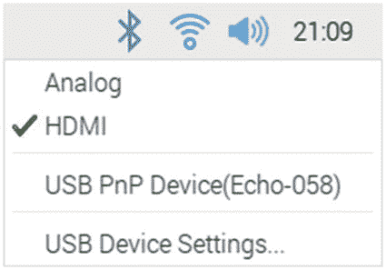
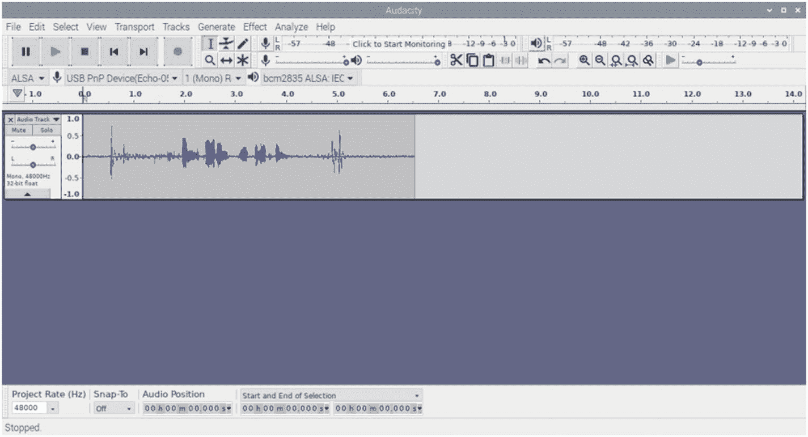
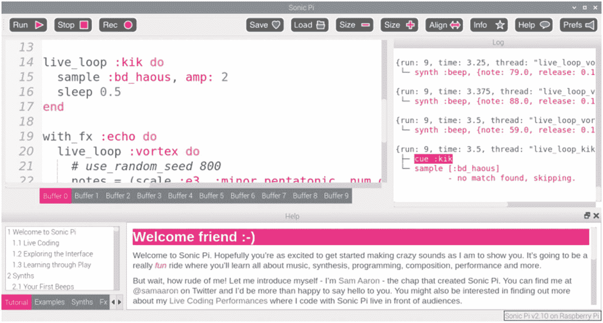

# 八、声音

在游戏中加入声音会增加一个额外的维度，有助于让游戏变得生动。这可以通过添加特殊效果声音或添加背景音乐来设置情绪来实现。你也可以使用声音作为游戏中的一个关键组件。

除了介绍如何通过 Pygame Zero 将音乐添加到游戏中，本章还将介绍创建音效或音乐的方法，以及一些可用于处理声音的工具。

本章从如何创造自己的声音和音乐开始。如果你只是对使用别人创造的音效或音乐感兴趣，你可以跳到这一章的后面，在那里声音被加入到一个 Pygame Zero 游戏中。

## 录制声音效果

对于真实的声音效果，它们通常是通过录制真实的声音来创建的。然而，可能无法记录你在游戏中创造的效果。如果你碰巧没有挑战者坦克，那么你可能需要看一些听起来像坦克的东西，而不是记录一辆真正的坦克。如果你正在创建一个未来的科幻游戏，那么你可能需要看看计算机生成的声音。

即使你能记录下你想要的确切效果，这听起来也不太适合游戏。我关注的一件事是如何创造蒸汽火车的声音。在合理的距离内，我有几条保存铁路，所以我拜访了它们来记录声音。一个问题是，有许多来自人、宠物和周围其他事物(如汽车交通)的额外背景噪音。此外，录制的声音虽然真实，但并不符合您可能期望的声音，也不符合游戏中正在发生的事情。例如，在记录火车的声音时，机车的声音伴随着许多不同的噪音，如车厢叮当作响和车轮摩擦轨道的声音。我发现，通过记录机车脱离火车时的声音，而不是牵引火车时的声音，可以获得更好的声音。

当你想录制声音时，你可能不想带着树莓皮、屏幕和附件。在这种情况下，你可以使用一个便携式录音机，也许是一个移动电话，使用录像机或使用录音工具。如果您已经用手机捕获了合适的音频格式，本文将详细介绍如何使用 Audacity 转换和编辑这些格式。

## 创造人工音效

如果你不能录下真实的声音效果，那么也许可以用家用物品创造一个等效的声音。这里有几个例子:

*   在沙砾铺成的托盘中行走时鞋子发出的嘎吱声。

*   拍击椰子壳发出的马蹄声。

*   基于烟火的爆炸。如果当地法律不允许消费烟花，那么你可以记录一个专业的展示。

*   浴缸里发出的水声。

我在坦克游戏中使用了人工音效。坦克开火的声音是基于爆开一个气球，时间变慢。爆炸的声音是在一次公开的烟火表演中录制的。

您也可以使用 Sonic Pi 之类的音乐创作工具合成创建声音效果。可以使用不同形状的波形和添加音频效果来创建各种声音，尤其适用于科幻类型的效果。

有一些网站提供了如何创建人工音效的示例。这里列出了两个例子，但还有其他例子。

*   epic 声音

*   弗利的艺术——[`www.marblehead.net/foley/specifics.html`](http://www.marblehead.net/foley/specifics.html)

## 在树莓派上录制音频

Raspberry Pi 不包括音频输入。如果你想直接在树莓派上录音，那么你需要一个音频输入设备。最常见的方法是 USB 麦克风(如图 [8-1](#Fig1) 所示)或带有麦克风插座的 USB 音频适配器。


图 8-1

带 USB 麦克风的树莓派

在录制声音之前，您应该通过电视或外部扬声器播放声音来测试音频在 Raspberry Pi 上是否正常工作。aplay 命令可通过以下命令使用:

```py
aplay /usr/share/sounds/alsa/Front_Left.wav
aplay /usr/share/sounds/alsa/Front_Right.wav

```

这些命令通过左右扬声器测试立体声。如果没有声音，则桌面右上角的声音图标提供了模拟(耳机插孔)或 HDMI 的选择。或者，也可以通过终端配置工具进行更改。

```py
sudo raspi-config

```

选择高级选项，然后选择音频，这将提供使用选项

*   汽车

*   力 3.5 毫米(“耳机”)插孔

*   HDMI 电源

### 连接 USB 麦克风

连接麦克风后，您应该从终端运行 dmesg 来查看所连接设备的详细信息。dmesg 工具将显示来自内核环形缓冲区日志的消息。

```py
dmesg

```

在底部，您应该会看到类似于清单 [8-1](#PC4) 中所示消息的条目。

```py
[ 3407.526441] usb 1-1.3: new full-speed USB device number 4 using xhci_hcd
[ 3407.670531] usb 1-1.3: New USB device found, idVendor=0c76, idProduct=1690, bcdDevice= 1.00
[ 3407.670539] usb 1-1.3: New USB device strings: Mfr=0, Product=1, SerialNumber=0
[ 3407.670544] usb 1-1.3: Product: USB PnP Device(Echo-058)
[ 3407.677945] input: USB PnP Device(Echo-058) as /devices/platform/scb/fd500000.pcie/pci0000:00/0000:00:00.0/0000:01:00.0/usb1/1-1/1-1.3/1-1.3:1.2/0003:0C76:1690.0007/input/input15
[ 3407.746906] hid-generic 0003:0C76:1690.0007: input,hidraw3: USB HID v1.00 Device [USB PnP Device(Echo-058)] on usb-0000:01:00.0-1.3/input2
[ 3407.844707] usb 1-1.3: Warning! Unlikely big volume range (=496), cval->res is probably wrong.
[ 3407.844724] usb 1-1.3: [50] FU [Mic Capture Volume] ch = 1, val = 0/7936/16
[ 3407.847365] usbcore: registered new interface driver snd-usb-audio

Listing 8-1Partial output of dmesg showing USB microphone

```

这个例子是使用 Fifine 技术的 USB 麦克风。它使用驱动程序 Echo-058。

右击桌面右上方的声音图标也可以看到设备，如图 [8-2](#Fig2) 所示。



图 8-2

带 USB 麦克风的 Raspberry Pi 声音设置

### 使用记录

连接麦克风后，有几种不同的工具可以用来录音。对于一个简单的命令行工具，标准的 NOOBS 图像中包含了一个记录。

要使用 arecord，通过运行 are cord–l 找到设备，它将给出类似于清单 [8-2](#PC5) 中的输出。

```py
arecord -l
***** List of CAPTURE Hardware Devices ****
card 1: DeviceEcho058 [USB PnP Device(Echo-058)], device 0: USB Audio [USB Audio]
  Subdevices: 1/1
  Subdevice #0: subdevice #0

Listing 8-2Output of arecord –l command

```

卡号(本例中为 1)和设备号(本例中为 0)构成了设备参考的基础，本例中为 hw:1，0。需要使用 plughw 插件；在本例中，设备是 plughw:1，0。

以下命令将创建一个 wav 文件，16 位 little endian，最长持续时间为 60 秒，保存为文件 audiorecord.wav:

```py
arecord -D plughw:1,0 -t wav -f S16_LE -d 60 audiorecord.wav

```

使用命令行的一种替代方法是图形应用 Audacity，这将在下面介绍。

## 大胆

Audacity 是一个强大的工具，可以用来录制和编辑音频。在这里，您将看到如何使用 Audacity 在 Raspberry Pi 上录制音频、转换音频格式、从视频文件中提取音频以及修剪音频文件。

默认情况下，Raspberry Pi 上不包含 Audacity，但是可以使用

```py
sudo apt install audacity

```

这将在“声音和视频”菜单中添加一个选项。对于其他操作系统，可以从 [`www.audacityteam.org`](http://www.audacityteam.org) 下载 Audacity。

程序截图如图 [8-3](#Fig3) 所示。



图 8-3

Audacity 音频编辑器的截图

这里有一些您可能想尝试的事情的建议，这将有助于您熟悉 Audacity 的一些特性。

### 大胆记录声音

Audacity 可以直接从麦克风录音。可以使用图形用户界面选择麦克风、开始录音和停止录音。

*   启动 Audacity，它不会显示任何声音波形。

*   确保选择麦克风作为输入设备(显示在麦克风图标旁边)。

*   点按红色的“录制”按钮，对着麦克风说话或录制附近的声音。

*   停止记录。

*   将音频导出为合适的声音格式(WAV 和 OGG 是在 Pygame Zero 中使用的好格式)。

#### 转换音频格式

Audacity 可以读取多种不同的音频文件格式，然后在导出时将它们转换成另一种格式。这可能是从 MP3 文件或 M4A 文件(通常在手机上使用)转换为 WAV 或 OGG 文件。

*   关闭任何现有项目。

*   使用“文件”菜单中的“打开”加载音频文件。

*   选取“导出”以存储为不同的音频格式。

#### 从视频文件中提取音频

除了读取音频文件，Audacity 还可以从 MP4 和 AVI 等视频格式文件中提取音频。该过程与转换音频格式相同，只是您选择视频作为源，而不是音频文件。

#### 修剪音频文件

通常在创建音频文件时，您会在想要的声音之前和之后有额外的录音。

*   打开音频文件。

*   用鼠标沿着波形选择要调整的部分。

*   按 Delete 键。

*   将更新的声音导出为合适的文件格式。

这已经涵盖了一些有用的特性，但是仅仅触及了 Audacity 的皮毛。它可以处理多个轨道，并提供过滤器，让您应用不同的效果，以声音。

## 用 Sonic Pi 创作音乐

创作音乐有多种选择。Raspberry Pi 中包含的一个有用的工具是 Sonic Pi。

Sonic Pi 是一个基于代码的音乐创作和表演工具。它是为现场音乐表演而设计的，但也可以用来创作音乐，然后用作电脑游戏的背景音乐。界面截图如图 [8-4](#Fig4) 所示。它被认为是一个编程工具，所以在 Raspbian 的编程菜单上。



图 8-4

Sonic Pi 音乐创作工具截图

该程序有几个缓冲文本编辑标签，可以输入代码。代码基于 Ruby，这与 Python 有很大不同。在这本书里不可能详述，但是会给出一个例子来说明如何用它来创作背景音乐。

Sonic Pi 中的音乐通常是使用可在代码中操作的样本创建的。它也可以通过输入音符来使用不同的样本乐器演奏一首曲子。清单 [8-3](#PC8) 中包含了一段示例音乐。

```py
piano_notes = (ring :r, :c4, :e4, :f4, :g4, :r, :r, :r,
               :r, :c4, :e4, :f4, :g4, :r, :r, :r,
               :r, :c4, :e4, :f4, :g4, :e4, :c4, :e4,
               :d4, :r, :r, :e4, :e4, :d4, :c4, :c4,
               :e4, :g4, :g4, :g4, :f4, :r, :r, :e4,
               :f4, :g4, :e4, :c4, :d4, :c4)

live_loop :piano do
  use_synth :piano
  tick
  play piano_notes.look, attack: 0.2, release: 0.1, amp: 0.5
  sleep 0.25
end

Listing 8-3Code to create music in Sonic Pi

```

将代码输入其中一个缓冲区，然后按运行。

这段代码的工作原理是播放存储在数组(列表)中的音符，并在循环中播放。曲子是《圣徒在中行进》的简化版*。这是一首没有任何版权问题的传统歌曲。*

另一个例子显示在清单 [8-4](#PC9) 中，这是一个原创作品，作为在 Sonic Pi 中以不同方式创作音乐的例子。

```py
# Example tune for Sonic-Pi
tune1_notes = (ring :c4, :d4, :e4, :f4, :g4, :f4, :d4, :c3)
dsaw_notes = (ring :e4, :r, :g4, :r, :a4, :b4, :r, :a4, :b4, :r, :d5, :r, :b4, :d5, :r, :b4, :r,  :e4, :r, :g4, :r, :a4, :b4, :r, :a4, :b4, :r, :d5, :r, :b4, :d5, :r, :b4, :r, :g4, :r, :e4, :r, :e4, :r, :e4, :r, :g4, :r)
piano_notes = (ring :r, :f4, :r, :a4, :r, :g4, :r, :b4)

with_fx :reverb, room: 1, mix: 0.3 do
  live_loop :tune1 do
    8.times do
      tick
      play tune1_notes.look, release: 0.1, amp: 0.6
      sleep 0.25
    end
  end
end

with_fx :echo do
  live_loop :dsaw do
    use_synth :mod_dsaw
    play dsaw_notes.look, attack: 0.2, release: 0.1, amp: 0.05
    sleep 0.125
  end
end

with_fx :flanger do
  live_loop :piano do
    use_synth :piano
    play piano_notes.look, attack: 0.2, release: 0.1, amp: 0.5
    sleep 0.125
  end
end

Listing 8-4Another musical tune created in Sonic Pi

```

这使用了三个不同的循环和一些特殊效果。这就产生了一个可以用作游戏背景音乐的曲调。

要将音乐录制为可在 Pygame Zero 中使用的 WAV 文件，请在开始播放音乐前单击录制按钮，然后再次单击录制按钮停止录制，并将其保存为文件。然后，您需要使用 Audacity 在开头或结尾删除任何不想要的沉默。

代码基于 Ruby，这与 Python 非常不同，超出了本书的范围。要了解 Sonic Pi 的更多信息，程序中包含了一个很好的教程。更多细节请看音速小子的左下角。

## 下载免费的声音和音乐

有很多地方可以下载免费的声音和音乐。这些包括现场效果的录音以及免费提供的原创音乐。每当你从这些网站获得声音或音乐时，你需要检查许可证是否允许你的预期用途。

两个流行的音效网站是声音圣经( [`http://soundbible.com/`](http://soundbible.com/) )和 Freesound ( [`https://freesound.org`](https://freesound.org) )。网站上列出的大多数声音效果都有授权许可，这意味着只要你信任创作者，你就可以用于大多数目的。有些样本确实限制声音仅供个人使用，因此您可能需要小心使用。

如果你正在寻找音乐，那么在知识共享网站上有几个链接 [`http://bit.ly/ccmusic1`](http://bit.ly/ccmusic1) 。该网站链接到其他已知有免费音乐的网站，但您需要检查任何使用限制。

## 在 Pygame Zero 中添加音效

创建或下载了合适的音效后，下一步就是将它添加到你的游戏中。声音可以是 WAV 或 OGG 格式。

要在 Pygame Zero 中播放声音，首先创建一个名为 sounds 的新子目录，并将你的声音效果复制到那里。播放声音的命令格式是`sounds`，后跟文件名(没有任何扩展名)和播放等适当的方法。

要播放声音“explode.wav ”,您可以使用

```py
sounds.explode.play()

```

这种方法应该只用于短暂的声音效果。它会将整个声音文件加载到内存中，如果您尝试将它用于较长的音乐文件，可能会对性能产生重大影响。如果你想演奏更长的音乐，请参阅本章后面的“在 Pygame Zero 中演奏音乐”。

我在 sounds 子目录中加入了两个音效，分别叫做 tankfire.wav 和 explode.wav。这两个音效用于为上一章创建的坦克游戏添加一些音效。

要添加坦克炮开火的声音，在游戏状态设置为`'player1fire'`时添加`sounds.tankfire.play()`条目。

```py
            game_state = 'player1fire'
            sounds.tankfire.play()

```

对于炮弹命中时的爆炸，在游戏状态设置为`'game_over_1'`时加上`sounds.explode.play()`。

```py
            game_state = 'game_over_1'
            sounds.explode.play()

```

应对`'player2fire'`和`'game_over_2'`重复此操作。所有需要的文件都包含在提供的源代码中。

## 在 Pygame Zero 中播放音乐

当你需要一些音乐播放更长时间，那么有一个音乐播放器选项。内置的音乐对象提供了通过一次加载一点音轨来播放音乐的能力。它一次只允许播放一首曲目，但可以与声音结合起来，在播放背景音乐的同时产生特殊效果。音乐文件应该存储在名为`music`的目录中。

这是 Pygame Zero 中一个相对较新的特性，并且带有警告。音乐支持取决于计算机系统及其对特定编解码器回放的支持程度。它应该可以处理 MP3、OGG 和 WAV 文件。MP3 音乐无法在某些 Linux 系统上播放，这可能是由于现在已经过期的专利。据报道，OGG 的文件也有问题。看起来 WAV 可能是更安全的选择，尽管这可能只是因为报告的问题较少。WAV 文件是未压缩的，这可能会导致文件很大。

要播放音乐曲目，请调用 music.play 并使用音乐曲目的名称。例如，如果您在音乐目录中保存了一首名为 backing.ogg 的曲目，那么您可以使用

```py
music.play('backing')

```

该曲目将在后台连续播放。如果你只想让音轨播放一次，比如在游戏结束时，那么你可以使用`play_once`方法。

```py
music.play_one('victorymusic')

```

在这两种情况下，它都会停止任何先前的曲目或队列中的任何曲目。如果您想在当前曲目之后添加下一首曲目，那么您可以使用`music.queue`。

可以对音乐进行`stop`、`pause`和`unpause`操作，也可以通过在方法名称前加上音乐对象的`set_volume`来改变音量。

### 用音调创作的钢琴游戏

Pygame Zero 的另一个选择是使用内置的音调发生器播放计算机生成的声音。音调发生器是创建声音的一种有用方法，但它使用合成声音，并且不如使用采样声音创建的声音质量好。在 Pygame Zero 的 1.2 版本中加入，包含在 Raspbian 和 Mu 的最新版本中。它可能无法在一些旧版本上工作。

音调发生器允许您选择音调的音高和持续时间。这些确实需要很短的时间来生成(每个音符几毫秒)，所以最好提前创建。这是通过使用`tone.create`的音高和持续时间来实现的。例如，要演奏中间 C 音(第四个八度音程)，您可以使用

```py
middle_c = tone.create('C4', 0.5)

```

然后使用播放

```py
middle_c.play()

```

为了把它变成一个游戏，我用音调发生器做了一个简单的基于钢琴的游戏。该游戏将允许你使用虚拟键盘播放音乐，并提供一个游戏，玩家按下适当的键来播放一首曲子。截图如图 [8-5](#Fig5) 所示。


图 8-5

钢琴游戏截图

点按任何键都将播放相应的音符。单击“演示”按钮将播放该曲调的演示。单击“开始”将开始游戏；当音符到达目标线时点击正确的键将获得一分。

这个游戏是为树莓派触摸屏设计的。它仍然可以和鼠标一起使用，但是当你需要移动鼠标指针的时候就很难玩了。这个游戏的一个限制是玩家一次只能按一个键。这是 Pygame Zero 的一个限制，不支持多点触控。如果你想使用多点触控，那么你需要看看不同的编程框架，比如 Kivy，但这超出了本书的范围。

完整游戏的代码如清单 [8-5](#PC17) 所示。按钮是使用形状创建的，因此不需要图像或声音文件。

```py
# Piano Game
# Screen resolution based on Raspberry Pi 7" screen
WIDTH = 800
HEIGHT = 410

# Notes are stored as quarter time intervals
# where no note is played use "
# There is no error checking of the tune, all must be valid notes
# When the saints go marching in
tune = [
    ", 'C4', 'E4', 'F4', 'G4', ", ", ", ", 'C4', 'E4', 'F4', 'G4', ", ", ",
    ", 'C4', 'E4', 'F4', 'G4', 'E4', 'C4', 'E4', 'D4', ", ", 'E4', 'E4', 'D4', 'C4', 'C4',
    'E4', 'G4', 'G4', 'G4', 'F4', ", ", 'E4', 'F4', 'G4', 'E4', 'C4', 'D4', 'C4'
    ]

# State allows 'menu' (waiting), 'demo' (play demo), 'game' (game mode), 'gameover' (show score)
state = 'menu'
score = 0

note_start = (50,250)
note_size = (50,160)
# List of notes to include on noteboard
notes_include_natural = ['F3','G3','A3','B3','C4','D4','E4','F4','G4','A4','B4','C5','D5','E5']
# List of sharps (just reference note without sharp)
notes_include_sharp = ['F3','G3','A3','C4','D4','F4','G4','A4','C5','D5']
note_rect_sharp = {}
note_rect_natural = {}
notes_tones = {}

beats_per_minute = 116
# Crotchet is a quarter note
# 1 min div by bpm
time_crotchet = (60/beats_per_minute)
time_note = time_crotchet/2

# how long has elapsed since the last note was started - or a rest
time_since_beat = 0
# The current position that is playing in the list
# A negative number indicates that the notes are shown falling,
# but hasn't reached the play line
note_position = -10

button_demo = Actor("button_demo", (650,40))
button_start = Actor("button_start", (150,40))

# Setup notes
def setup():
    global note_rect_natural, note_rect_sharp, notes_tones
    i = 0
    sharp_width = 2*note_size[0]/3
    sharp_height = 2*note_size[1]/3
    for note_ref in notes_include_natural:
        note_rect_natural[note_ref] = Rect(
            (note_start[0]+(note_size[0]*i),note_start[1]),(note_size)
            )
        # Add note
        notes_tones[note_ref]=tone.create(note_ref, time_note)
        # Is there a sharp note?
        if note_ref in notes_include_sharp:
            note_rect_sharp[note_ref] = Rect(
                (note_start[0]+(note_size[0]*i)+sharp_width, note_start[1]),
                (sharp_width,sharp_height)
                )
            # Create version in Note#Octave eg. C#4
            note_ref_sharp = note_ref[0]+"#"+note_ref[1]
            notes_tones[note_ref_sharp]=tone.create(note_ref_sharp, time_note)
        i+=1

def draw():
    screen.fill('white')
    button_demo.draw()
    button_start.draw()
    draw_piano()
    if (state == 'demo' or state == 'game'):
        draw_notes()
        # draw line for hit point
        screen.draw.line ((50, 220), (WIDTH-50, 220), "black")
    if (state == 'game'):
        screen.draw.text("Score {}".format(score), center=(WIDTH/2,50), fontsize=60,
            shadow=(1,1), color=("black"), scolor="white")
    if (state == 'gameover'):
        screen.draw.text("Game over. Score {}".format(score), center=(WIDTH/2,150), fontsize=60,
            shadow=(1,1), color=("black"), scolor="white")

def draw_notes():
    for i in range (0, 10):
        if (note_position + i < 0):
            continue
        # If no more notes then finish
        if (note_position + i >= len(tune)):
            break
        draw_a_note (tune[note_position+i], i)

# position is how far ahead
# 0 = current_note, 1 = next_note etc.
def draw_a_note(note_value, position):
    if (len(note_value) > 2 and note_value[2] == 's'):
        sharp = True
        note_value = note_value[0:2]
    else:
        sharp = False
    if (position == 0) :
        color = 'green'
    else:
        color = 'black'
    if note_value != ":
        if sharp == False:
            screen.draw.filled_circle((note_rect_natural[note_value].centerx, 220-(15*position)), 10, color)
        else:
            screen.draw.filled_circle((note_rect_sharp[note_value].centerx, 220-(15*position)), 10, color)
            screen.draw.text("#", center=(note_rect_sharp[note_value].centerx+20, 220-(15*position)),
                fontsize=30, color=(color))

def update(time_interval):
    global time_since_beat, note_position, state
    time_since_beat += time_interval
    # Only update when the time since last beat is reached
    if (time_since_beat < time_crotchet):
        return

    # reset timer
    time_since_beat = 0

    if state == 'demo':
        note_position += 1
        if (note_position >= len(tune)):
            note_position = -10
            state = 'menu'
        # Play current note
        if (note_position >= 0 and tune[note_position] != "):
            notes_tones[tune[note_position]].play()

    elif state == 'game':
        note_position += 1
        if (note_position >= len(tune)):
            note_position = -10
            state = 'gameover'

def draw_piano():
    for this_note_rect in note_rect_natural.values() :
        screen.draw.rect(this_note_rect, 'black')
    for this_note_rect in note_rect_sharp.values() :
        screen.draw.filled_rect(this_note_rect, 'black')

def on_mouse_down(pos, button):
    global state, note_position, score
    if (button == mouse.LEFT):
        if button_demo.collidepoint(pos):
            note_position = -10
            state = "demo"
        elif button_start.collidepoint(pos):
            note_position = -10
            state = "game"
        else:
            # First check sharp notes as they overlap the natural keys
            for note_key, note_rect in note_rect_sharp.items():
                if (note_rect.collidepoint(pos)):
                    note_key_sharp = note_key[0]+"#"+note_key[1]
                    if (note_key_sharp == tune[note_position]):
                        score += 1
                    notes_tones[note_key_sharp].play()
                    return
            for note_key, note_rect in note_rect_natural.items():
                if (note_rect.collidepoint(pos)):
                    if (note_key == tune[note_position]):
                        score += 1
                    notes_tones[note_key].play()
                    return

setup()

Listing 8-5Code for Piano Game

```

我不会一行一行地讨论这个问题，但是我会讨论代码如何工作的一些关键部分。

从顶部开始，您会看到屏幕分辨率设置为仅 410 的高度。这是因为 7 寸屏幕减去顶部菜单栏和窗口装饰后的分辨率。

曲调是一个数组，它列出了需要演奏的音符。在这种情况下，这是为了*当圣人在*游行。这种音乐起源于大约 19 世纪末到 20 世纪初。你可以用一首更现代的曲子来代替它，但是在这种情况下，如果你重新发行这个游戏，你需要考虑到版权问题。曲调需要非常简单，因为一次只能演奏一个音符，而且只能演奏四分音符和休止符。在这种情况下，音乐被简化并稍作改动。和弦已被单音符取代，较长音符上的延音被移除。曲子应该还是可以辨认的。音符以基于音符和八度音程的字符串形式存储在列表中，其中 C4 是中音 c。如果有一个升半音，则可以通过在音符和八度音程之间添加#来指示。

还有几个其他变量和两个 Actors，它们表示作为图像创建的两个按钮。速度由`beats_per_minute`的数字决定，然后转换成每一拍之间的时间长度，以秒为单位。在每分钟 116 拍的情况下，这是一分钟内四分音符的数量。这相当于列表中每个条目的每个四分音符之间有 0.51 秒。大约每 0.016 秒调用一次 update 函数，这应该可以提供相当准确的时间。音符持续时间存储在变量`time_note`中，它是音符之间时间的一半，这样如果快速弹奏音符就不会合并。

另一个变量是`note_position`，用来表示当前音符所在数组的位置。变量从–10 开始，因为这允许音符从屏幕顶部落下。只有当`note_position`达到 0 的时候才会播放那个音符(如果玩试玩的话)或者玩家需要点击音符(在游戏中)。变量之后是函数，后面是对`setup`的调用。这是因为这些函数需要在`setup`函数试图使用它们之前加载到内存中。即使对`setup`的调用是文件的最后一行，它仍然在 Pygame Zero 运行更新和绘制函数之前运行。

`setup`函数创建创建键盘所需的`rect`对象，并预加载键盘的所有音符。按键被创建为两个独立的列表，临时记号(升半音和降半音)是黑键，自然键是白键。临时记号在代码中被称为升半音，因为它们是从先前的自然调偏移创建的，所以被命名为 C3 的升半音是 C#3。

将使用的每个音符都使用代码预加载到字典`notes_tones`中

```py
notes_tones[note_ref]=tone.create(note_ref, time_note)

```

这防止了放置票据时的延迟。一旦创建，就可以使用

```py
notes_tones['C3'].play()

```

`draw_piano`函数调用自然键的`screen.draw.rect`和临时键的`screen.draw.filled_rect`。

`on_mouse_down`函数处理按钮上的点击，根据需要将状态设置为演示或游戏。它还检测钢琴键盘上的任何键是否被按下，如果是，它开始演奏音符。如果在游戏模式下，如果正确的键被按下，它会增加分数。

`update`功能检查下一张纸币是否有足够的时间。它使用参数`timer_interval`,该参数给出了自更新函数上次运行以来已经过去的时间。它用这个来跟踪自最后一个音符演奏以来的时间。如果没有到达`time_crotchet`中的时间，那么它从函数返回。如果定时器已经超过该时间，那么它可以更新`note_position`是否处于演示或游戏状态。

`draw`功能显示按钮、键盘和任何需要显示的注释或文本。画一条线作为音符应该何时弹奏的目标。这使用了使用起点和终点坐标的`screen.draw.line`。它还会在游戏中显示分数，并在游戏结束时显示游戏结束消息。

这是一个简单有趣的游戏，但要创建一个可以用来教人弹钢琴的游戏，还需要更多的东西。如前所述，缺乏多点触摸是相当有限的。您仍然可以做一些事情来改进游戏，例如在应该按下按键时点亮按键(通过使用带有适当颜色的 filled_rect)并提供一种改变速度的方法。它也仅限于播放四分音符，这是可以改变的，但需要根据音符的持续时间载入每个音符的多个版本。

## 摘要

本章介绍了在 Sonic Pi 中制作和使用声音和音乐的几种不同方式。这包括使用 Raspberry Pi 作为录音设备，或者转换和编辑其他设备上录制的声音。还介绍了如何使用 Sonic Pi 创建自己的音乐。

然后介绍了通过 Pygame Zero 播放声音的三种不同方式。使用 Sound 对象播放的声音效果、使用 music 对象播放的音乐以及使用 tone 对象播放的音调。

下一章是关于面向对象的编程，展示了使用 Python 创建软件的另一种方法。