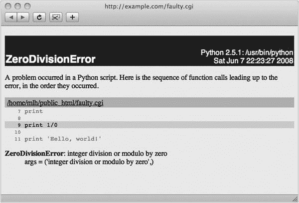
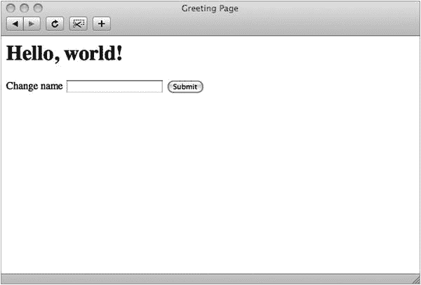

# 15.Python 和 Web

这一章讲述了用 Python 进行 web 编程的一些方面。这是一个非常广阔的领域，但是我选择了三个主要的主题供你娱乐:屏幕抓取、CGI 和 mod_python。

此外，我还会为您提供一些指导，帮助您找到更高级的 web 应用程序和 web 服务开发的合适工具包。有关使用 CGI 的扩展示例，请参见第 [25](25.html) 和 [26](26.html) 章。有关使用特定 web 服务协议 XML-RPC 的示例，请参见第 [27 章](27.html)。

## 屏幕抓取

屏幕抓取是程序下载网页并从中提取信息的过程。这是一种有用的技术，只要在线页面上有您希望在程序中使用的信息，就可以使用这种技术。当然，如果所讨论的网页是动态的，也就是说，如果它随时间而变化，那么它就特别有用。否则，您可以只下载一次，然后手动提取信息。(当然，理想的情况是通过 web 服务获得信息，这将在本章后面讨论。)

从概念上讲，这种技术非常简单。你下载数据并分析它。例如，你可以简单地使用`urllib`，获取网页的 HTML 源代码，然后使用正则表达式(见第 10 章[)或其他技术来提取信息。举例来说，假设您想从 Python Job Board 的](10.html) [`http://python.org/jobs`](http://python.org/jobs) 中提取各种雇主名称和网站。您浏览源代码，发现名称和 URL 可以像这样的链接找到:

```py
<a href="/jobs/1970/">Python Engineer</a>

```

清单 [15-1](#Par7) 显示了一个使用`urllib`和`re`提取所需信息的示例程序。

```py
from urllib.request import urlopen
import re
p = re.compile(’<a href="(/jobs/\\d+)/">(.*?)</a>’)
text = urlopen(’http://python.org/jobs’).read().decode()
for url, name in p.findall(text):
    print(’{} ({})’.format(name, url))
Listing 15-1.A Simple Screen-Scraping Program

```

代码当然可以改进，但它做得很好。然而，这种方法至少有三个缺点。

*   正则表达式不完全可读。对于更复杂的 HTML 代码和更复杂的查询，表达式会变得更复杂，更难维护。
*   它不处理 HTML 的特性，比如 CDATA 部分和字符实体(比如`&amp;`)。如果你遇到这样的野兽，程序将很有可能失败。
*   正则表达式依赖于 HTML 源代码中的细节，而不是一些更抽象的结构。这意味着网页结构的微小变化都会破坏程序。(当你读到这里的时候，它可能已经坏了。)

下面几节讨论了基于正则表达式的方法所带来的问题的两种可能的解决方案。第一种是使用一个名为 Tidy 的程序(作为一个 Python 库)和 XHTML 解析。第二种是用一个叫美汤的库，专门用来刮屏的。

Note

使用 Python 还有其他的屏幕抓取工具。举例来说，你可能会想看看贾平凹的`scrape.py`(在 [`http://zesty.ca/python`](http://zesty.ca/python) 找到的)。

### Tidy 和 XHTML 解析

Python 标准库为解析 HTML 和 XML 等结构化格式提供了大量支持(参见 Python 库参考的“结构化标记处理工具”一节)。我将在第 22 章中更深入地讨论 XML 和 XML 解析。在这一节中，我只向您提供处理 XHTML 所需的工具，XHTML 是 HTML 5 规范描述的两种具体语法之一，它恰好是 XML 的一种形式。所描述的大部分内容应该同样适用于普通的 HTML。

如果每个 web 页面都包含正确有效的 XHTML，那么解析它的工作将会非常简单。问题是更老的 HTML 方言有点草率，有些人甚至不在乎那些草率方言的苛责。原因可能是，大多数 web 浏览器都相当宽容，会尽可能地呈现哪怕是最混乱、最无意义的 HTML。如果页面作者认为这是可以接受的，他们可能会感到满意。不过，这确实让屏幕抓取工作变得更加困难。

在标准库中解析 HTML 的一般方法是基于事件的；您可以编写事件处理程序，在解析器处理数据时调用它们。标准库模块`html.parser`将允许您以这种方式解析非常松散的 HTML，但是如果您想要基于文档结构提取数据(例如第二个二级标题之后的第一项)，您将需要做一些大量的猜测，例如是否有丢失的标签。如果你愿意，当然欢迎你这样做，但是还有另一种方法:整洁。

### 什么是整洁？

Tidy 是一个用于修复格式不良和松散的 HTML 的工具。它可以以一种相当智能的方式修复一系列常见错误，完成许多您可能不愿意自己做的工作。它也是非常可配置的，允许你打开或关闭各种修正。

这是一个充满错误的 HTML 文件的例子，其中一些只是老式的 HTML，还有一些是完全错误的(你能发现所有的问题吗？):

```py
<h1>Pet Shop
<h2>Complaints</h3>

<p>There is <b>no <i>way</b> at all</i> we can accept returned
parrots.

<h1><i>Dead Pets</h1>

<p>Our pets may tend to rest at times, but rarely die within the
warranty period.

<i><h2>News</h2></i>

<p>We have just received <b>a really nice parrot.

<p>It’s really nice.</b>

<h3><hr>The Norwegian Blue</h3>

<h4>Plumage and <hr>pining behavior</h4>
<a href="#norwegian-blue">More information<a>

<p>Features:
<body>
<li>Beautiful plumage

```

以下是 Tidy 修复的版本:

```py
<!DOCTYPE html>
<html>
<head>
<title></title>
</head>
<body>
<h1>Pet Shop</h1>
<h2>Complaints</h2>
<p>There is <b>no <i>way</i></b> <i>at all</i> we can accept
returned parrots.</p>
<h1><i>Dead Pets</i></h1>
<p><i>Our pets may tend to rest at times, but rarely die within the
warranty period.</i></p>
<h2><i>News</i></h2>
<p>We have just received <b>a really nice parrot.</b></p>
<p><b>It’s really nice.</b></p>
<hr>
<h3>The Norwegian Blue</h3>
<h4>Plumage and</h4>
<hr>
<h4>pining behavior</h4>
<a href="#norwegian-blue">More information</a>
<p>Features:</p>
<ul>
<li>Beautiful plumage</li>
</ul>
</body>
</html>

```

当然，Tidy 不能解决一个 HTML 文件的所有问题，但是它确实确保了它的格式良好(也就是说，所有元素都正确嵌套)，这使得解析它变得容易得多。

### 变得整洁

Tidy 库有几个 Python 包装器，哪一个是最新的看起来有点不同。如果您正在使用 pip，您可以使用以下命令查看您的选项:

```py
$ pip search tidy

```

PyTidyLib 是一个不错的选择，您可以按如下方式安装它:

```py
$ pip install pytidylib

```

不过，您不必为这个库安装包装器。如果您运行的是某种 UNIX 或 Linux 机器，那么您很可能有 Tidy 的命令行版本。不管你用的是什么操作系统，你都可以从 Tidy 网站( [`http://html-tidy.org`](http://html-tidy.org) )获得一个可执行的二进制文件。一旦你有了二进制版本，你就可以使用`subprocess`模块(或者一些`popen`函数)来运行 Tidy 程序。例如，假设您有一个名为`messy.html`的混乱的 HTML 文件，并且您的执行路径中有 Tidy 的命令行版本，下面的程序将在其上运行 Tidy 并打印结果:

```py
from subprocess import Popen, PIPE

text = open(’messy.html’).read()
tidy = Popen(’tidy’, stdin=PIPE, stdout=PIPE, stderr=PIPE)

tidy.stdin.write(text.encode())
tidy.stdin.close()

print(tidy.stdout.read().decode())

```

如果`Popen`找不到`tidy`，您可能想要提供可执行文件的完整路径。

实际上，您很可能会从中提取一些有用的信息，而不是打印结果，如下面几节所示。

### 但是为什么是 XHTML 呢？

XHTML 和旧形式 HTML 的主要区别(至少对于我们当前的目的来说)是，XHTML 对显式关闭所有元素非常严格。所以在 HTML 中，你可以通过开始另一个段落来结束一个段落(用一个`<p>`标签)，但是在 XHTML 中，你首先需要明确地结束一个段落(用一个`</p>`标签)。这使得 XHTML 更容易解析，因为您可以直接判断何时进入或离开各种元素。XHTML 的另一个优势(在本章中我不会充分利用)是它是一种 XML 方言，所以你可以在它上面使用各种漂亮的 XML 工具，比如 XPath。(关于 XML 的更多信息，请参见第 22 章；有关 XPath 用法的更多信息，请参见例如 [`http://www.w3schools.com/xml/xml:xpath.asp`](http://www.w3schools.com/xml/xml:xpath.asp) 。)

解析从 Tidy 获得的良好 XHTML 的一个非常简单的方法是使用标准库模块`html.` `parser`中的`HTMLParser`类。

### 使用 HTMLParser

使用`HTMLParser`仅仅意味着对它进行子类化，并覆盖各种事件处理方法，如`handle_starttag`和`handle_data`。表 [15-1](#Tab1) 总结了相关的方法以及它们何时被解析器(自动)调用。

表 15-1。

The HTMLParser Callback Methods

<colgroup><col> <col></colgroup> 
| 回调方法 | 什么时候叫？ |
| --- | --- |
| `handle_starttag(tag, attrs)` | 当发现一个开始标签时，`attrs`是一个由`(name, value)`对组成的序列。 |
| `handle_startendtag(tag, attrs)` | 对于空标签；默认句柄分别开始和结束。 |
| `handle_endtag(tag)` | 当找到结束标签时。 |
| `handle_data(data)` | 对于文本数据。 |
| `handle_charref(ref)` | 对于形式为`&#ref;`的字符引用。 |
| `handle_entityref(name)` | 用于形式为`&name;`的实体引用。 |
| `handle_comment(data)` | 征求意见；仅用注释内容调用。 |
| `handle_decl(decl)` | 用于形式为`<!...>`的声明。 |
| `handle_pi(data)` | 用于处理指令。 |
| `unknown_decl(data)` | 读取未知声明时调用。 |

出于屏幕抓取的目的，您通常不需要实现所有的解析器回调(事件处理程序)，并且您可能不需要构造整个文档的某种抽象表示(比如文档树)来找到您想要的东西。如果你只是跟踪找到你要找的东西所需的最少信息，你就成功了。(参见第 22 章,在用 SAX 解析 XML 的上下文中了解更多关于这个主题的内容。)清单 [15-2](#Par35) 显示了一个解决与清单 [15-1](#Par7) 相同问题的程序，但是这次使用了`HTMLParser`。

```py
from urllib.request import urlopen
from html.parser import HTMLParser

def isjob(url):
    try:
        a, b, c, d = url.split(’/’)
    except ValueError:
        return False
    return a == d == ’’ and b == ’jobs’ and c.isdigit()

class Scraper(HTMLParser):

    in_link = False

    def handle_starttag(self, tag, attrs):
        attrs = dict(attrs)
        url = attrs.get(’href’, ’’)
        if tag == ’a’ and isjob(url):
            self.url = url
            self.in_link = True
            self.chunks = []

    def handle_data(self, data):
        if self.in_link:
            self.chunks.append(data)

    def handle_endtag(self, tag):
        if tag == ’a’ and self.in_link:
            print(’{} ({})’.format(’’.join(self.chunks), self.url))
            self.in_link = False

text = urlopen(’http://python.org/jobs’).read().decode()
parser = Scraper()
parser.feed(text)
parser.close()

Listing 15-2.A Screen-Scraping Program Using the HTMLParser Module

```

有几件事值得注意。首先，我在这里已经放弃了 Tidy 的使用，因为网页中的 HTML 表现得足够好了。如果你幸运的话，你可能会发现你也不需要使用 Tidy。还要注意，我使用了一个布尔状态变量(属性)来跟踪我是否在一个相关的链接中。我在事件处理程序中检查并更新这个属性。其次，`handle_starttag`的`attrs`参数是一个`(key, value)`元组列表，所以我使用了`dict`将它们转换成一个字典，我发现这样更容易管理。

`handle_data`方法(和`chunks`属性)可能需要一些解释。它使用了一种在基于事件的结构化标记(如 HTML 和 XML)解析中很常见的技术。我没有假设我会在对`handle_data`的一次调用中获得我需要的所有文本，而是假设我可能会通过不止一次调用获得几大块文本。这可能有几个原因——缓冲、字符实体、我忽略的标记等等——我只需要确保我得到了所有的文本。然后，当我准备好展示我的结果时(在`handle_endtag`方法中)，我简单地将所有的块`join`在一起。为了实际运行解析器，我用文本调用它的`feed`方法，然后调用它的`close`方法。

与使用正则表达式相比，此类解决方案在某些情况下对输入数据的变化更具鲁棒性。尽管如此，您可能会反对它过于冗长，可能并不比正则表达式更清晰或更容易理解。对于一个更复杂的提取任务，支持这种解析的论点似乎更有说服力，但人们仍然觉得一定有更好的方法。而且，如果你不介意安装另一个模块，有。。。

### 美味的汤

Beautiful Soup 是一个漂亮的小模块，用于解析和剖析你有时在 Web 上找到的那种 HTML 草率且格式不良的那种。引用美汤网站( [`http://crummy.com/software/BeautifulSoup`](http://crummy.com/software/BeautifulSoup) ):

> You didn't write that terrible page. You just want to get some data from it. Beautiful soup is here to help.

下载安装美汤轻而易举。和大多数包一样，可以使用`pip`。

```py
$ pip install beautifulsoup4

```

你可能想做一个`pip search`来看看是否有一个更新的版本。安装了 Beautiful Soup 之后，从 Python Job Board 中提取 Python 作业的运行示例变得非常非常简单，可读性很强，如清单 [15-3](#Par44) 所示。我现在浏览文档的结构，而不是检查 URL 的内容。

```py
from urllib.request import urlopen
from bs4 import BeautifulSoup

text = urlopen(’http://python.org/jobs’).read()
soup = BeautifulSoup(text, ’html.parser’)

jobs = set()
for job in soup.body.section(’h2’):
    jobs.add(’{} ({})’.format(job.a.string, job.a[’href’]))

print(’\n’.join(sorted(jobs, key=str.lower)))

Listing 15-3.A Screen-Scraping Program Using Beautiful Soup

```

我简单地用我想要抓取的 HTML 文本实例化了`BeautifulSoup`类，然后使用各种机制来提取部分结果解析树。例如，我使用`soup.body`获取文档的主体，然后访问它的第一个`section`。我用`’h2’`作为参数调用结果对象，这相当于使用它的`find_all`方法，这给了我一个该部分中所有`h2`元素的集合。每一个都代表一项工作，我对它包含的第一个链接`job.a`感兴趣。`string`属性是它的文本内容，而`a[’href’]`是`href`属性。我相信你已经注意到了，我在清单 [15-3](#Par44) 中添加了`set`和`sorted`(其中`key`函数被设置为忽略大小写差异)。这和美汤无关；这只是为了让程序更有用，通过消除重复和按排序打印名字。

如果你想把你的废料用于一个 RSS 提要(在本章后面讨论)，你可以使用另一个与 Beautiful Soup 相关的工具，叫做 Scrape 'N' Feed(在 [`http://crummy.com/`](http://crummy.com/) `software/ScrapeNFeed`)。

## 使用 CGI 的动态网页

虽然本章的第一部分讨论了客户端技术，但现在我们换个角度来处理服务器端。本节讨论一种基本的 web 编程技术:公共网关接口(CGI)。CGI 是一种标准机制，通过这种机制，web 服务器可以将您的查询(通常通过 web 表单提供)传递给专用程序(例如，您的 Python 程序)并将结果显示为网页。这是一种创建 web 应用程序的简单方法，无需编写自己的专用应用服务器。有关 Python 中 CGI 编程的更多信息，请参见 Python 网站上的 Web 编程主题指南( [`http://wiki.python.org/moin/WebProgramming`](http://wiki.python.org/moin/WebProgramming) )。

Python CGI 编程中的关键工具是`cgi`模块。另一个在 CGI 脚本开发过程中非常有用的模块是`cgitb`——稍后在“用 cgitb 调试”一节中会有更多的介绍

在使你的 CGI 脚本可以通过网络访问(和运行)之前，你需要把它们放在一个网络服务器可以访问它们的地方，添加一个磅命令行，并设置适当的文件权限。这三个步骤将在下面的章节中解释。

### 步骤 1:准备 Web 服务器

我假设你可以访问网络服务器——换句话说，你可以把东西放到网上。通常，就是把你的网页、图片等放在一个特定的目录中(在 UNIX 中，通常称为`public_html`)。如果您不知道如何操作，您应该询问您的互联网服务提供商(ISP)或系统管理员。

Tip

如果您运行的是 macOS，那么 Apache web 服务器是操作系统安装的一部分。它可以通过“系统偏好设置”的“共享”偏好设置面板打开，方法是选中“Web 共享”选项。

如果您只是尝试一下，您可以使用`http.server`模块直接从 Python 运行一个临时 web 服务器。与任何模块一样，可以通过提供带有`-m`开关的 Python 可执行文件来导入和运行它。如果你添加`--cgi`到模块中，结果服务器将支持 CGI。请注意，服务器将在您运行它的目录中提供文件，所以请确保您在那里没有任何秘密。

```py
$ python -m http.server --cgi

Serving HTTP on 0.0.0.0 port 8000 ...

```

如果您现在将浏览器指向`http://127.0.0.1:8000`或`http://localhost:8000`，您应该会看到运行服务器的目录列表。您还应该看到服务器告诉您有关连接的信息。

你的 CGI 程序也必须放在一个可以通过网络访问的目录中。此外，它们必须以某种方式被识别为 CGI 脚本，这样 web 服务器就不只是将普通的源代码作为网页来提供。有两种典型的方法可以做到这一点:

*   将脚本放在名为`cgi-bin`的子目录中。
*   给你的脚本文件扩展名`.cgi`。

具体的工作方式因服务器而异，同样，如果您有疑问，请咨询您的 ISP 或系统管理员。(例如，如果您正在使用 Apache，您可能需要打开相关目录的`ExecCGI`选项。)如果你正在使用来自`http.server`模块的服务器，你应该使用一个`cgi-bin`子目录。

### 步骤 2:添加磅爆炸线

当您将脚本放在正确的位置时(可能会给它指定一个特定的文件扩展名)，您必须在脚本的开头添加一个井号。我在第 [1](01.html) 章中提到过，这是一种执行脚本的方式，不需要显式执行 Python 解释器。通常，这只是方便，但对于 CGI 脚本来说，这是至关重要的——没有它，web 服务器就不知道如何执行你的脚本。(据我所知，该脚本可以用其他编程语言编写，比如 Perl 或 Ruby。)一般来说，只需在脚本的开头添加以下行即可:

```py
#!/usr/bin/env python

```

请注意，它必须是第一行。(前面没有空行。)如果这不起作用，您需要找出 Python 可执行文件的确切位置，并在磅爆炸行中使用完整路径，如下所示:

```py
#!/usr/bin/python

```

如果你同时安装了 Python 2 和 3，你可能需要使用`python3`来代替。(这也可能与前面显示的`env`解决方案一起使用。)如果还是不行，那可能是你看不到的地方出了问题，也就是说，这条线以`\r\n`结尾，而不是简单的`\n`，你的网络服务器被弄糊涂了。确保您将文件保存为纯 UNIX 样式的文本文件。

在 Windows 中，使用 Python 二进制文件的完整路径，如下例所示:

```py
#!C:\Python36\python.exe

```

### 步骤 3:设置文件权限

您需要做的最后一件事(至少如果您的 web 服务器运行在 UNIX 或 Linux 机器上)是设置适当的文件权限。您必须确保每个人都被允许读取和执行您的脚本文件(否则 web 服务器将无法运行它)，但也要确保只有您被允许写入它(因此没有人可以更改您的脚本)。

Tip

有时，如果您在 Windows 中编辑一个脚本，并且它存储在 UNIX 磁盘服务器上(例如，您可能通过 Samba 或 FTP 访问它)，在您对脚本进行更改后，文件权限可能会出错。因此，如果您的脚本无法运行，请确保权限仍然正确。

改变文件权限(或文件模式)的 UNIX 命令是`chmod`。简单地运行下面的命令(如果你的脚本叫做`somescript.cgi`)，使用你的普通用户帐户，或者一个专门为这样的 web 任务设置的帐户。

```py
chmod 755 somescript.cgi

```

完成所有这些准备工作后，您应该能够像打开网页一样打开脚本并执行它。

Note

您不应该在浏览器中将脚本作为本地文件打开。你必须用一个完整的 HTTP URL 打开它，这样你就可以通过网络(通过你的网络服务器)获取它。

你的 CGI 脚本通常不允许修改你电脑上的任何文件。如果您想允许它更改文件，您必须明确地授予它这样做的权限。你有两个选择。如果您有 root(系统管理员)权限，您可以为您的脚本创建一个特定的用户帐户，并更改需要修改的文件的所有权。如果您没有 root 访问权限，您可以设置该文件的文件权限，这样系统上的所有用户(包括 web 服务器用来运行 CGI 脚本的用户)都可以写入该文件。您可以使用以下命令设置文件权限:

```py
chmod 666 editable_file.txt

```

Caution

使用文件模式 666 有潜在的安全风险。除非你知道自己在做什么，否则最好避开。

### CGI 安全风险

一些安全问题与使用 CGI 程序有关。如果你允许你的 CGI 脚本写入你服务器上的文件，这种能力可能会被用来破坏数据，除非你仔细地编写你的程序。类似地，如果您评估用户提供的数据，就好像它是 Python 代码(例如，用`exec`或`eval`)或 shell 命令(例如，用`os.system`或使用`subprocess`模块)，您就冒着执行任意命令的风险，这是一个巨大的风险。即使使用用户提供的字符串作为 SQL 查询的一部分也是有风险的，除非您非常小心地首先清理该字符串；所谓的 SQL 注入是攻击或闯入系统的一种常见方式。

### 一个简单的 CGI 脚本

最简单的 CGI 脚本类似于清单 [15-4](#Par77) 。

```py
#!/usr/bin/env python

print(’Content-type: text/plain’)
print() # Prints an empty line, to end the headers

print(’Hello, world!’)

Listing 15-4.A Simple CGI Script

```

如果你把它保存在一个名为`simple1.cgi`的文件中，并通过你的网络服务器打开它，你应该会看到一个只包含“Hello，world！”以纯文本格式。为了能够通过 web 服务器打开此文件，您必须将它放在 web 服务器可以访问的地方。在典型的 UNIX 环境中，将它放在主目录中名为`public_html`的目录下，您就可以用 URL `http://localhost/∼username/simple1.cgi`打开它(用您的用户名代替`username`)。有关详细信息，请咨询您的 ISP 或系统管理员。如果你使用的是`cgi-bin`目录，你也可以称之为类似于`simple1.py`的东西。

如您所见，程序写入标准输出的所有内容(例如，用`print`)最终都会出现在结果网页中——至少是几乎所有内容。事实上，您首先打印的是 HTTP 头，它是关于页面的信息行。这里我唯一关心的头球是`Content-type`。正如您所看到的，短语`Content-type`后面是一个冒号、一个空格和类型名`text/plain`。这表明该页面是纯文本的。为了表示 HTML，这一行应该如下所示:

```py
print(’Content-type: text/html’)

```

打印完所有标题后，会打印一个空行，表示文档本身即将开始。如您所见，在这种情况下，文档只是字符串`’Hello, world!’`。

### 使用 cgitb 调试

有时，编程错误会使您的程序因未捕获的异常而终止，并出现堆栈跟踪。当通过 CGI 运行程序时，这很可能会导致 web 服务器发出无用的错误消息，甚至可能只是一个黑色页面。如果您可以访问服务器日志(例如，如果您正在使用`http.server`)，您可能会从那里获得一些信息。为了帮助你调试 CGI 脚本，标准模块包含了一个有用的模块，叫做`cgitb`(用于 CGI 回溯)。通过导入它并调用它的`enable`函数，你可以得到一个非常有用的网页，上面有关于哪里出错的信息。清单 [15-5](#Par83) 给出了一个如何使用`cgitb`模块的例子。

```py
#!/usr/bin/env python

import cgitb; cgitb.enable()

print(’Content-type: text/html\n’)

print(1/0)

print(’Hello, world!’)

Listing 15-5.A CGI Script That Invokes a Traceback (faulty.cgi)

```

在浏览器中(通过 web 服务器)访问该脚本的结果如图 [15-1](#Fig1) 所示。



图 15-1。

A CGI traceback from the cgitb module

请注意，在开发完程序后，您可能想要关闭`cgitb`功能，因为回溯页面不是为程序的临时用户准备的。[<sup>1</sup>T4】](#Fn1)

### 使用 cgi 模块

到目前为止，这些程序只产生了输出；他们没有使用任何形式的输入。输入作为键值对或字段从 HTML 表单(在下一节中描述)提供给 CGI 脚本。您可以使用来自`cgi`模块的`FieldStorage`类在 CGI 脚本中检索这些字段。当您创建您的`FieldStorage`实例(您应该只创建一个)时，它从请求中获取输入变量(或字段),并通过类似字典的接口将它们呈现给您的程序。可以通过普通的键查找来访问`FieldStorage`的值，但是由于一些技术上的问题(与文件上传有关，我们在这里不讨论)，所以`FieldStorage`的元素并不是您真正想要的值。例如，如果您知道请求包含一个名为`name`的值，您不能简单地这样做:

```py
form = cgi.FieldStorage()
name = form[’name’]

```

您需要这样做:

```py
form = cgi.FieldStorage()
name = form[’name’].value

```

获取值的一个稍微简单的方法是`getvalue`方法，它类似于字典方法`get`，除了它返回项目的`value`属性的值。这里有一个例子:

```py
form = cgi.FieldStorage()
name = form.getvalue(’name’, ’Unknown’)

```

在前面的例子中，我提供了一个默认值(`’Unknown’`)。如果不提供，默认为`None`。如果字段未填写，则使用默认值。

清单 [15-6](#Par95) 包含了一个使用`cgi.FieldStorage`的简单例子。

```py
#!/usr/bin/env python

import cgi
form = cgi.FieldStorage()

name = form.getvalue(’name’, ’world’)

print(’Content-type: text/plain\n’)

print(’Hello, {}!’.format(name))

Listing 15-6.A CGI Script That Retrieves a Single Value from a FieldStorage (simple2.cgi)

```

Invoking CGI Scripts Without Forms

CGI 脚本的输入通常来自已经提交的 web 表单，但是也可以直接用参数调用 CGI 程序。要做到这一点，可以在脚本的 URL 后面添加一个问号，然后添加由&符号分隔的键值对。例如，如果清单 [15-6](#Par95) 中脚本的 URL 是 [`http://www.example.com/simple2.cgi`](http://www.example.com/simple2.cgi) ，您可以用 URL [`http://www.example.com/simple2.cgi?name=Gumby&age=42`](http://www.example.com/simple2.cgi?name=Gumby%26age=42) 用`name=Gumby and age=42`调用它。如果您尝试这样做，您应该会收到消息“你好，Gumby！”而不是“你好，世界！”来自你的 CGI 脚本。(注意没有使用`age`参数。)您可以使用`urllib.parse`模块的`urlencode`方法来创建这种 URL 查询:

```py
>>> urlencode({’name’: ’Gumby’, ’age’: ’42’})
’age=42&name=Gumby’

```

你可以在自己的程序中使用这个策略，和`urllib`一起，创建一个可以和 CGI 脚本交互的屏幕抓取程序。然而，如果您正在编写这样一个装置的两端(即服务器端和客户端),您很可能会更好地使用某种形式的 web 服务(如本章“Web 服务:正确抓取”一节中所述)。

### 简单的形式

现在您有了处理用户请求的工具；是时候创建一个用户可以提交的表单了。该表单可以是一个单独的页面，但我将把它放在同一个脚本中。

要了解更多关于编写 HTML 表单(或一般的 HTML)的知识，您可能需要一本关于 HTML 的好书(您当地的书店可能有几本)。你也可以在网上找到大量关于这个主题的信息。和往常一样，如果您发现某个页面看起来像是您想要做的事情的一个很好的示例，您可以在浏览器中检查它的源代码，方法是从其中一个菜单中选择“查看源代码”或类似的内容(取决于您使用的浏览器)。

Note

从 CGI 脚本中获取信息有两种主要方法:GET 方法和 POST 方法。就本章的目的而言，两者之间的区别并不重要。基本上，GET 是为了检索东西，并在 URL 中编码它的查询；POST 可以用于任何类型的查询，但是对查询的编码稍有不同。

让我们回到我们的剧本。在清单 [15-7](#Par103) 中可以找到一个扩展版本。

```py
#!/usr/bin/env python

import cgi
form = cgi.FieldStorage()

name = form.getvalue(’name’, ’world’)

print("""Content-type: text/html

<html>
  <head>
    <title>Greeting Page</title>
  </head>
  <body>
    <h1>Hello, {}!</h1>

    <form action=’simple3.cgi’>
    Change name <input type=’text’ name=’name’ />
    <input type=’submit’ />
    </form>
  </body>
</html>
""".format(name))

Listing 15-7.A Greeting Script with an HTML Form (simple3.cgi)

```

在这个脚本的开始，CGI 参数`name`被检索，和以前一样，默认为`’world’`。如果您只是在浏览器中打开脚本，而没有提交任何内容，则使用默认设置。

然后打印一个简单的 HTML 页面，包含`name`作为标题的一部分。此外，该页面包含一个 HTML 表单，其`action`属性被设置为脚本本身的名称(`simple3.cgi`)。这意味着，如果表单被提交，您将返回到相同的脚本。表单中唯一的输入元素是一个名为`name`的文本字段。因此，如果你提交一个新名字的字段，标题应该会改变，因为`name`参数现在有了一个值。

图 [15-2](#Fig2) 显示了通过 web 服务器访问清单 [15-7](#Par103) 中的脚本的结果。



图 15-2。

The result of executing the CGI script in Listing [15-7](#Par103)

## 使用 Web 框架

大多数人不会直接为任何严肃的 web 应用编写 CGI 脚本；相反，他们使用一个 web 框架，为你做了很多繁重的工作。有很多这样的框架可用，我将在后面提到其中的一些—但是现在，让我们坚持使用一个非常简单但是非常有用的框架，叫做 Flask ( [`http://flask.pocoo.org`](http://flask.pocoo.org) )。使用`pip`很容易安装。

```py
$ pip install flask

```

假设你写了一个计算 2 的幂的令人兴奋的函数。

```py
def powers(n=10):
    return ’, ’.join(str(2**i) for i in range(n))

```

现在你想把这个杰作公之于众！要用 Flask 做到这一点，首先用适当的名称实例化`Flask`类，并告诉它哪个 URL 路径对应于您的函数。

```py
from flask import Flask
app = Flask(__name__)

@app.route(’/’)
def powers(n=10):
    return ’, ’.join(str(2**i) for i in range(n))

```

如果您的脚本名为`powers.py`，您可以让 Flask 如下运行它(假设是 UNIX 风格的 shell):

```py
$ export FLASK_APP=powers.py
$ flask run
 * Serving Flask app "powers"
 * Running on http://127.0.0.1:5000/ (Press CTRL+C to quit)

```

最后两行是 Flask 的输出。如果在浏览器中输入 URL，应该会看到从`powers`返回的字符串。您还可以为您的函数提供一个更具体的路径。例如，如果您使用`route(’/powers’)`而不是`route(’/’)`，该功能将在`http://127.0.0.1:5000/powers`可用。然后，您可以设置多个函数，每个函数都有自己的 URL。

你甚至可以为你的函数提供参数。您使用尖括号来指定参数，因此您可能会使用`’/powers/<n>’`，例如。您在斜杠后指定的任何内容都将作为名为`n`的关键字参数提供。它将是一个字符串，在我们的例子中，我们需要一个整数。我们可以通过使用`route(’/powers/<int:n>’)`来添加这个转换。然后，重启 Flask 后，如果访问 URL `http://127.0.0.1:5000/powers/3`，应该会得到输出`1, 2, 4`。

Flask 还有很多其他特性，它的文档可读性很强。如果您想尝试简单的服务器端 web 应用程序开发，我推荐您看一看。

### 其他 Web 应用程序框架

有许多其他的 web 框架可供使用，有大有小。有些是相当模糊的，而另一些有专门的定期会议。表 [15-2](#Tab2) 中列出了一些流行的；要获得更全面的列表，您应该查阅 Python 网页( [`https://wiki.python.org/moin/WebFrameworks`](https://wiki.python.org/moin/WebFrameworks) )。

表 15-2。

Python Web Application Frameworks

<colgroup><col> <col></colgroup> 
| 名字 | 网站 |
| --- | --- |
| Django | [T2`https://djangoproject.com`](https://djangoproject.com) |
| 涡轮齿轮 | [T2`http://turbogears.org`](http://turbogears.org) |
| web2py | [T2`http://web2py.com`](http://web2py.com) |
| 神交 | [T2`https://pypi.python.org/pypi/grok`](https://pypi.python.org/pypi/grok) |
| Zope2 | [T2`https://pypi.python.org/pypi/Zope2`](https://pypi.python.org/pypi/Zope2) |
| 金字塔 | [T2`https://trypyramid.com`](https://trypyramid.com) |

## Web 服务:抓取正确

Web 服务有点像计算机友好的网页。它们基于使程序能够通过网络交换信息的标准和协议，通常一个程序(客户机或服务请求者)请求一些信息或服务，另一个程序(服务器或服务提供者)提供这些信息或服务。是的，这是显而易见的东西，它似乎也非常类似于在第 [14](14.html) 章中讨论的网络编程，但是有区别。

Web 服务通常在相当高的抽象层次上工作。他们使用 HTTP(“Web 的协议”)作为底层协议。除此之外，它们使用更多面向内容的协议，比如某种 XML 格式来编码请求和响应。这意味着 web 服务器可以是 web 服务的平台。正如这一部分的标题所示，这是网络抓取的另一个层次。您可以将 web 服务看作是为计算机化的客户端设计的动态网页，而不是供人使用的。

web 服务的标准在捕捉各种复杂性方面走得很远，但是你也可以用绝对的简单来完成很多事情。在这一节中，我只对这个主题做了一个简单的介绍，并提供了一些在哪里可以找到您可能需要的工具和信息的提示。

Note

由于有许多实现 web 服务的方法，包括大量的协议，并且每个 web 服务系统可能提供几个服务，所以有时有必要以一种客户机可以自动解释的方式来描述一个服务，也就是说一个元服务。这种描述的标准是 Web 服务描述语言(WSDL)。WSDL 是一种 XML 格式，它描述了诸如哪些方法可以通过服务使用，以及它们的参数和返回值。除了实际的服务协议(如 SOAP)之外，许多(如果不是大多数)web 服务工具包还将包括对 WSDL 的支持。

### RSS 和朋友

RSS 代表 Rich Site Summary、RDF Site Summary 或 Really Simple Syndication(取决于版本号),其最简单的形式是用 XML 列出新闻条目的格式。让 RSS 文档(或提要)比简单的静态文档更像一种服务的是，它们应该定期(或不定期)更新。它们甚至可以被动态地计算，表示例如对博客等的最新添加。一种更新的格式是 Atom。有关 RSS 及其相关资源描述框架(RDF)的信息，请参见 [`http://www.w3.org/RDF`](http://www.w3.org/RDF) 。原子的规格见 [`http://tools.ietf.org/html/rfc4287`](http://tools.ietf.org/html/rfc4287) 。

有很多 RSS 阅读器，它们通常也可以处理其他格式，比如 Atom。因为 RSS 格式非常容易处理，所以开发人员不断为它开发新的应用程序。例如，一些浏览器(比如 Mozilla Firefox)会让你为一个 RSS 订阅源添加书签，然后给你一个动态书签子菜单，把单个新闻条目作为菜单项。RSS 也是播客的主干；播客本质上是一个列出声音文件的 RSS 提要。

问题是，如果您想编写一个处理来自几个站点的提要的客户端程序，您必须准备好解析几种不同的格式，甚至可能需要解析提要的各个条目中的 HTML 片段。尽管您可以使用`BeautifulSoup`(或者它的一个面向 XML 的版本)来解决这个问题，但是使用 Mark Pilgrim 的通用提要解析器( [`https://pypi.python.org/pypi/feedparser`](https://pypi.python.org/pypi/feedparser) )可能是一个更好的主意，它可以处理几种提要格式(包括 RSS 和 Atom，以及一些扩展)，并支持某种程度的内容清理。Pilgrim 还写过一篇有用的文章，“不惜一切代价解析 RSS”([`http://xml.com/pub/a/2003/01/22/dive-into-xml.html`](http://xml.com/pub/a/2003/01/22/dive-into-xml.html))，以防你想自己处理一些清理工作。

### 使用 XML-RPC 的远程过程调用

在 RSS 简单的下载和解析机制之外，还有远程过程调用。远程过程调用是基本网络交互的抽象。你的客户程序要求服务器程序执行一些计算并返回结果，但是这都被伪装成一个简单的过程(或者函数或者方法)调用。在客户端代码中，看起来像是调用了一个普通的方法，但是调用它的对象实际上完全驻留在不同的机器上。这种过程调用最简单的机制可能是 XML-RPC，它通过 HTTP 和 XML 实现网络通信。因为该协议与语言无关，所以用一种语言编写的客户机程序很容易调用用另一种语言编写的服务器程序上的函数。

Tip

试着在网上搜索一下，为 Python 找到许多其他的 RPC 选项。

Python 标准库包括对客户端和服务器端 XML-RPC 编程的支持。有关使用 XML-RPC 的示例，请参见第 [27 章](27.html)和第 [28 章](28.html)。

RPC and REST

尽管这两种机制非常不同，但是远程过程调用可以与网络编程中所谓的代表性状态传输风格(通常称为 REST)相比较。基于 REST(或 RESTful)的程序也允许客户端以编程方式访问服务器，但是服务器程序被认为没有任何隐藏状态。返回的数据由给定的 URL 唯一确定(或者，在 HTTP POST 的情况下，由客户端提供的附加数据)。

更多关于 REST 的信息可以在网上找到。例如，你可以从维基百科上的文章开始，在 [`http://en.wikipedia.org/wiki/Representational_State_Transfer`](http://en.wikipedia.org/wiki/Representational_State_Transfer) 。在 RESTful 编程中经常使用的一个简单而优雅的协议是 JavaScript Object Notation，或 JSON ( [`http://www.json.org`](http://www.json.org) )，它允许您以纯文本格式表示复杂的对象。您可以在`json`标准库模块中找到对 JSON 的支持。

### 肥皂

SOAP [<sup>2</sup>](#Fn2) 也是一种交换消息的协议，以 XML 和 HTTP 为底层技术。像 XML-RPC 一样，SOAP 支持远程过程调用，但是 SOAP 规范比 XML-RPC 的规范复杂得多。SOAP 是异步的，支持关于路由的元请求，并且有一个复杂的类型系统(与 XML-RPC 简单的固定类型集相反)。

Python 没有单一的标准 SOAP 工具包。你可能要考虑扭曲( [`http://twistedmatrix.com`](http://twistedmatrix.com) )、ZSI ( [`http://pywebsvcs.sf.net`](http://pywebsvcs.sf.net) )或者索比( [`http://soapy.sf.net`](http://soapy.sf.net) )。有关 SOAP 格式的更多信息，请参见 [`http://www.w3.org/TR/soap`](http://www.w3.org/TR/soap) 。

## 快速总结

以下是本章所涵盖主题的摘要:

*   屏幕抓取:这是自动下载网页并从中提取信息的做法。Tidy 程序及其库版本是在使用 HTML 解析器之前修复不良 HTML 的有用工具。另一个选择是使用漂亮的汤，它对杂乱的输入非常宽容。
*   CGI:公共网关接口是一种创建动态网页的方法，它通过让一个 web 服务器运行并与你的程序通信来显示结果。`cgi`和`cgitb`模块对于编写 CGI 脚本很有用。CGI 脚本通常从 HTML 表单中调用。
*   Flask:一个简单的 web 框架，可以让你将代码发布为 web 应用程序，而不用太担心 web 部分的事情。
*   Web 应用程序框架:对于用 Python 开发大型复杂的 web 应用程序，web 应用程序框架几乎是必不可少的。对于更简单的项目，Flask 是一个不错的选择。对于较大的项目，您可能想考虑像 Django 或 TurboGears 这样的东西。
*   Web 服务:Web 服务对于程序就像(动态)网页对于人一样。您可能会将它们视为在更高的抽象层次上进行网络编程的一种方式。常见的 web 服务标准有 RSS(及其相关的 RDF 和 Atom)、XML-RPC 和 SOAP。

### 本章的新功能

<colgroup><col> <col></colgroup> 
| 功能 | 描述 |
| --- | --- |
| `cgitb.enable()` | 在 CGI 脚本中启用回溯 |

### 现在怎么办？

我相信你已经通过运行程序测试了你写的程序。在下一章，你将学习如何真正地测试它们——彻底地、有条不紊地，甚至可能是着迷地(如果你幸运的话)。

Footnotes [1](#Fn1_source)

另一种方法是关闭显示器，将错误记录到文件中。有关详细信息，请参阅 Python 库参考。

  [2](#Fn2_source)

虽然这个名称曾经代表简单对象访问协议，但现在已经不是了。现在只是肥皂。