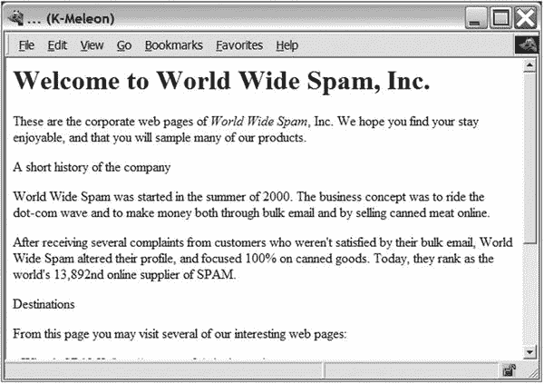
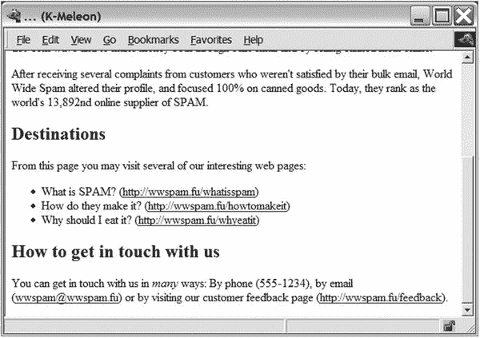

# 二十、项目 1：即时标记

在这个项目中，您将看到如何使用 Python 出色的文本处理功能，包括使用正则表达式将纯文本文件转换成用 HTML 或 XML 等语言标记的文件。如果你想在一个需要标记内容的系统中使用不懂这些语言的人写的文本，你需要这样的技能。

不会说流利的 XML？不要担心这个——如果你对 HTML 只是一知半解，你在这一章会做得很好。如果你需要 HTML 入门，你可以在网上找到大量的教程。有关 XML 使用的示例，请参见第 22 章。

让我们从实现一个简单的原型开始，它完成基本的处理，然后扩展这个程序，使标记系统更加灵活。

## 有什么问题？

您想给纯文本文件添加一些格式。假设您从一个不喜欢用 HTML 编写的人那里得到了一个文件，您需要将该文档用作网页。您希望程序自动添加所有必要的标签，而不是手动添加。

Note

近年来，这种“纯文本标记”实际上已经变得相当普遍，可能主要是因为具有纯文本界面的 wiki 和博客软件的激增。有关更多信息，请参见本章末尾的“进一步探索”一节。

你的任务基本上就是对各种文本元素进行分类，比如标题和强调的文字，然后清晰地标注出来。在这里解决的具体问题中，您将 HTML 标记添加到文本中，这样得到的文档就可以在 web 浏览器中显示并用作网页。然而，一旦构建了基本引擎，就没有理由不能添加其他类型的标记(比如各种形式的 XML 或者 LATEX 代码)。在分析一个文本文件之后，您甚至可以执行其他任务，比如提取所有的标题来制作一个目录。

Note

LATEX 是另一种标记系统(基于 TEX 排版程序),用于创建各种类型的技术文档。我在这里提到它只是作为你的程序的其他用途的一个例子。如果您想了解更多，您可以访问 TEX 用户组网站 [`http://www.tug.org`](http://www.tug.org) 。

给你的文本可能包含一些线索(比如被标记为`*like this*`的强调文本)，但是你可能需要一些独创性来让你的程序猜测文档是如何构造的。

在开始写你的原型之前，让我们定义一些目标。

*   不应该要求输入包含人工代码或标签。
*   您应该能够处理不同的块，如标题、段落和列表项，以及行内文本，如强调文本或 URL。
*   尽管这个实现处理的是 HTML，但是它应该很容易扩展到其他标记语言。

在你的程序的第一个版本中，你可能无法完全达到这些目标，但这就是原型的意义所在。你写原型是为了在你最初的想法中寻找缺陷，并学习如何写一个程序来解决你的问题。

Tip

如果可以的话，逐步修改你的原始程序可能是个好主意，而不是从头开始。为了清楚起见，我在这里给你程序的两个完全不同的版本。

## 有用的工具

考虑一下写这个程序可能需要什么工具。

*   你当然需要读写文件(见第 [11 章](11.html))，或者至少从标准输入(`sys.stdin`)中读取并用`print`输出。
*   你可能需要迭代输入的行(见第 [11](11.html) 章)。
*   你需要一些字符串方法(见第 [3](03.html) 章)。
*   也许你会使用一两个发电机(见第 9 章)。
*   你可能需要`re`模块(见第 [10 章](10.html))。

如果这些概念中的任何一个对你来说是陌生的，你也许应该花一点时间来刷新你的记忆。

## 准备

在你开始编码之前，你需要一些方法来评估你的进展；你需要一个测试套件。在这个项目中，一个简单的测试就足够了:一个测试文档(纯文本)。清单 [20-1](#Par23) 包含您想要自动标记的示例文本。

```py
Welcome to World Wide Spam, Inc.

These are the corporate web pages of *World Wide Spam*, Inc. We hope
you find your stay enjoyable, and that you will sample many of our
products.

A short history of the company

World Wide Spam was started in the summer of 2000\. The business
concept was to ride the dot-com wave and to make money both through
bulk email and by selling canned meat online.

After receiving several complaints from customers who weren't
satisfied by their bulk email, World Wide Spam altered their profile,
and focused 100% on canned goods. Today, they rank as the world's
13,892nd online supplier of SPAM.

Destinations

From this page you may visit several of our interesting web pages:

  - What is SPAM? (http://wwspam.fu/whatisspam)

  - How do they make it? (http://wwspam.fu/howtomakeit)

  - Why should I eat it? (http://wwspam.fu/whyeatit)

How to get in touch with us

You can get in touch with us in *many* ways: By phone (555-1234), by
email (wwspam@wwspam.fu) or by visiting our customer feedback page
(http://wwspam.fu/feedback).

Listing 20-1.A Sample Plain-Text Document (test_input.txt)

```

要测试您的实现，只需使用这个文档作为输入并在 web 浏览器中查看结果，或者直接检查添加的标签。

Note

拥有自动化测试套件通常比手动检查测试结果更好。(你有没有看到任何自动化测试的方法？)

## 首次实施

你需要做的第一件事是将文本分成段落。从清单 [20-1](#Par23) 中可以明显看出，段落由一个或多个空行分隔。一个比段落更好的词可能是 block，因为这个名字也适用于标题和列表项。

### 查找文本块

找到这些块的一个简单方法是收集你遇到的所有行，直到你找到一个空行，然后返回你到目前为止收集的行。那会是一个街区。然后，你可以从头再来。不需要费心收集空行，也不会返回空块(遇到不止一个空行的地方)。此外，您应该确保文件的最后一行是空的；否则你不知道最后一块什么时候完成。(当然，还有其他方法可以发现。)

清单 [20-2](#Par29) 展示了这种方法的实现。

```py
def lines(file):
    for line in file: yield line
    yield '\n'

def blocks(file):
    block = []
    for line in lines(file):
        if line.strip():
            block.append(line)
        elif block:
            yield ''.join(block).strip()
            block = []

Listing 20-2.A Text Block Generator
(util.py)

```

生成器只是一个小工具，它在文件末尾添加一个空行。`blocks`生成器实现了所描述的方法。当产生一个块时，它的行被连接起来，产生的字符串被剥离，得到一个表示该块的单个字符串，两端多余的空格(如列表缩进或换行符)被删除。(如果你不喜欢这种找段落的方式，我相信你可以想出其他几种方法。看看你能发明多少可能会很有趣。)我已经将代码放在了文件`util.py`中，这意味着您可以稍后在您的程序中导入实用程序生成器。

### 添加一些标记

使用清单 [20-2](#Par29) 中的基本功能，您可以创建一个简单的标记脚本。该程序的基本步骤如下:

1.  打印一些开始标记。
2.  对于每个块，打印包含在段落标记中的块。
3.  打印一些结束标记。

这不是很难，但也不是非常有用。假设您没有将第一个块包含在段落标记中，而是将它包含在顶部标题标记(`h1`)中。此外，您可以用强调文本(使用`em`标签)替换星号中的任何文本。至少这样更有用一点。给定`blocks`函数并使用`re.sub`，代码非常简单。见清单 [20-3](#Par36) 。

```py
import sys, re
from util import *

print('<html><head><title>...</title><body>')

title = True
for block in blocks(sys.stdin):
    block = re.sub(r'\*(.+?)\*', r'<em>\1</em>', block)
    if title:
        print('<h1>')
        print(block)
        print('</h1>')
        title = False
    else:
        print('<p>')
        print(block)
        print('</p>')

print('</body></html>')

Listing 20-3.A Simple Markup Program (simple_markup.py)

```

该程序可以对样本输入执行如下:

```py
$ python simple_markup.py < test_input.txt > test_output.html

```

文件`test_output.html`将包含生成的 HTML 代码。图 20-1 展示了这些 HTML 代码在网络浏览器中的样子。



图 20-1。

The first attempt at generating a web page

虽然不是很令人印象深刻，但这个原型确实执行了一些重要的任务。它将文本分成可以单独处理的块，并依次对每个块应用过滤器(由对`re.sub`的调用组成)。这似乎是一个在你的期末项目中使用的好方法。

如果你试图扩展这个原型会发生什么？您可能会在`for`循环中添加检查，以查看该块是标题、列表项还是其他内容。你可以添加更多的正则表达式。它可能会很快变得一团糟。更重要的是，很难让它输出除 HTML 之外的任何内容；这个项目的目标之一是使添加其他输出格式变得容易。让我们假设您想要重构您的程序，并以稍微不同的方式构建它。

## 第二次实施

那么，你从第一次实现中学到了什么？为了使它更具可扩展性，你需要使你的程序更加模块化(将功能分成独立的组件)。实现模块化的一种方法是通过面向对象的设计(见第 [7](07.html) 章)。随着程序复杂性的增加，您需要找到一些抽象来使程序更易于管理。让我们首先列出一些可能的组件。

*   解析器:添加一个读取文本并管理其他类的对象。
*   规则:您可以为每种类型的块制定一条规则。该规则应该能够检测适用的块类型，并对其进行适当的格式化。
*   过滤器:使用过滤器包装一些正则表达式来处理行内元素。
*   处理程序:解析器使用处理程序来生成输出。每个处理程序可以产生不同种类的标记。

虽然这不是一个非常详细的设计，但至少它给了你一些关于如何将你的代码分成更小的部分，并使每个部分易于管理的想法。

### 经理人

让我们从处理程序开始。处理程序负责生成结果标记文本，但它从解析器接收详细的指令。假设它对每种块类型都有一对方法:一个用于开始块，一个用于结束块。例如，它可能有方法`start_paragraph`和`end_paragraph`来处理段落块。对于 HTML，这些可以按如下方式实现:

```py
class HTMLRenderer:
    def start_paragraph(self):
        print('<p>')
    def end_paragraph(self):
        print('</p>')

```

当然，对于其他块类型，您需要类似的方法。(关于`HTMLRenderer`类的完整代码，请参见本章后面的清单 [20-4](#Par128) 。)这个好像够灵活了。如果您想要一些其他类型的标记，您只需用 start 和 end 方法的其他实现创建另一个处理程序(或呈现器)。

Note

选择术语 handler(例如，与 renderer 相对)来表示它处理由解析器生成的方法调用(另请参见下一节“Handler 超类”)。它不需要像`HTMLRenderer`那样用某种标记语言呈现文本。一个类似的处理机制被用在名为 SAX 的 XML 解析模式中，这将在第 22 章中解释。

你是怎么处理正则表达式的？您可能还记得，`re.sub`函数可以将一个函数作为它的第二个参数(替换)。这个函数用`match`对象调用，它的返回值被插入到文本中。这非常符合前面讨论的处理程序原理——您只需让处理程序实现替换方法。例如，强调可以这样处理:

```py
def sub_emphasis(self, match):
    return '<em>{}</em>'.format(match.group(1))

```

如果你不明白`group`方法是做什么的，也许你应该再看看`re`模块，在第 [10 章](10.html)中有描述。

除了`start`、`end`和`sub`方法之外，我们将有一个名为`feed`的方法，我们用它向处理程序提供实际的文本。在简单的 HTML 呈现器中，让我们像这样实现它:

```py
def feed(self, data):
    print(data)

```

### 处理程序超类

出于灵活性的考虑，让我们添加一个`Handler`类，它将是处理程序的超类，负责一些管理细节。不需要用它们的全名(例如，`start_paragraph`)来调用这些方法，有时将块类型作为字符串来处理(例如，`'paragraph'`)并提供给处理程序是很有用的。您可以通过添加一些名为`start(type)`、`end(type)`和`sub(type)`的通用方法来做到这一点。此外，您可以让`start`、`end`、`sub`检查相应的方法(如`start('paragraph')`的`start_paragraph`)是否真正实现，如果没有找到，则不做任何事情。下面是这个`Handler`类的一个实现。(这段代码取自后面显示的模块`handlers`，在清单 [20-4](#Par128) 中。)

```py
class Handler:
    def callback(self, prefix, name, *args):
        method = getattr(self, prefix + name, None)
        if callable(method): return method(*args)
    def start(self, name):
        self.callback('start_', name)
    def end(self, name):
        self.callback('end_', name)
    def sub(self, name):
        def substitution(match):
            result = self.callback('sub_', name, match)
            if result is None: match.group(0)
            return result
        return substitution

```

这段代码中的几件事情需要一些解释。

*   `callback`方法负责找到正确的方法(如`start_paragraph`)，给定一个前缀(如`'start_'`)和一个名称(如`'paragraph'`)。它使用`None`作为默认值的`getattr`来执行其任务。如果从`getattr`返回的对象是可调用的，那么它将被提供的任何附加参数调用。例如，调用`handler.callback('start_', 'paragraph')`会不带参数地调用方法`handler.start_paragraph`，假设它存在。
*   `start`和`end`方法只是用各自的前缀`start_`和`end_`调用`callback`的助手方法。
*   `sub`方法有点不同。它不直接调用`callback`而是返回一个新函数，这个新函数在`re.sub`中被用作替换函数(这就是为什么它把一个匹配对象作为它唯一的参数)。

让我们考虑一个例子。比方说`HTMLRenderer`是`Handler`的一个子类，它实现了上一节描述的方法`sub_emphasis`(参见清单 [20-4](#Par128) 中`handlers.py`的实际代码)。假设您在变量处理程序中有一个`HTMLRenderer`实例。

```py
>>> from handlers import HTMLRenderer
>>> handler = HTMLRenderer()

```

那么`handler.sub('emphasis')`会做什么？

```py
>>> handler.sub('emphasis')
<function substitution at 0x168cf8>

```

它返回一个函数(`substitution`)，当你调用它时，这个函数基本上会调用`handler.sub_emphasis`方法。这意味着您可以在`re.sub`语句中使用该函数:

```py
>>> import re
>>> re.sub(r'\*(.+?)\*', handler.sub('emphasis'), 'This *is* a test')
'This <em>is</em> a test'

```

神奇！(正则表达式匹配用星号括起来的文本，我稍后将讨论这一点。)但为什么要走这么远呢？为什么不像简单版那样直接用`r'<em>\1</em>'`？因为这样一来，您将致力于使用`em`标记，但是您希望处理程序能够决定使用哪个标记。例如，如果您的处理程序是一个(假设的)`LaTeXRenderer`，您可能会得到完全不同的结果。

```py
>> re.sub(r'\*(.+?)\*', handler.sub('emphasis'), 'This *is* a test')
'This \\emph{is} a test'

```

标记已经更改，但代码没有更改。

我们也有一个备份，以防没有替代实施。`callback`方法试图找到一个合适的`sub_something`方法，但是如果没有找到，它就返回`None`。因为你的函数是一个`re.sub`替换函数，你不希望它返回`None`。相反，如果您没有找到替换方法，您只需返回原始匹配，不做任何修改。如果回调返回`None`，`substitution`(在`sub`里面)反而返回原来匹配的文本(`match.group(0)`)。

### 规则

既然您已经使处理程序变得非常可扩展和灵活，那么是时候转向解析(解释原始文本)了。不要像在简单的标记程序中那样，用各种条件和动作来做一个大的`if`语句，让我们把规则变成一个独立的对象。

规则由主程序(解析器)使用，主程序必须确定哪些规则适用于给定的块，然后让每个规则执行转换块所需的操作。换句话说，规则必须能够做到以下几点:

*   识别适用的块(条件)。
*   变换块(动作)。

所以每个规则对象必须有两个方法:`condition`和`action`。

`condition`方法只需要一个参数:有问题的块。它应该返回一个布尔值，表明该规则是否适用于给定的块。

Tip

对于复杂的规则解析，您可能还想让 rule 对象访问一些状态变量，这样它就能更多地了解到目前为止发生了什么，或者哪些其他规则已经应用或还没有应用。

`action`方法也需要块作为参数，但是为了能够影响输出，它还必须能够访问 handler 对象。

在许多情况下，可能只有一个规则适用；也就是说，如果您发现使用了标题规则(表明该块是标题)，您不应该尝试使用段落规则。一个简单的实现是让解析器一个接一个地尝试规则，一旦其中一个规则被触发，就停止块的处理。这通常没问题，但是正如您将看到的，有时一个规则可能不排除其他规则的执行。因此，我们向 action 方法添加了另一项功能:它返回一个布尔值，指示当前块的规则处理是否应该停止。(你也可以为此使用一个异常，类似于迭代器的`StopIteration`机制。)

标题规则的伪代码可能如下:

```py
class HeadlineRule:
    def condition(self, block):
        if the block fits the definition of a headline, return True;
        otherwise, return False.
    def action(self, block, handler):
        call methods such as handler.start('headline'), handler.feed(block) and
        handler.end('headline').
        because we don't want to attempt to use any other rules,
        return True, which will end the rule processing for this block.

```

### 规则超类

尽管您的规则并不一定需要一个公共的超类，但是它们中的几个可能共享相同的一般操作——用适当的类型字符串参数调用处理程序的`start`、`feed`和`end`方法，然后返回`True`(以停止规则处理)。假设所有的子类都有一个名为`type`的属性，该属性以字符串的形式包含这个类型名，您可以实现您的超类，如下面的代码所示。(`Rule`类位于`rules`模块中；完整的代码显示在清单 [20-5](#Par129) 中。)

```py
class Rule:
    def action(self, block, handler):
        handler.start(self.type)
        handler.feed(block)
        handler.end(self.type)
        return True

```

`condition`方法是每个子类的责任。`Rule`类及其子类放在`rules`模块中。

### 过滤

您不需要为您的过滤器创建单独的类。给定您的`Handler`类的`sub`方法，每个过滤器可以由一个正则表达式和一个名称来表示(例如`emphasis`或`url`)。在下一节中，当我向您展示如何处理解析器时，您将会看到这一点。

### 解析器

我们来到了应用的核心:类`Parser`。它使用一个处理程序、一组规则和过滤器将一个纯文本文件转换成一个带标记的文件——在这个特定的例子中，是一个 HTML 文件。它需要哪些方法？它需要一个构造函数来设置，一个方法来添加规则，一个方法来添加过滤器，一个方法来解析给定的文件。

下面是`Parser`类的代码(来自清单 [20-6](#Par130) ，在本章的后面，它详述了`markup.py`):

```py
class Parser:
    """
    A Parser reads a text file, applying rules and controlling a
    handler.
    """
    def __init__ (self, handler):
        self.handler = handler
        self.rules = []
        self.filters = []
    def addRule(self, rule):
        self.rules.append(rule)
    def addFilter(self, pattern, name):
        def filter(block, handler):
            return re.sub(pattern, handler.sub(name), block)
        self.filters.append(filter)
    def parse(self, file):
        self.handler.start('document')
        for block in blocks(file):
            for filter in self.filters:
                block = filter(block, self.handler)
            for rule in self.rules:
                if rule.condition(block):
                    last = rule.action(block, self.handler)
                    if last: break
        self.handler.end('document')

```

虽然这门课有很多内容需要消化，但大部分并不复杂。构造函数只是将提供的处理程序分配给一个实例变量(属性)，然后初始化两个列表:一个是规则列表，一个是过滤器列表。`addRule`方法将规则添加到规则列表中。然而，`addFilter`方法做了更多的工作。像`addRule`一样，它将一个过滤器添加到过滤器列表中，但在此之前，它会创建那个过滤器。过滤器是一个简单的函数，它使用适当的正则表达式(模式)应用`re.sub`，并使用来自处理程序的替换，通过`handler.sub(name)`访问。

方法`parse`虽然看起来有点复杂，但可能是最容易实现的方法，因为它只是做了你一直计划要做的事情。它通过调用处理程序上的`start('document')`开始，通过调用`end('document')`结束。在这些调用之间，它遍历文本文件中的所有块。对于每个块，它应用过滤器和规则。应用一个过滤器只是调用带有块和处理程序作为参数的`filter`函数，并将块变量重新绑定到结果，如下所示:

```py
block = filter(block, self.handler)

```

这使得每个过滤器都能够完成它的工作，用标记文本替换部分文本(比如用`<em>this</em>`替换`*this*`)。

规则循环中有更多的逻辑。对于每个规则，都有一个`if`语句，通过调用`rule.condition(block)`来检查规则是否适用。如果规则适用，则调用`rule.action`，将块和处理程序作为参数。记住，`action`方法返回一个布尔值，指示是否完成对这个块的规则应用。通过将变量`last`设置为 action 的返回值，然后有条件地退出`for`循环来完成规则应用。

```py
if last: break

```

Note

您可以将这两条语句合并成一条，去掉`last`变量。

```py
if rule.action(block, self.handler): break

```

是否这样做在很大程度上是一个品味问题。移除临时变量会使代码更简单，但保留它会清楚地标记返回值。

### 构建规则和过滤器

现在您已经拥有了所有需要的工具，但是您还没有创建任何特定的规则或过滤器。到目前为止，您编写的大部分代码背后的动机是让规则和过滤器像处理程序一样灵活。您可以编写几个独立的规则和过滤器，并通过`addRule`和`addFilter`方法将它们添加到您的解析器中，确保在您的处理程序中实现适当的方法。

复杂的规则集使得处理复杂的文档成为可能。然而，现在让我们保持简单。让我们为标题创建一个规则，为其他标题创建一个规则，为列表项创建一个规则。因为列表项应该被视为一个列表，所以您将创建一个单独的列表规则来处理整个列表。最后，您可以为段落创建一个默认规则，该规则涵盖了前面的规则没有涉及的所有块。

我们可以用如下的非正式术语来说明这些规则:

*   标题是仅由一行组成的块，其长度最多为 70 个字符。如果块以冒号结尾，则不是标题。
*   标题是文档中的第一个块，前提是它是一个标题。
*   列表项是以连字符(-)开头的块。
*   列表开始于非列表项的块和后面的列表项之间，结束于列表项和后面的非列表项的块之间。

这些规则遵循我对文本文档结构的一些直觉。你对此的看法(以及你的文本文档)可能不同。此外，这些规则也有弱点(例如，如果文档以列表项结尾会发生什么？).请随意改进它们。这些规则的完整源代码如清单 [20-5](#Par129) ( `rules.py`，其中也包含了基本的`Rule`类)所示。让我们从标题规则开始:

```py
class HeadingRule(Rule):
    """
    A heading is a single line that is at most 70 characters and
    that doesn't end with a colon.
    """
    type = 'heading'
    def condition(self, block):
        return not '\n' in block and len(block) <= 70 and not block[-1] == ':'

```

属性类型已经被设置为字符串`'heading'`，它被从`Rule`继承的`action`方法使用。该条件只是检查该块不包含换行符(`\n`)，其长度最多为 70，并且最后一个字符不是冒号。

标题规则类似，但只对第一个块有效一次。此后，它忽略所有块，因为它的属性`first`已经被设置为`False`。

```py
class TitleRule(HeadingRule):
    """
    The title is the first block in the document, provided that it is
    a heading.
    """
    type = 'title'
    first = True

    def condition(self, block):
        if not self.first: return False
        self.first = False
        return HeadingRule.condition(self, block)

```

列表项规则条件是上述规范的直接实现。

```py
class ListItemRule(Rule):
    """
    A list item is a paragraph that begins with a hyphen. As part of
    the formatting, the hyphen is removed.
    """
    type = 'listitem'
    def condition(self, block):
        return block[0] == '-'
    def action(self, block, handler):
        handler.start(self.type)
        handler.feed(block[1:].strip())
        handler.end(self.type)
        return True

```

它的动作是在`Rule`中发现的动作的重新实现。唯一的区别是它删除了块中的第一个字符(连字符),并去掉了剩余文本中多余的空白。标记提供了自己的“列表项目符号”，所以不再需要连字符。

到目前为止，所有的规则操作都返回了`True`。列表规则不会触发，因为当您在非列表项目后遇到列表项目或在列表项目后遇到非列表项目时，会触发该规则。因为它实际上并不标记这些块，而只是指示一个列表(一组列表项)的开始和结束，所以您不希望停止规则处理—所以它返回`False`。

```py
class ListRule(ListItemRule):
    """
    A list begins between a block that is not a list item and a
    subsequent list item. It ends after the last consecutive list
    item.
    """
    type = 'list'
    inside = False
    def condition(self, block):
        return True
    def action(self, block, handler):
        if not self.inside and ListItemRule.condition(self, block):
            handler.start(self.type)
            self.inside = True
        elif self.inside and not ListItemRule.condition(self, block):
            handler.end(self.type)
            self.inside = False
        return False

```

列表规则可能需要一些进一步的解释。它的条件总是真的，因为你想检查所有的块。在行动方法中，你有两个可能导致行动的选择。

*   如果属性`inside`(表示解析器当前是否在列表中)为假(最初是这样)，并且列表项规则的条件为真，那么您就已经进入了一个列表。调用处理程序的适当的`start`方法，并将`inside`属性设置为`True`。
*   反之，如果`inside`为真，列表项规则条件为假，则刚刚离开了一个列表。调用处理程序的适当结束方法，并将`inside`属性设置为`False`。

在这个处理之后，函数返回`False`让规则处理继续。(这当然意味着规则的顺序很关键。)

最后的规则是`ParagraphRule`。其条件始终为真，因为这是“默认”规则。它被添加为规则列表的最后一个元素，处理任何其他规则都无法处理的所有块。

```py
class ParagraphRule(Rule):
    """
    A paragraph is simply a block that isn't covered by any of the
    other rules.
    """
    type = 'paragraph'
    def condition(self, block):
        return True

```

过滤器只是正则表达式。让我们添加三个过滤器:一个用于强调，一个用于 URL，一个用于电子邮件地址。让我们使用以下三个正则表达式:

```py
r'\*(.+?)\*'
r'(http://[\.a-zA-Z/]+)'
r'([\.a-zA-Z]+@[\.a-zA-Z]+[a-zA-Z]+)'

```

第一个模式(强调)匹配一个星号，后跟一个或多个任意字符(尽可能少地匹配，因此是问号)，再跟另一个星号。第二种模式(URL)匹配字符串`'http://'`(在这里，您可以添加更多的协议)，后跟一个或多个点、字母或斜线字符。(这种模式不会匹配所有合法的 URL，请随意改进。)最后，email 模式匹配一个字母和点的序列，后面跟着一个 at 符号(`@`)，再后面是更多的字母和点，最后是一个字母的序列，确保你不是以点结尾。(还是那句话，可以随意改进这个。)

### 把这一切放在一起

您现在只需要创建一个`Parser`对象，并添加相关的规则和过滤器。让我们通过创建一个`Parser`的子类来实现，这个子类在其构造函数中进行初始化。然后让我们用它来解析`sys.stdin`。最终程序如清单 [20-4](#Par128) 至 [20-6](#Par130) 所示。(这些清单取决于清单 [20-2](#Par29) 中的实用程序代码。)最终的程序可以像原型一样运行。

```py
$ python markup.py < test_input.txt > test_output.html

```

```py
class Handler:
    """
    An object that handles method calls from the Parser.

    The Parser will call the start() and end() methods at the
    beginning of each block, with the proper block name as a
    parameter. The sub() method will be used in regular expression
    substitution. When called with a name such as 'emphasis', it will
    return a proper substitution function.
    """
    def callback(self, prefix, name, *args):
        method = getattr(self, prefix + name, None)
        if callable(method): return method(*args)
    def start(self, name):
        self.callback('start_', name)
    def end(self, name):
        self.callback('end_', name)
    def sub(self, name):
        def substitution(match):
            result = self.callback('sub_', name, match)
            if result is None: match.group(0)
            return result
        return substitution

class HTMLRenderer(Handler):
    """
    A specific handler used for rendering HTML.

    The methods in HTMLRenderer are accessed from the superclass
    Handler's start(), end(), and sub() methods. They implement basic
    markup as used in HTML documents.
    """
    def start_document(self):
        print('<html><head><title>...</title></head><body>')
    def end_document(self):
        print('</body></html>')
    def start_paragraph(self):
        print('<p>')
    def end_paragraph(self):
        print('</p>')
    def start_heading(self):
        print('<h2>')

    def end_heading(self):
        print('</h2>')
    def start_list(self):
        print('<ul>')
    def end_list(self):
        print('</ul>')
    def start_listitem(self):
        print('<li>')
    def end_listitem(self):
        print('</li>')
    def start_title(self):
        print('<h1>')
    def end_title(self):
        print('</h1>')
    def sub_emphasis(self, match):
        return '<em>{}</em>'.format(match.group(1))
    def sub_url(self, match):
        return '<a href="{}">{}</a>'.format(match.group(1), match.group(1))
    def sub_mail(self, match):
        return '<a href="mailto:{}">{}</a>'.format(match.group(1), match.group(1))
    def feed(self, data):
        print(data)

Listing 20-4.The Handlers (handlers.py)

```

```py
class Rule:
    """
    Base class for all rules.
    """

    def action(self, block, handler):
        handler.start(self.type)
        handler.feed(block)
        handler.end(self.type)
        return True

class HeadingRule(Rule):
    """
    A heading is a single line that is at most 70 characters and
    that doesn't end with a colon.
    """
    type = 'heading'
    def condition(self, block):
        return not '\n' in block and len(block) <= 70 and not block[-1] == ':'

class TitleRule(HeadingRule):
    """
    The title is the first block in the document, provided that
    it is a heading.
    """
    type = 'title'
    first = True

    def condition(self, block):
        if not self.first: return False
        self.first = False
        return HeadingRule.condition(self, block)

class ListItemRule(Rule):
    """
    A list item is a paragraph that begins with a hyphen. As part of the
    formatting, the hyphen is removed.
    """
    type = 'listitem'
    def condition(self, block):
        return block[0] == '-'
    def action(self, block, handler):
        handler.start(self.type)
        handler.feed(block[1:].strip())
        handler.end(self.type)
        return True

class ListRule(ListItemRule):
    """
    A list begins between a block that is not a list item and a
    subsequent list item. It ends after the last consecutive list item.
    """
    type = 'list'
    inside = False
    def condition(self, block):
        return True
    def action(self, block, handler):
        if not self.inside and ListItemRule.condition(self, block):
            handler.start(self.type)
            self.inside = True
        elif self.inside and not ListItemRule.condition(self, block):
            handler.end(self.type)
            self.inside = False
        return False

class ParagraphRule(Rule):
    """
    A paragraph is simply a block that isn't covered by any of the other rules.
    """
    type = 'paragraph'
    def condition(self, block):
        return True

Listing 20-5.The Rules (rules.py)

```

```py
import sys, re
from handlers import *
from util import *
from rules import *

class Parser:
    """
    A Parser reads a text file, applying rules and controlling a handler.
    """
    def __init__(self, handler):
        self.handler = handler
        self.rules = []
        self.filters = []
    def addRule(self, rule):
        self.rules.append(rule)
    def addFilter(self, pattern, name):
        def filter(block, handler):
            return re.sub(pattern, handler.sub(name), block)
        self.filters.append(filter)

    def parse(self, file):
        self.handler.start('document')
        for block in blocks(file):
            for filter in self.filters:
                block = filter(block, self.handler)
                for rule in self.rules:
                    if rule.condition(block):
                        last = rule.action(block,
                               self.handler)
                        if last: break
        self.handler.end('document')

class BasicTextParser(Parser):
    """
    A specific Parser that adds rules and filters in its constructor.
    """
    def __init__(self, handler):
        Parser.__init__(self, handler)
        self.addRule(ListRule())
        self.addRule(ListItemRule())
        self.addRule(TitleRule())
        self.addRule(HeadingRule())
        self.addRule(ParagraphRule())

        self.addFilter(r'\*(.+?)\*', 'emphasis')
        self.addFilter(r'(http://[\.a-zA-Z/]+)', 'url')
        self.addFilter(r'([\.a-zA-Z]+@[\.a-zA-Z]+[a-zA-Z]+)', 'mail')

handler = HTMLRenderer()
parser = BasicTextParser(handler)

parser.parse(sys.stdin)

Listing 20-6.The Main Program (markup.py)

```

您可以在图 [20-2](#Fig2) 中的示例文本上看到程序运行的结果。



图 20-2。

The second attempt at generating a web page

第二个实现显然比第一个版本更加复杂和广泛。增加的复杂性是值得的，因为最终的程序更加灵活和可扩展。使它适应新的输入和输出格式仅仅是一个子类化和初始化现有类的问题，而不是像在第一个原型中那样从头重写一切。

## 进一步探索

这个程序可能有几个扩展。以下是一些可能性:

*   添加对表格的支持。找到所有对齐的左字边框，并将块拆分成列。
*   添加对将所有大写单词解释为强调的支持。(要正确地做到这一点，你需要考虑缩写词、标点符号、名称和其他大写单词。)
*   添加对 LATEX 输出的支持。
*   编写一个处理程序，做一些除了标记以外的事情。也许可以编写一个以某种方式分析文档的处理程序。
*   创建一个脚本，自动将目录中的所有文本文件转换为 HTML 文件。
*   查看一些现有的纯文本格式，如 Markdown、reStructuredText 或维基百科中使用的格式。

### 什么现在？

唷！在这个费力(但希望有用)的项目之后，是时候用一些更轻的材料了。在下一章，我们将基于从互联网上自动下载的数据创建一些图形。小菜一碟。