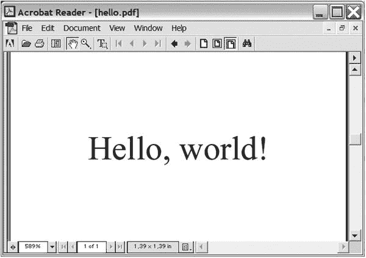
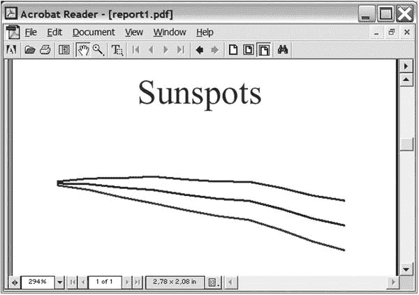
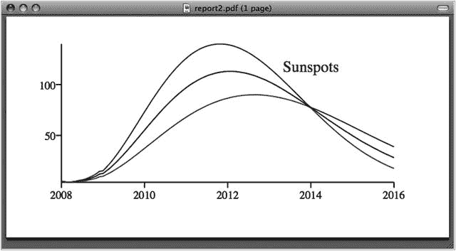

# 21.项目 2:描绘一幅美丽的图画

在这个项目中，您将学习如何用 Python 创建图形。更具体地说，您将创建一个带有图形的 PDF 文件，帮助您可视化从文本文件中读取的数据。虽然您可以从常规的电子表格中获得这样的功能，但是 Python 提供了更强大的功能，当您使用第二个实现并自动从互联网上下载数据时，您将会看到这一点。

在前一章，我们看了 HTML 和 XML——这是另一个缩写，我猜你可能很熟悉:PDF，便携文档格式的缩写。PDF 是 Adobe 创建的一种格式，可以用图形和文本表示任何类型的文档。PDF 文件实际上是不可编辑的(比如说，Microsoft Word 文件可能是可编辑的)，但大多数平台都有免费的阅读器软件，无论您使用哪种阅读器或在哪个平台上，PDF 文件看起来都应该是一样的(与 HTML 不同，HTML 可能没有正确的字体，您通常必须将图片作为单独的文件发送，等等)。

## 有什么问题？

Python 非常适合分析数据。利用它的文件处理和字符串处理功能，从数据文件创建某种形式的报告可能比在普通的电子表格中创建类似的东西更容易，特别是当您想要做的事情需要一些复杂的编程逻辑时。

你已经看到(在第 [3](03.html) 章)如何使用字符串格式得到漂亮的输出——例如，如果你想打印列中的数字。然而，有时纯文本是不够的。(就像他们说的，一张图胜过千言万语。)在这个项目中，您将学习 ReportLab 包的基础知识，它使您能够像以前创建纯文本一样轻松地创建 PDF 格式(和其他一些格式)的图形和文档。

当你在这个项目中玩概念的时候，我鼓励你找到一些你感兴趣的应用。我选择使用关于太阳黑子的数据(来自美国国家海洋和大气管理局的太空天气预测中心),并根据这些数据创建一个线图。

该程序应能够执行以下操作:

*   从互联网下载数据文件
*   解析数据文件并提取感兴趣的部分
*   基于数据创建 PDF 图形

与前一个项目一样，第一个原型可能无法完全满足这些目标。

## 有用的工具

这个项目中的关键工具是图形生成包。相当多的这样的软件包是可用的；我之所以选择 ReportLab，是因为它易于使用，并且具有丰富的 PDF 图形和文档生成功能。如果你想超越基础，你可能还想考虑 PYX 图形包( [`http://pyx.sf.net`](http://pyx.sf.net) )，它真的很强大，并且支持基于 TEX 的排版。

要获取 ReportLab 软件包，请访问位于 [`http://www.reportlab.org`](http://www.reportlab.org) 的官方网站。在那里您可以找到软件、文档和示例。您可以从网站下载或通过`pip`安装该库。完成后，您应该可以导入`reportlab`模块，如下所示:

```py
>>> import reportlab
>>>

```

Note

虽然我向您展示了一些 ReportLab 功能在这个项目中是如何工作的，但是还有更多的功能可用。要了解更多信息，我建议您从 ReportLab 网站上获取手册。它们可读性很强，而且比这一章可能包含的内容要广泛得多。

## 准备

在你开始编程之前，你需要一些数据来测试你的程序。我(相当随意地)选择了使用关于太阳黑子的数据，这些数据可以从太空天气预测中心的网站上获得( [`http://www.swpc.noaa.gov`](http://www.swpc.noaa.gov) )。你可以在 [`ftp://ftp.swpc.noaa.gov/pub/weekly/Predict.txt`](ftp://ftp.swpc.noaa.gov/pub/weekly/Predict.txt) 找到我在例子中使用的数据。

这个数据文件每周更新，包含有关太阳黑子和射电流量的信息。(别问我那是什么意思。)一旦有了这个文件，就可以开始处理这个问题了。

下面是文件的一部分，让您了解数据的样子:

```py
#         Predicted Sunspot Number And Radio Flux Values
#                     With Expected Ranges
#
#         -----Sunspot Number------  ----10.7 cm Radio Flux----
# YR MO   PREDICTED    HIGH    LOW   PREDICTED    HIGH    LOW
#--------------------------------------------------------------
2016 03        30.9    31.9    29.9       96.9    97.9    95.9
2016 04        30.5    32.5    28.5       96.1    97.1    95.1
2016 05        30.4    33.4    27.4       94.9    96.9    92.9
2016 06        30.3    35.3    25.3       93.2    96.2    90.2
2016 07        30.2    35.2    25.2       91.6    95.6    87.6
2016 08        30.0    36.0    24.0       90.3    94.3    86.3
2016 09        29.8    36.8    22.8       89.5    94.5    84.5
2016 10        30.0    37.0    23.0       88.9    94.9    82.9
2016 11        30.1    38.1    22.1       88.1    95.1    81.1
2016 12        30.5    39.5    21.5       87.8    95.8    79.8

```

## 首次实施

在第一个实现中，让我们将数据作为元组列表放入源代码中。这样，就很容易接近了。这里有一个你可以如何做的例子:

```py
data = [
    # Year Month Predicted High Low
    (2016, 03, 30.9, 31.9, 29.9),
    (2016, 04, 30.5, 32.5, 28.5),
    # Add more data here
    ]

```

这样一来，让我们看看如何将数据转化为图形。

### 使用 ReportLab 绘图

ReportLab 由许多部分组成，使您能够以多种方式创建输出。生成 pdf 最基本的模块是`pdfgen`。它包含一个`Canvas`类，带有几个用于绘图的底层方法。例如，要在名为`c`的`Canvas`上画线，可以调用`c.line`方法。

我们将使用更高级的图形框架(在包`reportlab.graphics`及其子模块中)，这将使我们能够创建各种形状对象，并将它们添加到一个`Drawing`对象中，您可以稍后以 PDF 格式输出到一个文件中。

清单 [21-1](#Par25) 展示了一个绘制字符串“Hello，world！”在一个 100 × 100 点的 PDF 图形中间。(你可以在图 [21-1](#Fig1) 中看到结果。)基本结构如下:创建一个给定大小的绘图，创建具有某些属性的图形元素(在本例中是一个`String`对象)，然后将这些元素添加到绘图中。最后，绘图被渲染为 PDF 格式并保存到文件中。



图 21-1。

A simple ReportLab figure

```py
from reportlab.graphics.shapes import Drawing, String
from reportlab.graphics import renderPDF

d = Drawing(100, 100)
s = String(50, 50, 'Hello, world!', textAnchor='middle')

d.add(s)

renderPDF.drawToFile(d, 'hello.pdf', 'A simple PDF file')

Listing 21-1.A Simple ReportLab Program
(hello_report.py)

```

对`renderPDF.drawToFile`的调用将您的 PDF 文件保存到当前目录中的一个名为`hello.pdf`的文件中。

`String`构造函数的主要参数是它的 x 和 y 坐标及其文本。此外，您可以提供各种属性(如字体大小、颜色等)。在这种情况下，我提供了一个`textAnchor`，它是字符串中应该放在坐标给定点上的部分。

### 构建一些折线

要创建太阳黑子数据的折线图，你需要创建一些线条。事实上，您需要创建几条链接的线。ReportLab 对此有一个特殊的类:`PolyLine`。

创建一个`PolyLine`,用一个坐标列表作为它的第一个参数。这个列表的形式是`[(x0, y0), (x1, y1), ...]`，每对 x 和 y 坐标在`PolyLine`上形成一个点。简单的`PolyLine`见图 [21-2](#Fig2) 。


图 21-2。

PolyLine([(0, 0), (10, 0), (10, 10), (0, 10)])

要制作折线图，必须为数据集中的每一列创建一条折线。这些折线中的每个点将由一个时间(由年和月构成)和一个值(太阳黑子的数量，取自相关列)组成。要获得其中一列(值)，列表理解可能很有用。

```py
pred = [row[2] for row in data]

```

这里，`pred`(对于“预测的”)将是数据的第三列中的所有值的列表。您可以对其他列使用类似的策略。(每一行的时间都需要根据年和月来计算，例如，年+月/12。)

一旦有了值和时间戳，就可以将折线添加到绘图中，如下所示:

```py
drawing.add(PolyLine(list(zip(times, pred)), strokeColor=colors.blue))

```

当然，没有必要设置描边颜色，但是这样可以更容易区分线条。(注意如何使用`zip`将时间和值组合成一个元组列表。)

### 编写原型

现在你已经有了编写程序第一个版本所需要的东西。源代码如清单 [21-2](#Par37) 所示。

```py
from reportlab.lib import colors
from reportlab.graphics.shapes import *
from reportlab.graphics import renderPDF

data = [
#    Year  Month   Predicted    High   Low
    (2007, 8,      113.2,       114.2, 112.2),
    (2007, 9,      112.8,       115.8, 109.8),
    (2007, 10,     111.0,       116.0, 106.0),
    (2007, 11,     109.8,       116.8, 102.8),
    (2007, 12,     107.3,       115.3,  99.3),
    (2008, 1,      105.2,       114.2,  96.2),
    (2008, 2,      104.1,       114.1,  94.1),
    (2008, 3,      99.9,        110.9,  88.9),
    (2008, 4,      94.8,        106.8,  82.8),
    (2008, 5,      91.2,        104.2,  78.2),
    ]

drawing = Drawing(200, 150)

pred = [row[2]-40 for row in data]
high = [row[3]-40 for row in data]
low = [row[4]-40 for row in data]
times = [200*((row[0] + row[1]/12.0) - 2007)-110 for row in data]

drawing.add(PolyLine(list(zip(times, pred)), strokeColor=colors.blue))
drawing.add(PolyLine(list(zip(times, high)), strokeColor=colors.red))
drawing.add(PolyLine(list(zip(times, low)), strokeColor=colors.green))

drawing.add(String(65, 115, 'Sunspots', fontSize=18, fillColor=colors.red))
renderPDF.drawToFile(drawing, 'report1.pdf', 'Sunspots')

Listing 21-2.The First Prototype for the Sunspot Graph Program (sunspots_proto.py)

```

如您所见，我已经调整了值和时间戳以获得正确的定位。结果图如图 [21-3](#Fig3) 所示。



图 21-3。

A simple sunspot graph

虽然制作了一个可以工作的程序是令人高兴的，但显然还有改进的余地。

## 第二次实施

那么，我们从原型中学到了什么？我们已经弄清楚了如何用 ReportLab 画图的基础。我们还看到了如何提取数据，以便很好地绘制图表。然而，该计划也有一些弱点。为了正确定位，我必须对值和时间戳添加一些特别的修改。并且程序实际上并不从任何地方获取数据(或者，更确切地说，它从程序本身内部的列表中“获取”数据，而不是从外部来源读取数据)。

与项目 1 不同(在第 [20](20.html) 章)，第二个实现不会比第一个大得多或复杂得多。这将是一个渐进的改进，使用 ReportLab 的一些更合适的功能，并从互联网上获取数据。

### 获取数据

正如你在第 14 章[看到的，你可以用标准模块`urllib`通过互联网获取文件。它的函数`urlopen`的工作方式与`open`非常相似，但是它使用 URL 而不是文件名作为参数。当你打开文件并阅读其内容后，你需要过滤掉你不需要的内容。该文件包含空行(仅由空格组成)和以一些特殊字符(`#`和`:`)开头的行。程序应该忽略这些。(请参阅本章前面“准备工作”一节中的示例文件片段。)](14.html)

假设 URL 保存在一个名为`URL`的变量中，并且变量`COMMENT_CHARS`已经被设置为字符串`'#:'`，您可以得到一个行列表(如我们的原始程序所示),如下所示:

```py
data = []
for line in urlopen(URL).readlines():
    line = line.decode()
    if not line.isspace() and not line[0] in COMMENT_CHARS:
        data.append([float(n) for n in line.split()])

```

前面的代码将包括数据列表中的所有列，尽管您对与无线电通量有关的列并不特别感兴趣。但是，当您提取真正需要的列时，这些列将被过滤掉(就像您在原始程序中所做的那样)。

Note

如果您正在使用自己的数据源(或者如果在您阅读本文时，黑子文件的数据格式已经改变)，那么您当然需要相应地修改这段代码。

### 使用 LinePlot 类

如果你认为获取数据出奇的简单，画一个更漂亮的线图也不是什么挑战。在这种情况下，最好浏览一下文档(在这种情况下，是 ReportLab 文档),看看是否已经存在可以满足您需要的功能，这样您就不需要自己实现它了。幸运的是，有这样一个东西:来自模块`reportlab.graphics.charts.lineplots`的`LinePlot`类。当然，你可以从这个开始，但是本着快速原型的精神，你只是利用手边的东西来看看你能做什么。现在是时候更进一步了。

在没有任何参数的情况下实例化了`LinePlot`，然后在将它添加到`Drawing`之前设置它的属性。您需要设置的主要属性有`x`、`y`、`height`、`width`和`data`。前四个应该是不言自明的；后者只是一个点列表，每个点列表都是一个元组列表，就像您在`PolyLine`中使用的那样。

最后，让我们设置每条线的笔画颜色。最终代码如清单 [21-3](#Par50) 所示。结果图(当然，不同的输入数据看起来会有些不同)如图 [21-4](#Fig4) 所示。



图 21-4。

The final sunspot graph

```py
from urllib.request import urlopen
from reportlab.graphics.shapes import *
from reportlab.graphics.charts.lineplots import LinePlot
from reportlab.graphics.charts.textlabels import Label
from reportlab.graphics import renderPDF

URL = 'ftp://ftp.swpc.noaa.gov/pub/weekly/Predict.txt'
COMMENT_CHARS = '#:'

drawing = Drawing(400, 200)
data = []
for line in urlopen(URL).readlines():
    line = line.decode()
    if not line.isspace() and line[0] not in COMMENT_CHARS:
        data.append([float(n) for n in line.split()])

pred = [row[2] for row in data]
high = [row[3] for row in data]
low = [row[4] for row in data]
times = [row[0] + row[1]/12.0 for row in data]

lp = LinePlot()
lp.x = 50
lp.y = 50
lp.height = 125

lp.width = 300
lp.data = [list(zip(times, pred)),

           list(zip(times, high)),
           list(zip(times, low))]
lp.lines[0].strokeColor = colors.blue
lp.lines[1].strokeColor = colors.red
lp.lines[2].strokeColor = colors.green

drawing.add(lp)

drawing.add(String(250, 150, 'Sunspots',
            fontSize=14, fillColor=colors.red))

renderPDF.drawToFile(drawing, 'report2.pdf', 'Sunspots')

Listing 21-3.The Final Sunspot Program (sunspots.py)

```

## 进一步探索

Python 提供了许多图形和绘图包。ReportLab 的一个很好的替代品是 PYX，我在本章前面提到过。使用 ReportLab 或 PYX(或其他一些包)，您可以尝试将自动生成的图形合并到文档中(也许还会生成其中的一部分)。你可以使用第 20 章中的一些技巧来给文本添加标记。如果你想创建一个 PDF 文档，那么 Platypus，ReportLab 的一部分，是有用的。(您也可以将 PDF 图形与一些排版系统(如 LATEX)集成在一起。)如果你想创建网页，也可以使用 Python 创建 pixmap 图形(如 GIF 或 PNG)——只需在网上搜索相关主题。

如果您的主要目标是绘制数据(这正是我们在这个项目中所做的)，您有许多 ReportLab 和 PYX 的替代方案。一个很好的选择是 Matplotlib/pylab ( [`http://matplotlib.org`](http://matplotlib.org) )，但是还有很多其他类似的包。

### 什么现在？

在第一个项目中，您学习了如何通过创建一个可扩展的解析器将标记添加到纯文本文件中。在下一个项目中，您将学习如何使用 Python 标准库中已经存在的解析器机制来分析标记文本(XML 格式)。该项目的目标是使用一个 XML 文件来指定一个完整的网站，然后由您的程序自动生成(带有文件、目录、添加的页眉和页脚)。您在下一个项目中学到的技术将普遍适用于 XML 解析，鉴于 XML 的普遍性，这不会有什么坏处。