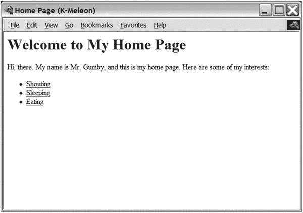

# 二十二、项目 3：适合所有场合的 XML

我在项目 1 中简单提到了 XML。现在是时候更详细地检查它了。在这个项目中，您将看到如何使用 XML 来表示多种数据，以及如何使用 Simple API for XML(SAX)来处理 XML 文件。这个项目的目标是从一个描述各种网页和目录的 XML 文件生成一个完整的网站。

在本章中，我假设你知道什么是 XML 以及如何编写它。如果你知道一些 HTML，你已经熟悉的基础。XML 并不是真正的特定语言(比如 HTML)；它更像是定义一类语言的一套规则。基本上，您仍然可以像在 HTML 中一样编写标记，但是在 XML 中，您可以自己发明标记名。这种特定的标记名集合及其结构关系可以在文档类型定义或 XML 模式中描述——我在这里不讨论这些。

关于什么是 XML 的简明描述，请参见万维网联盟(W3C)的“XML 十要点”( [`https://www.w3.org/XML/1999/XML-in-10-points-19990327`](https://www.w3.org/XML/1999/XML-in-10-points-19990327) )。更详细的教程可以在 W3Schools 网站上找到( [`http://www.w3schools.com/xml`](http://www.w3schools.com/xml) )。关于 SAX 的更多信息，请参见 SAX 官方网站( [`http://www.saxproject.org`](http://www.saxproject.org) )。

## 有什么问题？

在这个项目中，您要解决的一般问题是解析(读取和处理)XML 文件。因为您可以使用 XML 来表示几乎任何东西，并且在解析数据时可以对数据做任何想做的事情，所以应用程序是无限的(正如本章的标题所示)。本章要解决的具体问题是从一个 XML 文件生成一个完整的网站，该文件包含网站的结构和每个页面的基本内容。

在您着手这个项目之前，我建议您花一些时间阅读一些关于 XML 的知识，并了解它的应用。这可能会让你更好地理解什么时候它可能是一种有用的文件格式，什么时候它可能是多余的。(毕竟，当你只需要纯文本文件的时候，它们就可以了。)

Anything, You Say?

您可能会怀疑用 XML 到底能表示什么。好吧，让我给你举几个它的用法的例子:

*   为普通文档处理标记文本—例如，以 XHTML ( [`http://www.w3.org/TR/xhtml1`](http://www.w3.org/TR/xhtml1) )或 DocBook XML ( [`http://www.docbook.org`](http://www.docbook.org) )的形式
*   来代表音乐( [`http://musicxml.org`](http://musicxml.org) )
*   来代表人类的心情、情绪和性格特征( [`http://xml.coverpages.org/`](http://xml.coverpages.org/) `humanML.html`)
*   描述任何物理对象( [`http://xml.coverpages.org/pml-ons.html`](http://xml.coverpages.org/pml-ons.html) `)`
*   通过网络调用 Python 方法(使用 XML-RPC，在第 [27](27.html) 章中演示)

XML 的现有应用示例可以在 XML 封面( [`http://xml.coverpages.org/xml.html#applications`](http://xml.coverpages.org/xml.html#applications) )中找到。

让我们来定义项目的具体目标。

*   整个网站应该用一个 XML 文件来描述，这个文件应该包含关于各个网页和目录的信息。
*   该计划应根据需要创建目录和网页。
*   应该很容易改变整个网站的总体设计，并用新设计重新生成所有页面。

这最后一点可能足以让这一切变得值得，但还有其他好处。通过将所有内容放在一个 XML 文件中，您可以轻松地编写其他程序，使用相同的 XML 处理技术提取各种信息，如目录、自定义搜索引擎的索引等。即使您的网站不使用它，您也可以用它来创建基于 HTML 的幻灯片(或者，通过使用上一章讨论的 ReportLab，您甚至可以创建 PDF 幻灯片)。

## 有用的工具

Python 有一些内置的 XML 支持，但是如果您使用的是旧版本，您可能需要自己安装一些额外的支持。在这个项目中，您需要一个正常工作的 SAX 解析器。要查看您是否有可用的 SAX 解析器，请尝试执行以下命令:

```py
>>> from xml.sax import make_parser
>>> parser = make_parser()

```

当您这样做时，很可能不会引发任何异常。在这种情况下，您已经准备好了，可以继续“准备”部分。

Tip

现在有很多针对 Python 的 XML 工具。“标准”PyXML 框架的一个非常有趣的替代方案是 Fredrik Lundh 的 ElementTree(和 C 实现 cElementTree)，它也包含在 Python 标准库的最新版本中，在包`xml.etree`中。如果你有更老的 Python 版本，可以从 [`http://effbot.org/zone`](http://effbot.org/zone) 获得 ElementTree。它非常强大且易于使用，如果您真的想在 Python 中使用 XML 的话，很值得一看。

如果您确实得到了一个异常，您必须安装 PyXMLweb 搜索应该会为您指出正确的方向(除非您的 Python 很古老，尽管它应该自带 XML 支持)。

## 准备

在编写处理 XML 文件的程序之前，必须设计 XML 格式。你需要什么标签，它们应该有什么属性，哪些标签应该放在哪里？为了找到答案，让我们首先考虑你希望你的格式描述什么。

主要的概念是网站、目录、页面、名称、标题和内容。

*   您不会存储关于网站本身的任何信息，所以网站只是包含所有文件和目录的顶级元素。
*   目录主要是文件和其他目录的容器。
*   页面是单个网页。
*   目录和网页都需要名字。这些将被用作目录名和文件名，因为它们将出现在文件系统和相应的 URL 中。
*   每个网页都应该有一个标题(与其文件名不同)。
*   每个网页也会有一些内容。我们将使用普通的 XHTML 来表示这里的内容。这样，我们可以简单地将它传递到最终的网页，让浏览器来解释它。

简而言之，您的文档将由一个单独的`website`元素组成，包含几个`directory`和`page`元素，每个目录元素可选地包含更多的页面和目录。`directory`和`page`元素将有一个名为`name`的属性，其中将包含它们的名称。另外，`page`标签有一个`title`属性。元素包含 XHTML 代码(属于 XHTML `body`标签中的类型)。清单 [22-1](#Par32) 中显示了一个样本文件。

```py
<website>
  <page name="index" title="Home Page">
    <h1>Welcome to My Home Page</h1>

    <p>Hi, there. My name is Mr. Gumby, and this is my home page.
    Here are some of my interests:</p>

    <ul>
      <li><a href="interests/shouting.html">Shouting</a></li>
      <li><a href="interests/sleeping.html">Sleeping</a></li>
      <li><a href="interests/eating.html">Eating</a></li>
    </ul>
  </page>
  <directory name="interests">
    <page name="shouting" title="Shouting">
      <h1>Mr. Gumby's Shouting Page</h1>

      <p>...</p>
    </page>
    <page name="sleeping" title="Sleeping">
      <h1>Mr. Gumby's Sleeping Page</h1>

      <p>...</p>
    </page>
    <page name="eating" title="Eating">

      <h1>Mr. Gumby's Eating Page</h1>

      <p>...</p>
    </page>
  </directory>
</website>

Listing 22-1.A Simple Web Site Represented

As an XML File (website.xml)

```

## 首次实施

此时，我们还没有看到 XML 解析是如何工作的。我们在这里使用的方法(称为 SAX)包括编写一组事件处理程序(就像在 GUI 编程中一样),然后让现有的 XML 解析器在读取 XML 文档时调用这些处理程序。

What about DOM?

Python(以及其他编程语言)中有两种处理 XML 的常用方法:SAX 和文档对象模型(DOM)。SAX 解析器通读 XML 文件，告诉您它看到了什么(文本、标记和属性)，一次只存储文档的一小部分。这使得 SAX 简单、快速并且节省内存，这也是我在本章中选择使用它的原因。DOM 采用另一种方法:它构造一个数据结构(文档树)，表示整个文档。这种方法速度较慢，需要更多的内存，但如果您想操作文档的结构，这种方法会很有用。

### 创建简单的内容处理程序

使用 SAX 进行解析时，有几种事件类型可用，但是让我们将自己限制为三种:元素的开始(开始标记的出现)、元素的结束(结束标记的出现)和纯文本(字符)。为了解析 XML 文件，让我们使用来自`xml.sax`模块的`parse`函数。这个函数负责读取文件和生成事件，但是在生成这些事件时，它需要调用一些事件处理程序。这些事件处理程序将作为内容处理程序对象的方法来实现。您将从`xml.sax.handler`继承`ContentHandler`类，因为它实现了所有必要的事件处理程序(作为无效的虚拟操作)，并且您可以只覆盖您需要的那些。

让我们从一个最小的 XML 解析器开始(假设您的 XML 文件叫做`website.xml`)。

```py
from xml.sax.handler import ContentHandler
from xml.sax import parse

class TestHandler(ContentHandler): pass
parse('website.xml', TestHandler())

```

如果你执行这个程序，看起来什么也没发生，但是你也不会得到任何错误信息。在幕后，XML 文件被解析，默认的事件处理程序被调用，但是因为它们不做任何事情，所以您看不到任何输出。

让我们尝试一个简单的扩展。将以下方法添加到`TestHandler`类中:

```py
def startElement(self, name, attrs):
    print(name, attrs.keys())

```

这将覆盖默认的`startElement`事件处理程序。参数是相关的标记名及其属性(保存在一个类似字典的对象中)。如果您再次运行该程序(使用清单 [22-1](#Par32) 中的`website.xml`，您会看到以下输出:

```py
website []
page [u'name', u'title']
h1 []
p []
ul []
li []
a [u'href']
li []
a [u'href']
li []
a [u'href']
directory [u'name']
page [u'name', u'title']
h1 []
p []
page [u'name', u'title']
h1 []
p []
page [u'name', u'title']
h1 []
p []

```

这是如何工作的应该很清楚了。除了`startElement`，我们还将使用`endElement`(它只接受一个标签名作为参数)和`characters`(它接受一个字符串作为参数)。

下面是一个使用所有这三种方法构建网站文件标题列表的例子:

```py
from xml.sax.handler import ContentHandler 

from xml.sax import parse

class HeadlineHandler(ContentHandler):

    in_headline = False

    def __init__(self, headlines):
        super().__init__()
        self.headlines = headlines
        self.data = []

    def startElement(self, name, attrs):
        if name == 'h1':
            self.in_headline = True

    def endElement(self, name):
        if name == 'h1':
            text = ''.join(self.data)
            self.data = []
            self.headlines.append(text)
            self.in_headline = False

    def characters(self, string):
        if self.in_headline:
            self.data.append(string)

headlines = []
parse('website.xml', HeadlineHandler(headlines))

print('The following <h1> elements were found:')
for h in headlines:
    print(h)

```

注意，`HeadlineHandler`跟踪它当前是否正在解析一对`h1`标签中的文本。这是通过当`startElement`找到一个`h1`标签时将`self.in_headline`设置为`True`以及当`endElement`找到一个`h1`标签时将`self.in_headline`设置为`False`来实现的。当解析器找到一些文本时，会自动调用`characters`方法。只要解析器在两个`h1`标签之间(`self.in_headline`是`True`)，那么`characters`就会把字符串(可能只是标签之间文本的一部分)追加到`self.data`中，也就是一个字符串列表。连接这些文本片段，将它们附加到`self.headlines`(作为单个字符串)，并将`self.data`重置为空列表的任务也落到了`endElement`身上。这种通用方法(使用布尔变量来指示您当前是否在给定标记类型的“内部”)在 SAX 编程中非常常见。

运行这个程序(同样，使用清单 [22-1](#Par32) 中的`website.xml`文件)，您会得到以下输出:

```py
The following <h1> elements were found:
Welcome to My Home Page
Mr. Gumby's Shouting Page
Mr. Gumby's Sleeping Page
Mr. Gumby's Eating Page

```

### 创建 HTML 页面

现在，您已经准备好制作原型了。现在，让我们忽略目录，专注于创建 HTML 页面。您需要创建一个稍加修饰的事件处理程序来完成以下任务:

*   在每个`page`元素的开头，用给定的名称打开一个新文件，并向其中写入一个合适的 HTML 标题，包括给定的标题
*   在每个`page`元素的末尾，向文件写入一个合适的 HTML 页脚，并关闭它
*   在`page`元素内部，遍历所有标签和字符而不修改它们(按原样写入文件)
*   当不在`page`元素中时，忽略所有标签(如`website`和`directory`

大部分都很简单(至少如果你知道一点 HTML 文档是如何构造的)。然而，有两个问题可能并不十分明显。

*   您不能简单地“传递”标签(将它们直接写到您正在构建的 HTML 文件中)，因为您只能获得它们的名称(可能还有一些属性)。您必须自己重建标签(用尖括号等等)。
*   SAX 本身无法知道您当前是否在一个`page`元素的“内部”。

你必须自己跟踪这类事情(就像你在`HeadlineHandler`例子中所做的那样)。对于这个项目，您只对是否传递标签和字符感兴趣，所以您将使用一个名为`passthrough`的布尔变量，它将在您进入和离开页面时更新。

简单程序的代码见清单 [22-2](#Par59) 。

```py
from xml.sax.handler import ContentHandler
from xml.sax import parse

class PageMaker(ContentHandler):

    passthrough = False

    def startElement(self, name, attrs):
        if name == 'page':
            self.passthrough = True
            self.out = open(attrs['name'] + '.html', 'w')
            self.out.write('<html><head>\n')
            self.out.write('<title>{}</title>\n'.format(attrs['title']))
            self.out.write('</head><body>\n')
        elif self.passthrough:
            self.out.write('<' + name)
            for key, val in attrs.items():
                self.out.write(' {}="{}"'.format(key, val))
            self.out.write('>')

    def endElement(self, name):

        if name == 'page':
            self.passthrough = False
            self.out.write('\n</body></html>\n')
            self.out.close()
        elif self.passthrough:
            self.out.write('</{}>'.format(name))

    def characters(self, chars):
        if self.passthrough: self.out.write(chars)

parse('website.xml', PageMaker())

Listing 22-2.A Simple Page Maker Script

(pagemaker.py)

```

您应该在您希望文件出现的目录中执行此操作。请注意，即使两个页面位于两个不同的目录元素中，它们最终也会位于同一个真实目录中。(这将在我们的第二次实现中解决。)

同样，使用清单 [22-1](#Par32) 中的文件`website.xml`，可以得到四个 HTML 文件。名为`index.html`的文件包含以下内容:

```py
<html><head>
<title>Home Page</title>
</head><body>

<h1>Welcome to My Home Page</h1>

<p>Hi, there. My name is Mr. Gumby, and this is my home page. Here are some of my interests:</p>

<ul>
   <li><a href="interests/shouting.html">Shouting</a></li>
   <li><a href="interests/sleeping.html">Sleeping</a></li>
   <li><a href="interests/eating.html">Eating</a></li>
</ul>

</body></html>

```

图 [22-1](#Fig1) 显示了该页面在浏览器中的外观。



图 22-1。

A generated web page

查看代码，两个主要的弱点应该是显而易见的。

*   它使用`if`语句来处理各种事件类型。如果您需要处理许多这样的事件类型，您的`if`语句将变得很大并且不可读。
*   HTML 代码是硬连线的。应该很容易更换。

这两个弱点将在第二个实现中解决。

## 第二次实施

因为 SAX 机制是如此低级和基本，所以您可能会发现编写一个混合类来处理一些管理细节非常有用，比如收集字符数据、管理布尔状态变量(比如`passthrough`)或者将事件分派给自己的定制事件处理程序。在这个项目中，状态和数据处理非常简单，所以让我们把重点放在处理程序调度上。

### 调度员混合班

不需要在标准的通用事件处理程序(如`startElement`)中编写大量的`if`语句，最好只编写自己的特定语句(如`startPage`)并自动调用它们。您可以在一个 mix-in 类中实现该功能，然后将 mix-in 和`ContentHandler`一起子类化。

Note

正如第 [7](07.html) 章中提到的，mix-in 是一个功能有限的类，它意味着与其他一些更重要的类一起被子类化。

您希望您的程序具有以下功能:

*   当用一个名字如`'foo'`调用`startElement`时，它应该试图找到一个名为`startFoo`的事件处理程序，并用给定的属性调用它。
*   同样，如果用`'foo'`调用`endElement`，它应该尝试调用`endFoo`。
*   如果在这些方法中没有找到给定的处理程序，将调用一个名为`defaultStart`(或`defaultEnd`)的方法(如果存在的话)。如果默认的处理程序也不存在，就不应该做任何事情。

此外，应该注意参数。定制处理程序(例如，`startFoo`)不需要标签名作为参数，而定制默认处理程序(例如，`defaultStart`)需要。此外，只有启动处理程序需要这些属性。

迷茫？让我们从编写类中最简单的部分开始。

```py
class Dispatcher:

    # ...

    def startElement(self, name, attrs):
        self.dispatch('start', name, attrs)
    def endElement(self, name):
        self.dispatch('end', name)

```

这里实现了基本的事件处理程序，它们简单地调用一个名为`dispatch`的方法，该方法负责寻找合适的处理程序，构造参数元组，然后用这些参数调用处理程序。下面是`dispatch`方法的代码:

```py
def dispatch(self, prefix, name, attrs=None):
    mname = prefix + name.capitalize()
    dname = 'default' + prefix.capitalize()
    method = getattr(self, mname, None)
    if callable(method): args = ()
    else:
        method = getattr(self, dname, None)
        args = name,
    if prefix == 'start': args += attrs,
    if callable(method): method(*args)

```

下面是发生的情况:

1.  根据一个前缀(或者是`'start'`或者是`'end'`)和一个标签名(例如`'page'`，构造处理程序的方法名(例如`'startPage'`)。
2.  使用相同的前缀，构造默认处理程序的名称(例如，`'defaultStart'`)。
3.  尝试用`getattr`获取处理程序，使用`None`作为缺省值。
4.  如果结果是可调用的，则为`args`分配一个空元组。
5.  否则，尝试使用`getattr`获取默认处理程序，再次使用`None`作为默认值。另外，将`args`设置为只包含标签名的元组(因为默认处理程序需要它)。
6.  如果您正在处理一个开始处理程序，将属性添加到参数元组(`args`)。
7.  如果您的处理程序是可调用的(也就是说，它或者是可行的特定处理程序，或者是可行的默认处理程序)，请使用正确的参数调用它。

明白了吗？这基本上意味着您现在可以像这样编写内容处理程序:

```py
class TestHandler(Dispatcher, ContentHandler):
    def startPage(self, attrs):
        print('Beginning page', attrs['name'])
    def endPage(self):
        print('Ending page')

```

因为 dispatcher mix-in 负责大部分的管道工作，所以内容处理程序相当简单，可读性很强。(当然，我们稍后会添加更多功能。)

### 分解出页眉、页脚和默认处理

这一节比上一节容易得多。我们将创建单独的方法来编写页眉和页脚，而不是直接在事件处理程序中调用`self.out.write`。这样，我们可以很容易地通过子类化事件处理程序来覆盖这些方法。让我们让默认的页眉和页脚变得非常简单。

```py
def writeHeader(self, title):
    self.out.write("<html>\n  <head>\n    <title>")
    self.out.write(title)
    self.out.write("</title>\n  </head>\n  <body>\n")

def writeFooter(self):
    self.out.write("\n  </body>\n</html>\n")

```

XHTML 内容的处理也与原始处理程序联系得过于紧密。XHTML 现在将由`defaultStart`和`defaultEnd`来处理。

```py
def defaultStart(self, name, attrs):
    if self.passthrough:
        self.out.write('<' + name)
        for key, val in attrs.items():
            self.out.write(' {}="{}"'.format(key, val))
        self.out.write('>')

def defaultEnd(self, name):
    if self.passthrough:
         self.out.write('</{}>'.format(name))

```

这和以前一样，只是我把代码移到了不同的方法中(这通常是件好事)。现在，到了拼图的最后一块。

### 支持目录

要创建必要的目录，您需要函数`os.makedirs`，它将所有必要的目录放在给定的路径中。例如，`os.makedirs('foo/bar/baz')`在当前目录中创建目录`foo`，然后在`foo`中创建`bar`，最后在`bar`中创建`baz`。如果`foo`已经存在，则只创建`bar`和`baz`，同样，如果`bar`也存在，则只创建`baz`。但是，如果`baz`也存在，通常会引发异常。为了避免这种情况，我们提供了关键字参数`exist_ok=True`。另一个有用的函数是`os.path.join`，它用正确的分隔符连接几个路径(例如，UNIX 中的`/`等等)。

在处理过程中，始终将当前目录路径保存为目录名列表，由变量`directory`引用。当您输入一个目录时，附加它的名称；你离开的时候，把名字去掉。假设`directory`设置正确，您可以定义一个函数来确保当前目录存在。

```py
def ensureDirectory(self):
    path = os.path.join(*self.directory)
    os.makedirs(path, exist_ok=True)

```

请注意，在将目录列表提供给`os.path.join`时，我是如何在目录列表上使用参数拼接的(带有星号运算符，`*`)。

我们网站的基目录(例如，`public_html`)可以作为构造函数的一个参数，它看起来像这样:

```py
def __init__(self, directory):
    self.directory = [directory]
    self.ensureDirectory()

```

### 事件处理程序

最后，我们来到了事件处理程序。您需要四个:两个用于处理目录，两个用于页面。目录处理程序简单地使用了`directory`列表和`ensureDirectory`方法。

```py
def startDirectory(self, attrs):
    self.directory.append(attrs['name'])
    self.ensureDirectory()

def endDirectory(self):
    self.directory.pop()

```

页面处理程序使用`writeHeader`和`writeFooter`方法。此外，他们还设置了`passthrough`变量(通过 XHTML)，而且——也许是最重要的——他们打开和关闭与页面相关的文件:

```py
def startPage(self, attrs):
    filename = os.path.join(*self.directory + [attrs['name'] + '.html'])
    self.out = open(filename, 'w')
    self.writeHeader(attrs['title'])
    self.passthrough = True

def endPage(self):
    self.passthrough = False
    self.writeFooter()
    self.out.close()

```

`startPage`的第一行可能看起来有点吓人，但它与`ensureDirectory`的第一行或多或少是一样的，除了您添加了文件名(并给它加了一个`.html`后缀)。

该程序的完整源代码如清单 [22-3](#Par108) 所示。

```py
from xml.sax.handler import ContentHandler
from xml.sax import parse
import os

class Dispatcher:

    def dispatch(self, prefix, name, attrs=None):
        mname = prefix + name.capitalize()
        dname = 'default' + prefix.capitalize()
        method = getattr(self, mname, None)
        if callable(method): args = ()
        else:
            method = getattr(self, dname, None)
            args = name,
        if prefix == 'start': args += attrs,
        if callable(method): method(*args)

    def startElement(self, name, attrs):
        self.dispatch('start', name, attrs)

    def endElement(self, name):
        self.dispatch('end', name)

class WebsiteConstructor(Dispatcher, ContentHandler):

    passthrough = False

    def __init__(self, directory):
        self.directory = [directory] 

        self.ensureDirectory()

    def ensureDirectory(self):
        path = os.path.join(*self.directory)
        os.makedirs(path, exist_ok=True)

    def characters(self, chars):
        if self.passthrough: self.out.write(chars)

    def defaultStart(self, name, attrs):
        if self.passthrough:
            self.out.write('<' + name)
            for key, val in attrs.items():
                self.out.write(' {}="{}"'.format(key, val))
            self.out.write('>')

    def defaultEnd(self, name):
        if self.passthrough:
            self.out.write('</{}>'.format(name))

    def startDirectory(self, attrs):
        self.directory.append(attrs['name'])
        self.ensureDirectory()

    def endDirectory(self):
        self.directory.pop()

    def startPage(self, attrs):
        filename = os.path.join(*self.directory + [attrs['name'] + '.html'])
        self.out = open(filename, 'w')
        self.writeHeader(attrs['title'])
        self.passthrough = True

    def endPage(self):
        self.passthrough = False
        self.writeFooter()
        self.out.close()

    def writeHeader(self, title):
        self.out.write('<html>\n  <head>\n    <title>')
        self.out.write(title)
        self.out.write('</title>\n  </head>\n  <body>\n')

    def writeFooter(self):
        self.out.write('\n  </body>\n</html>\n')

parse('website.xml', WebsiteConstructor('public_html'))

Listing 22-3.The Web Site Constructor (website.py)

```

清单 [22-3](#Par108) 生成以下文件和目录:

*   `public_html/`
*   `public_html/index.` `html`
*   `public_html/interests/`
*   `public_html/interests/shouting.html`
*   `public_html/interests/sleeping.html`
*   `public_html/interests/eating.html`

## 进一步探索

现在你有了基本程序。你能用它做什么？以下是一些建议:

*   创建一个新的`ContentHandler`，用于为网站生成目录或菜单(带链接)。
*   在网页上添加导航工具，告诉用户他们在哪里(在哪个目录下)。
*   创建一个`WebsiteConstructor`的子类，覆盖`writeHeader`和`writeFooter`，以提供定制的设计。
*   创建另一个从 XML 文件构建单个 web 页面的`ContentHandler`。
*   创建一个以某种方式总结你的网站的`ContentHandler`,例如，在 RSS 中。
*   查看其他转换 XML 的工具，尤其是 XML 转换(XSLT)。
*   使用诸如 ReportLab 的 Platypus ( [`http://www.reportlab.org`](http://www.reportlab.org) )之类的工具，基于 XML 文件创建一个或多个 PDF 文档。
*   使通过网络界面编辑 XML 文件成为可能(参见第 [25](25.html) 章)。

### 什么现在？

在涉足 XML 解析领域之后，让我们再做一些网络编程。在下一章中，我们将创建一个程序，它可以从各种网络资源中收集新闻条目，并为您生成定制的新闻报告。