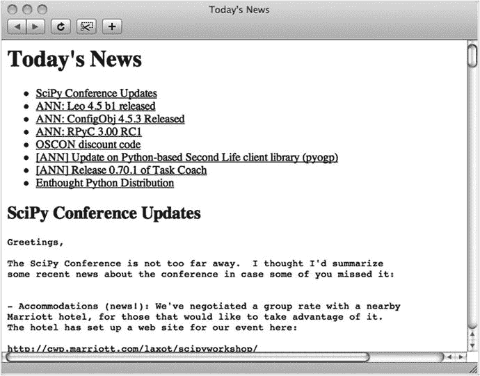

# 23.项目 4:在新闻中

互联网上充斥着各种形式的新闻来源，包括报纸、视频频道、博客和播客等等。其中一些还提供服务，如 RSS 或 Atom 提要，让您使用相对简单的代码检索最新的新闻，而不必解析它们的网页。在这个项目中，我们将探索一种先于网络的机制:网络新闻传输协议(NNTP)。我们将从一个没有任何抽象形式(没有函数，没有类)的简单原型到一个添加了一些重要抽象的通用系统。我们将使用`nntplib`库，它允许您与 NNTP 服务器交互，但是添加其他协议和机制应该很简单。

NNTP 是一种标准的网络协议，用于管理在所谓的新闻组讨论组上发布的消息。NNTP 服务器形成了一个全球网络，集中管理这些新闻组，通过 NNTP 客户端(也称为新闻阅读器)，你可以张贴和阅读消息。NNTP 服务器的主要网络叫做新闻组，建立于 1980 年(尽管 NNTP 协议直到 1985 年才被使用)。与当前的网络趋势相比，这是相当“老派”的，但大多数互联网(在某种程度上)是基于这样的老派技术，[](#Fn1)和它可能不会伤害周围玩一些低级的东西。此外，你也可以用自己的新闻采集模块来代替本章中的 NNTP 内容(也许使用脸书或 Twitter 等社交网站的 web API)。

## 有什么问题？

您在本项目中编写的程序将是一个信息收集代理，一个可以收集信息(更具体地说，新闻)并为您编写报告的程序。考虑到您已经遇到的网络功能，这似乎不是很困难——事实上也不是。但是在这个项目中，你超越了简单的“用`urllib`下载文件”的方法。你使用了另一个比`urllib`更难使用的网络库，即`nntplib`。此外，您还可以重构程序，以允许多种类型的新闻源和各种类型的目的地，在前端和后端之间进行明确的分离，主引擎位于中间。

最终计划的主要目标如下:

*   这个程序应该能够从许多不同的来源收集新闻。
*   添加新的新闻来源(甚至是新种类的来源)应该很容易。
*   这个程序应该能够以多种不同的格式将编辑好的新闻报道发送到不同的目的地。
*   添加新的目的地(甚至新类型的目的地)应该很容易。

## 有用的工具

对于这个项目，你不需要安装单独的软件。然而，您确实需要一些标准的库模块，包括一个您以前没有见过的模块，`nntplib`，它处理 NNTP 服务器。我们不解释该模块的所有细节，而是通过一些原型来检查它。

## 准备

为了能够使用`nntplib`，你需要能够访问 NNTP 服务器。如果您不确定是否需要，您可以向您的 ISP 或系统管理员询问详细信息。在本章的代码示例中，我使用了新闻组`comp.lang.python.announce`，所以你应该确保你的新闻(NNTP)服务器有这个组，或者你应该找到你想使用的其他组。如果您无法访问 NNTP 服务器，任何人都可以使用几个开放的服务器。在网上快速搜索“免费的 nntp 服务器”会给你一些可供选择的服务器。(`nntplib`官方文档中的代码示例使用`news.gmane.org`。)假设你的新闻服务器是`news.foo.bar`(这不是真实的服务器名，不会起作用)，你可以这样测试你的 NNTP 服务器:

```py
>>> from nntplib import NNTP
>>> server = NNTP('news.foo.bar')
>>> server.group('comp.lang.python.announce')[0]

```

Note

要连接到某些服务器，您可能需要提供额外的身份验证参数。有关 NNTP 构造函数可选参数的详细信息，请参考 Python 库参考( [`https://docs.python.org/library/nntplib.html`](https://docs.python.org/library/nntplib.html) )。

最后一行的结果应该是以`'211'`(基本意思是服务器有你要的组)或者`'411'`(意思是服务器没有组)开头的字符串。它可能看起来像这样:

```py
'211 51 1876 1926 comp.lang.python.announce'

```

如果返回的字符串以`'411'`开头，您应该使用新闻阅读器来查找您可能想要使用的另一个组。(您也可能会得到一个带有等效错误消息的异常。)如果出现异常，可能是您弄错了服务器名。另一种可能是在创建服务器对象和调用`group`方法之间“超时”——服务器可能只允许您在很短的时间内(比如 10 秒)保持连接。如果您很难快速输入，只需将代码放入脚本并执行它(添加一个`print`)或将服务器对象创建和方法调用放在同一行(用分号分隔)。

## 首次实施

本着原型的精神，让我们直接解决这个问题。您要做的第一件事是从 NNTP 服务器上的新闻组下载最新消息。为了简单起见，只需将结果打印到标准输出(用`print`)。在查看实现的细节之前，您可能想要浏览本节后面的清单 [23-1](#Par29) 中的源代码，甚至可能执行程序来看看它是如何工作的。程序逻辑并不复杂——挑战主要在于使用`nntplib`。我们将使用`NNTP`类的一个对象，正如您在上一节中看到的，这个类是用 NNTP 服务器的名称实例化的。您需要在这个实例上调用三个方法。

*   `group`，它选择一个给定的新闻组作为当前新闻组，并返回关于它的一些信息，包括最后一条消息的编号
*   `over`，为您提供由编号指定的一组消息的概述信息
*   `body`，返回给定消息的正文

使用与前面相同的虚构服务器名，我们可以进行如下设置:

```py
servername = 'news.foo.bar'
group = 'comp.lang.python.announce'
server = NNTP(servername)
howmany = 10

```

`howmany`变量表示我们想要检索多少篇文章。然后我们可以选择我们的组。

```py
resp, count, first, last, name = server.group(group)

```

返回值是一般的服务器响应、组中消息的估计数量、第一个和最后一个消息编号以及组的名称。我们主要对`last`感兴趣，我们将使用它来构建我们感兴趣的文章编号的区间，从`start = last - howmany + 1`开始，以`last`结束。我们将这一对数字提供给`over`方法，该方法为我们提供了一系列消息的`(id, overview)`对。我们从概述中提取主题，并使用 ID 从服务器获取消息正文。

消息正文的行以字节形式返回。如果我们使用默认的 UTF-8 来解码它们，如果我们猜错了，我们可能会得到一些非法的字节序列。理想情况下，我们应该提取编码信息，但为了简单起见，我们只使用 Latin-1 编码，它适用于普通 ASCII，不会抱怨非 ASCII 字节。打印完所有文章，我们调用`server.quit()`，就这样。在像`bash`这样的 UNIX shell 中，您可以像这样运行这个程序:

```py
$ python newsagent1.py | less

```

使用`less`有助于一次阅读一篇文章。如果你没有这样的分页程序可用，你可以重写程序的`print`部分，将结果文本存储在一个文件中，这也是你在第二个实现中要做的(参见第 [11 章](11.html)了解更多关于文件处理的信息)。清单 [23-1](#Par29) 显示了简单的新闻收集代理的源代码。

```py
from nntplib import NNTP

servername = 'news.foo.bar'
group = 'comp.lang.python.announce'
server = NNTP(servername)
howmany = 10

resp, count, first, last, name = server.group(group)

start = last - howmany + 1

resp, overviews = server.over((start, last))

for id, over in overviews:
    subject = over['subject']
    resp, info = server.body(id)
    print(subject)
    print('-' * len(subject))
    for line in info.lines:
        print(line.decode('latin1'))

    print()

server.quit()

Listing 23-1.A Simple News-Gathering Agent

(newsagent1.py)

```

## 第二次实施

第一个实现是可行的，但是相当不灵活，因为它只允许您从新闻组讨论组中检索新闻。在第二个实现中，您可以通过稍微重构代码来解决这个问题。您可以通过创建一些类和方法来表示代码的各个部分，从而添加结构和抽象。一旦你这样做了，一些部分可能会被其他类替换，这比你替换原始程序中的部分代码要容易得多。

同样，在深入了解第二个实现的细节之前，您可能想浏览(或者执行)本章后面的清单 [23-2](#Par65) 中的代码。

Note

在清单 [23-2](#Par65) 中的代码运行之前，您需要将`clpa_server`变量设置为可用的 NNTP 服务器。

那么，需要上什么课呢？我们先简单回顾一下问题描述中的重要名词，如第 [7 章](07.html)所建议的:信息、代理、新闻、报道、网络、新闻来源、目的地、前端、后端、主引擎。这个名词列表暗示了以下主要类别(或类别种类):`NewsAgent`、`NewsItem`、`Source`和`Destination`。

各种来源将构成前端，目的地将构成后端，新闻代理位于中间。

这其中最简单的就是`NewsItem`。它只表示一段数据，由标题和正文(一段简短的文本)组成，可以按如下方式实现:

```py
class NewsItem:

    def __init__(self, title, body):

        self.title = title
        self.body = body

```

要确切地了解新闻源和新闻目的地需要什么，从编写代理本身开始可能是一个好主意。代理必须维护两个列表:一个是源列表，一个是目的列表。可以通过方法`addSource`和`addDestination`添加源和目的地。

```py
class NewsAgent:

    def __init__(self):
        self.sources = []
        self.destinations = []

    def addSource(self, source):
        self.sources.append(source)

    def addDestination(self, dest):
        self.destinations.append(dest)

```

现在唯一缺少的是一种将新闻从源分发到目的地的方法。在分发过程中，每个目的地都必须有一个返回其所有新闻项的方法，每个源都需要一个接收正在分发的所有新闻项的方法。我们称这些方法为`getItems`和`receiveItems`。为了灵活起见，让我们只要求`getItems`返回一个任意的`NewsItems`迭代器。然而，为了使目的地更容易实现，让我们假设`receiveItems`可以用一个序列参数调用(例如，可以迭代多次，在列出新闻条目之前制作一个目录)。在这被决定之后，`NewsAgent`的`distribute`方法简单地变成如下:

```py
def distribute(self):
    items = []
    for source in self.sources:
        items.extend(source.getItems())
    for dest in self.destinations:
        dest.receiveItems(items)

```

这将遍历所有来源，构建一个新闻条目列表。然后，它遍历所有目的地，并为每个目的地提供完整的新闻条目列表。

现在，你只需要几个来源和目的地。要开始测试，您可以简单地创建一个目的地，就像第一个原型中的打印一样。

```py
class PlainDestination:

    def receiveItems(self, items):
        for item in items:
            print(item.title)
            print('-' * len(item.title))
            print(item.body)

```

格式是相同的；不同之处在于您封装了格式。它现在是几个可选目的地之一，而不是程序的硬编码部分。在本章后面的清单 [23-2](#Par65) 中可以看到一个稍微复杂一点的目的地(`HTMLDestination`，它产生 HTML)。它基于`PlainDestination`的方法，增加了一些特性。

*   它产生的文本是 HTML。
*   它将文本写入特定文件，而不是标准输出。
*   除了主项目列表之外，它还创建了一个目录。

就这样，真的。目录是使用链接到网页各部分的超链接创建的。我们将通过使用形式为`<a href="#nn">...</a>`(其中`nn`是某个数字)的链接来实现这一点，这将导致带有封闭锚标记`<a name="nn">...</a>`的标题(其中`nn`应该与目录中的数字相同)。目录和主要新闻条目列表构建在两个不同的`for`循环中。你可以在图 [23-1](#Fig1) 中看到一个样本结果(使用即将到来的`NNTPSource`)。



图 23-1。

An automatically generated news page

在考虑设计时，我考虑使用一个泛型超类来表示新闻源，一个表示新闻目的地。事实证明，源和目的地并不真正共享任何行为，所以使用公共超类没有意义。只要他们正确地实现了必要的方法(`getItems`和`receiveItems`),`NewsAgent`就会很高兴。(这是一个使用协议的例子，如第 9 章所述，而不是要求一个特定的、公共的超类。)

当创建一个`NNTPSource`时，大部分代码可以从原始原型中截取。正如您将在清单 [23-2](#Par65) 中看到的，与原始版本的主要区别如下:

*   代码被封装在`getItems`方法中。`servername`和`group`变量现在是构造函数的参数。另外，`howmany`变量已经变成了这个类的构造函数参数。
*   我添加了一个对`decode_header`的调用，它处理标题字段(如 subject)中使用的一些特殊编码。
*   不是直接打印每个新闻条目，而是生成一个`NewsItem`对象(使`getItems`成为一个生成器)。

为了展示设计的灵活性，让我们添加另一个新闻源—一个可以从网页中提取新闻条目的新闻源(使用正则表达式；更多信息见第 [10 章](10.html)。`SimpleWebSource`(参见清单 [23-2](#Par65) )将一个 URL 和两个正则表达式(一个表示标题，一个表示主体)作为其构造函数参数。在`getItems`中，它使用正则表达式方法`findall`来查找所有出现的内容(标题和正文)并使用`zip`来组合这些内容。然后，它遍历`(title, body)`对列表，为每个对生成一个`NewsItem`。如您所见，添加新类型的源(或目的地，就此而言)并不困难。

为了让代码发挥作用，让我们实例化一个代理、一些源和一些目的地。在函数`runDefaultSetup`(模块作为程序运行时调用)中，实例化了几个这样的对象。

*   路透社网站的一个`SimpleWebSource`,它使用两个简单的正则表达式来提取它需要的信息

Note

Reuters 页面上的 HTML 布局可能会改变，在这种情况下，您需要重写正则表达式。当然，这也适用于你使用其他页面的情况。只需查看 HTML 源代码，并尝试找到适用的模式。

*   一个`NNTPSource`代表`comp.lang.python`，其中`howmany`设置为 10，所以它的工作方式就像第一个原型一样
*   一个`PlainDestination`，打印所有收集的新闻
*   一个`HTMLDestination`，它生成一个名为`news.html`的新闻页面

当所有这些对象都被创建并添加到`NewsAgent`时，就调用`distribute`方法。您可以像这样运行程序:

```py
$ python newsagent2.py

```

产生的`news.html`页面如图 [23-2](#Fig2) 所示。第二个实现的完整源代码可以在清单 [23-2](#Par65) 中找到。


图 23-2。

A news page with more than one source

```py
from nntplib import NNTP, decode_header
from urllib.request import urlopen
import textwrap
import re

class NewsAgent:
    """
    An object that can distribute news items from news sources to news
    destinations.
    """

    def __init__(self):
        self.sources = []
        self.destinations = []

    def add_source(self, source):
        self.sources.append(source)

    def addDestination(self, dest):
        self.destinations.append(dest)

    def distribute(self):
        """
        Retrieve all news items from all sources, and Distribute them to all
        destinations.
        """
        items = []
        for source in self.sources:
            items.extend(source.get_items())
        for dest in self.destinations:
            dest.receive_items(items)

class NewsItem:

    """
    A simple news item consisting of a title and body text.
    """
    def __init__(self, title, body):
        self.title = title
        self.body = body

class NNTPSource:
    """
    A news source that retrieves news items from an NNTP group.
    """
    def __init__(self, servername, group, howmany):
        self.servername = servername
        self.group = group
        self.howmany = howmany

    def get_items(self):
        server = NNTP(self.servername)
        resp, count, first, last, name = server.group(self.group)
        start = last - self.howmany + 1
        resp, overviews = server.over((start, last))
        for id, over in overviews:
            title = decode_header(over['subject'])
            resp, info = server.body(id)
            body = '\n'.join(line.decode('latin')
                             for line in info.lines) + '\n\n'
            yield NewsItem(title, body)
        server.quit()

class SimpleWebSource:
    """
    A news source that extracts news items from a web page using regular
    expressions.
    """
    def __init__(self, url, title_pattern, body_pattern, encoding='utf8'):
        self.url = url
        self.title_pattern = re.compile(title_pattern)
        self.body_pattern = re.compile(body_pattern)
        self.encoding = encoding

    def get_items(self):
        text = urlopen(self.url).read().decode(self.encoding)
        titles = self.title_pattern.findall(text)
        bodies = self.body_pattern.findall(text)
        for title, body in zip(titles, bodies):
            yield NewsItem(title, textwrap.fill(body) + '\n')

class PlainDestination:

    """
    A news destination that formats all its news items as plain text.
    """
    def receive_items(self, items):
        for item in items:
            print(item.title)
            print('-' * len(item.title))
            print(item.body)

class HTMLDestination:
    """
    A news destination that formats all its news items as HTML.
    """
    def __init__(self, filename):
        self.filename = filename

    def receive_items(self, items):

        out = open(self.filename, 'w')
        print("""
        <html>
          <head>
            <title>Today's News</title>
          </head>
          <body>
          <h1>Today's News</h1>
        """, file=out)

        print('<ul>', file=out)
        id = 0
        for item in items:
            id += 1
            print('  <li><a href="#{}">{}</a></li>'
                    .format(id, item.title), file=out)
        print('</ul>', file=out)

        id = 0
        for item in items:
            id += 1
            print('<h2><a name="{}">{}</a></h2>'
                    .format(id, item.title), file=out)
            print('<pre>{}</pre>'.format(item.body), file=out)

        print("""
          </body>
        </html>
        """, file=out)

def runDefaultSetup():
    """
    A default setup of sources and destination. Modify to taste.
    """
    agent = NewsAgent()

    # A SimpleWebSource that retrieves news from Reuters:
    reuters_url = 'http://www.reuters.com/news/world'
    reuters_title = r'<h2><a href="[^"]*"\s*>(.*?)</a>'
    reuters_body = r'</h2><p>(.*?)</p>'
    reuters = SimpleWebSource(reuters_url, reuters_title, reuters_body)

    agent.add_source(reuters)

    # An NNTPSource that retrieves news from comp.lang.python.announce:
    clpa_server = 'news.foo.bar' # Insert real server name
    clpa_server = 'news.ntnu.no'
    clpa_group = 'comp.lang.python.announce'
    clpa_howmany = 10
    clpa = NNTPSource(clpa_server, clpa_group, clpa_howmany)

    agent.add_source(clpa)

    # Add plain-text destination and an HTML destination:
    agent.addDestination(PlainDestination())
    agent.addDestination(HTMLDestination('news.html'))

    # Distribute the news items:
    agent.distribute()

if __name__ == '__main__': runDefaultSetup()

Listing 23-2.A More Flexible News-Gathering Agent (newsagent2.py

)

```

## 进一步探索

由于其可扩展的本质，这个项目需要进一步的探索。以下是一些想法:

*   使用第 [15 章](15.html)中讨论的屏幕抓取技术，创建一个更加雄心勃勃的`WebSource`。
*   创建一个解析 RSS 的`RSSSource`，这也在第 [15 章](15.html)中简要讨论过。
*   改进`HTMLDestination`的布局。
*   创建一个页面监视器，如果某个给定的 web 页面在您上次检查后发生了变化，它将为您提供一条新闻。(只需在发生变化时下载一份副本，然后进行比较。看看比较文件的标准库模块`filecmp`。)
*   创建新闻脚本的 CGI 版本(参见第 [15 章](15.html))。
*   创建一个`EmailDestination`，它会向您发送一封包含新闻条目的电子邮件。(见标准库模块`smtplib`发送邮件。)
*   添加命令行开关来决定您需要的新闻格式。(参见标准库模块`argparse`了解一些技术。)
*   给目的地提供关于新闻来源的信息，以允许更好的布局。
*   尝试对你的新闻条目进行分类(也许可以通过搜索关键词)。
*   创建一个`XMLDestination`，它产生适用于项目 3 中站点构建者的 XML 文件(第 [22 章](22.html))。瞧，你有一个新闻网站。

### 什么现在？

我们已经做了大量的文件创建和文件处理(包括下载所需的文件)，尽管这对很多事情来说非常有用，但它不是非常具有交互性。在下一个项目中，我们将创建一个聊天服务器，您可以在这里与您的朋友在线聊天。您甚至可以扩展它来创建您自己的虚拟(文本)环境。

Footnotes [1](#Fn1_source)

例如，你知道在 [`http://groups.google.com`](http://groups.google.com) 的讨论组，如`sci.math``rec.arts.sf.written`其实是幕后的新闻组小组吗？