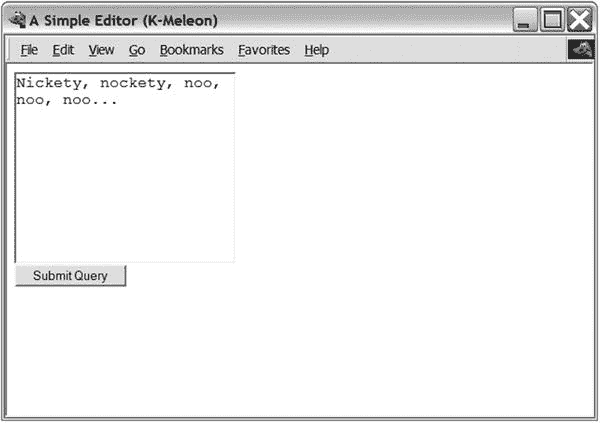
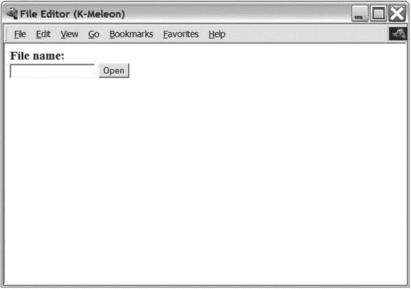
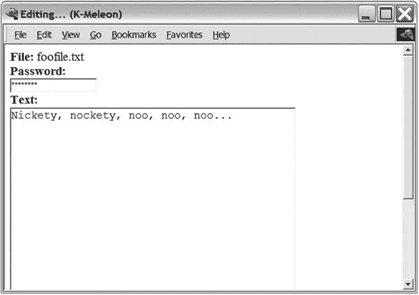

# 二十五、项目 6：CGI 远程编辑

本章的项目使用 CGI，在第 [15](15.html) 章会有更详细的讨论。具体应用是远程编辑——通过网络在另一台机器上编辑文档。这在协作系统(群件)中很有用，例如，几个人可能在处理同一个文档。它也可以用于更新您的网页。

## 有什么问题？

您在一台机器上存储了一个文档，并希望能够通过 Web 从另一台机器上编辑它。这使您能够拥有由几个协作作者编辑的共享文档。您不需要使用 FTP 或类似的文件传输技术，也不需要担心同步多个副本。要编辑这个文件，你只需要一个网络浏览器。

Note

这种远程编辑是维基的核心机制之一(例如， [`http://en.wikipedia.org/wiki/Wiki`](http://en.wikipedia.org/wiki/Wiki) )。

具体而言，系统应满足以下要求:

*   它应该能够将文档显示为正常的网页。
*   它应该能够在 web 表单的文本区域显示文档。
*   您应该能够保存表单中的文本。
*   程序应该用密码保护文档。
*   该程序应该易于扩展，以支持编辑多个文档。正如您将看到的，使用标准的 Python 库模块`cgi`和一些普通的 Python 编码，所有这些都很容易做到。然而，该应用中使用的技术可以用于创建所有 Python 程序的 web 接口，因此非常有用。

## 有用的工具

正如在第 15 章[中所讨论的，编写 CGI 程序的主要工具是`cgi`模块，以及用于调试的`cgitb`模块。更多信息参见第](15.html) [15 章](15.html)。

## 准备

在第 [15](15.html) 章的“使用 CGI 的动态网页”一节中详细描述了通过网络访问 CGI 脚本的步骤只要按照这些步骤去做，你应该会没事的。

## 首次实施

第一个实现基于清单 15-7 所示的问候脚本的基本结构(第 [15](15.html) 章)。第一个原型所需要的只是一些文件处理。

为了使脚本有用，它必须在调用之间存储编辑过的文本。此外，表单应该比问候脚本(第 [15 章](15.html)中的清单 15-7 中的`simple3.cgi`)中的要大一点，文本字段应该变成一个文本区域。你也应该使用`POST` CGI 方法，而不是默认的`GET`方法。(如果您正在提交大量数据，通常应该使用`POST`。)

程序的一般逻辑如下:

1.  以数据文件的当前值为默认值获取 CGI 参数`text`。
2.  将文本保存到数据文件中。
3.  打印出表格，文本在`textarea`中。

为了允许脚本写入您的数据文件，您必须首先创建这样一个文件(例如，`simple_edit.dat`)。它可以是空的，也可以包含初始文档(一个纯文本文件，可能包含某种形式的标记，如 XML 或 HTML)。然后你必须设置权限，使它是通用可写的，如第 [15 章](15.html)所述。结果代码如清单 [25-1](#Par19) 所示。

```py
#!/usr/bin/env python

import cgi
form = cgi.FieldStorage()

text = form.getvalue('text', open('simple_edit.dat').read())
f = open('simple_edit.dat', 'w')
f.write(text)
f.close()

print("""Content-type: text/html

<html>
  <head>
     <title>A Simple Editor</title>
  </head>

  <body>
     <form action='simple_edit.cgi' method='POST'>
     <textarea rows='10' cols='20' name='text'>{}</textarea><br />
     <input type='submit' />
     </form>
  </body>
</html>
""".format(text))

Listing 25-1.A Simple Web Editor

(simple_edit.cgi)

```

当通过 web 服务器访问时，CGI 脚本检查名为`text`的输入值。如果提交了这样的值，文本将被写入文件`simple_edit.dat`。默认值是文件的当前内容。最后显示一个网页(包含编辑和提交文本的字段)，如图 [25-1](#Fig1) 所示。



图 25-1。

The simple_edit.cgi script in action

## 第二次实施

现在你有了第一辆上路的原型车，还缺什么？系统应该能够编辑多个文件，并且应该使用密码保护。(因为文档可以通过直接在浏览器中打开来查看，所以您不会太注意系统的查看部分。)

与第一个原型的主要区别在于，你将它分成两个独立的 CGI 脚本(一个用于你的系统应该能够执行的每个“动作”)。新原型的文件如下:

*   一个普通的网页，带有一个可以输入文件名的表单。它还有一个打开按钮，可以触发`edit.cgi`。
*   `edit.cgi`:在文本区域显示给定文件的脚本。它有一个用于输入密码的文本字段和一个触发`save.cgi`的保存按钮。
*   `save.cgi`:将接收到的文本保存到给定文件并显示简单消息(例如，“文件已保存”)的脚本。这个脚本还应该负责密码检查。

让我们逐一解决这些问题。

### 创建文件名表单

`index.html`是一个 HTML 文件，包含用于输入文件名的表单。

```py
<html>
  <head>
    <title>File Editor</title>
  </head>
  <body>
    <form action='edit.cgi' method='POST'>
      <b>File name:</b><br />
      <input type='text' name='filename' />
      <input type='submit' value='Open' />
  </body>
</html>

```

注意文本字段是如何命名的`filename`。这确保了它的内容将作为 CGI 参数`filename`提供给`edit.cgi`脚本(这是`form`标签的`action`属性)。如果您在浏览器中打开该文件，在文本字段中输入文件名，然后单击 open，将会运行`edit.cgi`脚本。

### 编写编辑器脚本

由`edit.cgi`脚本显示的页面应该包括一个包含您正在编辑的文件的当前文本的文本区域和一个用于输入密码的文本字段。唯一需要的输入是文件名，脚本从`index.html`中的表单接收文件名。但是，请注意，可以直接打开`edit.cgi`脚本，而无需在`index.html`中提交表单。在这种情况下，你不能保证`cgi.FieldStorage`的`filename`字段被设置。所以你需要添加一个检查来确保有一个文件名。如果有，文件将从包含可编辑文件的目录中打开。我们把目录叫做`data`。(当然，您必须创建这个目录。)

Caution

请注意，通过提供包含路径元素的文件名，例如..(两点)，就有可能访问这个目录之外的文件。为了确保被访问的文件在给定的目录中，您应该执行一些额外的检查，例如列出目录中的所有文件(例如使用`glob`模块)并检查所提供的文件名是否是候选文件之一(确保您使用完整的绝对路径名)。另一种方法见第 [27 章](27.html)中的“验证文件名”一节。

然后，代码变成类似清单 [25-2](#Par33) 的东西。

```py
#!/usr/bin/env python

print('Content-type: text/html\n')

from os.path import join, abspath
import cgi, sys

BASE_DIR = abspath('data')

form = cgi.FieldStorage()
filename = form.getvalue('filename')
if not filename:
    print('Please enter a file name')
    sys.exit()
text = open(join(BASE_DIR, filename)).read()

print("""
<html>
    <head>
        <title>Editing...</title>
    </head>
    <body>
        <form action='save.cgi' method='POST'>
            <b>File:</b> {}<br />
            <input type='hidden' value='{}' name='filename' />
            <b>Password:</b><br />
            <input name='password' type='password' /><br />
            <b>Text:</b><br />
            <textarea name='text' cols='40' rows='20'>{}</textarea><br />
            <input type='submit' value='Save' />
        </form>
    </body>
</html>
""".format(filename, filename, text))

Listing 25-2.The Editor Script (edit.cgi)

```

注意，`abspath`函数已经被用来获取`data`目录的绝对路径。还要注意，文件名已经存储在一个`hidden`表单元素中，因此它将被传递给下一个脚本(`save.cgi`)，而不会给用户任何修改的机会。(当然，你无法保证这一点，因为用户可能会编写自己的表单，将它们放在另一台机器上，并让这些表单用自定义值调用你的 CGI 脚本。)

对于密码处理，示例代码使用类型为`password`的输入元素，而不是`text`，这意味着输入的字符将显示为星号。

Note

这个脚本基于一个假设，即给定的文件名指的是一个现有的文件。请随意扩展它，以便它也可以处理其他情况。

### 编写保存脚本

执行保存的脚本是这个简单系统的最后一个组件。它接收文件名、密码和一些文本。它检查密码是否正确，如果正确，程序将文本存储在具有给定文件名的文件中。(该文件应正确设置其权限；参见第 [15 章](15.html)中关于设置文件权限的讨论。)

只是为了好玩，我们将在密码处理中使用`sha`模块。安全哈希算法(SHA)是一种从输入字符串中提取看似随机的实际上无意义的数据字符串(摘要)的方法。该算法背后的思想是，构造一个具有给定摘要的字符串几乎是不可能的，所以如果你知道(例如)一个密码的摘要，你就没有(容易的)方法来重建密码或发明一个将再现摘要的密码。这意味着您可以安全地将提供的密码摘要与存储的(正确密码的)摘要进行比较，而不是比较密码本身。通过使用这种方法，您不需要将密码本身存储在源代码中，阅读代码的人也不会知道密码实际上是什么。

Caution

我说过，这个“安全”功能主要是为了好玩。除非您使用 SSL 或类似技术的安全连接(这超出了本项目的范围)，否则仍然有可能获得通过网络提交的密码。此外，这里使用的 SHA1 算法不再被认为是特别安全的。

下面是一个如何使用`sha`的例子:

```py
>>> from hashlib import sha1
>>> sha1(b'foobar').hexdigest()
'8843d7f92416211de9ebb963ff4ce28125932878'
>>> sha1(b'foobaz').hexdigest()
'21eb6533733a5e4763acacd1d45a60c2e0e404e1'

```

正如你所看到的，密码的一个小变化会给你一个完全不同的摘要。你可以在清单 [25-3](#Par43) 中看到`save.cgi`的代码。

```py
#!/usr/bin/env python

print('Content-type: text/html\n')

from os.path import join, abspath
from hashlib import sha1
import cgi, sys

BASE_DIR = abspath('data')

form = cgi.FieldStorage()

text = form.getvalue('text')
filename = form.getvalue('filename')
password = form.getvalue('password')

if not (filename and text and password):
     print('Invalid parameters.')
     sys.exit()

if sha1(password.encode()).hexdigest() != '8843d7f92416211de9ebb963ff4ce28125932878':
     print('Invalid password')
     sys.exit()

f = open(join(BASE_DIR,filename), 'w')
f.write(text)
f.close()

print('The file has been saved.')

Listing 25-3.The Saving Script (save.cgi)

```

### 运行编辑器

按照以下步骤使用编辑器:

1.  Open the page `index.html` in a web browser. Be sure to open it through a web server (by using a URL of the form [`http://www.someserver.com/index.html`](http://www.someserver.com/index.html) ) and not as a local file. The result is shown in Figure [25-2](#Fig2).

    

    图 25-2。

    The opening page of the CGI editor  
2.  Enter a file name of a file that your CGI editor is permitted to modify and then click Open. Your browser should then contain the output of the `edit.cgi` script, as shown in Figure [25-3](#Fig3).

    

    图 25-3。

    The editing page of the CGI editor  
3.  根据个人喜好编辑文件，输入密码(您自己设置的密码，或者示例中使用的密码`foobar`)，然后单击 Save。然后，您的浏览器应该包含`save.cgi`脚本的输出，这只是一条消息“文件已保存”
4.  如果要验证文件是否已被修改，请重复打开文件的过程(步骤 1 和 2)。

## 进一步探索

使用本项目中展示的技术，您可以开发各种 web 系统。对现有系统的一些可能的补充如下:

*   添加版本控制。保存已编辑文件的旧副本，以便您可以“撤销”您的更改。
*   添加对用户名的支持，这样您就知道谁更改了什么。
*   添加文件锁定(例如，使用`fcntl`模块),这样两个用户就不能同时编辑文件。
*   添加一个自动向文件添加标记的`view.cgi`脚本(就像第 [20 章](20.html)中的那个)。
*   通过更彻底地检查脚本的输入并添加更多用户友好的错误消息，使脚本更加健壮。
*   避免打印类似“文件已保存”的确认消息您可以添加一些更有用的输出，或者将用户重定向到另一个页面/脚本。重定向可以用`Location`头来完成，它的工作方式类似于`Content-type`。只需在输出的头部分添加`Location:`，后跟一个空格和一个 URL(在第一个空行之前)。

除了扩展这个 CGI 系统的功能之外，你可能想要为 Python 测试一些更复杂的 web 环境(如第 [15](15.html) 章所讨论的)。

### 什么现在？

现在你已经尝试过编写 CGI 脚本了。在下一个项目中，您将使用 SQL 数据库进行存储。有了这种强大的组合，您将实现一个全功能的基于 web 的公告板。