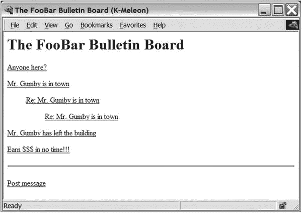
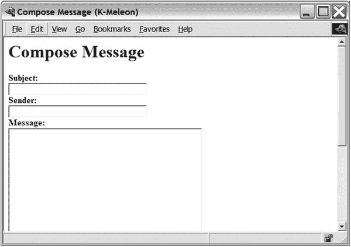
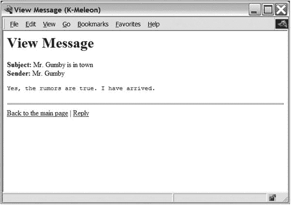

# 26.项目 7:你自己的公告板

许多种类的软件使你能够在互联网上与其他人交流。你已经看到了一些(例如，第 [23](23.html) 章的新闻组组和第 [24](24.html) 章的聊天服务器)。在本章中，您将实现另一个这样的系统:一个基于 web 的论坛。虽然功能与复杂的社交媒体平台相去甚远，但它确实实现了评论系统所需的基本功能。

## 有什么问题？

在本项目中，您将创建一个通过 Web 发布和回复消息的简单系统。作为一个论坛，这本身就很有用。本章中开发的系统非常简单，但是基本的功能是有的，它应该能够处理大量的帖子。

然而，本章涵盖的材料除了开发独立的论坛之外还有其他用途。例如，它可以用来实现一个更通用的协作系统，或者一个问题跟踪系统，一个具有评论功能的博客，或者一些完全不同的东西。CGI(或类似的技术)和一个可靠的数据库(在这里是一个 SQL 数据库)的结合是非常强大和通用的。

Tip

尽管编写自己的代码既有趣又有教育意义，但在许多情况下，搜索现有的解决方案更划算。在论坛之类的情况下，您可能会发现相当多的开发良好的系统是免费提供的。此外，大多数 web 应用程序框架(在第 [15 章](15.html)中讨论)都内置了对这种功能的支持。

具体来说，最终系统应满足以下要求:

*   它应该显示所有当前消息的主题。
*   它应该支持消息线程(在他们回复的消息下显示缩进的回复)。
*   您应该能够查看现有的消息。
*   您应该能够回复现有的消息。

除了这些功能需求之外，如果系统相当稳定，能够处理大量消息，并且避免两个用户同时写入同一个文件这样的问题，那就更好了。通过使用某种类型的数据库服务器，而不是自己编写文件处理代码，可以实现所需的健壮性。

## 有用的工具

除了第 15 章中的 CGI 内容，你还需要一个 SQL 数据库，如第 13 章[中所讨论的。您可以使用独立的数据库 SQLite(在该章中使用),也可以使用其他系统，例如以下两个优秀的免费数据库中的任何一个:](13.html)

*   PostgreSQL ( [`http://www.postgresql.org`](http://www.postgresql.org)
*   MySQL ( [`http://www.mysql.org`](http://www.mysql.org)

在这一章中，我使用 PostgreSQL 作为例子，但是代码只需稍加编辑就可以用于大多数 SQL 数据库(包括 MySQL 或 SQLite)。

在继续之前，您应该确保能够访问 SQL 数据库服务器(或独立的 SQL 数据库，如 SQLite ),并查看其文档以了解如何管理它。

除了数据库服务器本身，您还需要一个能够与服务器交互的 Python 模块(并对您隐藏细节)。大多数这样的模块支持 Python DB API，这将在第 [13 章](13.html)中详细讨论。在这一章中，我使用了`psycopg` ( [`http://initd.org`](http://initd.org) )，PostgreSQL 的一个健壮前端。如果你正在使用 MySQL，那么`MySQLdb`模块( [`http://sourceforge.net/projects/mysql-python`](http://sourceforge.net/projects/mysql-python) )是一个不错的选择。

安装完数据库模块后，您应该能够导入它(例如，用`import psycopg`或`import MySQLdb`)而不会引发任何异常。

## 准备

在您的程序可以开始使用您的数据库之前，您必须实际创建数据库。这是使用 SQL 完成的(参见第 [13 章](13.html)中的一些指针)。

数据库结构与问题有着密切的联系，一旦创建了数据库并用数据(消息)填充了数据库，就很难改变它。让我们保持简单。

您将只有一个表，其中每条消息占一行。每条消息都有一个唯一的 ID(一个整数)、一个主题、一个发件人(或发帖人)和一些文本(正文)。

此外，因为您希望能够分层显示消息(线程)，所以每条消息都应该存储一个对它所回复的消息的引用。产生的`CREATE TABLE` SQL 命令如清单 [26-1](#Par22) 所示。

```py
CREATE TABLE messages (
    id          SERIAL PRIMARY KEY,
    subject     TEXT NOT NULL,
    sender      TEXT NOT NULL,
    reply_to    INTEGER REFERENCES messages,
    text        TEXT NOT NULL
);

Listing 26-1.Creating the Database in PostgreSQL

```

注意，这个命令使用了一些 PostgreSQL 特有的特性(`SERIAL`)，这确保了每条消息自动接收一个惟一的 ID；`TEXT`数据类型；以及`REFERENCES`，它确保`reply_to`包含有效的消息 id)。清单 [26-2](#Par24) 显示了一个更加 MySQL 友好的版本。

```py
CREATE TABLE messages (
    id          INT NOT NULL AUTO_INCREMENT,
    subject     VARCHAR(100) NOT NULL,
    sender      VARCHAR(15) NOT NULL,
    reply_to    INT,
    text        MEDIUMTEXT NOT NULL, PRIMARY KEY(id)
);
Listing 26-2.Creating the Database in MySQL

```

最后，对于那些使用 SQLite 的人来说，清单 [26-3](#Par26) 中有一个模式。

```py
create table messages (
    id          integer primary key autoincrement,
    subject     text not null,
    sender      text not null,
    reply_to    int,
    text        text not null
);
Listing 26-3.Creating the Database in SQLite

```

我将这些代码片段保持简单(SQL 专家肯定会找到改进它们的方法)，因为这一章的重点毕竟是 Python 代码。SQL 语句创建一个包含以下五个字段(列)的新表:

*   `id`:用于识别单个消息。数据库管理器会自动为每条消息接收一个惟一的 ID，因此您不必担心如何从 Python 代码中分配这些 ID。
*   `subject`:包含消息主题的字符串。
*   `sender`:包含发件人姓名或电子邮件地址等内容的字符串。
*   `reply_to`:如果该报文是对另一报文的回复，该字段包含另一报文的`id`。(否则，该字段将不包含任何内容。)
*   `text`:包含消息正文的字符串。

当您创建了这个数据库并对其设置了权限，从而允许您的 web 服务器读取其内容并插入新行时，您就可以开始编写 CGI 代码了。

## 首次实施

在这个项目中，第一个原型非常有限。这是一个使用数据库功能的脚本，因此您可以感受一下它是如何工作的。一旦确定了这一点，编写其他必要的脚本就不会很难了。从很多方面来说，这只是对第 13 章所涵盖内容的一个简短提醒。

代码的 CGI 部分与第 [25](25.html) 章非常相似。如果你还没有读过那一章，你可能想看一看。你还应该确保阅读第 15 章[中的“CGI 安全风险”一节。](15.html)

Caution

在本章的 CGI 脚本中，我已经导入并启用了`cgitb`模块。这对于发现代码中的缺陷非常有用，但是您可能应该在部署软件之前删除对`cgitb.enable`的调用——您可能不希望普通用户面临完整的`cgitb`回溯。

首先，您需要知道 Python DB API 是如何工作的。如果你还没有读过第 13 章，你现在至少应该浏览一下。如果您想直接点击，这里是核心功能(用您的数据库模块的名称替换`db`—例如，`psycopg`或`MySQLdb`):

*   `conn = db.connect('user=foo password=bar dbname=baz')`:以用户`foo`的身份用密码`bar`连接到名为`baz`的数据库，并将返回的连接对象分配给`conn`。(注意`connect`的参数是一个字符串。)

Caution

在这个项目中，我假设您有一台运行数据库和 web 服务器的专用机器。应该只允许给定用户(`foo`)从该机器进行连接，以避免不必要的访问。因此没有必要使用密码，但是您的数据库可能需要您设置一个密码。如果你想公开这个论坛，你应该确保你学习了更多关于适当的安全措施，因为这个示例项目是不安全的！

*   `curs = conn.cursor()`:从连接对象中获取光标对象。游标用于实际执行 SQL 语句并获取结果。
*   `conn.commit()`:提交自上次提交以来由 SQL 语句引起的更改。
*   `conn.close()`:关闭连接。
*   `curs.execute(sql_string)`:执行一条 SQL 语句。
*   `curs.fetchone()`:获取一个结果行作为一个序列——例如，一个元组。
*   `curs.dictfetchone()`:获取一个结果行作为字典。(这不是标准的一部分，因此并非在所有模块中都可用。)
*   `curs.fetchall()`:获取所有结果行，作为一个序列序列—例如，一个元组列表。
*   `curs.dictfetchall()`:获取所有结果行作为字典序列(例如，一个列表)。(这不是标准的一部分，因此并非在所有模块中都可用。)

下面是一个简单的测试(假设`psycopg`)—检索数据库中的所有消息(该数据库目前为空，因此您不会得到任何消息):

```py
>>> import psycopg2
>>> conn = psycopg2.connect('user=foo password=bar dbname=baz')
>>> curs = conn.cursor()
>>> curs.execute('SELECT * FROM messages')
>>> curs.fetchall()
[]

```

因为您还没有实现 web 界面，所以如果您想测试数据库，您必须手动输入消息。你可以通过一个管理工具(比如 MySQL 的`mysql`或者 PostgreSQL 的`psql`)来实现，或者你可以在数据库模块中使用 Python 解释器。

下面是一段有用的代码，您可以将其用于测试目的:

```py
#!/usr/bin/env python
# addmessage.py
import psycopg2
conn = psycopg2.connect('user=foo password=bar dbname=baz)
curs = conn.cursor()

reply_to = input('Reply to: ')
subject = input('Subject: ')
sender = input('Sender: ')
text = input('Text: ')

if reply_to:
    query = """
    INSERT INTO messages(reply_to, sender, subject, text)
    VALUES({}, '{}', '{}', '{}')""".format(reply_to, sender, subject, text)
else:
    query = """
     INSERT INTO messages(sender, subject, text)
     VALUES('{}', '{}', '{}')""".format(sender, subject, text)

curs.execute(query)
conn.commit()

```

注意这段代码有点粗糙。它不会为您跟踪 id(您必须确保您作为`reply_to`输入的内容是有效的 ID，如果有的话)，并且它不能正确处理包含单引号的文本(这可能会有问题，因为单引号在 SQL 中被用作字符串分隔符)。当然，这些问题将在最终系统中处理。

尝试添加一些消息，并在交互式 Python 提示符下检查数据库。如果一切正常，那么是时候编写一个访问数据库的 CGI 脚本了。

既然你已经弄清楚了处理数据库的代码，并且可以从第 25 章[中抓取一些现成的 CGI 代码，那么编写一个查看消息主题的脚本(论坛“主页”的简单版本)应该不会太难。您必须进行标准的 CGI 设置(在本例中，主要是打印`Content-type`字符串)，进行标准的数据库设置(获得一个连接和一个游标)，执行一个简单的 SQL `select`命令来获得所有的消息，然后用`curs.fetchall`或`curs.dictfetchall`检索结果行。](25.html)

清单 [26-4](#Par65) 展示了一个完成这些事情的脚本。清单中唯一真正新的东西是格式化代码，它用于获得线程化的外观，回复显示在它们所回复的消息的下方和右侧。

它基本上是这样工作的:

1.  对于每条消息，获取`reply_to`字段。如果是`None`(不是回复)，将该消息添加到顶级消息列表中。否则，将该消息附加到保存在`children[parent_id]`的儿童列表中。
2.  对于每个顶级消息，调用`format`。`format`函数打印消息的主题。同样，如果消息有孩子，它打开一个`blockquote`元素(HTML)，为每个孩子调用`format`(递归)，并结束`blockquote`元素。

如果你在你的网络浏览器中打开这个脚本(参见第 [15 章](15.html)关于如何运行 CGI 脚本的信息)，你应该会看到你添加的所有消息(或者它们的主题)的线程视图。

要了解公告板的样子，请参见本章后面的图 [26-1](#Fig1) 。



图 26-1。

The main page Note

如果你正在使用 SQLite，你不能使用`dictfetchall`，如清单 [26-4](#Par65) 所示。行`rows = curs.dictfetchall()`可以替换为以下代码片段:

```py
names = [d[0] for d in curs.description]
rows = [dict(zip(names, row)) for row in curs.fetchall()]

```

```py
#!/usr/bin/python

print('Content-type: text/html\n')

import cgitb; cgitb.enable()

import psycopg2
conn = psycopg2.connect('user=foo password=bar dbname=baz')
curs = conn.cursor()

print("""
<html>
  <head>
    <title>The FooBar Bulletin Board</title>
  </head>
  <body>
    <h1>The FooBar Bulletin Board</h1>
    """)

curs.execute('SELECT * FROM messages')
rows = curs.dictfetchall()

toplevel = []
children = {}

for row in rows:
    parent_id = row['reply_to']
    if parent_id is None:
        toplevel.append(row)
    else:
        children.setdefault(parent_id, []).append(row)
    def format(row):
        print(row['subject'])
        try: kids = children[row['id']]
        except KeyError: pass
        else:
            print('<blockquote>')
            for kid in kids:
                format(kid)
            print('</blockquote>')

    print('<p>')

    for row in toplevel:
        format(row)

    print("""
        </p>
    </body>
    </html>
    """)

Listing 26-4.The Main Bulletin Board (simple_main.cgi

)

```

Note

如果由于某种原因，你不能让程序工作，那可能是你没有正确设置你的数据库。请查阅数据库文档，了解让给定用户连接和修改数据库需要做些什么。例如，您可能需要明确列出连接机器的 IP 地址。

## 第二次实施

第一个实现非常有限，因为它甚至不允许用户发布消息。在这一节中，我们将扩展第一个原型中的简单系统，它包含最终版本的基本结构。将添加一些措施来检查所提供的参数(例如检查`reply_to`是否真的是一个数字，以及是否真的提供了所需的参数)，但是您应该注意，使这样的系统健壮且用户友好是一项艰巨的任务。如果你打算使用这个系统(或者，我希望，是你自己的一个改进版本)，你应该准备在这些问题上做一些工作。

但是在你考虑提高稳定性之前，你需要一些有用的东西，对吗？那么，你从哪里开始呢？你如何构建系统？

构造 web 程序的一个简单方法(使用 CGI 等技术)是让用户执行的每个动作都有一个脚本。在这个系统中，这意味着以下脚本:

*   `main.cgi`:显示所有消息(线索)的主题，并带有文章本身的链接。
*   显示一篇文章，并包含一个可以让你回复的链接。
*   `edit.cgi`:以可编辑的形式显示一篇文章(带有文本字段和文本区域，就像第 [25 章](25.html)一样)。它的提交按钮链接到保存脚本。
*   `save.cgi`:接收关于文章的信息(从`edit.cgi`)，并通过在数据库表中插入新行来保存它。

让我们分别处理这些。

### 编写主脚本

`main.cgi`脚本与第一个原型中的`simple_main.cgi`脚本非常相似。主要区别是增加了链接。每个主题将是一个给定消息的链接(到`view.cgi`)，在页面底部，您将添加一个允许用户发布新消息的链接(到`edit.cgi`的链接)。

看看清单 [26-5](#Par79) 中的代码。包含每篇文章链接的行(`format`函数的一部分)如下所示:

```py
print('<p><a href="view.cgi?id={id}i">{subject}</a></p>'.format(row))

```

基本上，它创建了一个到`view.cgi?id=someid`的链接，其中`someid`是给定行的`id`。这个语法(问号和`key=val`)只是向 CGI 脚本传递参数的一种方式。这意味着如果用户点击这个链接，他们将被带到正确设置了`id`参数的`view.cgi`。“发布消息”链接只是一个到`edit.cgi`的链接。

```py
#!/usr/bin/python

print('Content-type: text/html\n')

import cgitb; cgitb.enable()

import psycopg2
conn = psycopg2.connect('user=foo password=bar dbname=baz')
curs = conn.cursor()

print("""
<html>
  <head>
     <title>The FooBar Bulletin Board</title>
  </head>
     <body>
       <h1>The FooBar Bulletin Board</h1>
       """)

curs.execute('SELECT * FROM messages')
rows = curs.dictfetchall()

toplevel = []
children = {}

for row in rows:
    parent_id = row['reply_to']
    if parent_id is None:
        toplevel.append(row)
    else:
        children.setdefault(parent_id, []).append(row)

def format(row):
    print('<p><a href="view.cgi?id={id}i">{subject}</a></p>'.format(row))
    try: kids = children[row['id']]
    except KeyError: pass
    else:
        print('<blockquote>')
        for kid in kids:
            format(kid)
        print('</blockquote>')
    print('<p>')

for row in toplevel:

    format(row)

print("""
     </p>
     <hr />
     <p><a href="edit.cgi">Post message</a></p>
  </body>
</html>
""")

Listing 26-5.The Main Bulletin Board (main.cgi)

```

所以，我们来看看`view.cgi`是如何处理`id`参数的。

### 编写视图脚本

`view.cgi`脚本使用提供的 CGI 参数`id`从数据库中检索一条消息。然后，它用结果值格式化一个简单的 HTML 页面。这个页面还包含一个返回到主页(`main.cgi`)的链接，更有趣的是，还包含一个到`edit.cgi`的链接，但是这次将`reply_to`参数设置为`id`，以确保新消息是对当前消息的回复。`view.cgi`的代码见清单 [26-6](#Par82) 。

```py
#!/usr/bin/python

print('Content-type: text/html\n')

import cgitb; cgitb.enable()

import psycopg2
conn = psycopg2.connect('user=foo password=bar dbname=baz')
curs = conn.cursor()

import cgi, sys
form = cgi.FieldStorage()
id = form.getvalue('id')

print("""
<html>
  <head>
    <title>View Message</title>
  </head>
  <body>
    <h1>View Message</h1>
    """)

try: id = int(id)
except:
     print('Invalid message ID')
     sys.exit()

curs.execute('SELECT * FROM messages WHERE id = %s', (format(id),))
rows = curs.dictfetchall()

if not rows:
     print('Unknown message ID')

     sys.exit()

row = rows[0]

print("""
     <p><b>Subject:</b> {subject}<br />
     <b>Sender:</b> {sender}<br />
     <pre>{text}</pre>
     </p>
     <hr />
     <a href='main.cgi'>Back to the main page</a>
     | <a href="edit.cgi?reply_to={id}">Reply</a>
  </body>
</html>
""".format(row))

Listing 26-6.The Message Viewer (view.cgi)

```

使用 SQL 包本身的拼接机制避免了我们前面的单引号问题——并使代码更安全。

Caution

您应该避免将不受信任的文本直接插入到要用作 SQL 查询的字符串中，因为这样的代码容易受到所谓的 SQL 注入攻击。相反，使用 Python DB API 占位符机制，并为`curs.execute`提供一个额外的参数元组。更多信息请参见，例如， [`http://bobby-tables.com`](http://bobby-tables.com) 。

### 编写编辑脚本

`edit.cgi`脚本实际上执行双重功能:它用于编辑新消息，也用于编辑回复。区别并不是很大:如果在 CGI 请求中提供了一个`reply_to`,它会保存在编辑表单中的一个隐藏输入中。隐藏输入用于在 web 表单中临时存储信息。它们不会像文本区域等那样显示给用户，但是它们的值仍然会传递给 CGI 脚本，也就是表单的动作。

此外，默认情况下主题被设置为`"Re: parentsubject"`(除非主题已经以`"Re:"`开头——您不想继续添加它们)。下面是处理这些细节的代码片段:

```py
subject = ''
if reply_to is not None:
    print('<input type="hidden" name="reply_to" value="{}"/>'.format(reply_to))
    curs.execute('SELECT subject FROM messages WHERE id = %s', (reply_to,))
    subject = curs.fetchone()[0]
    if not subject.startswith('Re: '):
        subject = 'Re: ' + subject

```

这样，生成表单的脚本可以将信息传递给最终将处理相同表单的脚本。

清单 [26-7](#Par90) 显示了`edit.cgi`脚本的源代码。

```py
#!/usr/bin/python

print('Content-type: text/html\n')

import cgitb; cgitb.enable()

import psycopg2
conn = psycopg2.connect('user=foo password=bar dbname=baz')
curs = conn.cursor()

import cgi, sys
form = cgi.FieldStorage()
reply_to = form.getvalue('reply_to')

print("""
<html>
  <head>
    <title>Compose Message</title>
  </head>
  <body>
    <h1>Compose Message</h1>

    <form action='save.cgi' method='POST'>
    """)

subject = ''
if reply_to is not None:
    print('<input type="hidden" name="reply_to" value="{}"/>'.format(reply_to))
    curs.execute('SELECT subject FROM messages WHERE id = %s', (format(reply_to),))
    subject = curs.fetchone()[0]
    if not subject.startswith('Re: '):
        subject = 'Re: ' + subject

print("""
     <b>Subject:</b><br />
     <input type='text' size='40' name='subject' value='{}' /><br />
     <b>Sender:</b><br />
     <input type='text' size='40' name='sender' /><br />
     <b>Message:</b><br />
     <textarea name='text' cols='40' rows='20'></textarea><br />
     <input type='submit' value='Save'/>
     </form>
     <hr />
     <a href='main.cgi'>Back to the main page</a>'
  </body>
</html>
""".format(subject))

Listing 26-7.The Message Editor (edit.cgi)

```

### 编写保存脚本

现在让我们进入最后的剧本。`save.cgi`脚本将接收关于消息的信息(来自`edit.cgi`生成的表单),并将它存储在数据库中。这意味着使用 SQL `INSERT`命令，因为数据库已经被修改，所以必须调用`conn.commit`，这样当脚本终止时更改不会丢失。

清单 [26-8](#Par93) 显示了`save.cgi`脚本的源代码。

```py
#!/usr/bin/python

print('Content-type: text/html\n')

import cgitb; cgitb.enable()

import psycopg2
conn = psycopg2.connect('user=foo password=bar dbname=baz')
curs = conn.cursor()

import cgi, sys
form = cgi.FieldStorage()

sender = form.getvalue('sender')
subject = form.getvalue('subject')
text = form.getvalue('text')
reply_to = form.getvalue('reply_to')

if not (sender and subject and text):
    print('Please supply sender, subject, and text')
    sys.exit()

if reply_to is not None:
    query = ("""
    INSERT INTO messages(reply_to, sender, subject, text)
    VALUES(%s, '%s', '%s', '%s')""", (int(reply_to), sender, subject, text))
else:
    query = ("""
    INSERT INTO messages(sender, subject, text)
    VALUES('%s', '%s', '%s')""", (sender, subject, text))

curs.execute(*query)
conn.commit()

print("""
<html>

<head>
  <title>Message Saved</title>
</head>
<body>
  <h1>Message Saved</h1>
  <hr />
  <a href='main.cgi'>Back to the main page</a>
</body>
</html>s
""")

Listing 26-8.The Save Script (save.cgi)

```

### 尝试一下

要测试该系统，首先打开`main.cgi`。在那里，单击发布消息链接。那应该带你去`edit.cgi`。在所有字段中输入一些值，然后单击保存链接。

这将把您带到`save.cgi`，它将显示消息“消息已保存”点击返回主页面链接返回`main.cgi`。列表现在应该包括您的新消息。

要查看您的邮件，只需点击其主题。您应该使用正确的 ID 前往`view.cgi`。从那里，试着点击回复链接，这将再次把你带到`edit.cgi`，但是这次设置了`reply_to`(在一个隐藏的输入标签中)和一个默认的主题。再次输入一些文本，单击 Save，然后返回主页。它现在应该显示您的回复，显示在原始主题下。(如果没有显示，请尝试重新加载页面。)

主页面如图 [26-1](#Fig1) ，消息查看器如图 [26-2](#Fig2) ，消息编辑器如图 [26-3](#Fig3) 。



图 26-3。

The message composer



图 26-2。

The message viewer

## 进一步探索

既然您已经有能力开发具有可靠和高效存储的庞大而强大的 web 应用程序，那么您就有很多事情可以投入进去了。

*   为你最喜欢的 Monty Python 草图数据库做一个 web 前端怎么样？
*   如果你对改进本章的系统感兴趣，你应该考虑抽象。创建一个具有打印标准页眉和打印标准页脚功能的实用模块如何？这样，您就不需要在每个脚本中编写相同的 HTML 内容。此外，添加一个具有某种密码处理功能的用户数据库或者抽象出用于创建连接的代码可能会很有用。
*   如果您想要一个不需要专用服务器的存储解决方案，您可以使用 SQLite(在第 [13 章](13.html)中使用)，或者一些非 SQL 解决方案，如 MongoDB ( [`https://mongodb.com`](https://mongodb.com) )，甚至更技术性的文件格式，如 HDF5 ( [`http://h5py.org`](http://h5py.org) )。

### 什么现在？

如果你认为编写自己的论坛软件很酷，那么编写自己的点对点文件共享程序怎么样，比如 BitTorrent？在下一个项目中，这正是你要做的。好消息是，由于远程过程调用的奇迹，这将比您迄今为止所做的大多数网络编程都要容易。