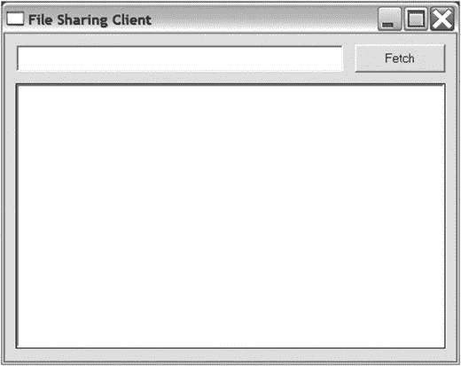

# 二十八、项目 9：文件共享 II——现在有了 GUI！

这是一个相对较短的项目，因为你需要的大部分功能已经写好了——在第 [27](27.html) 章。在这一章中，你会看到在现有的 Python 程序中添加 GUI 是多么容易。

## 有什么问题？

在这个项目中，我们将用一个 GUI 客户端来扩展在第 [27](27.html) 章中开发的文件共享系统。这将使程序更容易使用，这意味着更多的人可能会选择使用它(当然，多个用户共享文件是该程序的全部意义)。这个项目的第二个目标是展示一个具有足够模块化设计的程序可以非常容易扩展(这是使用面向对象编程的一个理由)。

GUI 客户端应满足以下要求:

*   它应该允许您输入一个文件名并提交给服务器的`fetch`方法。
*   它应该列出服务器文件目录中当前可用的文件。

就这样。因为系统的大部分已经可以工作了，所以 GUI 部分是一个相对简单的扩展。

## 有用的工具

除了第 [27](27.html) 章中使用的工具之外，您还需要 Tkinter 工具包，它与大多数 Python 安装捆绑在一起。有关 Tkinter 的更多信息，请参见第 [12](12.html) 章。如果您想使用另一个 GUI 工具包，请随意。本章中的例子将告诉你如何用你喜欢的工具构建你自己的实现。

## 准备

在你开始这个项目之前，你应该准备好项目 8(从第[章到第 27](27.html) 章)并且安装一个可用的 GUI 工具包，如前一节所述。除此之外，这个项目不需要任何重要的准备工作。

## 首次实施

如果您想看一眼第一个实现的完整源代码，您可以在本节后面的清单 [28-1](#Par12) 中找到它。许多功能与前一章中的项目非常相似。客户端提供一个接口(`fetch`方法),用户可以通过该接口访问服务器的功能。让我们回顾一下代码中特定于 GUI 的部分。

第 [27 章](27.html)中的客户端是`cmd.Cmd`的子类；本章中描述的`Client`包含`tkinter.Frame`的子类。虽然你不需要子类化`tkinter.Frame`(你可以创建一个完全独立的`Client`类)，但这是组织你代码的自然方式。与 GUI 相关的设置放在一个单独的方法中，称为`create_widgets`，在构造函数中调用。它为文件名创建一个条目，并创建一个获取给定文件的按钮，按钮的动作设置为方法`fetch_handler`。该事件处理程序与第 [27](27.html) 章中的处理程序`do_fetch`非常相似。它从`self.input`(文本字段)中检索查询。然后它在一个`try` / `except`语句中调用`self.server.fetch`。

第一个实现的源代码如清单 [28-1](#Par12) 所示。

```py
from xmlrpc.client import ServerProxy, Fault
from server import Node, UNHANDLED
from client import random_string
from threading import Thread
from time import sleep
from os import listdir
import sys
import tkinter as tk

HEAD_START = 0.1 # Seconds
SECRET_LENGTH = 100

class Client(tk.Frame):

    def __init__(self, master, url, dirname, urlfile):
        super().__init__(master)
        self.node_setup(url, dirname, urlfile)
        self.pack()
        self.create_widgets()

    def node_setup(self, url, dirname, urlfile):
        self.secret = random_string(SECRET_LENGTH)
        n = Node(url, dirname, self.secret)
        t = Thread(target=n._start)
        t.setDaemon(1)
        t.start()
        # Give the server a head start:
        sleep(HEAD_START)
        self.server = ServerProxy(url)
        for line in open(urlfile):
            line = line.strip()
            self.server.hello(line)

    def create_widgets(self):

        self.input = input = tk.Entry(self)
        input.pack(side='left')

        self.submit = submit = tk.Button(self)
        submit['text'] = "Fetch"
        submit['command'] = self.fetch_handler
        submit.pack()

    def fetch_handler(self):
        query = self.input.get()
        try:
            self.server.fetch(query, self.secret)
        except Fault as f:
            if f.faultCode != UNHANDLED: raise
            print("Couldn't find the file", query)

def main():
    urlfile, directory, url = sys.argv[1:]

    root = tk.Tk()
    root.title("File Sharing Client")

    client = Client(root, url, directory, urlfile)
    client.mainloop()

if __name__ == "__main__": main()

Listing 28-1.A Simple GUI Client (simple_guiclient.py)

```

除了前面解释的相对简单的代码，GUI 客户端的工作方式就像第 [27 章](27.html)中基于文本的客户端一样。您也可以用同样的方式运行它。要运行这个程序，您需要一个 URL 文件、一个要共享的文件目录和一个您的`Node`的 URL。下面是一个运行示例:

```py
$ python simple_guiclient.py urlfile.txt files/ http://localhost:8000

```

注意，文件`urlfile.txt`必须包含一些其他`Node`的 URL，程序才能使用。您可以在同一台机器上(使用不同的端口号)启动几个程序进行测试，也可以在不同的机器上运行它们。图 [28-1](#Fig1) 显示了客户端的图形用户界面。


图 28-1。

The simple GUI client

这个实现是可行的，但是它只完成了部分工作。它还应该列出服务器文件目录中可用的文件。为此，必须扩展服务器(`Node`)本身。

## 第二次实施

第一个原型非常简单。它做了文件共享系统的工作，但对用户不太友好。如果用户可以看到他们有哪些可用的文件(无论是在程序启动时位于文件目录中，还是随后从另一个`Node`下载)，这将非常有帮助。第二个实现将解决这个文件列表问题。完整的源代码可以在清单 [28-2](#Par23) 中找到。

要从`Node`获取列表，必须添加一个方法。你可以用密码来保护它，就像你对`fetch`所做的那样，但是公开它可能是有用的，并且它不代表任何真正的安全风险。扩展一个对象真的很容易:你可以通过子类化来实现。您只需用一个额外的方法`list`构造一个名为`ListableNode`的`Node`的子类，该方法使用方法`os.listdir`，返回一个目录中所有文件的列表。

```py
class ListableNode(Node):

    def list(self):
        return listdir(self.dirname)

```

为了访问这个服务器方法，方法`update_list`被添加到客户端。

```py
def update_list(self):
    self.files.Set(self.server.list())

```

属性`self.files`指的是一个列表框，它已经被添加到`create_widgets`方法中。在创建列表框时，在`create_widgets`中调用`update_list`方法，并且每次调用`fetch_handler`时再次调用(因为调用`fetch_handler`可能会改变文件列表)。

```py
from xmlrpc.client import ServerProxy, Fault
from server import Node, UNHANDLED
from client import random_string
from threading import Thread
from time import sleep
from os import listdir
import sys
import tkinter as tk

HEAD_START = 0.1 # Seconds
SECRET_LENGTH = 100

class ListableNode(Node):

    def list(self):
        return listdir(self.dirname)

class Client(tk.Frame):

    def __init__(self, master, url, dirname, urlfile):
        super().__init__(master)
        self.node_setup(url, dirname, urlfile)
        self.pack()
        self.create_widgets()

    def node_setup(self, url, dirname, urlfile):
        self.secret = random_string(SECRET_LENGTH)
        n = ListableNode(url, dirname, self.secret)
        t = Thread(target=n._start)
        t.setDaemon(1)
        t.start()
        # Give the server a head start:
        sleep(HEAD_START)
        self.server = ServerProxy(url)
        for line in open(urlfile):
            line = line.strip()
            self.server.hello(line)

    def create_widgets(self):
        self.input = input = tk.Entry(self)
        input.pack(side='left')

        self.submit = submit = tk.Button(self)
        submit['text'] = "Fetch"
        submit['command'] = self.fetch_handler
        submit.pack()

        self.files = files = tk.Listbox()
        files.pack(side='bottom', expand=True, fill=tk.BOTH)
        self.update_list()

    def fetch_handler(self):
        query = self.input.get()
        try:
            self.server.fetch(query, self.secret)
            self.update_list()
        except Fault as f:
            if f.faultCode != UNHANDLED: raise
            print("Couldn't find the file", query)

    def update_list(self):
        self.files.delete(0, tk.END)
        self.files.insert(tk.END, self.server.list())

def main():
    urlfile, directory, url = sys.argv[1:]

    root = tk.Tk()
    root.title("File Sharing Client")

    client = Client(root, url, directory, urlfile)
    client.mainloop()

if __name__ == '__main__': main()

Listing 28-2.The Finished GUI Client (guiclient.py)

```

就这样。现在，您有了一个支持 GUI 的对等文件共享程序，可以使用以下命令运行该程序:

```py
$ python guiclient.py urlfile.txt files/ http://localhost:8000

```

图 [28-2](#Fig2) 显示了完成的 GUI 客户端。



图 28-2。

The finished GUI client

当然，有很多方法可以扩展这个程序。对于一些想法，见下一节。除此之外，就让你的想象力天马行空吧。

## 进一步探索

第 27 章给出了一些扩展文件共享系统的想法。这里还有一些:

*   让用户选择所需的文件，而不是键入其名称。
*   添加一个状态栏，显示“正在下载”或“找不到文件 foo.txt”等消息
*   想办法让`Node`们分享他们的“朋友”例如，当一个`Node`被介绍给另一个`Node`时，他们每个人都可以把另一个介绍给它已经认识的`Node`。此外，在一个`Node`关闭之前，它可能会告诉它当前所有的邻居它知道的所有`Node`。
*   向 GUI 添加一个已知的`Node`列表。可以添加新的 URL 并将其保存在 URL 文件中。

### 什么现在？

您已经编写了一个成熟的支持 GUI 的对等文件共享系统。虽然这听起来很有挑战性，但其实并不难，不是吗？现在是时候面对最后也是最大的挑战了:编写你自己的街机游戏。