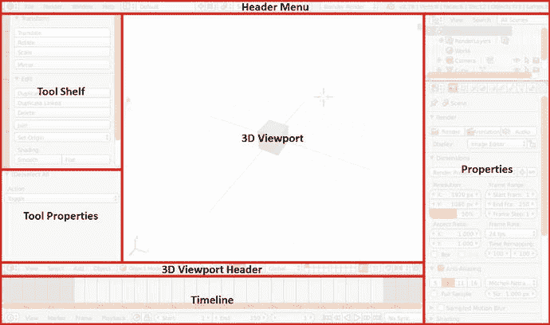
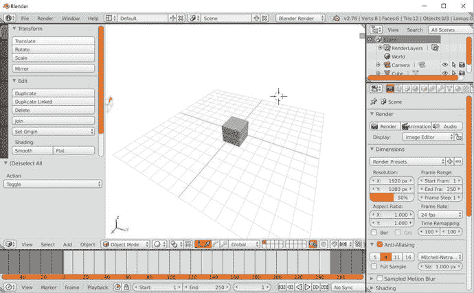
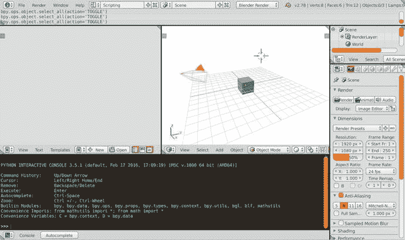
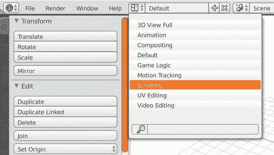
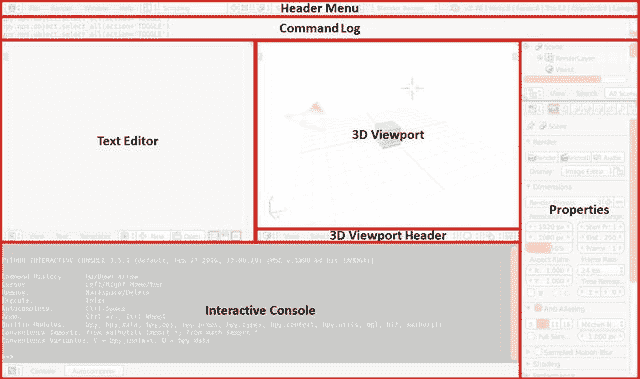
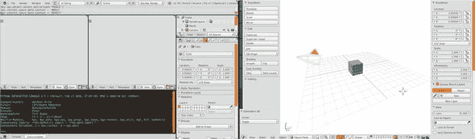
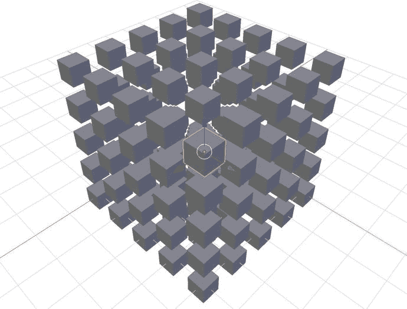

# 一、Blender 界面

本章讨论并定义 Blender 界面的组件。它作为我们在整个文本中讨论界面时使用的词汇的参考。我们将关注 Python 开发中最常用的接口组件，并为高效的 Python 脚本设置自定义接口。

为了避免在整本书中放置大的截图，我们严格定义了 Blender 界面中各种组件的名称。组件名称在这里以斜体介绍，并且在整个文本中第一个字符大写。

## 默认的 Blender 界面

当我们第一次打开 Blender 时，我们得到了熟悉的默认用户界面。我们在 3D 视口中的场景中绘制了一个立方体、一个相机对象和一个灯对象。图 [1-1](#Fig1) 是默认 Blender 界面的简单截图。图 [1-2](#Fig2) 显示了标注了各种主要部件的相同界面。我们讨论每个接口的功能。



图 1-2。

The components of the Default Blender interface



图 1-1。

The default Blender interface Note

为了便于打印，我们在 Blender 界面上应用了白橙色主题。默认的 Blender 主题是深灰色。

### 3D 视口

3D 视口，或简称为视口，为我们提供了工作产品的预览。当我们在 Blender 中操作数据时，3D 视口在更新自身之前等待所有进程完成写入数据。这在简单的操作中并不明显，比如平移和旋转，它们似乎是瞬间和实时发生的，但在插件开发中承认这一点仍然很重要。

3D 视口具有不同的查看选项和交互选项。查看选项包括实体、线框和渲染，而交互选项包括对象模式、编辑模式和雕刻模式。

### 标题菜单

标题菜单是图形用户界面的一个相当标准的标题。它允许我们在默认、动画和脚本等界面布局之间切换，以及在 Blender Render、Cycles Render 和 Blender Game 等渲染引擎之间切换。

### 属性窗口

“属性”窗口允许我们访问对象、场景、纹理、动画等的属性。“属性”窗口中的大多数界面会给出摘要和基本属性，而不是显示所有可用的详细信息。它对于跟踪现有对象、对象名称、已应用和未应用的转换以及其他一些重要属性非常有用。在 Blender artist 的布局中，此窗口通常总是打开的，因此它是放置附加功能的常用位置。

### 工具架和工具属性

工具架是按类型对不同类别的操作符进行分组的地方。如果我们展开窗口，我们可以看到工具架有各种选项卡，如工具、创建和关系。大多数 Blender 插件会在工具架上创建一个新的标签来保存它的操作符和参数。

工具属性窗口是一个动态窗口，Blender 根据用户激活的工具填充不同的参数集。例如，当使用旋转工具时，我们可以在此窗口中微调旋转，而不是导航到属性窗口中指定旋转的确切位置。工具属性是高级功能，通常旨在优化易用性，而不是为工具提供独特的功能。许多 Blender 插件完全忽略它们，只有少数原生 Blender 工具使用它们。

### 时间表

时间轴用于动画中。我们可以忽略这一点，因为我们不会在这本书的动画。

## 脚本接口

要进入脚本界面，请在标题菜单中帮助按钮右侧的下拉菜单中选择脚本选项。在整篇文章中，我们会用粗体的指令来呈现这样的指令，比如:标题菜单➤屏幕布局➤脚本。菜单的位置见图 [1-3](#Fig3) 。Blender 的布局将改变，如图 [1-4](#Fig4) 所示。



图 1-4。

The Scripting interface



图 1-3。

Selecting the Scripting interface

脚本布局，或者它的一些变体，将是我们在 Blender 中做大部分工作的地方。我们将讨论图 [1-5](#Fig5) 中介绍的 Blender 接口的新组件。



图 1-5。

Components of the Scripting interface

### 文字编辑器

我们可以在文本编辑器中编辑 Python 脚本(和任何其他文本文件)。我们可以分别单击“新建”和“打开”按钮来创建和打开脚本。一旦加载了脚本，文本编辑器底部的菜单栏将会改变，允许保存文件和在文件之间切换。

Blender 的文本编辑器有一些关于 Python 中的导入、系统路径和链接文件的特殊属性。我们将在本章的后面和以后的章节开发附加组件时详细讨论这一点。

### 命令日志

命令日志显示了 Blender 接口在会话期间进行的函数调用。在试验脚本和学习 API 时，这个窗口非常有用。例如，如果我们使用红色箭头在 3D 视口中平移立方体，我们会得到命令日志中清单 [1-1](#Par17) 所示的输出。

```py
bpy.ops.transform.translate(value=(3.05332, 0, 0), constraint_axis=(True, False, False),
                            constraint_orientation='GLOBAL', mirror=False, proportional='DISABLED', proportional_edit_falloff='SMOOTH', proportional_size=1, release_confirm=True)
Listing 1-1.Command Log Output from Translation Along x-Axis

```

清单 [1-1](#Par17) 中的输出显示我们从`bpy.ops`子模块的`transform`类中调用了`translate()`函数。这些参数相当冗长，并且在从接口发出的调用中经常是多余的，但是它们足够简单，我们可以解释它们的意思并对函数进行实验。我们将在下一章深入研究这样的代码。虽然解密通常是学习 Blender Python 中函数的最好和最快的方法，但是我们也可以参考官方文档来获得更多细节。这也将在下一章讨论。

### 交互式控制台

交互式控制台是一个 Python 3 环境，类似于常见的 Python 控制台和 IPython 控制台，它们经常出现在 IDEs(交互式开发环境)的底部。交互控制台不与文本编辑器脚本共享本地或模块级数据，但是交互控制台和文本编辑器脚本都可以访问存储在`bpy`及其子模块中的相同全局混合器数据。因此，控制台将不能读取或修改脚本本地的变量，但是对`bpy`(以及一般的 Blender 会话)的修改是共享的。

更复杂的是，控制台和脚本在 Blender 会话期间共享链接的脚本和系统路径变量。这些组件之间的关系可能看起来不必要的复杂，但是我们将会看到它们的关系对于开发和实验都是最佳的。

## 自定义界面

Blender 界面的组件是模块化的、可拆卸的、可扩展的和全面可定制的。用户可以拖动任何窗口的右上角来修改和创建新窗口。

*   向左拖动右上角将创建一个相同类型的新窗口
*   向右拖动右上角将允许您超越相邻的窗口
*   按住 Shift 键并向任意方向拖动右上角将在一个新的分离窗口中复制组件

在一个可分离的窗口中创建一个 3D 视窗并复制文本编辑器是使用双屏设置的好方法。拥有两个可用的文本编辑器对于调试定制模块非常有帮助。参见图 [1-6](#Fig6) 的双屏设置截图。



图 1-6。

Example of a dual-screen development interface

请注意，如果在界面上移动时工具架或工具属性窗口消失，请在 3D 视口中按键盘上的 T 键来显示它们。此外，在 3D 视口中按键盘上的 N 键会显示一个新窗口，即对象属性。这个窗口在插件开发中经常使用，特别是当我们开始将自定义的 Blender 类作为参数分配给我们的对象时。

## 从命令行启动 Blender(用于调试)

在 Blender 中开发 Python 脚本时，我们从命令行启动 Blender 是非常重要的。当我们在 Blender 中运行脚本时，如果我们得到一个错误，命令日志将显示以下消息:

```py
Python script fail, look in the console for now...

```

这条消息可能会非常混乱，因为交互式控制台将什么也不显示。Blender 的意思是:现在在终端中寻找…不幸的是，大多数人不通过终端打开 Blender，错误消息和回溯将不会被注意到，除非我们有一个在后台运行 Blender 的终端。通过终端打开 Blender 是 Python 开发者的非官方“调试模式”。Blender 有一个供核心开发者使用的官方调试模式，但这对于我们这些 API 用户来说一般没什么帮助。

要从终端打开 Blender，我们必须导航到保存在我们系统上的 Blender 发行版中的 Blender 可执行文件。确保已经下载了 Blender。来自 [`https://www.blender.org/download/`](https://www.blender.org/download/) 的适合操作系统的. zip 或. bz2 文件。将文件夹保存并解压缩到一个容易访问的位置。Windows 用户将打开命令提示符，UNIX 用户将打开终端。清单 [1-2](#Par31) 和 [1-3](#Par32) 分别显示了 Windows 和 UNIX 用户打开桌面上的 Blender 安装所需的命令。或者，Windows 用户可以正常打开 Blender，然后导航到标题菜单➤窗口➤切换系统控制台查看终端。

```py
# Assuming you are starting from C:\Users\%USERNAME%

cd Desktop\blender-2.78c-windows64

blender

# Navigating from anywhere on the Windows

# filesystem to Blender on the Desktop

cd C:\Users\%USERNAME%\Desktop\blender-2.78c-windows64

blender

# If an existing Blender install causes

# the wrong version to open, use blender.exe

cd C:\Users\%USERNAME%\Desktop\blender-2.78c-windows64

blender.exe

Listing 1-2.Opening Blender from the Command Line in Windows

```

```py
# Navigating to Blender on the Desktop from

# anywhere in the filesystem for Linux

cd ∼/Desktop/blender-2.78c-linux-glibc211-x86_64

./blender

# Navigating to Blender in the home directory for OSX

cd ∼/Desktop/blender-2.78c-OSX-10.6-x86_64

./blender

Listing 1-3.Opening Blender from the Command Line in UNIX

```

现在 Blender 正在从终端运行，它会将警告和错误转储到终端。如果我们退出终端，Blender 也会关闭。开发者应该总是从命令行打开 Blender 来获得详细的调试信息。我们通常会保持终端最小化，直到我们得到一个错误，然后最大化它来研究最近的输出。

## 运行我们的第一个 Python 脚本

有了本章介绍的信息，我们可以用命令行打开一个新的 Blender 会话，将界面安排成一个漂亮的开发布局，并准备好调试我们的 Python 代码。

我们的第一个目标是从立方体中创建一个立方体。我们将通过探索 Blender 和 API 的自然思维过程来创建实现我们目标的脚本。

### 寻找函数

首先，我们需要弄清楚哪个函数给场景添加了一个立方体。导航到三维视口，并转到三维视口标题➤添加➤网格➤立方体。现在导航到命令日志，验证该函数是否如清单 [1-4](#Par37) 所示执行。

```py
bpy.ops.mesh.primitive_cube_add(radius=1, view_align=False, enter_editmode=False,
                                location=(0, 0, 0), layers=(True, False, False, False, False, False, False, False, False, False, False, False, False, False, False, False, False, False, False, False))
Listing 1-4.Command Log Output for Adding a Cube to the Scene

```

### 测试功能

经过审查，我们看到许多论点，我们不需要完成我们的目标。我们不想进入编辑模式，我们不需要将 3D 视口与对象对齐，我们现在正在第一层工作。我们会猜测我们不需要参数`view_align, enter_editmode`和`layers`，并且它们的默认值是可以接受的。此外，我们将假设`radius`指定立方体的大小，而`location`指定位置。为了测试这一点，在交互控制台中运行清单 [1-5](#Par39) 。

```py
# Make a bigger cube sitting in the first quadrant

bpy.ops.mesh.primitive_cube_add(radius=3, location=(5, 5, 5))
Listing 1-5.Testing Defaults of primitive_cube_add()

```

通过在交互式控制台中运行清单 [1-5](#Par37) ，我们没有看到错误，并且我们在 3D 视口中看到一个以(5，5，5)为中心的大立方体。我们现在可以放心地在脚本中使用该函数来完成我们的目标，制作一个立方体的立方体。

从场景中删除我们的大立方体(和任何其他零散的物体),准备运行我们的脚本。在 3D 视口中使用 A 键切换全选，并按 X 键提示删除所有选定对象。

### 写剧本

确保到文本编辑器➤新创建一个新的脚本。为了创建一个立方体的立方体，我们将嵌套三个循环来迭代我们的 x、y 和 z 值。将清单 [1-6](#Par43) 复制到文本编辑器中，并转到文本编辑器➤运行脚本。

```py
import bpy

for k in range(5):
    for j in range(5):
        for i in range(5):
            bpy.ops.mesh.primitive_cube_add(radius=0.25, location=(i, j, k))

Listing 1-6.Creating a Cube of Cubes

```

这个脚本创建一个 0.25 * 2 = 0.5 单位宽的立方体，以整数顶点的每个组合为中心，使得 0 ≤ x，y，z < 5\. The result is pictured in Figure [1-7](#Fig7) 。



图 1-7。

Cubes of cubes generated by Listing [1-6](#Par43) Note

要查找函数、类、参数列表和最小文档，请使用 Blender 交互控制台的自动完成功能。将鼠标光标放在交互控制台的窗口上，开始输入一个`bpy`功能。按 Ctrl+Space，Blender 会显示类和函数信息。

## 结论

在接下来的章节中，我们将详细介绍清单 [1-6](#Par43) 的创建过程，让我们可以在 Blender 中创建任何东西。使用本章建立的词汇，我们将能够讨论 Blender Python 脚本中的高级概念。