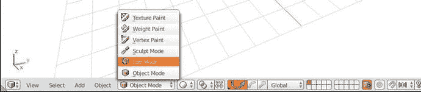
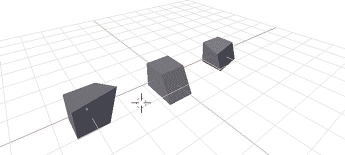
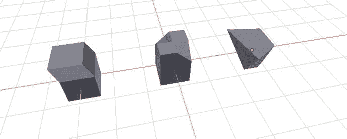
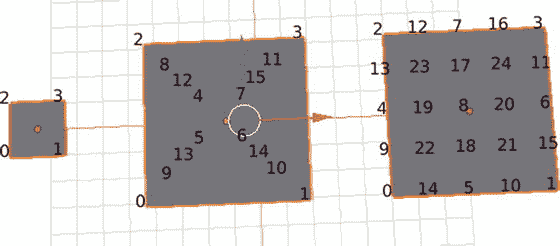
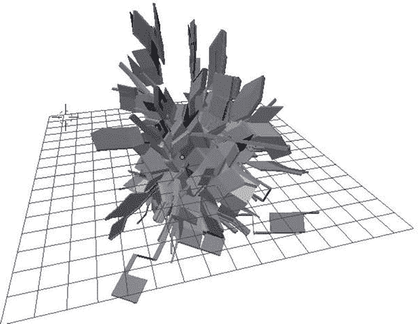
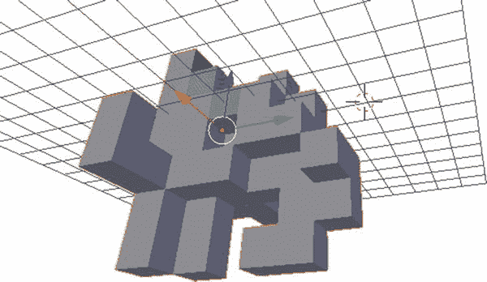

# 三、`bmesh`模块

到目前为止，我们已经讨论了创建、管理和转换整个对象的方法。Blender 的默认模式是对象模式，它允许我们选择和操作一个或多个对象，通常使用可以适当应用于不同对象组的变换，如旋转和平移。

当我们进入编辑模式时，Blender 开始作为一个 3D 艺术套件发光。此模式允许我们选择单个对象的一个或多个顶点来执行高级和详细的变换。正如所料，大多数用于编辑模式的操作不能在对象模式下执行，反之亦然。

模块几乎只处理编辑模式的操作。因此，在深入研究`bmesh`的功能之前，我们将适当处理对象模式和编辑模式之间的差异。

## 编辑方式

要像传统的 Blender 3D 艺术家一样手动进入编辑模式，请转到 3D 视口标题➤交互模式菜单➤编辑模式，如图 [3-1](#Fig1) 所示。使用同一菜单切换回对象模式。



图 3-1。

Toggling Between Edit and Object Mode

当切换到编辑模式时，此时激活的对象将是用户在该编辑模式会话中唯一可以编辑的对象。如果用户想在编辑模式下操作不同的对象，他必须先切换回对象模式来激活所需的对象。只有这样，在切换回编辑模式并激活所需对象后，他才能操作它。如果此时关于选择和激活的措辞不清楚，请参考第 [2 章](2.html)中的“选择、激活和规范”一节。记住，我们总是可以在交互控制台中运行`bpy.context.object`来检查被激活对象的名称。

要以编程方式在对象模式和编辑模式之间切换，请使用清单 [3-1](#Par7) 中的两个命令。

```py
# Set mode to Edit Mode
bpy.ops.object.mode_set(mode="EDIT")
# Set mode to Object Mode
bpy.ops.object.mode_set(mode="OBJECT")
Listing 3-1.Switching Between Object and Edit Mode

```

## 选择顶点、边和平面

要开始处理单个对象的细节，我们必须能够选择特定的部分。我们将在`ut.py`模块中包装我们的模式设置函数，然后讨论如何使用`bmesh`来选择对象的特定部分。这样做，我们将解决`bmesh`和 Blender 中顶点索引协议的一些怪癖和版本兼容性缺陷。

### 在编辑和对象模式之间持续切换

清单 [3-2](#Par11) 实现了一个在对象模式和编辑模式之间切换的包装函数。我们将在第二章[开始构建的`ut.py`工具包中插入这个。我们对普通`bpy.ops`方法所做的唯一修改是，当我们进入编辑模式时，取消选择活动对象的所有顶点、边和平面。目前，Blender 用于确定对象的哪些部分在进入编辑模式时被选择的协议是不透明的和不实用的。我们将采取最安全和最一致的方法，每当我们进入编辑模式时，取消选择对象的每个部分。](2.html)

当我们从编辑模式进入对象模式时，Blender 只是恢复我们第一次进入编辑模式时的活动和选定对象。这种行为是可靠的，也是可以理解的，所以我们不会修改`bpy.ops.object.mode_set(mode = "OBJECT")`的标准行为。

```py
# Place in ut.py

# Function for entering Edit Mode with no vertices selected,
# or entering Object Mode with no additional processes

def mode(mode_name):
    bpy.ops.object.mode_set(mode=mode_name)
    if mode_name == "EDIT":
        bpy.ops.mesh.select_all(action="DESELECT")

Listing 3-2.Wrapper Function for Switching Between Object and Edit Mode

```

Note

如果你在同一个 Blender 会话中多次编辑像`ut.py`这样的定制模块，确保调用模块上的`importlib.reload(ut)`来查看将未缓存的版本导入 Blender。参见清单 [3-3](#Par13) 中的示例。

```py
# Will use the cached version of ut.py from

# your first import of the Blender session

import ut ut.create.cube('myCube')

# Will reload the module from the live script of ut.py

# and create a new cached version for the session

import importlib importlib.reload(ut) ut.create.cube('myCube')

# This is what the header of your main script

# should look like when editing custom modules

import ut
import importlib importlib.reload(ut)

# Code using ut.py ...

Listing 3-3.Editing Custom Modules, Live Within a Blender Session

```

### 实例化 bmesh 对象

在 Blender 中，与其他核心数据结构相比，`bmesh`对象相当笨重，计算量也很大。为了保持效率，Blender 将大部分数据和实例管理工作交给用户通过 API 进行管理。在我们探索`bmesh`模块时，我们将继续看到这样的例子。参见清单 [3-4](#Par15) 中实例化`bmesh`对象的例子。一般来说，实例化一个`bmesh`对象需要我们在编辑模式下将一个`bpy.data.meshes`数据块传递给`bmesh.from_edit_mesh()`。

```py
import bpy import bmesh

# Must start in object mode

# Script will fail if scene is empty

bpy.ops.object.mode_set(mode='OBJECT')
bpy.ops.object.select_all(action='SELECT')
bpy.ops.object.delete()

# Create a cube and enter Edit Mode

bpy.ops.mesh.primitive_cube_add(radius=1, location=(0, 0, 0))
bpy.ops.object.mode_set(mode='EDIT')

# Store a reference to the mesh datablock

mesh_datablock = bpy.context.object.data

# Create the bmesh object (named bm) to operate on

bm = bmesh.from_edit_mesh(mesh_datablock)

# Print the bmesh

object

print(bm)

Listing 3-4.Instantiating a bmesh Object

```

如果我们尝试在交互式控制台中运行这些命令，我们可能会得到不同的结果。`bmesh`对象的实例不是持久的。除非 Blender 检测到它正在被使用，否则`bmesh`对象将解引用网格数据块，垃圾收集内部数据，并返回`<BMesh dead at some_memory_address>`。考虑到维护一个 bmesh 对象所需的空间和计算能力，这是一种可取的行为，但它确实需要程序员执行额外的命令来保持它的活力。我们在构建选择 3D 对象特定部分的函数时会遇到这些命令。

### 选择 3D 对象的部分

为了选择一个`bmesh`对象的部分，我们操作每个`BMesh.verts`、`BMesh.edges`和`BMesh.faces`对象的选择布尔。清单 [3-5](#Par19) 给出了一个选择立方体各部分的例子。

注意清单 [3-5](#Par19) 中对`ensure_lookup_table()`的多次调用。我们使用这些函数来提醒 Blender 在操作之间保持`BMesh`对象的某些部分不被垃圾收集。这些函数占用最小的处理能力，所以我们可以随意调用它们，而不会产生太大的影响。多调用它们比少调用它们好，因为调试此错误:

```py
ReferenceError: BMesh data of type BMesh has been removed

```

在没有`ensure_lookup_table()`协议的大型代码库中可能是噩梦。

```py
import bpy
import bmesh

# Must start in object mode

bpy.ops.object.mode_set(mode='OBJECT')
bpy.ops.object.select_all(action='SELECT')
bpy.ops.object.delete()

# Create a cube and enter Edit Mode

bpy.ops.mesh.primitive_cube_add(radius=1, location=(0, 0, 0))
bpy.ops.object.mode_set(mode='EDIT')

# Set to "Face Mode" for easier visualization

bpy.ops.mesh.select_mode(type = "FACE")

# Register bmesh object and select various parts

bm = bmesh.from_edit_mesh(bpy.context.object.data)

# Deselect all verts, edges, faces

bpy.ops.mesh.select_all(action="DESELECT")

# Select a face

bm.faces.ensure_lookup_table()

bm.faces[0].select = True

# Select an edge

bm.edges.ensure_lookup_table()
bm.edges[7].select = True

# Select a vertex

bm.verts.ensure_lookup_table()
bm.verts[5].select = True

Listing 3-5.Selecting Parts of 3D Objects

```

读者会注意到我们运行`bpy.ops.mesh.select_mode(type = "FACE")`。这个概念到目前为止还没有涉及到，但是理解它对于正确使用高级编辑模式功能是很重要的。通常，Blender artists 在 3D Viewport Header 中点击三个选项中的一个，如图 [3-2](#Fig2) 所示。图 [3-2](#Fig2) 中的按钮对应于`bpy.ops.mesh.select_mode()`中的垂直、边缘和面参数。现在，这只会影响我们在编辑模式下可视化选择的方式。我们在这个例子中选择 FACE，因为它是同时可视化所有三种类型的最佳模式。在本章的后面，我们将讨论编辑模式中的一些功能，它们的行为将根据选择而改变。


图 3-2。

Toggling various selection modes

## 编辑模式转换

本节讨论简单变换，如编辑模式下的平移和旋转，以及高级变换，如随机化、挤出和细分。

### 基本转换

非常方便的是，我们可以使用在第 [2 章](2.html)中用于对象模式转换的相同函数来操作 3D 对象的各个部分。我们将给出一些使用清单 [2-9](2.html#Par47) 中介绍的`bpy.ops`子模块列出 [3-6](#Par25) 的例子。轻微变形立方体的输出见图 [3-3](#Fig3) 。



图 3-3。

Deforming cubes with edit mode operations

```py
import bpy
import bmesh

# Must start in object mode

bpy.ops.object.mode_set(mode='OBJECT')
bpy.ops.object.select_all(action='SELECT')
bpy.ops.object.delete()

# Create a cube and rotate a face around the y-axis

bpy.ops.mesh.primitive_cube_add(radius=0.5, location=(-3, 0, 0)) bpy.ops.object.mode_set(mode='EDIT')
bpy.ops.mesh.select_all(action="DESELECT")

# Set to face mode for transformations

bpy.ops.mesh.select_mode(type = "FACE")

bm = bmesh.from_edit_mesh(bpy.context.object.data)
bm.faces.ensure_lookup_table()
bm.faces[1].select = True
bpy.ops.transform.rotate(value = 0.3, axis = (0, 1, 0))

bpy.ops.object.mode_set(mode='OBJECT')

# Create a cube and pull an edge along the y-axis

bpy.ops.mesh.primitive_cube_add(radius=0.5, location=(0, 0, 0)) bpy.ops.object.mode_set(mode='EDIT')
bpy.ops.mesh.select_all(action="DESELECT")

bm = bmesh.from_edit_mesh(bpy.context.object.data)
bm.edges.ensure_lookup_table()
bm.edges[4].select = True
bpy.ops.transform.translate(value = (0, 0.5, 0))

bpy.ops.object.mode_set(mode='OBJECT')

# Create a cube and pull a vertex 1 unit

# along the y and z axes

# Create a cube and pull an edge along the y-axis

bpy.ops.mesh.primitive_cube_add(radius=0.5, location=(3, 0, 0)) bpy.ops.object.mode_set(mode='EDIT')
bpy.ops.mesh.select_all(action="DESELECT")

bm = bmesh.from_edit_mesh(bpy.context.object.data)
bm.verts.ensure_lookup_table()
bm.verts[3].select = True
bpy.ops.transform.translate(value = (0, 1, 1))

bpy.ops.object.mode_set(mode='OBJECT')

Listing 3-6.Basic Transformations in Edit Mode

```

### 高级转换

我们不可能涵盖 Blender 中用于编辑网格的所有工具，所以我们将在这一节中涵盖一小部分，并在本章末尾列出更多使用示例。清单 [3-7](#Par27) 实现了挤压、细分和随机化操作符。预期输出见图 [3-4](#Fig4) 。



图 3-4。

Extrude, Subdivide, and Randomize Operators

```py
import bpy import bmesh

# Will fail if scene is empty

bpy.ops.object.mode_set(mode='OBJECT')
bpy.ops.object.select_all(action='SELECT')
bpy.ops.object.delete()

# Create a cube and extrude the top face away from it bpy.ops.mesh.primitive_cube_add(radius=0.5, location=(-3, 0, 0)) bpy.ops.object.mode_set(mode='EDIT')
bpy.ops.mesh.select_all(action="DESELECT")

# Set to face mode for transformations

bpy.ops.mesh.select_mode(type = "FACE")

bm = bmesh.from_edit_mesh(bpy.context.object.data)
bm.faces.ensure_lookup_table()
bm.faces[5].select = True
bpy.ops.mesh.extrude_region_move(TRANSFORM_OT_translate =
      {"value": (0.3, 0.3, 0.3),
       "constraint_axis": (True, True, True),
       "constraint_orientation" :'NORMAL'})

bpy.ops.object.mode_set(mode='OBJECT')

# Create a cube and subdivide the top face

bpy.ops.mesh.primitive_cube_add(radius=0.5, location=(0, 0, 0))
bpy.ops.object.mode_set(mode='EDIT')
bpy.ops.mesh.select_all(action="DESELECT")

bm = bmesh.from_edit_mesh(bpy.context.object.data)
bm.faces.ensure_lookup_table()
bm.faces[5].select = True
bpy.ops.mesh.subdivide(number_cuts = 1)

bpy.ops.mesh.select_all(action="DESELECT")
bm.faces.ensure_lookup_table()
bm.faces[5].select = True
bm.faces[7].select = True
bpy.ops.transform.translate(value = (0, 0, 0.5))
bpy.ops.object.mode_set(mode='OBJECT')

# Create a cube and add a random offset to each vertex

bpy.ops.mesh.primitive_cube_add(radius=0.5, location=(3, 0, 0))
bpy.ops.object.mode_set(mode='EDIT')
bpy.ops.mesh.select_all(action="SELECT")
bpy.ops.transform.vertex_random(offset = 0.5)

bpy.ops.object.mode_set(mode='OBJECT')

Listing 3-7.Extrude, Subdivide, and Randomize Operators

```

## 关于索引和交叉兼容性的说明

读者可能已经注意到，3D 对象中的顶点、边和面的索引没有特定的顺序排列。在迄今为止的示例脚本中，作者已经提前手动定位了索引，而不是以编程方式发现它们。例如，当操作清单 [3-7](#Par27) 中的立方体顶部时，作者预先确定`ut.act.select_face(bm, 5)`将选择立方体顶部的面。这是通过反复试验确定的。

使用试错法测试来发现一个对象的一部分的索引号通常是一种可接受的实践，但是有许多缺点。在任何给定的 Blender 版本中，索引语义应该被认为是可复制的，但不可管理的。

*   不同版本的 Blender 的默认对象索引差别很大。作者指出了依赖于不同版本 Blender 的硬编码索引的附加组件的主要兼容性问题。版本 2.77 和版本 2.78 之间的主要区别在于依赖于硬编码索引的附加组件。
*   Behavior of indexing after certain transformations is very unwieldy. See Figure [3-5](#Fig5) for an example of the vertex indices of a default plane, a plane after three insets, and a plain after two subdivisions. The indices in these planes conform to no particular logical pattern. Variance among transformations is another source of cross-version incompatibility.

    

    图 3-5。

    Default, inset, and subdivided planes with vertex indices labeled
*   使用硬编码索引的附加组件在用户交互的可能性方面非常有限。使用硬编码索引的插件可以连续运行，但很少会与用户来回交互。

解决这个问题的方法是根据特征进行选择。为了通过特征选择顶点，我们循环遍历对象中的每个顶点，并在满足标准的顶点上运行`bm.verts[i].select = True`。这同样适用于边和面。理论上，这种方法看起来计算量很大，算法也很复杂，但是你会发现它惊人的快和模块化。根据特性使用纯选择的插件通常可以同时在 Blender 的许多版本上成功运行。不幸的是，实现这一点在 Blender 中打开了一个关于局部和全局坐标系的概念上的麻烦。我们将在下一节中对此进行阐述。

## 全局和局部坐标

Blender 为每个对象的每个部分存储许多组坐标数据。在大多数情况下，我们将只关心两组坐标:全局坐标 G 和局部坐标 l。当我们对对象执行变换时，Blender 将这些变换存储为变换矩阵 t 的一部分。Blender 将在某些时候将变换矩阵应用于局部坐标。Blender 应用变换矩阵后，局部坐标将等于全局坐标，变换矩阵将是单位矩阵。

在 3D 视口中，我们总是看到全局坐标 G = T * L。

我们可以用`bpy.ops.object.transform_apply()`控制 Blender 何时应用变换。这不会改变对象的外观，而是将 L 设置为等于 G，将 T 设置为等于单位。

我们可以利用这一点来轻松选择对象的特定部分。如果我们通过不运行和不退出编辑模式来延迟`bpy.ops.object.transform_apply()`的执行，我们可以维护两个数据集 G 和 L。在实践中，G 对于相对于其他对象定位对象非常有用，而 L 非常容易循环读取索引。

查看清单 [3-8](#Par40) 获取对象的全局和局部坐标的函数。给定`bpy.data.meshes[].vertices`数据块为`v`，`v.co`给出本地坐标和 bpy。`data.objects[].matrix_world * v.co`给出全局坐标。幸运的是，这个数据块可以在对象模式和编辑模式下访问。我们将构建独立于模式的函数来访问这些坐标。参见清单 [3-8](#Par40) 获取独立于模式的每组坐标的函数。

这些函数牺牲了一些清晰度来换取简洁和高效。在这段代码中，`v`是表示我们的矩阵 L 的元组列表，`obj.matrix_world`是表示我们的变换矩阵 t 的 Python 矩阵。

```py
def coords(objName, space='GLOBAL'):

     # Store reference to the bpy.data.objects datablock

     obj = bpy.data.objects[objName]

     # Store reference to bpy.data.objects[].meshes datablock

     if obj.mode == 'EDIT':
         v = bmesh.from_edit_mesh(obj.data).verts
     elif obj.mode == 'OBJECT':
         v = obj.data.vertices

     if space == 'GLOBAL':
          # Return T * L as list of tuples

          return [(obj.matrix_world * v.co).to_tuple() for v in v]
     elif space == 'LOCAL':
          # Return L as list of tuples

          return [v.co.to_tuple() for v in v]

class sel:

     # Add this to the ut.sel class, for use in object mode

     def transform_apply():
         bpy.ops.object.transform_apply(
             location=True, rotation=True, scale=True)

Listing 3-8.Fetching Global and Local Coordinates

```

参见清单 [3-9](#Par42) 中本地和全球坐标行为的示例。我们打印转换前、转换后和`transform_apply()`后立方体的前两个坐标三元组。这在纸上和代码编辑器中都是有意义的。在交互控制台中逐行运行清单 [3-9](#Par42) 突出了`transform_apply()`的有趣行为。平移立方体后，读者将看到立方体移动，但局部坐标保持不变。运行`transform_apply()`后，立方体不会移动，但是局部坐标会更新以匹配全局坐标。

```py
import ut
import importlib
importlib.reload(ut)

import bpy

# Will fail if scene is empty

bpy.ops.object.mode_set(mode='OBJECT')
bpy.ops.object.select_all(action='SELECT')
bpy.ops.object.delete()

bpy.ops.mesh.primitive_cube_add(radius=0.5, location=(0, 0, 0))
bpy.context.object.name = 'Cube-1'

# Check global and local coordinates

print('\nBefore transform:')
print('Global:', ut.coords('Cube-1', 'GLOBAL')[0:2])
print('Local: ', ut.coords('Cube-1', 'LOCAL')[0:2])

# Translate it along x = y = z

# See the cube move in the 3D viewport

bpy.ops.transform.translate(value = (3, 3, 3))

# Check global and local coordinates

print('\nAfter transform, unapplied:')
print('Global: ', ut.coords('Cube-1', 'GLOBAL')[0:2])
print('Local: ', ut.coords('Cube-1', 'LOCAL')[0:2])

# Apply transformation

# Nothing changes in 3D viewport

ut.sel.transform_apply()

# Check global and local coordinates

print('\nAfter transform, applied:')
print('Global: ', ut.coords('Cube-1', 'GLOBAL')[0:2])
print('Local: ', ut.coords('Cube-1', 'LOCAL')[0:2])

############################ Output ###########################

# Before transform:

# Global: [(-0.5, -0.5, -0.5), (-0.5, -0.5, 0.5)]

# Local: [(-0.5, -0.5, -0.5), (-0.5, -0.5, 0.5)]

#

# After transform, unapplied:

# Global: [(2.5, 2.5, 2.5), (2.5, 2.5, 3.5)]

# Local: [(-0.5, -0.5, -0.5), (-0.5, -0.5, 0.5)]

#

# After transform, applied:

# Global: [(2.5, 2.5, 2.5), (2.5, 2.5, 3.5)]

# Local: [(2.5, 2.5, 2.5), (2.5, 2.5, 3.5)]

###############################################################

Listing 3-9.Behavior of Global and Local Coordinates and Transform Apply

```

在下一节中，我们将使用这个概念来解决图 [3-5](#Fig5) 中出现的问题，并释放 Blender 中编辑模式的全部力量。

## 按位置选择顶点、边和面

参见清单 [3-10](#Par45) 中的两个函数，这两个函数协同工作，便于根据顶点、边和面在全局和局部坐标系中的位置进行选择。我们指定为`ut.act.select_by_loc()`的函数看起来非常复杂，但是没有使用我们到目前为止还没有引入的任何 Blender 概念。作者认为这个函数应该作为`bmesh`模块的一部分，因为它的应用非常广泛。

```py
# Add in body of script, outside any class declarations

def in_bbox(lbound, ubound, v, buffer=0.0001):
    return lbound[0] - buffer <= v[0] <= ubound[0] + buffer and \
        lbound[1] - buffer <= v[1] <= ubound[1] + buffer and \
        lbound[2] - buffer <= v[2] <= ubound[2] + buffer

class act:

    # Add to ut.act class

    def select_by_loc(lbound=(0, 0, 0), ubound=(0, 0, 0),
                      select_mode='VERT', coords='GLOBAL'):

    # Set selection mode, VERT, EDGE, or FACE

    selection_mode(select_mode)

    # Grab the transformation matrix

    world = bpy.context.object.matrix_world

    # Instantiate a bmesh object and ensure lookup table

    # Running bm.faces.ensure_lookup_table() works for all parts

    bm = bmesh.from_edit_mesh(bpy.context.object.data)
    bm.faces.ensure_lookup_table()

    # Initialize list of vertices and list of parts to be selected

    verts = []

    to_select = []

    # For VERT, EDGE, or FACE ...

    # 1\. Grab list of global or local coordinates

    # 2\. Test if the piece is entirely within the rectangular

    #    prism defined by lbound and ubound

    # 3\. Select each piece that returned True and deselect

    #    each piece that returned False in Step 2

    if select_mode == 'VERT':
        if coords == 'GLOBAL':
            [verts.append((world * v.co).to_tuple()) for v in bm.verts]
        elif coords == 'LOCAL':
            [verts.append(v.co.to_tuple()) for v in bm.verts]

        [to_select.append(in_bbox(lbound, ubound, v)) for v in verts]
        for vertObj, select in zip(bm.verts, to_select):
            vertObj.select = select

    if select_mode == 'EDGE':
        if coords == 'GLOBAL':
            [verts.append([(world * v.co).to_tuple()
                              for v in e.verts]) for e in bm.edges]
        elif coords == 'LOCAL':
            [verts.append([v.co.to_tuple() for v in e.verts])
             for e in bm.edges]

        [to_select.append(all(in_bbox(lbound, ubound, v)
                              for v in e)) for e in verts]
        for edgeObj, select in zip(bm.edges, to_select):
            edgeObj.select = select

    if select_mode == 'FACE':
        if coords == 'GLOBAL':
            [verts.append([(world * v.co).to_tuple()
                           for v in f.verts]) for f in bm.faces]
        elif coords == 'LOCAL':
            [verts.append([v.co.to_tuple() for v in f.verts])
             for f in bm.faces]

        [to_select.append(all(in_bbox(lbound, ubound, v)
                              for v in f)) for f in verts]
        for faceObj, select in zip(bm.faces, to_select):
            faceObj.select = select

Listing 3-10.Function for Selecting Pieces

of Objects by Location

```

清单 [3-11](#Par47) 给出了一个使用`ut.act.select_by_loc()`选择球体的一部分并变换它们的例子。请记住，该函数的前两个参数是 3D 矩形棱柱的最低角和最高角。如果整个块(顶点、边、面)落在矩形棱柱内，它将被选中。

```py
import ut
import importlib
importlib.reload(ut)

import bpy

# Will fail if scene is empty

bpy.ops.object.mode_set(mode='OBJECT')
bpy.ops.object.select_all(action='SELECT')
bpy.ops.object.delete()

bpy.ops.mesh.primitive_uv_sphere_add(size=0.5, location=(0, 0, 0))
bpy.ops.transform.resize(value = (5, 5, 5))
bpy.ops.object.mode_set(mode='EDIT')
bpy.ops.mesh.select_all(action='DESELECT')

# Selects upper right quadrant of sphere

ut.act.select_by_loc((0, 0, 0), (1, 1, 1), 'VERT', 'LOCAL')

# Selects nothing

ut.act.select_by_loc((0, 0, 0), (1, 1, 1), 'VERT', 'GLOBAL')

# Selects upper right quadrant of sphere

ut.act.select_by_loc((0, 0, 0), (5, 5, 5), 'VERT', 'LOCAL')

# Mess with it

bpy.ops.transform.translate(value = (1, 1,1))
bpy.ops.transform.resize(value = (2, 2, 2))

# Selects lower half of

sphere

ut.act.select_by_loc((-5, -5, -5), (5, 5, -0.5), 'EDGE', 'GLOBAL')

# Mess with it

bpy.ops.transform.translate(value = (0, 0, 3))
bpy.ops.transform.resize(value = (0.1, 0.1, 0.1))

bpy.ops.object.mode_set(mode='OBJECT')

Listing 3-11.Selecting and Transforming Pieces

of a Sphere

```

## 检查点和示例

到目前为止，我们已经对`ut.py`做了很多补充。如需最新版本，包括我们迄今为止在书中添加的所有内容，请访问`blender.chrisconlan.com/ut_ch03.py`。

鉴于这个版本的`ut.py`，我们将尝试一些有趣的例子。随机形状增长算法见清单 [3-12](#Par51) 。一个简单的算法随机地(草率地)选择物体所在的一块空间，然后沿着所选表面的垂直法线挤出所选部分。要沿表面的垂直法线挤出，我们只需运行`ut.act.extrude((0, 0, 1))`，因为该功能默认使用表面的局部方向。

该算法让我们既能构建优雅的形状，也能构建古怪的形状。结果的类型主要取决于我们在脚本顶部附近的`ut.create`调用中提供的形状。参见图 [3-6](#Fig6) 和 [3-7](#Fig7) 分别列出立方体和球体 [3-12](#Par51) 的示例。



图 3-7。

Random sphere extrusion with 1000 iterations



图 3-6。

Random cube extrusion with 500 iterations

```py
import ut
import importlib importlib.reload(ut)
import bpy

from random import randint
from math import floor

# Must start in object mode

bpy.ops.object.select_all(action='SELECT')
bpy.ops.object.delete()

# Create a cube

bpy.ops.mesh.primitive_cube_add(radius=0.5, location=(0, 0, 0))
bpy.context.object.name = 'Cube-1'

bpy.ops.object.mode_set(mode='EDIT')
bpy.ops.mesh.select_all(action="DESELECT")

for i in range(0, 100):

    # Grab the local coordinates

    coords = ut.coords('Cube-1', 'LOCAL')

    # Find the bounding box for the object

    lower_bbox = [floor(min([v[i] for v in coords])) for i in [0, 1, 2]]
    upper_bbox = [floor(max([v[i] for v in coords])) for i in [0, 1, 2]]

    # Select a random face 2x2x1 units wide, snapped to integer coordinates

    lower_sel = [randint(l, u) for l, u in zip(lower_bbox, upper_bbox)]
    upper_sel = [l + 2 for l in lower_sel]
    upper_sel[randint(0, 2)] -= 1

    ut.act.select_by_loc(lower_sel, upper_sel, 'FACE', 'LOCAL')

    # Extrude the surface along it aggregate vertical normal

    bpy.ops.mesh.extrude_region_move(TRANSFORM_OT_translate =

          {"value": (0, 0, 1),
           "constraint_axis": (True, True, True),
           "constraint_orientation" :'NORMAL'})

Listing 3-12.
Random Shape Growth

```

虽然这些例子看起来微不足道，但它们展示了 Blender 中自动化编辑模式操作的强大功能。虽然清单 [3-12](#Par51) 中的简单算法可以制作出迷人的形状，但是只要有正确的特定领域知识，其中的概念可以用来在 Blender 中创建完整的 CAD 系统。很好的例子包括:

*   商业建筑模型
*   数学曲面模型
*   原子和化学模型

所有这些都可以通过本章讨论的概念来实现。就目前情况而言，我们的工具包不是非常针对具体情况的。它有许多可以改进的地方，以适应不同学科和应用的建模需求。定制和改进我们的工具包的显著方法包括:

*   创建支持矩形棱柱以外的选择区域的`ut.act.select_by_loc()`函数。圆柱形、球形、二维和一维选择表面都有潜在的用途。
*   为它们创建额外的`ut.create`函数和特定案例的自动命名模式。
*   以与添加`ut.act.extrude`和`ut.act.subdivide`相同的方式向`ut.act`添加额外的编辑模式操作。有充分的机会来探索和进一步参数化这些功能。
*   增加`LOCAL`、`NORMAL`、`GIMBAL`轴操作到`ut.sel`。到目前为止，我们一直使用默认的`GLOBAL`。例如，平移、旋转和缩放都可以沿着这些轴执行。

## 结论

在接下来的章节中，我们将讨论在 Blender 中进行有效的插件开发所需的基本渲染概念。