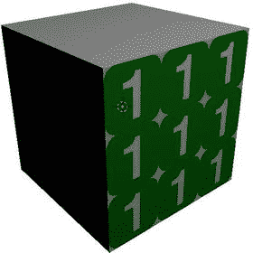
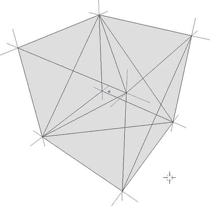
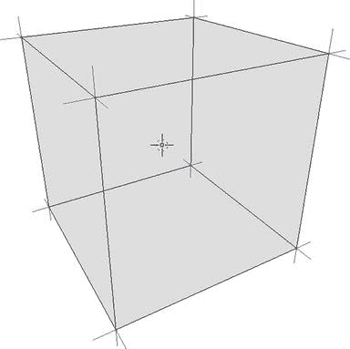
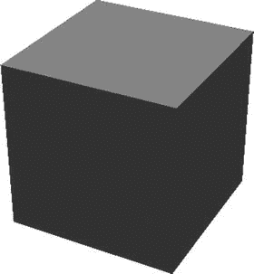
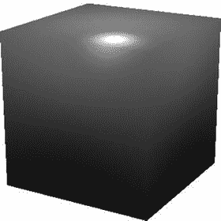
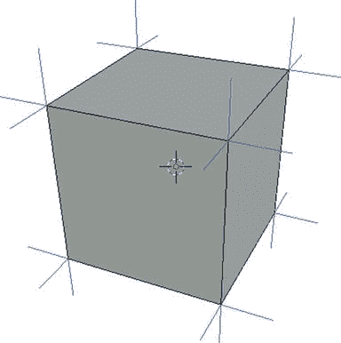
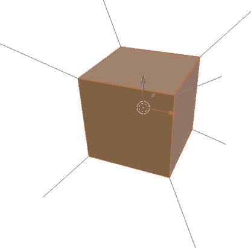
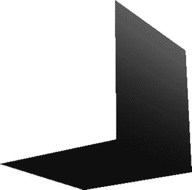
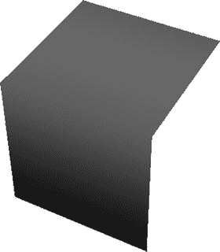
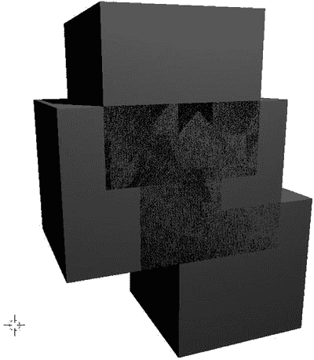

# 四、建模和渲染主题

本章介绍并详述了 3D 建模和渲染中的特定主题。虽然非常笼统，但随着我们构建更高级的工具和插件，这些主题在第 [5](5.html) 章和文本的其余部分变得很重要。向读者介绍了 3D 艺术家、游戏开发者和渲染软件工程师通常知道的许多实用程序和陷阱。有了这些知识，读者将能够更好地满足这些脚本和插件开发专业人员的需求。

## 指定 3D 模型

3D 模型是复杂的数字资产，可以由许多不同的组件组成。我们通常认为网格是构成资产形状的最重要的结构，网格由面组成，面由按索引排列的顶点组成。网格可以包含法线向量或法线，可以用顶点或面来指定，具体取决于文件格式。当我们在摘要中提到这些术语时，我们通常是在讨论 3D 建模主题，而不是在 Blender 中具体定义它们。

我们从纯网格开始讨论 3D 模型，网格由顶点、索引、面和法线组成。从那里，我们讨论更先进的和具体的三维模型的特点，作为我们的网格讨论的延伸。

### 指定网格

为了本章的目的，我们认为一个基本的网格是由它的面和法向量定义的。请参见上述组件的以下定义:

*   顶点是指定 3D 空间中位置的实值三元组，通常表示为(x，y，z)。出于我们讨论的原因，在指定 3D 网格的文件中多次指定同一个点是很常见的。在 3D 建模中，z 轴或 y 轴最常用来表示垂直轴。在 Blender 中，z 轴是垂直轴。我们将在整个文本中使用这种格式。
*   索引是正整数值的三元组，使用一系列顶点指定面，通常表示为(I，j，k)。给定索引为 1，…，N 的 N 个顶点的列表，3D 空间中的面可以由 1，…，N 中的任意三个唯一整数的三元组来指定。这个概念非常符合逻辑地扩展自身，允许我们通过重用预先指定的顶点来定义网格。出于我们解释的原因，整数的顺序对于确定人脸可见的方向很重要。在实践中，索引重用元组值的概念通常扩展到其他元组，如法线和 uv。
*   面由引用三个顶点的整数三元组索引确定。根据我们的定义，我们很自然地得出这样一个事实，即 3D 空间中的三顶点人脸总共需要九个实值数据点。需要注意的是，3D 空间中的面仅在一个方向上可见。给定旋转相机和 3D 空间中的单个面部，用户将只能从单个方向观看面部。从另一个方向看，面将完全透明。这是许多 3D 渲染器的固有和预期行为，我们将学习控制这些行为。请注意，Blender 在默认情况下不会表现出这种单向行为，但是在导出为其他文件格式时，Blender 不会自动控制或纠正这种行为。
*   法向量是实值三元组，定义网格如何与场景中的灯光和相机交互。目前，我们只关心法线，因为它们直接分配给点，而不是 3D 艺术家可能已经熟悉的法线贴图。顾名思义，场景中的相机和照明与网格交互，假设法线向量垂直于它所照亮的面。这并不总是一个无关紧要的问题，正如我们将在立方体例子中看到的那样。法向量也影响面的可视方向和透明方向，如面的定义中所述。

### 指定纹理

3D 模型中纹理的目的是将 2D 图像映射到 3D 表面上，通常使用现有的 2D 艺术资产。我们使用的坐标惯例是(u，v)坐标系。在数学的其他领域，当讨论 3D 表面的 2D 投影时，我们通常使用(u，v)坐标系来清楚地表示我们在与(x，y，z)坐标系分离的空间中工作。

纹理坐标非常直观。如果我们想要在一个矩形表面上拉伸一个图像，我们指定 uv 坐标列表`[(0.0, 0.0), (1.0, 0.0), (0.0, 1.0), (1.0, 1.0)]`来在我们正在看的表面上从左到右拉伸完整的图像。这是假设从我们的角度来看，模型中的坐标 1 到 4 代表表面的左下、右下、左上和右上坐标。见图 [4-1](#Fig1) 的一个普通纹理方案的例子。


图 4-1。

Vanilla texturing scheme on a cube

如果我们想在整个表面上拉伸、收缩或复制图像，我们只需通过适当的因子来调整 uv 坐标。例如，在立方体表面平铺图像三次，我们输入 uv 坐标`[(0.0, 0.0), (3.0, 0.0), (0.0, 3.0), (3.0, 3.0)]`。参见图 [4-2](#Fig2) 的平铺纹理示例。



图 4-2。

Repeated texturing scheme on a cube

在第 8 章[之前，我们不会通过 Blender 的 Python API 处理纹理，但是当我们讨论 3D 模型和文件格式时，理解纹理的 uv 坐标的概念是很重要的。](8.html)

## 常见文件格式

我们首先列出常见的文件格式，并解释它们各自的优点和用途。我们结合本章开始时对 3D 对象的定义使用这些格式来进一步说明这些概念。

### 波前(。obj 和。mtl)

波前几何(`.obj`)和材料(`.mtl`)规范格式共同指定网格和纹理。它们是以这样的方式编写的，即`.obj`文件可以独立地指定唯一的几何图形。`.obj`文件非常小且易于理解，非常适合用作讨论 3D 对象形状的标准符号。

见清单 [4-1](#Par16) 中 xy 平面上简单正方形的例子。obj 格式。我们将避免解释。mtl 文件，因为它与我们对渲染概念的讨论不太相关。

```py
# Use hashes to leave comments in .obj files
# The 'o' tag is used to name objects
# all data following an 'o' tag is considered
# to have this name until another name is entered o MySimpleFace

# Vertices are entered with the 'v' tag as
# space-delimited (x, y, z) tuples
v -1.00 0.00 1.00
v 1.00 0.00 1.00
v -1.00 0.00 -1.00
v 1.00 0.00 -1.00

# Texture coordinate are entered with the 'vt' tag as
# space-delimited (u, v) tuples, between 0 and 1
vt 0.00 1.00
vt 1.00 1.00
vt 0.00 0.00
vt 1.00 0.00

# Normal vectors are entered with the 'vn' tag as
# space-delimited (x, y, z) tuples, can be normal vectors if desired vn 0.0000 1.0000 0.0000

# Indices are entered with the 'f' (for face) tag as
# space-delimited triplets of v, vt, and vn indices as
# f v_i/vt_i/vn_i v_j/vt_j/vn_j v_k/vt_k/vn_k
# Faces can have any number (three or more) coplanar points f 2/2/1 3/3/1 1/1/1
f 2/2/1 4/4/1 3/3/1

# Alternatively, the faces section for this face can be
# written as a single coplanar quadrilateral: f 1/1/1 2/2/1 4/4/1 3/3/1

# Alternatively, the texture coordinates can be
# excluded with double slashes f 1//1 2//1 4//1 3//1

Listing 4-1.Simple Square in the .obj Format

```

我们在清单 [4-1](#Par16) 中看到了一个具有以下特征的简单面的`.obj`文件格式的规范:

*   两个单位长，两个单位宽
*   以原点为中心，法向量沿 z 轴向上
*   一些纹理沿着正 x 轴和 y 轴定向

我们将在下面的例子中看到，`.obj`格式与其他格式相比相当成熟和灵活。

### 立体平版印刷术

工程师和 CAD 软件通常使用 STL 文件格式。与`.obj`格式相比，它显得冗长，但是附带了一个二进制规范来弥补它的低效。大多数 STL 导出器(包括 Blender)默认使用二进制规范，如果没有特殊软件的帮助，文件对人来说是难以辨认的。在这个文本中，我们只处理文件的文本格式。

参见清单 [4-2](#Par25) 中我们的简单面，如 STL 格式中指定的清单 [4-1](#Par16) 。STL 支持法向量和面，但不使用索引或支持纹理坐标。从清单 [4-2](#Par25) 中可以看出，我们必须指定同一个法向量两次，总共六个顶点来指定 STL 中的一个四边形面。此外，STL 不支持超过三个共面点的规范。奇怪的是，大多数 3D 文件格式都允许将法向量分配给点，而 STL 只允许在面级别分配法向量。

这种结构相当简单明了。每个`facet normal x y z`初始化一个面，然后每个`outer loop-endloop`对保存该面的有序顶点。每个顶点被指定为循环中的`vertex x y z`。

```py
solid MyFace
  facet normal     0.0    0.0    1.0
    outer  loop
      vertex      -1.0   -1.0    0.0
      vertex       1.0   -1.0    0.0
      vertex      -1.0    1.0    0.0
    endloop
  endfacet
  facet normal     0.0    0.0    1.0
    outer  loop
      vertex       1.0   -1.0    0.0
      vertex       1.0    1.0    0.0
      vertex      -1.0    1.0    0.0
    endloop
  endfacet
endsolid MyFace

Listing 4-2.Simple Face in the STL Format (Text Form)

```

### PLY(多边形文件格式)

这种文件格式是由斯坦福大学开发的，用于 3D 扫描软件。它与 C 语言有密切的渊源，并且有许多直接使用 C 语言的开源工具。我们对 3D 网格格式的讨论应该开始感觉重复了。PLY 格式本质上是一个精简版的`.obj`，增加了元数据，只支持顶点和面，不支持法线向量或纹理。

头中的一些元数据相当标准，包括`ply`、`format`和`property`标签。我们不会深究`property`标签。只知道他们引用 C 级数据类型是为了和现有的 C 库合作。`element vertex`和`element face`行分别指定文件中有多少行引用顶点和面。在我们的例子中，我们有`element vertex 4`和`element face 1`，因为我们正在指定一个面。值得注意的是，PLY 格式支持三个以上共面点的规范。

参见清单 [4-3](#Par29) 中的面部示例。

```py
ply
format ascii 1.0
comment specifies a simple faceelement vertex 4
property float32 xproperty float32 yproperty float32 zelement face 1
property list uint8 int32 vertex_indices end_header
-1 -1 0
1 -1 0
1 1 0
-1 1 0
4 1 0 3 2

Listing 4-3.Simple Face in the PLY Format

```

### Blender(。混合)文件和交换格式

特别是根据前面的例子，Blender 的原生文件格式和内存中的数据结构非常复杂。Blender 支持对顶点、边和具有非共面顶点的面进行操作。与此同时，Blender 管理与纹理、声音、动画、装备、灯光等相关的复杂数据。这些`.blend`文件是以二进制表示的，不适合人类阅读。谢天谢地，我们可以继续通过 Python API 安全地访问和操作 Blender 的内部数据。

`.blend`文件与前述的`.obj`、`.stl`和`.ply`文件在复杂性和完整性上的差异是有意的。虽然所有这些文件都以这样或那样的方式表示 3D 模型，但是`.blend`文件并不是为在其他 3D 建模套件中导出和导入而设计的。上面讨论的文件格式被称为交换格式，这意味着它们有意地表示可以在建模软件和渲染器之间轻松移植的公共且定义良好的功能子集。

虽然开发人员在过去已经尝试在特定的 3D 建模套件(如 3DS Max、AutoCAD、Maya 和 Blender)之间创建完整的互操作性，但他们必然无法捕获任何一个套件支持的所有功能。因此，我们决定采用交换格式来保持沟通和期望的一致性。

## 基本对象的最小规格

讨论 3D 模型规范背后的一些理论很重要，这样我们可以评估各种 3D 文件格式的效率和能力。我们将引用上一节中讨论的文件格式来帮助说明。

### 立方体的定义

立方体是有六个面的三维物体，由等长的正方形组成。一个立方体包含 6 个面、12 条边和 8 个顶点。立方体的正方形面可以看作是两个直角三角形的合成，其边长等于正方形的边长。注意，3D 空间中的任何对象都可以由浮点和整数值来定义，其中浮点指定 3D 空间中的位置和方向，而整数指定相关的索引。3D 对象也需要法向量，法向量可以指定给顶点或面。

我们将使用这些信息来构建表格，详细说明不同 3D 规范模式的数据密度。

### 简单规范

为了简单地指定一个 3D 立方体，我们将独立地指定 6 * 2 = 12 个所需的三角形面中的每一个，并为每个点指定一个独立的法向量。这将产生 12 * 3 = 36 个顶点和 12 * 3 = 36 个法向量。我们可以用`.obj`格式来写，如清单 [4-4](#Par37) 所示。图 [4-3](#Fig3) 显示了该模型数据结构的可视化。



图 4-3。

Data structure of naively specified cube

这种模式的天真是由以下因素定义的:

*   不必要地重复顶点坐标
*   法向量方向的不必要重复
*   不必要的使用顶点法线代替面法线

```py
o NaiveCube

# (36 * 3) + (36 * 3) = 216 floats
# (12 * 3) + (12 * 3) = 72 integers

v 1.000000 -1.000000 -1.000000
v 1.000000 -1.000000 1.000000
v -1.000000 -1.000000 1.000000
v -1.000000 -1.000000 -1.000000
v 1.000000 1.000000 -0.999999
v 0.999999 1.000000 1.000001
v -1.000000 1.000000 1.000000
v -1.000000 1.000000 -1.000000
v 1.000000 -1.000000 -1.000000
v 1.000000 -1.000000 -1.000000
v 1.000000 -1.000000 1.000000
v 1.000000 -1.000000 1.000000
v -1.000000 -1.000000 -1.000000
v -1.000000 -1.000000 -1.000000
v 1.000000 1.000000 -0.999999
v 1.000000 1.000000 -0.999999
v -1.000000 -1.000000 1.000000
v -1.000000 -1.000000 1.000000
v 0.999999 1.000000 1.000001
v 0.999999 1.000000 1.000001
v -1.000000 1.000000 1.000000
v -1.000000 1.000000 1.000000
v -1.000000 1.000000 -1.000000
v -1.000000 1.000000 -1.000000
v 1.000000 -1.000000 -1.000000
v -1.000000 -1.000000 1.000000
v 0.999999 1.000000 1.000001
v -1.000000 1.000000 -1.000000
v 1.000000 -1.000000 -1.000000
v 1.000000 -1.000000 1.000000
v 1.000000 1.000000 -0.999999
v -1.000000 -1.000000 1.000000
v -1.000000 -1.000000 1.000000
v 0.999999 1.000000 1.000001
v -1.000000 1.000000 -1.000000
v -1.000000 1.000000 -1.000000
vn 0.0000 -1.0000 0.0000
vn 0.0000 1.0000 0.0000
vn 1.0000 -0.0000 0.0000
vn 0.0000 -0.0000 1.0000
vn -1.0000 -0.0000 -0.0000
vn 0.0000 0.0000 -1.0000
vn 0.0000 -1.0000 0.0000
vn 0.0000 1.0000 0.0000
vn 1.0000 -0.0000 0.0000
vn 0.0000 -0.0000 1.0000
vn -1.0000 -0.0000 -0.0000
vn 0.0000 0.0000 -1.0000
vn 0.0000 -1.0000 0.0000
vn 0.0000 1.0000 0.0000
vn 1.0000 -0.0000 0.0000
vn 0.0000 -0.0000 1.0000
vn -1.0000 -0.0000 -0.0000
vn 0.0000 0.0000 -1.0000
vn 0.0000 -1.0000 0.0000
vn 0.0000 1.0000 0.0000
vn 1.0000 -0.0000 0.0000
vn 0.0000 -0.0000 1.0000
vn -1.0000 -0.0000 -0.0000
vn 0.0000 0.0000 -1.0000
vn 0.0000 -1.0000 0.0000
vn 0.0000 1.0000 0.0000
vn 1.0000 -0.0000 0.0000
vn 0.0000 -0.0000 1.0000
vn -1.0000 -0.0000 -0.0000
vn 0.0000 0.0000 -1.0000
vn 0.0000 -1.0000 0.0000
vn 0.0000 1.0000 0.0000
vn 1.0000 -0.0000 0.0000
vn 0.0000 -0.0000 1.0000

vn -1.0000 -0.0000 -0.0000
vn 0.0000 0.0000 -1.0000
f 9//1 17//13 13//25
f 24//2 20//14 16//26
f 15//3 12//15 10//27
f 6//4 18//16 2//28
f 3//5 23//17 14//29
f 1//6 8//18 5//30
f 29//7 11//19 32//31
f 36//8 22//20 34//32
f 31//9 19//21 30//33
f 27//10 21//22 33//34
f 26//11 7//23 35//35

f 25//12 4//24 28//36

Listing 4-4.Naively Defined Cube

```

换句话说，简单的 3D 规范不会通过将每个面视为完全独立的三角形来通过索引重用顶点或法线。此外，在立方体等简单情况下，使用顶点法线而不是面法线会增加浪费。这种模式将大大受益于:

*   移除重复的顶点
*   将三角形面指定为正方形面
*   移除重复法线和/或使用面法线
*   正确利用索引组织顶点和法线

值得注意的是，这种格式与禁止 STL 使用面法线的`.stl`格式具有相同的复杂程度。

接下来我们将展示非重复顶点和法线如何在不增加复杂性的情况下缩小模型尺寸。

### 使用索引共享顶点和法线

清单 [4-5](#Par50) 显示了一个共享顶点和法线的`.obj`文件。当文件能够正确使用索引并且不重复浮点数据时，我们总共只需要 42 个浮点。在下一个例子中，我们将利用共面曲面来减少整数的总数。从视觉上看，该数据与图 [4-3](#Fig3) 中的数据相同，我们只是减少了浮动数据中的重复。

```py
o SharingCube

# (8 * 3) + (6 * 3) = 42 floats
# (12 * 3) + (12 * 3) = 72 integers

v 1.000000 -1.000000 -1.000000
v 1.000000 -1.000000 1.000000
v -1.000000 -1.000000 1.000000
v -1.000000 -1.000000 -1.000000
v 1.000000 1.000000 -0.999999
v 0.999999 1.000000 1.000001

v -1.000000 1.000000 1.000000
v -1.000000 1.000000 -1.000000

vn 0.0000 -1.0000 0.0000
vn 0.0000 1.0000 0.0000
vn 1.0000 -0.0000 0.0000
vn 0.0000 -0.0000 1.0000
vn -1.0000 -0.0000 -0.0000
vn 0.0000 0.0000 -1.0000

f 1//1 3//1 4//1
f 8//2 6//2 5//2
f 5//3 2//3 1//3
f 6//4 3//4 2//4
f 3//5 8//5 4//5
f 1//6 8//6 5//6
f 1//1 2//1 3//1
f 8//2 7//2 6//2
f 5//3 6//3 2//3
f 6//4 7//4 3//4
f 3//5 7//5 8//5
f 1//6 4//6 8//6

Listing 4-5.Cube with Shared Vertices and Normals

```

### 使用共面顶点减少面数

清单 [4-6](#Par52) 显示了一个`.obj`文件，其中立方体的每个面都被整体指定。因为我们知道立方体的面都是共面点的集合，所以我们可以将它们指定为一个面。虽然渲染器仍然将立方体解释为三角形面的集合，但是`.obj`文件格式允许我们指定具有共面顶点的 N 维表面。图 [4-4](#Fig4) 显示了这种数据结构的可视化表示。



图 4-4。

Face-planar, vertex-sharing, normal-sharing cube

```py
o CoplanarFaceCube

# (8 * 3) + (6 * 3) = 42 floats
# (6 * 4) + (6 * 4) = 48 integers

v -1.000000 -1.000000 1.000000
v -1.000000 1.000000 1.000000
v -1.000000 -1.000000 -1.000000
v -1.000000 1.000000 -1.000000
v 1.000000 -1.000000 1.000000
v 1.000000 1.000000 1.000000
v 1.000000 -1.000000 -1.000000
v 1.000000 1.000000 -1.000000

vn -1.0000 0.0000 0.0000
vn 0.0000 0.0000 -1.0000
vn 1.0000 0.0000 0.0000
vn 0.0000 0.0000 1.0000
vn 0.0000 -1.0000 0.0000
vn  0.0000 1.0000 0.0000
f 1//1 2//1 4//1 3//1
f 3//2 4//2 8//2 7//2
f 7//3 8//3 6//3 5//3

f 5//4 6//4 2//4 1//4
f 3//5 7//5 5//5 1//5
f 8//6 4//6 2//6 6//6

Listing 4-6.Cube with Coplanar Surfaces

as Single Faces

```

这里没有太多的重复。最后一个重复特征是每个面的每个点的法向量索引的规格。接下来我们给出一个使用面顶点的理论上的`.obj`文件。

### 使用面顶点简化索引

清单 [4-7](#Par56) 显示了一个理论上的`.obj`文件，其中立方体的每个面都被赋予了相同的法线。因为立方体有明确定义的面法线，所以我们很容易在数据结构中指定它们。通常在`.obj`文件中，我们会重复指定顶点法线的索引。然后，渲染过程将计算顶点法线的合成，以确定如何对相关的面进行着色。在这个理论上的`.obj`文件中，我们将在面级别而不是点级别指定顶点索引。该文件被称为“理论上的”，因为`.obj`文件实际上并不支持面法线，尽管其他常见的文件格式支持。为了保持一致，我们将继续使用本例中的`.obj`格式，但是请注意，这个文件没有导入。参见图 [4-5](#Fig5) 了解该数据结构的可视化表示。


图 4-5。

Cube with face normals

下一次迭代将通过将立方体二进制化到渲染器本身来降低复杂性。这是一个特例，仅适用于非常普通和简单的形状。开发人员很少有能力在渲染器本身中定制这种功能，但这是值得注意的。

```py
o FaceNormalsCube

# Theoretical .obj format, not valid
# (8 * 3) + (6 * 3) = 42 floats
# (6 * 4) + (6 * 1) = 30 integers

v -1.000000 -1.000000 1.000000
v -1.000000 1.000000 1.000000
v -1.000000 -1.000000 -1.000000
v -1.000000 1.000000 -1.000000
v 1.000000 -1.000000 1.000000
v 1.000000 1.000000 1.000000
v 1.000000 -1.000000 -1.000000
v 1.000000 1.000000 -1.000000

vn -1.0000 0.0000 0.0000
vn 0.0000 0.0000 -1.0000
vn 1.0000 0.0000 0.0000
vn 0.0000 0.0000 1.0000
vn 0.0000 -1.0000 0.0000
vn 0.0000 1.0000 0.0000

# Face and normals defined as:
# f (v_1, v_2, v_3, v_4)//n_1
f (1 2 4 3)//1
f (3 4 8 7)//2
f (7 8 6 5)//3
f (5 6 2 1)//4
f (3 7 5 1)//5

f (8 4 2 6)//6

Listing 4-7.Cube with Face Normals

```

### 将立方体表示为原语

图元泛指预构建到 3D 软件包中的非常常见的对象。最值得注意的是，渲染器中的原语是通用对象的二进制版本，它总是优于等效的文本文件规范(`.obj`、`.stl`等)。)在加载时间。如果可能的话，查看渲染器的文档，寻找机会使用渲染器的默认图元添加简单的对象，通常是立方体、球体、圆柱体、圆锥体和圆环。这并不是说对象的内存规格在空间上比其他规格更有效，而只是说它们具有已经被二进制化的优势。

### 摘要

我们依次讨论了四种更有效的指定立方体的方法，最后选择使用原语。请参见下表了解结果摘要。我们已经通过命令行工具确定了`.obj`文件的大小。我们估计了对象在内存中的大小，因为在 32 位系统中，C++中的浮点数和整数是四个字节。在每一步中，内存大小的百分比变化都足够大，足以证明进行这些效率调整的合理性。

<colgroup><col> <col> <col> <col> <col> <col></colgroup> 
| 方法 | 不，彩车 | 不整数 | .obj Size （KB） | 内存大小(KB) | 内存中的百分比 |
| 天真的 | Two hundred and sixteen | seventy-two | Two point two eight | One point one five | 0% |
| 添加三元组共享 | forty-two | seventy-two | Zero point six one | Zero point four six | 60% |
| 使用共面曲面 | forty-two | Forty-eight | Zero point five four | Zero point three six | 22% |
| 使用面法线 | forty-two | Thirty | Zero point five | Zero point two nine | 20% |

三元组共享的内存百分比变化是一个令人信服的理由，只要有可能，总是支持`.obj`和`.ply`而不是`.stl`。熟悉本节讨论的信息对于 Blender Python API 开发人员来说至关重要。虽然 Blender 非常强大，但它给了我们既浪费又高效的机会。

## 过程生成中的常见错误

我们使用本章中建立的语言来说明过程化生成的模型的一些常见问题，以及采取什么步骤来调试它们。

### 同心法线

当生成模型并导出到各种交换和渲染格式时，法向量很容易被忽略或错误分配。Blender 在 3D 视口中为我们处理大部分正常的矢量管理过程，所以这些问题很少在导出前被发现。我们遇到的一个非常常见的错误是无法解释的不稳定照明。这个问题通常归结为正常的管理，可以通过 Blender 本身的一些函数调用或按钮点击来解决。

参见清单 [4-8](#Par65) 中一个立方体的`.obj`文件的例子，它被错误地赋予了同心法线。参见清单 [4-9](#Par66) 中用平面法线正确导出立方体的例子。这些立方体每个都在 WebGL 中渲染，以显示当导出到其他渲染器时法线如何影响照明。同心和平面立方体模型效果图见图 [4-6](#Fig6) 和 [4-7](#Fig7) 。



图 4-7。

Planar normals (flat shading) in WebGL



图 4-6。

Concentric normals (smooth shading) in WebGL

同心立方体被照亮和着色，就好像它是一个球体，而平面立方体被逻辑地照亮和着色，将顶面视为一种桌面。浏览清单 [4-8](#Par65) ，我们看到立方体中的每个顶点都与一个法向量匹配，该法向量等于按 1/√3 ≈ 0.5773 缩放的顶点。在某些导出器中，这是一种危险的行为，如果没有找到明确的法线信息，它将默认从缩放的顶点创建单位向量。这可以防止导出器失败，但会导致照明不佳且经常无法识别的对象。

这个问题对于通常处理大平面的硬表面建模者来说是常见的。对于创建高多边形模型的有机建模者来说，这个问题更容易无法诊断。

```py
o ConcentricCube
v 1.000000 -1.000000 -1.000000
v 1.000000 -1.000000 1.000000
v -1.000000 -1.000000 1.000000
v -1.000000 -1.000000 -1.000000
v 1.000000 1.000000 -0.999999
v 0.999999 1.000000 1.000001
v -1.000000 1.000000 1.000000
v -1.000000 1.000000 -1.000000
vn 0.5773503 -0.5773503 -0.5773503
vn 0.5773503 -0.5773503 0.5773503
vn -0.5773503 -0.5773503 0.5773503
vn -0.5773503 -0.5773503 -0.5773503
vn 0.5773503 0.5773503 -0.5773497
vn 0.5773497 0.5773503 0.5773508
vn -0.5773503 0.5773503 0.5773503
vn -0.5773503 0.5773503 -0.5773503
f 1//1 3//3 4//4
f 8//8 6//6 5//5
f 5//5 2//2 1//1
f 6//6 3//3 2//2
f 3//3 8//8 4//4
f 1//1 8//8 5//5
f 1//1 2//2 3//3
f 8//8 7//7 6//6

f 5//5 6//6 2//2
f 6//6 7//7 3//3
f 3//3 7//7 8//8
f 1//1 4//4 8//8

Listing 4-8.Cube with Concentric Normals

```

```py
o PlanarCube
v 1.000000 -1.000000 -1.000000
v 1.000000 -1.000000 1.000000
v -1.000000 -1.000000 1.000000
v -1.000000 -1.000000 -1.000000
v 1.000000 1.000000 -0.999999
v 0.999999 1.000000 1.000001
v -1.000000 1.000000 1.000000
v -1.000000 1.000000 -1.000000

vn 0.0000 -1.0000 0.0000
vn 0.0000 1.0000 0.0000
vn 1.0000 0.0000 0.0000
vn -0.0000 -0.0000 1.0000
vn -1.0000 -0.0000 -0.0000
vn 0.0000 0.0000 -1.0000

f 1//1 2//1 3//1 4//1
f 5//2 8//2 7//2 6//2
f 1//3 5//3 6//3 2//3

f 2//4 6//4 7//4 3//4
f 3//5 7//5 8//5 4//5
f 5//6 1//6 4//6 8//6

Listing 4-9.Cube with Planar Normals

```

Note

Blender 的内置导出器(包括`.obj`和`.stl`)在正常情况下很少会表现出这种行为。这种行为对于附加出口商和其他第三方出口商更为常见。

为了举例，在本文中定义了同心和平面阴影。虽然绝不等同，但是当分别误用平滑阴影和平坦阴影时，会出现类似的问题。平滑着色是指使用相邻面法线的组合为每个顶点创建一个法线，而平滑着色是指使用每个单独的面法线为每个顶点创建多个法线。在一个单位立方体的情况下，同心法线和平滑着色看起来是等价的，而面法线和平面着色看起来是等价的。

这个问题可以通过几种方式解决，具体取决于具体的出口商。在许多情况下，目标文件格式不支持面级法线或面法线，所以我们必须强制 Blender 使用顶点级法线或顶点法线。在这种情况下，我们让 Blender 为每个顶点创建多个实例，以便它可以为每个顶点分配单独的法线。在我们的立方体示例中，立方体的每个顶点都连接到三个独立的面，因此需要三个独立的顶点法线。

我们可以使用“边分割”修改器来实现这一点。这可以在属性➤修改器➤添加修改器➤边分割中找到。根据您的喜好调整分割阈值，然后选择“应用”。查看清单 [4-10](#Par71) 获取访问这个修改器的 Blender Python 方法。这可以很容易地包装在一个函数中，并且可以很好地放入前面章节中建立的`ut.sel`函数类中。

```py
# Add modifier to selected objects
bpy.ops.object.modifier_add(type='EDGE_SPLIT')

# Set split threshold in radians

bpy.context.object.modifiers["EdgeSplit"].split_angle = (3.1415 / 180) * 5

# Apply modifier

bpy.ops.object.modifier_apply(apply_as='DATA', modifier='EdgeSplit')

Listing 4-10.Cube with Planar Normals

```

结果表明是非常有效的。图 [4-8](#Fig8) 和 [4-9](#Fig9) 显示了在 Blender 中查看之前和之后的法向量。



图 4-9。

Normal vectors after edge split (flat shaded)



图 4-8。

Normal vectors before edge split (smooth shaded)

### 翻转法线

另一个常见的问题是无意中翻转法线。由于 Blender 的 3D 视口的某些行为，这个问题可能会影响 Blender Python 程序员。如前所述，翻转的法线可以使平面看起来透明。这通常很难在 Blender 中进行诊断，因为 Blender 在 3D 视口中将所有平面都视为双面。这是不直观的，因为为了性能和一致性，普通渲染器将平面视为单侧。

在图 [4-8](#Fig8) 和 [4-9](#Fig9) 中，我们画了法向量来表示它们所指的方向。在这两个图中，法线清楚地指向对象的外部，因此在导出时没有遇到翻转法线的危险。图 [4-10](#Fig10) 和 [4-11](#Fig11) 显示了在 WebGL 中渲染的立方体的两个透视图，其中一个面上有翻转的法线。正如我们在这些图中看到的，具有翻转法线的面是透明的，我们期望在它后面看到的面也是透明的，因为我们是从后面看到它们的。从数学上讲，这可以通过将每个翻转的法向量缩放 1 来解决。在 Blender 中，这可以通过进入编辑模式并导航到工具架➤着色/ UVs ➤着色➤法线➤翻转方向相当容易地执行。该按钮将根据选定的部分翻转所有选定的、顶点、边或面的法线。



图 4-11。

Cube with flipped normals on single face (perspective #2)



图 4-10。

Cube with flipped normals on single face (perspective #1)

在 Blender 的 Python API 中，我们可以通过在编辑模式下调用`bpy.ops.mesh.flip_normals()`来执行相同的功能，同时选择对象的某些部分。复杂的程序生成通常会产生方向不佳的法线，可以使用此功能在生成后进行校正。

工具架➤着色/ UVs ➤着色➤法线➤重新计算命令调用`bpy.ops.mesh.normals_make_consistent()`，将告诉 Blender 尽最大能力重新计算定义明确的对象的法线。这并不是对每个对象都适用，但仍然很有用。

### z 型格斗

Z-fighting 是一个常见的渲染问题，它会在不抛出错误或使渲染器崩溃的情况下产生不正常的对象。大多数动画师和游戏玩家都很熟悉这个问题，不管他们是否听过这个术语。请参见图 [4-12](#Fig12) 查看渲染视图中 Blender 中四个立方体之间的 Z 战斗示例。



图 4-12。

Z-fighting of cubes with coplanar faces

为了理解为什么会发生 Z-fighting，我们必须理解深度缓冲区在渲染器中是如何工作的。几乎在每种情况下，渲染对象所涉及的计算都发生在具有非常标准化的图形 API(例如，OpenGL 和 DirectX)的图形处理单元(GPU)上。这些渲染 API 中的标准协议是使用相机相对于网格的位置来确定哪些对象对用户是可见的，哪些是不可见的。该信息存储在深度缓冲器中。在屏幕上显示 2D 图像之前，深度缓冲区会告诉渲染器哪个网格像素最靠近相机，因此对用户可见。

鉴于这一信息，为什么深度缓冲区不倾向于一个网格而不是另一个网格来防止虚假的 Z-fighting 效果？深度缓冲区存储高精度浮点值，渲染器不会进行调整来评估浮点数的相等性。驱动图形 API 的低级语言通过进行简单的浮点数比较来保持效率。与 Python 中的`0.1 * 0.1 > 0.01`返回`True`的原因相同，浮点数比较在呈现器中的行为不一致。与浮点运算相关的问题在计算机科学中得到了很好的研究，浮点等式是其最重要的挑战之一。

给定 Blender 中的工具及其 Python API，如何解决这个问题呢？根据具体情况，有许多解决方案。

*   将每个对象平移一个很小且不明显的量(大约在`0.000001`Blender单元周围),使表面不再共面。如果平移没有效果，可以尝试平移稍微大一点的距离。
*   在编辑模式下删除内部面。
*   重新调整算法以生成不重叠的表面。
*   在编辑模式下使用“融合”和“限制融合”工具。

最终，有许多方法可以处理 Z-fighting，所有这些方法都可以确保模型中不再存在共面曲面。我们避免详述所有可能的方法。

## 结论

重要的是要记住，Blender 已经从这里讨论的许多低级 3D 建模概念中抽象出来。这对我们很有帮助，因为我们不必在大多数时候担心数据表示、着色语义和 Z-fighting。尽管如此，我们还是引入了这些概念，因为在调试时，意识到这些问题及其驱动因素可以避免很多麻烦。