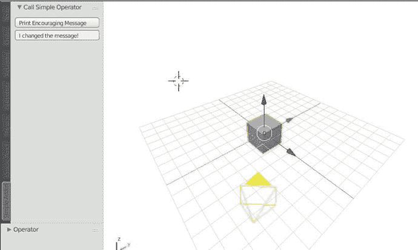
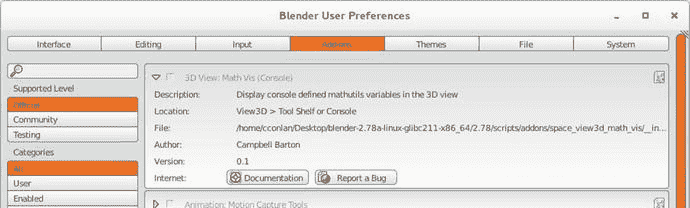
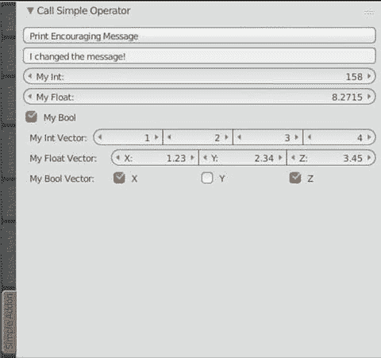
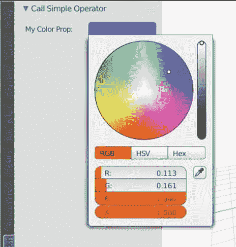
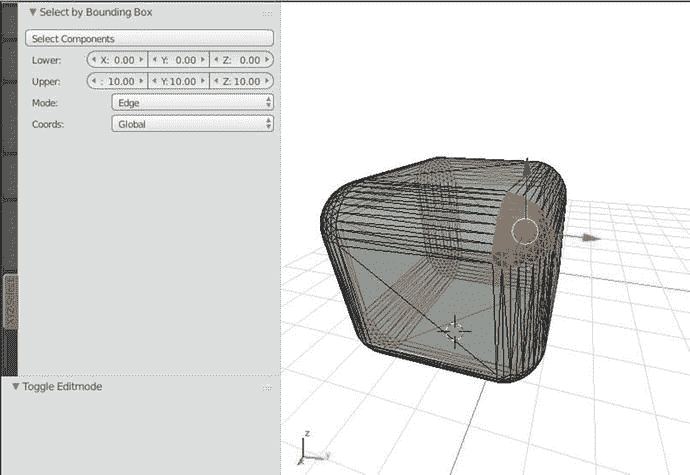

# 五、插件开发简介

本章使用 Blender 的 Python API 构建基本的附加组件。插件开发的最大障碍之一是从一个开发环境过渡到一个包装整齐且独立于操作系统的插件，所以我们在本章花了相当多的时间讨论各种开发实践。在本章结束时，读者应该能够在开发和部署环境中注册简单的附加组件。接下来的章节将在这些知识的基础上，将更多的高级特性整合到附加组件中。

## 一个简单的附加模板

对于这一节，进入 Blender 的脚本视图，并进入文本编辑器➤新建创建一个新的脚本。给它起个名字，比如`simpleaddon.py`。参见清单 [5-1](#Par3) 中的简单模板，我们可以从这里开始构建我们的附加组件。运行这个脚本将在工具面板中创建一个名为“Simple Addon”的新标签，它有一个简单的文本输入框和一个按钮。该按钮将向控制台打印一条消息，验证插件是否工作，然后鹦鹉学舌般地重复文本输入字段中的字符串。附件 GUI 的外观和位置见图 [5-1](#Fig1) 。



图 5-1。

Simple add-on template

```py
bl_info = {
    "name": "Simple Add-on Template",
    "author": "Chris Conlan",
    "location": "View3D > Tools > Simple Addon",
    "version": (1, 0, 0),
    "blender": (2, 7, 8),
    "description": "Starting point for new add-ons.",
    "wiki_url": "http://example.com",
    "category": "Development"
}

# Custom modules are imported here

# See end of chapter example for suggested protocol

import bpy

# Panels, buttons, operators, menus, and

# functions are all declared in this area

# A simple Operator class

class SimpleOperator(bpy.types.Operator):

    bl_idname = "object.simple_operator"
    bl_label = "Print an Encouraging Message"

    def execute(self, context):
        print("\n\n####################################################")
        print("# Add-on and Simple Operator executed successfully!")
        print("# " + context.scene.encouraging_message)
        print("####################################################")
        return {'FINISHED'}

    @classmethod
    def register(cls):
        print("Registered class: %s " % cls.bl_label)

        # Register properties related to the class here

        bpy.types.Scene.encouraging_message = bpy.props.StringProperty(
            name="",
            description="Message to print to user",
            default="Have a nice day!")

    @classmethod
    def unregister(cls):
        print("Unregistered class: %s " % cls.bl_label)

        # Delete parameters related to the class here

        del bpy.types.Scene.encouraging_message

# A simple button and input field in the Tools panel

class SimplePanel(bpy.types.Panel):
    bl_space_type = "VIEW_3D"
    bl_region_type = "TOOLS"
    bl_category = "Simple Addon"
    bl_label = "Call Simple Operator"
    bl_context = "objectmode"

    def draw(self, context):
        self.layout.operator("object.simple_operator",
                             text="Print Encouraging Message")
        self.layout.prop(context.scene, 'encouraging_message')

    @classmethod
    def register(cls):
        print("Registered class: %s " % cls.bl_label)
        # Register properties related to the class here.

    @classmethod

    def unregister(cls):
        print("Unregistered class: %s " % cls.bl_label)
        # Delete parameters related to the class here

def register():

    # Implicitly register objects inheriting bpy.types in current file and scope

    #bpy.utils.register_module(__name__)

    # Or explicitly register objects

    bpy.utils.register_class(SimpleOperator)
    bpy.utils.register_class(SimplePanel)

    print("%s registration complete\n" % bl_info.get('name'))

def unregister():

    # Always unregister in reverse order to prevent error due to

    # interdependencies

    # Explicitly unregister objects

    # bpy.utils.unregister_class(SimpleOperator)

    # bpy.utils.unregister_class(SimplePanel)

    # Or unregister objects inheriting bpy.types in current file and scope

    bpy.utils.unregister_module(__name__)
    print("%s unregister complete\n" % bl_info.get('name'))

# Only called during development with 'Text Editor -> Run Script'

# When distributed as plugin, Blender will directly

# and call register() and unregister()

if __name__ == "__main__":

    try:
        unregister()
    except Exception as e:
        # Catch failure to unregister explicitly

        print(e)
        pass

    register()

Listing 5-1.Simple Add-On Template

```

当我们运行这个脚本时，我们应该得到关于我们在清单 [5-1](#Par3) 中声明的类的注册和注销的控制台输出。通过更改消息并选择打印鼓励消息，我们应该会在控制台中看到如下内容:

```py
Unregistered class: Print an Encouraging Message Unregistered class: Call Simple Operator
Simple Add-on Template unregister complete

Registered class: Print an Encouraging Message Registered class: Call Simple Operator
Simple Add-on Template registration complete

####################################################
# Add-on and Simple Operator executed successfully!
# Have a nice day!

####################################################

####################################################
# Add-on and Simple Operator executed successfully!
# I changed the message!
####################################################

```

尽管有许多细节需要解释，Blender 插件还是相当优雅和易读的。虽然每一行代码都有一个目的，但脚本通过重复受益于一致性。图 [5-1](#Fig1) 中展示的模板相当简单，但是我们也包括了一些可选的质量控制。我们先讨论每个组件，然后再讨论更高级的附加组件。

## Blender 附件的组件

Blender 插件依赖于许多不同的和特别命名的变量和类函数来正常运行。我们在这里按类别详细介绍它们。

### 商业信息词典

出现在 Blender 附加组件中的第一个东西应该是`bl_info`字典。这个字典是从源文件的前 1024 个字节中解析出来的，所以`bl_info`必须出现在文件的顶部。我们将使用字典这个词来指代`dict`类的 Python 对象。

Blender 的内部引擎使用这个字典中的数据来填充与附加组件本身相关的各种元数据。如果我们导航到标题菜单➤文件➤用户偏好➤附加组件，我们可以看到各种官方和社区附加组件已经在 Blender。点击任何附加组件上的插入符号，显示如何使用`bl_info`信息来填充这个 GUI，如图 [5-2](#Fig2) 所示。



图 5-2。

How Blender uses bl_info

值得注意的是,`bl_info`字典对附加组件没有任何功能影响，而是决定了最终用户如何在这个窗口中找到并激活它。请参见此处的详细描述:

*   名称—插件在用户首选项的附加项选项卡中显示的名称(例如，`Math` Vis(控制台)，运动捕捉工具)。它被写成单个字符串。
*   作者——出现在用户首选项中的一个或多个作者的姓名(例如，Campbell Barton、Fabian Fricke)。它可以是一个带逗号的字符串或一组字符串。
*   位置—附加组件 GUI 的主要位置。对于工具、属性和工具架面板中的附加组件，常用语法为窗口➤面板➤选项卡➤部分。如有疑问，请遵循其他附加组件建立的约定。
*   版本—以元组形式表示的附加组件的版本号。
*   blender——根据 Blender Wiki，这是运行插件所需的最低 Blender 版本号。当较低版本可以支持附加组件时，社区附加组件经常错误地将`(2, 7, 8)`列为版本。在许多情况下，这个数字指的是开发者选择支持的最低版本。
*   描述—显示在“用户首选项”窗口中的简短描述，指定为单个字符串。
*   wiki _ url 指向附加模块手册或指南的 url，指定为单个字符串。
*   category —A string specifying one the categories listed in Table [5-1](#Tab1).

    表 5-1。

    The bl-info Category Options

    <colgroup><col> <col> <col> <col> <col> <col></colgroup> 
    | 三维视图 | 作文 | 照明设备 | 目标 | 装备 | 文字编辑器 |
    | --- | --- | --- | --- | --- | --- |
    | 添加网格 | 发展 | 材料 | 颜料 | 事件 | 紫外线 |
    | 添加曲线 | 游戏引擎 | 网状物 | 物理学 | 序列发生器 | 用户界面 |
    | 动画 | 进出口 | 结节 | 提出 | 系统 |   |

还有一些不太常见的选项。

*   支持— `OFFICIAL`、`COMMUNITY`或`TESTING`。其中官方指的是官方支持的 Blender 附加组件，社区指的是社区支持的附加组件，测试指的是应该有意从 Blender 版本中排除的未完成的或新的附加组件。
*   tracker _ url—指向错误跟踪器的 URL(例如，GitHub 问题或类似问题)。
*   警告—指定将出现在用户首选项窗口中的某些警告的字符串。

### 运算符和类继承(bpy.types.Operator)

从最简单的意义上说，插件允许我们通过点击标准 Blender GUI 中的按钮来调用 Blender Python 函数。Blender GUI 调用的函数必须首先注册为类`bpy.types.Operator`的操作符。以`SimpleOperator`为例。当我们注册这个类时，对`SimpleOperator.execute()`的调用被映射到`bpy.ops`中的一个函数对象。它映射到的函数是由类头部的`bl_idname`值决定的`bpy.ops`。因此，在您运行清单 [5-1](#Par3) 中的脚本之后，您可以通过从交互控制台、从附加组件本身或者从不相关的 Python 脚本中调用`bpy.ops.object.simple_operator()`来打印一条鼓励性的消息。

下面是在 Blender 中声明一个操作符的步骤。请参考清单 [5-1](#Par3) 中的`SimpleOperator`类定义。

1.  声明一个继承`bpy.types.Operator`的类。这将在我们的代码中显示为:

    ```py
    class MyNewOperator

    (bpy.types.Operator):

    ```

2.  将`bl_idname`声明为一个字符串，带有您选择的类和函数名，用句点分隔(例如，`object.simple_operator`或`simple.message`)。类名和函数名只能包含小写字符和下划线。执行功能稍后将在`bpy.ops.my_bl_idname`可用。
3.  (可选)声明一个`bl_label`作为描述该类函数的任何字符串。这将出现在 Blender 自动生成的函数文档和元数据中。
4.  声明一个`execute`函数。这个函数将作为一个普通的类函数，并且总是接受对`bpy.context`的引用作为参数。根据`bpy.types.Operator`类的设计，`execute`函数总是被定义为:

    ```py
    def execute(self, context):

    ```

    在一个操作符类中，如果成功调用了`execute()`，那么最好的做法是返回`{"FINISHED"}`。
5.  (可选)声明注册和注销类的类方法。`register`和`unregister`函数总是需要`@classmethod`装饰器，并将`cls`作为参数。每当 Blender 试图注册或注销 operator 类时，都会运行这些函数。在开发过程中包含一个关于类注册和取消注册的打印声明是很有帮助的，就像我们在清单 [5-1](#Par3) 中所做的那样，以检查 Blender 没有错误地重新注册现有的类。同样需要注意的是，我们可以在这些函数中声明和删除场景属性。我们将在后面的章节中讨论这一点。

为了确保 Blender 可以使用我们的 Python 代码，有一些限制和准则需要遵循。最终，这些指导方针改变了我们编码的方式和我们思考构建 Python 代码库的方式。这就是我们对 Blender Python API 的理解，它开始感觉像一个真正的应用编程接口(API)，而不仅仅是有用函数的集合。

### 面板和类继承(bpy.types.Panel)

`bpy.types.Panel`类是在附加组件中继承的下一个最常见的类。面板已经构成了 Blender 的大部分工具、工具箱和属性窗口。其中一个窗口的每个可折叠部分都是一个不同的面板。例如，如果我们导航到 3D 视口➤工具➤工具，我们会默认看到三个面板:变换，编辑和历史。在 Blender Python 插件中，这些将由三个不同的`bpy.types.Panel`类来表示。

以下是注册面板的要求。参考清单 [5-1](#Par3) 中的`SimplePanel`类。

1.  声明一个继承`bpy.types.Panel`的类。这将显示为`class MyNewPanel(bpy.types.Panel):`。
2.  Declare `bl_space_type`, `bl_region_type`, `bl_category`, and `bl_label`. Readers may have noticed the ordering of these is intentional (though not necessary). These four variables, in the order written and in Listing [5-1](#Par3), specify the path that the user takes to reach the panel. In Listing [5-1](#Par3), this reads VIEW_3D ➤ TOOLS ➤ Simple Addon ➤ Call Simple Operator, which looks very familiar to the way we have located GUI elements thus far in the text. Correct case and spelling matter in these variables. While the category and label can be arbitrary values, the space and region must reference real areas of the Blender GUI. See Tables [5-2](#Tab2) and [5-3](#Tab3) for the list of possible arguments to `bl_space_type` and `bl_region_type`.

    表 5-3。

    bl-region-type Options

    <colgroup><col> <col> <col> <col> <col> <col> <col></colgroup> 
    | `WINDOW` | `HEADER` | `CHANNELS` | `TEMPORARY UI` | `TOOLS` | `TOOL_PROPS` | `PREVIEW` |

    表 5-2。

    bl-space-type Options

    <colgroup><col> <col> <col> <col></colgroup> 
    | `EMPTY` | `NLA_EDITOR` | `NODE_EDITOR` | `INFO` |
    | `VIEW_3D` | `IMAGE_EDITOR` | `LOGIC_EDITOR` | `FILE_BROWSER` |
    | `TIMELINE` | `SEQUENCE_EDITOR` | `PROPERTIES` | `CONSOLE` |
    | `GRAPH_EDITOR` | `CLIP_EDITOR` | `OUTLINER` |   |
    | `DOPESHEET_EDITOR` | `TEXT_EDITOR` | `USER_PREFERENCES` |   |

    Most combinations of `bl_space_type` and `bl_region_type` do not work together, but logical combinations will generally work. There is presently no complete documentation on which space types and region types cooperate. Also, not all space types and region types require a declaration of `bl_category` or `bl_label`. Again, using them where logical typically gives good results.  
3.  (可选)声明`bl_context`。和前面的例子一样，我们可以设置`bl_context`等于`objectmode`，让面板只出现在对象模式下。在撰写本文时，我们还没有这个变量的有效选项的具体列表。API 文档当前有一个 TODO 标记要求更多解释。我们将在后面的章节中介绍`poll()`方法，这是实现这种行为的一种更加灵活的方式。
4.  声明`draw`方法。这个函数将上下文作为一个参数，并且总是被声明为`def draw(self, context):`。在这个函数定义中，需要注意的是，`context`指的是`bpy.context`对象，但不应该作为`bpy.context`传递。这个函数体中的重要变量是`bpy.context.scene`和`self.layout`。`layout.prop()`函数可以引用场景属性、对象属性和一些其他的 Blender 内部属性。它将根据场景属性本身自动创建适当的输入字段。清单 [5-1](#Par3) 中的`encouraging_message`场景属性被声明为字符串属性，因此将其作为参数提供给`layout.prop()`会产生一个文本输入字段。`layout.operator()`函数获取一个操作符的`bl_idname`并创建一个标签由`text = argument`指定的按钮。我们不会在这里详细讨论布局对象，因为对于高级 GUI 来说它会变得非常复杂。我们将在本章后面详细讨论布局对象。
5.  (可选)用装饰器`@classmethod`声明`register()`和`unregister()`函数，就像我们讨论`bpy.types.Operator`类一样。

### 注册()和取消注册()

在清单 [5-1](#Par3) 的末尾附近是两个函数`register()`和`unregister()`，它们是附加组件中必需的。这两个函数负责调用`bpy.utils.register_class()`、`bpy.utils.unregister_class()`、`bpy.utils.register_module()`和`bpy.utils.unregister_module()`。任何继承了`bpy.type`类的类都需要注册，以便 Blender 在插件中使用。当用户在用户首选项中关闭附加组件时，Blender 使用`unregister()`功能。

我们有两种注册和注销类的选择。有些更适合开发，有些更适合部署。

*   显式注册和注销每个类。在这种情况下，我们希望按照逻辑顺序注册类。依赖于其他类的类应该在它们的依赖者之后注册。我们在使用`bpy.utils.register_class()`的`register()`函数中这样做，将类名作为参数传递。应使用`unregister()`功能中的`bpy.utils.unregister_class()`以相反的顺序取消注册类别。
*   根据类在模块中的成员身份隐式注册和注销类。我们用`bpy.utils.register_module()`和`bpy.utils.unregister_module()`函数来实现。我们经常看到`bpy.utils.register_module(__name__)`在已发布的附加组件的`register()`函数中被调用，但是在开发过程中可能会很混乱，我们稍后会解释。

回头看看清单 [5-1](#Par3) ，我们看到我们已经显式地注册了我们的类，但是隐式地取消了注册。在作者看来，这种设置非常适合单文件插件的实时编辑。`bpy.utils.unregister_module(__name__)`的作用是清除在脚本之前运行中注册的类的附加环境。在使用 Blender 的文本编辑器进行编辑的过程中，`bpy.utils.register_module(__name__)`经常会注册以前运行脚本时类的失效或未使用的副本。

因此，现场编辑附加组件的全新方法似乎是显式注册和隐式注销。隐式取消注册将从以前的运行中挑选出分散的类实例，然后显式注册只实例化当前运行中新创建的类。这违背了大多数文档的建议，它们通常建议使用清单 [5-2](#Par48) 中的一种样式来注册和注销。我们在清单 [5-1](#Par3) 中的方法是安全的、冗长的，并且可以很容易地修改以符合清单 [5-2](#Par48) 中普遍接受的实践。

```py
# Option 1:

# Using implicit registration

def register():
    bpy.utils.register_module(__name__)

def unregister():
    bpy.utils.unregister_module(__name__)

if __name__ == "__main__":
    register()

# Option 2:

# Using explicit registration

def register():
    bpy.utils.register_class(SimpleOperator)
    bpy.utils.register_class(SimplePanel)

def unregister():
    bpy.utils.unregister_class(SimpleOperator)
    bpy.utils.unregister_class(SimplePanel)

if __name__ == "__main__":
    register()

# Option 3 (Recommended)

# Explicit registration and implicit unregistration

# With safe + verbose single-script run

def register():
    bpy.utils.register_class(SimpleOperator)
    bpy.utils.register_class(SimplePanel)

def unregister():
    bpy.utils.unregister_module(__name__)

if __name__ == "__main__":
    try:
        unregister()
    except Exception as e:
        print(e)
        pass

    register()

Listing 5-2.Registration Protocol

```

### 场景属性和 bpy.props

添加到`Scene`和`Object`类型的属性将被保存到`.blend`文件中。为了让用户通过 Blender GUI 修改变量，他们必须注册为`bpy.props.*`对象。`bpy.props`类有大多数数据类型的选项，包括浮点数、整数、字符串和布尔值。他们可以注册到`bpy.types.*`类，包括`Scene`和`Object`。在本节中，我们讨论如何将简单的场景属性注册到`bpy.types.Scene.*`变量中。这些是可以通过`bpy.context.scene.*`访问的任意命名的变量。虽然名称是任意的，但它仅限于小写字符和下划线。

我们可以在两个地方注册场景变量:

*   在脚本底部的`register()`函数中。
*   在继承了`bpy.types.*`类的任何类的`register()`class 方法中(面板、操作符、菜单等)。).

最常见的情况是，场景变量直接绑定到一个类。为了清晰和组织，我们希望在该类的`register()` classmethod 中声明这些变量。其他不适合类定义的变量可以在脚本底部的`register()`函数中声明。在本文中，我们鼓励场景属性在`register()` classmethod 中声明，如果与一个特定的类紧密相关的话，但是这在现有的社区附加组件中并不常见。

场景变量将是`bpy.types.*`变量的实例。这些包括 Blender 类型`StringProperty`、`FloatProperty`、`IntProperty`和`BoolProperty`。任何时候面板通过调用`self.layout.prop`在 GUI 中包含一个变量，该变量将根据其类型进行逻辑格式化。整数和浮点数出现在滑动条中，字符串显示为文本输入字段，布尔值显示为复选框，等等。

在清单 [5-3](#Par56) 中，我们用额外的场景变量重新声明了清单 [5-1](#Par3) 中的`SimpleOperator`和`SimplePanel`。读者将使用清单 [5-1](#Par3) 作为模板重写这些类。参见图 [5-3](#Fig3) 获得最终图形用户界面。



图 5-3。

Exploring scene properties

```py
# Simple Operator with Extra Properties

class SimpleOperator(bpy.types.Operator):
    bl_idname = "object.simple_operator"
    bl_label = "Print an Encouraging Message"

    def execute(self, context):
        print("\n\n####################################################")
        print("# Add-on and Simple Operator executed successfully!")
        print("# Encouraging Message:", context.scene.encouraging_message)
        print("# My Int:", context.scene.my_int_prop)
        print("# My Float:", context.scene.my_float_prop)
        print("# My Bool:", context.scene.my_bool_prop)
        print("# My Int Vector:", *context.scene.my_int_vector_prop)
        print("# My Float Vector:", *context.scene.my_float_vector_prop)
        print("# My Bool Vector:", *context.scene.my_bool_vector_prop)
        print("####################################################")
        return {'FINISHED'}

    @classmethod

    def register(cls):
        print("Registered class: %s " % cls.bl_label)

        bpy.types.Scene.encouraging_message = bpy.props.StringProperty(
            name="",
            description="Message to print to user",
            default="Have a nice day!")

        bpy.types.Scene.my_int_prop = bpy.props.IntProperty(
            name="My Int",
            description="Sample integer property to print to user",
            default=123,
            min=100,
            max=200)

        bpy.types.Scene.my_float_prop = bpy.props.FloatProperty(
            name="My Float",
            description="Sample float property to print to user",
            default=3.1415,
            min=0.0,
            max=10.0,
            precision=4)

        bpy.types.Scene.my_bool_prop = bpy.props.BoolProperty(
            name="My Bool",
            description="Sample boolean property to print to user",
            default=True)

        bpy.types.Scene.my_int_vector_prop = bpy.props.IntVectorProperty(
            name="My Int Vector",
            description="Sample integer vector property to print to user",
            default=(1, 2, 3, 4),
            subtype='NONE',
            size=4)

        bpy.types.Scene.my_float_vector_prop = bpy.props.FloatVectorProperty(
            name="My Float Vector",
            description="Sample float vector property to print to user",
            default=(1.23, 2.34, 3.45),
            subtype='XYZ',
            size=3,
            precision=2)

        bpy.types.Scene.my_bool_vector_prop = bpy.props.BoolVectorProperty(
            name="My Bool Vector",
            description="Sample bool vector property to print to user",
            default=(True, False, True),
            subtype='XYZ',
            size=3)

    @classmethod

    def unregister(cls):
        print("Unregistered class: %s " % cls.bl_label)
        del bpy.types.Scene.encouraging_message

# Simple button in Tools panel

class SimplePanel(bpy.types.Panel):
    bl_space_type = "VIEW_3D"
    bl_region_type = "TOOLS"
    bl_category = "Simple Addon"
    bl_label = "Call Simple Operator"
    bl_context = "objectmode"

    def draw(self, context):
        self.layout.operator("object.simple_operator",
                             text="Print Encouraging Message")
        self.layout.prop(context.scene, 'encouraging_message')
        self.layout.prop(context.scene, 'my_int_prop')
        self.layout.prop(context.scene, 'my_float_prop')
        self.layout.prop(context.scene, 'my_bool_prop')
        self.layout.prop(context.scene, 'my_int_vector_prop')
        self.layout.prop(context.scene, 'my_float_vector_prop')
        self.layout.prop(context.scene, 'my_bool_vector_prop')

    @classmethod
    def register(cls):
        print("Registered class: %s " % cls.bl_label)
        # Register properties related to the class here.

    @classmethod
    def unregister(cls):
        print("Unregistered class: %s " % cls.bl_label)

Listing 5-3.Exploring Scene Properties

```

可用`bpy.props.*`变量列表见表 [5-4](#Tab4) 。更多信息参见`bpy.props`的 API 文档页面。到目前为止，我们还没有涉及`EnumProperty`、`CollectionProperty`或`PointerProperty`。我们将在本章后面介绍`EnumProperty`，我们将在第 [7](7.html) 章中介绍关于高级附加功能的`CollectionProperty`。

表 5-4。

Available Blender Properties

<colgroup><col> <col> <col> <col></colgroup> 
| `BoolProperty` | `EnumProperty` | `IntProperty` | `StringProperty` |
| `BoolVectorProperty` | `FloatProperty` | `IntVectorProperty` |   |
| `CollectionProperty` | `FloatVectorProperty` | `PointerProperty` |   |

属性声明的参数通常很简单，其中许多参数在不同的属性之间共享。最值得注意的是:

*   `default=`是长度等于指定默认值的大小的值或元组。
*   `name=`是将出现在 GUI 输入字段左侧的值。
*   `description=`是当用户将光标悬停在 GUI 元素上时显示的字符串。
*   `precision=`指定任何浮点属性显示的小数精度。
*   `size=`指定任何矢量属性中所需的矢量大小(通常是类型`Vector`、`bpy_boolean`或`bpy_int`)。
*   `subtype=` specifies the desired display formatting string for a variable. Useful examples are `XYZ` and `TRANSLATION`, which will display X, Y, Z, and W ahead of your first four variables in the UI. Another notable example is `subtype="COLOR"`, which will create an attractive color selection UI when added to a panel. See Listing [5-4](#Par68) and Figure [5-4](#Fig4) for an example of the color subtype. Note that Blender uses a floating-point range of (0.0, 1.0) for colors. Tables [5-5](#Tab5) and [5-6](#Tab6) show the property and vector property subtypes.

    表 5-6。

    Available Vector Property Subtypes

    <colgroup><col> <col> <col> <col> <col></colgroup> 
    | `COLOR` | `VELOCITY` | `EULER` | `XYZ` | `NONE` |
    | `TRANSLATION` | `ACCELERATION` | `QUATERNION` | `COLOR_GAMMA` |   |
    | `DIRECTION` | `MATRIX` | `AXISANGLE` | `LAYER` |   |

    表 5-5。

    Available Property Subtypes

    <colgroup><col> <col> <col> <col> <col> <col> <col> <col></colgroup> 
    | `PIXEL` | `PERCENTAGE` | `ANGLE` | `DISTANCE` | `UNSIGNED` | `FACTOR` | `TIME` | `NONE` |

    

    图 5-4。

    Color subtype
*   `min=`和`max=`指定可在 GUI 中显示的极值以及可存储在变量中的极值。
*   `softmin=`和`softmax=`指定用于显示变量和缩放滑块的最小和最大滑块值。只要在最小值和最大值之间，仍然可以手动输入任意值。
*   接受函数作为参数。该函数在每次值更新时运行。指定的函数应该接受`self`和`context`作为参数，不管它是在哪里声明的。这个函数目前还没有文档，但是表现相当好。

```py
bpy.types.Scene.my_color_prop = bpy.props.FloatVectorProperty(
    name="My Color Property",
    description="Returns a vector of length 4",
    default=(0.322, 1.0, 0.182, 1.0),
    min=0.0,
    max=1.0,
    subtype='COLOR',
    size=4)
Listing 5-4.Using the Color Subtype

```

## 精确选择附加示例

至此，我们已经充分讨论了 Blender Python API 概念，可以开始构建有效的附加组件了。对于我们的第一个真正的附加组件，我们将参数化第 [3](3.html) 章中声明的`ut.act.select_by_loc()`函数，以在编辑模式下实现精确的组选择。

在我们开始之前，请确保从 [`http://blender.chrisconlan.com/ut.py`](http://blender.chrisconlan.com/ut.py) 下载章节 [3](3.html) 的`ut.py`的迭代。我们将在我们的附加组件中导入它。社区使用了一些不同的协议来管理附加组件中的自定义导入。我们将讨论一个用于管理来自单级目录的自定义导入的通用协议。换句话说，我们将导入与主脚本位于同一目录中的定制模块。

### 我们附加组件的代码概述

我们概述了构建附加组件的步骤，从开发到部署和共享:

1.  创建主脚本，并在 Blender 的文本编辑器中将其命名为`__init__.py`。将清单 [5-1](#Par3) 中的附加模板复制到这个脚本中。
2.  创建第二个脚本，在 Blender 的文本编辑器中将其命名为`ut.py`。将 [`http://blender.chrisconlan.com/ut.py`](http://blender.chrisconlan.com/ut.py) 处的 Python 模块复制到这个脚本中。
3.  为我们的新附加组件修改`bl_info`。
4.  添加自定义模块导入协议。参见从`if "bpy" in locals():`开始的清单 [5-5](#Par86) 。很简单，为了测试我们是部署模式还是开发模式，我们检查`bpy`是否在当前名称空间中。注意这个协议依赖于脚本中跟在它后面的`import bpy`。如果我们在这个协议之前`import bpy`，那么`locals()`中的`bpy`将总是`True`，使其无效。当附加组件被加载到 Blender 中时，或者当它被部署时，这个协议将表现良好。在 Blender 文本编辑器中开发时，我们将正常导入自定义模块。
    *   如果`bpy`在脚本的这一点上在名称空间中，我们之前已经加载了附加组件及其依赖模块。在这种情况下，使用`importlib.reload()`重新加载对象。
    *   如果此时`bpy`不在名称空间中，那么我们将第一次加载附加组件。导入模块，假设它位于文件系统中与`__init__.py`相同的目录中。为了从与主脚本相同的目录中导入，我们使用`from . import custommodule`。Note This protocol depends on
5.  正常导入任何原生 Blender 和/或原生 Python 模块。
6.  声明我们的核心操作类，`SelectByLocation`。我们将用可感知的输入参数化`ut.act.select_by_loc()`作为场景属性。
    *   使用`bpy.props.FloatVectorProperty`注册边界框。
    *   使用`bpy.props.EnumProperty`注册选择模式和坐标系的菜单。有关这些参数的解释，请参见第 [3](3.html) 章中的列表 [3-8](3.html#Par38) 至 [3-10](3.html#Par44) 。 
7.  声明我们的核心面板类，`XYZSelect`。这里我们将整理与`operator`相关的按钮和参数。在这种情况下，默认的菜单布局看起来非常直观。仅当模式为编辑模式时，声明`poll()` classmethod 以返回`True`。
8.  实现安全和详细的注册，如清单 [5-1](#Par86) 所示。

```py
bl_info = {
    "name": "XYZ-Select",
    "author": "Chris Conlan",
    "location": "View3D > Tools > XYZ-Select",
    "version": (1, 0, 0),
    "blender": (2, 7, 8),
    "description": "Precision selection in Edit Mode",
    "category": "3D View"
}

### Use these imports to during development ###

import ut
import importlib importlib.reload(ut)

### Use these imports to package and ship your add-on ###

# if "bpy" in locals():

#    import importlib

#    importlib.reload(ut)

#    print('Reloaded ut.py')

# else:

#    from . import ut

#    print('Imported ut.py')

import bpy import os import random

# Simple Operator with Extra Properties

class xyzSelect(bpy.types.Operator):
    bl_idname = "object.xyz_select"
    bl_label = "Select pieces of objects in Edit Mode with bounding boxes"

    def execute(self, context):

        scn = context.scene

        output = ut.act.select_by_loc(lbound=scn.xyz_lower_bound,
                                      ubound=scn.xyz_upper_bound,
                                      select_mode=scn.xyz_selection_mode,
                                      oords=scn.xyz_coordinate_system)

        print("Selected " + str(output) + " " + scn.xyz_selection_mode + "s")

        return {'FINISHED'}

    @classmethod
    def register(cls):
        print("Registered class: %s " % cls.bl_label)
        bpy.types.Scene.xyz_lower_bound = bpy.props.FloatVectorProperty(
            name="Lower",
            description="Lower bound of selection bounding box",
            default=(0.0, 0.0, 0.0),
            subtype='XYZ',
            size=3,
            precision=
2

        )
        bpy.types.Scene.xyz_upper_bound = bpy.props.FloatVectorProperty(
            name="Upper",
            description="Upper bound of selection bounding box",
            default=(1.0, 1.0, 1.0),
            subtype='XYZ',
            size=3,
            precision=2
        )

        # Menus for EnumProperty's

        selection_modes = [
            ("VERT", "Vert", "", 1),
            ("EDGE", "Edge", "", 2),
            ("FACE", "Face", "", 3),
        ]
        bpy.types.Scene.xyz_selection_mode = \
            bpy.props.EnumProperty(items=selection_modes, name="Mode")

        coordinate_system = [
            ("GLOBAL", "Global", "", 1),
            ("LOCAL", "Local", "", 2),
        ]
        bpy.types.Scene.xyz_coordinate_system = \
            bpy.props.EnumProperty(items=coordinate_system, name="Coords")

    @classmethod
    def unregister(cls):
        print("Unregistered class: %s " % cls.bl_label)
        del bpy.context.scene.xyz_coordinate_system
        del bpy.context.scene.xyz_selection_mode
        del bpy.context.scene.xyz_upper_bound
        del bpy.context.scene.xyz_lower_bound

# Simple button in Tools panel

class xyzPanel(bpy.types.Panel):
    bl_space_type = "VIEW_3D"
    bl_region_type = "TOOLS"
    bl_category = "XYZ-Select"
    bl_label = "Select by Bounding Box"

    @classmethod
    def poll(self, context):
        return context.object.mode == 'EDIT'

    def draw(self, context):
        scn = context.scene

        lay = self.layout
        lay.operator('object.xyz_select', text="Select Components")
        lay.prop(scn, 'xyz_lower_bound')
        lay.prop(scn, 'xyz_upper_bound')
        lay.prop(scn, 'xyz_selection_mode')
        lay.prop(scn, 'xyz_coordinate_system')

    @classmethod
    def register(cls):
        print("Registered class: %s " % cls.bl_label)

    @classmethod
    def unregister(cls):
        print("Unregistered class: %s " % cls.bl_label)

def register():
    # bpy.utils.register_module(__name__)

    bpy.utils.register_class(xyzSelect)
    bpy.utils.register_class(xyzPanel)

    print("%s registration complete\n" % bl_info.get('name'))

def unregister():
    # bpy.utils.unregister_class(xyzPanel)

    # bpy.utils.unregister_class(xyzSelect)

    bpy.utils.unregister_module(__name__)
    print("%s unregister complete\n" % bl_info.get('name'))

if __name__ == "__main__":

    try:

        unregister()
    except Exception as e:
        print(e)
        pass

    register()

Listing 5-5.XYZ-Select Add-On

```

参见图 [5-5](#Fig5) 使用这个插件精确扭曲一个 icosphere 的例子。



图 5-5。

Color subtype

我们在这个例子中引入了两个新概念——`poll()`class method 和`EnumProperty`变量。我们接下来解释这两者。

### poll()类方法

`poll()` classmethod 是一个通常放在面板声明中的`bl_*`变量之后的函数。每当 3D 视口更新时，将调用该函数来确定是否显示面板。

如果函数返回任何非空值，面板将显示。尽管任何非空值都足够，但返回一个布尔值被认为是最佳做法。回想一下，数字`0`、空字符串和`False`在 Python 中都被认为是 null。

在我们的插件中，如果用户处于编辑模式，我们只需返回`True`，如下所示:

```py
# poll function for edit-mode-only panels
@classmethod

def poll(self, context):
    return context.object.mode == 'EDIT'

```

### EnumProperty 变量

`bpy.props.EnumProperty`类是我们通过 API 显示下拉菜单的方式。它由元组列表实例化，其中元组中的每个元素表示一个 Blender 数据值。该模式如下所示:

```py
my_enum_list = [
    ("python_1", "display_1", "tooltip_1", "icon_1", 'number_1),
    ("python_2", "display_2", "tooltip_2", "icon_2", 'number_2),
    # etc ...

    ("python_n", "display_n", "tooltip_n", "icon_n", 'number_n)
]

```

这直接来自 API 文档:

1.  第一个参数是 Python 中`bpy.context.scene.my_enum_list`返回的值。
2.  第二个参数是 GUI 菜单中显示的值。
3.  第三个值是 GUI 菜单中显示的工具提示。它可以是空字符串。
4.  (可选)整数或字符串标识符，内部使用，由`bpy.types.UILayout.icon`使用。
5.  (可选)存储在文件数据中的唯一值，当第一个参数可能是动态的时使用。

### 准备我们的附加组件进行分发

要准备我们的插件进行分发，请按照下列步骤操作:

1.  按照注释中的说明取消对`import`行的注释。
2.  将脚本还原为显式注册和显式注销。
3.  (可选)测试完附加组件后，删除详细的打印语句。这纯粹是为了避免弄乱最终用户的终端。
4.  替换以下文件层次中的模块，并将其压缩为一个`.zip`文件。

```py
xyz-select/
  |  __init__.py
  \  ut.py

```

要安装我们的附加组件，导航到标题菜单➤文件➤用户首选项➤附加组件➤从文件安装。在那里，选中和取消选中复选框以启用和禁用附加组件。这将触发`__init__.py`中的`register()`和`unregister()`方法。注册应该成功，没有错误。

要直接下载压缩插件，请前往 [`http://blender.chrisconlan.com/xyz-select.zip`](http://blender.chrisconlan.com/xyz-select.zip) 。

## 结论

在下一章中，我们将讨论用于在 3D 视口中可视化数据的`blf`和`bgl`模块。在第 7 章[中，我们介绍了先进的附加开发概念。](7.html)