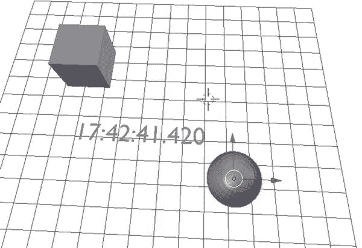
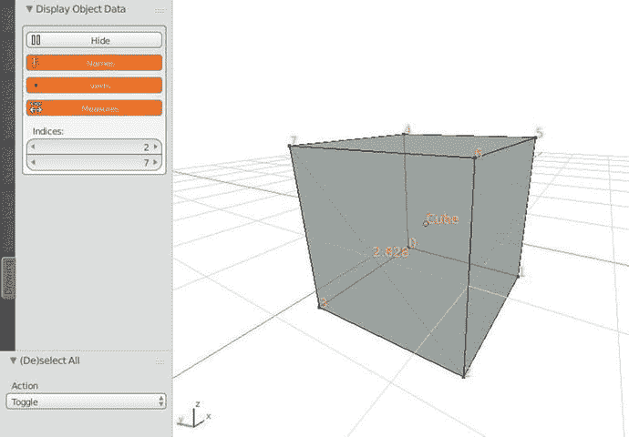
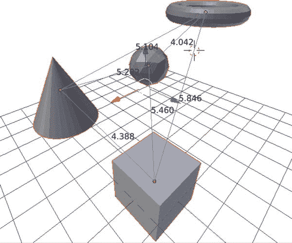

# 6.bgl 和 blf 模块

`bgl`模块是 3D 视口和 Blender 游戏引擎中 Blender 常用的 OpenGL 函数的包装器。OpenGL(开放图形库)是一种开源的低级 API，用于无数的 3D 应用中，以利用硬件加速计算。

对于那些已经熟悉 OpenGL 读者来说,`bgl`文档看起来很熟悉。`bgl`模块本身旨在模仿 OpenGL 2.1 的调用结构和逐帧渲染风格。

在通读`bgl`文档时，我们注意到许多高级概念，如缓冲操作、面剔除和光栅化。幸运的是，对于 Blender Python 程序员来说，3D 视口已经可以管理这些操作了。我们更关心用额外的信息来标记 3D 视口，以帮助用户理解他的模型。本章主要关注用`bgl`绘图。

`blf`模块是用于显示文本和绘制字体的一小组函数。它与`bgl`密切相关，在没有它的例子中很少被提及。Blender Python 开发人员通常将`bgl`和`blf`模块结合起来制作测量工具，用`bgl`画线，用`blf`显示他们的测量结果。我们在本章中正是这样做的。

请注意，这些模块通常出现在带有`bge` (Blender 游戏引擎)模块的示例中。我们将不会在 Blender 游戏引擎中工作，所以这些脚本将不会运行，并且导入`bge`的尝试将会失败。我们将绘图限制在三维视口中。

还要注意的是，在 Blender 2.80+中，`bgl`模块被设置为替换或大部分重建。这一章很可能是本文发布后的第一个更新。

## 瞬时绘图

`bgl`和`blf`模块不能像其他 Blender Python 模块那样被教授。当这些模块中的任何一个在 3D 视口中绘制线条或字符时，它仅在单个帧中可见。因此，我们不能像在其他模块中那样在交互式控制台中试验它。我们在交互式控制台中执行的功能可能会正确执行，但我们将无法在 3D 视口中查看结果。

为了有效地使用`bgl`和`blf`模块，我们必须在一个处理函数中使用它们，该函数被设置为在每次帧改变时更新。因此，我们从使用非 OpenGL 概念的处理程序示例开始。

## 处理程序概述

本节给出了使用`bpy.app.handlers`的处理程序的例子。这不是我们在处理`bgl`和`blf`时最终会用到的子模块，但是它对于学习 Blender 中的处理程序是有指导意义的。

### 时钟示例

处理程序是设置为每次事件发生时运行的函数。为了实例化一个处理程序，我们声明一个函数，然后将它添加到 Blender 中一个可能的处理程序列表中。在清单 [6-1](#Par14) 中，我们创建了一个用当前时间修改文本网格文本的函数。然后我们将该函数添加到`bpy.app.handlers.scene_update_pre`中，以表明我们希望它在 3D 视窗更新和显示之前运行。

结果是在 3D 视口中出现一个时钟。实际上，它是一个每秒更新多次的文本网格。这个例子并不安全，也不完全可靠，但只要我们将对象保留在场景中并命名为`MyTextObj`，我们就可以添加和编辑其他对象，时钟在后台运行。结果见图 [6-1](#Fig1) 。



图 6-1。

Result of the Blender clock handler example Note

时钟的行为不是记录的行为，可能会随着 Blender 的未来版本而改变。具体来说，Blender 打算改变他们称为帧改变的内容。目前，帧变化似乎是瞬间和持续发生的。

Blender 的官方文档给出了传递给处理程序的唯一参数是一个哑元的例子。处理函数应该像传统的 Python lambdas 一样处理，除了需要一个伪参数作为第一个参数。我们传递的是函数本身而不是函数的输出，传递时会创建一个新的函数未命名实例。在为处理程序创建了这个未命名的函数之后，我们不能轻易访问它。

```py
import bpy import datetime

# Clear the scene bpy.ops.object.select_all(action='SELECT') bpy.ops.object.delete()

# Create an object for our clock bpy.ops.object.text_add(location=(0, 0, 0)) bpy.context.object.name = 'MyTextObj'

# Create a handler function

def tell_time(dummy):
    current_time = datetime.datetime.now().strftime('%H:%M:%S.%f')[:-3]
    bpy.data.objects['MyTextObj'].data.body = current_time

# Add to the list of handler functions "scene_update_pre"

bpy.app.handlers.scene_update_pre.append(tell_time)

Listing 6-1.Blender Clock Handler Example

```

### 管理处理程序

在`bpy.app.handlers`的例子中，我们可以编辑各种函数列表来管理我们的处理程序。这些列表实际上是类型为`list`的 Python 类，我们可以对它们进行操作。我们可以使用`list`类方法，如`append()`、`pop()`、`remove()`和`clear()`来管理我们的处理函数。参见清单 [6-2](#Par16) 中一些有用的例子。

```py
# Will only work if 'tell_time' is in scope

bpy.app.handlers.scene_update_pre.remove(tell_time)

# Useful in development for a clean slate

bpy.app.handlers.scene_update_pre.clear()

# Remove handler at the end of the list and return it

bpy.app.handlers.scene_update_pre.pop()

Listing 6-2.Managing Handler Lists

```

### 处理程序的类型

在清单 [6-1](#Par14) 中，我们使用`bpy.app.handlers.scene_update_pre`在每次更新前根据内部变量修改网格。表 [6-1](#Tab1) 详述了`bpy.app.handlers`中出现在官方文件中的处理程序类型。

表 6-1。

Types of Handlers

<colgroup><col> <col></colgroup> 
| 处理者 | 呼吁 |
| --- | --- |
| `frame_change_post` | 渲染或回放过程中帧改变后 |
| `frame_change_pre` | 渲染或回放期间帧改变之前 |
| `render_cancel` | 取消渲染作业 |
| `render_complete` | 完成渲染作业 |
| `render_init` | 初始化渲染作业 |
| `render_post` | 渲染后 |
| `render_pre` | 渲染前 |
| `render_stats` | 打印渲染统计 |
| `render_write` | 在渲染中写入帧后 |
| `load_post` | 加载. blend 文件后 |
| `load_pre` | 加载. blend 文件之前 |
| `save_post` | 保存. blend 文件后 |
| `save_pre` | 在保存. blend 文件之前 |
| `scene_update_post` | 在更新场景数据(例如，3D 视口)之后 |
| `scene_update_pre` | 在更新场景数据(例如，3D 视口)之前 |
| `game_pre` | 启动游戏引擎 |
| `game_post` | 结束游戏引擎 |

表 [6-1](#Tab1) 中有一些功能重叠，并且不是每个处理程序的行为都与预期一致。例如，在清单 [6-1](#Par14) 中使用`scene_update_post`而不是`scene_update_pre`根本不起作用。鼓励读者进行试验，以确定哪一个符合他们的需求。

### 持久处理程序

如果我们想让处理程序在加载一个`.blend`文件后保持不变，我们可以添加`@persistent`装饰器。通常，当加载一个`.blend`文件时，处理程序被释放，所以像`bpy.app.handlers.load_post`这样的处理程序需要这个装饰器。清单 [6-3](#Par21) 在加载一个`.blend`文件后使用`@persistent`装饰器打印文件诊断。

```py
import bpy
from bpy.app.handlers import persistent

@persistent

def load_diag(dummy):
    obs = bpy.context.scene.objects

     print('\n\n### File Diagnostics ###')
     print('Objects in Scene:', len(obs))
     for ob in obs:
         print(ob.name, 'of type', ob.type)
bpy.app.handlers.load_post.append(load_diag)

# After reloading startup file:

#

# ### File Diagnostics ###

# Objects in Scene: 3

# Cube of type MESH

# Lamp of type LAMP

# Camera of type CAMERA

Listing 6-3.Printing File Diagnostics on Load

```

## blf 和 bgl 中的处理程序

现在我们已经对处理程序有了基本的了解，我们将详细说明如何使用 OpenGL 工具直接在 3D 视口中进行绘制。用于在 3D 视口中绘图的处理程序不是`bpy.app.handlers`的一部分，而是`bpy.types.SpaceView3D`的未记录成员函数。为了理解这些成员函数，我们减少了其他开发人员使用它们的真实例子。

清单 [6-4](#Par24) 展示了如何使用`bgl`和`blf`在原点绘制一个对象的名称。

```py
import bpy
from bpy_extras import view3d_utils import bgl
import blf

# Color and font size of text

rgb_label = (1, 0.8, 0.1, 1.0)
font_size = 16
font_id = 0

# Wrapper for mapping 3D Viewport to OpenGL 2D region

def gl_pts(context, v):

    return view3d_utils.location_3d_to_region_2d(
        context.region,
        context.space_data.region_3d,
        v)

# Get the active object, find its 2D points, draw the name

def draw_name(context):

    ob = context.object
    v = gl_pts(context, ob.location)

    bgl.glColor4f(*rgb_label)

    blf.size(font_id, font_size, 72)
    blf.position(font_id, v[0], v[1], 0)
    blf.draw(font_id, ob.name)

# Add the handler

# arguments:

# function = draw_name,

# tuple of parameters = (bpy.context,),

# constant1 = 'WINDOW',

# constant2 = 'POST_PIXEL'

bpy.types.SpaceView3D.draw_handler_add(
    draw_name, (bpy.context,), 'WINDOW', 'POST_PIXEL')

Listing 6-4.Drawing the Name of an Object

```

在文本编辑器中运行清单 [6-4](#Par24) 将允许您查看在其原点绘制的活动对象的名称。

用`bpy.types.SpaceView3D`创建的处理程序不像在`bpy.app.handlers`中那样容易访问，默认情况下是持久的。除非我们创建更好的控件来打开和关闭这些处理程序，否则我们将不得不重启 Blender 来分离这个处理程序。在下一节中，我们将这个处理程序放在一个附加组件中，这个附加组件允许我们用一个按钮来打开和关闭它。此外，我们将处理程序存储在一个`bpy.types.Operator`中，这样在将它添加到处理程序中之后，我们就不会丢失对函数的引用。

Note

`draw_handler_add()`和`draw_handler_remove()`函数目前在 Blender 的官方文档中的`bpy.types.SpaceView3D`中没有记载。因此，我们将根据已知的功能示例尽可能地与他们合作。

## 示例附加组件

这个附加组件是一个独立的脚本，因此可以通过将它复制到文本编辑器或通过用户首选项导入来运行。鼓励读者通过文本编辑器运行它，以便于实验。附件见清单 [6-5](#Par29) ，结果截图见图 [6-2](#Fig2) (编辑模式下)。



图 6-2。

Drawing add-on on a cube in Edit Mode

```py
bl_info = {
    "name": "Simple Line and Text Drawing",
    "author": "Chris Conlan",
    "location": "View3D > Tools > Drawing",
    "version": (1, 0, 0),
    "blender": (2, 7, 8),
    "description": "Minimal add-on for line and text drawing with bgl and blf. "
                   "Adapted from Antonio Vazquez's (antonioya) Archmesh." ,
    "wiki_url": "http://example.com",
    "category": "Development"
}

import bpy
import bmesh
import os

import bpy_extras
import bgl
import blf

# view3d_utils must be imported explicitly

from bpy_extras import view3d_utils

def draw_main(self, context):
    """Main function, toggled by handler"""

    scene = context.scene
    indices = context.scene.gl_measure_indices

    # Set color and fontsize parameters

    rgb_line = (0.173, 0.545, 1.0, 1.0)
    rgb_label = (1, 0.8, 0.1, 1.0)

    fsize = 16

    # Enable OpenGL drawing

    bgl.glEnable(bgl.GL_BLEND)
    bgl.glLineWidth(1)

    # Store reference to active object

    ob = context.object

    # Draw vertex indices

    if scene.gl_display_verts:
        label_verts(context, ob, rgb_label, fsize)

    # Draw measurement

    if scene.gl_display_measure:
        if(indices[1] < len(ob.data.vertices)):
            draw_measurement(context, ob, indices, rgb_line, rgb_label, fsize)

    # Draw name

    if scene.gl_display_names:
        draw_name(context, ob, rgb_label, fsize)

    # Disable OpenGL drawings and restore defaults

    bgl.glLineWidth(1)
    bgl.glDisable(bgl.GL_BLEND)
    bgl.glColor4f(0.0, 0.0, 0.0, 1.0)

class glrun(bpy.types.Operator):
    """Main operator, flicks handler on/off"""

    bl_idname = "glinfo.glrun"
    bl_label = "Display object data"
    bl_description = "Display additional information in the 3D Viewport"

    # For storing function handler

    _handle = None

    # Enable GL drawing and add handler

    @staticmethod
    def handle_add(self, context):

        if glrun._handle is None:
            glrun._handle = bpy.types.SpaceView3D.draw_handler_add(
                draw_main, (self, context), 'WINDOW', 'POST_PIXEL')
            context.window_manager.run_opengl = True

    # Disable GL drawing and remove handler

    @staticmethod
    def handle_remove(self, context):
        if glrun._handle is not None:
            bpy.types.SpaceView3D.draw_handler_remove(glrun._handle, 'WINDOW')
        glrun._handle = None
        context.window_manager.run_opengl = False

    # Flicks OpenGL handler on and off

    # Make sure to flick "off" before reloading script when live editing

    def execute(self, context):
        if context.area.type == 'VIEW_3D':

            if context.window_manager.run_opengl is False:
                self.handle_add(self, context)
                context.area.tag_redraw()
            else:
                self.handle_remove(self, context)
                context.area.tag_redraw()

            return {'FINISHED'}
        else:
            print("3D Viewport not found, cannot run operator.")
            return {'CANCELLED'}

class glpanel(bpy.types.Panel):
    """Standard panel with scene variables"""

    bl_idname = "glinfo.glpanel"
    bl_label = "Display Object Data"
    bl_space_type = 'VIEW_3D'
    bl_region_type = "TOOLS"
    bl_category = 'Drawing'

    def draw(self, context):
        lay = self.layout
        scn = context.scene

        box = lay.box()

        if context.window_manager.run_opengl is False:
            icon = 'PLAY'
            txt = 'Display'
        else:
            icon = 'PAUSE'
            txt = 'Hide'
        box.operator("glinfo.glrun", text=txt, icon=icon)

        box.prop(scn, "gl_display_names", toggle=True, icon="OUTLINER_OB_FONT")
        box.prop(scn, "gl_display_verts", toggle=True, icon='DOT')
        box.prop(scn, "gl_display_measure", toggle=True, icon="ALIGN")
        box.prop(scn, "gl_measure_indices")

    @classmethod
    def register(cls):

        bpy.types.Scene.gl_display_measure = bpy.props.BoolProperty(
            name="Measures",
            description="Display measurements for specified indices in active mesh.",
            default=True,
        )

        bpy.types.Scene.gl_display_names = bpy.props.BoolProperty(
            name="Names",
            description="Display names for selected meshes.",
            default=True,
        )

        bpy.types.Scene.gl_display_verts = bpy.props.BoolProperty(
            name="Verts",
            description="Display vertex indices for selected meshes.",
            default=True,
        )

        bpy.types.Scene.gl_measure_indices = bpy.props.IntVectorProperty(
            name="Indices",
            description="Display measurement between supplied vertices.",
            default=(0, 1),

            min=0,
            subtype='NONE',
            size=2)

        print("registered class %s " % cls.bl_label)

    @classmethod
    def unregister(cls):
        del bpy.types.Scene.gl_display_verts
        del bpy.types.Scene.gl_display_names
        del bpy.types.Scene.gl_display_measure
        del bpy.types.Scene.gl_measure_indices

        print("unregistered class %s " % cls.bl_label)

##### Button-activated drawing functions #####

# Draw the name of the object on its origin

def draw_name(context, ob, rgb_label, fsize):
    a = gl_pts(context, ob.location)
    bgl.glColor4f(rgb_label[0], rgb_label[1], rgb_label[2], rgb_label[3])
    draw_text(a, ob.name, fsize)

# Draw line between two points, draw the distance

def draw_measurement(context, ob, pts, rgb_line, rgb_label, fsize):
    # pts = (index of vertex #1, index of vertex #2)

    a = coords(ob, pts[0])
    b = coords(ob, pts[1])

    d = dist(a, b)

    mp = midpoint(a, b)

    a = gl_pts(context, a)
    b = gl_pts(context, b)
    mp = gl_pts(context, mp)

    bgl.glColor4f(rgb_line[0], rgb_line[1], rgb_line[2], rgb_line[3]) draw_line(a, b)

    bgl.glColor4f(rgb_label[0], rgb_label[1], rgb_label[2], rgb_label[3])
    draw_text(mp, '%.3f' % d, fsize)

# Label all possible vertices of

object

def label_verts(context, ob, rgb, fsize):
    try:
        # attempt get coordinates, will except if object does not have vertices

        v = coords(ob)
        bgl.glColor4f(rgb[0], rgb[1], rgb[2], rgb[3])
        for i in range(0, len(v)):
            loc = gl_pts(context, v[i]) draw_text(loc, str(i), fsize)
    except AttributeError :
        # Except attribute error to not fail on lights, cameras, etc

        pass

# Convert 3D points to OpenGL-compatible 2D points

def gl_pts(context, v):
    return bpy_extras.view3d_utils.location_3d_to_region_2d(
        context.region,
        context.space_data.region_3d,
        v)

##### Core drawing functions #####

# Generic function for drawing text on screen

def draw_text(v, display_text, fsize, font_id=0):
    if v:
        blf.size(font_id, fsize, 72)
        blf.position(font_id, v[0], v[1], 0)
        blf.draw(font_id, display_text)
    return

# Generic function for drawing line on screen

def draw_line(v1, v2):
    if v1 and v2:
        bgl.glBegin(bgl.GL_LINES)
        bgl.glVertex2f(*v1)
        bgl.glVertex2f(*v2)
        bgl.glEnd()
    if return

##### Utilities #####

# Returns all coordinates or single coordinate of object

# Can toggle between GLOBAL and LOCAL coordinates

def coords(obj, ind=None, space='GLOBAL'):
    if obj.mode == 'EDIT':
        v = bmesh.from_edit_mesh(obj.data).verts
    elif obj.mode == 'OBJECT':
        v = obj.data.vertices

    if space == 'GLOBAL':
        if isinstance(ind, int):
            return (obj.matrix_world * v[ind].co).to_tuple()
        else:
            return [(obj.matrix_world * v.co).to_tuple() for v in v]

    elif space == 'LOCAL':
        if isinstance(ind, int):
            return (v[ind].co).to_tuple()
        else:
            return [v.co.to_tuple() for v in v]

# Returns Euclidean distance between two 3D points

def dist(x, y):
    return ((x[0] - y[0])**2 + (x[1] - y[1])**2 + (x[2] - y[2])**2)**0.5

# Returns midpoint between two 3D points

def midpoint(x, y):
    return ((x[0] + y[0]) / 2, (x[1] + y[1]) / 2, (x[2] + y[2]) / 2)

##### Registration #####

def register():
    """Register objects inheriting bpy.types in current file and scope"""

    # bpy.utils.register_module(__name__)

    # Explicitly register objects

    bpy.utils.register_class(glrun)
    bpy.utils.register_class(glpanel)
    wm = bpy.types.WindowManager
    wm.run_opengl = bpy.props.BoolProperty(default=False)
    print("%s registration complete\n" % bl_info.get('name'))

def unregister():

    wm = bpy.context.window_manager
    p = 'run_opengl'
    if p in wm:
        del wm[p]

    # remove OpenGL 
data

    glrun.handle_remove(glrun, bpy.context)

    # Always unregister in reverse order to prevent error due to

    # interdependencies

    # Explicitly unregister objects

    # bpy.utils.unregister_class(glpanel)

    # bpy.utils.unregister_class(glrun)

    # Unregister objects inheriting bpy.types in current file and scope

    bpy.utils.unregister_module(__name__)
    print("%s unregister complete\n" % bl_info.get('name'))

# Only called during development with 'Text Editor -> Run Script'

# When distributed as plugin, Blender will directly call register()

if __name__ == "__main__":
    try:
        os.system('clear')
        unregister()
    except Exception as e:
        print(e)
        pass

    finally:
        register()

Listing 6-5.Simple Line and Text Drawing

```

从这里开始，我们通过引用清单 [6-5](#Par29) 来解释使用`bgl`和`blf`的核心概念。我们将从最低级别的代码(核心`bgl`和`blf`)转移到最高级别的代码(面板和处理程序声明)。

### 绘制线条和文本

我们的目标是在画布上绘制线条和文本。清单 [6-5](#Par29) 中的`draw_text()`和`draw_line()`函数通过将 2D 画布坐标作为输入并将信息传递给`bgl`和`blf`来实现这一点。

```py
# Generic function for drawing text on screen

def draw_text(v, display_text, fsize, font_id=0):
    if v:
        blf.size(font_id, fsize, 72)
        blf.position(font_id, v[0], v[1], 0)
        blf.draw(font_id, display_text)
    return

# Generic function for drawing line on screen

def draw_line(v1, v2):
    if v1 and v2:
        bgl.glBegin(bgl.GL_LINES)
        bgl.glVertex2f(*v1)
        bgl.glVertex2f(*v2)
        bgl.glEnd()
    return

```

#### 转换到 2D 画布

这些点必须事先转换到 2D 画布的坐标系。幸运的是，`bpy_extra` s 模块对此有一个实用程序。我们将`bpy_extras.view3d_utils.location_3d_to_region_2d()`工具包装在一个函数中，该函数接受`bpy.context`和一个 3D 点作为参数。在将任何 3D 点传递给我们的绘图函数之前，我们只需将它们转换到 2D 画布上。

```py
# Convert 3D points to OpenGL-compatible 2D points

def gl_pts(context, v):
    return bpy_extras.view3d_utils.location_3d_to_region_2d(
        context.region,
        context.space_data.region_3d,
        v
        )

```

### 声明按钮激活的绘图函数

该附加组件将做三件事:

*   使用`label_verts()`标记任何对象的顶点及其索引。
*   显示距离，并使用`draw_measurement()`在对象上的任意两个顶点之间画一条线。
*   用`draw_name()`在原点显示对象的名称。

这些函数接受传递给`draw_line()`和`draw_text()`的`bpy.context`、对对象本身的引用、期望的索引以及颜色和字体信息。

Note

该插件执行的大多数功能都可以通过使用`--debug`标志启动 Blender 或操作编辑模式的显示设置来执行。这个附件旨在为读者提供一个可以借鉴的范例。

### 声明主绘图函数

每次帧更新时都会执行`draw_main()`功能。`draw_main()`函数应该接受`self`和`context`。它可以接受出现在它的`operator`类中的任何其他参数，我们将在下面详述，但是我们鼓励用户声明的参数通过`context`作为`bpy.props`对象传递。

在每一帧中，`draw_main()`功能应该:

*   使用`bgl.glEnable(bgl.GL_BLEND)`启用 OpenGL 混合，并设置 OpenGL 参数。对`bgl.glEnable()`的调用允许在附加组件中绘制的 OpenGL 场景与 3D 视口中的场景混合。
*   画出每一条线和每一个字符。
*   用`bgl.glDisable(bgl.GL_BLEND)`禁用 OpenGL，并重置任何 OpenGL 参数。

虽然在每一步都可以不启用或禁用 OpenGL，但鼓励确保与其他可能使用它的附加组件的合作。

### 用处理程序声明运算符

`draw_main()`功能应该在每次帧更新时执行。为了管理操作符中的处理程序，我们使用带有函数`handler_add(self, context)`和`handler_remove(self, context)`的`@staticmethod`装饰器。这些函数有特殊的属性，帮助它们在通过`execute()`调用时与处理程序很好地交互。正如我们提到的，与这个附加组件相关的许多组件都没有文档记录，所以我们将从表面上接受它们。在`operator`类之外，我们也接受与`bpy.types.WindowManager`相关的行。

清单 [6-5](#Par29) 中的`glrun()`操作符类可以代表 Blender Python 中大多数(如果不是全部)支持 OpenGL 的插件。我们通常可以通过修改它外部的函数而不是修改`operator`类本身来获得想要的结果。

### 用动态绘图声明面板

鉴于我们在第五章[中对附加组件的讨论，panel 类相当简单。值得指出的是，清单](5.html) [6-5](#Par29) 引入了组织工具`self.layout.box()`，我们将在第 [7](7.html) 章中讨论。此外，我们在清单 [6-5](#Par29) 中引入了动态面板。简而言之，`draw()`类函数在每次帧更新时被调用，并且可以被动态修改而不会产生任何后果。第 7 章[也讨论了我们如何使用它来制作更直观的附加组件。](7.html)

## 扩展我们的 bgl 和 blf 模板

在清单 [6-5](#Par29) 中，我们画出了物体的名称，标注了它们的顶点，并画出了从一个顶点到另一个顶点的线条和度量。使用清单 [6-5](#Par29) 作为模板，我们可以很容易地实现更复杂和特定领域的工具。

例如，假设我们想画出每个物体到其他物体的距离。这可能有助于研究分子的原子结构或航线飞行模式。在这两种情况下，我们都关心某些物体之间的距离。清单 [6-6](#Par52) 显示了一个我们可以添加到清单 [6-5](#Par29) 中的函数，用于绘制提供给它的所有对象之间的距离。图 [6-3](#Fig3) 显示了结果。



图 6-3。

Drawing the distance matrix

```py
# Draws the distance between the origins of each object supplied

def draw_distance_matrix(context, obs, rgb_line, rgb_label, fsize):

    N  =  len(obs)
    for j in range(0, N):
        for i in range(j + 1, N):
            a = obs[i].location
            b = obs[j].location
            d = dist(a, b)
            mp = midpoint(a, b)

            a_2d = gl_pts(context, a)
            b_2d = gl_pts(context, b)
            mp_2d = gl_pts(context, mp)

            bgl.glColor4f(*rgb_line)
            draw_line(a_2d, b_2d)

            bgl.glColor4f(*rgb_label)
            draw_text(mp_2d, '%.3f' % d, fsize)

# Add this to draw_main() to draw between all selected objects:

# obs = context.selected_objects

# draw_distance_matrix(context, obs, rgb_line, rgb_label, fsize)

# Add this to draw_main() to draw between all objects in scene:

# obs = context.scene.objects

# draw_distance_matrix(context, obs, rgb_line, rgb_label, fsize)

Listing 6-6.Drawing a Distance Matrix

```

## 结论

在本章中，我们讨论了如何使用处理程序`bgl`和`blf`在 3D 视口中实时显示数据。这是我们拥有的另一个工具，可以用来构建完整而全面的附加组件。

在下一章，我们将讨论高级附加组件。我们学习如何完全忽略文本编辑器，直接在 Blender 的文件树中构建复杂的附加组件。此外，我们还研究了一些流行的开源插件，看看它们是如何解决我们目前面临的许多开发挑战的。