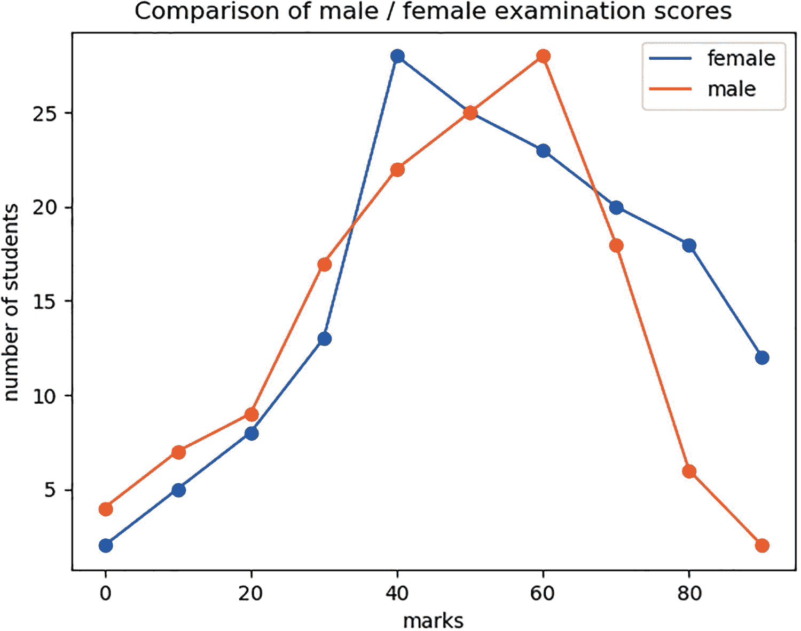
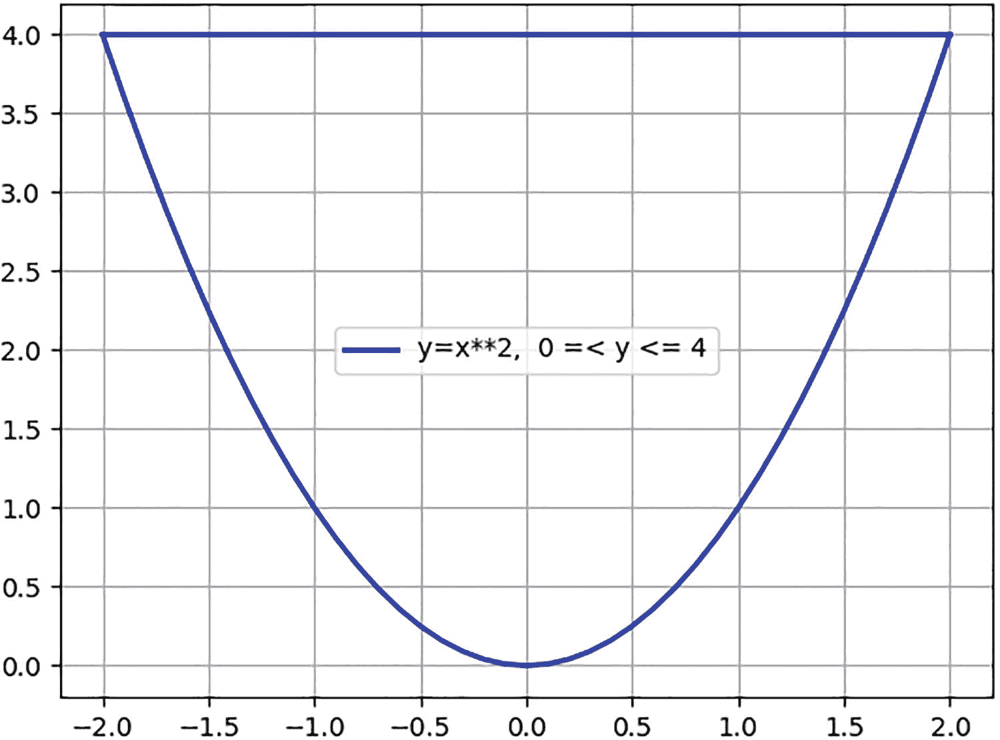
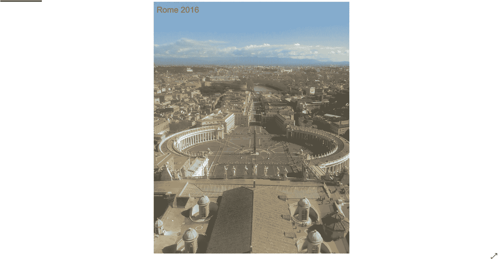

# 五、嵌入式 Python

自 20 世纪 70 年代早期以来，C 编程语言就一直在运行，并且从那时起一直是计算机软件开发的核心。Python 语言较新，可以执行一些 C 语言不能执行的功能。因此，能够编写一个 C 程序并在其中嵌入一些 Python 代码是很有用的。这就是本章将要阐述的内容。

我们将看看可以合并到 C 程序中的以下两个级别的 Python 代码:

*   调用一个简单的 Python 字符串。

*   调用一个 Python 程序。

为了将这两个级别嵌入到我们的 C 程序中，我们必须初始化 Python 解释器。主函数调用是 Py_Initialize()。在 Python 序列的最后，我们调用 Py _ Finalize()；。

要调用一个简单的字符串，我们使用 PyRun _ SimpleString。

为了运行一个 Python 程序，我们使用`PyRun_SimpleFile.`

Python 有 matplotlib 和 numpy，可以嵌入 C 程序。这些将在程序使用它们的章节中介绍。

这些列表将被标记为“列表 [5-1](#PC1) ”等。，关联的嵌入式 Python 程序将用扩展名“b”标记。所以在这里，它的标签应该是“清单 5-1b”。

## 基本机制

清单 [5-1](#PC1) 展示了前面描述的简单字符串选项。Python 只是打印“嵌入的 Python 字符串”。

```py
#include <stdio.h>
#include "include/Python.h"
int main()
{
     Py_Initialize();
     PyRun_SimpleString("print('Embedded Python string')");
     Py_Finalize();
     return 0;
}

Listing 5-1cpyth1.c

```

这个程序打印

**嵌入的 Python 字符串**

清单 [5-2](#PC2) 展示了第二个嵌入选项。这里，我们调用 Python 程序 pyemb7.py。我们创建一个名为`char filename[]`的变量，它将保存要调用的文件名。我们定义变量 fp，它是文件指针。

```py
#define PY_SSIZE_T_CLEAN
#include <stdio.h>
#include <conio.h>
#include "include/Python.h"

int main()
{
     char filename[] = "pyemb7.py"; /* store the python file name */
     FILE* fp; /* file pointer */

     Py_Initialize();

     fp = _Py_fopen(filename, "r"); /* store file pointer in fp */
     PyRun_SimpleFile(fp, filename);/* call the python program */

     Py_Finalize(); /* end the python link */
     return 0;
}

Listing 5-2cpyth8.c

```

下面的清单 [5-2b](#PC3) 是一个简单的 Python 程序，它被称为。

```py
print('Embedded Python program here')
print('Hello to C program')

Listing 5-2bpyemb7.py

```

这个程序打印

```py
Embedded Python program here
Hello to C program

```

我们现在可以进展到更现实的 Python 嵌入。

## 画一条 2D 线

接下来的 C 程序基本上和前面的一样，只是调用了不同的 Python 程序。清单 [5-3](#PC5) 演示了这一点。

```py
#define PY_SSIZE_T_CLEAN
#include <stdio.h>
#include <conio.h>
#include "include/Python.h"

int main()
{
     char filename[] = "plot6a.py";
     FILE* fp;

     Py_Initialize();

     fp = _Py_fopen(filename, "r");
     PyRun_SimpleFile(fp, filename);

     Py_Finalize();
     return 0;
}

Listing 5-3cpyth17a.c

```

这个 Python 程序(清单 [5-3b](#PC6) )演示了 numpy 和 matplotlib 的使用。Numpy 是一组数值化的程序，matplotlib 与绘制图形有关。Python 程序绘制直线 y = x + 3。我们使用 numpy 函数 np.arange(0，10)设置 x 值。这会创建 0 到 10 之间的等间距 x 值。我们使用 y = x + 3 来计算每个 x 值的 y 值。

然后我们调用 matplotlib 函数 plt.plot(x，y)来绘制图形。

```py
import numpy as np
from matplotlib import pyplot as plt

x = np.arange(0,10) #return evenly spaced values between 0 and 10
y = x + 3 # formula to calculate y values for the x values given in the previous instruction
plt.title("Embedded ")  #title of graph
plt.xlabel("x axis") #x axis label
plt.ylabel("y axis") #y axis label
plt.plot(x,y) #plot the graph
plt.show()

Listing 5-3bplot6a.py

```

这产生了如图 [5-1](#Fig1) 所示的图形。


图 5-1

y = x + 3 的基本直线

我们现在可以在图上画两条线了。

## 画两条 2D 线

C 和 Python 的这种结合展示了 Python 中 matplotlib 的一些灵活性。它在同一个图形上绘制两条曲线。清单 [5-4](#PC7) 演示了这一点。

```py
-

Listing 5-4bmp2aa.py

```

```py
#define PY_SSIZE_T_CLEAN
#include <stdio.h>
#include <conio.h>
#include "include/Python.h"

int main()
{
     char filename[] = "mp2aa.py";
     FILE* fp;

     Py_Initialize();

     fp = _Py_fopen(filename, "r");
     PyRun_SimpleFile(fp, filename);

     Py_Finalize();
     return 0;
}

Listing 5-4cpyth29.c

```

这个程序(清单 [5-4b](#PC8) )绘制了两个图形。一张图显示了女性考试分数的分布情况(百分比值),另一张图显示了男性考试分数的分布情况。

我们使用 **list(range(0，100，10))** 函数为两个图形创建一组 x 值(标记)。

```py
import matplotlib.pyplot as plt
# x values:
marks = list(range(0,100,10)) #marks (x values) in range 0 to 100 in units of 10
# y values:
male = [4, 7, 9, 17, 22, 25, 28, 18, 6, 2] # number of males within each range
female = [2, 5, 8, 13, 28, 25, 23, 20, 18, 12] # number of females within each range

# x axis label and y axis label
plt.xlabel('marks')
plt.ylabel('number of students')

#title of graph
plt.title('Comparison of male / female examination scores')
#plot points and adjoining lines for both male and female
#show a key to which line is male and which is female
plt.plot(marks, female, label="female")
plt.plot(marks, female, "ob")  # ob means plot a circle character which is blue
plt.plot(marks, male, label="male")
plt.plot(marks, male, "or") # or means plot a circle character which is red

plt.legend()
plt.show()

```

该程序绘制出如图 [5-2](#Fig2) 所示的曲线。



图 5-2

男女考试成绩对比

这两个图表显示了男女学生的类似分布。这种一般形状称为“正态分布”

Matplotlib 还可以绘制标准三角曲线，如下所示。

## 绘制三角曲线

清单 [5-5](#PC10) 中的下一个组合显示了标准的 matplotlib tan(x)函数。

```py
-

Listing 5-5bmp5ae.py

```

```py
#define PY_SSIZE_T_CLEAN
#include <stdio.h>
#include <conio.h>
#include "include/Python.h"

int main()
{
     char filename[] = "mp5ae.py";
     FILE* fp;

     Py_Initialize();

     fp = _Py_fopen(filename, "r");
     PyRun_SimpleFile(fp, filename);

     Py_Finalize();
     return 0;
}

Listing 5-5cpyth32.c

```

在这个程序(清单 [5-5b](#PC11) )中，我们使用 np.arange(-2*np.pi，2*np.pi，0.1)给我们一组 x 值，它们是 pi 的倍数。因此，我们可以画出一个标准的三角函数。

```py
import numpy as np
import matplotlib.pyplot as plt

# Choose evenly spaced x intervals
x = np.arange(-2*np.pi, 2*np.pi, 0.1)

# plot y = tan(x)
plt.plot(x, np.tan(x))

# Set the range of the axes
plt.axis([-2*np.pi, 2*np.pi, -2, 2])

# Include a title
plt.title('y = tan(x)')

# Optional grid-lines
plt.grid()
plt.xlabel('x values')
plt.ylabel('y values')
# Show the graph
plt.show()

```

该程序绘制出如图 [5-3](#Fig3) 所示的曲线。


图 5-3

标准曲线 y = tan(x)

网格图是一个 matplotlib 选项。在正切三角曲线的情况下，包含网格是有用的，因为它显示了渐近线。

我们可以允许用户输入要绘制的数据点，如下例所示。

## 输入要绘制的数据

下一个例子有一个更重要的 C 程序。该程序计算数学值积矩相关系数。这是对图形中 x 值和 y 值之间关系的度量。用户输入 x 和 y 值。C 程序计算这些值的 PMCC，并将其写入文件`pmccfcnt.bin`，将 x 和 y 值写入文件`pmccf.bin`。Python 程序读取这两个文件，并创建一个显示(x，y)点和 PMCC 值的图形。如果 x 和 y 值之间的关系是一条正斜率的直线，则 PMCC 为+1。如果我们得到一条负梯度的直线，那么 PMCC 就是-1。如果这些点几乎在正的直线上，那么 PMCC 大约是 0.9568。这些点离直线越远，PMCC 离 1 就越远，例如 0.7453。

下面我们来看一个例子，我们正在研究一辆汽车的价值如何在 6 年内贬值。在图 [5-4](#Fig4) 中，x 是年数，y 是以千美元计的汽车价值。


图 5-4

汽车折旧的 x，y 点

其曲线图如图 [5-5](#Fig5) 所示。


图 5-5

汽车折旧图

```py
Value ($1000)

```

汽车折旧的 PMCC 是 0.996961。

PMCC 的公式是

r = S<sub>xy/(</sub>S<sub>x *</sub>S<sub>y)(1)</sub>

其中 S<sub>x</sub>=<sub>√</sub>S<sub>xx(2)</sub>

而 S<sub>y</sub>=<sub>√</sub>S<sub>YY(3)</sub>

s<sub>【xx =</sub>【x】<sup>【2】</sup>——【x】<sup>【2】</sup>/n(4)

s<sub>【YY =</sub>【和<sup><sup>——【y】<sup><sup>/n(5)</sup></sup></sup></sup>

s<sub>xy =</sub>xy-(∑x∑y)/n(6)

**∑x** 表示所有 x 值的总和。

**∑y** 表示所有 y 值的总和。

**∑x** <sup>**2**</sup> 表示所有 x 值的平方，然后求和。

**∑y** <sup>**2**</sup> 表示所有 y 值的平方，然后求和。

**∑xy** 的意思是将每个 x，y 对相乘，然后求和。

在我们的六个公式中使用这些值，我们得到

**x**= 2.5+3.0+3.5+4.0+4.5+5.0+5.5+6.0 = 34

和= 11.5+10.6+9.2+7.8+6.1+4.7+3.9+1.8 = 55.6

**xy**= 2.5 * 11.5+3.0 * 10.6+3.5 * 9.2+4.0 * 7.8+4.5 * 6.1+5.0 * 4.7+5.5 * 3.9+6.0 * 1.8

= 28.75 + 31.8 + 32.2 + 31.2 + 27.45 + 23.5 + 21.45 + 10.8

= 207.15

**x**<sup>**【2】**</sup>= 2.5<sup><sup>+3.0<sup><sup>+3.5</sup>2</sup>+4</sup></sup>

= 6.25 + 9 + 12.25 + 16 + 20.25 + 25 + 30.25 + 36

= 155

**和**<sup>**【2】**</sup>= 11.5<sup>+2</sup>+10.6<sup>+2</sup>+9.2+2+7

= 132.25 + 112.36 + 84.64 + 60.84 + 37.21 + 22.09 + 15.21 + 3.24

= 467.84

根据∑x 和∑y 的值，我们得到

= * x/8 = 34/8 = 4.25

= y/8 = 55.6/8 = 6.95

根据∑x <sup>2</sup> 、∑y <sup>2</sup> 和∑xy 的值，我们得到

s<sub>【xx =</sub>【x】<sup><sup>——【x】<sup><sup>/n</sup></sup></sup></sup>

= 155–34<sup>2</sup>/8 = 10.5

s<sub>【YY =</sub>【和<sup><sup>——【y】<sup><sup>/n</sup></sup></sup></sup>

= 467.84–55.6<sup>2</sup>/8 = 81.42

s<sub>xy =</sub>xy-(∑x∑y)/n

= 207.15 – 34*55.6 / 8 = –29.15

所以我们现在可以写

S<sub>x</sub>=<sub>√</sub>S<sub>xx =</sub>3.24037

S <sub>和</sub>=<sub>s<sub>【YY =</sub>9.0233</sub>

对 PMCC 使用这些值

r = S<sub>xy/(</sub>S<sub>x *</sub>S<sub>y)</sub>

<sub>**=**</sub>–29.15/(3.24037 * 9.0233)

<sub>**=**T3】–0.996961</sub>

因此，汽车折旧问题的乘积矩相关系数的值是–0.996961。这非常接近于-1，这将是完美的负相关。

如果您不熟悉前面的术语，∑是希腊字母“sigma”因此，在下面的程序中，我们称∑x 为“sigmax ”,之前使用的其他术语也是如此。

在程序中，我们使用 sigmax，sigmay，sigmaxsquared，sigmaysquared，xbar，ybar，sigmaxy。

在下面的程序中，如清单 [5-6](#PC15) 所示，要求用户输入 x，y 对中的数据点。运行此程序时，请输入以下几点:

```py
/*product moment correlation coefficient */
#define _CRT_SECURE_NO_WARNINGS
#define PY_SSIZE_T_CLEAN
#include <stdio.h>
#include <math.h>
#include <conio.h>
#include "include/Python.h"

main()
{
     double xpoints[10], ypoints[10];
     double sigmax, sigmay, sigmaxsquared, sigmaysquared, xbar, ybar, sigmaxy;
     double sxy, sxx, syy, sx, sy, r;
     int i, points;
     double fltcnt;
char filename[] = "searchpj3b.py"; /* python program to be called */
     FILE* fp2;

     FILE *fp;
          FILE *fp3;

     fp=fopen("pmccf2.bin","w"); /* file to store (x,y) values */
     fp3=fopen("pmccfcnt2.bin","w"); /* file to PMCC value */

     /* User enters number of points in scatter graph */
     /* with a maximum of 10 */

     printf("enter number of points (max 10 ) \n");
     scanf("%d", &points);
     if (points > 10)
     {
          /* User set number of points to be greater than 10 */
          /* Flag an error */

          printf("error - max of 10 points\n");

     }
     else
     {
          fprintf(fp3,"%d\n",points);

          /* set store areas to zero */
          sigmax = 0;
          sigmay = 0;
          sigmaxy = 0;
          sigmaxsquared = 0;
          sigmaysquared = 0;

          /* User enters points for scatter graph */
          for (i = 0;i < points;i++)
          {
               printf("enter point (x and y separated by space) \n");
               scanf("%lf %lf", &xpoints[i], &ypoints[i]);
               /* totals incremented by x and y points */
               sigmax = sigmax + xpoints[i];
               sigmay = sigmay + ypoints[i];
               sigmaxy = sigmaxy + xpoints[i] * ypoints[i];
               sigmaxsquared = sigmaxsquared + pow(xpoints[i], 2);
               sigmaysquared = sigmaysquared + pow(ypoints[i], 2);
          }

          /*print points and write them to file */

          printf("points are \n");
          for (i = 0;i < points;i++)
          {
               printf(" \n");
               printf("%lf %lf", xpoints[i], ypoints[i]);
               fprintf(fp,"%lf\t%lf\n",xpoints[i], ypoints[i]);
          }
          printf(" \n");
          fltcnt = points;

          /* variables in PMCC formula calculated */

          xbar = sigmax / fltcnt;
          ybar = sigmay / fltcnt;

          syy = (1 / fltcnt)*sigmaysquared - ybar * ybar;

          sxx = (1 / fltcnt)*sigmaxsquared - xbar * xbar;
          sx = sqrt(sxx);
          sy = sqrt(syy);
          sxy = (1 / fltcnt)*sigmaxy - xbar * ybar;

          /* PMCC value calculated */

          r = sxy / (sx*sy);
          printf("r is %lf", r);
          fprintf(fp3,"%lf\n",r);
     }
     fclose(fp);

     fclose(fp3);

     /* Call python program to print the graph */

      Py_Initialize();

     fp2 = _Py_fopen(filename, "r");
     PyRun_SimpleFile(fp2, filename);

     Py_Finalize();

}

Listing 5-6pmccf3.c

```

```py
x values    y values

1.000000     2.000000
2.000000     3.000000
3.000000     5.000000
4.000000     9.000000
5.000000     10.000000
6.000000     13.000000

```

Python 程序(清单 [5-6b](#PC16) )读取数据文件并创建图表。

```py
import matplotlib.pyplot as plt
import numpy as np

#if there are 8 entered coordinates then this will be the arrays
#xvals = [0,1,2,3,4,5,6,7]
#yvals = [0,1,2,3,4,5,6,7]
#xvals = [0]*8
#yvals = [0]*8

# Read data from pmccf.bin file

y = np.loadtxt("pmccf.bin")
print("Data read from pmccf.bin")
print("y = ",y)

# Read data from pmccfcnt.bin file

z = np.loadtxt("pmccfcnt.bin")
print("Data read from pmccfcnt.bin")
print("z = ",z)
a,b = z # a is no. of coords entered, b is PMCC value

#zint is the number of coordinates entered
zint = int(a)
print("number of coordinates entered = ", zint)

print("PMCC = ", b)
float_b = b;
string_b = str(float_b)

# Set up the arrays for the graph

xvals = [0]*zint #length of array is num. of coords entered
yvals = [0]*zint #length of array is num. of coords entered

# set up the x and y arrays from the values entered
for x in range(zint):
    a,b = y[x]
    xvals[x] = a
    yvals[x] = b

# Print the x and y values to the user

print("xvals = ",xvals)
print("yvals = ",yvals)

# Display the graph

plt.xlabel('x values')
plt.ylabel('y values')
plt.title('PMCC Test Graph')
plt.text(1.0, 10, 'PMCC =')
plt.text(2.0, 10, string_b)

plt.plot(xvals, yvals, "ob")
plt.show()

Listing 5-6bsearchpj3b.py

```

这将输出到命令行

```py
enter number of points (max 10 )
6
enter point (x and y separated by space)
1 2
enter point (x and y separated by space)
2 3
enter point (x and y separated by space)
3 5

enter point (x and y separated by space)
4 9
enter point (x and y separated by space)
5 10
enter point (x and y separated by space)
6 13
points are

1.000000 2.000000
2.000000 3.000000
3.000000 5.000000
4.000000 9.000000
5.000000 10.000000
6.000000 13.000000
r is 0.986227
Data read from pmccf.bin
y =  [[ 1\.  2.]
 [ 2\.  3.]
 [ 3\.  5.]
 [ 4\.  9.]
 [ 5\. 10.]
 [ 6\. 13.]]
Data read from pmccfcnt.bin
z =  [6\.       0.986227]
number of coordinates entered =  6
PMCC =  0.986227
xvals =  [1.0, 2.0, 3.0, 4.0, 5.0, 6.0]
yvals =  [2.0, 3.0, 5.0, 9.0, 10.0, 13.0]

```

这产生了如图 [5-6](#Fig6) 所示的图形。


图 5-6

PMCC 测试图

在这种情况下，计算的 PMCC 是 0.986227，非常接近+1，这将是完美的正相关，其中所有点都正好位于一条直线上。

接下来，我们将研究一种寻找物体质心的机制。

## 2D 质心图

这里，我们想找出由 2D U 形曲线(y = x**2)和直线 y = 4 围成的区域的质心在哪里。如果你做了一个如图 [5-7](#Fig7) 所示的形状，你用木头或熟石膏做了一个实心的形状，然后把它平放，你应该可以把手指放在重心点的下方，让它在手指上保持平衡。

如果你看下面的图，你可以看到它是关于 x = 0 的线对称的，所以你会期望质心位于那条线上。同样，看着这个物体，你可以看到在形状的顶部有更多的物质，所以你会认为质心在 x = 0 线的上部。我们可以通过使用随机数发生器机制找到它的确切位置。

计算机上的随机数生成器可以生成我们指定范围内的随机数。这里，我们希望我们的数字在曲线 y = x**2 之上，在直线 y = 4 之下。我们可以生成 x =–2 和 x = +2 之间的数字以及 y = 0 和 y = 4 之间的 y 值。这给了我们围绕曲线的正方形内的数字。这是 x =–2 和 x = +2 以及 y =0 和 y = 4 之间的平方。当我们为一个点生成 x 和 y 值时，我们需要检查该点是否位于曲线上方，或者用数学术语来说，y > x**2。我们为了 3500 点一直这样做。如果 x 和 y 值在曲线内，那么我们把 x 值加在一起，把 y 值加在一起。这样做 3500 次后，我们把 x 总数除以 3500，y 总数除以 3500。结果就是质心的坐标。我们把所有的 3500 个点写入一个输出文件，还有计算出的质心。

然后，我们将控制权交给 Python 程序，该程序读取这两个文件，并将生成的所有点绘制在一个图形上。每个点都是蓝色的，质心点是红色的。如图 [5-7](#Fig7) 所示。



图 5-7

我们想要找到质心的形状

C 程序是 cofm5a.c(清单 [5-7](#PC18) )，内嵌的 Python 程序是 searchpj4.py(清单 [5-7b](#PC19) )。

```py
#In this program "Centre of Mass" is abbreviated to cofm.

import matplotlib.pyplot as plt
import numpy as np
fhand = open('cofm5a.bin','r') #file of (x,y) values created by Cofm5a.c

count = 0
#if there are 8 entered coordinates then this will be the arrays
#xvals = [0,1,2,3,4,5,6,7]
#yvals = [0,1,2,3,4,5,6,7]
#xvals = [0]*8
#yvals = [0]*8

y = np.loadtxt("cofm5a.bin") # read x,y values

print("Data read from cofm5a.bin")
print(y)

z = np.loadtxt("cofm5acnt.bin") # read count of points, xcofm and ycofm
print("Data read from cofm5acnt.bin")
print(z)
a,p,j = z # split the 3 z values into separate variables
zint = int(a)
print("zint is " ,zint) # total number of points
string_p = str(p)
print("string_p is ",string_p ) # x value of c of m
string_j = str(j)
print("string_j is ",string_j ) # y value of c of m

xvals = [0]*zint
yvals = [0]*zint
# store the x and y coordinates into xvals[] and yvals[]
for x in range(zint-1):
    a,b = y[x]
    xvals[x] = a
    yvals[x] = b

plt.xlabel('x values')
plt.ylabel('y values')
plt.title(' CofM Graph (red spot is Centre of Mass)')
plt.plot(xvals, yvals, "ob")
plt.plot(p, j, "or")
plt.show()

Listing 5-7bsearchpj4.py

```

```py
/*     cofm5a.c
     Centre of Mass Calculation.
In this program “Centre of Mass” is abbreviated to cofm.
     Calculates c of m for 2D shape y = x^^2 between y = 0 and y = 4 */
#define _CRT_SECURE_NO_WARNINGS
#define PY_SSIZE_T_CLEAN
#include <stdlib.h>
#include <stdio.h>
#include <math.h>
#include <time.h>

#include <conio.h>
#include "include/Python.h"

double randfunc();
main()
{

            int  I,outcount;
            float area,total,count;
            FILE *fptr;
            char filename[] = "searchpj4.py"; /* python program name */
            FILE* fp2;

            FILE *fp3;

            time_t t;

            /*  Local Arrays */
      double x, y,xout[3500],yout[3500],xcofm,ycofm;

            /* file cofm5a.bin contains all points inside the curve */
            /* file cofm5acnt.bin contains total number of points inside the curve and the x and y position of the centre of mass*/

            fptr=fopen("cofm5a.bin","w");
            fp3=fopen("cofm5acnt.bin","w");

            /* Initializes random number generator */
            srand((unsigned) time(&t));

            /* clears arrays to zero */
        for( I = 0; I<3500;I++)
            {
                    xout[I] = 0.0;
                    yout[I] = 0.0;

            }
            /* set x and y cofm accumulators to zero */
            xcofm=0.0;
            ycofm=0.0;

            total = 0.0;
            count = 0.0;
            outcount = 0;
     for( I = 1;I<= 3500;I++)
     {

                    /* get x values between -2 and +2 */
                    /* get y values between 0 and +4 */
            x = randfunc()*4.0-2.0;
            y = randfunc()*4.0;

                    /* If the generated x and y values are above */
                    /* the curve y=x^2 then add 1 to count */
                    /* and update the x and y cofm values */

              if(y>pow(x,2))
              {
                    xcofm=xcofm+x;
                    ycofm=ycofm+y;

                    total = total+1;
                    outcount = outcount +1;
                    xout[outcount] = x;
                    yout[outcount] = y;
             }
             count = count+1;

        }

            area=(total/count)*16;/* area is part of the square which is 4x4 or 16 sq units */
            printf("total is %f count is %f\n",total,count);

            xcofm=xcofm/total;
            ycofm=ycofm/total;

            printf("area is %lf\n",area);
            printf("cofm is %lf,%lf",xcofm,ycofm);

            /*  Plot the data */

            if(outcount >= 2700)
                    outcount = 2700;

            fprintf(fp3,"%d\t%lf\t%lf\n",outcount,xcofm,ycofm);

     for(I = 1; I<=outcount-1;I++)
                    fprintf(fptr,"%lf %lf\n",xout[I],yout[I]);
            fclose(fptr);
fclose(fp3);

/* Call python program to read the file and produce the diagram showing the position of the centre of mass */

Py_Initialize();

            fp2 = _Py_fopen(filename, "r");
            PyRun_SimpleFile(fp2, filename);

            Py_Finalize();

}

double randfunc()
{
            /* get a random number 0 to 1 */
            double ans;

            ans=rand()%1000;
            ans=ans/1000;

            return ans; /* return the random number to the caller */

}

Listing 5-7cofm5a.c

```

这段代码向命令行输出以下内容:

```py
total is 2331.000000 count is 3500.000000
area is 10.656000
cofm is 0.006847,2.359818Data read from cofm5a.bin
[[-1.548  3.268]
 [-0.872  2.716]
 [-0.16   0.068]
 ...
 [ 0.136  2.972]
 [ 0.18   0.172]
 [ 1.484  3.744]]
Data read from cofm5acnt.bin
[2.331000e+03 6.847000e-03 2.359818e+00]
zint is  2331
string_p is  0.006847
string_j is  2.359818

```

这段代码产生了下图，如图 [5-8](#Fig8) 所示。


图 5-8

质心图

质心用红色的点表示。你可以猜测这可能是正确的，因为物体的形状关于 x = 0 的线是对称的，光斑看起来在那条线上，在形状的顶部有更多的蓝点，而红点在形状的顶部。

这个嵌入式 Python 程序展示了 C 和 Python 的优点，以及嵌入式技术的实用性。

我们现在来看看直方图，因为它们在经济学的许多领域都很有用。

## 直方图

直方图是一种表示数据分布的图形方式。它们在外观上类似于条形图，但它们将频率密度显示为分布而不是频率。

图表中的条形被称为“条柱”

以下程序显示了显示数字分布的直方图:

```py
1,2,3,4,45,66,67,68,69,70,84.88,91,94

```

该程序将这些值分成十个组。我们在程序中指定需要 10 个面元，这个值用于调用绘制直方图的函数 plt.hist。对该函数调用的回复告诉您每个箱子中有多少物品。然后我们可以把它打印出来，我们看到值是

```py
4\. 0\. 0\. 0\. 1\. 0\. 1\. 4\. 0\. 3.

```

因此，第一个容器中有四个项目(前面值列表中的 1，2，3，4)，接下来的三个容器中没有项目，下一个容器中有一个项目，依此类推。

在清单 [5-8](#PC23) 中，我们绘制了直方图，如图 [5-9](#Fig9) 所示。

```py
import matplotlib.pyplot as plt

values = [1,2,3,4,45,66,67,68,69,70,84.88,91,94]
# draw a histogram with 10 bins of the `values’ data

number_of_bins = 10

n = plt.hist(values, number_of_bins, facecolor='blue')

print(n[0]) # counts in each bin

# plot the histogram

plt.title('test histogram')
plt.xlabel('preset numbers between 1 and 100')
plt.ylabel('Number in each bin')
plt.show()
This outputs
[4\. 0\. 0\. 0\. 1\. 0\. 1\. 4\. 0\. 3.]

Listing 5-8plot2b.py

```


图 5-9

测试直方图

本章末尾的练习中使用了这种直方图机制。

我们的最后一个例子展示了如何将一张图片导入我们的程序。

## 导入图片

Python 有“Image”、“ImageDraw”、“ImageFont”，可以从“PIL”导入，嵌入 C 程序。Python 程序可以使用它们来读取文件中的照片图像并打印出来。然后我们可以用文字覆盖一些图片。清单 [5-9](#PC24) 演示了这一点。

```py
#define PY_SSIZE_T_CLEAN
#include <stdio.h>
#include <conio.h>
#include "include/Python.h"

int main()
{
     char filename[] = "embim9.py";
     FILE* fp;

     Py_Initialize();

     fp = _Py_fopen(filename, "r");
     PyRun_SimpleFile(fp, filename);

     Py_Finalize();
     return 0;
}

Listing 5-9cpythim1.c

```

Python 程序(清单 [5-9b](#PC25) )读取包含罗马图片的文件并绘制图像。然后，它会在图片顶部写下标题“罗马 2016”。如图 [5-10](#Fig10) 所示。

```py
from PIL import Image, ImageDraw, ImageFont
#Open image using Image module
im = Image.open("5Rome.jpg") #photograph of Rome

myFont = ImageFont.truetype(r'C:\Users\System-Pc\Desktop\arial.ttf', 80)
#The 'r' character before the path, in the code above, is necessary if the path contains backslashes, #as the backslash could be interpreted as an escape character.
d1 = ImageDraw.Draw(im)
# Print text "Rome 2016" at the top of the picture
d1.text((28, 36), "Rome 2016", font=myFont, fill=(255, 0, 0))

#Show final Image
im.show()

Listing 5-9bembim9.py

```



图 5-10

导入的图片

## 摘要

本章演示了如何将 Python 代码和完整的 Python 程序嵌入到 C 程序中。我们已经展示了，如果您需要执行 Python 比 c 语言更能胜任的任务，这是多么有价值。

## 锻炼

1.  编写一个 C 程序，读入学生在一次考试中获得的 20 个用户输入的分数(0 到 100)。将这 20 个标记写入文件。编写一个 Python 程序来读取该文件，并从这 20 个值中创建一个直方图。从 C 程序调用 Python 程序。