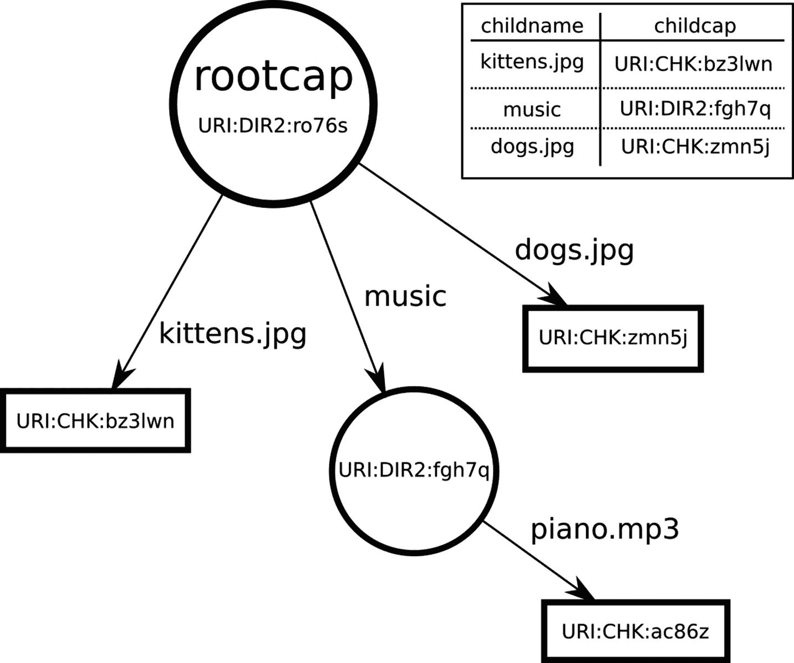

# 六、Tahoe-LAFS：最低权限文件系统

是一个分布式存储系统，于 2006 年开始作为一家名为 AllMyData(早已倒闭)的个人备份公司的强大后端。在关闭之前，该公司开源了代码，现在一个黑客社区改进和维护这个项目。

该系统允许您将数据从您的计算机上传到称为“网格”的服务器网络中，然后再从网格中检索您的数据。除了提供备份(例如，万一您的笔记本电脑硬盘出现故障)，它还提供了与同一网格上的其他用户共享特定文件或目录的灵活方式。这样，它的行为有点像“网络驱动器”(SMB 或 NFS)，或者文件传输协议(FTP 或 HTTP)。

Tahoe 的特色是“独立于提供商的安全性”所有文件在离开您的电脑之前都经过加密和加密哈希处理。存储服务器永远看不到明文(因为加密)，也无法进行未被发现的更改(因为散列)。此外，密文被擦除编码成冗余部分，并上传到多个独立的服务器。这意味着您的数据可以在失去几台服务器的情况下继续存在，从而提高耐用性和可用性。

因此，您可以纯粹根据性能、成本和正常运行时间来选择存储服务器，而不需要依赖它们的安全性。大多数其他网络驱动器完全容易受到服务器的攻击:危害主机提供商的攻击者可以看到或修改您的数据，或者完全删除它。Tahoe 的机密性和完整性完全独立于存储提供商，可用性也得到提高。

## 太浩湖-LAFS 如何运作

一个 Tahoe“网格”由一个或多个介绍器、一些服务器和一些客户机组成。

*   客户端知道如何上传和下载数据。

*   服务器持有加密的共享。

*   介绍器帮助客户机和服务器找到并相互连接。

这三种节点类型使用名为“Foolscap”的特殊协议进行通信，该协议源于 Twisted 的“透视代理”，但增加了安全性和灵活性。

Tahoe 使用“能力字符串”来识别和访问所有文件和目录。这些看起来随机的 base32 数据块包含加密密钥、完整性保护散列和共享位置信息。当它们指代文件时，我们将其缩写为“filecaps ”,对于目录，我们将其缩写为“dircaps”。


图 6-1

太浩湖-LAFS 网格图

(为了可读性，本章中的例子被缩短了，但是 filecaps 通常大约有 100 个字符长。)

它们有时有多种形式:“writecap”赋予知道它的人修改文件的能力，而“readcap”只让他们读取内容。甚至还有一个“验证上限”，它允许持有者验证加密的服务器端共享(如果一些已经丢失，还可以生成新的)，但不能读取或修改明文。当您自己的计算机脱机时，您可以放心地将这些文件交给授权的维修代理来维护您的文件。

Tahoe 最简单的 API 调用是一个命令行`PUT`,它接受明文数据，将其上传到一个全新的不可变文件中，并返回生成的 filecap:

```py
$ tahoe put kittens.jpg
200 OK
URI:CHK:bz3lwnno6stuspjq5a:mwmb5vaecnd3jz3qc:2:3:3545

```

这个 filecap 是世界上检索文件的唯一方法。您可以将它写下来，或者存储在另一个文件中，或者存储在一个 Tahoe 目录中，但是这个字符串对于恢复文件来说既必要又充分。下载如下所示(`tahoe get`命令将下载的数据写入 stdout，因此我们使用"`>` " shell 语法将其重定向到一个文件中):

```py
$ tahoe get URI:CHK:bz3lwnno6stuspjq5a:mwmb5vaecnd3jz3qc:2:3:3545 >downloaded.jpg

```

我们经常(也许是错误地)在许多地方将 filecaps 称为 URIs，包括 filecaps 字符串本身。“CHK”代表“内容散列键”，它描述了我们使用的不可变文件编码的具体种类:其他种类的 cap 有不同的标识符。不可变的文件上限总是 readcaps:一旦文件上传，世界上没有人可以修改它，即使是最初的上传者。

Tahoe 还提供了*可变的*文件，这意味着我们可以在以后更改内容。这有三个 API 调用:`create`生成一个可变槽，`publish`向槽中写入新数据(覆盖以前的内容)，然后`retrieve`返回槽的当前内容。

可变槽有写上限和读上限。给你 writecap，但是任何知道 writecap 的人都可以把它“简化”成 readcap。这允许您与其他人共享 readcap，但为您自己保留 write 权限。

在 Tahoe 中，目录只是包含特殊编码的表的文件，该表将孩子的名字映射到孩子的 filecap 或 dircap。可以把这些目录想象成有向图中的中间节点。



图 6-2

Rootcap、目录和文件的图表

我们可以用`mkdir`命令创建一个。这默认创建一个可变目录(但是如果我们愿意，我们也可以创建完全填充的不可变目录)。Tahoe 有`cp`和`ls`命令来复制文件和列出目录，这些命令知道如何像往常一样处理斜杠分隔的文件路径。

CLI 工具还提供了“别名”，它只是在本地文件(`~/.tahoe/private/aliases`)中存储一个“rootcap”目录，允许其他命令使用看起来很像网络驱动器指示符的前缀来缩写 dircap(例如，Windows `E:`驱动器)。这减少了输入，使命令更容易使用:

```py
$ tahoe mkdir
URI:DIR2:ro76sdlt25ywixu25:lgxvueurtm3
$ tahoe add-alias mydrive URI:DIR2:ro76sdlt25ywixu25:lgxvueurtm3
Alias 'mydrive' added
$ tahoe cp kittens.jpg dogs.jpg mydrive:
Success: files copied
$ tahoe ls URI:DIR2:ro76sdlt25ywixu25:lgxvueurtm3
kittens.jpg
dogs.jpg
$ tahoe mkdir mydrive:music
$ tahoe cp piano.mp3 mydrive:music
$ tahoe ls mydrive:
kittens.jpg
music
dogs.jpg
$ tahoe ls mydrive:music
piano.mp3
$ tahoe cp mydrive:dogs.jpg /tmp/newdogs.jpg
$ ls /tmp
newdogs.jpg

```

命令行工具构建在 HTTP API 之上，我们将在后面探讨。

## 系统结构

客户机节点是一个长期存在的网关守护进程，它接受来自“前端”协议的上传和下载请求。最基本的前端是一个 HTTP 服务器，它监听环回接口(127.0.0.1)。

HTTP `GET`用于检索数据，这涉及多个步骤:

*   解析 filecap 以提取解密密钥和存储索引；

*   确定我们需要每个共享的哪些部分来满足客户端请求，包括共享数据和中间散列树节点；

*   使用存储索引来确定哪些服务器可以共享此文件；

*   向这些服务器发送下载请求；

*   跟踪我们已发送的请求和已完成的请求，以避免重复请求，除非必要；

*   跟踪服务器响应时间，选择速度更快的服务器；

*   核实股份，拒绝腐败的股份；

*   当可用或失去连接时，切换到更快的服务器；

*   将份额重组为密文；

*   解密密文，将明文传递给前端客户端。

这由一个事件循环来管理，该事件循环随时准备接受来自前端管理器的新的`read()`请求，或者来自服务器的响应，或者指示是时候放弃一个服务器并尝试另一个服务器的定时器到期。这个循环将同时处理几十个甚至几百个连接和计时器，其中任何一个上的活动都会导致其他的事情发生。Twisted 的事件循环非常适合这种设计。

在另一个方向，HTTP `PUT`和`POST`动作导致数据被上传，这执行许多相同的步骤，但是向后:

*   客户端节点接受来自前端协议的数据，并将其缓存在临时文件中；

*   对文件进行哈希处理以构建“聚合加密密钥”，该密钥也用于对文件进行重复数据消除；

*   加密密钥被散列以形成存储索引；

*   存储索引标识我们应该尝试使用哪些服务器(服务器列表对于每个存储索引以不同的方式排序，并且该列表提供了优先级排序)；

*   向这些服务器发送上传请求；

*   如果文件上传得更早，服务器会告诉我们他们已经有一个共享，在这种情况下，我们不需要再次存储那个；

*   如果一个服务器拒绝我们的请求(没有足够的磁盘空间)，或者回答速度不够快，请尝试另一个服务器；

*   收集响应，直到每个共享映射到一个服务器；

*   对每一段明文进行加密编码，会占用大量的 CPU(至少相对于网络活动来说是这样的)，所以我们把它推给一个单独的线程来利用多核的优势；

*   编码完成后，将共享上传到之前映射的服务器；

*   当所有服务器确认收到时，构建最终的散列树；

*   从哈希树的根和加密密钥构建 filecap

*   在 HTTP 响应体中返回 filecap。

客户端还实现其他(非 HTTP)前端协议:

*   FTP:通过提供用户名、密码和 rootcaps 的配置文件，Tahoe 客户机节点可以假装成一个 FTP 服务器，为每个用户提供一个单独的虚拟目录；

*   SFTP:像 FTP 一样，但是分层在 SSH 之上；

*   Magic-Folder:一个类似 Dropbox 的双向目录同步工具。

客户对介绍人说废话，以了解服务器。他们也对服务器本身说废话。

太浩-LAFS 存储服务器可以将共享存储在本地磁盘上，也可以将它们发送到远程商品存储服务，如 S3 或 Azure。例如，服务器在前端使用 Foolscap，在后端使用基于 HTTP 的 S3 命令。

在存储服务器上，节点必须接受来自任意数量客户端的连接，每个客户端都将发送重叠的共享上传/下载请求。对于像 S3 这样的远程后端，每个客户端请求都可能引发多个 S3 端 API 调用，每个调用都可能失败或超时(并且需要重试)。

所有节点类型还运行 HTTP 服务来进行状态和管理。这目前使用 Nevow 渲染，但是我们打算切换到 Twisted 的内置 HTTP 模板工具(`twisted.web.template`)。

## 它如何使用 Twisted 的

塔霍-LAFS 大量使用了 Twisted:我们很难想象我们可以用其他方式来写它。

该应用是围绕一个 Twisted 的`MultiService`层次结构构建的，它控制上传者、下载者、引入者客户端等的启动和关闭。这让我们可以在单元测试期间启动单独的服务，而不需要每次都启动整个节点。

最大的服务是`Node`，它代表整个客户机、服务器或介绍者。这是其他所有东西的父级`MultiService`。关闭服务(并等待所有网络活动停止)就像调用`stopService()`并等待延迟启动一样简单。默认情况下，节点监听临时分配的端口，并向引入者宣布它们的位置。所有状态仅限于节点的“基本目录”这使得在单个过程中启动多个客户机/服务器变得很容易，以便一次测试整个网格。这与早期的体系结构形成对比，在早期的体系结构中，每个存储服务器都需要一个单独的 MySQL 数据库，并使用固定的 TCP 端口。在该系统中，如果没有至少 5 台不同的计算机，就不可能进行真实的测试。在 Tahoe 中，集成测试套件将启动一个包含 10 台服务器的网格，所有这些都在一个进程中，执行一些功能，然后在几秒钟内再次关闭所有的功能。每当您运行`tox`来运行测试套件时，这种情况都会发生几十次。

Twisted 强大的集成协议实现套件支持各种前端接口。我们不需要编写 HTTP 客户端，或者服务器，或者 FTP 服务器，或者 SSH/SFTP 服务器:这些都是 Twisted 附带的“电池”。

## 我们遇到的问题

我们对 Twisted 的使用相当顺利。如果我们今天重新开始，我们还是会从 Twisted 开始。我们的遗憾是微不足道的:

*   依赖负载:一些用户(通常是打包者)觉得 Tahoe 依赖于太多的库。多年来，我们试图避免添加依赖项，因为 Python 的打包工具不成熟，但现在`pip`让这变得容易多了；

*   打包/分发:很难从 Python 应用中构建一个单文件的可执行文件，所以目前用户必须了解 Python 特有的工具，如`pip`和`virtualenv`，以便在他们的家庭计算机上安装 Tahoe

*   Python 3: Twisted 现在对 Python 3 有很好的支持，但这需要很多年的努力。在此期间，我们变得自满，代码自由地将机器可读的字节与人类可读的字符串混杂在一起。既然 py3 是首选实现(py2 的 2020 年寿终正寝的最后期限即将到来)，我们正在努力更新我们的代码以在 py3 下工作。

### 虚拟化工具

Twisted 提供了一个名为`twistd`的便利工具，它允许将长时间运行的应用编写为插件，使 Twisted 负责特定于平台的后台化细节(例如从控制 tty 中分离，记录到文件而不是 stdout，以及在打开特权侦听 TCP 端口后可能切换到非 root 用户)。当 Tahoe 开始的时候,“pip”和“virtualenv”都还不存在，所以我们建造了类似的东西。为了将虚拟化与这个定制的依赖安装程序/管理器结合起来，Tahoe 命令行工具包括了`tahoe start`和`tahoe stop`子命令。

如今，我们可能会省略这些子命令，让用户运行`twistd`或`twist`(非守护进程形式)。我们还会寻找根本不需要守护进程的方法。

开始的时候，`twistd`没有那么容易管理，所以 Tahoe 用了”。点击“文件”来控制它。这是我在 Buildbot 中使用的模式的延续，遗憾的是第一个版本使用了”。点击“文件”来记录状态(一种应用的“冻干”副本，下次你想启动它时可以再次解冻)。Tahoe 从未将动态状态放入其中，但是`tahoe create-node`进程会创建一个带有正确初始化代码的`.tap`文件来实例化和启动新节点。然后`tahoe start`是围绕`twistd -y node.tap`的一个简单包装。

不同种类的。`tap`文件用于启动不同类型的节点(客户端、服务器、引入器等)。).这是一个错误的决定。那个。tap 文件只包含几行:一个 import 语句和实例化应用对象的代码。两者最终都限制了我们重新安排代码库或改变其行为的能力:简单地重命名`Client`类会破坏所有现有的部署。我们无意中创建了一个公共 API(包含所有的兼容性问题)，其中的“公共”是早期 Tahoe 安装使用的所有旧的`.tap`文件。

我们通过让`tahoe start`忽略`.tap`文件的内容，只关注它的文件名来解决这个问题。节点的大部分配置已经存储在一个名为`tahoe.cfg`的单独的 INI 风格文件中，所以转换非常容易。当`tahoe start`看到`client.tap`时，它创建一个客户机实例(相对于介绍者/etc。)，用配置文件初始化它，并设置守护进程运行。

## 内部文件节点接口

在内部，Tahoe 定义了`FileNode`对象，可以从现有文件的 filecap 字符串创建，也可以通过第一次上传一些数据从头开始创建。这些提供了一些简单的方法，隐藏了加密、擦除编码、服务器选择和完整性检查的所有细节。下载方法在名为`IReadable`的接口中定义:

```py
class IReadable(Interface):

    def get_size():
        """Return the length (in bytes) of this readable object."""

    def read(consumer, offset=0, size=None):
        """Download a portion (possibly all) of the file's contents, making them available to the given IConsumer. Return a Deferred that fires (with the consumer) when the consumer is unregistered (either because the last byte has been given to it, or because the consumer threw an exception during write(), possibly because it no longer wants to receive data). The portion downloaded will start at 'offset' and contain 'size' bytes (or the remainder of the file if size==None). """

```

Twisted 将`zope.interface`用于支持接口定义的类(即`Interface`实际上是`zope.interface.Interface`)。我们使用这些作为类型检查的一种形式:前端可以断言被读取的对象是`IReadable`的提供者。`FileNode`有多种，但都实现了`IReadable`接口，前端代码只使用那个接口上定义的方法。

`read()`接口不直接返回数据:相反，它接受一个“消费者”,当数据到达时，它可以将数据提供给这个消费者。它使用 Twisted 的生产者/消费者系统(在第 [1 章](01.html)中描述)来传输数据，而没有不必要的缓冲。这使得 Tahoe 能够在不使用千兆字节内存的情况下传送数千兆字节的文件。

类似地，也可以创建对象。这些节点也有方法(在`IDirectoryNode`中定义)来列出它们的子节点，或者跟随子节点链接(通过名称)到其他节点。可变目录包括通过名称添加或替换子目录的方法。

```py
class IDirectoryNode(IFilesystemNode):
    """I represent a filesystem node that is a container, with a name-to-child mapping, holding the tahoe equivalent of a directory. All child names are unicode strings, and all children are some sort of IFilesystemNode (a file, subdirectory, or unknown node).
    """
    def list():
        """I return a Deferred that fires with a dictionary mapping child name (a unicode string) to (node, metadata_dict) tuples, in which 'node' is an IFilesystemNode and 'metadata_dict' is a dictionary of metadata."""
    def get(name):
        """I return a Deferred  that fires with a specific named child node, which is an IFilesystemNode. The child name must be a unicode string. I raise NoSuchChildError if I do not have a child by that name."""

```

请注意，这些方法返回延迟。目录存储在文件中，文件存储在共享中，共享存储在服务器上。我们不知道这些服务器何时会响应我们的下载请求，所以我们使用一个延迟来“等待”数据可用。

每个前端协议都使用这个节点对象图。

## 前端协议集成

为了探索 Tahoe 如何利用 Twisted 的多种协议支持，我们将研究几个“前端协议”这些提供了外部程序和内部`IFileNode` / `IDirectoryNode` / `IReadable`接口之间的桥梁。

所有的协议处理器都使用一个名为`Client`的内部对象，其最重要的方法是`create_node_from_uri`。这需要一个 filecap 或 directorycap(作为一个字符串)，并返回相应的`FileNode`或`DirectoryNode`对象。从这里，调用者可以使用它的方法来读取或修改底层的分布式文件。

## Web 前端

Tahoe-LAFS 客户端守护程序提供了一个本地 HTTP 服务来控制其大部分操作。这包括一个以人为本的浏览文件和文件夹的网络应用(“WUI”:网络用户界面)和一个以机器为本的控制界面(“WAPI”:网络应用编程界面)，我们亲切地称之为“哇”和“哇”

两者都是通过 Twisted 内置的`twisted.web`服务器实现的。“资源”对象的层次结构将请求路由到某个叶子，该叶子实现类似于`render_GET`的方法来处理请求细节并提供响应。默认情况下，它监听端口 3456，但是这可以在`tahoe.cfg`文件中通过提供不同的端点描述符来配置。

Tahoe 实际上使用了“Nevow”项目，该项目在 raw `twisted.web`之上提供了一个层，但这些天 Twisted 的内置功能本身就足够强大，所以我们正在慢慢地从代码库中删除 Nevow。

最简单的 WAPI 调用是获取文件。HTTP 客户端提交一个 filecap，Tahoe 将其转换成一个`FileNode`，下载内容，并在 HTTP 响应中返回数据。该请求看起来像是:

```py
curl -X GET http://127.0.0.1:3456/uri/URI:CHK:bz3lwnno6stus:mwmb5vae...

```

这会产生一个带有“path”数组的`twisted.web.http.Request`,该数组有两个元素:文字字符串“`uri,`”和 filecap。Twisted 的 web 服务器从一个根资源开始，在这个资源上可以附加不同名称的处理程序。我们的`Root`资源用上面描述的`Client`对象实例化，并配置了一个用于`uri`名称的处理程序:

```py
from twisted.web.resource import Resource
class Root(Resource):
    def __init__(self, client):
        ...
        self.putChild("uri", URIHandler(client))

```

所有以`uri/`开始的请求都将被路由到这个`URIHandler`资源。当这些请求有额外的路径组件(例如，我们的 filecap)时，它们将导致调用`getChild`方法，该方法负责找到正确的资源来处理请求。我们将从给定的 filecap/dircap 创建一个 FileNode 或 DirectoryNode，然后将它包装在一个特定于 web 的 handler 对象中，该对象知道如何处理 HTTP 请求:

```py
class URIHandler(Resource):
    def __init__ (self, client):
        self.client = client
    def getChild(self, path, request):
        # 'path' is expected to be a filecap or dircap
        try:
            node = self.client.create_node_from_uri(path)
            return directory.make_handler_for(node,self.client)
        except (TypeError,AssertionError):
            raise WebError("'%s' is not a valid file- or directory- cap" %name)

```

`node`是包装来自 GET 请求的 filecap 的`FileNode`对象。该处理程序来自一个 helper 函数，它检查节点的可用接口并决定创建哪种包装器:

```py
def make_handler_for(node, client, parentnode=None, name=None):
    if parentnode:
       assert IDirectoryNode.providedBy(parentnode)
    if IFileNode.providedBy(node):
       return FileNodeHandler(client, node, parentnode, name)
    if IDirectoryNode.providedBy(node):
       return DirectoryNodeHandler(client, node, parentnode, name)
    return UnknownNodeHandler(client, node, parentnode, name)

```

对于我们的例子，这将返回`FileNodeHandler`。这个处理程序有很多选项，并且`web/filenode.py`中的实际代码看起来非常不同，但是一个简化的形式应该是这样的:

```py
class FileNodeHandler(Resource):
    def __init__ (self, client, node, parentnode=None, name=None):
        self.node = node
        ...
    @inlineCallbacks
    def render_GET(self, request):
        version = yield self.node.get_best_readable_version()
        filesize = version.get_size()
        first, size, contentsize = 0, None, filesize
        ... # these will be modified by a Range header, if present
        request.setHeader("content-length", b"%d" % contentsize)
        yield version.read(request, first, size)

```

Twisted 的原生 web 服务器不允许`Resource`对象返回 Deferreds，但是 Nevow 的允许，这很方便。基本上是这样的:

*   首先，我们向 FileNode 询问它的最佳可读版本。不可变文件不需要这样做(反正只有一个版本)，但是可变文件在网格上可能有多个版本。“最佳”是指最新的。我们得到一个提供了`IReadable`接口的“版本”对象。

*   接下来，我们计算文件的大小。对于不可变文件，大小嵌入在 filecap 中，所以`get_size()`方法让我们可以立即计算出来。对于可变文件，大小是在我们检索版本对象时确定的。

*   我们使用文件的大小和范围头(如果提供的话)来计算要读取多少数据，以及从什么偏移量开始。

*   我们设置 Content-Length 头来告诉 HTTP 客户机预期有多少数据。

*   调用`IReadable`的`read()`方法开始下载。请求对象也是一个 IConsumer，下载代码构建一个 IProducer 来附加到它。这将返回一个延迟，当文件的最后一个字节已传递给使用者时，将触发该延迟。

*   当最后一个延迟触发时，服务器知道它可以关闭 TCP 连接，或者为下一个请求重置它。

我们省略了许多细节，在下面展开。

### 文件类型，内容类型，/name/

Tahoe 的存储模型将文件上限映射到字节串，没有名称、日期或其他元数据。目录包含名字和日期，在指向它们孩子的表条目中，但是一个基本的 filecap 只给你一堆字节。

然而，HTTP 协议为每次下载包含一个`Content-Type`，它允许浏览器决定如何呈现页面(HTML、JPG 或 PNG)，或者在将页面保存到磁盘时记录什么操作系统元数据。此外，大多数浏览器假定 URL 路径的最后一部分是文件名，并且“保存到磁盘”功能将使用它作为默认文件名。

为了处理这种不匹配，Tahoe 的 WAPI 有一个特性，让你下载一个在路径的最后一个元素有任意名称的 filecap。WUI 目录浏览器将这些特殊的 URL 放在目录页面的 HTML 中，因此“将链接另存为..”工作正常。完整的 URL 如下所示:

```py
http://127.0.0.1:3456/named/URI:CHK:bz3lwnno6stus:mwmb5vae../kittens.jpg

```

这看起来很像一个目录和里面的一个孩子。为了避免视觉上的混乱，我们通常会在这样的 URL 中插入一个看起来特别有趣的字符串:

```py
http://127.0.0.1:3456/named/URI:CHK:bz3lwn../@@named=/kittens.jpg

```

这是用一个创建了一个`FileNodeHandler`的`Named`资源实现的，但是它还会记住`self.filename`中 URL 路径的最后一个组件(忽略任何中间组件，比如@@ `named=`字符串)。然后，当我们运行`render_GET`时，我们将这个文件名传递给一个 Twisted 实用程序，该实用程序使用相当于`/etc/mime.types`的代码将文件名后缀映射到一个类型字符串。由此，我们可以设置`Content-Type`和`Content-Encoding`标题。

```py
# from twisted.web import static

ctype, encoding = static.getTypeAndEncoding(
    self.filename,
    static.File.contentTypes,
    static.File.contentEncodings,
    defaultType="text/plain")
request.setHeader("content-type", ctype)
if encoding:
    request.setHeader("content-encoding", encoding)

```

### 保存到磁盘

当你点击一个链接时，浏览器将试图呈现返回的文档:HTML 经过布局，图像被绘制在窗口中，音频文件被播放，等等。如果它不能识别文件类型，它会将文件保存到磁盘。Tahoe 的“WUI”HTML 前端提供了一种强制执行这种保存到磁盘行为的方式:对于任何指向文件的 URL，只需在 URL 后面附加一个`?save=True`查询参数。web 服务器通过添加一个`Content-Disposition`头来处理这个问题，这个头指示浏览器总是保存响应，而不是试图呈现它:

```py
if boolean_of_arg(get_arg(request,"save","False")):
    request.setHeader("content-disposition",
                      'attachment; filename="%s"' % self.filename)

```

### 范围标题

web 前端允许 HTTP 客户端通过提供一个范围头来请求文件的一个子集。当“搓擦”控制用于在影片或音频文件中跳转时，流媒体播放器(如 VLC 或 iTunes)经常使用这种方法。通过使用 Merkle 散列树，Tahoe 的编码方案被特别设计来有效地支持这种随机存取。

Merkle 哈希树首先将数据分割成段，然后对每个段应用加密哈希函数(SHA256)。然后，我们将每对段散列放入第二层(长度是第一层的一半)。重复这个减少过程，直到我们在中间散列节点的二进制树的顶部有单个“根散列”,而段在底部。根散列存储在 filecap 中，我们将其他所有东西(数据段和中间散列)发送到服务器。在检索期间，通过要求服务器提供从该段到根的路径的伴随散列节点，可以对照存储的根来验证任何单个段，而无需下载所有其他段。这使得能够以最少的数据传输快速验证任意数据段。

web 前端通过解析请求的 Range 头、设置响应的 Content-Range 和 Content-Length 头，以及修改我们传递给`read()`方法的`first`和`size`值来处理这个问题。

解析范围头并不简单，因为它可以包含一个(可能重叠的)范围列表，其中可能包含文件的开头或结尾，并且可以用不同的单位(不仅仅是字节)来表示。幸运的是，允许服务器忽略不可解析的范围规范:这样效率不高，但是它们可以返回整个文件，就好像范围头不存在一样。然后，客户端有义务忽略他们不想要的数据部分。

```py
first, size, contentsize = 0,None, filesize
request.setHeader("accept-ranges","bytes")

rangeheader = request.getHeader('range')
if rangeheader:
    ranges = self.parse_range_header(rangeheader)

    # ranges = None means the header didn't parse, so ignore
    # the header as if it didn't exist. If is more than one
    # range, then just return the first for now, until we can
    # generate multipart/byteranges.
    if ranges is not None:
        first, last = ranges[0]

        if first >= filesize:
            raise WebError('First beyond end of file',
                           http.REQUESTED_RANGE_NOT_SATISFIABLE)
        else:
            first = max(0, first)
            last = min(filesize-1, last)

            request.setResponseCode(http.PARTIAL_CONTENT)
            request.setHeader('content-range',"bytes %s-%s/%s" %
                              (str(first), str(last),
                              str(filesize)))
            contentsize = last – first + 1
            size = contentsize

request.setHeader("content-length", b"%d" % contentsize) 

```

### 返回端的错误转换

当出现问题时，Tahoe 的内部 API 会抛出各种异常。例如，如果太多的服务器出现故障，文件可能无法恢复(至少在一些服务器重新联机之前无法恢复)。我们试图用一个运行在 HTTP 处理链末端的异常处理程序将这些异常映射成合理的 HTTP 错误代码。这个处理程序的核心被命名为`humanize_failure()`，并查看`twisted.python.failure.Failure`对象，该对象封装了在延迟处理期间引发的所有异常:

```py
def humanize_failure(f):
    # return text, responsecode
    if f.check(EmptyPathnameComponentError):
        return ("The webapi does not allow empty pathname components, "
                "i.e. a double slash" , http.BAD_REQUEST)
    if f.check(ExistingChildError):
      return ("There was already a child by that name, and you asked me "
              "to not replace it." , http.CONFLICT)
    if f.check(NoSuchChildError):
        quoted_name = quote_output(f.value.args[0], encoding="utf-8")
        return ("No such child: %s" % quoted_name, http.NOT_FOUND)
    if f.check(NotEnoughSharesError):
        t = ("NotEnoughSharesError: This indicates that some "
             "servers were unavailable, or that shares have been "
             "lost to server departure, hard drive failure, or disk "
             "corruption. You should perform a filecheck on "
             "this object to learn more.\n\nThe full error message is:\n"
             "%s" ) % str(f.value)
        return (t, http.GONE)
    ...

```

返回值的前半部分是要放入 HTTP 响应正文的字符串；第二个是 HTTP 错误码本身。

### 呈现 UI 元素:Nevow 模板

Tahoe 的 WUI 提供了一个文件浏览器界面:目录面板、文件列表、上传/下载选择器、删除按钮等。这些由 HTML 组成，在服务器端由 Nevow 模板呈现。

`web/`目录包含每个页面的 XHTML 文件，占位符由`DirectoryNodeHandler`类的变量填充。每个占位符都是一个命名空间 XML 元素，用来命名一个“槽”目录列表模板如下所示:

```py
<table class="tahoe-directory"n:render="sequence"n:data="children" >
  <tr n:pattern="header">
    <th>Type</th>
    <th>Filename</th>
    <th>Size</th>
  </tr>
  <tr n:pattern="item"n:render="row" >
    <td><n:slot name="type"/></td>
    <td><n:slot name="filename"/></td>
    <td align="right"><n:slot name="size"/></td>
  </tr>

```

在`directory.py`中，填充该表单的代码循环遍历正在呈现的目录的所有子目录，检查其类型，并使用`ctx`“context”对象按名称填充每个槽。对于文件，`T.a` Nevow 标签产生一个超链接，其中`href=`属性指向一个使用前面描述的`/named/`前缀的下载 URL:

```py
...
elif IImmutableFileNode.providedBy(target):
    dlurl = "%s/named/%s/@@named=/%s"%(root, quoted_uri, nameurl)
    ctx.fillSlots("filename", T.a(href=dlurl, rel="noreferrer")[name])
    ctx.fillSlots("type","FILE")
    ctx.fillSlots("size", target.get_size())

```

Nevow 还提供了构建 HTML 输入表单的工具。这些用于构建上传文件选择器表单和“制作目录”名称输入元素。

## FTP 前端

前端协议允许其他应用以某种与其现有数据模型相匹配的形式访问这个内部文件图。例如，FTP 前端将每个“帐户”(用户名/密码对)分配给一个根目录。当 FTP 客户端连接到该帐户时，他们会看到一个文件系统，该文件系统从该目录节点开始，并且只向下扩展(到子文件和子目录中)。在一个普通的 FTP 服务器中，所有的帐户都看到相同的文件系统，但是有不同的权限(Alice 不能读取 Bob 的文件)，以及不同的开始目录(Alice 在`/home/alice`开始，Bob 在`/home/bob`开始)。在 Tahoe FTP 服务器中，Alice 和 Bob 将拥有完全不同的文件系统视图，这些视图可能根本不会重叠(除非他们已经安排共享他们空间的某个部分)。

Tahoe 的 FTP 前端建立在 Twisted 的 FTP 服务器上(`twisted.protocols.ftp`)。FTP 服务器使用 Twisted 的“Cred”框架进行帐户管理(包括“门户”、“领域”和“头像”)。因此，服务器由几个组件组成:

*   端点:这定义了服务器将监听哪个 TCP 端口，以及使用哪些网络接口之类的选项(例如，服务器可以被限制为只监听 127.0.0.1，即环回接口)。

*   `FTPFactory (twisted.protocols.ftp.FTPFactory`):这提供了整个 FTP 服务器。它是一个“协议工厂”，所以每次新客户端连接时都会调用它，它负责构建管理特定连接的`Protocol`实例。当您告诉端点开始监听时，您给了它一个工厂对象。

*   Checker:这是一个实现`ICredentialsChecker`并处理认证的对象，通过检查一些凭证并(如果成功)返回一个“化身 ID”在 FTP 协议中，凭证是用户提供的用户名和密码。在 SFTP，它们包括 SSH 公钥。“头像 ID”只是一个用户名。Tahoe FTP 前端可以配置为使用一个`AccountFileChecker`(在 auth.py 中)，它将用户名/密码/rootcap 映射存储在一个本地文件中。它还可以使用一个`AccountURLChecker`，查询一个 HTTP 服务器(它发布用户名和密码，并在响应中获取 rootcap)。`AccountURLChecker`用于 AllMyData 的集中账户管理。

*   Avatar:这是处理特定用户体验的服务器端对象。它还特定于一个服务类型，因此它必须实现一些特定的`Interface`，在本例中是一个名为`IFTPShell`的 Twisted 接口(它有像`makeDirectory`、`stat`、`list`和`openForReading`这样的方法)。

*   Realm:这是任何实现 Twisted 的`IRealm`接口的对象，负责把一个头像 ID 变成头像。Realm API 还处理多个接口:需要特定类型访问的客户端可以请求特定的`Interface`，Realm 可能会根据他们的请求返回不同的虚拟角色。在 Tahoe FTP 前端，realm 是一个名为`Dispatcher`的类，它知道如何从帐户信息创建一个根目录节点，并将其包装在一个处理程序中。

*   `Portal` `(twisted.cred.portal.Portal`):这是一个管理跳棋和领域的 Twisted 对象。在构建时，`FTPFactory`配置有一个`Portal`实例，所有涉及授权的事情都委托给门户。

*   `Handler` ( `allmydata.frontends.ftpd.Handler`):这是一个 Tahoe 对象，实现了 Twisted 的`IFTPShell`，并将 FTP 概念翻译成 Tahoe 概念。

Tahoe FTP 服务器代码执行以下操作:

*   创建一个挂在顶层节点 multiservice 上的`MultiService`；

*   挂一个`strports.service`下来，监听 FTP 服务器端口；

*   用`FTPFactory;`配置监听器

*   用`Portal;`配置工厂

*   创建一个`Dispatcher`作为门户的“领域”；

*   向门户添加一个`AccountFileChecker`和/或一个 Acc `ountURLChecker`。

当 FTP 客户端连接时，用户名和密码被提交给`AccountFileChecker`，它之前已经将帐户文件解析到内存中。帐户查找非常简单:

```py
class FTPAvatarID:
    def __init__ (self, username, rootcap):
        self.username = username
        self.rootcap = rootcap
@implementer(checkers.ICredentialsChecker)
class AccountFileChecker(object):
    def requestAvatarId(self, creds):
        if credentials.IUsernamePassword.providedBy(creds):
            return self._checkPassword(creds)
        ...
    def _checkPassword(self, creds):
        try:
            correct = self.passwords[creds.username]
        except KeyError:
            return defer.fail(error.UnauthorizedLogin())

        d = defer.maybeDeferred(creds.checkPassword, correct)
        d.addCallback(self._cbPasswordMatch, str(creds.username))
        return d

    def _cbPasswordMatch(self, matched, username):
        if matched:
            return self._avatarId(username)
        raise error.UnauthorizedLogin

    def _avatarId(self, username):
        return FTPAvatarID(username,self.rootcaps[username])

```

如果用户名不在列表中，或者如果密码不匹配，`requestAvatarId`将返回一个延迟的 errbacks 和`UnauthorizedLogin`，FTPFactory 将返回适当的 FTP 错误代码。如果两者都是好的，那么它返回一个`FTPAvatarID`对象，该对象封装了用户名和账户的 rootcap URI(只是一个字符串)。

当这成功时，门户要求其领域(即，我们的 Dispatcher 对象)将化身 ID 转换成处理程序。我们的领域也很简单:

```py
@implementer(portal.IRealm)
class Dispatcher(object):
    def __init__ (self, client):
        self.client = client

    def requestAvatar(self, avatarID, mind, interface):
        assert interface == ftp.IFTPShell
        rootnode = self.client.create_node_from_uri(avatarID.rootcap)
        convergence = self.client.convergence
        s = Handler(self.client, rootnode, avatarID.username, convergence)
        def logout(): pass
        return (interface, s,None)

```

首先，我们断言我们被请求的是一个`IFTPShell`，而不是一些其他的接口(我们不知道如何处理)。然后，我们使用 Tahoe 文件图 API 将 rootcap URI 转换成一个目录节点。“融合秘密”不在本章讨论范围内，但它的存在是为了提供安全的重复数据删除，提供给处理程序是为了让我们扩展接口，为每个帐户使用不同的融合秘密。

然后，我们围绕客户机(提供创建全新 filenodes 的方法)和 rootnode(提供对用户“主目录”及其下所有内容的访问)构建一个处理程序，并将其返回给门户。这足够连接 FTP 服务器了。

稍后，当客户端执行一个“`ls`”命令时，我们的处理程序的`list()`方法将被调用。我们的实现负责将列出目录的 FTP 概念(它获得相对于根目录的路径名组件的列表)转换为 Tahoe 的概念(它从根目录节点到其他目录节点进行逐步遍历)。

```py
def list(self, path, keys=()):
    d = self._get_node_and_metadata_for_path(path)
    def _list((node, metadata)):
        if IDirectoryNode.providedBy(node):
            return node.list()
        return { path[-1]: (node, metadata) }
    d.addCallback(_list)
    def _render(children):
        results = []
        for (name, childnode) in children.iteritems():
            results.append( (name.encode("utf-8"),
                             self._populate_row(keys, childnode) ) )
        return results
    d.addCallback(_render)
    d.addErrback(self._convert_error)
    return d

```

我们从一个常见的“从根开始跟踪路径”助手方法开始，该方法返回一个延迟的，最终用路径命名的文件或目录的节点和元数据触发(如果路径是`foo/bar`，那么我们将向我们的根目录节点请求它的`foo`子节点，期望那个子节点是一个目录，然后向那个子目录请求它的`bar`子节点)。如果路径指向一个目录，我们使用 Tahoe IDirectoryNode 的`node.list()`方法来获取它的子节点:这将返回一个字典，该字典将子名称映射到(子节点，元数据)元组。如果路径指向一个文件，我们假设它指向一个只有一个文件的目录。

然后我们需要把这个孩子的字典变成 FTP 服务器可以接受的东西。在 FTP 协议中，`LIST`命令可以要求不同的属性:有时客户端需要所有者/组名，有时需要权限，有时它只关心子名称列表。Twisted 的`IFTPShell`接口通过给`list()`方法一系列“键”(字符串)来表示它想要的值。我们的`_populate_row()`方法将一个子元素+元数据对转换成正确的值列表。

```py
def _populate_row(self, keys, (childnode, metadata)):
    values = []
    isdir = bool(IDirectoryNode.providedBy(childnode))
    for key in keys:
        if key == "size":
            if isdir:
                value = 0
            else:
                value = childnode.get_size() or 0
        elif key == "directory":
            value = isdir
        elif key == "permissions":
            value = IntishPermissions(0600)
        elif key == "hardlinks":
            value = 1
        elif key == "modified":
            if "linkmotime" in metadata.get("tahoe", {}):
                value = metadata["tahoe"]["linkmotime"]
            else:
                value = metadata.get("mtime",0)
        elif key == "owner":
            value = self.username
        elif key == "group":
            value = self.username
        else:
            value = "??"
        values.append(value)
    return values

```

对于 Twisted 想要的每一个键，我们都将其转换成可以从 Tahoe 的`IFileNode`或`IDirectoryNode`接口获得的东西。其中大多数是在元数据中的简单查找，或者通过调用节点对象上的方法来获得。一个不寻常的案例是`permissions`:详见下文。

最后一步是附加`_convert_error`作为 errback 处理程序。这将一些特定于 Tahoe 的错误转换为最接近的 FTP 等价错误，这比客户端在没有转换的情况下会得到的“内部服务器错误”更有用。

```py
def _convert_error(self, f):
    if f.check(NoSuchChildError):
        childname = f.value.args[0].encode("utf-8")
        msg = "'%s' doesn't exist" % childname
        raise ftp.FileNotFoundError(msg)
    if f.check(ExistingChildError):
        msg = f.value.args[0].encode("utf-8")
        raise ftp.FileExistsError(msg)
    return f

```

## SFTP 前端

SFTP 是建立在 SSH 安全外壳加密层上的文件传输协议。它向远程客户端公开了一个非常类似 POSIX 的 API:打开、查找、读取和写入，都在同一个 filehandle 上进行。另一方面，FTP 只提供单个文件的全有或全无传输。FTP 更适合 Tahoe 的文件模型，但 SFTP 在与远程服务器通信时更安全。

使用`Cred`的好处是相同的认证机制可以被其他协议重用。尽管 FTP 和 SFTP 有所不同，但它们使用相同的基本访问模型:客户端通过一些凭证来标识，这提供了对特定主目录的访问。在 Tahoe，FTP 和 SFTP 都使用上面相同的`FTPAvatarID`和`AccountFileChecker`类。`AccountFileChecker`定义了`credentialInterfaces`，以涵盖所有可能出现的认证类型:`IUsernamePassword`、`IUsernameHashedPassword`和`ISSHPrivateKey`(这是特定于 SFTP 的，允许用户通过他们的 SSH 公钥而不是密码来识别)。

它们只是在领域(我们的`Dispatcher`类)上有所不同，后者为两种协议返回了不同种类的处理程序。

## 向后不兼容的 Twisted API

Tahoe 没有访问控制列表(ACL)、用户名或读/写/执行权限位的概念:它遵循“如果可以引用一个对象，就可以使用它”的对象能力原则。filecap 是不可访问的，因此引用文件的唯一方法是知道 file cap，它只能来自最初上传文件的人，或者来自从上传者那里了解到它的其他人。

大多数文件存储在目录中，因此访问控制是通过目录遍历来管理的，这是安全的，因为 Tahoe 目录没有“父”链接。你可以通过给别人一个链接来和别人分享你自己的一个目录:他们不能用这个来达到你给他们的那个目录之上的任何东西。

因此，FTP 服务器总是为“权限”字段返回“0600”，这意味着“仅由当前用户读写”这个值主要是装饰性的:FTP 客户端只使用它来填充长格式(`ls -l`)目录列表的“mode”列。我们在这里可以更准确，为不可变对象返回“0400 ”,但是我们并没有真的关心到做出改变。

然而，当 Twisted 的一个 API 发生意外变化时，即使是静态值也会引起问题。在早期，Twisted 使用整数来表示文件模式/权限(就像 Unix 内核和大多数 C 程序一样)。最终人们意识到这是非常以 unix 为中心的，所以在 Twisted-11.1.0 中，创建了一个漂亮、干净的`filepath.Permissions`类来保存这类信息作为布尔集合。

但是 FTP 服务器直到很久以后才更新使用它。在 Twisted-14.0.2 之前,`list()`的“权限”值应该返回一个整数。从 Twisted-15.0.0 开始，它应该返回一个`Permissions`实例。此外，它*只*接受了一个`Permissions`实例:返回一个整数会导致异常。

实际上，`IFTPShell`接口在 14.0.2 和 15.0.0 之间突然发生了变化，这是当我们开始收到关于 FTP `ls`命令失败的错误报告时发现的(我们没有对这个前端进行端到端的测试，我们的个人手动测试仍然使用 Twisted-14.0.2，所以我们自己没有注意到这个问题)。

Twisted 通常会在做出不兼容的更改之前对几个版本的 API 进行出色的改进，但这次却没有成功，这可能是因为最常见的`IFTPShell`实现是 Twisted 的内置`FTPShell`类，该类同时被更新。所以，另一种描述问题的方式是`IFTPShell`被修改了，没有折旧期，好像是私有的内部 API，但实际上是公共的。

解决这个问题最简单的方法是让 Tahoe 的`setup.py`需要`Twisted >= 15.0.0`，并修改代码返回一个`Permissions`对象。但是对于那些在 Linux 发行版上构建 Tahoe 的人来说，这将会使生活变得更加困难，因为 Linux 发行版包含了一个已经过时了几年的 Twisted 版本。(Debian 8.0“Jessie”是 2015 年和 Twisted-14.0.2 一起发布的，直到 2017 年才被取代。)当时，Tahoe 试图兼容各种 Twisted 的版本。让用户升级他们的系统只是为了满足 Tahoe 对现代时尚的热情，这让我们感觉很糟糕。

因此，为了让 Tahoe 既能处理新旧 Twisteds，我们需要在必要时返回类似整数的行为，但也可以类似于`Permissions`的行为。当我们检查 Twisted-14.0.2 使用该值的方式时，我们发现它总是在格式化过程中对该值进行按位 AND 运算:

```py
# twisted-14.0.2: twisted/protocols/ftp.py line 428

def formatMode(mode):
    return ''.join([mode&(256>>n) and 'rwx'[n % 3] or '-' for n in range(9)])

```

这让我们可以构建一个 helper 类，它从 Permissions 继承而来，但是如果旧的 Twisted 使用了二进制文件和方法，那么它会重写二进制文件和方法以返回一个整数:

```py
# filepath.Permissions was added in Twisted-11.1.0, which we require.

# Twisted <15.0.0 expected an int, and only does '&' on it. Twisted

# >=15.0.0 expects a filepath.Permissions. This satisfies both.

class IntishPermissions(filepath.Permissions):
    def __init__ (self, statModeInt):
        self._tahoe_statModeInt = statModeInt
        filepath.Permissions.__init__(self, statModeInt)
    def __and__ (self, other):
        return self._tahoe_statModeInt&other

```

如今，情况有所不同。我们不再建议用户将 Tahoe(或任何 Python 应用)安装到像`/usr/local/bin`这样的系统级位置，也不建议针对系统提供的 Python 库运行 Tahoe。相反，从源代码构建的用户应该将 Tahoe 安装到一个新的 virtualenv 中，在这里可以很容易地安装所有依赖项的最新版本，并且它们可以安全地与系统 python 隔离。

`pipsi`工具使这变得非常容易:`pipsi install tahoe-lafs`将创建一个 Tahoe 特定的 virtualenv，将 Tahoe 及其所有依赖项安装到其中，然后将`tahoe`可执行文件符号链接到`~/.local/bin/tahoe`中，它可能在您的 PATH 中。`pipsi`是现在推荐的从源码树安装 Tahoe 的方法。

系统范围的安装应该通过操作系统软件包管理器来完成。例如，`apt install tahoe-lafs`将在现代 Debian 和 Ubuntu 版本上获得一个工作的`/usr/bin/tahoe`，他们将使用来自`/usr/lib/python2.7/dist-packages`的全系统依赖(如 Twisted)。Debian 开发人员(和其他打包人员)负责确保系统范围的库与所有打包的应用兼容:Tahoe、Magic-Wormhole、Buildbot、Mercurial、Trac 等。当 Tahoe 摆脱对 Twisted 的依赖时，包装商必须解决这个问题。如果系统升级像 Twisted 这样的库，并且它包含意外的不兼容性，那么升级可以被恢复，直到 Tahoe 可以被修补来解决这个问题。

## 摘要

太浩湖-LAFS 是一个大型项目，始于 2006 年，当时 Twisted 还不是很老。它包含不再存在的错误的解决方法，以及已经被新的 Twisted 特性取代的技术。有时，代码似乎更好地反映了开发人员的历史恐惧和个人特质，而不是作为一个很好的教学示例。

但它也嵌入了多年来“愤怒地”(不是随便地)与 Twisted 的代码库一起工作的经验。尽管 Tahoe-LAFS 可能不是一个家喻户晓的名字，但它的核心思想已经影响并融入了许多其他分散存储系统(用 Go、Node.js、Rust 等编写)。

Twisted 的中央事件循环和大量现成的协议实现对我们的特性集至关重要。如果您真的不喜欢事件驱动的系统，您可以尝试用线程和锁来实现类似的东西(在客户端，您需要一个单独的线程来写入每个服务器，第二个线程用于从每个服务器接收，第三个线程用于每个前端请求，所有这些都必须小心地使用锁来防止并发访问)。这种方法安全工作的可能性很低。

Python 标准库包括一些很好的协议实现，但它们几乎都是以模块化的方式编写的，将它们限制为一次只能做一件事的程序。希望随着 Python 3 和`asyncio`的发展势头，这种情况会有所改变。同时，Twisted 是这样一个项目的最佳工具。

## 参考

太浩-LAFS 首页: [`https://tahoe-lafs.org`](https://tahoe-lafs.org)

*   tahoe-LAF github page:[`https://github.com/tahoe-lafs/tahoe-lafs`](https://github.com/tahoe-lafs/tahoe-lafs)

*   涅沃: [`https://github.com/twisted/nevow`](https://github.com/twisted/nevow)

*   [`https://foolscap.lothar.com/`](https://foolscap.lothar.com/)

*   点数： [`https://github.com/mitsuhiko/pipsi/`](https://github.com/mitsuhiko/pipsi/)