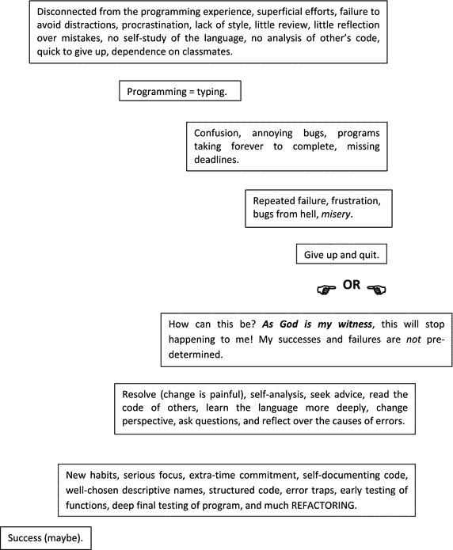

# 20.问题解决

*   在路上的瘸子跑得比迷路的雨燕还快。—弗朗西斯·培根(科学哲学家)，《新有机论》(1620)，第 61 节。
*   半夜写代码可能很有趣，但是在作业到期的那天半夜写代码就不好玩了。—一名大四学生正在上他的第四节编程课(2011 年 12 月)。
*   这么多短篇之所以平淡无奇，另一个原因是有足够写作经验的学术作家太少了。一个好的作家，就像一个好的钢琴家，需要日常练习和对艺术本身的热爱。为了保持练习，他必须每周至少写三到五千字。——g . b .哈里森《英语专业》(双日，1962)，第 111 页。 [<sup>1</sup>](#Fn1)

当你不知道该做什么的时候你会做什么？当然，你可以上网查查，复习一下书，和别人聊聊天——如果你能让他们听进去的话。在那之后，当没有新的想法出现时，然后呢？看起来似乎没什么可做的。但这是不正确的。

首先，开始编造例子:寻找模式、观察和关系。(“极端案例特别有教育意义。”—Polya)当你注意到关系时，你可以从关系的角度来思考。这叫深度思考。如果你能在关系中找到关系，那么你就能做更深层次的思考。第二，工作相关，但是比较容易的问题。这样你就训练自己去解决原来的问题。

我已经列出了要采取的两个行动。还有第三个行动比前两个更重要:带着尝试解决挑战性问题的历史来解决问题。这是解决所有难题的关键，也是为什么练习解决问题很重要。我说重要了吗？“至关重要”是更好的词。

那么一个人如何有效地学习或练习呢？第一步是模仿和记忆。第二步是尝试自己解决许多具有挑战性的问题。如果经过相当大的努力，你还是不能解决问题，那就寻求帮助。但是你不能忽略斗争。否则，技能和事实记忆都会受到阻碍。已故数学家乔治·波利亚试图将这一建议浓缩成以下轶事:

*   房东太太急忙跑到后院，把捕鼠器放在地上(这是一个老式的捕鼠器，一个有活板门的笼子)，并喊她的女儿去把猫拿来。陷阱里的老鼠似乎明白这些程序的要点；他在笼子里疯狂地奔跑，猛烈地扑向栅栏，时而在这边，时而在那边，最后一刻他成功地挤过栅栏，消失在邻居的地里。在捕鼠器的栅栏之间，在那一边一定有一个稍微宽一点的开口。女房东看起来很失望，迟到的猫也是。我从一开始就同情老鼠；所以我发现很难对房东太太或猫说些礼貌的话；但是我默默的恭喜了老鼠。他解决了一个大问题，并且树立了一个好榜样。
*   那才是解决问题的方法。我们必须一次又一次地尝试，直到最终我们认识到一切所依赖的各种开口之间的细微差别。我们必须改变我们的试验，以便我们可以探索问题的所有方面。事实上，我们无法预先知道哪边是我们可以挤过的唯一可行的开口。
*   老鼠和人的根本方法是一样的；尝试，再尝试，改变尝试，这样我们就不会错过一些有利的可能性。
*   ——乔治·波利亚,《数学发现》,合并版(威利出版社，1981 年),第 75-76 页。

学习的第三步是反思结果和经历。每当你解决一个棘手的问题时，你都需要变得富有哲理:你应该注意到什么，以便更快找到解决方案？解决方案可以简化吗？该解决方案是否提供了解决其他问题的关键？

一种奇特的自我反省方法叫做“五个为什么法” [<sup>3</sup>](#Fn3) 举例:

1.  为什么会这样？(我忽略了一个特例。)
2.  为什么我忽略了这个特例？(我从来没想过。)
3.  为什么我没有想到？(我的思考很肤浅。)
4.  为什么我的想法很肤浅？(我工作太快了。)
5.  为什么我工作得太快了？(我想结束。)

第四步，也是最后一步，与聪明人交往，让他们谈生意(或者读他们写的书)。

斯坦福计算机科学教授 Donald Knuth 对编程中的常见错误做了一个有趣的观察。

*   在《计算机编程的艺术》第一卷中，我写道:“另一个好的调试实践是记录下所犯的每一个错误。它将帮助你学会如何减少未来的错误。”但是如果你问这样的日志[T<sub>E</sub>X 中的 916 个错误]是否帮助我学会了如何减少未来的错误，我的答案是否定的。我继续犯同样的错误。——Donald e . Knuth，《识字编程》，CSLI 讲义 27(语言和信息研究中心，1992 年)，第 286 页。

我想 Knuth 说的是我们都会犯的小问题，我们都会很快解决。这种错误比妨碍编程更令人尴尬。当然，一些编程人员在编程多年后并没有变得更好，因为他们没有分析自己的错误，忘记了太多的经验。他们与工作脱节。其他人则相反，随着他们解决每一个难题而变得更好。

以下是我与学生们分享的常见错误汇编。这个列表减少了他们的错误吗？很少，因为这样的清单必须从个人经验中构建，以便在需要时回忆起来。同样，每个学生必须自学。老师只是选择问题，然后在学生准备好欣赏它们时提供见解。

1.  您互换了参数—例如，`(a,b)`被作为`(b,a)`传递；坐标`x`和`y`互换；矩阵行和列下标互换。
2.  您有一个内存位置错误。某些内容被移动、覆盖，或者您的引用被意外更改。
3.  你有一个混淆错误——即两个变量访问同一个内存地址(没有生成`deepcopy`)。您有两个同名的函数。您使用了保留字作为变量名或文件名。
4.  您正在查看一个文件(比如说，`lab99.py`)，但是正在运行另一个文件(`lab99`)。
5.  你一开始就没有调用这个函数。
6.  外部 for 循环索引用作内部循环索引。[这在 Python 中不会出现。]
7.  您删除了函数名中的括号对。
8.  你用`==`代替了`=`，反之亦然。
9.  你把`<`写成了`<=`，反之亦然。这个错误已经花费了我几个小时的时间。]
10.  你对优先顺序一无所知——例如，`a and b != True`的意思是`a and (b != True)`，而不是`(a and b) != True.`
11.  您未能初始化变量(在 Python 中不可能)。
12.  您的数字太大(溢出)。
13.  你拼错了两个相似的单词——例如，变量名`differenceInYears`、`differenceinYears`和`differenceInYears`都是不同的。
14.  舍入累计产生了错误的数字。
15.  for 循环头中的列表/数组在 for 循环体中被更改。
16.  你有一个双簧管(一个错误)。
17.  您有缩进或范围错误。
18.  您混淆了列表值(`x[n]`)及其位置(`n`)。
19.  你假设`A += B`总是像`A = A + B`一样运行。不是用列表。
20.  您误解了内置函数的工作方式，例如，函数可能就地操作数据，而不会像您所想的那样返回数据。
21.  你比较了绝对平等的浮点数。
22.  你从未掌握你的语言。内置函数或巧妙的语法安排会简化复杂的代码。
23.  你把字母'`O`'写成零(`0`)，反之亦然。
24.  您期望函数头中有`[]`、`""`或`None`，但却得到了其中一个。
25.  你的陈述看起来是独立的，但却是有联系的。你可能有
    1.  一个悬空的`else`(一个`else`连接到错误的`if`)，
    2.  背后捅刀子的 else(两个或更多的`if`后面跟着一个`else`)，以及
    3.  在`if`比较之间改变测试数据的出血`if`。 

* * *

*   战争故事 1。在我布置的一个图形程序中，一个学生从讲义上复制了我的代码，然后告诉我她一直得到错误“未赋值的全局变量…”。全局变量被导入并在所有其他学生的计算机上运行。经过五分钟的代码检查，并与我的进行比较，我一无所获。怎么办？你会怎么做？我从来没有发现问题是什么，但我能够消除错误。我只是复制了我的工作代码，删除了我想让学生写的函数，然后通过电子邮件发给了她。成功了。我后来让她把有缺陷的代码发给我，但她已经覆盖了它。太糟糕了，因为这些错误教会了我们一些东西。
*   战争故事 2。我曾经让一个学生构建了一个无法编译的巨型 Python 字典。编译错误通常很容易消除，但这一个却不容易。这本由许多行组成的词典被计算机看作是一行。因此，编译器无法给出错误的实际物理行号。在对字典进行了多次分解之后，我发现了这个错误。在字典的第二行，学生写了字母“o”代表零(0)。
*   战争故事 3。我的同事 Torbert 博士曾经花了半天时间(对，半天！)试着调试一个学生的代码。这名学生使用了合理的标识符`getx`和`gety`，她和托伯特博士都不知道，这是继承的`JPanel`类中的保留字。你可能会认为最初的设计者会使用更模糊的标识符，甚至是像`JPgetX`或`GETX`这样的东西。
*   战争故事 4。我曾经写过一个解决数独难题的程序。我创建了一个单元格对象矩阵来表示数独板。每个单元格对象都包含其自身矩阵的地址:包含所有单元格的矩阵。这是用 Python 类变量完成的。(见下文。)因此，引用另一个单元格的代码可以检测到一个单元格中值的变化。

    ```py
    class cell(object):
        matrix = None <-- class variable
    #--constructor-------------------------
        def __init__(self, val, r, c, matrix):
           if val != 0:
              self.value = {val,}
           else:
              self.value = {1,2,3,4,5,6,}
           self.row    = r
           self.col    = c
           self.block  = self.blockNumber(r, c)
           cell.matrix = matrix <–- accessed with the class name.

    ```

*   对于简单的数独游戏，这个程序运行得很好。这让我对类变量和一般设计充满信心。但是程序在递归下失败了。经过大约一周的调试，我终于意识到在回溯中矩阵没有被重置，即使重置矩阵的代码正在执行。这怎么可能呢？
*   最终，我复制了代码，扔掉了所有看起来与 bug 无关的代码行。这给了我一个更简单的结构来检查 bug。令我惊讶的是，bug 并没有出现。我决定以后再考虑这个问题，然后起身去吃午饭。当我走过大厅时，我突然想到了完整的答案。显然，我的大脑一直在思考这个问题，而我却没有意识到。
*   复制矩阵时出现问题。当数据结构被复制时，副本驻留在新的地址，但是每个单元包含原始矩阵的地址。记住，我使用了一个类变量，而不是实例变量来保存矩阵的初始地址。这些单元地址需要改变，或者复制矩阵的值需要反馈到原始矩阵中以重置它。我和我的学生讨论了这个错误，并以下面的评论作为结论。
*   如果没有 bug 影响，递归错误可能需要几个小时才能修复，直到深入递归。如果我们在这个问题上投入足够的时间，我们通常可以解决它。这个过程会让我们失去很多情感。有些人能够处理无休止的挫折，不让它从编程的更愉快和更有创造性的方面带走。然而，有许多聪明人对这种精神斗争没有耐心。对他们来说，编程似乎很痛苦。我能给你的唯一一般性建议是，问问你发现的每一个大错误是如何避免的，然后根据你的分析改变你写代码的方式。
*   给了你这条建议后，你可能会问我如何避免花一周时间去寻找我之前讨论过的矩阵 bug。我会不会设置了一个错误陷阱？我能早点测试吗？事实上，我不知道我能做些什么来避免这个错误，或者更早地暴露它。我以前从未使用过递归中的类变量。

学生每写一行代码，通过强化坏习惯，学生就变成了一个糟糕的程序员，这种想法不无道理。一个好老师不能在这里帮忙吗？除了提供有价值的任务和发表许多有见地的评论，有些是关于生活的。认为我们可以拯救他人是一种虚荣——他们只能拯救自己。 [<sup>4</sup>](#Fn4)

所以，再一次，我们如何成为优秀的编程员，尤其是在错误无法消除的情况下？答案是学习我们的计算机语言的细节，解决许多具有挑战性的问题，提供洞察力，不要轻易放弃这些问题，练习重构，反思解决方案和错误，并与其他优秀的程序员交流。

现在是一个惊喜。如果有任何建议可以帮助你提高编程技能，那么你必须自己去发现，或者至少你必须找出编程问题，这样你就可以通过向他人提出明确的问题来寻求建议。对于初学者来说，这本书一定只是背景噪音。我的观点不可能是你的。即使告诉你我的观点也不足以让它有意义。这本书的目的是告诉你，职业程序员(以及棋手和钢琴家)认为某些习惯提高了他们的生产力，减少了他们的挫败感。我的话只能是在编程中找到自己个人视角的一个弱指导。祝你好运。

## 程序员的进化



Footnotes [1](#Fn1_source)

G.哈里森简短而精彩的著作《英语职业》(1967)试图回答他在大学英语教学中应该达到的目标。我认为他的一些观点适用于任何学科或工艺的教学。

  [2](#Fn2_source)

1.“我们应该如何着手努力改善？我的猜测是，国际象棋技能来自于国际象棋比赛和国际象棋训练，其中“训练”意味着为自己解决问题。”—(通用)乔纳森·罗森，《斑马的国际象棋》(Gambit，2005)，第 28-29 页。

2.日本谚语:“野心是纪律的源泉。”——托马斯·p·罗兰，《日本的高中》(加州大学，1983 年)，第 266 页。

3."受教最少的学生被教得最好."——R.L .摩尔，见于约翰·帕克，r . l .摩尔(MAA，2005 年)，页 263。【著名的摩尔教学法就是让解题几乎贯穿整个课程体验。很少讲课，没有测试，没有小测验，当然也没有提示，只是让每个学生自己解决问题。如果一个人的目标是提高学生解决问题的能力，我认为摩尔基本上是对的。那是学习数学的最好方法。"我确信，摩尔方法是教授任何事物的正确方法."——保罗·哈尔莫斯，我想成为一名数学家——斯普林格出版社，1985 年版，第 258 页。]

  [3](#Fn3_source)

这个想法来自 Kent Beck 的极限编程讲解，第 2 <sup>和</sup>版。(艾迪森·韦斯利，2005)，第 65 页。

  [4](#Fn4_source)

转述自法国电影《玩乐女王》(2009)。