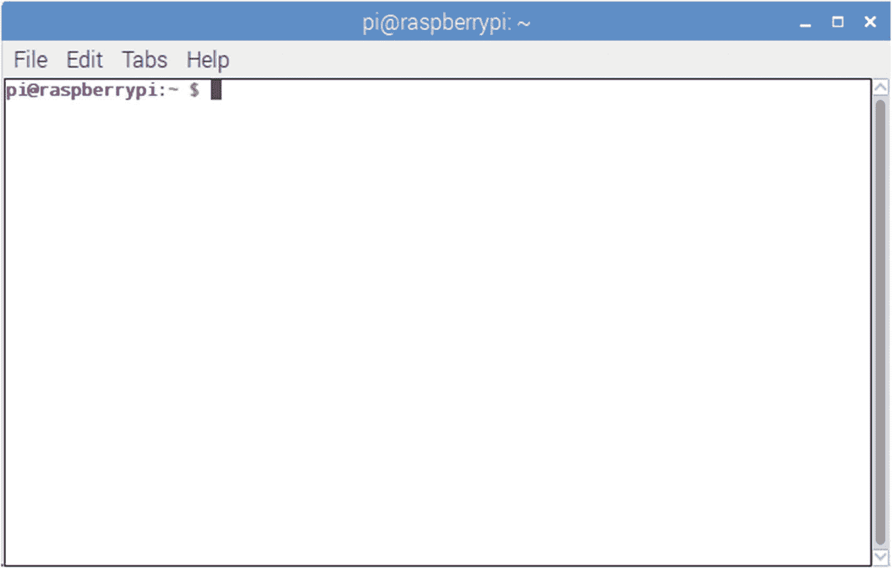
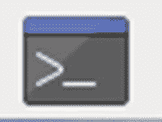
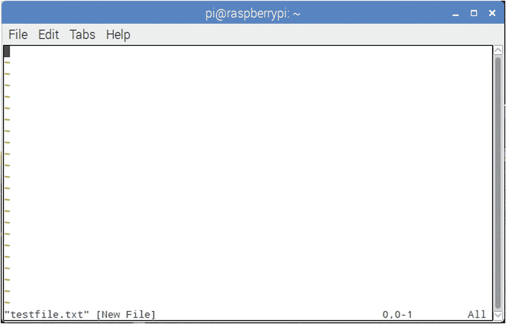
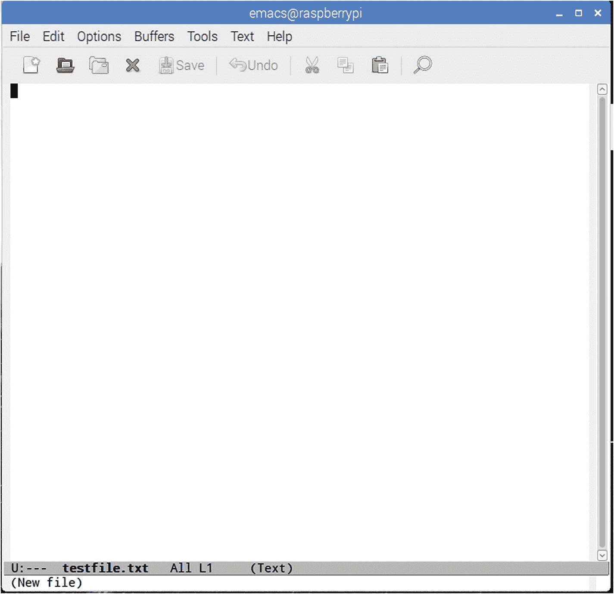
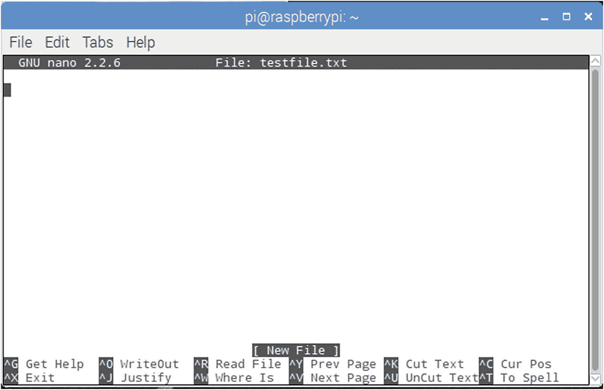
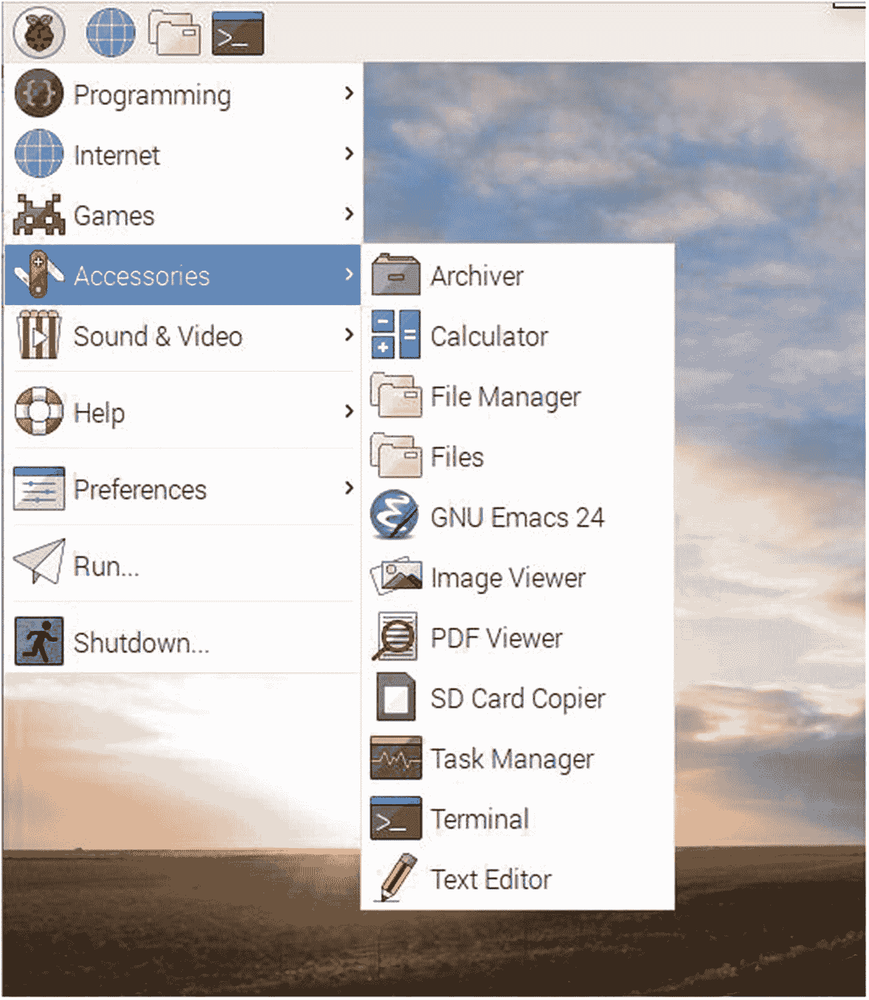

# 2.Linux 就在你的裤子旁边

Raspberry Pi 使用 Linux 作为它的标准操作系统，这意味着如果你对这个令人敬畏的操作系统一无所知，你将不得不去学习。别担心——我会尽可能让这件事不那么痛苦。

无论你对 Linux 有什么先入之见，你都可以忽略它们。从一开始，Linux 就被认为是“极客的操作系统”，让人联想到穿着短袖衬衫、笔挺的人在键盘上敲敲打打，屏幕上满是文本，在地下室深处的某个地方，一排磁带驱动的电脑硬盘柜开始运转。(见图 [2-1](#Fig1) 。)在背景中，一个 20 面骰子滚过桌子，还有一个论点的轻声低语:“不，韩先开枪！”


图 2-1

Linux 用户的游乐场(2006 Marcin Wichary)

然而，不要害怕。虽然我们中的一些人仍然热情地拥抱这种文化及其所代表的一切，但这并不意味着你必须这样做。自从 Linux 首次推出以来，它已经走过了漫长的道路，现在它不仅是一个真正的操作系统的发电站，而且非常用户友好(至少，它的大多数发行版都是如此)。Linux 最受欢迎的版本是 Ubuntu 和 Mint。两者在视觉上都与 Windows 和 Mac 非常相似，以至于许多人觉得切换到它们既有趣又容易。另一个流行的 Linux 版本是 Debian，它是 Pi 的操作系统 Raspbian 所基于的发行版。最初，Debian 是唯一一个真正“开放”的 Linux 发行版——允许任何开发者和用户做出贡献。它仍然是非商业实体的最大的 Linux 发行商。

好了，喇叭响够了。为了真正使用 Pi，您至少需要对 Linux 及其工作原理有一个基本的了解。那么，我们开始吧。

### Linux 的故事

Linux 是一个松散地基于 Unix 操作系统的操作系统。它一直是免费和开源的，它的创建者 Linus Torvalds 在 1991 年首次发布了它。它是用 C 编程语言编写的，最初设计用于运行在 Intel 基于 x86 的计算机上。在随后的 20 多年里，它被移植到了所有可以想象的设备上，从大型机和超级计算机到平板电脑、电视、冰箱和视频游戏机。Android 操作系统是建立在 Linux 内核之上的，Linux 内核是构建操作系统的代码块。

像大多数计算机软件一样，Linux 并非诞生于黑洞之中。它起源于 Unix、BSD、GNU 和 MINIX 等操作系统和内核。事实上，托瓦尔兹曾经说过，如果 GNU 内核已经完成，或者如果 BSD 在 20 世纪 90 年代早期已经可用，他可能就不会编写自己的内核了。他从 MINIX 开始他的内核工作，并最终添加了许多 GNU 软件应用程序。他还将自己的许可权转到了 GNU GPL，这表明只要代码是在类似的许可下发布的，就可以被重用。

在接下来的几年里，Linux 在用户接受度和设备方面都得到了普及。上述所有设备都运行 Linux，这是世界上最广泛采用的操作系统。

## Pi 上的 Linux 入门

为了与您的 Pi 交互，您将使用终端做大量的工作——也称为*命令行界面*，或 CLI。启动并运行您的 Raspberry Pi 桌面后，双击终端图标启动它。因为您已经登录，所以不会要求您输入用户名和密码；相反，提示符会显示如下内容:

```py
pi@raspberrypi:~ $

```

这是命令行界面(图 [2-2](#Fig2) )。它告诉您，您是用户“pi”，登录到主目录中的机器“raspberrypi”(终端对“home”的简写)。



图 2-2

树莓码头

如果您在不同的目录中，提示符将显示该目录，例如

```py
pi@raspberrypi:~/Pictures $

```

### Linux 文件和文件系统

作为一个操作系统，Linux 完全是围绕文件和文件系统构建的。文件是由文件名和位置标识的任何信息片段，可以是文本、图像、视频或其他。该位置也称为*目录路径*，有助于保持每个文件与所有其他文件完全不同，因为该位置在技术上是文件名的一部分。例如，

```py
/wdonat/Desktop/MyFiles/file.txt

```

不同于

```py
/wdonat/Desktop/MyOtherFiles/file.txt

```

尽管两者都叫`file.txt`。文件名也区分大小写；`/file.txt`不同于`/FILE.txt`，也不同于`/File.txt`。您将会熟悉五类文件:

*   包含您创建的信息的用户数据文件，如文本文件或图像

*   包含系统使用的信息的系统数据文件，如登录、密码等

*   目录文件，也叫*文件夹*，可以包含文件和其他目录。包含在目录中的目录被称为*子目录*，它们可以嵌套到你所能想到的程度。

*   代表硬件设备或操作系统使用的一些占位符的特殊文件

*   可执行文件，即包含操作系统指令的程序或外壳脚本

Linux 中的整个文件系统都包含在一个根文件夹中，用一个`/`表示。在该文件夹中有子文件夹，例如`bin/`、`home/`、`proc/`、`var/`和`dev/`。每个目录下都有更多的子目录。事实上，如果您可以缩小并以三维方式查看文件系统，它看起来就像一棵巨大的倒置的树。`/home/`文件夹是您的默认主目录，每个用户在 Linux(和 Unix)系统上都有一个。在该目录中，您可以自由地创建、执行和删除文件。如果您需要操作、编辑或删除系统文件，您可能需要作为根用户*登录或者执行命令`sudo`。*

### Root 用户对 sudo

在每个 Linux 安装中，都有一个被指定为 root 的用户，他能够管理系统上的所有文件，包括系统级文件。例如，大多数用户帐户不能编辑`/var/`目录中的文件，但是根用户可以。由于这种能力和误用它的可能性(甚至是意外)，Linux 用户不会以 root 身份登录，除非绝对必要；当他们这样做时，他们登录，做他们需要做的事情，然后再次注销。Linux 极客中有句话:“只有 noobs 才以 root 身份登录”；换句话说，只有新手才能作为根用户登录并保持登录状态。

不过，作为根用户登录有一个快捷方式:`sudo. sudo`代表**s**uper**u**ser**do**，它只是告诉系统像根用户一样执行命令。系统将询问 root 密码，然后执行该命令。同样，系统不会仔细检查你是否真的想这么做，所以当你使用`sudo`时，要加倍小心，在你按下 Enter 键之前，你要知道你刚刚输入的命令的结果！

### 命令

为了使用 Linux CLI，您可以使用诸如`cd`和`ls`这样的命令在文件系统中导航。运行程序的命令也是从终端运行的。表 [2-1](#Tab1) 中包含了您将经常使用并且应该学习的常用命令。

表 2-1

常见的 Linux 命令

<colgroup><col class="tcol1 align-left"> <col class="tcol2 align-left"></colgroup> 
| 

命令

 | 

意义

 |
| --- | --- |
| 限位开关（Limit Switch） | 列出当前目录中的文件 |
| 激光唱片 | 更改目录 |
| 显示当前工作目录 | 打印工作目录 |
| rm *文件名* | 删除*文件名* |
| mkdir *目录名称* | 将目录命名为*目录名* |
| rmdir *目录名* | 删除空目录 |
| 类别*文本文件* | 在终端显示*文本文件*的内容 |
| mv *oldfile newfile* | 移动(重命名)*旧文件*到*新文件* |
| cp *oldfile newfile* | 将*旧文件*复制到*新文件* |
| 人工*命令* | 显示*命令的手册* |
| 日期 | 读取系统日期/时间 |
| 回声 | 回显终端中键入的内容 |
| 可做文件内的字符串查找 | 使用正则表达式的搜索程序 |
| 日本首藤 | 作为根用户执行 |
| 。/ *程序* | 运行*程序* |
| 出口 | 退出终端会话 |

表 [2-1](#Tab1) 中列出的大多数命令都是不言自明的，但有些命令需要更多的解释:

*   毫无疑问，这是最重要的命令。如果您不确定一个特定的命令做什么或者它使用什么参数/标志，在您的终端中键入`man command`会显示 Unix 手册页，其中包含您想知道的所有信息。当您打开一个页面时，它通常以命令的名称开始，然后是命令的各种排列的概要、命令的详细描述、所有选项和标志，以及这些选项和标志的作用。当你处于手动视图时，只需按回车滚动，然后按 *q* 返回终端。

*   这个命令列出了你所在的任何目录下的文件；使用像`–l`和`–a`这样的标志包括文件许可和修改日期等信息。当您使用`–l`标志时，每个条目的第一部分显示如下

    ```py
    drwxr-xr-x

    ```

    在这种情况下，这意味着条目是一个目录(`d`)；拥有者可以读、写、执行文件(`rwx`)；群组成员可以读取和执行文件(`r-x`)；所有用户都可以读取和执行文件(`r-x`)。在我们使用 Pi 的大部分工作中，您将是文件的所有者，因此文件权限应该不会对您有太大影响。然而，有时你需要使一个文件可执行；这就是`chmod`命令的用途，但是我们将在另一章中进行讨论——比如处理家庭媒体服务器的那一章(第 [7](07.html) 章)。`ls`还有一些其他非常有用的标志。`ls –F`列出目录中的当前文件，但在所有本身是目录的内容后有一个尾随的“`/`”。`ls –a`列出所有文件，包括“隐藏”文件(名称以句点[ `.` ]或双句点[ `..` ]开头的文件，通常不会在标准的`ls`显示中显示)。

*   这个命令带你到你命名的目录，就像你想的那样。几个特殊的目录名包括`cd ~`，它带您到您的主目录(“【T2”，或波浪符号，表示您的主目录)，和`cd ../`，它带您到文件夹结构中的一个目录。换句话说，如果你在`~/Desktop/MyFiles/`目录中，输入

    ```py
    cd ../

    ```

    会把你放在`~/Desktop/`目录中

    ```py
    cd ../../

    ```

    会将您置于您的主目录(`~/`)中，并键入

    ```py
    cd ../MyOtherFiles/

    ```

    会将您从桌面上的`MyFiles`目录中取出，放入桌面上的`MyOtherFiles`目录中。

### 小费

如果你简单地键入`cd`并按回车键，你将被带回你的主目录，无论你在哪里。

*   这是一个需要知道的好命令。当你迷路时，`pwd`简单地告诉你你在哪个目录，给出的答案是从根目录开始的路径。当您在一个可能有重复文件夹名称的目录结构中有四五个文件夹时，这尤其有用，比如

    ```py
    /Users/wdonat/Desktop/MyApplication/bin/samples/Linux/bin/

    ```

    终端提示符简单地显示

    ```py
    pi@raspberrypi: /bin $

    ```

*   `rm`:使用命令`rm`就像把一个文件拖进垃圾箱，有一个重要的区别:对于所有的意图和目的，你不能撤销它，所以确定你真的想删除那个文件！

*   `mkdir`和`rmdir`:命令`mkdir`和`rmdir`创建和删除目录。`rmdir`的警告是目录必须是空的，否则操作系统不允许你删除它。但是，您可以将`–p`选项与`rmdir`一起使用，这将删除一个文件夹的(也是空的)父文件夹。例如，打字

    ```py
    rmdir –p /foo/bar/this_directory

    ```

    将依次删除`this_directory/`、`bar/`和`foo/`。

*   `mv`和`cp`:命令`mv`和`cp`虽然相当简单，但需要一些时间来适应。`mv`不移动文件，而是*重命名*文件，同时销毁旧文件。打字

    ```py
    mv myfile.txt myfile2.txt

    ```

    将`myfile.txt`重命名为`myfile2.txt`。在`mv`命令结构中，你可以指定目录级别，所以在某种意义上你可以`mv`将一个文件从一个文件夹转移到另一个文件夹。例如，假设你桌面上的`MyFiles`文件夹中有一个名为`myfile.txt`的文件。您可以通过键入以下内容来移动和重命名它(从文件夹内)

    ```py
    mv myfile.txt ../MyOtherFiles/myfile2.txt

    ```

    `myfile.txt`将会从你当前的目录中消失，而它的副本，名为`myfile2.txt`，将会出现在你桌面上的`MyOtherFiles`文件夹中。

    `cp`类似于 mv，但它是复制而不是重命名，所以你不会丢失原始文件。同样，您可以指定目录级别，因此`cp`便于跨文件夹复制。例如，打字

    ```py
    cp myfile.txt ../myfile.txt

    ```

    在你的桌面上放一份`myfile.txt`的拷贝(假设你还在`Desktop/MyFiles/`目录中)。)

*   `cat`:使用`cat`可以快速预览一个文件，比如一个文本文件，而不需要在文本编辑器中打开它。输入`cat filename`将会在你的终端上显示一个文件的内容，即使它不是文本文件。(试着对一个图像文件执行`cat`，会看到一堆乱码。)如果您想逐行预览文件，而不是一次将整个文件输出到您的终端，请使用`more`命令，或者使用`less`命令。这将用第一批文本填充屏幕，按下 Enter 键将在文件中前进，一次一行。

*   `date`:使用 date(不带参数)简单地将系统的日期和时间打印到终端。通过参数，它允许您设置日期和时间。

*   这个命令仅仅是回应你在终端中输入的内容。在终端交互会话中，这不是一个非常有用的命令，但是当您编写 shell 脚本(在终端中运行的预先编写的命令集)时，它类似于计算机编程语言的`print`语句。

*   虽然`man`可能是这些命令中最重要的，`grep`可能是最强大的。这是一个搜索程序，可以搜索文件和目录，使用你以正则表达式的形式给它的任何输入，并“管道”输出到屏幕或另一个文件。正则表达式的使用使得它如此强大；如果您不熟悉它们，正则表达式是构成搜索模式的一系列字符，通常这一系列字符看起来像外语。举个简单的例子，

    ```py
    grep ^a.ple fruitlist.txt

    ```

    将在`fruitlist.txt`中搜索以“a”开头、后跟一个字符、后跟“`ple`”的所有行，并将结果打印到屏幕上。使用`|`或*管道*，允许你将那些结果发送到不同的输出，比如一个文本文件。`grep`的力量和复杂性让你可以写下关于它的章节；现在，只要意识到它的存在。

*   `./` `program`:运行一个可执行文件的命令非常简单——只需键入一个句点，后跟正斜杠，再后跟程序名。请注意，这只适用于通过您的用户名可执行的文件；如果文件没有正确的权限或者根本不是可执行文件，它会给你一个错误。

*   `exit`:最后的重要命令简单来说就是`exit`。这会停止终端中正在运行的任何作业(也称为 *shell* ，并关闭终端本身。

### 练习:在 Linux 文件系统中导航

在下面的介绍性练习中，让我们练习用命令行在 Linux 的文件系统中移动。双击 Pi 桌面菜单栏上的终端图标，打开终端提示符(命令行提示符)(如图 [2-3](#Fig3) 所示)。



图 2-3

终端图标

当它打开时，通过键入以下命令确保您位于主目录中

```py
cd ~

```

然后键入

```py
pwd

```

终端应该打印出

```py
/home/pi

```

现在，通过键入以下命令创建一个目录

```py
mkdir mydirectory

```

然后，在不输入它的情况下，通过键入

```py
mkdir mydirectory/mysubdirectory

```

如果您现在输入`ls`，您应该看到`mydirectory`被列为可用目录。你现在可以打字了

```py
cd mydirectory/mysubdirectory

```

您将位于新创建的子目录中。

让我们测试一下`echo`函数。在终端中，键入

```py
echo "Hello, world!"

```

终端应该响应

```py
Hello, world!

```

顾名思义，`echo`只是重复你给它的论点。但是，您也可以将某些内容“回显”到其他输出格式；默认只是碰巧是屏幕。例如，您可以使用`echo`和‘`>`’操作符创建一个文本文件。类型

```py
echo "This is my first text file" > file.txt

```

如果您随后通过键入`ls`列出您的目录的内容，您将会看到`file.txt`被列出。类型

```py
cat file.txt

```

看到它的内容，你应该看到

```py
This is my first text file

```

在终点站。输入以下命令，创建另一个名为`file2.txt`的文本文件

```py
echo "This is another file" > file2.txt

```

现在，通过键入以下命令将第一个文件重命名为`file1.txt`

```py
mv file.txt file1.txt

```

如果您现在列出当前目录的内容，您会看到`file1.txt`和`file2.txt`。你可以`cat`每个文件，以确保它们是你创建的。

接下来，让我们将`file1.txt`复制到文件夹结构中的上一级目录。类型

```py
cp file1.txt ../file1.txt

```

如果您现在通过键入以下命令列出您的主目录的内容

```py
ls ../../

```

你会看到`file2.txt`还在，虽然它已经从你当前的目录中消失了。恭喜你！现在，您已经成功地在 Linux 命令行(或 shell)中完成了最常见的文件操作！

说到 shells，Linux 在大多数发行版中都有几个可用的。

### Linux 中的 Shells

Linux 中的 shell 有类似于 *Bourne shell* 、 *C shell* 和 *Korn shell* 的名字。shell 只是用户和操作系统之间基于文本的界面，允许用户直接对文件系统执行命令。每种外壳都有其优点和缺点，但是如果说一种外壳比另一种外壳更好，那将是一种误导。它们只是提供了做同一件事的不同方式。 *Bourne-again shell* ，也称为 *bash* ，是 Bourne shell 的替代版本，是大多数 Linux 版本的默认版本，包括 Pi 的 Raspbian。它可以通过其登录提示“`$`”来识别。Bash 有一些键盘快捷键，如果您在终端中进行大量编辑和文件操作，它们会变得非常方便，就像我们在项目中将要做的那样。(参见表 [2-2](#Tab2) 。)

表 2-2

Bash 键盘快捷键

<colgroup><col class="tcol1 align-left"> <col class="tcol2 align-left"></colgroup> 
| 

键或组合键

 | 

功能

 |
| --- | --- |
| Ctrl + A | 将光标移动到行首 |
| 控制 + C | 停止当前正在执行的进程 |
| Ctrl + D | 注销；相当于退出 |
| Ctrl + E 组合键 | 将光标移动到行尾 |
| 控制 + H | 删除光标前面的字符 |
| Ctrl + L | 触发器的清零端 |
| 控制 + R | 搜索命令历史记录 |
| Ctrl + Z 组合键 | 暂停一个项目 |
| 向左/向右箭头 | 将光标向左/向右移动一个字符 |
| 向上/向下箭头 | 滚动浏览以前的命令 |
| Shift +向上翻页/向下翻页 | 在终端输出中向上/向下移动一页 |
| 标签 | 命令或文件名完成 |
| 标签标签 | 显示所有命令或文件名的可能性 |

同样，大多数快捷方式都是不言自明的，但最后两个需要一些额外的解释:

*   当你正在键入一个长文件名时，按下 Tab 键将会为你完成文件名或者为你提供一个选择列表。例如，如果你在`/Desktop/MyFiles/`目录下，想快速浏览`myextralongfilename.txt`文件，只需输入`cat myextr`，然后按 Tab 键。Bash 将为您填写文件名，假设没有其他文件有类似的开头。如果还有其他以`myextr`开头的，bash 会发出报错声；在这种情况下，再次按 Tab 键可查看选项列表。

*   这个快捷键也适用于命令。在您的终端中，键入`l`并按 Tab 键两次。Bash 将用所有以“ *l* 开头的可用命令来响应(这可能是一个相当长的列表。)您可以通过一次添加一个字母并再次按 Tab 键两次来重复该过程。shell 将填充所有可能的命令或文件，为您提供所有可能结果的预览。

### 包管理器

当您需要在 Windows 中从在线源安装程序时，通常会下载一个。exe 或。msi 文件，双击它，并按照说明安装程序。类似地，如果你使用的是 Mac，你可以下载一个. dmg 文件，然后将解压后的文件复制到你的硬盘上，或者使用附带的安装包。

然而，Linux 有一点不同。Linux 使用包管理系统或包管理器来跟踪它的软件。软件包管理器用于为操作系统下载、安装、升级、配置和删除程序。大多数软件包管理器维护一个已安装软件的内部数据库以及所有的依赖和冲突，以防止安装软件时出现问题。包管理器因发行版而异。Debian(和 Pi)使用 aptitude，而 Fedora 使用 RPM 包管理器，Puppy Linux 使用 PETget。如果你有玩下载游戏的经验，可能对 Steam 游戏比较熟悉；你可能会惊讶地发现 Steam 的接口是一个包管理器的变种。大多数包管理器都有命令行和图形界面。例如，Ubuntu 使用 Synaptic 前端作为其智能管理器。

像 Ubuntu 一样，Raspberry Pi 使用 aptitude 包管理器，你可能会在终端中使用它来完成大部分工作。安装一个软件的常用命令是

```py
sudo apt-get install package name

```

这将指示经理执行以下操作:

1.  确定哪个软件源或存储库中有请求的文件。

2.  联系存储库并确定需要哪些依赖项。

3.  下载并安装这些依赖项。

4.  下载并安装所需的软件。

如果这看起来很容易，那就应该——应该是这样。当您请求一个不包含在您已安装的软件库中的软件时，您可能会遇到问题，但是即使这样通常也是一个简单的解决方法。如果发生这种情况，只需键入

```py
sudo add-apt repository repository name

```

进入你的终端。完成后，输入

```py
sudo apt-get update

```

让您的软件包管理员了解新的存储库并从中获取可用软件包的列表，然后输入

```py
sudo apt-get install package name

```

又来了。幸运的是，Raspbian 中包含的默认存储库(或 *repos* )包含了你需要的大部分软件，所以(至少对于这本书来说)你可能不会遇到这个问题。

## 文本编辑器

不像 Windows 和 Mac 有记事本、写字板和文本编辑，Linux 有几种可能的文本编辑器。大多数发行版上都安装了一个名为 gedit 的标准编辑器。它不仅相当轻便，而且也不包括在 Pi 中。Pi 的内置文本编辑器 Leafpad 相当不错。您可能还会发现自己对 nano 越来越熟悉，nano 是 Pi 上预装的另一个文本编辑器，具有非常直观的界面。但是如果您在 Pi 上做任何严肃的编程工作，您可能最终想要升级到 Linux 的两个强大功能之一:vi 或 emacs。

vi 和 emacs 不仅是强大的编辑器；它们也可以用作 ide(集成开发环境)，带有关键字文本着色/语法突出显示和单词补全。两者都是可扩展和可定制的；例如，emacs 有 2000 多个内置命令，而 vi 可以通过其许多端口和克隆进行定制。事实上，vi 的克隆版本之一 Vim (Vi 改进版)几乎包含在每个 Linux 发行版中，也是我在这里要讨论的版本，因为它比它的前身 Vi 更像一个 IDE。Emacs 可以由用户使用 Lisp 扩展进行编程，但是对于您可能有的每一种美感来说，它都非常类似于 vi。

然而，emacs 和 Vim 之间正在进行一场战争。Linux 和 Unix 用户强烈喜欢其中的一个，当讨论/争论各自的利弊时，他们会变得异常兴奋。作为一个认真的作者，我将在这里向您介绍这两个程序，但是作为一个铁杆 emacs 用户，我将尽我所能使您的选择远离 Vim 这个垃圾。当我们在整本书中讨论程序和脚本时，我不会提及它们是如何编写的，而仅仅是最终结果是什么样子。您甚至可以决定您喜欢 Pi 的默认文本编辑器，这也完全没问题。

### Vim 对 emacs 对 nano

Vim 是一个模态编辑器。它有两种模式:*插入*和*正常*。在插入模式下，您的击键成为文档的一部分。正常模式用于控制编辑会话。例如，如果您在正常模式下键入“I ”,它会将您切换到插入模式。如果你再次输入一个“I ”,一个“I”将会出现在光标的位置，就像你所期望的文本编辑器一样。通过在这两种模式之间来回切换，您可以创建和编辑您的文档。

另一方面，Emacs 有更直观的界面。您可以使用箭头键在整个文档中移动，当您按下一个键时，您可以期望它出现在光标碰巧出现的任何地方。像复制/粘贴、保存等特殊命令是通过按 Control 键调用的，后面是一系列其他命令，通常以“x”开头。例如，如果您想保存当前文档，您可以按 Ctrl-x，然后按 Ctrl-s，在 emacs 菜单中突出显示为 C-x C-s。

另一方面，Nano 比其他两个更直观。您可以像在任何其他编辑器中一样输入文本，并且您使用的命令总是显示在屏幕的底部。

如果你想尝试其中一个或者全部三个(在你下定决心之前总是一个好主意)，确保你已经安装了所有的软件。为此，首先输入

```py
sudo apt-get install emacs

```

和

```py
sudo apt-get install vim

```

Nano 应该预装在 Pi 上；然而，emacs 和 Vim 不是。请注意，emacs 是一个相当大的下载，所以安装它和它的依赖项可能需要一些时间。去喝杯咖啡或者吃顿饭，当你回来的时候，它应该已经在等你了。

### 使用 Vim

正如我所说的，Vim 是一个模态编辑器，意味着您可以在插入和正常模式之间切换。要启动测试文件，请导航到您的桌面并键入

```py
vim testfile.txt

```

Vim 不是打开另一个窗口，而是在终端中打开，如果您不习惯，这可能会让人感到困惑。您应该会看到一个类似于图 [2-4](#Fig4) 所示的窗口。



图 2-4

Vim 中的 Testfile.txt

Vim 以正常模式打开，这意味着您不能立即编辑该文件。为此，您必须通过键入“I”进入插入模式。单词“INSERT”将出现在左下角——这是一种提醒您处于插入模式还是正常模式的便捷方式。键入完毕后，按下 Esc 键返回正常模式。在普通模式下，您可以使用箭头键在文档中移动，就像在插入模式下一样，但是在您键入“I”之前，您不能更改或添加任何内容。若要保存文件，请至少按一次 Esc 键，确保您处于正常模式。然后，键入“:w”(不带引号)，并按 Enter 键。要同时保存和退出，请键入“:x”(还是不带引号)，然后按 Enter 键。显然，如果您在输入这些字符时处于插入模式，那么您所能做的就是将:w 或:x 添加到文档中。

Vim 需要很长时间来适应，许多人很难适应这两种不同的操作模式。如果你决定喜欢它，网上有很多教程教你如何充分发挥它的潜力。

### 使用 emacs

Emacs(至少对我来说)比 Vim 更直观一些，尤其是当您第一次开始使用它的时候。首先，打开一个终端并导航到您想要测试文件的位置，比如桌面。在那里，输入

```py
emacs testfile.txt

```

Emacs 会寻找`testfile.txt`，存在就打开，不存在就创建打开。然后你会看到一个空白页，如图 [2-5](#Fig5) 所示。



图 2-5

emacs 中的 Testfile.txt

你可以立即开始打字。表 [2-3](#Tab3) 列出了 emacs 中最常见的命令。

表 2-3

emacs 中的常用命令

<colgroup><col class="tcol1 align-left"> <col class="tcol2 align-left"></colgroup> 
| 

命令

 | 

击键

 |
| --- | --- |
| 打开/新建 | Ctrl+x + Ctrl+f |
| 关闭 | Ctrl+x + Ctrl+c |
| 救援 | Ctrl+x + Ctrl+s |
| 切口 | Ctrl+w 组合键 |
| 复制 | Alt+w* |
| 粘贴 | Ctrl+y |
| 跳到行首 | Ctrl+a |
| 跳到行尾 | Ctrl+e 组合键 |
| 开始/结束选择 | ctrl+空格键 |

** Alt 键在大多数键盘上被定义为 Escape 键*

因此，举例来说，如果你想移动一行文本，把你的光标移到行首。按 Ctrl 和空格键；窗口左下角的状态文本将显示“标记已激活”然后，使用 Ctrl 和“e”将光标移动到行尾。状态文本将消失。现在，通过按 Ctrl+w 剪切选定的文本，将光标移动到要粘贴它的位置，然后按 Ctrl+y。

这确实需要一些时间来适应，所以如果你决定喜欢 emacs，网上有很多教程可以帮助你学习击键。一旦你学会了它，它会变得非常强大，但是请永远记住:这些命令中的大部分(如果不是全部的话)都可以从菜单中访问。

### 使用纳米

如前所述，nano 可能是三个编辑器中最容易使用和习惯的。要在 nano 中启动文件，只需输入

```py
nano testfile.txt

```

进入您的终端，您应该会看到如图 [2-6](#Fig6) 所示的屏幕。与其他两个编辑器一样，如果指定的文件存在，nano 将打开它；否则，nano 会为您创建它。



图 2-6

nano 中的 Testfile.txt

如您所见，常用命令列在底部，脱字符(^)表示 Ctrl 键。要保存文件，请键入 Ctrl+X 退出。系统会询问您是否要保存该文件以及以什么名称保存。一般来说，键入“Y ”,然后按回车键保存您打开或创建的文件。

### 默认文本编辑器

Pi 曾经有一个名为 Leafpad 的编辑器，但现在它只是一个功能齐全但没有名字的轻量级编辑器，类似于 Ubuntu 的 gedit，Mac 的 TextEdit 或 Windows 的 TextPad。要打开它，点击 Pi 桌面左上方的树莓图标，然后选择“文本编辑器”(图 [2-7](#Fig7) )。



图 2-7

打开默认文本编辑器

正如您将看到的，看起来您所熟悉的大多数编辑器。如果你习惯使用它，请使用它。我没有提到它太多，因为它的一个主要缺点是，它只有在 Pi 的图形桌面上工作时才可用。如果您远程登录到 Pi，并且只通过命令行工作，那么文本编辑器是不可访问的。

## 摘要

您对 Linux 的介绍到此结束。虽然这并不能让你成为专家，但它应该让你对这个强大的操作系统所能做的一切有一个健康的认识。您学习了如何仅使用命令行浏览文件系统的基础知识，并了解了 shell。还向您介绍了可用的文本编辑器，并且希望您已经选择了一个您熟悉的编辑器。一旦您在您的 Pi 上对它有了足够的了解，您可能会发现自己正在一台或多台其他机器上安装 Linux。没关系，我不会告诉任何人。

在下一章，我将尽我所能给你一个坚实的 Python 介绍。