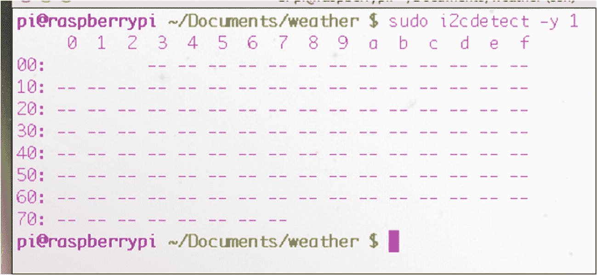
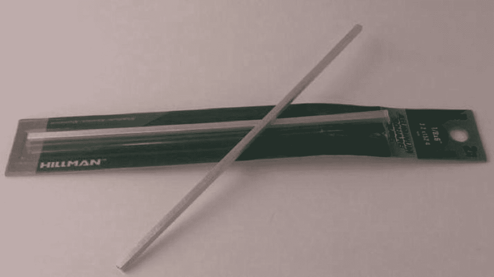
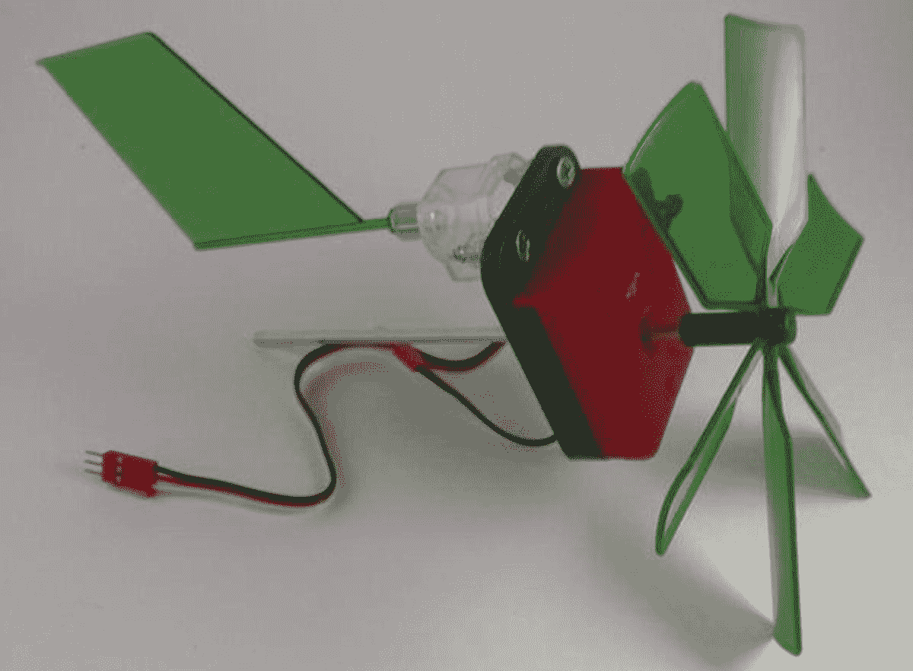
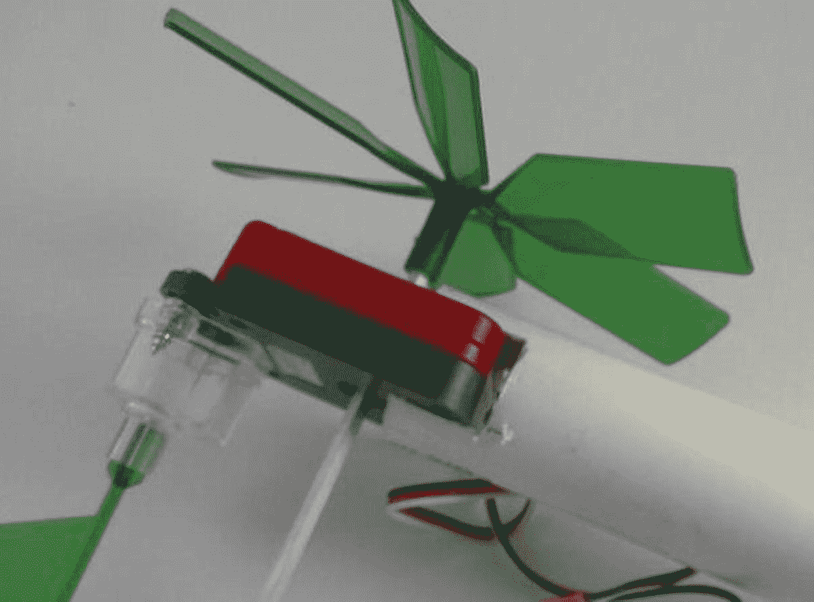
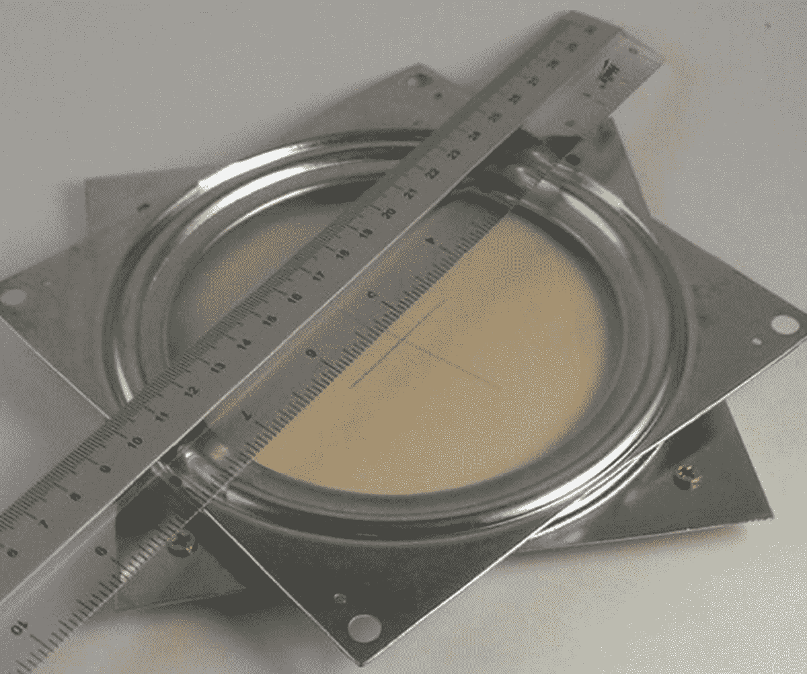
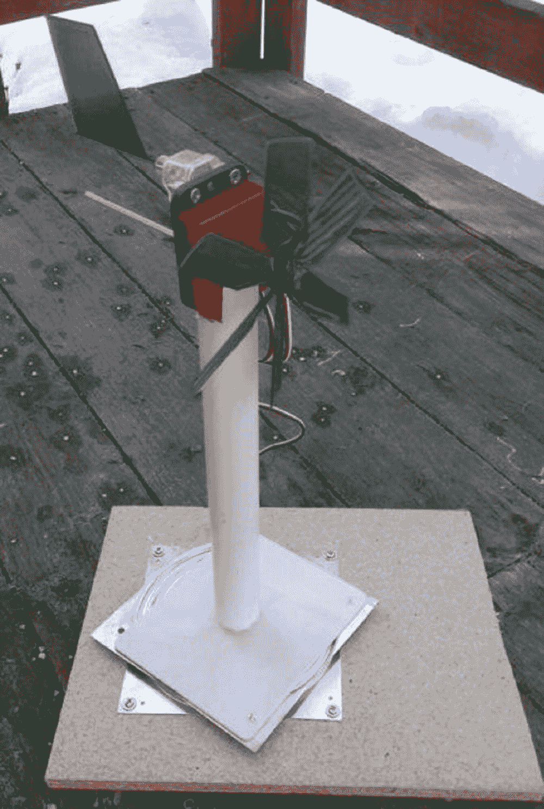
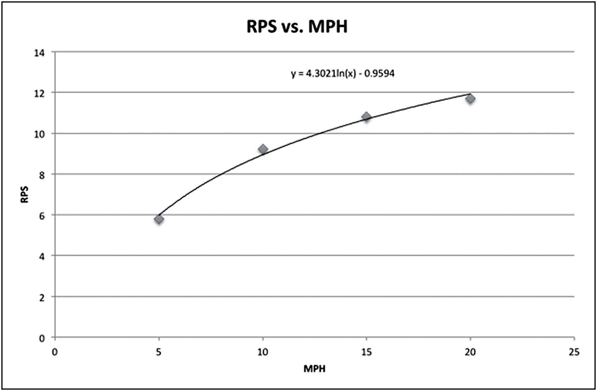
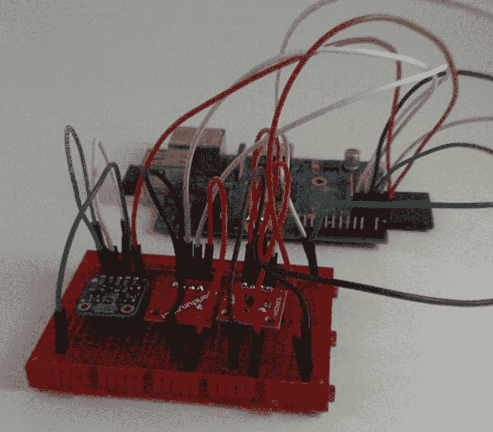
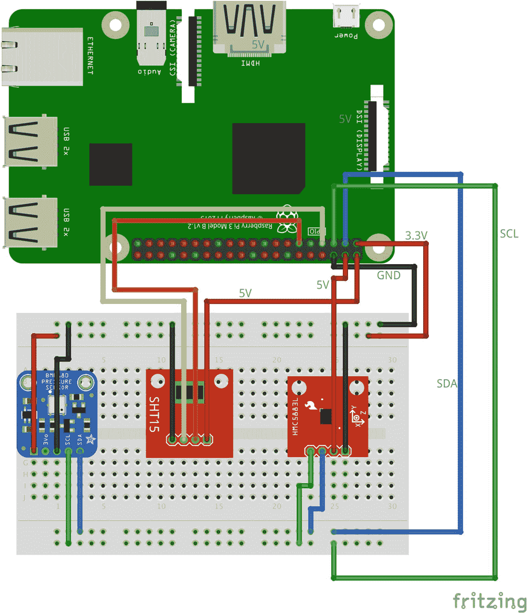
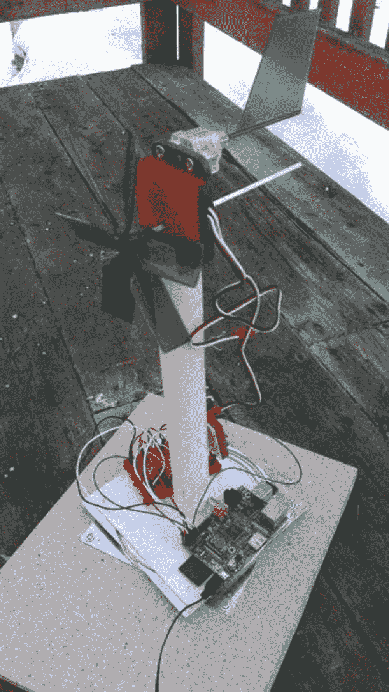

# 六、气象站

自古以来，人类就对天气着迷，问诸如“会不会下雨给我们的庄稼？会下雪吗，这样我们就可以去滑雪了？龙卷风会把我们的房子带到一个虚构的国家，那里住着超自然的女人和会飞的灵长类动物吗？我们每天都有某种天气——今天会是什么天气？”

预测天气并不总是一种科学追求。人们会向雨神祈求下雨，向太阳神祈求阳光。如果祈祷不起作用，他们会经常拜访一位先知或预言家，他们声称有能力预见未来并预测即将到来的低压系统的路径(当然，不是用那些特定的词语)。

渐渐地，天气背后的科学被发现了，我们不再需要依赖一块神奇的石头来预测天气(见图 [6-1](#Fig1) )。人们上学是为了成为气象学家，了解天气前沿、风暴潮和其他与天气相关的科学信息。


图 6-1

气象石(图片 2010 汤姆·纳普)

为了所有这些进步，需要一个气象站——一个小型的、局部的跟踪当前状况的方法。即使是小型气象站通常也会给出风速和风向、温度、湿度和相对气压。这些读数中的每一个，在一两天的时间里结合起来看，都可以帮助你预测不久的将来的天气。

当然，Raspberry Pi 非常适合创建这个气象站应用程序。大量的计算能力*不是*所需要的，但是与小型传感器网络轻松互动的能力是需要的。一些通过 I2C(内部集成电路)连接到 Pi，一些通过脉宽调制(PWM)连接，一些简单地连接到 GPIO 引脚。通过以循环方式逐一轮询每个传感器，我们可以获得任何给定时刻天气状况的准确图像。

让我们从收集建造气象站所需的零件开始。

## 零件购物清单

气象站不涉及很多部分，但公平的警告:考虑到它们的大小，其中一些比你想象的要贵一点:

*   Raspberry Pi 和电源适配器

*   数字罗盘/磁强计( [`https://www.sparkfun.com/products/10530`](https://www.sparkfun.com/products/10530) )

*   光轴编码器( [`http://www.vexrobotics.com/276-2156.html`](http://www.vexrobotics.com/276-2156.html) )

*   气压传感器( [`https://www.adafruit.com/products/1603`](https://www.adafruit.com/products/1603) )

*   数字温度计( [`https://www.adafruit.com/products/1638`](https://www.adafruit.com/products/1638) )

*   小面包板( [`https://www.sparkfun.com/products/9567`](https://www.sparkfun.com/products/9567) )

*   五金店的方形轴

*   风车或类似的扇形装置

*   懒惰的苏珊轴承

*   薄木板

*   带盖的 PVC 管，长约 12 英寸，直径 1-2 英寸

*   各种跳线、胶水、螺丝

## 使用 I2C 协议

这个项目利用 I2C 协议与您将添加到 Pi 中的湿度和压力传感器进行通信。虽然这是一个相对简单的协议，但它可能会有点混乱，所以在我们开始构建站点之前，最好快速地回顾一下。

I2C 使大量设备能够在一条电路上只用三根线进行通信:数据线、时钟线和地线。每个设备称为一个*节点*，通常有一个主节点和多个从节点。每个从机节点都有一个 7 位地址，如 0x77 或 0x43。当主节点需要与某个从节点通信时，它首先在数据线上发送一个“起始”位，然后是从节点的地址。该从机做出应答，而所有其它从机忽略消息的其余部分，继续等待下一个地址脉冲的发送。然后，主机和从机相互通信，经常在发送和接收模式之间切换，直到所有信息都发送完毕。

I2C 被称为“类固醇上的串行协议”，它最常用于速度无关紧要且需要保持低成本的应用中。Raspberry Pi 有两个引脚#3 和#5，分别预配置为 I2C 协议的 SDA(数据)和 SCL(时钟)线路，因此它可以轻松地与 I2C 设备通信。我们将使用的两种设备(气压计/高度计和磁力计)是 I2C 设备。

Pi 还有一个 I2C 实用程序，可以查看当前连接的设备。要安装它，请键入

```py
sudo apt-get install python-smbus
sudo apt-get install i2c-tools

```

如果你使用的是 Raspbian 的最新版本，比如 Wheezy 或 Stretch，这些应该已经安装了，在这种情况下，你只会得到一个提示，告诉你它们已经是最新版本了。

现在，您可以运行名为 *i2cdetect* 的 I2C 实用工具来确保一切正常，并查看连接了哪些设备。类型

```py
sudo i2cdetect -y 1

```

这将显示如图 [6-2](#Fig2) 所示的屏幕。



图 6-2

`i2cdetect`工具

在这种情况下，不存在任何设备，这是有意义的，因为我们还没有插入任何设备。但是您现在知道您的工具运行正常。

## 使用风速计

任何气象站的重要组成部分都是风速计——测量风速的设备——因为风速是任何天气预报的重要因素。如果是寒冷的一天(例如，低于 32 华氏度或 0 摄氏度)，风速在感觉有多冷(风寒)方面起着重要作用。根据国家气象局的风寒图表，15 华氏度时 15 英里/小时的风让人感觉像 0 华氏度，0 华氏度时 20 英里/小时的风让人感觉像零下 24 度。在这种情况下，风速对于决定你的四肢是先冻僵还是先掉下来是很重要的(如果你问我，我会说两者都不吸引人)。

另一方面，如果外面不是特别冷，风速对下一个天气现象的到来速度有影响。以每小时 2 英里的速度，阳光灿烂的日子还要过几天才能到达你的身边；以每小时 50 英里的速度，在龙卷风摧毁你的房子之前，你只有几分钟的时间了。

风速计可能是一个相当复杂的装置，有轴承、轴和开关等等；另一方面，我们的相对简单。

### 制作风速计

我们将使用旋转轴编码器、旋转轴和一些鳍片来测量风速。

我们使用的 Vex robotics 的旋转轴编码器由一个塑料圆盘组成，圆盘周围有均匀分布的狭缝。当通电时，一束微弱的光线穿过光盘上的缝隙，照射到另一面的光敏接收器上。通过计算在给定时间间隔内光线被光盘阻挡的次数(或者，光线穿过狭缝的次数),可以确定光盘旋转的速度。也可以确定光盘已经旋转了多少次，事实上，这就是旋转编码器经常使用的方式。例如，如果一个旋转编码器被挂在机器人的轴上，这是一个非常好的方法来测量连接到那个轴上的轮子已经行驶了多远。如果光盘有 90 个狭缝(就像我们的一样)，我们知道轴旋转一整圈(车轮旋转一整圈)就是编码器的光接收器上闪烁 90 次。因此，我们可以告诉机器人，“向前开 30 条缝”，轮子将向前推进其周长的三分之一。如果我们知道圆盘/轮子的周长是 3 英尺，我们就知道机器人刚刚前进了 1 英尺。

这看起来像是许多不必要的数学，但是理解编码器如何工作是很重要的。一旦我们将翼片连接到旋转轴上，我们*就可以*(理论上)根据翼片的周长和轴的速度计算出风速。然而，我的经验是，实际上用已知的风速进行实验并把这些速度纳入我们的程序要容易得多，所以这就是我们要做的。要做到这一点，你需要一个搭档——在你测量风速的时候，他能以预定的、*正常的*速度载着你到处跑。这意味着大约 5-20 英里每小时的速度，*不是* 80。

要制作你的风速计，仔细阅读你当地的五金店，直到你找到一个 1/8 英寸的方形小轴，它将适合旋转编码器的方孔(见图 [6-3](#Fig3) )。



图 6-3

方杆

### 注意

在撰写本文时，一个 1/8 英寸的轴完全适合旋转编码器的孔。

接下来，你需要一个风车或类似的东西。我使用了一个科学工具包中的风车部分，你可以在当地的工艺品商店买到(例如， [`http://amzn.to/1koelSW`](http://amzn.to/1koelSW) )。正如你所看到的，轴完美地安装在风车的孔中，定向鳍很容易连接到编码器的背面。(见图 [6-4](#Fig4) 。)



图 6-4

附有风向标的编码器

整个机构需要旋转；也就是说，它需要连接到一个可以在轴上旋转的设备上，比如风向标，这样我们就可以确定风的方向。这就是懒苏珊轴承组发挥作用的地方。

首先，在 PVC 管的末端切两个槽，您的编码器将紧密地安装在其中(如图 [6-5](#Fig5) 所示)。



图 6-5

PVC 管插槽中的编码器

将 PVC 盖放在管子的另一端。将一个轻木块连接到转盘轴承的一侧，然后，尽可能靠近旋转轴的中间，从下面用一个螺钉连接 PVC 管和盖子。图 [6-6](#Fig6) 显示了确定旋转轴中心的一种方法。



图 6-6

确定平台中心

完成后，你应该有一个如图 [6-7](#Fig7) 所示的装配。



图 6-7

纳米组件

### 将风速计连接到 Pi

现在，我们需要将风速计连接到 Pi 并测量转速。将编码器的红线连接到 Pi 的电源引脚(#2)，黑线连接到 GND (#6)，白线连接到您选择的 GPIO 引脚。为了便于说明，我们使用 8 号引脚。

如前所述，这种编码器的工作原理是，每当光盘中的一个狭缝通过某个点时，就发送一个高信号。我们知道圆盘上有 90 个狭缝，所以每 90 个高信号等于轴旋转一周。我们所要做的就是记录高点，以及获得 90 个高点需要多长时间，这样我们就可以得到一段时间内的旋转速度。如果我们以秒为单位跟踪时间(当我们使用时间库时就会这样)，我们就会得到每秒转数。因此，读取编码器的代码应该是这样的:

```py
import time
import RPi.GPIO as GPIO
GPIO.setmode(GPIO.BOARD)
GPIO.setup(8, GPIO.IN, pull_up_down=GPIO.PUD_DOWN)

prev_input = 0
total = 0
current = time.time()

while True:
    input = GPIO.input(8)
    if ((not prev_input) and input):
        print ("turning")
        total = total + 1
    prev_input = input
    if total == 90:
        print (1/(time.time() - current)), "revolutions per sec"
        total = 0
        current = time.time()

```

这里所有有趣的事情都发生在`while`循环中。由于我们已经开始将`prev_input`设置为`0`，作为输入的`1` ( `HIGH`)意味着圆盘正在转动。在这种情况下，我们增加`total`，将`prev_input`设置为`input`，并在检查是否达到 90 高点后继续循环。如果有，这意味着我们正好转了一圈，所以我们可以计算和打印每秒转数(RPS ),并重置总转数和当前转数。要测试这个编码器代码，请将电线连接到您的 Pi，运行脚本，并手动旋转编码器轮。您应该看到单词“turning”重复了 90 次，然后显示了一行 RPS。

### 将每秒转数与风速相关联

如果编码器正常工作，剩下的唯一步骤就是将每秒转数与风速相关联，而最简单的方法就是与朋友和汽车一起完成。将您的风速计伸出窗外，将您的 Pi 通过 ad-hoc 网络连接到您的笔记本电脑(见侧栏)，让您的朋友以 5 英里/小时的速度驾驶几分钟，同时您运行编码器脚本；以每小时 10 英里、15 英里和 20 英里的速度重复这个过程，直到你有足够的数据将风速与 RPS 关联起来。

当我把风速计挂在窗外开车时，我得到了表 [6-1](#Tab1) 中显示的 RPS 读数。

表 6-1

使用风速计，MPH 与 RPS 读数相关

<colgroup><col class="tcol1 align-left"> <col class="tcol2 align-left"></colgroup> 
| 

每小时英里数

 | 

RevolutionsPerSecond 每秒的转速

 |
| --- | --- |
| five | Five point eight |
| Ten | Nine point two three |
| Fifteen | Ten point eight |
| Twenty | Eleven point seven |

MPH 和 RPS 的相关性很明显是对数关系，也就是说我们可以用一点代数(eek！)根据每秒转数计算风速。

如果你把这些值绘制在图上，你会得到图 [6-8](#Fig8) 。



图 6-8

RPS 与 MPH

从等式中可以看出，每秒转数和风速之间的关系是对数关系，而不是线性关系。因此，我们必须使用反对数函数，或 *e* <sup>x</sup> ，以每秒转数来求解风速。我不想用数学来烦你，所以请相信我的话

*   风速= e <sup>((y+0.95)/4.3)</sup>

你很快就会看到，我们将能够把那个计算代入我们的最终程序。

### 通过点对点网络将 Pi 连接到笔记本电脑

如果你和我一样，我用我的 Pi 做的大部分工作都是无头的——如果我需要查看桌面，我会 SSH(安全外壳)进入它或运行 VNC(虚拟网络计算)服务器，但我通常没有连接到它的显示器、鼠标或键盘。举例来说，如果你连接到你的家庭网络，这很好，但是如果周围没有网络呢？幸运的是，在您的 Pi 和笔记本电脑之间建立一个有线的 ad-hoc 网络非常简单。点对点只是 Pi 和另一台计算机(如您的笔记本电脑)之间的网络连接，中间没有路由器或集线器。

最简单的设置方法是记下您的 Pi 的静态 IP 地址，并调整您的笔记本电脑的以太网端口以与该地址通信。假设您的 Pi 的地址是 192.168.2.42。使用短以太网电缆将您的 Pi 直接连接到笔记本电脑的以太网端口。现在，进入你的笔记本电脑的网络设置。您的计算机很可能设置为通过 DHCP(动态主机控制协议)自动从路由器接收地址。将该方法更改为 Manual，并为您计算机的网络端口分配一个与 Pi 的子网一致的地址。在我们的例子中，一个好的地址应该是 192.168.2.10。如果有合适的位置，请填写子网掩码(255.255.255.0 将在本例中起作用)和默认网关(本例中为 192.168.2.1)。如有必要，重新启动计算机或重启网络管理器。

现在，您应该能够通过标准终端连接登录到直接连接的 Pi:

```py
ssh -l pi 192.168.2.42

```

您可以像在家庭网络上一样工作。

## 连接数字指南针

我们将在这个项目中使用的数字罗盘只有一个目的:让我们知道风向。我们正在使用的 HMC5883L 使用 I2C 协议，所以在继续之前，请确保您熟悉本章前面的“使用 I2C 协议”一节中的信息。

首先将附带的插头焊接到 HMC 分线板。取向由你决定；如果你打算把它做成独立的，你可能想让标题朝上，以便于访问。另一方面，如果你打算将芯片插入试验板，尽一切办法将它们朝下焊接，这样你就可以轻松地将整个单元插入电路板。

接头焊接到电路板后，用跳线将引脚连接到您的 Pi。VCC 和 GND 分别连接到 Pi 的#2 和#6 引脚，SDA 和 SCL 连接到 Pi 的#3 和#5 引脚。您现在已经准备好使用`smbus`库来读取指南针，使用一点数学(eek！)以基于感测到的 *x* 和 *y* 值来计算方位。现在是使用之前提到的`i2cdetect`工具的好时机，以确保你可以从指南针上读取。通过键入`sudo i2cdetect -y 1`运行该工具，您应该看到芯片列出了地址`0x1e`(参见图 [6-9](#Fig9) )。


图 6-9

查看指南针的 I2C 地址

如果没有出现，请仔细检查您的连接。(你看到的图 [6-9](#Fig9) 、`0x60`中列出的另一个地址是我插入 Pi 的另一个 I2C 设备。)当它出现时，启动一个新的 Python 脚本从设备中读取。我们将使用`smbus`库的 I2C 工具来读写传感器。首先，在 Pi 上创建一个目录，将所有气象站代码保存在一起，输入

```py
cd ~
mkdir weather
cd weather

```

现在您已经在您的主文件夹中创建了一个`weather`目录，并在其中导航，在您的新 Python 脚本中键入以下代码:

```py
import smbus
import math

bus = smbus.SMBus(0)
address = 0x1e

def read_byte(adr):
    return bus.read_byte_data(address, adr)
def read_word(adr):
    high = bus. read_byte_data(address, adr)
    low = bus.read_byte_data(address, adr+1)
    val = (high << 8) + low
    return val

def read_word_2c(adr):
    val = read_word(adr)
    if (val >= 0x8000):
        return -((65535 - val) + 1)
    else:
        return val

def write_byte(adr, value):
    bus.write_byte_data(address, adr, value)

write_byte (0, 0b01110000)
write_byte (1, 0b00100000)
write_byte (2, 0b00000000)

scale = 0.92
x_offset = -39
y_offset = -100

x_out = (read_word_2c(3) - x_offset) * scale
y_out = (read_word_2c(7) - y_offset) * scale

bearing = math.atan2(y_out, x_out)
if bearing < 0:
    bearing += 2 * math.pi
print "Bearing:", math.degrees(bearing)

```

导入正确的库后，该脚本使用`smbus`库设置读取和写入传感器地址的函数。函数`read_byte()`、`read_word()`、`read_word_2c()`和`write_byte()`均用于读取和写入传感器 I2C 地址的值(单字节或 8 位值)。三条`write_byte()`线将值 112、32 和 0 写入传感器，以对其进行读取配置。这些值通常列在 I2C 传感器随附的数据表中。

### 注意

您可能已经注意到，当您从 Adafruit 或 Sparkfun 购买分线板时，这些公司通常会提供该传感器的示例代码。每当您从他们那里购买零件时，请查看每个网站上的“文档”链接。正如任何程序员都会告诉你的:如果工作已经完成，就没有必要重新发明轮子。如果已经存在的代码可以解决你的问题，那么使用它也没有什么不好。随着你编程技能的进步，也许用不了多久*你*就会为创客社区贡献代码，解决别人的问题！

然后，脚本读取指南针的 *x* -和*y*-轴读数的当前值，并使用数学库的`atan2()`(反正切)函数计算传感器的方位，首先使用数学库的`degrees()`函数将其转换为度数。然而，`x_offset`和`y_offset`的值可能会根据您当前的地理位置而发生变化，确定这些值的最佳方式就是简单地运行脚本。

运行脚本，最好附近有一个工作的指南针，并将您获得的读数与指南针读数进行比较。(带有焊接接头的电路板一侧是电路板“指向”的方向。)您可能需要一点一点地调整偏移，以使轴承正确注册。一旦它被配置好，你就有办法测量风的方向；我们将把指南针安装到风速计的旋转轴上，这样当我们组装最终的气象站时就可以读取方向。

## 连接温度/湿度传感器

我们正在使用的温度和湿度传感器 Sensirion SHT15 是该建筑中价格较高的部件之一。然而，它也很容易使用，因为不涉及 I2C 协议。您首先需要将附带的接头焊接到它上面。像指南针一样，标题的方向由您决定。我倾向于将电路板朝上焊接接头，这样当我将跳线插入时，我可以看到每个引脚。当然，如果我要把这个单元插入试验板，这意味着我不能读取引脚，但这是一个权衡。

焊接接头后，完成以下步骤:

1.  将 VCC 引脚连接到 Pi 的 5V 引脚(#2)。

2.  将 GND 引脚连接到 Pi 的 6 号引脚。

3.  将 CLK 销连接至 7 号销。

4.  将数据引脚连接到引脚#11。

### 注意

随着引脚标记为数据和 CLK，这将是一个可以理解的错误，认为这个板运行在 I2C 协议，但事实并非如此。这些针就是这样标记的。

要使用这个传感器，你必须安装 Luca Nobili 的`rpiSht1x` Python 库。在您的气象目录中(或者您正在处理气象站代码的任何地方)，通过键入以下命令下载`rpiSht1x`库

```py
wget http://bit.ly/1i4z4Lh --no-check-certificate

```

### 注意

您将需要使用`--no-check-certificate`标志，因为我已经通过使用链接缩短服务`bitly.com`来缩短链接，以使您更容易键入。通常，当你使用 wget 下载一个文件时，它只是保存到你当前的目录，但是使用`bitly.com`重命名链接会导致下载时出现奇怪的行为。这个标志纠正了这个问题。

下载完成后(考虑到它只有 8KB 的下载量，应该不会花很长时间)，您需要对它进行重命名，以便可以对它进行扩展。通过键入以下命令重命名下载的文件

```py
mv 1i4z4Lh rpiSht1x-1.2.tar.gz

```

然后通过键入以下内容展开结果

```py
tar -xvzf rpiSht1x-1.2.tar.gz

```

然后`cd`进入结果目录(`cd rpiSht1x-1.2`)并运行

```py
sudo python setup.py install

```

您现在可以使用这个库了，所以让我们试一试。在您的 SHT15 仍然按照前面的定义连接的情况下，键入以下代码:

```py
from sht1x.Sht1x import Sht1x as SHT1x
dataPin = 11
clkPin = 7
sht1x = SHT1x(dataPin, clkPin, SHT1x.GPIO_BOARD)

temperature = sht1x.read_temperature_C()
humidity = sht1x.read_humidity()
dewPoint = sht1x.calculate_dew_point(temperature, humidity)

temperature = temperature * 9 / 5 + 32     #use this if you'd like your temp in degrees F
print ("Temperature: {} Humidity: {} Dew Point: {}".format(temperature, humidity, dewPoint))

```

将该代码保存为`sht.py`并用`sudo python sht.py`运行。该脚本使用 Adafruit 脚本中定义的函数— `read_temperature_C()`、`read_humidity()`和`calculate_dew_point()`—从传感器获取电流值，我们将传感器连接到第 7 和第 11 针。然后，它为我们这些不使用公制的人执行快速转换并显示结果。

你应该了解一下你目前的状况:

```py
Temperature: 72.824 Humidity: 24.282517922 Dew Point: 1.22106391724

```

如您所见，这是一个非常简单明了的库。这些库中的许多都是为 Arduino 编写的，以便与它们通信，谢天谢地，它们已经被移植到 Pi 上运行了。(参见前面关于使用现有代码的旁注。)

## 连接气压计

也许气象站最有趣的部分之一是 BMP180 气压计芯片，因为变化的气压是天气下一步要做什么的最佳指标之一。一般来说，气压下降表明暴风雨即将来临，气压上升表明前方天气良好。当然，这过于简单化了。

BMP180 芯片运行在 I2C 协议上，所以你必须把它连接到你的 Pi 的 SDA 和 SCL 引脚(引脚#3 和#5 ),就像你连接指南针一样。将接头焊接到电路板后，将 VCC 和 GND 分别连接到引脚 1 和 6，然后将 SDA 和 SCL 分别连接到引脚 3 和 5。

### 注意

你将芯片的电源连接到 Pi 的 3.3V，而不是 5V。您希望芯片运行在 3.3V 逻辑上，这样它就没有机会损坏 Pi 的精密 3.3V 输入。

为了确保一切连接正确，运行`sudo i2cdetect -y 1`并确保设备出现。它应该显示为地址`0x77`，如图 [6-10](#Fig10) 所示。


图 6-10

i2cdetect 显示正在使用的 0x77 和 0x1e 地址

### 注意

图 [6-10](#Fig10) 截图中的 0x1e 设备就是我们正在使用的连接指南针。

同样，这个设备需要一些外部库才能工作。在这种情况下，我们将使用 Adafruit 优秀的`BMP085`库。

### 注意

BMP180 芯片的原始版本是 BMP085。尽管后来被替换，但芯片的原理图和引脚排列是相同的，因此所有为 BMP085 编写的库也适用于 BMP180。

要获取必要的库，在您的终端中键入

```py
wget http://bit.ly/NJZOTr --no-check-certificate

```

正如我们之前所做的，我们需要重命名下载的文件，以便我们可以使用它。在这种情况下，我们下载的文件被命名为`NJZOTr`。通过键入以下内容来重命名它

```py
mv NJZOTr Adafruit_BMP085.py

```

这里不需要安装任何东西，所以我们可以直接使用这个库与芯片通信。在同一目录下的新 Python 脚本中，输入以下内容:

```py
from Adafruit_BMP085 import BMP085

bmp = BMP085(0x77)    #you may recognize the I2C address here!

temp = bmp.readTemperature()
temp = temp*9/5 + 32     #if you're not in one of the 99% of countries using Celsius
pressure = bmp.readPressure()
altitude = bmp.readAltitude()

print "Temperature:    %.2f F" % temp
print "Pressure:       %.2f hPa" %(pressure / 100.0)
print "Altitude:       %.2f" %altitude

```

正如温度传感器的脚本所做的那样，这一小段代码使用预先编写的库及其函数从气压计芯片中读取必要的值。当您运行它时，您应该得到类似图 [6-11](#Fig11) 的东西。


图 6-11

BMP180 压力传感器的输出

你现在可以从你所有的传感器上读取数据，所以是时候把所有的东西放在一起了！

## 连接比特

建设这个气象站的一个重要部分是将所有东西(或至少是指南针)放在一个旋转平台上，这样你就可以确定风的方向。正如你在图 [6-12](#Fig12) 中看到的，我把我所有的芯片都放在一个试验板上，并把它连接到 Pi，这样我就可以更容易地把所有东西(Pi 和试验板)安装到一个旋转平台上。在你懒惰的 Suzan 轴承上有一个相当大的平台，这应该不是问题。



图 6-12

面包片

查看图 [6-12](#Fig12) ，您可能会注意到我是如何布线的:我在电路板的一侧使用电源轨进行正极(+)和负极(–)连接，而在另一侧使用电源轨进行 I2C 连接的数据线(SDA)和时钟线(SCL)。这是我发现的将几个不同的 I2C 设备连接到 Pi 的最简单的方法，因为它们共享时钟和数据线。图 [6-13](#Fig13) 显示了一个更好的布线视图，以防你忘记什么连接到什么。



图 6-13

接线图

将风速计安装到气象站基座后，您现在可以连接 Pi 和电路板罗盘、温度传感器和气压计芯片。由于旋转编码器的引线较短，您可能需要在风速计桅杆上安装一个额外的试验板，如图 [6-14](#Fig14) 所示。您完成的装配可能看起来如图所示。给你的 Pi 加电，你就可以接收天气预报了。



图 6-14

竣工气象站

我们将编写代码，以便 Pi 每 30 秒查询一次每个传感器，并将结果显示在屏幕上。请参见下一节中的最终代码。

## 最终代码

从`Apress.com`开始，最终代码为`weather.py`。

```py
import os
import time
from sht1x.Sht1x import Sht1x as SHT1x
import Rpi.GPIO as GPIO
from Adafruit_BMP085 import BMP085
import smbus
import math

GPIO.setmode(GPIO.BOARD)
GPIO.setup(8, GPIO.IN, pull_up_down=GPIO.PUD_DOWN)

bus = smbus.SMBus(0)
address = 0x1e

def read_byte(adr):
    return bus.read_byte_data(address,adr)

def read_word(adr):
    high = bus.read_byte_data(address, adr)
    low = bus.read_byte_data(address, adr)

    val = (high << 8) + low
    return val

def read_word_2c(adr):
    val = read_word(adr)
    if (val >= 0x8000):
        return -((65535 - val) + 1)
    else:
        return val

def write_byte(adr, value):
    bus.write_byte_data(address, adr, value)

def checkTemp():
    dataPin = 11
    clkPin = 7
    sht1x = SHT1x(dataPin, clkPin, SHT1x.GPIO_BOARD)
    temp = sht1x.read_temperature_C()
    temp = temp*9/5 + 32        #if you want degrees F
    return temp

def checkHumidity():

    dataPin = 11
    clkPin = 7
    sht1x = SHT1x(dataPin, clkPin, SHT1x.GPIO_BOARD)
    humidity = sht1x.read_humidity()
    return humidity

def checkBarometer():
    bmp = BMP085(0x77)
    pressure = bmp.readPressure()
    pressure = pressure/100.0
    return pressure

def checkWindSpeed()
    prev_input = 0
    total = 0
    totalSpeed = 0
    current = time.time()
    for i in range(0, 900):
        input = GPIO.input(8)
        if ((not prev_input) and input):
            total = total + 1
        prev_input = input
        if total == 90:
            rps = (1/ (time.time()-current))
            speed = math.exp((rps + 0.95)/4.3)
            totalSpeed = totalSpeed + speed
            total = 0
            current = time.time()
    speed = totalSpeed / 10    #average speed out of ten turns
    return speed

def checkWindDirection()
    write_byte(0, 0b01110000)
    write_byte(0, 0b00100000)
    write_byte(0, 0b00000000)
    scale = 0.92
    x_offset = 106        #use the offsets you computed
    yoffset = -175        #use the offsets you computed
    x_out = (read_word_2c(3) - x_offset) * scale
    y_out = (read_word_2c(7) - y_offset) * scale
    direction = math.atan2(y_out, x_out)
    if (direction < 0):
        direction += 2 * math.pi
        direction = math.degrees(direction)
    return direction

# Main program loop
while True:
    temp = checkTemp()
    humidity = checkHumidity()
    pressure = checkBarometer()
    speed = checkWindSpeed()
    direction = checkWindDirection()

    os.system("clear")
    print "Current Conditions"
    print "----------------------------------------"
    print "Temperature:", str(temp)
    print "Humidity:", str(humidity)
    print "Pressure:", str(pressure)
    print "Wind Speed:", str(speed)
    print "Wind Direction:", str(direction)

    time.sleep(30)

```

## 摘要

在本章中，您从头开始建立了一个气象站，并安装了必要的传感器来跟踪天气情况，包括气压、温度、湿度、风速，甚至风向。您已经了解了更多关于 I2C 接口的知识，现在应该很好地掌握了如何使用 Python 函数在给定的时间间隔内重复任务。你也做了很多捏造；现在你可以休息一下了，因为下一个项目，媒体服务器，不需要任何构造！