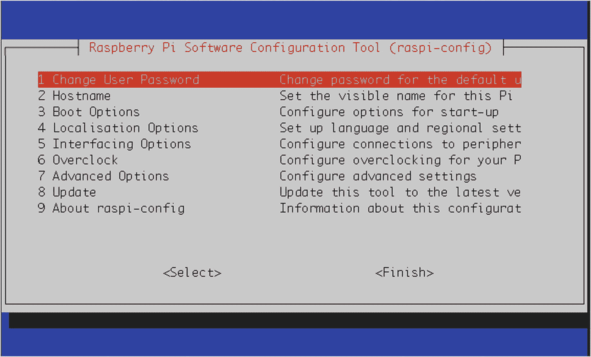
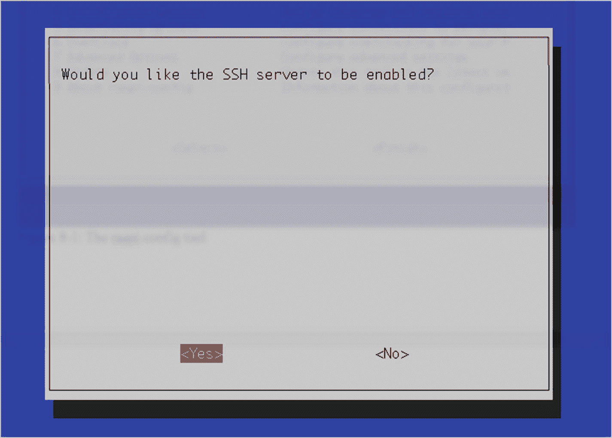
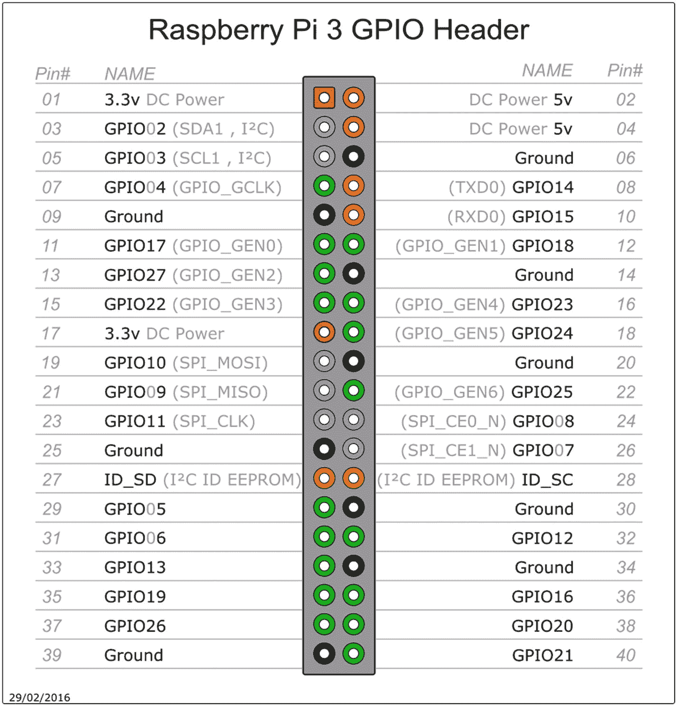
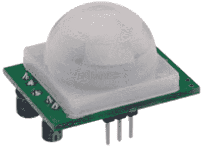
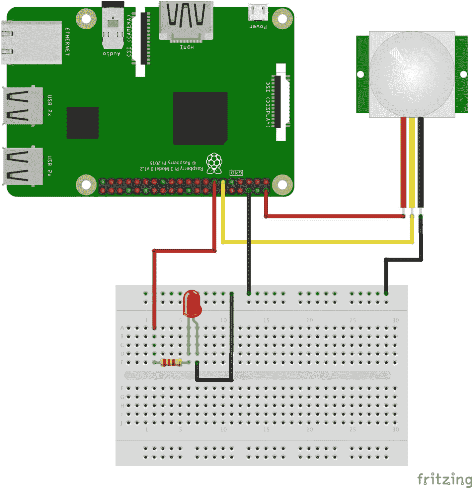
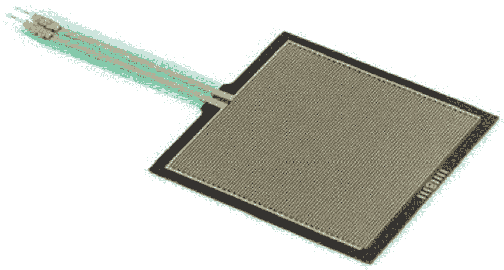
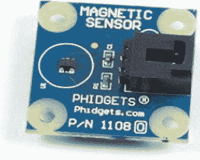

# 八、家庭安全系统

生活在现代可以。。。好吧，让我们面对它:这可能是一件可怕的，有压力的事情。坏人和他们犯下的罪行无处不在。根据联邦调查局犯罪统计网站的数据，2016 年，美国发生了大约 790 万起财产犯罪，这是有统计数据的最近一年。虽然财产犯罪率在过去的 14 年里稳步下降，但住在和平街道上的日子已经一去不复返了，在那里邻居互相认识，上班时不锁门。

幸运的是，我们能够保护我们的家园，也能够用摄像机(静态和视频)监视这些家园，这些摄像机安装在我们需要的地方，并能够将视频实时传输到我们任何始终连接的设备，如我们的笔记本电脑或智能手机。我们可以在我们的房子里安装传感器，比如运动传感器和行程开关，并使用从这些传感器收集的信息作为触发器来执行特定的操作。如果你愿意花这笔钱，你可以安装各种系统，从保护你的房子免受火灾和盗窃，到提醒你一氧化碳(CO)泄漏。

碰巧的是，树莓 Pi 非常适合做所有这些事情，而且比整个闭路摄像机网络和运行它们的计算机系统便宜得多。不需要太多的计算能力——它足够小，足够省电，可以实际安装在现场，它可以通过可用的相机(甚至红外相机)拍摄重要时刻的照片！)，并且因为它连接到家庭网络，所以它可以在出现问题时提醒您。太好了。

是的，你可以养一只看门狗。其实很多人(有人会说*正常*人)都是这么做的。但是让我们花点时间考虑一下养狗和养树莓派的利弊。然后，我们可以开始用树莓 Pi 构建我们的家庭安全系统。

## 狗是安全的

众所周知，狗是人类最好的朋友，近一万年来，它们一直被用作看门狗。它们是狼的后代，有各种形状和大小，从一品脱大小的吉娃娃到巨大的大丹狗。

长期以来，狗的工作之一就是保护家不受入侵者的侵害。他们非常忠诚，保护他们的人类家庭成员和他们的“巢穴”,会对入侵者吠叫，甚至攻击。为了保持这种行为，它们需要食物——有时相当多。虽然它们通常很可爱，令人想抱抱，并且在寒冷的冬夜能很好地让你的脚保持温暖，但不幸的是，它们不得不吃东西的事实意味着它们也不得不消灭——这对所有相关的人来说都是一项恶臭的任务。

狗也是没有能力升级的。上次我试图给我的狗插 USB 线时，它尖叫着跑向我妻子。虽然当你在路上开车时，狗把头伸出窗外时会非常可爱，但你不能升级它们的驱动程序或使用软件包管理器来下载更有效的气体消除程序。

结果如何？狗很适合看家，但是它们有一些严重的缺点。

## 作为证券的树莓派

树莓派( *Rubus strigosus Pi* )通常被认为是机器人爱好者最好的朋友，至少在*整整六年的时间里，它一直被用来制作各种稀奇古怪的项目。这些设备是从 20 世纪 80 年代早期的 Acorn RISC 机器发展而来的，如前所述，有各种各样的版本:版本 1、版本 2、版本 3、版本 3+、Zero、Zero W。。*

树莓派并没有真正的特定工作，但作为一台计算机，众所周知，它会遵循所有给它的指令。如果你给它编程，让它找出 1 到 10000 之间的所有质数，它就会这么做；另一方面，如果你告诉它继续寻找质数，直到一头猪从头顶飞过，它将继续计算，直到它的处理器烧坏，或者直到小猪长出翅膀。要做这些惊人的壮举，Pi 不一定要吃，也不一定要消除。缺乏代谢有机物质的代价是 Pi 不能在寒冷的冬夜让你的脚保持温暖。(其实我收回那句话；当版本 3 执行一些繁重的任务时，比如视频处理，它可能会变得有点热。但还是又小又多刺。)

然而，您可以通过明智地使用`sudo apt-get install`命令来升级 Pi。Pi 欢迎 USB 输入，它可以通过编程使用传感器来监视您的房子及其周围的地面，并在这些防御遭到破坏时向您发出警报。不幸的是——从经验来说——如果你在街上开车，把头伸出窗外，人们会用非常奇怪的眼神看着你，但没有恶臭气体的问题，所以就这样了。

结果如何？树莓派有一些严重的缺点，但这些都可以克服，让它看着你的房子。既然这个*是*一本关于圆周率的书，那就是我们要用的。

## 使用传感器网络

家庭安全系统(以及第 6 章[中的气象中心](06.html))基于*传感器网络*的概念。如果计算机像大脑一样，传感器就是允许它从物理世界收集信息并与之交互的感官。相机像眼睛，簧片开关像指尖，压力开关像被笨手笨脚的狗踩过的脚趾。没有传感器，机器人什么都不是，任何需要与物理世界互动的机器人大脑都完全依赖于传感器网络。

事实上，这是 Pi 最酷的地方之一——它能够轻松地与传感器等物理事物交互。大多数现代台式机和笔记本电脑都取消了所有有趣的端口，如并行和串行端口，只剩下几个单独的 USB 端口和一个以太网端口。这使他们变得残疾，如果没有特殊的设备和相应的代码，他们无法轻松地与“真实”世界互动。与此同时，Pi 可以通过其 GPIO 引脚直接插入运动传感器，并通过几行代码让你知道 Slenderman 是否在你卧室后面的灌木丛中爬行。

在我们的安全系统中，我们将使用几个传感器:一个红外运动传感器、一个压力开关、一个磁传感器和一个簧片或限位开关。运动传感器可以放置在场地的任何地方。压力开关放在门口可能会很有用，因为入侵者很可能会踩到门口。磁传感器可用于检测窗户是否被打开，簧片开关可用于确定是否有人触碰绊线。如果任何传感器被触发，我们可以使用 Pi 的机载相机拍照，并随时访问这些照片。最后，如果我们的安全网络中发生了有趣的事情，我们可以使用我们的家庭网络让 Pi 向我们发送文本消息和/或电子邮件消息，就像安全公司在检测到警报时给你打电话一样。

这是我们将要使用的传感器网络。它很基本，但也可以无限扩展。虽然我们将只使用每种传感器中的一种，但如果你想的话，你可以很容易地添加更多的传感器(例如，在你家的每个窗户上安装一个磁性传感器)。

## 了解下拉电阻

任何时候使用几乎任何电路的*输入时，都要知道并记住一个重要概念，即浮动输入和下拉(或上拉)电阻。基本上，每当一个引脚(如 Pi 上的 GPIO 引脚)被设置为从电压源(如传感器)读取输入时，它就被称为*浮动输入*，直到该引脚读取到一些电压。在传感器发出电压信号之前，引脚上的电平几乎可以是任何值。这个不确定的浮动电压会严重影响你的程序；如果你已经设置了自毁程序，当引脚读取 2.3V 值时激活，并且浮点值*发生*达到 2.3V，*嘣！*我们需要一种方法，在没有从引脚读取任何内容时，将引脚设置为一个已知值(比如逻辑高或逻辑低)。*

解决这个问题的方法是使用一个*上拉*或*下拉*电阻。该电阻将输入引脚连接到 Vcc 或 GND(分别为上拉或下拉)。这样，如果没有输入，引脚将读取 Vcc 或 0，我们将知道该值。这通常通过物理电阻(通常为 100K 或 100K)来实现，但许多开发板(包括 Pi)将允许您通过软件“虚拟地”实现这一点——当您在有限的空间内工作时，这是一个巨大的优势。使用 GPIO 库，您可以将一个引脚声明为输入，同时像使用下拉电阻一样使用以下语法“下拉它”:

```py
GPIO.setup(11, GPIO.IN, pull_up_down=GPIO.PUD_DOWN)

```

这将在引脚#11 读取的值定义为低，直到它从传感器接收到电压；此时，电压被拉高，程序可以运行。当高值消失时，引脚再次被拉低，直到该过程重复。一个上拉*电阻做几乎同样的事情，除了引脚被拉高(到 Vcc)直到一个输入出现。*

## 零件购物清单

为了建立一个有效的家庭安全系统，你需要几个部件:

*   树莓派(显然)和电源适配器

*   Raspberry Pi 摄像头模块

*   压力开关(例如 [`http://bit.ly/Owc8aN`](http://bit.ly/Owc8aN) )

*   磁性传感器(例如 [`http://bit.ly/1cis71c`](http://bit.ly/1cis71c) )

*   运动传感器(例如 [`http://bit.ly/1c35pQp`](http://bit.ly/1c35pQp) )

*   簧片开关(例如 [`http://bit.ly/1k6n2RM`](http://bit.ly/1k6n2RM) )

*   大卷以太网电缆(不需要压接端—批量购买以节省资金)

*   焊料、烙铁、各种跳线和连接器

当然，有些部分是可选的；这完全取决于你希望你的安全系统有多全面。随着安全系统的发展，您甚至可以在列表中添加项目。每个传感器只是增加了您的传感器网络，扩大了您系统的覆盖范围。

## 无线连接到您的网络

当您将您的 Pi 设置为安全系统的主控制器时，它必须与您的家庭网络连接，以便您可以远程登录和管理它，并向您发送文本消息，通知您有违规行为。当您连接到网络时，您可以选择有线或无线。当然，每种选择都有利弊，但是我强烈建议你使用无线连接。这主要是因为两个原因:无线连接允许您将 Pi 放置在任何地方，而不必将以太网电缆铺设到其位置，并且无线连接也更安全——窃贼可以切断您的 Pi 的有线连接，使其无法使用，但无线连接则不是这样。

您需要做的主要事情是设置您的 Pi 拥有一个静态 IP 地址。这将允许您从任何地方远程登录到您的 Pi，而不管自您上次远程登录以来它是否已关机。如果您让 Pi 从您的家庭路由器动态接收其 IP 地址，那么如果 Pi 必须重新启动，IP 地址可能会改变，这意味着您将无法登录(因为您不知道新地址是什么)。

幸运的是，为您的 Pi 无线连接设置一个静态 IP 并不困难，尽管这可能会令人困惑，因为每次发布新的 Pi 模型时，方法似乎都会发生变化。您需要知道路由器的地址，通常是类似于`192.168.0.1`的地址。

在 Pi 的终端提示符下，输入

```py
sudo nano /etc/dhcpcd.conf

```

并滚动到文件的底部。您可以在这里输入特定网络和特定地址的信息。假设您的路由器有一个地址`192.168.0.1`，您希望您的 Pi 有一个地址`192.168.0.4`。在`/etc/dhcpcd.conf`的底部输入以下内容:

```py
interface wlan0
inform 192.168.0.4
static routers=192.168.0.1
static domain_name_servers=8.8.8.8 8.8.4.4

```

第一行决定您设置的是有线还是无线接口。第二行给出 Pi 的新静态地址，第三行给出路由器的地址。最后，第四行将 DNS 服务器设置为 Google 的 DNS。

一旦你输入了这些信息，重启你的 Pi。根据您的无线设置，您可能需要使用 Pi 的桌面界面为您的个人网络添加密码。然而，一旦这样做了，你的 Pi 将总是有相同的地址。现在，即使它需要重新启动，您也可以随时登录，使用该地址来管理它。

现在，要使用静态 IP，您需要在您的 Pi 上运行一个 SSH 服务器。根据您第一次设置 Pi 的方式，您可能已经运行了一个 Pi。启动并运行 SSH 服务器最简单的方法是通过键入以下命令来运行您的`raspi-config`工具

```py
sudo raspi-config

```

在命令行中。你会看到`raspi-` `config`屏幕(图 [8-1](#Fig1) )。



图 8-1

raspi-config 工具

光标向下移动到选项#5，接口选项，按右箭头键高亮显示<select>，然后按回车键。将光标向下移动到 P2 SSH，再次突出显示</select>并按回车键。确保<yes>在下一个屏幕上高亮显示(图 [8-2](#Fig2) )并按下回车键。</yes>



图 8-2

启用 SSH 服务器

然后，通过选择<完成>并按回车键退出`raspi-config`工具。最后，通过键入以下命令重新启动您的 Pi

```py
sudo reboot

```

在终端中，您的 SSH 服务器应该已经启动并正在运行。现在，您可以从任何地方远程登录到您的 Pi。如果您使用的是 Windows 机器，您需要下载免费工具 PuTTY 来登录您的 Pi。如果您使用的是 Mac 或 Linux 系统，ssh 已经启用了。只需使用以下命令:

```py
ssh -l pi <your pi's IP address>

```

在密码提示处输入`raspberry`，你就进入了！使用 PuTTY，在框中输入您的 Pi 的 IP 地址，添加用户名和密码，然后单击“连接”现在，您可以从任何地方通过命令行管理您的 Pi。

## 访问 GPIO 引脚

如前所述，如果您已经阅读了本书的其他章节，您已经看到，Pi 的 GPIO 引脚是我们将 Pi 与物理世界(如传感器、伺服系统、电机和灯)相连接的方式。为了做到这一点，我们使用了一个专门为此设计的 Python 库:`RPi.GPIO`。

要使用该库，您可能需要手动安装另外两个库。(这取决于你运行的是哪个版本的 Raspbian。)首先，通过键入以下命令确保您的 Pi 是最新的

```py
sudo apt-get update

```

然后，通过键入以下命令安装 Python 开发包

```py
sudo apt-get install python-dev

```

现在，为了访问 pin，您调用

```py
import RPi.GPIO as GPIO

```

在程序的第一行中输入，然后通过键入

```py
GPIO.setmode(GPIO.BOARD)

```

这使您可以根据标准引脚排列图上的标签来识别引脚(如图 [8-3](#Fig3) 所示)。



图 8-3

Pi 的 GPIO 引脚的引脚排列图

### 注意

请记住，对于`GPIO.setmode(GPIO.BOARD)`，当您提到*引脚 11* 时，您实际上是指物理引脚#11(在图 [8-3](#Fig3) 的图中转换为 GPIO 17)，*不是* GPIO11，它转换为物理引脚#23。

一旦设置好模式，就可以将每个引脚设置为输入或输出。Arduino 的用户可能会认识到这里的概念:

```py
GPIO.setup (11, GPIO.OUT)
GPIO.setup (13, GPIO.IN)

```

等等。一旦将一个管脚设置为输出，就可以通过使用

```py
GPIO.output (11, 1)

```

或者

```py
GPIO.output (11, True)

```

然后使用以下命令将其关闭

```py
GPIO.output (11, 0)

```

或者

```py
GPIO.output (11, False)

```

当您将一个引脚配置为输入时，记得如前所述设置一个上拉或下拉电阻。

## 设置运动传感器

家庭安全网络最重要的部分之一可能是运动传感器(如图 [8-4](#Fig4) 所示)，但有几点需要注意。你不能只依靠你的运动传感器，因为当你这样做的时候，它会被邻居的猫或者雪人触发(不一定是坏事)。然而，如果你把它和所有其他传感器一起使用，你可能会有好运气。



图 8-4

该运动传感器

我们正在使用的传感器，通过视差或接近克隆，通过检测周围环境中物体发出的红外(热)水平的变化来检测运动。像大多数传感器一样，它通过在其输出引脚上输出“高”或“1”信号来表示已经检测到变化。它有三个引脚:Vcc、Gnd 和输出。

引脚是(从图 [8-4](#Fig4) 的左起)OUT、+和-。这种特殊传感器的一个很好的特点是它可以使用 3V 到 6V 的任何电压。要使用和测试它，将(–)引脚连接到 Pi 的接地引脚(引脚#6)，将(+)引脚连接到 Pi 的 5V 引脚(引脚#2)，并将 OUT 引脚连接到其中一个 GPIO 引脚。

为了测试传感器和我们的编码能力，我们将从相应地设置 GPIO 引脚开始。我们可以使用一个简单的设置来测试我们的代码——试验板上的一个 LED，当传感器被触发时，它就会亮起。用`nano motion.py`启动一个新的 Python 脚本(姑且称之为`motion.py`)并输入以下内容:

```py
import RPi.GPIO as GPIO
import time

GPIO.setwarnings (False) #eliminates nagging from the library
GPIO.setmode (GPIO.BOARD)
GPIO.setup (11, GPIO.IN, pull_up_down=GPIO.PUD_UP)
GPIO.setup (13, GPIO.OUT)

while True:
    if GPIO.input (11):
        GPIO.output (13, 1)
    else:
        GPIO.output (13, 0)

```

测试代码到此为止！要进行测试，首先将传感器上的(+)引脚连接到 Pi 上的#2 引脚。将 OUT 引脚连接到 Pi 上的引脚#11。将(–)引脚连接到试验板上的公共地线。将接地线连接到 Pi 上接地引脚，例如引脚#6。最后，将 Pi 上的 13 号引脚连接到 LED 的正极引脚(通过一个电阻)，并将 LED 的负极引脚连接到公共接地线。您最终应该会看到如图 [8-5](#Fig5) 所示的东西。



图 8-5

测试运动传感器

当您运行前面的脚本时(记住使用`sudo`，因为您正在访问 GPIO 引脚)，当您在传感器周围移动您的手时，LED 应该会亮起，然后在几秒钟不动后，它应该会再次熄灭。如果它不起作用，检查你的连接和你的部件——一个烧坏的 LED 会导致所有*种*的故障诊断头痛，相信我！

让传感器保持原样，因为我们将在我们的系统中使用它，让我们继续讨论簧片开关。

## 设置簧片开关

簧片或限位开关在许多情况下都是一个有用的工具，尤其是在我们的安全系统中。它经常被机器人用来确定运动的极限，无论是开车撞墙还是关闭物体周围的手爪。它的概念很简单:开关是常开的，没有电压通过，它有一个从开关主体伸出的电枢，像一个长杆。当外部物体按压杠杆时，它会闭合开关，通过电路发送电压——在我们的例子中，发送到 Pi 上监听信号的输入引脚。我们正在使用的限位开关也被称为“超小型快动开关”(参见图 [8-6](#Fig6) 。)


图 8-6

限位开关

从开关主体伸出的长臂允许远处的物体闭合开关的触点——从开关伸出的小驼峰。它有三个端子，但我们只使用两个，因为我们只对开关何时闭合感兴趣。

在我们的例子中，我们将使用一个限位开关来确定绊网是否被拉动。您可以将开关安装在墙上，并从对面的墙上拉一根细线或钓鱼线到开关的杠杆上。把它放在适当的位置，这样如果有人走进线中，他们就会拉下杠杆，启动开关。

因为我们使用的是物理开关，而不是运动检测器之类的传感器，所以我有必要向您介绍一下*去抖*的概念。物理开关的一个共同特点是，因为它们通常由弹性金属制成，当它们第一次被激活时，它们往往会弹开一次或多次，通常几乎是以微小的增量弹开，然后才形成稳定的接触。结果是在电压稳定在一个稳定的高或低之前，一个非常快速的开-关-开-关-开-关“震颤”。为了解决这个问题，我们*去抖*开关，只在它不再来回跳动时读取，就像这样:

```py
import time
prev_input = 0
while True:
#take a reading
input = GPIO.input(11)
#if the last reading was low and this one high, print
if ((not prev_input) and input):
    print("Button pressed")
#update previous input
prev_input = input
#slight pause to debounce
time.sleep(0.05)

```

这个小脚本很好地阐释了这个概念。如果上一次按钮按下后不到 0.05 秒，它将忽略下一次按钮按下。

因此，为了测试我们的开关，让我们将它连接到一些 GPIO 引脚，并确保当它的状态改变时，我们可以读取输入。只需使用开关，将 Pi 的电源引脚(#2)连接到开关最左边的引脚，如图 [8-7](#Fig7) 所示。然后，将*中间的*引脚连接到您的 Pi 的 11 号引脚。尝试以下代码:

```py
import time
import RPi.GPIO as GPIO
GPIO.setwarnings (False)
GPIO.setmode (GPIO.BOARD)
GPIO.setup (11, GPIO.IN, pull_up_down = GPIO.PUD_DOWN)
prev_input = 0
while True:
    input = GPIO.input (11)
    if ((not prev_input) and input):
        print "Button pressed"

    prev_input = input
    time.sleep (0.05)

```

当你运行这个脚本(记住使用`sudo`)时，按下开关将直接通过它把电压从引脚#2 发送到引脚#11，因此在引脚#11 处记录为高。这是一个去抖信号，当你按下按钮时，Pi 应该显示“按钮已按下”。恭喜你！当一个开关被按下时，你能阅读！

让我们转到下一个开关。

## 设置压力开关

压力开关与限位开关非常相似，尽管看起来很不一样(图 [8-7](#Fig7) )。)



图 8-7

压力开关

使用的不是物理杠杆和按钮，而是一个方形垫，它只是将压力记录为电压的变化。因此，它比限位开关更容易连接。将您的 Pi 引脚#2 连接到其中一根导线，将另一根导线连接到引脚#11。然后，运行与限位开关相同的脚本，用手指按下面板进行测试。瞧啊。您现在正在从压力开关中读取数值！例如，这非常适合于从迎宾垫下面读出脚步声。

## 连接磁性传感器

磁性传感器(如图 [8-8](#Fig8) 所示)是一种小型设备，虽然在某些特定应用之外并不常用，但在像我们这样的应用中却能派上用场。它测量周围的磁场，并在磁场变化时发出信号。因此，它非常擅长确定两块金属的相对位置何时发生了变化。

为了确保我们不会得到任何错误的读数，我们可以使用一些小的外部磁铁来影响传感器；我们正在使用的这个带有两个小钕磁铁，就是为了这个目的。



图 8-8

该磁性传感器

为了测试我们的磁传感器，我们可以再次使用我们一直在使用的`switch.py`代码。将传感器附带的跳线连接到传感器上的连接器块，然后将它们连接到您的 Pi:红色连接到引脚 2，黑色连接到引脚 6，白色连接到引脚 11。现在，只需将代码改为

```py
import time
import RPi.GPIO as GPIO
GPIO.setwarnings (False)
GPIO.setmode (GPIO.BOARD)
GPIO.setup (11, GPIO.IN, pull_up_down = GPIO.PUD_DOWN)
prev_input = 0
while True:
    input = GPIO.input (11)
    if ((not prev_input) and input):
        print "Field changed"

    prev_input = input
    time.sleep (0.05)

```

并运行脚本。你的终端将保持空白，直到你挥动磁铁通过传感器。(您可能需要尝试不同的距离和速度。我的经验是磁铁必须靠得很近才能对准。)此时，它会告诉您“字段已更改”经过一点实验，你会知道你应该在哪里安装磁铁，以使磁场读数的变化影响你的安全系统。例如，现在你可以将传感器安装在滑动窗户的一个窗格上，将磁铁安装在另一个窗格上，如果窗户滑动打开，磁性传感器将记录磁铁的移动。

## 设置私家侦探的摄像头

最后，使 Pi 作为安全系统关键设备具有吸引力的一个特征是它能够从小型内置相机中拍照。虽然这意味着 Pi 必须放置在一个战略位置，以拾取任何有趣的东西，但 Pi 非常小，找到一个好的位置应该不成问题。

要拍照，你必须让两个组件在你的 Pi 上工作:无线和相机。我之前讨论过无线设置；如果您还没有配置相机，也可以使用`raspi-config`工具来启用它。

一旦你启用了相机，你有两个命令可以使用:`raspistill`(捕捉图片)和`raspivid`(捕捉视频)。每个都可以与各种标志和选项一起使用，以更改帧大小、采集速率和其他配置。

然而，我们对拍摄静态照片感兴趣；虽然可以通过实时视频流传输视频，但需要一些额外的软件工具，这些工具可能很难安装。拍照是从命令行对`raspistill`的简单调用，或者使用`picamera` Python 库(这就是我们将要使用的)。要进行试验，请在新的 Python 脚本中输入以下内容:

```py
from picamera import PiCamera
camera = PiCamera()
camera.capture('image.jpg')
If you get the message that picamera is unknown, you'll need to install it with
sudo apt-get install python-picamera

```

并确保已经用您的`raspi-config`工具启用了它。标记为“image.jpg”的静止图像将存储在当前目录中。我们可以将这个拍照功能放在一个`take_pic()`函数中，每当传感器被触发时就调用它。我们就有了证据，如果我们需要它来佐证的话！

## 从 Pi 发送文本消息

在我看来，当不寻常的事情发生时，让你的 Pi 给你发短信是这个项目最酷的部分之一，如果你要出城，这尤其有用。来自 Pi 的通知可以让你知道你需要打电话给你的邻居(或警察),让他们检查你的房子。这真的很简单:Pi 使用本地网络发送电子邮件消息，然后由您的移动运营商翻译成 SMS 或文本消息。

你需要一个可以上网的电子邮件帐户；例如，我们大多数人都有 Gmail 或雅虎账户。你还需要知道如何用手机运营商通过电子邮件发送短信。每个运营商略有不同，但基本概念是相同的——向某个号码(例如，`<mobile_number>@txt.<carrier>.net`)发送电子邮件会以文本形式发送。我在& T 使用，如果你给`19075551212@txt.att.net`发邮件，它会以文本形式发送。请向您的特定运营商咨询要使用的地址和格式；如果这些信息在他们的网站上不容易找到，那就去问技术人员。然后，使用 Python 的`smtplib`库，你可以发送电子邮件到你的手机。

如果我用下面的代码向您展示可能是最简单的:

```py
def send_text(str):
    HOST = "smtp.gmail.com"
    SUBJECT = "Break-in!"
    TO = "xxxxxxxxxx@txt.att.net"
    FROM = "python@example.com"
    text = str
    BODY = string.join(("From: %s" % FROM, "To: %s" % TO, "Subject: %s" % SUBJECT, "", text), "\r\n")
    s = smtplib.SMTP('smtp.gmail.com',587)
    s.set_debuglevel(1)
    s.ehlo()
    s.starttls()
    s.login("username@gmail.com", "mypassword")
    s.sendmail(FROM, [TO], BODY)
    s.quit()

```

用一个字符串调用`send_text()`函数，比如“OMG 我被抢劫了！”会给你发短信。显然，这段代码是为 AT & T 设计的，并且使用了一个 Gmail 账户。您需要根据您的运营商和电子邮件提供商的需要对其进行修改。Gmail 的`smtp`访问是通过端口 587，正如你在前面代码的第 9 行看到的；这对于雅虎或 MSN 可能有所不同。当您在任何传感器上检测到输入时，您可以调用这个函数，您甚至可以根据哪个传感器被触发来调整发送的字符串。

## 实现回调

在这个项目中还有一个重要的想法需要探索，那就是*回调*的概念。你可能已经注意到没有简单的方法来检查每个开关；你必须继续“轮询”每一个开关，并希望在你做其他事情的时候没有不寻常的事情发生。如果你只有三四个开关和传感器，这没什么大不了的，但如果你开始增加网络，事情发生和你得到通知之间的延迟可能会很快变得难以控制；当你检查 16 号磁传感器时，2 号限位开关可能会被触发，而且你在接下来的两秒钟内都不会知道。当然，到那个时候，入侵者可能已经溜过绊网，并且正在打破你所有的盘子或者偷走你的*星球大战*纪念品的路上。

幸运的是，Python(和 Raspberry Pi)已经解决了这个开关检查问题。它嵌入在`RPi.GPIO`库中:*线程回调中断。*这允许我们为每个交换机启动不同的程序线程。每个线程都将进入“等待”模式，什么也不做，而程序的其余部分(以及其余的线程)继续处理它们的事务。如果开关被触发，它会立即向主程序发出一个回调或中断，让它知道(“嘿！我在这里被绊倒了！”)，然后它执行我们希望它执行的任何功能。这样，我们可以确保不会错过重要的按钮按下或开关跳闸。同时，所有其他线程继续它们的保持模式。在这个模式的底部，一个开关作为基础；如果那个开关被触动，你可以结束程序。否则，它将在一个`while`循环中继续。

这种回调功能是使用两个函数中的一个来实现的:`GPIO.wait_for_edge()`或`GPIO.add_event_detect(). GPIO.wait_for_edge()`就是这样做的——等待任何特定引脚的上升或下降沿，然后在检测到该沿时采取行动。另一方面，`GPIO.add_event_detect()`等待特定管脚的上升沿或下降沿，然后调用其参数中声明的函数。你可以在本章后面的最终代码中看到它们的使用。请注意，对于每个传感器或开关，我们都有一个唯一的回调函数，该函数对于该传感器是唯一的，这样我们就可以准确地知道哪个开关被触发了。

## 连接所有的位

既然我们已经确定了如何使用这个难题的所有部分，让我们快速地回顾一下如何连接所有的部分。

您需要使用以太网电缆进行所有连接；它很坚固，容易使用，而且(大部分)防水。剥去外壳，接触到里面的电线，除了将每个传感器连接到您的 Pi 所需的两三根电线之外，将所有电线都剪掉。你需要一个小试验板放在 Pi 旁边，因为所有东西都应该共享一个地。

找一个好地方安装你的 Pi，你可以把它插上电源(不用担心电池),安装相机，这样它就可以拍出好的照片。一旦你找到了一个地方，你可以用海报油灰把所有东西固定住。你可能想用一个塑料或金属的项目箱把所有东西放在一起。

最后，为所有传感器找到合适的位置。记住，他们不需要在 Pi 的视线范围内:只要你能把以太网电缆接到他们那里，那就是一个好位置。牢固连接电缆，确保没有人会被绊倒。将所有负极线连接到试验板上的公共接地排，然后将每根正极线连接到一个 GPIO 引脚。在这个阶段，写下哪个传感器连接到哪个引脚可能是个好主意，这样您就可以在代码中引用它。

## 最终代码

这就完成了这个项目的所有部分。剩下的就是把它们放在你的最终代码中，就像这样(你可以在`apress.com`下载最终代码文件，名为`home_security.py`):

```py
import time
import RPi.GPIO as GPIO
from picamera import PiCamera
import string
import smtplib

GPIO.setwarnings (False)
GPIO.setmode (GPIO.BOARD)
time_stamp = time.time() #for debouncing
camera = PiCamera()

#set pins
#pin 11 = motion sensor
GPIO.setup (11, GPIO.IN, pull_up_down=GPIO.PUD_DOWN)

#pin 13 = magnetic sensor
GPIO.setup (13, GPIO.IN, pull_up_down=GPIO.PUD_DOWN)

#pin 15 = limit switch
GPIO.setup (15, GPIO.IN, pull_up_down=GPIO.PUD_DOWN)

#pin 19 = pressure switch
GPIO.setup (19, GPIO.IN, pull_up_down=GPIO.PUD_DOWN)

def take_pic(sensor):
    camera.capture(sensor + ".jpg")
    time.sleep(0.5) #wait 1/2 second for pic to be taken before continuing

def send_text(details):
    HOST = "smtp.gmail.com"
    SUBJECT = "Break-in!"
    TO = "xxxxxxxxxx@txt.att.net"
    FROM = "python@mydomain.com"
    text = details
    BODY = string.join(("From: %s" % FROM, "To: %s" % TO, "Subject: %s" % SUBJECT, "", text), "\r\n")
    s = smtplib.SMTP('smtp.gmail.com',587)
    s.set_debuglevel(1)
    s.ehlo()
    s.starttls()
    s.login("username@gmail.com", "mypassword")
    s.sendmail(FROM, [TO], BODY)
    s.quit()

def motion_callback(channel):
    global time_stamp
    time_now = time.time()
    if (time_now - time_stamp) >= 0.3: #check for debouncing
        print "Motion detector detected."
        send_text("Motion detector")
        take_pic("motion")
    time_stamp = time_now

def limit_callback(channel):
    global time_stamp
    time_now = time.time()
    if (time_now - time_stamp) >= 0.3: #check for debouncing
        print "Limit switch pressed."
        send_text("Limit switch")
        take_pic("limit")
    time_stamp = time_now

def magnet_callback(channel):
    global time_stamp
    time_now = time.time()
    if (time_now - time_stamp) >= 0.3: #check for debouncing
        print "Magnetic sensor tripped."
        send_text("Magnetic sensor")
        take_pic("magnet")
    time_stamp = time_now

#main body
raw_input("Press enter to start program\n")

GPIO.add_event_detect(11, GPIO.RISING, callback=motion_callback)
GPIO.add_event_detect(13, GPIO.RISING, callback=magnet_callback)
GPIO.add_event_detect(15, GPIO.RISING, callback=limit_callback)

# pressure switch ends the program
# you could easily add a unique callback for the pressure switch
# and add another switch just to turn off the network
try:
    print "Waiting for sensors..."
    GPIO.wait_for_edge(19, GPIO.RISING)
except KeyboardInterrupt:
    GPIO.cleanup()

GPIO.cleanup()

```

## 摘要

在本章中，您学习了什么是传感器，传感器网络的概念，以及如何将不同的传感器连接到 Pi 的 GPIO 引脚。您设置了限位开关、压力开关、磁传感器和运动传感器(在下一章中，我们也将在 Pi 供电的猫玩具中使用它们)。利用您在这里获得的知识，您现在有能力创建一个全尺寸的安全系统，其宽度仅受您拥有的传感器数量和将它们连接在一起的电线数量的限制。