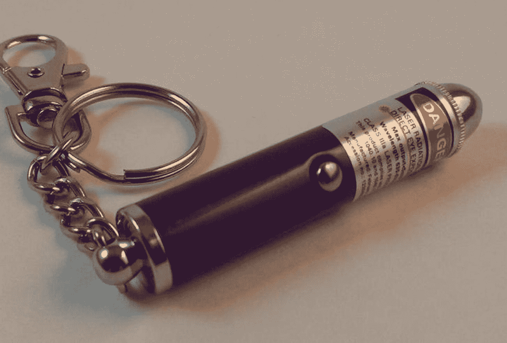
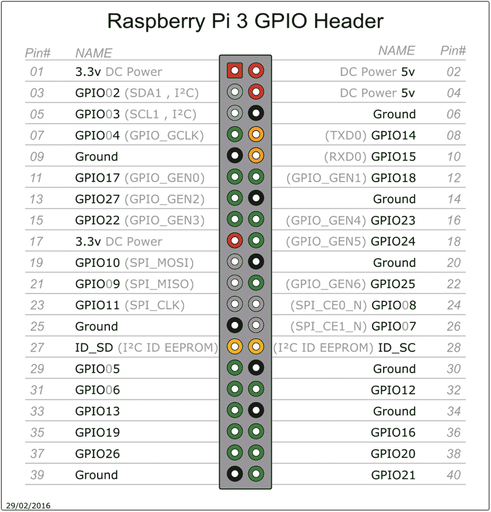
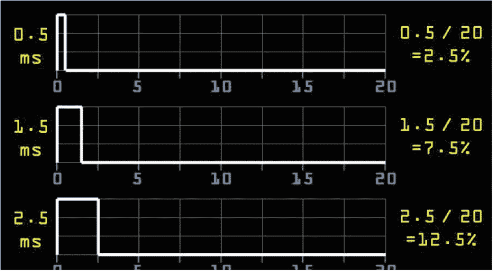
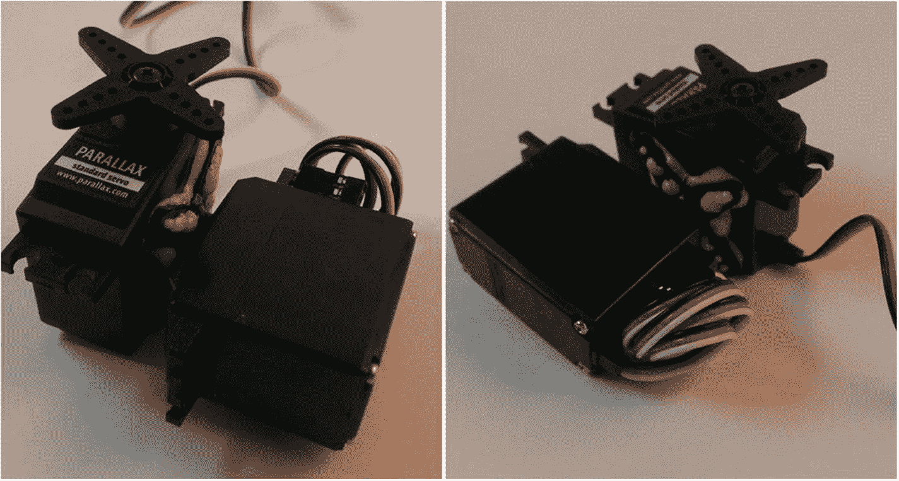
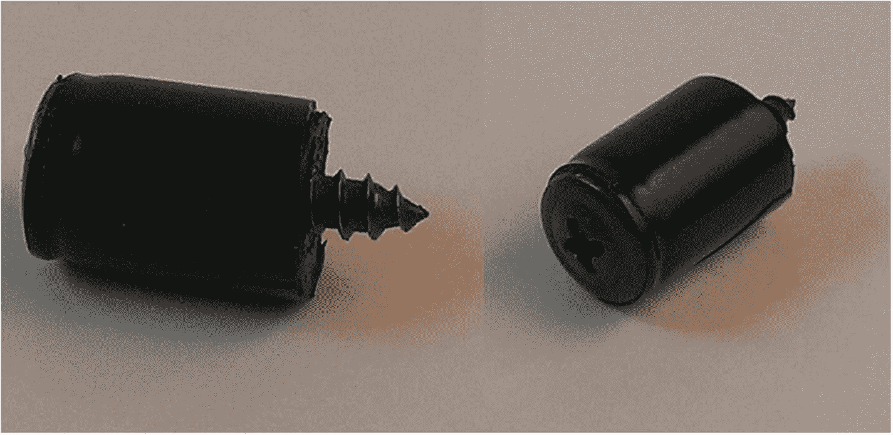
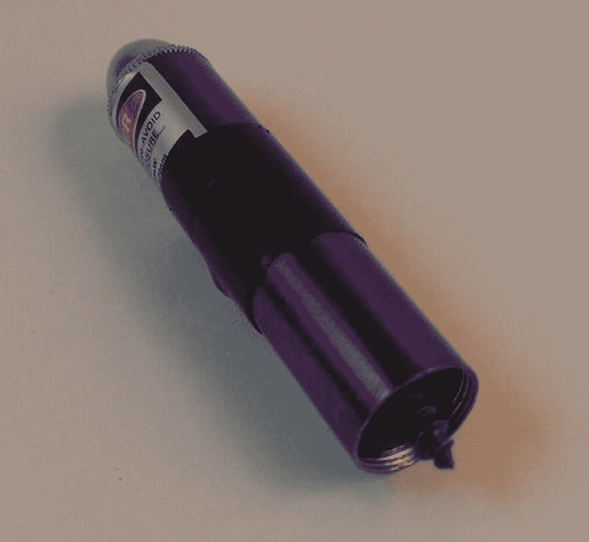
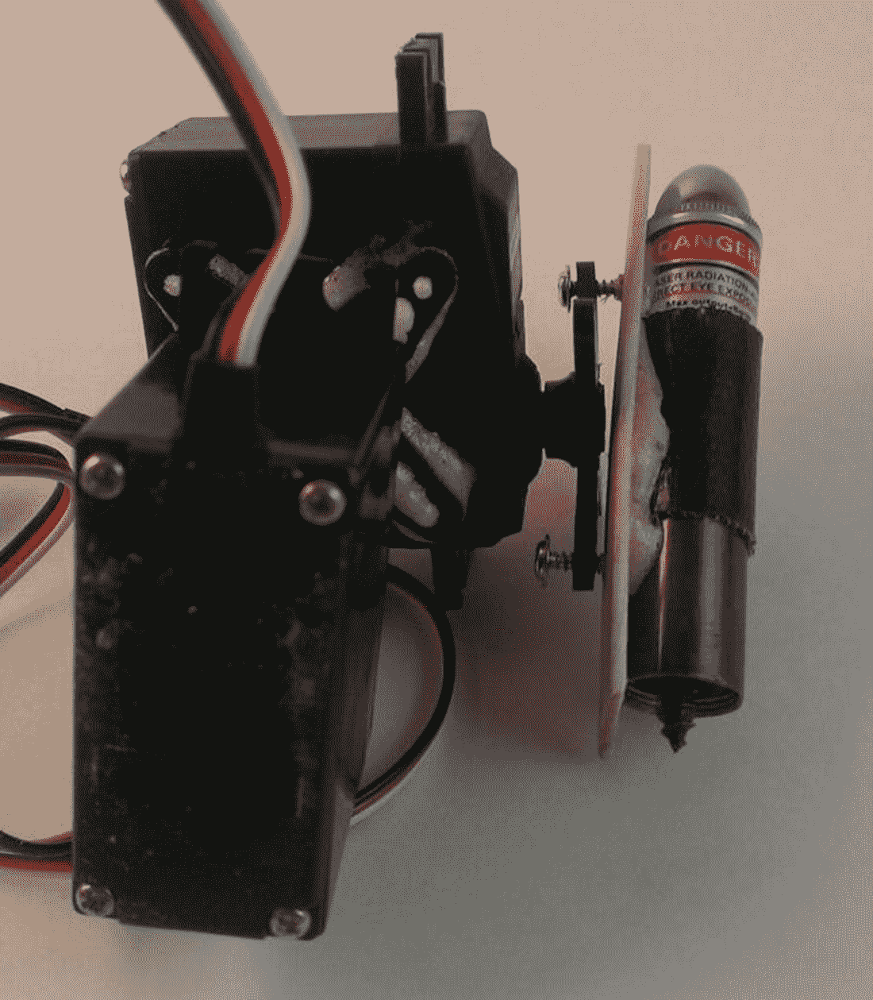
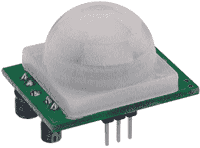
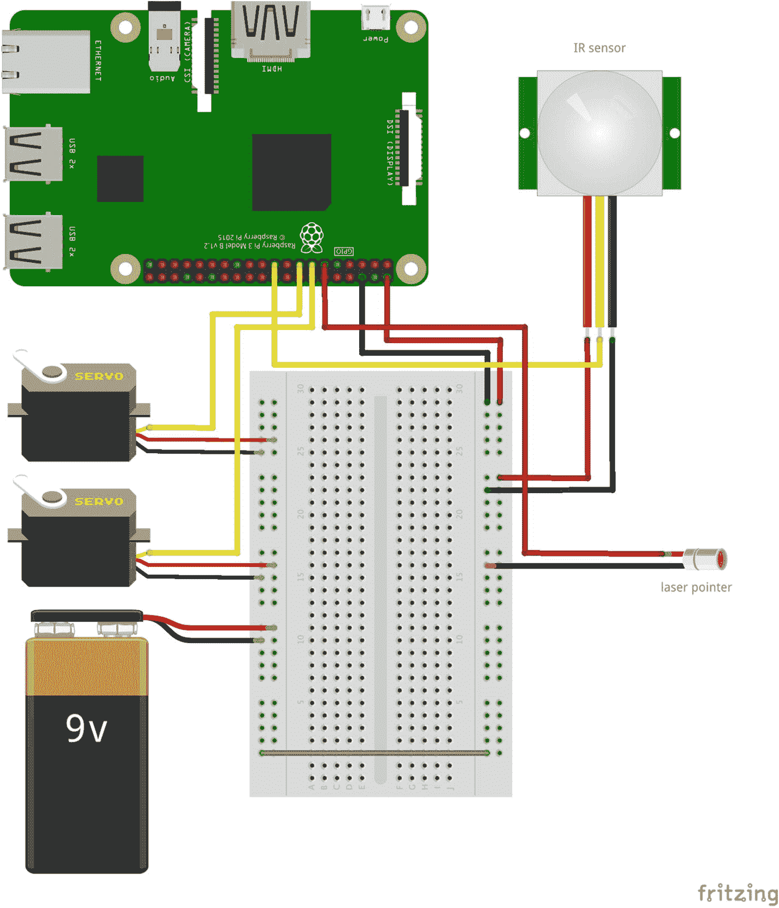
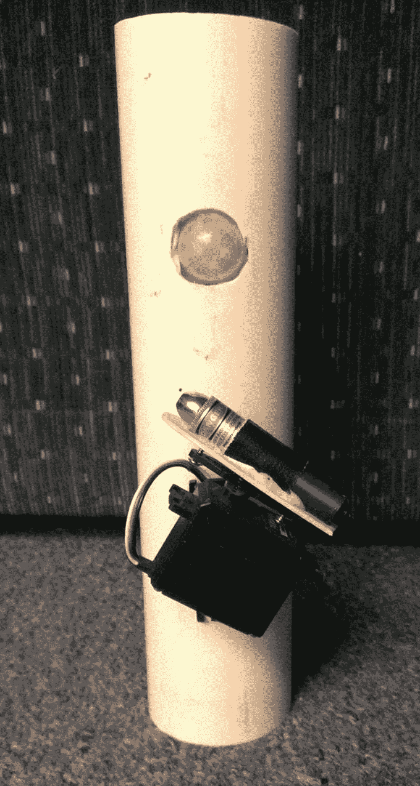

# 九、猫的玩具

大多数人都很熟悉“猫追小红点”的模式。它非常受欢迎，甚至在《怪物史莱克》的一部电影中有一个简短的场景。有些猫会追逐激光点，直到它们掉下来。有些人只会追逐一小会儿。无论如何，任何养猫的人都可能在某个时候和他们的猫朋友玩耍时使用了激光指示器。

但是如果你不在的时候可以逗逗你的猫不是很好吗？与你所想的相反，激光笔并不一定要由人来握持和控制。只需一点编程和机械工程魔法，你就可以拥有一个自主猫玩具。

然而，在我们将在本章构建的猫玩具项目中，我们不会就此罢休。我们就是*不能*。毕竟，不管你的猫在不在，让玩具一直动是没有意义的，不是吗？因此，我们将添加一些特殊的东西—红外传感器。这样，只有当你的猫在的时候它才会打开，当猫离开房间的时候它就会关闭。

你准备好了吗？让我们从获得制作猫玩具所需的零件开始。

## 零件购物清单

这只猫玩具的一个很好的特点是，除了简单和自制之外，零件实际上相当便宜。您将需要以下内容:



图 9-1

与猫玩具一起使用的普通激光笔

*   覆盆子馅饼

*   两个标准(*不是*连续)伺服系统——我推荐视差 900-00005 ( [`http://www.parallax.com/product/900-00005`](http://www.parallax.com/product/900-00005) )，但任何型号都可以

*   一个便宜的激光笔，你可以在宠物店花大约 10 美元买到(见图 [9-1](#Fig1)

*   PIR 运动传感器( [`http://parallax.com/product/910-28027`](http://parallax.com/product/910-28027) )

*   胶水/环氧树脂

*   其他电线(红色、黑色等)

*   平头螺钉

*   电工胶带

*   冰棒棍

*   9V 电池

*   一个可以装下所有东西的容器——我用了一小段 PVC 管

## 玩具背后的概念

让这个玩具工作的关键是*随机运动*。如果你给玩具编程做出一系列同心圆，一个接一个，然后重复图案，用不了多久，你的猫就能认出图案，并感到厌烦。然而，通过使用 Python 的`random`或`randint`函数，你可以随机化模式并让你的猫(可能还有你的小孩)开心。

另一件要记住的事情是，你将在两个轴上随机化运动——x 轴和 y 轴——同时将运动保持在一定的范围内(这是随机化函数的参数和伺服系统的运动极限出现的地方)。你将使用两个伺服系统，但它们将被连接在一起，以便控制一个激光笔的运动。为了控制伺服系统，就像本书中的其他几个项目一样，我们将使用 Pi 的 GPIO 管脚和 Python 的 GPIO 库。这个项目的另一个好处是，伺服系统消耗的能量如此之少，以至于它们可以用一个简单的 9V 电池供电。你仍然需要独立于 Pi 为它们供电(*总是*一个好主意，不管是什么项目)，但是你不需要像其他项目那样需要一个花哨的电池设置。

## 创建和使用随机数

你可能认为创建和使用随机数很简单。只需调用一个函数，获得一个随机整数，然后继续。虽然这可能是它在实践中的工作方式，也是我们大多数人所想到的，但随机化输出的实际过程非常有趣——这实际上是许多计算机科学家和数学家密集研究的主题。(参见侧栏“哦，随机性。”)要在 Python 中得到一个随机数，可以使用几个内置函数。第一个是`random()`函数。该函数返回一个浮点数(一个*浮点数*)。它没有参数，而是返回一个介于 0.0 和 1.0 之间的随机数。这通常非常有用，但出于我们的目的，我们需要更大的数字，最好是整数格式，这可以用`randint()`函数来完成。

### 哦，随机性

自古以来，人类就有许多产生“随机”数字的方法，从掷硬币、掷骰子到洗牌。对于大多数应用来说，这些都可以。如果需要决定谁先踢球，可以抛硬币；从 52 张牌中选择一张足够随机，当魔术师成功猜出它的身份时，它会给人留下非常深刻的印象。

然而，使用这些方法为任何真正的数学或统计工作生成随机数有两个主要问题。首先，它们都是基于物理系统——圆形硬币在空中的翻转，或多或少的方形骰子在不平坦的地面上的滚动。因为它们是物理系统，所以永远不可能是真正随机的。给定足够多的迭代，一个模式*将*最终基于系统中的缺陷开始出现。例如，一枚硬币，由于两面都刻有图案，所以在一面有轻微的重量偏差。如果你翻转的次数足够多，这个模式会在收集的结果中显示出来。它可能需要几百万或几十亿的翻转，但它会出现。同样，骰子永远不会是完美的正方形或完美的重量，在足够数量的滚动后，最终会偏向一侧。

这些生成随机数的方法的第二个问题是，它们花费太多时间。如果你需要一批一百万个随机数，你将会掷一枚硬币很长时间来得到所有这些数字。只是对于大批量数据来说不切实际。

但是计算机在处理大量的数字和数据方面表现出色，它们可以以令人难以置信的速度生成数据。一般的台式计算机理论上可以处理 70 亿次浮点运算。(也就是每秒 70 亿次浮点运算。)在这个速度下，生成一百万个随机数需要。。。让我想想。。。拿着这两个。。。除以黄色。。。嗯。。。大约 7 毫秒。比洗牌快多了。

然而，计算机也是物理系统。是的，你是从计算机中央处理器的“网络空间”中产生数字的，但是那个处理器是一个带有物理晶体管和导线的物理硅芯片。无论你用什么程序来生成这些随机数，它们最终都会显示出一种模式，表明它们不是真正的随机。因此，你可以看到数学家和科学家对随机数的兴趣。一个真正的随机数生成器在许多科学领域都非常有用，尤其是在密码学领域。大多数密码是基于随机散列码的；一个真正随机的代码将会更加难以破解，这也是人们如此感兴趣的原因之一。

当前的随机数生成器通过使用产生长串伪随机数的算法来工作，通常基于乘法和模数运算的组合。根据算法的质量，这样生成的数字可能是也可能不是加密的，尽管它们对于视频游戏这样的应用来说通常是足够随机的。换句话说，你用来生成随机数的算法可能不会阻止超级计算机破解代码的协同努力，但当你玩*使命召唤:我们都死在街区*六年级学生手中的那一天时，它足以产生对手。

这种生成过程就是为什么当您开始一个将使用随机数的程序时，您必须用另一个数“播种”随机数生成器，例如今天的日期或您计算机上的系统时间。随机种子只是一个用来初始化程序中随机数向量算法的数字。只要原始种子被忽略，后续的初始化应该提供足够的随机数。是的，最终会出现一种模式——这是不可避免的——但是随机种子发生器应该足够随机以满足大多数需求，尤其是随机运动的猫玩具。薛定谔的猫可能不会被愚弄，但你的猫应该被愚弄。(抱歉，这只是一个小小的物理幽默。)

根据 Python 文档，`randint(a, b)`返回一个随机数`n`，这样`n`就在`a`和`b`之间，包含这两个值。换句话说，下面的代码

```py
>>> import random
>>> x = random.randint(1, 10)
>>> print x

```

应该返回`1, 2, 3, 4, 5, 6, 7, 8, 9,`或者`10`。我们将用它来为我们使用的伺服系统生成位置。

### 注意

Python 文档可以在 [`http://docs.python.org`](http://docs.python.org) 找到。我强烈建议，当你学习语言的时候，养成查阅文档的习惯。您也可以在交互式 Python 提示符下键入`help(function)`来获得相同的阅读材料。

## 使用 GPIO 库

现在你已经知道我们如何生成随机数，你需要知道如何控制将连接到 Pi 的伺服系统。幸运的是，有一个专门为此目的设计的 Python 库，并且预装在 Pi 中。这个库使我们能够访问 Pi 的通用输入输出(GPIO)引脚，简称为`RPi.GPIO`。

如果您还没有安装 Python 开发库，那么您可能需要手动安装。首先，通过键入以下命令确保您的 Pi 是最新的

```py
sudo apt-get update

```

然后通过键入以下命令来安装这些包

```py
sudo apt-get install python-dev

```

我们现在可以开始键入这个项目的最终代码。记住，它可以从`Apress.` `com`作为`cat-toy.py`获得。现在，要访问 Pi，请在程序的第一行中调用以下内容:

```py
import RPi.GPIO as GPIO

```

然后，通过键入以下命令进行配置

```py
GPIO.setmode(GPIO.BOARD)

```

这使您可以根据标准引脚排列图上的标签来识别引脚，如图 [9-2](#Fig2) 所示。



图 9-2

GPIO 引脚的引脚排列

### 注意

请记住，对于`GPIO.setmode(GPIO.BOARD)`，当您提到引脚 11 时，您实际上指的是物理引脚#11，它在图 [9-2](#Fig2) )中转换为 GPIO17，*不是* GPIO11，它转换为物理引脚#23)。

一旦设置好模式，就可以将每个引脚设置为输入或输出。Arduino 的用户可能会认识到这里的概念，但这是您为 Pi 键入的内容:

```py
GPIO.setup (11, GPIO.OUT)
GPIO.setup (13, GPIO.IN)

```

等等。一旦将一个管脚设置为输出，就可以通过输入

```py
GPIO.output (11, 1)

```

或者

```py
GPIO.output (11, True)

```

随后，您可以通过输入以下命令将其关闭

```py
GPIO.output (11, 0)

```

或者

```py
GPIO.output (11, False)

```

我们将使用两个引脚进行伺服控制，一个引脚为激光笔供电，另一个引脚从红外传感器读取输入。

## 控制伺服系统

伺服系统是许多不同应用的重要组成部分，从无线电控制的车辆到高端机器人。从本质上讲，伺服系统只不过是一台 DC 发动机。然而，在软件的帮助下，你可以对电机的旋转进行非常精细的控制。例如，如果您需要它旋转 27.5 度，然后停止(假设伺服能够)，您可以通过编程向它发送该命令。

那么，如何利用 Pi 上的 GPIO 引脚实现这一点呢？不幸的是，你不能只是将伺服的信号线(通常是白色的)插入 GPIO 输出引脚，给它一个正负电压，然后期望它工作。有可能，但也有可能没有。

答案在于如何控制伺服系统。作为硬件的模拟部分，它们早于今天的大多数数字硬件，包括圆周率。它们使用脉宽调制(PWM)信号工作。要控制它们，你必须能够通过你正在使用的任何机制发送 PWM 信号，无论是 Arduino 引脚、串行电缆还是 Raspberry Pi 的 GPIO 引脚。如果你想设置一个伺服系统的位置，你需要给它发送规则的电流脉冲——每秒 50 次是平均脉冲速度——而不是一个长脉冲。如果你想知道，每秒 50 次相当于每 20 毫秒(ms)一次脉冲。

此外，脉冲的*长度*决定了伺服系统的位置。例如，每 20 毫秒发送一次的 1.5 毫秒的 *on* 脉冲将把伺服系统发送到中心位置。较短的脉冲会使它转向一个方向，而较长的脉冲会使它转向另一个方向。因此，通过精确计时发送给伺服系统的脉冲长度，可以精确定位伺服磁头。

图 [9-3](#Fig3) 中的图表最好地说明了这一点。



图 9-3

伺服系统的占空比

如果你想把伺服发送到中间“零”位置，你每 20 毫秒发送一个 1.5 毫秒的 *on* 脉冲，这可以被认为是 7.5%的*占空比*。同样，如果你想用 0.5 毫秒的 *on* 脉冲逆时针转动它，它的占空比为 2.5%，较长的 2.5 毫秒 *on* 脉冲转换为 12.5%的占空比。换句话说，在 2.5%、7.5%或 12.5%的时间里，伺服系统被给予“高”脉冲。

这些方向适用于标准— *而非*连续—伺服系统。不同之处在于，标准伺服系统使用脉冲的长度来确定它们的最终位置(以偏离中心的度数为单位)，而连续伺服系统使用脉冲的长度来确定它们应该转动的速度。标准伺服将移动到其目的地位置，然后停止，直到新的命令被发送；连续伺服几乎总是在移动，移动的速度由脉冲长度决定。虽然你可以为猫玩具使用任何一种类型的伺服系统，但使用标准伺服系统更有意义，因此既有精确定位的能力，又有完全停止的能力，让猫至少暂时“抓住”小红点。

然而，这种移动伺服系统的方法的问题是，很难使用 Pi 和 Python 向 GPIO 引脚发送毫秒级脉冲。像 Pi 上运行的所有其他进程一样，Python 不断被系统级运行的进程中断，至少可以说，这使得 Python 程序精确计时脉冲是不切实际的。然而，GPIO 库又一次提供了我们需要的东西:您可以使用该库将 GPIO 引脚设置为 PWM 引脚，赋予它向该引脚发送正确长度脉冲所需的占空比。

因此，虽然理论上有可能编写这样的脚本:

```py
while True:
    GPIO.output (11, 1)
    time.sleep (0.0015)
    GPIO.output (11, 0)
    time.sleep (0.0025)

```

如果成功的话，结果很可能完全出乎意料。相反，我们可以做的是使用`RPi.GPIO`库函数，通过输入以下命令，将伺服的信号引脚(此处示例中的引脚 11)设置为 PWM 输出引脚

```py
p = GPIO.PWM(11, 50)

```

在这种情况下，50 将脉冲设置为 50Hz(每 20 毫秒一个脉冲)，这是伺服工作所需的频率。然后，我们可以通过键入以下命令将引脚的占空比设置为 7.5%

```py
p.start (7.5)

```

如果我们将`p.start(7.5)`放在一个`while`循环中，结果是伺服将移动到中心位置，然后停留在那里。用`p.ChangeDutyCycle()`改变占空比将允许我们在不同的方向上移动伺服系统，这就是我们对猫玩具的追求。因此，例如，要查看您的伺服来回移动，请尝试以下脚本:

```py
import RPi.GPIO as GPIO
import time

GPIO.setmode (GPIO.BOARD)
GPIO.setup (11, GPIO.OUT)

p = GPIO.PWM (11, 50)
p.start (7.5)

while True:
    p.ChangeDutyCycle (7.5)
    time.sleep (1)
    p.ChangeDutyCycle (12.5)
    time.sleep (1)
    p.ChangeDutyCycle (2.5)
    time.sleep (1)

```

运行这个脚本应该使你的伺服来回扫描，在每次方向改变之间暂停一秒钟。

留给我们的猫玩具脚本的就是实现一些随机数。这些数字将决定哪个伺服移动，在哪个方向，以及多长时间。结果应该是一个相当随机的二维路径。

## 构建伺服机制

我们的猫玩具将在两个方向上扫描激光笔，这意味着我们需要一个能够做同样事情的伺服系统。虽然伺服系统通常不能进行二维运动，但我们可以使用两个相互连接的普通伺服系统轻松构建一个云台伺服机构。

### 注意

这个过程将永久地结合你的两个伺服系统，使它们不可分割，所以请确保你有其他人用于其他项目。但是，请记住，像您在这里制作的平移-倾斜设置对于需要在二维空间移动项目来说是一个方便的东西，您可能会再次使用它。所以，这并不是说你完全破坏了两个伺服系统。

你所需要做的就是把一个伺服机构的主体安装到另一个伺服机构的角上。为了建立安全的连接，您可能需要拆下固定底座伺服系统(为了简化任务，我们称之为 x 轴伺服系统)伺服角的螺钉，并将塑料锉平一点。您正在尝试尽可能展平伺服的顶部，使其与另一个(y 轴)伺服的主体紧密配合。

当它尽可能平整时，使用强力环氧树脂或粘合剂将 y 轴伺服机构粘合到 x 轴伺服机构的角上。我使用大猩猩胶水，得到了如图 [9-4](#Fig4) 所示的结果。



图 9-4

粘合的 x 和 y 伺服系统

激光笔现在可以(经过一些不那么小的修改)安装到顶部(y 轴)伺服。

## 构建激光机制

我们将使用标准的激光笔，但我们将在几个重要方面对其进行修改。最重要的方式是，我们将使用 Pi 的 GPIO 引脚供电，而不是使用电池。这很重要，因为它使我们能够通过编程来打开和关闭激光器，而不是通过摆弄按钮开关。

要改装激光笔，你需要一些绝缘胶带和一个大约两英寸长的平头螺钉，螺钉头比激光笔的内径稍小一点。用绝缘胶带包裹螺丝，使其紧贴指针内部。如果有必要，当你完成后，切断胶带的末端(如图 [9-5](#Fig5) 所示),这样螺钉的尖端就露出来了。



图 9-5

激光笔的螺旋机构

拆下激光笔的底座，取出电池。首先将螺钉头推入指针主体，使螺钉头向下推动通常由电池压住的内部弹簧。你可能不得不玩弄你用来包裹螺丝的胶带的数量；你希望它足够紧，能够压下弹簧并保持在原位，而不会有移动的危险。

我们还需要用胶带把激光笔的电源按钮粘住，这样它就会一直开着。如我所说，我们将负责从 Pi 给指针供电。用一条胶带包住指针，按住按钮。

此时，你应该有类似于图 [9-6](#Fig6) 中图像的东西。



图 9-6

完整的激光指示器机构

如果你想测试你的工作(不是一个坏主意)，使用几个鳄鱼夹连接螺丝的点到引脚 6(接地引脚)，然后连接指针的身体到引脚 1 (3.3V)。激光器应该亮起，表明您直接从 Pi 的电源引脚为其供电。如果什么都没发生，确保螺丝头压在弹簧上，电源按钮用胶带牢牢固定，所有连接都很牢固。一旦连接牢固，你就可以把激光安装到你的二维伺服装置上了。

## 将激光器连接到伺服系统

将激光器连接到伺服系统可能是这个项目中最简单的部分。如果你和我一样，你不会想把激光永久地连接到你的云台伺服系统上，因为这个系统可以在其他项目中派上用场。所以，我们需要找到一种方法来*暂时*把激光附加到伺服喇叭上。

我用一根冰棒棒把它拉下来。我们可以把激光粘在冰棒棍上，然后把棍拧到伺服喇叭上。这可以用伺服系统附带的螺丝来完成(你还有它们，不是吗？)或者你能在车间里找到的最小的螺丝钉。相信我——那些是伺服喇叭上非常小的孔。

使用强力胶(同样，我喜欢大猩猩胶)，将激光组件粘贴到冰棒棍上。当该区域干燥时，使用小螺钉将冰棒棒连接到伺服喇叭上。当你完成后，你应该有一个看起来像图 [9-7](#Fig7) 的设备。



图 9-7

安装在伺服系统上的激光器

这里需要注意的是:花一些时间定位激光笔及其相关的伺服系统，这样无论两个伺服系统在循环中的哪个位置，激光都可以自由旋转。显然，最简单的方法是移除将伺服喇叭固定在伺服系统上的螺钉，并根据伺服系统的行程弧线重新定位喇叭。然后，运行两个伺服通过所有可能的位置，并确保您的机制没有绑定在其运动的任何一点。由于标准的伺服系统只能通过大约 180 度的圆弧，你*应该*能够为所有部件找到一个合适的位置。

这个项目的最后一个组成部分是连接运动传感器。

## 连接运动传感器

运动传感器(如图 [9-8](#Fig8) 所示)不仅能节省你的电池，还能极大地促进*的酷*因素:只有当你的猫(或狗，或室友，或大脚野人)靠近它时，你的玩具才会打开。



图 9-8

视差红外传感器

连接红外传感器很简单:正极和负极引脚连接到电源，第三个引脚(图 [9-8](#Fig8) 中最左边的引脚)连接到配置为输入的 Pi 的 GPIO 引脚之一。当传感器检测到运动时，它会在输出引脚上输出一个高电平信号，然后该信号会传输到 Pi 的输入引脚。通过将 GPIO 引脚配置为输入，我们可以读取该信号，并仅在该信号出现时执行控制玩具的 Python 脚本。

在我们继续之前，我需要讨论一下*上拉电阻*或*下拉电阻*的重要概念，我在前一章中也谈到过。每当电子设备中有输入时，如果该输入不直接读取任何内容，则称为*浮动输入*。这意味着从该输入中读取的值绝对可以是任何值。我们需要定义输入的“空”状态，以便我们知道输入何时改变。

为了定义输入的“空”状态，我们通常在输入和正引脚(从而产生一个*上拉*电阻)或地(从而产生一个*下拉*电阻)之间连接一个电阻(10K 或 100K 是常见值)。使用哪一种并不重要，重要的是输入被拉高或拉低。因此，如果引脚上没有读取任何内容，并且它通过一个下拉电阻接地，则读数为“0”当它不再显示“0”时，我们就知道它正在接收输入。

对于我们的 IR 传感器，我们需要将未检测到运动时引脚上的读数定义为“低”，因此我们将使用一个下拉电阻。幸运的是，为了使这个过程简单，GPIO 库允许我们在代码中将一个引脚定义为输入时这样做，就像这样:

```py
GPIO.setup(11, GPIO.IN, pull_up_down=GPIO.PUD_UP)

```

如果我们将 IR 传感器的 OUT 引脚连接到 Pi 上的引脚 11，并用前面的代码行初始化该引脚，则在检测到移动之前，引脚 11 上读取的所有内容都将为“低”。在这一点上，引脚将读取“高”，我们可以调用打开激光器并移动它的功能。

为了测试传感器和我们的编码能力，我们将相应地设置 GPIO 引脚。我们可以使用一个简单的设置来测试我们的代码；当传感器跳闸时，试验板上的 LED 会亮起。在 Python 脚本中，输入并保存以下代码:

```py
import RPi.GPIO as GPIO
import time

GPIO.setwarnings (False) #eliminates nagging from the library
GPIO.setmode (GPIO.BOARD)
GPIO.setup (11, GPIO.IN, pull_up_down=GPIO.PUD_UP)
GPIO.setup (13, GPIO.OUT)

while True:
    if GPIO.input (11):
        GPIO.output (13, 1)
    else:
        GPIO.output (13, 0)

```

测试代码到此为止！要测试代码和传感器设置，首先将传感器上的(+)引脚连接到 Pi 上的#2 引脚。将 OUT 引脚连接到 Pi 上的引脚#11。将(–)引脚连接到试验板上的公共地线。最后，将 Pi 上的 13 号引脚连接到一个电阻，然后连接到 LED 的正极引脚，并将 LED 的负极引脚连接到公共接地线。您应该会得到类似于图 [9-9](#Fig9) 中所示的配置。


图 9-9

红外传感器和 LED 测试设置

### 注意

图 [9-9](#Fig9) 中的图像是用 Fritzing ( [`http://www.fritzing.org`](http://www.fritzing.org) )创建的，这是一个伟大的开源试验板/设计工具。它是跨平台的，非常容易使用和学习，强烈推荐。

当您运行脚本时(记住以超级用户身份执行代码，或者 *sudo* ，因为您正在访问 GPIO 引脚)，当您在传感器周围移动您的手时，LED 应该会亮起，然后在几秒钟不动后再次熄灭。如果不起作用，检查你的连接和你的零件；相信我，烧坏的 LED 会导致各种令人头疼的故障排除问题！

如果一切按计划进行，我们现在可以给玩具布线并完成所有连接。

## 连接所有的位

在您成功测试了红外传感器、操作它所需的代码以及用于操作伺服系统的代码之后，当所有东西都连接到其他东西时，就该将所有东西都连接起来并进行所有连接了。这就是小型试验板派上用场的地方——你可以将所有的地面连接在一起(绝对必要的),并根据需要为所有东西供电。我使用了 9V 电池的两个伺服，但你可以随意尝试不同的电池。在这种情况下，没有必要像我们在其他一些项目中那样使用可充电的 RC 电池，因为重量不是一个真正的问题，而且伺服系统不会太快耗尽电池，因为它们不是一直在运行——这要归功于传感器。然而，你*确实*需要用一个独立的电源给伺服系统供电，而不是你用来给 Pi 供电的电源；否则，你可能会得到不断冻结和崩溃。对于具有两个电源通道的试验板，您可以将+9V 沿一个正极通道向下，将 Pi 上的 2 号引脚连接到另一个正极通道，然后将两个负极连接在一起。然后，您可以将激光电源和红外传感器电源连接到 Pi 的电源通道，并将两个伺服系统连接到 9V 电源通道，这样您的所有地线就会连在一起。参见图 [9-10](#Fig10) ，图中显示了使用试验板连接在一起的各个部件。



图 9-10

最终组件连接

图 [9-10](#Fig10) 并不*完全*准确，因为激光笔是物理连接到伺服系统的，但你可以看到电气连接。指针由引脚#11 供电，伺服系统由引脚#13 和#15 供电，引脚#19 是传感器输入。然后，每样东西都被赋予各自的电压使其工作。

有几个机械工程任务涉及到这个玩具的建设，至少是最好的方法来永久连接电源和地线的激光笔。虽然鳄鱼夹很适合测试，但一旦伺服系统开始将指针急拉成圈，它们就要被取消了。

最好的解决办法是将电线焊接到指针部分。如果可以，用砂纸打磨螺丝和指针外壳的尖端。如果有空间，在指针外壳上钻一个小孔来固定正极导线。然后，附上你的电线和焊接一切。您的结果可能会有所不同，这取决于您的焊接能力和您正在使用的材料。你甚至可以使用胶水，只要你不要让电线和指针部件的金属触点之间沾上胶水。所有的电线都必须连接牢固，这一点很重要。

最后一步是将整个设备安装在某种容器中，以保持其位置，并保护机器的内脏免受猫科动物的研究。你可以保留所有的部分，只要它不被最终用户(你的猫)发现。我倾向于在这种情况下使用 PVC 管，因为标准的伺服系统几乎完全适合两英寸内径的 PVC 管。在这种情况下，您可以将较低的伺服安装到管道的边缘，大多数电线和内脏可以安全地存放在里面，并在侧面钻一个孔用于红外传感器。Pi 不适合，但可以安全地存放在一个单独的盒子里，通过长跳线连接到管道组件。如果您决定使用 Pi Zero(它完全能够运行这段代码)，它也将适合管道内部，因此这可能是需要考虑的事情。

希望你最终得到一个看起来像图 [9-11](#Fig11) 的猫玩具。



图 9-11

成品猫玩具

不好看，但是你的猫不会在意。当然，它可以用管子末端的盖子和一层油漆来装饰。可能要记住的最重要的细节(这里没有显示)是隐藏内脏和电线，以免被窥探(和爪子)。我在这里使用的 PVC 管太窄了，但是一个具有较大横截面的管可以很容易地与 Pi 和它内部的所有其他内容相配合，从而形成一个独立的单元。然后，你可以给外面加个电源开关，就万事俱备了。

应该就是这样！执行`cat_toy.py`脚本现在应该可以让你的猫朋友(很可能是你的人类朋友)开心几个小时。值得注意的是，你现在有知识和能力用你的树莓派瞄准并发射激光 T2。是的，它是一个小得可怜的激光笔，但这个概念可以很容易地应用于任何激光器，无论大小或功率。*任何*激光。

玩得开心！

## 最终代码

这段代码可以在`Apress.com`网站上以`cat-toy.py`的名字获得，它设置 GPIO 输出引脚，为随机数发生器播种，然后旋转伺服系统，以随机运动的方式点亮激光器。

```py
import RPi.GPIO as GPIO
import time
import random
random.seed()

#set pins
GPIO.setmode (GPIO.BOARD)
GPIO.setwarnings (False)
GPIO.setup (11, GPIO.OUT) #laser power
GPIO.setup (13, GPIO.OUT) #X-servo
GPIO.setup (15, GPIO.OUT) #Y-servo
GPIO.setup (19, GPIO.IN, pull_up_down=GPIO.PUD_UP) #in from IR

#setup servo pwm
p = GPIO.PWM (13, 50)
q = GPIO.PWM (15, 50)

#set both servos to center to start
p.start (7.5)
q.start (7.5)

def moveServos():
    "Turns on laser and moves X- and Y-servos randomly"
    lightLaser ()

    p.ChangeDutyCycle (random.randint (8, 12))
    time.sleep (random.random())
    q.ChangeDutyCycle (random.randint (8, 12))
    time.sleep (random.random())

    p.ChangeDutyCycle (random.randint (3, 5))
    time.sleep (random.random())
    q.ChangeDutyCycle (random.randint (3, 5))
    time.sleep (random.random())

    dimLaser ()

def lightLaser():
    GPIO.output (11, 1)

def dimLaser():
    GPIO.output (11, 0)

#main loop
while True:
    #check for input from sensor
    if GPIO.input (19):
        moveServos()
        time.sleep (0.5) #wait a half sec before polling sensor
    else:
        dimLaser()
        time.sleep (0.5)

```

## 摘要

在这一章中，你成功地构建了一个两轴伺服机构，黑了一个要被树莓派发射的激光笔，并利用你的编程技能随机指向并发射激光来娱乐你的猫。

在下一章，我们将把你的圆周率拿出房子，用无线电控制的飞机把它送上天空。