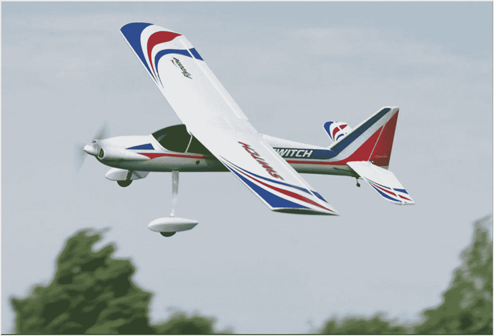
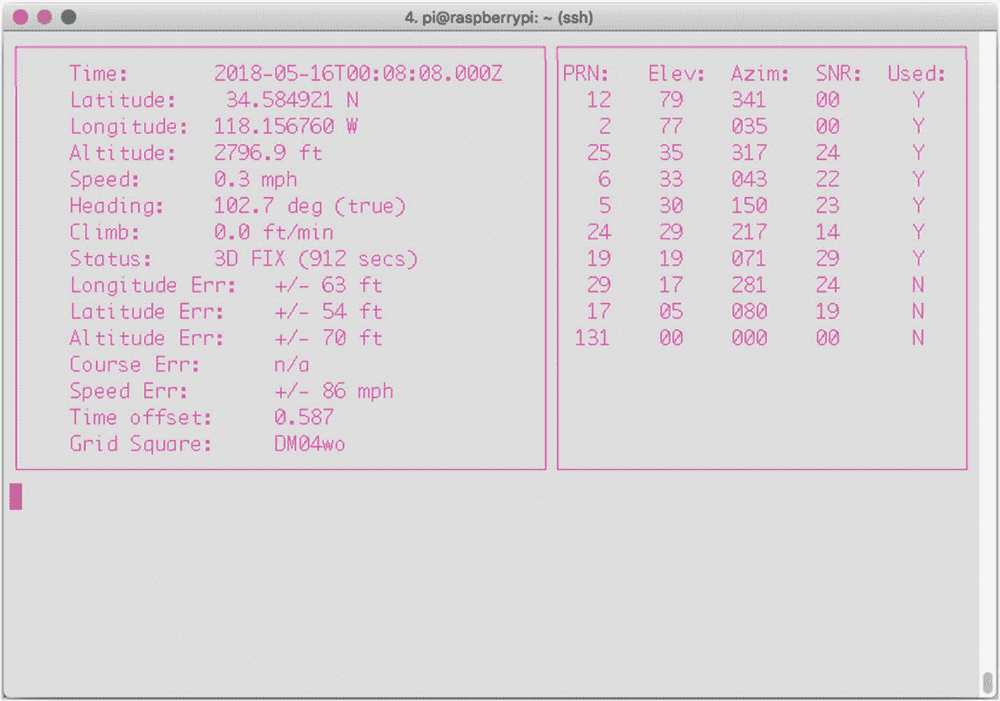
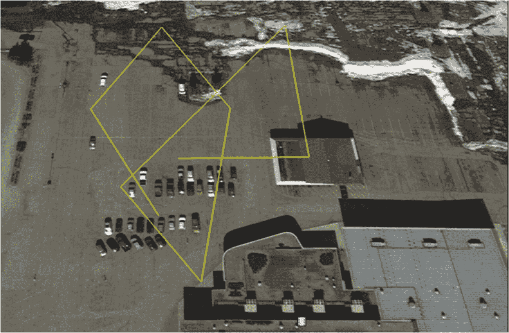
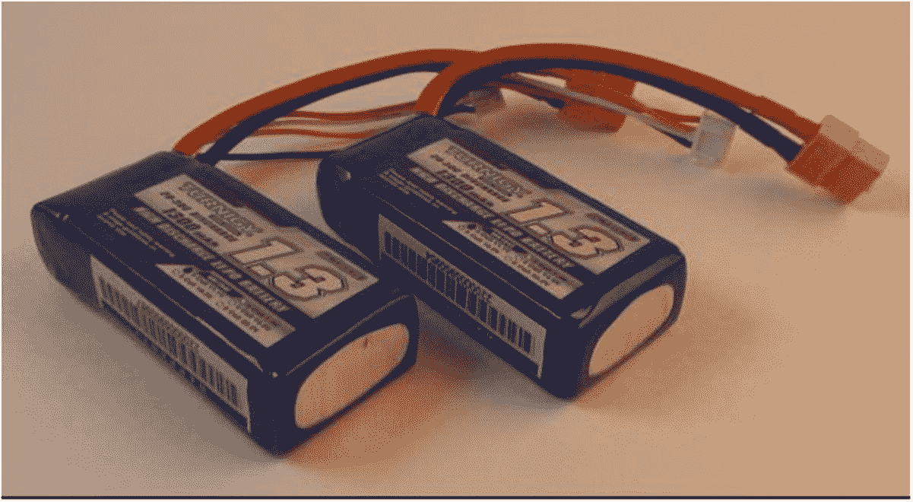
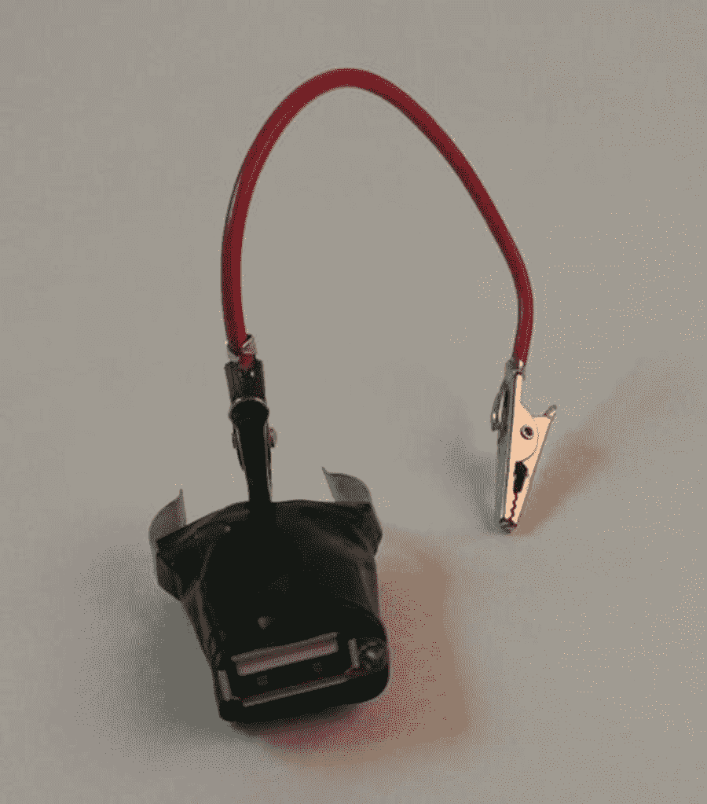
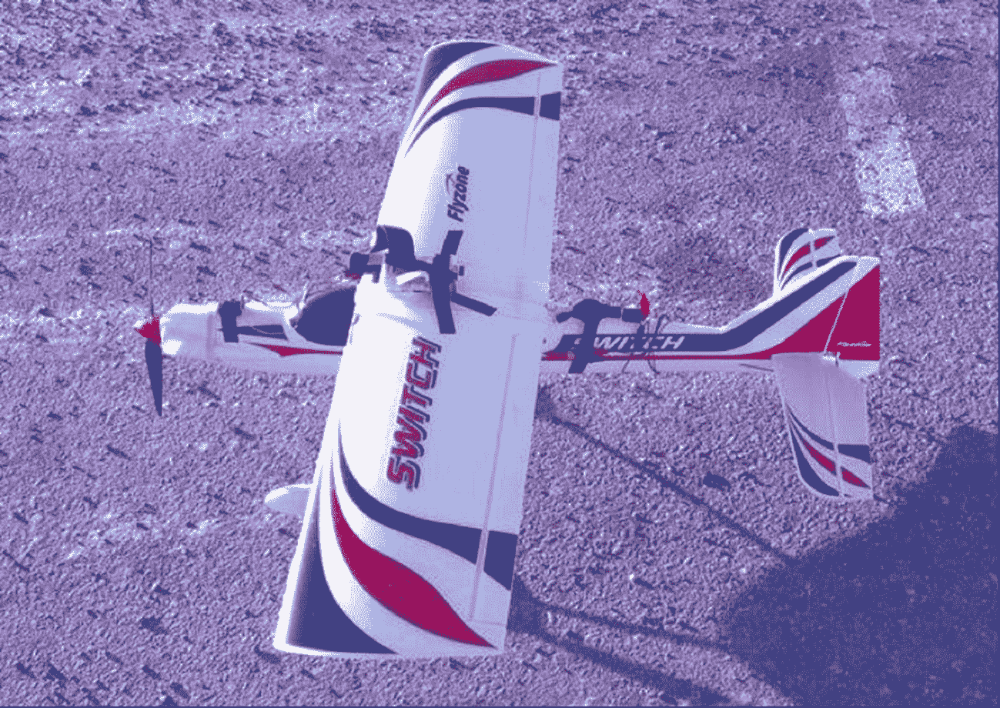
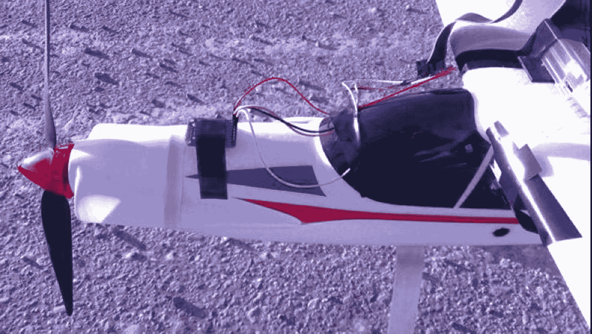
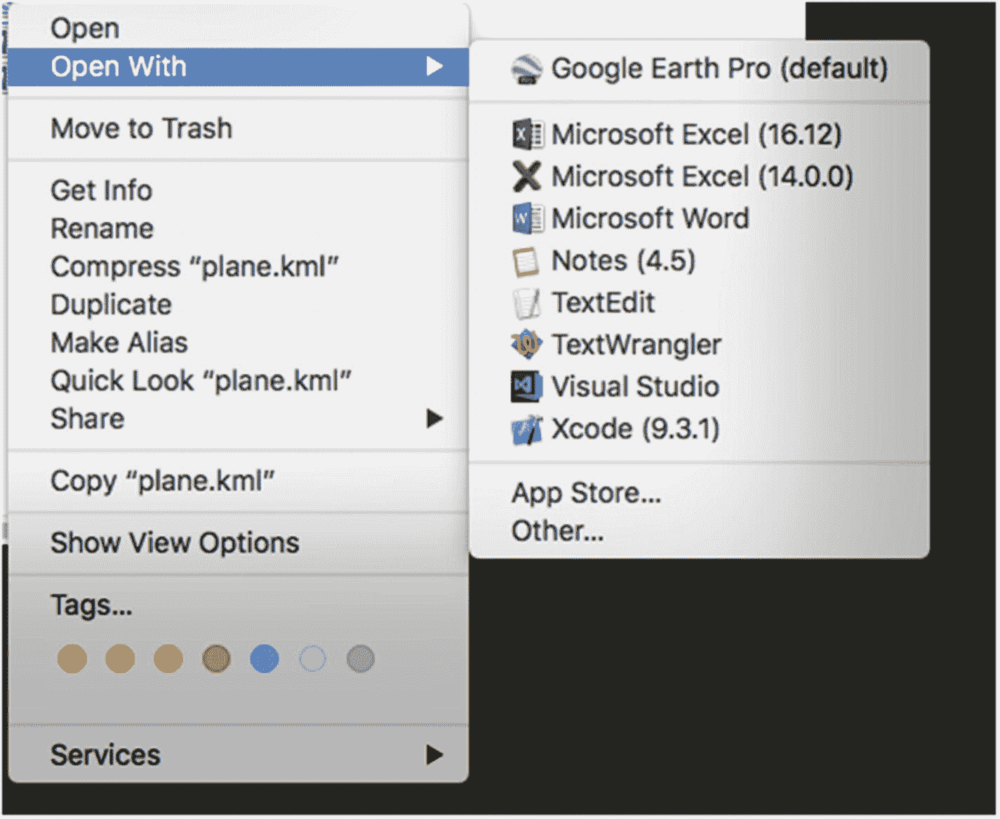

# 10.无线电控制的飞机

我们许多人长久以来都梦想着飞翔，梦想着在空中翱翔，像鸟儿一样自由。或者，就像飞行员小约翰·马吉所说的那样，挣脱“地球粗暴的束缚”，用“镀银的翅膀”在天空中舞蹈，轻松优雅地登上“狂风呼啸的高峰”

不幸的是，摆脱地球的束缚通常需要我们没有的时间和金钱，这可能部分解释了无线电控制(RC)飞机的出现。虽然我们可能负担不起地面或飞行学校的费用，但 1:12 比例的 Piper Cub 可以让我们感觉不那么踏实，我们有机会驾驶真正的飞机，而不必离开陆地。

然而，问题是，虽然我们可以从地面控制飞机，但这并不完全像真的在那里。虽然有复杂、昂贵的方法将小型摄像机连接到你的遥控飞机或无人机上，但如果你可以用你的 Pi 做类似的事情，那就太好了。如果你能跟踪你的飞行，然后将坐标加载到谷歌地球上，看看你的飞行是什么样子，那将会非常酷。

在这个项目中，你可以做到这一点。这个项目的计划是将 Pi、摄像机和 GPS 接收器放在一架遥控飞机上，然后驾驶它。Pi 的摄像头将在飞行过程中拍照，GPS 将记录位置数据。然后，当你回家时，你将使用一个 Python 脚本将位置数据解析成一个可以上传到 Google Earth 的 KML 文件。

### 注意

这一章包含了一些高级的编程概念——可能比你到目前为止遇到的任何东西都要高级，比如线程，甚至一点点面向对象编程(OOP)。但是它们并不复杂，我会在概念出现时解释它们。

## 零件购物清单

虽然这个项目不需要很多零件，但它实际上可能是本书中最昂贵的项目，因为它需要一架中型无线电控制(RC)飞机。以下是您需要的一些附加零件:

*   树莓派(带摄像头)

*   GPS 接收器( [`https://www.adafruit.com/products/746`](https://www.adafruit.com/products/746) )

*   接收机天线(可选)( [`https://www.adafruit.com/products/851`](https://www.adafruit.com/products/851) 和 [`https://www.adafruit.com/products/960`](https://www.adafruit.com/products/960) )

*   中型遥控飞机

*   RC 电池和 5V 调节器为 Pi 供电

如果你碰巧已经是一个遥控爱好者，你很可能有一架飞机可以使用，但如果你是这项运动的新手，你需要购买一架好的入门飞机。作为一个业余爱好者，我可以推荐一个不错的初学者飞机 Switch，由 Flyzone(如图 [10-1](#Fig1) )提供。



图 10-1

开关(图像飞行区飞机在 [`http://www.flyzoneplanes.com`](http://www.flyzoneplanes.com) )

这架飞机足够坚固，足以承受你学习驾驶时的几次碰撞，足够稳定，足以让一个完全的初学者驾驶，最重要的是，足够强大，可以承载 Pi、GPS 接收器和电池的额外重量。它的名字来源于这样一个事实，当你越来越擅长飞行时，你可以将机翼从稳定的“顶部”配置移开，并将其切换到更低的“中间”配置，以进行更多的特技飞行。正如你将看到的，“顶部”配置是完美的，不仅因为它对初学者来说很容易，而且因为 Pi 和 GPS 可以舒适地位于机翼顶部。

准备好了吗？让我们首先为我们的 plane 程序创建一个目录:

```py
mkdir plane

```

然后通过键入`cd plane`导航到其中。

现在，让 Pi 与我们的 GPS 设备通信。

## 将 GPS 接收器连接到 Pi

要让您的 Pi 与 GPS 接收器对话，您首先需要连接两者。为此，我们将使用名为`gpsd`的 Python 库和 Pi 的 UART(通用异步接收器/发送器)接口(引脚 7 和 8)。Python `gpsd`模块是一个更大的代码库的一部分，旨在允许 Pi 等设备监控连接的 GPS 和 AIS 接收器，并具有 C、C++、Java 和 Python 的端口。它允许您“读取”由大多数 GPS 接收器传输的国家海洋电子协会(NMEA)格式的数据。

UART 接口是一个老接口。它基本上是一个串行(RS-232)连接，但对于我们的目的来说，这就是我们所需要的。它由电源的正极(+)和负极(-)连接以及发送和接收引脚组成。首先输入下面一行，安装读取 GPS、`gpsd`及其相关程序所需的软件:

```py
sudo apt-get install gpsd gpsd-clients python-gps

```

接下来，我们需要禁用默认的`gpsd systemd`服务，因为我们安装的服务应该会覆盖它。用...做这件事

```py
sudo systemctl stop gpsd.socket
sudo systemctl disable gpsd.socket

```

现在，我们需要禁用串行 getty 服务:

```py
sudo systemctl stop serial-getty@ttyS0.service
sudo systemctl disable serial-getty@ttyS0.service

```

我们还需要强制 Pi 的 CPU 使用固定频率，并启用 UART 接口。通常，CPU 的频率会根据负载而变化，但不幸的是，这可能会影响 GPS 模块等敏感项目。这将稍微影响您的 Pi 的性能，但您不太可能会注意到很大的差异。为此，编辑`/boot/config.txt`文件:

```py
sudo nano /boot/config.txt

```

并将最后一行从

```py
enable_uart=0

```

到

```py
enable_uart=1

```

现在，通过键入以下命令重新启动

```py
sudo shutdown –r now.

```

当您重新启动并运行时，将 GPS 接收器连接到 Pi，如下所示:

*   将接收器的 VIN 连接到 Pi 的 5V(引脚#2)。

*   将 GND 连接到 Pi 引脚 6。

*   将 Rx 连接到 Pi Tx(引脚#8)。

*   将 Tx 连接到 Pi Rx(引脚#10)。

当接收器的 LED 开始闪烁时，你就知道你有电了。我们使用的 GPS 接收器有两种闪烁速率。当它通电但没有 GPS 定位时，它每秒钟闪烁一次。当它被定位时，它每十五秒闪烁一次。

当你有了一个补丁，你可以测试你的`gpsd`程序。进入

```py
sudo killall gpsd

```

(终止任何正在运行的实例)然后

```py
sudo gpsd /dev/ttyS0 -f /var/run/gpsd.sock

```

然后，通过键入以下命令启动通用 GPS 客户端

```py
cgps -s

```

客户端是一个普通的查看器；它只是获取`gpsd`程序正在接收的数据并显示给用户。

数据开始流动可能需要一段时间，但当它开始流动时，你应该会看到如图 [10-2](#Fig2) 所示的屏幕。



图 10-2

`cgps`流

如果你只看到零，就意味着 GPS 找不到卫星定位。你可能要等几分钟，甚至给 GPS 一个清晰的天空视野。我的经验是，这种特殊的 GPS 板，即使没有可选天线，也非常敏感。当我添加天线时，即使在我的房子里，接收 GPS 信号也没有问题。(按“Q”停止流并返回到终端提示符。)

一旦我们知道 GPS 单元正在工作并与 Pi 通信，我们就需要将该信息转换成可以在日志文件中使用的格式。虽然我们在这里使用的通用客户端`cgps`对于查看坐标和测试连接很有用，但不幸的是很难从中获得有用的信息。出于这个原因，我们将使用 Python `gps`模块与接收者进行交互。

### 注意

`gps`模块允许你与许多不同的 GPS 接收器通信，而不仅仅是我们在这个项目中使用的那个。有一些接收器产生专有数据流，但大多数接收器输出的是与我们这里使用的芯片相同的 NMEA 格式数据。

## 设置日志文件

当我们从 GPS 获得流时，我们需要有一个地方来存储它以备后用，因为如果我们只是在飞行中将其打印到(非连接的)屏幕上，它不会给我们带来太多好处。我们可以做的是使用 Python 的日志模块建立一个日志文件，然后，当 Pi 返回地面时，我们可以解析该文件并将其转换成我们可以在 Google Earth 中使用的格式。

设置日志文件非常简单。从输入开始

```py
import logging
logging.basicConfig(filename='locations.log', level=logging.DEBUG, format='%(message)s')

```

这两行导入模块，声明日志的文件名和记录的内容，并给出每行的格式。我们将把每个 GPS 呼叫保存为三个字符串:经度、纬度和高度 Google Earth 使用的三个坐标。(它们实际上是作为浮点数保存的，而不是字符串，这意味着当我们将它们写入日志文件时，我们必须将它们转换成字符串。)向日志文件中写入一行，格式很简单:

```py
logging.info("logged message or string or what-have-you")

```

没有必要使用换行符(`\n`)，因为每次调用`logging.info()`函数时，它都从新一行开始。

如果您想知道，是的，我们可以简单地将 GPS 数据写入一个常规文件，但是日志是一个重要的、有用的概念，许多程序员要么没有完全理解，要么完全跳过。对于 Python 的日志模块，您可以根据被跟踪事件的严重程度设置要输入的日志条目。可能有五种严重性:调试、信息、警告、错误和严重。

### 五个严重程度(级别)

虽然我使用术语*严重性*来描述日志条目，但也许*级别*可能是一个更好的术语。当一个程序执行时(不管它是用什么语言编写的)，它通常会生成可以被日志模块记录的事件。调试事件是详细的，通常仅用于诊断问题。信息事件是事情正常工作的确认。警告事件就是这样做的——它们警告说，虽然事情还在运行，但在不久的将来可能会出现问题。错误和关键事件只有在某些东西中断时才会发生，而关键通常意味着程序无法继续工作。默认级别是警告，这意味着除非您以不同的方式设置您的日志记录功能，否则被赋予调试或信息严重性的事件(因为它们低于警告的*)将不会被记录。*

要查看运行中的日志模块，键入`python`启动 Python 提示符并输入以下内容:

```py
>>> import logging
>>> logging.warning("I am a warning.")
>>> logging.info("I am an info.")

```

第二行将输出

```py
WARNING:root:I am a warning

```

而分类为信息级别的第三行将不会被发送到控制台。另一方面，如果你进入

```py
>>> logging.basicConfig(level=logging.DEBUG)

```

它将默认级别设置为 DEBUG，这意味着无论严重性如何，每个事件都将被记录或输出。输入文件名和格式，就像我们前面所做的那样，设置日志文件以及如何将事件写入其中。

### 注意

记录事件对于任何程序员来说都是一项重要的技能；如果你想更深入地了解 Python 的日志模块，我强烈推荐你阅读位于 [`http://docs.python.org/2/howto/logging.html`](http://docs.python.org/2/howto/logging.html) 的 Python 文档。

## 格式化 KML 文件

KML 文件是一种特殊的 XML(可扩展标记语言), Google Earth 使用它来描绘地标、对象甚至路径。它看起来类似于一个 HTML 文件，有不同级别信息的开始和结束标签，如`<Document>`和`</Document>`和`<coordinates>`和`</coordinates>`。一旦我们有了来自 GPS 的日志文件，我们需要将包含的坐标格式化成 Google Earth 可以识别的 KML 文件。幸运的是，这非常容易，因为我们将日志文件的格式设置为只有经度、纬度和海拔高度，用空格分隔——用`format='%(message)s'`和`logging.info()`行。现在，我们可以解析日志文件中的每一行，用空格和`string.split()`分隔，并将其写入一个预格式化的。kml 文件。通过使用`write()`函数，我们可以将每一行写入新文件，在脚本中称为`kml`，如下所示:

```py
kml.write('<Document>blah blah blah</Document>\n')

```

既然我们知道最终的 KML 文件需要如何寻找谷歌地球来使用它，我们实际上可以编写一个程序，在我们的飞机离开地面之前解析该文件。这样，我们需要做的就是从实际的日志文件中获取数据输入，我们将在飞机着陆时获取这些数据。文件中不需要实际坐标的其他部分可以提前格式化。

例如，每一个兼容谷歌地球的 KML 文件都以这样一行开头

```py
<?xml version="1.0" encoding="UTF-8" ?>

```

接下来是

```py
<kml xmlns:="http://www.opengis.net/kml/2.2">
<Document>
<name>

```

等等。因此，我们可以编写脚本，将这些行添加到最终的`plane.kml`文件中。

我们将编写飞机上的代码，每 30 秒左右拍一张照片并记录当前的 GPS 位置。因为我们在特定的时间沿着特定的路线获取数据点，所以我们可以使用 KML 的`path`功能来创建我们的飞机到底做了什么的视觉记录。该路径将最终看起来像你在图 [10-3](#Fig3) 中看到的那样。



图 10-3

谷歌地球中的 KML 文件

请记住，因为我们每 30 秒才轮询一次 GPS 单元，所以我们不会有一条漂亮的曲线。相反，该路径将连接飞机在这些间隔的位置，并且连接将是直线。正如你在图 [10-3](#Fig3) 中看到的，我在试飞时使用了一个停车场。我给新手的建议是，如果可以的话，使用草地，因为在草地上迫降对你的飞机来说更容易！在我试飞的时候，阿拉斯加的一切都被雪覆盖着，所以我在哪里测试并不重要。

## 使用线程和对象

我们将在这个程序中使用的一个重要编程特性是*线程*。你可能以前见过他们；我甚至在本书的一两个其他项目中使用它们。线程很重要，因为它们允许你的程序和处理器同时执行几个任务，而且它们不会占用所有的内存和处理能力来完成一个简单的任务。一个简单的调用`import threading`给你线程的全部能力和它们能为你做的一切。

### 线程实际上是做什么的？

线程允许你的计算机(看起来)同时执行几个任务。我说“表面上”是因为处理器仍然一次只能执行一个进程，但线程允许它在进程之间来回切换，速度之快就好像同时执行它们一样。举个例子，假设你正在电脑上工作，一个窗口打开了文字处理器，另一个窗口打开了互联网浏览器。当文字处理器在一个线程中运行时，另一个线程(在你击键之间执行)保持你的浏览器更新，还有一个线程检查你的电子邮件客户端的新消息，等等。

在本节目中，我们将对 GPS 接收器进行轮询。通过使用线程，当我们继续获取数据时，我们的主缓冲区不会被数据填满，但是我们仍然可以将数据记录在日志文件中以备后用。为了尽可能高效地使用线程，我们将创建一个名为*轮询器*的对象，它将使用`gps`模块不时地(比如说每三秒钟)从 GPS 接收器请求信息。每次我们得到一个位置读数，我们都会更新日志并拍照。

### 对象、类和函数，天啊！

现在，你可能开始有点害怕了:“物品？班级？他在说什么？”引用道格拉斯·亚当斯的话，“不要惊慌。”把这看作是对面向对象编程(OOP)的一个简单、无压力的介绍。

把一个*类*想象成一组共享某些特征的相似对象。例如，正方形、三角形和五边形都是`shape`类的成员——它们有边、可计算的周长和可计算的面积。一个*对象*是该类的一个特定成员，或*实例*:例如，`myRectangle`是`shape`类的某个实例。

当你定义一个类时，你定义了它的特征，比如一个形状有边并且是一个封闭的对象。您还可以定义该类特有的函数。举例来说，`shape`类的每个成员都可以定义一个函数来指定如何计算其周长。该计算可能因单个 shape 对象而异，因此它对于该对象是唯一的，但每个 shape 对象都有一个`defineArea()`函数。

我们在最终程序中创建的线程将包含一个对象——`Thread`类的一个成员——以及一组独特的变量和函数。因此，当我们启动线程时，它将有一个相关的 GPS 轮询功能，该功能将处理位置检索和图片拍摄。

我们的线程对象将这样定义:

```py
class myObject(threading.Thread):
    def __init__(self):
        #function used to initiate the class and thread
        threading.Thread.__init__(self)        #necessary to start the thread
    def run(self):
        #function performed while thread is running

```

从程序的主要部分，我们可以通过声明一个新的`myObject`对象(一个新线程)来启动线程:

```py
newObject = myObject()

```

然后开始的时候

```py
newObject.start()

```

线程现在用自己的`myObject`实例运行，称为`newObject`。我们的线程(如本章最后的代码所示)将从`threading.Thread.__init__(self)`开始。一旦它被启动，它将继续执行它的功能(在我们的例子中，收集 GPS 数据和拍照)，直到我们退出程序。

## 设置自动启动

因为在将 Pi 连接到飞机上之前，当我们给 Pi 加电时，很可能没有插入显示器或键盘，所以我们需要确保我们的 GPS 日志脚本自动启动。最简单的方法是向`/etc/rc.local`文件添加一个条目(如侧栏“什么是 rc.local 文件？”中所解释的)).在我们的例子中，如果我们的 GPS 日志代码叫做`getGPS.py`，并且它存储在我们的`Documents/plane`文件夹中，我们可以添加这一行

```py
/home/pi/Documents/plane/getGPS.py

```

到`rc.local`文件。打开它

```py
sudo nano /etc/rc.local

```

并添加一行

```py
python /home/pi/Documents/plane/getGPS.py

```

到文件中最后一个`exit 0`行之前的文件。

### rc.local 文件是什么？

`rc.local`文件是 Linux 内核的标准部分。它是系统启动文件`rc`之一，驻留在`/etc/`目录中。内核在启动时初始化所有设备后，会逐个检查`rc`文件，运行每个文件中包含的脚本。`rc.local`文件是最后一个运行的文件，它包含不适合任何其他文件的脚本。因此，该文件可由系统管理员编辑，并经常用于(就像这里一样)保存需要在计算机启动时运行的脚本。

在这个文件中添加脚本需要记住的一个重要细节是，因为它不是以任何特定用户的身份执行的，所以您必须给出脚本的*完整的*路径，例如，不仅仅是`~/Documents/myscript.py`，而是`/home/pi/Documents/myscript.py`。

然而，这并不是我们需要做的全部。在 GPS 程序开始工作之前，我们需要再次打开 GPS feed，就像我们在测试通用 GPS 客户端时所做的那样(在前面的“将 GPS 接收器连接到 Pi”)。因此，我们还需要将那行代码放入`/etc/rc.local`:

```py
sudo gpsd /dev/ttyS0 -F /var/run/gpsd.sock

```

最后，在我们开始记录之前，我们需要等待 GPS 单元对一些卫星进行定位；否则，我们将记录大量的`0.0,0.0,nan`坐标。(`nan`代表*而不是数字*。)我的经验是，该单元需要大约 30 秒来获得修复并开始返回真实数据，因此在启动脚本之前等待 45 秒可能是安全的。为此，只需将

```py
sleep 45

```

在您刚刚添加的`sudo gpsd`行之后，系统将等待 45 秒，然后启动下一行中的 Python 脚本。完成后，您的`/etc/rc.local`文件应该像这样结束:

```py
sudo gpsd /dev/ttyS0 –F /var/run/gpsd.sock
sleep 45
python /home/pi/Documents/plane/gpstest.py

```

保存并退出，脚本将在启动时运行。

## 连接比特

一旦你有了飞机，建设这个项目就相对容易了。你需要一个电池和一个调节器来确保你不会给它太多的能量。我特别喜欢 RC 爱好者使用的 Li-Po 电池(如图 [10-4](#Fig4) 所示),因为它们很轻，并且在一个小包装中包含大量的电力。我用的那种给我 1.3A 一小时——比我需要的时间长得多。



图 10-4

锂聚合物(脂)电池

对于电压调节器，你可以从 Adafruit 或 Sparkfun 等经销商处购买 5V 调节器，也可以像我一样，黑一个 USB 车载充电器，如图 [10-5](#Fig5) 所示。



图 10-5

被黑的车载充电器

中间的端子连接到电池的正极，一个外部的端子连接到 GND。然后，一根简单的 USB 线插入 Pi，你就有电了。

当谈到把所有东西都放在飞机上时，这有点像大杂烩。要记住的重要细节是保持飞机平衡，不要扰乱机翼上的气流。我把 GPS 放在机头上，把 Pi 粘在机翼上。在图 [10-6](#Fig6) 的图片中有点看不出来，但是相机被贴在左舷机翼上，指向地面。就在机翼后面，您可以看到将插入 Pi 的 USB 插头。整个设置看起来笨拙，但它飞得很好。



图 10-6

设置概述

图 [10-7](#Fig7) 显示了我如何将 GPS 装置连接到飞机的机头。



图 10-7

飞机机头 GPS 单元特写

图 [10-8](#Fig8) 显示了我如何将 Pi 连接到机翼上。


图 10-8

飞机机翼上的 Pi 特写

当你准备好出发并完成所有飞行前检查时，插入 Pi 并等待 45 秒钟，等待`plane.py`脚本启动，等待 GPS 单元获取一些卫星。然后，起飞，拍一些很棒的照片！

当您带着 Pi 回到家中时，登录到它并运行。kml 转换脚本，这里叫做`kml.py`。该脚本将打开由`plane.py`脚本创建的`locations.log`文件，解析其文本，并将所有包含的位置写入一个有效的。kml 文件，名为`plane.kml`。

然后，您可以将该文件传输到任何安装了 Google Earth 的计算机上。当它被加载到你的计算机上时，右击该文件并打开“打开方式”菜单。在程序选项中找到“谷歌地球”，点击“打开”(如图 [10-9](#Fig9) )。



图 10-9

在 Mac 上使用 Google Earth Pro 打开`plane.kml`

当文件被加载时，你会得到一个类似本章前面图 [10-3](#Fig3) 中停车场的图像。与此同时，相机拍摄的照片将与您的`gpstest.py`文件放在同一个文件夹中，或者您在脚本中指定的任何位置。(有关示例，请参见本章末尾的最终代码。)

这里有一个最后的提示:因为您将`gps`脚本放在了您的`/etc/rc.local`文件中，它将在您每次启动时继续启动，直到您从文件中删除那一行。如果您想终止`gps`脚本，使它不在后台运行，也不占用处理器资源，但是您还没有从`rc.local`中删除它的代码行，请键入

```py
top

```

变成一个终端。这个命令显示了 Pi 上当前运行的所有进程。要停止 python 脚本，请查找名为“Python”的进程，并注意第一列中的 PID(进程 ID)。按“Q”退出`top`，然后输入

```py
sudo kill xxxx

```

其中 *xxxx* 是您之前提到的 PID。这将杀死 Python 脚本，直到您从`rc.local`中删除它的行并重新启动。

## 最终代码

最终代码由两部分组成:平面程序和 KML 转换程序。

### 飞机程序

这部分程序是当飞机在空中时运行的，拍摄照片并记录 GPS 坐标。从`Apress.com`开始，可作为`plane.py`使用:

```py
import os
from gps import *
from time import *
import time
import threading
import logging
from picamera import PiCamera

#set up logfile
logging.basicConfig(filename='locations.log', level=logging.DEBUG,
format='%(message)s')

camera = PiCamera()

picnum = 0
gpsd = None

class GpsPoller(threading.Thread):
    def __init__(self):      #initializes thread
        threading.Thread.__init__(self)
        global gpsd
        gpsd = gps(mode=WATCH_ENABLE)
        self.current_value = None
        self.running = True

    def run(self):           #actions taken by thread
        global gpsd
        while gpsp.running:
            gpsd.next()

if  __name__ == '__main__':   #if in the main program section,
    gpsp = GpsPoller()       #start a thread and start logging
    try:                     #and taking pictures
        gpsp.start()
        while True:
            #log location from GPS
            logging.info(str(gpsd.fix.longitude) + " " + str(gpsd.fix.latitude) + " " +  str(gpsd.fix.altitude))

            #save numbered image in correct directory
            camera.capture("/home/pi/Documents/plane/image" + str(picnum) + ".jpg")
            picnum = picnum + 1  #increment picture number
            time.sleep(3)
    except (KeyboardInterrupt, SystemExit):
        gpsp.running = False
        gpsp.join()

```

### KML 转换计划

这个程序在 Pi 返回地面时运行。它获取 GPS 日志文件并将其转换为 KML 文件。从`Apress.com`开始，可作为`kml.py`使用:

```py
import string

#open files for reading and writing
gps = open('locations.log', 'r')
kml = open('plane.kml', 'w')

kml.write('<?xml version="1.0" encoding="UTF-8" ?>\n')
kml.write('<kml xmlns:="http://www.opengis.net/kml/2.2">\n')
kml.write('<Document>\n')
kml.write('<name>Plane Path</name>\n')
kml.write('<description>Path taken by plane</description>\n')
kml.write('<Style id="yellowLineGreenPoly">\n')
kml.write('<LineStyle<color>7f00ffff</color><width>4</width></LineStyle>\n')
kml.write('<PolyStyle><color>7f00ff00</color></PolyStyle>\n')
kml.write('</Style>\n')
kml.write('Placemark><name>Plane Path</name>\n')
kml.write('<styleUrl>#yellowLineGreenPoly</styleUrl>\n')
kml.write('<LineString>\n')
kml.write('<extrude>1</extrude><tesselate>1</tesselate>\n')
kml.write('<altitudeMode>relative</altitudeMode>\n')
kml.write('<coordinates>\n')

for line in gps:
    #separate string by spaces
    coordinate = string.split(line)
    longitude = coordinate[0]
    latitude = coordinate[1]
    altitude = coordinate[2]
    kml.write(longitude + "," + latitude + "," + altitude + "\n")

kml.write('<\coordinates>\n')
kml.write('</LineString>\n')
kml.write('</Placemark>\n')
kml.write('</Document>\n')
kml.write('</kml>\n')

```

## 摘要

在本章中，我们将 GPS 连接到 Pi，并通过 Pi 的 UART 连接读取其输入。然后，我们将这些信息放入 Python 日志文件中。我们把 Pi 和 GPS 绑在一架无线电控制的飞机上，记录我们的飞行，在飞行中每隔几秒钟拍一次照片。然后，飞机着陆后，我们将 GPS 日志文件转换成 KML 文件，并将该文件放入谷歌地球，以查看我们最终飞行路径的卫星显示。这一章展示了 Raspberry Pi 真正的可移植性。

在下一章中，我们将把圆周率放在气象气球里送到高层大气中，从而得到更高的圆周率。