# 十二、潜水艇

几十年来，潜水器，无论是遥控潜水器还是自主潜水器，都被用于科学研究和私营企业。他们研究了贫瘠的洲际平原上的生命，探索了大西洋中部的火山口，去了人类不可能去的地方。在商业领域，他们在 2010 年深水地平线石油灾难中成为焦点。一队潜水器被用来覆盖油井，并在 5000 英尺的深度阻止泄漏，这远远低于人类潜水员所能达到的深度。它们通常用于深海石油钻塔和近海波浪农场的维护。

潜水器基本上有两种:ROV 和 AUV。 *ROV* 代表*遥控* *运载工具*，描述了一种通过系绳从船上远程控制的潜艇——一种为潜艇提供动力并与其船上系统进行双向通信的电缆。通常情况下，船上的摄像机通过绳索将视频信号发送到控制室的监视器上，在控制室，受过专门训练的操作员使用视频信号通过高科技版本的 Xbox 控制器控制潜艇。遥控操作者控制潜艇的推进、转向和深度，如果装备了样本收集器，他也能操作潜水器的夹子和样本收集器。

另一方面，AUV 代表*自主水下* *运载工具*，描述了一种无需人工干预或控制的潜水器。它可能使用也可能不使用机载相机；如果是的话，摄像头的视频通常只用于数据收集目的，而不是用于导航。AUV 具有一系列机载传感器和相对复杂的机载计算机，该计算机被编程为基于来自传感器的信息执行各种任务和运动。

使用 Raspberry Pi，你实际上可以建造一个 ROV 和一个全尺寸的 AUV，但是为了我们的目的，我们将制作一个(更简单的)遥控潜水器。我们可以使用 Pi 的机载相机来拍摄我们的水下探索，我们可以用黑掉的 Wii 双截棍来控制潜艇。你将无法通过视频导航，因为通过电缆将视频信号发送到外部显示器稍微超出了本书的范围，但只要你不进入太深，你应该能够用木筏或小船跟随潜艇，并从水面指挥它。同样，为了将项目限制在单个章节的范围内，我们也要避免深度控制；相反，我们要让潜艇保持中性浮力。

### 以防万一你炸了你的 pi

这个建筑包括深水和电子设备——这两样东西在历史上就像水和猫一样密切相关。如果您创建的外壳不是完全防水的，那么您的 Pi 和/或其相关部分极有可能被烤焦。考虑到这一点，您应该执行以下一项或两项操作:

*   买一个额外的 Pi 在你的潜水器里使用。它相对便宜(特别是当你使用 Pi Zero 或 Zero W 时)，如果你碰巧炒了它，你仍然可以得到你原来的 Pi，包括所有的调整和增加的模块。如果你复制你的 SD 卡(见下一个要点)，潜水式 Pi 将和你的普通 Pi 完全一样。

*   定期备份 SD 卡，就像备份电脑硬盘一样。如果你边走边备份，如果卡出了问题，你也不会损失太多辛苦。

## 零件购物清单

对于此版本，您将需要以下内容:

*   树莓皮

*   Raspberry Pi 相机套件—可从 Adafruit、Amazon 和 Sparkfun 获得

*   电机驱动器—双 L298 H 桥( [`http://www.sparkfun.com/products/9670`](http://www.sparkfun.com/products/9670) )

*   任天堂 Wii 双节棍控制器

*   1 Wiichuck 配接卡( [`https://www.dfrobot.com/product-91.html`](https://www.dfrobot.com/product-91.html)

*   头球

*   2 DC 汽车公司

*   模型螺旋桨

*   2 个电池组(RC 爱好者使用的锂聚合物电池组是一个不错的选择)

*   1 防水外壳——想想特百惠或类似的东西

*   1 管 5200 船用防水密封胶

*   PVC 管和弯管接头

*   各种拉链

*   铁丝网或塑料网

*   电线—红色和黑色，18 号

*   以太网电缆——25-50 英尺(如果可能的话，批量购买，因为你不需要塑料端子，只需要电缆)

*   蜡

*   填塞

## 访问 Raspberry Pi 的 GPIO 引脚

使 Raspberry Pi 如此有用的特性之一是它的 GPIO(通用输入/输出)引脚。使用预先安装在 Pi 上的特定 Python 模块，可以直接控制 GPIO 引脚，将电压发送到外部设备并读取输入，然后在程序中使用。

### GPIO:有什么大不了的？

GPIO 引脚就像旧计算机上的一些端口。一种与外部世界连接的简单方式曾经是串行端口或打印机(并行)端口。两者都可以通过正确的编程库访问，直接向每个引脚发送信号。但随着技术的进步，这两个端口都消失了，取而代之的是 USB 和以太网连接。因此，从编程的角度来看，控制外部设备变得更加困难，这就是为什么许多人对 Pi 的 GPIO 引脚提供的可能性感到兴奋。

要配置您的 Pi 以编程方式访问 GPIO 引脚，您可能需要安装正确的开发工具包和工具。只要进入

```py
sudo apt-get install python-dev

```

完成后，键入

```py
sudo apt-get install python.rpi-gpio

```

### 注意

`python-rpi.gpio`可能已经安装，取决于您的 Raspian 版本。根据您阅读本章的日期，它也可能返回“无法定位包”的错误没什么大不了的，很可能已经安装了。

您现在可以访问 pin 了。用于访问它们的 Python 模块是`RPi.GPIO`模块。它通常在程序的第一行通过键入

```py
import RPi.GPIO as GPIO

```

然后通过键入以下命令进行配置

```py
GPIO.setmode(GPIO.BOARD)

```

这使您可以根据标准引脚排列图上的标签来识别引脚，如图 [12-1](#Fig1) 所示。

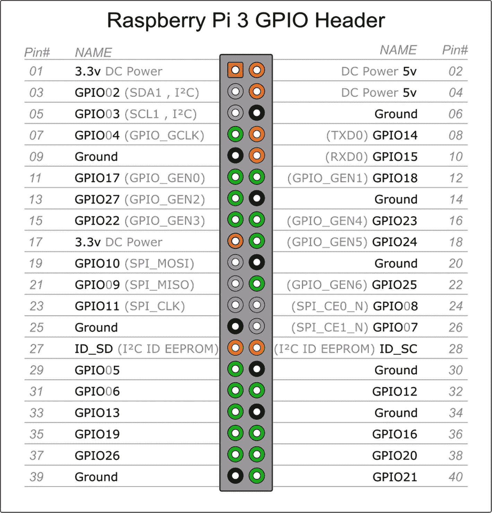

图 12-1

树莓 Pi 3 引脚排列

### 注意

请记住，对于`GPIO.setmode(GPIO.BOARD)`，当您提到 11 号引脚时，您实际上是指物理引脚#11(在图 [12-1](#Fig1) 的图中转换为 GPIO17)，*不是* GPIO11，它转换为物理引脚#23。

一旦设置好模式，就可以将每个引脚设置为输入或输出。Arduino 的用户可能会认识到这里的概念。键入以下内容

```py
GPIO.setup (11, GPIO.OUT)
GPIO.setup (13, GPIO.IN)

```

等等。一旦你设置了一个管脚作为输出，你就可以通过输入

```py
GPIO.output (11, 1)

```

或者

```py
GPIO.output (11, True)

```

然后通过键入以下命令将其关闭

```py
GPIO.output (11, 0)

```

或者

```py
GPIO.output (11, False)

```

如果 pin 已被配置为输入，您可以查询它以查看与其连接的按钮或开关是否已被按下。然而，这里需要注意的一点是，如果该引脚仅被声明为输入，则它被定义为“浮动”且没有定义的电压电平。在这种情况下，我们需要将引脚接地，使其在我们按下按钮之前一直为低电平(0)。这可以通过在引脚和公共地之间放置一个电阻来实现。幸运的是，`RPi.GPIO`模块允许我们通过键入以下命令在软件中实现这一点:

```py
GPIO.setup (11, GPIO.IN, pull_up_down=GPIO.PUD_DOWN)

```

此时，您可以通过键入以下命令随时“轮询”pin

```py
if GPIO.input(11):
    print "Input was HIGH"
else:
    print "Input was LOW"

```

将这段简单的代码插入脚本的循环中；每次循环运行时，脚本都会检查 pin 的状态。我们将在最终的潜水器程序中使用这一功能来触发相机拍照。

## 安装 Pi 摄像机板

我们将要建造的潜水器将配备有拍照设备，可以按预设的时间间隔拍照，也可以按下按钮拍照。显然，这意味着我们需要安装与 Pi 接口的相机模块。

当您收到相机板时，它很可能会放在一个普通的白色盒子里，盒子里面是一个装有相机板的防静电灰色袋子。通过接触良好的地面，确保您已经释放了身体上的任何静电(因为相机对静电非常敏感)；然后，从包里取出相机。

摄像头连接到 HDMI 输出和以太网端口之间板上的条形连接器。通过拉起侧面来打开连接器，它会“弹出”几毫米，这正是您所需要的。定位相机带状电缆的末端，使连接器(银色侧，而不是蓝色侧)面向 HDMI 端口。将电缆滑入连接器，直到其到底，以确保连接良好。然后，在保持电缆不动的同时，向下按压连接器的两侧，直到它们卡入到位(参见图 [12-2](#Fig2) )。

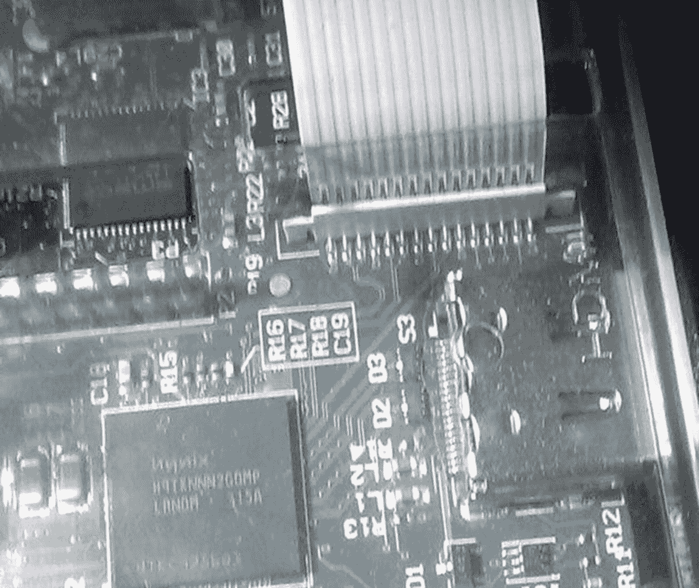

图 12-2

连接 Pi 的摄像机电缆

当您在第 [3](03.html) 章设置 Pi 时，您应该已经启用了摄像机支持；不过，如果你没有，这并不难。在终端中，键入

```py
sudo apt-get update

```

和

```py
sudo apt-get upgrade

```

以确保您的 Pi 运行所有最新的内核补丁和软件更新。当这两个都完成时，键入

```py
sudo raspi-config

```

启动配置程序。导航到“摄像机”选项，然后单击“启用”然后，选择“完成”并重启 Pi。

当 Pi 重新启动时，您可以使用其内置的相机功能`raspistill`和`raspivid`来试验相机。要查看完整的命令列表，只需输入

```py
raspivid

```

或者

```py
raspistill

```

在命令提示符下获取说明。例如，要以“卡通”格式拍摄静态图片，只需键入

```py
raspistill -o image.jpg -ifx cartoon

```

图像将保存在您所在的目录中。您可以更改图像分辨率、高度、宽度、效果和延迟，甚至可以使用`-tl`标志(我们稍后可能会用到)设置延时情况。

## 控制潜艇

为了控制潜艇，我们将使用两个 DC 电机、一个电机驱动芯片(已经放置在印刷电路板上)和一个 Wii 双节棍(如图 [12-3](#Fig3) 所示)。使用特殊的适配器，您可以访问双节棍的电线，并将它们直接连接到 Raspberry Pi，而不必从控制器的末端切断连接器。

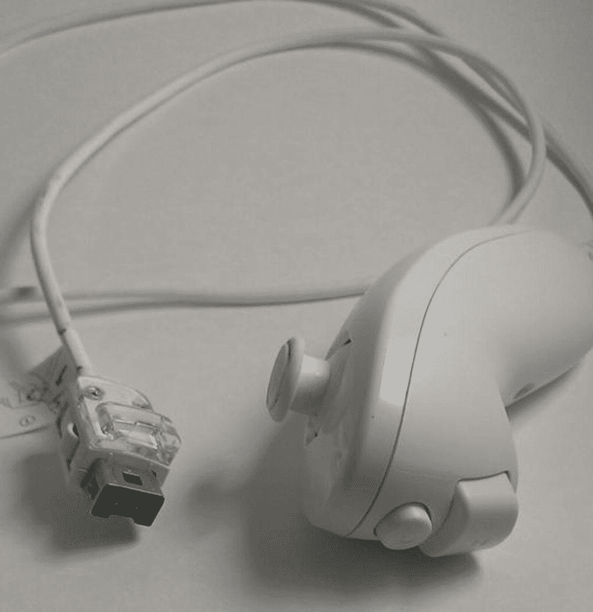

图 12-3

Wii 双截棍

双截棍通过一种被称为 I2C 的协议进行通信，或 I <sup>2</sup> C，或 IIC，代表*内部集成电路*。如果你按顺序完成了这些项目，你可能还记得《I2C 协议》第 6 章“气象站”I2C 是由飞利浦在 20 世纪 80 年代早期创建的，作为不同设备在单条*总线*(通信线)上进行通信的一种方式。此后，它经历了几次修订，但基本概念保持不变。在 I2C 总线上，一台机器充当“主机”，可以连接到各种不同的“从机”每台机器都可以在同一组电线上进行通信，使用主机发送的时钟信号来同步通信。幸运的是，就我们的目的而言，Raspberry Pi 可以通过它的一些 GPIO 引脚利用 I2C 协议，并且通信相对简单，因为只有两个设备在通信:作为主机的 Pi 和单独的从机 Wii nunchuk。

## 连接 Wiichuck 适配器

你可能要做的第一件事是将一组四个接头焊接到你的 Wiichuck 适配器上，如果它没有预连接它们的话。仅使用少量焊料，将接头连接到适配器(如图 [12-4](#Fig4) 所示)。与许多市售电路板一样，该适配器覆盖有一层疏焊料涂层，可防止焊料在连接之间流动并使其短路。这使得将接头焊接到连接器上成为一个简单的过程，即使对于没有经验的焊工来说也是如此。

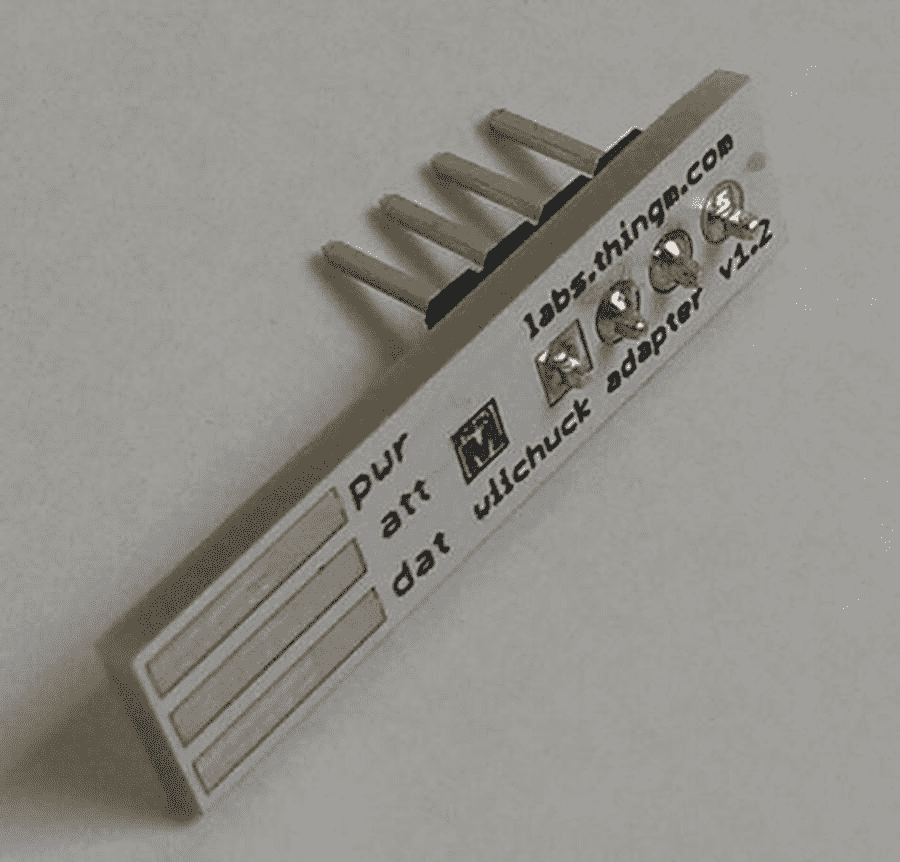

图 12-4

焊接到 Wiichuk 适配器的接头

您将与 Wiichuck 建立四个连接—正极、负极、SDA(I2C 数据线)和 SCL(I2C 时钟线)。将正极线连接到 GPIO 引脚 1，负极线连接到 GPIO 引脚 6。将 SDA 线连接到引脚 3，将 SCL 线连接到引脚 5。在图 [12-5](#Fig5) 中，您可以看到 Wiichuk 已正确插入控制器。

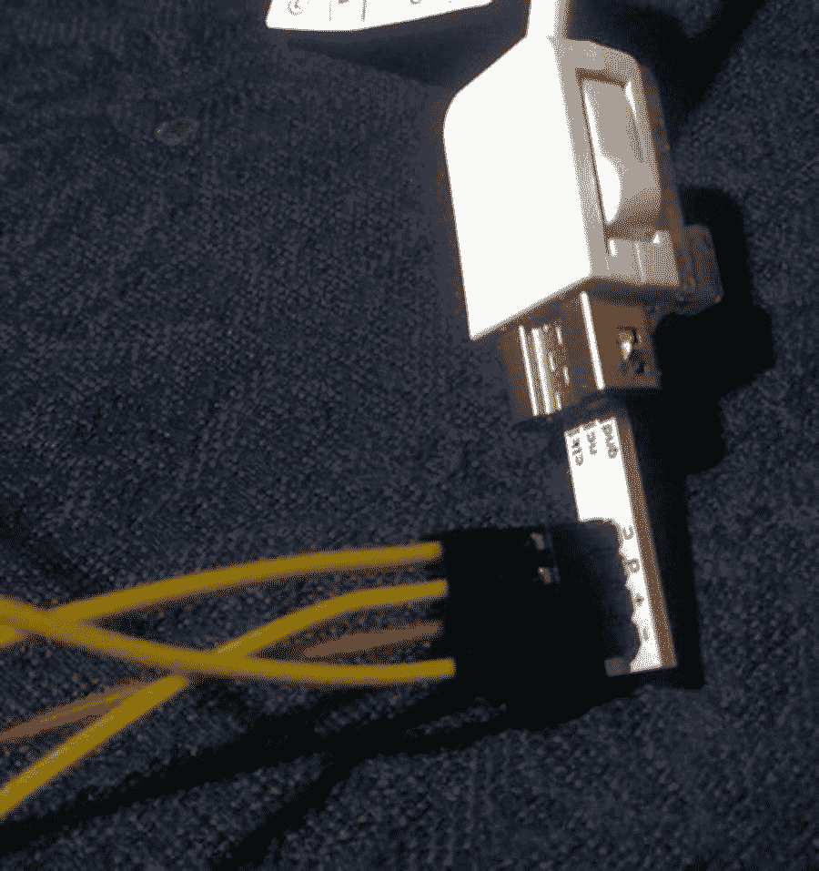

图 12-5

Wiichuk 适配器的正确定位

### 警告

您应该将双截棍连接到 Pi 的#1 引脚(3.3V)，*而不是*的#2 引脚(5V)。Wii 的双截棍设计为 3.3V 运行，而不是 5V。虽然它可以在 5V 电压下工作，但会严重缩短控制器的寿命。

## 激活 Pi 的 I2C

Raspberry Pi 有两个引脚#3 和#5，分别预配置为 I2C 协议的 SDA(数据)和 SCL(时钟)线路，因此它可以轻松地与 I2C 设备通信。Pi 还有一个 I2C 实用程序，可以查看当前连接的设备。要安装它，请键入

```py
sudo apt-get install python-smbus
sudo apt-get install i2c-tools

```

如果你使用的是 Raspbian 的最新版本，比如 Wheezy 或 Stretch，这些应该已经安装了，在这种情况下，你只会得到一个提示，告诉你它们已经是最新版本了。

现在，您可以运行名为 *i2cdetect* 的 I2C 实用工具来确保一切正常，并查看连接了哪些设备。键入以下行:

```py
sudo i2cdetect -y 1

```

这将显示如图 [12-6](#Fig6) 所示的屏幕。

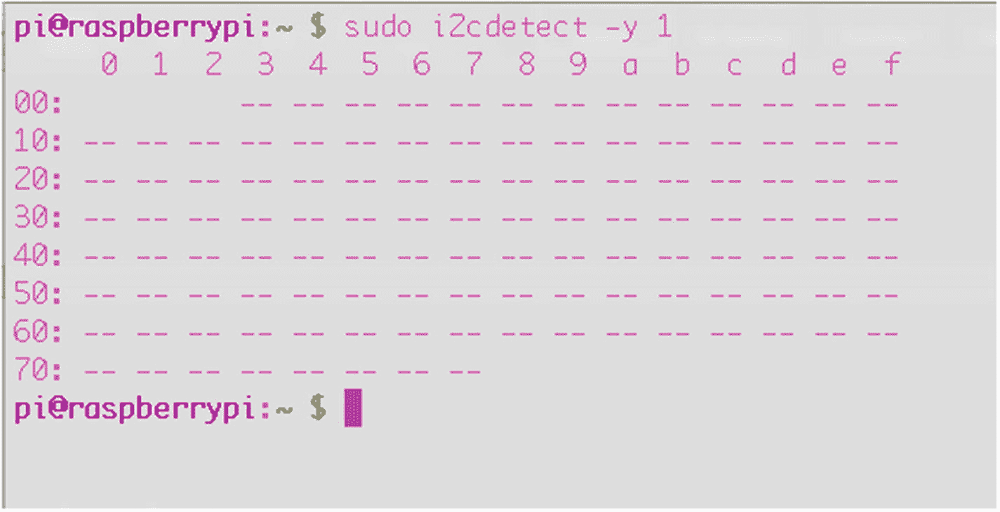

图 12-6

I2C 检测工具

在图中，没有设备出现，这是有意义的，因为我们还没有插入任何设备。但是你知道你的工具工作正常。如果您插入了 Wiichuk 适配器，您应该在#52 处看到一个条目，这是该工具的 I2C 地址。

### 小费

如果你很难得到结果，并且你确信你正确地连接了所有的电线和设备，检查你所有的电线是否完好无损。我花了很多时间对一个构建进行故障排除，却发现我使用的一根或多根廉价跳线在绝缘层内断裂，这意味着我在应该的地方收不到信号。这比你想象的要经常发生！

## 读双节棍

你现在可以开始读双节棍了。当然，最终我们会将双节棍发出的信号转化为马达的指令，但看看我们从什么信号开始可能会有指导意义。为此，让我们创建一个 Python 脚本，它导入正确的模块，监听来自双节棍的信号，并将它们输出到屏幕上。有七个信号通过导线发送:操纵杆的 x 和 y 位置，前面的“Z”和“C”按钮的状态，以及双节棍内置加速度计的 x，y 和 Z 状态。我们不会把所有这些都用在潜艇上，但是我们仍然可以看看它们。

这是你要输入的完整脚本:

```py
#import necessary modules
import smbus
import time

bus = smbus.SMBus(1)

#initiate I2C communication by writing to the nunchuk
bus.write_byte_data(0x52,0x40,0x00)
time.sleep(0.1)

while True:
    try:
      bus.write_byte(0x52,0x00)
      time.sleep(0.1)
      data0 =  bus.read_byte(0x52)
      data1 =  bus.read_byte(0x52)
      data2 =  bus.read_byte(0x52)
      data3 =  bus.read_byte(0x52)
      data4 =  bus.read_byte(0x52)
      data5 =  bus.read_byte(0x52)
      joy_x = data0
      joy_y = data1
      accel_x = (data2 << 2) + ((data5 & 0x0c) >> 2)
      accel_y = (data3 << 2) + ((data5 & 0x30) >> 4)
      accel_z = (data4 << 2) + ((data5 & 0xc0) >> 6)
      buttons = data5 & 0x03

      button_c = (buttons == 1) #button_c is True if buttons = 1
      button_z = (buttons == 2) #button_z is True if buttons = 2

      print 'Jx: %s Jy: %s Ax: %s Ay: %s Az: %s Bc: %s Bz: %s' % (joy_x, joy_y, accel_x, accel_y, accel_z, button_c, button_z)
    except IOError as e:
      print e

```

如果你还没有，为你的潜水程序创建一个文件夹，在那个文件夹中保存这个脚本为`nunchuktest.` `py`，然后运行它。导入必要的模块后，脚本创建了一个“总线”,通过它可以与双节棍进行所有的通信。然后它通过写信给双截棍的 I2C 地址(`bus.write_byte_data()`)开始通信。然后，它进入一个循环，连续读取来自双节棍(`data0`、`data1`等)的 5 字节字符串，并按顺序将它们分类为操纵杆方向、加速度计读数和按钮按压。然后，它将这些值打印到屏幕上，并重复这个过程。

因为它涉及到对 I2C 总线的读写，所以您必须以 root 用户身份运行它，所以键入以下命令:

```py
sudo python nunchuktest.py

```

脚本一启动，就会显示所有双节棍传感器的运行状态报告，实时更新，格式如下:

```py
Jx: 130 Jy: 131 Ax: 519 Ay: 558 Az: 713 Bc: False Bz: False

```

在脚本运行时，尝试移动操纵杆、按下按钮并摇动双节棍来观察值的变化。您现在知道如何从双节棍读取值，我们将用它来驱动马达。

## 双截棍和 LED 试验方项目

作为一个小项目(也是为了测试我的双节棍阅读能力)，我在一个小试验板上连接了六个 led 和一些 GPIO 引脚，这样它们就会根据我移动操纵杆或按下按钮的方式而点亮。这可能是一个值得进行的测试，以确保您不仅阅读了这些值，而且能够用这些值做一些事情。在这种情况下，选择四个 GPIO 引脚并将其设置为输出。将这些引脚连接到一个电阻器和并联连接的 led 的正极引脚(如图 [12-7](#Fig7) 所示)，将所有接地连接在一起，并运行以下脚本:

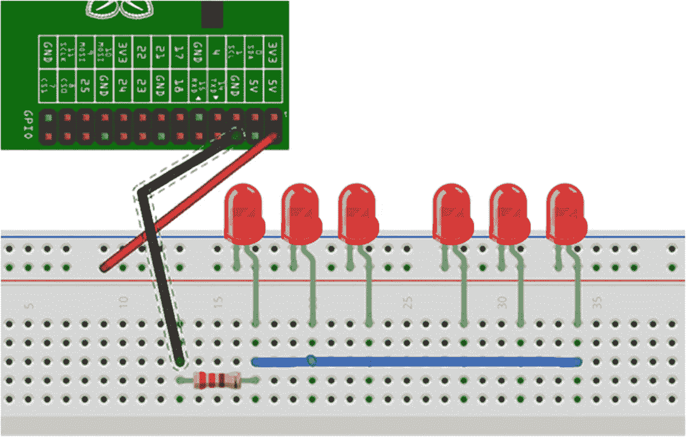

图 12-7

LED 测试设置

```py
import smbus
import time
import RPi.GPIO as GPIO
GPIO.setwarnings(False)
GPIO.setmode(GPIO.BOARD)

#set pins                                                              
GPIO.setup (11, GPIO.OUT)
GPIO.setup (13, GPIO.OUT)
GPIO.setup (15, GPIO.OUT)
GPIO.setup (19, GPIO.OUT)
GPIO.setup (21, GPIO.OUT)
GPIO.setup (23, GPIO.OUT)

bus = smbus.SMBus(0)

bus.write_byte_data (0x52, 0x40, 0x00)
time.sleep (0.1)
while True:
    try:
        bus.write_byte (0x52, 0x00)
        time.sleep (0.1)
        data0 = bus.read_byte (0x52)
        data1 = bus.read_byte (0x52)
        data2 = bus.read_byte (0x52)
        data3 = bus.read_byte (0x52)
        data4 = bus.read_byte (0x52)
        data5 = bus.read_byte (0x52)
        joy_x = data0
        joy_y = data1
# the following lines add the necessary values to make the received 5-byte
# strings easier to decode and print
        accel_x = (data2 << 2) + ((data5 & 0x0c) >> 2)
        accel_y = (data3 << 2) + ((data5 & 0x30) >> 4)
        accel_z = (data4 << 2) + ((data5 & 0xc0) >> 6)
        buttons = data5 & 0x03
        button_c = (buttons == 1)
        button_z = (buttons == 2)
        print 'Jx: %s Jy: %s Ax: %s Ay: %s Az: %s Bc: %s Bz:
%s' % (joy_x, joy_y, accel_x, accel_y, accel_z, button_c, button_z)
        if joy_x > 200:
            GPIO.output (11, 1)
            GPIO.output (13, 0)
            GPIO.output (15, 0)
            GPIO.output (19, 0)
            GPIO.output (21, 0)
            GPIO.output (23, 0)
        elif joy_x < 35:
            GPIO.output (11, 0)
            GPIO.output (13, 1)
            GPIO.output (15, 0)
            GPIO.output (19, 0)
            GPIO.output (21, 0)
            GPIO.output (23, 0)
        elif joy_y > 200:
            GPIO.output (11, 0)
            GPIO.output (13, 0)
            GPIO.output (15, 1)
            GPIO.output (19, 0)
            GPIO.output (21, 0)
            GPIO.output (23, 0)
        elif joy_y < 35:
            GPIO.output (11, 0)
            GPIO.output (13, 0)
            GPIO.output (15, 0)
            GPIO.output (19, 1)
            GPIO.output (21, 0)
            GPIO.output (23, 0)
        elif button_c == True:
            GPIO.output (11, 0)
            GPIO.output (13, 0)
            GPIO.output (15, 0)
            GPIO.output (19, 0)
            GPIO.output (21, 1)
            GPIO.output (23, 0)
        elif button_z == True:
            GPIO.output (11, 0)
            GPIO.output (13, 0)
            GPIO.output (15, 0)
            GPIO.output (19, 0)
            GPIO.output (21, 0)
            GPIO.output (23, 1)
        else:
            GPIO.output (11, 0)
            GPIO.output (13, 0)
            GPIO.output (15, 0)
            GPIO.output (19, 0)
            GPIO.output (21, 0)
            GPIO.output (23, 0)
    except IOError as e:
        print e

```

如前所述，代码首先创建了一个“总线”,所有的通信都通过它与双节棍进行。然后，它通过写信给双截棍的 I2C 地址(`bus.write_byte_data()`)开始通信。然后，它进入一个循环，连续读取来自双截棍的 5 字节字符串(`data0`、`data1`等等)，并按顺序将它们分类为操纵杆方向、加速度计读数和按钮按压。这些字符串的值指示双截棍的每个组件在做什么:例如，如果`buttonZ`是`True`，按钮被按下。同样，操纵杆的 y 方向值表示操纵杆是向前推还是向后拉。一长串`if-elif`语句简单地遍历接收到的值并点亮相应的 LED。

运行它(再次使用`sudo`)会根据你用双节棍做什么产生不同的 led 灯。

如您所见，并联 led 意味着它们共享一个公共地和一条公共高压线。相比之下，如果将它们串联，每个 LED 的正极引脚将与下一个 LED 的负极引脚相连，最后一个 LED 与 Pi 的正极引脚或负极引脚之间有一个电阻。

## 用双截棍控制子马达和相机

现在我们已经让双节棍工作了，我们将使用它来控制潜艇的马达，这涉及到使用 L298 马达控制器芯片。通常，我们不能用 Pi 驱动非常强大的电机或伺服系统，因为 Pi 无法提供足够的电流来驱动它们。为了绕过这一限制，我们使用电机控制器芯片，如 L298。像这样的芯片被称为 *H 桥*，允许你将外部电源连接到你的电机，并根据需要使用 Pi 来打开和关闭电机。L298 芯片成本仅几美元，可用于驱动难以置信的电流和电压——高达 4 安培和 46 伏。它通常用于业余爱好机器人，非常适合这种类型的应用。

然而，尽管芯片很便宜，但将其连接到 Pi 和电机可能会很复杂，因为需要使用几个 10nF 电容和一些反激二极管来保护 Pi 免受电机电压尖峰的影响。出于这个原因，我强烈推荐从 Sparkfun 购买 L298 电机驱动板，如“零件购物清单”一节所述。它使连接更简单:你插入外部电源，输入来自 Pi 的信号，输出电线到电机，你就完成了。在本章的其余部分，我将假设您使用的是 Sparkfun 板。如果你决定自己试验芯片，可以在网上找到一些不错的原理图。

为了控制潜艇和马达，我们可以修改我在前面“双节棍和 LED 测试”一节中介绍的 LED 驱动脚本，但我们不是打开和关闭 LED，而是打开和关闭马达并激活摄像机。控制将基本如下:

*   操纵杆向前=两个电机旋转

*   操纵杆左=右电机旋转

*   操纵杆右=左马达旋转

*   按下 c 按钮=用相机拍摄静态照片

*   按下 z 按钮=用相机拍摄视频

要使用 L298 板为电机供电，需用七根电线将 Pi 连接到板上——每台连接的电机用三根，一根接地。电机 A 由 IN1、IN2 和 ENA 控制(“启用 A”)。电机 B 由 IN3、IN4 和 ENB 控制。为了控制电机 A，你设置 ENA 为“高”，然后在 IN1 或 IN2 发送电压(或者都不发送，以制动电机)。电机 B 的控制方式相同。电机的电源连接到电路板，完全绕过 Pi。要查看图示，请看表 [12-1](#Tab1) 和图 [12-8](#Fig8) 。

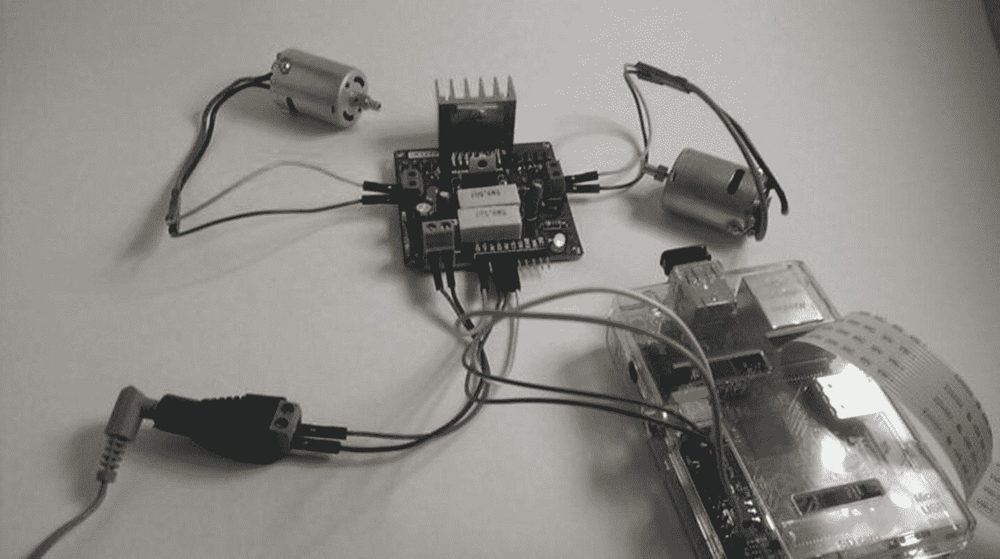

图 12-8

连接到 Pi 的电机和电机控制器

表 12-1

电机值和设置

<colgroup><col class="tcol1 align-left"> <col class="tcol2 align-left"> <col class="tcol3 align-left"> <col class="tcol4 align-left"> <col class="tcol5 align-left"></colgroup> 
| ENA 价值 | ENA = 1 | ENA = 1 | ENA = 1 | ENA = 0 |
| **IN1 值** | IN1 = 1 | IN1 = 0 | IN1 = 0 | - |
| **IN2 值** | IN2 = 0 | IN2 = 1 | IN2 = 0 | - |
| **结果** | 电机 A 顺时针旋转 | 电机 A 逆时针旋转 | 马达 A 制动器 | 电机 A 停止 |

显然，我们需要做的就是为每个电机设置三个 GPIO 引脚。同时，我们读取设置为 I2C 输入的 GPIO 引脚，并根据我们从双节棍获得的信号将电机引脚设置为高或低。我们还将检查按钮按下，以激活相机。(图 [12-7](#Fig7) 显示了一个电机的连接，而不是两个。)

我们可以为摄像机设置每个命令(`take_picture`、`take_video`等)。)并在双节棍上按下适当的按钮时调用该函数。类似地，我们可以设置运行电机的函数，并根据操纵杆的位置调用这些函数。所有这些都发生在一个`while`循环中，一直持续到我们终止程序或者电池耗尽。

## 远程启动程序

一旦给潜水器加电，有几种方法可以让 Python 程序运行，因为您没有连接到 Pi 的键盘、鼠标或监视器。最简单的方法似乎是设置一个静态 IP 地址，从笔记本电脑远程登录到 Pi，然后从那里启动程序。然而，这只有在你登录到无线网络的情况下才能工作，而且在湖中央(或海洋，或任何你碰巧使用潜水器的地方)可能没有任何可用的网络。

您可以设置一个临时网络，在这个网络中，Pi 和您的笔记本电脑创建一个小型的专用网络，然后从您的笔记本电脑登录到 Pi。然而，建立一个自组织网络可能会有问题，如果它由于某种原因不工作，你将无法访问你的 Pi，使你的潜水器毫无用处。

经过一番思考，我决定最好的方法是在启动 Pi 时自动启动子控制程序。这样，你就可以打开它，给马达供电，然后继续和你的潜艇一起工作。

为此，我们需要做的就是编辑一个文件——您的`cron`调度程序。`cron`调度程序是一个您可以编辑的作业调度程序。它使您能够在指定的时间和间隔安排任务和脚本。要编辑它，您可以通过键入以下命令打开名为`crontab`的文件

```py
sudo crontab -e

```

每个用户都有自己的`crontab`，但是通过使用`sudo`，我们将编辑根用户的`cron`，这是我们运行 Python 脚本所需的用户，因为我们正在访问 GPIO 引脚。你会看到类似图 [12-9](#Fig9) 的东西。

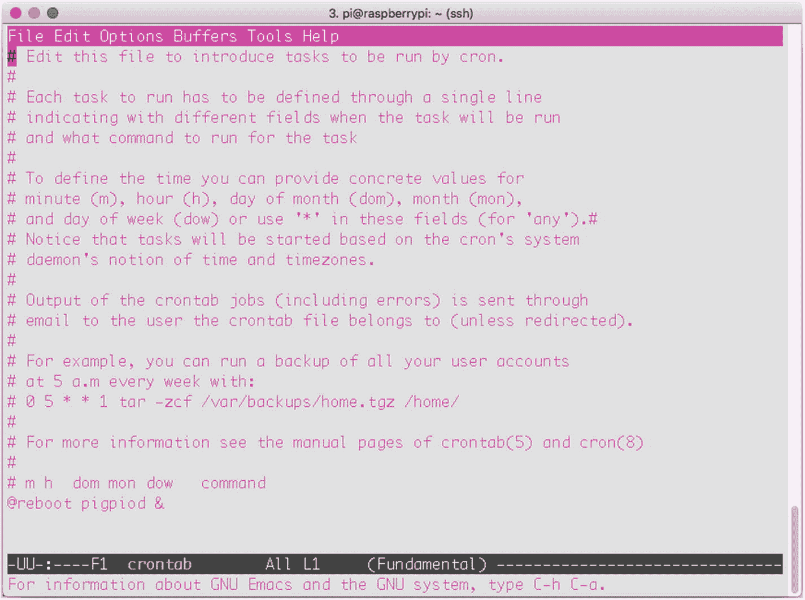

图 12-9

用户的`crontab`文件

向下滚动到文件末尾，并输入以下行:

```py
@reboot python /home/pi/Desktop/submersible/sub.py &

```

这是您的 Python 脚本的具体路径(假设您已经将`sub.py`保存在桌面上的`submersible`文件夹中)，并且`&`告诉`cron`在后台运行作业，以便不干扰正常的启动例程。保存文件。下次您重新启动 Pi 时，`sub.py`将会运行——如果您愿意，可以测试一下！

## 最终代码

将下面的代码保存在您的 Pi 上，最好保存在它自己的文件夹中。它也可以在 Apress 网站上以`sub.py`的名称获得。

```py
import time
import smbus
from picamera import PiCamera
import RPi.GPIO as GPIO
GPIO.setwarnings (False)
GPIO.setmode (GPIO.BOARD)

camera = PiCamera()

def take_stillpic(num):
    camera.capture("image" + str(num) + "jpg")

def go_forward():
    GPIO.output (19, 1) #IN1 on
    GPIO.output (23, 0) #IN2 off
    GPIO.output (11, 1) #IN3 on
    GPIO.output (15, 0) #IN4 off

def go_backward():
    GPIO.output (19, 0) #IN1 off
    GPIO.output (23, 1) #IN2 on
    GPIO.output (11, 0) #IN3 off
    GPIO.output (15, 1) #IN4 on

def go_right():
    GPIO.output (19, 1) #IN1 on
    GPIO.output (23, 0) #IN2 off
    GPIO.output (11, 0) #IN3 off
    GPIO.output (15, 1) #IN4 on

def go_left():
    GPIO.output (19, 0) #IN1 off
    GPIO.output (23, 1) #IN2 on
    GPIO.output (11, 1) #IN3 on
    GPIO.output (15, 0) #IN4 off

#set motor control pins
#left motor
# 11 = IN3
# 13 = enableB
# 15 = IN4
GPIO.setup (11, GPIO.OUT)
GPIO.setup (13, GPIO.OUT)
GPIO.setup (15, GPIO.OUT)

#right motor
# 19 = IN1
# 21 = enableA
# 23 = IN2
GPIO.setup (19, GPIO.OUT)
GPIO.setup (21, GPIO.OUT)
GPIO.setup (23, GPIO.OUT)

#enable both motors
GPIO.output (13, 1)
GPIO.output (21, 1)

#setup nunchuk read
bus = smbus.SMBus(0)  # or a (1) if you needed used y -1 in the i2cdetect command
bus.write_byte_data (0x52, 0x40, 0x00)
time.sleep (0.5)

x = 1

while True:
    try:
        bus.write_byte (0x52, 0x00)
        time.sleep (0.1)
        data0 = bus.read_byte (0x52)
        data1 = bus.read_byte (0x52)
        data2 = bus.read_byte (0x52)
        data3 = bus.read_byte (0x52)
        data4 = bus.read_byte (0x52)
        data5 = bus.read_byte (0x52)
        joy_x = data0
        joy_y = data1
        accel_x = (data2 << 2) + ((data5 & 0x0c) >> 2)
        accel_y = (data3 << 2) + ((data5 & 0x30) >> 4)
        accel_z = (data4 << 2) + ((data5 & 0xc0) >> 6)
        buttons = data5 & 0x03
        button_c = (buttons == 1) or (buttons == 2)
        button_z = (buttons == 0) or (buttons == 2)

        if joy_x > 200: #joystick right
            go_right()
        elif joy_x < 35: #joystick left
            go_left()
        elif joy_y > 200: #joystick forward
            go_forward()
        elif joy_y < 35: #joystick back
            go_backward()
        elif button_c == True:
            x = x+1
            take_stillpic(x)
        elif button_z == True:
            print "button z! \n"
        else: #joystick at neutral, no buttons
            GPIO.output (19, 0)
            GPIO.output (23, 0)
            GPIO.output (11, 0)
            GPIO.output (15, 0)

    except IOError as e:
        print e

```

## 建造潜艇

在这一点上，我们准备开始建造真正的潜水器。把你的零件收集在一起:PVC 管和弯管、防水容器、胶水、螺丝和其他东西。请记住，我在接下来的章节中展示的设计仅仅是一个说明，而不是一个逐步说明的表格。只要你最终有一个框架，你可以在上面安装防水的 Pi 外壳和防水的电机和螺旋桨，你就成功地完成了这项任务。

### 注意

建筑计划，特别是电机防水程序，受到了“海鲈鱼计划”( [`http://www.seaperch.org`](http://www.seaperch.org) )的严重影响，该计划旨在教授所有年龄段的学生建造遥控潜水器，并鼓励他们参与工程和数学领域。这是一个有价值的项目，我非常赞同它的目标。

## 构建框架

使用 PVC 管和 90°弯头，构建一个大致方形的框架，足够容纳您的 Pi 外壳。使用 PVC 胶水或螺丝将所有东西固定到位后，切割塑料网以适合正方形，并使用拉链将它固定在框架上。你最终会得到一个塑料“托盘”，如图 [12-10](#Fig10) 所示。

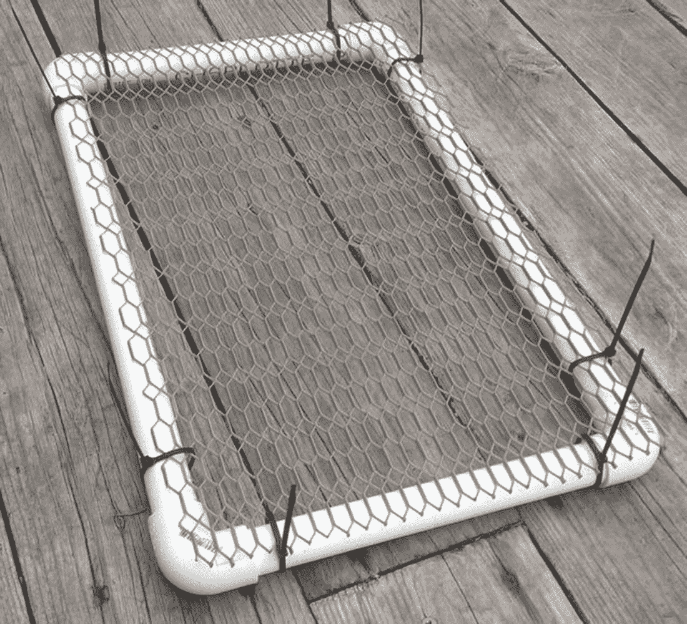

图 12-10

子平台

这是你的潜艇的尸体。我把它留得足够大，如果我需要改变浮力的话，可以在边上添加泡沫聚苯乙烯条，尽管我不应该这样做，因为码头的围栏充满了空气。

## 创建 Pi 的外壳

你需要一个足够大的透明塑料容器来装下你所有的电子产品。我指定“清晰”,因为你的相机将通过它看，并需要能够看到。一旦你选定了你的容器，就在上面钻三个小洞——两个用于连接马达的电线，一个用于连接双节棍的电线，如图 [12-11](#Fig11) 所示。

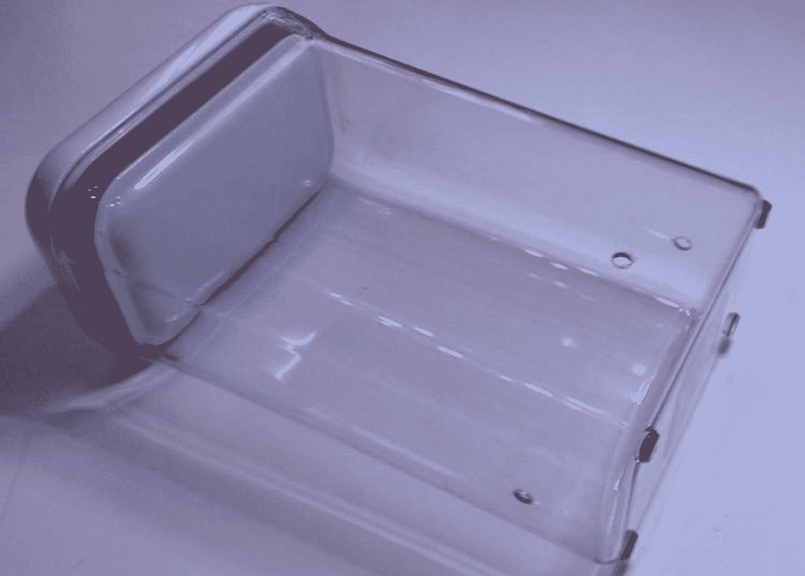

图 12-11

防水码头围栏

## 电机外壳防水

也许这个项目最难的部分是电机的防水，因为它们将在外壳之外。我用处方药瓶来装我的。首先，用绝缘胶带将电机完全包裹起来，以密封外壳上的大孔(参见图 [12-12](#Fig12) )。

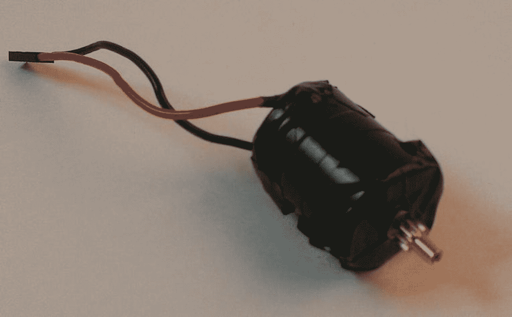

图 12-12

电机用绝缘胶带包裹

然后，剥去一小段以太网电缆的两端，将其中两根电线焊接到电机的电线上。当它完全包裹好并且电线连接好后，在药瓶上钻两个孔——一个在盖子上用于推进器，一个在底座上用于控制线。如图 [12-13](#Fig13) 和图 [12-14](#Fig14) 所示，将电线滑过瓶子，确保所有东西都紧贴在瓶子里。

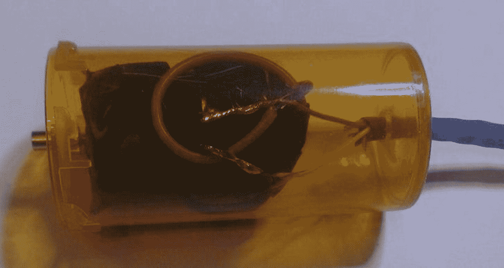

图 12-14

电机紧贴安装在药瓶中

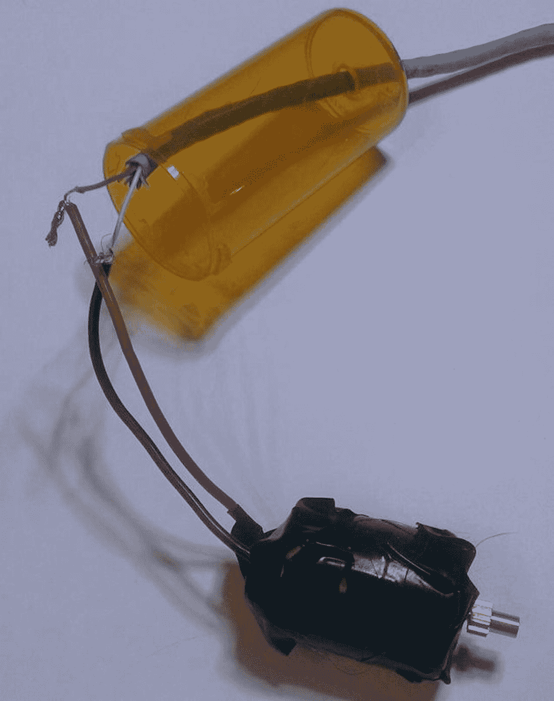

图 12-13

一种可插入药瓶的电机

现在(这是防水钥匙)，把你的药瓶直立起来，在马达和电线周围装满蜡，如图 [12-15](#Fig15) 所示。石蜡，在你超市卖罐头的过道里可以买到，很适合这种情况。如果你加入一小层蜡，让它变硬，然后继续直到瓶子满了，你可能会有最好的运气。


图 12-15

电机被蜡包围

当它被蜡牢牢包围时，确保你的电机轴仍然可以转动，然后在盖子上滑动，通过你预先钻好的孔安装电机轴。然后，将你的螺旋桨滑到暴露的轴上，你应该有一个类似图 [12-16](#Fig16) 的防水电机。对潜艇另一侧的另一个马达重复上述步骤，然后用拉链将两个马达固定在潜艇的框架上。

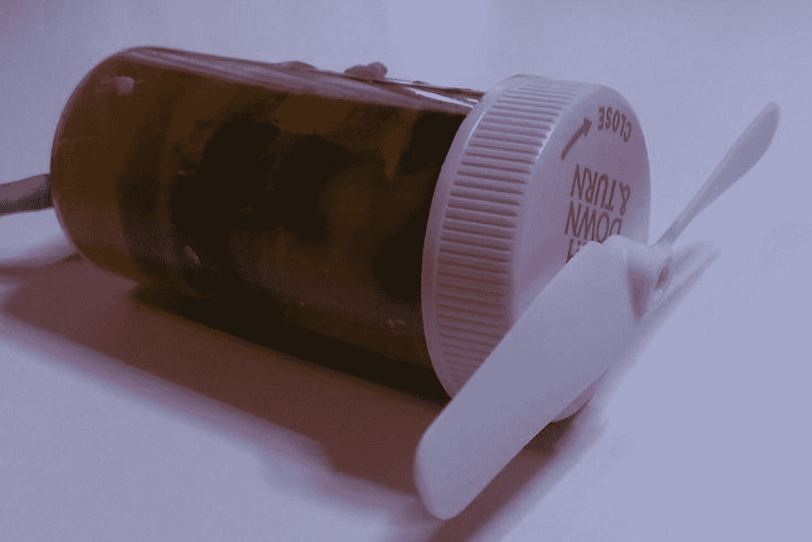

图 12-16

防水电机，准备安装

## 连接双节棍

因为我们要从潜艇到你的双节棍(将保存在你的船上)运行以太网电缆，你需要使用另一段以太网电缆。剥去两端，抓住四根电线，将它们焊接到 Wiichuck 控制器上。将电缆的另一端穿过潜艇顶部的孔，然后将这四根电线的另一端连接到 Pi 的 GPIO 引脚上。

## 组装最终产品

一旦你的马达防水，你就可以组装最终产品了。将每台电机的电线穿过容器上的孔，并按照测试时的方式将它们连接到电机控制板。当所有电线都穿过孔后，使用船用环氧树脂密封孔。

### 警告

5200 密封胶*极其*黏糊糊的，脏兮兮的，弄在皮肤上就脱不下来。戴上手套，尽可能在室外工作。此外，不要吝啬密封胶——你要保护所有的电子设备，所以要确保水无法进入你的外壳。

当孔被密封时，确保所有的电子连接都完好无损，并将 Pi 和电机控制器放入外壳中。使用一小块胶带或海报油灰(这是我使用的)将相机压在外壳的前“墙”上，并将各种板固定到位。使用一个小试验板连接您的地，并添加您的两个电池——一个用于 Pi，一个用于电机控制器。

当你用电池给你的 Pi 供电时，你*必须*使用 5V 电源，因为 Pi 没有板载电压调节器。您可以尝试不同的电池组合，或者使用电压调节器来完成这项工作。在我所有的便携式 Pi 工作中，我曾破解过一个 USB 车载充电器，如图 [12-17](#Fig17) 所示，因为它能完美地提供 5V 和 2 安培的电流。

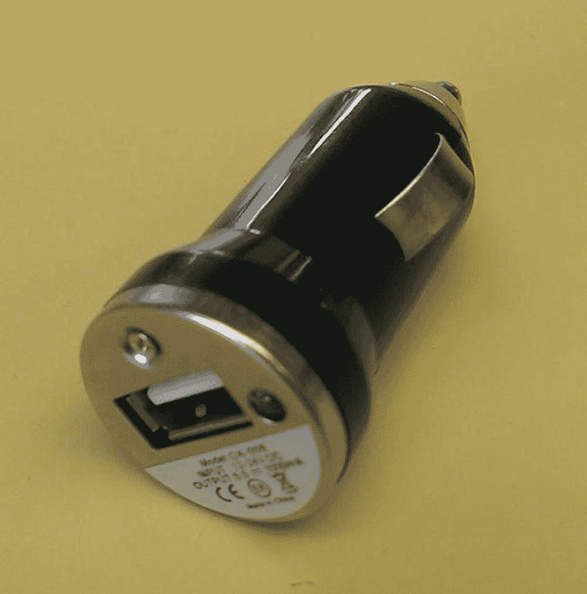

图 12-17

USB 汽车充电

打开外壳，使用 USB 转 micro-USB 线将 USB 电源输出连接到您的 Pi 电源输入。然后，将你的电池连接到充电器的电源输入端，瞧！你的 Pi 有 5V 电源！

一旦您解决了电源问题，您就可以将所有东西都放入机箱中，打开 Pi 电源，并将其密封起来。希望你已经得到了类似于图 [12-18](#Fig18) 的东西。

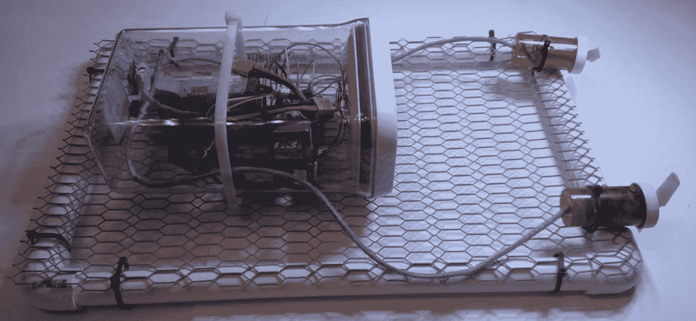

图 12-18

完整的潜水器

显然，图 [12-18](#Fig18) 所示的产品版本尚未完成——我还没有连接双截棍——但你可以看到电机和外壳本身的位置。作为最终的施工照片，图 [12-19](#Fig19) 显示了 Pi 的摄像机靠着外壳前墙的位置，用海报油灰固定到位。

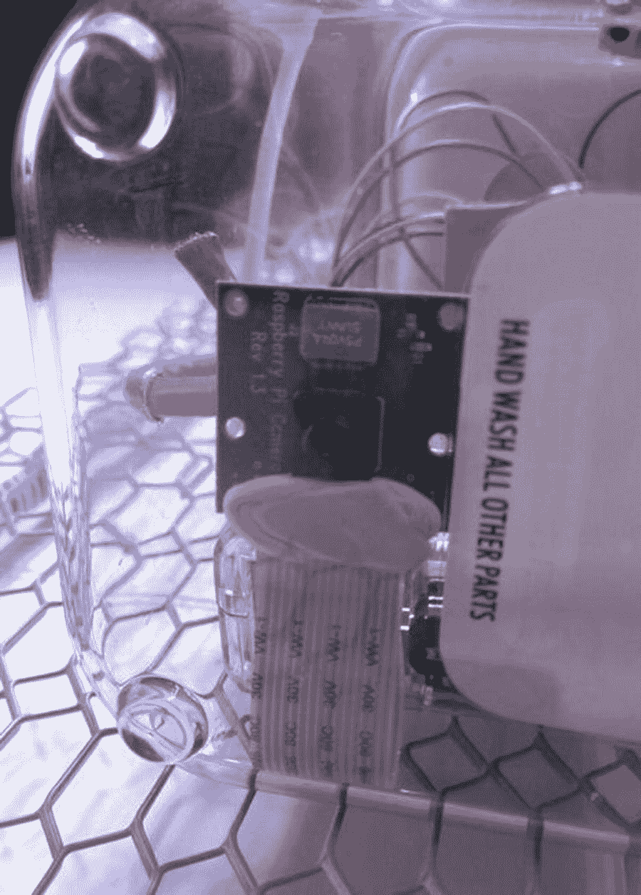

图 12-19

Pi 摄像机在外壳中的放置

如果你已经仔细遵循了所有的说明，你现在应该有一个 Pi 驱动的潜水器，你可以从岸上或你的船上使用 Wii 双截棍进行控制。按下双节棍上的按钮就可以拍照，当你把 Pi 带上飞机时，你可以把这些照片传输到你的家用电脑上。

你能拍什么样的照片？嗯，如果你住在澳大利亚，你可以拿一些像你在图 [12-20](#Fig20) 中看到的东西。


图 12-20

水下摄影

(此处完全披露:这张照片是用 Pi 接头拍摄的*而不是*。但是 T2 有可能是 T3。)

然而，如果你住在阿拉斯加，你得到的照片可能最终看起来更像图 [12-21](#Fig21) 和图 [12-22](#Fig22) 。


图 12-22

更多阿拉斯加水下摄影


图 12-21

阿拉斯加水下摄影

如果你住在南加州，你可能会看到类似图 [12-23](#Fig23) 、 [12-24](#Fig24) 和 [12-25](#Fig25) 的图片。


图 12-25

水下照片


图 12-24

水下照片


图 12-23

水下照片

享受你的潜艇，我真的很想看看你拍的照片！

## 摘要

在本章中，您学习了如何使用 I2C 协议将 Wii 双节棍连接到您的 Pi，并使用它来控制 Pi 上的一些不同功能。然后，你为你的码头建造了一个防水的移动外壳，连接了一些马达和你的相机，并能够远程驾驶你的潜艇，拍摄一些(希望)令人印象深刻的水下照片。

在下一章中，您将学习如何将微控制器(Arduino)连接到您的 Pi 以增强其功能。