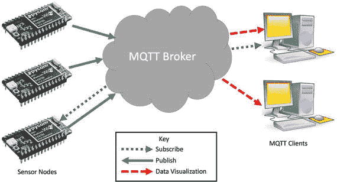
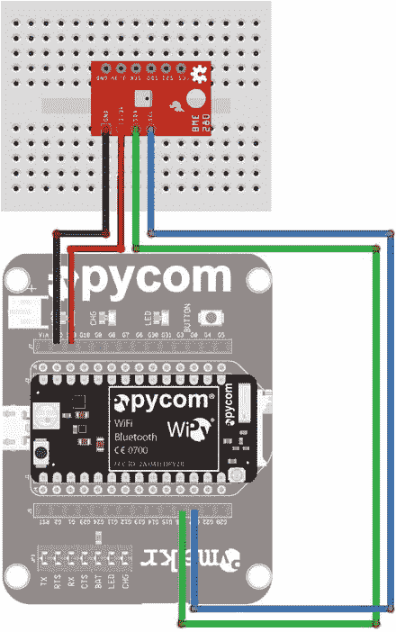
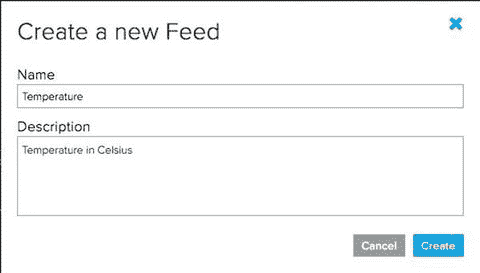
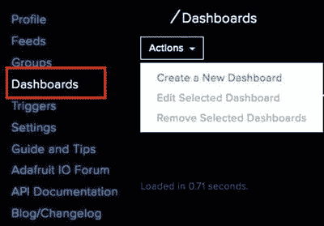
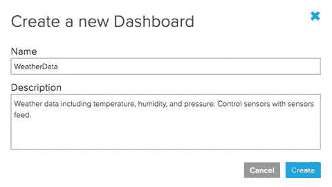
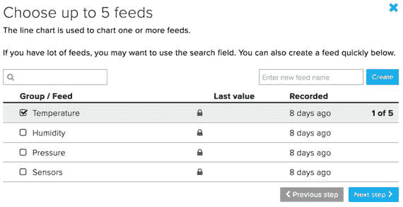
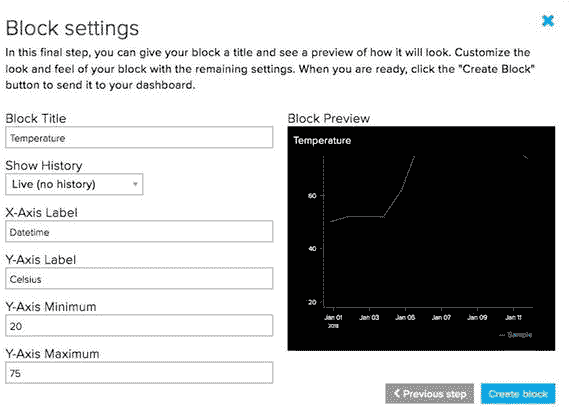
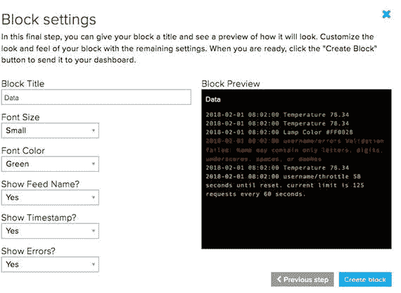
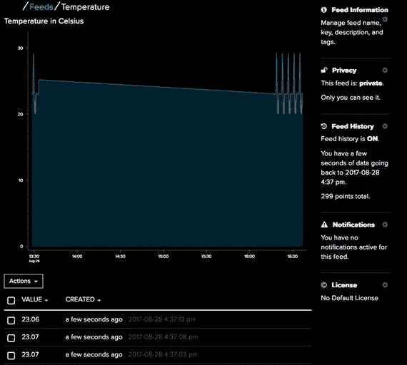

# 十一、项目 4：使用天气传感器

构建一个成熟的 IOT 项目需要使用允许您的小型 MicroPython 板收集数据并将其发送到互联网上的服务的技术，这些服务可以存储、检索和可视化数据。这些互联网服务通常是基于云的服务。很有可能，你已经在不知情的情况下使用了这些技术。在上一章中，我们已经看到了早期的简单形式——使用 HTML 服务器通过互联网向客户机发送数据。

对于某些项目来说，通过 HTML 发送数据可能没什么问题，但是对于需要以其他形式显示数据或者需要对数据进行分析的项目来说，则需要更高级的机制来传输和存储数据。幸运的是，我们可以使用许多技术，包括那些允许控制数据传输的技术。

这种技术有一个定义好的协议(一种通信方式),通常由专门的编程接口支持。微控制器最容易使用的方法之一是定义一个具有发布和订阅角色的协议。也就是说，您可以发布数据(写)，也可以订阅数据(读)，甚至可以在有新数据时得到通知。最容易使用的发布/订阅协议之一叫做消息队列遥测传输(MQTT)。

在本章中，我们将使用 MQTT 来查看一个完整的 IOT 项目的示例，该项目从传感器读取数据并将数据发送到服务器，然后使用 MQTT 订阅数据的客户端可以访问该服务器。最重要的是，一些 MQTT 服务，比如我们将在本章中使用的服务，还提供了可视化工具，允许您在数据生成时查看数据。

幸运的是，本章中使用的传感器比其他章节中的传感器更容易使用。这个项目的复杂性来自于使用云服务托管数据和 MQTT 发布数据。正如您将看到的，构建它并不困难。让我们为这一章找到更多关于这个项目的信息。

## 概观

在本章中，我们将实现一个简化的气象站 IOT 解决方案。我们将使用分线板上的小传感器记录温度、气压和湿度。虽然这三个数据点并不完全是一个完整的专业(业余爱好者更少)级别的天气解决方案，但它向您展示了将数据从传感器发送到云是多么容易。

我们将使用 MQTT 将数据发送到云中以发布数据。我们还将使用订阅来监控连接到交换机的另一个数据元素(称为 feed)。这个想法是从以前的项目中借鉴来的，在以前的项目中，我们使用网页上的按钮来触发事件。在这种情况下，我们将使用开关和数据订阅来打开和关闭我们的传感器，其中打开意味着没有数据发布。从这个意义上说，我们的 MicroPython 解决方案变成了一个传感器节点。

这个项目的用户界面将使用 MQTT 服务的一个特性来构建，这个特性允许您创建一个使用各种模块化组件(称为块)显示数据的站点，比如图形和刻度盘。正如您将看到的，创建用户界面比我们在以前的项目中编写的 HTML 要容易得多。 [<sup>1</sup>](#Fn1) 但是它有一个限制——它只显示自启动以来保存的数据。当我们测试这个项目时，我们将会了解更多。

在我们看这个项目的硬件之前，让我们绕一小段路来了解一下 MQTT 和我们将在本章中使用的服务。

## 消息队列遥测传输

发布/订阅模型已经存在一段时间了，至少在理论和概念上是这样。还有实现角色的编程结构。发布者将数据发布到允许订阅者获取数据的位置(服务器、数据库或结构化数据的存储库)。因此，出版者是作者，订阅者是读者。

在 IOT 项目和传感器网络的情况下，我们有一个或多个传感器节点或数据提供者向存储库发送数据。我们可以使用消息队列来记录包含数据的消息，而不是使用结构化存储机制(如 SQL)。当订阅者订阅数据时，他们按照收到消息的顺序获取消息，并解析消息中的数据。因此，他们不必像我们在数据库服务器中使用的那样添加数据抽象层。在这种情况下，MQTT 协议就是您所需要的。

MQTT 是一个简单且非常轻量级的协议(这意味着它不需要一个庞大的库和一组复杂的步骤来使用)，您可以在 MicroPython(和其他微控制器平台)上使用它。因为 MQTT 是基于消息队列的，所以该协议非常容忍不可靠的数据传输。由于它不需要大量的内存来使用，因此可以在小型设备上使用。这意味着 MQTT 是一种确保您的小型 IOT 设备可以将数据发送到服务器(称为代理)的方法，并且对发布者和订阅者都有合理的交付保证。这使得 MQTT 成为在 IOT 项目中使用的完美工具。

有趣的是，MQTT 从 1999 年就已经存在了。它是由 IBM 的 Andy Stanford-Clark 博士和 Arcom (Eurotech)的 Alren Nipper 发明的。从那以后，它几乎没有什么变化，并且已经适应了越来越多的平台。有关 MQTT 的更多信息，请参见 [`http://mqtt.org/faq`](http://mqtt.org/faq) 。

让我们更详细地看看 MQTT 是如何工作的。

### 它是如何工作的

基本 MQTT 服务有三个组件:生成包含数据的消息的传感器节点或发布者、读取消息的客户机或订阅者，以及存储消息并将其分发给订阅者的代理或服务器。图 [11-1](#Fig1) 显示了三个部件如何工作的概念。



图 11-1。

MQTT Concept

请注意，左边是可以发布数据的传感器节点(用实线表示)，右边是可以订阅消息的客户端(用虚线表示)，以及由代理提供的可视化组件(用虚线表示)。还要注意，传感器节点可以发布和订阅，客户端可以可视化数据和订阅消息。事实上，您可以选择发布和订阅的任意组合。我们将看到如何发布和订阅来自我们的 MicroPython 项目的消息。

#### 客户

MQTT 客户机只是一个具有 MQTT 库的设备(或计算机),您可以使用它对设备进行编程，向代理发送(发布)消息或从代理读取(订阅)消息。幸运的是，WiPy 和 MicroPython 的其他一些基于 ESP 的微控制器端口包含一个 MQTT 库。不幸的是，没有适合 Pyboard 的。因此，在本章中，我们将只看 WiPy MicroPython 板。

#### 经纪人

您可以使用几个代理，包括那些基于云的代理，以及一个您可以在自己的服务器上使用的代理。大多数代理都有自己的 MQTT 客户机实现(有些需要特定的驱动程序或库)，并且可能运行在特定的平台上或需要其他组件。无论如何，它们支持来自传感器节点和客户机的相同 MQTT 协议。因此，您可以选择在 MQTT broker 上使用，并在以后转移到另一个上，而不必从头重写代码。

对于 IOT 的项目，你会希望选择一个基于云的代理，这样你就可以将你的板连接到云，并从任何地方访问数据。这个项目的首选代理是 Adafruit IO ( [`io.adafruit.com`](https://io.adafruit.com) )。Adafruit IO 目前处于公测阶段，这意味着任何想要使用它的人都可以使用它。有一些限制——没有一个会影响像本章项目这样的实验。如果您计划基于 Adafruit IO 开发一个商业产品，您可能希望等到它退出测试版，或者考虑一个替代的代理服务。

Alternative MQTT Brokers

网站 [`https://github.com/mqtt/mqtt.github.io/wiki/servers`](https://github.com/mqtt/mqtt.github.io/wiki/servers) 包含 MQTT 经纪人列表。您会发现一些迎合特定平台或编程语言(如 Java)的工具。您还会发现一些商业 MQTT 服务，您可以将它们用于更大的项目或您想赚钱的项目。

但是，如果您想在您的网络上建立自己的 MQTT 服务器，您可以使用 Mosquito ( [`http://mosquitto.org/`](http://mosquitto.org/) `),`)，它是开源的，非常受爱好者的欢迎。你甚至可以使用一个公共测试服务器。更好的是，您不需要对这个项目中的代码做太多的修改就可以使用它。您应该将 Mosquito 视为从 Adafruit IO 这样的免费 MQTT 代理到商业 MQTT 代理的敲门砖。

### Adafruit IO 入门

Adafruit IO ( `io.adafruit.com`)是一个基于云的数据可视化系统，简单易用，使用起来只需要很少的编程知识。这是通过支持表述性状态转移(REST)和 MQTT APIs 来实现的。我们将在这个项目中使用 MQTT API。

REST 是许多基于云的服务所使用的协议，例如亚马逊网络服务(AWS)提供的服务，以及许多基于云的商业解决方案。它最出名的是通过 HTML 操作与基于 web 的解决方案一起使用。参见 [`https://en.wikipedia.org/wiki/Representational_state_transfer`](https://en.wikipedia.org/wiki/Representational_state_transfer) 了解更多关于休息的信息。在本章中，我们将只使用 MQTT。

Adafruit IO 的目标是消除当前数据记录器和基于云的数据服务解决方案的所有复杂性，并使其易于使用，Adafruit 在这方面做得非常好。简而言之，我们使用 MQTT 客户机驱动程序(库)，编写代码来连接、订阅数据或发布数据。可视化部分发生在 Adafruit IO 服务器上，我们创建自己的用户界面来查看数据。Adafruit IO 入门有四个步骤。

1.  创建一个帐户。
2.  为您的数据设置源(消息队列)。
3.  设置一个仪表板来可视化数据。
4.  连接您的设备并开始发布和订阅。

开始使用 Adafruit IO 所需要的只是一个用户帐户。要为 Adafruit IO 创建一个帐户，只需前往 [`https://io.adafruit.com/`](https://io.adafruit.com/) 。如果你已经在 Adafruit 的服务器上有一个帐户，你可以使用那个帐户，只需注册就可以访问 Adafruit IO。这一过程简单易行。登录后，您将看到管理界面，您可以在其中创建提要和控制面板。

提要是 Adafruit IO 的核心组件。订阅源是您将数据以消息的形式从设备中发布的地方。提要可以存储数据(通过发布)，设备(客户端)可以通过订阅提要来读取数据。您可以有多个提要，每个提要都由其名称定义，并通过您的用户 id 引用。

仪表板是提要中数据的视图。Adafruit IO 提供了一个拖放界面，可以使用预定义的用户界面控件(称为“块”)非常快速地构建简单的数据视图。每个仪表板可以有一个或多个块，这些块可以连接到您的提要。然后，数据显示在块中，当新数据到达时会自动更新。

一旦我们设置了提要和仪表板，我们就可以编写代码来使用 MQTT 库并发送(或接收)数据。然后，我们可以返回到我们的控制面板并查看数据。在本章的后面部分，我们将看到为项目设置提要和仪表板的详细演练。

如果你想了解更多关于 io.adafruit.com 的知识，可以看看 Adafruit 的这些优秀教程。还可以在 [`https://learn.adafruit.com/search?q=io.adafruit.com`](https://learn.adafruit.com/search?q=io.adafruit.com) `&`找到一些使用 Adafruit IO 的有趣项目创意。

*   Adafruit IO: [`https://learn.adafruit.com/adafruit-io/rest-api?view=all`](https://learn.adafruit.com/adafruit-io/rest-api?view=all)
*   阿达果 IO 基础知识–提要: [`https://learn.adafruit.com/adafruit-io-basics-feeds/resources?view=all`](https://learn.adafruit.com/adafruit-io-basics-feeds/resources?view=all)
*   阿达果 IO 基础知识–仪表盘: [`https://learn.adafruit.com/adafruit-io-basics-dashboards/creating-a-dashboard?view=all`](https://learn.adafruit.com/adafruit-io-basics-dashboards/creating-a-dashboard?view=all)
*   MQTT，Adafruit IO & You: [`https://learn.adafruit.com/mqtt-adafruit-io-and-you/arduino-plus-library-setup?view=all`](https://learn.adafruit.com/mqtt-adafruit-io-and-you/arduino-plus-library-setup?view=all)

现在，让我们看看这个项目需要哪些组件。

## 必需的组件

表 [11-1](#Tab1) 列出了你需要的部件。您可以从 Adafruit ( `adafruit.com`)、Sparkfun ( `sparkfun.com`)或任何出售电子元件的电子商店单独购买元件。如果你想购买组件，可以提供供应商链接。当列出同一对象的多行时，您可以选择其中一行——您不需要两个都要。此外，您可能会找到销售这些组件的其他供应商。你应该货比三家，找到最好的交易。显示的成本是估计值，不包括任何运输成本。

表 11-1。

Required Components

<colgroup><col> <col> <col> <col> <col></colgroup> 
| 成分 | 数量 | 描述 | 费用 | 链接 |
| --- | --- | --- | --- | --- |
| MicroPython 板 | one | WiPy | $25 | [T2`https://www.adafruit.com/product/3338`](https://www.adafruit.com/product/3338) |
| [T2`https://www.pycom.io/product/wipy/`](https://www.pycom.io/product/wipy/) |
| 天气传感器 | one | 宝马 280 (I2C 接口) | $20 | [T2`https://www.sparkfun.com/products/13676`](https://www.sparkfun.com/products/13676) |
| 跳线 | four | M/M 跳线，6”(10 根跳线的成本) | $4 | [T2`https://www.sparkfun.com/products/8431`](https://www.sparkfun.com/products/8431) |
| 面包板 | one | 原型板，半尺寸 | $5 | [T2`https://www.sparkfun.com/products/12002`](https://www.sparkfun.com/products/12002) |
| 力量 | one | 从电脑获取电源的 USB 电缆 |   | 使用您的备件 |
| one | USB 5V 电源和电缆 |   | 使用您的备件 |

BME280 分线板大气传感器支持 I2C 或 SPI 接口。Sparkfun 的 BME280 支持两者，这使其成为 IOT 零件套件的理想选择。图 [11-2](#Fig2) 显示了 Sparkfun 的 BME280 天气传感器。如果您有来自其他供应商的，确保它支持 I2C(或者相应地调整这个项目中的代码和接线图)。它没有头文件，所以你可以自己添加。订购传感器时只需订购一套，自己焊接即可(或找朋友帮忙)。


图 11-2。

Atmospheric Sensor Breakout (courtesy of sparkfun.com)

幸运的是，这个项目的布线没有前两个项目复杂。现在，让我们看看如何将组件连接在一起。

## 安装硬件

这个项目的简单之处在于，我们使用一个传感器和 I2C 接口，因此我们不需要很多连接。图 [11-3](#Fig3) 显示了 WiPy 的接线图。



图 11-3。

Wiring the Weather Sensor (WiPy) Caution

Sparkfun BME280 限于 3.3V，确保仅将其连接到 WiPy 上的 3.3V 引脚。

同样，在给主板通电之前，请务必仔细检查您的连接。暂时不要给你的开发板加电——在我们准备好测试项目之前，我们需要设置我们的 Adafruit IO feeds 和仪表板，然后编写代码。

## 配置 Adafruit IO

现在我们已经准备好配置 Adafruit IO 了。回想一下，我们的项目将从 BME280 传感器读取三种类型的数据:温度、湿度和大气压力。因此，我们将为其中的每一个创建一个提要。我们还将使用第四个提要，这样我们就可以通过仪表板控制我们的 MicroPython 板。仪表板将有几个块来显示每个提要。让我们看看如何为我们的项目创建提要和仪表板。

### 设置订阅源

要设置 feed，请登录 Adafruit IO 并从屏幕左侧的链接列表中选择 Feed，然后单击 Actions 下拉列表并选择 Create a New Feed，如图 [11-4](#Fig4) 所示。


图 11-4。

Create a new Feed

接下来，您可以为提要提供名称和描述(可选)。命名第一个进料温度，如图 [11-5](#Fig5) 所示。当您对输入的数据感到满意时，单击 Create 创建提要。



图 11-5。

Create a New Feed dialog

重复该过程，并创建用于存储湿度(名为湿度)、大气压力(名为压力)的提要，以及一个用于控制传感器(名为传感器)的提要。完成后，您应该会看到如图 [11-6](#Fig6) 所示的新提要。


图 11-6。

Feeds for the Weather Project

请注意，此时提要中没有任何数据。在我们设置并连接好 MicroPython 板之前，我们看不到任何数据。既然提要已经设置好了，我们就可以创建一个仪表板来查看发布后的数据。

### 设置仪表板

您可以创建任意数量的仪表板来查看您的订阅源中的数据。事实上，您可以为每个提要创建一个仪表板，或者创建几个连接到一个或多个提要的仪表板。对于这个项目，我们将创建一个连接到所有四个提要的仪表板。

要设置仪表板，请从屏幕左侧的链接列表中选择仪表板，然后单击操作下拉列表并选择创建新仪表板，如图 [11-7](#Fig7) 所示。



图 11-7。

Create a new Dashboard

接下来，您可以为仪表板提供名称和描述(可选)。将仪表板命名为 WeatherData 并提供描述(可选)，如图 [11-8](#Fig8) 所示。当您对输入的数据感到满意时，单击创建以创建仪表板。



图 11-8。

Create a New Dashboard dialog

创建仪表板后，我们必须编辑它以添加块。要添加块，请单击您的仪表板。此时，您有一个空白的仪表板，我们可以在其中添加一个或多个块。可用区块及其用途如表 [11-2](#Tab2) 所示。正如您将看到的，有些块可以用于以各种方式显示数据(在 Adafruit 文档中称为输出)，有些块可以用于在提要中生成数据(称为输入)。一些块可以连接到一个且仅一个 feed，而其他块可以连接到多个 feed。

表 11-2。

Adafruit IO Blocks

<colgroup><col> <col> <col></colgroup> 
| 名字 | 类型 | 描述 |
| --- | --- | --- |
| 开关按钮 | 投入 | 在文本或数字两个值之间选择。把它想象成一个开关。 |
| 瞬时按钮 | 投入 | 向提要发送一个值，就像一个硬件瞬时按钮。 |
| 数字滑块 | 投入 | 从您定义的指定范围中选择一个数字。 |
| 测量 | 输出 | 显示馈送的当前值。如果设置了最小值和最大值，可以显示百分比。 |
| 文本框 | 两者 | 显示静态文本或提要中的文本。 |
| 溪流 | 输出 | 显示来自一个或多个源的消息。 |
| 图像 | 输出 | 在源中显示图像。 |
| 线图 | 输出 | 在折线图中显示来自馈送的数据。 |
| 颜色选择器 | 投入 | 选择一个 RGB 值并将其发送到源。 |
| 地图 | 输出 | 跟踪订阅源数据的位置(如果地理数据可用)。 |
| 远程控制 | 投入 | 模仿 Adafruit 卖的迷你遥控器。 |

对于我们的项目，我们将添加以下块。

*   线图:每个模块连接一个温度、湿度和压力输入。
*   切换按钮:连接传感器馈电。
*   Stream:连接所有四个提要。

如图 [11-9](#Fig9) 所示，点击仪表板编辑屏幕右上角的加号图标，添加一个模块。


图 11-9。

Add a Block

当您单击加号时，将会显示可用块的列表。表 [11-2](#Tab2) 中列出的方块如图 [11-10](#Fig10) 所示，从左上开始依次排列。要将您选择的块添加到您的仪表板，请单击该块。


图 11-10。

Available Blocks

选择块时，必须为块选择馈送。图 [11-11](#Fig11) 显示了为温度进给的线图选择进给的示例。如您所见，您可以选择任意数量的提要。但是，在对多个提要使用折线图之前，一定要考虑每个数据的规模。在这个项目中，我们对三种类型的数据有不同的尺度。如果我们使用一个折线图，具有最低范围的 feed 将出现在图的底部，并可能掩盖数据随时间的变化(它可能显示为一条平线)。



图 11-11。

Selecting the feeds for a block

通过勾选提要名称旁边的框选择了提要后，单击下一步配置块。对于每种类型的块，对话框看起来会有所不同。图 [11-12](#Fig12) 显示了温度线图块的设置。



图 11-12。

Block Settings (Temperature)

注意，我选择将块的名称设置为与提要相同的名称，并更改了 X 轴和 Y 轴的标签。我还设置了 Y 轴的最小值和最大值。如果对设置感到满意，请单击“创建块”将块添加到面板中。

继续为湿度和压力输入创建另外两个线图。您可以用类似的方式命名块，但是使用范围 0，100 表示湿度，使用范围 80000，120000 表示压力。如果地理位置的高程不同，导致范围略有不同，您可能希望或需要调整这些值。

接下来，我们添加一个用于记录所有数据的块。为此，我们将使用流块。添加流块并选择所有四个提要。您可以随意命名，默认设置也可以。图 [11-13](#Fig13) 显示了我使用的设置。在设置新的仪表板时，这个块是一个很好的块，因为它让您可以在数据到达每个字段时看到数据。



图 11-13。

Block Settings (Stream Block )

最后，我们为开关添加一个块来打开和关闭数据记录。添加一个切换按钮块，并使用图 [11-14](#Fig14) 所示的设置。


图 11-14。

Block Settings (Sensors)

还有一步。将块添加到您的仪表板会将它们按出现的顺序和默认大小放置在屏幕上。如果你看看你的仪表板，你会看到每个块都有边，你可以用来调整每个块的大小。你也可以点击一个块，按住鼠标按钮，拖动你喜欢的块。现在就去做吧。您可以使用如图 [11-15](#Fig15) 所示的布局。


图 11-15。

Rearranging Blocks on the Dashboard

编辑完仪表板后，单击完成编辑。如果您想要更改其中一个块的比例或四处移动块，您可以随时编辑您的仪表板。要编辑您已经添加的块，请单击仪表板编辑屏幕上您想要编辑的块的小齿轮图标。

### 获取您的证书

你还需要做一件事。连接到 Adafruit IO 是通过您的用户帐户和系统生成的特殊密钥完成的。我们使用这些数据代替用户 id 和密码。要取回您的密钥，请转到主页并单击“设置”，然后单击“查看 AIO 密钥”按钮。你会看到一个如图 [11-16](#Fig16) 所示的对话框。请注意，我已经模糊了数据。您应该像对待任何其他密码一样对待这些数据。如果您想查看如何使用这些值的示例，请单击 Show Code Samples。


图 11-16。

AIO Key

源代码中需要您的用户名和 IO 键，所以最好现在就获取这些值，并将它们保存在某个安全的地方。如果不想将这些值保存在文件中，您可以随时参考此页面。另外，如果你需要重新生成你的密钥，你可以点击重新生成 AIO 密钥，但是不要这样做，除非你需要一个新的密钥！

好了，现在我们准备开始发送一些数据。但是首先，我们需要编写代码。

## 写代码

一旦理解了 MQTT 库，这个项目的代码就相对容易编写。正如您将看到的，在易用性方面，它与 Adafruit IO 配合得很好。为了使这个项目更有趣，更适用于您如何为 MicroPython 平台编写 IOT 项目，我们将把读取传感器和发布数据的所有代码放在一个类中。然后我们将在一个代码模块中使用这个类，我们可以在启动时从我们的`main.py`代码模块中调用它。由于代码没有使用任何我们还没有见过的结构，所以代码的描述将会很简短，只关注新概念和 MQTT 代码。

然而，我们首先需要为 WiPy 下载一个 MQTT 库和 BME280 驱动程序。

### MQTT 驱动程序

WiPy 的 MQTT 库可以在 [`https://github.com/pycom/pycom-libraries`](https://github.com/pycom/pycom-libraries) 下载。我建议下载整个存储库。为此，请单击“克隆”或“下载”按钮，然后单击“下载 Zip”并将文件保存在您的 PC 上。下载完成后，您可以解压缩文件，然后在`/lib/mqtt`文件夹中找到 MQTT 库。我们想要的文件被命名为`mqtt.py`。在后面的步骤中，您需要将该文件复制到 WiPy 中。

### BME280 库

BME280 的驱动程序可从 [`https://bitbucket.org/oscarBravo/wipy_bme280`](https://bitbucket.org/oscarBravo/wipy_bme280) 下载。要下载驱动程序，请单击屏幕左侧的下载图标(看起来像一朵带有向下箭头的云)，然后单击可用下载列表中的下载库。下载完成后，解压文件并找到名为`bme280.py`的驱动程序。

虽然驱动程序将使用 WiPy，但传感器的地址可能需要更改。确保检查您选择的 BME280 传感器的地址，并确保驱动程序文件(`bme280.py`)中的地址设置正确。当您运行代码时，未能使用正确的地址将导致奇怪的、致命的错误。下面显示了以十六进制指定地址的代码行。

```py
# BME280 default address.

BME280_I2CADDR = 0x77

```

回想一下，您可以使用 I2C 类的`scan()`函数找到连接到您的板的 I2C 设备的地址，如下所示。该函数返回一个十进制值，但您可以将其转换为十六进制，如下所示。确保首先连接 I2C 传感器！

```py
MicroPython v1.8.6-694-g25826866 on 2017-06-29; WiPy with ESP32
Type "help()" for more information.
>>> from machine import I2C
>>> i2c = I2C(0, I2C.MASTER, baudrate=100000)
>>> devices = i2c.scan()
>>> for device in devices:
...         print("Address: {0}".format(hex(device)))
Address: 0x77

```

这里我们看到地址是 0x77。如果您查看`bme280.py`文件，您会看到默认值是 0x76。只要改变它来匹配你的传感器，它就会正常工作。

### 天气等级

我们在第 4 章中学到了职业。在那里，我们了解到我们可以用这样一种方式包装我们的代码，使得对数据的一组操作更容易使用。我们将在这里这样做。我们将围绕 BME280 传感器和 Adafruit IO 包装我们的代码，以创建一个易于使用的类或库，用于读取天气数据并将其发布到云。

然而，我们不会随意地将通常在函数中使用的代码扔进一个类中。我们将把这个类设计成可重用和易于配置的。最好的方法是让构造函数——类实例化时调用的函数——接受参数。

例如，我们将传递 Adafruit IO 连接的凭证(设备 id、用户名、AIO 密钥)以及我们希望发布数据的频率(回想一下，这也称为采样率)。通过构造函数将信息传递到类中，我们可以让类中的所有函数都可以使用这些数据，这样我们就不用使用全局变量了！ [<sup>2</sup>](#Fn2)

本质上，我们将打包所有繁重的代码，用于初始化 BME280 库、MQTT 库、从传感器读取数据并发布数据，以及订阅传感器提要。

如果您想继续学习，我们将把这个类命名为`WeatherNode`，因为它封装了传感器并发布数据。我们将代码模块命名为`weathernode.py`。让我们考虑一下这个课程的设计。

#### 设计

让我们讨论一下这个类的设计。这是一个非常重要的步骤，你应该始终考虑。对于你的类，有一个好的设计(或者至少是一个计划),以你想要实现的特性的形式，并且用函数来实现它们，可以对你的代码质量产生很大的影响。

对于这个类，我们将创建一个可以从主代码中调用的函数。该函数将负责实现一个循环，从传感器读取数据，发布数据，并监控来自传感器 feed 的任何消息。如果出现传感器馈送的消息，该功能也将对其进行操作。回想一下，这意味着根据提要中的开关位置消息打开和关闭发布数据。

因此，我们需要一个函数来启动 read 循环，另一个函数用于读取数据，还有一个函数可以作为回调函数来响应提要中的消息。以下部分描述了每个区域以及执行这些操作的功能。让我们从进口部分开始。

#### 进口

导入部分需要几个库。我们需要 I2C 和 MQTT 库、BME280 驱动程序和延迟时间库。下面显示了该类所需的导入。

```py
from machine import I2C
from mqtt import MQTTClient
import bme280
import utime

```

#### 构造器

构造函数需要接受 Adafruit IO 标识标签或设备 id、用户名、AIO 密钥和频率(采样率)。设备 id 可以是您想要使用的任何字符串，但是建议您使用设备的短名称。我们还将为 MQTT 服务器的端口使用一个参数，以防您想要更改它，但是我们将使用默认值 1883，这是 Adafruit IO 的端口。清单 [11-1](#Par93) 显示了构造函数的代码。构造函数总是被命名为`__init__()`。

```py
# Constructor
def __init__(self, io_id, io_user, io_key, frequency, port=1883):
    # Turn sensors on/off
    self.sensor_on = False

    # Save variables passed for use in other methods
    self.io_id = io_id
    self.io_user = io_user
    self.io_key = io_key
    self.update_frequency = frequency
    self.port = port

    # Now, setup the sensor
    i2c = I2C(0, I2C.MASTER, baudrate=100000)
    self.sensor = bme280.BME280(i2c=i2c)
    utime.sleep_ms(100)
    print("Weather MQTT client is ready.")

Listing 11-1.Constructor (WeatherNode class)

```

注意，这个函数只是初始化了几个类变量(用`self.`表示),用于存储连接值和频率。该构造函数还初始化 I2C 接口和 BME280 传感器类实例。

#### 读取数据功能

我们将命名为`read_data()`的 read data 函数将指向 BME280 传感器对象实例的指针作为参数，从传感器读取数据，并以元组的形式返回。下图显示了`read_data()`功能。

```py
# Reads the sensor. Returns a tuple of (temperature, humidity, pressure)
def read_data(self):
    utime.sleep_ms(50)
    temperature = self.sensor.read_temperature() / 100.00
    humidity = self.sensor.read_humidity() / 1024.00
    pressure = self.sensor.read_pressure() / 256.00
    return (temperature, humidity, pressure)

```

请注意，我们对读取的值执行了一些缩放操作。这些计算来自记录 BME280 驱动程序的网站( [`https://bitbucket.org/oscarBravo/wipy_bme280`](https://bitbucket.org/oscarBravo/wipy_bme280) )。

#### 消息回调函数

我们需要的下一个函数是一个可以用来回调来自提要的 MQTT 消息的函数。我们将这个函数命名为`message_function()`。在这种情况下，我们只需要主题和消息参数。下面显示了`message_callback()`函数的代码。

```py
# A simple callback to print the message from the server
def message_callback(self, topic, msg):
    print("[{0}]: {1}".format(topic, msg))
    self.sensor_on = (msg == b'ON')

```

注意，我们打印收到的消息，如果出现打开传感器的消息，我们将布尔类变量设置为 True。我们将看到如何在 run 函数中使用这个特性。

#### 运行功能

我们需要的最后一个函数将完成从传感器收集数据并将其发布到 Adafruit IO 上的所有工作。这是使用 MQTT 库的核心所在，所以我们将稍微慢一点来介绍这一点。

我们做的第一件事是获得一个`MQTTClient`类的实例。我们传入设备 id、服务器的主机名(在本例中是`io.adafruit.com`)、用户 ide、AIO 密钥和端口。

一旦我们有了客户端的实例，我们就可以设置回调来从与我们的设备 id 相关联的订阅提要中获取任何消息，我们使用`set_callback()`函数传入我们的方法的名称来处理消息。回想一下，这是`message_callback()`。

接下来，我们使用如下所示的`client.subscribe()`函数订阅名为`<user id>/feeds/sensors`的传感器提要。

```py
client.subscribe(topic="{0}/feeds/sensors".format(self.io_user))

```

我们使用`topic`参数指定进给。提要名称总是由用户 id 和提要名称组成。你可以把它想象成一条路径。请务必仔细检查提要名称，以确保您选择了正确的名称。你可以随时查看你的 Adafruit IO 页面进行复查。

这就完成了使用 MQTT 的设置代码。很简单，不是吗？

现在我们编写 while 循环来从传感器读取数据。为了使这变得容易，我们将无限循环(但是如果你计划使这个项目不仅仅是一个实验，你可能想要改变这一点)。在循环内部，我们将检查是否可以从传感器读取数据。回想一下，我们使用仪表板上的切换按钮来控制我们的电路板。如果切换按钮为“开”,我们读取数据，否则不读取数据。

如果我们正在读取数据(切换按钮打开)，我们使用`read_data()`函数读取数据，然后使用`client.publish()`函数将每个数据元素发布到适当的提要。例如，为了向`temperature`提要发送数据，我们使用`topic`参数指定用户 id 和提要，并通过`msg`参数发送数据，如下所示。

```py
client.publish(topic="{0}/feeds/temperature".format(self.io_user), msg=str(data[0]))

```

在循环的最后，我们做几件事。我们睡眠的秒数在更新频率参数中指定。这就是我们如何避免过于频繁地发送太多数据，并使我们的数据收集与实际时间间隔相匹配。接下来，我们使用`client.check_msg()`函数检查消息。这个函数只是检查是否有新消息到达。如果有，因为我们指定了一个回调函数，每个新消息都会调用这个回调函数。看，不需要轮询！最后，我们仅仅休眠一秒钟，以便有时间触发回调函数。

清单 [11-2](#Par113) 显示了`WeatherNode`类的完整运行函数。

```py
def run(self):
    # Now we setup our MQTT client
    client = MQTTClient(self.io_id, "io.adafruit.com", user=self.io_user,
                        password=self.io_key, port=self.port)
    client.set_callback(self.message_callback)
    client.connect()
    client.subscribe(topic="{0}/feeds/sensors".format(self.io_user))

    while True:
        if self.sensor_on:
            data = self.read_data()
            print(" >", data)
            client.publish(topic="{0}/feeds/temperature".format(self.io_user),
                           msg=str(data[0]))
            client.publish(topic="{0}/feeds/humidity".format(self.io_user),
                           msg=str(data[1]))
            client.publish(topic="{0}/feeds/pressure".format(self.io_user),
                           msg=str(data[2]))
            utime.sleep(self.update_frequency)
        client.check_msg()
        utime.sleep(1)     # Check messages only once per second

Listing 11-2.Run Function (WeatherNode)

```

现在让我们看看这个类的完整代码。

#### 完整代码

清单 [11-3](#Par116) 显示了`WeatherNode`类代码模块(`weather_node.py`)的完整代码。

```py
# MicroPython for the IOT - Chapter 11
#
# Project 4: MicroPython Weather Node - BME280 MQTT Client class
#
# Note: this only runs on the WiPy.
#
# Imports for the project
from machine import I2C
from mqtt import MQTTClient
import bme280
import utime

class WeatherNode:
    """Sensor node using a BME280 sensor to send temperature, humidity, and
       barometric pressure to io.adafruit.com MQTT broker."""

    # Constructor
    def __init__(self, io_id, io_user, io_key, frequency, port=1883):
        # Turn sensors on/off
        self.sensor_on = False

        # Save variables passed for use in other methods
        self.io_id = io_id
        self.io_user = io_user
        self.io_key = io_key
        self.update_frequency = frequency
        self.port = port

        # Now, setup the sensor
        i2c = I2C(0, I2C.MASTER, baudrate=100000)
        self.sensor = bme280.BME280(i2c=i2c)
        utime.sleep_ms(100)
        print("Weather MQTT client is ready.")

    # Reads the sensor. Returns a tuple of (temperature, humidity, pressure)
    def read_data(self):
        utime.sleep_ms(50)
        temperature = self.sensor.read_temperature() / 100.00
        humidity = self.sensor.read_humidity() / 1024.00
        pressure = self.sensor.read_pressure() / 256.00
        return (temperature, humidity, pressure)

    # A simple callback to print the message from the server
    def message_callback(self, topic, msg):
        print("[{0}]: {1}".format(topic, msg))
        self.sensor_on = (msg == b'ON')

    def run(self):
        # Now we setup our MQTT client
        client = MQTTClient(self.io_id, "io.adafruit.com", user=self.io_user,
                            password=self.io_key, port=self.port)
        client.set_callback(self.message_callback)
        client.connect()
        client.subscribe(topic="{0}/feeds/sensors".format(self.io_user))

        while True:
            if self.sensor_on:
                data = self.read_data()
                print(" >", data)
                client.publish(topic="{0}/feeds/temperature".format(self.io_user),
                               msg=str(data[0]))
                client.publish(topic="{0}/feeds/humidity".format(self.io_user),
                               msg=str(data[1]))
                client.publish(topic="{0}/feeds/pressure".format(self.io_user),
                               msg=str(data[2]))
                utime.sleep(self.update_frequency)
            client.check_msg()
            utime.sleep(1)     # Check messages only once per second

Listing 11-3.WeatherNode Class (weather_node.py)

```

现在，让我们看看主要代码。

### 主代码

主代码文件名为 weather.py。正如您将看到的，它非常简短。这是因为所有的工作都是在我们的类模块中完成的！下面几节简要描述了主要代码的主要部分，从导入开始。

#### 进口

因为所有的工作都是在`WeatherNode`类中完成的，我们只需要导入代码模块(`weather_node`)和那些将我们的电路板连接到我们的 WiFi 网络所需的库，如下所示。

```py
from network import WLAN
from weather_node import WeatherNode
import machine

```

#### 全局定义

WeatherNode 类需要我们的 Adafruit IO 帐户的连接数据。为了更容易修改，我们可以在主代码中使用一些定义来包含这些变量。下面显示了一种方法来做到这一点。这里，我们看到了设备 id、用户 id、AIO 键和频率(用于更新数据)的定义。确保更改这些以匹配您的 Adafruit IO 凭证，并相应地设置频率。

```py
# Define out user id and key

_IO_ID = "YOUR_DEVICE_ID"

_IO_USERNAME ="YOUR_USER_ID"

_IO_KEY = "YOUR_AIO_KEY"

_FREQUENCY = 5 # seconds

```

您可能希望将频率保持在示例中的 5 秒，这样您就不必等待很长时间才能看到结果，但是在您为任何长期运行部署项目时，一定要更改这个频率。

#### 连接功能

`connect()`函数与我们在前面章节中看到的函数相同。清单 [11-4](#Par125) 显示了完整的代码。正如您将看到的，您必须提供您的 SSID 和 SSID 密码。

```py
# Setup the board to connect to our network.
def connect():
    wlan = WLAN(mode=WLAN.STA)
    nets = wlan.scan()
    for net in nets:
        if net.ssid == 'YOUR_SSID_HERE':
            print('Network found!')
            wlan.connect(net.ssid, auth=(net.sec, 'YOUR_WIFI_PASSWORD'), timeout=5000)
            while not wlan.isconnected():
                machine.idle() # save power while waiting
            print('WLAN connection succeeded!')
            print("My IP address is: {0}".format(wlan.ifconfig()[0]))
            return True
    return False
Listing 11-4.Connection Function (weather.py)

```

现在，让我们来看看 run 函数。

#### 运行功能

`run()`功能非常简单。我们需要做的就是调用`connect()`函数将我们的 WiPy 连接到我们的 WiFi 网络，然后实例化`WeatherNode`类，然后调用该类的`run()`函数，如下所示。

```py
connect()
# Run the weather MQTT client
weather_mqtt_client = WeatherNode(_IO_ID, _IO_USERNAME, _IO_KEY, _FREQUENCY)
weather_mqtt_client.run()

```

就这样！如果我们使用类来包含项目的核心，你能看到这会使我们的代码变得多么容易吗？希望您会看到好处，并开始以类似的方式构建自己的项目。现在，让我们看看`weather.py`代码模块的完整代码。

#### 完整代码

清单 [11-5](#Par131) 显示了天气主代码模块(`weather.py`)的完整代码。请注意，在运行此代码之前，您必须提供设备 id、您的 AIO 用户名、AIO 密钥、更新频率、SSID 名称和 SSID 密码。

```py
# MicroPython for the IOT - Chapter 11
#
# Project 4: MicroPython Weather Node
#
# Required Components:
# - WiPy
# - (1) BME280 Weather Sensor
#
# Note: this only runs on the WiPy.
#
# Imports for the project
from network import WLAN
from weather_node import WeatherNode
import machine

# Define out user id and key

_IO_ID = "YOUR_DEVICE_ID"

_IO_USERNAME ="YOUR_USER_ID"

_IO_KEY = "YOUR_AIO_KEY"

_FREQUENCY = 5 # seconds

# Setup the board to connect to our network.
def connect():
    wlan = WLAN(mode=WLAN.STA)
    nets = wlan.scan()
    for net in nets:
        if net.ssid == 'YOUR_SSID':

            print('Network found!')
            wlan.connect(net.ssid, auth=(net.sec, 'YOUR_SSID_PASSWORD'), timeout=5000)

            while not wlan.isconnected():
                machine.idle() # save power while waiting
            print('WLAN connection succeeded!')
            print("My IP address is: {0}".format(wlan.ifconfig()[0]))
            return True
    return False

def run():
    # Setup our Internet connection
    connect()

    # Run the weather MQTT client
    weather_mqtt_client = WeatherNode(_IO_ID, _IO_USERNAME, _IO_KEY, _FREQUENCY)
    weather_mqtt_client.run()

Listing 11-5.Main Code (weather.py)

```

现在，让我们运行这个项目！

## 执行！

现在是有趣的部分！我们已经设置好了从传感器读取天气数据并在 Adafruit IO 中发布数据的代码。现在您可以将这两个文件(`weather.py`和`weather_node.py`)复制到您的 WiPy 中，并如下启动代码。请记住，使用 USB 连接到您的 WiPy，因为一旦建立了 WiFi 连接，TCP 或 WebREPL 连接将会断开。

```py
>>> import weather
>>> weather.run()

```

您应该会看到连接到网络的打印消息，几秒钟后，会看到从传感器读取的数据。因为我们还打印出了我们订阅的提要中的消息，所以我们也会看到这些消息。如果 MQTT 连接出现错误，请确保仔细检查 Adafruit IO 凭证，进行任何更改，然后重启您的主板并重试。

Note

您必须在代码中提供设备 id、您的 AIO 用户名、AIO 密钥、更新频率、SSID 名称和 SSID 密码。看到那些用粗体标记的行了吗？

在您开始在仪表板中查看任何数据之前，还有一件事您必须做。回想一下，我们编写的类只在仪表板上的切换按钮设置为“on”时发布数据。这样做的机制是读取 sensors feed 中的消息，寻找切换按钮的状态变化。当您第一次连接时，该订阅源中可能没有这样的消息。因此，您必须打开仪表板并打开切换按钮。如果它已经打开，请将其关闭并再次打开。然后，您应该会在 REPL 控制台的调试消息中看到该消息。图 [11-17](#Fig17) 显示了处于正确位置的拨动按钮。


图 11-17。

Turn Sensors ON (toggle button)

一旦打开切换按钮，您应该开始看到发布数据的调试消息。清单 [11-6](#Par139) 展示了一个在 WiPy 上运行项目的例子。请注意为传感器馈送显示的消息。

```py
>>> import weather
>>> weather.run()
Network found!
WLAN connection succeeded!
My IP address is: 192.168.42.128
Weather MQTT client is ready.
 [b'my_user_id/feeds/sensors']: b'OFF'
 [b'my_user_id/feeds/sensors']: b'ON'
 > ['23.09', '41.92773', '101964.1']
 > ['23.09', '42.0166', '101972.2']
 [b'my_user_id/feeds/sensors']: b'OFF'
 [b'my_user_id/feeds/sensors']: b'ON'
 > ['23.08', '41.93848', '101974.9']
 [b'my_user_id/feeds/sensors']: b'OFF'
 [b'my_user_id/feeds/sensors']: b'ON'
 > ['23.07', '41.90332', '101974.9']
 > ['23.07', '41.92578', '101980.3']
 > ['21.07', '41.90332', '101974.9']
 > ['20.97', '41.92578', '101980.3']
 > ['20.07', '40.13824', '101974.9']
 > ['19.96', '39.32481', '101972.1']
 > ['20.06', '40.62481', '101974.8']
 > ['21.05', '40.95801', '101974.8']
 > ['22.05', '41.93555', '101982.9']
 > ['23.05', '41.91308', '101977.5']
...
Listing 11-6.Running the Weather Project (WiPy)

```

好了，一旦您的项目运行并发布数据，您就可以开始在您的仪表板中看到它了。继续登录 Adafruit IO 并选择您的仪表板。现在，您应该可以在所有线图和流块中看到数据。图 [11-18](#Fig18) 显示了如果您以 5 秒的默认频率采样数据，您的仪表板将会是什么样子。


图 11-18。

Data Visualization via Adafruit IO Dashboard (Weather Project)

注意压力和湿度线变化不大。这是意料之中的，因为这个例子是在很短的时间内在室内运行的。然而，你可能会注意到温度数据的上升和下降。这是由于人为改变了温度。也就是说，我将热源移近传感器，使该区域变得更温暖，从而记录更高的值。类似地，我使用冷空气源来冷却该区域，导致数值下降。当我这样做的时候，它引起了湿度值的轻微变化。你能想到为什么会这样吗？ [<sup>3</sup>](#Fn3)

你可以自己尝试一下，但是要小心！不要触摸传感器，以免损坏它，也不要使用任何明火或其他可能导致烧伤(或更糟)的热源。

Caution

抵制触摸传感器的诱惑。您可能会损坏传感器。

如果您退出仪表板并重新打开它，您可能会注意到一些奇怪的事情。Adafruit IO 仪表板目前只显示从仪表板打开时起提要中的消息(数据)。最有可能的情况是，您运行项目一段时间，然后停止它，稍后回到您的仪表板，自豪地向您的朋友展示您的成果，却发现仪表板中没有任何数据。虽然这可能是仪表板的一个功能，但您的订阅源和其中的历史仍然存在。

这是因为当您创建新的提要时，默认情况下会存储历史记录(数据)。您可以对此进行更改，以便只存储最后一个值，但是大多数 IOT 项目都希望数据存在一段时间。因此，使用仪表板来查看历史数据是行不通的。但是，您仍然可以查看提要中的数据，并通过直接打开提要以图形方式查看。只需点击您的 feed，您就会看到如图 [11-19](#Fig19) 所示的数据。



图 11-19。

Displaying Historical Data in Feeds

注意底部附近的 Actions 下拉框。请注意，您可以勾选复选框来选择消息，顶部有一个复选框来选择所有消息。选择邮件后，您可以使用操作下拉列表删除选定的数据或下载选定的数据。您甚至可以添加数据(一次一条消息)。这使得获取和修改数据变得容易。下载数据的能力意味着您可以在其他项目或工具中使用它来分析数据。图 [11-20](#Fig20) 显示了可用于修改 feed 中数据的可能操作。


图 11-20。

Modifying Data in Feeds

如果你喜欢这个项目，你可以考虑让它运行更长的时间，将采样频率降低到每几个小时一次。您仍然会看到数据，但是如果您环境中的温度发生变化，您可能会看到数据的实际变化，而不是模拟的变化。

至此，您已经完成了另一个真正的 MicroPython IOT 项目。在这种情况下，我们看到了一个在云中收集和显示数据的 IOT 项目。这有多酷？

## 更进一步

和上一个项目一样，这个项目展示了在其他项目中重用这些技术的良好前景。现在您已经知道如何使用 MQTT，这一点尤其正确。如果你喜欢在互联网上看到你的传感器数据，你应该考虑花时间探索一些修饰。这里有一些你可以考虑的。有些很容易，有些可能是一个挑战或需要更多的研究。

*   添加更多的传感器，将您的项目扩展到更多的天气观测。
*   修改仪表板以使用不同的块显示数据。
*   添加更多的传感器节点，从其他地方收集数据观察，为每个节点创建新的数据源。
*   设置您自己的 MQTT 代理并连接您的传感器节点。提示:在`weather_node.py`中修改`MQTTClient()`调用中的主机名。
*   使用 MQTT 构建一个家庭自动化项目，允许您通过云打开和关闭灯。
*   添加另一个可以用来关闭项目的按钮。提示:您可以在`run()`函数中添加一个检查，以便在开关关闭时终止循环。

## 摘要

以 WiPy 这样的小型微控制器为例，添加传感器，编写相对较短的 MicroPython 代码，连接到互联网并生成您可以在世界任何地方查看的数据，在一个工作项目中演示了物联网的概念。我们现在已经了解了如何利用我们对 MicroPython 和小型 MicroPython 板的新知识来实现真正的 IOT 解决方案。

在本章中，我们通过构建一个天气传感器项目来演示这一点，该项目将我们的评估板连接到 Adafruit IO 云服务，并使用该服务来存储和可视化数据。虽然回想起来，这个项目似乎比以前的项目更容易，但我们在那些项目中获得了专业知识，使这个项目更容易实施。也就是说，如果没有如何构建 IOT 项目的基础知识，跳入 IOT 项目的深水区将是愚蠢的。

幸运的是，在 Adafruit 的好心人的帮助下，我们现在可以建立 IOT 项目，将数据发送到云端，并与世界共享。不仅如此，我们还可以构建解决方案，让我们能够从互联网上控制我们的项目。一切都做得很快，很少的努力，不需要学习复杂的 API。这有多酷？

凭借本书中获得的经验，您现在已经准备好构建复杂的 IOT 解决方案，从您为了好玩而运行的简单项目到完整的基于云的解决方案。现在是时候发挥你自己的想象力，将你在本书中学到的工具和技术用于构建你自己的 MicroPython IOT 解决方案了。

在下一章中，我们将看到当你计划更多的 MicroPython 项目时，如何进一步利用你在本书中学到的知识。

我希望你喜欢这次旅行，并且阅读和从事本书中的项目对你来说就像我写它们一样有趣。

Footnotes [1](#Fn1_source)

一些精明的 HTML 程序员可能不敢苟同。

  [2](#Fn2_source)

这是许多计算机科学和编程老师最讨厌的事情。完全合法使用，但被许多人认为是不良形式。

  [3](#Fn3_source)

我用的是一罐空气，比周围环境干燥多了。