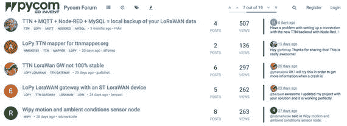
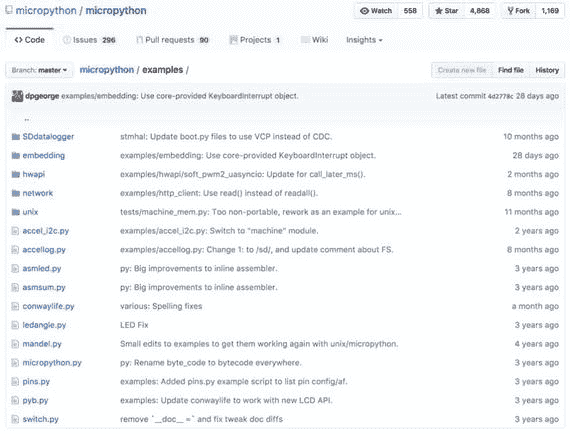
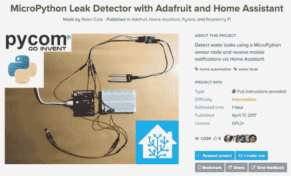
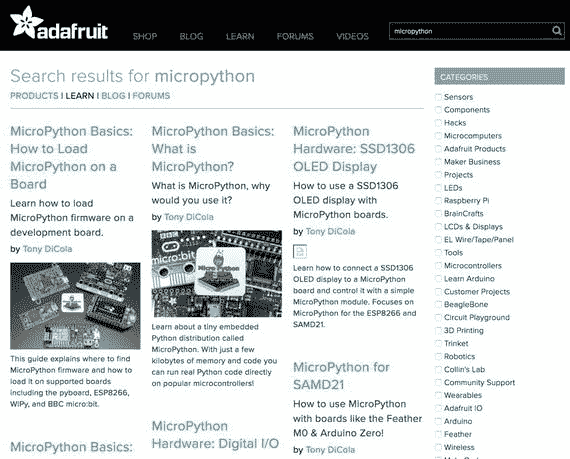

# 十二、何去何从

现在，您已经对 MicroPython、MicroPython 硬件、物联网以及您可以创建的项目类型和教程以及示例有了全面的介绍，是时候考虑您可以在本书页面之外做些什么了。

在这一章中，我们将探讨你能做些什么来继续你构建 IOT 解决方案的手艺。大多数人只是想继续为自己开发项目，要么是为了娱乐，要么是为了解决家里或办公室的问题。然而，有些人会想让他们的技能更上一层楼。

不管是哪种情况，有几件事你应该考虑。在接下来的章节中，我们将查看更多示例项目的来源，如何通过社交媒体和其他互联网资源加入 IOT 爱好者社区，以及如何成为日益壮大的创客群体中的一员。

## 更多项目有待探索

如果您想从事更多的 MicroPython IOT 项目，您会很高兴地得知有许多示例可供您探索。大多数示例或者在各种文档站点中，或者是来自社区的贡献，从高层次的概述到如何完成项目的详细说明。可悲的是，大多数例子很少或根本没有说明。然而，现在您已经有了关于使用 MicroPython IOT 项目和各种 MicroPython 板的详细说明 [1](#Fn1) ，您应该能够在很少或没有文档的情况下完成示例(但是文档总是有帮助的)。

MicroPython IOT 示例项目有几个存储库。大多数都是在专门讨论 MicroPython 或 MicroPython board 的论坛上(例如 Pyboard)，但也有一个名为 Hackster.io 的很酷的网站，这是一个通用硬件社区论坛( [`www.hackster.io`](http://www.hackster.io) )。我们一会儿将看到如何浏览该站点。首先，让我们看看 MicroPython 示例项目的一些参考资料。

### MicroPython 项目示例

有几个网站提供了 MicroPython 示例。有三种基本类型的网站:人们可以张贴他们的项目类别的论坛，有示例项目的文档站点，以及人们可以上传他们的项目的存储库。让我们来看看每一个。

Tip

查找 MicroPython 示例的最佳方式是在 google 上搜索“MicroPython 示例”或“MicroPython 示例”。你会找到大量的点击，包括本章列出的那些资源。

### 论坛

第一种类型是论坛，提供了一系列类别，包括公告、问题和答案、常见问题、技术支持等等。幸运的是，有几个项目也有一个类别。有时该类别包括许多条目(主题),大多数是关于如何实现某个项目的问题。这有时会让寻找项目想法变得乏味。

MicroPython 论坛有这样一个分类( [`https://forum.micropython.org/viewforum.php?f=5`](https://forum.micropython.org/viewforum.php?f=5) )。虽然有超过 100 个主题，大多数是问题，但也有一些你可以探索的瑰宝。Pycom 也有一个 WiPy 论坛，有一个项目类别( [`https://forum.pycom.io/category/28/projects`](https://forum.pycom.io/category/28/projects) )。

使用论坛查找示例项目或样本可能需要一些工作，因为它们旨在供社区使用，因此包含许多问题和评论，但我觉得它们仍然是最好的资源之一。但是，请记住，它们是针对特定电路板(Pyboard 或 WiPy)的。使用它们的最佳方式是导航到论坛，滚动浏览主题或搜索关键词。图 [12-1](#Fig1) 显示了 Pycom MicroPython 项目类别的摘录。

图 12-1。

Excerpt from the Pycom MicroPython Project Category (courtesy of pycom.io)

### 文件

MicroPython 文档也是查找示例代码(但不是整个项目)的好资源。他们通常比论坛更好，因为他们组织得更好，有时写得更好。然而，与论坛一样，MicroPython 文档站点，尤其是示例，是特定于硬件的。也就是说，Pyboard 有一套文档，WiPy 和其他板有一套文档。

然而，文档中隐藏了一些示例项目。不幸的是，有些没有被很好地记录或者可能被部分记录。无论如何，这些示例中的代码通常比您在论坛中找到的要好得多。

使用文档侧的最佳方式是简单地导航到它们并浏览目录(仅此一点就使它们比论坛更好)。例如，图 [12-2](#Fig2) 显示了 Pycom MicroPython 文档中关于 PySense shield 的一个示例项目。

图 12-2。

PySense Sample Project (courtesy of pycom.io)

### 仓库

MicroPython 项目的最佳网站是资源库。这些通常托管在 GitHub 之类的源代码控制服务中。这些站点最有用的地方在于，您可以直接导航到源文件，并在浏览器中查看代码，跳过文档或演示页面。如果您只想了解如何实现某些功能，而不是浏览一长页文本，这就很好了。当然，使用示例的最佳方式是下载整个示例集。只需访问 GitHub 主站点并下载示例项目。这有多酷？

主要的 MicroPython 站点( [`https://github.com/micropython/micropython`](https://github.com/micropython/micropython) )是 MicroPython 示例项目库的最佳范例之一。这个资源库有很多示例，虽然有些是针对 Pyboard 的，但是您可以使用它们作为模板，来学习如何为各种各样的项目编写代码。图 [12-3](#Fig3) 显示了存储库主页的摘录。

图 12-3。

MicroPython GitHub Repository Sample Projects

大多数(如果不是全部的话——我还没有检查全部)示例都是在开源许可下许可的，比如 MIT 许可，这使得每个人都非常方便，因为 MIT 许可允许您使用甚至发布代码。(参见 [`https://opensource.org/licenses/MIT`](https://opensource.org/licenses/MIT) 获取麻省理工学院许可证的样本。)这很棒，因为我曾多次想使用一个项目的样本或演示，却发现许可证不允许这样做。

### 社区项目站点:Hackster.io

Hackster 网站是一个致力于学习硬件的社区。您可以找到各种各样的硬件示例项目，包括许多针对 MicroPython、Python、Raspberry Pi、Arduino 等的项目！MicroPython 项目的数量不多，但在不断增加。当你访问母网站( [`www.hackster.io`](http://www.hackster.io) )时，在搜索框中输入“MicroPython”即可搜索项目。一旦您输入搜索条件，搜索结果页面，您会看到所有您可以探索的项目。每一个都标有相对的难度等级，从简单到高级。您还可以看到示例项目被查看的次数以及该项目从社区中的其他人那里获得的好评数(您必须加入 Hackster.io 才能对项目进行评级)。最重要的是，有一个评论区，你可以用来鼓励设计师或向设计师寻求帮助。

Tip

在网上论坛发表评论或问题时，使用黄金法则。抵制发布观点、煽动异议或嘲笑的诱惑，只坚持事实。

我最喜欢 Hackster 站点的一点是，这些样本通常都有很好的文档记录，并且经常包括项目的几张照片。由于站点的独特结构，这些示例被组织成易于理解的部分。例如，“I2C 上的字符 LCD”([`www.hackster.io/dzerycz/character-lcd-over-i2c-ba8ee9`](http://www.hackster.io/dzerycz/character-lcd-over-i2c-ba8ee9))的网页包含一个概述部分，它给出了项目的简短描述、相关标签、难度等级、出版日期，甚至是许可证。这使得审查项目变得非常容易。

例如，有一个中级项目的优秀例子，它不仅有据可查，而且写得很好。它就是罗宾·科尔的“带 Adafruit 和家庭助手的 MicroPython 检漏仪”。图 [12-4](#Fig4) 显示了项目概述的摘录。如果你想看另一个优秀项目，请访问 [`https://www.hackster.io/robin-cole/micropython-leak-detector-with-adafruit-and-home-assistant-a2fa9e`](https://www.hackster.io/robin-cole/micropython-leak-detector-with-adafruit-and-home-assistant-a2fa9e) 。

图 12-4。

Hackster.io sample project

如果您从概述向下滚动，您会发现演示如何连接硬件的部分(像我在本书中介绍的项目)，代码的简短演练，以及如何使用项目的描述和演示。

一些样本包括演示或解释项目的短视频。在页面的末尾，您可以找到评论部分，您可以使用它来阅读其他人对该项目的评论，以及其他人对该项目的疑问。如果你被一个样本卡住了，一定要阅读所有的评论——很有可能有人已经提出了这个问题或者解决了这个问题。

What About Hackaday.io?

另一个和 Hackster.io 类似的网站是 Hackaday.io，它很像 Hackster.io，因为你可以搜索 MicroPython 项目。然而，我不像 Hackster.io 那样喜欢它，但不要让这阻止你探索它——试试吧！

### 知识库:learn.adafruit.io

关于 MicroPython 的另一个极好的信息源是 learn.adafruit.com。这个网站包含了各种主题的文章、博客和教程。与用户论坛非常相似，内容会频繁地添加到这个站点。所以，你应该定期访问网站，搜索你的主题。例如，要查找 MicroPython 内容，只需搜索 MicroPython。或者，可以用这个链接: [`https://learn.adafruit.com/search?q=micropython`](https://learn.adafruit.com/search?q=micropython) &。

我经常使用这个网站来寻找项目的想法。即使文章、博客或教程不完全是您想要的，或者可能与您的硬件不匹配，它也是值得一读的。例如，如果您计划使用 Charlieplex LED ( [`https://www.adafruit.com/?q=charlie`](https://www.adafruit.com/?q=charlie) )构建一个项目，您可以在 [`https://learn.adafruit.com/micropython-hardware-charlieplex-led-matrix/software?view=all`](https://learn.adafruit.com/micropython-hardware-charlieplex-led-matrix/software?view=all) 找到教程。虽然本教程以 Feather 和 ESP8266 板为特色，但您仍然可以学习使用 Charlieplex LED 的一些知识，包括驱动程序(您可以修改)、提示以及如何使其与其他 MicroPython 板配合使用的见解。

图 [12-5](#Fig5) 显示了来自 learn.adafruit.com 的摘录，展示了一些关于 MicroPython 的有趣内容。请务必查看该网站最近的新增内容。

图 12-5。

MicroPython Content on learn.adafruit.com

现在您已经看到了更多示例项目的参考资料，让我们讨论一下如何加入社区并为 IOT 不断增长的所有 MicroPython 资源库做出贡献。

## 加入社区

一旦您掌握了本书中的示例项目以及其他资源中的一些项目，是时候通过加入 IOT 开发者和爱好者社区来进一步发展您的爱好了。

在这一节中，我将讨论一些你可能想要分享你的知识的原因，分享和贡献的礼仪，以及一些你可能想要加入或至少监控的示例社区。正如您将看到的，这些并不完全是专门针对 MicroPython 的，但是可以成为很好的思想来源。让我们从为什么我们想要分享开始。

### 为什么要投稿？

随着越来越多的自由思想者推动像 MicroPython 和 IOT 这样的爱好，分享的概念变得越来越流行。这不是偶然的。Python、MicroPython 和 IOT 的许多创始人和先驱都是开放硬件和开源的倡导者。这不仅适用于硬件和软件，也适用于其他智力产品，如已发布项目的源代码和文档。

许多人认为他们的代码应该是免费的，任何人都可以使用和修改。例如，如果你修改了别人的设计或代码，你不仅应该分享改进的设计，还应该表扬原创者。在某些情况下，这就像列出原作者一样简单，但其他时候这可能意味着给原作者你的修改。只要你遵循许可证的指导方针，共享是公平合理的。

然而，根据示例代码的编写方式(许可方式)，共享内容可能会有一些限制。例如，可能无法共享专有库中的代码。虽然您可能是使用该库的代码的创建者，但您并不拥有该库，也不能共享它。您很可能可以与其他人共享您的代码，但是发布可能会受到限制。

共享您的项目也意味着将它们放在其他人可以找到的地方。您可能希望将它们免费提供给任何人，或者您可能希望限制人们可以对您的项目做什么。幸运的是，有些网站可以很好地处理这两种情况。

那么，为什么要贡献你的项目呢？有很多原因，包括看到你的一个项目被其他人喜欢、使用和制作是一种很好的感觉。也许做出贡献的最重要的原因是帮助他人了解你所拥有的，或者更好地，了解如何避免陷阱或问题。这样，我们都可以通过学习最佳实践或更好的方法来实现我们的想法。最后，你自己的项目和经验，当被分享时，将会激励其他人去创造其他的项目，或者改进你的项目。

我在自己的项目中遇到过这种情况。人们把我做的东西拿来改进。因为他们反过来分享了他们的项目，所以我可以在我的项目中加入他们的很多改进，使它们比我想象的还要好。

### 哪个执照，在哪里？

那么，你怎么知道哪个许可证在起作用呢？所有拥有任何形式的源代码、文档、示例等的网站。，将有一个明确标明的许可证。它可能出现在屏幕底部或其他不连续的位置，甚至只出现在标有“许可证”或类似标签的特殊页面上。

例如，micropython.org 网站上的许可证位于标题“完全免费的开源软件”下，并引用了 MIT 对 MicroPython 核心的许可证，该许可证解释如下。您可以在个人、教育和商业产品中自由使用和改编 MicroPython。

类似地，Hackster.io 网站有一个部分，用于在有人上传项目时指定许可证。图 [12-6](#Fig6) 展示了他们网站上的一个 MicroPython 项目的例子。如您所见，许可证清楚地列在项目信息摘要中。事实上，您可以点击链接并阅读许可证。幸运的是，Hackster.io 和其他网站上的大多数项目都是开源的，在您的项目中使用它们应该是安全的(但还是要检查一下)。

图 12-6。

Example Project Information from Hackster.io Tip

在发布之前，请务必检查您使用的任何示例的许可，以确保您不仅符合创作者的意愿，还符合所分配许可的法律限制。

现在，让我们来关注如何分享你的项目。

### 我们如何分享

你可能想知道为什么有人愿意免费提供他们工作了几个小时的东西。虽然期望是你应该与他人分享你的酷项目，但这并不是一个硬性规定。事实上，已经有一些人付费提供他们的项目，作为在商业渠道上销售 IOT 解决方案的前奏。然而，显然大多数爱好者免费分享他们的想法和项目。

有几个社区可以让你分享你的项目，我们将在下一节看到其中的一些。但是首先，有一些关于共享对象的事情你必须了解。信不信由你，如果你决定加入 IOT 社区或任何类似的社区，有一套你应该遵守的规则——有些是书面的，有些不是。下面列出了一些准则(规则),当你与社区分享你的想法、项目和评论时，你应该注意。

### 保持你的设计原创

没有人喜欢模仿者。当你 5 岁的时候，你不喜欢它，当你看到你设计并免费分享的东西被评为“本月最佳设计”时，你不会欣赏它。

因此，你必须做足功课，以确保你的设计是独一无二的。你不需要有目的地改变你的设计，使它不像其他人的，但你应该做尽职调查，至少搜索类似的项目。请记住，如果您开发一个类似的项目，这是可以的，但是简单地复制别人已经发表的东西通常是不好的形式(或者可能违反了许可)。

在极少数情况下，当你的项目与另一个项目几乎相同时，只要你的工作是你自己的，就不应该有问题。事实上，我也曾遇到过这种情况。另一位设计师和我的回应是，“很酷的项目。比如思想，嗯？”再说一次，这没有什么不对，只要你们双方都承认相似之处，并且没有许可问题。

如果像你一样的另一个项目确实是相同的设计，但授权不同，你可能必须与其他设计师谈判。当项目获得所有权许可(例如，商业地产)时，这种情况可能会发生，但考虑到大多数 IOT 样本库是人们免费共享其项目的站点，这种情况很少发生。

让我们看另一个非源代码的例子。十几个不同的覆盆子 Pi 盒子尺寸相似，有相同的端口开口，甚至以相同的方式组装(扣在一起)的可能性有多大？很有可能，是吗？这是否意味着有一个原件和 11 个副本？不，当然不是。我说的不是这个。

我所说的独特是指在这 12 个案例中，你应该能够找出它们之间的一些差异。它们是如何打印的(例如，在构建平台上的方向)，它们是否由几个部分组成，它们是否设计有通风等。即使 12 个设计师都同时开始，也会有一些微小的差异。更重要的是，每个都是自己的作品。也就是说，没有人用别人的设计冒充自己的设计。

在软件项目的情况下，源代码很可能会在例子中有一点不同。虽然有多大的差异使源代码被认为是不同的是律师们要解决的事情，但可以说，如果你的代码和另一个代码几乎相同，但在不知道对方的情况下创建，只要没有许可冲突，共享你的代码是可以的。

最后，当您共享基于他人作品的项目时，您必须在代码、文档和项目网站上注明原设计者。也就是说，你明确地声明你的项目是原作的衍生。包含原始设计的链接以及修改列表也是很好的形式。同样，这是假设许可允许的。

### 检查执照

我已经在下载和使用示例项目方面提到了许可。回想一下，大多数存储库会要求您为您的项目指定一个许可证。这允许存储库托管您的项目，并向每个人传达您关于所有权、使用许可等的意图。

正如我之前所说的，在使用任何设计之前，您需要检查许可。如果打算修改，需要密切关注牌照。很明显，大多数许可证都允许你使用这个设计，并且允许你修改它。

然而，一些许可的不同之处在于修改的所有权。一些开源许可证，比如 GPL，允许修改，但是如果你打算发布这些修改，要求你将这些修改交给原始所有者(创建和许可它的个人或组织)。也就是说，您可以随意修改它以供个人使用，但是一旦您分发了这些更改，您必须将它们交给许可证的所有者。

我只遇到过几次，但在那些情况下，设计师是在为商业产品设计原型。许可证和实际上该项目的文本清楚地表明，她正在寻求设计方面的帮助，但该设计不会公开。小心这一点，小心行事。你做的任何工作都可能是为了所有者的利益，而不是你的利益。

Tip

如果对许可证有疑问，请联系创建者并直接询问他们。

由于大多数示例 IOT 项目都获得了共享和自由修改的许可，所以您通常不必太担心。但是，我建议您在使用任何项目之前检查一下许可证，尤其是如果您打算共享或发布您的派生。

### 保持适当

信不信由你，有些业余爱好者和爱好者有着令人印象深刻的生动想象力，他们提出了一些可能被一些人认为不合适甚至淫秽的 IOT 项目。不管你自己的观点是什么，你都应该努力包容别人的观点。这并不意味着你必须妥协自己的观点；只是要意识到你的可能会冒犯别人，并努力把冒犯降到最低。

更具体地说，不要把主题不合适的项目上传到任何人都可以看到的网站上。上传一些宣传某个主题、理念等的项目(可能)是可以的。(前提是没有侵犯版权)；只是不要上传明显具有攻击性或意图造成伤害的项目或评论。

例如，如果你考虑到 IOT 项目在学校中被用来教授孩子们使用硬件和设计软件的技术和技巧，你就不应该上传带有家长可能认为不合适的主题的项目。最明显的当然是攻击性的语言、成人主题和诽谤性的图像。

作为 post-no-post 决策的一部分，您应该检查托管所选存储库的站点的使用情况和用户协议。确保你阅读了关于什么是合适的，什么是不合适的部分，并坚持这样做。

还有一个角度要考虑。您应该避免上传非法或可能非法的示例项目。考虑到 IOT 社区包括全球，这可能很难辨别。然而，大多数网站会有语言提示什么是允许的，什么是不允许的。有些网站在协议中规定他们(网站)有权删除他们认为不合适的内容。

例如，我曾经看到一个射频识别(RFID)阅读器的项目，可以用来从远处读取 RFID。这听起来无害，但是想想使用 RFID 的东西的数量，比如安全徽章、身份证明，甚至信用卡。显然，从你拥有的东西上读取 RFID 是没问题的(事实上，这就是该项目所展示的)，但是该项目可能(并且很可能已经)被用于邪恶。幸运的是，其他人注意到了这一点，项目网站已经被删除(URL 导致 401 错误)。

因此，在你上传一个设计或样本项目之前，确保你理解并同意用户协议中关于什么是合适的，什么是不合适的条款。大多数情况下，误解不会给你带来麻烦，但是如果你不止一次地误解，网站上的人可能会想和你谈谈或者限制你的访问。这让我想起了这一部分的开头——一定要尊重他人的观点，尤其是网站的目标受众。如果你不同意，找另一个网站。

### 注释你的作品

我可以判断一个样本 IOT 项目是好的还是高质量的方法之一是它是如何被注释和记录的。也就是说，设计师在网站上对项目的描述有多好。如果我遇到一个看起来很吸引人的项目，却发现设计师没有费心描述如何连接硬件，或者用七个字(或更少)解释代码，没有提供任何说明，或者更糟的是没有提供任何实际实现的照片，我不会使用它。

因此，你应该努力提供尽可能完整的描述。你不必写一部小说、中篇小说或学位论文；但是你应该提供足够的信息来描述预期的用途；它解决什么问题；以及一组关于如何编写、编译和部署源代码的说明。

唯一的例外是，您仍在处理一个项目，或者您计划在最终确定之前进行更改。在这种情况下，你应该用一些关于正在进行的工作、正在实验等等的措辞来标记(注释)这个项目。如果您的存储库具有将项目标记为这样的特性，那么就使用它。这样，其他人就会知道你的项目还没有准备好被普遍采用。这样做的一个原因可能是为了获得他人的反馈。我自己也这样做过，结果喜忧参半。大多数人都乐于评论他们喜欢它，但是不要评论，或者即使他们评论了，不管多么令人鼓舞，也不要建议任何改变或改进。

我还建议您提供一些联系信息，以便其他有问题的人可以联系您。大多数网站让浏览者很容易通过网站与您联系，但您可能希望提供其他联系方式(如电子邮件)。您可能不想提供您的家庭地址和电话号码(不要这样做)，但是电子邮件地址是让您向社区开放的一个好方法。

例如，我看到博客、示例项目甚至教程中，人们张贴了他们的 IRC 句柄、电子邮件地址，甚至有一次还张贴了他们的商业电话号码。虽然我可能不会走那么远，但我建议提供一个电子邮件地址，这样你就可以和喜欢这个项目的人交流了。另外，和某人一对一地讨论你的工作也很不错！

### 做一个好公民

假设您遇到一个样本项目，它不仅质量不高，而且(在您看来)设计或实现也不正确。你应该立即评论并通过轻率地评论他们的代码有多愚蠢来打击设计师的自尊心吗？不，当然不是！

我会做的(最有可能的)是完全忽略这个项目。我是说，为什么指出缺陷会让事情变得更糟？我发现整个社区(有一些例外)可能会做同样的事情而不发表评论。回想一下，决定一个项目是否设计良好的关键之一是有多少人使用它。通常，有一个计数器可以检查这一点。如果没有人喜欢它，甚至没有人下载它，你可以肯定它不会成为任何搜索列表或本月样本项目的榜首。

另一方面，如果你觉得有必要发表评论，一定要私下联系设计师，或者尽可能地表现出建设性。目标应该是帮助设计师改进他的项目，而不是挑战他们的智力(或骄傲)。

当我评论那些我觉得奇怪或者有缺陷的项目时(这种情况很少发生)，我通常会以问题的形式表达我的意见。一个问题通常不会让某人处于守势，如果措辞恰当，也不会冒犯他人。

例如，我可能会问，“你有没有发现如果用户多次按下按钮，代码可能会挂起？”这是一个询问设计师是否在你认为会失败的条件下测试了他的项目的好方法。这是很好的、建设性的批评，是最理智的形式。我敢肯定，如果你考虑一下你要说的话，你可以找到其他更好的方式来帮助人们改进他们的项目。

既然我们已经了解了为什么要分享以及如何以负责任的方式分享，那么让我们来发现一些你可能想要加入或者至少想要监督的社区。

### 建议的社区

有相当多的通用 Python 和 MicroPython 网站和在线社区可以访问，甚至可以加入。大多数在线社区都有存储库，您可以在其中搜索示例、提示、技术，甚至可以探索完整的项目。大多数网站都有一个或多个区域，会员可以在这里发表评论、提出问题或与论坛上的其他人进行交流。您通常必须加入才能发布回复或提问，但通常任何人都可以查看。

使用这些资源的最好方法是定期访问它们。更具体地说，你应该定期阅读(你感兴趣的)文章和论坛帖子。这可以让你了解最新的时事、新技术，甚至是挑战性问题的新解决方案。表 [12-1](#Tab1) 给出了一个简短的在线资源列表，你应该考虑访问这些资源来了解关于 Python、MicroPython、硬件和 IOT 的最新消息。我列出了一般的主题、URL 和对每个主题的简要描述。然而，你既不是必须加入这些社区，也不是只有这些网站你可以或应该加入。在某些情况下，您可能只想定期监控站点。

表 12-1。

Online Resources for Python, MicroPython, IOT, and Hardware

<colgroup><col> <col> <col></colgroup> 
| 主题 | 统一资源定位器 | 描述 |
| --- | --- | --- |
| MicroPython、Python 等等 | `hackster.io` | 各种项目的通用硬件和项目现场。在这里可以找到关于搜索 Python 或 MicroPython 的项目的详细解释 |
| Pyboard，MicroPython | [T2`http://docs.micropython.org/en/latest/pyboard/`](http://docs.micropython.org/en/latest/pyboard/) | Pyboard 上的 MicroPython 文档 |
| [T2`https://forum.micropython.org/`](https://forum.micropython.org/) | MicroPython 和 Pyboard 论坛 |
| 威皮，MicroPython | [T2`https://docs.pycom.io/pycom_esp32/index.html`](https://docs.pycom.io/pycom_esp32/index.html) | WiPy 和其他 Pycom 板上的 MicroPython 文档 |
| [T2`https://forum.pycom.io/`](https://forum.pycom.io/) | MicroPython 和 Pycom 板论坛 |
| BBC micro:bit | [T2`https://microbit-micropython.readthedocs.io/en/latest/`](https://microbit-micropython.readthedocs.io/en/latest/) | BBC micro:bit 上的 MicroPython 文档 |
| CircuitPython | [T0](https://learn.adafruit.com/search?q=circuitpython)T1】 | Adafruit 关于 CircuitPython 的教程 |
| [T2`https://blog.adafruit.com/?s=circuitpython`](https://blog.adafruit.com/?s=circuitpython) | Adafruit 在 CircuitPython 上的博客 |
| 计算机编程语言 | [T2`https://www.python.org/`](https://www.python.org/) | 常规 Python 信息 |
| [T2`https://www.python.org/doc/`](https://www.python.org/doc/) | Python 文档 |
| [T2`https://www.python.org/community/`](https://www.python.org/community/) | Python 论坛 |

请注意，这里有专门针对 Python、Raspberry Pi、通用硬件和类似资源的网站。虽然许多人并没有专门讨论或介绍 MicroPython，但是大多数人都有一个不断增长的知识库，即使是使用 MicroPython，这个知识库通常也非常有用。

例如，我尝试连接到 Raspberry Pi 网站，以了解那里正在发生的事情。通过查看为 Raspberry Pi 及其本机操作系统实现的项目，我经常可以获得 IOT 项目的想法或简单的功能想法。我发现经常有这样的情况，虽然源代码可能有很大的不同，但大多数硬件(连接等。)无需修改即可应用，这是有意义的，因为硬件与设备上运行的操作系统无关(但驱动硬件的库相关)。

另外，不要低估使用你最喜欢的在线搜索工具进行关键词搜索的能力。我经常发现一些晦涩难懂的信息，它们不会发布在更受欢迎的网站上。在大多数情况下，它们是写得很好的博客。在访问上面列出的网站之前，我通常会先进行关键字搜索。如果没有别的，它证实了我正在研究的东西是独特的还是普遍存在的。您还应该考虑使用错误消息中的关键短语作为搜索词来获得特定错误的帮助。

也有一些你应该考虑获得的优秀期刊。我排除了典型的 Windows、PC 和通用编程期刊，不是因为它们没有帮助，而是因为它们对于 IOT 相关的研究来说过于笼统。相反，以下是我发现对我的 IOT 研究或任何电子或业余爱好项目非常有帮助的期刊。

*   MagPi 杂志:致力于所有树莓派事物的月刊。包括许多关于示例项目的文章、关于 Raspberry Pi 的新闻、外围设备和一般硬件评论。(`raspberrypi.org/magpi`)
*   Make:一个致力于创客社区广阔领域的杂志，展示样本项目、教程、硬件、工具、无人机、机器人等等！这是一本真正的一站式期刊，涵盖了黑客、调整和一般 DIY 爱好者、爱好者和专业人士。( [`http://makezine.com/`](http://makezine.com/)

现在我们已经看到了几个在线社区(但不是一个完整的列表，因为更多的社区似乎每周都在增加)以及一些你可以购买的期刊，让我们讨论一下一旦你成为 IOT 和 IOT 相关在线社区的一名有生产力的贡献成员，你可以采取的下一步行动——成为一名创造者。

## 成为一名创造者

从新手成长为爱好者(甚至是专业人士)的下一步是定期练习你的手艺，并与世界分享你的知识。实现这一愿望的一个绝佳途径是成为一名创造者。创客被广泛认为是他们感兴趣领域的专家。最棒的是，一个制造者的兴趣可能会因人而异。也就是说，成为一名创客并不是学习一套特定的技术(学术或其他)。这是一门手艺的练习。

### 什么是创客？

可悲的是，对于制造者是什么或者应该是什么，并没有单一的定义。这是因为创客是一个拥有高度创造性技能的人，他们渴望修补和从事各种项目，从喷火的机械雕塑到电子 gismos，再到回收材料以廉价建造物品的新方法。

事实上，一个制造者仅仅是一个渴望创造东西的工匠、手艺人、爱好者或爱好者。因此，制造商。因此，有许多种制造商。然而，将他们团结在一起的是愿意与他人分享他们的技术和技能。因此，要真正成为一名创客，你必须加入创客社区。

### 分享你的想法

你可以成为一名创造者，但对在线社区毫无贡献，尽管这很好，但如果你想帮助社区变得更强大，你应该更多地参与进来。最好的方法是加入一个或多个在线论坛并开始投稿。

这并不意味着你必须从发布一些非常酷和成功的 MicroPython 或 IOT 项目开始，这些项目配有获奖的文档和防弹代码，计算机科学教授有一天会用它们来教导年轻人模仿你的才华。当然，你可能会对此嗤之以鼻(甚至大笑)，但我遇到过一些人，他们害怕发表任何东西，以免出错或被嘲笑不准确。不要担心这个-最好的贡献者是那些帮助你成长的人，你通过学习更好的技术来成长！

避免这种情况的最好方法是慢慢开始，先问自己的问题。你也可以从对你喜欢的想法和项目发表一些积极的评论开始。随着你越来越多地参与到主题和技巧中，你的知识会扩展到你可以开始回答别人的问题的程度。

如果您想更多地参与 MicroPython，我鼓励您考虑这种程度的参与。我相信与社区互动并获得乐于助人和分享想法的声誉是业余爱好者和爱好者的区别之一。

因此，如果你想成为一名创客，你应该与他人分享你的想法。

### 参加活动

另一个让你更多参与创客社区的方法是参加创客集会(makerfaire.com/)。这些活动在世界各地举行。这些活动允许制造者展示他们的创造，教导他人，并庆祝所有的创造者。查看 Maker Faire 网站，了解您附近的活动。

如果你住在大城市或附近，你可能会发现有 Python、Raspberry Pi、MySQL、Arduino 的本地用户组，甚至还有 maker 用户组。尝试搜索您所在地区的事件和团体，并找出它们在何时何地相遇。大多数团体都有一个开放的政策，邀请所有人参加他们的会议。然而，有些确实对特许会员收费，但这通常伴随着额外的好处，如使用工具、实验室和批量购买折扣。

你可能想知道创客活动如何帮助你完成 MicroPython 或 IOT 项目。我很高兴地告诉大家，出席人数非常多，很多与会者都对 IOT 甚至 Python 感兴趣！正如我们从本书其他章节中了解到的，我们在 Python 中可以学到的很多东西都转移到了 MicroPython 上。硬件和 IOT 也是如此。当然，你可能只会看到使用其他板(如 Raspberry Pi 或 Arduino)的 IOT 项目的演示，但是大多数硬件都可以在 MicroPython 中使用。如果没有别的，你将获得什么是可能的知识，你可以在你的下一个项目想法中利用它。

一旦你参加了一个活动——即使是一个与 MicroPython 无关的活动，比如 Raspberry Pi meetup，你也会被吸引住。通过这种方式，你可以从别人那里学到很多东西，谁知道呢，也许有一天你会在某个活动上展示自己。从我的经验来看，在一个开放的论坛上与他人分享你的知识是非常令人满意的，比如会议、用户组、meetup 或 Maker Faire。这时你知道你已经获得了一个典型的制造者所拥有的声誉、技能和知识。

Tip

许多 Raspberry Pi 用户在他们的项目中使用 Python。不要犹豫去寻找一个 Raspberry Pi meetup，因为你可以从 Raspberry Pi Python 开发者那里学到很多东西。

这并不意味着当你读到这一章的时候，你已经是 IOT 所有方面的专家，甚至自称是专家，但是你仍然应该在你的道路上走得很好。

## 摘要

将你的 IOT 技能提升到一个新的水平是大多数人最终会被激励去实现的。然而，即使你不想成为一个教授世界的旅行制造者，你也可以通过加入提供 Python、IOT 和开放硬件的在线社区学到很多东西。

在这一章中，我就如何最好地与在线社区互动，在哪里加入在线社区，甚至如何将你的技能发挥到最高热情水平并成为一名创造者提出了建议。因此，本章结束了我们在 MicroPython for 之路上的旅程，我希望它能激励您继续练习您的技能，并最终加入志同道合的爱好者社区。

我真诚地希望这本书已经为你打开了许多关于 Python、MicroPython、IOT 和任何开放硬件的大门。祝你的 IOT 项目一切顺利，如果不顺利，你会在这个过程中学到一些东西。只要记得与世界分享你的经历——好的或坏的——并从别人的努力中回报一点你能得到的。

Footnotes [1](#Fn1_source)

这是我写这本书的主要动机之一。