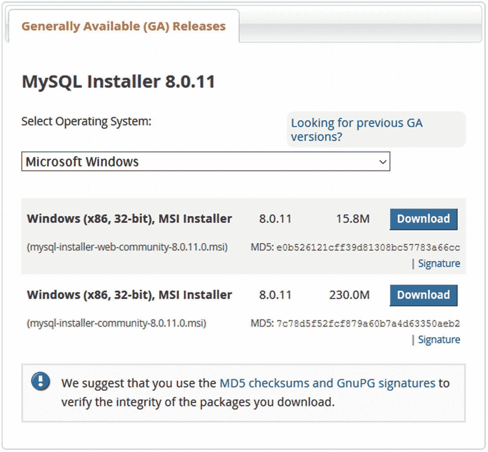
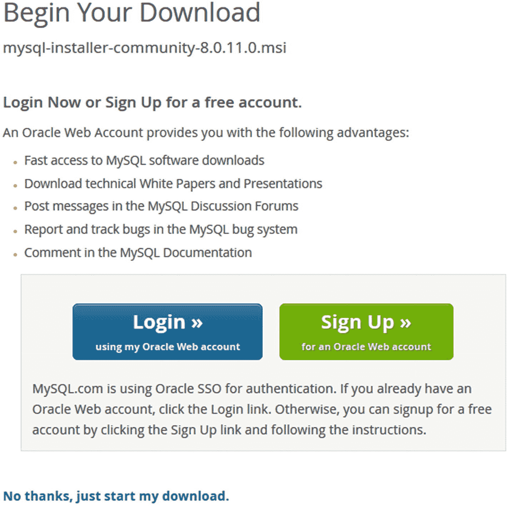
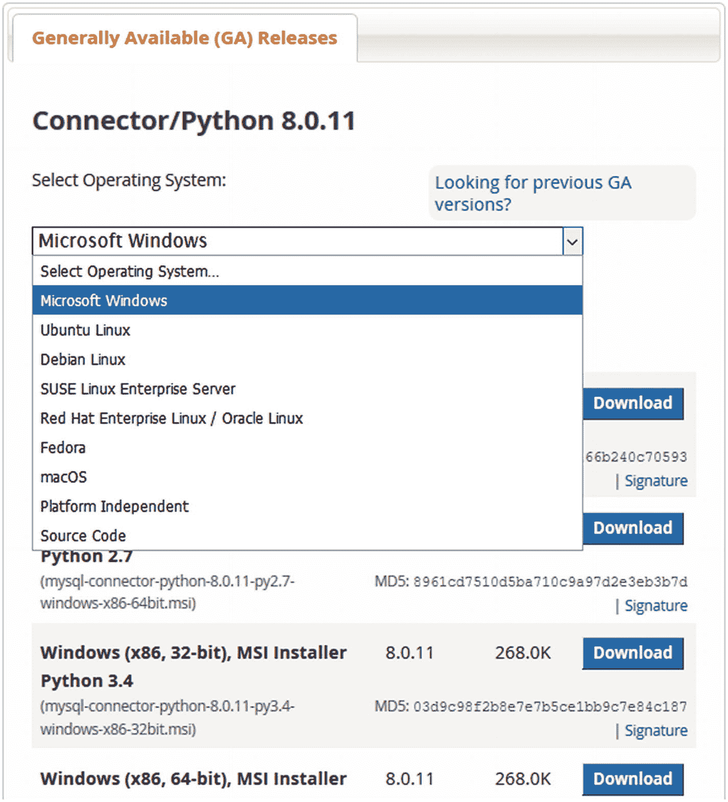
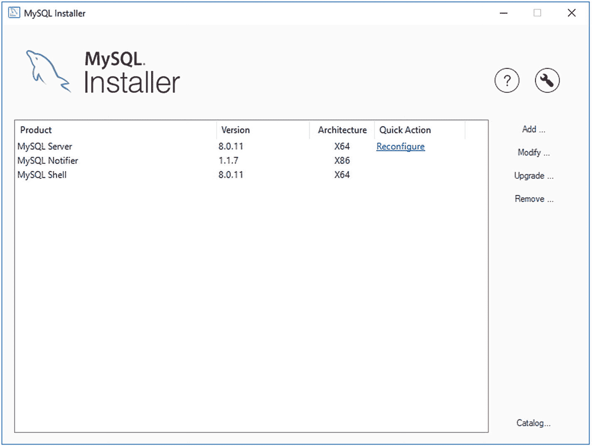
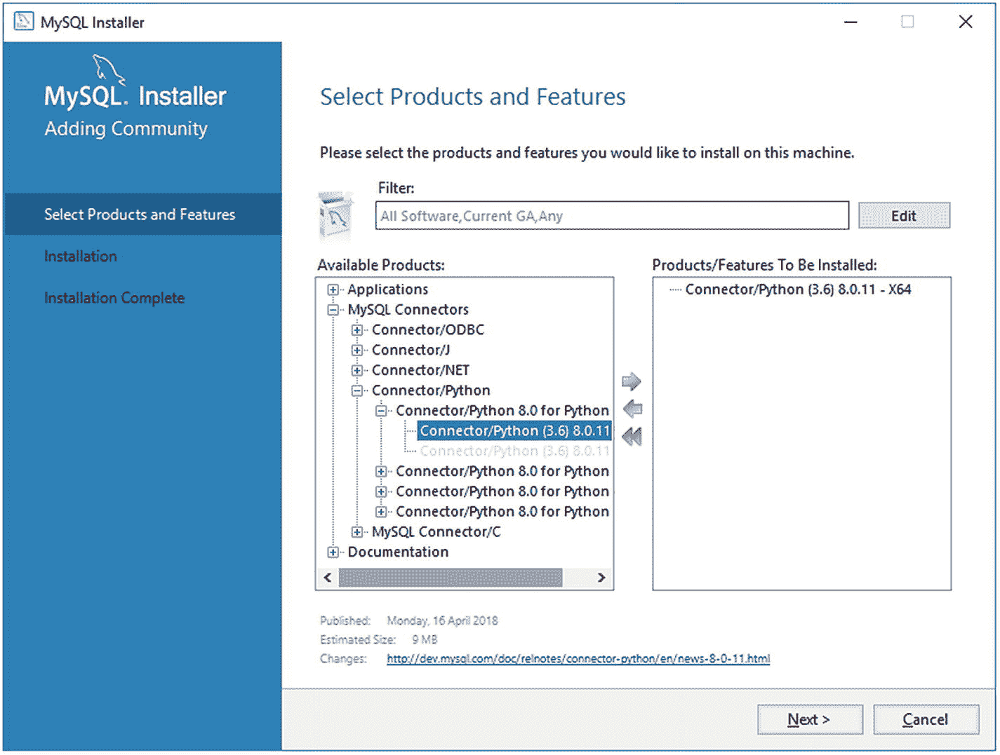
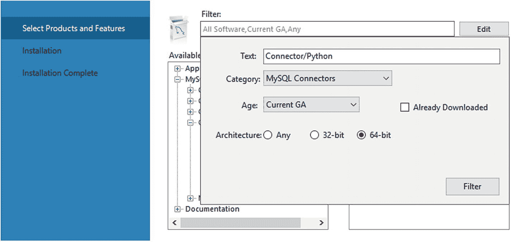

# 1.介绍和安装

您将踏上 MySQL Connector/Python 世界的旅程。欢迎登机！这是十步指南的第一章，将带您完成从安装到故障排除的所有内容。在这个过程中，您将熟悉连接器及其 API 的特性和工作方式。

本章将通过浏览版本、版本和 API 来介绍 MySQL 连接器/Python。本章的中间部分将讨论如何下载和安装连接器，最后一部分将讨论 MySQL 服务器，如何为本书中的示例设置服务器，并对示例本身说几句话。

## 介绍

MySQL Connector/Python 是 Python 程序和 MySQL 服务器数据库之间的粘合剂。它可用于使用数据定义语言(DDL)语句操作数据库对象，以及通过数据操作语言(DML)语句更改或查询数据。

也可以把 MySQL Connector/Python 称为数据库驱动。它是 Python 的官方 MySQL 连接器，由 Oracle 公司的 MySQL 开发团队开发和维护。它有效地支持三种不同的 API，尽管通常只直接使用两种。

本节介绍 MySQL 连接器/Python 版本、版本和三个 API。

### 版本

在 2012 年之前，没有 Oracle 维护的 Python 连接器。还有其他第三方连接器，比如 MySQL-python (MySQLdb)接口；然而，它越来越老，官方只支持 MySQL 5.5 和 Python 2.7。

MySQL 决定开发自己的连接器:MySQL Connector/Python。它被编写为与 MySQL-python 接口兼容，并与最新的 MySQL 服务器和 python 版本保持同步。最初的正式发布(GA)版本是 1.0.7，于 2012 年 9 月发布。版本 2.1 发生了重大更新；它引入了 C 扩展，允许更好的性能。截至 2018 年 4 月的最新 GA 版本是 8.0.11 版，其中额外引入了 X DevAPI。这是本书主要关注的版本。

### 注意

如果看一下 MySQL Connector/Python 的变化历史，可能会有点疑惑。8.0 之前的版本系列是 2.1，有几个 2.2 的 GA 前版本。8.0 版本的列表同样令人困惑:最新的 GA 前版本是 8.0.6，而第一个 GA 版本是 8.0.11。为什么跳跃？大多数 MySQL 产品的版本号是一致的，这要求发布号有些不规则，但现在这意味着 MySQL Server 8.0.11 和 MySQL Connector/Python 8.0.11 是一起发布的。

建议使用 GA quality 最新系列的最新补丁发布。只有最新的 GA 系列获得了所有的改进和错误修复。这意味着，在撰写本文时，建议使用最新的 MySQL Connector/Python 8.0 版本。虽然 MySQL Connector/Python 8.0 版本与 MySQL Server 和其他 MySQL 产品的版本结合在一起， <sup>[1](#Fn1)</sup> 它们与较旧的 MySQL Server 版本向后兼容。所以，即使你还在用，比如 MySQL Server 5.7，你还是应该用 MySQL Connector/Python 8.0。

### 小费

使用 GA quality 最新版本系列的最新版本，确保您不仅可以获得所有最新功能，还可以获得最新的错误修复。最新的 MySQL 连接器/Python 版本可以与旧的 MySQL 服务器版本一起使用。另一方面，旧版本的 MySQL Connector/Python 可能与最新的 MySQL 服务器版本不兼容。例如，MySQL Server 8.0 默认使用`caching_sha2_password`身份验证插件，直到最近 MySQL Connector/Python 才支持该插件。

与任何正在开发的产品一样，新功能会定期添加，错误也会得到修复。您可以关注发行说明中的变化，这些信息可从 [`https://dev.mysql.com/doc/relnotes/connector-python/en/`](https://dev.mysql.com/doc/relnotes/connector-python/en/) `.`获得

除了各种版本的 MySQL Connector/Python 之外，还有两个不同的版本可供选择。让我们看看他们。

### 社区版和企业版

MySQL 产品有两个不同的版本:社区版和企业版。企业版是 Oracle 提供的商业产品。两个版本之间的差异因产品而异。例如，对于 MySQL Server，企业版有几个额外的插件。对于 MySQL Connector/Python，区别更微妙。

所有产品的一个共同区别是许可证。社区版是在 GNU 通用公共许可证 2.0 版下发布的，而企业版使用专有许可证。此外，企业版通过 MySQL 技术支持服务提供技术支持。对于 MySQL Connector/Python 本身来说，这是目前两个版本之间唯一的区别。

本书适用于两个版本中的任何一个，除了在本章后面简要讨论下载位置和安装方法时，不会提到版本。所有的例子都是用 Community Edition 编写和测试的。

相比之下，当涉及到 API 时，使用哪种 API 有很大的不同。

### 蜜蜂

MySQL Connector/Python 中实际上可以使用三种不同的 API。如何使用 API 是第 [2](02.html) - [9](09.html) 章的主要目的。在真正开始之前，有必要简要了解一下它们的区别。

表 [1-1](#Tab1) 显示了三个 API，它们在哪个 MySQL 连接器/Python 模块中可用，包括 API 支持的第一个 GA 版本，以及讨论它们的章节。

表 1-1

MySQL 连接器/Python API

<colgroup><col class="tcol1 align-left"> <col class="tcol2 align-left"> <col class="tcol3 align-left"> <col class="tcol4 align-left"></colgroup> 
| 

应用程序接口

 | 

组件

 | 

第一版

 | 

章

 |
| --- | --- | --- | --- |
| 连接器/Python API | `mysql.connector` | 1.0.7 | 2, 3, 4, 5, 9, 10 |
| c 扩展 API | `_mysql_connector` | 2.1.3 | four |
| X DevAPI | `mysqlx` | 8.0.11 | 6, 7, 8, 9, 10 |

此外，Connector/Python API 和 X DevAPI 既存在于纯 Python 实现中，也存在于使用 C 扩展的实现中。这两种实现是可以互换的。整本书都会提到这两种实现之间的一些差异。

正如您所看到的，主要的焦点是连接器/Python API 和 X DevAPI。连接器/Python API 和 C 扩展 API 专门使用 SQL 语句来执行查询。另一方面，X DevAPI 支持 NoSQL 方法来处理 JSON 文档和 SQL 表，并支持 SQL 语句。X DevAPI 也是其他编程语言的通用 API，包括 JavaScript (Node.js)、PHP、Java、DotNet 和 C++。

那么应该选择哪个 API 呢？从到目前为止的描述来看，选择 X DevAPI 听起来是显而易见的。然而，事情远不止如此。

如果专门使用 SQL 语句执行查询，C 扩展和 C 扩展 API 更成熟。例如，它们为参数绑定和预处理语句等特性提供了更好的支持。如果您需要连接池，它们也是可供选择的 API。如果您有现有的 Python 程序，它们也很可能使用连接器/Python API(启用或不启用 C 扩展实现)。

另一方面，X DevAPI 是一个新的 API，它是为适应现代需求而从头设计的。该 API 也适用于其他编程语言，当应用程序需要多种语言时，可以更容易地在语言之间进行切换。API 的 NoSQL 部分使得针对 SQL 表的简单查询和使用 JSON 文档变得更加简单。新的命令行客户端 MySQL Shell 也支持通过 Python 或 JavaScript 使用 X DevAPI。所以，X DevAPI 有很多新的项目。

由于 X DevAPI 本质上是 1.0 版本(MySQL 8.0 是 X DevAPI 的第一个 GA 版本)，新特性更有可能在相对较短的时间内陆续推出。如果您缺少某个功能，请留意发行说明，看看该功能是否可用，或者在 [`https://bugs.mysql.com/`](https://bugs.mysql.com/) 注册您感兴趣的功能。

与“便利性”相比，是否使用 C 扩展在很大程度上是一个性能问题 C 扩展实现提供了更好的性能，尤其是在处理大型结果集和准备好的语句时。然而，纯 Python 实现可以在更多平台上使用，在自己构建 MySQL Connector/Python 时更容易使用，也更容易修改(顾名思义，纯 Python 实现完全是用 Python 编写的)。

MySQL 连接器/Python 的介绍到此结束。是时候开始安装过程了。第一步是下载 MySQL 连接器/Python。

## 下载

直接下载 MySQL 连接器/Python；但是，还是有几点考虑。这些注意事项和执行下载的步骤是本节的主题。

首先要问的是，您需要连接器的社区版还是企业版。这决定了下载和安装选项。社区版可以从几个地方获得，既有源代码形式，也有二进制发行版。企业版仅作为 Oracle 的二进制发行版提供。

### 小费

安装 MySQL Connector/Python 社区版的推荐方法是使用 Python 打包权威(PyPa)/Python 包索引(PyPi)中的包。这是使用`pip`工具完成的，不需要预先下载任何文件。使用 PyPi 的一个缺点是从发布到在 PyPi 中可用会有一个小的延迟。

表 [1-2](#Tab2) 概述了 MySQL Connector/Python 可用的交付方法，以及该方法是否可用于社区版和企业版。

表 1-2

MySQL 连接器/Python 下载选项

<colgroup><col class="tcol1 align-left"> <col class="tcol2 align-left"> <col class="tcol3 align-left"></colgroup> 
| 

分配

 | 

社区版

 | 

企业版

 |
| --- | --- | --- |
| Python 包(`pip`) | 可用；参见安装 |   |
| Windows 安装程序 | 有空的 | 有空的 |
| MSI 安装程序 | 有空的 | 有空的 |
| APT 知识库 | 有空的 |   |
| SUSE 知识库 | 有空的 |   |
| Yum 仓库 | 有空的 |   |
| RPM 下载 | 有空的 | 有空的 |
| DEB 包 | 有空的 | 有空的 |
| Solaris 软件包 | 有空的 | 有空的 |
| 苹果 | 有空的 | 有空的 |
| 独立于平台的 tar 或 zip 文件 | 有空的 | 有空的 |

如您所见，MySQL Connector/Python 可用于各种平台和不同的发行版。社区版可以直接使用`pip`命令行工具获得；为 Red Hat Enterprise Linux、Oracle Linux 和 Fedora Linux 使用 MySQL Yum 存储库；适用于 Debian 和 Ubuntu 的 MySQL APT 库；并为 SLES 使用 MySQL 数据库。`pip`和包存储库选项仅适用于社区版。

### 小费

MySQL 连接器/Python 的 MySQL 安装程序和 MSI 安装程序都可用于 Microsoft Windows。如果您想使用这些安装程序中的一个，建议使用 MySQL 安装程序，因为它也支持大多数其他 MySQL 产品。

表 [1-3](#Tab3) 显示了各种源代码和安装程序的下载位置的 URL。在这个上下文中，MySQL 存储库算作安装程序，即使它们更像是安装程序使用的定义文件。

表 1-3

下载资源

<colgroup><col class="tcol1 align-left"> <col class="tcol2 align-left"></colgroup> 
| 

源/安装程序

 | 

统一资源定位器

 |
| --- | --- |
| **社区:**Microsoft Windows 的 MySQL 安装程序 | [T2`https://dev.mysql.com/downloads/installer/`](https://dev.mysql.com/downloads/installer/) |
| APT 知识库 | [T2`https://dev.mysql.com/downloads/repo/apt/`](https://dev.mysql.com/downloads/repo/apt/) |
| SUSE 知识库 | [T2`https://dev.mysql.com/downloads/repo/suse/`](https://dev.mysql.com/downloads/repo/suse/) |
| Yum 仓库 | [T2`https://dev.mysql.com/downloads/repo/yum/`](https://dev.mysql.com/downloads/repo/yum/) |
| MySQL 下载 | [T2`https://dev.mysql.com/downloads/connector/python/`](https://dev.mysql.com/downloads/connector/python/) |
| 开源代码库 | [T2`https://github.com/mysql/mysql-connector-python`](https://github.com/mysql/mysql-connector-python) |
| **企业:**我的甲骨文支持 | [T2`https://support.oracle.com/`](https://support.oracle.com/) |
| 甲骨文软件交付云 | [T2`https://edelivery.oracle.com/`](https://edelivery.oracle.com/) |

与社区版相关的下载可从 [`https://dev.mysql.com/downloads`](https://dev.mysql.com/downloads) 下的页面获得。如果您需要源代码，可以从 MySQL 下载站点和 MySQL 的 GitHub 存储库中获得。 <sup>[2](#Fn2)</sup>

企业版可从 My Oracle Support (MOS)中的*补丁&更新*选项卡获得，也可从 Oracle 软件交付云获得(需要创建帐户并登录)。建议 MySQL 客户使用 My Oracle Support，因为它比 Oracle 软件交付云包含更多版本，更新更频繁。另一方面，Oracle 软件交付云提供了 MySQL 产品企业版的 30 天试用版。微软视窗的 MySQL 安装程序也有企业版；这可以从我的 Oracle 支持或 Oracle 软件交付云下载。

下载非常简单。图 [1-1](#Fig1) 显示了用于下载微软 Windows 的 MySQL 安装程序的下载屏幕。



图 1-1

下载 Microsoft Windows 的 MySQL 安装程序

点击*下载*后，如果您没有登录，将被带到图 [1-2](#Fig2) 中的页面。在这里，您可以选择登录一个现有的 Oracle Web 帐户，注册一个新的 Oracle Web 帐户，或者点击*下载而不使用帐户。不，谢谢，开始下载吧*。选择最适合自己的选项。Oracle Web 帐户还用于 My Oracle Support 和 Oracle Software Delivery Cloud，因此如果您是 Oracle 客户，您可以使用现有帐户。



图 1-2

准备下载

从社区下载页面下载其他 MySQL 产品，包括 MySQL Connector/Python，遵循相同的模式。主要区别在于，您需要选择操作系统，并且可以选择您正在使用的操作系统版本。选择的默认操作系统将是您正在浏览的操作系统。图 [1-3](#Fig3) 展示了下载 MySQL Connector/Python 时如何选择操作系统。



图 1-3

为 MySQL 连接器/Python 选择平台

一旦选择了平台，您就可以选择要下载的特定文件。区别可能在于使用哪个 Python 版本的 MySQL Connector/Python，以及它是纯 Python 还是 C 扩展实现。

一个关于 C 扩展和下载的词。根据平台的不同，C 扩展实现可能与下载的其余部分捆绑在一起并自动安装，或者可能有一个单独的文件要下载。在 Microsoft Windows 上，如果 C 扩展名适用于 Python 版本，则总是包括在内。一般来说，最新的几个受支持的 Python 版本将包含 C 扩展；对于较旧的 Python 版本，它不包括在内。对于 RPM 和 DEB 包，每个 MySQL Connector/Python 版本和支持的 Python 版本都有两个包:一个文件包含纯 Python 实现，另一个包含 C 扩展实现。

可以下载 MySQL Installer 和 MySQL Connector/Python 的企业版的网站设计不同，但思路是一样的。本书不会进一步讨论如何从 My Oracle Support 和 Oracle 软件交付云下载。相反，让我们看看安装过程本身。

## 装置

MySQL 连接器/Python 支持几种安装连接器的方法。可用的方法取决于操作系统。如果您习惯于安装软件，这些步骤应该不会让您感到惊讶。

如果您的安装方法包括是否安装 C 扩展的选项(例如，RPM 或 DEB 包)，建议包括 C 扩展包。即使您不打算直接使用`_mysql_connector`模块，使用其他 API 的 C 扩展实现也可以提供更好的性能。

所需的安装类型与下载安装文件的方式密切相关。安装 MySQL Connector/Python 最独特的方式是使用 MySQL 安装程序。本节将使用`pip`命令、MySQL 安装程序和 MySQL Yum 存储库来完成安装。

### pip–所有平台

如果使用 Community Edition，安装 MySQL Connector/Python 的推荐方法是使用`pip`命令从 Python Packaging Authority (PyPa)安装软件包。这确保了自动解决任何潜在的依赖性，并且相同的安装方法可以用于所有需要 MySQL Connector/Python 的平台。

如果您从 [`https://www.python.org/`](https://www.python.org/) 下载了 Python，那么`pip`命令是 Python 版本 2.7.9 和更高版本的正常 Python 安装的一部分。值得注意的例外是一些 Linux 发行版，如 RedHat Enterprise Linux、Oracle Linux 和 CentOS Linux。，它仍然使用相对较旧版本的 Python。一般安装说明见 [`https://pip.pypa.io/en/stable/installing/`](https://pip.pypa.io/en/stable/installing/) 和 [`https://packaging.python.org/guides/installing-using-linux-tools/`](https://packaging.python.org/guides/installing-using-linux-tools/) 。侧栏“在 RedHat 系列 Linux 上安装 pip”包括一个如何在 RedHat Enterprise Linux、Oracle Linux 和 CentOS 上安装`pip`的示例。

当`pip`可用时，使用`install`命令安装最新可用的 MySQL 连接器/Python 版本是很简单的。例如，安装的确切输出会有所不同，这取决于是否已经安装了 protobuf 之类的依赖项。输出示例如下

```py
PS: Python> pip install mysql-connector-python
Collecting mysql-connector-python
  Downloading https://files.pythonhosted.org/.../mysql_connector_python-8.0.11-cp36-cp36m-win_amd64.whl
(3.0MB)
    100% |███████████████| 3.0MB 3.5MB/s
Collecting protobuf>=3.0.0 (from mysql-connector-python)
  Using cached https://files.pythonhosted.org/.../protobuf-3.5.2.post1-cp36-cp36m-win_amd64.whl
Requirement already satisfied: six>=1.9 in c:\users\jesper\appdata\local\programs\python\python36\lib\site-packages (from protobuf>=3.0.0->mysql-connector-python)
 (1.11.0)
Requirement already satisfied: setuptools in c:\users\jesper\appdata\local\programs\python\python36\lib\site-packages (from protobuf>=3.0.0->mysql-connector-python)
 (28.8.0)
Installing collected packages: protobuf, mysql-connector-python
Successfully installed mysql-connector-python-8.0.11 protobuf-3.5.2.post1

```

该示例来自在 PowerShell 中执行`pip`命令的 Microsoft Windows。该命令假设`pip`命令位于可执行文件的搜索路径中(这可以在 Windows 上安装 Python 时启用，在 Linux 上通常也是如此)。如果`pip`命令不在搜索路径中，你必须使用完整路径。当在其他平台上执行安装时，命令是相同的，输出也非常相似。

如果要卸载这个包，命令非常类似；只需使用`uninstall`命令即可。

因此

```py
PS: Python> pip uninstall mysql-connector-python
Uninstalling mysql-connector-python-8.0.11:

```

```py
  Would remove:
    c:\users\jesper\appdata\local\programs\python\python36\lib\site-packages\_mysql_connector.cp36-win_amd64.pyd
    c:\users\jesper\appdata\local\programs\python\python36\lib\site-packages\_mysqlxpb.cp36-win_amd64.pyd
    c:\users\jesper\appdata\local\programs\python\python36\lib\site-packages\libeay32.dll
    c:\users\jesper\appdata\local\programs\python\python36\lib\site-packages\libmysql.dll
    c:\users\jesper\appdata\local\programs\python\python36\lib\site-packages\mysql\*
    c:\users\jesper\appdata\local\programs\python\python36\lib\site-packages\mysql_connector_python-8.0.11.dist-info\*
    c:\users\jesper\appdata\local\programs\python\python36\lib\site-packages\mysqlx\*
    c:\users\jesper\appdata\local\programs\python\python36\lib\site-packages\ssleay32.dll
Proceed (y/n)? y
  Successfully uninstalled mysql-connector-python-8.0.11

```

### 在 Linux 的 Redhat 系列上安装 pip

在 Oracle Linux、RedHat Enterprise Linux 和 CentOS 上安装`pip`命令的最佳方式是使用 EPEL Yum 存储库。以下步骤假设您使用的是 Linux 发行版的版本 7。旧版本需要稍微不同的说明。步骤如下:

1.  从 [`https://dl.fedoraproject.org/pub/epel/epel-release-latest-7.noarch.rpm`](https://dl.fedoraproject.org/pub/epel/epel-release-latest-7.noarch.rpm) 下载 EPEL 存储库定义。

2.  安装下载的 EPEL RPM。

3.  安装 python-pip 和 python-wheel 包。

4.  可选地，让`pip`使用`pip install –upgrade pip`命令升级自身。

python-wheel 包支持用于 python 包的 wheel 内置包格式。 [`https://pypi.org/project/wheel/`亦见](https://pypi.org/project/wheel/)。

在 Linux shell 中执行的组合步骤如下:

```py
shell$ wget https://dl.fedoraproject.org/pub/epel/epel-release-latest-7.noarch.rpm

...

2018-03-10 20:26:28 (55.3 KB/s) - 'epel-release-latest-7.noarch.rpm' saved [15080/15080]

shell$ sudo yum localinstall epel-release-latest-7.noarch.rpm

...
Downloading packages:
Running transaction check
Running transaction test
Transaction test succeeded
Running transaction
  Installing : epel-release-7-11.noarch                      1/1
  Verifying  : epel-release-7-11.noarch                      1/1

Installed:
  epel-release.noarch 0:7-11

Complete!

shell$ sudo yum install python-pip python-wheel

...
Running transaction check
Running transaction test
Transaction test succeeded
Running transaction
  Installing : python-wheel-0.24.0-2.el7.noarch              1/2
  Installing : python2-pip-8.1.2-5.el7.noarch                2/2
  Verifying  : python2-pip-8.1.2-5.el7.noarch                1/2
  Verifying  : python-wheel-0.24.0-2.el7.noarch              2/2

Installed:
  python-wheel.noarch 0:0.24.0-2.el7
  python2-pip.noarch 0:8.1.2-5.el7

Complete!

shell$ sudo pip install --upgrade pip

Collecting pip
  Downloading pip-9.0.1-py2.py3-none-any.whl (1.3MB)
    100% |████████████████| 1.3MB 296kB/s
Installing collected packages: pip
  Found existing installation: pip 8.1.2
    Uninstalling pip-8.1.2:
      Successfully uninstalled pip-8.1.2
Successfully installed pip-9.0.1

```

此时，`pip`命令已经安装为`/usr/bin/pip`。在大多数情况下，`/usr/bin`中的命令可以在不指定完整路径的情况下执行。

### Microsoft windows-MySQL 安装程序

对于在 Microsoft Windows 上的安装，由于某种原因您不希望使用`pip`命令，首选的安装方法是 MySQL Installer。一个优点是它可以用来安装 MySQL Connector/Python 的社区版和企业版。安装哪个版本取决于 MySQL 安装程序的版本。

以下说明假设您的计算机上已经安装了 MySQL 安装程序。如果不是这种情况，请参阅“微软视窗的 MySQL 安装程序”的说明。第一步是启动 MySQL 安装程序。首次使用安装程序时，会要求您接受许可条款。然后你会被带到一个屏幕，在这里你可以选择你想要安装的 MySQL 产品。在讨论完图 [1-4](#Fig4) 之后，我们将再次回到这一点。

如果你已经使用 MySQL Installer 安装产品，会出现图 [1-4](#Fig4) 的画面；这是已经安装的 MySQL 产品和可用操作的概述。



图 1-4

MySQL 安装程序屏幕显示已经安装的 MySQL 产品

如果您前段时间安装了 MySQL 安装程序，并且最近没有更新目录，建议首先单击右下角的*目录*操作，以确保您可以从所有最新版本中进行选择。这将把您带到一个屏幕，您可以在那里执行目录更新。该更新不会更改任何已安装的产品；它只更新 MySQL 安装程序用来通知升级的产品列表，您可以在安装新产品时从中选择。

目录更新后，您可以使用已安装产品列表右侧的 *Add* 操作添加新产品。这将把你带到图 [1-5](#Fig5) 所示的屏幕，这也是你第一次启动 MySQL 安装程序时被直接带到的屏幕。



图 1-5

选择要安装的内容

顶部的过滤器可用于缩小或扩大应包含的产品和版本。默认情况下，32 位和 64 位体系结构中的所有软件都包含最新的 GA 版本。如果您想要尝试一个开发里程碑版本或候选版本，您需要通过编辑过滤器来包含预发布版本。在图 [1-6](#Fig6) 中可以看到一个在 MySQL Connectors 类别下过滤搜索 Connector/Python GA 版本并要求其为 64 位的示例。



图 1-6

过滤产品列表

通过展开 *MySQL 连接器*组，可以在*可用产品*下找到 MySQL 连接器/Python。每个受支持的 Python 版本都有一个产品列表。MySQL 安装程序将检查是否安装了正确的 Python 版本。找到正确的版本后，点击指向右侧的箭头，然后点击*下一步*，将其添加到要安装的产品和功能列表中。

下一个屏幕显示了要安装的产品的概述。确认一切正确后，点击*执行*开始安装。执行可能需要一点时间，因为它包括下载连接器。一旦安装完成，点击*下一步*。这将允许您将日志复制到剪贴板并完成。

### Microsoft Windows 的 MySQL 安装程序

用于 Microsoft Windows 的 MySQL 安装程序是管理各种 MySQL 产品的入口点(MySQL NDB 集群是一个例外)。它允许您从一个界面安装、升级和删除产品和功能。对配置 MySQL 服务器的支持也是有限的。

MySQL 安装程序有两种风格:一种包含 MySQL Server 版本，另一种不包含(“web”下载)。如果您知道您将安装 MySQL Server，那么使用捆绑了 MySQL Server 的下载会很方便，因为这样可以节省安装时间。无论选择哪种方式，如果您没有准备好本地安装文件，MySQL 安装程序都会下载该产品作为安装的一部分。

要安装 MySQL 安装程序，请按照以下步骤操作:

1.  下载 MySQL 安装程序。如果您使用的是 MySQL 产品的社区版，请从 [`https://dev.mysql.com/downloads/installer/`](https://dev.mysql.com/downloads/installer/) 下载。如果使用企业版，从我的甲骨文支持( [`https://support.oracle.com/`](https://support.oracle.com/) )或甲骨文软件交付云( [`https://edelivery.oracle.com/`](https://edelivery.oracle.com/) )下载。企业版的两个位置都需要使用现有的 Oracle 帐户或创建一个新帐户。如果您是现有客户，建议使用 My Oracle Support。

2.  下载的文件是一个 MSI 安装程序，但对于企业版，它将包含在一个 zip 文件中，您可以解压缩该文件，然后执行 MSI 安装程序并按照说明进行操作。

3.  如果您还没有下载最新版本的 MySQL 安装程序，您将有机会升级它。建议这样做。

4.  安装完成后，MySQL 安装程序会自动启动。

安装程序也可以稍后启动，例如通过开始菜单。

### Linux–MySQL Yum 存储库

在 Linux 发行版的 Community Edition 中安装 MySQL 产品的最简单方法是使用 MySQL 存储库。对于 RedHat Enterprise Linux、Oracle Linux、CentOS 和 Fedora，这意味着 MySQL Yum 存储库。这样,`yum`命令就可以找到包，Yum 将能够自动解析依赖关系。除了使用`pip`命令安装 MySQL Connector/Python 之外，如果您希望安装得到管理，这是安装 MySQL 软件的推荐方式。

管理安装意味着安装程序(`pip`或`yum`)为您处理依赖关系，并且可以使用安装程序请求升级。对于安装和升级，软件都是自动从存储库中下载的。

MySQL Yum 库是使用 RPM 安装的，可以从 [`https://dev.mysql.com/downloads/repo/yum/`](https://dev.mysql.com/downloads/repo/yum/) 下载。选择与您的 Linux 发行版相对应的 RPM。例如，可以使用`yum localinstall`命令安装 RPM:

```py
shell$ sudo yum localinstall \
            mysql57-community-release-el7-11.noarch.rpm
...
Running transaction
  Installing : mysql57-community-release-el7-11.noarch      1/1
  Verifying  : mysql57-community-release-el7-11.noarch      1/1

Installed:
  mysql57-community-release.noarch 0:el7-11                     

Complete!

```

MySQL RPMs 用 GnuPG 签名。为了让`rpm`命令(由`yum`调用)检查签名并且不抱怨丢失密钥，您需要安装 MySQL 使用的公钥。有几种方法可以做到这一点，如 [`https://dev.mysql.com/doc/refman/en/checking-gpg-signature.html`](https://dev.mysql.com/doc/refman/en/checking-gpg-signature.html) 中所述。一种选择是从该页面获取公钥，并将其保存在一个文件中。你需要从`-----BEGIN PGP PUBLIC KEY BLOCK-----`开始到`-----END PGP PUBLIC KEY BLOCK-----`结束的部分(包括一切)。将密钥保存到一个文件中，例如命名为`mysql_pubkey.asc`。然后，您将密钥导入 RPM 的密匙环:

```py
shell$ sudo rpm --import mysql_pubkey.asc

```

一旦安装了存储库和公钥，就可以安装 MySQL Connector/Python，如清单 [1-1](#Par89) 所示。

```py
shell$ sudo yum install mysql-connector-python \
                        mysql-connector-python-cext
...
Downloading packages:
(1/2): mysql-connector-python-8.0.11-1.el7.x86_64.rpm | 418 kB 00:00
(2/2): mysql-connector-python-cext-8.0.11-1.el7.x86_6 | 4.8 MB 00:01
---------------------------------------------------------------
Total                                   3.3 MB/s | 5.2 MB 00:01
Running transaction check
Running transaction test
Transaction test succeeded
Running transaction
  Installing : mysql-connector-python-8.0.11-1.el7.x86_64   1/2
  Installing : mysql-connector-python-cext-8.0.11-1.el7.x86_64   2/2
  Verifying  : mysql-connector-python-8.0.11-1.el7.x86_64        1/2
  Verifying  : mysql-connector-python-cext-8.0.11-1.el7.x86_64   2/2

Installed:
  mysql-connector-python.x86_64 0:8.0.11-1.el7
  mysql-connector-python-cext.x86_64 0:8.0.11-1.el7

Complete!

Listing 1-1Installing MySQL Connector/Python Using Yum on Linux

```

这段代码安装了 MySQL Connector/Python 的纯 Python 和 C 扩展(名称中带有 *cext* )实现。在继续之前，让我们验证一下 MySQL 连接器/Python 的安装。

### 验证安装

验证 MySQL Connector/Python 安装工作的一个简单方法是创建一个小的测试程序来打印来自`mysql.connector`模块的一些属性。如果程序执行时没有错误，则安装成功。

清单 [1-2](#Par93) 展示了一个检索 MySQL 连接器/Python 版本以及一些其他属性的例子。

```py
import mysql.connector

print(
  "MySQL Connector/Python version: {0}"
  .format(mysql.connector.__version__)
)

print("Version as tuple:")
print(mysql.connector.__version_info__)

print("")
print("API level: {0}"
  .format(mysql.connector.apilevel))

print("Parameter style: {0}"
  .format(mysql.connector.paramstyle))

print("Thread safe: {0}"
  .format(mysql.connector.threadsafety))

Listing 1-2Verifying That the MySQL Connector/Python Installation Works

```

版本以两种不同的方式打印，一种是字符串，另一种是元组。如果您需要一个应用程序与 MySQL Connector/Python 的两个不同版本兼容，并且根据版本需要不同的代码路径，那么 tuple 会很有用。

API 级别、参数样式和线程安全属性通常不会改变。它们与`mysql.connector`模块实现的 Python 数据库 API 规范( [`https://www.python.org/dev/peps/pep-0249/`](https://www.python.org/dev/peps/pep-0249/) )有关。这三个属性是模块必需的全局属性。

使用 MySQL 连接器/Python 8.0.11 时的输出是

```py
PS: Chapter 1> python listing_1_1.py
MySQL Connector/Python version: 8.0.11
Version as tuple:
(8, 0, 11, '', 1)

API Level: 2.0
Parameter style: pyformat
Thread safe: 1

```

## MySQL 服务器

MySQL 连接器/Python 本身价值不高。除非您有一个 MySQL 服务器实例可以连接，否则您将被限制在检查版本之类的事情上，就像上一节中的例子一样。因此，如果您还没有安装 MySQL 服务器的权限，您也需要安装它。本节将简要概述 MySQL 服务器的安装和配置。

### 装置

如果您使用 MySQL 安装程序或 MySQL Yum 存储库，MySQL Server 的安装过程类似于针对 MySQL Connector/Python 描述的步骤。在这两种情况下，安装程序都会为您设置 MySQL。此外，还可以选择在 Microsoft Windows 上使用 zip 归档文件安装，或者在 Linux、macOS、Oracle Solaris 和 FreeBSD 上使用 tar 归档文件安装。

### 注意

此讨论假设一个新的安装。如果已经安装了 MySQL，也可以选择升级。但是，如果您当前的 MySQL 安装不是来自 MySQL 存储库，那么最好先删除现有的安装以避免冲突，然后进行全新安装。

由于在使用安装程序时，MySQL Server 的安装步骤与 MySQL Connector/Python 非常相似，所以本文将重点讨论使用 zip 或 tar 归档文件进行安装。在 Linux 上使用安装程序时，关于检索为管理员帐户(`root@localhost`)设置的密码的讨论也是相关的。由于 MySQL 安装程序是一个交互式安装程序，它会问你密码应该是什么，并为你设置。

### 小费

本书中关于 MySQL 服务器安装的讨论只涉及了一些基础知识。完整的安装说明见 [`https://dev.mysql.com/doc/refman/en/installing.html`](https://dev.mysql.com/doc/refman/en/installing.html) 和 [`https://dev.mysql.com/doc/refman/en/data-directory-initialization-mysqld.html`](https://dev.mysql.com/doc/refman/en/data-directory-initialization-mysqld.html) 。

如果您需要在同一台计算机上安装多个不同的版本，使用 zip 或 tar 归档文件会特别有用，因为它允许您找到您喜欢的安装位置。如果选择这种方法，您需要手动初始化数据目录。在以下示例中可以看到在 Microsoft Windows 上这样做的示例:

```py
PS: Python> D:\MySQL\mysql-8.0.11-winx64\bin\mysqld
              --basedir=D:\MySQL\mysql-8.0.11-winx64
              --datadir=D:\MySQL\Data_8.0.11
              --log_error=D:\MySQL\Data_8.0.11\error.log
              --initialize

```

该命令被分成几行，以提高可读性。确保在执行时将所有部分组合成一行。该命令可能需要一点时间才能完成，尤其是在非基于内存(即旋转)的磁盘驱动器上安装时。

Linux 和其他类 Unix 系统中的命令非常相似，除了添加了`--` `user`选项:

```py
shell$ /MySQL/base/8.0.11/bin/mysqld \
          --basedir=/MySQL/base/8.0.11/ \
          --datadir=/MySQL/Data_8.0.11 \
          --log_error=/MySQL/Data_8.0.11/error.log \
          --user=mysql \
          --initialize

```

这两个命令使用几个参数。他们是

*   `--basedir`:这个选项告诉 MySQL 服务器二进制文件、库等在哪里。已安装。这个目录包括一个 bin、lib、share 和更多子目录，其中包含 MySQL 服务器所需的文件。

*   `--datadir`:该选项告知数据的存储位置。这是由命令初始化的目录。此目录必须不存在或为空。如果它不存在，`--log_error`选项不能指向数据目录中的文件。

*   `--log_error`:该选项告知日志信息的写入位置。

*   `--user`:在 Linux 和 Unix 上，这个选项用来告诉 MySQL 将以哪个用户的身份执行。只有当您以 root 用户身份初始化数据目录时，这才是必需的(但通常是允许的)。在这种情况下，MySQL 将确保新创建的文件归由`--user`参数指定的用户所有。传统上使用的用户是`mysql`用户，但是对于个人测试实例，您也可以使用您的普通登录用户。

*   `--initialize`:这个选项告诉 MySQL 初始化数据目录。

初始化包括设置`root@localhost`账户的密码。密码是随机的，可以在错误日志中找到；这也适用于使用 RPMs 等工具安装 MySQL 的情况。但是，MySQL 安装程序会在安装过程中要求输入密码并进行设置。如果您使用的是 macOS，密码也会显示在通知中。包含临时密码的错误日志示例如下

```py
2018-03-11T05:01:08.871014Z 0 [System] [MY-010116] D:\MySQL\mysql-8.0.4-rc-winx64\bin\mysqld.exe (mysqld 8.0.4-rc) starting as process 3964 ...
2018-03-11T05:01:20.240818Z 0 [Warning] [MY-010068] CA certificate ca.pem is self signed.

2018-03-11T05:01:20.259178Z 5 [Note] [MY-010454] A temporary password is generated for root@localhost: fj3dJih6Ao*T

```

首次连接时，您需要此密码。连接后，您必须先更改密码，然后才能执行常规查询，因为安装过程中生成的随机密码会被标记为过期。您使用`ALTER USER`语句更改密码，如清单 [1-3](#Par117) 所示。

```py
PS: Python> D:\MySQL\mysql-8.0.11-winx64\bin\mysql --user=root --password
Enter password: ************
Welcome to the MySQL monitor.  Commands end with ; org.
Your MySQL connection id is 7
Server version: 8.0.11 MySQL Community Server - GPL

Copyright (c) 2000, 2018, Oracle and/or its affiliates. All rights reserved. Oracle is a registered trademark ofOracle Corporation and/or its affiliates. Other names may be trademarks of their respective owners. Type 'help;' or '\h' for help. Type '\c' to clear the current input statement.

mysql> ALTER USER 'root'@'localhost' IDENTIFIED BY '&lknjJ2lAc1)#';

Query OK, 0 rows affected (0.15 sec)

Listing 1-3Changing the Password of the root@localhost Account

```

请确保您选择了一个别人很难猜到的密码。您还可以使用该命令更改用户的其他设置，如 SSL 要求、身份验证插件等。

### 小费

MySQL 8.0 中默认的认证插件是`caching_sha2_password`插件。它提供了很好的安全性，因为它基于 sha256 加盐散列。同时，缓存使其性能良好。然而，由于它是一个新的认证插件，旧的连接器和客户端包括 MySQL Connector/Python 2.1.7 和更早的版本，MySQL Server 5.7 的 MySQL 命令行客户端，以及 PHP 和 Perl 等第三方连接器在编写时都不支持`caching_sha2_password`插件。如果您需要使用这些连接器或客户端中的一个来连接，您可以使用旧的`mysql_native_password`插件来代替(因为它是基于 sha1 的，没有 salted，所以不太安全)。有关`CREATE USER`和`ALTER USER`语句语法的更多信息，请参见 [`https://dev.mysql.com/doc/refman/en/create-user.html`](https://dev.mysql.com/doc/refman/en/create-user.html) 和 [`https://dev.mysql.com/doc/refman/en/alter-user.html`](https://dev.mysql.com/doc/refman/en/alter-user.html) 。

除非您使用 MySQL 安装程序，否则该实例将使用默认配置。最后要考虑的是如何改变配置。

### 配置

在某些情况下，有必要更改新安装的 MySQL 服务器实例的配置。通常，默认值是一个很好的起点。显然，对于生产服务器来说，有些更改是必需的，但通常情况下，少量更改比大量更改要好。对于本书中的示例来说，默认配置很好。

也就是说，在数据目录被手动初始化的例子中，您已经看到了一些非默认设置。此外，如果您正在开发将部署到生产环境的应用程序，建议使用尽可能接近生产环境的配置，以避免因差异而出现问题。当然，这并不意味着您正在开发的桌面应该能够为 InnoDB 缓冲池分配半 TB 的内存，因为生产服务器正在使用它，您可以使用一个类似的配置，但是要缩小规模。

### 小费

您可以在参考手册的 [`https://dev.mysql.com/doc/refman/en/server-system-variables.html`](https://dev.mysql.com/doc/refman/en/server-system-variables.html) 和 [`https://dev.mysql.com/doc/refman/en/option-files.html`](https://dev.mysql.com/doc/refman/en/option-files.html) 阅读更多关于配置 MySQL 的信息，包括选项的完整列表。

一般来说，最好使用 MySQL 配置文件来设置任何必需的选项。这样可以避免启动 MySQL 时遗漏一些选项。然后，您可以使用带有配置文件路径的`--defaults-file`选项启动 MySQL 守护进程(Linux/Unix 上的`mysqld`和 Microsoft Windows 上的`mysqld.exe`)。按照惯例，MySQL 配置文件在微软 Windows 上被命名为`my.ini`，在其他平台上被命名为`my.cnf`。

如果您使用的是 Microsoft Windows 并选择安装 MySQL 作为服务，您将通过控制面板应用程序启动和停止 MySQL 服务(或让 Microsoft Windows 自动完成)。在这种情况下，配置文件甚至更有用，因为您可以指定在服务定义中使用它，这样可以避免在以后想要更改 MySQL 配置时修改服务。

配置文件遵循 INI 文件格式。下面是一个示例，其中包含本节前面 Microsoft Windows 上的初始化选项以及 TCP 端口号:

```py
[mysqld]
basedir   = D:\MySQL\mysql-8.0.11-winx64
datadir   = D:\MySQL\Data_8.0.11
log_error = D:\MySQL\Data_8.0.11\error.log
port      = 3306

```

关于安装和配置 MySQL 服务器的讨论到此结束。一个相关的主题是如何创建应用程序用来连接 MySQL 的数据库用户。

## 创建应用程序用户

当应用程序连接到 MySQL 时，需要指定用于连接的用户名。此外，MySQL 考虑了连接来自的主机名，因此用户的帐户名形成为`username@hostname`。用户的权限决定了允许用户在数据库中做什么。

MySQL 服务器有一个可用于登录的标准用户，即`root@localhost`用户。该用户拥有所有权限；也就是说，它是一个管理员帐户。出于几个原因，应用程序不应该使用这个用户，这将在下面的讨论中解释。

一般来说，应用程序不应该拥有做任何事情的权限。例如，不应该允许应用程序访问它不需要的表，并且很少要求应用程序管理用户。此外，MySQL 对允许的并发连接数有限制(`max_connections`配置选项)。但是，为拥有`CONNECTION_ADMIN` ( `SUPER`)权限的用户保留了一个额外的连接。因此，如果应用程序用户拥有所有特权，它可以阻止数据库管理员调查为什么所有连接都在使用中。

深入 MySQL 特权系统的细节已经超出了本书的范围。主要的要点是，您应该为您的用户分配所需的最低权限，包括在开发阶段，因为当您准备好部署应用程序时，根据需要添加新权限比删除不必要的权限要容易得多。

### 小费

熟悉 MySQL 的安全特性是值得的，包括访问权限系统和用户帐户管理。MySQL 参考手册中的安全章节是一个极好的来源: [`https://dev.mysql.com/doc/refman/en/security.html`](https://dev.mysql.com/doc/refman/en/security.html) 。

以下 SQL 语句可用于创建一个测试用户，该用户拥有本书中示例所需的权限:

```py
mysql> CREATE USER 'pyuser'@'localhost'
              IDENTIFIED BY 'Py@pp4Demo';

mysql> GRANT ALL PRIVILEGES
             ON world.*
             TO 'pyuser'@'localhost';

mysql> GRANT ALL PRIVILEGES
             ON py_test_db.*
             TO 'pyuser'@'localhost';

```

假设测试程序将在安装 MySQL 的同一台主机上执行。如果不是这样，用执行测试程序的主机名替换`localhost`。`GRANT`语句中的`ALL PRIVILEGES`给出了模式(数据库)级别上所有可用的特权，但不包括管理特权。这仍然超出了典型应用程序的需求，但是这里使用它是为了简单起见，并允许演示通常不会在应用程序中执行的查询。

密码被选择为`Py@pp4Demo`。这不是一个非常强的密码，强烈建议使用一个更难猜到的不同密码。

如果您想使用第 [7 章](07.html)中简要提到的`world_x`样本数据库，您还需要以下权限:

```py
mysql> GRANT ALL PRIVILEGES
             ON world_x.*
             TO 'pyuser'@'localhost';

```

然而，本书中讨论的例子都没有使用`world_x`示例数据库。`world_x`示例数据库的安装说明与下一步非常相似，就是为第 [3](03.html) 、 [4](04.html) 和 [5](05.html) 章中的代码示例安装一些示例数据。

## 安装世界样本数据库

在整本书中，*世界样本数据库*被用于几个例子。示例数据库被视为“其他 MySQL 文档”的一部分，可以从 [`https://dev.mysql.com/doc/index-other.html`](https://dev.mysql.com/doc/index-other.html) 访问。世界数据库可以作为 gzip 文件或 zip 文件下载；无论哪种方式，解压后都是单个文件:`world.sql`。

### 注意

有`world`数据库和`world_x`数据库。第 [3](03.html) 、 [4](04.html) 和 [5](05.html) 章使用`world`数据库。`world_x`数据库不是必需的，但是如果您想让它用于您自己的测试，可以使用类似的步骤安装。

`world.sql`文件是独立的。如果存在的话，它将删除`world`模式，并用三个表重新创建它:`country`、`countrylanguage`和`city`，包括一些示例数据。应用`world.sql`文件最简单的方法是使用与`world.sql`文件所在目录相同的`mysql`命令行客户端( [`https://dev.mysql.com/doc/refman/en/mysql.html`](https://dev.mysql.com/doc/refman/en/mysql.html) ):

```py
shell$ mysql --user=pyuser --password \
             --host=127.0.0.1 --port=3306 \
             --execute="SOURCE world.sql"
Enter password:

```

这假设`mysql`二进制文件在执行搜索路径中；否则，必须使用完整路径。在 Microsoft Windows 上，将整个命令放在同一行，并删除反斜杠。结果表格在清单 [1-4](#Par146) 中列出。

```py
mysql> SHOW TABLES FROM world;
+-----------------+
| Tables_in_world |
+-----------------+
| city            |
| country         |
| countrylanguage |
+-----------------+
3 rows in set (0.00 sec)

mysql> SHOW CREATE TABLE world.city\G
*************************** 1\. row ***************************
       Table: city
Create Table: CREATE TABLE `city` (
  `ID` int(11) NOT NULL AUTO_INCREMENT,
  `Name` char(35) NOT NULL DEFAULT '',
  `CountryCode` char(3) NOT NULL DEFAULT '',
  `District` char(20) NOT NULL DEFAULT '',
  `Population` int(11) NOT NULL DEFAULT '0',
  PRIMARY KEY (`ID`),
  KEY `CountryCode` (`CountryCode`),
  CONSTRAINT `city_ibfk_1` FOREIGN KEY (`CountryCode`) REFERENCES `country` (`code`)
) ENGINE=InnoDB AUTO_INCREMENT=4080 DEFAULT CHARSET=latin1
1 row in set (0.00 sec)

mysql> SELECT COUNT(*) FROM world.city;
+----------+
| COUNT(*) |
+----------+
|     4079 |
+----------+
1 row in set (0.00 sec)

mysql> SHOW CREATE TABLE world.country\G
*************************** 1\. row ***************************
       Table: country
Create Table: CREATE TABLE `country` (
  `Code` char(3) NOT NULL DEFAULT '',
  `Name` char(52) NOT NULL DEFAULT '',
  `Continent` enum('Asia','Europe','North America','Africa','Oceania','Antarctica','South America') NOT NULL DEFAULT 'Asia',
  `Region` char(26) NOT NULL DEFAULT '',
  `SurfaceArea` float(10,2) NOT NULL DEFAULT '0.00',
  `IndepYear` smallint(6) DEFAULT NULL,
  `Population` int(11) NOT NULL DEFAULT '0',
  `LifeExpectancy` float(3,1) DEFAULT NULL,
  `GNP` float(10,2) DEFAULT NULL,
  `GNPOld` float(10,2) DEFAULT NULL,
  `LocalName` char(45) NOT NULL DEFAULT '',
  `GovernmentForm` char(45) NOT NULL DEFAULT '',
  `HeadOfState` char(60) DEFAULT NULL,
  `Capital` int(11) DEFAULT NULL,
  `Code2` char(2) NOT NULL DEFAULT '',
  PRIMARY KEY (`Code`)
) ENGINE=InnoDB DEFAULT CHARSET=latin1
1 row in set (0.00 sec)

mysql> SELECT COUNT(*) FROM world.country;
+----------+
| COUNT(*) |
+----------+
|      239 |
+----------+
1 row in set (0.00 sec)

mysql> SHOW CREATE TABLE world.countrylanguage\G
*************************** 1\. row ***************************
       Table: countrylanguage
Create Table: CREATE TABLE `countrylanguage` (
  `CountryCode` char(3) NOT NULL DEFAULT '',
  `Language` char(30) NOT NULL DEFAULT '',
  `IsOfficial` enum('T','F') NOT NULL DEFAULT 'F',
  `Percentage` float(4,1) NOT NULL DEFAULT '0.0',
  PRIMARY KEY (`CountryCode`,`Language`),
  KEY `CountryCode` (`CountryCode`),
  CONSTRAINT `countryLanguage_ibfk_1` FOREIGN KEY (`CountryCode`) REFERENCES `country` (`code`)
) ENGINE=InnoDB DEFAULT CHARSET=latin1
1 row in set (0.00 sec)

mysql> SELECT COUNT(*) FROM world.countrylanguage;
+----------+
| COUNT(*) |
+----------+
|      984 |
+----------+
1 row in set (0.00 sec)

Listing 1-4The Tables of the world Sample Database

```

### 小费

有关世界样本数据库的更多信息，包括安装说明，请参见 [`https://dev.mysql.com/doc/world-setup/en/world-setup-installation.html`](https://dev.mysql.com/doc/world-setup/en/world-setup-installation.html) 。

在结束这一章之前，我们需要了解一下代码示例。

## 代码示例

这本书里有许多示例程序。这些程序已经用 Python 3.6 测试过了。对于其他 Python 版本，包括来自 Oracle Linux 7/Red Hat Enterprise Linux(RHEL)7/CentOS 7 的 Python 2.7，这些示例只需稍加修改即可使用。MySQL 连接器/Python 特定的部分不需要任何更改。

在 Python 2 中，建议加载打印函数`from__future__`:

```py
from __future__ import print_function

```

此外，Python 2 中的 UTF-8 字符串处理是不同的，因此可能有必要使用`encode()`方法来打印字符串。例如:

```py
print(
  "{0:15s}   {1:^7s}   {2:4.1f}".format(
    city['Name'].encode('utf8'),
    city['CountryCode'].encode('utf8'),
    city['Population']/1000000
  )
)

```

使用`mysql.connector`模块的例子假设一个名为`my.ini`的文件存在于执行 Python 的目录中，该文件带有连接 MySQL 服务器所需的连接选项。一个示例配置文件是

```py
[connector_python]
user     = pyuser
host     = 127.0.0.1
port     = 3306
password = Py@pp4Demo

```

使用`mysqlx`模块的示例将配置存储在名为`config.py`的文件中，该文件也位于执行 Python 的同一个目录中。示例配置如下

```py
connect_args = {
  'host': '127.0.0.1',
  'port': 33060,
  'user': 'pyuser',
  'password': 'Py@pp4Demo',
};

```

示例中的编码风格是针对印刷品，尤其是 Kindle 等电子书阅读器而优化的。因为这留下了很少的空间来处理，所以这些行通常保持在 40 个字符以下，而“长”行最多 50 个字符，以最小化换行量。不利的一面是，这意味着不可能遵循一种标准的编码风格，例如 PEP 8 中指定的风格( [`https://www.python.org/dev/peps/pep-0008/`](https://www.python.org/dev/peps/pep-0008/) )。建议在自己的项目中遵循 PEP 8 或另一个成熟的编码标准。

列表中出现的所有示例程序都可以下载。文件名反映了清单编号；例如，清单 [1-2](#Par93) 中的代码可以在文件`listing_1_2.py`中找到。有关如何下载源代码的说明，请参见该书的主页。

安装和准备工作到此结束。下一步是创建从 MySQL 连接器/Python 到 MySQL 服务器的连接，这是下一章的主题。

## 摘要

这一章帮助你开始并运行。首先介绍了 MySQL 连接器/Python。最新的 GA 发布系列是 8.0 版，与大多数其他 MySQL 产品一样。MySQL 产品有社区版和商业企业版。对于 MySQL Connector/Python，主要区别是许可和支持，两个版本都可以和本书一起使用。

MySQL Connector/Python 有三个 API:两个仅支持 SQL 语句的遗留 API 和一个支持 NoSQL 和 SQL 查询的名为 X DevAPI 的新 API。如何使用这三个 API 是本书其余部分的主题。

为了开始，您下载并安装了 MySQL Connector/Python 和 MySQL Server。有一个关于配置 MySQL 服务器的简短讨论，关于如何创建可用于本书的用户的说明，如何安装测试数据，以及关于代码示例的一句话。

你已经准备好使用 MySQL 连接器/Python 了。下一章将向您展示如何使用连接器/Python API 中的 API(`mysql.connector`模块)进行连接。

<aside class="FootnoteSection" epub:type="footnotes">Footnotes [1](#Fn1_source)

[T2`https://mysqlrelease.com/2018/03/mysql-8-0-it-goes-to-11/`](https://mysqlrelease.com/2018/03/mysql-8-0-it-goes-to-11/)

  [2](#Fn2_source)

如果你熟悉 git，建议使用 GitHub 获取源代码，因为它可以让你轻松地切换分支，其中包括旧版本。然而，与 PyPi 一样，最新的更改可能会延迟上传。

 </aside>