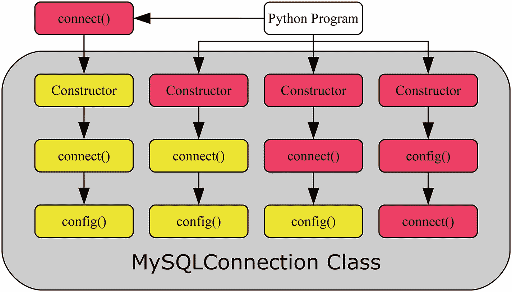

# 二、连接到 MySQL

在前一章中，您安装了 MySQL Connector/Python，并确保该模块工作正常。然而，打印连接器的版本字符串并不令人兴奋，所以本章将开始两个遗留 API 的特性之旅。

`mysql.connector`模块包括 Python 数据库 API 的实现，在 PEP249 ( [`https://www.python.org/dev/peps/pep-0249/`](http://www.python.org/dev/peps/pep-0249/) )中定义。这包括在使用相同 API 的同时使用 C 扩展的选项。这个 API 是第 [2](02.html) - [5](05.html) 章的主要焦点。此外，第 [4](04.html) 章简要讨论了实现 C 扩展 API 的`_mysql_connector`模块。

本章详细介绍了创建和配置 MySQL 连接的细节。建立联系很简单，也是你要学的第一件事。然而，这种联系不仅仅是创造出来的。本章的其余部分将讨论如何配置连接，包括避免将用户名和密码硬编码到应用中的技巧。本章最后讨论了其他与连接相关的选项，特别关注字符集。

## 从 Python 创建连接

到这一步需要做一些工作，但是现在您已经准备好第一次从 Python 连接到 MySQL 了。本节将介绍创建连接的语法、最常见的连接选项、创建连接、重新配置连接的示例以及一些连接的最佳实践。

### 句法

有几种方法可以创建连接。其中四个是

*   `mysql.connector.` `connect()`功能:这是最灵活的连接方式。它提供了一种使用 C 扩展创建连接或者启用连接池和故障转移相关选项的统一方式。该函数作为包装器工作，根据设置返回适当类的对象。

*   `MySQLConnection()`构造函数

*   `MySQLConnection.connect()`方法:它要求首先实例化不带参数的`MySQLConnection`类，然后创建连接。

*   与之前使用的`MySQLConnection.connect()`方法相同，但不同之处在于`MySQLConnection.config()`方法被显式调用来配置连接。

`MySQLConnection`类是纯 Python 实现。或者，可以使用`CMySQLConnection`类，它为 Python 数据库 API 提供了 C 扩展后端的实现。

所有方法都以相同的连接对象结束，并且它们都将连接选项作为关键字参数。这意味着您可以选择任何方式来创建最适合程序的连接。然而，由于`mysql.connector.` `connect()`函数是最强大的，它是连接的首选方式，因为它使得在纯 Python 和 C 扩展实现之间切换或者启用连接池或故障转移变得更加容易。

### 小费

使用`mysql.connector.connect()`功能创建连接可访问所有与连接相关的功能。

图 [2-1](#Fig1) 显示了使用四种方式创建连接的基本流程。红色(深灰色)框直接从应用代码调用，黄色(浅灰色)框由最后一个间接调用的方法调用。该图使用了`MySQLConnection`类；然而，如果使用了`CMySQLConnection`类，同样适用。



图 2-1

创建连接的流程

最左边的路线是使用`mysql.connector.` `connect()`功能的路线。Python 程序调用带有连接参数的函数，然后该函数处理其余部分。该图假设创建了一个`MySQLConnection`连接(使用纯 Python 实现)，但是如果使用 C 扩展，该函数也可以返回一个`CMySQLConnection`对象。`mysql.connector.connect()`函数的基本语法是

```py
db = mysql.connector.connect(**kwargs)

```

左起第二条路径让 Python 程序在实例化`MySQLConnection`类时将连接参数发送给构造函数。这将触发构造函数调用`connect()`方法，后者又调用`config()`方法。使用`MySQLConnection`类时的语法是

```py
db = mysql.connector.MySQLConnection(**kwargs)

```

在左起第三条路径中，首先实例化了`MySQLConnection`类，然后显式调用了`connect()`方法。代码语法变成了

```py
db = mysql.connector.MySQLConnection()
db.connect(**kwargs)

```

最后，在最右边的路径中，所有步骤都是显式完成的。注意，与创建连接的其他三种方式相比，在这种情况下调用`connect()`和`config()`方法的顺序颠倒了。语法是

```py
db = mysql.connector.MySQLConnection()
db.config(**kwargs)
db.connect()

```

在创建一些真正的连接之前，有必要看一看创建连接时最常用的选项。

### 常见连接选项

表 [2-1](#Tab1) 总结了最常用的选项，用于指定如何连接到 MySQL、作为谁进行身份验证以及使用哪个密码。

表 2-1

常见的连接相关选项

<colgroup><col class="tcol1 align-left"> <col class="tcol2 align-left"> <col class="tcol3 align-left"></colgroup> 
| 

争吵

 | 

缺省值

 | 

描述

 |
| --- | --- | --- |
| `host` | `127.0.0.1` | 安装了您要连接的 MySQL 实例的主机的主机名。默认设置是连接到回环(即本地主机)。 |
| `port` | `3306` | MySQL 正在监听的端口。端口 3306 是标准的 MySQL 端口。 |
| `unix_socket` |   | 在 Linux 和 Unix 上，可以使用 Unix 套接字连接到本地主机上的 MySQL 实例。指定套接字文件的路径。 |
| `user` |   | 应用用户的用户名。不要包含@和以下主机名；这是为第 [1 章](01.html)中创建的测试用户准备的。只需指定`pyuser`。 |
| `password` |   | 用来进行身份验证的密码。对于测试用户，这将是`Py@pp4Demo`。 |
| `ssl_ca` |   | 包含 SSL 证书颁发机构(CA)的文件的路径。 |
| `ssl_cert` |   | 包含公共 SSL 证书的文件的路径。 |
| `ssl_cipher` |   | 用于连接的 SSL 密码。通过使用 SSL 连接 MySQL 并执行查询`SHOW GLOBAL STATUS LIKE`‘SSL _ cipher _ list’，可以获得有效密码的列表；当前使用的密码可以通过 Ssl_cipher 会话状态变量来确定。 |
| `ssl_disabled` |   | 强制使用非 SSL 连接。 |
| `ssl_key` |   | 包含私有 SSL 密钥的文件的路径。 |
| `ssl_verify_cert` | `False` | MySQL 连接器/Python 是否应该根据用`ssl_ca`选项指定的 CA 来验证 MySQL 服务器使用的证书。 |

例如，如果您使用过 MySQL 命令行客户端，那么这些选项名称可能看起来很熟悉。这不是巧合。使用这些选项，可以演示如何创建连接。

### 小费

本章中有许多示例程序。列表中出现的所有示例程序都可以下载。有关使用示例程序的更多信息，参见第 [1](01.html) 章中对示例程序的讨论。

### 连接示例

是时候将创建连接的四种方式以及最常见的连接选项结合起来，创建用于创建 MySQL Connector/Python 连接的源代码示例了。清单 [2-1](#Par27) 展示了如何使用创建连接的四种方式进行连接。这些示例的顺序与本节前面讨论的顺序相同。

```py
import mysql.connector

connect_args = {
  "host": "127.0.0.1",
  "port": 3306,
  "user": "pyuser",
  "password": "Py@pp4Demo",
};

# ---- connect() function ----

db1 = mysql.connector.connect(

  **connect_args

)

print(
  "MySQL connection ID for db1: {0}"
  .format(db1.connection_id)
)

db1.close()

# ---- Explicit MySQLConnection ----

db2 = mysql.connector.MySQLConnection(

  **connect_args

)

print(
  "MySQL connection ID for db2: {0}"
  .format(db2.connection_id)
)

db2.close()

# ---- Two steps manually ----

db3 = mysql.connector.MySQLConnection()

db3.connect(**connect_args)

print(
  "MySQL connection ID for db3: {0}"
  .format(db3.connection_id)
)

db3.close()

# ---- All three steps manually ----

db4 = mysql.connector.MySQLConnection()

db4.config(**connect_args)

db4.connect()

print(
  "MySQL connection ID for db4: {0}"
  .format(db4.connection_id)
)

db4.close()

Listing 2-1Examples of Connecting to MySQL

```

这四种连接使用相同的连接选项。一旦创建了连接，就使用连接的`connection_id`属性打印连接的连接 ID(来自 MySQL 服务器端)。最后，使用`close()`方法关闭连接。当应用完成连接时，最好总是显式关闭连接。

### 小费

当你完成时，总是关闭连接。关闭连接可以确保与 MySQL 服务器完全断开连接。在服务器终止连接之前，可能还需要一些时间；同时，它占用了一个可用的连接。

输出类似于以下示例，只是连接 id 不同:

```py
MySQL connection ID for db1: 13
MySQL connection ID for db2: 14
MySQL connection ID for db3: 15
MySQL connection ID for db4: 16

```

还可以为现有的连接调用`config()`方法。接下来让我们讨论如何重新配置连接和重新连接。

### 重新配置和重新连接

通常不这样做，但是可以重新配置现有的连接并重新连接。在这种情况下，重新配置意味着可能要更改所有选项，包括应用所连接的 MySQL 服务器实例。当进行这样的更改时，有必要明确地告诉 MySQL Connector/Python 重新连接。

要重新配置一个连接，使用`config()`方法，方法与初始连接之前相同。一旦创建了所需的新配置，如果任何配置更改需要新的连接，就调用`reconnect()`方法。调用`reconnect()`关闭旧的连接并用新的配置创建一个新的连接。清单 [2-2](#Par35) 展示了一个重新配置连接的例子。

```py
import mysql.connector

initial_args = {
  "host": "127.0.0.1",
  "port": 3306,
  "user": "pyuser",
  "password": "Py@pp4Demo",
};

# Create initial connection
db = mysql.connector.connect(
  **initial_args
)

print(
  "Initial MySQL connection ID ...: {0}"
  .format(db.connection_id)
)

new_args = {

  "host": "<your_IP_goes_here_in_quotes>",

};

db.config(**new_args)

db.reconnect()

print(
  "New MySQL connection ID .......: {0}"
  .format(db.connection_id)
)

db.close()

Listing 2-2Reconfiguring a Connection

```

这个例子要求在同一个 MySQL 实例上有第二个用户帐户。用户与现有的`pyuser@localhost`连接相同，但被定义为从公共 IP 地址连接(替换为您计算机的 IP 地址，或者如果 IP 地址解析为主机名):

```py
mysql> CREATE USER pyuser@'<your_IP_goes_here_in_quotes>'
                   IDENTIFIED BY 'Py@pp4Demo';
Query OK, 0 rows affected (0.84 sec)

```

任何防火墙允许连接也是必要的。

从示例中可以看出，没有必要更改所有的配置选项。那些没有在新选项集中显式设置的值将保持原来的值。程序的输出是(除了 IDs 之外)

```py
Initial MySQL connection ID ...: 21
New MySQL connection ID .......: 22

```

本节的最后一个主题是一些关于连接的最佳实践。

### 连接最佳实践

当涉及到连接时，有一些很好的最佳实践可以遵循。最佳实践总是很困难，因为所有应用都有独特的需求。因此，建议将集中在 MySQL 连接器/Python 的技术方面。

主要的最佳实践是

*   当你完成时，总是关闭连接。这个已经讨论过了。

*   使用 SSL (TLS)加密连接。如果您要连接到远程主机，这一点尤其重要，如果连接是在不安全的网络上，这一点更为重要。一个例外是使用 Unix 套接字进行连接，因为即使不使用 SSL，这也总是被认为是安全的连接。

*   不要将配置硬编码到源代码中。这尤其适用于密码。

### 注意

虽然 MySQL 使用`ssl_`作为与加密连接相关的选项的前缀，但实际上使用的是 TLS。

在 MySQL 8.0 和 MySQL 5.7 的某些版本中，默认情况下使用自签名证书启用 SSL，MySQL Connector/Python 默认情况下将使用加密连接。

到目前为止，这些例子有一个主要的缺陷:它们不仅硬编码了连接到哪里，还硬编码了用户名，尤其是密码。这使得代码更难维护，而且这也是一个安全问题，因为任何有权访问源代码的人都可以看到密码。硬编码连接选项还意味着开发和生产系统必须共享连接选项，或者部署过程需要更改源代码来更新配置参数。

### 警告

不要将密码存储在源代码中。

两者都不是好的选择，因此必须找到替代方案。下一节将讨论另一种选择:使用配置文件。

## 配置文件

在调用中直接指定连接选项以创建到 MySQL 的连接的方法对于快速测试非常有用，但是在实际应用中这样做既不实用也不安全(对于密码来说)。这一节将首先讨论一些替代方案，然后将详细讨论如何使用 MySQL 配置文件。

### 硬编码配置的替代方法

有几种方法可以避免将连接配置硬编码到源代码中。每种方法都有利弊，所以这不是一个一刀切的问题。将讨论四种方法:

*   交互询问信息

*   使用环境变量

*   从应用自己的配置文件或作为命令行参数读取信息

*   使用 MySQL 配置文件。

如果你正在编写一个可以被不同用户使用的程序，那么交互式方法是很棒的，所以不知道程序将以谁的身份连接。这也是将密码传递给程序的最安全的方式。然而，对于更多类似守护进程的进程来说，每次需要重新启动进程时都要求手动启动它并不方便。

环境变量可用于指定会话选项。子进程将继承父进程的环境，因此环境变量可用于将设置传递给子进程，例如从 shell 传递给应用。这是一种配置应用的好方法，不需要文件或解析命令行上的选项。例如，配置在 Docker 等容器中运行的应用是一种常见的方式。 <sup>[1](#Fn1)</sup>

使用环境变量有一些缺点。当自动启动进程时，有必要将环境变量存储在一个文件中，这意味着它最终会成为一个配置文件的替代格式。环境通常也是长寿的；例如，如果应用自己启动新进程，它将默认传递其环境，包括潜在的秘密信息，如密码。具有高权限的用户也可以读取环境变量。因此，在使用环境变量时应该小心。

使用应用自己的配置文件或提供选项作为命令行参数意味着所有的配置都在一个地方完成。在这种情况下，MySQL 选项的处理方式与其他选项相同，编写代码时只需将选项及其值传递给 MySQL 连接。

### 警告

使用密码作为命令行选项时要非常小心。主机上的其他用户可能会看到传递给程序的参数，比如在 Linux 上使用`ps`命令。因此，建议不要将密码指定为命令行参数。

然而，还有另一种方法。MySQL Connector/Python 拥有读取 MySQL 配置文件的原生支持。在应用自己的配置文件上使用这种方法的一些原因是，除了与 MySQL 相关的选项之外，应用可能不需要配置文件，或者应用配置和 MySQL 配置可能有不同的所有者。如果开发人员负责定义应用本身的行为，而数据库管理员负责 MySQL 特定的选项，则可能会发生后一种情况。

因为这本书是关于使用 MySQL 连接器/Python 特性的，而不是一般的 Python 编程，所以四个选项中唯一要详细讨论的是使用 MySQL 配置文件的选项。

### 使用 MySQL 配置文件

MySQL 的配置文件使用`INI`文件格式。以下是一个使用 MySQL Connector/Python 的简单示例，使用了与本章前面相同的配置:

```py
[connector_python]
user     = pyuser
host     = 127.0.0.1
port     = 3306
password = Py@pp4Demo

```

有两个连接选项控制 MySQL 配置文件的使用:

*   `option_files`:该选项指定要读取的一个或多个配置文件的路径。该值可以是字符串或字符串列表。没有默认值。

*   `option_groups`:该选项指定从哪些选项组中读取。选项组被指定为方括号中的名称；在示例配置中，选项组是`connector_python`。该值是包含组名的字符串列表。默认是从`client`和`connector_python`组中读取。

按照惯例，MySQL 配置文件在微软 Windows 上称为`my.ini`，在其他平台上称为`my.cnf`。从功能角度来看，对文件名或文件扩展名没有要求。

需要注意的一个重要特性是,`option_groups`选项不会平等对待所有组。具体来说，`connector_python`组是特殊的，因为该组中的所有选项都必须有效，否则将引发`ValueError`异常。对于其他组，未知选项将被忽略。忽略未知选项的原因是几个程序可能会读取相同的选项组。例如，客户端组也由`mysql`命令行客户端和其他 MySQL 客户端程序读取。

清单 [2-3](#Par74) 展示了一个连接 MySQL 的例子，连接选项是从与程序位于同一目录的`my.ini`文件中读取的。

```py
import mysql.connector

db = mysql.connector.connect(

  option_files="my.ini")

print(__file__ + " - single config file:")
print(
  "MySQL connection ID for db: {0}"
  .format(db.connection_id)
)

db.close()

Listing 2-3Using a MySQL Configuration File

```

输出类似于前面打印连接 ID 的示例，例如:

```py
listing_2_3.py - single config file:
MySQL connection ID for db: 35

```

在某些情况下，您可能希望将 MySQL 配置分成几个文件。例如，假设几个应用需要连接到同一个 MySQL 后端，因此它们共享主机和端口信息，但是每个应用使用不同的凭据进行连接。继续这个例子，可以用以下内容创建两个文件`my_shared.ini`和`my_app_specific.ini`:

`my_shared.ini`:

```py
[client]
host     = 127.0.0.1
port     = 3306

```

`my_app_specific.ini`:

```py
[connector_python]
user     = pyuser
password = Py@pp4Demo

```

测试程序所需的唯一改变是将`option_` `files`的值改为一个列表。为了演示如何设置`option_groups`选项，它也被添加到程序中。产生的源代码可以在清单 [2-4](#Par83) 中看到。

```py
import mysql.connector

db = mysql.connector.connect(

  option_files = [
    "my_shared.ini",
    "my_app_specific.ini"
  ],
  option_groups = [
    "client",
    "connector_python"
  ]

)

print(__file__ + " - two config files:")
print(
  "MySQL connection ID for db: {0}"
  .format(db.connection_id)
)

db.close()

Listing 2-4Using Multiple Configuration Files

```

输出如下(ID 除外，它会随着执行的不同而变化):

```py
listing_2_4.py - two config files:
MySQL connection ID for db: 42

```

最后要考虑的是路径名。如果指定了相对路径，则执行 Python 的目录将用作基本目录。例如，使用下面的命令来执行一个程序(ID 通常是不同的):

```py
PS C:\MySQL> python Source/test.py
MySQL connection ID for db: 56

```

当`C:\MySQL`是当前工作目录时执行。如果`test.py`有`option_files="my.ini"`，那么`my.ini`文件必须位于`C:\MySQL`。

另一个观察结果是，对于 Microsoft Windows，使用反斜杠(\)还是正斜杠(/)来分隔路径组件(目录)是可选的。

配置文件的讨论到此结束。本章的最后一个主题是 MySQL Connector/Python 支持的连接的其余选项。

## 一般配置

到目前为止，已经讨论过的唯一配置选项是指定连接到哪里、以谁的身份连接以及是否使用 SSL 所需的选项。还有其他几个选项与应用的行为更相关。这些选项是本节的主题。

表 [2-2](#Tab2) 至表 [2-5](#Tab5) 总结了本章前面的连接选项列表中未包含的选项，以下选项类型各有一个表:连接、字符集、查询行为和警告。本书的其余部分将包括使用其中几个选项的例子。

### 关系

除了“创建连接”一节中讨论的选项之外，还有更多连接选项。它们并不常用，但在某些用例中可能是必需的。表 [2-2](#Tab2) 总结了这些选项。一些选项将在表后更详细地讨论。

表 2-2

不太常见的连接相关选项

<colgroup><col class="tcol1 align-left"> <col class="tcol2 align-left"> <col class="tcol3 align-left"></colgroup> 
| 

名字

 | 

缺省值

 | 

描述

 |
| --- | --- | --- |
| `auth_plugin` |   | 要使用哪个认证插件。例如，当使用 MySQL Connector/Python 2.1 连接到 MySQL Server 8.0 时，这是必需的，因为旧的 MySQL Connector/Python 版本不支持服务器的默认身份验证插件。 |
| `client_flags` |   | 通过标志配置几个选项的另一种方法。 |
| `compress` | `False` | 启用后，网络流量将被压缩。 |
| `connection_timeout` |   | 创建连接时等待多长时间后超时。 |
| `converter_class` |   | 指定用于将原始行数据转换为 Python 类型的自定义转换器类。 |
| `failover` |   | 字典元组，指定在主连接失败时要故障转移到的备用 MySQL 服务器实例。这仅在使用`mysql.connector.` `connect()`功能时受支持。 |
| `force_ipv6` | `False` | 当`True`时，尽可能使用 IPv6。 |
| `pool_name` | 自动生成 | 连接池的名称。默认情况下，该名称是通过连接`host`、`port`、`user`和`database`连接选项的值生成的。名称最长为`pooling.CNX_POOL_MAXNAMESIZE`(默认为 64 个)字符，允许使用字母数字字符以及以下字符:。、_、:、-、*、$和#。只有使用`mysql.connector.` `connect()`函数或直接实例化`pooling.MySQLConnectionPool`构造函数类才能支持这一点。 |
| `pool_reset_session` | `True` | 当`True`时，当连接返回到池中时，会话变量被重置。只有使用`mysql.connector.connect()`函数或者直接实例化`pooling.MySQLConnectionPool`构造函数类才能支持这一点。 |
| `pool_size` | `5` | 池中容纳的连接数。该值必须至少为 1，最多为`pooling.CNX_POOL_MAXSIZE`(默认为 32)。只有使用`mysql.connector.` `connect()`函数或通过直接实例化`pooling.MySQLConnectionPool`构造函数类才支持这一点。 |
| `use_pure` | `False` | 当`True`时，使用连接器的纯 Python 实现。当`False`时，使用 C 扩展。如果未指定选项，默认情况下使用 C 扩展(如果已安装);否则，它会退回到纯 Python 实现。这仅支持使用`mysql.connector.`功能。在大多数情况下，建议使用 C 扩展。 |

通过压缩应用和 MySQL 服务器之间传输的数据(反之亦然),可以使用`compress`选项以额外的计算资源为代价来减少网络流量。如果将大型 SQL 语句发送到服务器，或者将大型查询结果返回到应用，并且应用安装在远程主机上，这可能特别有用。

值得多加注意的四个选项是`failover`和`pool`选项。`failover`选项可用于定义一个或多个 MySQL 服务器实例，如果与主实例的连接失败，MySQL Connector/Python 将故障转移到这些实例。每个可选的 MySQL 服务器实例都被指定为元组或列表中的一个字典。`pool`选项设置了一个连接池，应用可以向其请求连接。这些选项将在第 [5](05.html) 章中详细讨论。

`client_flags`选项可用于设置多个选项。可用选项列表可以使用`ClientFlag`常量的`get_full_info()`方法确定:

```py
from mysql.connector.constants import ClientFlag

print("\n".join(
  sorted(ClientFlag.get_full_info())
))

```

连接器/Python 8.0.11 的输出可以在清单 [2-5](#Par99) 中看到。首先列出客户端标志的名称，然后是对标志控制内容的描述。大多数标志也有专用选项，但有一些附加标志如`INTERACTIVE`只能通过`client_flags`选项设置。

```py
CAN_HANDLE_EXPIRED_PASSWORDS : Don't close the connection for a connection with expired password
COMPRESS : Can use compression protocol
CONNECT_ARGS : Client supports connection attributes
CONNECT_WITH_DB : One can specify db on connect
DEPRECATE_EOF : Client no longer needs EOF packet
FOUND_ROWS : Found instead of affected rows
IGNORE_SIGPIPE : IGNORE sigpipes
IGNORE_SPACE : Ignore spaces before ''
INTERACTIVE : This is an interactive client
LOCAL_FILES : Can use LOAD DATA LOCAL
LONG_FLAG : Get all column flags
LONG_PASSWD : New more secure passwords
MULTI_RESULTS : Enable/disable multi-results
MULTI_STATEMENTS : Enable/disable multi-stmt support
NO_SCHEMA : Don't allow database.table.column
ODBC : ODBC client
PLUGIN_AUTH : Client supports plugin authentication
PLUGIN_AUTH_LENENC_CLIENT_DATA : Enable authentication response packet to be larger than 255 bytes
PROTOCOL_41 : New 4.1 protocol
PS_MULTI_RESULTS : Multi-results in PS-protocol
REMEMBER_OPTIONS :
RESERVED : Old flag for 4.1 protocol
SECURE_CONNECTION : New 4.1 authentication
SESION_TRACK : Capable of handling server state change information
SSL : Switch to SSL after handshake
SSL_VERIFY_SERVER_CERT :
TRANSACTIONS : Client knows about transactions
Listing 2-5List of Client Flags

```

为了配置`client_flags`，指定应启用或禁用的标志列表。要启用标志，只需指定标志的名称；要禁用该标志，请在前面加上一个减号。清单 [2-6](#Par101) 展示了一个例子，告诉这个连接它是一个交互连接，但是它不能处理过期的密码。

```py
import mysql.connector
from mysql.connector.constants import ClientFlag

connect_args = {
  "host": "127.0.0.1",
  "port": 3306,
  "user": "pyuser",
  "password": "Py@pp4Demo",
  "client_flags": [
    ClientFlag.INTERACTIVE,
    -ClientFlag.CAN_HANDLE_EXPIRED_PASSWORDS
  ]
};

db = mysql.connector.connect(
  **connect_args
)

print(__file__ + " - Client flags:")
print(
  "MySQL connection ID for db: {0}"
  .format(db.connection_id)
)

db.close()

Listing 2-6Using Client Flags in the Connection

```

这将给出以下输出(除了 ID 的值之外):

```py
listing_2_6.py - Client flags:
MySQL connection ID for db: 60

```

`use_pure`选项可以用来指定是使用 C 扩展还是连接器的纯 Python 实现。C 扩展提供了比纯实现更好的性能，尤其是在处理大型结果集和准备好的语句时。另一方面，纯 Python 实现在更多的平台上得到支持，具有更多的特性，并且更容易修改源代码。在 8.0.11 和更高版本中，安装 C 扩展是默认的，而早期版本默认使用纯 Python 实现。

也可以通过导入`_mysql_connector`模块而不是通常的`mysql.connector`模块来使用 C 扩展。第 [4](04.html) 章中包含了一个使用 C 扩展的例子。

其他连接选项将不再详细讨论。相反，焦点将转移到字符集选项上。

### 字符集

字符集定义了字符的编码方式。在互联网的早期，经常使用 ASCII 字符集。ASCII 对每个字符使用 7 位，这样可以节省空间，但这意味着只有 128 个不同的字符可用。这对于英文的纯文本相当有效，但是对于其他语言却缺少字符。多年来，各种其他字符集被使用，如拉丁字符集。

特定于地区的字符集有助于支持所有语言，但缺点是不同的语言需要不同的编码。对此的一种回应是 Unicode 转换格式(UTF)编码；特别是 UTF-8 已经变得流行起来。UTF-8 使用可变数量的字节来存储字符。最初的 128 个 ASCII 字符在 UTF-8 中具有相同的编码；其他字符使用两到四个字节。

在 MySQL Server 5.7 之前，服务器端的默认字符集是 Latin1，但在 MySQL 8.0 中，当`utf8mb4`成为默认字符集时，这种情况发生了变化。`mb4`后缀表示每个字符最多使用四个字节(mb =多字节)。这是必需的，因为 MySQL 中的`utf8`以前意味着每个字符最多支持三个字节。然而，三字节的 UTF-8 实现错过了几个表情符号，它已经被否决，所以最好使用四字节的变体。在 8.0.12 版本之前，Connector/Python 的默认字符集是`utf8`，这是 UTF-8 的三字节实现(在 MySQL 服务器中称为`utf8`或`utf8mb3`)。从 8.0.12 版本开始，默认设置为`utf8mb4`，就像 MySQL 服务器一样。

还有整理的概念要考虑。归类定义了如何对两个字符或字符序列进行相互比较，例如在比较中是否应该将“”和“”视为同一字符，以及是否应该将 ss 视为等于“”(德语尖音 s)。归类还定义了字符的排序顺序以及比较是否区分大小写。每个字符集都有一个默认的排序规则，但是也可以显式地请求排序规则。

### 小费

除非您有特定的国家要求，否则当选择`utf8`或`utf8mb4`作为字符集时，MySQL Server 中的默认排序通常是一个不错的选择。

通常，MySQL 中可用的字符集和排序规则在不同版本之间变化不大。然而，MySQL Server 8.0 的主要变化之一是增加了一系列 UCA 9.0.0 排序规则。关于可用字符集及其默认排序规则的信息可以使用信息模式中的`CHARACTER_SETS`表找到，如清单 [2-7](#Par113) 所示。

```py
mysql> SELECT CHARACTER_SET_NAME AS Name,
              DEFAULT_COLLATE_NAME
         FROM information_schema.CHARACTER_SETS
        ORDER BY CHARACTER_SET_NAME;
+----------+----------------------+
| Name     | DEFAULT_COLLATE_NAME |
+----------+----------------------+
| armscii8 | armscii8_general_ci  |
| ascii    | ascii_general_ci     |
| big5     | big5_chinese_ci      |
| binary   | binary               |
...
| ujis     | ujis_japanese_ci     |
| utf16    | utf16_general_ci     |
| utf16le  | utf16le_general_ci   |
| utf32    | utf32_general_ci     |
| utf8     | utf8_general_ci      |
| utf8mb4  | utf8mb4_0900_ai_ci   |
+----------+----------------------+
41 rows in set (0.00 sec)
Listing 2-7Character Set Collations in MySQL 8.0.11

```

类似地，特定字符集可用的排序规则可以使用`COLLATIONS`表来确定。清单 [2-8](#Par115) 显示了`utf8mb4`字符集的输出。

```py
mysql> SELECT COLLATION_NAME, IS_DEFAULT
         FROM information_schema.COLLATIONS
        WHERE CHARACTER_SET_NAME = 'utf8mb4';
+----------------------------+------------+
| COLLATION_NAME             | IS_DEFAULT |
+----------------------------+------------+
| utf8mb4_general_ci         |            |
| utf8mb4_bin                |            |
| utf8mb4_unicode_ci         |            |
...
| utf8mb4_0900_ai_ci         | Yes        |
| utf8mb4_de_pb_0900_ai_ci   |            |
| utf8mb4_is_0900_ai_ci      |            |
| utf8mb4_lv_0900_ai_ci      |            |
...
| utf8mb4_vi_0900_as_cs      |            |
| utf8mb4_ja_0900_as_cs      |            |
| utf8mb4_ja_0900_as_cs_ks   |            |
| utf8mb4_0900_as_ci         |            |
| utf8mb4_ru_0900_ai_ci      |            |
| utf8mb4_ru_0900_as_cs      |            |
+----------------------------+------------+
73 rows in set (0.00 sec)
Listing 2-8The Collations Available for the utf8mb4 Character Set

```

输出显示了 MySQL Server 8.0.11 中可用于`utf8mb4`的 73 种排序规则。归类名称由几部分组成:

*   字符集名称

*   该校对适用于哪个国家(例如`ja`适用于日本),或者它是否具有更一般的性质

*   修饰符(重音符号):并非所有的排序规则都有这些修饰符。例如，`ai`不区分重音，`as`区分重音，`ci`不区分大小写，`cs`区分大小写。

### 小费

MySQL 中字符集和排序规则的主题很大。更深入的讨论见 [`https://dev.mysql.com/doc/refman/en/charset.html`](https://dev.mysql.com/doc/refman/en/charset.html) 及其中的参考文献。

MySQL Connector/Python 有三个与字符集和排序规则相关的选项。这些总结在表 [2-3](#Tab3) 中。

表 2-3

字符集相关选项

<colgroup><col class="tcol1 align-left"> <col class="tcol2 align-left"> <col class="tcol3 align-left"></colgroup> 
| 

名字

 | 

缺省值

 | 

描述

 |
| --- | --- | --- |
| `charset` | `utf8mb4` | 用于连接的字符集。在 MySQL Connector/Python 8.0.11 及更早版本中，默认为`utf8`。大多数情况下，建议使用`utf8mb4`。 |
| `collation` | `utf8mb4_general_ci` | 用于字符串比较和排序的排序规则。在许多情况下，可以使用默认值。MySQL Connector/Python 8.0.11 及更早版本的默认值为`utf8_general_ci`。在 MySQL Server 8.0 中，`utf8mb4`字符集的默认排序规则是`utf8mb4_0900_ai_ci`，这通常是一个不错的选择，除非存在特定的需求。 |
| `use_unicode` | `True` | 是否将查询结果中的字符串作为 Python Unicode 文本返回。默认值是`True`，这通常也是最好的值。 |

清单 [2-9](#Par123) 展示了一个配置字符集相关选项的例子。

```py
import mysql.connector

connect_args = {
  "host": "127.0.0.1",
  "port": 3306,
  "user": "pyuser",
  "password": "Py@pp4Demo",
  "charset": "utf8mb4",
  "collation": "utf8mb4_unicode_ci",
  "use_unicode": True
};

db = mysql.connector.connect(
  **connect_args)

print(__file__ + " - Setting character set:")
print(
  "MySQL connection ID for db: {0}"
  .format(db.connection_id)
)

db.close()

Listing 2-9Specifying the Character Set and Collation

```

可用的字符集和排序规则被编码到 MySQL 连接器/Python 源代码中。这意味着当您升级 MySQL Server 时，如果包含新的字符集或排序规则，您只能在 Python 程序中使用它们，前提是您将 MySQL Connector/Python 更新到支持新字符集和排序规则的版本。

### 小费

如果您升级 MySQL Server，您可能还需要升级 MySQL Connector/Python 以获得对所有新功能的支持。

在首次连接到 MySQL 服务器后，可以更改连接所使用的字符集和排序规则。最好的方法是使用清单 [2-10](#Par127) 中展示的`set_charset_collation()`方法来改变连接的`charset`和`collation`属性。注意，与其他示例不同，这个示例首先实例化了`MySQLConnection`类，以便能够在创建连接之前打印初始字符集和排序规则。

```py
import mysql.connector

db = mysql.connector.MySQLConnection()

# Print banner and initial settings
print(
  "{0:<9s}   {1:<7s}   {2:<18s}".format(
    "Stage", "charset", "collation"
  )
)
print("-" * 40)
print(
  "{0:<9s}   {1:<7s}   {2:<18s}".format(
    "Initial", db.charset, db.collation
  )
)

# Create the connection
connect_args = {
  "host": "127.0.0.1",
  "port": 3306,
  "user": "pyuser",
  "password": "Py@pp4Demo"
};

db.connect(**connect_args)

# The connection does not change the
# settings
print(
  "{0:<9s}   {1:<7s}   {2:<18s}".format(
    "Connected",
    db.charset, db.collation
  )
)

# Change only the character set

db.set_charset_collation(

  charset = "utf8mb4"

)

print(
  "{0:<9s}   {1:<7s}   {2:<18s}".format(
    "Charset", db.charset, db.collation
  )
)

# Change only the collation

db.set_charset_collation(

  collation = "utf8mb4_unicode_ci"

)

print(
  "{0:<9s}   {1:<7s}   {2:<18s}".format(
    "Collation",
    db.charset, db.collation
  )
)

# Change both the character set and
# collation

db.set_charset_collation(

  charset   = "latin1",
  collation = "latin1_general_ci"

)

print(
  "{0:<9s}   {1:<7s}   {2:<18s}".format(
    "Both", db.charset, db.collation
  )
)

db.close()

Listing 2-10Changing the Character Set of a Connection

```

从示例中可以看出，字符集和排序规则属性甚至可以在连接建立之前使用。然而，在连接建立之前，不可能使用`set_charset_collation()`方法来改变字符集或排序规则。

### 注意

始终使用`set_charset_collation()`方法来更改连接的字符集和/或排序规则。与直接将`SET NAMES`作为 SQL 语句执行相比，它确保了 Connector/Python 知道哪些设置用于将 bytearrays 转换为 Python 字符串(参见下一章)，字符集和排序规则选择根据 Connector/Python 已知的进行验证，并且 C 扩展设置保持同步。

建立连接不会改变`charset`和`collation`属性的值。字符集可以自行更改，在这种情况下，归类设置为字符集的默认值。在这种情况下，字符集设置为`utf8mb4`，因此默认字符集为`utf8mb4_general_ci`。

也可以单独设置归类，最后字符集和归类都设置好了。使用版本 8.0.11 执行清单 [2-10](#Par132) 中的程序的输出是

```py
Stage       charset   collation
----------------------------------------
Initial     utf8      utf8_general_ci
Connected   utf8      utf8_general_ci
Charset     utf8mb4   utf8mb4_general_ci
Collation   utf8mb4   utf8mb4_unicode_ci
Both        latin1    latin1_general_ci

```

如果您使用的是 MySQL Connector/Python 8.0.12 或更高版本，初始和连接的字符集和排序规则是`utf8mb4`和`utf8mb4_general_ci`。

### 查询行为

有几个选项可以控制查询的行为。从定义事务配置是否允许特性到定义 MySQL Connector/Python 如何处理结果。选项在表 [2-4](#Tab4) 中列出。

表 2-4

与查询相关的选项

<colgroup><col class="tcol1 align-left"> <col class="tcol2 align-left"> <col class="tcol3 align-left"></colgroup> 
| 

名字

 | 

缺省值

 | 

描述

 |
| --- | --- | --- |
| `allow_local_infile` | `True` | 是否允许使用`LOAD DATA LOCAL INFILE`语句。 |
| `autocommit` | `False` | 当`True`时，在每个查询后执行一个隐式的`COMMIT`。 |
| `buffered` | `False` | 当`True`时，结果集被立即提取并缓存在应用中。 |
| `consume_results` | `False` | 当`True`时，如果有未提取的行，则自动提取查询结果，并执行新的查询。 |
| `database` |   | 在没有为表显式给出数据库名称的情况下，哪个数据库(模式)用作查询的默认数据库。 |
| `raw` | `False` | 默认情况下，使用游标时，结果值会转换为 Python 类型。当将该选项设置为`True`时，返回的结果没有转换。 |
| `sql_mode` | (服务器默认值) | 执行查询时使用的 SQL 模式。参见`https://dev.mysql.com/doc/refman/en/sql-mode.html`。 |
| `time_zone` |   | 设置后，时间戳将转换为该时区，而不是使用服务器端时区。 |

第 [3](03.html) 章和第 [4](04.html) 章讨论了这些选项，包括使用这些选项的代码示例。

### 警告信息

以正确的方式处理警告和错误是非常重要的。否则会导致数据损坏或丢失。使用游标时，有两个选项控制 MySQL Connector/Python 如何处理警告(游标将在下一章讨论)。选项如表 [2-5](#Tab5) 所示。

表 2-5

游标的警告相关选项

<colgroup><col class="tcol1 align-left"> <col class="tcol2 align-left"> <col class="tcol3 align-left"></colgroup> 
| 

名字

 | 

缺省值

 | 

描述

 |
| --- | --- | --- |
| `get_warnings` | `False` | 当设置为`True`时，每次查询后自动提取警告。 |
| `raise_on_warnings` | `False` | 当设置为`True`时，警告会引发异常。 |

由于正确处理警告和错误非常重要，第 9 章专门讨论这个主题。

## 摘要

本章讲述了如何创建和配置从 Python 程序到 MySQL 服务器数据库的连接。讨论了以下主题:

*   建立连接的四种不同方式，包括初始配置。`mysql.connector.` `connect()`功能是四种方法中最灵活的。

*   配置选项。

*   连接的最佳实践:关闭连接，使用 SSL/TLS 加密流量，不要在源代码中硬编码连接选项(尤其是密码)。

*   MySQL 配置文件。

*   字符集。

能够创建到数据库的连接当然很好，但是除非您能够执行查询，否则它没有多大用处。接下来的两章将讨论查询执行，从更基本的用例开始。

<aside class="FootnoteSection" epub:type="footnotes">Footnotes [1](#Fn1_source)

关于设置环境变量的 Docker 文档见 [`https://docs.docker.com/engine/reference/commandline/run/#set-environment-variables--e---env---env-file`](https://docs.docker.com/engine/reference/commandline/run/%2523set-environment-variables%252D%252De%252D%252D-env%252D%252D-env-file) 。

 </aside>