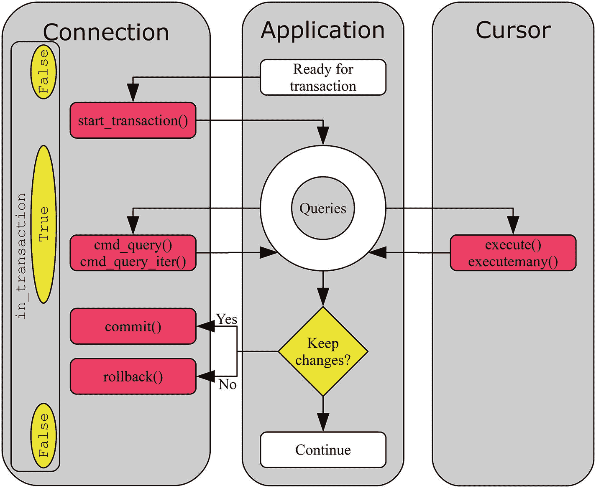

# 4.高级查询执行

在前一章中，您已经了解了执行查询的基础知识。本章探讨了与查询执行相关的附加功能。它从研究在一个 API 调用中执行多个查询的选项开始，然后转向诸如缓冲结果、调用存储过程和在 CSV 文件中加载数据等特性。

本章的后半部分重点介绍连接属性、如何执行事务、使用默认数据库属性以避免为每个表显式指定数据库名称，以及使用时区。它还概述了如何使用查询后可用的列信息。本章最后讨论了 C 扩展。

### 小费

本章中有许多示例程序。列表中出现的所有示例程序都可以下载。有关使用示例程序的更多信息，参见第 [1](01.html) 章中对示例程序的讨论。

## 多查询执行

在前一章中，对`cmd_query()`和`execute()`方法的所有调用都涉及到一个查询。然而，也可以通过一次调用 MySQL Connector/Python 来执行多个查询。

### 注意

虽然一次提交多个查询似乎是一种简化，并且在某些情况下可以提高性能，但也有不利的一面。特别是，当阅读程序的源代码时，可能更难理解正在发生的事情。因此，一定要小心使用对多查询执行的支持。

支持使用连接对象和游标的多个查询。假设连接对象名为`db`，光标名为`cursor`，支持处理多个查询的方法有

*   `db.cmd_query_` `iter` `()`:这与`cmd_query()`方法类似，只是它返回一个生成器，可以用来获取每个查询的结果。该方法仅在纯 Python 实现中可用。

*   `cursor.` `execute()`:当`multi`参数启用时，游标的`execute()`方法也可以执行多个查询。这相当于`cmd_query_iter()`，返回结果的生成器。

*   `cursor.` `executemany()`:该方法采用一个模板(带有参数占位符的查询)和一组参数列表。不支持返回结果。

这三种方法将是本节剩余部分的主题，首先使用`cmd_query_iter()`和`execute()`方法执行几个查询，然后使用`executemany()`继续执行基于模板的查询，最后使用`executemany()`将多行插入到一个表中。

### 支持结果的多重查询

与前一章中使用的方法等效但支持执行多个查询的方法是 connection 对象的`cmd_query_iter()`方法和 cursor 对象的`execute()`方法(与用于单个查询的方法相同)。在这两种情况下，结果的生成器(不是行！)被返回。

以这种方式执行查询的流程如图 [4-1](#Fig1) 所示。


图 4-1

一次执行多个查询的流程

图 [4-1](#Fig1) 显示查询被一个接一个地发送到 MySQL 服务器。当 MySQL 服务器执行完查询后，结果被发送回应用程序。一旦读取了所有行，MySQL Connector/Python 会自动发送下一个查询。这意味着启用缓冲(将在本章后面的“缓冲结果”一节中讨论)对于多语句执行非常有用。

`cmd_query_iter()`和`execute()`与`multi = True`的细节将在接下来的小节中依次讨论。

#### 连接- cmd_query_iter()

`cmd_query_iter()`方法的工作方式类似于`cmd_query()`方法。主要区别在于`cmd_query_iter()`返回一个可以用来获取结果的生成器，而不是直接返回结果。

清单 [4-1](#Par17) 展示了一个例子，其中`cmd_query_iter()`用于选择美国和印度人口最多的三个城市。

### 注意

与`cmd_query()`一样，在 MySQL Connector/Python 8.0.12 和更高版本中不需要使用 MySQLConverter 类。

```py
import mysql.connector
from mysql.connector.conversion import MySQLConverter
from datetime import datetime
from time import sleep

# Format strings
FMT_QUERY = "Query {0} - {1}:\n" + "-"*19
FMT_HEADER = "{0:18s}   {1:7s}   {2:3s}"
FMT_ROW = "{0:18s}   {1:^7s}   {2:4.1f}"

# Create connection to MySQL
db = mysql.connector.connect(
  option_files="my.ini", use_pure=True)

# Prepare the converter
converter = MySQLConverter(db.charset, True)

# Define the queries
sql1 = """
SELECT Name, CountryCode, Population
  FROM world.city
 WHERE CountryCode = 'USA'
 ORDER BY Population DESC
 LIMIT 3"""

sql2 = "DO SLEEP(3)"

sql3 = """
SELECT Name, CountryCode, Population
  FROM world.city
 WHERE CountryCode = 'IND'
 ORDER BY Population DESC
 LIMIT 3"""
queries = [sql1, sql2, sql3]

# Execute the queries and obtain the
# iterator

results = db.cmd_query_iter(";".join(queries))

# Iterate through the results
count = 0

for result in results:

  count = count + 1;
  time = datetime.now().strftime('%H:%M:%S')
  print(FMT_QUERY.format(count, time))
  if ('columns' in result):
    # It is one of the SELECT statements
    # as it has column definitions.
    # Print the result.
    print(FMT_HEADER.format(
      "City", "Country", "Pop"))
    (city, eof) = db.get_row()
    while (not eof):
      values = converter.row_to_python(
        city, result["columns"])
      print(FMT_ROW.format(
        values[0],
        values[1],
        values[2]/1000000.0
      ))
      (city, eof) = db.get_row()
  else:
    # Not a SELECT statement
    print("No result to print")

  sleep(2)
  print("")

db.close()

Listing 4-1Executing Multiple Queries with cmd_query_iter()

```

首先要注意的是，连接是使用`pure_python = True`建立的。`cmd_query_iter()`方法是需要使用纯 Python 实现的情况之一，因为该方法在 C 扩展实现中不可用。

建立连接后，定义了后面输出的格式字符串，并定义了将要执行的三个查询。执行查询后，每个结果都有一个循环。如果结果字典包含列信息，那么就有要提取的行。否则，它是另一种类型的查询(例如`INSERT`或这里的`DO`语句)。

### 注意

游标的`with_rows`属性也是通过检查结果字典中是否有列信息来工作的。

插入了两次休眠:第二个查询在 MySQL 服务器端执行三秒钟的休眠，在处理结果的每个循环结束时，Python 代码中有两秒钟的休眠。这使您可以从输出中看到查询和获取结果的流程。输出是

```py
Query 1 - 16:24:58:
-------------------
City                 Country    Pop
New York               USA      8.0
Los Angeles            USA      3.7
Chicago                USA      2.9

Query 2 - 16:25:01:
-------------------
No result to print

Query 3 - 16:25:03:
-------------------
City                 Country    Pop
Mumbai (Bombay)        IND     10.5
Delhi                  IND      7.2
Calcutta [Kolkata]     IND      4.4

```

第一个查询在 16:24:58 完成执行。第二个查询是三秒钟的睡眠，这也是查询结果准备好之前的延迟。由于在处理第一个查询的结果后，Python 代码中还有两秒钟的休眠，这表明在读取第一个查询的结果后，当应用程序“工作”时，第二个查询正在执行。

这也显示了使用多查询方法的优势之一:如果查询很慢，应用程序可能也需要一些时间来处理结果，这可以提高整体性能，因为应用程序可以在执行下一个查询时继续处理查询结果。

接下来是如何使用光标来执行相同的任务。

#### 光标–执行()

使用游标一次执行多个查询与执行单个查询非常相似。在这两种情况下，都使用了`execute()`方法。主要区别在于`multi`参数被设置为`True`，并且返回一个生成器。查询在一个字符串中提交，查询之间用分号分隔，就像使用`cmd_query_iter()`一样。

支持向查询传递参数；但是，所有参数都必须在一个元组、列表或字典中。这使得在需要参数时使用多查询执行变得不太有用；相反，在这些情况下，建议执行几次单个查询。

### 小费

如果所有的查询都使用相同的查询模板，并且没有要处理的结果集，那么接下来讨论的`executemany()`方法是用`multi = True`代替`execute()`的一个有用的替代方法。

清单 [4-2](#Par30) 显示了对应于前一个`cmd_query_iter()`的例子，但是这次使用了一个光标。Python 代码中的休眠和时间戳的打印已经被删除，因为它们的工作方式是一样的。

```py
import mysql.connector

# Format strings
FMT_QUERY = "Query {0}:\n" + "-"*8
FMT_HEADER = "{0:18s}   {1:7s}   {2:3s}"
FMT_ROW = "{0:18s}   {1:^7s}   {2:4.1f}"

# Create connection to MySQL
db = mysql.connector.connect(
  option_files="my.ini")

# Define the queries
sql_select = """
SELECT Name, CountryCode, Population
  FROM world.city
 WHERE CountryCode = %s
 ORDER BY Population DESC
 LIMIT 3"""
sql_do = "DO SLEEP(3)"
queries = [sql_select, sql_do, sql_select]

# Execute the queries and obtain the
# iterator
cursor = db.cursor()

results = cursor.execute(

  ";".join(queries),
  params=("USA", "IND"),
  multi=True

)

# Iterate through the results
count = 0
for result in results:
  count = count + 1;
  print(FMT_QUERY.format(count))
  if (result.with_rows):
    # It is one of the SELECT statements
    # as it has column definitions.
    # Print the result.
    print(FMT_HEADER.format(
      "City", "Country", "Pop"))
    city = cursor.fetchone()
    while (city):
      print(FMT_ROW.format(
        city[0],
        city[1],
        city[2]/1000000
      ))
      city = cursor.fetchone()
  else:
    # Not a SELECT statement
    print("No result to print")

  print("")

cursor.close()
db.close()

Listing 4-2Using a Cursor to Execute Multiple Queries

```

代码中只有很少的惊喜。主要的是，如前所述，`params`参数是所有查询共享的一个元组。在这种情况下，跟踪查询中的参数是相当简单的，但是一般来说，这可能会变得很困难并且容易出错。因此，如果需要参数替换，在大多数情况下最好使用单个查询的多次执行，或者如果用例允许，使用 cursor `executemany()`方法。

### 警告

在多查询执行中使用参数替换容易出错。考虑逐个执行查询，或者如果没有返回结果集，并且所有查询都使用相同的模板，则使用 cursor `executemany()`方法。

该脚本的输出类似于前面的示例:

```py
Query 1:
--------
City                 Country    Pop
New York               USA      8.0
Los Angeles            USA      3.7
Chicago                USA      2.9

Query 2:
--------
No result to print

Query 3:
--------
City                 Country    Pop
Mumbai (Bombay)        IND     10.5
Delhi                  IND      7.2
Calcutta [Kolkata]     IND      4.4

```

### 基于一个模板的多个查询

在某些情况下，有必要反复执行相同的查询，但使用不同的参数。对于那个用例，`executemany()`方法是存在的。

`executemany()`的主要缺点是不支持返回结果集。在每次查询执行之后，检查是否有任何要提取的行；如果是这样的话，所有的行都会被提取，但不会被保存。甚至返回值永远是`None`。

清单 [4-3](#Par39) 展示了一个简单的例子，其中几个城市都有人口变化。因为基本查询是相同的，`executemany()`是这个任务的一个很好的候选。为了便于查看更新的城市，城市名称、地区和国家代码被拼写出来。然而，在实际的应用程序中，如果主键(`city`表的`ID`列)是已知的，那么它是要更新的行的更好的标识符，因为它需要更少的锁和更好的性能。

### 小费

尽可能使用主键或至少另一个索引来查找行。索引越具体，搜索的行数就越少，持有的锁也就越少。这适用于所有选择、更新或删除行的查询。

```py
import mysql.connector

# Create connection to MySQL
db = mysql.connector.connect(
  option_files="my.ini", use_pure=True)
cursor = db.cursor()

# Definte the query template and the
# parameters to submit with it.
sql = """
UPDATE world.city
   SET Population = %(population)s
 WHERE Name = %(name)s
       AND CountryCode = %(country)s
       AND District = %(district)s"""

params = (
  {
    "name": "Dimitrovgrad",
    "country": "RUS",
    "district": "Uljanovsk",
    "population": 150000
  },
  {
    "name": "Lower Hutt",
    "country": "NZL",
    "district": "Wellington",
    "population": 100000
  },
  {
    "name": "Wuhan",
    "country": "CHN",
    "district": "Hubei",
    "population": 5000000
  },
)

# Get the previous number of questions
# asked to MySQL by the session
cursor.execute("""
  SELECT VARIABLE_VALUE
    FROM performance_schema.session_status
   WHERE VARIABLE_NAME = 'Questions'""")
tmp = cursor.fetchone()
questions_before = int(tmp[0])

# Execute the queries

cursor.executemany(sql, params)

print("Row count: {0}".format(
  cursor.rowcount))

print("Last statement: {0}".format(

  cursor.statement))

# Get the previous number of questions
# asked to MySQL by the session
cursor.execute("""
  SELECT VARIABLE_VALUE
    FROM performance_schema.session_status
   WHERE VARIABLE_NAME = 'Questions'""")
tmp = cursor.fetchone()
questions_after = int(tmp[0])

print("Difference in number of"
  + " questions: {0}".format(
    questions_after-questions_before
))

db.rollback()
cursor.close()
db.close()

Listing 4-3Using 
executemany()

to Update Several Rows

```

首先，定义模板。在这种情况下，命名参数用于使使用参数字典序列成为可能。它产生了更冗长的代码，但也产生了更易于阅读和理解的代码。

然后调用`executemany()`方法并打印修改的行数。在这种情况下，更新了三行。在`executemany()`调用之前和之后，连接询问的问题数量从`performance_schema.session_status`表中获取。这用于显示在`executemany()`调用期间有多少查询被发送到 MySQL 服务器。光标的`rowcount`和`statement`属性用于获取关于调用`executemany()`的一些信息。创建连接时，使用`statement`属性是使用`use_pure = True`的原因；当使用 C 扩展时，除了扩展插入之外，使用`executemany()`执行查询时不支持`statement`属性。

### 小费

在 MySQL Server 5.6 及更早版本中，将`performance_schema.session_status`表更改为`information_schema.session_status`表。

最后，事务回滚到示例开始之前的状态，离开`city`表。这样做只是为了让所有的例子都使用相同的已知数据状态；另外，这意味着您可以重新执行该示例，并获得相同的结果。事务将在本章后面的“事务”一节中讨论。该程序的输出是

```py
Row count: 3
Last statement: UPDATE world.city
   SET Population = 5000000
 WHERE Name = 'Wuhan'
       AND CountryCode = 'CHN'
       AND District = 'Hubei'
Difference in number of questions: 4

```

输出显示`executemany()`更新了三行(然后回滚)，最后执行的语句更新了武汉市的人口。前后问的问题数量相差四个:三个用于三个 update 语句，一个用于查询问的问题数量。

如图所示，通过`executemany()`调用`execute()`方法来逐个执行查询。因此，与在应用程序本身中循环查询相比，没有性能优势。然而，有一个例外:`INSERT`声明。

### 扩展插件

MySQL 支持一个叫做*扩展插入*的特性。通常，当向表中插入多行时，这是通过一系列`INSERT`语句完成的:

```py
CREATE TEMPORARY TABLE world.t1 (
  id int unsigned NOT NULL,
  val varchar(10),
  PRIMARY KEY (id)
);

INSERT INTO world.t1 VALUES (1, 'abc');

INSERT INTO world.t1 VALUES (2, 'def');

INSERT INTO world.t1 VALUES (3, 'ghi');

SELECT * FROM world.t1;
+----+------+
| id | val  |
+----+------+
|  1 | abc  |
|  2 | def  |
|  3 | ghi  |
+----+------+

```

这可以转换成使用扩展插入的单个语句:

```py
DELETE FROM world.t1;

INSERT INTO world.t1

VALUES (1, 'abc'),

       (2, 'def'),
       (3, 'ghi');
SELECT * FROM world.t1;
+----+------+
| id | val  |
+----+------+
|  1 | abc  |
|  2 | def  |
|  3 | ghi  |
+----+------+

```

与单次插入相比，扩展插入可以大大提高批量插入的性能，尤其是在启用了自动提交的情况下(有关自动提交的更多信息，请参见“事务”一节)。

MySQL Connector/Python 内置了对使用 executemany()方法生成扩展插入语句的支持。当检测到模板与 INSERT 语句匹配时，将生成一条插入所有所需行的语句。清单 [4-4](#Par53) 展示了在`world.t1`临时表中插入三行的例子。

```py
import mysql.connector

# Create connection to MySQL
db = mysql.connector.connect(
  option_files="my.ini"
)
cursor = db.cursor()

# Create a temporary table for this
# example
cursor.execute("""
  CREATE TEMPORARY TABLE world.t1 (
    id int unsigned NOT NULL,
    val varchar(10),
    PRIMARY KEY (id)
  )""")
# Definte the query template and the
# parameters to submit with it.
sql = """
INSERT INTO world.t1 VALUES (%s, %s)"""
params = (
  (1, "abc"),
  (2, "def"),
  (3, "ghi")
)
# Get the previous number of questions
# asked to MySQL by the session
cursor.execute("""
  SELECT VARIABLE_VALUE
    FROM performance_schema.session_status
   WHERE VARIABLE_NAME = 'Questions'""")
tmp = cursor.fetchone()
questions_before = int(tmp[0])

# Execute the query

cursor.executemany(sql, params)

print("Row count = {0}".format(
  cursor.rowcount))
print("Last statement: {0}".format(
  cursor.statement
))

# Get the previous number of questions
# asked to MySQL by the session
cursor.execute("""
  SELECT VARIABLE_VALUE
    FROM performance_schema.session_status
   WHERE VARIABLE_NAME = 'Questions'""")
tmp = cursor.fetchone()
questions_after = int(tmp[0])

print("Difference in number of"
  + " questions: {0}".format(
    questions_after-questions_before
))

cursor.close()
db.close()

Listing 4-4Using 
executemany()

to Insert Several Rows

```

除了是一个`INSERT`语句和为要插入的数据创建一个临时表之外，这个例子基本上与前一个一样。这次的输出是

```py
Row count = 3
Last statement: INSERT INTO world.t1 VALUES (1, 'abc'),(2, 'def'),(3, 'ghi')
Difference in number of questions: 2

```

行数仍然是三，但是现在最后一条语句包含了所有三行:三条`INSERT`语句被重写为一条插入所有三行的语句。这也反映在问题的数量上，比`UPDATE`示例少了两个。

现在多重查询的主题到此结束。在“交易”部分将有一个简短的附加讨论。现在是时候看看游标的其他一些特性了；首先是缓冲结果。

## 缓冲结果

游标的一个特殊特性是，可以让 MySQL Connector/Python 在查询后自动获取结果集并进行缓冲，以便以后使用。缓冲结果会尽可能快地释放 MySQL 服务器的资源，但反而会增加应用程序的需求。这使得缓冲在应用程序处理小结果集时最有用。缓冲光标可与`dictionary`或`named_tuple`选项结合使用。

与非缓冲游标相比，缓冲游标的一个优点是，即使两个游标都包含结果集，也可以同时为同一连接激活两个游标。对于非缓冲游标，试图在获取所有行之前通过同一连接执行查询会导致异常。由于缓冲游标会自动获取行，并使获取方法从缓冲区中读取，就 MySQL 服务器而言，连接可以自由地再次使用。

这个特性有用的两个例子是

*   在并排处理返回的行有意义的情况下，执行两个或更多的`SELECT`语句。通常，使用`JOIN`将这些查询重写为一个查询会更好，但偶尔也有理由使用更多但更简单的查询。

*   从一个查询中读取行，然后在另一个查询中使用这些行。同样，组合查询可能更好，但是，例如，如果读取了一行以便可以更新它，而业务逻辑在数据库中不可用，那么使用两个游标可能会很有用。

### 注意

缓冲允许在处理结果集之前在同一个游标中执行新的查询。但是，这将导致旧的结果集被丢弃。

清单 [4-5](#Par65) 展示了一个例子，其中缓冲和到字典的转换都被启用。有两个游标:`cursor1`读取澳大利亚的城市，`cursor2`通过增加 10%来更新人口。这种情况下的业务逻辑非常简单，最好在一个查询中完成，但是在更新行的逻辑比较复杂的情况下，也可以使用类似的方法。

```py
import mysql.connector
from math import ceil

# The SQL UPDATE statement that will be
# used in cursor2.
SQL_UPDATE = """
  UPDATE world.city
     SET Population = %(new_population)s
   WHERE ID = %(city_id)s"""

# Function to increase the population
# with 10%

def new_population(old_population):

  return int(ceil(old_population * 1.10))

# Create connection to MySQL
db = mysql.connector.connect(
  option_files="my.ini")

# Instantiate the cursors

cursor1 = db.cursor(

  buffered=True, dictionary=True)

cursor2 = db.cursor()

# Execute the query to get the
# Australian cities
cursor1.execute(
  """SELECT ID, Population
       FROM world.city
      WHERE CountryCode = %s""",
  params=("AUS",)
)

city = cursor1.fetchone()
while (city):
  old_pop = city["Population"]
  new_pop = new_population(old_pop)
  print("ID, Old => New: "
    + "{0}, {1} => {2}".format(
    city["ID"], old_pop, new_pop
  ))
  cursor2.execute(
    SQL_UPDATE,
    params={
      "city_id": city["ID"],
      "new_population": new_pop
    }
  )
  print("Statement: {0}".format(
    cursor2.statement))
  city = cursor1.fetchone()

db.rollback()
cursor1.close()
cursor2.close()
db.close()

Listing 4-5Using a Buffering Cursor to Update Rows

```

首先，定义更新群体的逻辑。在这种情况下，这是一个简单的函数，它将参数增加 10%，然后将结果向上舍入到最接近的整数。

定义了两个游标。`cursor1`读取将要更新的行，因此它必须是一个缓冲游标。在这种情况下，还决定将行作为字典返回。`cursor2`在读取来自`cursor1`的行时执行更新。在本例中，`cursor2`是缓冲还是非缓冲游标并不重要，因为它不返回任何行。

在执行了用于查找澳大利亚城市的 ID 和现有人口的`SELECT`查询之后，会有一个遍历城市的循环。对于每个城市，计算新的人口并执行`UPDATE`语句。城市 ID、前后人口以及`UPDATE`语句都作为输出打印出来。前三个城市的产量是

```py
ID, Old => New: 130, 3276207 => 3603828
Statement: UPDATE world.city
     SET Population = 3603828
   WHERE ID = 130
ID, Old => New: 131, 2865329 => 3151862
Statement: UPDATE world.city
     SET Population = 3151862
   WHERE ID = 131
ID, Old => New: 132, 1291117 => 1420229
Statement: UPDATE world.city
     SET Population = 1420229
   WHERE ID = 132
...

```

### 警告

两个游标的查询必须在同一个事务中执行(默认情况下发生),以确保正确的结果。否则，另一个连接可能会更新`SELECT`和`UPDATE`之间的群体。但是，只要事务处于活动状态，这些行就会被锁定，因此要注意循环的执行时间不要太长，否则可能会导致其他查询超时或发生死锁。

最后要讨论的特定于游标的特性是对存储过程的支持。

## 存储过程

存储过程的特性意味着对于某些用例，它们必须被区别对待。具体来说，它们可以通过参数列表返回值，并且调用存储过程的单个查询可以返回多个结果集。在幕后，连接的`cmd_query_iter()`方法与每个结果集的一个内部缓冲游标一起使用。

### 警告

因为缓冲游标用于处理存储过程的结果集，所以应用程序端的内存使用率可能会高于预期。如果返回大量结果，请小心使用存储过程支持。

可用于执行存储过程的游标方法有

*   `callproc()`:这是用来执行存储过程的方法。返回值是一个带有传递给过程的参数的元组。

*   `stored_results()`:这个方法是一个生成器，用于迭代由`callproc()`调用的存储过程返回的结果集。

理解这两个过程如何工作的最简单的方法是考虑一个例子。为此，将使用清单 [4-6](#Par78) 中的`min_max_cities()`程序。

```py
DELIMITER $$
CREATE PROCEDURE world.min_max_cities(
    IN in_country char(3),
    INOUT inout_min int,
    OUT out_max int
)
SQL SECURITY INVOKER
BEGIN
  SELECT MIN(Population),
         MAX(Population)
    INTO inout_min, out_max
    FROM world.city
   WHERE CountryCode = in_country
         AND Population >= inout_min;

  SELECT *
    FROM world.city
   WHERE CountryCode = in_country
         AND Population >= inout_min
   ORDER BY Population ASC
   LIMIT 3;

  SELECT *
    FROM world.city
   WHERE CountryCode = in_country
         AND Population >= inout_min
   ORDER BY Population DESC
   LIMIT 3;
END$$
DELIMITER ;

Listing 4-6The min_max_cities() Procedure

```

该过程查找给定国家的城市的最小和最大人口，其中城市人口必须至少达到一定数量。然后选择满足最低人口要求的三个城市的所有数据，最后选择人口最多的三个城市的所有数据。该过程有三个参数:

*   `in_country`:过滤城市所依据的国家代码。该参数在过程中是只读的。

*   在投入上，这是城市必须拥有的最低人口。就产出而言，它是满足需求的城市的最小人口。

*   `out_max`:在输出中，它包含至少有`inout_min`名居民的人口最多的城市的人口。输入值被丢弃。

总之，这个过程使用了 MySQL 连接器/Python 游标中存储过程实现的所有特性。该程序的安装方式与安装`world`样本数据库的方式相似:

```py
shell$ mysql --user=pyuser --password \
             --host=127.0.0.1 --port=3306 \
             --execute="SOURCE listing_4_6.sql"

```

该命令假定`mysql`命令行客户端是执行搜索路径，并且带有过程定义的文件`listing_4_6.sql`位于当前工作目录中。在 Windows 上，可以使用相同的命令，但所有参数必须在同一行上。清单 [4-7](#Par86) 中显示了在`mysql`命令行客户端中使用该过程的示例。

```py
mysql> SET @MIN = 500000;
Query OK, 0 rows affected (0.00 sec)

mysql> CALL world.min_max_cities('AUS', @MIN, @MAX);
+-----+----------+-------------+-----------------+------------+
| ID  | Name     | CountryCode | District        | Population |
+-----+----------+-------------+-----------------+------------+
| 134 | Adelaide | AUS         | South Australia |     978100 |
| 133 | Perth    | AUS         | West Australia  |    1096829 |
| 132 | Brisbane | AUS         | Queensland      |    1291117 |
+-----+----------+-------------+-----------------+------------+
3 rows in set (0.01 sec)

+-----+-----------+-------------+-----------------+-----------+
| ID  | Name      | CountryCode | District        |Population |
+-----+-----------+-------------+-----------------+-----------+
| 130 | Sydney    | AUS         | New South Wales |   3276207 |
| 131 | Melbourne | AUS         | Victoria        |   2865329 |
| 132 | Brisbane  | AUS         | Queensland      |   1291117 |
+-----+-----------+-------------+-----------------+-----------+
3 rows in set (0.01 sec)

Query OK, 0 rows affected (0.02 sec)

mysql> SELECT @MIN, @MAX;
+--------+---------+
| @MIN   | @MAX    |
+--------+---------+
| 978100 | 3276207 |
+--------+---------+
1 row in set (0.00 sec)

Listing 4-7Using the world.min_max_cities Procedure

```

清单 [4-8](#Par88) 显示了相应的 Python 程序，该程序使用`callproc()`方法调用过程，然后使用`stored_results()`方法读取结果集。

```py
import mysql.connector

# Format strings
FMT_QUERY = "Query {0}:\n" + "-"*8
FMT_HEADER = "{0:18s}   {1:3s}"
FMT_ROW = "{0:18s}   {1:4.1f}"

# Create connection to MySQL
db = mysql.connector.connect(
  option_files="my.ini")
cursor = db.cursor()

# Execute the procedure

return_args = cursor.callproc(

  "world.min_max_cities",
  ("AUS", 500000, None)

)

# Print the returned arguments
print("""Country ..........: {0}
Min Population ...: {1:8d}
Max Population ...: {2:8d}
""".format(*return_args))

# Iterate over the result sets and print
# the cities and their population
# Convert the rows to dictionaries to
# avoid referencing the columns by
# ordinal position.
count = 0

for result in cursor.

stored_results()

:

  count = count + 1;
  print(FMT_QUERY.format(count))
  if (result.with_rows):
    # It is one of the SELECT statements
    # as it has column definitions.
    # Print the result.
    print(FMT_HEADER.format("City", "Pop"))
    city = result.fetchone()
    while (city):
      city_dict = dict(
        zip(result.column_names, city))

      print(FMT_ROW.format(
        city_dict["Name"],
        city_dict["Population"]/1000000
      ))
      city = result.fetchone()
  print("")

cursor.close()
db.close()

Listing 4-8Using the Cursor Stored Procedure Methods

```

建立连接并设置打印输出的格式字符串后，使用`callproc()`方法调用该过程。`args`参数(第二个参数)必须为过程采用的每个参数包含一个元素，即使有些参数只用作 out 参数。返回值是一个元组，传递给过程的每个参数有一个元素。对于只发送到过程的参数，在返回元组中使用原始值。

### 小费

默认情况下，返回的参数将保留过程中定义的数据类型(除非对于游标为`raw=True`，在这种情况下，它们将作为`arraybytes`返回)。然而，也可以显式指定 MySQL 数据类型，例如`(0, 'CHAR')`。可用类型见 [`https://dev.mysql.com/doc/refman/en/cast-functions.html`](https://dev.mysql.com/doc/refman/en/cast-functions.html) 。

程序的最后一部分迭代由`stored_results()`返回的结果。该循环类似于其他多结果集方法。输出如下所示:

```py
Country ..........: AUS
Min Population ...:   978100
Max Population ...:  3276207

Query 1:
--------
City                  Pop
Adelaide              1.0
Perth                 1.1
Brisbane              1.3

Query 2:
--------
City                  Pop
Sydney                3.3
Melbourne             2.9
Brisbane              1.3

```

有了存储过程，就只剩下一种类型的查询需要讨论了:加载存储为逗号分隔值(CSV)的数据。

## 使用 CSV 文件加载数据

在系统之间传输数据的一种流行方式是使用逗号分隔值的文件(CSV)。这是存储数据的标准方式，从导出电子表格到数据库备份，这种方式得到了广泛的支持。加载存储在 CSV 文件中的数据也是一种相对高效的大容量加载数据的方式。

### 注意

虽然 CSV 中的 C 表示数据用逗号分隔，但通常使用制表符、空格、分号或其他字符作为分隔符。事实上，MySQL 使用制表符作为默认分隔符。

加载数据的 MySQL 语句是`LOAD DATA INFILE`命令。MySQL Connector/Python 中没有对此命令的原生支持，但仍有一些特殊的考虑。使用`LOAD` `DATA INFILE`主要有两种方式:加载位于安装 MySQL 服务器的主机上的文件或者从应用程序端加载文件。在任何一种情况下，该语句都像任何其他使用连接`cmd_query()`方法或游标`execute()`方法的单个语句一样执行。

### 加载服务器端文件

加载一个位于安装 MySQL 服务器的主机上的文件是在没有任何修饰符的情况下执行`LOAD DATA INFILE`时使用的方法。需要注意的主要事情是 MySQL 用户必须拥有`FILE`特权，并且 CSV 文件不能位于任何随机位置。

MySQL 服务器的`secure_file_priv`选项( [`https://dev.mysql.com/doc/refman/en/server-system-variables.html#sysvar_secure_file_priv`](https://dev.mysql.com/doc/refman/en/server-system-variables.html#sysvar_secure_file_priv) )限制了允许`LOAD DATA INFILE`读取文件的路径。只能使用`secure_file_priv`指定的路径或其下的路径。`secure_file_priv`选项还指定了`SELECT … INTO OUTFILE`语句可以将数据导出到哪里。例如，`secure_file_priv`的当前值可以使用以下查询找到:

```py
mysql> SELECT @@global.secure_file_priv;
+---------------------------+
| @@global.secure_file_priv |
+---------------------------+
| C:\MySQL\Files\           |
+---------------------------+
1 row in set (0.00 sec)

```

在最近的 MySQL 服务器版本中，`secure_file_priv`默认为`NULL`，这将禁用导入和导出，除非在 Linux 上使用原生包安装(默认为`/var/lib/mysql-files`)或在 Windows 上使用 MySQL 安装程序(默认为`C:\ProgramData\MySQL\MySQL Server 8.0\Uploads\`或类似)。

只能通过更新 MySQL 配置文件来更改`secure_file_priv`选项(按照惯例，Windows 上的`my.ini`和其他平台上的`my.cnf`)。例如:

```py
[mysqld]
secure_file_priv = C:\MySQL\Files

```

MySQL 配置文件更新后，需要重新启动 MySQL 服务器以使更改生效。此时，可以使用`LOAD DATA INFILE`命令加载数据。在讨论加载数据的例子之前，让我们看一下从 MySQL 服务器端加载文件的替代方法:加载应用程序本地的文件。

### 加载应用程序端文件

当`LOCAL`关键字被添加到命令:`LOAD DATA LOCAL INFILE`时，使用本地版本。在 MySQL 服务器端，选项`local_infile` ( [`https://dev.mysql.com/doc/refman/en/server-system-variables.html#sysvar_local_infile`](https://dev.mysql.com/doc/refman/en/server-system-variables.html#sysvar_local_infile) )指定是否允许该特性。在 MySQL Server 5.7 及更早版本中，默认启用；在 8.0 及更高版本中，默认情况下禁用该功能。

在 MySQL Connector/Python 中，选项`allow_local_infile`指定是否允许加载本地文件。在所有最近的 MySQL Connector/Python 版本中，`allow_local_infile`是默认启用的。该选项在创建连接时设置，或者通过连接`config()`方法设置。

### 小费

从安全角度来看，最好禁用从应用程序端读取数据文件的支持。也就是建议在 MySQL 服务器端设置`local_infile = 0`(MySQL Server 8.0 及以后版本默认)，在 MySQL Connector/Python 程序中设置`allow_local_infile = False`，除非确实需要该特性。允许读取本地文件的一个潜在问题是，web 应用程序中的一个错误最终可能会允许用户检索应用程序可以读取的任何文件。参见 [`https://dev.mysql.com/doc/refman/en/load-data-local.html`](https://dev.mysql.com/doc/refman/en/load-data-local.html) 了解更多关于加载本地文件的安全隐患。

这一节的其余部分将通过一个例子，主要关注本地变体，但也有一些关于如何将它转化为服务器端的例子的说明。

### 加载数据示例

`LOAD DATA INFILE`语句非常通用，因为它可以处理不同的分隔符、引用样式、行尾等。该语句的完整指南超出了本书的范围，但是值得看一看一个例子。代码清单将使用应用程序端变体；然而，服务器端非常相似，从服务器端加载文件只是一个练习。

### 小费

`LOAD DATA INFILE`的完整文档见 [`https://dev.mysql.com/doc/refman/en/load-data.html`](https://dev.mysql.com/doc/refman/en/load-data.html) 。

该示例将加载文件`testdata.txt`，该文件位于执行 Python 程序的同一目录中。数据将被加载到`world.loadtest`表中。该文件的内容是

```py
# ID, Value
1,"abcdef..."
2,"MySQL Connector/Python is fun"
3,"Smileys require utf8mb4"

```

`4,` 

最后一个值是海豚表情符号(U+1F42C)。由于海豚是 UTF-8 (0xF09F90AC)中需要四个字节的表情符号之一，所以需要使用 MySQL 中的`utf8mb4`字符集(MySQL 8.0 及以后版本中的默认)。可以用下面的语句创建`world.loadtest`表:

```py
CREATE TABLE world.loadtest (
  id int unsigned NOT NULL PRIMARY KEY,
  val varchar(30)
) DEFAULT CHARACTER SET=utf8mb4;

```

由于这是加载一个本地文件，您必须在 MySQL 服务器中启用`local_infile`选项。这可以使用下面的语句来完成:

```py
mysql> SET GLOBAL local_infile = ON;
Query OK, 0 rows affected (0.00 sec)

```

这使得设置不需要重启 MySQL 但是，它不会保持更改。

准备好数据、表格和服务器端设置后，清单 [4-9](#Par118) 中的程序可以用来将数据加载到表格中。示例中用于文件的文件结尾被假定为 Unix 换行符。如果使用 Windows 换行符，则必须将`LOAD DATA LOCAL INFILE`语句改为`\r\n`或`\r`(取决于编写文件的应用程序)，而不是将`LINES TERMINATED BY`参数改为`\n`。

```py
import mysql.connector

FMT_HEADER = "{0:2s}   {1:30s}   {2:8s}"
FMT_ROW = "{0:2d}   {1:30s}   ({2:8s})"

# Create connection to MySQL
db = mysql.connector.connect(
  option_files="my.ini",
  allow_local_infile=True
)
cursor = db.cursor(dictionary=True)

# Clear the table of any existing rows
cursor.execute("DELETE FROM world.loadtest")

# Define the statement and execute it.

sql = """

LOAD DATA LOCAL INFILE 'testdata.txt'

     INTO TABLE world.loadtest

CHARACTER SET utf8mb4

   FIELDS TERMINATED BY ','
          OPTIONALLY ENCLOSED BY '"'
    LINES TERMINATED BY '\n'
   IGNORE 1 LINES"""
cursor.execute(sql)

print(
  "Number of rows inserted: {0}".format(
  cursor.rowcount
))
print("")

sql = """
SELECT id, val, LEFT(HEX(val), 8) AS hex
  FROM world.loadtest
 ORDER BY id"""
cursor.execute(sql)

if (cursor.with_rows):
  # Print the rows found
  print(
    FMT_HEADER.format(
      "ID", "Value", "Hex"
    )
  )
  row = cursor.fetchone()
  while (row):
    print(
      FMT_ROW.format(
        row["id"],
        row["val"],
        row["hex"]
      )
    )
    row = cursor.fetchone()

# Commit the transaction
db.commit()
cursor.close()
db.close()

Listing 4-9Loading Data with LOAD DATA LOCAL INFILE

```

创建连接时将`allow_local_infile`选项明确设置为`True`。这似乎是不必要的；但是，它清楚地表明了加载本地文件并将内容插入表中的意图。请注意，MySQL 客户端程序，如`mysql`命令行客户端，在 MySQL Server 8.0 中默认禁用了对应于`allow_local_infile`的选项。可能包括 MySQL Connector/Python 在内的连接器会在未来的某个时候做出同样的改变，所以显式启用`allow_local_infile`会让未来的升级更容易。

创建连接和光标后要做的第一件事是删除`world.loadtest`表中的所有现有数据。这是在程序运行多次的情况下完成的；`DELETE`语句确保在加载数据之前表总是空的。

然后使用`LOAD DATA LOCAL INFILE`语句加载数据。要使用的确切参数取决于正在加载的 CSV 文件。建议始终指定文件的字符集，以便正确读取数据。

### 小费

始终指定保存数据时使用的字符集，以便 MySQL 能够正确解释数据。

加载数据后，使用`cursor.rowcount`属性打印插入的行数，并选择和打印表的内容。要知道，不是所有的终端程序都可以打印海豚表情符号，所以它可能看起来像一个问号，一些其他的占位符，甚至根本没有字符。这就是该值的前四个字节也以十六进制表示法打印的原因，因此可以验证该值是否正确。输出如下所示

```py
Number of rows inserted: 4

ID   Value                            Hex
 1   abcdef...                        (61626364)
 2   MySQL Connector/Python is fun    (4D795351)
 3   Smileys require utf8mb4          (536D696C)
 4   ?                                (F09F90AC)

```

如果您想尝试服务器端的变体，那么您需要确保用户拥有`FILE`特权:

```py
mysql> GRANT FILE ON *.* TO pyuser@localhost;
Query OK, 0 rows affected (0.40 sec)

```

另一方面，您不再需要启用`allow_local_infile`选项。此外，您必须删除`LOAD DATA INFILE`语句中的`LOCAL`关键字，并将路径改为指向文件服务器端的位置，例如:

```py
LOAD DATA INFILE 'C:/MySQL/Files/testdata.txt'
     INTO TABLE world.loadtest
CHARACTER SET utf8mb4
   FIELDS TERMINATED BY ','
          OPTIONALLY ENCLOSED BY '"'
    LINES TERMINATED BY '\n'
   IGNORE 1 LINES

```

这就结束了各种执行查询的重要方法的旅程。是时候看看连接属性了。

## 连接属性

有几个属性提供有关连接状态或执行查询时的行为的信息。这些属性包括为查询设置默认数据库(模式)和字符集，以及关于是否有行要被消费的信息，如前一章所述。这些属性是连接对象的一部分，总结在表 [4-1](#Tab1) 中。

表 4-1

连接属性

<colgroup><col class="tcol1 align-left"> <col class="tcol2 align-left"> <col class="tcol3 align-left"> <col class="tcol4 align-left"></colgroup> 
| 

财产

 | 

类型

 | 

数据类型

 | 

描述

 |
| --- | --- | --- | --- |
| `autocommit` | `RW` | 布尔代数学体系的 | 是否为连接启用了自动提交模式。使用该属性会导致在 MySQL 服务器上执行`SELECT @@session.autocommit`查询。 |
| `can_consume_results` | `RO` | 布尔代数学体系的 | 如果在获取之前的行之前执行了新的查询，则结果会被自动消耗。对应的连接配置选项是`consume_results`。 |
| `charset` | `RO` | 线 | 用于连接的字符集。使用`set_charset_collation()`方法改变所使用的字符集和/或集合。 |
| `collation` | `RO` | 线 | 用于连接的集合。使用`set_charset_collation()`方法改变所使用的字符集和/或集合。 |
| `connection_id` | `RO` | 整数 | MySQL 服务器分配给连接的连接 ID。该属性在第 [2](02.html) 章中被用来验证连接已经被创建。 |
| `database` | `RW` | 线 | 连接的当前默认数据库(模式),如果没有设置默认数据库，则为`None`。引用属性在服务器上执行`SELECT DATABASE()`。设置属性执行`USE`语句。或者，可以使用`cmd_init_db()`方法更改默认数据库。 |
| `get_warnings` | `RW` | 布尔代数学体系的 | 使用游标时是否自动检索警告。 |
| `in_transaction` | `RO` | 布尔代数学体系的 | 连接当前是否在事务中。 |
| `python_charset` | `RO` | 线 | MySQL 字符集的 Python 等价物。两者的区别在于，在 Python 中，`utf8mb4`和`binary`字符集作为`utf8`返回。 |
| `raise_on_warnings` | `RW` | 布尔代数学体系的 | 使用游标时，警告是否转换为异常。当值改变时，`get_warnings`的值自动设置为与`raise_on_warnings`相同的值。 |
| `server_host` | `RO` | 线 | 用于连接 MySQL 服务器的主机名。对应的连接配置选项是`host`。 |
| `server_port` | `RO` | 整数 | 用于连接 MySQL 服务器的 TCP/IP 端口。对应的连接配置选项是`port`。 |
| `sql_mode` | `RW` | 线 | 当前使用的 SQL 模式。读取该属性会导致执行以下查询:`SELECT @@session.sql_mode`。设置 SQL 模式会执行一个`SET`语句。建议使用来自`SQLMode`常量类的模式列表指定一个新的 SQL 模式。返回值是用逗号分隔的字符串。 |
| `time_zone` | `RW` | 线 | 用于连接的时区。这会影响为时间戳数据类型返回的值。读取属性执行查询`SELECT @@session.` `time_zone`。分配一个新时区会执行一个`SET`语句。 |
| `unix_socket` | `RO` | 线 | 用于连接 MySQL 服务器的 Unix 套接字的路径。 |
| `unread_result` | `RW` | 布尔代数学体系的 | 是否有要从上一个查询中读取的行。**警告:**不要设置该属性。写支持仅适用于游标。 |
| `user` | `RO` | 线 | 当前用于连接的用户。连接的`cmd_change_user()`方法可用于更改用户、默认模式和字符集。 |

`Type`列指定属性是只读的(RO)还是可以读写的属性(RW)。一些只读选项有一个特殊的方法来改变它们的值；在这种情况下，描述中会提到该方法。例如，字符集和与归类相关的属性可以通过`set_charset_collation()`方法更新，如第 [2](02.html) 章所示。除了`connection_id`、`in_transaction`、`python_charset`和`unread_result`属性外，这些属性都可以在创建配置时进行设置。配置选项的名称与属性名称相同，除非在描述中有所提及。

以下部分将包括一些属性的示例。首先，将讨论事务，包括`autocommit`和`in_transaction`属性之间的关系。后面的部分将讨论指定默认数据库和使用时区。

## 处理

使用数据库时，事务是一个非常重要的概念。事务将几个查询组合在一起，并确保所有查询都被提交或回滚。它们还允许隔离，例如，在提交更改之前，一个事务所做的更改不会被其他事务看到。

### 交易——什么是 Acid？

酸代表原子性、一致性、隔离性和持久性。也许是数据库理论中最重要的概念之一，它定义了数据库系统必须表现出的行为，才能被认为是可靠的事务处理。

**原子性**意味着对于包含多个命令的事务，数据库必须允许在“全有或全无”的基础上修改数据。也就是说，每个事务都是原子的。如果命令失败，则整个事务失败，并且事务中到该点为止的所有更改都将被丢弃。这对于在高交易环境(如金融市场)中运行的系统尤其重要。考虑一下资金转移的后果。通常，借记一个账户和贷记另一个账户需要多个步骤。如果在借记步骤后交易失败，并且没有将钱贷记回第一个帐户，该帐户的所有者将会非常生气。在这种情况下，从借方到贷方的整个交易必须成功，否则都不会成功。

**一致性**意味着只有有效的数据才会存储在数据库中。也就是说，如果事务中的命令违反了一致性规则之一，则整个事务将被丢弃，数据将返回到事务开始之前的状态。相反，如果事务成功完成，它将以遵守数据库一致性规则的方式更改数据。

**隔离**意味着同时执行的多个事务不会互相干扰。这是并发性的真正挑战最明显的地方。数据库系统必须处理事务不能违反数据的情况(更改、删除等)。)正在另一个事务中使用。有很多方法可以解决这个问题。大多数系统使用一种称为锁定的机制，在第一个事务完成之前，防止数据被另一个事务使用。尽管隔离属性没有规定先执行哪个事务，但它确实确保了它们不会相互干扰。

**持久性**意味着任何交易都不会导致数据丢失，在交易过程中创建或更改的任何数据也不会丢失。耐用性通常由强大的备份和恢复维护功能提供。一些数据库系统使用日志记录来确保任何未提交的数据可以在重启时恢复。 <sup>[1](#Fn1)</sup>

有两个与事务相关的连接属性。`autocommit`选项指定是否自动提交事务；`in_transaction`属性反映连接是否在事务中。

### 注意

MySQL 有两个事务存储引擎:`InnoDB`，这是 MySQL Server 中的默认设置，以及`NDBCluster`，它包含在 MySQL Cluster 产品中。

从清单 [4-10](#Par143) 中的例子可以看出`autocommit`选项的效果，其中先禁用`autocommit`属性，然后启用`in_transaction`属性，检查属性的值。

```py
import mysql.connector

# Create connection to MySQL
db = mysql.connector.connect(
  option_files="my.ini")
cursor = db.cursor()

# Initialize the stages (ordered)
stages = [
  "Initial",
  "After CREATE TABLE",
  "After INSERT",
  "After commit()",
  "After SELECT",
]

# Initialize dictionary with one list
# per stage to keep track of whether
# db.in_transaction is True or False
# at each stage.
in_trx = {stage: [] for stage in stages}

for autocommit in [False, True]:
  db.autocommit = autocommit;

  in_trx["Initial"].insert(
    autocommit, db.in_transaction)

  # Create a test table
  cursor.execute("""

CREATE TABLE world.t1 (

  id int unsigned NOT NULL PRIMARY KEY,
  val varchar(10)

)"""

  )

  in_trx["After CREATE TABLE"].insert(
    autocommit, db.in_transaction)

  # Insert a row
  cursor.execute("""
INSERT INTO world.t1
VALUES (1, 'abc')"""
  )

  in_trx["After INSERT"].insert(
    autocommit, db.in_transaction)

  # Commit the transaction
  db.commit()

  in_trx["After commit()"].insert(
    autocommit, db.in_transaction)

  # Select the row
  cursor.execute("SELECT * FROM world.t1")
  cursor.fetchall()

  in_trx["After SELECT"].insert(
    autocommit, db.in_transaction)

  # Commit the transaction
  db.commit()

  # Drop the test table
  cursor.execute("DROP TABLE world.t1")

cursor.close()
db.close()

fmt = "{0:18s}   {1:^8s}   {2:^7s}"
print("{0:18s}   {1:^18s}".format(
  "", "in_transaction"))
print(fmt.format(
  "Stage", "Disabled", "Enabled"))
print("-"*39)
for stage in stages:
  print(fmt.format(
    stage,
    "True" if in_trx[stage][0] else "False",
    "True" if in_trx[stage][1] else "False",
  ))

Listing 4-10The Effect of the 
autocommit

Property

```

该示例的主要部分由一个循环组成，在该循环中，`autocommit`属性首先被禁用(默认)，然后被启用。在循环中，执行一系列语句:

1.  创建一个测试表。

2.  测试表中会插入一行。

3.  调用了`commit()`方法。

4.  从测试表中选择该行。

5.  调用了`commit()`方法。

6.  测试表被删除。

在第一步之前和前四步的每一步之后，捕捉`in_transaction`的值。该程序的输出是

```py
                       in_transaction
Stage                Disabled   Enabled
---------------------------------------
Initial               False       False
After CREATE TABLE    False       False
After INSERT           True       False
After commit()        False       False
After SELECT           True       False

```

在两次迭代中，`in_transaction`的初始值都是`False`。创建表后，该值保持为`False`；这是因为 MySQL 不支持事务内部的模式更改。在`INSERT`和`SELECT`声明之后，事情变得更加有趣。当`autocommit` `= False`时，`in_transaction`为`True`，直到`commit()`被调用。当`autocommit`被启用时，在语句执行完毕后，不会有正在进行的事务。

在编写使用 MySQL 进行数据存储的应用程序时，了解这种行为差异非常重要。如果`autocommit`被禁用，您必须确保在完成事务后提交或回滚事务。否则，其他连接将看不到这些更改，锁将阻止其他连接对行进行更改，并且由于存储引擎必须跟踪各种版本的数据，所有连接都将有(潜在的巨大)开销。如果启用了`autocommit`,当您需要对多个语句进行分组时，您必须启动一个显式的事务，因此它们表现为一个原子变化。

### 注意

如果有正在进行的事务，像`CREATE TABLE`这样的数据定义语言(DDL)语句总是执行隐式提交。

即使启用了`autocommit`,仍然可以使用多语句交易。在这种情况下，有必要显式启动事务，并在事务完成时提交或回滚事务。没有对保存点的内置支持(除非使用第 [6 章](06.html)中讨论的 X DevAPI)。控制交易有三种方法:

*   `start_transaction()`:开始交易。这仅在`autocommit`启用时需要。可以设置是否使用一致的快照启动事务、事务隔离级别以及事务是否为只读。这些论点将在后面讨论。

*   `commit()`:提交正在进行的事务。该方法不接受任何参数。

*   `rollback()`:回滚正在进行的事务。像`commit()`方法一样，`rollback()`不接受任何参数。

无论`autocommit`设置的值如何，`commit()`和`rollback()`方法的工作方式相同。`start_transaction()`方法主要在`autocommit`启用时使用；然而，它也可以在禁用`autocommit`的情况下使用，以更好地控制事务的行为。

启动事务时有三个可选参数:

*   `consistent_snapshot`:获取一个布尔值，并指定在调用`start_transaction()`方法时是否创建一致的快照。缺省值是`False`，这意味着快照(如果事务隔离级别是`REPEATABLE READ`)将在事务开始后执行第一个查询时创建。启用`consistent_snapshot`与使用`WITH CONSISTENT SNAPSHOT`和`START TRANSACTION`语句是一样的。只有使用`InnoDB`存储引擎的表才支持一致的快照。

*   `isolation_level`:用于事务的事务隔离级别。默认为`REPEATABLE READ`。只有`InnoDB`表支持设置事务隔离级别。注意，对于使用`NDBCluster`存储引擎的表，指定的隔离级别将被忽略，并且将始终使用`READ COMMITTED`事务隔离级别。

*   `readonly`:如果知道事务永远不会修改任何数据，可以设置`readonly`参数，允许 InnoDB 优化事务。默认是`False`。

### 小费

有关事务设置的更多信息，请参见 MySQL Server 手册中对`SET TRANSACTION`语句的描述以及其中的引用: [`https://dev.mysql.com/doc/refman/en/set-transaction.html`](https://dev.mysql.com/doc/refman/en/set-transaction.html) 。事务隔离级别的详细描述可以在 [`https://dev.mysql.com/doc/refman/en/innodb-transaction-isolation-levels.html`](https://dev.mysql.com/doc/refman/en/innodb-transaction-isolation-levels.html) 中找到。

因此，要么通过禁用`autocommit`来隐式启动事务，要么通过显式调用`start_transaction()`来启动事务。在这两种情况下，要么使用`commit()`保存更改并使其对其他连接可见，要么使用`rollback()`放弃更改，从而完成事务。典型交易的流程如图 [4-2](#Fig2) 所示。



图 4-2

典型交易的流程

连接左侧黄色(浅灰色)椭圆体中的布尔值是不同阶段的`in_transaction`属性的值。事务开始后，使用连接对象或游标(或两者的组合)执行一个或多个查询。注意，事务的状态总是与连接有关，但是查询既可以在连接本身中执行，也可以在游标中执行。

在清单 [4-11](#Par169) 中可以看到一个使用显式事务的例子。在本例中，一行被插入到`world.city`表中，然后在事务回滚之前再次被选中。为了说明隐式提交的事务和使用显式事务之间的区别，为连接启用了`autocommit`，并且在`INSERT`和`SELECT`语句之间检查了`in_transaction`属性。

```py
import mysql.connector
import pprint

printer = pprint.PrettyPrinter(indent=1)

# Create two connections to MySQL
db1 = mysql.connector.connect(
  option_files="my.ini",
  autocommit=True
)
db2 = mysql.connector.connect(
  option_files="my.ini",
  autocommit=True
)
cursor1 = db1.cursor(dictionary=True)
cursor2 = db2.cursor(dictionary=True)

# Start a transaction

db1.start_transaction()

# Insert a row

cursor1.execute("""

INSERT INTO world.city

VALUES (DEFAULT, 'Camelot', 'GBR',

        'King Arthur County', 2000)"""

)

print("\nin_transaction = {0}".format(
  db1.in_transaction))

id = cursor1.lastrowid
sql = """SELECT *
           FROM world.city
          WHERE id = {0}""".format(id)

cursor1.execute(sql)

cursor2.execute(sql)

# Fetch and print the rows
print("\nResult Set in Connection 1")
print("="*26)
result_set1 = cursor1.fetchall()
printer.pprint(result_set1)

print("\nResult Set in Connection 2")
print("="*26)
result_set2 = cursor2.fetchall()
printer.pprint(result_set2)

db1.rollback()
cursor1.close()
db1.close()

cursor2.close()
db2.close()

Listing 4-11Using an Explicit Transaction

```

这个程序非常简单。创建了两个连接，然后使用第一个连接将亚瑟王的城堡作为新城市插入。`world.city`表有一个自动递增的列作为主键，所以第一个值被设置为使用默认值(下一个可用的 ID)。ID 是从游标的`lastrowid`属性中检索的(如果使用`cmd_query()`插入行，则是从`INSERT`语句的结果字典的`insert_id`元素中检索的)，因此可以使用主键再次检索行。

在两个语句之间，检查`in_transaction`属性的值。最后，事务被回滚(插入的行再次被删除)。第二个连接和游标用于从单独的连接中查询同一行。输出类似于下面的例子(这个`ID`将取决于有多少行被插入到表中，即使后来被回滚):

```py
Result Set in Connection 1
==========================
[{'CountryCode': 'GBR',
  'District': 'King Arthur County',
  'ID': 4080,
  'Name': 'Camelot',
  'Population': 2000}]

Result Set in Connection 2
==========================
[]

```

注意第二个连接是如何看不到行的。这是一个事务如何提供变更隔离的例子。

### 小费

除非特别要求禁用`autocommit`，否则启用它通常更好。它可以更容易地在源代码中看到需要多语句事务的地方，节省了应用程序与许多单语句事务之间的往返行程，并允许 InnoDB 自动为不使用存储函数的`SELECT`语句启用只读优化。

在本例中，该表被称为`world.city`。也就是说，数据库名(`world`)和表名(`city`)都是显式指定的。通过设置默认数据库，可以避免每次都指定数据库名称。接下来将讨论如何做到这一点。

### 多个查询执行和事务

当`autocommit`启用时，重要的是要考虑在一个`cmd_query_iter()`、`execute()`或`executemany()`调用中执行多个语句的影响。除了当多个`INSERT`语句被重写为单个扩展的`INSERT`语句时，每个语句都将在自己的事务中执行，除非创建了一个显式事务。这是一个很容易被忘记的事实，因为它只是一行代码。

要在单个事务中执行所有查询，请使用连接的`start_transaction()`方法显式启动一个事务:

```py
import mysql.connector

# Create connection to MySQL
db = mysql.connector.connect(
  option_files="my.ini", autocommit=True)
cursor = db.cursor()

queries = [
  """UPDATE world.city
        SET Population = Population + 1
      WHERE ID = 130""",
  """UPDATE world.country
        SET Population = Population + 1
      WHERE Code = 'AUS'""",
]

db.start_transaction()

tests = cursor.execute(
  ";".join(queries), multi=True)
for test in tests:
  # Do something or pass if no action
  # is required.
  pass
db.rollback();

cursor.close()
db.close()

```

本书源代码下载中的`Chapter_04/multi_stmt_transaction.py`文件中也有这个例子。

## 默认数据库

在许多应用程序中，大多数或所有查询都是针对同一个数据库中的表执行的。根据最终用户的不同，应用程序也可以使用多个数据库名称。一个例子是允许用户写博客的在线应用程序，用户可以指定用于安装的表所在的数据库的名称。在这种情况下，能够在应用程序的配置部分指定数据库名称是很方便的，这样所有查询都将针对配置的数据库自动执行。

### 注意

在 MySQL 中，*数据库*和*模式*是同义词。

这可以通过设置连接的`database`选项来实现，可以在创建连接时设置，也可以直接操作属性。清单 [4-12](#Par183) 显示了默认数据库的使用示例。

```py
import mysql.connector
from mysql.connector import errors

# Create connection to MySQL
db = mysql.connector.connect(
  option_files="my.ini",
  consume_results=True
)

# First query the city table without
# a default database
try:
  result = db.cmd_query(
    """SELECT *
         FROM city
        WHERE id = 130"""
  )
except errors.ProgrammingError as err:
  print(
    "1: Failed to execute query with "
    + "the error:\n   {0}".format(err)
  )
else:
  print("1: Query executed successfully")

# Then query the city table with
# a default database

db.database = "world"

try:
  result = db.cmd_query(
    """SELECT *
         FROM city
        WHERE id = 130"""
  )
except errors.ProgrammingError as err:
  print(
    "2: Failed to execute query with "
    + "the error:\n   {0}".format(err)
  )
else:
  print("2: Query executed successfully")

db.close()

Listing 4-12Using a Default Database

```

第一个查询在没有配置默认数据库的情况下执行。结果是发生了异常。将默认数据库设置为`world`后，第二个查询成功。执行查询的输出是

```py
1: Failed to execute query with the error:
   1046 (3D000): No database selected
2: Query executed successfully

```

### 小费

也可以使用`cmd_init_db()`连接方法更改默认数据库，例如`cmd_init_db("world")`。不同之处在于，设置属性会执行一个`USE <database name>`，而`cmd_init_db()`会向 MySQL 服务器发送一个`COM_INIT_DB`命令。如果您使用性能模式来监控 MySQL，那么使用哪种方法会有所不同。`USE`的事件名为`statement/sql/change_db`，语句可见，而`COM_INIT_DB`命令的事件名为`statement/com/Init DB`。

关于默认数据库的讨论到此结束，剩下最后一个与连接属性相关的主题需要讨论:时区。

## 时区

时区是当今全球的一个重要概念。通常希望以用户的本地时区显示事件的时间，但是这对于每个用户来说是不同的。本节将讨论如何在 MySQL Connector/Python 程序中使用时区。

在深入研究 MySQL Connector/Python 处理时区的细节之前，有必要回顾一下 MySQL Server 处理时区的方式。MySQL 服务器有两种数据类型来处理由日期和时间组成的值:`datetime`和`timestamp`。`datetime`数据类型用于直接存储给 MySQL 的日期和时间；也就是说，该值与时区无关，并且无论时区如何，总是返回相同的值。`timestamp`数据类型提供了一种更紧凑的存储格式，它总是以 UTC 格式存储值，并根据为会话设置的时区返回值。在这两种情况下，自定义时区都不会与存储值相关联。表 [4-2](#Tab2) 总结了这两种数据类型。

表 4-2

存储日期和时间的 MySQL 服务器数据类型

<colgroup><col class="tcol1 align-left"> <col class="tcol2 align-left"> <col class="tcol3 align-left"> <col class="tcol4 align-left"></colgroup> 
| 

数据类型

 | 

时区支持

 | 

日期范围

 | 

描述

 |
| --- | --- | --- | --- |
| `datetime` | 不 | `1000-01-01`至`9999-12-31` | 数据按原样存储。缺少时区支持的一个解决方法是在存储和读取时间时，显式地将时间转换为 UTC 时间。 |
| `timestamp` | 有限的 | `1970-01-01`至`2038-01-19` | 自 Unix 纪元时间开始以来，日期和时间(小数秒除外)存储为无符号的四字节整数。该值始终以 UTC 格式存储，使用会话的时区进行转换。 |

除了对`timestamp`数据类型的有限时区支持，还有`CONVERT_TZ()`函数(在 MySQL 服务器端； [`https://dev.mysql.com/doc/refman/en/date-and-time-functions.html#function_convert-tz`](https://dev.mysql.com/doc/refman/en/date-and-time-functions.html#function_convert-tz) )。它接受一个`datetime`值，并在两个时区之间进行转换。默认情况下，支持明确指定了相对于 UTC 的时差的时区(例如`+10:00`)。可选地，可以填充`mysql`数据库中的时区表，以添加对命名时区的支持(例如`Australia/Sydney`)。命名时区还包括有关夏令时更改的信息。

### 小费

使用`datetime`列时，以 UTC 时区存储数据，并在使用数据时转换为所需的时区。通过始终以 UTC 存储该值，如果操作系统时区或 MySQL 服务器时区发生变化，出现问题的可能性会更小。

要理解时区可能有点困难，因此值得考虑一个例子。清单 [4-13](#Par193) 是一个例子，其中相同的值被插入到`datetime`和`timestamp`列中，然后使用不同的时区值再次被选择。连接的`time_zone`属性用于更改时区。

```py
import mysql.connector
from datetime import datetime

# Create connection to MySQL
db = mysql.connector.connect(
  option_files="my.ini", use_pure=True)
cursor = db.cursor(named_tuple=True)

# Create a temporary table for this
# example
cursor.execute("""
  CREATE TEMPORARY TABLE world.t1 (
    id int unsigned NOT NULL,
    val_datetime datetime,
    val_timestamp timestamp,
    PRIMARY KEY (id)
  )""")

# Set the time zone to UTC

db.time_zone = "+00:00"

# Insert a date and time value:
#    2018-05-06 21:10:12
#    (May 6th 2018 09:10:12pm)
time = datetime(2018, 5, 6, 21, 10, 12)

# Definte the query template and the
# parameters to submit with it.
sql = """
INSERT INTO world.t1
VALUES (%s, %s, %s)"""

params = (1, time, time)

# Insert the row
cursor.execute(sql, params)

# Define output formats
# and print output header
fmt = "{0:9s}   {1:^19s}   {2:^19s}"
print(fmt.format(
  "Time Zone", "Datetime", "Timestamp"))
print("-"*53)

# Retrieve the values using thee
# different time zones
sql = """
SELECT val_datetime, val_timestamp
  FROM world.t1
 WHERE id = 1"""

for tz in ("+00:00", "-05:00", "+10:00"):

  db.time_zone = tz
  cursor.execute(sql)
  row = cursor.fetchone()
  print(fmt.format(
    "UTC" + ("" if tz == "+00:00" else tz),
    row.val_datetime.isoformat(" "),
    row.val_timestamp.isoformat(" ")
  ))

# Use the CONVERT_TZ() function to
# convert the time zone of the datetime
# value

sql = """

SELECT CONVERT_TZ(

         val_datetime,
         '+00:00',
         '+10:00'
       ) val_utc
  FROM world.t1
 WHERE id = 1"""
cursor.execute(sql)
row = cursor.fetchone()
print("\ndatetime in UTC+10:00: {0}".format(
  row.val_utc.isoformat(" ")))

cursor.close()
db.close()

Listing 4-13The Effect of the Time Zone

```

2018 年 5 月 5 日<sup>日</sup>下午 09:10:12 的日期时间值被插入到一个带有`datetime`和`timestamp`列的临时表中。当插入行时，使用连接`time_zone`属性将时区设置为 UTC。然后通过设置三个不同的时区来选择`datetime`和`timestamp`值，并使用`CONVERT_TZ()`函数将`datetime`值转换为 UTC+10。输出是

```py
Time Zone        Datetime              Timestamp
-----------------------------------------------------
UTC         2018-05-06 21:10:12   2018-05-06 21:10:12
UTC-05:00   2018-05-06 21:10:12   2018-05-06 16:10:12
UTC+10:00   2018-05-06 21:10:12   2018-05-07 07:10:12

datetime in UTC+10:00: 2018-05-07 07:10:12

```

不管时区如何，为`datetime`列打印的值总是相同的。但是，对于`timestamp`列，返回值取决于时区。只有当选择数据时的时区与插入数据时的时区相同时，返回的`timestamp`值才与插入的值相同。所以，当使用`timestamp`列时，记住时区是很重要的。

### 小费

有关 MySQL 时区支持以及如何添加命名时区的更多信息，请参见 [`https://dev.mysql.com/doc/refman/en/time-zone-support.html`](https://dev.mysql.com/doc/refman/en/time-zone-support.html) 。

这是涉及连接属性的最后一个示例。还有其他几种实用方法，其中一些将在下一节讨论。

## 其他连接实用程序方法

connection 对象有几种方法可用于一系列任务，如检查连接是否仍然可用、重置连接以及获取应用程序所连接的服务器的信息。本节将简要讨论最有用的实用方法。

### 注意

有关方法的完整列表，请参见 [`https://dev.mysql.com/doc/connector-python/en/connector-python-api-mysqlconnection.html`](https://dev.mysql.com/doc/connector-python/en/connector-python-api-mysqlconnection.html) 。

表 [4-3](#Tab3) 总结了将要讨论的实用方法。这些方法的范围是连接和服务器。连接方法会影响连接或执行连接测试。服务器方法可以用来获取关于 MySQL 服务器的信息。

表 4-3

一些有用的连接实用程序方法

<colgroup><col class="tcol1 align-left"> <col class="tcol2 align-left"> <col class="tcol3 align-left"></colgroup> 
| 

方法

 | 

范围

 | 

描述

 |
| --- | --- | --- |
| `cmd_change_user()` | 关系 | 更改用户以及数据库和字符集相关选项。 |
| `cmd_reset_connection()` | 关系 | 重置连接的用户变量和会话变量。仅适用于 MySQL Server 5.7 和更高版本，并且仅在使用纯 Python 实现时可用。 |
| `is_connected()` | 关系 | 如果连接仍然连接到 MySQL 服务器，则返回`True`。 |
| `ping()` | 关系 | 通过 pinging MySQL 服务器来验证连接是否仍然可用。可以选择尝试重新连接。 |
| `reset_session()` | 关系 | 重置连接的用户变量和会话变量。适用于所有 MySQL 服务器版本，并允许在重置后设置用户和会话变量。 |
| `cmd_statistics()` | 计算机网络服务器 | 返回包含 MySQL 服务器统计信息的字典。 |
| `get_server_info()` | 计算机网络服务器 | 以字符串形式返回 MySQL 服务器版本。这包括任何可能适用的版本后缀，如“rc”。如果没有后缀，则表示正式发布。例如“8.0.4-rc-log”和“8.0.11”。 |
| `get_server_version()` | 计算机网络服务器 | 以整数元组的形式返回 MySQL 服务器版本。不包括版本后缀。 |

这些方法将在下面的小节中讨论。

### 连接方法

连接方法可用于执行各种操作，以影响连接或检查连接是否仍处于活动状态。这些方法将按字母顺序进行讨论，除了`reset_session()`方法，它将与`cmd_reset_connection()`一起讨论。

#### cmd_change_user()

`cmd_change_user()`方法可用于改变哪个用户用于连接、默认数据库、字符集和排序规则。所有的参数都是可选的；未设置的参数使用其默认值。参数及其默认值总结在表 [4-4](#Tab4) 中。

表 4-4

`cmd_change_user()`的论据

<colgroup><col class="tcol1 align-left"> <col class="tcol2 align-left"> <col class="tcol3 align-left"></colgroup> 
| 

争吵

 | 

缺省值

 | 

描述

 |
| --- | --- | --- |
| `username` | (空字符串) | 要连接的用户名。 |
| `password` | (空字符串) | 用于验证的密码。 |
| `database` | (空字符串) | 新的默认数据库。 |
| `charset` | Forty-five | 字符集和排序规则。值 33 对应于带有`utf8mb4_general_ci`排序规则的`utf8mb4`(4 字节实现)。在 MySQL Connector/Python 8.0.11 和更早的版本中，缺省值是 33(`utf8`-3 字节实现-带有`utf8_general_ci`排序)。 |

注意，用户名是用`username`参数指定的，而不是通常的`user`参数。此外，字符集是使用内部字符集 ID 设置的，它是一个整数，还包括使用的归类。字符集 ID 是由`mysql.connector.constants`模块中的`CharacterSet.get_charset_info()`方法返回的元组中的第一个元素。

### 小费

如果目标只是更改默认数据库和/或字符集和排序规则，请使用这些任务的专用方法。默认数据库可以通过设置`database`属性或调用`cmd_init_db()`方法来更改，如本章前面所讨论的。如第 [2](02.html) 章所述，可以使用`set_charset_collation()`方法更改字符集和排序规则。

将用户更改为`root`(管理员)用户，同时将默认数据库设置为`world`，将字符集设置为`utf8mb4`，并将排序规则设置为`utf8mb4_0900_ai_ci`的示例如下

```py
import mysql.connector
from mysql.connector.constants import CharacterSet

db = mysql.connector.connect(
  option_files="my.ini")

charset = CharacterSet.get_charset_info(

  "utf8mb4", "utf8mb4_0900_ai_ci")

db.cmd_change_user(

  username="root",
  password="password",
  database="world",
  charset=charset[0]
)

db.close()

```

### 警告

此示例对密码进行了硬编码，以保持示例的简单性。不要在实际的程序中这样做，因为这样会让太多人知道密码，使代码更难维护。

#### 命令重置连接()和重置会话()

`cmd_reset_connection()`是一个轻量级方法，用于取消设置连接的所有用户变量(如`@my_user_variable`)并确保所有会话变量(如`@@session.sort_buffer_size`)被重置为全局默认值。该方法是轻量级的，因为它不需要重新认证。该方法不带任何参数，仅在 MySQL 5.7 和更高版本中使用纯 Python 实现时有效。一个例子是

```py
import mysql.connector

db = mysql.connector.connect(
  option_files="my.ini", use_pure=True)

db.cmd_reset_connection()

db.close()

```

`reset_session()`方法是相关的(并在幕后使用`cmd_reset_connection()`),但允许您在重置后设置用户和会话变量。`reset_connection()`的另一个优势是它可以与所有版本的 MySQL 服务器和 C 扩展实现一起工作。对于支持`cmd_reset_connection()`的服务器版本，这用于避免重新认证；对于旧的服务器版本，`reset_session()`依赖于更昂贵的重新认证方法。使用`reset_connection()`的一个例子是

```py
import mysql.connector

db = mysql.connector.connect(
  option_files="my.ini")

user_variables = {
  "employee_id": 1,
  "name": "Jane Doe",
}
session_variables = {
  "sort_buffer_size": 32*1024,
  "max_execution_time": 2,
}
db.reset_session(
  user_variables=user_variables,
  session_variables=session_variables
)

db.close()

```

这将把用户变量`@employee_id`和`@name`分别设置为`1`和`Jane Doe`的值。该会话使用最大 32kiB 的排序缓冲区，并且`SELECT`查询不允许超过两秒钟。这两个参数都是可选的，默认情况下不设置任何变量。

#### is_connected()

`is_connected()`方法检查连接是否仍然连接到数据库。它返回`True`或`False`，其中`True`表示连接仍在工作。使用方法的一个简单示例是

```py
import mysql.connector

db = mysql.connector.connect(
  option_files="my.ini")

if (db.is_connected()):
  print("Is connected")
else:
  print("Connection lost")

db.close()

```

一个相关的方法是`ping()`。

#### ping()

`ping()`方法类似于`is_connected()`。事实上，`ping()`和`is_connected()`方法都使用相同的底层(内部)方法来验证连接是否可用。然而，还是有一些不同之处。

如果连接不可用，`is_connected()`方法返回`False`，`ping()`触发`InterfaceError`异常。另一个区别是`ping()`方法支持等待连接变得可用。它支持表 [4-5](#Tab5) 中的参数。

表 4-5

`ping()`支持的论点

<colgroup><col class="tcol1 align-left"> <col class="tcol2 align-left"> <col class="tcol3 align-left"></colgroup> 
| 

争吵

 | 

缺省值

 | 

描述

 |
| --- | --- | --- |
| `reconnect` | `False` | 如果连接不可用，是否尝试重新连接。 |
| `attempts` | `1` | 尝试重新连接的最大次数。使用负值可以尝试无限次。 |
| `Delay` | `0` | 完成前一次重新连接尝试和尝试下一次重新连接之间的延迟时间(秒)。由于连接尝试本身需要时间，每次尝试的总时间将大于指定的值。 |

ping 操作的一个示例是，最多尝试五次重新连接，每次尝试间隔一秒钟，然后连接再次可用

```py
import mysql.connector
from mysql.connector import errors

db = mysql.connector.connect(
  option_files="my.ini")

try:
  input("Hit Enter to continue.")
except SyntaxError:
  pass

try:

  db.ping(reconnect=True, attempts=5, delay=1)

except errors.InterfaceError as err:

  print(err)
else:
  print("Reconnected")
db.close()

```

`input()`函数允许您在 pinging 服务器之前关闭 MySQL。如果在尝试用尽之前，MySQL 服务器再次变得可用，则打印出*重新连接*。否则，一段时间后，当五次尝试重新连接失败后，会出现`InterfaceError`异常，例如:

```py
Can not reconnect to MySQL after 5 attempt(s): 2003 (HY000): Can't connect to MySQL server on '127.0.0.1' (10061)

```

该消息告知尝试的次数以及连接失败的原因。细节将取决于平台，是否使用 C 扩展，以及 MySQL 连接器/Python 无法连接的原因。

这是将讨论的最后一个与连接相关的实用方法。但是，有一些与服务器相关的方法值得讨论。

### 服务器信息方法

有三种方法可以获得有关服务器或服务器版本的统计信息。这些信息也可以通过普通的 SQL 语句获得，但是专用的方法非常有用，因为它们需要较少的解析。

`cmd_statistics()`方法返回一个字典，其中包含一些关于服务器操作的指标，例如表被刷新的次数、提出的问题(查询)的数量以及正常运行时间。

`get_server_info()`方法以字符串形式返回服务器版本。如果应用程序记录它所连接的数据库的版本，这可能会很有用。

最后一个方法是`get_server_version()`，它以元组的形式返回服务器版本，其中三个组件中的每一个都是一个元素。例如，当验证服务器是否足够新以具有某个特性时，这可能是有用的。

下面的代码示例演示了如何使用这三种方法:

```py
import mysql.connector
import pprint

# Print the result dictionary
printer = pprint.PrettyPrinter(indent=1)

# Create connection to MySQL
db = mysql.connector.connect(
  option_files="my.ini")

print("cmd_statistics\n" + "="*14)

statistics = db.cmd_statistics()

printer.pprint(statistics)

print("\nget_server_info\n" + "="*15)

server_info = db.get_server_info()

printer.pprint(server_info)

print("\nget_server_version\n" + "="*18)

server_version = db.get_server_version()

printer.pprint(server_version)
if (server_version >= (8, 0, 2)):
  print("Supports window functions")

db.close()

```

输出取决于 MySQL 服务器启动后的时间、实例上的工作负载以及 MySQL 服务器的版本。代码生成的输出示例如下

```py
cmd_statistics
==============
{'Flush tables': 2,
 'Open tables': 66,
 'Opens': 90,
 'Queries per second avg': Decimal('0.034'),
 'Questions': 71,
 'Slow queries': 0,
 'Threads': 2,
 'Uptime': 2046}

get_server_info
===============
'8.0.11'

get_server_version
==================
(8, 0, 11)
Supports window functions

```

一个相关的主题是可用于在`SELECT`和`SHOW`语句中返回的列的元数据。这是下一个要探讨的话题。

## 列信息

当执行一个要求返回数据的查询(通常是一个`SELECT`语句)时，由连接`cmd_query()`方法返回的字典包括结果集中每一列的详细信息。当使用光标时，`description`属性包含相同的信息。您已经看到了在将结果转换为 Python 类型时使用列信息的例子。许多信息使用起来并不简单，因此本节将研究如何将这些信息轻松地转换成更容易理解的格式。

使用纯 Python 实现的`world.city`表中一行的列信息是

```py
[('ID', 3, None, None, None, None, 0, 16899),
 ('Name', 254, None, None, None, None, 0, 1),
 ('CountryCode', 254, None, None, None, None, 0, 16393),
 ('District', 254, None, None, None, None, 0, 1),
 ('Population', 3, None, None, None, None, 0, 1)]

```

信息是一个列表，每列有一个元组。每个元组有八个元素:

*   列的名称

*   字段类型(这是一个整数)

*   显示尺寸

*   内部尺寸

*   列的精度

*   列的比例

*   列值是否可以是`NULL` (0 表示`False`，1 表示`True`)

*   指定为整数的 MySQL 特定标志

显示尺寸、内部尺寸、列的精度和列的比例始终设置为`None`。从示例输出中可以看出，列名很容易使用，但是字段类型和 MySQL 特有的标志需要映射。本节的其余部分将讨论如何将字段类型和标志转换成名称。

### 字段类型

字段类型 integers 源自 MySQL Server，在源代码中定义(MySQL Server 8.0 源代码中的`include/mysql.h.pp`文件)。MySQL Connector/Python 包含了`FieldType.` `get_info()`函数(在`constants.py`文件中)，用于将类型转换为人类可读的名称。清单 [4-14](#Par249) 中的例子展示了如何将整型字段类型映射成名字。

```py
import mysql.connector
from mysql.connector import FieldType

# Create connection to MySQL
db = mysql.connector.connect(
  option_files="my.ini")
cursor = db.cursor()

# Create a test table

cursor.execute(

  """CREATE TEMPORARY TABLE world.t1 (
    id int unsigned NOT NULL PRIMARY KEY,
    val1 tinyint,
    val2 bigint,
    val3 decimal(10,3),
    val4 text,
    val5 varchar(10),
    val6 char(10)
  )"""

)

# Select all columns (no rows returned)
cursor.execute("SELECT * FROM world.t1")

# Print the field type for each column
print("{0:6s}   {1}".format(
  "Column", "Field Type"))
print("=" * 25);

for column in cursor.description:

  print("{0:6s}   {1:3d} - {2}".format(
    column[0],
    column[1],
    FieldType.get_info(column[1])
  ))

# Consume the (non-existing) rows
cursor.fetchall()

cursor.close
db.close()

Listing 4-14Mapping the Field Types

```

连接完成后，创建临时表`world.t1`。该表有七列不同的数据类型。接下来，执行一个`SELECT`查询来获得包含列信息的结果字典。字典用于以整数和字符串的形式打印字段类型。执行代码的输出是

```py
Column   Field Type
=========================
id         3 - LONG
val1       1 - TINY
val2       8 - LONGLONG
val3     246 - NEWDECIMAL
val4     252 - BLOB
val5     253 - VAR_STRING
val6     254 - STRING

```

### MySQL 列标志

可以转换成名称的另一条可用信息是 MySQL 列标志(也称为字段标志)。列标志是在 MySQL 服务器的源文件的`include/mysql_com.h`头文件中定义的。标志中包含的信息包括列是否是主键，是否允许`NULL`值等。后者是列描述中的“允许`NULL`”值是如何导出的(从 MySQL 连接器/Python 安装中的`protocol.py`):

```py
~flags & FieldFlag.NOT_NULL,  # null_ok

```

如定义所示，列标志在`constants.py`的`FieldFlag`类中定义，它们可以与按位 and 运算符(&)一起使用，以检查给定的标志是否已设置。与列类型不同，没有现成的函数来获取给定列的标志，因此有必要自己确定标志。清单 [4-15](#Par255) 展示了一个如何做到这一点的例子。

```py
def get_column_flags(column_info):

  """Returns a dictionary with a
  dictionary for each flag set for a
  column. The dictionary key is the
  flag name. The flag name, the flag
  numeric value and the description of
  the flag is included in the flag
  dictionary.
  """
  from mysql.connector import FieldFlag

  flags = {}
  desc = FieldFlag.desc
  for name in FieldFlag.desc:
    (value, description) = desc[name]
    if (column_info[7] & value):
      flags[name] = {
        "name": name,
        "value": value,
        "description": description
      }

  return flags

# Main program
import mysql.connector

# Create connection to MySQL
db = mysql.connector.connect(
  option_files="my.ini")
cursor = db.cursor()

# Create a test table
cursor.execute("""
CREATE TEMPORARY TABLE world.t1 (
  id int unsigned NOT NULL auto_increment,
  val1 bigint,
  val2 varchar(10),
  val3 varchar(10) NOT NULL,
  val4 varchar(10),
  val5 varchar(10),
  PRIMARY KEY(id),
  UNIQUE KEY (val1),
  INDEX (val2),
  INDEX (val3, val4)
)"""
)

# Select all columns (no rows returned)
cursor.execute("SELECT * FROM world.t1")

# Print the field type for each column
print("{0:6s}   {1}".format(
  "Column", "Field Flags"))
print("=" * 74);
all_flags = {}
for column in cursor.description:
  flags = get_column_flags(column)

  # Add the flags to the list of
  # all flags, so the description
  # can be printed later
  # for flag_name in flags:
  all_flags.update(flags)

  # Print the flag names sorted
  # alphabetically
  print("{0:6s}   {1}".format(
    column[0],
    ", ".join(sorted(flags))
  ))

print("")

# Print description of the flags that
# were found
print("{0:18s}   {1}".format(
  "Flag Name", "Description"))
print("=" * 53);
for flag_name in sorted(all_flags):
  print("{0:18s}   {1}".format(
    flag_name,
    all_flags[flag_name]["description"]
  ))

# Consume the (non-existing) rows
cursor.fetchall()

cursor.close
db.close()

Listing 4-15Checking Whether Field Flags Are Set for a Column

```

程序中最有趣的部分是`get_column_flags()`函数。该函数循环遍历所有已知标志，并使用按位 and 运算符来检查标志是否已设置。`FieldFlag` `.desc`是以旗名为关键字的字典。对于每个标志，有一个元组，第一个元素是数值，第二个元素是描述。`FieldFlag`类也有一个与标志名同名的常量，例如`FieldFlag.PRI_KEY`代表“是主键的一部分”标志。

每列的标志名称按字母顺序打印，在最后，打印每个已使用的标志的说明。使用 C 扩展的 MySQL 8.0.11 的输出是

```py
Column   Field Flags
===============================================================
id       AUTO_INCREMENT, GROUP, NOT_NULL, NUM, PART_KEY, PRI_KEY, UNSIGNED
val1     GROUP, NUM, PART_KEY, UNIQUE_KEY
val2     GROUP, MULTIPLE_KEY, NUM
val3     GROUP, MULTIPLE_KEY, NOT_NULL, NO_DEFAULT_VALUE, NUM
val4     GROUP, NUM
val5

Flag Name            Description
===============================================================
AUTO_INCREMENT       field is a autoincrement field
GROUP                Intern: Group field
MULTIPLE_KEY         Field is part of a key
NOT_NULL             Field can't be NULL
NO_DEFAULT_VALUE     Field doesn't have default value
NUM                  Field is num (for clients)
PART_KEY             Intern; Part of some key
PRI_KEY              Field is part of a primary key
UNIQUE_KEY           Field is part of a unique key
UNSIGNED             Field is unsigned

```

只有在使用 C 扩展实现时，才会包含`PART_KEY`标志。

对列信息的讨论到此结束。还有一个主题:MySQL 连接器/Python C 扩展。

## C 扩展

到目前为止，大多数示例都没有指定是使用纯 Python 编写的 MySQL Connector/Python 的实现，还是使用 C 扩展的实现。虽然纯 Python 实现有一些优点，比如能够轻松查看连接器执行的代码，但是它在性能方面有一些缺点。为了克服这一点，有了 MySQL 连接器/Python C 扩展。

根据平台和 MySQL Connector/Python 的安装方式，C 扩展可能会也可能不会自动包含在内。例如，在使用 MySQL 安装程序和最新支持的 Python 版本的 Windows 上，它是包括在内的，但是在 Red Hat Enterprise Linux (RHEL)或 Oracle Linux 上使用 RPM 包需要安装额外的 RPM 包。

使用 C 扩展的主要好处是性能。与纯 Python 实现相比，C 扩展在两个用例中特别有用:

*   处理大型结果集

*   使用准备好的语句，尤其是当需要传输大量数据时

C 扩展提供了从连接器的 Python 部分到 MySQL C 客户端库的接口。对于返回大型结果集的查询，在 C 库中处理内存密集型部分是一个优势。此外，MySQL C 客户端库具有支持使用二进制协议实现的预准备语句的优势。

### 小费

在大多数情况下，除了简单的脚本之外，建议启用 C 扩展。也就是说，纯 Python 实现对于调试程序非常有用。

有两种方法可以切换到 C 扩展:

*   **`mysql.connector.connect()`**函数**:调用`use_pure`连接选项设置为`False`的函数。这是 MySQL Connector/Python 8.0.11 及更高版本中的默认设置。一个优点是 API 保持不变。**

***   **_**`mysql_connector`**模块**:导入`_mysql_connector`模块代替`mysql.connector`。优点是可以直接使用 C 扩展 API，从而消除了包装方法的开销。缺点是 API 不一样。** 

 **### 小费

使用`mysql.connector.connect()`函数是使用 C 扩展的最简单的方法。另一方面，使用`_` `mysql_connector`模块可以给出更好的性能。

本节的其余部分提供了一个使用这两种方法中的每一种来访问 C 扩展的示例。

### mysql.connector.connect()函数

使用 C 扩展的最简单方法是使用`mysql.connector.connect()`函数。如果您有一个现有的 MySQL Connector/Python 应用程序，那么需要做的就是改变连接的创建方式。

### 警告

虽然在使用`mysql.connector`模块时，纯 Python 和 C 扩展实现之间通常只有很小的差异，但是如果您更改了用于现有应用程序的实现，您必须进行详尽的测试。这包括从早期版本升级到 MySQL Connector/Python 8.0 版。

清单 4-16 显示了如何使用 C 扩展。一旦创建了连接，就执行查询并打印结果。

```py
import mysql.connector

# Create connection to MySQL

db = mysql.connector.connect(

  option_files="my.ini",
  use_pure=False
)

# Instantiate the cursor
cursor = db.cursor(dictionary=True)

# Execute the query
cursor.execute(
  """SELECT Name, CountryCode,
            Population
       FROM world.city
      WHERE Population > 9000000
      ORDER BY Population DESC"""
)

print(__file__ + " - Setting use_pure = False:")
print("")
if (cursor.with_rows):
  # Print the rows found
  print(
    "{0:15s}   {1:7s}   {2:3s}".format(
      "City", "Country", "Pop"
    )
  )
  city = cursor.fetchone()
  while (city):
    print(
      "{0:15s}   {1:^7s}   {2:4.1f}".format(
        city["Name"],
        city["CountryCode"],
        city["Population"]/1000000.0
      )
    )
    city = cursor.fetchone()

cursor.close()
db.close()

Listing 4-16Using the C Extension by Setting use_pure = False

```

与之前使用默认实现的类似程序相比，只有一个不同之处:变量`use_pure`被设置为`False`以请求 C 扩展。该程序的输出是

```py
listing_4_16.py - Setting use_pure = False:

City              Country   Pop
Mumbai (Bombay)     IND     10.5
Seoul               KOR     10.0
São Paulo           BRA     10.0
Shanghai            CHN      9.7
Jakarta             IDN      9.6
Karachi             PAK      9.3

```

### 注意

记住，当使用 C 扩展时，必须使用`mysql.connector.connect()`函数来创建连接。原因是是否使用 C 扩展的决定决定了实例化哪个连接类。

如果试图将`use_pure`作为一个选项传递给`CMySQLConnection()`或`MySQLConnection()`类或它们的`connect()`方法，就会出现一个属性错误:

```py
AttributeError: Unsupported argument 'use_pure'

```

### _mysql_connector 模块

使用 C 扩展的另一种方法是显式导入`_mysql_connector`模块。直接使用`_mysql_connector`模块时，用法类似于使用 C 客户端库。因此，如果您习惯于编写使用 MySQL 的 C 程序，这将是熟悉的，尽管不完全相同。清单 [4-17](#Par283) 显示了前面例子的等效物，但是这次使用了`_mysql_connector`模块。

```py
import _mysql_connector

# Create connection to MySQL
connect_args = {
  "host": "127.0.0.1",
  "port": 3306,
  "user": "pyuser",
  "password": "Py@pp4Demo",
};

db = _mysql_connector.MySQL()
db.connect(**connect_args)

charset_mysql = "utf8mb4"

charset_python = "utf-8"

db.set_character_set(charset_mysql)

# Execute the query

db.query(

  """SELECT Name, CountryCode,
            Population
       FROM world.city
      WHERE Population > 9000000
      ORDER BY Population DESC"""

)

print(__file__ + " - Using _mysql_connector:")
print("")

if (db.have_result_set):

  # Print the rows found
  print(
    "{0:15s}   {1:7s}   {2:3s}".format(
      "City", "Country", "Pop"
    )
  )
  city = db.fetch_row()
  while (city):
    print(
      "{0:15s}   {1:^7s}   {2:4.1f}".format(
        city[0].decode(charset_python),
        city[1].decode(charset_python),
        city[2]/1000000.0
      )
    )
    city = db.fetch_row()

db.free_result()

db.close()

Listing 4-17Using the C Extension by Importing the _mysql_connector Module

```

首先要注意的是，与本章中的其他示例不同，连接参数不是从配置文件中读取的。支持从配置文件中读取选项是 MySQL Connector/Python 的 Python 部分的一个特性，因此当直接使用`_mysql_connector`模块时不支持。

第二件事是显式设置字符集，需要使用`set_character_set()`方法设置字符集。原因是`connect()`方法只支持 MySQL Connector/Python 支持的连接选项的子集。其余的选项必须使用专用方法设置，如`set_character_set()`方法。

第三件事是，使用`_mysql_connector.MySQL`类的方法类似于使用连接方法(如`cmd_query()`)来执行查询和处理结果集。但是，方法名称是不同的。这样，显式处理结果值也是必要的。字符串值以字节形式返回，但总体以整数形式返回。

第四件事是，当程序处理完结果后，有必要使用`free_result()`方法释放结果。这也类似于使用 C 客户端库。

该程序的输出是

```py
listing_4_17.py - Using _mysql_connector:

City              Country    Pop
Mumbai (Bombay)     IND     10.5
Seoul               KOR     10.0
São Paulo           BRA     10.0
Shanghai            CHN      9.7
Jakarta             IDN      9.6
Karachi             PAK      9.3

```

### 小费

不再详细讨论`_mysql_connector`模块。关于 C 扩展 API 的完整文档，请参见 [`https://dev.mysql.com/doc/connector-python/en/connector-python-cext-reference.html`](https://dev.mysql.com/doc/connector-python/en/connector-python-cext-reference.html) 。

## 摘要

本章讲述了 MySQL Connector/Python 中查询执行和连接对象的几个特性。它从在单个 API 调用中执行多个查询开始，包括处理多个结果集和使用扩展插入。此外，还讨论了缓冲结果的使用、调用存储过程以及从 CSV 文件加载数据。

本章的后半部分重点介绍连接属性、事务、设置默认数据库和时区。这一章以对 C 扩展的讨论结束。大多数情况下建议使用 C 扩展。当通过在`mysql.connector.connect()`函数中设置`use_pure = False`来启用 C 扩展时，API 与纯 Python 实现相同，这使得在两种实现之间进行切换相对简单。

是时候放下对查询的关注，看看高级连接特性，比如连接池和故障转移配置。

<aside class="FootnoteSection" epub:type="footnotes">Footnotes [1](#Fn1_source)

感谢查尔斯·贝尔博士贡献了这个侧栏。

 </aside>**