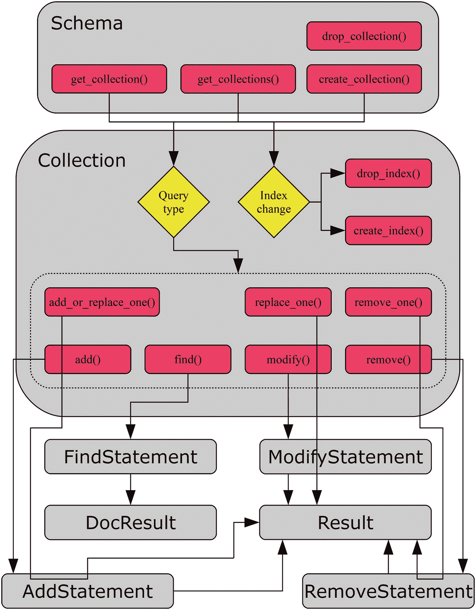

# 7.MySQL 文档存储

顾名思义，MySQL 传统上就是使用 SQL 语句来执行查询。这不仅反映在用于描述查询应该做什么的语言中，还反映在数据的基本构造方式中。MySQL 文档存储颠倒了这一点，不仅提供 NoSQL 数据库，还使用 JSON 文档，就像其他用于存储数据的文档存储一样。

文档存储不会替换 SQL 数据库。这两者应该共存，所以您可以使用最适合您的应用程序和数据的那一个。您甚至可以将两者混合使用，因此一些数据存储在传统的 SQL 表中，而另一些数据存储为文档。

本章将探讨如何使用 MySQL 连接器/Python 和 X DevAPI 来处理 MySQL 文档存储。

## MySQL 文档存储

MySQL 文档存储是 X 插件的一部分，该插件在 MySQL Server 5.7.12 中作为测试版特性引入，在 MySQL Server 8.0 中成为 GA。文档存储将数据存储为 JSON 文档，但使用 InnoDB 存储引擎来提供事务支持等特性。

### 注意

文档存储本身就是一个很大的主题，给出全面的介绍超出了本书的范围。如果您打算使用文档存储，建议您阅读更多关于它的内容。两个优秀的参考是*介绍查尔斯·贝尔的 MySQL 8 文档库*([`https://www.apress.com/gp/book/9781484227244`](https://www.apress.com/gp/book/9781484227244))和 *MySQL 参考手册* ( [`https://dev.mysql.com/doc/refman/en/document-store.html`](https://dev.mysql.com/doc/refman/en/document-store.html) )。

虽然 X 协议和文档存储的细节将留给读者作为练习，但在继续之前，有几个特征值得考虑。顾名思义，数据存储在文档中。这意味着与普通关系模式不同，所有“列”都存储在同一个数据对象中。

在文档存储中，据说文档存储在一个集合中。文档使用 JSON 格式。如果您想到一个常规 MySQL 表中的一行，列名是 JSON 文档中每个对象的名称，列值是对象的值。与 SQL 表不同，不要求每个文档(“行”)都有相同的字段或包含相同类型的数据。这些文档被称为集合的一部分(SQL 术语中的“表”)。

### 警告

与其他文档存储一样，MySQL 文档存储是无模式的。从开发的角度来看，这似乎是一个非常吸引人的特性；事实上，这使得向应用程序添加新类型的数据变得更加容易。但是，它也消除了数据库层验证数据和检查约束的机会。因此，如果您选择无模式数据模型，那么确保数据一致性完全取决于开发人员。

所有文档都必须有一个惟一的键，这个键总是 JSON 文档中带有键`_id`的对象。通常通过在保存集合的表上创建虚拟列来支持索引。X DevAPI 支持为集合创建索引，这是操作索引的首选方式。如果您需要为集合创建或删除索引，MySQL Shell 非常有用。

现在让我们看看在文档存储中使用集合时的一般工作流。

### 小费

本章中有许多示例程序。列表中出现的所有示例程序都可以下载。有关使用示例程序的更多信息，参见第 [1](01.html) 章中对示例程序的讨论。一般来说，更改会被回滚，以允许重新执行示例并得到相同的结果。清单 [7-3](#Par116) 中加载样本数据时例外。

## 工作流程

工作流程在前一章中已经暗示过了，但还是值得更详细地看一下。让我们集中讨论如何使用集合。通过架构获取集合，并从集合中创建语句。最后，语句返回结果。当然，还有更多的内容，这一节将详细介绍。这不是一个详尽的讨论；相反，它的意思是作为本章其余部分的概述。

从方案开始到结果结束的工作流程如图 [7-1](#Fig1) 所示。主要关注获取集合和创建语句的步骤。省略了细化和执行语句的细节，但将在本章稍后针对每种查询方法进行讨论。红色(深灰色)框是被调用的方法。



图 7-1

使用集合时的工作流

正如您将在本章前半部分看到的，集合是使用`get_collection()`、`get_collections()`或`create_collection()`从模式中获得的。该架构也可用于删除集合。在集合对象中，一种可能是创建和删除索引。

另一种可能性是执行查询，这将在本章的后半部分讨论。有许多方法可以执行查询。主要有`add()`、`find()`、`modify()`、`remove()`。它们返回一条语句，一旦该语句被执行，该语句又返回一个结果。但是，也有三个补充方法将所有步骤结合起来，直接返回一个结果。最后，还有`count()`方法，图中没有包括。

工作流就绪后，您就可以开始研究集合的工作方式了。

## 收集

在前一章中，您已经看到了如何从会话中创建模式。然而，模式只是真正重要的东西的容器:集合和表。在关系数据库中，我们谈论数据存储在表中。X DevAPI 也可以处理表(它们将在下一章讨论)，但是目前我们将坚持使用文档存储。文档存储中的表的等价物是集合。

这一节将介绍如何创建、维护和删除不再需要的集合。该流程将类似于用于模式的流程。实际的集合操作是使用模式对象上的方法完成的，就像模式操作是使用会话方法完成的一样。集合对象本身也以与架构相同的方式包含方法和属性。数据的实际操作将推迟到下面的部分。第一步是创建、获取和删除集合。

### 集合操作

创建和删除集合不是应用程序最常见的任务，但它们可能是部署脚本或实用程序的一部分，应用程序可能暂时需要一个集合，或者您可能使用 MySQL Shell 来优化集合的性能。在所有情况下，应用程序都需要获得一个集合对象，以便能够对它执行查询。创建、获取、删除和创建集合索引是本次讨论的主题。

集合的操作方式与模式非常相似。例如，要创建一个模式，可以使用 session `create_schema()`方法。同样，您可以使用 schema `create_collection()`方法创建一个集合。这使得学习如何操作集合变得很容易。将要讨论的模式收集方法在表 [7-1](#Tab1) 中列出。返回的对象是相对于`mysqlx`模块的。

表 7-1

架构收集方法

<colgroup><col class="tcol1 align-left"> <col class="tcol2 align-left"> <col class="tcol3 align-left"></colgroup> 
| 

方法

 | 

争论

 | 

描述

 |
| --- | --- | --- |
| `create_collection` | `name` | 创建一个名称指定为参数的集合。集合作为一个`crud.Collection`对象返回。如果集合存在，就会出现一个`ProgrammingError`异常，除非`reuse`为`True`，在这种情况下，将返回现有的集合。 |
| `reuse=False` |
| `drop_collection` | `name` | 删除具有指定名称的集合。不要求集合存在。 |
| `get_collection` | `name` | 将具有指定名称的集合作为`crud.Collection`对象返回。如果`check_existence = True`，如果集合不存在，则发生`ProgrammingError`异常。 |
| `check_existence=False` |
| `get_collections` |   | 返回架构中集合的列表。列表中的每个元素都是`mysqlx.crud.Collection`类的一个实例。 |

该表显示，与模式相比，只有一些差异:主要是在创建集合时，可能会影响集合是否必须不存在，以及在获取集合时，集合是否必须存在。此外，还将讨论表 [7-2](#Tab2) 中创建和删除索引的两种收集方法。这两种方法都不返回值。

表 7-2

创建和删除索引的集合方法

<colgroup><col class="tcol1 align-left"> <col class="tcol2 align-left"> <col class="tcol3 align-left"></colgroup> 
| 

方法

 | 

争论

 | 

描述

 |
| --- | --- | --- |
| `create_` `index` | `index_name` | 创建一个索引，该索引根据`index_name`的值命名，并由`fields_desc`中指定的字典定义(“desc”代表描述)。集合的索引名称必须是唯一的。**注意:**调用`create_index()`只定义索引，返回一个`statement.CreateCollectionIndexStatement`对象。要创建索引，对返回的对象调用`execute()`方法。 |
| `fields_desc` |
| `drop_` `index` | `index_name` | 删除参数中指定名称的索引。 |

用于定义新索引的字典具有以下结构:

```py
{
  "type"   : INDEX|SPATIAL,
  "unique" : False,
  "fields" : [...]
}

```

普通索引的类型可以是`INDEX`(这是默认设置)，几何索引的类型可以是`SPATIAL`。目前不支持全文索引。`unique`元素定义了它是否是唯一的索引。默认值是`False`，这也是当前唯一支持的值(即当前不支持唯一索引)。`fields`元素包含了要包含在索引中的字段列表。每个字段是一个字典，包含表 [7-3](#Tab3) 中的元素。

表 7-3

定义索引中的字段的字典

<colgroup><col class="tcol1 align-left"> <col class="tcol2 align-left"> <col class="tcol3 align-left"> <col class="tcol4 align-left"></colgroup> 
| 

元素

 | 

缺省值

 | 

类型

 | 

描述

 |
| --- | --- | --- | --- |
| `Field` |   | 线 | 如何在文档中查找值的定义。例如，要获得名为`Name`的顶级对象，使用`$.Name`。 |
| `type` |   | 线 | 类似于表列的数据类型。此表后面给出了支持类型的示例。 |
| `required` | `False` | 布尔代数学体系的 | 该值是否必须存在于文档中(“`NOT NULL`”)。对于 GeoJSON 类型，这必须设置为`True`。 |
| `collation` |   | 线 | 类型为`TEXT(…)`时的排序规则。仅当类型为`TEXT`类型时才能设置。从 MySQL Server 8.0.11 开始，索引不支持自定义排序规则，因此该值被忽略。 |
| `options` | `1` | 整数 | 创建空间索引时，`ST_GeomFromGeoJSON()`函数的`options`参数。它只允许用于空间索引。支持的值为 1、2、3 和 4。它定义了文档包含大于 2 的维值时的行为。 |
| `sri` `d` | `4326` | 整数 | 创建空间索引时，`ST_GeomFromGeoJSON()`函数的`srid`(空间参考系统标识符)参数。它只允许用于空间索引。这必须是一个无符号的 32 位整数。`information_schema`中的`ST_SPATIAL_REFERENCE_SYSTEMS`表包括 MySQL 支持的所有空间参考系统。SRIDs 的两个参考是 [`https://epsg.io/`](https://epsg.io/) 和 [`http://spatialreference.org/`](http://spatialreference.org/) 。 |

字段定义中总是需要`field`和`type`元素，而其余元素取决于创建的索引。一些常用的`type`值有

*   `INT`:指定一个有符号整数。变奏包括`TINYINT`、`SMALLINT`、`MEDIUMINT`、`BIGINT`。要获得无符号值，请添加`UNSIGNED`，例如`INT UNSIGNED`。

*   `FLOAT`:四字节浮点数。

*   `DOUBLE`:八字节浮点数。

*   `DECIMAL`:定点(精确)数。可以选择指定精度。默认精度是`(10,0)`。

*   `DATE`:一个日期。

*   `TIME`:一个时间规格。

*   `TIMESTAMP`:由日期和时间组成的时间戳。范围是从 1970 年 1 月 1 日午夜后一秒到 2038 年 1 月 19 日 03:14:07 UTC。为秒添加的小数位数可以在括号中指定，例如`TIMESTAMP(3)`具有毫秒精度。

*   `DATETIME`:类似于时间戳，但支持从 1000 年 1 月 1 日午夜到 9999 年 12 月 31 日白天结束的范围。为秒添加的小数位数可以在括号中指定，例如`DATETIME(3)`具有毫秒精度。

*   `YEAR`:四位数的年份，例如 2018。

*   `BIT`:指定一个位值。

*   `BLOB`:用于存储二进制对象(即没有字符集的字节)。必须指定索引值的最大大小，例如`BLOB(50)`索引值的前 50 个字节。不支持`TINYBLOB`、`SMALLBLOB`、`MEDIUMBLOB`、`LONGBLOB`的变化。

*   `TEXT`:用于存储字符串。这需要指定排序规则。必须指定要索引的值的最大大小，例如`TEXT(50)`来索引值的前 50 个字符。不支持`TINYTEXT`、`SMALLTEXT`、`MEDIUMTEXT`、`LONGTEXT`的变化。

*   `GEOJSON`:使用 GeoJSON 格式的空间值。使用时，`required`必须是`True`，并且可以设置`options`和`srid`元素。GeoJSON 格式仅支持空间索引。使用`ST_GeomFromGeoJSON()`函数( [`https://dev.mysql.com/doc/refman/en/spatial-geojson-functions.html#function_st-geomfromgeojson`](https://dev.mysql.com/doc/refman/en/spatial-geojson-functions.html#function_st-geomfromgeojson) )从文档中提取 GeoJSON 值。`options`和`srid`值是该功能支持的值。

值得注意的是，类型本身不能是 JSON 仅支持标量类型。

### 小费

如果您想深入了解索引规范的需求，请参见 MySQL Connector/Python 中的`mysqlx/ lib/mysqlx/statement.py`文件中的`CreateCollectionIndexStatement`类和 MySQL 服务器源代码中的`plugin/x/src/admin_cmd_index.cc`文件中的`Admin_command_index::Index_field::create()`方法。

本节后面将有一个创建索引的示例。下面的讨论将依次讨论这四种方法，从创建集合的任务开始。

#### 创建收藏

使用`create_collection()`方法创建一个集合，该方法将集合的名称作为第一个参数或作为`name`关键字参数。还有第二个可选参数`reuse`，默认为`False`。如果`reuse`为`False`，则集合不存在或者发生`ProgrammingError`异常。如果`reuse`为`True`，则不存在则创建集合；否则，将返回现有集合。在大多数情况下，最好让`reuse`保持默认值，这样就可以知道是否存在同名的现有集合。否则，很容易出现细微的错误。

以下示例显示了如何在`py_test_db`模式中创建集合`my_docs`:

```py
import mysqlx
from config import connect_args

db = mysqlx.get_session(**connect_args)

# Reset the py_test_db schema
db.drop_schema("py_test_db")
schema = db.create_schema("py_test_db")

docs = schema.create_collection("my_docs")

db.close()

```

该示例首先删除了`py_test_db`模式，以确保您从一个空模式开始。`create_collection()`方法返回一个集合对象，所以可以直接工作。

在`mysql`命令行客户端中使用`SHOW CREATE TABLE`语句显示表定义可能会很有趣:

```py
mysql> SHOW CREATE TABLE py_test_db.my_docs\G
*************************** 1\. row ***************************
       Table: my_docs
Create Table: CREATE TABLE `my_docs` (
  `doc` json DEFAULT NULL,
  `_id` varbinary(32) GENERATED ALWAYS AS (json_unquote(json_extract(`doc`,_utf8mb4'$._id'))) STORED NOT NULL,
  PRIMARY KEY (`_id`)
) ENGINE=InnoDB DEFAULT CHARSET=utf8mb4 COLLATE=utf8mb4_0900_ai_ci
1 row in set (0.00 sec)

```

在创建任何辅助索引之前，这是文档存储中集合的标准表定义。`doc`列是文档(使用 JSON 数据类型)。`_id`列是一个生成的列，它从`doc`列中提取了`_id`对象。_ `id`列被用作主键。

这还显示了如何对文档中的值创建索引。对于每个索引，都会创建一个生成的列并用于索引。虽然主键必须是存储生成的列，但对于辅助索引，可以使用虚拟列。虚拟列的优点是它不需要任何存储，而是在需要时进行计算。但是，索引仍然使用与存储列时相同的空间。您将很快看到如何为集合创建额外的索引。

### 小费

要阅读有关生成的列的更多信息，请参见 *MySQL 服务器参考手册*中的 [`https://dev.mysql.com/doc/refman/en/create-table-generated-columns.html`](https://dev.mysql.com/doc/refman/en/create-table-generated-columns.html) 和 [`https://dev.mysql.com/doc/refman/en/create-table-secondary-indexes.html`](https://dev.mysql.com/doc/refman/en/create-table-secondary-indexes.html) 。

`create_collection()`方法总是将字符集设置为 utf8mb4 但是，请注意，JSON 数据类型是作为 BLOB 存储的(即，作为没有字符集的二进制数据)。主键始终是一个(最多)32 个字符长的二进制字符串，存储在文档内的`_id`对象中，并使用生成的列进行检索，以允许 MySQL 对其进行索引。

对于现有的集合，最好使用`get_collection()`或`get_collections()`。让我们看看它们是如何工作的。

#### 检索单个集合

检索集合的最简单的情况是根据名称获取一个集合，这是使用`get_collection()`方法完成的。这使得控制获取哪些集合变得容易，并且为它们分配有意义的变量名也变得容易。

例如，考虑检索在前面的例子中创建的`my_docs`集合。这可以使用以下代码来完成:

```py
import mysqlx
from config import connect_args

db = mysqlx.get_session(**connect_args)

schema = db.create_schema("py_test_db")

docs = schema.get_collection("my_docs")

print("Name of collection: {0}".format(
  docs.name))

db.close()

```

这个例子中唯一的新东西是将使用`get_collection()`方法检索的集合分配给`docs`变量的那一行。使用集合对象的`name`属性打印集合的名称:

```py
Name of collection: my_docs

```

如果您需要检索许多集合，那么在一次调用中获取所有集合会很有用。这可以使用`get_collections()`来完成，如下所示。

#### 检索架构中的所有集合

在某些情况下，应用程序可能会使用几个集合。一种解决方案是使用`get_collection()`逐个检索集合。不过，还有另一种方法。

另一种方法是使用`get_collections()`方法，它将所有集合作为一个列表返回。这是集合的`name`属性变得非常有用的情况之一，因为否则就不可能知道哪个集合对象包含哪个文档。

下面的代码显示了一个在具有两个集合的架构中检索集合的示例。这个例子类似于前两个例子，但是从删除模式开始，从头开始。示例代码是

```py
import mysqlx
from config import connect_args

db = mysqlx.get_session(**connect_args)

# Reinitialize the py_test_db schema
db.drop_schema("py_test_db")
schema = db.create_schema("py_test_db")

# Create two collections
schema.create_collection("employees")
schema.create_collection("customers")

# Get all collections and print their
# names

collections = schema.get_collections()

for collection in collections:
  print("Collection name: {0}".format(
    collection.name))

# Create an index using the collection
# name as the key and the collection
# as the value

coll_dict = {

  collection.name: collection
    for collection in collections

}

db.close()

```

在用两个集合`employees`和`customers`建立了模式之后，使用`get_collections()`方法检索这两个集合。然后，代码遍历这些集合，并打印出每个集合的名称。此外，使用集合的名称作为键来创建字典。这使得以后检索特定集合更加容易。例如`employees`集合可以参照`coll_dict["employees"]`使用。该程序的输出是

```py
Collection name: customers
Collection name: employees

```

下一个集合操作方法是`drop_collection()`方法，用于删除不再需要的集合。

#### 删除收藏

当应用程序不再需要一个集合时，可以使用 schema 对象上的`drop_collection()`方法删除它。方法接受要删除的集合的名称。如果收藏不存在，`drop_collection()`会默默忽略。

删除本章中使用的所有三个集合的示例是

```py
import mysqlx
from config import connect_args

db = mysqlx.get_session(**connect_args)

# Reinitialize the py_test_db schema
schema = db.get_schema("py_test_db")

# Drop all three collections that has
# been used in this section

schema.drop_collection("my_docs")

schema.drop_collection("employees")

schema.drop_collection("customers")

# For good measure also drop the schema
db.drop_schema("py_test_db")

db.close()

```

由于`drop_schema()`将删除模式中的所有集合(和表),`drop_collection()`调用是多余的，但是它们展示了如何一个接一个地删除集合。

与 SQL 查询一样，通过添加索引可以极大地提高文档集合的查询性能。这将在下一节中介绍。

#### 创建索引

索引提供了值的搜索树，这些值通过引用包含这些值的实际文档来索引。这使得查找特定值比扫描所有文档并逐个检查它们是否满足要求要快得多。

### 注意

还有其他类型的索引，如全文索引。在撰写本文时，集合只支持 B 树(“普通”)和 R 树(空间)索引。

与常规的 SQL 表相比，为集合创建索引稍微复杂一些，因为除了索引定义本身之外，还需要定义如何从文档中检索值以及这些值代表什么。这是使用无模式数据存储的代价。

可以使用集合对象的`create_index()`方法定义索引。该方法的完整定义已在前面讨论过，不再重复。相反，我们来看一个例子。清单 7-1 展示了一个创建集合并添加三个索引的例子。

```py
import mysqlx
from config import connect_args

db = mysqlx.get_session(**connect_args)

# Reinitialize employees collection in
# the py_test_db schema
schema = db.create_schema("py_test_db")
schema.drop_collection("employees")
employees = schema.create_collection(
  "employees")

# Define the three fields that will be
# used in the indexes.

field_name = {

  "field"     : "$.Name",
  "type"      : "TEXT(60)",
  "required"  : True,
  "collation" : "utf8mb4_0900_ai_ci",

}

field_office_location = {

  "field"     : "$.Office.Location",
  "type"      : "GEOJSON",
  "required"  : True,
  "options"   : 1,
  "srid"      : 4326,

}

field_birthday = {

  "field"     : "$.Birthday",
  "type"      : "DATE",
  "required"  : False,

}

# Create a normal index on the
# employee's name

index_name = "employee_name"

index_def =   {

  "fields" : [
    field_name
  ],
  "type"   : "INDEX",

}

index = employees.create_index(

  index_name, index_def)

index.execute()

print(
  "Index created: {0}".format(index_name)
)

# Create a spatial index for the
# location the employee work at.

index_name = "employee_office_location"

index_def =   {

  "fields" : [
    field_office_location
  ],
  "type"   : "SPATIAL",

}

employees.create_index(

  index_name, index_def

).execute()

print(
  "Index created: {0}".format(index_name)
)

# Create a normal index on the
# employee's birthday and name

index_name = "employee_birthday_name"

index_def =   {

  "fields" : [
    field_birthday,
    field_name
  ],
  "type"   : "INDEX",

}

index = employees.create_index(

  index_name, index_def)

index.execute()

print(

  "Index created: {0}".format(index_name)

)

db.close()

Listing 7-1Creating Indexes for a Collection

```

该示例从重新初始化集合开始。这确保了即使多次执行该示例，添加索引的起点也是相同的。然后定义将在索引中使用的三个字段(SQL 语言中的列)。这允许您根据需要重用它们。在这种情况下，您需要设置雇员的姓名和办公地点，但是生日是可选的。

创建的第一个索引位于`Name`字段。这是一个普通的索引，您指定应该使用`utf8mb4_0900_ai_ci`排序规则。索引宽度设置为 60 个字符。不用担心；仍然支持超过 60 个字符的名称。只是索引只考虑前 60 个字符。由`create_index()`创建的对象存储在`index`变量中，索引的实际创建由`index.execute()`执行。

第二个索引是雇员工作的办公室位置的空间索引。使用`options`和`srid`的默认值。在这种情况下，索引执行与定义索引相结合。

第三个索引结合了雇员的生日和姓名。这允许你搜索生日和名字。当应用多个条件时，将多个字段组合成一个索引是提高查询性能的有效方法。

对于三个索引中的每一个，在创建索引后都会打印一条确认消息:

```py
Index created: employee_name
Index created: employee_office_location
Index created: employee_birthday_name

```

### 小费

如果您将最后一个索引创建为(`Name`，`Birthday`)，这将使仅基于名称的索引变得多余，因为使用组合索引也可以解决仅基于名称的搜索。这是因为 MySQL 允许您在索引的左前缀中搜索 B 树索引。组合多个字段时的另一个注意事项是，当最具选择性的值位于第一位时，可以获得最佳性能。

检查执行该示例产生的表定义可能会很有趣。稍微重新格式化的输出是

```py
mysql> SHOW CREATE TABLE py_test_db.employees\G
*************************** 1\. row ***************************
       Table: employees
Create Table: CREATE TABLE `employees` (
  `doc` json DEFAULT NULL,
  `_id` varbinary(32) GENERATED ALWAYS AS
        (json_unquote(json_extract(`doc`,_utf8mb4'$._id')))
        STORED NOT NULL,
  `$ix_t60_r_4CB1E32CCBE4FE2585D3C8F059CB3A909FC536B7` text
        GENERATED ALWAYS AS
        (json_unquote(json_extract(`doc`,_utf8mb4'$.Name')))
        VIRTUAL NOT NULL,
  `$ix_gj_r_E933A4A981E8AB89AF33A3DB0B1D45F8E76A6E38` geometry
        GENERATED ALWAYS AS
        (st_geomfromgeojson(
           json_extract(`doc`,_utf8mb4'$.Office.Location'),1,4326)
        ) STORED NOT NULL /*!80003 SRID 4326 */,
  `$ix_d_CAA21771B5BB2089412F3D426AF25DEE3EDD1B76` date
        GENERATED ALWAYS AS
        (json_unquote(json_extract(`doc`,_utf8mb4'$.Birthday')))
        VIRTUAL,
  PRIMARY KEY (`_id`),
  SPATIAL KEY `employee_office_location`
        (`$ix_gj_r_E933A4A981E8AB89AF33A3DB0B1D45F8E76A6E38`),
  KEY `employee_name`
        (`$ix_t60_r_4CB1E32CCBE4FE2585D3C8F059CB3A909FC536B7`(60)),
  KEY `employee_birthday_name`
        (`$ix_d_CAA21771B5BB2089412F3D426AF25DEE3EDD1B76`,
         `$ix_t60_r_4CB1E32CCBE4FE2585D3C8F059CB3A909FC536B7`(60))
) ENGINE=InnoDB DEFAULT CHARSET=utf8mb4 COLLATE=utf8mb4_0900_ai_ci
1 row in set (0.00 sec)

```

当然，首先突出的是生成的列的难以阅读的名称。它们是自动生成的，是唯一的，但是 X DevAPI 可以很容易地使用它们。这些名称取决于字段定义，因此对于相同的提取字段，它们将保持不变。这样，当同一个字段在多个索引中使用时，就不会被多次添加。在这个例子中，雇员姓名用于两个索引中，但是只定义了一次如何提取它。

另一件事是，对于这些新的二级索引，生成的列有`VIRTUAL`子句。这意味着这些值实际上并不存储在表中，而是根据需要提取。这可以节省磁盘空间。

`create_index()`的恭维语是`drop_index()`，接下来讨论。

#### 删除索引

删除索引比创建索引简单得多。所需要做的就是用要删除的索引名调用集合的`drop_index()`方法。MySQL 将负责删除索引，如果索引中生成的列不再为其他索引所需要，它们也将被删除。

清单 [7-2](#Par90) 展示了一个删除`employee_name`索引的例子，它是上一个例子中创建的索引之一。

```py
import mysqlx
from config import connect_args

db = mysqlx.get_session(**connect_args)

# Reinitialize employees collection in
# the py_test_db schema
schema = db.get_schema("py_test_db")
employees = schema.get_collection(
  "employees")

# Drop the index on the Name field.

employees.drop_index("employee_name")

print("Index employee_name has been dropped")

db.close()

Listing 7-2Dropping an Index

```

在这种情况下，只需调用`drop_index()`方法就可以删除索引。该脚本的输出是

```py
Index employee_name has been dropped

```

读者可以在删除索引之前和之后比较`SHOW CREATE TABLE py_test_db.employees\G`的输出，以确认`Name`字段仍然被提取。第二个练习是修改示例，删除`employee_birthday_name`索引，并看到`Name`和`Birthday`生成的列被删除。

这就完成了可用于操作集合的方法的演练(不考虑存储在集合中的文档)。在继续执行查询之前，还有一些额外的方法需要考虑。

### 其他收集方法和属性

`mysqlx.Collection`类包括一些方法和三个属性，在处理集合对象时会很有用。它们与已经讨论过的模式非常相似，所以这里只包括一个简单的介绍。

表 [7-4](#Tab4) 中列出了可以返回集合信息的方法。返回的对象是相对于`mysqlx`模块的。这些方法都不带任何参数。

表 7-4

收集实用程序方法

<colgroup><col class="tcol1 align-left"> <col class="tcol2 align-left"> <col class="tcol3 align-left"></colgroup> 
| 

方法

 | 

返回对象

 | 

描述

 |
| --- | --- | --- |
| `exists_in_``databas`T2】 |   | 根据集合是否存在，返回`True`或`False`。 |
| `get_``connectio`T2】 | `connection.Connection` | 返回基础连接对象。 |
| `get_``nam`T2】 |   | 返回集合的名称。这与`name`属性相同。 |
| `get_``schem`T2】 | `crud.Schema` | 返回集合所在架构的对象。这与`schema`属性相同。 |
| `get_` `session` | `connection.Session` | 返回会话的对象。这与会话属性相同。在 8.0.12 版本中添加。 |

从返回名称和模式的方法的描述中可以看出，还有三个属性。`name`属性是集合的名称，`schema`属性保存模式对象，会话属性(在 8.0.12 和更高版本中可用)保存会话对象。

由于收集实用程序的方法和属性本质上与模式相同，所以让我们继续执行一些查询。

## 查询–CRUD

处理数据的有趣部分是执行查询。现在您已经知道如何使用会话、模式和集合，您可以开始使用会话来使用 API 的 NoSQL 部分。实现是围绕 CRUD(创建、读取、更新、删除)原则构建的，接下来的四个部分将依次介绍这四个操作。

在深入研究之前，有必要对 CRUD 方法进行一个高层次的了解。它们被收集在表 [7-5](#Tab5) 中。返回的对象是相对于`myqslx`模块的。

表 7-5

集合对象的 CRUD 方法

<colgroup><col class="tcol1 align-left"> <col class="tcol2 align-left"> <col class="tcol3 align-left"> <col class="tcol4 align-left"></colgroup> 
| 

方法

 | 

争论

 | 

返回对象

 | 

描述

 |
| --- | --- | --- | --- |
| `ad` `d` | 文件清单 | `Statement.AddStatement` | 准备将文档添加到词典列表中。每本词典都是一个文档。 |
| `add_or_replace_``on`T2】 | `doc_id` | `Result.Result` | 向上插入文档，因此如果文档 ID 存在，它将替换现有文档；否则，它会将其添加为新文档。 |
| `doc` |
| `coun` `t` |   |   | 以整数形式返回集合中的文档数。 |
| `fin` `d` | `condition` | `Statement.FindStatement` | 准备 find 语句，返回符合条件的文档。 |
| `modif` `y` | `condition` | `Statement.ModifyStatement` | 准备一条修改语句，更新符合条件的文档。在 8.0.12 及更高版本中，该条件是强制性的。 |
| `remov` `e` | `condition` | `Statement.RemoveStatement` | 准备删除符合条件的文档的 remove 语句。 |
| `remove_``on`T2】 | `doc_id` | `result.Result` | 移除具有指定文档 ID 的文档。 |
| `replace_``on`T2】 | `doc_id` | `result.Result` | 用新文档更新具有指定文档 ID 的文档。 |
| `doc` |

从表中可以看出，CRUD 方法使用了一些常见的参数:

*   **文档**:这是一个描述 JSON 文档的字典。

*   **单据 ID** :该单据的唯一键。

*   **条件**:这相当于 SQL 中的`WHERE`子句，它定义了搜索文档时使用的过滤器。

### 注意

当然，这不仅仅是三种参数类型的列表所暗示的。例如，可以对读取请求的结果进行排序。你很快就会知道如何去做。

对于某些方法，直接返回结果对象。它将包含有关已执行操作的信息。除了`count()`之外，其余的方法都返回`statement`模块中的一个类的对象。它们要求你在执行动作之前调用返回的语句对象的`execute()`方法，然后`execute()`返回一个结果对象。

是时候停止讨论，开始创建一些文档了。这意味着您需要查看 CRUD 的创建部分。

## CRUD:创建

使用存储在数据库中的数据的第一步是创建数据。在数据存在于集合中之前，没有什么可查询或修改的。因此，您的第一个任务是用一些数据填充一个集合。本节中插入的数据是其余文档存储 CRUD 讨论的基础。

有两种方法可以向集合中添加数据:`add()`和`add_or_replace_one()`。本节将讨论`add()`方法，而`add_or_replace_one()`将被推迟到“CRUD: Update”一节，因为它既可以添加新数据，也可以更新现有数据。

`add()`方法将零个或多个文档作为参数。每个文档都是使用 Python 字典定义的，这自然形成了一个 JSON 文档。当在同一个`add()`调用中插入多个文档时，它们可以作为列表或元组提供，或者通过指定多个参数来提供。

`add()`方法返回一个`mysqlx.statement.AddStatement`对象。两个最重要的方法是`add()`和`execute()`。这些方法总结在表 [7-6](#Tab6) 中。

表 7-6

方法来使用 Add 语句

<colgroup><col class="tcol1 align-left"> <col class="tcol2 align-left"> <col class="tcol3 align-left"></colgroup> 
| 

方法

 | 

争论

 | 

描述

 |
| --- | --- | --- |
| `add` | `*values` | 将值中指定的文档添加到 add 语句中。 |
| `execut` `e` |   | 通过向 MySQL 服务器提交值来执行 add 语句。 |

可以使用`AddStatement.` `add()`方法将更多的文档添加到语句中，`AddStatement.execute()`将文档发送到文档存储中。所有添加的文档都作为一份声明发送。

将要插入的数据可以在本书源代码中的`cities.py`文件中找到。该文件包括`cities`字典中 15 个澳大利亚城市的数据。文件的开头是

```py
cities = {
  "Sydney": {
    "Name"           : "Sydney",
    "Country_capital": False,
    "State_capital"  : True,
    "Geography": {
      "Country" : "Australia",
      "State"   : "New South Wales",
      "Area"    : 12367.7,
      "Location": "{'Type': 'Point', 'Coordinates': [151.2094, -33.8650]}",
      "Climate" : {
        "Classification"      : "humid subtropical",
        "Mean_max_temperature": 22.5,
        "Mean_min_temperature": 14.5,
        "Annual_rainfaill"    : 1222.7
      },
    },
    "Demographics": {
      "Population": 5029768,
      "Median Age": 36
    },
    "Suburbs": [
      "Central Business District",
      "Parramatta",
      "Bankstown",
      "Sutherland",
      "Chatswood"
    ]
  },
...

```

清单 [7-3](#Par116) 展示了一个例子，其中使用了三次`add()`方法将城市插入到一个新创建的集合中。使用`add()`的第一个例子插入一个城市，第二个例子在一个`add()`调用中插入两个城市，第三个例子使用多个`add()`调用插入几个城市，创建一个大的语句。

```py
import mysqlx
from config import connect_args

from cities import cities

db = mysqlx.get_session(**connect_args)
schema = db.create_schema("py_test_db")

# Reinitalize the city collection
schema.drop_collection("city")
city_col = schema.create_collection("city")

# Insert a single city
sydney = cities.pop("Sydney")

db.start_transaction()

result = city_col.add(sydney).execute()

db.commit()

items = result.get_affected_items_count()
print("1: Number of docs added: {0}"
  .format(items))
ids = result.get_generated_ids()
print("1: Doc IDs added: {0}".format(ids))
print("")

# Insert two cities in one call
melbourne = cities.pop("Melbourne")
brisbane  = cities.pop("Brisbane")
data = (melbourne, brisbane)

db.start_transaction()

result = city_col.add(data).execute()

db.commit()

items = result.get_affected_items_count()
print("2: Number of docs added: {0}"
  .format(items))
ids = result.get_generated_ids()
print("2: Doc IDs added: {0}".format(ids))
print("")

# Insert the rest of the cities by
# adding them to the statement object
# one by one.
db.start_transaction()

statement = city_col.add()

for city_name in cities:

  statement.add(cities[city_name])

result = statement.execute()

db.commit()

items = result.get_affected_items_count()
print("3: Number of docs added: {0}"
  .format(items))
print("")

db.close()

Listing 7-3Adding Data to a Collection

```

该示例首先确保`py_test_db`模式中的`city`集合不存在，然后创建它。然后添加从`cities.py`文件导入的城市。

第一个插入的城市是悉尼。这是通过插入城市本身来完成的。该命令被链接起来，在一行代码中执行所有的工作，结果是一个`result.Result`对象。注意调用是如何被`db.start_transaction()`和`db.commit()`调用包装的。因为`autocommit`的值是从 MySQL 服务器全局设置继承的，所以显式添加事务是最安全的。

### 注意

和往常一样，您应该在提交数据之前检查是否出现了任何警告或错误。为了让示例更容易阅读，我们省略了对警告和错误的处理。第 9 章将会更详细地介绍如何检查警告和错误。

接下来，插入墨尔本和布里斯班。这是通过用文档创建一个元组来完成的，这个元组被传递给`add()`方法。文档也可以作为两个参数添加，例如:

```py
result = city_col.add(
  melbourne, brisbane
).execute()

```

最后，添加剩余的城市。这是通过首先创建`AddStatement`对象，然后遍历剩余的城市，并逐个添加它们来完成的。最后，调用`AddStatement.` `execute()`方法在一个数据库调用中插入所有的城市。

执行该示例的输出类似于以下示例:

```py
1: Number of docs added: 1
1: Doc IDs added: ['00005af3e4f7000000000000008f']

2: Number of docs added: 2
2: Doc IDs added: ['00005af3e4f70000000000000090', '00005af3e4f70000000000000091']

3: Number of docs added: 12

```

实际的文档 id 将会不同，因为它们是自动生成的。`city`集合现在有 15 个澳大利亚城市要查询，所以是时候看看读操作了。

## 读取

对于大多数数据库，大多数查询都是读取查询(不修改任何数据的查询)。这些查询是本节的主题。

有两种方法可以在不改变文档存储中任何数据的情况下读取集合:`count()`和`find()`。`count()`方法是最简单的，因为它只是将集合中文档的数量作为一个整数返回。`find()`方法更复杂，因为它支持条件(SQL 语言中的`WHERE`子句)、排序、返回文档等等。

`find()`方法返回一个`mysqlx.statement.FindStatement`对象。这是可以通过调用`FindStatement`方法来修改查询的主要构件。这些修饰符方法都返回`FindStatement`对象本身，因此可以进一步修改。最后有一个定义查询的调用链，可以使用`execute()`方法提交查询。表 [7-7](#Tab7) 显示了可用于修改语句的`FindStatement`方法。这些方法按照它们通常被调用的顺序进行排序。

表 7-7

方法来修改 Find 语句

<colgroup><col class="tcol1 align-left"> <col class="tcol2 align-left"> <col class="tcol3 align-left"></colgroup> 
| 

方法

 | 

争论

 | 

描述

 |
| --- | --- | --- |
| `field` `s` | `*fields` | 定义要包含在结果中的字段。每个字段都可以是使用与 SQL 相同语言的表达式。 |
| `group_``b`T2】 | `*fields` | 描述对于涉及聚合函数的查询，要对哪些字段进行分组。 |
| `havin` `g` | `condition` | 描述在查询以其他方式得到解决后，根据什么来筛选结果(排序除外)。这对于根据聚合函数的值进行过滤非常有用。 |
| `sor` `t` | `*sort_clauses` | 描述结果的排序依据。 |
| `limi` `t` | `row_count``offset=0` | 第一个参数设置要返回的最大文档数。第二个可选参数定义偏移量。默认偏移量为 0。**注意:**offset 参数在 8.0.12 版本中已被否决，并将在以后的版本中被删除。相反，引入了`offset()`方法来设置偏移。 |
| `offset` | `offset` | 设置要返回的行的偏移量。在 8.0.12 版本中添加。 |
| `lock_``exclusiv`T2】 |   | 使语句获得独占锁。一次只能有一个语句拥有独占锁。如果稍后将在同一事务中更新文档，则使用。 |
| `lock_``share`T2】 |   | 使语句获取共享锁。这可以防止其他语句修改匹配的文档，但是它们可以读取这些文档。 |
| `bin` `d` | `*args` | 第一个参数提供要替换的参数的名称。第二个参数提供值。每个参数调用`bind()`一次。 |
| `execut` `e` |   | 执行 find 语句。 |

查询修改方法的调用顺序并不重要，但建议在整个程序中坚持相同的顺序，以便一眼就能确定查询是如何修改的。

清单 [7-4](#Par131) 展示了一个例子，其中首先确定了`city`集合中城市的总数。然后显示集合中城市最多的州。结果按州内城市的数量排序，最多限于三个州。

```py
import mysqlx
from config import connect_args

db = mysqlx.get_session(**connect_args)
schema = db.create_schema("py_test_db")
city_col = schema.get_collection("city")

# Use the count() method to get the
# total number of cities.

num_cities = city_col.count()

print("Total number of cities: {0}"
  .format(num_cities))
print("")

statement = city_col.find(
  "Geography.Country = :country") \

  .fields("Geography.State AS State",
          "COUNT(*) AS NumCities") \
  .group_by("Geography.State") \
  .having("COUNT(*) > 1") \
  .sort("COUNT(*) DESC") \
  .limit(3)

result = statement.bind(

  "country", "Australia"

).execute()

states = result.fetch_all()
print("Num states in result: {0}"
  .format(result.count))
print("")

print("{0:15s}   {1:8s}"
  .format("State", "# Cities"))
print("-"*26)
for state in states:
  print("{State:15s}       {NumCities:1d}"
    .format(**state))

  db.close()

Listing 7-4Querying the city Collection

```

除了新的语法，这个例子很简单。集合的`count()`方法用于获取总行数。然后定义查询。您要求查询由`Geography.Country`元素过滤，该元素的值被占位符(:country)占用，该占位符后来在`bind()`方法中被设置为澳大利亚的值。查询将返回要返回并重命名为`State`的`Geography.State`元素，每个州的城市数返回为`NumCities`。

由于字段包括聚合函数(`COUNT()`)和非聚合字段(`Geography.State`)，因此还需要定义分组依据。这是通过调用`group_by()`方法来完成的。此外，在这种情况下，您选择进行筛选，以便只包含拥有一个以上城市的州；这是使用`having()`方法完成的。

最后，您告诉文档存储库，您希望按照州内城市的数量以降序对结果进行排序，并且您最多希望返回三个州(城市最多的三个州)。此时，语句保存在`statement`变量中。在这种情况下，这并不重要，但是通过在执行时指定绑定参数，可以重用查询。

### 小费

如果语句对象存储在一个变量中，就有可能多次执行同一个查询。通过将`bind()`调用保存到执行时间，可以重用具有不同值的相同查询模板。下面是一个在修改文档时重用查找查询的例子。

一旦执行了查询，就使用`fetch_all()`获取行。这也将结果的`count`属性设置为结果中的文档数。该程序的输出是

```py
Total number of cities: 15

Num states in result: 3

State             # Cities
--------------------------
Queensland            5
New South Wales       3
Victoria              2

```

已知`city`集合中所有城市的位置。作为第二个例子，让我们看看地理数据是如何使用的。清单 [7-5](#Par140) 显示了一个查找所有城市、计算到悉尼的距离并从最近的城市开始按距离排序的例子。悉尼本身将被跳过，因为它不提供任何信息。

```py
import mysqlx
from config import connect_args

db = mysqlx.get_session(**connect_args)
schema = db.get_schema("py_test_db")
city_col = schema.get_collection("city")

# Get the location of Sydney
statement = city_col.find("Name = :city")
statement.fields(
  "Geography.Location AS Location")
statement.bind("city", "Sydney")
result = statement.execute()
sydney = result.fetch_one()

# Define the formula for converting
# the location in GeoJSON format to
# the binary format used in MySQL

to_geom = "ST_GeomFromGeoJSON({0})"

sydney_geom = to_geom.format(
  sydney["Location"])
other_geom = to_geom.format(
  "Geography.Location")

distance = "ST_Distance({0}, {1})".format(

  sydney_geom, other_geom)

statement = city_col.find("Name != 'Sydney'")
statement.fields(
    "Name",
    "Geography.State AS State",
    distance + " AS Distance"
)
statement.sort(distance)
result = statement.execute()

cities = result.fetch_all()
print("{0:14s}   {1:28s}   {2:8s}"
  .format("City", "State", "Distance"))
print("-"*56)
for city in cities:
  # Convert the distance to kilometers
  distance = city["Distance"]/1000
  print("{Name:14s}   {State:28s}"
    .format(**city)
    + "     {0:4d}"
    .format(int(distance))
  )

db.close()

Listing 7-5Querying Geographical Data

```

这个例子的基本原理与上一个例子相同。有趣的部分是两个 MySQL 几何函数的使用。`ST_GeomFromGeoJSON()`函数用于将 GeoJSON 坐标转换为 MySQL 中使用的二进制几何格式。然后，`ST_Distance()`函数计算两点之间的距离，将空间参考系统考虑在内；这里使用默认值，即地球。程序的输出如清单 [7-6](#Par142) 所示。

```py
City             State                          Distance
--------------------------------------------------------
Wollongong       New South Wales                    69
Newcastle        New South Wales                   116
Canberra         Australian Capital Territory      249
Gold Coast       Queensland                        681
Melbourne        Victoria                          714
Brisbane         Queensland                        730
Geelong          Victoria                          779
Sunshine Coast   Queensland                        819
Hobart           Tasmania                         1056
Adelaide         South Australia                  1164
Townsville       Queensland                       1676
Cairns           Queensland                       1960
Darwin           Northern Territory               3145
Perth            Western Australia                3297

Listing 7-6The Output of the Example Program in Listing 7-5

```

添加和检索数据涵盖了很多数据库用例，但是如果数据不再是最新的，该怎么办呢？让我们看看如何更新数据库中的数据。

## CRUD:更新

在 CRUD 中，更新部分是修改现有的数据，因此一个或多个字段的值被改变或者字段被添加或删除。例如，当一个城市的人口因为人口迁移、出生和死亡而发生变化时，更新该城市的人口。这一节将研究可以做到这一点的方法。

在 MySQL Connector/Python X DevAPI 中为文档存储修改数据有三种方法:

*   `add_or_replace_one()`:用于追加插入一张单据。例如，如果有一个文档具有相同的文档 ID，它将被替换；否则，将添加一个新文档。

*   `modify()`:更新现有文档。查找文档的方式与读取查询过滤文档的方式相同。

*   `replace_one()`:用给定的文档 ID 替换文档。

由于`add_or_replace_one()`和`replace_one()`方法非常相似，所以将一起讨论它们，然后讨论`modify()`方法。

### 替换文档

`add_or_replace_one()`和`replace_one()`的区别在于如果没有指定 ID 的文档会发生什么。`add_or_replace_one()`方法添加了一个新文档，而`replace_one()`方法最终什么也没做。

清单 [7-7](#Par152) 显示了一个例子，其中 Geelong 的文档被替换为人口被更改为 193000 的文档。之后，它会尝试用不存在的文档 ID 替换文档。

```py
import mysqlx
from config import connect_args

db = mysqlx.get_session(**connect_args)
schema = db.get_schema("py_test_db")
city_col = schema.get_collection("city")

# Get the current document for Geelong
db.start_transaction()
result = city_col.find("Name = :city_name") \
  .bind("city_name", "Geelong") \
  .lock_exclusive() \
  .execute()
geelong = result.fetch_one()

# Get the Geelong document ID and
# update the population
geeling_id = geelong["_id"]
geelong["Demographics"]["Population"] = 193000

# Upsert the document

result = city_col.add_or_replace_one(

  geeling_id, geelong)

print("Number of affected docs: {0}"
  .format(result.get_affected_items_count()))

# Attempt to use the same document
# to change a non-existing ID

result = city_col.replace_one(

  "No such ID", geelong)

print("Number of affected docs: {0}"
  .format(result.get_affected_items_count()))

# Leave the data in the same state as
# before the changes
db.rollback()
db.close()

Listing 7-7Upserting a Document and Attempting to Replace One

```

该示例从检索 Geelong 的现有文档开始。它用于获取文档 ID，并作为新文档的基础。这也是一个使用独占锁的例子，所以在事务完成之前，其他人不能访问文档。使用`add_or_replace_one()`方法将新文档向上插入到文档存储中。之后，相同的文档被用于`replace_one()`方法，但是文档 ID 不存在。对于这两种用途中的每一种，都会打印受影响文档的数量。输出是

```py
Number of affected docs: 2
Number of affected docs: 0

```

`add_or_replace_one()`调用的结果显示两个文档受到了影响。怎么会？这是因为 upserts 的实现方式。首先，尝试插入新文档。如果有重复的文档，则更新现有的文档(SQL 中的一个`INSERT ... ON DUPLICATE KEY UPDATE ...`语句)。如果文档不存在，只有一个文档会受到影响。另一方面，`replace_one()`不影响任何文件；它既不插入新文档，也不更新现有文档。

### 注意

不要认为`replace_one()`是 SQL `REPLACE`语句。与`replace_one()`对应的 SQL 语句是`UPDATE`，在主键上有一个`WHERE`子句。

如果您只想更新已经更改的字段，而不是整个文档，那么您需要使用`modify()`方法。

### 修改文档

您在前面的讨论中看到的两种替换方法用于替换整个文档。对于示例集合中相对较小的文档来说，这不是一个大问题，但是对于较大的文档来说，这很快就会变得低效。此外，这两种替换方法一次只能修改一个文档，这使得更新一个国家中的所有城市或集合中的所有文档变得很麻烦。

这就是`modify()`方法发挥作用的地方。它支持指定一个类似于 read 查询的条件来指定要更改的文档，并且更改可以基于现有的值。`modify()`方法返回一个`mysqlx.statement.ModifyStatement`对象，它和`find()`返回的语句对象一样，可以用来定义整个修改语句。表 [7-8](#Tab8) 包含了最重要的方法。

表 7-8

修改修改查询的方法

<colgroup><col class="tcol1 align-left"> <col class="tcol2 align-left"> <col class="tcol3 align-left"></colgroup> 
| 

方法

 | 

争论

 | 

描述

 |
| --- | --- | --- |
| `sor` `t` | `*sort_clauses` | 描述文档的排序依据。 |
| `limi` `t` | `row_count` | 该参数设置要修改的最大文档数。 |
| `array_``appen`T2】 | `doc_path` | 在文档中由`doc_path`指定的点将值追加到现有的数组元素。 |
| `value` |
| `array_``inser`T2】 | `field` | 将值插入到由`field`指定的数组中。 |
| `value` |
| `se` `t` | `doc_path` | 如果文档路径已经存在，则更新该值；否则，该字段将添加给定值。 |
| `value` |
| `patc` `h` | `Doc` | 添加或替换文档中包含的字段。它还支持删除现有字段。 |
| `unse` `t` | `*doc_paths` | 从文档中删除匹配的文档路径。 |
| `bin` `d` | `*args` | 第一个参数提供要替换的参数的名称。第二个参数提供值。每个参数调用`bind()`一次。 |
| `execut` `e` |   | 执行 modify 语句。 |

有几个方法与`find()`相同，这并不奇怪，因为 modify 语句的第一个任务是定位要更新的文档。与 find 语句不同，它要求定义一个条件。否则，8.0.11 中会出现`ProgrammingErrror`异常:

```py
mysqlx.errors.ProgrammingError: No condition was found for modify

```

在 MySQL Connector/Python 8.0.12 及更高版本中，必须在创建修改语句时指定条件。否则会发生 TypeError 异常:

```py
TypeError: modify() missing 1 required positional argument: 'condition'

```

这是一项安全功能，可防止因编码错误而意外更新所有文档。如果您确实需要修改所有文档，请添加一个始终计算为`True`的条件，例如:

```py
collectoin.modify("True")

```

### 注意

modify 语句必须有一个指定要更新哪些文档的条件。如果真的要更新所有文档，用`True`作为条件；这也使你的意图变得清晰，这在你以后回到代码的时候很有帮助。

还有几种方法可以改变匹配文档的内容。让我们看一些使用这些方法的例子。

#### set()和 unset()

修改文档最简单的方法是`set()`和`unset()`方法。`set()`和`unset()`的方法非常相似。`set()`方法将改变指定字段的值。如果该字段不存在，它将被添加。新值可以是包含旧值的计算结果。另一方面，`unset()`方法删除一个存在的字段。

假设已经进行了人口普查，维多利亚州的数据显示人口增长了 10%。清单 [7-8](#Par168) 展示了如何使用`modify()`方法进行更改。

```py
import mysqlx
from config import connect_args

db = mysqlx.get_session(**connect_args)
schema = db.get_schema("py_test_db")
city_col = schema.get_collection("city")

db.start_transaction()

# Get the current population
statement = city_col.find(   "Geography.State = :state")
statement.fields("Name AS CityName",
  "Demographics.Population AS Population")
statement.sort("Name")
statement.bind("state", "Victoria")

before = statement.execute()

# Update the population for cities
# in the state of Victoria to increase
# the population with 10%

result = city_col.modify(
  "Geography.State = :state") \

  .set("Demographics.Population",
    "FLOOR(Demographics.Population * 1.10)") \
  .bind("state", "Victoria") \
  .execute()

print("Number of affected docs: {0}"
  .format(result.get_affected_items_count()))
print("")

after = statement.execute()

before_cities = before.fetch_all()
after_cities  = after.fetch_all()

print("{0:10s}   {1:^17s}"
  .format("City", "Population"))
print("{0:10s}   {1:7s}   {2:7s}"
  .format("", "Before", "After"))
print("-"*30)

for before_city, after_city \
  in zip(before_cities, after_cities):
  print("{0:10s}   {1:7d}   {2:7d}"
    .format(
      before_city["CityName"],
      int(before_city["Population"]),
      int(after_city["Population"])
    )
  )

# Leave the data in the same state as
# before the changes
db.rollback()
db.close()

Listing 7-8Modifying Several Documents at a Time with set()

```

在修改维多利亚州的城市之前，定义了一个 find 语句来获取城市名称及其人口。这用于获取 modify 语句前后的填充，因此有可能确认结果是预期的。

该示例最有趣的部分是调用`modify()`和后续的方法调用来定义更新。`set()`方法用于定义更新本身，新群体是基于旧群体计算的。注意`FLOOR()`函数是如何围绕决定新人口的计算的。这是为了避免分数人。即使您允许分数，也有必要在新值两边加上括号，以表示应该使用`Demographics.Population`的值，而不是字符串“Demographics”。人口”。

执行 modify 语句后，将再次读取人口，并打印城市的前后人口。最后，事务被回滚，因此可以多次执行程序并获得相同的输出，如下所示:

```py
Number of affected docs: 2

City            Population
             Before    After
------------------------------
Geelong       192393    211632
Melbourne    4725316   5197847

```

接下来要讨论的两种修改方法是`array_append` `()`和`array_insert()`方法。

#### array_append()和 array_insert()

顾名思义，`array_append()`和`array_insert()`方法处理文档中的数组。虽然它们的用途相对有限，但它们非常擅长自己的工作。它们的用法是相似的，所以将它们放在一起讨论。

这两种方法采用相同的两个参数，尽管它们的名称不同。这两个论点是

*   要修改的数组元素的路径或插入值的位置

*   价值

主要的区别是在指定的元素上做了什么。`array_append()`方法用一个数组替换现有值，该数组由现有值后跟新值组成。另一方面，`array_insert()`将新元素插入数组中的那个位置。

解释它们如何工作的最简单的方法是举一个例子。清单 [7-9](#Par181) 使用这两种方法来修改悉尼的郊区。使用`array_append()`方法将*中央商务区*郊区变成一个由自身作为第一元素，郊区地点作为第二元素组成的数组。`array_insert()`方法用于将利物浦添加到郊区列表中。

```py
import mysqlx
from config import connect_args
import pprint

printer = pprint.PrettyPrinter(indent=1)

db = mysqlx.get_session(**connect_args)
schema = db.get_schema("py_test_db")
city_col = schema.get_collection("city")

# Run inside a transaction, so the
# changes can be rolled back at the end.
db.start_transaction()

# Get the current suburbs, the document
# id, and the index of Central Business
# District in the Suburbs array.
statement = city_col.find("Name = :city_name")
statement.fields(
  "_id",
  "Suburbs",
  "JSON_SEARCH("
     + "Suburbs,"
     + " 'one',"
     + " 'Central Business District')"
  + " AS Index")
statement.bind("city_name", "Sydney")

before = statement.execute().fetch_one()
print("Suburbs before the changes:")
print("-"*27)
printer.pprint(before["Suburbs"])
print("")

docid = before["_id"]
# The returned index includes $ to
# signify the start of the path, but
# that is relative to Suburbs, so
# remove for this use.

index = before["Index"][1:]

print("Index = '{0}'\n"
  .format(before["Index"]))

# Use array_append() to change the
# Central Busines District suburb into
# an array of itself plus an array of
# some places within the suburb.
modify = city_col.modify("_id = :id")

modify.array_append(

  "Suburbs{0}".format(index),
  ["Circular Quay", "Town Hall"])

modify.bind("id", docid)

modify.execute()

after1 = statement.execute().fetch_one()
print("Suburbs after the array_append:")
print("-"*31)
printer.pprint(after1["Suburbs"])
print("")

# Reset the data
db.rollback()

# Use array_insert to add the suburb
# Liverpool
db.start_transaction()
num_suburbs = len(before["Suburbs"])
modify = city_col.modify("_id = :id")

modify.array_insert(

  "Suburbs[{0}]".format(num_suburbs),
  "Liverpool")
modify.bind("id", docid)
modify.execute()

after2 = statement.execute().fetch_one()
print("Suburbs after the array_insert:")
print("-"*31)
printer.pprint(after2["Suburbs"])

# Reset the data
db.rollback()
db.close()

Listing 7-9Updating a Document with array_append() and array_insert()

```

示例的开始只是像往常一样设置环境。然后读取悉尼现有的郊区以及郊区数组中的文档 ID 和中央商务区的索引。

文档 ID 允许您在 modify 语句的过滤条件中使用它。通过文档 ID 查找文档总是最有效的定位方法。

中央商务区元素的索引作为`$[0]`(数组中的第一个元素)返回。美元符号表示文档的头部，但是因为您使用了`JSON_SEARCH()`函数来搜索`Suburbs`数组，所以它是相对于`Suburbs`数组的，而不是文档的根。所以，为了使用指数，有必要去掉美元符号。

### 小费

MySQL 中有几个 JSON 函数可以用来搜索或处理 JSON 文档。一般来说，它们都是围绕将 MySQL 作为文档存储时所需的功能展开的，但也有一些功能与 SQL 方面更相关。关于 MySQL 中 JSON 函数的完整概述，请参见 [`https://dev.mysql.com/doc/refman/en/json-functions.html`](https://dev.mysql.com/doc/refman/en/json-functions.html) 。

现在，您可以使用`array_append()`添加郊区内的位置，并使用`array_insert()`添加利物浦郊区。对于插入，路径被设置为`Suburbs[{0}]`，其中`{0}`被替换为更改前的郊区数，以在末尾添加新的郊区。在每个 modify 语句之后，事务回滚以重置数据。输出是

```py
Suburbs before the changes:
---------------------------
['Central Business District',
 'Parramatta',
 'Bankstown',
 'Sutherland',
 'Chatswood']

Index = '$[0]'

Suburbs after the array_append:
-------------------------------
[['Central Business District', ['Circular Quay', 'Town Hall']],
 'Parramatta',
 'Bankstown',
 'Sutherland',
 'Chatswood']

Suburbs after the array_insert:
-------------------------------
['Central Business District',
 'Parramatta',
 'Bankstown',
 'Sutherland',
 'Chatswood',
 'Liverpool']

```

输出清楚地表明了所做的更改(参见输出中的粗体部分)。`array_append()`把字符串`'Central Business District'`改成了数组`['Central Business District', ['Circular Quay', 'Town Hall']]`。`array_insert()`方法在现有数组的末尾插入了`'Liverpool'`。

现在，修改语句只剩下`patch()`方法了。

#### 补丁()

修改文档的最后一种方法是`patch()`方法。这是最强大的方法，但是一旦你掌握了它，它会出奇的简单。在某种程度上，它的工作方式类似于用于对源代码进行修改的`patch`命令，因此得名；但是，语法不相关。

对于作为参数提供的文档所匹配的每个 JSON 字段，`patch()`方法有三种可能的结果:

*   **元素被删除**:当字段名匹配而补丁文档中没有值时会发生这种情况。

*   **元素被修改**:当字段匹配并且在补丁文档中有值时，就会发生这种情况。

*   **元素被插入**:当字段不存在并且它在补丁文档中有一个值时会发生这种情况。

指定字段缺少值的方式(删除或不添加)取决于如何指定文档。如果文档被指定为一个内部写有 JSON 文档的字符串，那么缺少的值通过写`null`来指定。当文档被指定为字典时，使用`None`表示没有值。

因此，要修补文档，您需要提供一个具有所需新值的新文档。然后 MySQL 解决剩下的问题。这就是该方法的简单之处。

以阿德莱德市为例。数据已经过时，所以现在应该确定文档中存储的字段的最新值。城市面积和人口已经更改，但是无法找到`Median weekly individual income`的更新数量，所以您决定删除该字段。描述补丁的文档就变成了

```py
doc = {
  "Geography": {
    "Area": 3400
  },
  "Demographics": {
    "Population": 1500000,
    "Median weekly individual income": None
  }
}

```

这相当简单，而且很容易看出发生了什么变化。清单 [7-10](#Par200) 展示了进行更改的完整示例。

```py
import mysqlx
from config import connect_args
import pprint

printer = pprint.PrettyPrinter(indent=1)

db = mysqlx.get_session(**connect_args)
schema = db.get_schema("py_test_db")
city_col = schema.get_collection("city")

# Run inside a transaction, so the
# changes can be rolled back at the end.
db.start_transaction()

# Get the current suburbs, the document
# id, and the index of Central Business
# District in the Suburbs array.
statement = city_col.find(
  "Name = :city_name")
statement.bind("city_name", "Adelaide")
before = statement.execute().fetch_one()
print("Adelaide before patching:")
print("-"*25)
printer.pprint(dict(before))
print("")

docid = before["_id"]

# Make the following changes:
#  * Increase the area to 3400
#  * Increase the population to 1500000
#  * Remove the median weekly individual
#    income.

doc = {

  "Geography": {
    "Area": 3400
  },
  "Demographics": {
    "Population": 1500000,
    "Median weekly individual income": None
  }

}

modify = city_col.modify("_id = :id")

modify.patch(doc)

modify.bind("id", docid)

modify.execute()

after = statement.execute().fetch_one()
print("Adelaide after patching:")
print("-"*24)
printer.pprint(dict(after))

# Reset the data
db.rollback()
db.close()

Listing 7-10Using patch() to Modify a Document

```

本例中唯一的新部分是定义了用来修补现有文档的文档，并使用了`patch()`方法。清单 [7-11](#Par202) 显示了阿德莱德之前和之后的文件。

```py
Adelaide before patching:
-------------------------
{'Country_capital': False,
 'Demographics': {'Median weekly individual income': 447,
                  'Population': 1324279},
 'Geography': {'Area': 3257.7,
               'Climate': {'Annual rainfaill': 543.9,
                           'Classification': 'Mediterranean',
                           'Mean max temperature': 22.4,
                           'Mean min temperature': 12.3},
               'Country': 'Australia',
               'Location': {'Coordinates': [138.601, -34.929], 'Type': 'Point'},
               'State': 'South Australia'},
 'Name': 'Adelaide',
 'State_capital': True,
 'Suburbs': ['Adelaide',
             'Elizabeth',
             'Wingfield',
             'Henley Beach',
             'Oaklands Park'],
 '_id': '00005af3e4f70000000000000093'}

Adelaide after patching:
------------------------
{'Country_capital': False,
 'Demographics': {'Population': 1500000},
 'Geography': {'Area': 3400,
               'Climate': {'Annual rainfaill': 543.9,
                           'Classification': 'Mediterranean',
                           'Mean max temperature': 22.4,
                           'Mean min temperature': 12.3},
               'Country': 'Australia',
               'Location': {'Coordinates': [138.601, -34.929], 'Type': 'Point'},
               'State': 'South Australia'},
 'Name': 'Adelaide',
 'State_capital': True,
 'Suburbs': ['Adelaide',
             'Elizabeth',
             'Wingfield',
             'Henley Beach',
             'Oaklands Park'],
 '_id': '00005af3e4f70000000000000093'}

Listing 7-11The Before and After Documents for Adelaide After the Patching Process

```

请注意这里的`Median weekly individual income`是如何被移除的，而`Population`和`Area`是如何被更新的。`_id`的值将不同于该输出中的值，但是`_id`在修补前后是相同的。

### 小费

如果您想了解更多关于修补文档的信息，可以从提供底层功能的`JSON_MERGE_PATCH()` SQL 函数的文档开始。`https://dev.mysql.com/doc/refman/en/json-modification-functions.html#function_json-merge-patch`见。

关于修改语句的讨论到此结束。CRUD 的最后一部分是删除文档。

## CRUD:删除

在大多数应用程序中，有些文档应该在某个时候被删除。删除文档减少了数据的大小，这不仅减少了磁盘的使用，而且使查询更有效，因为它们需要处理更少的数据。文档存储有两种从集合中删除文档的方法:

*   `remove():`根据条件任意删除文件。

*   `remove_one():`用于根据文档 ID 删除单个文档。

这些方法是最简单的 CRUD 方法，因为所需要的只是指定要删除哪些文档。`remove()`方法提供了一个最多删除多少文档的选项。

`remove_one()`方法是两种方法中最简单的一种，因为它只需要一个文档 ID 并直接返回一个`Result`对象。`remove()`方法接受一个条件，比如`find()`和`modify()`，并返回一个`RemoveStatement`类的对象。可以使用表 [7-9](#Tab9) 中列出的方法进一步细化该陈述。

表 7-9

修改移除查询的方法

<colgroup><col class="tcol1 align-left"> <col class="tcol2 align-left"> <col class="tcol3 align-left"></colgroup> 
| 

方法

 | 

争论

 | 

描述

 |
| --- | --- | --- |
| `sor` `t` | `*sort_clauses` | 描述文档的排序依据。 |
| `limi` `t` | `row_count` | 设置要删除的最大文件数。 |
| `bin` `d` | `*args` | 第一个参数提供要替换的参数的名称。第二个参数提供值。每个参数调用`bind()`一次。 |
| `execute` |   | 执行删除语句。 |

这些修饰符方法现在应该都很熟悉了。与`modify()`方法一样，必须指定一个条件；否则，8.0.11 中会出现`ProgrammingError`异常:

```py
mysqlx.errors.ProgrammingError: No condition was found for remove

```

在 MySQL Connector/Python 8.0.12 及更高版本中，调用`remove()`创建 remove 语句时必须指定条件。如果没有给定条件，将发生 TypeError 异常:

```py
TypeError: remove() missing 1 required positional argument: 'condition'

```

如果需要删除所有文档，可以使用`True`作为条件，或者删除/重新创建集合。

清单 [7-12](#Par215) 展示了如何首先使用文档 ID 删除一个城市，然后通过国家过滤删除几个城市。

```py
import mysqlx
from config import connect_args

db = mysqlx.get_session(**connect_args)
schema = db.get_schema("py_test_db")
city_col = schema.get_collection("city")

# For printing information along the way
fmt = "{0:36s}: {1:2d}"

# Run inside a transaction, so the
# changes can be rolled back at the end.
db.start_transaction()

# Get the document ID for Canberra.
statement = city_col.find("Name = :city_name")
statement.fields("_id")
statement.bind("city_name", "Canberra")

result = statement.execute()
canberra_id = result.fetch_one()["_id"]

# Number of rows in the collection
# before removing any documents
print(fmt.format(
  "Initial number of documents",
  city_col.count()
))
print("")

result = city_col.remove_one(

  canberra_id)

items = result.get_affected_items_count()
print(fmt.format(
  "Number of rows deleted by remove_one",
  result.get_affected_items_count()
))
print(fmt.format(
  "Number of documents after remove_one",
  city_col.count()
))
print("")

statement = city_col.remove(   "Geography.Country = :country")

statement.bind("country", "Australia")

result = statement.execute()

print(fmt.format(
  "Number of rows deleted by remove",
  result.get_affected_items_count()
))
print(fmt.format(
  "Number of documents after remove",
  city_col.count()
))

# Reset the data
db.rollback()
db.close()

Listing 7-12Deleting Documents in a Collection

```

在这个例子中，堪培拉的文档 ID 首先是使用`find()`方法找到的。然后，在使用`remove()`方法删除所有剩余的澳大利亚城市之前，使用`remove_one()`删除 Canberra 文档 ID 的文档。在此过程中，将打印受删除操作影响的城市数和行数。输出是

```py
Initial number of documents         : 15

Number of rows deleted by remove_one:  1
Number of documents after remove_one: 14

Number of rows deleted by remove    : 14
Number of documents after remove    :  0

```

集合中有 15 个城市。不出所料，`remove_one()`删除了一个城市，剩下 14 个城市。由于集合中只有澳大利亚的城市，使用过滤器`Geography.Country = 'Australia'`删除会删除剩余的 14 个文档。

文档存储世界的漫长旅程到此结束。MySQL X DevAPI 不仅仅是关于文档存储；它还能以 NoSQL 的方式处理 SQL 表并执行 SQL 查询，所以下一章会有更多的内容要深入探讨。

## 摘要

本章详细介绍了 MySQL 文档库。具体来说，您了解了集合以及如何使用它们。集合是相关文档的容器；例如，您可以使用一个名为`city`的容器来存储关于城市的信息，比如城市所在的国家、人口等等。

文档本身是以无模式方式存储数据的 JSON 文档。这允许开发人员快速向数据库添加新类型的数据，但也将保持数据一致性的任务推给了开发人员。

您已经开始学习如何从创建集合到删除集合进行操作。在这两者之间，可以创建和删除索引，还可以检索一个集合以供 create-read-update-delete (CRUD)方法使用。本章的其余部分详细介绍了每个 CRUD 方法。

MySQL X DevAPI 不仅仅用于文档存储。下一章将介绍如何对 SQL 表使用 CRUD 方法，以及如何执行任意 SQL 语句。