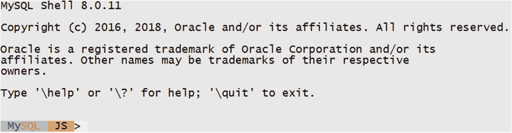
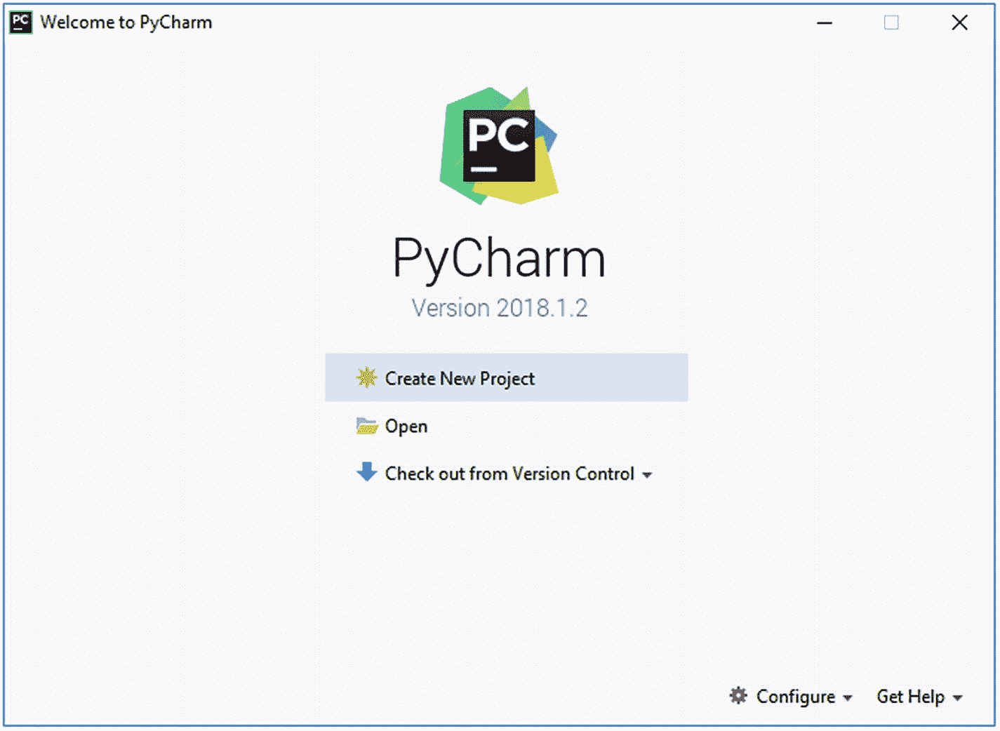
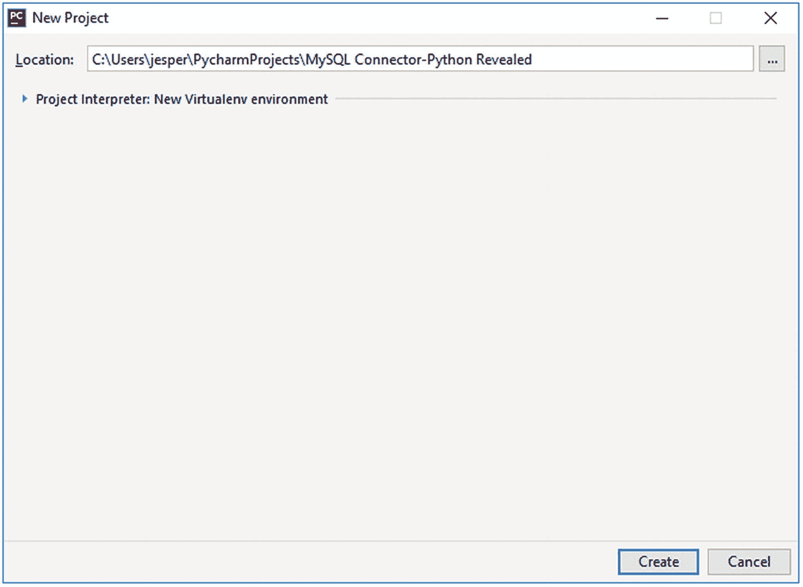
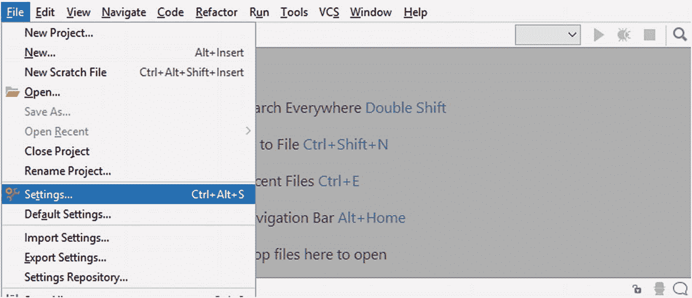
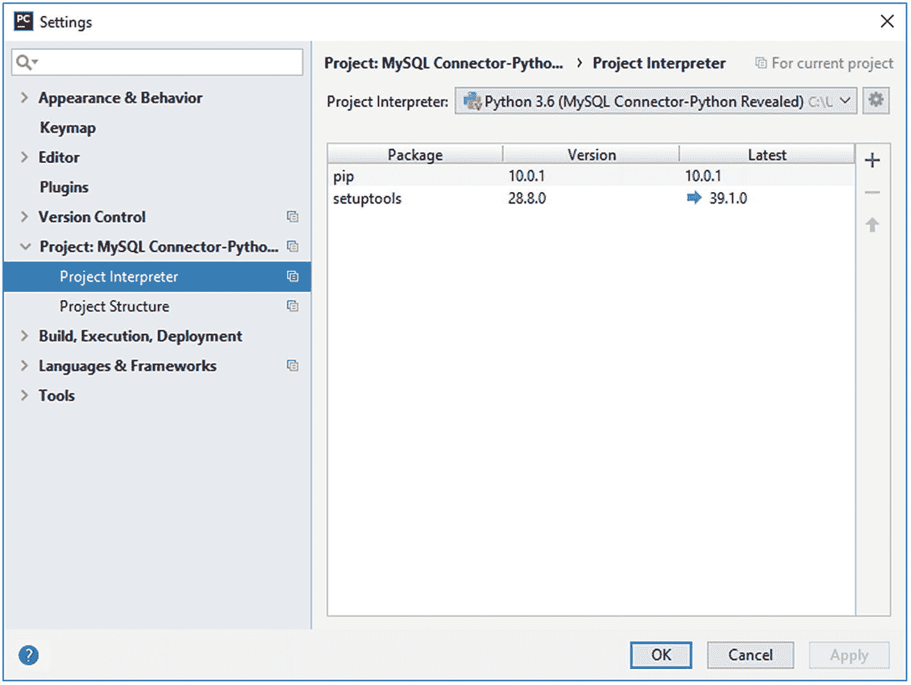
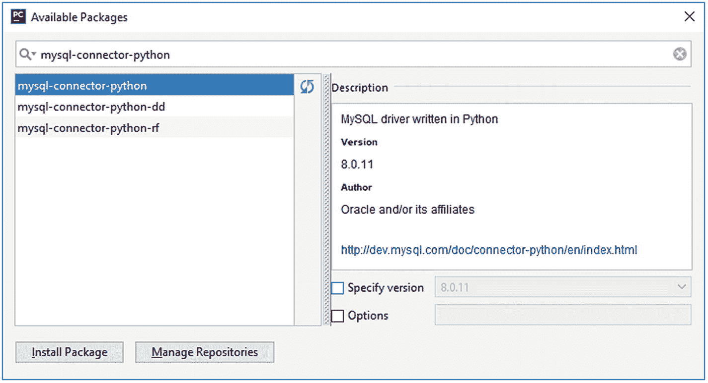
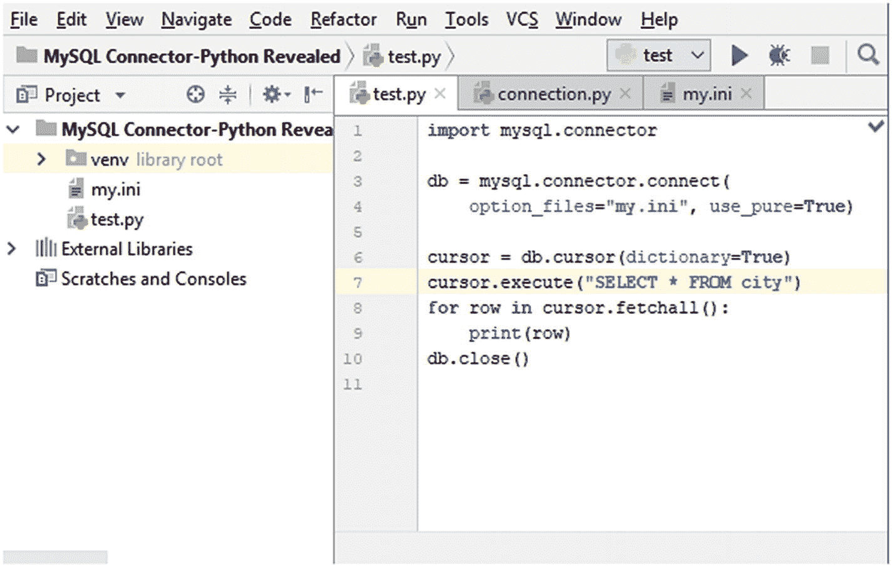
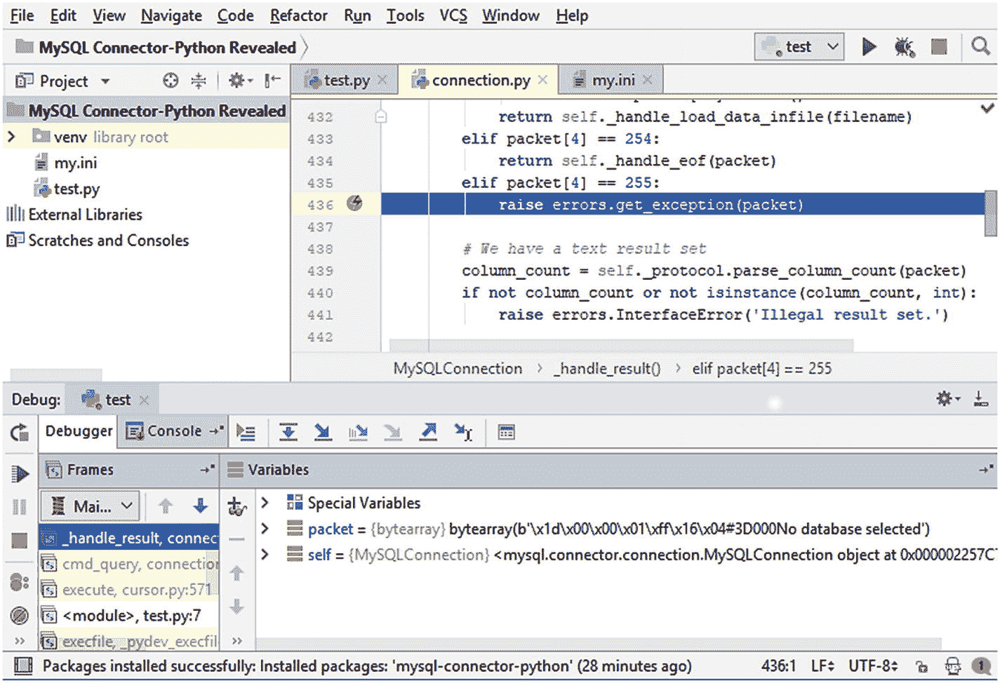

# 十、解决冲突

你写了一个大型复杂的应用，离截止日期只有很短的时间了。您开始了最后的测试，但是有些事情没有像预期的那样工作。一旦应用投入生产，客户或支持工程师可能会抱怨错误。如何尽可能快速有效地解决这些问题？继续读！

### 小费

本章有几个示例程序。列表中出现的所有示例程序都可以下载。有关使用示例程序的更多信息，参见第 [1](01.html) 章中对示例程序的讨论。

## 故障排除步骤

当您刚接触编程语言、库、数据库等时，可能很难解决问题。为了帮助您排除 MySQL Connector/Python 中的故障，本节将讨论一些特定于 MySQL Connector/Python 的通用故障排除技术。还建议熟悉通用软件、Python 和 MySQL 故障排除。

### 小费

对一般 MySQL 故障排除可能有用的一本书是斯维塔·斯米尔诺娃( [`http://shop.oreilly.com/product/0636920021964.do`](http://shop.oreilly.com/product/0636920021964.do) )的 *MySQL 故障排除*。它已经有几年的历史了，所以没有涵盖所有最新的特性，但是如果您不熟悉 MySQL 故障诊断，它仍然是一个很好的起点。

在您开始钻研故障排除技巧之前，请记住，最容易解决的问题是那些在编写代码时立即发现的问题。所以，确保你有一个好的测试框架，并且你有好的测试覆盖率。

### 小费

拥有一个好的测试套件是避免问题的第一步，这些问题稍后将需要掌握故障排除技能来调试。

故障排除讨论将从 MySQL 连接器/Python 问题故障排除的五种一般方法开始:检查警告；确定 SQL 语句；处理原始数据；MySQL 连接器/Python 源代码；并更改 MySQL 连接器/Python 实现。此外，下一小节将描述 MySQL 服务器日志，这也很有用。

### 检查警告

警告的检查在前一章已经讨论过了。所以，这只是为了重申检查警告是很重要的，因为它们可能是一些错误的早期指标，一些可能会在以后导致更严重的错误。错误可能发生在同一程序的执行过程中，或者在以后的某个时间出现，甚至是几年以后。

因此，最理想的情况是，您的程序不应该导致任何警告，除非您完全知道为什么会创建警告，并且可以显式地处理警告。预期出现警告的一个例子是`EXPLAIN`语句，其中重新格式化的查询和其他信息可以通过警告返回。

建议检查所有警告，如果可能的话，启用`raise_on_warnings`在出现警告时引发异常。完全避免警告可能是不可能的，但是如果您通过捕获异常或临时禁用`raise_on_warnings`来显式地处理它们，至少可以确保您意识到确实发生的警告，并且您可以调查它们的原因。调查警告原因的一种方法是查看执行的确切 SQL 语句；这是下一个话题。

### 确定 SQL 语句

在某些情况下，执行哪条 SQL 语句是非常清楚的，例如，无论何时执行显式编写的 SQL 语句。然而，在其他情况下，就不那么清楚了。您可以使用参数，通过 X DevAPI 执行查询，或者使用其他框架为您生成实际的 SQL 语句。

一旦有了语句，就可以尝试手动执行它，例如，通过 MySQL Shell。使用命令行客户端是调试 SQL 语句的好方法，MySQL Shell 支持直接执行 SQL 语句和使用 Python 代码。

让我们看看如何找出实际执行了哪些 SQL 语句。提取查询有多种方法。以下示例展示了如何获取 cursor 语句、X DevAPI 中的 select 语句以及使用 MySQL 性能模式的一般情况。

#### 游标.语句

使用游标时，可以在游标的`statement`属性中检索最后执行的查询。这甚至适用于参数，因为返回的查询带有参数替换。以下示例显示了如何找到 SQL 语句:

```py
import mysql.connector

db = mysql.connector.connect(
  option_files="my.ini",
)

cursor = db.cursor()
cursor.execute(
  "SELECT * FROM world.city WHERE ID = %(id)s",
  params={"id": 130}
)
print("Statement: {0};"
  .format(cursor.statement))

db.close()

```

这将打印以下输出:

```py
Statement: SELECT * FROM world.city WHERE ID = 130;

```

#### mysqlx SelectStatement.get_sql()

对于 X DevAPI 中的 select 语句，`get_sql()`方法返回基于查询定义生成的语句。这类似于 cursor 语句属性，只是不包括参数替换。使用`get_sql()`检索语句的一个例子是

```py
import mysqlx
from config import connect_args

db = mysqlx.get_session(**connect_args)
world = db.get_schema("world")
city = world.get_table("city")
stmt = city.select()
stmt.where("ID = :city_id")
stmt.bind("city_id", 130)

print("Statement: {0}"
  .format(stmt.get_sql()))

db.close()

```

这将打印以下输出:

```py
Statement: SELECT * FROM world.city WHERE ID = :city_id

```

令人惊讶的是，这里使用了占位符名称(`:city_id`)，而不是实际的 ID。X DevAPI 直到执行时才应用绑定，所以当使用`get_sql()`生成 SQL 语句时，只有占位符的名称可用。

#### 使用性能模式

除了使用准备好的语句之外，所有情况下都可以使用的一种方法是查询 MySQL 性能模式。这在测试实例上最容易做到，因为您可以确保没有其他查询被执行。在繁忙的服务器上也可以使用类似的步骤，但是这需要更多的关注和过滤来找到来自应用的查询。

为了使用性能模式，您需要准备配置，以便即使在应用关闭连接时也能捕获和保留查询。一种方法是启用`events_statements_history_long`消费者，并禁用对将检索查询的数据库连接的监控:

```py
mysql> UPDATE performance_schema.setup_consumers
          SET ENABLED = 'YES'
        WHERE NAME = 'events_statements_history_long';
Query OK, 1 row affected (0.09 sec)
Rows matched: 1  Changed: 1  Warnings: 0

mysql> UPDATE performance_schema.threads
          SET INSTRUMENTED = 'NO'
        WHERE PROCESSLIST_ID = CONNECTION_ID();
Query OK, 1 row affected (0.11 sec)
Rows matched: 1  Changed: 1  Warnings: 0

```

此时，可以执行您需要从中获取查询的应用部分。考虑清单 [10-1](#Par27) 中的示例程序，该程序使用 mysql.connector 模块和 X DevAPI 对 sql 表的 CRUD 访问对`world`模式中的`city`表执行一条 select 语句(总共两次查询)。

```py
import mysql.connector
import mysqlx
from config import connect_args

# Execute a query using the traditional
# API
db_trad = mysql.connector.connect(
  option_files="my.ini")
cursor = db_trad.cursor()

sql = """SELECT *

           FROM world.city
          WHERE ID = %(id)s"""

params = {'id': 130}

cursor.execute(sql, params=params)

for row in cursor.fetchall():
  print(row)

db_trad.close()

# Execute a query using the X DevAPI
dbx = mysqlx.get_session(**connect_args)
world = dbx.get_schema("world")

city = world.get_table("city")

city_stmt = city.select()

city_stmt.where("ID = :city_id")

city_stmt.bind("city_id", 131)

res = city_stmt.execute()

for row in res.fetch_all():

  print("({0}, '{1}', '{2}', '{3}', {4})"
    .format(
       row[0], row[1],
       row[2],row[3],row[4]
  ))

dbx.close()

Listing 10-1Executing Two Simple Queries Using mysql.connector and mysqlx

```

一旦执行完成，您可以使用清单 [10-2](#Par29) 中的语句让程序执行查询。添加了一个`LIMIT 8`,因为通常输出中最多可以有 10，000 行。由于其他连接执行的查询也将被记录，因此示例程序返回的可能不是第一行，在这种情况下，可能需要增加输出中包含的行数。

```py
mysql> SELECT THREAD_ID, EVENT_ID, EVENT_NAME, SQL_TEXT
         FROM performance_schema.events_statements_history_long
        ORDER BY THREAD_ID DESC, EVENT_ID
        LIMIT 8\G
*************************** 1\. row ***************************
 THREAD_ID: 182
  EVENT_ID: 1
EVENT_NAME: statement/sql/set_option
  SQL_TEXT: SET NAMES 'utf8' COLLATE 'utf8_general_ci'
*************************** 2\. row ***************************
 THREAD_ID: 182
  EVENT_ID: 2
EVENT_NAME: statement/sql/set_option
  SQL_TEXT: SET NAMES utf8
*************************** 3\. row ***************************
 THREAD_ID: 182
  EVENT_ID: 3
EVENT_NAME: statement/sql/set_option
  SQL_TEXT: set autocommit=0
*************************** 4\. row ***************************
 THREAD_ID: 182
  EVENT_ID: 4
EVENT_NAME: statement/com/Ping
  SQL_TEXT: NULL
*************************** 5\. row ***************************
 THREAD_ID: 182
  EVENT_ID: 5

EVENT_NAME: statement/sql/select

  SQL_TEXT: SELECT *
           FROM world.city
          WHERE ID = 130
*************************** 6\. row ***************************
 THREAD_ID: 182
  EVENT_ID: 7
EVENT_NAME: statement/com/Quit
  SQL_TEXT: NULL
*************************** 7\. row ***************************
 THREAD_ID: 179
  EVENT_ID: 1
EVENT_NAME: statement/sql/select
  SQL_TEXT: /* xplugin authentication */ SELECT @@require_secure_transport, `authentication_string`, `plugin`,(`account_locked`='Y') as is_account_locked, (`password_expired`!
ord`, @@offline_mode and (`Super_priv`='N') as `is_offline_mode_and_not_super_user`,`ssl_type`, `ssl_cipher`, `x509_issuer`, `x509_subject` FROM mysql.user WHERE 'pyuser' = `u
*************************** 8\. row ***************************
 THREAD_ID: 179
  EVENT_ID: 3

EVENT_NAME: statement/sql/select

  SQL_TEXT: SELECT * FROM `world`.`city` WHERE (`ID` = 131)
8 rows in set (0.00 sec)

Listing 10-2Obtaining the Statements from the Performance Schema

```

带`THREAD_ID = 182`的行是使用`mysql.connector`模块时的查询，带`THREAD_ID = 179`的行是针对`mysqlx`模块的。实际的线程和事件 id 是不同的，从这个例子中可以看出，线程 id 不是单调递增的(这个例子创建了与`THREAD_ID = 182`的连接，然后创建了与`THREAD_ID = 179`的连接)。给定线程 ID 的语句按照`EVENT_ID`的顺序执行。

如您所见，通过 MySQL Connector/Python 执行查询还包括执行其他查询和命令。突出显示的两个查询是您要求执行的查询。

`performance_schema.` `events_statements_history_long` `table`不包括作为服务器端预准备语句执行的查询。它们可以在`performance_schema.prepared_statements_instances`中找到，但是只有在应用连接的情况下，才根据准备好的语句进行聚合。

还有一种方法可以获得执行的 SQL 语句:通用查询日志。这将在本章后面与其他 MySQL 服务器日志一起讨论。

一旦您确认了实际的查询存在，如果您的问题没有得到解决，您可能需要查看返回的原始数据。

### 检索原始数据

如果查询看起来是正确的，并且当您手动执行它时可以工作，那么问题可能出在对返回数据的处理上。在使用游标时，调查这是否是个问题的一种方法是要求数据原始返回。

### 注意

原始结果数据仅与普通游标和缓冲游标一起受支持。

当你有了原始数据，你可以看看它是否像预期的那样，然后从那里着手解决问题。可能有必要看看 MySQL 连接器/Python 源代码，这是下一个主题。

### 阅读 MySQL 连接器/Python 源代码

使用像 MySQL Connector/Python 这样的库的原因之一是，您不想自己实现一个连接器，您想把它作为一个黑盒来使用。这也是目的，但是编写 Python 程序有一个优势:很容易了解这些库是如何实现的，因为它们大部分是用 Python 本身编写的，并且您可以直接打开库文件，而不是有一个单独的源代码树。

如果您想查看源代码，有三个选项:

*   直接查看所使用的库文件。这在您的开发系统上特别有用，因为它允许您在库中执行调试。确保在完成后重置代码，这样您就不会在开发系统和生产系统上有不同的行为。重置的最佳方式是重新安装库。

*   从 [`https://dev.mysql.com/downloads/connector/python/`](https://dev.mysql.com/downloads/connector/python/) 下载最新发布的源代码，或者从 [`https://downloads.mysql.com/archives/c-python/`](https://downloads.mysql.com/archives/c-python/) 下载旧版本的源代码。

*   从位于 [`https://github.com/mysql/mysql-connector-python`](https://github.com/mysql/mysql-connector-python) 的 MySQL GitHub 库下载源代码。如果您熟悉 git，如果您需要在可用的分支和版本之间切换，这可能是一种处理源代码的便捷方式。

如果您使用 C 扩展，那么只有有限数量的源代码是用 Python 编写的。但是，您可以根据需要在纯 Python 实现和 C 扩展之间切换，这是本节的最后一个主题。

### 更改实现

最后一个选项是改变您是使用纯 Python 还是 MySQL Connector/Python 的 C 扩展实现。一般来说，使用哪种实现并不重要，但是在某些情况下可能会有所不同。

通过更改`use_pure`连接选项的值，可以在两种实现之间进行切换。默认情况下，这是禁用的。如果有超出本书描述或手册中记录的行为差异，可能是 MySQL Connector/Python 中的 bug 可以在 [`https://bugs.mysql.com/`](https://bugs.mysql.com/) 记录一个 bug。

### 小费

意外行为可能是由于 MySQL Connector/Python 中的一个错误造成的。版本越老，越有可能出现这种情况。建议使用发布系列的最新补丁版本，以确保您有尽可能多的错误修复。发布说明可以在 [`https://dev.mysql.com/doc/relnotes/connector-python/en/`](https://dev.mysql.com/doc/relnotes/connector-python/en/) 找到。

将考虑的故障排除信息的最终来源是 MySQL 服务器日志。

### MySQL 服务器日志

MySQL Server 包括几个日志，对于调查正在发生的事情和出现的问题非常有用。在研究 MySQL Connector/Python 程序中的问题时，有必要看一看它们以及如何使用它们。

MySQL 服务器包含的日志有

*   **错误日志**:这是 MySQL 服务器实例在服务器端出现问题或发生启动和停止实例等重要变化时记录消息的地方。

*   **通用查询日志**:可以记录所有执行的查询。

*   **慢速查询日志**:这可以用来记录所有超过一定时间的查询或者不使用索引的查询。

*   **二进制日志**:记录对模式或数据的所有更改，但不记录选择数据的查询。

*   ****审计日志**:这可以用来记录所有查询或者查询的子集。它类似于一般的查询日志，但是更灵活，有更多的特性，并且可以选择更低的开销。这仅在企业版中可用，不再进一步讨论。有兴趣的话，看 [`https://www.mysql.com/products/enterprise/audit.html`](https://www.mysql.com/products/enterprise/audit.html) 。**

 **每种日志都有自己的优势，因此不是只启用其中一种的问题。为了更好地理解每个日志(除了审计日志)，让我们更详细地了解它们。

#### 错误日志

错误日志是查找 MySQL 服务器端问题的主要地方。但是，它也可能包含有关中止的连接、失败的身份验证以及与客户端相关的其他问题的信息。

使用`log_error`选项指定错误日志位置。默认值取决于您的平台和如何启动 MySQL。建议总是显式地设置它，以便在配置文件中指定路径，并避免在主机名(在 Linux 和 Unix 上)更新时更改文件名。这也确保了错误日志总是处于启用状态。

使用`log_error_verbosity`选项控制详细程度。它可以设置为 1、2 或 3。MySQL 8.0 中的默认值是 2。较高的值意味着包含不太重要的消息。

*   **1** :错误信息

*   **2** :错误和警告信息

*   **3** :错误、警告和注释级别信息

在 MySQL 8.0 中，有一个额外的消息类别:系统消息。无论`log_error_verbosity`的值如何，它们总是被包括在内。

从开发的角度来看，这些是最重要的设置。还有其他一些设置，如记录到 syslog 工具和高级过滤选项。这些设置超出了本书的范围，但是你可以在 [`https://dev.mysql.com/doc/refman/en/error-log.html`](https://dev.mysql.com/doc/refman/en/error-log.html) 了解更多。

#### 常规查询日志

常规查询日志在执行查询之前记录所有查询。这使得它成为调试问题时的一个很好的资源，因为您不需要显式地手动编写和执行每个查询。不利的一面是，一般查询日志有很大的性能开销，所以不建议在生产环境中启用它，除非是在很短的时间内。

### 警告

常规查询日志的开销很大。如果您在生产系统上启用它，请非常小心。然而，它是开发系统调试的一个很好的工具。

使用`general_log`选项启用通用查询日志，并使用`general_log_file`设置文件的位置。默认位置是一个使用主机名作为基本名称和*的文件。日志*为扩展名。例如，您可以使用以下 SQL 命令启用常规查询日志并检查当前文件位置:

```py
mysql> SET GLOBAL general_log = ON;
Query OK, 0 rows affected (0.07 sec)

mysql> SELECT @@global.general_log_file;
+----------------------------------+
| @@global.general_log_file        |
+----------------------------------+
| D:\MySQL\Data_8.0.11\general.log |
+----------------------------------+
1 row in set (0.00 sec)

```

常规日志文件的内容包括连接和使用时间戳执行的查询。一个例子是

```py
D:\MySQL\mysql-8.0.11-winx64\bin\mysqld.exe, Version: 8.0.11 (MySQL Community Server - GPL). started with:
TCP Port: 3306, Named Pipe: MySQL
Time                          Id Command  Argument
2018-05-13T04:53:35.717319Z  164 Connect  pyuser@localhost on using SSL/TLS
2018-05-13T04:53:35.717850Z  164 Query    SET NAMES 'utf8' COLLATE 'utf8_general_ci'
2018-05-13T04:53:35.718079Z  164 Query    SET NAMES utf8
2018-05-13T04:53:35.718304Z  164 Query    set autocommit=0

2018-05-13T04:53:35.718674Z  164 Query    SELECT *

           FROM world.city
          WHERE ID = 130
2018-05-13T04:53:35.719042Z  164 Quit
2018-05-13T04:53:36.167636Z  165 Connect
2018-05-13T04:53:36.167890Z  165 Query    /* xplugin authentication */ SELECT @@require_secure_transport, `authentication_string`, `plugin`,(`account_locked`='Y') as is_account_locked, (`password_expired`!='N') as `is_password_expired`, @@disconnect_on_expired_password as `disconnect_on_expired_password`, @@offline_mode and (`Super_priv`='N') as `is_offline_mode_and_not_super_user`,`ssl_type`, `ssl_cipher`, `x509_issuer`, `x509_subject` FROM mysql.user WHERE 'pyuser' = `user` AND 'localhost' = `host`

2018-05-13T04:53:36.169665Z  165 Query    SELECT * FROM `world`.`city` WHERE (`ID` = 131)

2018-05-13T04:53:36.170498Z  165 Quit

```

这与使用性能模式确定查询的示例相同。`Id`列是连接 ID，因此它不能与性能模式中的`THREAD_ID`进行比较。有关通用查询日志的更多信息，请参见 [`https://dev.mysql.com/doc/refman/en/query-log.html`](https://dev.mysql.com/doc/refman/en/query-log.html) 。

#### 慢速查询日志

慢速查询日志是研究 MySQL 中慢速查询的传统工具。现在，性能模式提供了很多慢速查询日志的功能，但是仍然有一些情况下，您可能希望将日志记录到文件中，比如在 MySQL 重新启动时保存日志。

使用`slow_query_log`选项启用慢速查询日志。默认情况下，耗时超过`long_query_time`秒的查询会被记录到由`slow_query_log_file`指定的文件中。一个例外是管理查询(`ALTER TABLE`、`OPTIMIZE TABLE`等)。)，这需要在记录前启用`log_slow_admin_statements`选项。

此外，还有`log_queries_not_using_indexes`选项，它会记录所有不使用索引的查询，而不管执行查询需要多长时间。启用该选项时，将`long_query_time`增加到一个较大的值(如 10000)会很有用，以便只关注不使用索引的查询。`min_examined_row_limit`可用于避免只检查少量行的日志查询；例如，如果一个表只有 10 行，那么可以进行全表扫描。

有关慢速查询日志的更多信息，请参见 [`https://dev.mysql.com/doc/refman/en/slow-query-log.html`](https://dev.mysql.com/doc/refman/en/slow-query-log.html) 。

#### 二进制日志

二进制日志与其他日志有些不同，因为它的主要目的不是记录不寻常的事情，也不是作为审计日志。它用于允许复制和时间点恢复。但是，由于二进制日志记录了对模式和数据的所有更改，因此它对于确定何时进行更改也很有用。

在 MySQL 8.0.3 和更高版本中，默认情况下启用二进制日志，并由`log_bin`选项控制。该选项既可用于启用二进制日志，也可用于设置二进制日志文件的路径和文件名前缀。要禁用二进制日志记录，请使用选项`skip_log_bin`。在给定的连接(会话)中，可以通过将`sql_log_bin`选项设置为`OFF`来禁用二进制日志记录，并通过将其设置为`ON`来重新启用它:

```py
mysql> SET SESSION sql_log_bin = OFF;
Query OK, 0 rows affected (0.04 sec)

mysql> -- Some queries not to be logged

mysql> SET SESSION sql_log_bin = ON;
Query OK, 0 rows affected (0.00 sec)

```

改变`sql_log_bin`需要`SYSTEM_VARIABLES_ADMIN`或`SUPER`权限，只有在你有充分理由的情况下你才应该这样做。如果二进制日志中缺少模式或数据更改，复制从属服务器可能会变得不同步；也就是说，它没有与复制主服务器相同的数据，这意味着需要重建从服务器。

使用 MySQL 服务器安装中包含的`mysqlbinlog`实用程序读取二进制日志。关于二进制日志的更多信息，参见 [`https://dev.mysql.com/doc/refman/en/binary-log.html`](https://dev.mysql.com/doc/refman/en/binary-log.html) 。

到目前为止，本章介绍了一种非常手动的故障诊断方法。通过工具可以使这变得更容易。下一节将讨论两个工具:MySQL Shell 和 PyCharm。

## 调试工具

对于简单的程序和简单的问题，通过读取源代码、添加打印语句等手动调试来解决问题可能会更快。然而，通常这不是最有效的方法。本节将介绍两个可以帮助调试 MySQL 连接器/Python 程序的工具。首先你会看一下 MySQL Shell，在第 [6](06.html) 章中简单提到过，然后你会简单看一下使用 PyCharm 进行调试。

### MySQL Shell

命令行客户端 MySQL Shell 于 2017 年 4 月首次发布为 GA。它将成为下一代工具，不仅可以执行 SQL 查询，还可以执行管理任务以及 Python 和 JavaScript 代码。

MySQL Shell 不是这样一个调试工具。但是，因为它是交互式的，并且支持 Python 和直接 SQL 语句，所以它是试验和研究代码和查询如何工作的一种方便的方法。它还包括对 X DevAPI 的支持，因此您可以交互式地调试使用`mysqlx`模块的代码。

### 注意

MySQL Shell 中包含的不是 MySQL Connector/Python。因此，无论您是使用 MySQL Connector/Python 程序中的 X DevAPI，还是使用 MySQL Shell，都会有一些不同。但是，API 本身是一样的。

可以从 MySQL Connector/Python 和 MySQL Server 相同的位置下载 MySQL Shell。社区下载的链接是 [`https://dev.mysql.com/downloads/shell/`](https://dev.mysql.com/downloads/shell/) 。如果您在 Microsoft Windows 上使用 MySQL 安装程序，也可以通过这种方式安装 MySQL Shell。一旦安装了 MySQL Shell(安装将作为读者的练习)，您可以通过几种方式启动它:

*   从 shell 中执行`mysqlsh`二进制文件。这是 Linux 和 Unix 上最常见的方式，但它也适用于 Microsoft Windows。

*   在 Microsoft Windows 上，您也可以从“开始”菜单执行它。

从 shell 调用`mysqlsh`的一个优点是，您可以在命令行上指定选项；比如`--py`在 Python 模式下启动 MySQL Shell。一旦启动，你会得到如图 [10-1](#Fig1) 所示的提示。



图 10-1

MySQL Shell 欢迎消息

屏幕截图中的颜色已经更改，以便在打印时更好地工作。默认配色方案针对黑色背景进行了优化。提示符显示了 shell 所处的模式。表 [10-1](#Tab1) 总结了采油树模式。

表 10-1

MySQL 外壳模式

<colgroup><col class="tcol1 align-left"> <col class="tcol2 align-left"> <col class="tcol3 align-left"> <col class="tcol4 align-left"></colgroup> 
| 

方式

 | 

提示

 | 

命令行

 | 

命令

 |
| --- | --- | --- | --- |
| Java Script 语言 | 射流研究… | `--js` | `\js` |
| 计算机编程语言 | 巴拉圭 | `--py` | `\py` |
| 结构化查询语言 | 结构化查询语言 | `--sql` | `\sql` |

`Prompt`栏显示了用于提示文本中模式的缩写。`Command-Line`列包含从命令行启动 MySQL Shell 时启用模式的选项。`Command`列显示了在 shell 中用来改变模式的命令。

在 MySQL Shell 中执行 Python 代码时，可以使用六个全局对象:

*   `mysqlx`:模块`mysqlx`；然而，这与 MySQL Connector/Python 中的`mysqlx`模块并不相同(但非常相似)。

*   `session`:保持与 MySQL 服务器连接的会话对象。

*   `db`:一个模式对象，如果在创建连接时已经在 URI 中定义了一个模式对象的话。

*   这个对象包含了管理 MySQL InnoDB 集群的方法。

*   `shell`:具有各种通用方法的对象，例如用于配置 MySQL Shell。

*   `util`:该对象包含各种实用方法。

清单 [10-3](#Par99) 展示了一个使用 MySQL Shell 测试代码的例子，该代码创建了一个集合并添加了两个文档。

```py
JS> \py
Switching to Python mode...

Py> \c pyuser@localhost
Creating a session to 'pyuser@localhost'
Enter password: **********
Fetching schema names for autocompletion... Press ^C to stop.
Your MySQL connection id is 179 (X protocol)
Server version: 8.0.11 MySQL Community Server - GPL
No default schema selected; type \use <schema> to set one.

Py> session

<Session:pyuser@localhost>

Py> session.drop_schema('py_test_db')
Py> db = session.create_schema('py_test_db')
Py> people = db.create_collection('people')
Py> add_stmt = people.add(
...   {
...     "FirstName": "John",
...     "LastName": "Doe"
...   }
... )
...

Py> add_stmt.add(

...   {

...     "FirstName": "Jane",

...     "LastName": "Doe"

...   }

... )

...

Query OK, 2 items affected (0.1715 sec)

Py> find_stmt = people.find("FirstName = 'Jane'")
Py> find_stmt.fields("FirstName", "LastName")
[
    {
        "FirstName": "Jane",
        "LastName": "Doe"
    }
]
1 document in set (0.0007 sec)

Py> \sql
Switching to SQL mode... Commands end with ;

SQL> SELECT _id,
 ...        doc->>'$.FirstName' AS FirstName,
 ...        doc->>'$.LastName' AS LastName
 ...   FROM py_test_db.people;
+------------------------------+-----------+----------+
| _id                          | FirstName | LastName |
+------------------------------+-----------+----------+
| 00005af3e4f700000000000000a2 | John      | Doe      |
| 00005af3e4f700000000000000a3 | Jane      | Doe      |
+------------------------------+-----------+----------+
2 rows in set (0.0006 sec)

SQL> \q
Bye!

Listing 10-3Using the MySQL Shell

```

示例中的提示已经过修改，只显示语言模式。该示例由几个步骤组成:

1.  切换到使用 Python。

2.  连接到 MySQL。

3.  如果存在的话，删除`py_test_db`模式。

4.  创建`py_test_db`模式。

5.  创建`people`集合。

6.  将两个人添加到`people`集合中。

7.  使用 CRUD read 语句查询 people 集合。

8.  切换到 SQL 模式。

9.  使用 SQL 查询`people`集合(现在认为是一个表)。

大多数步骤现在应该看起来很熟悉了；但是，有几件事需要注意。首先，一旦创建了连接，就会自动设置`session`变量。下一件重要的事情是，当 Jane Doe 被添加到`add_stmt`时，即使没有对`execute()`的调用，语句也会被执行。find 语句也会发生类似的情况。这是 MySQL Shell 的一个特性。当您使用 CRUD 方法并且没有将结果赋给变量时，会有一个对`execute()`的隐式调用。

在示例的最后，使用 SQL 语句检索 people 集合中的记录。这使用了`->>`操作符，它是提取字段和取消引用字段的组合。MySQL 有两种从 JSON 文档中提取值的简写符号。`->`运算符相当于`JSON_EXTRACT()`函数，`->>`与`JSON_UNQUOTE(JSON_EXTRACT())`相同。

使用 MySQL Shell 可以做更多的事情。成为 it 大师的最好方法就是开始使用它。虽然它起初看起来像是一个复杂的工具，但如果您遇到困难，有几个内置资源可以提供帮助。第一个是`--help`命令行参数。这将提供 MySQL Shell 的高级描述，包括命令行参数列表。此外，所有与 X DevAPI 相关的对象都有内置的帮助，您可以通过执行`help()`方法获得这些帮助。这不仅适用于前面列出的全局变量，也适用于其他对象，如集合。对于前面清单中的`people`集合，帮助文本可以在清单 [10-4](#Par113) 中看到。

```py
Py> people = db.get_collection('people')
Py> people.help()

A Document is a set of key and value pairs, as represented by a JSON object.

A Document is represented internally using the MySQL binary JSON object,
through the JSON MySQL datatype.

The values of fields can contain other documents, arrays, and lists of
documents.

The following properties are currently supported.

 - name    The name of this database object.
 - session The Session object of this database object.
 - schema  The Schema object of this database object.

The following functions are currently supported.

 - add                 Inserts one or more documents into a collection.
 - add_or_replace_one  Replaces or adds a document in a collection.
 - create_index        Creates an index on a collection.
 - drop_index          Drops an index from a collection.
 - exists_in_database  Verifies if this object exists in the database.
 - find                Retrieves documents from a collection, matching a specified criteria.
 - get_name            Returns the name of this database object.
 - get_one             Fetches the document with the given _id from the collection.
 - get_schema          Returns the Schema object of this database object.
 - get_session         Returns the Session object of this database object.
 - help                Provides help about this class and it's members
 - modify              Creates a collection update handler.
 - remove              Creates a document deletion handler.
 - remove_one          Removes document with the given _id value.
 - replace_one         Replaces an existing document with a new document.

Listing 10-4The Output of the help() Method for a Collection

```

### 小费

使用`mysqlsh --help`获得 MySQL Shell 的高级帮助，使用 X DevAPI 对象的`help()`方法获得更具体的帮助。有关在线帮助，请参见 [`https://dev.mysql.com/doc/refman/en/mysql-shell.html`](https://dev.mysql.com/doc/refman/en/mysql-shell.html) 和 [`https://dev.mysql.com/doc/refman/en/mysql-shell-tutorial-python.html`](https://dev.mysql.com/doc/refman/en/mysql-shell-tutorial-python.html) 。

除了 MySQL Shell，还有其他调试工具可供选择。对于专用的 Python IDE，我们来看看 PyCharm。

### PyCharm

有许多编辑器和 ide 可用于源代码编辑和调试。PyCharm 就是这样一个 IDE，它是专门为 Python 编写的。PyCharm 的全部潜力超出了本书的范围，这个简短的例子更多地是为了展示使用 IDE 进行开发和故障排除的想法，而不是说明如何使用 PyCharm。

### 注意

本例中使用了 PyCharm，但是其他 ide 也有类似的功能。使用您熟悉的、符合您的要求的、并且在您的公司中可用的 IDE。

PyCharm 可以从 [`https://www.jetbrains.com/pycharm/`](https://www.jetbrains.com/pycharm/) 的产品主页下载。IDE 可用于 Microsoft Windows、macOS 和 Linux。安装很简单，假设您已经安装了 PyCharm。

要开始使用 PyCharm，您需要创建一个新项目。这可以在欢迎屏幕上完成，如图 [10-2](#Fig2) 所示。



图 10-2

PyCharm 欢迎屏幕

点击*新建项目*后，选择项目名称，如图 [10-3](#Fig3) 所示。在这种情况下，名称是 *MySQL 连接器-Python 揭示了*。



图 10-3

创建新项目

一旦创建了项目，就可以进入 IDE 环境本身。在这里，您可以创建新的源文件，执行源文件，调试它们，等等。第一步是确保 MySQL 连接器/Python 可用。PyCharm 将项目所需的所有文件与项目隔离，所以需要先为项目安装 MySQL Connector/Python。这可以从设置页面完成，在顶部菜单中选择*文件*，然后选择*设置*，如图 [10-4](#Fig4) 所示。



图 10-4

导航到设置

在设置中，有一部分是可以配置项目本身的。这包括从 PyPi 安装软件包。因为 MySQL Connector/Python 可以从 PyPi 获得，所以这就是你要做的。项目解释器设置屏幕如图 [10-5](#Fig5) 所示。



图 10-5

带有项目解释器设置的屏幕

您可以使用已安装软件包列表区域右上角的绿色+图标添加软件包。这将把你带到图 [10-6](#Fig6) 所示的屏幕，在这里你可以搜索或浏览要安装的软件包。



图 10-6

搜索和浏览要安装的 PyPi 包

找到 MySQL Connector/Python 最简单的方法就是搜索包名: *mysql-connector-python* 。一旦选择了包，您就可以看到它的详细信息。确保软件包的作者是*甲骨文和/或其附属公司*，并且版本是 8.0.11 或更新版本。您可以选择不同于最新版本的版本，但通常建议使用为您选择的版本。点击*安装包*安装包。

安装需要一点时间，因为必须下载并安装软件包及其依赖项。一旦您返回到 settings 屏幕，您可以看到一些其他的包作为依赖项被拉进来，包括 protobuf 包。点击 *OK* 返回主 IDE 窗口，在这里你可以创建你的第一个 Python 程序。

要创建一个新的源文件，点击左侧菜单中的项目文件夹，然后在顶部菜单中选择*文件*(与进入设置相同)，然后选择*新建*。选择创建一个新文件，命名为`test.py`。以同样的方式创建第二个文件，名为`my.ini`(您可以选择格式为*文本*)。

在`my.ini`文件中，您可以输入连接 MySQL 的常用 MySQL 连接器/Python 配置:

```py
[connector_python]
user     = pyuser
host     = 127.0.0.1
port     = 3306
password = Py@pp4Demo

```

您可以使用 CTRL + s 保存文件。然后转到`test.py`文件，输入并保存您的程序:

```py
import mysql.connector

db = mysql.connector.connect(
    option_files="my.ini", use_pure=True)

cursor = db.cursor()
cursor.execute("SELECT * FROM city")
db.close()

```

图 [10-7](#Fig7) 显示了输入代码的编辑器。



图 10-7

代码编辑器

这是 IDE 发挥作用的时间点，因为您现在可以执行或调试代码了。这些操作可从*运行*菜单中获得。请随意继续并尝试运行代码。该示例包含一个 bug 查询应该是`SELECT * FROM world.city`。该错误意味着抛出了一个`MySQL` `ProgrammingError`异常，因为尚未选择用于查询的数据库:

```py
mysql.connector.errors.ProgrammingError: 1046 (3D000): No database selected

Process finished with exit code 1

```

如果你选择*调试*，而不是“运行”程序，那么 IDE 会检测到异常。除了输出与从控制台运行程序时相同的回溯信息之外，您还可以获得调试器输出，并访问发生异常的源代码；这种情况下，在 MySQL 连接器/Python 的`connection.py`文件中触发。图 [10-8](#Fig8) 显示了部分信息以及`connection.py`文件在异常发生时是如何打开的。



图 10-8

调试异常

由于该异常是在`mysql.connector`代码中触发的，它暗示了以下问题之一:

*   该查询无效。

*   该程序以无效的方式使用 MySQL 连接器/Python。

*   MySQL 连接器/Python 中遇到了一个 bug。

在这种情况下，很容易解决 bug 它只需要用`SELECT * FROM world.city`替换查询。在这种情况下，即使是异常中的错误消息也足够了。然而，在更大的程序和更复杂的工作流中，要确定错误在哪里以及是什么可能要困难得多。如本例所示，使用 IDE 可以更容易、更快速地解决问题。

### 小费

即使有 IDE 的强大功能，也不要低估异常返回的错误信息的有用性。通常会显示足够的信息，因此您可以确定问题是什么。

这仅仅是使用 ide 的皮毛。还有许多其他功能，如单步执行代码、使用断点等。

故障排除的一般讨论到此结束。在我结束之前，将讨论一些错误和问题的具体例子。

## 故障排除示例

本章的最后一部分是几个使用 MySQL Connector/Python 时可能会遇到的问题的例子。这绝不是详尽无遗的，但希望能为你可能遇到的问题以及如何处理它们提供一个思路。

### 注意

其中一些例子可能看起来有些牵强。然而，我从事 MySQL 支持工作已经很多年了，我见过这种错误——也曾被它们绊倒过——好几次。它们确实发生在现实生活中。

### 找到未读结果

使用`mysql.connector`模块时，可能会出现“发现未读结果”的错误。例外是使用了`InternalError`类。这是由于在您完全使用完上一个查询的结果集之前试图执行一个查询造成的。

导致错误的一个基本示例是

```py
import mysql.connector

db = mysql.connector.connect(
  option_files="my.ini",
  database="world"
)

cursor = db.cursor()
cursor.execute("SELECT * FROM city")
cursor.execute("SELECT * FROM country")

db.close()

```

如果您执行这个例子，您将会以一个`InternalError`异常结束。确切的回溯取决于 MySQL Connector/Python 的安装位置和版本，但它看起来类似于以下输出:

```py
Traceback (most recent call last):
  File "test.py", line 10, in <module>
    cursor.execute("SELECT * FROM country")
  File "C:\Users\jesper\AppData\Local\Programs\Python\Python36\lib\site-packages\mysql\connector\cursor_cext.py", line 232, in execute
    self._cnx.handle_unread_result()
  File "C:\Users\jesper\AppData\Local\Programs\Python\Python36\lib\site-packages\mysql\connector\connection_cext.py", line 599, in handle_unread_result
    raise errors.InternalError("Unread result found")

mysql.connector.errors.InternalError: Unread result found

```

如果您使用第一个查询的一些结果，但满足触发第二个查询的某些条件，这种情况很可能发生。还要记住，整个连接只能有一个未完成的结果，因此如果您需要并排执行多个查询，您需要使用两个连接，或者确保前一个结果已被完全使用，例如，通过使用缓冲游标。

在执行第二个查询之前,`mysql.connector`模块要求您指出想要对第一个查询的剩余结果做什么。有几种方法可以处理它:

*   显式提取所有剩余的行。

*   当使用 C 扩展时，使用 connection 对象上的`free_result()`方法显式释放结果集。在 8.0.11 和更低版本中，当使用 C 扩展时，即使所有行都已提取，这也是必需的。

*   如果您需要并排执行查询，请对除最后一个查询之外的所有查询使用缓冲游标，如第 [4](04.html) 章中的“缓冲结果”一节所述。

*   启用`consume_results`选项。这告诉 MySQL Connector/Python 在执行新的查询时自动丢弃剩余的行。

通常，首选前两种方法，因为它们明确地解释了意图，并避免了在应用的内存中保存整个结果的开销。最不可取的方法是自动使用结果，因为这很容易隐藏编程错误。

`mysqlx`模块自动丢弃未完成的结果，就像`consume_results`为`mysql.connector`模块启用一样。

### 数据太长或超出范围值

如果您使用的是较旧版本的 MySQL Server(5.6 版和更早版本)，并且升级到了 MySQL 5.7 和更高版本，您可能会发现以前工作的应用开始抛出有关数据过长或超出范围的错误。新的应用和旧版本的 MySQL Server 也会出现这种情况，但新版本的 MySQL Server 更有可能出现这种情况。

可能遇到的错误的两个例子是

```py
mysql.connector.errors.DataError: 1406 (22001): Data too long for column 'Code' at row 1

mysql.connector.errors.DataError: 1264 (22003): Out of range value for column 'IndepYear' at row 1

```

如前一章所述，原因是在 MySQL Server 5.7 及更高版本中默认启用了严格模式。这意味着，如果在`INSERT`或`UPDATE`语句中提供的数据不符合列的定义，查询将被拒绝，而不是试图将数据做成某种形状。触发列错误的*数据过长的`INSERT`语句的一个例子是*

```py
import mysql.connector

db = mysql.connector.connect(
  option_files="my.ini",
  database="world"
)
cursor = db.cursor()

db.start_transaction()

cursor.execute("""
INSERT INTO country (Code, Name)
VALUES ('Foobar', 'Foobar Country')""")

db.rollback()
db.close()

```

追溯和异常的一个例子是

```py
Traceback (most recent call last):
  File "C:\Users\jesper\AppData\Local\Programs\Python\Python36\lib\site-packages\mysql\connector\connection_cext.py", line 377, in cmd_query
    raw_as_string=raw_as_string)
_mysql_connector.MySQLInterfaceError: Data too long for column 'Code' at row 1

During handling of the above exception, another exception occurred:

Traceback (most recent call last):
  File "test.py", line 13, in <module>
    VALUES ('Foobar', 'Foobar Country')""")
  File "C:\Users\jesper\AppData\Local\Programs\Python\Python36\lib\site-packages\mysql\connector\cursor_cext.py", line 264, in execute
    raw_as_string=self._raw_as_string)
  File "C:\Users\jesper\AppData\Local\Programs\Python\Python36\lib\site-packages\mysql\connector\connection_cext.py", line 380, in cmd_query
    sqlstate=exc.sqlstate)

mysql.connector.errors.DataError: 1406 (22001): Data too long for column 'Code' at row 1

```

`Code`列被定义为`char(3)`，因此六个字符的代码不适合该列。有几种可能的方法来处理这些类型的错误:

*   更改列定义以便能够存储数据。

*   更改应用中的数据以满足列定义。例如，如果可以截断一个字符串或舍入一个数字，那么就显式地这样做。

*   如果查询中的数据不是直接来自应用，而是将数据从一个表插入到另一个表中，则如果可以接受，请在查询中操作数据。例如，`LEFT()`函数可用于截断超过给定字符数的字符串。

*   通过从`sql_mode`变量中移除`STRICT_TRANS_TABLES`来禁用严格模式。这是迄今为止最不可取的解决方案，因为您最终可能会在数据库中得到与预期不同的数据。

数据一致性是一个重要的特性。严格模式的存在是为了帮助您实现它，所以只有在没有其他选择的情况下才禁用它。

### 警告

禁用严格模式将允许静默数据损坏。除非别无选择，否则不要禁用它。

### 数据更改丢失

如果您发现您在应用中所做的更改不持久，或者从进行更改的同一个连接中可见，但从其他连接中不可见，那么您可能没有提交更改。如果禁用了`autocommit`(`mysql.connector`模块的默认设置)，这种情况很可能发生。

有时发现这一点的另一种方式是，在复制设置中，更改在复制源上看起来是可见的(假设您从做出更改的同一连接中查询数据)，但似乎更改没有复制。

这是一个可以让你的头发在很短的时间内变白的问题；然后，当你发现原因时，你就准备拔掉你所有的头发。问题是默认情况下 MySQL 服务器启用了`autocommit`,所以当你使用一个禁用它的连接器时，你很容易被发现。在清单 [10-5](#Par175) 中可以看到一个简单的例子。

```py
import mysql.connector

db1 = mysql.connector.connect(
  option_files="my.ini",
  database="world",
  autocommit=False
)
db2 = mysql.connector.connect(
  option_files="my.ini",
  database="world",
)
cursor1 = db1.cursor()
cursor2 = db2.cursor()

sql = """
SELECT Population
  FROM city
 WHERE ID = 130"""

cursor1.execute("""

UPDATE city

   SET Population = 5000000
 WHERE ID = 130""")

cursor1.execute(sql)
row1 = cursor1.fetchone()
print("Connection 1: {0}"
  .format(row1[0]))

cursor2.execute(sql)
row2 = cursor2.fetchone()
print("Connection 2: {0}"
  .format(row2[0]))

db1.close()
db2.close()

Listing 10-5Apparently Losing Data

```

对于`db1`连接，自动提交是禁用的，这意味着 MySQL 会自动启动一个事务，并在执行查询时保持它打开。由于没有提交事务，事务隔离防止其他连接看到数据。程序的输出显示了更新发生后每个连接发现的群体:

```py
Connection 1: 5000000
Connection 2: 3276207

```

即使提交了更改，这个问题也可能以一种更微妙的方式出现。如果另一个连接在提交之前以默认的事务隔离级别(可重复读取)打开了一个事务，那么第二个连接将一直看到旧数据，直到它关闭它的事务。

此问题的可能解决方案包括以下内容:

*   务必确保在完成后提交或回滚事务。这也适用于`SELECT`语句。

*   启用`autocommit`选项。这是 MySQL 服务器和 X DevAPI 的默认设置(它继承了 MySQL 服务器的设置)。

对于一种解决方案，没有强烈的偏好。启用自动提交功能不太可能导致意外，尤其是如果您已经习惯了这种行为。此外，当`autocommit`选项被启用时，如果很明显语句不能更改数据并且没有启动显式事务，InnoDB 存储引擎会将事务更改为只读模式。

### 此 MySQL 版本不允许使用 Used 命令

这个错误会引起很多混乱。您的应用运行良好。然后你升级了 MySQL 服务器。突然你被告知这个 MySQL 版本不允许使用某个命令。那是什么意思？

完整错误消息的一个示例是

```py
mysql.connector.errors.ProgrammingError: 1148 (42000): The used command is not allowed with this MySQL version

```

这个错误有点误导。它与 MySQL 版本没有任何关系，除了对默认值的潜在更改。当您尝试使用`LOAD DATA LOCAL INFILE`语句，并且在 MySQL Server 或 MySQL Connector/Python 中禁用了对加载本地文件的支持时，就会出现该错误。

允许加载本地文件的 MySQL 服务器选项是`local_infile`。在 MySQL Server 5.7 和更早版本中，默认情况下它是启用的，但在 MySQL Server 8.0 中是禁用的。MySQL 连接器/Python 选项是`allow_local_infile`，在所有最新版本中默认启用。

如果需要使用`LOAD DATA LOCAL INFILE`，解决方案是同时启用 MySQL 服务器`local_infile`选项和 MySQL 连接器/Python `allow_local_infile`选项。

### 警告

在允许`LOAD DATA LOCAL INFILE`之前，请阅读 [`https://dev.mysql.com/doc/refman/en/load-data-local.html`](https://dev.mysql.com/doc/refman/en/load-data-local.html) 了解有关安全影响的信息。

### 批量更改会导致损坏或错误

数据正变得越来越标准化，如果不是一个标准，而是几个标准。现在世界上使用 UTF-8 作为字符集，JSON 和 XML 格式通常用于存储或传输需要灵活的自描述模式的数据，等等。然而，仍然有大量的机会被赶上。

如果您发现自己正在将数据加载到数据库中或执行一批 SQL 语句，但是结果数据似乎被破坏了，或者工作因为错误而失败了，那么您很可能是混合字符集或行尾的受害者。这种混淆的结果差别很大。

例如，如果您以 Latin1 的形式加载一个包含 UTF 8 数据的文件，那么将不会出现任何错误，因为 Latin1 可以处理任何字节序列。如果反过来，可能会导致 UTF-8 无效字节序列的错误。如果您试图加载以 Latin1 编码的字符串“Wür ”,就好像它是 UTF-8 一样，您将得到以下错误信息:

```py
mysql.connector.errors.DatabaseError: 1300 (HY000): Invalid utf8mb4 character string: 'W'

```

行尾更改更有可能导致多行被插入到一个字段中，或者行尾的一部分没有被消耗。

当你使用`LOAD DATA [LOCAL] INFILE`时，建议总是明确你在文件中期望的字符集和文件结尾。这确保了对 MySQL 服务器默认值的更改、操作系统的更改或类似的更改不会导致文件被错误地解释。这些问题的一个常见来源是在 Microsoft Windows 上准备和测试作业，但生产系统在 Linux 上，反之亦然。

### 创建连接时不支持的参数

使用`mysql.connector`模块时，有几种方法可以创建连接。灵活性可能是一件好事，但它也为混淆各种方法留下了潜在的错误空间。创建连接时很容易出现的一个问题是，您会得到一个由不支持的参数引起的带有`AttributeError`的错误。

由不支持的参数引起的错误的一个例子是`use_pure`参数，但它也可能是由其他参数引起的:

```py
AttributeError: Unsupported argument 'use_pure'

```

具体到`use_pure`，当你使用`mysql.connector`模块时，只有当你使用`mysql.connector.connect()`函数创建连接时，才允许使用该参数。这是一个包装器函数，确保您获得一个纯 Python 或 C 扩展实现的对象。因此，如果您没有明确选择底层类来创建自己的实例，那么包含`use_pure`参数才有意义。

这个问题也可能是由于在 MySQL 配置文件中添加了一个只有`mysql.connector.connect()`函数才能理解的参数，例如`use_pure`。`mysql.connector.connect()`函数本身并不查看配置文件中的配置，而只是将它传递给底层的连接类。因此，连接对象本身必须理解配置文件中的选项。

如果您遇到类似这样的错误，请查看选项的定义位置。如果它是在配置文件中定义的，将它移到对`mysql.connector.connect()`的调用中，看看是否有帮助。显然，您还应该检查拼写错误。

### MySQL 服务器错误日志中中止的连接

检查 MySQL 错误日志时的一个常见问题是，有许多关于中止连接的注释。在 MySQL Server 5.7 中尤其如此，默认情况下，错误日志的详细程度高于其他 MySQL Server 版本。

中止的连接可能由多种情况触发，例如网络问题。然而，关于编写 MySQL Connector/Python 程序，更有趣的原因是应用没有正确关闭连接。这可能是因为应用崩溃或者它没有显式关闭其数据库连接。

以下示例可用于触发关于中止连接的消息:

```py
import mysql.connector

db = mysql.connector.connect(
  option_files="my.ini", use_pure=True)

# Do some database work, but do not
# close the connection (db.close()).

exit()

```

MySQL 错误日志中的结果消息类似于以下示例:

```py
2018-03-04T07:28:22.753264Z 148 [Note] [MY-010914] Aborted connection 148 to db: 'unconnected' user: 'pyuser' host: 'localhost' (Got an error reading communication packets).

```

该消息仅在 MySQL 服务器的`log_error_verbosity`选项设置为 3 时显示，具体消息取决于 MySQL 服务器版本。您还可以通过检查 MySQL 服务器中的`Aborted_clients`状态变量来监控中止连接的数量。

该问题的解决方案是确保在终止应用之前正确关闭所有连接:

```py
db.close()

```

不幸的是，有一个案例并不容易解决。当您使用连接池时，没有正式的方法来关闭连接。在连接上使用`close()`方法不会关闭底层连接，而是将它返回到池中。这意味着当应用关闭时，池中的每个连接都将有一个中止的连接。目前，选项包括忽略消息、减少错误日志的冗长性或设置错误日志过滤器(仅在 MySQL Server 8.0 中受支持)。在这两种情况下，它还会妨碍发现网络或应用的真正问题。

### 锁定问题

众所周知，锁定问题很难调试。它们通常需要特定的工作负载才能出现锁争用，因此很难按需重现该问题。下面的讨论将给出在调查锁定问题期间可用的一些工具的概述。

如果您能在锁定问题发生时捕捉到它，那么`sys.innodb_lock_waits`视图是开始调查的绝佳地方。它将显示持有锁的连接和等待锁的连接的信息。在清单 [10-6](#Par214) 中可以看到一个例子。确切的输出将取决于 MySQL 服务器版本；该示例来自版本 8.0。

```py
mysql> SELECT * FROM sys.innodb_lock_waits\G
*************************** 1\. row ***************************
                wait_started: 2018-03-06 21:28:45
                    wait_age: 00:00:19
               wait_age_secs: 19
                locked_table: `world`.`city`
         locked_table_schema: world
           locked_table_name: city
      locked_table_partition: NULL
   locked_table_subpartition: NULL
                locked_index: PRIMARY
                 locked_type: RECORD
              waiting_trx_id: 29071
         waiting_trx_started: 2018-03-06 21:28:45
             waiting_trx_age: 00:00:19
     waiting_trx_rows_locked: 1
   waiting_trx_rows_modified: 0
                 waiting_pid: 154
               waiting_query: UPDATE world.city SET Population = Population + 1 WHERE ID = 130
             waiting_lock_id: 29071:2:7:41
           waiting_lock_mode: X
             blocking_trx_id: 29069
                blocking_pid: 151
              blocking_query: NULL
            blocking_lock_id: 29069:2:7:41
          blocking_lock_mode: X
        blocking_trx_started: 2018-03-06 21:26:20
            blocking_trx_age: 00:02:44
    blocking_trx_rows_locked: 1
  blocking_trx_rows_modified: 1
     sql_kill_blocking_query: KILL QUERY 151
sql_kill_blocking_connection: KILL 151
1 row in set (0.00 sec)

Listing 10-6InnoDB Lock Wait Information

```

该信息包括等待开始的时间和等待的时间，以小时:分钟:秒表示法和秒表示。接下来的几列包含关于被锁定的表和索引以及锁类型的信息。然后是等待连接的信息，包括当前正在执行的查询。阻塞连接也包含相同的信息。最后，有两个 SQL 语句可以用来终止阻塞的查询或连接。

在本例中，阻塞查询是`NULL`。这意味着该连接当前没有执行任何查询。那它是如何持有锁的呢？答案是有一个活跃的交易。当在事务内部执行查询时，可能需要锁，直到事务完成。空闲但活跃的事务是锁定问题的常见原因之一。

调查 InnoDB 和元数据锁定问题的一些其他资源包括

*   `sys.schema_table_lock_waits`:这个视图类似于`sys.innodb_lock_waits`视图，但是包括关于元数据锁等待的信息。要使这个视图工作，必须启用`wait/lock/metadata/sql/mdl`性能模式工具。该工具在 MySQL Server 8.0 中默认启用，但在 5.7 版中不启用。

*   `performance_schema.data_locks`:这个表是 MySQL Server 8.0 中新增的，包含了 InnoDB 持有的锁的信息。被`sys.innodb_lock_waits`使用。

*   `performance_schema.data_lock_waits`:该表是 MySQL Server 8.0 中新增的，包含了关于 InnoDB 锁等待的信息。被`sys.innodb_lock_waits`使用。

*   `information_schema.INNODB_LOCKS`:相当于`performance_schema.data_locks`的 MySQL Server 5.7。它只包含另一个事务正在等待的锁的信息。这是`sys.innodb_lock_waits`用的。

*   `information_schema.INNODB_LOCK_WAITS`:相当于`performance_schema.data_lock_waits`的 MySQL Server 5.7。这是`sys.innodb_lock_waits`用的。

*   `information_schema.INNODB_TRX`:关于正在进行的 InnoDB 交易的信息。这是`sys.innodb_lock_waits`用的。

*   `performance_schema.metadata_locks`:关于元数据锁的信息。这是由`sys.table_lock_waits`视图使用的。

*   `SHOW ENGINE INNODB STATUS`:生成 InnoDB 监视器输出的语句。当全局变量`innodb_status_output_locks`被启用时，事务列表也将包括关于锁的信息。输出还将包括有关上次发生的死锁的详细信息。

*   `innodb_print_all_deadlocks`:当这个全局变量被启用时，所有 InnoDB 死锁的信息将被打印到 MySQL 错误日志中。注意，输出非常详细，所以如果有很多死锁，很难注意到日志中的其他注释、警告和错误。

虽然在研究锁时有几个来源可以参考，但是很难理解这些数据。提供这方面的指导超出了本书的范围。然而，这绝对是一个熟能生巧的例子。花点时间检查一些锁问题的输出是值得的。例如，自己创建一个锁等待或死锁情况。这样，您就知道是什么导致了锁冲突，从而更容易理解各种来源中提供的信息。

## 摘要

本章讨论了使用 MySQL Connector/Python 开发应用时出现的故障排除问题。故障排除需要多年的实践才能掌握，但希望这篇介绍能让您更容易入门。

本章首先展示了获取问题信息的一些步骤:检查警告；确定发出时执行的 SQL 语句；检索结果作为原始数据，并研究 MySQL 连接器/Python 源代码；并在纯 Python 和 C 扩展实现之间切换。MySQL 服务器日志在故障排除的情况下也非常有用。

MySQL Shell 和第三方 Python IDEs 是调试 MySQL 连接器/Python 程序的有用工具。MySQL Shell 允许您交互式地尝试代码，并在 Python 和 SQL 模式之间切换。当使用内置于 MySQL Shell 中的 X DevAPI 时，它特别有用。ide 提供了更复杂的调试工具，例如检测异常和显示发生异常的源代码，即使异常发生在外部模块内部。ide 还支持断点和变量检查等功能，这些功能在调试程序时非常有用。

本章的最后一部分列举了几个可能遇到的问题。这些例子包括数据问题、编码问题和锁定问题。

这本书的最后一章到此结束。希望您已经发现 MySQL Connector/Python 世界的旅程很有趣，并且您已经准备好在您的工作中使用它。快乐编码。**