# 三、OWL 本体论

“本体论”一词来源于哲学，对应的是“存在的科学”。这个术语随后在计算机科学中被用于指定一个领域中所有对象的正式定义以及这些对象之间存在的关系。因此它是一种“形式本体论”。因此，本体旨在构造和形式化一个领域中的对象，尽可能独立于预期的应用:本体因此可以被同一领域中的其他应用重用。

具体地说，形式本体可以用来实现两个目标:

*   执行自动推理:形式本体允许使用推理器进行逻辑推理。比如一个动物的本体可以推导出一个黑白条纹的动物其实是斑马。自动推理将在本书第 7 章的主题上更加具体。

*   链接不同来源的知识:正式的本体使用互联网地址(称为 IRI，国际化资源标识符)来标识不同的实体(或对象)。因此，所有本体共享相同的名称空间:任何本体都可以引用任何其他本体。此外，本体允许等价关系的定义:因此，如果相同的事物已经由两个不同的人在两个不同的本体中声明为两个不同的实体，第三个人可以在这些实体之间添加等价关系，以便它们成为一个。

这两个目标是互补的，因为联系知识可以使新的推理成为可能。

在这一章中，我们将解释什么是形式本体论，而不涉及理论方面。我们将强调本体和编程中使用的对象模型之间的相似性和差异，我们将构建一个简单的本体示例，然后我们将再次使用它来说明后面章节中的示例。

## 3.1 一个本体……它是什么样子的？

从理论的角度来看，一个本体包含了公理。描述逻辑用于形式化实体的定义，并以逻辑公理的形式表示它们。附录 A 简要描述了这些逻辑。然而，如果你不理解描述逻辑和相关的公式也没关系——我自己早在知道或理解这些公式之前就开始使用形式本体论了！这不会妨碍你在本书的其余部分编写你的第一个本体，或者有效地使用这些本体。

从实用的角度来看，一个本体使得定义一个模型成为可能，就像 Python(见 2.9)这样的编程语言的类和实例的方式，但是具有更高的表达水平，也就是说，更详细。本体和面向对象编程因此共享许多共同的元素，但是经常使用不同的术语来指代相同或非常相似的事物。下表给出了面向对象编程领域和正式本体领域的词汇表之间的对应关系:

<colgroup><col class="tcol1 align-left"> <col class="tcol2 align-left"></colgroup> 
| 

**面向对象编程**

 | 

**形式本体**

 |
| --- | --- |
| 目标 | 实体 |
| 组件 | 本体论 |
| 班级 | 班级 |
| 类继承 | 类继承，也称为“是-a”关系 |
| —(无同等物) | 财产继承 |
| 情况 | 个人 |
| 属性或特性 | 属性、角色或谓词 |
| 实例的属性值 | 关系 |
| 类别名 | 伊利 |
| 数据类型 | 数据类型 |
| 方法 | —(无同等物) |
| —(无同等物) | 逻辑构造函数限制解体 |

面向本体的编程，我们将在下一章看到，将把这两个世界结合在一起。

因此，本体是一组实体，可以是类、属性或个体。与 Python(或任何其他面向对象的编程语言)的对象模型相比，我们有三个主要区别:

*   属性是在类之外独立定义的。

*   个体可以属于一个类，但也可以属于几个类(这是多重实例化，类似于多重继承，只是针对实例)。

*   本体论是基于开放世界的假设:也就是说，任何没有被明确禁止的东西都被认为是可能的。例如，如果我们定义“指环王”这本书的作者是“JRR Tolkien”，那么开放世界假设为这本书留下了其他额外作者存在的可能性。由于 JRR 托尔金是唯一的作者，我们还必须指出“指环王”除了“JRR 托尔金”之外没有其他作者(通常使用 OWL 限制)。

本体有几种语言；OWL (Web 本体语言)是目前应用最广泛的语言。OWL 本体可以保存在 RDF/XML 格式(最常见的格式)的文件中，也可以保存在 OWL/XML、N-Triples、Turtle 和其他格式的文件中。

## 3.2 使用 Protégé编辑器手动创建本体

可以用本体编辑器手工创建一个本体。迄今为止，使用最多的编辑器是 Protégé。可在以下地址免费获取: [`https://protege.stanford.edu`](https://protege.stanford.edu) 。稍后我们将使用它来构建我们关于细菌的示例本体。

## 3.3 示例:细菌的本体

为了说明本体的构建和它所能提供的可能性，我们将以细菌本体为例。该本体旨在描述细菌及其物理和化学特性。然而，为了简洁起见，我们将把自己限制在几个简单的特征和少数物种上。我提前向我的生物学家读者道歉，有时我们不得不进行粗糙的简化——完整和精确的细菌本体论的概念本身就构成了一项真正的研究工作！

我们将只保留以下三个特征来描述细菌:

1.  它们的形状:细菌可以是圆形或杆状(细长形)。

2.  它们的分组:细菌可以彼此隔离，也可以成对、成簇或成链分组，链可以是小链或长链。

3.  它们的革兰氏状态:革兰氏阳性细菌通过革兰氏试验染色，不像革兰氏阴性细菌。

图 [3-1](#Fig1) 显示了根据这些特征对细菌进行的分类。圆形细菌称为“球菌”，杆状细菌称为“杆菌”。

此外，我们将只保留以下三个致病细菌家族:

1.  葡萄球菌:圆形，聚集成簇，革兰氏阳性

2.  链球菌:圆形，聚集成小链，但从未分离，革兰氏阳性

3.  假单胞菌:杆状，成对分组或分离，革兰氏阳性

此后，我们将考虑一个细菌可以有几个群体:事实上，观察从来没有涉及到一个单一的细菌，但对几个。因此，观察同一种细菌的几个群是很常见的:例如，成簇的葡萄球菌可能偶尔单独或成对出现。然而，链球菌从来不是孤立的，而是成组的(成对的，成簇的，当然，最好是成链的)。

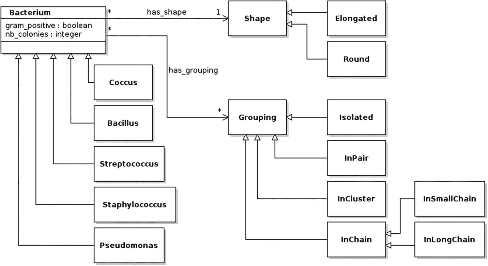

图 3-2

细菌本体的 UML 类图

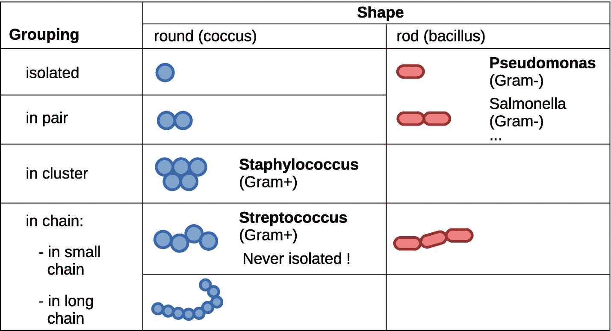

图 3-1

根据三个标准对细菌进行简单分类

图 [3-2](#Fig2) 给出了 UML(统一建模语言)中的类图。然而，请注意，本体允许表示比类图上显示的更多的信息。例如，(实际上)所有聚集成簇的圆形革兰氏阳性细菌都是葡萄球菌。因此，对于这种细菌，有可能推断出细菌的种类、形状、类群和革兰氏状态。相反，假单胞菌不是唯一的杆状、孤立或成对的细菌。这是一个重要的区别，因为它会影响自动推理；然而，一个“经典”的对象模型(比如 Python 见 2.9)不允许将其考虑在内。

在本章的开始，我们将本体定义为“尽可能独立于预期的应用”。例如，细菌的本体可以有多种应用，例如:

*   创建一个描述不同细菌特性的百科网站(见 4.12)

*   促进细菌信息的输入或提取(见 5.14)

*   帮助识别未知细菌(见 7.7)

*   用关于细菌的信息丰富已经存在的本体或资源，如 UMLS(见 9.10)

*   通过允许相似细菌的分组来促进医院中的统计研究(以回答诸如“上个月厌氧菌感染的数量增加了吗？”)

这些应用中的每一个都可以通过特定的知识库来实现。例如，可以使用由如下规则组成的知识库来识别细菌:

*   如果 shape = round，grouping = in cluster，gram = '+'

*   然后是葡萄球菌

然而，一个本体能够实现来自同一知识源的**所有**这些应用，这极大地方便了这些知识的维护和重用。

在接下来的几节中，我们将使用 Protégé editor 从这种细菌分类中构建一个(小的)形式本体。

## 3.4 创建新的本体

当您启动 Protégé editor 时，它会自动创建一个新的空本体。编辑器包括几个选项卡；默认情况下，会显示活动的本体选项卡。

在这个选项卡中，我们将定义我们的本体的 IRI。IRI 是本体的“名称”，这个名称采用互联网地址的形式。但是，请注意，IRI 必须是互联网地址的形式，但是本体不需要在互联网上的这个地址可用！因此，通常创建其 IRI 以“[`http://www.semanticweb.org/`](http://www.semanticweb.org/%25E2%2580%259D)或“[`http://www.test.org/`](http://www.test.org/%25E2%2580%259D)开头的本体，而不拥有这些互联网域名的权利。

我们将称我们的细菌为本体论:

*   [T2`http://lesfleursdunormal.fr/static/_downloads/bacteria.owl`](http://lesfleursdunormal.fr/static/_downloads/bacteria.owl)

(注意:这个互联网地址指向我的个人网站，在那里你实际上可以下载完整的本体)。您可以在 Protégé的“本体 IRI”字段中输入这个 IRI，如下图所示:

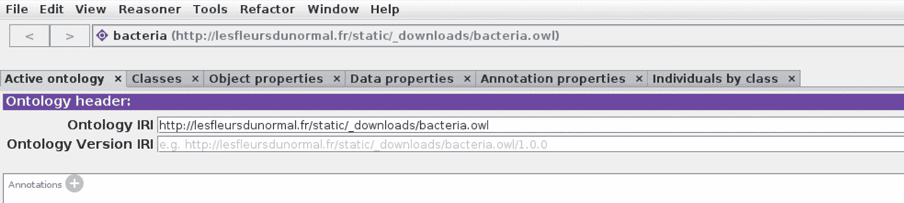

然后，您可以将本体以 RDF/XML 格式保存在一个名为“bacteria.owl”的文件中。此后，不要忘记在编辑期间定期保存本体。

### 3.4.1 类别

在 Protégé中,“Classes”选项卡允许您浏览现有的类并创建新的类。按钮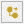和允许您分别创建所选类的新的子类或姐妹类。使用这些按钮，我们可以创建一个与我们先前的 UML 模型相对应的类层次结构，如下面的屏幕截图所示:

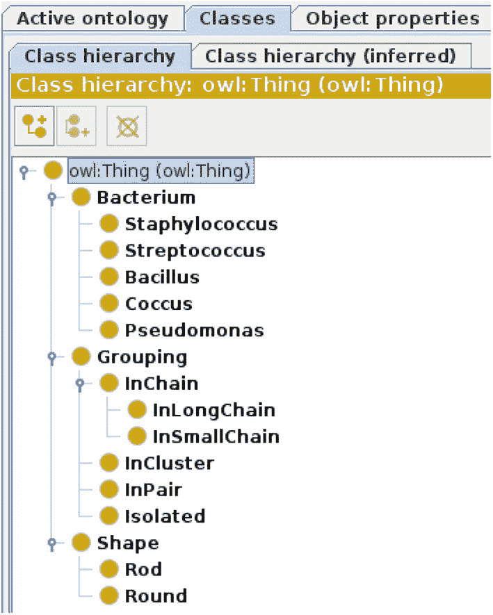

在本体论中，遗传也被称为“是一种关系”:例如，我们可以说一个假单胞菌*是一个*细菌。

### 分离

本体和对象模型的一个重要区别如下:在本体中，一个个体可以属于*几个*类。因此，一个给定的形状很可能是既圆又棒的*！开放世界假设允许这种类型的解释:任何没有被正式禁止的事情都被认为是可能的。*

在我们的细菌本体论中，我们想要禁止这一点:给定的形状要么是圆形，要么是杆状，但不能同时是两者。为此，我们必须将 Round 和 Rod 这两个类声明为*不相交的*。两个不相交的类不能有共同的个体。

不相交的类在“类”选项卡的“描述”面板中声明。我们将选择杆类，然后单击“Disjoint with”部分右侧的“+”按钮，并在对话框的“Class hierarchy”选项卡中选择圆形类。您应该会得到以下结果:

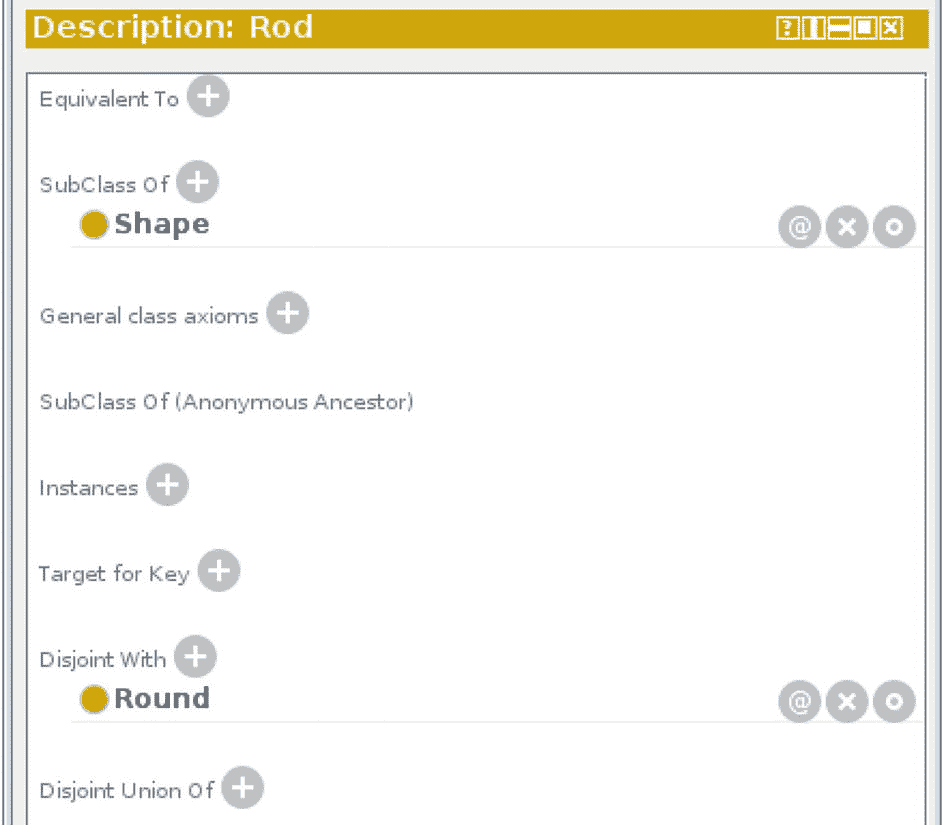

这两个类现在是不相交的。注意，没有必要声明第二个类(圆)与第一个类(圆)不相交:这是从前面的声明中自动推导出来的。

同样，必须声明 InSmallChain 类与 InLongChain 类不相交。

Isolated、InPair、InCluster 和 InChain 类必须声明为 *pairwise disjoint* :也就是说，由这个列表中的两个类组成的任何对都是不相交的。为此，只需选择其中一个类(例如，隔离)，单击“Disjoint with”右侧的“+”按钮，并同时选择其他三个类(通过按下控制键，而不是单击三次“+”按钮！).结果应该如下所示:

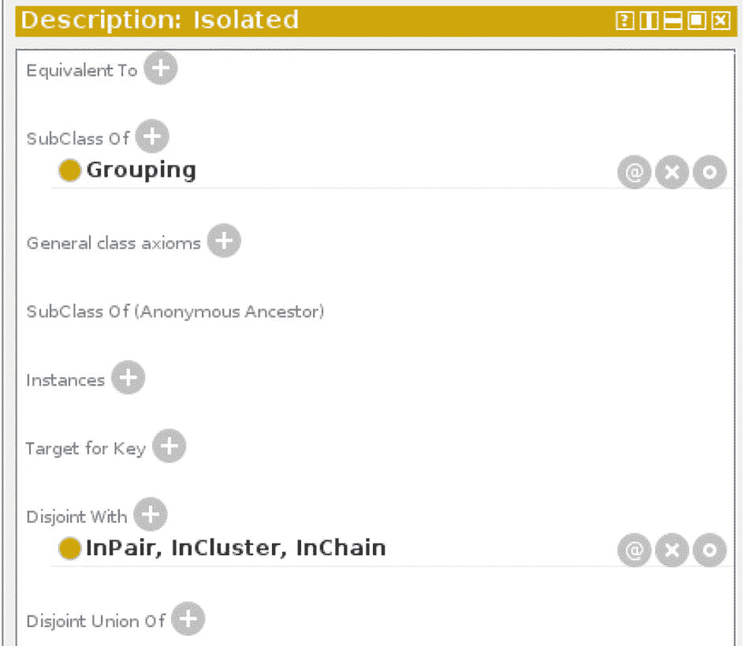

注意，关于分组的亚类，不相交并不意味着给定的细菌不能用两个不同的分组来观察(例如，分离的或成对的，如假单胞菌)。分离仅仅意味着一个给定的类群不能既是孤立的又是成对的，但它并不禁止一个细菌有两个不同的类群，一个类群是孤立的，另一个类群是成对的。

同样，类细菌、形状和分组必须声明为不相交的:例如，一个几何形状不能与一个细菌是同一个东西！这对人类来说似乎是显而易见的，但请记住，对机器来说并非如此。本体寻求全面地形式化知识，包括最明显的知识。

### 3.4.3 分区

我们已经定义了两类形状，圆形和杆形，它们现在是不相交的。然而，我们没有排除其他形状的存在，例如三角形。同样，开放世界假设使这种解释成为可能。然而，细菌只有两种可能的形状:圆形或杆状。我们必须声明所有的形状不是圆的就是棒的:它是一个分区(我们将说圆和棒的类构成了类形状的一个分区)。

为此，我们选择 Shape 类，并在“描述”面板中，单击“子类”右侧的“+”。这个“+”按钮允许您向类中添加超类；这些可以是命名类，也可以是 OWL 逻辑构造函数，就像这里。在出现的对话框中，我们选择“类表达式编辑器”选项卡，并输入构造函数“Round 或 Rod”。您应该获得以下结果:

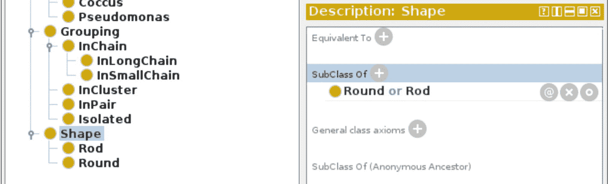

这个构造函数“or”允许两个类用一个逻辑“or”链接起来(当我们用集合逻辑思考时，也称为 *union* )。这意味着 Shape 类是 Rod 和 Round 类的并集的子类。因此，现在任何形状不是圆形就是杆状，因此没有其他可能的形状。

同样，我们必须划分 in chain(“in small chain 或 InLongChain”的子类)和 Grouping(“Isolated or in pair or InCluster or in chain”的子类)。

### 数据属性

我们现在将处理属性。在本体中，与面向对象编程不同，属性是独立于类定义的。OWL 考虑了三类属性:值为数据的数据属性(数字、文本、日期、布尔值等。)、其值是实体(即本体个体)的对象属性，以及不干预语义或推理并因此可以无限制地混合数据和实体的注释属性。

在 Protégé中,“数据属性”选项卡允许您创建数据属性。OWL 除了支持类之间的继承，还支持属性之间的继承；但是，我们不会在这里使用它。使用和按钮，其工作方式类似于类的按钮，我们将创建两个名为“gram_positive”和“nb_colonies”的新数据属性。最后一个属性对于描述细菌来说并不是很有用，但是它可以作为数值数据属性的一个例子。

您应该会得到以下结果:

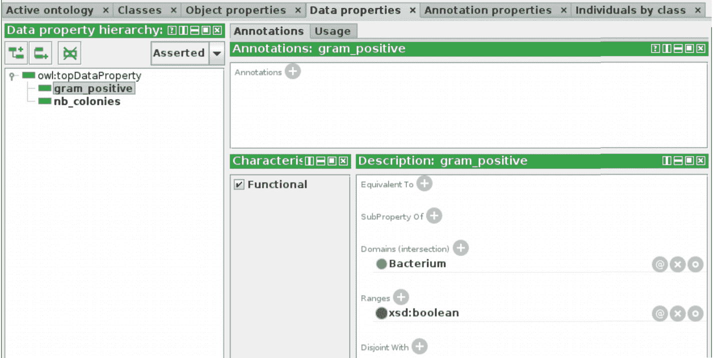

可以通过指定以下内容来配置每个数据属性:

*   its*domain*(protégé中的“Domains (intersection)”):这是为其定义属性的类。

*   它的*范围*(“范围”):这是相关的数据类型。它可以是整数或实数、布尔值、字符串、日期等等。请注意:为了以后使用 Python 和 Owlready，最好使用 integer 类型表示整数，decimal 类型表示实数(更多信息请参考表 [4-1](04.html#Tab1) )。注意，OWL 属性的范围与 Python `range()`函数无关，Python 函数允许你创建数字列表(见 2.6)。

*   它的*功能性*状态(“功能性”复选框):当属性是功能性的时，给定的个人对于该属性只能有(最多)一个值。相反，如果属性不是功能性的，一个给定的个体可以有几个值。

域和范围是可选的。可以定义几个域和范围；然而，考虑的是不同域/范围的**交集**，而不是它们的联合，这通常不是期望的结果。例如，考虑属性“has_shape”和两个类(细菌和病毒),其中个体可以具有形状。如果我们定义两个域，细菌和病毒，只有属于*细菌类和病毒类的个体才能有形状！如果有人想说所有的病毒和所有的细菌都可能有一个形状，有必要将这个域定义为类的*联合*，也就是说，“细菌或病毒”。*

这里，我们将如下配置我们的两个数据属性:

*   革兰氏阳性:功能性(勾选方框)，域:细菌，范围:布尔

*   nb _ 菌落:功能性(打勾)，域:细菌，范围:整数

### 对象属性

在 Protégé中,“对象属性”选项卡允许您创建对象属性。使用和按钮，我们创建了四个名为“has_shape”、“has_grouping”、“is_shape_of”和“is_grouping_of”的新对象属性，如下图所示:

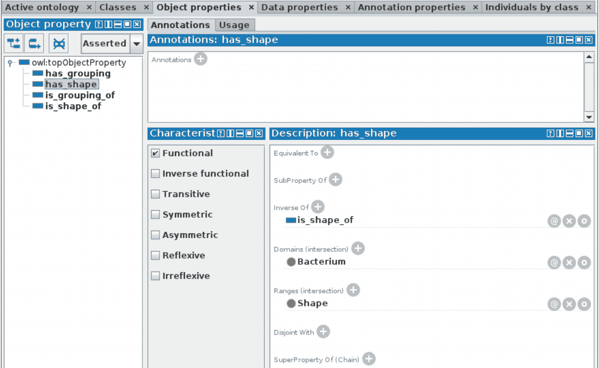

可以通过指定以下内容来配置每个对象属性:

*   its*domain*(protégé中的“Domains (intersection)”):这是为其定义属性的类。

*   其*范围*(“范围(交集)”):这是关联对象的类。

如前所述，如果指示了几个域或范围，则考虑它们的交集。

*   其*逆属性*(“的逆”):逆属性对应于当该属性被反向读取时存在的关系；如果属性存在于 A 和 B 之间，则它的逆属性存在于 B 和 A 之间。例如，属性“is_shape_of”是“has_shape”的逆属性:如果细菌 X 具有形状 A，则 A 是 X 的形状。这些逆属性在 Python 中使用关系 has_shape/is_shape_of 双向导航时非常有用。

*   它的*功能性*状态(“功能性”复选框):当属性是功能性的时，给定的个人对于该属性只能有(最多)一个值。相反，如果属性不是功能性的，一个给定的个体可以有几个值。

*   其*逆功能*状态(“逆功能”复选框):如果逆属性是功能性的，则该属性是逆功能性的。例如，属性 is_father_of 是反函数:一个男人 A 可以是几个孩子 B、C、D 等等的父亲，但是对于这些孩子中的每一个，A 都是他们唯一的父亲。

*   它的*可传递的*状态(“可传递的”复选框):如果一个属性可以“链接”到几个对象上，那么这个属性就是可传递的。例如，性质“is _ larger _ than”是传递性的:如果个体 A 大于 B，如果 B 本身大于 C，那么我们可以推导出 A 大于 C。

*   它的*对称*状态(“对称”复选框):一个属性是对称的，如果它可以在两个方向上被无差别地读取(因此它是它自己的逆)。例如，属性“is_married_to”是对称的:如果人 A 与人 B 结婚，则 B 与 A 结婚。

*   它的*非对称*状态(“非对称”复选框):如果一个属性从来不是对称的，那么它就是非对称的。例如，属性“has_father”是非对称的:如果 A 对父亲 B 有，那么 B 不可能对父亲 A 有。

*   它的*自反*状态(“自反”复选框):如果一个属性总是应用于任何对象和它自身之间，那么它就是自反的。例如，属性“知道”是反身的:每个人 X 知道他自己。

*   它的*非自反*状态(“非自反”复选框):如果一个属性从不自反，那么它就是非自反的。例如，属性“is_married_to”是非反射性的:一个人不能与他/她自己结婚。

这里，我们将按如下方式配置对象属性:

*   has_shape:功能性(勾选方框)，域:细菌，范围:形状

*   has_grouping:无功能(不要勾选该框)，域:细菌，范围:分组

*   is_shape_of:无功能，域:形式，范围:细菌，逆:has_shape

*   is_grouping of:无功能，域:分组，范围:细菌，反向:has_grouping

注意，只定义对的两个属性中的一个属性的逆属性就足够了:比如这里，我们不需要指定 has _ shape has for inverse is _ shape _ of。这很容易从 is_shape_of 的逆性质推导出来。

### 限制

现在我们已经创建了属性，我们可以返回到类并基于这些属性添加限制。

通过单击“描述”部分中“子类”右侧的“+”按钮，可以在 Protégé的“类别”选项卡中添加限制。“子类化”允许你添加超类到类中；它可以是之前创建的 OWL 命名的类，也可以是构造函数，比如分区(见 3.4.3)和限制。

例如，假单胞菌具有革兰氏阴性染色。这导致 OWL 受到以下限制:布尔属性“gram_positive”必须具有 false 值。这种限制相当于一个类别:它是“革兰氏阳性”属性值为假的细菌类别。因此，我们可以将假单胞菌类定义为这个限制类的一个亚类。

OWL 提供了几类限制。以下限制用于模拟两个类之间的关系:

*   存在限制( *some* ):它代表了与属于某一类的个人在某一属性上至少有一种关系的那一类个人。

这个限制写在 Protégé的“property **some** class”中。例如，我们已经看到(图 [3-1](#Fig1) )假单胞菌都是杆状的。rod 是一个类，这意味着 Rod 形状可能有几个子类型(例如，我们可以区分规则和不规则的 Rod 形状)。因此，这个限制将被写成“具有 _ 形状某个杆”。

*   基数限制(*确切地说是*、*最小*、*最大*):它表示某个属性与某个属于某个类的个体有一定数量关系的个体的类。该数字可以是精确值(*精确值*)或最小值(*最小值*)或最大值(*最大值*)。

这些限制写在被保护人的“财产**确切地说是**数量级”、“财产**最小**数量级”或“财产**最大**数量级”。它是存在性限制的一个更具体的版本:存在性限制等价于基数“min 1”的限制。

*   普遍限制( *only* ):代表与属于某一类(包括其子类)的一个(或多个)个体只有某一属性关系的个体的类。

这个限制在 Protégé中被写成“property **only** class”。例如，观察到假单胞菌仅具有杆状，我们将写为“仅具有杆状”。

注意不要将通用限制“仅具有杆的形状”与之前的存在限制“具有杆的形状”相混淆。存在限制说明所有假单胞菌至少有一个杆状，而普遍限制说明所有假单胞菌除杆状外没有其他形状。将两个相似的限制(一个是普遍性的，另一个是存在性的)与同一个目标类结合起来是很常见的。

另一方面，我们不会对分组使用一个通用的限制，因为我们以前已经看到，细菌偶尔可以呈现不同于其典型分组的其他分组。

以下限制使得对类和个体或数据类型值之间的关系建模成为可能:

*   价值限制( *value* ，有时被称为*角色填充*):它代表对某个属性具有某个价值的个人的类别。

这个限制被写成 Protégé中的“属性**值**个体/数据类型”。例如，假单胞菌总是与革兰氏阴性染色有关。这个限制将被写成“gram_positive value false”。

要在 Protégé中添加限制，单击“+”按钮后，您可以:

*   在“类表达式编辑器”选项卡中手动输入限制(提示:制表键允许您完成部分输入，例如，“Bact”代表“细菌”)，

*   或者使用“对象限制创建者”或“数据限制创建者”选项卡(取决于属性的类型)并从下拉列表中选择值。

为了进一步描述假单胞菌类，我们将增加以下限制:

*   “有 _ 形一些杆”

*   "只有形状的杆"

*   [1](#Fn1) 的【克 _ 正值假】

请注意，我们对形状使用了一个存在性和一个普遍性限制，因为 Rod 是一个类，而不是一个个体或数据，相反，对 Gram 着色使用了值限制，因为 false 是一个数据类型值。

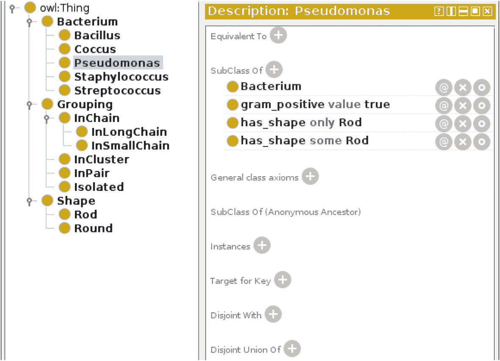

### 并集、交集和补集

OWL 还允许使用逻辑操作符作为构造函数。这些运算符有不同的名称，这取决于它们是从逻辑观点还是从集合论观点来考虑；但是，确实是一回事。有三种运算符可用:

*   **逻辑 AND** or 交集:这些是同时属于几个类的个体。

该交叉点在 Protégé中写为“class1 **和** class2”。当然，更多的类别可以包含在交集中，例如，“类别 1 **和**类别 2 **和**类别 3”。

*   逻辑 OR 或 union:这些个体属于几个类中的一个类。

在 Protégé中，union 被写成“class1 **或** class2”。同样，工会也不限于两类，例如，“一类**或**二类**或**三类”。例如，假单胞菌可分为两类:分离的和成对的。因此，我们可以建立这两个类的并集，这将写成“孤立的或成对的”。

此外，我们之前已经使用了并集来表示分区(参见 3.4.3)。

*   逻辑非或补语:这些人不属于某一特定的阶层。补语在 Protégé中写的是“**而不是**类”。

OWL 还允许您通过将括号中的不同元素分组，将逻辑运算符与限制和类结合起来。

为了细化假单胞菌类，我们将添加以下超类:

*   " has_grouping 一些(孤立的或成对的)"

这一限制规定所有假单胞菌至少有一个分离的或成对的类群。

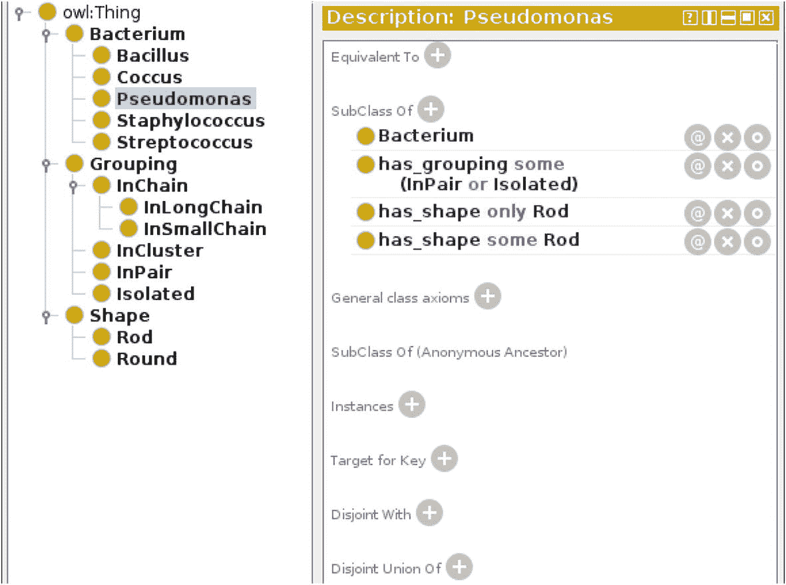

### 3.4.8 定义(相当于关系)

在前两节中，我们使用了限制和构造函数来描述类的属性。然而，这不是一个正式意义上的定义，因为我们还没有完整和唯一地描述这个类。比如所有的假单胞菌都是杆状的，但不是所有杆状的细菌都是假单胞菌！

OWL 允许你给一个类一个形式上的等价定义，*通过*一个等价关系。然后，定义的类允许在自动推理过程中对个体进行重新分类(我们将在 3.5 节和第 7 章[中看到)。](07.html)

例如，球菌类是具有圆形形状的细菌类(即，至少一个圆形形状且只有一个圆形形状)。因此，我们可以将其定义如下:

*   球菌:“细菌和(形状有些圆)

和(仅具有 _shape 圆形)"

注意，与我们之前作为假单胞菌的超类使用的限制和构造函数不同，等价类必须“在一块”定义。除非我们完全改变它的意思，否则我们不能把这个定义分成三个部分“细菌”、“有一些圆形”和“只有圆形”!

要在 Protégé中添加限制，请单击“等效于”右侧的“+”按钮，然后在“类表达式编辑器”选项卡中手动输入限制(同样，您可以使用制表键完成)。

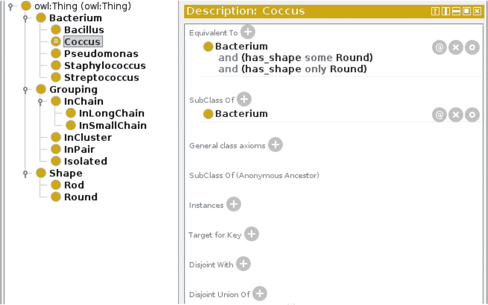

Protégé用不同的图标标记已定义的类:一个棕色的圆圈，圆圈中出现符号“≡在描述逻辑中表示“等价于”。

同样，我们将杆菌、葡萄球菌和链球菌分类定义如下:

*   芽孢杆菌:“细菌和(有 _ 形状的一些杆)

和(has_shape only 杆)”

*   葡萄球菌:“细菌和(形状有些圆)

和(仅具有圆形形状)

和(有 _ 分组一些包含者)

and (gram_positive value true)"

*   链球菌:“细菌和(形状有些圆)

和(仅具有圆形形状)

和(has_grouping some InSmallChain)

and(仅 has_grouping(非隔离))

and (gram_positive value true)"

对于链球菌，限制条件“仅具有分组(非分离的)”表示链球菌只能具有非分离的分组:从未观察到分离的。

### 个人

Protégé的“个人”选项卡允许您浏览个人并创建新的个人。为了测试我们的本体，我们将创建几个个体。为此，在“类层次结构”面板中选择类，然后单击“成员列表”面板中的按钮(该面板列出了属于该类的个人)。我们将首先选择 Round 类并创建一个名为“round1”的形状，如下图所示:

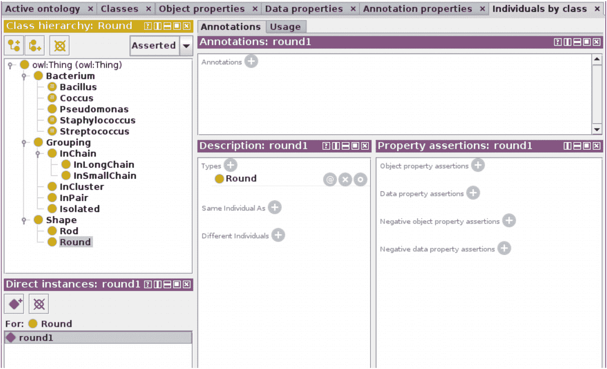

同样，我们创建一个名为“in_cluster1”的个体，它属于“InCluster”类。

然后，我们创建一个名为“未知 _ 细菌”的个体，属于“细菌”类。最后，在“属性断言”面板中，我们通过单击“对象属性断言”和“数据属性断言”右侧的“+”按钮来输入此人的关系。我们将输入以下关系:

*   对象属性:
    *   has_shape:圆形 1

    *   散列分组:in_cluster1

*   数据属性:
    *   革兰氏阳性:是

    *   nb _ 菌落数:6

下面的屏幕截图显示了预期的结果:

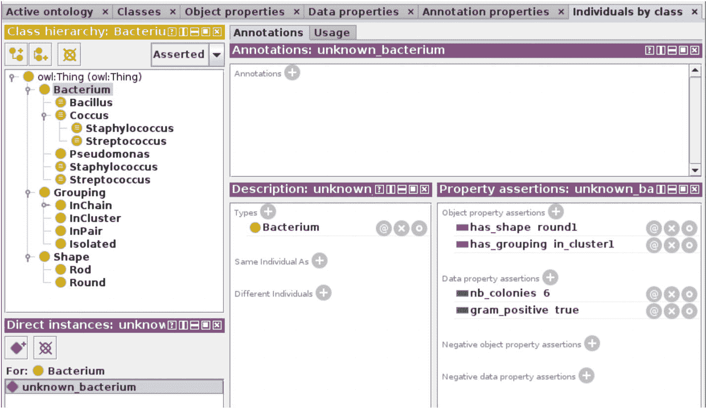

### 其他结构

OWL 和 Protégé还提供了其他不常用的构造函数。

*   一组个体(也称为中的*)允许创建一个仅限于一组个体的类。它写在大括号之间:“{个人 1，个人 2，...}".它还可以用来将一个个体转换成一个类(也称为 *singleton* 类，因为它只有一个实例/个体)，如下:“{个体}”。*

*   一个属性的**逆**写成“逆(属性)”。比如“逆(has_shape)”就相当于我们细菌本体中的“is_shape_of”。当本体没有定义命名逆属性时，这个构造函数特别有用。

*   属性链写为“property1 o property2”(圆圈对应小写字母“o”)。它们也被称为属性*组合*。它们使得“链”几个属性成为可能，例如，“是形状或分组”直接从一种形状传递到具有这种形状的细菌分组。

## 3.5 自动推理

现在我们的细菌本体已经准备好了！

为了验证本体中不存在不一致并测试自动推理，我们可以使用“推理机➤启动推理机”菜单来执行自动推理机。几个推理机是可用的；我推荐用隐士。

一旦推理完成，个人就被重新归类为受保护者。例如，我们创建的个体“未知细菌”属于细菌类。我们可以看到它被重新分类为一个新类别:葡萄球菌(新类别出现在 Protégé的黄色背景上)。事实上，这种细菌满足葡萄球菌的条件(圆形，成簇，革兰氏阳性)。

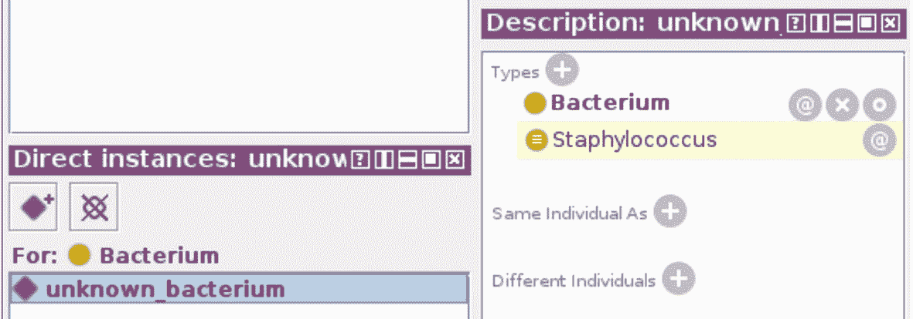

此外，推理机还重组了类。为了观察这一点，我们将返回到 Classes 选项卡并单击“类层次结构(推断)”。类别树已被更改。例如，我们可以看到假单胞菌类被重新归类为芽孢杆菌类的一个子类。事实上，该类的所有个体都满足芽孢杆菌类的定义，因为假单胞菌属都具有杆状。

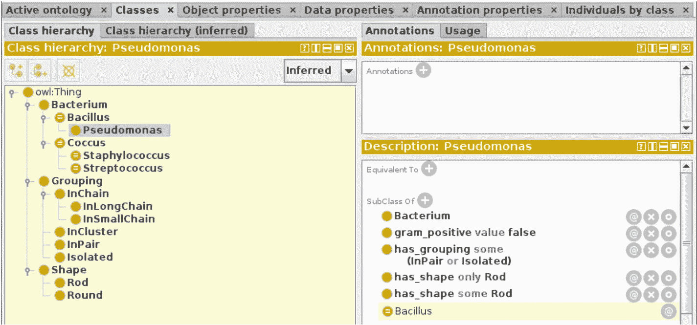

你也可以尝试以下两种体验:

1.  创建一个细菌类个体，呈杆状，成对分组和/或隔离，革兰氏阴性状态。该个体将被重新分类为杆菌类，而不是假单胞菌类。事实上，我们还没有给出假单胞菌类的正式定义；推理者因此不能推断这种细菌是假单胞菌。在设计本体时，缺乏定义是一个理想的选择，因为假单胞菌不是唯一具有杆状、分离或成对的革兰氏阴性细菌(见图 [3-1](#Fig1) )。

2.  创建一个细菌类的个体，具有圆形形状，以小链分组，并且具有革兰氏阳性状态。该个体将被重新分类为球菌类，而不是链球菌类。但是，这个类确实包含了一个定义！然而，我们刚刚创建的个体并不完全符合链球菌类的定义。

    事实上，在定义中，我们指明了“仅 has_grouping(非孤立)”。在个体中，我们指出了一个小的连锁群；但是，属性“has_grouping”不起作用，因此可能有几个值。开放世界的假设意味着推理者不能排除另一个群体的存在，这个群体在本体论中没有提到，但可能是孤立的。

    因此，为了能够推断出我们的个体是链球菌，有必要在本体中指出该个体除了那些明确提到的分组之外没有其他分组，或者他没有分离的类的分组。

    另一方面，在正式定义中，我们还对“has_shape”属性使用了通用约束(“only”)。然而，这并不妨碍将个体分为球菌、杆菌和葡萄球菌类。为什么呢？因为该属性是功能性的，并且 Round 和 Rod 类是不相交的。因此，当细菌呈杆状时，它不可能呈圆形，反之亦然。相反，属性“has_grouping”不起作用，因此这种推理不再可能。

    我们将回到这个问题，解决方案将在 7.3 中提供。

## 3.6 建模练习

这里有一些练习来训练你进行本体建模:

1.  在细菌本体中，添加一个棒状的葡萄球菌类个体。运行推理器；你观察到了什么？

2.  使用 Protégé editor，通过添加过氧化氢酶测试来扩展细菌的本体。这种生物测试有助于识别细菌，其结果可以是阳性或阴性。过氧化氢酶试验对葡萄球菌和假单胞菌呈阳性，对链球菌呈阴性。

3.  使用 Protégé editor，通过添加细菌的颜色来扩展细菌本体。葡萄球菌是白色或金黄色的(这就是著名的*金黄色葡萄球菌*)，链球菌是半透明的，假单胞菌一般是有色的(也就是说不是白色的)。

4.  使用 Protégé editor，添加一类新的细菌:*麻风分枝杆菌*(汉森氏杆菌，导致麻风病)。这种细菌呈革兰氏阳性，杆状，成对分离或聚集。过氧化氢酶试验与这种细菌无关，因为它很难在体外生长。颜色是黄色的。最后，所有这些特征足以识别细菌。

5.  在 Protégé编辑器中，添加一个细菌类个体，杆状，孤立，颜色为黄色。检查该个体是否被正确归类为*麻风分枝杆菌*。

6.  在细菌本体论中，在细菌的不同亚类(葡萄球菌、链球菌、假单胞菌等)之间增加一个分界点。).这是否改变了对未知细菌的推理结果？

7.  进行 OWL 本体论以构建药物相互作用。该本体旨在使用推理机自动检测医生处方中的交互。开放世界假设会在推理过程中造成问题吗？

8.  使用 Protégé editor，构建一个描述书籍、作者和编辑的本体。你从 2.9 中的对象模型中获得灵感。

## 3.7 摘要

在这一章中，我们通过一个简单的细菌本体的例子介绍了 OWL 本体和 Protégé editor 的使用。我们已经看到了主要的 OWL 构造，也看到了一些经常遇到的困难，比如那些与开放世界假设相关的困难。

<aside aria-label="Footnotes" class="FootnoteSection" epub:type="footnotes">Footnotes [1](#Fn1_source)

注意，在 OWL 中，false 和 true 是不用大写字母写的，而在 Python 中是用(即 False 和 True；参见 2.4.2)。

 </aside>