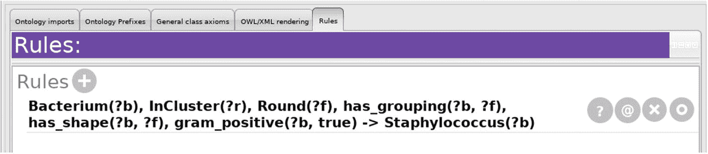
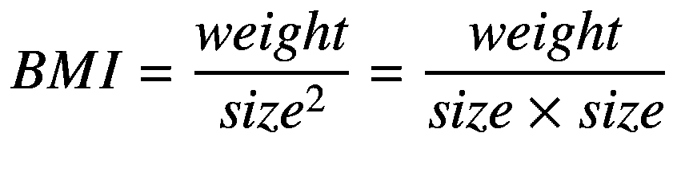
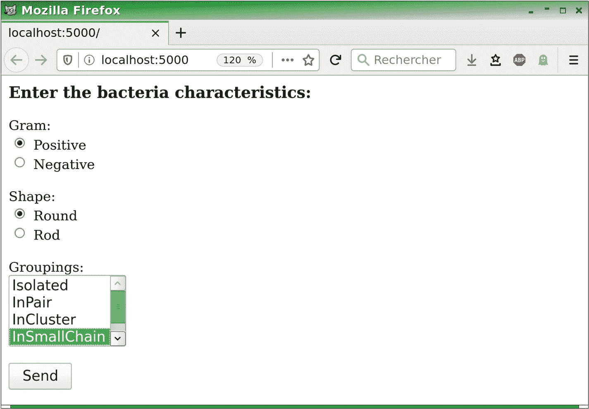

# 七、自动推理

在这一章中，我们将看到如何在 Python 中使用 HermiT 和 Pellet 推理机，以便检查本体的一致性，并基于逻辑构造器执行自动推理和分类。

## 7.1 分离

Owlready 允许使用 AllDisjoint 类在类之间创建分离。例如，我们可以将类 Isolated、InPair、InCluster 和 InChain 声明为成对分离，如下所示:

```py
>>> from owlready2 import *
>>> onto = get_ontology("bacteria.owl").load()

>>> AllDisjoint([onto.Isolated, onto.InPair, onto.InCluster,
... onto.InChain])

```

注意，Owlready 和 Protégé一样，不区分两个实体之间的分离和几个实体之间的成对分离，这与 OWL 不同。Owlready 会根据不相交中涉及的实体数量自动选择正确的 OWL 方法。此外，AllDisjoint 还可以处理属性列表(不相交的属性)或个体列表(不同的个体)。

使用`disjoints()`方法可以找到一个类所属的所有不相交部分。它返回一个生成器来列出涉及给定实体的所有 AllDisjoints。然后，AllDisjoint 的`entities`属性使得获得声明为 Disjoint 的实体列表成为可能。

## 7.2 用开放世界假设进行推理

`sync_reasoner()`功能允许您运行推理器，并自动将推导出的事实应用到 quadstore。默认情况下，使用隐士推理器。`sync_reasoner_pellet()`和`sync_reasoner_hermit()`函数用于指定推理机；Pellet 和隐士在 Owlready 中的工作方式是一样的。

注意:HermiT 和 Pellet 是 Java 程序，所以您需要安装一个 Java 虚拟机来使用它们。如果你没有 Java，你可以从 [`www.java.com/`](https://www.java.com/) (对于 Windows 和 Mac OS)或者从你的 Linux 发行版的包(对于 Java Runtime Environment 和 Java Development Kit，这些包通常被命名为“jre”或“jdk”)安装它。另一方面，推理器本身已经准备好了。如果 Java 安装在非标准目录中(尤其是在 Windows 上)，可以按如下方式输入 Java 的路径(用您的路径替换):

```py
import owlready2
owlready2.JAVA_EXE = "C:\\Program Files\\Java\\jre8\\bin\\↲java.exe"

```

举个例子，我们以细菌的本体为例，从检查个体“未知 _ 细菌”所属的类开始:

```py
>>> onto.unknown_bacterium.__class__
bacteria.Bacterium

```

然后我们运行推理器:

```py
>>> sync_reasoner()
* Owlready2 * Running HermiT...
    java [...]
* Owlready2 * HermiT took 0.5354642868041992 seconds
* Owlready * Reparenting bacteria.unknown_bacterium [...]

```

默认情况下，Owlready 会显示推理器的命令行和执行的重新分类(参数`debug = 0`可以避免显示)。

这里，我们注意到，单个“未知细菌”已被重新分类为葡萄球菌类，就像它在被保护生物中一样:

```py
>>> onto.unknown_bacterium.__class__
bacteria.Staphylococcus

```

推理机推导出的事实默认存储在本体“`http://inferrences` /”中。可以通过使用“with:...”将它们放在另一个本体中块，如下例所示:

```py
>>> onto_inferences = get_ontology("http://lesfleursdunormal.↲fr/
static/_downloads/bacteria_inferences.owl#")
>>> with onto_inferences:
...     sync_reasoner()

```

这个本体包含了推论；然后可以保存(见 5.11):

```py
>>> onto_inferences.save("bacteria_inferences.owl")

```

推理因此可以从本体“细菌 _ 推理. owl”加载。这将避免再次调用推理器，从而节省时间。

Owlready 还允许您通过向`sync_reasoner()`函数传递一个本体列表，将推理限制到某些本体:

```py
>>> sync_reasoner([onto])

```

最后，可选参数`infer_property_values`和`infer_data_property_values`(仅由颗粒推理器支持)使得推断个体的属性值成为可能(对于两个选项，分别为对象属性和数据属性):

```py
>>> sync_reasoner(infer_property_values = True)
>>> sync_reasoner_pellet(infer_data_property_values = True)

```

这两个选项也可以同时使用:

```py
>>> sync_reasoner_pellet(infer_property_values = True,
...                      infer_data_property_values = True)

```

## 7.3 封闭世界或局部封闭世界中的推理

OWL 推理器根据*开放世界假设*运行:任何不被禁止的事情都被认为是可能的(见 3.5 节)。然而，通常希望将推理局限于已知的事实，对于整个本体或者仅仅对于某些实体。这被称为“在一个封闭的世界中”的推理，或者有时被称为“否定即失败”:也就是说，没有明确知道的一切都被认为是假的。

在 Owlready 中，`close_world()`函数允许“封闭世界”,并将推理限制于本体中存在的事实，对于个人、类或在争论中传递的本体。这个函数以构造函数的形式自动添加必要的约束。当所有的本体都是封闭的时候，我们说“在封闭的世界中推理”，当只有一些实体是封闭的时候，我们说“在局部封闭的世界中推理”。

我们已经在第 3 章 [3](03.html) 中遇到了链球菌类的“开放或封闭世界”的问题(见 3.5 节末尾的第 2 点):一个圆形细菌，成链分组，革兰氏染色阳性，被归类为球菌，但不被归类为链球菌，因为推理者无法证明没有其他分组(未知，因此在本体中不存在)是分离的类型。

在以下示例中，我们创建了符合上述标准的 unknown_bacterium2:

```py
>>> with onto:
...     unknown_bacterium2 = onto.Bacterium(
...               gram_positive = True,
...               has_shape     = onto.Round(),
...               has_grouping  = [onto.InSmallChain()] )

```

由于前面解释的原因，当推理机被执行时，细菌被重新分类到球菌类中，而不是链球菌类中:

```py
>>> sync_reasoner()
>>> unknown_bacterium2.__class__
bacteria.Coccus

```

事实上，尽管这种细菌只有一个小的链群，推理者在一个开放的世界中工作。他假设可能存在另一种类型的分组，但这是未知的(has_grouping 属性不起作用；因此，对于同一个人，它可以有几个值)。然而，我们将链球菌类定义为没有独立的类群。在这里，未知细菌 2 没有一个独立的类群，但是我们可以假设这样一个类群是存在的。

要禁止这个假设，解决我们的问题，就必须“封闭世界”，也就是说，当我们说这个细菌在一个小链条上有一个分组的时候，它必然有这个分组，除了这个之外，它没有别的分组。`close_world()`函数实现了这一点，如下例所示:

```py
>>> close_world(unknown_bacterium2)
>>> unknown_bacterium2.is_a
[bacteria.Coccus,
 bacteria.has_grouping.only(OneOf([bacteria.insmallchain1]))]

```

我们注意到`close_world()`给个体增加了一个普遍的限制(即 *only* ):这个限制表明该细菌只有 SmallChain1 中的分组。注意`close_world()`没有为属性“gram_positive”和“has_shape”添加任何限制，因为它们是功能性的:每个属性只能有一个值，因此不需要关闭。

现在，如果我们再次运行推理器，我们会发现这种细菌被很好地归类为链球菌:

```py
>>> sync_reasoner()
>>> unknown_bacterium2.__class__
bacteria.Streptococcus

```

类似地，`close_world()`函数可以用来关闭整个类或本体。该函数的完整语法如下:

```py
close_world(entity, Properties = None, close_instance_list =↲ True, recursive = True)

```

`entity`是封闭世界中要考虑的实体。`Properties`是要考虑的属性列表(如果值是`None`，这是默认值，所有属性都将被关闭)。如果`close_instance_list`是`True`(缺省值)，封闭类(或多个类)的实例被限制为在本体中断言的实例。当要关闭的实体是一个类时，如果 recursive 是`True`(默认值)，那么`close_world()`将递归应用于所有的子类。

## 7.4 不一致的类和不一致的本体

在推理过程中，推理器可能会检测到不一致的类。这些类别是不合逻辑的，因此，不应该有个人属于这些类别。例如，在我们的细菌本体中，从链球菌类继承并与杆状形式( *via* a restriction)相关联的以下类将是不一致的:

```py
>>> with onto:
...     class RodStreptococcus(onto.Streptococcus):
...         is_a = [onto.has_shape.some(onto.Rod)]

```

只要没有属于这个阶层的个体，这就不是问题。推理器将不一致的类重新分类为等价于`Nothing`。因此，可以通过测试`Nothing`是否是等价类来测试 Python 中的类是否不一致，例如，为了检查 RodStreptococcus 类是否一致，我们可以这样做:

```py
>>> sync_reasoner()

>>> if Nothing in RodStreptococcus.equivalent_to:
...     print("The class is inconsistent!")
... else:
...     print("The class is consistent.")
The class is inconsistent!

```

此外，`default_world.inconsistent_classes()`方法提供了一个生成器来迭代所有不一致的类。

相反，当存在至少一个属于不一致类的个体时，整个本体变得不一致。一个不一致的本体包含一个逻辑问题，使它变得荒谬。任何关于本体论的推理都变得不可能。注意不要混淆不一致的类和不一致的本体！在第一种情况下，这并不妨碍推理者做他的工作，而在第二种情况下，推理变得不可能。

在本体不一致的情况下，`sync_reasoner()`函数引发异常`OwlReadyInconsistentOntologyError`。让我们继续前面的示例，创建一个 RodStreptococcus 类的个体:

```py
>>> rod_strepto = onto.RodStreptococcus()
>>> sync_reasoner()
Traceback (most recent call last):
  File "<stdin>", line 1, in <module>
  File "/home/jiba/src/owlready2/reasoning.py", line 120,↲
                                        in sync_reasoner_hermit
    raise OwlReadyInconsistentOntologyError()
owlready2.base.OwlReadyInconsistentOntologyError

```

这个异常可以在 Python 中捕获，如下所示:

```py
>>> try:
...     sync_reasoner()
...     print("Ok, the ontology is consistent.")
... except OwlReadyInconsistentOntologyError:
...     print("The ontology is inconsistent!")
The ontology is inconsistent!

```

随着“rod_strepto”个体的加入，细菌的本体变得不一致。按照现在的情况，我们不能再对 quadstore 进行推理，直到这种不一致性得到解决！这就是为什么我们要删除细菌的本体(添加了“rod_strepto”进行修改)，以便能够在本章的剩余部分继续使用推理器。

```py
>>> onto.destroy()

```

然后，我们可以在接下来的章节中从 OWL 文件中重新加载细菌本体(因此没有“rod_strepto”个体)。

## 7.5 对数字和字符串的限制和推理

`ConstrainedDatatype`类用于根据一个或多个方面创建受约束的数据类型，例如，正整数或至少三个字符的字符串。语法如下:

```py
ConstrainedDatatype(base_datatype, facet1 = value1, facet2 = value2,...)

```

`base_datatype`是初始数据类型，例如:`int`、`float`、`bool`、`str`、`norm_str`等等(见表 [4-1](04.html#Tab1) )。

以下方面由 XMLSchema 提出，并得到 Owlready 的支持:

*   对于数值类型:
    *   `max_inclusive`:最大值，包括在内(该值必须小于或等于给定值)

    *   `max_exclusive`:最大值，不包含(该值必须严格小于给定值)

    *   `min_inclusive`:最小值，包括在内(该值必须大于或等于给定值)

    *   `min_exclusive`:最小值，不包含(该值必须严格高于给定值)

    *   `total_digits`:存在的位数

    *   `fraction_digits`:小数点后的位数

*   对于字符串:
    *   `length`:准确的字符数

    *   `min_length`:最小字符数

    *   `max_length`:最大字符数

    *   `pattern`:约束字符串可能值的正则表达式

    *   `white_space`:表示如何处理空白，有三个可能的值:

        `* preserve`:空格按原样保留。

        `* replace`:所有空格(空格、制表、换行等。)被空格替换。

        `* collapse` : As replace，但是链的开头/结尾的空格被删除，连续的多个空格被替换为一个空格。

请注意 Owlready 允许刻面的定义，但是不考虑它们:例如，即使使用了`white_space`，空格也不会被替换。另一方面，其他工具可以考虑到这一点(包括推理器)。

例如，对于范围[0，20](包括 0，20)内的整数，我们将:

```py
>>> ConstrainedDatatype(int, min_inclusive = 0, max_inclusive = 20)

```

这些受约束的数据类型可以用在 OWL 限制中(*一些*和*仅*)，特别是表示“属性值大于/小于 X”形式的范围或限制。在这种情况下，Owlready 还提供了一个缩写符号“property > value”(或> =、<、< =)，它允许自动创建一个具有适当的受约束数据类型的存在性限制(“some”)。

下面的例子用一个`Person`类和两个`age`和`size`数字属性创建了一个本体。然后，我们创建了`Elderly`和`TallPerson`类，它们是使用对带有受约束数据类型的`age`和`size`属性的限制来定义的(对于第二个限制，我们使用了一个简化的符号来代替`size.some (ConstrainedDatatype (int, max_inclusive = 1.8))`)。

```py
>>> onto_person = get_ontology("http://test.org/person.owl#")

>>> with onto_person:
...     class Person(Thing): pass
...     class age (Person >> int  , FunctionalProperty): pass
...     class size(Person >> float, FunctionalProperty): pass

...     class Elderly(Person):
...       equivalent_to = [
...         Person & age.some(ConstrainedDatatype(int,
...                                       min_inclusive = 65))
...         ]
...     class TallPerson(Person):
...       equivalent_to = [
...         Person & (size >= 1.8) # Shortened notation
...         ]
...
...     p1 = Person(age = 25, size = 2.0)
...     p2 = Person(age = 39, size = 1.7)
...     p3 = Person(age = 65, size = 1.6)
...     p4 = Person(age = 71, size = 1.9)

```

注意，当将运算符“`&`”与前面的缩写符号组合用于交集时，有必要使用括号，因为在 Python 语言中，这些运算符之间的优先级顺序不对(在 Python 中，`&`优先于、< =、和> =)。这就是为什么在前面的例子中，我们用括号将“`size >= 1.8`”括起来写为“`Person & (size >= 1.8)`”。

然后，我们可以运行推理器，对我们创建的四个人进行重新分类:

```py
>>> sync_reasoner(onto_person)

```

最后，我们显示他们的新类(注意，个体`p4`现在属于两个类，即多重实例化，这在 OWL 中是允许的):

```py
>>> print("p1", p1.is_a)
p1 [person.TallPerson]

>>> print("p2", p2.is_a)
p2 [person.Person]

>>> print("p3", p3.is_a)
p3 [person.Elderly]

>>> print("p4", p4.is_a)
p4 [person.Elderly, person.TallPerson]

```

注意，在 Protégé中，如果您想要使用浮点值定义具有受约束数据类型的类，请记住 Owlready 默认情况下将“decimal”XML 模式数据类型与 Python 的浮点数相关联。因此，`TallPerson`类应该用被保护对象中的小数来定义:

```py
Person and (size some decimal[>= "1.8"^^decimal])

```

但不是用花车。

以下是《门徒》中的结果:


或者，您也可以修改 Owlready 为 floats 使用的数据类型，如下所示:

```py
>>> set_datatype_iri(float, "http://www.w3.org/2001/↲XMLSchema#float")

```

## 7.6 SWRL 规则

SWRL(语义网规则语言)是一种允许你将推理规则集成到本体中的语言。可以使用 Owlready 在 Protégé编辑器或 Python 中编写规则，然后通过集成的 HermiT 或 Pellet 推理机执行*。*

在细菌的本体中，以下示例规则使得可以将所有圆形的革兰氏阳性菌分类为葡萄球菌，并分组为簇:

```py
Bacterium(?b),
gram_positive(?b, true),
has_shape(?b, ?f), Ronde(?f)
has_grouping(?b, ?r), InCluster(?r)
-> Staphylococcus(?b)

```

### 7.6.1 SWRL 语法

SWRL 规则包括一个或多个条件和一个或多个结果，由箭头“->”(由两个字符组成:减号和大于号)分隔。如果规则有几个条件或结果，它们之间用逗号“，”隔开，这隐含着逻辑“和”的意思。构成条件和结果的元素称为*原子*，同样的原子可以用在条件和结果中。

此外，SWRL 规则使用变量，其名称以“？”开头，比如，“？上例中的“b”。这些变量可以代表个体或值(整数、实数、字符串、布尔值等。)，但从不包含类或属性。

可用的原子有:

*   一个类的成员:“类(？x)”，意思是:
    *   “如果换个人呢？x 属于类 class”(当原子被用作条件时)

    *   “个人？除了他/她当前的类之外，x 现在属于类 class(当作为结果使用时)

*   对象属性值:“对象 _ 属性(？x，？y)”，意思是:
    *   “如果换个人呢？x 有 property_object？y "(条件)

    *   “添加关系？x object_property？y”(结果)

        变量也可以由特定的单个名称替换，例如，“object_property(？x，individual1)”或“object_property (individual2，y)”。

*   数据属性值:" data_property(？x，？y)”，意思是:
    *   “要是个人呢？x 有 data_property？y "(条件)

    *   “添加关系？x data_property？y”(结果)

        变量也可以用一个特定的名字来代替(对于？x)或特定值(对于？y)，例如“data_property(？x，9.2)"或" data_property(？x，charactersstring)”。

*   相同的个体:“SameAs(？x，？y)”，意思是:
    *   “要是个人呢？x 和个人一样？y "(条件)

    *   “个人？x 现在和个人一样？y”(结果)

*   不同的个体:“不同于(？x，？y)”，意思是:
    *   “要是个人呢？x 与个体截然不同？y "(条件)

    *   “个人？x 现在不同于个体了？y”(结果)

*   数据类型中的成员资格:"数据类型(？x)”，意思是:
    *   “如果值呢？x 属于给定的数据类型"(条件)

        最常见的数据类型是“int”、“decimal”(用于浮点数)、“bool”、“string”和“normalizedString”。

*   预定义函数(*内置*):“函数(？x，？y，...)".存在大量预定义的函数；以下是最常用的:
    *   添加(？结果呢？x，？y):计算机？结果=？x +？y.

    *   减去(？结果呢？x，？y):计算机？结果=？x -？y.

    *   乘(？结果呢？x，？y):计算机？结果=？x ×？y.

    *   分(？结果呢？x，？y):计算机？结果=？x /？y.

    *   相等(？x，？y):测试是否？x =？y.

    *   notEqual(？x，？y):测试是否？x≦？y.

    *   小于(？x，？y):测试是否？x

    *   greaterThan(？x，？y):测试是否？x >？y.

    *   lessThanOrEqual(？x，？y):测试是否？x ≤?y。

    *   greaterThanOrEqual(？x，？y):测试是否？x ≥?y.

    *   stringConcat(？结果呢？x，？y):串联？x 和？然后把结果放进去。结果。

    *   子串(？结果呢？str，？开始，？length):测试字符串的一部分。str 开始于？开始和结束？长度等于？结果。？长度是可选的。

    *   stringLength(？长度，？str):计算字符串的长度？str 然后把结果放进去？长度。

    *   包含(？str，？part):测试字符串是否。部分包含在？字符串。

    *   containsIgnoreCase(？字符串，？part):与 contains()相同，但忽略大小写。

    *   以(？str，？start):测试字符串是否。str 以字符串开头？开始吧。

    *   endsWith(？str，？end):测试字符串是否。str 以字符串结尾？结束。

### 7.6.2 受保护人的 SWRL 规则

可以在 Protégé的“活动本体”选项卡和“规则”子选项卡中输入 SWRL 规则，如下图所示。请注意，被保护人并不总是保持规则中元素的顺序；然而，这并没有改变它们的意义。注意， **Owlready 只能读取以 RDF/XML 或 N-Triples 文件格式保存的本体中的 SWRL 规则**。SWRL 规则不支持 OWL/XML 格式！



Protégé中定义的规则可以用推理器执行(例如，使用 Owlready 的`sync_reasoner()`函数)。当规则的结果为对象属性创建新的关系时，有必要使用选项`infer_property_value = True`运行推理器。当他们为数据属性创建新的关系时，有必要运行带有`infer_data_property_value = True`选项的推理器，并使用颗粒推理器。HermiT 不允许推断数据属性的值(参见 7.2)。

当规则在 Protégé中定义并且使用实数时，Protégé默认为浮点数，而 Owlready 需要小数(参见 7.5)。然后有必要强制十进制类型，如下例所示:2.2^^decimal.

### 7.6.3 SWRL 规则已准备就绪

在 Owlready 中，`Imp`类允许您创建 SWRL 规则，“Imp”是“implies”的缩写。Owlready 允许您从语法与 Protégé相当的书面规则或者通过手动创建每个原子(这更复杂)来创建 SWRL 规则。

在下面的例子中，我们将创建一个人的本体，其规则是根据人的大小和体重来计算身体质量指数(身体质量指数)。计算身体质量指数的公式如下:



身体质量指数很重要，因为它决定了肥胖:如果一个人的身体质量指数大于或等于 30，就被认为是肥胖。

我们首先创建本体，有一个 Person 类和三个数据属性:体重、尺寸和 bmi。

```py
>>> onto_person = get_ontology("http://test.org/person2.owl#")

>>> with onto_person:
...     class Person(Thing): pass
...     class weight(Person >> float, FunctionalProperty): pass
...     class size  (Person >> float, FunctionalProperty): pass
...     class bmi   (Person >> float, FunctionalProperty): pass

```

然后，我们为肥胖人群创建一个定义的类别:任何身体质量指数大于或等于 30 的人都将被重新划分到肥胖类别中。

```py
>>> with onto_person:
...     class Obese(Person):
...         equivalent_to = [Person & (bmi >= 30.0)]

```

最后，我们创建一个 SWRL 规则。该规则将使用以下变量:

*   ？x:类人的个体

*   ？w:他的体重

*   ？s:他的尺码

*   ？s2:他的尺寸是平方

*   ？他的身体质量指数

`Imp`类允许你在本体中创建新的规则。然后，方法`set_as_rule()`使得使用类似 Protégé的语法定义规则成为可能:

```py
>>> with onto_person:
...     imp = Imp()
...     imp.set_as_rule("Person(?x), weight(?x, ?w),↲ size(?x, ?s),↲
                         multiply(?s2, ?s, ?s),↲ divide(?b, ?w, ?s2)↲
                         -> bmi(?x, ?b)")

```

然后，我们可以创建 Person 类的两个个体:

```py
>>> p1 = Person(size = 1.7, weight = 65.0)
>>> p2 = Person(size = 1.7, weight = 90.0)

```

运行颗粒推理器:

```py
>>> sync_reasoner_pellet(infer_property_values = True,
...                      infer_data_property_values = True)

```

最后，对 BMI 和两人被重新分类的类别提出质疑:

```py
>>> p1.bmi
22.491348
>>> p1.is_a
[person2.Person]

>>> p2.bmi
31.141868
>>> p2.is_a
[person2.Obese]

```

`str()` Python 函数以类似 Protégé的语法显示规则:

```py
>>> str(imp)
'Person(?x), weight(?x, ?w), size(?x, ?s),↲multiply(?s2, ?s, ?s), divide(?b, ?w, ?s2) -> bmi(?x, ?b)'

```

Owlready 还通过`body`(对于条件)和`head`(对于结果)属性提供对规则的条件和结果的访问:

```py
>>> imp.body
[Person(?x), weight(?x, ?w), size(?x, ?s),↲multiply(?s2, ?s, ?s), divide(?b, ?w, ?s2)]
>>> imp.head
[bmi(?x, ?b)]

```

然后就有可能接近每一个原子。例如，我们可以从条件部分检索第一个原子，并请求它的类和属性:

```py
>>> atom = imp.body[0]
>>> atom
Person(?x)
>>> atom.is_a
[swrl.ClassAtom]
>>> atom.class_predicate
person2.Person
>>> atom.arguments
[?x]

```

参考手册(见 C.7)给出了原子类别列表和每一类的属性。注意，Owlready 系统地使用了属性“arguments”来访问原子的自变量(即括号中放置的元素)，其中 SWRL 有时使用“arguments”，有时使用“argument1”和“argument2”。和 Owlready 一样，这些属性可以直接更改。

最后，`rules()`和`variables()`方法使得获得一个生成器来迭代本体中的所有 SWRL 规则和 SWRL 变量成为可能。

```py
>>> list(onto_person.variables())
[?x, ?w, ?s, ?s2, ?b]

>>> list(onto_person.rules())
[Person(?x), weight(?x, ?w), size(?x, ?s),↲multiply(?s2, ?s, ?s), divide(?b, ?w, ?s2) -> bmi(?x, ?b)]

```

### 7 . 6 . 4 SWRL 规则的优势和局限性

SWRL 规则允许涉及几个变量(称为“自由变量”)的推理。相反，类别定义(通过等价关系，见 3.4.8)没有变量，实际上对应于具有单个自由变量的“伪规则”。所以有些复杂的推理是类定义无法实现的。例如，如果我们考虑有友谊和敌意关系的人，我们可以创建“AmbiguousPerson”类，对应于任何有朋友同时也是敌人的人。这个类不能用等价关系来定义:的确，我们可以定义一类人有一个朋友和一个敌人，但是 OWL 不允许指明这个朋友和这个敌人是同一个人。为此，我们需要两个自由变量:一个是模糊的人，另一个是他的朋友/敌人。

另一方面，这种类型的推理可以很容易地用 SWRL 规则进行，如下所示:

```py
Person(?a),
Person(?b),
friend(?a, ?b),
enemy(?a, ?b),
-> AmbiguousPerson(?a)

```

然而，SWRL 规则有一个主要的缺点:它们依赖于一个给定的应用，这违背了本体独立性的目标(见 3.3)。例如，假设我们之前使用 SWRL 规则来识别葡萄球菌，而不是正式定义(在 3.4.8 中创建)。在这种情况下，我们无法推断出葡萄球菌的特性:该规则规定所有革兰氏阳性菌，无论是圆形的还是成簇的，都是葡萄球菌，但并没有肯定所有的葡萄球菌都是革兰氏阳性菌，无论是圆形的还是成簇的。因此，SWRL 规则允许识别葡萄球菌，但不允许我们可以重用我们的细菌本体的其他应用。

因此，当两种选择都有可能时，最好使用正式定义，当推理对定义来说太复杂时，最好使用 SWRL 规则。

## 7.7 示例:基于本体的决策支持系统

决策支持系统帮助专家做出决策，例如，通过提出建议。这里，我们感兴趣的是细菌的鉴定:从细菌上观察到的特征(革兰氏状态、形状、分组等。)和细菌本体中表达的知识，系统试图确定细菌的类型。该系统也可以弃权:当数据不足时，不作出决定。

这个决策支持系统是用 Flask(我们已经在 4.12 节使用过)以动态网站的形式实现的。它包括两个页面:一个“数据输入”页面，包含一个描述观察到的细菌的表格；一个“结果”页面，执行推理并显示结果。

以下程序创建了决策支持网站:

```py
# File decision_support.py
from owlready2 import *
onto = get_ontology("bacteria.owl").load()

from flask import Flask, request
app = Flask(__name__)

@app.route('/')
def entry_page():
    html  = """<html><body>
<h3>Enter the bacteria characteristics:</h3>
<form action="/result">
    Gram:<br/>
    <input type="radio" name="gram" value="True"/> Positive<br/>
    <input type="radio" name="gram" value="False"/> Negative<br/>
    <br/>
    Shape:<br/>

    <input type="radio" name="shape" value="Round"/> Round<br/>
    <input type="radio" name="shape" value="Rod"/> Rod<br/>
    <br/>
    Groupings:<br/>
    <select name="groupings" multiple="multiple">
        <option value="Isolated">Isolated</option>
        <option value="InPair">InPair</option>
        <option value="InCluster">InCluster</option>
        <option value="InSmallChain">InSmallChain</option>
        <option value="InLongChain">InLongChain</option>
    </select><br/>
    <br/>
    <input type="submit"/>
</form>
</body></html>"""
    return html

ONTO_ID = 0

@app.route('/result')
def page_result():
    global ONTO_ID
    ONTO_ID = ONTO_ID + 1

    onto_tmp = get_ontology("http://tmp.org/onto_%s.owl#" %↲ ONTO_ID)

    gram      = request.args.get("gram", "")
    shape     = request.args.get("shape", "")
    groupings = request.args.getlist("groupings")

    with onto_tmp:
        bacterium = onto.Bacterium()

        if   gram == "True": bacterium.gram_positive = True
        elif gram == "False": bacterium.gram_positive = False

        if shape:
            shape_class = onto[shape]
            bacterium.has_shape = shape_class()

        for grouping in groupings:
            grouping_class = onto[grouping]
            bacterium.has_grouping.append(grouping_class())

        close_world(bacterium)

        sync_reasoner([onto, onto_tmp])

    class_names = []
    for bacterium_class in bacterium.is_a:
        if isinstance(bacterium_class, ThingClass):
            class_names.append(bacterium_class.name)
    class_names = "," .join(class_names)

    html  = """<html><body>
<h3>Result: %s</h3>
</body></html>""" % class_names

    onto_tmp.destroy()

    return html

import werkzeug.serving
werkzeug.serving.run_simple("localhost", 5000, app)

```

该站点的第一个页面用于数据输入，是一个简单的 HTML 页面，包含三个字段(我们可以使用静态 HTML 页面)。对于克状态和形状，使用“单选按钮”字段。对于分组，它是一个“选择”字段，以便允许选择几个值。

用于显示结果的第二个页面执行以下步骤:

1.  创建一个新的临时本体(为了不“污染”细菌的本体)，使用“ [`http://tmp.org/onto_XXX.owl#`](http://tmp.org/onto_XXX.owl%252523%2525E2%252580%25259D) ”形式的 IRI，其中 XXX 是一个数字。

2.  检索表单参数的值。这是通过函数`request.args.get()`(当参数只能取一个值时)和`request.args.getlist()`(当参数可以有多个值时；这里，分组就是这种情况)。

3.  根据输入的值创建一个单独的细菌。

4.  关闭这种新细菌的世界。这将防止推理者对输入值之外的值做出假设(见第 7.3 节)。

5.  在两个本体上执行推理机:细菌本体和临时本体(另一方面，由其他线程或进程创建的其他临时本体将不会被考虑)。推论放在临时本体中(原因和之前一样:为了避免污染细菌的主本体)。

6.  推理后检索细菌所属类的名称。条件“`isinstance(bacterium_class, ThingClass)`”允许您将自己限制为“真正的”类，排除构造函数(特别是由`close_world()`创建的限制)。

7.  破坏临时本体(这破坏了我们创造的细菌，也破坏了它可能的形状和分组，以及推论)。

在程序执行期间，可通过地址“`http://127.0.0.1:5000`”查阅网站。下面的截图显示了获得的站点，带有“入口”页面和“结果”页面。我们输入了一种革兰氏阳性细菌，圆形，聚集成一条小链。经过验证，系统告诉我们是链球菌。




只有定义的类(通过等价关系:“equivalent_to”)允许对个体进行重新分类。由于在第 [3](03.html) 章的细菌本体中定义的唯一种类是葡萄球菌、链球菌、球菌和杆菌，我们的系统目前只能识别葡萄球菌、链球菌、球菌和杆菌。然而，如果本体用其他类别和其他定义来丰富，则有可能识别更多数量的细菌。这可能需要考虑更多的参数(厌氧、其他颜色等。)来更详细地描述细菌。

注意，web 服务器是多线程的，我们在 quadstore 中编写。在这种情况下，我们在 5.13 节中看到，有必要考虑同步。Owlready 自动同步`get_ontology()`和`ontology.destroy()`指令，以及“与本体:……”街区。所以我们没剩下多少时间来同步了！

我们必须考虑同步的唯一一点是:每个临时本体必须有一个不同的名称。我们用数字给它们命名(onto_1.owl，onto_2.owl 等。).这是必要的，因为`page_result()`函数可以被几个线程同时调用。因此，每个人都必须有自己的本体:事实上，如果他们共享相同的本体，当第一个线程破坏了本体(`onto_tmp.destroy()`)时，第二个线程就不能再继续工作了。

## 7.8 摘要

在这一章中，你已经学习了如何使用 Pellet 和隐士猫头鹰推理机进行自动推理。您还学习了如何在一个封闭的世界或局部封闭的世界中进行推理，以及如何使用 SWRL 规则来补充类别定义。