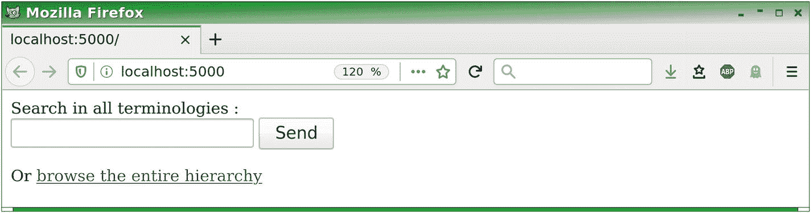
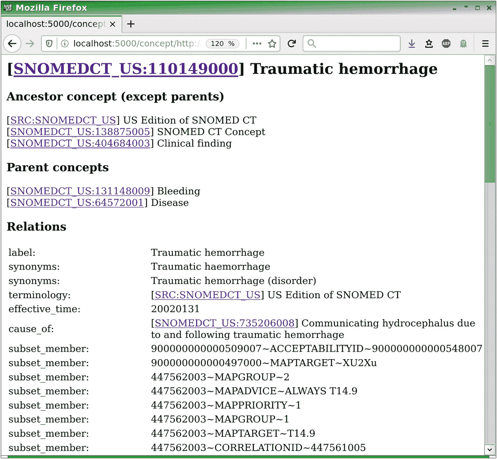
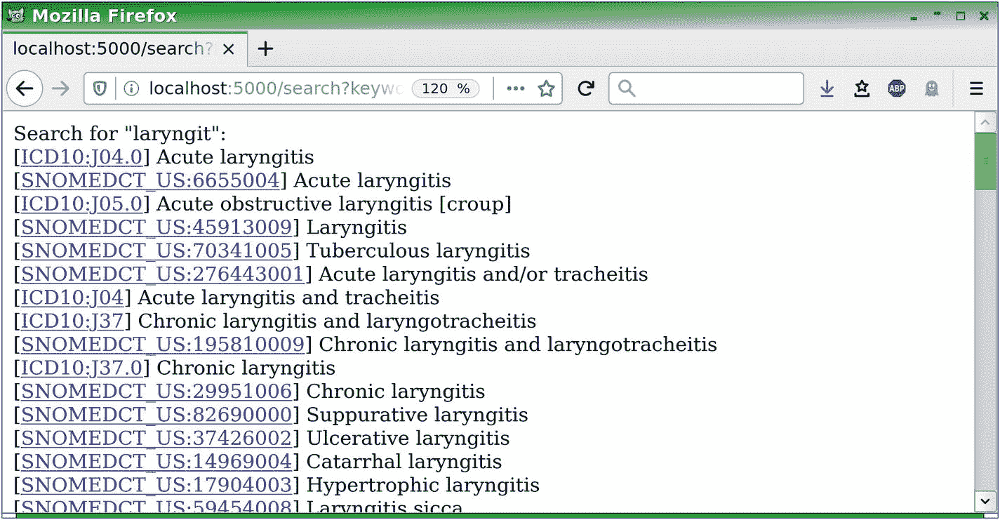

# 九、使用医学术语、PyMedTermino和 UMLS

在这一章中，我们将看到如何使用 PyMedTermino 将 UMLS 的主要医学术语导入 Python，PyMedTermino 是一个允许将这些术语集成到 Owlready 中的模块。我们还将看到如何使用 UMLS 统一概念(CUI)将这些术语联系在一起。

## 9.1 UML

UMLS(统一医学语言系统)是来自生物医学领域的 400 多个术语的集合。UMLS 还集成了不同术语之间的映射。UMLS 由美国国家医学图书馆(NLM)制作，可在以下地址在线注册后免费下载:

[T2`www.nlm.nih.gov/research/umls/licensedcontent/umlsknowledgesources.html`](https://www.nlm.nih.gov/research/umls/licensedcontent/umlsknowledgesources.html)

但是，请注意，UMLS 中包含的某些术语不能在某些国家自由使用。SNOMED CT 公司的情况尤其如此，该公司必须获得由国家或机构或公司支付的许可证。

在撰写本文时，最新的版本是 2019AB(完整版(umls-2019AB-full.zip))。要将 UMLS 与 Owlready 和 PyMedTermino 一起使用，您需要下载这个文件(大约 4.8 GB)。但是，不需要解压(PyMedTermino 会帮你做)。

## 9.2 从 UMLS 引进术语

PyMedTermino 是一个 Python 模块，允许访问医学术语。PyMedTermino 的第 2 版直接包含在 Owlready 中，所以不需要安装。但是，请注意，**导入 UMLS 数据需要 Python** 的 3.7 版本(或更高版本)(另一方面，一旦 UMLS 数据被导入，如果您愿意，您可以在 Python 3.6 中使用它)。

`owlready2.pymedtermino2`模块允许您通过全局函数`import_umls()`将全部或部分 UMLS 数据导入 Owlready quadstore:

```py
import_umls("./path/to/umls-2019AB-full.zip",↲
            terminologies = [...],↲
            langs = [...] )

```

该函数的第一个参数是包含 UMLS 数据的 ZIP 文件的路径，这是我们之前下载的。在前面的示例中，这是一个本地路径，但也可以是一个完整的路径，例如，“/home/jbl Amy/download/umls-2020 aa-full . zip”或“C:\ \ Downloads \ \ umls-2020 aa-full . zip”，这取决于您保存该文件的位置。

第二个参数是要导入的术语列表。如果缺少此参数，将导入所有术语。以下网页列出了 UMLS 的术语和相关代码:

[T2`www.nlm.nih.gov/research/umls/sourcereleasedocs/index.html`](https://www.nlm.nih.gov/research/umls/sourcereleasedocs/index.html)

第三个参数指示要导入的语言，例如，“en”表示英语，“fr”表示法语。如果缺少此参数，将导入所有语言。

例如，我们可以导入术语 CIM10 和 SNOMED CT(英文版，UMLS 代码为 ICD10 和 SNOMEDCT_US)以及 CUI UMLS(被视为伪术语)，如下所示:

```py
>>> from owlready2 import *
>>> from owlready2.pymedtermino2 import *
>>> from owlready2.pymedtermino2.umls import *

>>> default_world.set_backend(filename = "pymedtermino.sqlite3")
>>> import_umls("umls-2020AA-full.zip",↲
                terminologies = ["ICD10", "SNOMEDCT_US", "CUI")
>>> PYM = get_ontology("http://PYM/").load()
>>> default_world.save()

```

UMLS 数据导入大约需要 5-10 分钟。“`PYM`”在这里是“PyMedTermino”的缩写。

默认情况下，PyMedTermino 激活注释属性`label`(对应于术语概念的术语)和`synonyms`(对应于同义词)的全文搜索(参见 8.7)。如果您不想激活它，您必须在调用`import_umls()`功能时添加选项`fts_index = False`。

请注意，UMLS 包括几个术语翻译，例如，ICD10 有德语(代码“DMDICD10”)和荷兰语(代码“ICD10DUT”)。但是，不包括法文翻译。PyMedTermino 2 有一个用于导入法语 ICD10(代码“CIM10”)的特定模块，可以按如下方式使用:

```py
>>> from owlready2.pymedtermino2.icd10_french import *
>>> import_icd10_french()
>>> default_world.save()

```

## 9.3 初始进口后装载术语

显然，下一次我们想要使用导入的术语时，我们将不再需要调用导入函数。我们现在只需要以下三行代码:

```py
>>> from owlready2 import *
>>> default_world.set_backend(filename = "pymedtermino.sqlite3")
>>> PYM = get_ontology("http://PYM/").load()

```

这三行代码重新加载了 quadstore(使用`set_backend()`方法)和 PYM (PyMedTermino)本体。不要忘记调用`load()`；有必要加载与本体相关联的 Python 方法。

## 9.4 使用 ICD10

PyMedTermino 使用相同的界面提供对所有术语的访问。我们将在这里看到 ICD10 和 SNOMED CT 术语，但对于其他术语，功能仍然类似。

国际疾病分类第 10 版(ICD10)是一个被广泛使用的疾病分类。例如，它在法国用于医院的医疗经济编码。ICD10 包括大约 12，000 个概念。它以树的形式组织，21 个根概念对应于疾病的主要章节:癌症、传染病、心血管疾病、肺病等等。(注意，在美国，ICD9(第 9 版)仍在大量使用。可以使用术语代码“ICD9CM”获得。)

我们可以如下获得英文 ICD10 术语:

```py
>>> ICD10 = PYM["ICD10"]

>>> ICD10
PYM["ICD10"] # ICD10

>>> ICD10.name
'ICD10'

```

PyMedTermino 以如下方式显示概念:“terminals[code]# concept label”(对于有多个标签的概念，只显示一个，从首选标签中选择)。请注意，概念标签前面有一个#字符，因此如果您在 Python 中复制粘贴概念，它将被视为注释。这允许复制粘贴 PyMedTermino 概念或概念列表。

术语对象和术语概念是已经存在的类。因此，我们可以使用类方法来操作术语，例如，`subclasses()`方法可以获得 ICD10 的子类，也就是说，前面提到的 21 个疾病章节:

```py
>>> list(ICD10.subclasses())
[ ICD10["K00-K93.9"] # Diseases of the digestive system
, ICD10["C00-D48.9"] # Neoplasms
...]

```

但是，PyMedTermino 提供了额外的属性和方法来方便术语的操作。例如，`children`属性直接返回子概念列表，而不必像以前那样通过生成器。此外，子概念按代码排序(在 UMLS 并非总是如此)，如下例所示:

```py
>>> ICD10.children
[ ICD10["A00-B99.9"] # Certain infectious and parasitic diseases
, ICD10["C00-D48.9"] # Neoplasms
, ICD10["D50-D89.9"] # Diseases of blood and blood-forming organs and
                     # certain disorders involving the immune mechanisms
, ICD10["E00-E90.9"] # Endocrine, nutritional and metabolic diseases
, ICD10["F00-F99.9"] # Mental, behavioural disorders
, ICD10["G00-G99.9"] # Diseases of the nervous system
, ICD10["H00-H59.9"] # Diseases of the eye and adnexa
, ICD10["H60-H95.9"] # Diseases of the ear and mastoid process
, ICD10["I00-I99.9"] # Diseases of the circulatory system
, ICD10["J00-J99.9"] # Diseases of the respiratory system
, ICD10["K00-K93.9"] # Diseases of the digestive system
, ICD10["L00-L99.9"] # Diseases of the skin and subcutaneous tissue
, ICD10["M00-M99.9"] # Diseases of the musculoskeletal system and
                     # connective tissue
, ICD10["N00-N99.9"] # Diseases of the genitourinary system
, ICD10["O00-O99.9"] # Pregnancy, childbirth and the puerperium
, ICD10["P00-P96.9"] # Certain conditions originating in the
                     # perinatal period
, ICD10["Q00-Q99.9"] # Congenital malformations, deformations
                     # and chromosomal abnormalities
, ICD10["R00-R99.9"] # Symptoms, signs and abnormal clinical and
                     # laboratory findings, not elsewhere classified

, ICD10["S00-T98.9"] # Injury, poisoning and certain other
                     # consequences of external causes
, ICD10["V01-Y98.9"] # External causes of morbidity and mortality
, ICD10["Z00-Z99.9"] # Factors influencing health status and
                     # contact with health services
]

```

我们可以在层次结构中向下显示，例如，第一章(传染病)的儿童:

```py
>>> ICD10.children[0].children
[ ICD10["A00-A09.9"] # Intestinal infectious diseases
, ICD10["A15-A19.9"] # Tuberculosis
, ICD10["A20-A28.9"] # Certain zoonotic bacterial diseases
, ICD10["A30-A49.9"] # Other bacterial diseases
, ICD10["A50-A64.9"] # Infections with a predominantly sexual mode
                     # of transmission
...]

```

为了从代码中直接访问一个概念，我们可以索引术语。例如，在 ICD10 中，编码为“I10”的概念对应于原发性高血压:

```py
>>> ICD10["I10"]
ICD10["I10"] # Essential (primary) hypertension

```

派梅特米诺将 IRI 与每个概念联系起来，形式为“http://PYM/ <terminology>/ `”, for example:`</terminology>

```py
>>> ICD10["I10"].iri
'http://PYM/ICD10/I10' 
```

因此，概念的名称(或标识符)与其代码相对应:

```py
>>> ICD10["I10"].name
'I10'

```

`terminology`属性用于获取概念所属的术语:

```py
>>> ICD10["I10"].terminology
PYM["ICD10"] # ICD10

```

概念标签可通过首选标签的`label`注释和其他标签的`synonyms`注释进行访问；这些 OWL 注释可以作为 Python 属性来访问:

```py
>>> ICD10["I10"].label
['Essential (primary) hypertension']
>>> ICD10["I10"].synonyms
[]

```

根据术语的不同，概念可以有一个或多个标签和零个或多个同义词(在 ICD10 中，概念只有一个标签，没有同义词)。

`parents`属性提供了对父概念的访问(即更一般的概念):

```py
>>> ICD10["I10"].parents
[ICD10["I10-I15.9"] # Hypertensive diseases
]

```

ICD10 是一个单轴分类，也就是说，每个概念只有一个亲本(除了没有亲本的主要章节)。然而，PyMedTermino 可以用相同的接口处理所有的术语；这就是为什么在 CIM10 中,`parents`属性只返回一个父对象的列表。

`ancestor_concepts()`和`descendant_concepts()`方法分别返回祖先和后代概念的列表。它们类似于`ancestors()`和`descendants()`；但是，它们返回列表(而不是集合)，它们只返回 UMLS 概念(特别是，`ancestor_concepts()`返回的列表不包括`Thing`)。

```py
>>> ICD10["I10"].ancestor_concepts()
[ ICD10["I10"]       # Essential (primary) hypertension
, ICD10["I10-I15.9"] # Hypertensive diseases
, ICD10["I00-I99.9"] # Diseases of the circulatory system
]
>>> ICD10["I00-I99.9"].descendant_concepts()
[ ICD10["I00-I99.9"] # Diseases of the circulatory system
, ICD10["I00-I02.9"] # Acute rheumatic fever
, ICD10["I00"] # Rheumatic fever without mention of heart↲ involvement
, ICD10["I01"] # Rheumatic fever with heart involvement
, ICD10["I01.0"] # Acute rheumatic pericarditis
, ICD10["I01.1"] # Acute rheumatic endocarditis
, ICD10["I01.2"] # Acute rheumatic myocarditis
, ICD10["I01.8"] # Other acute rheumatic heart disease
, ICD10["I01.9"] # Acute rheumatic heart disease, unspecified
, ICD10["I02"] # Rheumatic chorea
, ICD10["I02.0"] # Rheumatic chorea with heart involvement

...]

```

默认情况下，这两种方法在它们返回的列表中包含初始概念。如果要避免这种情况，必须使用可选参数`include_self = False`，例如:

```py
>>> ICD10["I10"].ancestor_concepts(include_self = False)
[ ICD10["I10-I15.9"] # Hypertensive diseases
, ICD10["I00-I99.9"] # Diseases of the circulatory system
]

```

当应用于术语对象时，`descendant_concepts()`方法还可以浏览术语的所有概念(注意，这需要加载所有 CIM10 概念，即内存中超过 10，000 个概念，这需要一些时间！):

```py
>>> ICD10.descendant_concepts(include_self = False)
[ ICD10["A00-B99.9"] # Certain infectious and parasitic↲ diseases
, ICD10["A00-A09.9"] # Intestinal infectious diseases
, ICD10["A00"] # Cholera
, ICD10["A00.0"] # Cholera due to Vibrio cholerae 01, biovar↲ cholerae
...]

```

使用 Python 函数`issubclass()`可以测试一个概念是否是另一个概念的后代:

```py
>>> issubclass(ICD10["I10"], ICD10["I00-I99.9"])
True

```

`search()`方法允许您通过标签和同义词搜索概念。字符“*”可以用作单词末尾的通配符，并且可以包括由空格分隔的几个关键字(至于这种方法所基于的全文搜索，请参见 8.7)。例如，我们可以用一个以“高血压”开头的词来搜索所有概念:

```py
>>> ICD10.search("hypertension*")
[ ICD10["K76.6"] # Portal hypertension
, ICD10["I15.0"] # Renovascular hypertension
, ICD10["G93.2"] # Benign intracranial hypertension
, ICD10["I10"] # Essential (primary) hypertension
, ICD10["I27.0"] # Primary pulmonary hypertension
, ICD10["I15"] # Secondary hypertension
, ICD10["I15.9"] # Secondary hypertension, unspecified
...]

```

同样，我们可以用一个以“高血压”开头的词和另一个以“pulmo”开头的词来搜索所有概念:

```py
>>> ICD10.search("hypertension* pulmo*")
[ICD10["I27.0"] # Primary pulmonary hypertension
]

```

## 9.5 使用 SNOMED CT

SNOMED CT(医学系统命名法—临床术语)是比 ICD10 更丰富、更完整的医学术语。注意，如前所述，SNOMED CT 在某些国家不能自由使用。

与 ICD10 一样，我们可以访问 SNOMED CT 术语及其概念，以及标签、父代、子代、祖先和后代概念。

```py
>>> SNOMEDCT_US = PYM["SNOMEDCT_US"]

>>> SNOMEDCT_US["45913009"]
SNOMEDCT_US["45913009"]  # Laryngitis

>>> SNOMEDCT_US["45913009"].parents
[ SNOMEDCT_US["129134004"] # Inflammatory disorder of
                           # upper respiratory tract
, SNOMEDCT_US["363169009"] # Inflammation of specific body organs
, SNOMEDCT_US["60600009"] # Disorder of the larynx
]

>>> SNOMEDCT_US["45913009"].children
[ SNOMEDCT_US["1282001"] # Perichondritis of larynx
, SNOMEDCT_US["14969004"] # Catarrhal laryngitis
, SNOMEDCT_US["17904003"] # Hypertrophic laryngitis
...]

```

SNOMED CT 定义了标签(`label`)和同义词(`synonyms`):

```py
>>> SNOMEDCT_US["45913009"].label
['Laryngitis']

>_>_> SNOMEDCT_US["45913009"].synonyms
['Laryngitis (disorder)']

```

与 ICD10 不同，SNOMED CT 允许一个概念有几个父概念:因此它是一个多轴术语。在前面的例子中，概念“喉炎”有三个父代:“炎性上呼吸道疾病”、“特定器官炎症”和“喉部疾病”。

此外，SNOMED CT 不仅限于疾病:它还描述解剖结构(器官、器官的一部分等。，称为“身体结构”或“发现部位”)，形态学(也就是说，疾病的类型，“相关形态学”)，活体物种，化学物质，等等。SNOMED CT 还包括连接这些不同元素的横向链接。

这个信息在概念的父类中找到，以限制的形式(类型为*一些*或【仅 T2】):

```py
>>> SNOMEDCT_US["45913009"].is_a
[ SNOMEDCT_US["363169009"] # Inflammation of specific body organs
, SNOMEDCT_US["60600009"]  # Disorder of the larynx
, SNOMEDCT_US["129134004"] # Inflammatory disorder
                           # of upper respiratory tract

, PYM.unifieds.some(CUI["C0023067"]  # Laryngitis
), PYM.mapped_to.some(ICD10["J04.0"] # Acute laryngitis
), PYM.groups.some(<Group 22731_0>   # mapped_to=Acute↲ laryngitis
), PYM.has_associated_morphology.some(SNOMEDCT_US["23583003"] #Inflammation
), PYM.groups.some(<Group 22731_1>
#has_associated_morphology=Inflammation;↲
                       has_finding_site=Laryngeal structure
), PYM.has_finding_site.some(SNOMEDCT_US["4596009"] # Laryngeal↲ structure
), PYM.unifieds.only(CUI["C0023067"] # Laryngitis
)]

```

然而，限制并不容易处理。幸运的是，Owlready 允许将它们作为类属性来访问(参见 6.3)。例如，从像喉炎这样的疾病中，我们可以获得相应的解剖结构和形态:

```py
>>> SNOMEDCT_US["45913009"].has_finding_site
[SNOMEDCT_US["4596009"] # Laryngeal structure
]

>>> SNOMEDCT_US["45913009"].has_associated_morphology
[SNOMEDCT_US["409774005"] # Inflammatory morphology
]

```

`get_class_properties()`方法允许您获得给定概念的所有可用属性:

```py
>>> SNOMEDCT_US["45913009"].get_class_properties()
{PYM.mapped_to,
 PYM.unifieds,
 PYM.has_associated_morphology,
 PYM.groups,
 PYM.has_finding_site,
 PYM.terminology, rdf-schema.label,
 PYM.synonyms,
 PYM.subset_member,
 PYM.ctv3id,
 PYM.type_id,
 PYM.case_significance_id,
 PYM.definition_status_id,
 PYM.active,
 PYM.effective_time}

```

我们在属性集中找到了注释`label`和`synonyms`，以及`has_associated_morphology`和`has_finding_site`。

当涉及几个解剖结构和/或形态时，有趣的是知道哪个形态适用于哪个解剖结构。团体允许这样做。在下面的例子中，概念“肝脾肿大”与两种解剖结构和一种形态相关联:

```py
>>> SNOMEDCT_US["36760000"]
SNOMEDCT_US["36760000"] # Hepatosplenomegaly

>>> SNOMEDCT_US["36760000"].has_finding_site
[ SNOMEDCT_US["181268008"] # Entire liver
, SNOMEDCT_US["181279003"] # Entire spleen
]

>>> SNOMEDCT_US["36760000"].has_associated_morphology
[SNOMEDCT_US["442021009"] # Enlargement
]

```

我们可能想知道形态学是否与第一解剖结构(即肝脏)、第二解剖结构(即脾脏)或两者都相关。群组允许回答此问题；它们可通过`group`属性获得:

```py
>>> SNOMEDCT_US["36760000"].groups
[ <Group 18807_4> # has_finding_site=Entire liver ;
                  # has_associated_morphology=Enlargement
, <Group 18807_3> # has_finding_site=Entire spleen ;
                  #has_associated_morphology=Enlargement
, <Group 18807_0> # mapped_to=Hepatomegaly with splenomegaly,
                  # not elsewhere classified
]

```

在前面的示例中，我们有三个组:

*   第一个描述了肝脏的扩大。

*   第二个描述了脾脏的扩大。

*   第三个描述了与另一个术语的对应关系，但不包含解剖结构或形态学。

因此，在这里，形态学涉及两种解剖结构。请注意，组的确切顺序可能会有所不同:您将拥有相同的组，但顺序不一定相同。

可以单独查询每个组，例如，前面的第二个组:

```py
>>> SNOMEDCT_US["36760000"].groups[0].get_class_properties()
{PYM.has_associated_morphology,
 PYM.has_finding_site}

>>> SNOMEDCT_US["36760000"].groups[0].has_associated_morphology
[SNOMEDCT_US["442021009"] # Enlargement
]

>>> SNOMEDCT_US["36760000"].groups[0].has_finding_site
[SNOMEDCT_US["181268008"] # Entire liver
]

```

PyMedTermino 还允许您在另一个方向上导航，也就是说，从解剖结构或形态学出发，前往疾病。例如，我们可以得到所有涉及玻璃体的疾病如下:

```py
>>> SNOMEDCT_US["181268008"].finding_site_of
[ SNOMEDCT_US["80660001"] # Mauriac's syndrome
, SNOMEDCT_US["93369005"] # Congenital microhepatia
, SNOMEDCT_US["192008"] # Congenital syphilitic hepatomegaly
, SNOMEDCT_US["80378000"] # Neonatal hepatosplenomegaly
...]

```

当然，在 SNOMED CT 中可以进行全文搜索，其工作方式与 CIM10 相同。

## 9.6 运用统一概念(崔)

UMLS 定义了统一的概念(CUI，概念唯一标识符)，允许在术语之间导航。这些 CUI 可以与 PyMedTermino 一起导入，使用特殊的术语代码“CUI”。请注意，当仅导入某些术语时，PyMedTermino 仅导入所选术语使用的 Cui。如果您想要访问所有 Cui，您将需要导入所有 UMLS。

```py
>>> CUI = PYM["CUI"]

```

`unifieds`属性使得获得与任何术语概念相关联的统一概念成为可能(这里我们取 ICD10):

```py
>>> ICD10["I10"]
ICD10["I10"] # Essential (primary) hypertension

>>> ICD10["I10"].unifieds
[CUI["C0085580"] # Essential hypertension
]

```

统一的概念都有一个标签和同义词(来自导入的术语，因此取决于对这些术语的选择):

```py
>>> CUI["C0085580"].synonyms
['Essential (primary) hypertension',
 'Idiopathic hypertension',
 'Primary hypertension',
 'Systemic primary arterial hypertension',
 'Essential hypertension (disorder)']

```

`originals`属性是`unifieds`的逆属性；它允许获取与统一概念相关联的原始术语的概念；

```py
>>> CUI["C0085580"].originals
[ SNOMEDCT_US["59621000"] # Essential hypertension
, ICD10["I10"] # Essential (primary) hypertension
]

```

这些统一的概念允许在术语之间导航，我们将在下一节中看到。

最后,“SRC”伪术语(来源的缩写)列出了 UMLS 和/或 PyMedTermino 的所有术语。这是一种“术语的术语”。所以，PyMedTermino 的根本概念是`http://PYM/SRC/SRC`:

```py
>>> PYM["SRC"]["SRC"]
PYM["SRC"] # Metathesaurus Source Terminology Names

>>> PYM["SRC"]["SRC"].iri
'http://PYM/SRC/SRC'

```

## 9.7 术语之间的映射

使用 UMLS 现有的链接，`>>`操作符允许你从一个术语转换到另一个术语。注意，这个操作符不应该与 Python 提示`>>>`混淆(三个`>`字符对两个)。这种操作通常被称为“映射”、“代码转换”或“对应”。对于映射概念，如果存在 UMLS“mapped _ to”关系，PyMedTermino 会使用它们。当它们不存在时，PyMedTermino 使用统一概念(CUI)在术语之间导航。以下示例将 ICD10 概念“E11”映射到 SNOMED CT:

```py
>>> ICD10["E11"]
ICD10["E11"] # Non-insulin-dependent diabetes mellitus

>>> ICD10["E11"] >> SNOMEDCT_US
Concepts([
  SNOMEDCT_US["44054006"] # Type 2 diabetes mellitus
])

```

这里，ICD10 概念“E11”对应于 SNOMEDCT 概念“44054006”，两者都代表二型糖尿病。概念 CIM 10“E11”没有“mapped_to”关系；我们可以验证如下:

```py
>>> ICD10["E11"].mapped_to
[]

```

因此，Cui 用于执行映射。

我们也可以反方向映射，从 SNOMED CT 到 ICD10:

```py
>>> SNOMEDCT_US["44054006"] >> ICD10
Concepts([
  ICD10["E11.9"] # Non-insulin-dependent diabetes mellitus↲ without complications
])

```

我们注意到获得的概念不是我们以前在 IC D10(“E11”，非胰岛素依赖型糖尿病)中获得的概念。实际上，SNOMED CT 认为没有任何并发症说明的一般概念“二型糖尿病糖尿病”对应于没有并发症的糖尿病。UMLS 在 SNOMED CT 概念上有一个“映射到”关系，我们可以验证如下:

```py
>>> SNOMEDCT_US["44054006"].mapped_to
[ICD10["E11.9"] # Non-insulin-dependent diabetes mellitus↲
                  without complications
]

```

从 SNOMED CT 映射到 ICD10 时，PyMedTermino 使用了此关系。

映射总是返回一组概念(在下一节中描述)。当起始概念对应于到达术语中的几个概念时，该集合可以包含几个概念，如下例所示:

```py
>>> ICD10["N80.0"]
ICD10["N80.0"] # Endometriosis of uterus

>>> ICD10["N80.0"] >> SNOMEDCT_US
Concepts([
  SNOMEDCT_US["784314006"] # Uterine adenomyosis
, SNOMEDCT_US["76376003"] # Endometriosis of uterus
, SNOMEDCT_US["237115002"] # Endometriosis of myometrium
, SNOMEDCT_US["198247003"] # Endometriosis interna
])

```

## 9.8 操作概念集

`PYM.Concepts`类用于创建一组概念。这个类继承自 Python 的`set`类(参见 2.4.7 ),因此具有相同的方法来计算两个集合的交集、并集、减法等。它为术语添加了特定的方法。例如，`lowest_common_ancestors()`方法允许计算几个概念最接近的共同祖先:

```py
>>> PYM.Concepts([ICD10["E11.1"], ICD10["E12.0"]]).lowest_↲common_ancestors()
Concepts([
  ICD10["E10-E14.9"] # Diabetes mellitus
])

```

这种方法适用于“概括”几个概念，并将它们组合成一个更高层次的概念。

`find()`方法使得寻找一个集合中的第一个概念成为可能，该集合是一个给定概念(包括概念本身)的后代。例如，我们可以创建一组四个概念:

```py
>>> cs = PYM.Concepts([
...     SNOMEDCT_US["49260003"], SNOMEDCT_US["371438008"],
...     SNOMEDCT_US["373137001"], SNOMEDCT_US["300562000"],
... ])
>>> cs
Concepts([
  SNOMEDCT_US["300562000"] # Genitourinary tract problem
, SNOMEDCT_US["373137001"] # Immobile heart valve
, SNOMEDCT_US["49260003"]  # Idioventricular rhythm
, SNOMEDCT_US["371438008"] # Urolith
])

```

然后，我们可以搜索心脏概念的存在(这里，301095005 是“心脏发现”的 SNOMED CT 代码):

```py
>>> cs.find(SNOMEDCT_US["301095005"])
SNOMEDCT_US["373137001"] # Immobile heart valve

```

`extract()`方法类似，但是返回从作为参数传递的概念开始的所有概念的子集，例如，在这里，所有心脏概念:

```py
>>> cs.extract(SNOMEDCT_US["301095005"])
Concepts([
  SNOMEDCT_US["373137001"] # Immobile heart valve
, SNOMEDCT_US["49260003"]  # Idioventricular rhythm
])

```

`subtract()`方法返回一个包含相同概念的新集合，除了那些从参数中传递的概念派生的概念。`subtract_update()`方法执行相同的操作，但是修改了传入的参数集，而不是返回一个新的。

`keep_most_generic()`和`keep_most_specific()`方法分别只允许保留最通用或最具体的概念。在下面的例子中，概念 SNOMED CT 300562000(“泌尿生殖道问题”)已被删除，因为它没有 371438008(“尿结石”)具体:

```py
>>> cs.keep_most_specific()
>>> cs
Concepts([
  SNOMEDCT_US["373137001"] # Immobile heart valve
, SNOMEDCT_US["371438008"] # Urolith
, SNOMEDCT_US["49260003"]  # Idioventricular rhythm
])

```

`all_subsets()`方法返回集合中所有可能的子集，例如:

```py
>>> cs = PYM.Concepts([
...     SNOMEDCT_US["49260003"],
...     SNOMEDCT_US["371438008"],
...     SNOMEDCT_US["373137001"],
... ])
>>> cs.all_subsets()
[Concepts([
]), Concepts([
  SNOMEDCT_US["373137001"] # Immobile heart valve
]), Concepts([
  SNOMEDCT_US["371438008"] # Urolith
]), Concepts([
  SNOMEDCT_US["373137001"] # Immobile heart valve
, SNOMEDCT_US["371438008"] # Urolith
]), Concepts([
  SNOMEDCT_US["49260003"] # Idioventricular rhythm
]), Concepts([
  SNOMEDCT_US["373137001"] # Immobile heart valve
, SNOMEDCT_US["49260003"] # Idioventricular rhythm
]), Concepts([
  SNOMEDCT_US["49260003"] # Idioventricular rhythm
, SNOMEDCT_US["371438008"] # Urolith
]), Concepts([
  SNOMEDCT_US["373137001"] # Immobile heart valve
, SNOMEDCT_US["49260003"] # Idioventricular rhythm
, SNOMEDCT_US["371438008"] # Urolith
])]

```

方法`is_semantic_subset()`、`is_semantic_superset()`、`is_semantic_disjoint()`和`semantic_intersection()`类似于 Python 集合的同名方法，但是它们考虑了概念之间的层次*关系。在下面的例子中，两个集合的交集是空的，但不是语义交集，因为尿结石是一个泌尿问题:*

```py
>>> cs1 = PYM.Concepts([SNOMEDCT_US["371438008"]])
>>> cs2 = PYM.Concepts([SNOMEDCT_US["106098005"]])
>>> cs1
Concepts([
  SNOMEDCT_US["371438008"] # Urolith
])
>>> cs2
Concepts([
  SNOMEDCT_US["106098005"] # Urinary system finding
])
>>> cs1.intersection(cs2)
Concepts([
])
>>> cs1.semantic_intersection(cs2)
Concepts([
  SNOMEDCT_US["371438008"] # Urolith
])

```

但是，要小心，这些语义操作没有考虑到概念的可能的共同后代。在下面的例子中,“传染病”和“泌尿系统问题”这两个概念的交集是空的，而尿路感染确实存在:

```py
>>> cs1 = PYM.Concepts([SNOMEDCT_US["40733004"]])
>>> cs2 = PYM.Concepts([SNOMEDCT_US["106098005"]])
>>> cs1
Concepts([
  SNOMEDCT_US["40733004"] # Disorder due to infection
])
>>> cs2
Concepts([
  SNOMEDCT_US["106098005"] # Urinary system finding
])
>>> cs1.semantic_intersection(cs2)
Concepts([
  ])

```

我们将在后面(10.7)看到如何实现一个真正的语义交集，它考虑到了共同的后代。

PyMedTermino 还允许映射一组概念，总是使用运算符“`>>`”。由于映射操作本身返回一组概念，因此可以将这些操作链接起来。例如，我们可以通过强制通过 CUI 从 SNOMED CT 映射到 CIM10，如下所示:

```py
>>> SNOMEDCT_US["44054006"] >> CUI >> ICD10
Concepts([
  ICD10["E11"] # Non-insulin-dependent diabetes mellitus
])

```

相反，当“mapped_to”关系出现在 UMLS 时，直接映射(如前所述)可能返回不同的结果:

```py
>>> SNOMEDCT_US["44054006"] >> ICD10
Concepts([
  ICD10["E11.9"] # Non-insulin-dependent diabetes
                 # mellitus without complications
])

```

通过 CUI 保证了可逆映射。

## 9.9 将所有术语导入 UMLS

当`terminologies`参数丢失时，`import_umls()`函数导入 UMLS 中存在的所有术语。因此，我们可以按如下方式导入所有 UMLS(注意，这至少需要 20 GB 的磁盘空间、16 GB 的 RAM 和一个多小时):

```py
>>> from owlready2 import *
>>> from owlready2.pymedtermino2 import *
>>> from owlready2.pymedtermino2.umls import *

>>> default_world.set_backend(filename = "pymedtermino.sqlite3",
...                          sqlite_tmp_dir = "/home/jiba/tmp")
>>> import_umls("umls-2020AA-full.zip")
>>> PYM = get_ontology("http://PYM/").load()

```

注意，当调用`set_backend()`方法时，我们添加了可选的`sqlite_tmp_dir`参数，该参数指示存储大型临时文件的目录路径(见 8.8.1)。

然后，要一次搜索所有术语中的概念，可以使用`PYM.search()`方法:

```py
>>> PYM.search("hypertension*")
[ SNOMEDCT_US["123800009"] # Goldblatt hypertension
, SNOMEDCT_US["70272006"] # Malignant hypertension
, ICD10["K76.6"]# Portal hypertension
, SNOMEDCT_US["34742003"] # Portal hypertension
, SNOMEDCT_US["70995007"] # Pulmonary hypertension
, SNOMEDCT_US["28119000"] # Renal hypertension
, ICD10["I15.0"] # Renovascular hypertension
...]

```

## 9.10 示例:将细菌本体论与 UMLS 联系起来

我们现在可以把细菌的本体论和 UMLS 联系起来。为此，我们将在这个本体论的概念和的统一概念(崔)之间建立联系。由于这些是类，我们将使用 Owlready 的类属性(见 6.3)。

下面几行代码可以将三类细菌(假单胞菌、链球菌和葡萄球菌)链接到相应的 CUI(我们使用`search()`进行搜索)。这些关系放在一个新的本体中，命名为“bacteria_umls.owl”。

```py
>>> onto = get_ontology("bacteria.owl").load()
>>> onto_bacteria_umls = get_ontology("http://↲lesfleursdunormal.fr/
static/_downloads/bacteria_umls.owl")

>>> CUI = PYM["CUI"]

>>> with onto_bacteria_umls:
...     onto.Pseudomonas   .mapped_to = [ CUI["C0033808"] ]
...     onto.Streptococcus .mapped_to = [ CUI["C0038402"] ]
...     onto.Staphylococcus.mapped_to = [ CUI["C0038170"] ]

>>> onto_bacteria_umls.save("bacteria_umls.owl")

```

我们已经为我们的关系重用了 UMLS mapped_to object 属性。

我们可以验证它确实是一个类属性，也就是说，一个 OWL 限制:

```py
>>> onto.Pseudomonas.mapped_to
[CUI["C0033808"] # Pseudomonas
]
>>> onto.Pseudomonas.is_a
[bacteria.Bacterium,
 bacteria.has_shape.some(bacteria.Rod),
 bacteria.has_shape.only(bacteria.Rod),
 bacteria.has_grouping.some(bacteria.Isolated | bacteria.InPair),
 bacteria.gram_positive.value(False),
 PYM.mapped_to.some(CUI["C0033808"] # Pseudomonas
)]

```

例如，可以将这些 Cui 映射到 SNOMED CT:

```py
>>> SNOMEDCT_US = PYM["SNOMEDCT_US"]

>>> onto.Pseudomonas.mapped_to[0] >> SNOMEDCT_US
Concepts([
  SNOMEDCT_US["5274006"] # Chryseomonas
, SNOMEDCT_US["57032008"] # Pseudomonas
])

```

这里，UMLS 的“假单胞菌”概念对应于 SNOMED CT 中的假单胞菌，但也对应于 Chryseomonas，一种后来被归入假单胞菌属的细菌属(命名为绿脓假单胞菌)。

还可以将统一概念 CUI 翻译成 SNOMED CT，然后通过“causative_agent_of”关系(与“has_causative_agent”相反)恢复相关疾病:

```py
>>> diseases = [
...     disease

...     for snomedct in onto.Pseudomonas.mapped_to[0] >>↲ SNOMEDCT_US
...     for disease in snomedct.causative_agent_of
... ]
>>> diseases
[ SNOMEDCT_US["127201000119101"] # Septic shock co-occurrent
     # with acute organ dysfunction due to Pseudomonas
, SNOMEDCT_US["16664009"]  # Malignant otitis media
, SNOMEDCT_US["448813005"] # Sepsis due to Pseudomonas
...]

```

这给了我们一个由细菌引起的疾病列表。

## 9.11 示例:多术语浏览器

在 Python 终端中用 PyMedTermino 进行医学术语的咨询是完全可能的；然而，这很快就变得费力了。因此，我们将建立一个多术语的“迷你浏览器”,既可以通过关键字搜索概念，也可以在各种术语中导航。该浏览器将使用 Python `Flask`模块制作一个动态网站(见 4.12)，并将整合 PyMedTermino 中所有可用的术语。

以下程序描述了多术语“迷你浏览器”:

```py
# File termino_browser.py
from owlready2 import *
default_world.set_backend(filename = "pymedtermino.sqlite3")
PYM = get_ontology("http://PYM/").load()

from flask import Flask, url_for, request
app = Flask(__name__)

def repr_concept(concept):
    return """[<a href="%s">%s:%s</a>] %s""" % (
        url_for("concept_page", iri = concept.iri),
        concept.terminology.name,
        concept.name,
        concept.label.first() )

def repr_relations(entity, border = False):
    if border: html = """<table style="border: 1px solid #aaa;">"""
    else:      html = """<table>"""
    for Prop in entity.get_class_properties():
        for value in Prop[entity]:
            if issubclass(value, PYM.Concept):
                value = repr_concept(value)
            elif issubclass(value, PYM.Group):
                value = repr_relations(value, True)
            html += """<tr><td>%s:""" % Prop.name
            html += """</td><td> %s</td></tr>""" % value

    html += """</table>"""
    return html

@app.route('/')
def homepage():
    html ="""
<html><body>
  Search in all terminologies:
  <form action="/search">
    <input type="text" name="keywords"/>
    <input type="submit"/>
  </form>
  Or <a href="%s">browse the entire hierarchy</a>
</body></html>""" % url_for("concept_page", iri = "http://PYM/↲SRC/SRC")
    return html

@app.route('/search')
def search_page():
    keywords = request.args.get("keywords", "")
    html = """<html><body>Recherche "%s":<br/>\n""" % keywords
    keywords = " " .join("%s"* % word for word in keywords.↲split())
    results = PYM.search(keywords)
    for concept in results:
        html += """%s<br/>""" % repr_concept(concept)
    html += """</body></html>"""
    return html

@app.route('/concept/<path:iri>')
def concept_page(iri):
    concept = IRIS[iri]
    html  = """<html><body>"""
    html += """<h2>%s</h2>""" % repr_concept(concept)
    html += """<h3>Ancestor concept (except parents)</h3>"""
    html += """%s<br/>""" % repr_concept(concept.terminology)
    ancestors = set(concept.ancestor_concepts(include_self =↲ False))
    ancestors = ancestors - set(concept.parents)
    ancestors = list(ancestors)
    ancestors.sort(key = lambda t: len(t.ancestor_concepts()))
    for ancestor in ancestors

:
        html += """%s<br/>""" % repr_concept(ancestor)

    html += """<h3>Parent concepts</h3>"""
    for parent in concept.parents:
        html += """%s<br/>""" % repr_concept(parent)

    html += """<h3>Relations</h3>"""
    html += repr_relations(concept)

    if not concept.name == "CUI":
        html += """<h3>Child concepts</h3>"""
        for child in concept.children:
            html += """%s<br/>""" % repr_concept(child)

    html += """</body></html>"""
    return html

import werkzeug.serving
werkzeug.serving.run_simple("localhost", 5000, app)

```

该程序首先导入 Owlready 并使用 PyMedTermino 加载 quadstore，然后导入 Flask。然后，它创建两个效用函数:

*   `repr_concept()`，它将用于在 HTML 中表示一个概念，使用它的标签、术语和代码，并带有一个到概念页面的链接。

*   `repr_relations()`，它将用于在 HTML 中表示概念或组的(非层次)关系。该函数返回一个 HTML 表，每个属性和属性值对应一行。这个函数是递归的:如果为一个概念调用它，如果必要的话，它将为这个概念的每个组调用它自己。

然后，程序创建三个网页:

*   根页面(路径“/”)，它提供了一个搜索字段和一个到 PyMedTermino 的根概念的链接。

*   搜索页面(路径)/搜索？keywords = entered _ keywords”)，它列出了文本搜索的结果。这个页面的工作方式类似于我们为 DBpedia 创建的页面(见 8.8.2)。

*   概念页面(路径“/概念/概念 _IRI”)，显示给定概念的属性:祖先概念(不包括父概念)、父概念、关系和子概念。

    为了方便阅读，我们去掉了祖先的父母，我们按照祖先自己拥有的祖先概念的数量对祖先列表进行了排序。这允许在列表的开始具有较少祖先的概念，因此是最一般的，而在列表的底部是最具体的。

    此外，对于“CUI”分类，子概念的显示已被停用，因为它没有层次结构。因此，所有 Cui(超过 20，000 个)都是该分类的直接子分类，这会导致页面太长！

以下截图显示了最终的术语浏览器:







## 9.12 摘要

在本章中，您已经学习了如何从 UMLS 导入医学术语，以及如何将它们作为本体来访问。我们已经看到了如何将概念从一个术语映射到另一个术语，以及如何设计一个简单的术语浏览器。