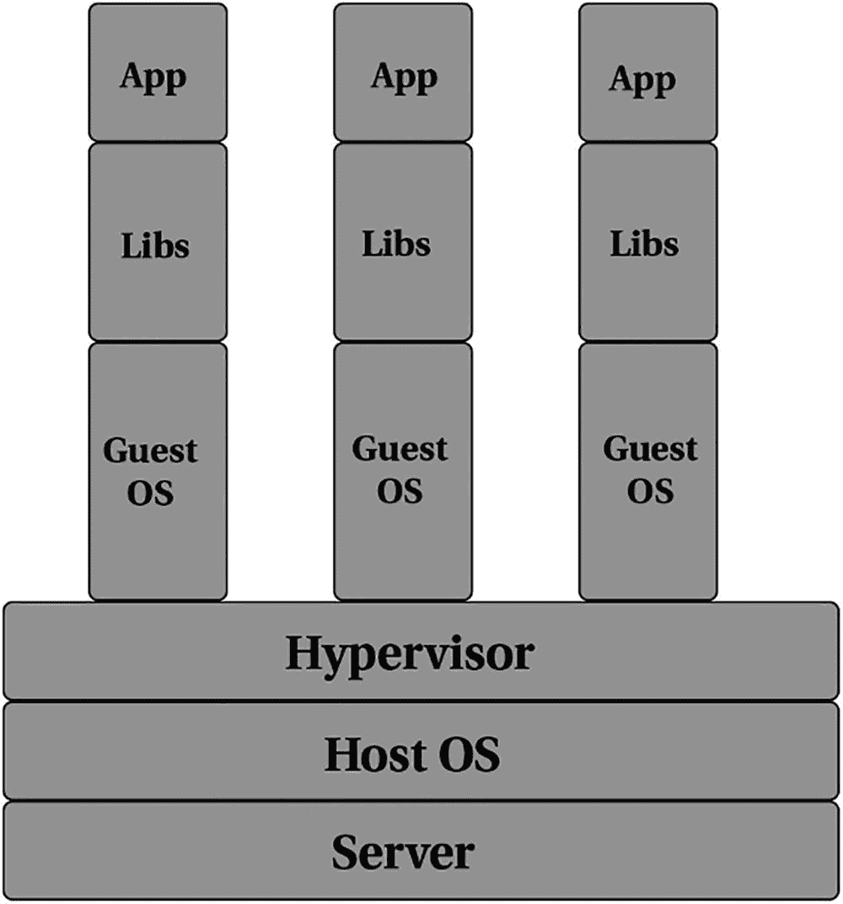
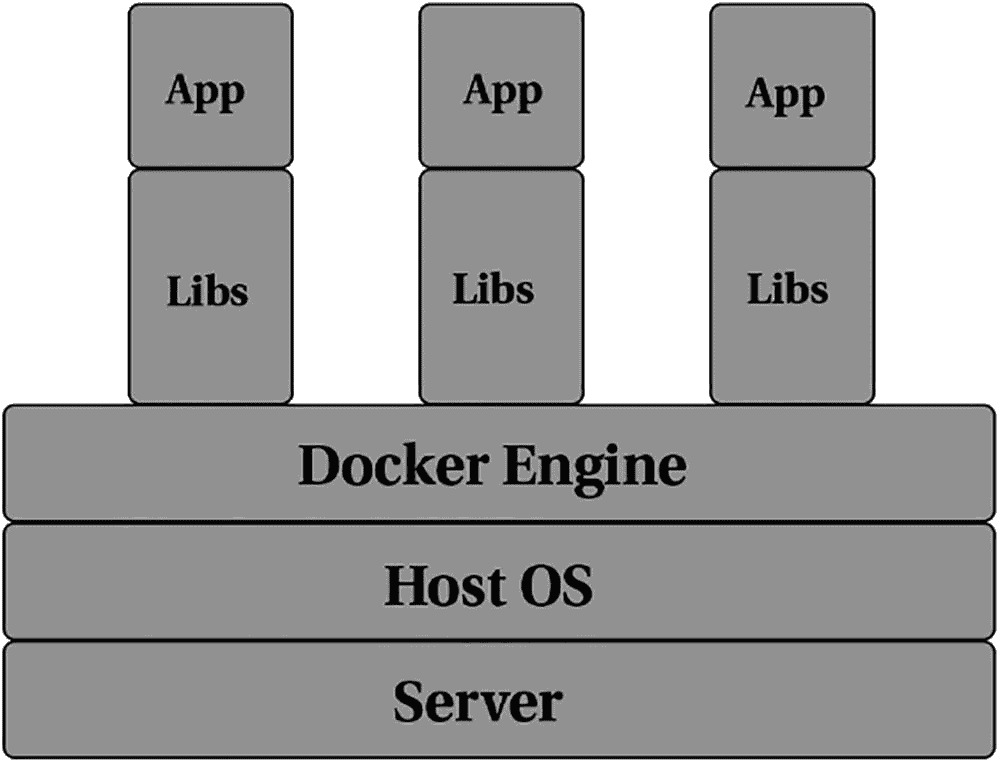

# 一、容器化介绍

本章介绍 Docker 是什么，容器化是什么，它与虚拟化有什么不同。其他涉及的副题包括容器化的历史、容器运行时间和容器编排。

## Docker 是什么？

为了回答这个问题，我们需要澄清“Docker”这个词，因为 Docker 已经成为容器的同义词。

Docker Inc .是 Docker 背后的公司。它由所罗门·海克斯于 2010 年创立，名为 dotCloud Inc .dotCloud 工程师为 Linux 容器构建了抽象和工具，并使用了 Linux 内核特性`cgroups`和名称空间，目的是降低使用 Linux 容器的复杂性。dotCloud 将其工具开源，并将重点从平台即服务(PaaS)业务转向容器化。Docker Inc .将 dotCloud 出售给 cloudControl，后者最终申请破产。

Docker 是提供操作系统级虚拟化的技术，称为*容器*。需要注意的是，这不同于*硬件*虚拟化。我们将在本章的后面探讨这一点。Docker 使用 Linux 内核的资源隔离特性，如`cgroups`、内核名称空间和 OverlayFS，所有这些都在同一个物理或虚拟机内。OverlayFS 是一个支持 union 的文件系统，它将几个文件和目录合并成一个文件和目录，以便在同一个物理机或虚拟机中运行多个相互隔离和包含的应用。

### 了解 Docker 解决的问题

在很长一段时间里，设置开发人员的工作站对于系统管理员来说是一项非常麻烦的任务。即使开发人员工具的安装完全自动化，当您混合了不同的操作系统、不同版本的操作系统以及不同版本的库和编程语言时，建立一个一致并提供统一体验的工作空间几乎是不可能的。Docker 通过减少移动部件解决了这个问题。现在的目标不再是操作系统和编程版本，而是 Docker 引擎和运行时。Docker 引擎提供了底层系统的统一抽象，使得开发人员可以非常容易地测试他们的代码。

生产领域的事情变得更加复杂。假设您有一个 Python web 应用，运行在 Amazon Web Services EC2 实例上的 Python 2.7 上。为了使代码库现代化，该应用进行了一些重大升级，包括对 Python 版的更改。假设当前运行现有代码库的 Linux 发行版所提供的包中没有这个版本的 Python。要部署这个新应用，您可以选择以下任一选项:

*   替换现有实例

*   通过以下方式设置 Python 解释器
    *   将 Linux 发行版本更改为包含较新 Python 包的版本。

    *   添加第三方渠道，提供较新 Python 版本的打包版本。

    *   进行就地升级，保留现有版本的 Linux 发行版。

    *   从源代码编译 Python 3.5，这带来了额外的依赖性。

    *   或者使用类似于`virtualenv`的东西，它有自己的一套权衡。

无论从哪个角度看，应用代码的新版本部署都会带来很多不确定性。作为操作工程师，限制对配置的更改至关重要。考虑到操作系统的变化、Python 版本的变化和应用代码的变化，会产生很多不确定性。

Docker 通过显著减少不确定性的表面积来解决这个问题。您的应用正在现代化？没问题。用新的应用代码和依赖项构建一个新的容器，并交付它。现有的基础设施保持不变。如果应用的行为不符合预期，那么回滚就像重新部署旧容器一样简单——将所有生成的 Docker 映像存储在 Docker 注册表中并不少见。拥有一种简单的回滚方法而不干扰当前的基础架构，可以大大减少响应故障所需的时间。

## 多年来的容器化

虽然容器化在过去的几年里流行起来，但容器化的概念实际上可以追溯到 20 世纪 70 年代。

### 1979 年:克鲁特

系统调用`chroot`是在 1979 年的 UNIX 版本 7 中引入的。`chroot`的前提是它为当前运行的进程及其子进程改变了明显的根目录。在`chroot`中启动的进程不能访问指定目录树之外的文件。这种环境被称为 *chroot 监狱。*

### 2000 年:自由监狱

在`chroot`概念的基础上，FreeBSD 增加了对一个特性的支持，该特性允许将 FreeBSD 系统划分成几个独立、隔离的系统，称为*监狱*。每个监狱都是主机系统上的一个虚拟环境，有自己的一组文件、进程和用户帐户。虽然`chroot`只将进程限制在文件系统的视图中，但 FreeBSD 将被监禁进程的活动限制在整个系统中，包括绑定到它的 IP 地址。这使得 FreeBSD jails 成为测试互联网连接软件的新配置的理想方式，可以很容易地试验不同的配置，同时不允许来自监狱的更改影响外部的主系统。

### 2005 年:OpenVZ

OpenVZ 在为低端虚拟专用服务器(VPS)提供商提供操作系统虚拟化方面非常受欢迎。OpenVZ 允许一个物理服务器运行多个独立的操作系统实例，称为*容器*。OpenVZ 使用了一个打了补丁的 Linux 内核，与所有容器共享它。每个容器充当一个独立的实体，拥有自己的一组虚拟化的文件、用户、组、进程树和虚拟网络设备。

### 2006 年:群体

最初被称为*流程容器*、`cgroups`(控制组的简称)是由 Google 工程师启动的。`cgroups`是一个 Linux 内核特性，它将资源使用(如 CPU、内存、磁盘 I/O 和网络)限制并隔离给一组进程。`cgroups`已经被重新设计了多次，每一次重新设计都考虑到了它不断增长的用例数量和所需的特性。

### 2008: LXC

LXC 通过结合 Linux 内核的`cgroups`和对隔离名称空间的支持来提供操作系统级的虚拟化，从而为应用提供一个隔离的环境。Docker 最初使用 LXC 来提供隔离特性，但后来改用了自己的库。

## 容器和虚拟机

许多人认为既然容器隔离了应用，它们就和虚拟机一样。乍一看，它看起来很像，但根本的区别是容器与主机共享同一个内核。

Docker 只隔离单个进程(或者一组进程，这取决于映像是如何构建的)，所有容器都运行在同一个主机系统上。因为隔离是在内核级应用的，所以与虚拟机相比，运行容器不会给主机带来很大的开销。当容器启动时，选定的进程或进程组仍在同一主机上运行，无需虚拟化或模拟任何东西。图 [1-1](#Fig1) 显示了在单个物理主机上的三个不同容器上运行的三个应用。

图 1-1

在三个不同容器上运行的三个应用的表示

相比之下，当虚拟机启动时，虚拟机管理程序会虚拟化整个系统，从 CPU 到 RAM 再到存储。为了支持这个虚拟化系统，需要安装整个操作系统。出于所有实际目的，虚拟化系统是在计算机中运行的整个计算机。现在，如果你能想象运行一个操作系统需要多少开销，想象一下如果你运行一个嵌套的操作系统会是什么样子！图 [1-2](#Fig2) 展示了在一台物理主机上的三个不同虚拟机上运行的三个应用。

图 1-2

在三个不同的虚拟机上运行的三个应用的表示

图 [1-1](#Fig1) 和 [1-2](#Fig2) 给出了在单个主机上运行的三个不同应用的指示。对于 VM 来说，不仅需要应用的依赖库，还需要操作系统来运行应用。相比之下，使用容器，与应用共享主机操作系统的内核意味着消除了额外操作系统的开销。这不仅大大提高了性能，还让您提高了资源利用率，并最大限度地减少了计算能力的浪费。

### 容器运行时

容器映像在启动和运行时成为一个容器。但是要做到这一点，必须有一个软件来引导运行容器所需的资源。这个软件叫做*容器运行时*。Docker 使用 [`containerd`](https://containerd.io/) 项目实现了一个容器运行时，该项目现在是[云本地计算基金会](https://www.cncf.io/)的毕业项目列表的一部分。

然而,`containerd`并不是惟一的容器运行时。还有其他的容器运行时项目，比如 [`cri-o`](https://cri-o.io/) 、 [`rkt`](https://github.com/rkt/rkt) (已经不在活跃开发中了)、 [`runC`](https://github.com/opencontainers/runc) 等等。

### OCI 和国际广播电台

随着更多容器运行时的开发，需要一个标准来定义什么是容器映像，即运行时的规范。这就是开放容器倡议(OCI)的由来。

OCI 是一个开放的治理结构，用于创建容器映像和运行时的行业标准规范，不受特定于供应商的特性的限制，以促进开放的生态系统。OCI 目前有两个规范:运行时规范和映像规范。

运行时规范定义了容器运行时应该如何将容器映像解包到文件系统中，以及运行容器的步骤。这确保了无论使用哪个容器运行时，容器都将按预期准确运行。

图像规范定义了一种 OCI 图像格式，其中包含了关于如何创建 OCI 图像的必要定义。OCI 映像包括映像清单、文件系统定义和映像配置。映像清单包含有关映像内容和依赖关系的元数据。映像配置包括应用参数和环境变量等数据。

容器运行时接口(CRI)是 Kubernetes 特有的术语，它定义了 Kubernetes 如何与多个容器运行时交互并引导容器。在 CRI 之前，Kubernetes 只支持 Docker 运行时。随着来自社区的支持更多容器运行时的请求，Kubernetes 团队为容器运行时实现了一个插件接口。这个插件接口允许 Kubernetes 支持可互换的容器运行时，允许来自社区的简单贡献。

## Docker 工人和库柏工人

随着 Kubernetes 在行业中的使用越来越多，一个经常出现的问题是 Docker 和 Kubernetes 之间的区别。

Kubernetes 是运行容器和维护其生命周期的协调器。Docker 是多用途软件，不仅可以构建容器映像，还可以运行容器。虽然 Docker 不仅可以在单个节点上运行和维护容器的生命周期，还可以使用 Docker Compose 和 Docker Swarm 在多个节点上运行和维护容器的生命周期，但 Kubernetes 已经成为容器编排的事实标准。

Docker 和 Kubernetes 是互补的——Docker 构建容器映像，而 Kubernetes 编排这些容器的运行。Kubernetes 还可以调度容器在许多节点上的运行副本。

第 8 章对容器编排进行了更深入的研究。

## 摘要

在本章中，您了解了一些关于 Docker 公司、Docker 容器、容器与虚拟机的比较，以及容器试图解决的现实问题。您还简要了解了什么是容器运行时，以及 Docker 和 Kubernetes 是如何相互补充的。在接下来的章节中，您将对 Docker 进行一次介绍性的浏览，并就构建和运行容器进行几次实际操作。