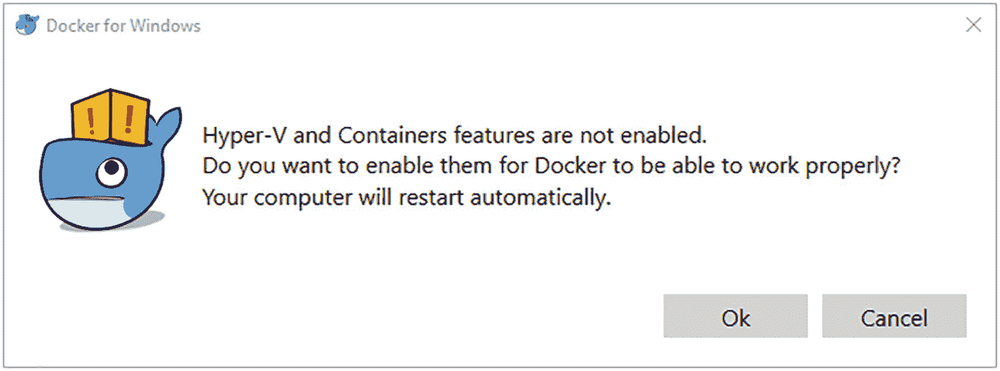
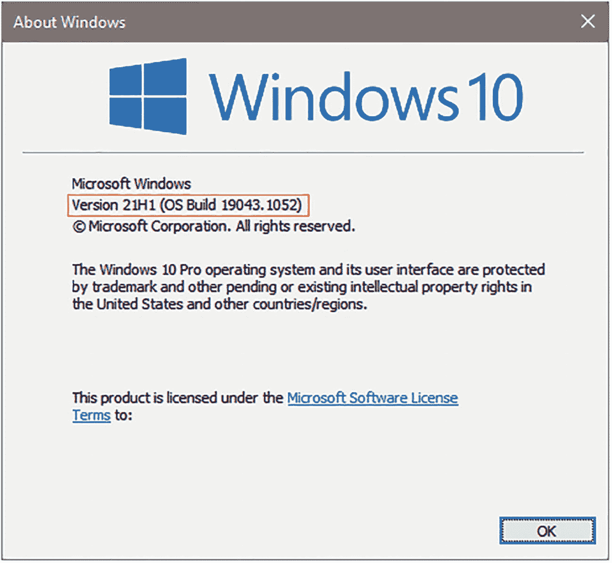
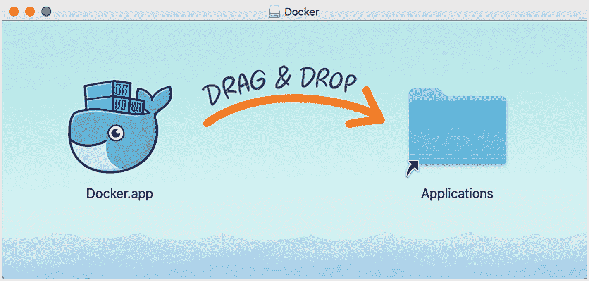
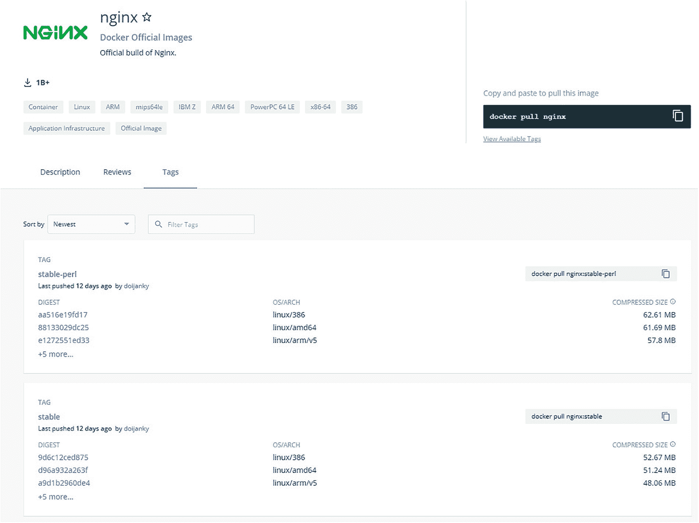

# 2.101 号码头

现在你对 Docker 的工作原理和它的流行程度有了一点了解，在这一章中，你将学习一些与 Docker 相关的不同术语。您还将学习如何安装 Docker 并理解 Docker 术语，如图像、容器、Docker 文件和 Docker 合成。您还可以使用一些简单的 Docker 命令来创建、运行和停止 Docker 容器。

## 安装 Docker

Docker 支持 Linux、macOS 和 Windows 平台。在大多数平台上安装 Docker 很简单，我稍后会讲到。Docker Inc .提供 Docker 平台的社区版和企业版。

企业版具有与社区版相同的功能，但是它提供了额外的支持和认证的容器、插件和基础设施。对于本书的目的以及大多数一般的开发和生产用途，社区版是合适的，因此我将在本书中使用它。

### 在 Windows 上安装 Docker

Windows 上的 Docker 需要满足一些先决条件，然后才能安装它。其中包括:

*   Hyper-V 支持

*   硬件虚拟化支持:这通常是从系统 BIOS 中启用的

*   目前仅支持 64 位版本的 Windows 10(专业版/教育版/企业版，周年更新版本为 v1607)

如果您查看这些先决条件，您会注意到这看起来像是虚拟化设置所需要的，但是您在前一章中已经了解到 Docker 不是虚拟化。那么为什么 Docker for Windows 需要虚拟化所需的特性呢？

简短的回答是 Docker 依赖于众多特性，比如名称空间和`cgroups`，而这些在 Windows 上是没有的。为了绕过这个限制，Docker for Windows 创建了一个运行 Linux 内核的轻量级 Hyper-V 容器。如果你的电脑安装了 Windows 10 家庭版，你应该安装带有 WSL 2 后端的 Docker Desktop。这将在下一节中解释。

让我们把重点放在安装 Docker CE for Windows 上。本节假设所有先决条件都已满足，并且 Hyper-V 已启用。前往 [`https://store.docker.com/editions/community/docker-ce-desktop-windows`](https://store.docker.com/editions/community/docker-ce-desktop-windows) 下载 Docker CE。

Note

确保您选择了稳定的频道，并单击“获取 Docker CE”按钮。

作为安装的一部分，可能会提示您启用 Hyper-V 和容器支持(参见图 [2-1](#Fig1) )。



图 2-1

启用 Hyper-V 和容器功能

单击确定并完成安装。您可能需要重新启动系统，因为启用 Hyper-V 是 Windows 系统的一项功能。安装此功能需要重新启动才能启用。

安装完成后，打开一个命令提示符窗口(或者 PowerShell，如果您喜欢的话),键入以下命令检查 Docker 是否已安装并正常工作。

```py
docker run --rm hello-world

```

如果安装顺利，您应该会看到清单 [2-1](#PC2) 中所示的响应。

```py
docker run --rm hello-world
Unable to find image 'hello-world:latest' locally
latest: Pulling from library/hello-world
b8dfde127a29: Pull complete
Digest: sha256:9f6ad537c5132bcce57f7a0a20e317228d382c3cd61edae14650eec68b2b345c
Status: Downloaded newer image for hello-world:latest

Hello from Docker!
This message shows that your installation appears to be working correctly.

To generate this message, Docker took the following steps:
 1\. The Docker client contacted the Docker daemon.
 2\. The Docker daemon pulled the "hello-world" image from the Docker Hub.
    (amd64)
 3\. The Docker daemon created a new container from that image which runs the
 executable that produces the output you are currently reading.
 4\. The Docker daemon streamed that output to the Docker client, which sent it
 to your terminal.

To try something more ambitious, you can run an Ubuntu container with:
 $ docker run -it ubuntu bash

Share images, automate workflows, and more with a free Docker ID:
 https://hub.docker.com/

For more examples and ideas, visit:
 https://docs.docker.com/get-started/
...

Listing 2-1Response from the docker run command on Windows

```

我们稍后将深入研究这些命令的含义，所以不要担心理解它们。如果您看到“安装似乎工作正常”的消息，您现在应该没事了。

### 使用 WSL2 后端在 Windows 上安装 Docker

#### 关于 WSL

在 2016 年 Windows 周年更新中宣布，Windows Subsystem for Linux (WSL)是开发人员从 Windows 中运行 GNU/Linux 应用程序的一种方式，无需第三方虚拟机设置或必须双重启动到 Linux。WSL 支持大多数命令行应用程序，对 GUI 应用程序的支持仍处于早期预览模式。

在 WSL 的第一个版本中，微软捆绑了一个定制的兼容层，用于在 Windows 中运行 Linux 二进制可执行文件，而无需重写或重新编译应用程序的源代码。微软使用一个转换层来实现这一点，该转换层从 Linux 应用程序中截取 Linux 系统调用，并将它们转换成 Windows 系统调用。

对于 WSL2，微软通过发布一个带有 Linux 内核的轻量级虚拟机(VM ),完全重新构建了 WSL 的工作方式。这个轻量级 VM 充当 Linux 应用程序的执行层。由于 Linux 应用程序现在在轻量级虚拟机上的 Linux 内核上本地运行，而不是使用转换层，因此与 WSL 的第一版相比，WSL2 支持 Linux 内核的所有功能，并提高了 Linux 应用程序的性能。

虽然虚拟机带来了大量资源使用的问题，但 Windows 在幕后管理 WSL2 虚拟机，并完成动态内存分配，随着应用程序请求/释放内存，增加/减少内存消耗。WSL2 仍处于早期阶段，您可能会偶尔遇到一些问题/速度变慢或大量消耗内存。快速重启 Windows 可以缓解这些问题。您也可以关闭并重新启动虚拟机，这将使 Windows 释放 Windows 保留的内存。

#### 安装和启用 WSL2 的要求

在安装 WSL2 之前，请确保您的计算机安装了 Windows 10 64 位版本 1903 或更高版本。WSL2 不能在低于 1903 的版本上工作。你可以在终端提示符下输入 winver 来检查版本，如图 [2-2](#Fig2) 所示。



图 2-2

检查红色框中突出显示的 Windows 版本

WSL2 的安装步骤详见微软网站 [`https://docs.microsoft.com/en-us/windows/wsl/install-win10`](https://docs.microsoft.com/en-us/windows/wsl/install-win10) 。按照手动安装步骤下列出的步骤安装 WSL2。我强烈建议您也安装 Windows 终端，就像在前面的链接中提到的那样，因为它使得在 WSL2 中运行 Docker 命令更加容易。

一旦安装了 WSL，运行以下命令以确保 WSL2 被设置为默认版本。

```py
wsl --set-default-version 2

```

在 [`https://desktop.docker.com/win/stable/amd64/Docker%20Desktop%20Installer.exe`](https://desktop.docker.com/win/stable/amd64/Docker%2520Desktop%2520Installer.exe) 下载并运行安装程序，安装 Docker Desktop with WSL2 Backend。安装完成后，打开一个命令提示符窗口(或者 PowerShell，如果您喜欢的话),键入以下命令检查 Docker 是否已安装并正常工作。

```py
docker run –rm hello-world

```

如果安装顺利，您应该会看到清单 [2-2](#PC5) 中的响应。

```py
docker run --rm hello-world
Unable to find image 'hello-world:latest' locally
latest: Pulling from library/hello-world
b8dfde127a29: Pull complete
Digest: sha256:9f6ad537c5132bcce57f7a0a20e317228d382c3cd61edae14650eec68b2b345c
Status: Downloaded newer image for hello-world:latest

Hello from Docker!
This message shows that your installation appears to be working correctly.

[...]

Listing 2-2Response from the docker run Command Using WSL

```

`"Hello from Docker!"`消息表明 Docker 已安装并正常工作。请注意，实际输出类似于清单 [2-1](#PC2) 中的输出，并且在本例中已经进行了调整。

### 在 macOS 上安装

安装 Docker for Mac 就像安装任何其他应用程序一样。进入 [`https://store.docker.com/editions/community/docker-ce-desktop-mac`](https://store.docker.com/editions/community/docker-ce-desktop-mac%25C2%25A0) ，点击 Get Docker for CE Mac (stable)链接，双击文件运行下载的安装程序。将 Docker whale 拖到 Applications 文件夹下安装，如图 [2-3](#Fig3) 所示。



图 2-3

安装 Docker

安装 Docker 后，打开终端应用程序并运行此命令以确认安装成功。

```py
docker run --rm hello-world

```

如果安装顺利，您应该会看到清单 [2-3](#PC7) 中所示的响应。

```py
docker run --rm hello-world
Unable to find image 'hello-world:latest' locally
latest: Pulling from library/hello-world
b8dfde127a29: Pull complete
Digest: sha256:9f6ad537c5132bcce57f7a0a20e317228d382c3cd61edae14650eec68b2b345c
Status: Downloaded newer image for hello-world:latest

Hello from Docker!
This message shows that your installation appears to be working correctly.

[...]

Listing 2-3Response from the docker run Command on macOS

```

“码头工人向你问好！”消息表明 Docker 已安装并正常工作。请注意，实际的输出类似于清单 [2-1](#PC2) 中的输出，在本例中已经进行了调整。

### 在 Linux 上安装

要在 Linux 上安装 Docker，请访问 [`https://www.docker.com/community-edition`](https://www.docker.com/community-edition) 。选择您正在使用的发行版，按照命令安装 Docker。

以下部分概述了在 Ubuntu 上安装 Docker 所需的步骤。

1.  更新`apt`索引:

1.  安装在 HTTPS 上使用存储库所需的必要软件包:

```py
sudo apt-get update

```

1.  安装 Docker 的官方 GPG 密钥:

```py
sudo apt-get install \
    apt-transport-https \
    ca-certificates \
    curl \
    software-properties-common

```

1.  添加 Docker 的稳定存储库:

```py
curl -fsSL https://download.docker.com/linux/ubuntu/gpg | sudo apt-key add -

```

1.  更新`apt`包索引:

```py
sudo add-apt-repository \
   "deb [arch=amd64] https://download.docker.com/linux/ubuntu \
   $(lsb_release -cs) \
   stable"

```

1.  安装 Docker:

```py
sudo apt-get update

```

```py
sudo apt-get install docker-ce

```

#### 附加步骤

Docker 通过 root 用户拥有的 UNIX 套接字进行通信。您可以通过以下步骤避免键入`sudo`:

Warning

Docker 组权限仍然等同于 root 用户。

1.  创建码头工人组:

1.  将您的用户添加到`docker`组:

```py
sudo groupadd docker

```

1.  注销并重新登录。运行以下命令，确认 Docker 安装正确:

```py
sudo usermod -aG docker $USER

```

```py
docker run --rm hello-world

```

如果安装顺利，您应该会看到清单 [2-4](#PC17) 中所示的响应。

```py
docker run --rm hello-world
Unable to find image 'hello-world:latest' locally
latest: Pulling from library/hello-world
b8dfde127a29: Pull complete
Digest: sha256:9f6ad537c5132bcce57f7a0a20e317228d382c3cd61edae14650eec68b2b345c
Status: Downloaded newer image for hello-world:latest

Hello from Docker!
This message shows that your installation appears to be working correctly.
[...]

Listing 2-4Response from the docker run Command on Linux

```

“码头工人向你问好！”消息表明 Docker 已安装并正常工作。请注意，实际的输出类似于清单 [2-1](#PC2) 中的输出，在本例中已经进行了调整。

### 理解 Docker 的行话

现在，您已经安装并运行了 Docker，是时候学习与 Docker 相关的不同术语了。

#### 层

*层*是应用于由 Docker 文件中的指令表示的 Docker 图像的修改。通常，当基础图像发生变化时，会创建一个层。例如，考虑如下所示的 docker 文件:

```py
FROM ubuntu
Run mkdir /tmp/logs
RUN apt-get install vim
RUN apt-get install htop

```

在这种情况下，Docker 会将`ubuntu`图像视为基础图像，并添加三层:

*   一层用于创建`/tmp/logs`

*   安装`vim`的另一层

*   安装`htop`的第三层

当 Docker 构建映像时，每一层都堆叠在一起，并使用 union 文件系统合并成一个层。使用 SHA-256 哈希对图层进行唯一标识。这使得重用和缓存它们变得容易。当 Docker 扫描一个基本映像时，它会扫描组成该映像的所有层的 id，并开始下载这些层。如果图层存在于本地缓存中，它会跳过下载缓存的图像。

#### 码头工人图像

Docker image 是一个只读模板，它构成了应用程序的基础。它非常像一个 shell 脚本，为系统准备了所需的状态。更简单地说，它相当于一份烹饪食谱，上面有制作最终菜肴的一步一步的说明。

Docker 映像从基础映像开始，通常选择您最熟悉的操作系统，如 Ubuntu。在这个映像之上，您可以添加构建您的应用程序堆栈，在需要时添加包。对于一些最常见的应用程序堆栈，有许多预构建的映像，包括 Ruby on Rails、Django、PHP-FPM 和`nginx`等等。在高级规模上，为了保持图像大小尽可能小，您还可以从诸如 Alpine 甚至 scratch 之类的超薄包开始，这是 Docker 为构建其他图像保留的最小起始图像。

Docker 映像是使用一系列称为*指令*的命令在一个称为 *Dockerfile* 的文件中创建的。在项目存储库的根中出现 Dockerfile 是一个很好的指示，表明程序是容器友好的。您可以从关联的 Dockerfile 文件构建自己的映像，然后将构建的映像发布到注册表。您将在后面的章节中深入了解 Dockerfile。现在，将 Docker 映像视为最终的可执行包，它包含了运行应用程序所需的一切——源代码、所需的库和依赖项。

#### 码头标签

*标签*是唯一标识 Docker 图像的特定版本的名称。标签是纯文本标签，通常用于标识特定的细节，如版本、映像的基本操作系统或 Docker 映像的架构。

标记 Docker 映像使您能够灵活地唯一引用特定版本，从而在当前映像未按预期工作时更容易回滚到 Docker 映像的以前版本。

#### 码头集装箱

当在主机中运行时，Docker 映像产生一个具有自己的名称空间的进程，并被称为 *Docker 容器*。Docker 映像和容器之间的主要区别是存在一个称为*容器层*的薄读写层。对容器的文件系统所做的任何更改——比如写入新文件或修改现有文件——都是对这个可写容器层进行的。

需要把握的一个重要方面是，当容器运行时，更改会应用到容器层，而当容器停止/终止时，容器层不会被保存。因此，所有更改都将丢失。容器的这一方面还没有被很好地理解，因此，有状态的应用程序和那些需要持久数据的应用程序最初不被推荐作为容器化的应用程序。然而，有了 Docker 卷，就有办法绕过这个限制。第 [5](5.html) 章更详细地介绍了 Docker 卷。

#### 绑定装载和卷

回想一下，当容器运行时，对容器的任何更改都会出现在文件系统的容器层中。在容器被终止的情况下，更改会丢失，并且数据不再可访问。即使容器正在运行，从容器中获取数据也不是很简单。此外，写入容器的可写层需要一个存储驱动程序来管理文件系统。存储驱动程序在文件系统上提供了一个抽象，可用于保存更改，这种抽象通常会降低性能。

出于这些原因，Docker 提供了不同的方式将数据从 Docker 主机装载到容器中:卷、绑定装载或 tmpfs 卷。虽然 tmpfs 卷仅存储在主机系统的内存中，但绑定装载和卷存储在主机文件系统中。

第 5 章详细探讨了 Docker 卷。

#### 坞站存储库

您之前了解到可以利用常见应用程序堆栈的现有映像，您是否想过这些映像存储在哪里，以及如何在构建应用程序时使用它们？Docker 存储库是一个你可以上传和存储 Docker 图片的地方。这些存储库允许在您的公司内或向公众轻松分发 Docker 图像。

#### 坞站注册表

Docker 存储库需要一个中心位置来存储数据——这个中心位置是一个 *Docker 注册表*。Docker 注册中心是各种 Docker 存储库的集合。Docker 注册中心由第三方公司托管，如果您需要满足更严格的合规性要求，也可以自行托管。Docker Hub 是一个常用的 Docker 注册表。其他一些流行的 Docker 注册表包括:

*   谷歌容器注册

*   亚马逊弹性容器注册中心

*   JFrog Artifactory

这些注册表中的大多数还允许将您推送的图像的可见性级别设置为公共/私有。私人注册将防止您的 Docker 图像被公众访问，允许您设置访问控制，以便只有授权用户才能使用您的 Docker 图像。

#### Dockerfile

一个 *Dockerfile* 是一组指令，告诉 Docker 如何构建一个映像。典型的 Dockerfile 文件包括以下内容:

*   一个`FROM`指令，指示 Docker 什么是基本图像

*   传递环境变量的`ENV`指令

*   运行一些 shell 命令的`RUN`指令(例如，安装基础映像中没有的相关程序)

*   一个`CMD`或一个`ENTRYPOINT`指令，告诉 Docker 当一个容器启动时要运行什么可执行文件

正如你所看到的，Dockerfile 指令集有一个清晰简单的语法，这使得它很容易理解。在本书的后面，您将更深入地了解 Dockerfiles。

#### 码头工人引擎

Docker 引擎是 Docker 的核心部分。Docker Engine 是一个客户端-服务器应用程序，它提供了平台、运行时和工具，用于构建和管理 Docker 映像、Docker 容器等等。Docker 引擎提供以下功能:

*   docker daemon(坞站守护程序)

*   CLI 坞站

*   坞站 API

##### docker daemon(坞站守护程序)

Docker 守护进程是一种在主机后台运行的服务，它处理大部分 Docker 命令的繁重工作。这个守护进程监听 API 创建和管理 Docker 对象(如容器、网络和卷)的请求。Docker 守护进程还可以与其他守护进程对话，以管理和监控 Docker 容器。守护进程间通信的一些例子包括用于容器度量监控的通信数据狗和用于容器安全监控的 Aqua。

##### CLI 坞站

Docker CLI 是您与 Docker 交互的主要方式。Docker CLI 公开了一组您可以提供的命令。Docker CLI 将请求转发给 Docker 守护进程，后者执行必要的工作。

虽然 Docker CLI 包括大量的命令和子命令，但本书中提到的最常见的命令如下:

```py
docker build
docker pull
docker run
docker exec

```

Tip

Docker 在其文档页面上的 [`https://docs.docker.com/engine/reference/commandline/cli/`](https://docs.docker.com/engine/reference/commandline/cli/) 维护了所有 Docker 命令的广泛引用。

在任何时间点，在命令前面加上`help`将会打印出关于该命令的所需文档。例如，如果您不确定从哪里开始使用 Docker CLI，您可以键入以下内容:

```py
docker help

Usage:  docker COMMAND

A self-sufficient runtime for containers

Options:
      --config string      Location of client config files (default
                           ".docker")
  -D, --debug              Enable debug mode
  -H, --host list          Daemon socket(s) to connect to
  -l, --log-level string   Set the logging level
                           ("debug"|"info"|"warn"|"error"|"fatal")
                           (default "info")
[..]

```

如果您想了解关于 Docker `pull`的更多信息，请键入以下内容:

```py
docker help pull

Usage:  docker pull [OPTIONS] NAME[:TAG|@DIGEST]

Pull an image or a repository from a registry

Options:
  -a, --all-tags                Download all tagged images in the repository
      --disable-content-trust   Skip image verification (default true)
      --platform string         Set platform if server is multi-platform
                                capable

```

##### 坞站 API

Docker 还提供了与 Docker 引擎交互的 API。如果需要从应用程序内部创建或管理容器，这将非常有用。Docker CLI 支持的几乎所有操作都可以通过 API 来完成。

开始使用 Docker API 最简单的方法是使用`curl`发送一个 API 请求。Windows Docker 主机可以访问 TCP 端点:

```py
curl http://localhost:23img/json
[{"Containers":-1,"Created":1511223798,"Id":"sha256:f2a91732366c0332ccd7afd2a5c4ff2b9af81f549370f7a19acd460f87686bc7","Labels":null,"ParentId":"","RepoDigests":["hello-world@sha256:66ef312bbac49c39a89aa9bcc3cb4f3c9e7de3788c944158df3ee0176d32b751"],"RepoTags":["hello-world:latest"],"SharedSize":-1,"Size":1848,"VirtualSize":1848}]

```

在 Linux 和 Mac 上，同样可以通过使用`curl`向 UNIX 套接字发送请求来实现:

```py
curl --unix-socket /var/run/docker.sock -X POST httpimg/json

[{"Containers":-1,"Created":1511223798,"Id":"sha256:f2a91732366c0332ccd7afd2a5c4ff2b9af81f549370f7a19acd460f87686bc7","Labels":null,"ParentId":"","RepoDigests":["hello-world@sha256:66ef312bbac49c39a89aa9bcc3cb4f3c9e7de3788c944158df3ee0176d32b751"],"RepoTags":["hello-world:latest"],"SharedSize":-1,"Size":1848,"VirtualSize":1848}]

```

#### 复合坞站

Docker Compose 是一个定义和运行多容器应用程序的工具。就像 Docker 允许您为您的应用程序构建一个映像并在您的容器中运行它一样，Compose 使用相同的映像结合一个定义文件(称为 *compose file* )来构建、启动和运行多容器应用程序，包括依赖容器和链接容器。

Docker Compose 最常见的用例是以与运行单个容器应用程序相同的简单、简化的方式运行应用程序及其依赖的服务(如数据库和缓存提供者)。第 7 章深入了解 Docker Compose。

#### 码头机器

Docker Machine 是一个用于在多个虚拟主机上安装 Docker 引擎和管理主机的工具。Docker Machine 允许在本地和远程系统上创建 Docker 主机，包括 Amazon Web Services、DigitalOcean 或 Microsoft Azure 等云平台。

### 动手码头工人

你现在可以尝试一下你在本章中读到的一些东西。在您开始研究各种可用的命令之前，请确保您的 Docker 安装是正确的，并且它按预期工作。

Tip

为了便于阅读和理解，我们使用了一个名为`jq`的工具来处理 Docker 的 JSON 输出。可以从 [`https://stedolan.github.io/jq/`](https://stedolan.github.io/jq/) 下载安装`jq`。

打开终端窗口，键入以下命令:

```py
docker info

```

您应该会看到这样的结果:

```py
docker info
Containers: 0
 Running: 0
 Paused: 0
 Stopped: 0
Images: 1
Server Version: 17.12.0-ce
Storage Driver: overlay2
 Backing Filesystem: extfs
 Supports d_type: true
 Native Overlay Diff: true
Logging Driver: json-file
Cgroup Driver: cgroupfs
Plugins:
 Volume: local
 Network: bridge host ipvlan macvlan null overlay
 Log: awslogs fluentd gcplogs gelf journald json-file logentries splunk syslog
Swarm: inactive
Runtimes: runc
Default Runtime: runc
Init Binary: docker-init
containerd version: 89623f28b87a6004d4b785663257362d1658a729
runc version: b2567b37d7b75eb4cf325b77297b140ea686ce8f
init version: 949e6fa
Security Options:
 seccomp
  Profile: default
Kernel Version: 4.9.60-linuxkit-aufs
Operating System: Docker for Windows
OSType: linux
Architecture: x86_64
CPUs: 2
Total Memory: 1.934GiB
Name: linuxkit-00155d006303
ID: Y6MQ:YGY2:VSAR:WUPD:Z4DA:PJ6P:ZRWQ:C724:6RKP:YCCA:3NPJ:TRWO
Docker Root Dir: /var/lib/docker
Debug Mode (client): false
Debug Mode (server): true
 File Descriptors: 19
 Goroutines: 35
 System Time: 2018-02-11T15:56:36.2281139Z
 EventsListeners: 1
Registry: https://index.docker.io/v1/
Labels:
Experimental: true
Insecure Registries:
 127.0.0.0/8
Live Restore Enabled: false

```

如果您没有看到类似的消息，请参考前面的章节来安装和验证您的 Docker 安装。

#### 使用 Docker 图像

现在，您可以尝试查看可用的 Docker 图像。为此，请键入以下命令:

```py
docker image ls

```

这里有一个本地可用图像的列表。

```py
REPOSITORY     TAG       IMAGE ID       CREATED          SIZE
hello-world    latest    f2a91732366c   2 months ago     1.85kB

```

如果您提取更多的图像或运行更多的容器，您会看到一个更大的列表。再来看`hello-world`图。为此，请键入以下内容:

```py
docker image inspect hello-world

 [
    {
        "Id": "sha256:f2a91732366c0332ccd7afd2a5c4ff2b9af81f549370f7a19acd460f87686bc7",
        "RepoTags": [
            "hello-world:latest"
        ],
        "RepoDigests": [
            "hello-world@sha256:66ef312bbac49c39a89aa9bcc3cb4f3c9e7de3788c944158df3ee0176d32b751"
        ],
        "Parent": "",
        "Comment": "",
        "Created": "2017-11-21T00:23:18.797567713Z",
        "Container": "fb0b4536aac3a96065e1bedb2b637a6019feec666c7699592206956c9d3adf5f",
        "ContainerConfig": {
            "Hostname": "fb0b4536aac3",
            "Domainname": "",
            "User": "",
            "AttachStdin": false,
            "AttachStdout": false,
            "AttachStderr": false,
            "Tty": false,
            "OpenStdin": false,
            "StdinOnce": false,
            "Env": [
                "PATH=/usr/local/sbin:/usr/local/bin:/usr/sbin:/usr/bin:/sbin:/bin"
            ],
            "Cmd": [
                "/bin/sh",
                "-c",
                "#(nop) ",
                "CMD [\"/hello\"]"
            ],
            "ArgsEscaped": true,
            "Image": "sha256:2243ee460b69c4c036bc0e42a48eaa59e82fc7737f7c9bd2714f669ef1f8370f",
            "Volumes": null,
            "WorkingDir": "",
            "Entrypoint": null,
            "OnBuild": null,
            "Labels": {}
        },
        "DockerVersion": "17.06.2-ce",
        "Author": "",
        "Config": {
            "Hostname": "",
            "Domainname": "",
            "User": "",
            "AttachStdin": false,
            "AttachStdout": false,
            "AttachStderr": false,
            "Tty": false,
            "OpenStdin": false,
            "StdinOnce": false,
            "Env": [
                "PATH=/usr/local/sbin:/usr/local/bin:/usr/sbin:/usr/bin:/sbin:/bin"
            ],
            "Cmd": [
                "/hello"
            ],
            "ArgsEscaped": true,
            "Image": "sha256:2243ee460b69c4c036bc0e42a48eaa59e82fc7737f7c9bd2714f669ef1f8370f",
            "Volumes": null,
            "WorkingDir": "",
            "Entrypoint": null,
            "OnBuild": null,
            "Labels": null
        },
        "Architecture": "amd64",
        "Os": "linux",
        "Size": 1848,
        "VirtualSize": 1848,
        "GraphDriver": {
            "Data": {
                "MergedDir": "/var/lib/docker/overlay2/5855bd20ab2f521c39e1157f98f235b46d7c12c9d8f69e252f0ee8b04ac73d33/merged",
                "UpperDir": "/var/lib/docker/overlay2/5855bd20ab2f521c39e1157f98f235b46d7c12c9d8f69e252f0ee8b04ac73d33/diff",
                "WorkDir": "/var/lib/docker/overlay2/5855bd20ab2f521c39e1157f98f235b46d7c12c9d8f69e252f0ee8b04ac73d33/work"
            },
            "Name": "overlay2"
        },
        "RootFS": {
            "Type": "layers",
            "Layers": [
                "sha256:f999ae22f308fea973e5a25b57699b5daf6b0f1150ac2a5c2ea9d7fecee50fdf"
            ]
        },
        "Metadata": {
            "LastTagTime": "0001-01-01T00:00:00Z"
        }
    }
]

```

`docker inspect`提供了大量关于图像的信息。重要的是图像属性`Env`、`Cmd`和`Layers`，它们告诉您环境变量、容器启动时运行的可执行文件以及与之相关的层。

环境变量如下:

```py
docker image inspect hello-world | jq .[].Config.Env
[
  "PATH=/usr/local/sbin:/usr/local/bin:/usr/sbin:/usr/bin:/sbin:/bin"
]

```

容器上的启动命令如下:

```py
docker image inspect hello-world | jq .[].Config.Cmd
[
  "/hello"
]

```

与图像相关联的层如下:

```py
docker image inspect hello-world | jq .[].RootFS.Layers
[
  "sha256:f999ae22f308fea973e5a25b57699b5daf6b0f1150ac2a5c2ea9d7fecee50fdf"
]

```

#### 使用真实的 Docker 图像

让我们看一个更复杂的图像。Nginx 是一个非常流行的 HTTP/S 反向代理服务器，也是一个负载平衡器和 web 服务器。

要下拉`nginx`图像，请键入以下内容:

```py
docker pull nginx

Using default tag: latest
latest: Pulling from library/nginx
e7bb522d92ff: Pull complete
6edc05228666: Pull complete
cd866a17e81f: Pull complete
Digest: sha256:285b4
Status: Downloaded newer image for nginx:latest

```

注意第一行:

```py
Using default tag: latest

```

由于您没有提供标签，Docker 使用名为`latest`的默认标签。Docker Store 列出了与图像相关的不同标签——因此，如果您正在寻找特定的标签/版本，最好在 Docker Store 上查看。图 [2-4](#Fig4) 显示了一个图像的典型标签列表。



图 2-4

Docker 存储 nginx 和可用标签的列表

让我们尝试拉一个带有特定标签的图像，称为`stable`。命令与以前一样。您必须在标签后添加一个冒号，以明确提及该标签:

```py
docker pull nginx:stable
stable: Pulling from library/nginx
b4d181a07f80: Already exists
e929f62bc938: Pull complete
ca8370516c99: Pull complete
6af693de7b22: Pull complete
c8fe6ce83489: Pull complete
7aa1fe8b4a84: Pull complete
Digest: sha256:a7c7c13
Status: Downloaded newer image for nginx:stable
docker.io/library/nginx:stable

```

您看到的不同十六进制数字是图像的相关层。默认情况下，Docker 从 Docker Hub 获取图像。您可以手动指定不同的注册表。如果 Docker 映像在 Docker Hub 上不可用，而是存储在其他地方，如本地托管的 artifactory，这将非常有用。要指定不同的注册表，您必须在映像名称前添加注册表路径。因此，如果注册表托管在`docker-private-docker-registry.example.com`上，那么`pull`命令现在将是:

```py
docker pull private-docker-registry.example.com/nginx

```

如果注册中心需要认证，您可以通过输入凭证`docker login`来登录，如下所示`:`

```py
docker login -u <username> -p <password> private-docker-registry.example.com

```

这样做的一个不利的副作用是，输入的密码会被记录下来，并以明文形式保存在 shell 历史记录中。Docker 会提醒你这条消息。

为了防止这种情况，您可以使用下面的命令将密码从一个文件传输到 Docker 的标准输入中，假设密码存储在一个名为`docker_password`的文件中

```py
docker login -u <username> --password-stdin private-docker-registry.example.com < docker_password

```

使用 PowerShell 的 Windows 用户可以使用`Get-Content` cmdlet 实现相同的功能，如下所示:

```py
Get-Content docker_password | docker login -u <username> --password-stdin private-docker-registry.example.com

```

现在有了图像，试着启动一个容器。要启动一个容器并运行相关的映像，请键入`docker run`。

```py
docker run -p 80:80 nginx

```

尝试发出一个 curl 请求，看看`nginx`web 服务器是否正在运行:

```py
curl http://localhost:80
<!DOCTYPE html>
<html>
<head>
<title>Welcome to nginx!</title>
<style>
    body {
        width: 35em;
        margin: 0 auto;
        font-family: Tahoma, Verdana, Arial, sans-serif;
    }
</style>
</head>
<body>
<h1>Welcome to nginx!</h1>
<p>If you see this page, the nginx web server is successfully installed and
working. Further configuration is required.</p>

<p>For online documentation and support please refer to
<a href="http://nginx.org/">nginx.org</a>.<br/>
Commercial support is available at
<a href="http://nginx.com/">nginx.com</a>.</p>

<p><em>Thank you for using nginx.</em></p>
</body>
</html>

```

这证实了`nginx`容器确实已经启动并正在运行。在这里，您会看到一个额外的标志，`-p`。这个标志告诉 Docker 将暴露的端口从 Docker 容器发布到主机。

标志后的第一个参数是 Docker 主机上必须发布的端口，第二个参数是指容器内的端口。您可以使用`docker inspect:`确认镜像发布端口

```py
docker image inspect nginx | jq .[].Config.ExposedPorts
{
  "80/tcp": {}
}

```

您可以通过更改`-p`标志后的第一个参数来更改 Docker 主机上发布服务的端口，如下所示:

```py
docker run -p 8080:80 nginx

```

现在尝试向 8080 端口发出一个`curl`请求:

```py
curl http://localhost:8080

```

您应该会看到相同的响应。要列出所有正在运行的容器，请键入`docker ps`:

```py
docker ps

docker ps
CONTAINER ID  IMAGE  COMMAND  CREATED  STATUS  PORTS  NAMES
fac5e92fdfac  nginx  "nginx -g 'daemon of…"  5 seconds ago       Up 3 seconds  0.0.0.0:80->80/tcp     elastic_hugle
3ed1222964de  nginx  "nginx -g 'daemon of…"  16 minutes agoUp 16 minutes 0.0.0.0:8080->80/tcp   clever_thompson

```

需要注意的一点是`names`列。Docker 会在容器启动时自动分配一个随机名称。由于您应该使用更有意义的名称，您可以通过提供`-n required-name`作为参数来为容器提供一个名称。

Tip

Docker 名称的格式为`adjective_surname`，并且是随机生成的，例外情况是，如果选择的形容词是`boring`并且姓氏是`Wozniak`，Docker 会重试名称生成。

需要注意的另一点是，当您创建第二个容器，并将其端口发布到端口 8080 时，另一个容器将继续运行。要停止容器，您必须键入以下命令:

```py
docker stop <container-id>

```

其中`container-id`可从该列表中获得。如果停靠成功，Docker 将回显集装箱 ID。如果集装箱拒绝停止，您可以发出`kill`命令强制停止并杀死集装箱:

```py
docker kill <container-id>

```

让我们试着停止一个容器。键入以下内容:

```py
docker stop fac5e92fdfac
fac5e92fdfac

```

现在，让我们试着杀死另一个容器:

```py
docker kill 3ed1222964de
3ed1222964de

```

让我们确认容器不再运行，为此，键入:

```py
docker ps

CONTAINER ID        IMAGE               COMMAND             CREATED             STATUS              PORTS               NAMES

```

那么，被拦下的集装箱呢——它们在哪里？默认情况下，`docker ps`只显示活动的、正在运行的容器。要列出所有容器，请键入:

```py
docker ps -a
CONTAINER ID        IMAGE         COMMAND          CREATEDSTATUS              PORTS         NAMES
fac5e92fdfac        nginx         "nginx -g 'daemon of…"6 minutes ago       Exited (0) 4 minutes ago    elastic_hugle
3ed1222964de        nginx         "nginx -g 'daemon of…"22 minutes ago      Exited (137) 3 minutes ago  clever_thompson
febda50b0a80        nginx         "nginx -g 'daemon of…"28 minutes ago      Exited (137) 24 minutes agoobjective_franklin
dc0c33a79fb7        nginx         "nginx -g 'daemon of…"33 minutes ago      Exited (137) 28 minutes ago   vigorous_mccarthy
179f16d37403        nginx         "nginx -g 'daemon of…"34 minutes ago      Exited (137) 34 minutes ago     nginx-test

```

即使容器已经被停止和/或终止，这些容器仍然存在于本地文件系统中。您可以通过键入以下命令来删除容器:

```py
docker rm <container-id>
docker rm fac5e92fdfac
fac5e92fdfac

```

让我们确认容器确实被移走了:

```py
docker ps -a
CONTAINER ID        IMAGE         COMMAND             CREATED             STATUS              PORTS         NAMES
3ed1222964de        nginx         "nginx -g 'daemon of…"28 minutes ago      Exited (137) 9 minutes ago  clever_thompson
febda50b0a80        nginx         "nginx -g 'daemon of…"34 minutes ago      Exited (137) 30 minutes ago      objective_franklin
dc0c33a79fb7        nginx         "nginx -g 'daemon of…"39 minutes ago      Exited (137) 34 minutes agovigorous_mccarthy
179f16d37403        nginx         "nginx -g 'daemon of…"40 minutes ago      Exited (137) 40 minutes ago     nginx-test

```

从这个表中可以看到，ID 为`fac5e92fdfac`的容器不再显示，因此已经被删除。

同样，您可以通过键入以下命令列出系统中存在的所有图像:

```py
docker image ls
REPOSITORY         TAG      IMAGE ID        CREATED        SIZE
nginx              1.12-alpine-perl          b6a456f1d7ae 4 weeks ago        57.7MB
nginx              latest   3f8a4339aadd    6 weeks ago   108MB
hello-world        latest   f2a91732366c    2 months ago  1.85kB
kitematic/hello-world-nginx   latest        03b4557ad7b9 2 years ago        7.91MB

```

让我们试着移除`nginx`图像:

```py
docker rmi 3f8a4339aadd
Error response from daemon: conflict: unable to delete 3f8a4339aadd (must be forced) - image is being used by stopped container dc0c33a79fb7

```

在这种情况下，Docker 拒绝删除图像，因为另一个容器中存在对该图像的引用。在移除所有使用特定图像的容器之前，您不能完全移除该图像。

## 摘要

在本章中，你学习了如何在不同的操作系统上安装 Docker。您还了解了如何验证 Docker 是否已安装并正常工作，以及一些与 Docker 相关的常用术语。最后，您在 Docker 上运行了一些实践练习，包括如何提取图像、运行容器、列出正在运行的容器，以及最后如何停止和删除容器。

下一章简要介绍 telegram，包括如何使用 telegram 创建和注册一个 bot，以及如何运行基于 Python 的 Telegram 消息 bot，它将从 Reddit 获取帖子。