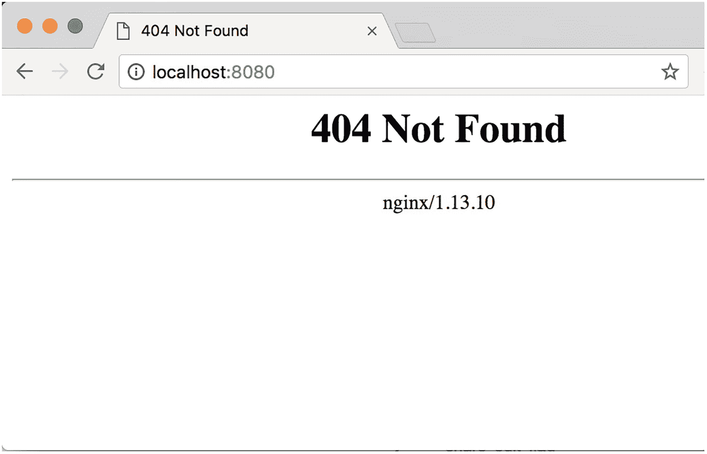
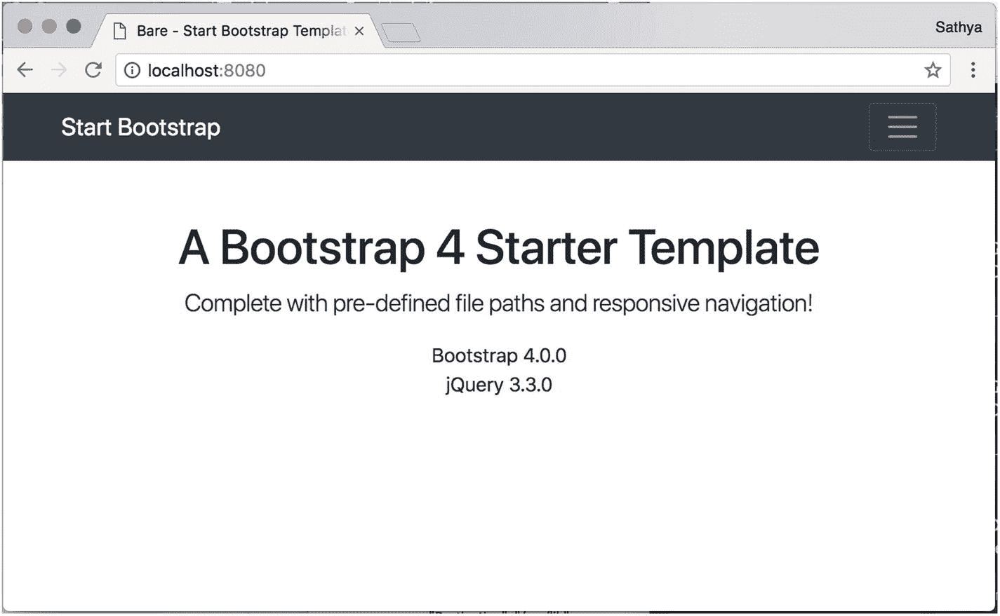
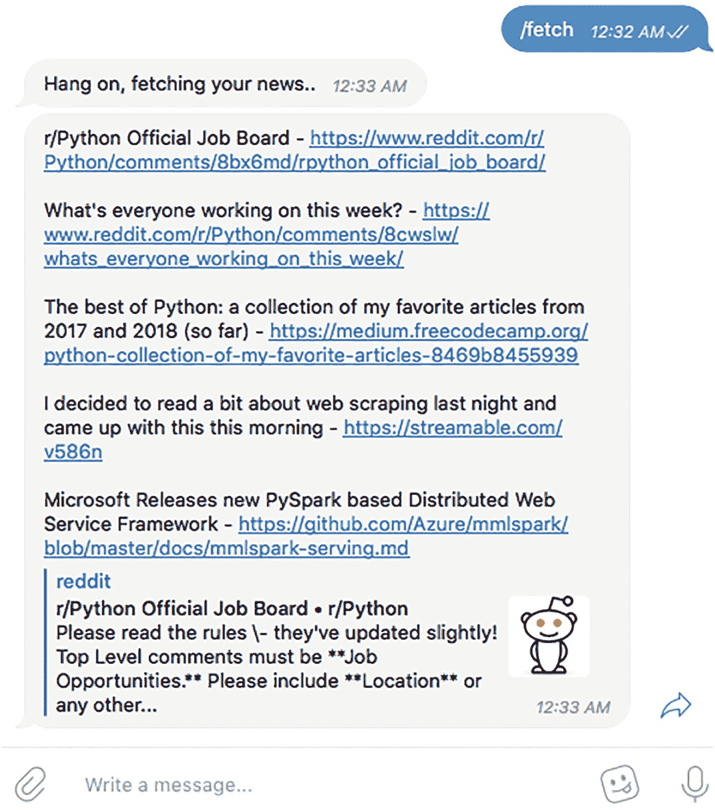
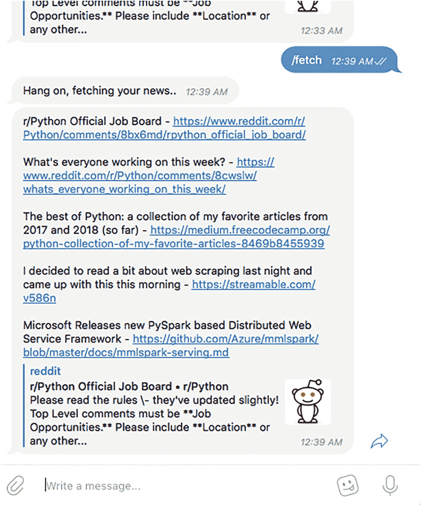

# 五、了解 Docker 卷

在前几章中，您了解了 Docker 及其相关术语，并深入了解了如何使用 Docker 文件构建 Docker 映像。在本章中，您将看到 Docker 容器的数据持久性策略，并了解为什么您需要特殊的数据持久性策略。

## 数据持久性

传统上，大多数计算解决方案都附带了持久化和保存数据的相关方法。对于虚拟机，会模拟一个虚拟磁盘，保存到该虚拟磁盘的数据会作为文件保存在主机上。亚马逊网络服务(AWS)等云提供商提供不同的服务，如亚马逊弹性块存储(EBS)和亚马逊弹性文件系统(EFS)。这些服务提供了可以安装在主机虚拟机上的端点；保存到这些装载点的数据被持久化和复制。

说到容器，情况就不一样了。容器是为无状态工作负载而设计的，容器层的设计表明了这一点。第 [2](2.html) 章解释了 Docker 映像是由各种层组成的只读模板。当映像作为容器运行时，会创建一个包含少量只写数据层的容器。这意味着

*   数据被紧紧地锁定在主机上，这使得运行跨多个容器和应用共享数据的应用变得困难。

*   当一个容器被终止时，数据不会持久，并且不可能以一种简单的方式从容器中提取数据。

*   写入容器的写入层需要存储驱动程序来管理文件系统。存储驱动程序在读/写速度方面不能提供可接受的性能水平，并且写入容器写层的大量数据会导致容器和 Docker 守护程序耗尽内存。

## Docker 容器中的数据丢失示例

为了演示 write 层的特性，让我们从 Ubuntu 基础映像中调出一个容器。您将在 Docker 容器中创建一个文件，停止容器，并查看容器的行为。

1.  首先创建一个`nginx`容器:

1.  打开容器内的终端:

```py
        docker run -d --name nginx-test  nginx

```

1.  将`nginx`的`default.conf`复制到一个新的配置文件:

```py
        docker exec -it nginx-test bash

```

1.  你不会修改`nginx-test.conf`的内容，因为它无关紧要。现在你需要停止容器。在 Docker 主机终端上，键入以下命令:

```py
        cd /etc/nginx/conf.d
        cp default.conf nginx-test.conf

```

1.  再次启动容器:

```py
        docker stop nginx-test

```

1.  打开容器内的终端:

```py
        docker start nginx-test

```

1.  让我们看看变化是否还在:

```py
        docker exec -it nginx-test bash

```

1.  因为容器只是被停止了，所以数据是持久的。让我们停止它，移除容器，然后调出一个新的，观察会发生什么:

```py
        cd /etc/nginx/conf.d
        ls
        default.conf  nginx-test.conf

```

1.  启动一个新容器:

```py
        docker stop nginx-test

        docker rm nginx-test

```

1.  现在，一个新的容器已经启动并运行，连接到容器的终端:

```py
        docker run -d --name nginx-test  nginx

```

1.  检查`nginx`的`conf.d`目录的内容:

```py
        docker exec -it nginx-test bash

```

```py
        cd /etc/nginx/conf.d
        ls
        default.conf

```

由于容器被移除，与容器相关联的只写层也被移除，并且所创建的文件不再可访问。对于容器化的有状态应用，比如需要数据库的应用，这意味着当一个现有的容器被移除或者一个新的容器被添加时，来自前一个容器的数据不再可访问。为了减轻这种情况，Docker 提供了各种策略来持久化数据。

*   tmpfs 安装

*   绑定安装

*   卷

### tmpfs 装载

顾名思义，tmpfs 在 tmpfs 中创建一个挂载，这是一个临时文件存储工具。tmpfs 中挂载的目录显示为挂载的文件系统，但存储在内存中，而不是存储在磁盘驱动器之类的永久存储中。

tmpfs 挂载仅限于 Linux 上的 Docker 容器。tmpfs 挂载是临时的，数据存储在 Docker 的主机内存中。一旦容器停止，tmpfs 挂载将被删除，写入 tmpfs 挂载的文件将丢失。

要创建 tmpfs 挂载，可以在运行容器时使用`--tmpfs`标志，如下所示:

```py
docker run -it --name docker-tmpfs-test --tmpfs /tmpfs-mount ubuntu bash

```

让我们检查一下容器:

```py
docker inspect docker-tmpfs-test | jq ".[0].HostConfig.Tmpfs"
{
 "/tmpfs-mount": ""
}

```

这个输出告诉您有一个 tmpfs 配置映射到容器的`/tmpfs-mount`目录。

tmpfs 挂载最适合于生成不需要持久化和不必写入容器可写层的数据的容器。

### 绑定安装

在绑定挂载中，主机上的文件/目录被挂载到容器中。相反，当使用 Docker 卷时，会在 Docker 主机上的 Docker 存储目录中创建一个新目录，并且该目录的内容由 Docker 管理。

让我们看看如何使用绑定坐骑。您将尝试将 Docker 主机的主目录挂载到容器内名为`host-home`的目录中。为此，请键入以下命令:

```py
docker run -it --name bind-mount-container -v $HOME:/host-home ubuntu bash

```

检查创建的容器揭示了关于装载的不同特征。

```py
docker inspect bind-mount-container | jq ".[0].Mounts"

[
  {
    "Type": "bind",
    "Source": "/home/sathya",
    "Destination": "/host-home",
    "Mode": "",
    "RW": true,
    "Propagation": "rprivate"
  }
]

```

这个输出表明挂载是绑定类型的，源(即被挂载的 Docker 主机的目录)是`/home/sathya`(即主目录)，挂载的目的地是`/host-home`。“`Propagation`”属性指绑定传播——该属性指示为绑定挂载创建的挂载是否被反映到该挂载的副本上。绑定传播仅适用于 Linux 主机。对于绑定装载，该属性通常不需要修改。RW 标志表示可以写入挂载的目录。让我们检查一下`host-home`的内容，看看挂载是否正确。

1.  使用以下命令打开容器的交互式终端:

1.  在容器的终端中，键入以下内容:

```py
        docker run -it -v $HOME:/host-home ubuntu bash

```

1.  该命令的输出应该是 Docker 主机主目录的列表。尝试在`host-home`目录中创建一个文件。为此，请键入以下命令:

```py
        cd  /host-home
        ls

```

```py
        cd /host-home
        echo "This is a file created from container having kernel `uname -r`" > host-home-file.txt

```

该命令创建一个名为`host-home-file.txt`的文件，该文件包含容器的`/host-home`目录中的文本`"This is a file created from container having kernel 4.9.87-linuxkit-aufs"`。请注意，内容会因主机操作系统和内核版本而异。

因为这是 Docker 主机主目录的绑定挂载，所以也应该在 Docker 主机的主目录中创建该文件。你可以看看是否确实如此。

1.  在 Docker 主机中打开一个新的终端窗口，并键入以下命令:

1.  您应该会看到以下输出，表明文件的存在:

```py
        cd ~
        ls host-home-file.txt

```

1.  现在检查文件的上下文:

```py
        ls host-home-file.txt
        host-home-file.txt

```

```py
        cat host-home-file.txt

```

这个文件应该与您在上一节中看到的内容相同。这证实了在容器中创建的文件在容器外确实是可用的。因为您关心的是容器停止、移除和重新启动后的数据持久性，所以让我们看看会发生什么。

通过在 Docker 主机终端中输入以下命令来停止容器。

```py
docker stop bind-mount-container
docker rm bind-mount-container

```

确认 Docker 主机上的文件仍然存在:

```py
cat ~/host-home-file.txt
This is a file created from container having kernel 4.9.87-linuxkit-aufs

```

绑定挂载非常有用，并且在应用的开发阶段最常用。通过使用绑定装载，您可以在将源目录装载为绑定装载时，使用与生产相同的容器来为生产准备应用。这允许开发人员拥有快速的代码测试迭代周期，而不需要重新构建 Docker 映像。

Caution

记住，对于绑定装载，数据流在 Docker 主机和容器上是双向的。任何破坏性的操作(比如删除目录)也会对 Docker 主机产生负面影响。

注意，在将主机操作系统目录作为绑定装载装载到容器中时要格外小心。如果挂载的目录范围很广，比如主目录(如前所示)或根目录，这就更重要了。一个失控的脚本或一个错误的`rm -rf`命令可以完全瘫痪 Docker 主机。为了减轻这种情况，您可以创建一个带有只读选项的绑定装载，以便以只读方式装载目录。

为此，您可以使用`docker run`命令提供一个只读参数。这些命令如下所示:

```py
docker run -it --name read-only-bind-mount -v $HOME:/host-home:ro ubuntu bash

```

现在检查创建的容器:

```py
docker inspect read-only-bind-mount | jq ".[0].Mounts"
[
  {
    "Type": "bind",
    "Source": "/home/sathya",
    "Destination": "/host-home",
    "Mode": "ro",
    "RW": false,
    "Propagation": "rprivate"
  }
]

```

您可以看到“`RW`”标志现在为假，`Mode`被设置为只读(`ro`)。让我们像前面一样尝试写入文件。

打开容器 Docker:

```py
docker run -it --name read-only-bind-mount -v $HOME:/host-home:ro ubuntu bash

```

键入以下命令在容器中创建一个文件:

```py
echo "This is a file created from container having kernel `uname -r`" > host-home-file.txt
bash: host-home-file.txt: Read-only file system

```

写操作失败，bash 告诉您这是因为文件系统是以只读方式挂载的。任何破坏性操作也会遇到同样的错误:

```py
rm host-home-file.txt
rm: cannot remove 'host-home-file.txt': Read-only file system

```

### Docker 卷

Docker volulmes 是当前推荐的保存容器中数据的方法。卷完全由 Docker 管理，与绑定装载相比有许多优势:

*   卷比绑定装载更容易备份或传输。

*   卷在 Linux 和 Windows 容器上都可以工作。

*   卷可以在多个容器之间共享，没有问题。

#### Docker 卷子命令

Docker 将卷 API 公开为一系列子命令。这些命令如下所示:

*   `docker volume create`

*   `docker volume inspect`

*   `docker volume ls`

*   `docker volume prune`

*   `docker volume rm`

#### 卷创建

`volume create`子命令用于创建命名卷。最常见的用例是生成命名卷。该命令的用法如下:

```py
docker volume create --name=<name of the volume> --label=<any extra metadata>

```

Tip

Docker 对象标签在第 [4](4.html) 章中讨论。

例如，该命令创建一个名为`nginx-volume`的命名卷:

```py
docker volume create --name=nginx-volume

```

#### 体积检查

`volume` `inspect`命令显示卷的详细信息。该命令的用法如下:

```py
docker volume inspect <volume-name>

```

以`nginx-volume`名称为例，您可以通过键入以下内容找到更多详细信息:

```py
docker volume inspect nginx-volume

```

这将产生以下结果:

```py
docker volume inspect nginx-volume
[
    {
        "CreatedAt": "2018-04-17T13:51:02Z",
        "Driver": "local",
        "Labels": {},
        "Mountpoint": "/var/lib/docker/volumes/nginx-volume/_data",
        "Name": "nginx-volume",
        "Options": {},
        "Scope": "local"
    }
]

```

当您想要复制/移动/备份卷时，此命令非常有用。mount path 属性列出了 Docker 主机上保存包含卷数据的文件的位置。

#### 列出卷

`volume ls`命令显示主机中存在的所有卷。用法如下:

```py
docker volume ls

```

#### 清理卷

`volume prune`命令删除所有未使用的本地卷。用法如下:

```py
docker volume prune

```

Docker 认为至少有一个容器未使用的卷是未使用的。由于未使用的卷最终会占用大量的磁盘空间，所以定期运行`prune`命令并不是一个坏主意，尤其是在本地开发机器上。您可以将`--force`附加到命令的末尾，当命令运行时，它不会要求确认删除。

#### 移除卷

`volume rm`命令删除其名称作为参数提供的卷。用法如下:

```py
docker volume rm <name>

```

对于之前创建的卷，命令如下:

```py
docker volume rm nginx-volume

```

Docker 不会删除正在使用的卷，并将返回一个错误。例如，如果您尝试删除连接到容器的`nginx-volume`卷，您将得到以下错误消息:

```py
docker volume rm nginx-volume

Error response from daemon: unable to remove volume: remove nginx-volume: volume is in use - [6074757a]

```

Note

即使容器被停止，Docker 也会认为该卷正在使用中。

长标识符是与卷相关联的容器的 ID。如果卷与多个容器相关联，将列出所有容器 id。使用`docker inspect`命令可以找到相关容器的更多细节，如下所示:

```py
docker inspect 6074757a

```

## 启动容器时使用卷

创建附加了卷的容器的命令如下所示:

```py
docker run --name container-with-volume -v data:/data ubuntu

```

在本例中，创建了一个名为`container-with-volume`的容器，其中一个名为`data`的卷被映射到容器内的`/data`目录。使用卷时，不提供主机目录的完整路径，而是提供存储数据的卷名。在后台，Docker 将通过将这个卷映射到主机上的一个目录来创建和管理它。

让我们检查使用以下命令创建的容器:

```py
docker inspect container-with-volume | jq ".[0].Mounts"
[
  {
    "Type": "volume",
    "Name": "data",
    "Source": "/var/lib/docker/volumes/data/_data",
    "Destination": "/data",
    "Driver": "local",
    "Mode": "z",
    "RW": true,
    "Propagation": ""
  }
]

```

查看`mounts`部分，您可以得出结论，Docker 在`/var/lib/docker/volumes/data/_data`的主机目录中创建了一个名为`data`的新卷，该卷的内容由 Docker 管理。这个卷被安装到容器的`/data`目录中。

也可以使用以下命令提前生成这些卷:

```py
docker volume create info

```

您可以使用`docker volume inspect`来检查卷的属性:

```py
docker volume inspect info
[
    {
        "CreatedAt": "2021-07-27T19:23:00Z",
        "Driver": "local",
        "Labels": {},
        "Mountpoint": "/var/lib/docker/volumes/info/_data",
        "Name": "images",
        "Options": {},
        "Scope": "local"
    }
]

```

现在，您可以在创建/运行容器时引用该卷，如下所示:

```py
docker run -it --name info-container -v info:/container-info ubuntu bash

```

让我们尝试创建与前面相同的文件。从容器内的终端，键入以下内容:

```py
echo "This is a file created from container having kernel `uname -r`" > /container-info/docker_kernel_info.txt

```

退出容器，然后使用以下命令停止并移除容器:

```py
exit
docker stop info-container
docker rm info-container

```

在没有卷的情况下，当容器被删除时，其可写层也将被删除。让我们看看当您启动一个附加了卷的新容器时会发生什么。请记住，这不是一个绑定挂载，因此您没有从 Docker 主机显式转发任何目录。下面的命令将在名为`new-info-container`的容器上启动一个 shell，其中一个名为`info`的卷被挂载到容器的`/container-info`目录中。

```py
docker run -it --name new-info-container -v info:/container-info ubuntu bash

```

检查容器的`/data-volume`目录的内容，如下所示:

```py
cd /container-info/
ls
docker-kernel-info.txt

```

检查`docker-kernel-info.txt`的内容，如下所示:

```py
cat docker_kernel_info.txt
This is a file created from container having kernel 4.9.87-linuxkit-aufs.

```

当您将文件写入装载并映射到卷的目录中时，数据将保存在卷中。当您启动一个新的容器时，提供卷名和`run`命令会将卷附加到容器上，使得任何以前保存的数据都可以用于新启动的容器。

## docker 文件中的卷指令

`VOLUME`指令将指令后面提到的路径标记为 Docker 管理的外部存储数据卷。语法如下所示:

```py
VOLUME ["/data-volume"]

```

指令后面提到的路径可以是 JSON 数组，也可以是用空格分隔的路径数组。

Note

docker 文件中的`VOLUME`指令不支持命名卷。因此，当容器运行时，卷名将是自动生成的名称。

## 练习

Building and Running an Nginx Container with Volumes and Bind Mounts

在本练习中，您将构建一个附加了 Docker 卷的`nginx` Docker 映像，其中包含一个自定义的`nginx`配置。在练习的第二部分，您将附加一个绑定挂载和一个包含静态 web 页面和自定义`nginx`配置的卷。本练习的目的是帮助您了解如何利用卷和绑定装载来简化本地开发。

**提示**在本书的 GitHub repo 上 [`https://github.com/Apress/practical-docker-with-python`](https://github.com/Apress/practical-docker-with-python) 的`source-code/chapter-5/exercise-1`目录下可以找到源代码和相关的 Dockerfile。

从 Dockerfile 文件开始，如下所示。

```py
FROM nginx:alpine
COPY default.conf /etc/nginx/conf.d
VOLUME ["/var/lib"]
EXPOSE 80

```

这个 Dockerfile 获取一个基本的`nginx`映像，用定制的`default.conf nginx`配置文件覆盖`default.conf nginx`配置文件，并将`/var/lib`声明为一个卷。您可以使用 repo 中的`docker-volume-bind-mount`目录中的以下命令来构建它:

```py
docker build -t sathyabhat/nginx-volume .

[+] Building 0.9s (7/7) FINISHED
 => [internal] load build definition from Dockerfile  0.0s
 => => transferring dockerfile: 37B 0.0s
 => [internal] load .dockerignore   0.0s
 => => transferring context: 2B  0.0s
 => [internal] load metadata for docker.io/library/nginx:alpine   0.8s
 => [internal] load build context   0.0s
 => => transferring context: 34B 0.0s
 => [1/2] FROM docker.io/library/nginx:alpine@sha256:ad14f34   0.0s
 => CACHED [2/2] COPY default.conf /etc/nginx/conf.d  0.0s
 => exporting to image  0.0s
 => => exporting layers 0.0s
 => => writing image sha256:f6f3af7 0.0s
 => => naming to docker.io/sathyabhat/nginx-volume 0.0s

```

在运行该图像之前，请查看定制的`nginx default.conf`内容:

```py
server {
    listen       80;
    server_name  localhost;

    location / {
        root   /srv/www/starter;
        index  index.html index.htm;
    }
    access_log  /var/log/nginx/access.log;
    access_log  /var/log/nginx/error.log;

    error_page   500 502 503 504  /50x.html;
    location = /50x.html {
        root   /usr/share/nginx/html;
    }

}

```

`nginx`配置是一个简单的配置；它告诉`nginx`向`/srv/www/starter/.`提供一个名为`index.html`的默认文件，让我们运行 Docker 容器。由于`nginx`正在监听端口 80，您需要告诉 Docker 使用`-p`标志发布端口:

```py
docker run -d --name nginx-volume  -p 8080:80 sathyabhat/nginx-volume

```

请注意，您是从 Docker 主机的端口 8080 发布到容器的端口 80。尝试通过导航至`http://localhost:8080`加载网页。



图 5-1

未装载源目录时出现 404 错误

当你加载网站时，你会看到一个 HTTP 404 - Page Not Found 错误(见图 [5-1](#Fig1) )。这是因为在`nginx config`档中，你指挥`nginx`为`index.html`服务。但是，您还没有将`index.html`文件复制到容器中，也没有将`index.html`的位置作为绑定挂载挂载到容器中。结果，`nginx`找不到`index.htm` l 文件。

您可以通过将网站文件复制到容器中来纠正这个错误，正如您在上一章中看到的那样。在本练习中，您将利用之前学习的绑定挂载特性，并挂载包含源代码的整个目录。所需要做的就是使用您在前面学到的绑定挂载标志。您不必对 docker 文件进行更改。

使用以下命令停止现有容器:

```py
docker stop nginx-volume

```

现在，使用绑定挂载启动一个新容器，如以下命令所示:

```py
docker run -d --name nginx-volume-bind -v "$(pwd)"/:/srv/www  -p 8080:80 sathyabhat/nginx-volume

```

使用以下命令确认容器正在运行:

```py
docker ps

```

您应该会看到正在运行的容器列表，如下所示:

```py
CONTAINER ID     IMAGE       COMMAND         CREATED        STATUS      PORTS       NAMES
54c857ca065b    sathyabhat/nginx-volume   "nginx -g 'daemon of..."6 minutes ago       Up 6 minutes        0.0.0.0:8080->80/tcpnginx-volume-bind

```

使用以下命令确认卷和装载是否正确:

```py
docker inspect nginx-volume-bind | jq ".[].Mounts"
[
  {
    "Type": "bind",
    "Source": "/code/practical-docker-with-python/docker-volume-bind-mount/",
    "Destination": "/srv/www",
    "Mode": "",
    "RW": true,
    "Propagation": "rprivate"
  },
  {
    "Type": "volume",
    "Name": "c069ba7",
    "Source": "/var/lib/docker/volumes/c069ba7/_data",
    "Destination": "/var/lib",
    "Driver": "local",
    "Mode": "",
    "RW": true,
    "Propagation": ""
  }
]

```

让我们再次导航到同一个 URL。如果 mounts 部分看起来不错，那么您应该会看到图 [5-2](#Fig2) 中的页面。



图 5-2

nginx 服务网页成功

成功！

Adding Volumes to Newsbot

在上一章的练习中，您为 Newsbot 编写了一个 docker 文件。然而，正如您可能已经注意到的，终止容器会重置 Newsbot 的状态，并且您需要重新定制该 bot。要解决这个问题，您将添加一个 SQLite 数据库，该数据库的数据文件将保存到 Docker 卷中。通过完成本练习，您将知道可以通过将容器中的数据保存到卷中，然后将该卷重新附加到新容器中来持久保存数据。

Newsbot 源代码已经从代码库进行了轻微的修改，以便将首选项(即新闻应该从哪个子编辑中获取)保存到 SQLite 数据库中。

**提示**在本书的 GitHub repo 上 [`https://github.com/Apress/practical-docker-with-python`](https://github.com/Apress/practical-docker-with-python) 的`source-code/chapter-5/exercise-2`目录下可以找到源代码和相关的 Dockerfile。

Dockerfile 文件修改如下:

```py
FROM python:3-alpine

RUN apk add gcc musl-dev python3-dev libffi-dev openssl-dev
WORKDIR /apps/subredditfetcher/
COPY . .
RUN pip install -r requirements.txt
CMD ["python", "newsbot.py"]

```

在这个 Dockerfile 文件中，从`python:3-alpine`开始作为基本图像。您添加了`RUN`步骤来安装 Python 包所需的一些库依赖项。然后将源代码复制到容器中，并安装所需的 Python 包。另一个显著的变化是增加了`VOLUME`指令。正如您在前面了解到的，这是为了告诉 Docker 将指定管理的目录标记为卷，即使您没有在`docker run`命令中指定所需的卷名。

使用以下命令构建映像:

```py
docker build -t sathyabhat/newsbot-sqlite .

```

构建日志如下所示:

```py
[+] Building 9.5s (11/11) FINISHED
 => [internal] load build definition from Dockerfile 0.1s
 => => transferring dockerfile: 38B   0.0s
 => [internal] load .dockerignore  0.1s
 => => transferring context: 2B 0.0s
 => [internal] load metadata for docker.io/library/python:3-alpine  2.3s
 => [auth] library/python:pull token for registry-1.docker.io 0.0s
 => [internal] load build context  0.1s
 => => transferring context: 6.23kB   0.0s
 => [1/5] FROM docker.io/library/python:3-alpine@sha256:eb31d7f  0.0s
 => CACHED [2/5] RUN apk add gcc musl-dev python3-dev libffi-dev openssl-dev 0.0s
 => CACHED [3/5] WORKDIR /apps/subredditfetcher/  0.0s
 => [4/5] COPY . .  0.1s
 => [5/5] RUN pip install -r requirements.txt  6.3s
 => exporting to image 0.4s
 => => exporting layers   0.3s
 => => writing image sha256:6605a7a   0.0s
 => => naming to docker.io/sathyabhat/newsbot-sqlite 0.0s

```

现在使用`docker run`命令运行机器人。注意，您通过`-v`标志提供了卷名。不要忘记将第 3 章中生成的 Newsbot API 密匙传递给`NBT_ACCESS_TOKEN`环境变量。

```py
docker run --rm --name newsbot-sqlite -e NBT_ACCESS_TOKEN -v newsbot-data:/data sathyabhat/newsbot-sqlite

```

`run`命令创建一个名为`newsbot-sqlite`的新容器，一个名为`newsbot-data`的卷被附加到该容器，并被挂载到容器内的`/data`目录中。`--rm`标志确保容器停止时被移走。

如果 bot 启动良好，您应该开始看到这些日志:

```py
docker run --rm --name newsbot-sqlite -e NBT_ACCESS_TOKEN=<token> -v newsbot-data:/data sathyabhat/newsbot-sqlite

INFO: <module> - Starting newsbot
INFO: get_updates - received response: {'ok': True, 'result': []}
INFO: get_updates - received response: {'ok': True, 'result': []}
INFO: get_updates - received response: {'ok': True, 'result': []}
INFO: get_updates - received response: {'ok': True, 'result': []}

```

比如说 Python，试着设置一个机器人应该从中获取数据的子编辑器。要做到这一点，从电报，找到机器人和类型`/source python`。

来自应用的日志应该确认收到了命令:

```py
INFO: - handle_incoming_messages - Chat text received: /source python
INFO: - handle_incoming_messages - Sources set for nnn to  python
INFO: - handle_incoming_messages - nnn
INFO: - post_message - posting Sources set as  python! to nnn

```

电报窗口现在应该如图 [5-3](#Fig3) 所示。


图 5-3

子编辑源的确认

现在您可以获取一些内容。为此，在 bot 窗口中键入`/fetch`。应用应该用一个加载消息和另一个聊天内容来响应(见图 [5-4](#Fig4) )。



图 5-4

机器人正在从子编辑中获取内容

现在，您可以通过停止 bot、移除容器并创建一个新容器来测试数据持久性。首先通过按 Ctrl+C 来停止 Newsbot。由于您使用`--rm`标志启动了容器，Docker 将自动移除容器。通过键入之前启动容器时使用的相同命令，创建一个新容器:

```py
docker run --rm --name newsbot-sqlite -e NBT_ACCESS_TOKEN -v newsbot-data:/data sathyabhat/newsbot-sqlite

```

现在，在电报聊天窗口中，再次键入`/fetch`。由于子编辑源已经保存到数据库中，您应该可以看到之前配置的子编辑的内容(见图 [5-5](#Fig5) )。



图 5-5

移除并启动新容器后，Newsbot 从 subreddit 获取内容

再次查看内容 Docker 音量设置工作正常。恭喜你！您已成功为此项目设置了数据持久性。

## 摘要

在本章中，您了解了为什么数据持久性在容器中是一个问题，以及 Docker 为管理数据持久性提供的不同策略。您还深入了解了如何配置*卷*，并了解了它们与*绑定挂载的不同之处。*最后，您进行了一些关于如何使用绑定挂载和卷的实践练习，并为 Newsbot 添加了卷支持。在下一章中，你将学习更多关于 Docker 网络的知识，并学习容器如何相互连接。