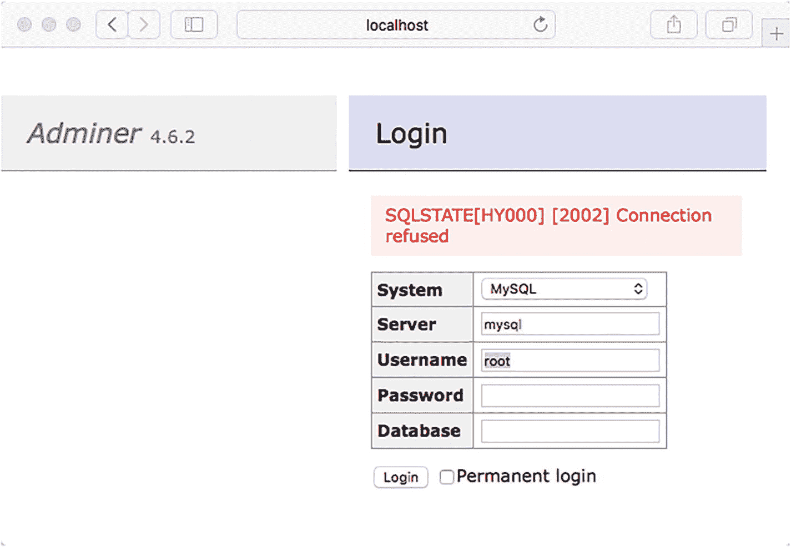
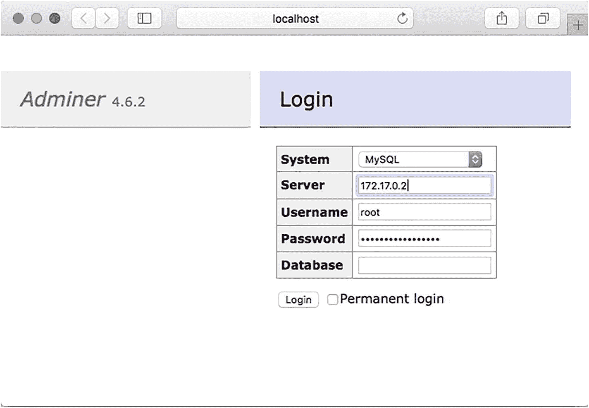
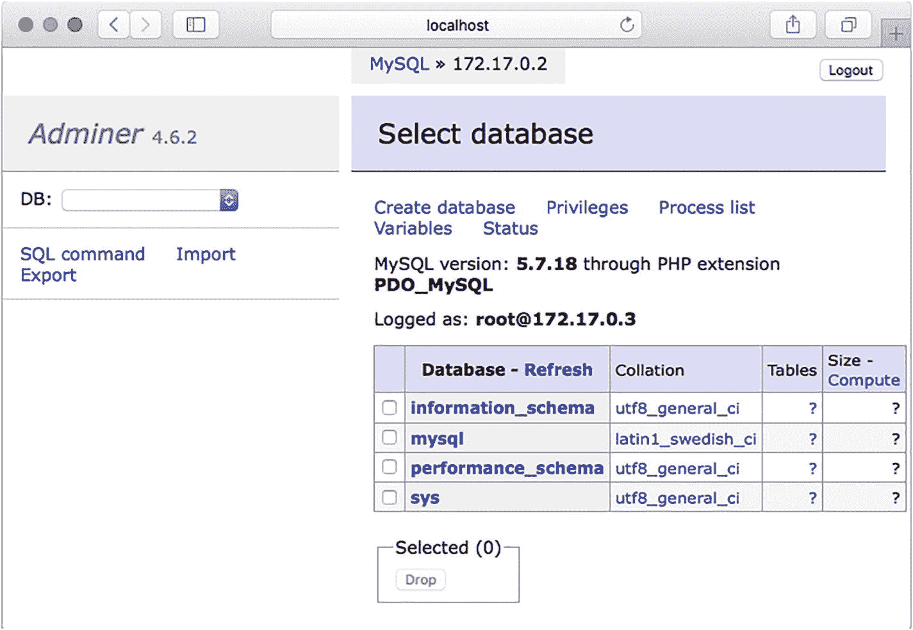
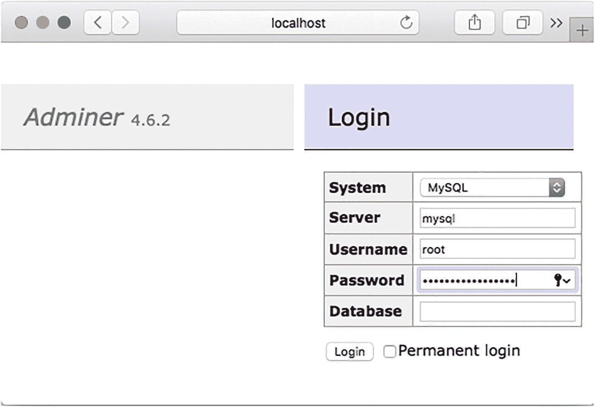
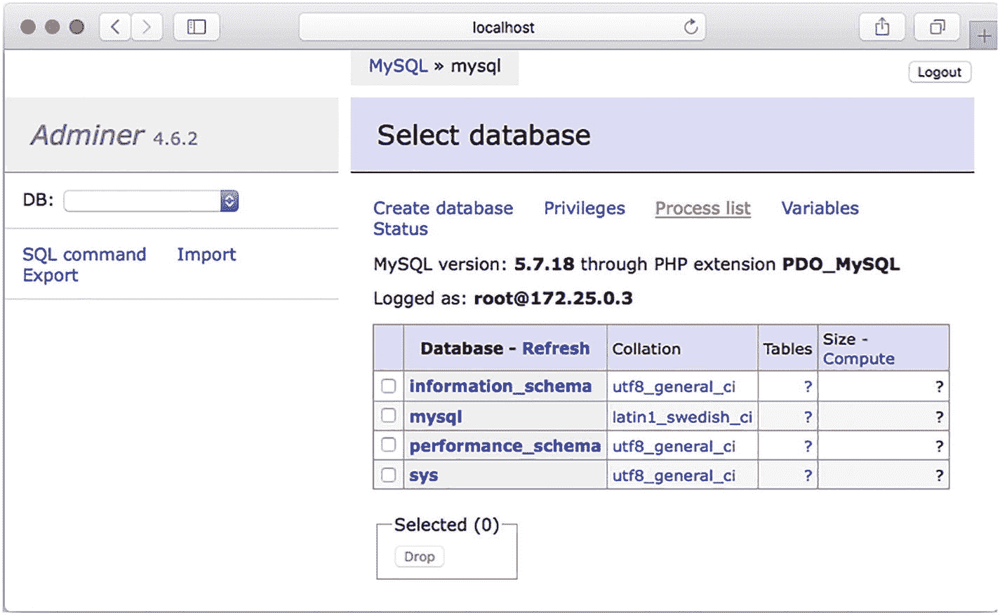
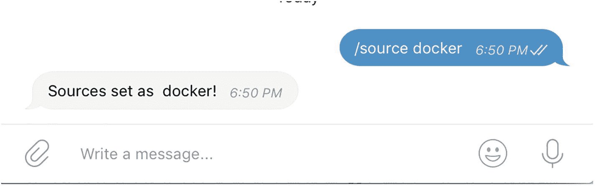
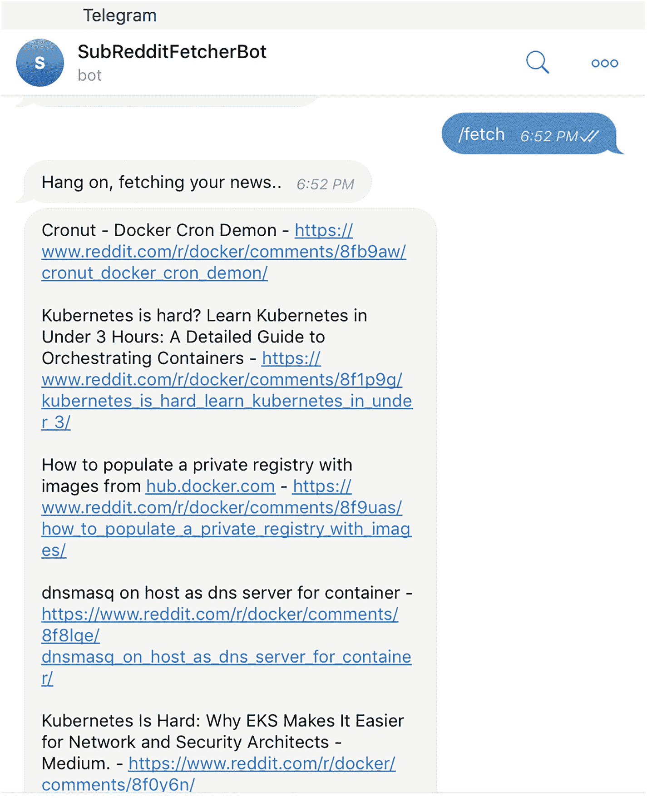

# 6.了解 Docker 网络

在前面的章节中，您了解了 Docker 及其相关术语，深入了解了如何使用 Docker 文件构建 Docker 映像，并了解了如何持久存储由容器生成的数据。

在这一章中，你将看到 Docker 中的网络，并了解容器如何在 Docker 的网络特性的帮助下相互对话和发现对方。

## 为什么我们需要容器网络？

传统上，大多数计算解决方案被认为是单一用途的解决方案，您很少会遇到单个主机(或虚拟机)托管多个工作负载的情况，尤其是生产工作负载。有了容器，情况就变了。随着轻量级容器和先进编排平台(如 Kubernetes 和 DC/OS)的出现，在同一台主机上运行不同工作负载的多个容器，并且应用程序的不同实例分布在多个主机上是非常常见的。在这种情况下，容器网络有助于允许(或限制)跨容器对话。为了促进这个过程，Docker 提供了不同的网络模式。

Tip

Docker 的联网子系统是通过可插拔驱动实现的；Docker 自带四个驱动程序，更多驱动程序可从 Docker Store 获得，可在 [`https://store.docker.com/search?category=network&q=&type=plugin`](https://store.docker.com/search%253Fcategory%253Dnetwork%2526q%253D%2526type%253Dplugin) 获得。

值得注意的是，Docker 的所有网络模式都是通过*软件定义网络* (SDN)实现的。具体来说，在 Linux 系统上，Docker 修改 iptables 规则以提供所需的访问/隔离级别。

### 默认 Docker 网络驱动程序

对于 Docker 的标准安装，以下网络驱动程序可用:

*   桥

*   圣体

*   覆盖物

*   麦克法兰

*   没有人

#### 桥接网络

*桥*网络是用户定义的网络，允许连接在同一网络上的所有容器相互通信。好处是在同一网桥网络上的容器可以相互连接、发现和对话，而不在同一网桥上的容器不能直接通信。当在同一主机上运行的容器需要相互通信时，桥接网络是有用的——如果需要通信的容器在不同的 Docker 主机上，那么就需要一个覆盖网络。

安装并启动 Docker 时，会创建一个默认的桥接网络，新启动的容器会连接到该网络。但是，如果您自己创建一个桥接网络，效果会更好。原因有很多:

*   **集装箱之间更好的隔离。**如您所知，同一个桥接网络上的容器是可发现的，并且可以相互通信。它们自动向对方公开所有端口，没有端口向外界公开。为每个应用程序提供一个单独的用户定义的桥接网络可以在不同应用程序的容器之间提供更好的隔离。

*   **跨容器的简单名称解析。**对于加入同一个桥接网络的服务，容器可以通过名称相互连接。对于默认桥接网络上的容器，容器相互连接的唯一方式是通过 IP 地址或使用`--link`标志，这已被否决。

*   **在用户定义的网络上轻松连接/分离容器。**对于默认网络上的容器，分离它们的唯一方法是停止正在运行的容器，并在新网络上重新创建它。

#### 主机网络

顾名思义，有了主机网络，容器就附加到了 Docker 主机上。这意味着任何到达主机的流量都被路由到容器。由于容器的所有端口都直接连接到主机，在这种模式下，发布端口的概念没有意义。当 Docker 主机上只有一个容器运行时，主机模式是最理想的。

#### 覆盖网络

覆盖网络创建了一个跨越多个 docker 主机的网络。这种类型的网络称为覆盖网络，因为它位于现有主机网络之上，允许连接到覆盖网络的容器跨多个主机进行通信。覆盖网络是一个高级主题，主要用于以群模式建立 Docker 主机集群的情况。覆盖网络还允许您加密通过它们的应用程序数据流量。

#### Macvlan 网络

Macvlan 网络利用 Linux 内核的能力，将基于 MAC 的多个逻辑地址分配给单个物理接口。这意味着您可以将 MAC 地址分配给容器的虚拟网络接口，使其看起来好像容器具有连接到网络的物理网络接口。这带来了独一无二的机会，尤其是对于那些希望物理接口存在并连接到物理网络的遗留应用程序。

Macvlan 网络需要对*网络接口卡* (NIC)的额外依赖，以支持所谓的“混杂”模式，这是一种特殊的模式，允许 NIC 接收所有流量并将其定向到控制器，而不是仅接收 NIC 预期接收的流量。

#### 无网络

当容器启动时，Docker 将容器连接到默认的桥接网络。桥接网络允许容器发出网络请求。尽管容器网络绝对是一个特性和亮点，但在许多情况下，应用程序必须完全隔离，不允许传入或传出请求——特别是对于安全性和合规性要求高的应用程序。在这种情况下，无网络就派上了用场。

顾名思义，无网络是指容器没有连接到任何网络接口，也没有接收或发送任何网络流量。在这种网络模式下，仅创建环回接口，允许容器与自身对话，但不能与外界或其他容器对话。

使用此处显示的命令，可以在无网络的情况下启动容器:

```py
docker run -d --name nginx --network=none -p 80:80 nginx

```

尝试`curl`端点导致瞬间`Connection Refused`，表明容器不接受连接。

```py
curl localhost
curl: (7) Failed to connect to localhost port 80 after 1 ms: Connection refused

```

如果您使用容器打开一个交互式终端，并尝试使用`curl`发出网络请求，如下所示:

```py
docker exec -it nginx sh
curl google.com
curl: (6) Could not resolve host: google.com

```

您将看到没有配置网络。容器无法接收或发送网络流量。

## 使用 Docker 网络

现在您已经从概念上理解了不同的网络模式，您可以尝试其中的一些模式。本章只看桥接网络，因为它是最常用的驱动程序。与其他子系统非常相似，Docker 附带了一个用于处理 Docker 网络的子命令。要开始，请尝试以下命令:

```py
docker network

```

您应该会看到可用选项的说明:

```py
docker network

Usage:   docker network COMMAND

Manage networks

Options:

Commands:
  connect     Connect a container to a network
  create      Create a network
  disconnect  Disconnect a container from a network
  inspect     Display detailed information on one or more networks
  ls          List networks
  prune       Remove all unused networks
  rm          Remove one or more networks

```

现在看看哪些网络可用。为此，请键入以下内容:

```py
docker network ls

```

至少，您应该看到列出了这些网络:

```py
docker network ls
NETWORK ID NAME DRIVER SCOPE
8ea951d9f963 bridge bridge local
790ed54b21ee host host local
38ce4d23e021 none null local

```

其中每一种都对应于前面提到的三种不同类型的网络——网桥、主机和无类型网络。您可以通过键入以下命令来检查网络的详细信息:

```py
docker network inspect <network id or name>

```

例如，如果您想要检查默认桥接网络，请键入以下命令:

```py
docker network inspect bridge
[
    {
        "Name": "bridge",
        "Id": "c540708",
        "Created": "2018-04-17T13:10:43.002552762Z",
        "Scope": "local",
        "Driver": "bridge",
        "EnableIPv6": false,
        "IPAM": {
            "Driver": "default",
            "Options": null,
            "Config": [
                {
                    "Subnet": "172.17.0.0/16",
                    "Gateway": "172.17.0.1"
                }
            ]
        },
        "Internal": false,
        "Attachable": false,
        "Ingress": false,
        "ConfigFrom": {
            "Network": ""
        },
        "ConfigOnly": false,
        "Containers": {},
        "Options": {
            "com.docker.network.bridge.default_bridge": "true",
            "com.docker.network.bridge.enable_icc": "true",
            "com.docker.network.bridge.enable_ip_masquerade": "true",
            "com.docker.network.bridge.host_binding_ipv4": "0.0.0.0",
            "com.docker.network.bridge.name": "docker0",
            "com.docker.network.driver.mtu": "1500"
        },
        "Labels": {}
    }
]

```

除其他外，您可以看到:

*   `Options`下的`com.docker.network.bridge.default_bridge`键表示网桥是默认的。

*   `"EnableIPv6": false`表示此网桥禁用了 IPv6。

*   `IPAM – Config`下的`"Subnet"`键表示 Docker 网络子网的 CIDR 为 172.17.0.0/16。这意味着多达 65，536 个集装箱可以连接到这个网络(这是从`/16`的 CIDR 区块得出的)。

*   `Options`下的`com.docker.network.bridge.enable_ip_masquerade`表示网桥启用了 IP 伪装。这意味着外界看不到容器的私有 IP，看起来好像请求来自 Docker 主机。

*   `com.docker.network.bridge.host_binding_ipv4`表示主机绑定为`0.0.0.0`。网桥绑定到主机上的所有接口。

相反，如果您检查无网络:

```py
docker network inspect none
[
    {
        "Name": "none",
        "Id": "d30afbe",
        "Created": "2017-05-10T10:37:04.125762206Z",
        "Scope": "local",
        "Driver": "null",
        "EnableIPv6": false,
        "IPAM": {
            "Driver": "default",
            "Options": null,
            "Config": []
        },
        "Internal": false,
        "Attachable": false,
        "Ingress": false,
        "ConfigFrom": {
            "Network": ""
        },
        "ConfigOnly": false,
        "Containers": {},
        "Options": {},
        "Labels": {}
    }
]

```

驱动程序`null`表示不会为此处理任何联网。

### 桥接网络

在创建桥接网络之前，您需要创建两个运行的容器:

*   MySQL 数据库服务器

*   用于管理 MySQL 数据库的网络门户

要创建 MySQL 容器，请运行以下命令:

```py
docker run -d --name mysql -p 3306:3306 -e MYSQL_ROOT_PASSWORD=dontusethisinprod mysql:8

```

因为您是在分离模式下启动的(由`-d`标志指定)，所以请跟踪日志，直到您确定容器已启动:

```py
docker logs -f mysql

```

结果应该是以下几行:

```py
Initializing database
[...]
Database initialized
[...]
MySQL init process in progress...
[...]
MySQL init process done. Ready for start-up.
[...]
[Note] mysqld: ready for connections.
Version: '8.0.26'  socket: '/var/run/mysqld/mysqld.sock'  port: 3306  MySQL Community Server (GPL)
[...]

```

如果您看到最后一行，MySQL 数据库容器就准备好了。创建`adminer`容器:

```py
docker run -d --name adminer -p 8080:8080 adminer

```

以下是`adminer`的日志:

```py
docker logs -f adminer
PHP 7.4.22 Development Server started

```

这意味着`adminer`准备好了。现在看看这两个容器——特别是它们的网络方面。

```py
docker inspect mysql | jq ".[0].NetworkSettings.Networks"
{
  "bridge": {
    "IPAMConfig": null,
    "Links": null,
    "Aliases": null,
    "NetworkID": "8ea951d",
    "EndpointID": "c33e38",
    "Gateway": "172.17.0.1",
    "IPAddress": "172.17.0.2",
    "IPPrefixLen": 16,
    "IPv6Gateway": "",
    "GlobalIPv6Address": "",
    "GlobalIPv6PrefixLen": 0,
    "MacAddress": "02:42:ac:11:00:03",
    "DriverOpts": null
  }
}

```

从这个输出中，您知道 MySQL 容器在默认的桥接网络上被分配了一个 IP 地址`172.17.0.2`。现在检查`adminer`容器:

```py
docker inspect adminer | jq ".[0].NetworkSettings.Networks"
{
  "bridge": {
    "IPAMConfig": null,
    "Links": null,
    "Aliases": null,
    "NetworkID": "8ea951d",
    "EndpointID": "a26bcc",
    "Gateway": "172.17.0.1",
    "IPAddress": "172.17.0.3",
    "IPPrefixLen": 16,
    "IPv6Gateway": "",
    "GlobalIPv6Address": "",
    "GlobalIPv6PrefixLen": 0,
    "MacAddress": "02:42:ac:11:00:04",
    "DriverOpts": null
  }
}

```

`adminer`容器与桥接网络内的`172.17.0.3`的 IP 地址相关联。但是，由于两个容器都绑定到了`0.0.0.0`的主机 IP，转换为 Docker 主机的所有接口，您应该能够通过它的端口进行连接。

在桥接网络中，无论是默认的 Docker 桥接网络还是您创建的自定义桥接网络(您将在本章的练习中看到这一点)，所有的容器都可以使用*及其容器名称*来访问。但是，只有当这些容器的端口已经暴露时，才能从主机访问它们。为了演示这一点，尝试通过`adminer`连接到数据库。导航至`http://localhost:8080`。

以`mysql`的身份进入服务器并尝试登录。你会注意到登录会失败(见图 [6-1](#Fig1) )。



图 6-1

与指定主机的连接失败

尝试再次登录，这次是在服务器框中。输入 MySQL 容器的 IP 地址，如图 [6-2](#Fig2) 所示。



图 6-2

尝试使用容器的 IP 地址登录

当你尝试登录时，应该会成功(见图 [6-3](#Fig3) )。



图 6-3

使用 IP 地址登录成功

登录成功。虽然当只有一个依赖容器时，输入 IP 是一种可以接受的变通方法，但是许多应用程序有多个依赖项。这种方法在这些情况下就失效了。

#### 创建命名桥接网络

在本节中，您将创建一个数据库网络，并尝试将 MySQL 和`adminer`容器连接到网络。您可以通过键入以下命令来创建桥接网络:

```py
docker network create <network name>

```

Docker 在指定子网方面给了你更多的选择，但是大部分情况下缺省值是好的。请注意，桥接网络只允许您创建一个子网。

使用以下命令创建一个名为`database`的网络:

```py
docker network create database

```

现在检查您创建的网络:

```py
docker network inspect database
[
    {
        "Name": "database",
        "Id": "8574145",
        "Created": "2021-07-31T15:58:11.4652433Z",
        "Scope": "local",
        "Driver": "bridge",
        "EnableIPv6": false,
        "IPAM": {
            "Driver": "default",
            "Options": {},
            "Config": [
                {
                    "Subnet": "172.18.0.0/16",
                    "Gateway": "172.18.0.1"
                }
            ]
        },
        "Internal": false,
        "Attachable": false,
        "Ingress": false,
        "ConfigFrom": {
            "Network": ""
        },
        "ConfigOnly": false,
        "Containers": {},
        "Options": {},
        "Labels": {}
    }
]

```

请注意，创建的网络有一个子网`172.18.0.0/16.`，使用以下命令停止并删除现有容器:

```py
docker stop adminer
docker rm adminer
docker stop mysql
docker rm mysql

```

现在启动 MySQL 容器，这次连接到数据库网络。该命令如下所示:

```py
docker run -d --network database --name mysql -p 3306:3306 -e MYSQL_ROOT_PASSWORD=dontusethisinprod mysql:8

```

注意附加的`--network`标志，它告诉 Docker 应该将容器附加到哪个网络。等待容器初始化。您还可以检查日志，确保容器准备就绪:

```py
docker logs -f mysql

```

结果应该是以下几行:

```py
Initializing database
[...]
Database initialized
[...]
MySQL init process in progress...
[...]
MySQL init process done. Ready for start up.
[...]
[Note] mysqld: ready for connections.
Version: '8.0.26'  socket: '/var/run/mysqld/mysqld.sock'  port: 3306  MySQL Community Server (GPL)
[...]

```

现在检查容器:

```py
docker inspect mysql | jq ".[0].NetworkSettings.Networks"
{
  "database": {
    "IPAMConfig": null,
    "Links": null,
    "Aliases": [
      "6149cb2453da"
    ],
    "NetworkID": "8574145",
    "EndpointID": "3343960402",
    "Gateway": "172.18.0.1",
    "IPAddress": "172.18.0.2",
    "IPPrefixLen": 16,
    "IPv6Gateway": "",
    "GlobalIPv6Address": "",
    "GlobalIPv6PrefixLen": 0,
    "MacAddress": "02:42:ac:12:00:02",
    "DriverOpts": null
  }
}

```

注意，容器是数据库网络的一部分。您也可以通过检查数据库网络来确认这一点。

```py
docker network inspect database | jq ".[0].Containers"
{
  "6149cb2": {
    "Name": "mysql",
    "EndpointID": "3343960",
    "MacAddress": "02:42:ac:12:00:02",
    "IPv4Address": "172.18.0.2/16",
    "IPv6Address": ""
  }
}

```

注意，数据库网络中的 containers 键包含 MySQL 容器。启动`adminer`容器。键入以下命令:

```py
docker run -d --name adminer -p 8080:8080 adminer

```

请注意，`--network`命令已被省略。这意味着`adminer`将连接到默认的桥接网络:

```py
docker inspect adminer | jq ".[0].NetworkSettings.Networks"
{
  "bridge": {
    "IPAMConfig": null,
    "Links": null,
    "Aliases": null,
    "NetworkID": "8ea951d",
    "EndpointID": "c1a5df0",
    "Gateway": "172.17.0.1",
    "IPAddress": "172.17.0.2",
    "IPPrefixLen": 16,
    "IPv6Gateway": "",
    "GlobalIPv6Address": "",
    "GlobalIPv6PrefixLen": 0,
    "MacAddress": "02:42:ac:11:00:02",
    "DriverOpts": null
  }
}

```

#### 将容器连接到命名的桥接网络

Docker 让你可以很容易地将一个容器连接到另一个网络上。为此，请键入以下命令:

```py
dockr network connect <network name> <container name>

```

您需要将`adminer`容器连接到数据库网络，如下所示:

```py
docker network connect database adminer

```

现在检查`adminer`容器:

```py
docker inspect adminer | jq ".[0].NetworkSettings.Networks"
{
  "bridge": {
    "IPAMConfig": null,
    "Links": null,
    "Aliases": null,
    "NetworkID": "8ea951d",
[...]
    "DriverOpts": null
  },
  "database": {
    "IPAMConfig": {},
    "Links": null,
    "Aliases": [
      "2a7363ec1888"
    ],
    "NetworkID": "8574145",
    [...]
    "DriverOpts": {}
  }
}

```

请注意，networks 键有两个网络，默认网桥网络和您刚刚连接到的数据库网络。因为容器不需要连接到默认的桥接网络，所以您可以断开它。为此，命令如下:

```py
docker network disconnect bridge adminer

```

现在使用下面的命令检查`adminer`容器，您可以只看到连接的数据库网络。

```py
docker inspect adminer | jq ".[0].NetworkSettings.Networks"
{
  "database": {
    "IPAMConfig": {},
    "Links": null,
    "Aliases": [
      "2a7363ec1888"
    ],
    "NetworkID": "8574145",
[...]
    "DriverOpts": {}
  }
}

```

桥接网络不再连接到`adminer`网络。通过导航到`http://localhost:8080`启动`adminer`。在服务器字段中，输入想要连接的容器名称，即数据库容器名称`mysql`，如图 [6-4](#Fig4) 所示。



图 6-4

通过命名主机连接到容器

输入详细信息，然后单击登录。登录应该成功，您应该会看到如图 [6-5](#Fig5) 所示的屏幕。



图 6-5

命名主机解析为 IP 并成功连接

因此，用户定义的桥接网络使得连接服务非常容易；你不必去寻找 IP 地址。Docker 通过让您使用容器的名称作为主机来连接到服务，使这变得很容易。Docker 处理容器名到 IP 地址的幕后翻译。

### 主机网络

在主机网络中，Docker 不为容器创建虚拟网络；相反，Docker 主机的网络接口被绑定到容器。

当您只有一个容器在主机上运行并且不需要任何桥接网络或网络隔离时，主机网络是非常好的。现在您将创建一个在主机模式下运行的`nginx`容器，看看如何运行它。

前面你看到已经有一个网络叫`host`。这不是控制网络是否是主机网络的名称；是司机。回想一下，主机网络有一个主机驱动程序，因此任何连接到主机网络的容器都将以主机网络模式运行。

要启动容器，只需传递`--network host`参数。尝试以下命令来启动一个`nginx`容器，并将容器的端口 80 发布到主机的 8080 端口。

```py
docker run -d --network host -p 8080:80 nginx:alpine
WARNING: Published ports are discarded when using host network mode

```

注意 Docker 警告您没有使用端口发布。因为容器的端口直接绑定到 Docker post，所以发布端口的概念不会出现。实际的命令应该如下所示:

```py
docker run -d --network host nginx:alpine

```

## 练习

Connecting a Mysql Container to a Newsbot Container

在前一章的练习中，您为 Newsbot 编写了一个 Dockerfile 并构建了容器。然后使用 Docker 卷跨容器持久化数据库。在本练习中，您将修改 Newsbot，以便数据持久保存到 MySQL 数据库，而不是保存到 SQLite DB。然后，您将创建一个定制的桥接网络来连接项目容器和 MySQL 容器。

**提示**在本书的 GitHub repo 上 [`https://github.com/Apress/practical-docker-with-python`](https://github.com/Apress/practical-docker-with-python) 的`source-code/chapter-6/exercise-1`目录下可以找到源代码和相关的 Dockerfile。

考虑下面的 Dockerfile 文件。它看起来，实际上，与你在第 5 章[的练习 2 中使用的 Dockerfile 非常相似。唯一需要改变的是 Newsbot 的代码，使它连接到 MySQL 服务器，而不是从 SQLite 数据库读取。](5.html)

```py
FROM python:3-alpine

RUN apk add gcc musl-dev python3-dev libffi-dev openssl-dev
WORKDIR /apps/subredditfetcher/
COPY . .
RUN pip install -r requirements.txt
CMD ["python", "newsbot.py"]

```

现在使用以下命令构建容器:

```py
docker build -t sathyabhat/newsbot-mysql .
[+] Building 2.9s (11/11) FINISHED
 => [internal] load build definition from Dockerfile   0.1s
 => => transferring dockerfile: 38B  0.0s
 => [internal] load .dockerignore 0.1s
 => => transferring context: 2B   0.0s
 => [internal] load metadata for docker.io/library/python:3-alpine 2.6s
 => [auth] library/python:pull token for registry-1.docker.io   0.0s
 => [1/5] FROM docker.io/library/python:3-alpine@sha256:1e8728b 0.0s
 => => resolve docker.io/library/python:3-alpine@sha256:1e8728b 0.0s
 => [internal] load build context 0.0s
 => => transferring context: 309B 0.0s
 => CACHED [2/5] RUN apk add gcc musl-dev python3-dev libffi-dev openssl-dev cargo   0.0s
 => CACHED [3/5] WORKDIR /apps/subredditfetcher/ 0.0s
 => CACHED [4/5] COPY . .   0.0s
 => CACHED [5/5] RUN pip install --upgrade pip && pip install -r requirements.txt 0.0s
 => exporting to image   0.0s
 => => exporting layers  0.0s
 => => writing image sha256:44cd813  0.0s
 => => naming to docker.io/sathyabhat/newsbot-mysql 0.0s

```

创建一个名为`newsbot`的新网络，容器将连接到这个网络。为此，请键入以下内容:

```py
docker network create newsbot

```

现在，您将打开一个新的 MySQL 容器，并将其连接到您之前创建的网络。因为您希望数据持久化，所以您还将 MySQL 数据库挂载到一个名为`newsbot-db`的卷上。这个练习使用`root`作为用户名，使用`dontusethisinprod`作为密码。这些凭证非常脆弱，我们强烈建议您不要在现实世界中使用它们。

键入以下命令启动 MySQL 容器:

```py
docker run -d --name mysql --network newsbot -v newsbot-db:/var/lib/mysql -e MYSQL_ROOT_PASSWORD=dontusethisinprod mysql:8

```

注意`--network`标志，它告诉 Docker 将`mysql`容器连接到名为`newsbot`的网络。MySQL 将所有与数据库相关的文件保存在`/var/lib/mysql`目录中，`-v newsbot-db:/var/lib/mysql`标志指示 Docker 将容器中`/var/lib/mysql`目录的内容保存到名为`newsbot-db`的卷中。这样，即使在容器被移除后，内容仍然存在。

遵循日志并验证 MySQL 数据库是否启动:

```py
docker logs mysql

Initializing database
[...]
Database initialized
[...]
MySQL init process in progress
[...]
MySQL init process done. Ready for start up.
[...]
2021-08-01T12:41:15.295013Z 0 [Note] mysqld: ready for connections.
Version: '8.0.26'  socket: '/var/run/mysqld/mysqld.sock'  port: 3306  MySQL Community Server (GPL)

```

最后几行表示 MySQL 数据库启动了。现在启动 Newsbot 容器，同时将其连接到您创建的`newsbot`网络。为此，请键入以下命令:

```py
docker run --rm --network newsbot --name newsbot-mysql -e NBT_ACCESS_TOKEN=<token> sathyabhat/newsbot-mysql

```

注意用第 [3 章](3.html)中生成的 Newsbot API 键的值替换`<token>`。

您应该会看到以下日志:

```py
INFO: <module> - Starting up
INFO: <module> - Waiting for 60 seconds for db to come up
INFO: <module> - Checking on dbs
INFO: get_updates - received response: {'ok': True, 'result': []}
INFO: get_updates - received response: {'ok': True, 'result': []}

```

因为创建了新卷，所以上一章设置的源不可用。

再次设置机器人应该从中获取数据的 subreddit，比如 Docker。要做到这一点，从电报，找到机器人和类型`/source docker`。来自应用程序的日志应该确认收到了命令:

```py
INFO: handle_incoming_messages - Chat text received: /source docker
INFO: handle_incoming_messages - Sources set for 7342383 to  docker
INFO: handle_incoming_messages - 7342383
INFO: post_message - posting Sources set as  docker! to 7342383
INFO: get_updates - received response: {'ok': True, 'result': []}
INFO: get_updates - received response: {'ok': True, 'result': []}
INFO: get_updates - received response: {'ok': True, 'result': []}
INFO: get_updates - received response: {'ok': True, 'result': []}

```

您的电报窗口应该如图 [6-6](#Fig6) 所示。



图 6-6

子编辑源的确认

现在您可以获取一些内容。为此，在 bot 窗口中键入`/fetch`。应用程序应该通过加载一个消息和另一个聊天内容来响应，如图 [6-7](#Fig7) 所示。



图 6-7

机器人正在从子编辑中获取内容

现在，您将确认 Newsbot 确实正在将源保存到数据库中。为此，使用以下命令连接到正在运行的`mysql`容器:

```py
docker exec --it mysql sh

```

现在，在容器外壳中，键入以下命令以连接到 MySQL 服务器:

```py
mysql –p

```

输入密码(如前所述)进行连接。如果您输入了正确的密码，将会收到以下消息:

```py
Welcome to the MySQL monitor.  Commands end with ; or \g.
Your MySQL connection id is 32
Server version: 8.0.26 MySQL Community Server - GPL
Copyright (c) 2000, 2021, Oracle and/or its affiliates.
Oracle is a registered trademark of Oracle Corporation and/or its
affiliates. Other names may be trademarks of their respective
owners.
Type 'help;' or '\h' for help. Type '\c' to clear the current input statement.
mysql>

```

在 MySQL 提示符下，键入以下命令以确保 Newsbot 数据库存在:

```py
show databases;

```

您应该会看到类似于以下列表的数据库列表:

```py
show databases;
+--------------------+
| Database           |
+--------------------+
| information_schema |
| mysql              |
| newsbot            |
| performance_schema |
| sys                |
+--------------------+
5 rows in set (0.03 sec)

```

键入以下命令选择数据库，然后获取名为`source`的表的内容:

```py
use newsbot
select * from source;
+-----------+------------+
| person_id | fetch_from |
+-----------+------------+
|   7342383 |  docker    |
+-----------+------------+
1 row in set (0.00 sec)

```

这向您展示了 Newsbot 可以成功地连接到 MySQL 容器并将数据保存到数据库中。

## 摘要

在这一章中，你学习了容器网络的基础知识和 Docker 网络的不同模式。您还学习了如何创建和使用定制的 Docker 桥接网络，并了解了对 Docker 主机网络的见解。最后，您运行了一些关于创建单独的数据库容器(使用 MySQL)的实践练习，并学习了如何将数据库容器连接到 Newsbot 项目。在下一章中，您将了解 Docker Compose，以及 Docker Compose 如何让您轻松运行多个相互依赖的容器。