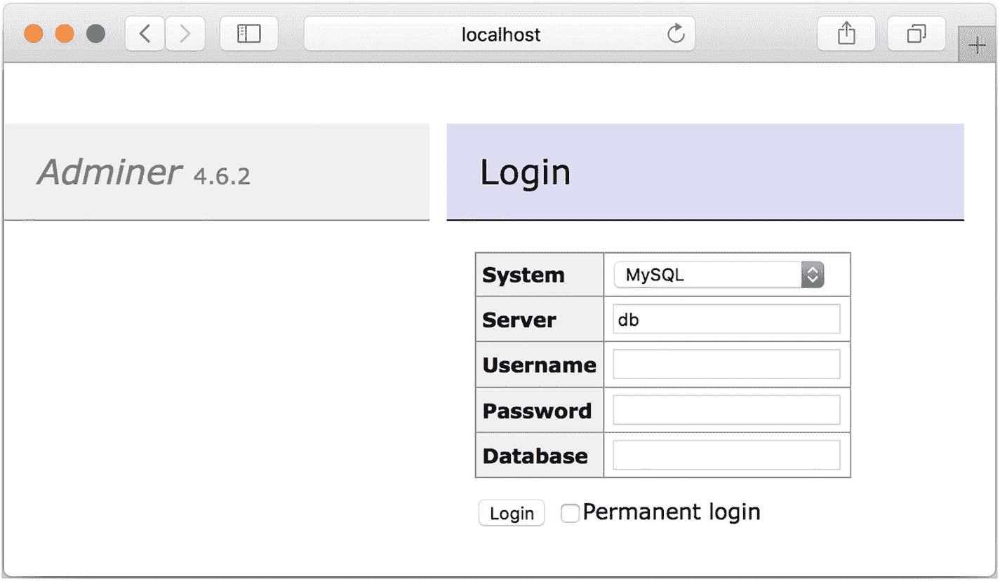
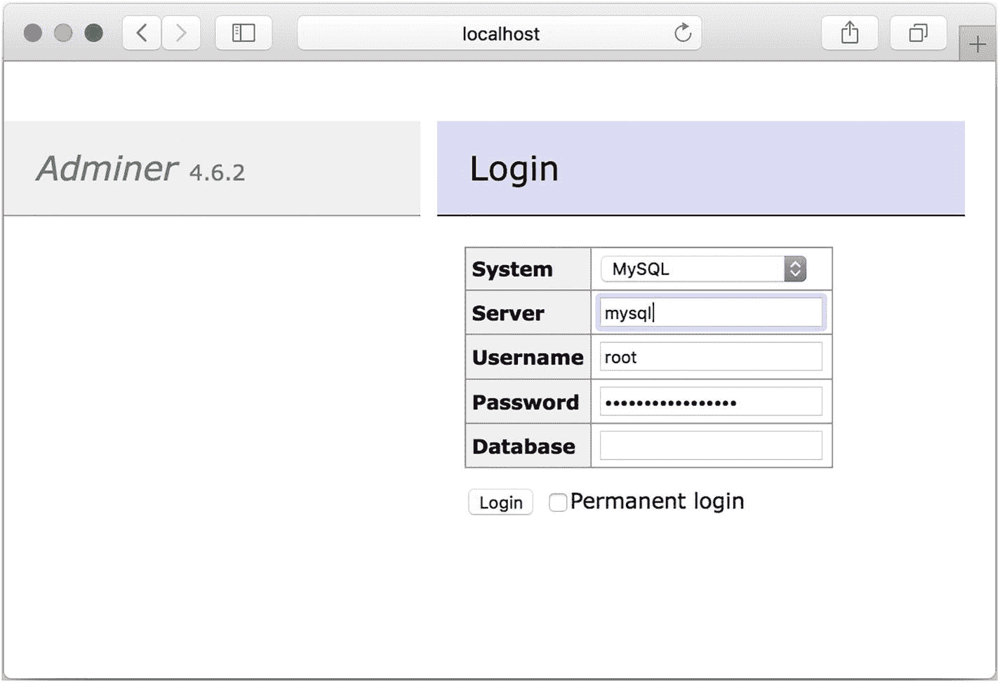
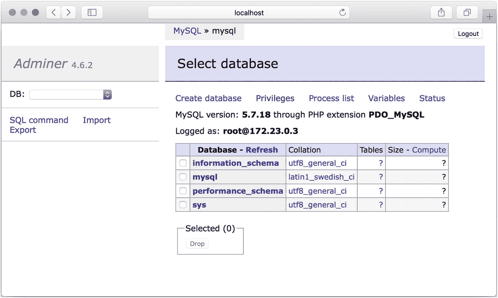
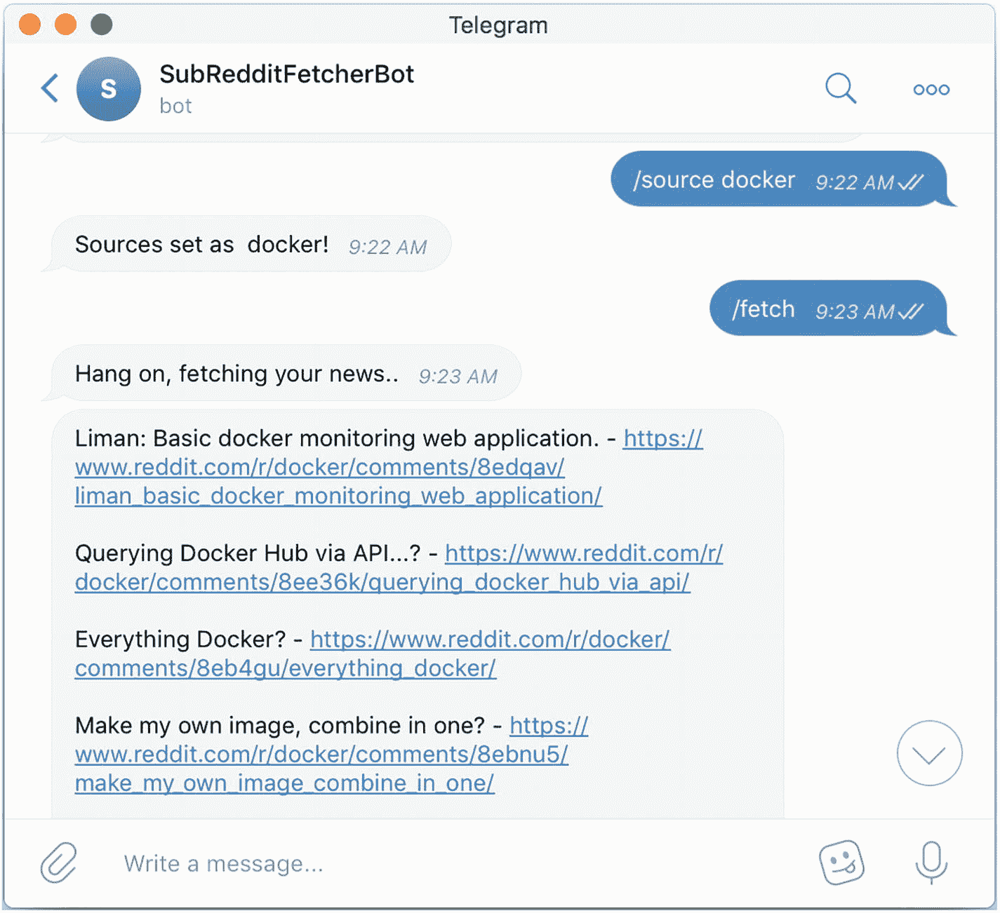
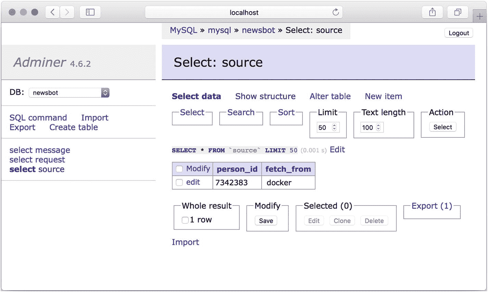

# 七、了解 Docker Compose

在前面的章节中，您了解了 Docker 及其相关术语，深入了解了如何使用 Docker 文件构建 Docker 映像，了解了如何持久存储容器生成的数据，并借助 Docker 的网络功能链接了各种运行中的容器。

在这一章中，你将会看到 Docker Compose，这是一个运行多容器应用的工具，可以调出各种链接的、相关的容器等等——所有这些都只需要一个配置文件和一个命令。

## Docker 编写概述

随着软件变得越来越复杂，以及您越来越倾向于微服务架构，需要部署的组件数量也会大大增加。虽然微服务可能通过鼓励松散耦合的服务来帮助保持整个系统的流动性，但从运营的角度来看，事情会变得更加复杂。当您有依赖的应用时，这尤其具有挑战性。例如，为了让 web 应用正常工作，它需要其数据库在 web 层开始响应请求之前工作。

Docker 可以很容易地将每个微服务绑定到一个容器。Docker Compose 使得编排所有这些容器变得非常容易。如果没有 Docker Compose，容器编排步骤将涉及构建各种映像、创建所需的网络，然后按照必要的顺序使用一系列`docker run`命令运行应用。随着容器数量的增加和部署目标的增加，手动运行这些步骤变得不合理，您将需要走向自动化。

从本地开发的角度来看，手动启动多个相互关联的服务非常繁琐和痛苦。Docker Compose 大大简化了这一点。Docker Compose 只需提供一个描述所需容器和容器间关系的 YAML 文件，就可以用一个命令显示所有容器。Docker Compose 不仅可以打开容器，还可以让您完成以下任务:

*   构建、停止和启动与应用相关联的容器。

*   跟踪正在运行的容器的日志，省去为每个容器打开多个终端会话的麻烦。

*   查看每个容器的状态。

Docker Compose 帮助您实现持续集成。通过提供多个可处理的、可复制的环境，Docker Compose 允许您独立地运行集成测试，允许对这些自动化测试用例采用一种干净的方法。它允许您运行测试，验证结果，然后彻底地拆除环境。

## 正在安装 Docker Compose

Docker Compose 作为 Docker 安装的一部分预先安装，不需要任何额外的步骤就可以在 macOS 和 Windows 系统上开始使用。在 Linux 系统上，你可以从它的 [GitHub 发布页面下载 Docker Compose 二进制文件，](https://github.com/docker/compose/releases)可以在 [`https://github.com/docker/compose/releases`](https://github.com/docker/compose/releases) 下载。或者，您可以运行下面的`curl`命令来下载正确的二进制文件。

```py
sudo curl -L https://github.com/docker/compose/releases/download/1.21.0/docker-compose-$(uname -s)-$(uname -m) -o /usr/local/bin/docker-compose

```

如果您已经安装了 Python 和 pip，您也可以使用以下命令使用 pip 来安装`docker-compose`:

```py
pip install docker-compose

```

Note

确保`pip install docker-compose`命令中的版本号与 GitHub 发布页面上 Docker Compose 的最新版本相匹配。否则，你最终会得到一个过时的版本。

下载完二进制文件后，更改权限，以便可以使用以下命令执行它:

```py
sudo chmod +x /usr/local/bin/docker-compose

```

如果文件是手动下载的，请在运行命令之前将下载的文件复制到`/usr/local/bin`目录。要确认安装成功且运行正常，请运行以下命令:

```py
docker-compose version

```

结果应该是 Docker Compose 的版本，如下所示:

```py
docker-compose version 1.29.1, build 5becea4c
docker-py version: 5.0.0
CPython version: 3.9.0
OpenSSL version: OpenSSL 1.1.1g 21 Apr 2020

```

## Docker 合成基础知识

与 Docker 文件(Docker 引擎关于如何构建 Docker 映像的一组指令)不同，撰写文件是一个 YAML 配置文件，它定义了启动应用所需的服务、网络和卷。Docker 希望合成文件出现在调用`docker-compose`命令的同一路径中，并被称为`docker-compose.yaml`(或`docker-compose.yml`)。这可以使用`-f`标志，后跟撰写文件名的路径来覆盖。

## Docker 合成版本概述

在 Docker 桌面 3.4 版中，Docker 推出了一个新版本的 Docker Compose，称为 Compose V2。Compose V2 被认为是旧版本 Compose 的替代产品。Docker 提取了 Compose 文件的 YAML 文件模型，围绕它创建了一个社区，并将其作为一个规范提交，称为 Compose 规范。撰写 V2 实现撰写规范。然而，它的功能还不能与 Compose V1 媲美，可以从 Docker 桌面设置的实验设置中启用。鉴于缺乏功能对等，这一章的重点是撰写 V1。如果您需要“合成 V2”中的特定功能，例如对 GPU 设备和配置文件的支持，您可以使用本章的其余部分作为指南。只需将`docker-compose`命令(带连字符)替换为`docker compose`(用空格替换连字符)，这些命令仍然可以工作。

### 合成文件版本和合成规范

虽然合成文件是一个 YAML 文件，但 Docker 使用文件开头的版本密钥来确定支持 Docker 引擎的哪些功能。合成文件格式有三种版本。随着 Docker Compose v1.27.0 和 Docker Compose V2 的推出，Docker 统一了 2.x 和 3.x 版本的 Compose 文件格式，并将其作为规范提交给了社区。以下是合成文件格式的前三个版本的简要说明:

*   **版本 1:** 版本 1 被认为是遗留格式。如果 Docker 合成文件在 YAML 文件的开头没有版本密钥，Docker 会将其视为版本 1 格式。版本 1 已被否决，不再受支持。

*   **版本 2.x:** 由 YAML 文件开头的版本 2.x 密钥标识的版本 2.x。

*   **版本 3.x:** 由 YAML 文件开头的版本 3.x 密钥标识的版本 3.x。

*   **Compose spec:**Compose spec 统一了 Compose 文件格式的 2.x 和 3.x 版本，并已作为规范提交给社区。Compose 规范也反对版本键。

以下几节将讨论这三个主要版本之间的差异。

### 版本 1

在 YAML 文件的根目录下没有版本密钥的 Docker 合成文件被视为版本 1 合成文件。Docker Compose 的未来版本将弃用并删除版本 1，因此我不建议编写版本 1 文件。除了不赞成之外，版本 1 还有以下主要缺点:

*   版本 1 文件不能声明命名服务、卷或生成参数。

*   只有使用 links 标志才能启用容器发现。

### 版本 2

Docker Compose 第 2 版文件具有值为 2 或 2.x 的版本密钥。第 2 版引入了一些更改，这使得第 2 版与以前版本的 Compose 文件不兼容。其中包括:

*   所有服务都必须存在于 services 键中。

*   所有容器都位于特定于应用的默认网络上，可以通过主机名发现容器，主机名由服务名指定。

*   链接变得多余。

*   引入了`depends_on`标志，允许您指定相关的容器以及容器出现的顺序。

### 版本 3

Docker Compose 第 3 版文件有一个值为 3 或 3.x 的版本密钥。第 3 版删除了几个不推荐使用的选项，包括`volume_driver`、`volumes_from`等等。版本 3 还增加了一个`deploy`键，用于 Docker Swarm 上服务的部署和运行。

## 撰写规范

Docker 统一了 Compose 文件格式的 2.x 和 3.x 版本，并引入了 Compose 规范。在 Docker Compose 及以上版本中，Docker 将 Compose 规范实现为当前最新的格式。Docker 也声明以前的版本是遗留的，尽管它们仍然受支持。合成规范也反对合成文件中的版本密钥。Compose 规范允许您定义不依赖于任何特定云提供商的容器应用，包括多容器应用所需的基本构建块:

*   **Services** key 定义了计算方面，实现为一个或多个容器。

*   **Networks** key 定义了服务如何相互通信。

*   **Volumes** 键定义服务如何存储持久数据。

清单 [7-1](#PC6) 中显示了一个示例引用组合文件。

```py
services:
    database:
      image: mysql
      environment:
        MYSQL_ROOT_PASSWORD: dontusethisinprod
      volumes:
        - db-data:/var/lib/mysql
    webserver:
      image: 'nginx:alpine'
      ports:
        - 8080:80
      depends_on:
        - cache
        - database
    cache:
      image: redis

volumes:
    db-data:

Listing 7-1A Sample Docker Compose File

```

与 docker 文件类似，Compose 文件可读性很强，很容易理解。这个合成文件用于一个典型的 web 应用，该应用包括一个 web 服务器、一个数据库服务器和一个缓存服务器。Compose 文件声明当 Docker Compose 运行时，它将启动三个服务——web 服务器、数据库服务器和缓存服务器。web 服务器依赖于数据库和缓存服务，这意味着除非启动数据库和缓存服务，否则不会启动 web 服务。缓存和数据库关键字表明，对于缓存，Docker 必须为数据库调出 Redis 映像和 MySQL 映像。

要调出所有容器，发出以下命令:

```py
docker-compose up -d

[+] Running 4/4
 ⠿ Network code_default        Created   0.1s
 ⠿ Container code_database_1   Started   1.2s
 ⠿ Container code_cache_1      Started   1.1s
 ⠿ Container code_webserver_1  Started   2.3s

```

命令发出后，Docker 会在后台调出所有的服务。请注意，尽管合成文件首先定义了数据库，其次是 web 服务器，最后是缓存，Docker 仍然在调用 web 服务器容器之前调用缓存容器和数据库容器。这是因为您为 web 服务器定义了如下的`depends_on`键:

```py
depends_on:
    - cache
    - database

```

这告诉 Docker 在启动 web 服务器之前先启动缓存和数据库容器。然而，Docker Compose 不会等待并检查缓存容器是否准备好接受连接，然后打开数据库容器——它只是按照指定的顺序打开容器。

您可以通过键入以下命令来查看日志:

```py
docker-compose logs

webserver_1  | [notice] 1#1: nginx/1.21.1
database_1   | [Note] [Entrypoint]: Switching to dedicated user 'mysql'
cache_1      | # Server initialized
cache_1      | * Ready to accept connections

```

Docker 将聚合每个容器的`STDOUT`,并在前台运行时将它们流式传输。默认情况下，`docker-compose`日志将只显示日志的快照。如果您想让日志连续流式传输，您可以添加`-f`或`--follow`标志来告诉 Docker 继续流式传输日志。或者，如果您想查看每个容器中最后的 *n* 个日志，您可以键入:

```py
docker-compose logs --tail=n

```

其中 *n* 是你需要看到的行数。停止容器就像发出`stop`命令一样简单，如下所示:

```py
docker-compose stop

[+] Running 3/3
 ⠿ Container code_webserver_1  Stopped   0.5s
 ⠿ Container code_database_1   Stopped   1.4s
 ⠿ Container code_cache_1      Stopped   0.4s

```

要恢复停止的容器，发出`start`命令:

```py
docker-compose start
[+] Running 3/3
 ⠿ Container code_database_1   Started  1.8s
 ⠿ Container code_cache_1      Started  1.9s
 ⠿ Container code_webserver_1  Started  0.7s

```

要完全拆除容器，请发出以下命令:

```py
docker-compose down

```

这将停止所有容器，还将删除发出`docker-compose` up 时创建的相关容器、网络和卷。

```py
[+] Running 4/4
 ⠿ Container code_webserver_1  Removed  0.5s
 ⠿ Container code_cache_1      Removed  0.6s
 ⠿ Container code_database_1   Removed  1.3s
 ⠿ Network code_default        Removed  0.2s

```

## Docker 构成档案参考

回想一下，合成文件是一个 YAML 文件，用于 Docker 读取和设置合成作业的配置。本节解释了 Docker 合成文件中不同键的作用。

### 服务密钥

服务是组合 YAML 的第一个根键，它是需要创建的容器的配置。

### 构建密钥

生成密钥包含在生成时应用的配置选项。构建键可以是构建上下文的路径，也可以是由上下文和可选 Dockerfile 位置组成的详细对象:

```py
services:
    app:
        build: ./app

services:
    app:
        build:
            context: ./app
            Dockerfile: dockerfile-app

```

#### 上下文关键字

上下文键设置构建的上下文。如果上下文是相对路径，则该路径被视为相对于合成文件的位置。

```py
build:
    context: ./app
    Dockerfile: dockerfile-app

```

#### 图像键

如果图像标签与构建选项一起提供，Docker 将构建图像，然后用提供的图像名称和标签命名和标记图像。

```py
services:
    app:
        build: ./app
        image: sathyabhat:app

```

#### 环境/env_file 键

`environment`键为应用设置环境变量，而`env_file`提供了环境文件的路径，读取该文件以设置环境变量。`environment`和`env_file`都可以接受单个文件或多个文件作为一个数组。

在下面的例子中，对于 app 服务，两个环境变量——`PATH`和`API_KEY`，分别具有值`/home`和`thisisnotavalidkey`——被设置为 app 服务。

```py
services:
    app:
        image: mysql
        environment:
            PATH: /home
            API_KEY: thisisnotavalidkey

```

在下面的示例中，从名为`.env`的文件中获取环境变量，并将这些值分配给 app 服务。

```py
services:
    app:
        image: mysql
        env_file: .env

```

在下面的示例中，提取了在`env_file`键下定义的多个环境文件，并将这些值分配给 app 服务。

```py
services:
    app:
        image: mysql
        env_file:
            - common.env
            - app.env
            - secrets.env

```

#### 依赖键

该键用于设置跨各种服务的依赖性要求。考虑以下配置:

```py
services:
    database:
        image: mysql
    webserver:
        image: nginx:alpine
        depends_on:
            - cache
            - database
    cache:
        image: redis

```

发出`docker-compose up`时，Docker 将按照定义的依赖顺序调出服务。在前一个例子中，Docker 在启动 webserver 服务之前启动了缓存和数据库服务。

Caution

使用`depends_on`键，Docker 将只按定义的顺序调出服务；它不会等待每个服务都准备好，然后调用后续服务。

#### 图像键

此键指定当一个容器被打开时使用的图像的名称。如果映像在本地不存在，Docker 会在构建密钥不存在的情况下尝试提取它。如果构建密钥在合成文件中，Docker 将尝试构建并标记图像。

```py
services:
    database:
        image: mysql

```

#### 端口键

此键指定将向端口公开的端口。当提供此密钥时，您可以指定两个端口(即，容器端口将向其公开的 Docker 主机端口或仅容器端口)，在这种情况下，将选择主机上随机的临时端口号。

```py
services:
    database:
        image: nginx
        ports:
            - "8080:80"

services:
    database:
        image: nginx
        ports:
            - "80"

```

#### 卷密钥

Volumes 既可以作为顶级键，也可以作为服务的子选项。当`volumes`被称为顶级键时，它允许您提供将用于底层服务的命名卷。其配置如下所示:

```py
services:
    database:
        image: mysql
        environment:
            MYSQL_ROOT_PASSWORD: dontusethisinprod
        volumes:
            - "dbdata:/var/lib/mysql"
    webserver:
        image: nginx:alpine
        depends_on:
            - cache
            - database
    cache:
        image: redis

volumes:
    dbdata:

```

如果没有顶级 volumes 键，Docker 将在创建容器时抛出一个错误。考虑以下配置，其中跳过了`volumes`键:

```py
services:
  database:
    image: mysql
    environment:
      MYSQL_ROOT_PASSWORD: dontusethisinprod
    volumes:
        - "dbdata:/var/lib/mysql"
  webserver:
    image: nginx:alpine
    depends_on:
        - cache
        - database
  cache:
    image: redis

```

尝试启动容器会引发错误，如下所示:

```py
docker-compose up
service "database" refers to undefined volume dbdata: invalid compose project

```

也可以使用绑定安装。您只需提供路径，而不是引用指定的卷。考虑这种配置:

```py
services:
    database:
        image: mysql
        environment:
            MYSQL_ROOT_PASSWORD: dontusethisinprod
        volumes:
            - ./dbdir:/var/lib/mysql
    webserver:
        image: nginx:alpine
        depends_on:
            - cache
            - database
    cache:
        image:redis

```

`volume`键的值为`./dbdir:/var/lib/mysql`，这意味着 Docker 将把当前目录中的`dbdir`挂载到容器的`/var/lib/mysql`目录中。相对路径是相对于合成文件的目录来考虑的。

#### 重新启动键

重启键为容器提供重启策略。默认情况下，重启策略设置为`no`，这意味着无论如何 Docker 都不会重启容器。以下是可用的重启策略:

*   `no`:容器永远不会重启

*   `always`:容器在退出后总是会重新启动

*   `on-failure`:如果由于错误退出，容器将重新启动

*   `unless-stopped`:除非明确退出或者 Docker 守护进程停止，否则容器将总是重新启动

## docker 由 CLI 参考组成

命令自带一组子命令。下面几节将对它们进行解释。

### build 子命令

`build`命令读取合成文件，扫描构建密钥，然后继续构建和标记图像。图像被标记为`project_service`。如果合成文件没有构建键，Docker 将跳过构建任何图像。用法如下:

```py
docker-compose build <options> <service...>

```

如果提供了服务名，Docker 将继续为该服务构建映像。否则，它将为所有服务构建映像。一些常用的选项如下:

```py
--compress: Compresses the build context
--no-cache Ignore the build cache when building the image

```

### down 子命令

`down`命令停止容器，并将继续移除容器、卷和网络。其用法如下:

```py
docker-compose down

```

### exec 子命令

`compose exec`命令相当于`docker exec`命令。它允许您在任何容器上运行特定的命令。其用法如下:

```py
docker-compose exec  <service> <command>

```

### logs 子命令

`logs`命令显示所有服务的日志输出。其用法如下:

```py
docker-compose logs <options> <service>

```

默认情况下，`logs`将只显示所有服务的最后日志。通过提供服务名，您可以只显示一个服务的日志。`-f`选项跟随日志输出。

### 停止子命令

`stop`命令停止容器。其用法如下:

```py
docker-compose stop

```

## 练习

Building and Running a Mysql Database Container With a Web UI for Managing the Database

在本练习中，您将构建一个多容器应用，其中包含一个用于 MySQL 数据库的容器和另一个用于 MySQL 的流行 Web UI`adminer`的容器。因为您已经有了 MySQL 和`adminer`的预构建映像，所以您不需要构建它们。

**提示**与本练习相关的源代码、Dockerfile 和`docker-compose`文件可以在本书的 GitHub repo 上 [`https://github.com/Apress/practical-docker-with-python`](https://github.com/Apress/practical-docker-with-python) 的`source-code/chapter-7/exercise-1`目录中找到。

您可以从 Docker 合成文件开始，如下所示:

```py
services:
  mysql:
    image: mysql
    environment:
        MYSQL_ROOT_PASSWORD: dontusethisinprod
    ports:
        - 3306:3306
    volumes:
        - dbdata:/var/lib/mysql
  adminer:
    image: adminer
    ports:
        - 8080:8080

volumes:
    dbdata:

```

这个组合文件将您在本书中学到的所有内容合并到一个简洁的文件中。因为您的目标是 Compose 规范，所以可以省略 version 标记。在 Services 下，定义两个服务——一个用于数据库，它拉入一个名为`mysql`的 Docker 映像。创建容器时，环境变量`MYSQL_ROOT_PASSWORD`为数据库设置 root 密码，容器的端口 3306 被发布到主机。

MySQL 数据库中的数据存储在一个名为`dbdata`的卷中，并挂载到容器的`/var/lib/mysql`目录中。这是 MySQL 存储数据的地方。换句话说，保存到容器中数据库的任何数据都由名为`dbdata`的卷处理。另一个名为`adminer`的服务只是拉入一个名为`adminer`的 Docker 映像，并将端口 8080 从容器发布到主机。

通过键入以下命令来验证合成文件:

```py
docker-compose config

```

如果一切正常，Docker 将打印出解析后的合成文件；它应该是这样的:

```py
services:
  adminer:
    image: adminer
    networks:
      default: null
    ports:
    - mode: ingress
      target: 8080
      published: 8080
      protocol: tcp
  mysql:
    environment:
      MYSQL_ROOT_PASSWORD: dontusethisinprod
    image: mysql
    networks:
      default: null
    ports:
    - mode: ingress
      target: 3306
      published: 3306
      protocol: tcp
    volumes:
    - type: volume
      source: dbdata
      target: /var/lib/mysql
      volume: {}
networks:
  default:
    name: docker-compose-adminer_default
volumes:
  dbdata:

```

通过键入如下命令运行所有容器:

```py
docker-compose up -d

```

容器将在后台启动，如下所示:

```py
docker-compose up -d
[+] Running 3/3
 ⠿ Network docker-compose-adminer_default      Created   0.1s
 ⠿ Container docker-compose-adminer_adminer_1  Started   1.0s
 ⠿ Container docker-compose-adminer_mysql_1    Started   1.1s

```

现在看一下日志。键入以下命令:

```py
docker-compose logs
adminer_1  | PHP 7.4.22 Development Server (http://[::]:8080) started
mysql_1    | [Note] [Entrypoint]: Entrypoint script for MySQL Server 8.0.26-1debian10 started.
mysql_1    | [System] [MY-010931] [Server] /usr/sbin/mysqld: ready for connections. Version: '8.0.26'

```

这告诉你`adminer` UI 和 MySQL 数据库已经准备好了。导航至`http://localhost:8080`尝试登录。应当加载`adminer`登录页面(见图 [7-1](#Fig1) )。



图 7-1

管理员登录页面

注意，服务器已经填充了值`db`。因为`docker-compose`为应用创建了自己的网络，所以每个容器的主机名就是服务名。在这种情况下，MySQL 数据库服务名是`mysql`，数据库将可以通过`mysql`主机名访问。输入用户名`root`和在`MYSQL_ROOT_PASSWORD`环境变量中输入的密码(见图 [7-2](#Fig2) )。



图 7-2

管理员登录详细信息

如果细节正确，您应该会看到如图 [7-3](#Fig3) 所示的数据库页面。



图 7-3

登录后即可获得数据库详细信息

Converting Newsbot to a Docker Compose Project

在第 [6](6.html) 章的练习中，您向 Newsbot 添加了卷，数据被保存到 MySQL 容器中。您还分别启动了`newsbot`和`mysql`容器，并将它们连接到公共桥接网络。在本练习中，您将编写一个包含 Newsbot 容器和 MySQL 容器的 Docker 合成文件，并附加一个卷来保存数据。在本练习中，您将看到 Docker Compose 如何轻松地打开多个容器，每个容器都有其相关的属性。

**提示**与本练习相关的源代码、Dockerfile 和`docker-compose`文件可以在本书的 GitHub repo 上 [`https://github.com/Apress/practical-docker-with-python`](https://github.com/Apress/practical-docker-with-python) 的`source-code/chapter-7/exercise-2`目录中找到。

让我们创建一个新的 Docker 合成文件，并添加以下内容:

```py
services:
  newsbot:
    build: .
    depends_on:
      - mysql
    restart: "on-failure"
    environment:
      - NBT_ACCESS_TOKEN=${NBT_ACCESS_TOKEN}
    networks:
      - newsbot

  mysql:
    image: mysql
    volumes:
        - newsbot-db:/var/lib/mysql
    environment:
        - MYSQL_ROOT_PASSWORD=dontusethisinprod
    networks:
      - newsbot

volumes:
  newsbot-db:

networks:
  newsbot:

```

因为您需要两个服务，一个用于 Newsbot，一个用于 MySQL 服务器，所以它们都有对应的键。对于 Newsbot，您添加一个值为`mysql`的`depends_on`键，表示 MySQL 容器应该在 Newsbot 之前启动。但是正如您之前看到的，Docker 不会等待 MySQL 容器准备好，因此 Newsbot 被修改为在尝试连接到`mysql`容器之前等待 60 秒。还有一个重启策略，在应用失败时重启`newsbot`容器。

Newsbot 需要 Telegram bot API 令牌，您可以将它从同一个主机环境变量传递给容器环境变量`NBT_ACCESS_TOKEN`。这两个服务中的每一个都有一个网络密钥，指示容器将被连接到`newsbot`网络。最后，添加卷和网络的顶级键，声明为`newsbot-db`用于保存卷的 MySQL 数据，声明为`newsbot`用于保存网络。

您可以通过键入如下所示的`config`命令来验证合成文件是否正确有效:

```py
docker-compose config

```

Docker 打印您编写的合成的配置，类似于合成文件本身。

```py
services:
  mysql:
    environment:
      MYSQL_ROOT_PASSWORD: dontusethisinprod
    image: mysql
    networks:
      newsbot: null
    volumes:
    - type: volume
      source: newsbot-db
      target: /var/lib/mysql
      volume: {}
  newsbot:
    build:
      context: exercise-2/newsbot-compose
      dockerfile: exercise-2/newsbot-compose/Dockerfile
    depends_on:
      mysql:
        condition: service_started
    environment:
      NBT_ACCESS_TOKEN: ""
    networks:
      newsbot: null
    restart: on-failure
networks:
  newsbot:
    name: newsbot-compose_newsbot
volumes:
  newsbot-db:
    name: newsbot-compose_newsbot-db

```

现在运行撰写应用。不要忘记传递你在第 [3 章](3.html)中生成的 Newsbot API 键的值。

```py
NBT_ACCESS_TOKEN=<token> docker-compose up

```

您应该看到容器正在构建和启动，如下所示:

```py
[+] Running 4/4
 ⠿ Network newsbot-compose_newsbot      Created    0.0s
 ⠿ Volume "newsbot-compose_newsbot-db"  Created    0.0s
 ⠿ Container newsbot-compose_mysql_1    Started    1.6s
 ⠿ Container newsbot-compose_newsbot_1  Started    1.8s

Attaching to mysql_1, newsbot_1
newsbot_1  | INFO:  <module> - Starting up
newsbot_1  | INFO:  <module> - Waiting for 60 seconds for db to come up
mysql_1    |  [System] [MY-013577] [InnoDB] InnoDB initialization has ended.
mysql_1    |  [System] [MY-010931] [Server] /usr/sbin/mysqld: ready for connections. Version: '8.0.26'  socket: '/var/run/mysqld/mysqld.sock'  port: 3306  MySQL Community Server - GPL.
newsbot_1  | INFO:  <module> - Checking on dbs
newsbot_1  | INFO:  get_updates - received response: {'ok': True, 'result': []}
newsbot_1  | INFO:  get_updates - received response: {'ok': True, 'result': []}
newsbot_1  | INFO:  get_updates - received response: {'ok': True, 'result': []}
newsbot_1  | INFO:  get_updates - received response: {'ok': True, 'result': []}

```

最后一行表示机器人正在工作。尝试通过在电报机器人中输入`/sources docker`然后输入`/fetch`来设置一个源并获取数据。如果一切顺利，您应该会在图 [7-4](#Fig4) 中看到结果。



图 7-4

行动中的 subreddit fetcher 机器人

您可以更进一步，通过修改 Compose 文件来包含`adminer`服务，这样您就有一个 WebUI 来检查内容是否被保存到数据库中。修改现有的 Docker compose 文件，使其包含如下所示的`adminer`服务，并将其保存到名为`docker-compose.adminer.yml`的文件中:

```py
services:
  newsbot:
    build: .
    depends_on:
      - mysql
    restart: "on-failure"
    environment:
      - NBT_ACCESS_TOKEN=${NBT_ACCESS_TOKEN}
    networks:
      - newsbot

  mysql:
    image: mysql
    volumes:
        - newsbot-db:/var/lib/mysql
    environment:
        - MYSQL_ROOT_PASSWORD=dontusethisinprod
    networks:
      - newsbot

  adminer:
    image: adminer
    ports:
        - 8080:8080
    networks:
      - newsbot

volumes:
  newsbot-db:

networks:
  newsbot:

```

按如下方式键入`config`命令，确认合成文件有效:

```py
docker-compose -f docker-compose.adminer.yml config
services:
  adminer:
    image: adminer
    networks:
      newsbot: null
    ports:
    - mode: ingress
      target: 8080
      published: 8080
      protocol: tcp
  mysql:
    environment:
      MYSQL_ROOT_PASSWORD: dontusethisinprod
    image: mysql
    networks:
      newsbot: null
    volumes:
    - type: volume
      source: newsbot-db
      target: /var/lib/mysql
      volume: {}
  newsbot:
    build:
      context: exercise-2/newsbot-compose
      dockerfile: exercise-2/newsbot-compose/Dockerfile
    depends_on:
      mysql:
        condition: service_started
    environment:
      NBT_ACCESS_TOKEN: ""
    networks:
      newsbot: null
    restart: on-failure
networks:
  newsbot:
    name: newsbot-compose_newsbot
volumes:
  newsbot-db:
    name: newsbot-compose_newsbot-db

```

现在，使用以下命令删除现有的合成文件:

```py
docker-compose down

[+] Running 3/3
 ⠿ Container newsbot-compose_newsbot_1  Removed      1.0s
 ⠿ Container newsbot-compose_mysql_1    Removed      0.1s
 ⠿ Network newsbot-compose_newsbot      Removed      0.1s

```

由于数据保存在卷中，您不必担心数据丢失。

使用以下命令再次启动服务。不要忘记传递你在第 [3 章](3.html)中生成的 Newsbot API 键的值。

```py
NBT_ACCESS_TOKEN=<token> docker-compose -f docker-compose.adminer.yml up

Running 4/4
 ⠿ Network newsbot-compose_newsbot      Created  0.1s
 ⠿ Container newsbot-compose_adminer_1  Started  7.1s
 ⠿ Container newsbot-compose_mysql_1    Started  7.1s
 ⠿ Container newsbot-compose_newsbot_1  Started  5.1s
Attaching to adminer_1, mysql_1, newsbot_1

mysql_1    | [System] [MY-010931] [Server] /usr/sbin/mysqld: ready for connections. Version: '8.0.26'  socket: '/var/run/mysqld/mysqld.sock'  port: 3306  MySQL Community Server - GPL.
newsbot_1  | INFO: <module> - Starting up
newsbot_1  | INFO: <module> - Waiting for 60 seconds for db to come up
newsbot_1  | INFO: <module> - Checking on dbs
newsbot_1  | INFO: get_updates - received response: {'ok': True, 'result': []}

```

通过前往`http://localhost:8080`导航至`adminer`。使用`root`用户名登录，密码设置为`MYSQL_ROOT_PASSWORD`值，服务器值为`mysql`。单击 Newsbot 数据库中的`source`作为表，然后选择选择数据。您应该会看到之前设置为`source`的子编辑(参见图 [7-5](#Fig5) )。



图 7-5

项目运行时将数据保存到数据库中

成功！应用正在运行，数据被保存到 MySQL 数据库并被持久化，尽管删除并重新创建了容器。

## 摘要

在本章中，您了解了 Docker Compose，包括如何安装它以及为什么使用它。您还深入研究了 Docker 编写文件和 CLI。您运行了一些关于使用 Docker Compose 构建多容器应用的练习。您还了解了如何使用 Docker Compose 将 Newsbot 项目扩展到多容器应用，方法是添加一个链接数据库和一个 Web UI 来编辑数据库。