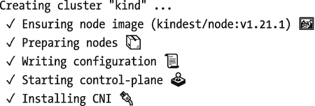
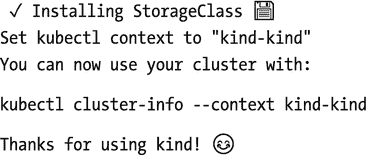
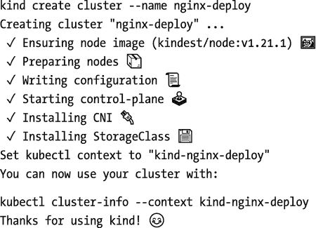
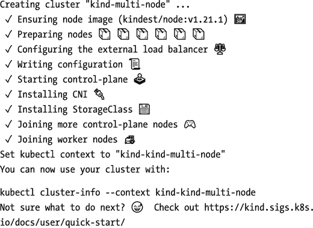
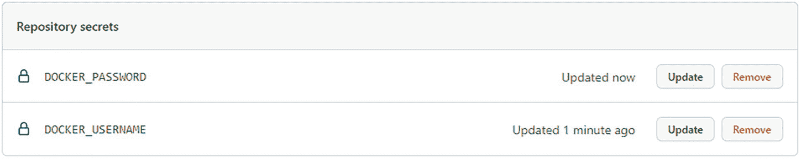
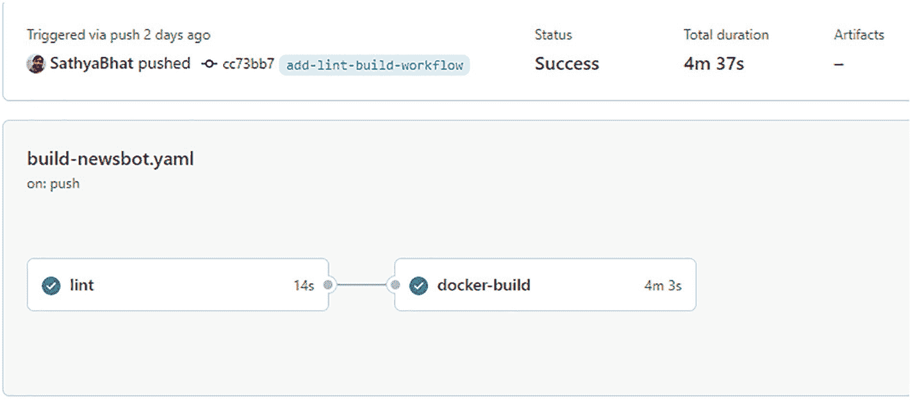

# 8.准备生产部署

在前几章中，您了解了 Docker 及其相关术语，并深入了解了如何使用 Docker 文件构建 Docker 映像。您还了解了如何持久化容器生成的数据，并借助 Docker 的网络特性实现了运行中的容器之间的网络通信。然后，您了解了 Docker Compose 如何通过在一个简单的 YAML 文件中编写您的需求并将其作为输入提供给 Docker Compose 来简化多容器应用程序的运行。

在本章中，您将学习如何准备 Docker 映像以在生产中部署您的应用程序，包括持续集成的简要概述，以及如何使用 GitHub 操作设置持续集成。本章涉及容器编排和各种可用的编排器。它包括对市场上最受欢迎的容器编排器之一 Kubernetes 的概述。

## 持续集成

持续集成是每天多次自动将每个开发人员的代码变更合并到源代码库的主要分支中的实践。除了合并之外，该过程还运行不同的测试——包括单元测试、集成测试、功能测试——当所有测试都通过时，就会创建并保存一个构建工件，通常保存到某种工件存储中。

这个生成的工件被带入下一步，部署到开发和阶段环境中，形成 CI/CD(持续集成/持续交付)管道。随着软件构建和测试过程的成熟，许多团队从连续交付切换到连续部署并不罕见。在连续交付中，最终的工件可以随时进行部署，但是部署通常是手动启动的。持续部署完全自动化了端到端的构建到发布的管道，最终的构建工件也被自动部署。

由于 CI/CD 管道提供的快速反馈周期，CI/CD 在今天的软件开发生命周期中变得非常流行。有了一个定义良好的管道，开发人员就有可能打开一个 GitHub Pull 请求，并对其源代码进行更改，让持续集成管道生效，开始新代码的测试，完成静态分析，并准备好一个工件进行部署，所有这些都在几分钟内自动完成，无需任何人手动启动或运行任何东西。

有了 Docker，CI/CD 变得更加轻松。有了 Dockerfile，就有了一种简单、可重复的方法来重建所需的依赖关系映像，Docker 映像的可移植性意味着该映像可以在任何安装了 Docker 守护程序的主机上运行。这是与以前打包软件方式的一个重要区别。Docker 图像是独立的。不再有关于正确获得所需版本的依赖关系、主机操作系统依赖关系等等的麻烦。对于微服务，作为源代码签入的一部分，测试依赖系统变得更加容易。有了定义了所需服务的 Docker Compose 文件，一个简单的`docker-compose up`就足以调出服务并测试它们。

市场上有许多 CI 工具，大多数源代码管理(SCM)系统——如 GitHub 和 git lab——本身提供了持续集成特性的子集。下一节解释如何使用 GitHub 动作在 GitHub 上设置持续集成。

### GitHub 动作

GitHub Actions 使得围绕您正在处理的 Git 存储库建立自动化部署和工作流变得容易。使用 GitHub Actions，您可以定义一个在每次提交时触发的工作流，或者将它推到一个分支来执行各种操作。这些动作可以从简单的回声到复杂的林挺，旋转多个容器。

GitHub 动作是事件驱动的，所以工作流是基于特定的事件触发的，比如一个新的拉请求被打开或者一个新的提交被推送到存储库，等等。每个事件都会触发一个工作流。一个工作流可以有一个或多个作业，一个作业可以包括在 GitHub 或其他地方(如 Python 包索引(PyPI)或 Docker Hub)上构建、测试、打包或发布的一系列步骤。

GitHub 动作运行在名为 *runners* 的服务器上。跑步者安装了 GitHub Actions runner 应用程序，监听命令。GitHub 提供托管的跑步者，但是你可以运行你自己的跑步者。如果您有在自己的环境中构建软件的法规遵从性要求，这将特别有用。

要作为管道的一部分执行的步骤是使用称为动作工作流文件的文件来定义的。工作流文件使用基于 YAML 的规范来定义需要运行的事件、作业和步骤，并支持条件以允许特定作业在满足条件时运行。对于 GitHub 获取并运行工作流的操作，GitHub 希望这些工作流文件保存在存储库根目录下的`.github/workflows`目录中。

在本节中，您将编写一个将在每次提交时运行的示例工作流文件。在继续之前，您应该有一个空的公共 GitHub repo 来测试 GitHub 操作。清单 [8-1](#PC1) 中显示了一个示例工作流文件。

```py
name: Run compose
on: [push]

jobs:
  run-compose:
    timeout-minutes: 10
    runs-on: ubuntu-latest

    steps:
    - name: Checkout
      uses: actions/checkout@v1
    - name: Start containers
      run: docker-compose version

Listing 8-1A Sample Github Actions Workflow File

```

Tip

动作规范文件的语法和密钥可以在 GitHub 文档页面的 [`https://docs.github.com/en/actions/reference/workflow-syntax-for-github-actions`](https://docs.github.com/en/actions/reference/workflow-syntax-for-github-actions) 找到。

您可以检查操作 YAML 文件中的各种键:

*   `name`**:**`name`键定义将显示在动作选项卡上的工作流文件的名称。

*   `on`**:**`on`键定义了触发工作流的事件。这使您可以确定工作流应该在什么时间点或在哪个事件期间运行。

*   `timeout-minutes`**:**`timeout`键让你定义一个任务在被 GitHub 取消之前可以运行多长时间。

*   `runs-on`:`runs-on`键定义了运行作业的转轮。

*   `steps`**:**`steps`键定义了特定任务必须运行的步骤。

*   `uses` **:** 这个键告诉 GitHub 获取一个特定的动作。除了您可以运行的步骤之外，GitHub Actions 还允许您使用自己开发的第三方操作，减少了重新构建一切的需要。在这个具体的例子中，您指示 GitHub Actions 获取 checkout 操作，后者执行 Git checkout 并将源代码下载到 runner。

*   `run`**:**`run`键让你定义可以运行的自定义命令。当您想要运行自定义命令没有涵盖的内容时，这很有用。

再次查看 Actions 工作流文件，它定义了一个 GitHub runner，它将检查源代码并运行一个`docker-compose version`命令。

将该文件另存为`.github/workflows/compose.yaml`，提交文件，并将其推送到 GitHub repo。一旦将提交推送到远程存储库，GitHub 应该会立即启动工作流。从您的 GitHub 存储库页面，点击 Actions 选项卡，您可以看到工作流的结果。

如果你更喜欢 CLI 方法，GitHub 有一个 CLI 工具，它可以给你反馈，而不必打开标签页并导航到操作。要开始使用，需要安装 GitHub CLI，如 [`https://cli.github.com/`](https://cli.github.com/) 中所述。

安装 CLI 后，打开一个新的终端会话。通过键入以下命令使用 GitHub 进行身份验证:

```py
gh auth login

```

按照说明操作，您应该能够成功登录。登录后，切换到您创建的公共回购目录。使用以下命令切换到新克隆的存储库:

```py
cd <repo>

```

在 repo 中，您可以使用`gh workflow list`命令查看工作流:

```py
gh workflow list

```

这应该只显示一个工作流，即您创建的工作流，如下所示:

```py
gh workflow list
Run compose  active  <workflow id>

```

末尾的数字是工作流的 ID。您可以使用`workflow view`命令检查工作流程的结果，如下所示:

```py
gh workflow view <workflow id>

Run compose - compose.yaml
ID: <workflow id>

Total runs 1
Recent runs
✓  test actions  Run compose  master  push  <run id>

```

您可以通过使用`gh run`命令更深入地研究这个运行，如下所示:

```py
gh run view <run id>

✓ master Run compose · <run id>
Triggered via push about 10 hours ago

JOBS
✓ run-compose in 5s (ID <job id>)

```

您可以使用作业 ID 和带有`--job`参数的`gh run`命令进一步研究作业的结果:

```py
gh run view --job <job id>

✓ master Run compose · <run id>
Triggered via push about 10 hours ago

✓ run-compose in 5s (ID <job id>)
  ✓ Set up job
  ✓ Checkout
  ✓ Start containers
  ✓ Complete job

```

因此，通过一个简单的 YAML 文件，您已经定义并设置了您的持续集成工作流，它将在每次新的推送时自动触发。这个例子仅仅展示了一个运行`docker-compose version`命令的简单例子。然而，有了大量定制的社区构建的动作以及对定制命令的支持，很容易建立一个全面的持续集成系统，它可以运行 linters，执行容器安全检查，甚至构建一个新的映像。在本章的后面，作为练习的一部分，您将看到这一过程的运行，并为 Newsbot 建立一个 CI 系统，以便在每次推送时建立一个新的 Docker 映像。

## 容器编排

编排是将容器部署到合适的主机(或许多主机)并管理已部署容器的生命周期的过程，包括根据不同的指标(如 CPU/内存利用率、网络流量等)增加或减少容器以及底层节点的数量。编排还负责在节点和容器崩溃或出错时替换它们。Orchestrators 用于执行保持容器平稳运行所需的许多手动任务，而不需要操作员的手动干预。

### 对管弦乐队的需求

前面，您了解了容器使得部署应用程序变得容易。只需一个命令，您就可以启动并运行一个或多个服务，所需的依赖项包含在 Docker 映像中，或者包含在 Docker 合成文件中的多个链接容器中。那么问题就来了——如果应用程序和依赖项是自包含的，为什么还需要 orchestrators 呢？

容器减轻了开发人员运行链接服务的痛苦。开发人员可以构建他们的映像，在本地运行它们，并继续进行本地更改，而不必更新本地开发设置或将软件部署到指定的开发环境。这个过程会不断发展和变化，尤其是当你有很多人在一个项目上工作的时候。通过消除运行软件所涉及的辛劳，并让开发人员通过简单的`docker run`或`docker-compose up`来运行他们的应用程序，Docker 使迭代和构建变得更加容易。

在生产环境中，事情会变得更加复杂。容器使生产部署变得更容易，但是必须运行许多容器并维护它们的生命周期变成了一件乏味的事情。您可能想知道，为什么需要运行多个容器。

考虑一下 Newsbot，你在这本书里一直在做的聊天机器人应用程序。这是一个简单的 Python 应用程序，它不断轮询 Telegram bot API，响应消息，并回发到 Telegram。当请求数量较少时，一个容器就足以及时响应请求。然而，随着越来越多的人开始使用它，机器人必须处理的请求数量显著增加，在某一点上，只有一个容器将不足以响应请求。为了应对需求，您需要通过增加容器的数量来扩大规模。如果没有 orchestrators，要做到这一点，您必须运行命令来打开新的容器。这样做一次或两次是可以的，但必须重复这样做是不可行的。这就是管弦乐队的用武之地。

### 管弦乐队是如何工作的？

虽然 orchestrators 的具体实现因工具而异，但总体过程是相同的。大多数管弦乐队通常分为两层:

*   控制层，也称为控制平面

*   工作层，也称为工作层

协调器的控制平面处理与控制、运行和管理协调器相关的传入请求和操作，而工作平面处理指定节点中容器的实际调度和协调。

编排流程从对预期目标的声明性描述开始:这可以是一个 YAML 或 JSON 文件，描述要运行什么服务、从哪里下载所需的容器映像(通常指向容器注册表)、要运行的副本数量、链接容器需要什么类型的网络以及在哪里存储持久数据。如果这看起来像你在第 [7](7.html) 章中学到的 Docker Compose 文件，这是一个有效的观察。

Compose Spec 文件描述了这些确切的需求。然而，Docker Compose 是为单个节点设计的。它不能跨多个节点编排容器，不适合作为编排器，尤其是对于跨多个节点的工作负载。然而，对于单节点工作负载，使用 Docker Compose 可能更容易、更简单。

一旦 orchestrator 收到增加容器数量或部署新容器的请求，它将在运行容器之前执行一系列步骤:

*   调度程序确定集装箱将被调度的节点。这是基于可能存在的几个约束来完成的，例如所需的内存、容器所需的 CPU、是否需要 GPU 或特定类别的存储等等。

*   选择合适的节点；发送启动容器的请求。这包括不同的步骤，例如提取 Docker 映像(如果尚未存在)、设置容器网络以及与所需的卷关联。

*   启动容器。

*   如果容器已经配置了运行状况检查，请等待运行状况检查结果为肯定，然后发出容器准备好接受工作负载的信号。

*   一旦容器启动并运行，orchestrator 将持续监控容器的运行状况检查。如果运行状况检查失败，orchestrator 将终止容器，并在其位置上启动一个新容器。

整个过程在一个循环中连续发生，orchestrator 每隔几秒钟检查一次提交给 orchestrator 的每个容器请求。

#### 流行管弦乐队

Kubernetes 很可能是最受欢迎的管弦乐队，但绝不是唯一的管弦乐队。其他可用的编排器包括:

*   码头工人群

*   DC/OS

*   哈希科尔游牧部落

随着 DC 操作系统的寿命结束和支持时间的延长，HashiCorp Nomad 在不需要 Kubernetes 的所有功能的小公司中慢慢变得更受欢迎。需要注意的另一点是，您不必亲自运行容器编排器来充分利用容器。有许多托管容器编排器处理编排器的控制平面。这将您从运行、维护和升级集群控制平面的操作负担中解放出来，您可以专注于运行和维护您的应用程序。这些托管协调器包括:

*   亚马逊女战士

*   亚马逊 ECS

*   亚马逊灯塔

*   蓝色忽必烈服务

*   Azure 容器实例

*   谷歌库比厄引擎

*   谷歌云运行

Amazon ECS、Amazon Fargate、Azure Container Instances 和 Google Cloud Run 使用每个公司各自的专有编排引擎，并需要提交它们的自定义规范，之后将对容器进行调度和编排。

亚马逊 EKS、Azure Kubernetes 服务和谷歌 Kubernetes 引擎是托管的 Kubernetes 服务，支持您期望从 Kubernetes 提供商获得的所有功能。Kubernetes 是一个巨大的主题，涵盖它的所有特性是另一本书的主题，超出了本章的范围。出于这个原因，接下来的小节将使用`kind`(Docker 中的 Kubernetes)来测试 Kubernetes 集群，并尝试运行一些示例应用程序。

#### 忽必烈忽必烈忽必烈忽必烈忽必烈忽必烈忽必烈忽必烈忽必烈忽必烈

Kubernetes(也称为 *k8s* )已经成为当今最流行的容器编排器。Kubernetes 是一个用于部署、扩展、操作和管理容器化应用程序的开源系统。Kubernetes 是由一群谷歌工程师创建的，他们利用自己运行谷歌内部容器编排器 Borg 的经验来构建一个开源项目。Kubernetes 简化了一些复杂性，缓解了使用 Borg 时观察到的棘手问题。Kubernetes 之所以受欢迎，是因为它相对容易使用，并且提供了开箱即用的功能，包括但不限于:

*   自动化推出和回滚

*   全集装箱生命周期管理

*   支持水平和垂直缩放

*   自我修复能力，包括容器和节点级故障恢复能力

*   基于角色的高级访问控制(RBAC)功能，仅允许授权用户和组访问

Kubernetes 集群有各种运行容器化应用程序的节点。这些节点通常由运行在云中的虚拟机驱动。在行业中，Kubernetes 节点也可以在运行于内部数据中心机器上的强大裸机硬件上运行，以及在运行于低功耗设备上的边缘设备上运行。如前一节所述，节点被进一步划分为 Kubernetes 控制平面和工作平面，其中包括各种组件。

##### 立方控制平面

Kubernetes 控制平面组件控制集群的状态，并管理集群中要调度的工作负载。控制平面包括各种组件，每个组件可以在单个主节点或多个主节点上运行，这需要高可用性和容错能力。控制平面组件包括:

*   **Kubernetes API server(或 kube-API server)**:kube-API server 公开 Kubernetes API，充当集群的前端，通过它接受对 Kubernetes 集群的任何请求。

*   **Etcd** : etcd 是一个高度可用的键值存储，用作 Kubernetes 集群数据的后备存储。丢失 etcd 是灾难性的损失，因此应采取一切措施定期备份数据。

*   **调度器**:Kubernetes 调度器持续监控可以调度工作负载的可用节点。当新的请求开始一个新的工作负载时，它确定并调度可以调度工作负载的相关节点。

*   **控制器管理器**:控制器是一个负责维护单个子组件状态的进程，比如单个节点的状态、一次性作业等等。控制器管理器运行这些控制器中的每一个，并确保它们按预期工作。

##### Kubernetes 工人飞机

Kubernetes 工作平面包括一个或多个工作节点，每个节点运行各种维护工作负载的节点组件。这些组件包括:

*   **kube let**:kube let 是一个运行在集群中每个节点上的进程，它向 API 服务器注册它正在运行的节点以接受工作负载。kubelet 确保容器和工作负载在节点中运行，并按照 API 服务器的指示维护容器的生命周期。

*   Kube-proxy:Kube-proxy 是一个网络代理，运行在每个节点上，实现 Kubernetes 的网络特性。kube-proxy 维护网络规则和会话，并将流量路由到所需的容器。

与 Kubernetes 的大多数交互都是通过 API 进行的，`kubectl`命令行应用程序允许您通过与 Kubernetes API 对话来控制 Kubernetes 集群。`kubectl`应用程序实现与集群交互所需的所有命令，并且在内部，`kubectl`将 API 调用转换为对 kube-apiserver 的相应 API 调用，以执行这些操作。

##### 一看就亲切

建立一个完整的 Kubernetes 集群是一个相当复杂和乏味的过程，涉及许多步骤，包括创建和提供 TLS 证书、提供所需的节点和安装各种组件、加入各种工作节点和主节点等等。虽然可以使用各种工具为生产用例进行设置，例如`kOps` (Kubernetes Operations)、`kubeadm`等等，但是对于本地测试，您不必使用这些工具。

`kind`，Docker 中 Kubernetes 的简称，是一个使用 Docker 容器作为节点运行本地 Kubernetes 集群的工具。Kubernetes 项目本身使用`kind`来测试集群版本，您可以使用`kind`进行本地开发和测试。`kind`包含一个自包含的 Go 二进制文件，可与 Docker CLI 交互以启动和配置 Kubernetes 集群，几乎不需要对单节点集群进行任何配置。如果需要模拟多个节点，可以提供一个配置文件，其中包含引导这样一个集群所需的节点数。

##### 使用 kind 创建 Kubernetes 集群

在创建 Kubernetes 集群之前，您需要下载并安装`kind`。这可以通过在 [`https://github.com/kubernetes-sigs/kind/releases`](https://github.com/kubernetes-sigs/kind/releases) 访问 GitHub 上`kind`的静态发布页面来实现。一旦安装了所需的二进制文件，就可以通过提供保存`kind`的磁盘上的完整路径来调用`kind`。

Note

本节仅指`kind`命令，但一定要替换为`kind`二进制文件的完整路径，尤其是如果`kind`二进制文件没有被移动到`PATH`变量引用的位置。

您还需要下载并安装`kubectl`，这是用于与 Kubernetes 集群交互的命令行程序。您可以按照位于 [`https://kubernetes.io/docs/tasks/tools/`](https://kubernetes.io/docs/tasks/tools/) 的 Kubernetes 文档页面中的说明进行操作。

要创建群集，请运行以下命令:

```py
kind create cluster --name kind

```

集群创建可能需要几分钟时间，但是一旦完成，您应该会看到以下日志:

```py
kind create cluster --name kind

```





您可以使用`docker ps`命令查看由`kind`调出的容器，如下所示:

```py
docker ps
CONTAINER ID   IMAGE                NAMES
5a5ba27eac95   kindest/node:v1.21.1 kind-control-plane

```

现在看看集群中运行的 pod。为此，请键入以下命令:

```py
kubectl get pods -A

```

该命令列出了所有正在运行的窗格。一个 *pod* 是 Kubernetes 中最小的执行单元。默认情况下，`kubectl`命令从当前作为上下文激活的名称空间获取资源。要显示所有名称空间的窗格，包括系统名称空间，传递标志`-A`。

```py
NAME                    READY   STATUS
coredns-6p84s           1/1     Running
coredns-ctpsm           1/1     Running
etcd                    1/1     Running
kindnet-76dht           1/1     Running
kube-apiserver          1/1     Running
kube-controller-manager 1/1     Running
kube-proxy-87lbc        1/1     Running
kube-scheduler          1/1     Running

```

从运行窗格中，您可以看到各种各样的窗格，每个窗格对应于您在上一节中了解到的组件。要删除集群，请键入`delete`命令，如下所示:

```py
kind delete cluster --name kind

```

##### 在 Kubernetes 中运行示例服务

现在，您对容器编排有了更好的理解，让我们看看如何获取 Docker 映像并对其进行编排。在本节中，您将使用`kind`创建一个示例 Kubernetes 集群。一旦运行了一个集群，您将部署一个示例`nginx`容器。虽然 Docker 图像过于简单，但它让您很好地了解了从使用`docker run`命令在本地运行容器到使用 Kubernetes 部署容器所需的步骤。

首先，您将使用`kind`创建一个新的 Kubernetes 集群。键入以下命令启动群集:



##### 吊舱和部署

在 Kubernetes 中，一个 *pod* 是运行应用程序的核心组件。一个 pod 至少有一个容器，但也可以容纳一组相关的容器。一个*部署*是一个 Kubernetes 对象，它创建 pod，告诉 Kubernetes 应该创建多少个 pod 副本，并指示应该何时/如何更新一个新的 pod。要创建一个部署，您可以应用一个具有 Kubernetes 规范的 YAML 文件，该规范描述了要运行的 pod。

或者，作为一个快速的开始，您也可以使用`kubectl`应用程序来创建一个部署，只传递 Docker 映像的名称，使用该映像来创建部署。这适用于快速测试部署，但不建议用于完全部署。要使用 Docker 映像创建部署，请运行以下命令:

```py
kubectl create deployment nginx --image <docker image:tag>

```

要使用 Docker 映像创建 Kubernetes 部署，请使用以下命令:

```py
kubectl create deployment nginx   --image nginx:1.21
deployment.apps/nginx created

```

虽然此命令可以让您快速创建一个示例部署，但是更新现有部署可能会很繁琐。通过创建一个 Kubernetes spec YAML 并在需要时更新 YAML，您可以指示`kubectl`应用 YAML 文件。让我们检查一下因为这个部署而创建的部署规范。为此，请键入以下命令:

```py
kubectl get deploy nginx -o yaml > nginx-deploy.yaml

```

这将以 YAML 格式输出部署规范，并将其保存到名为`nginx-deploy.yaml`的文件中。在您喜欢的代码编辑器中打开该文件。您应该看到文件的内容，如清单 [8-2](#PC18) 所示。

```py
apiVersion: apps/v1
kind: Deployment
metadata:
  labels:
    app: nginx
  name: nginx
  namespace: default
spec:
  replicas: 1
  selector:
    matchLabels:
      app: nginx
  strategy:
    rollingUpdate:
      maxSurge: 25%
      maxUnavailable: 25%
    type: RollingUpdate
  template:
    metadata:
      creationTimestamp: null
      labels:
        app: nginx
    spec:
      containers:
      - image: nginx:1.21
        imagePullPolicy: IfNotPresent
        name: nginx
        resources: {}
        terminationMessagePath: /dev/termination-log
        terminationMessagePolicy: File
      restartPolicy: Always
      schedulerName: default-scheduler
      securityContext: {}
      terminationGracePeriodSeconds: 30
status: {}

Listing 8-2A Kubernetes Deployment Object Specification File in YAML

```

虽然对这些字段的深入解释超出了本书的范围，但仍然值得注意的是，像 Kubernetes 这样的 orchestrator 可以为使用`docker run`命令启动和运行的容器提供几个附加功能。一些值得注意的功能包括:

*   一个*名称空间*键，用于将应用程序隔离在它们自己的范围内，允许更强的基于角色的访问策略的应用。

*   *标签*允许跨集群识别对象。

*   一个*副本*键，指示编排器应该总是维护多少个容器副本。

*   一个*策略*对象，指示应该如何部署新的容器映像，应该推出多少新的容器，以及对于不可用容器的数量应该有多大的容忍百分比。

*   一个 *imagePullPolicy* ,描述何时以及如何从容器注册表中提取容器图像。

这些只是部署对象的一些特性。Kubernetes 支持更多针对特定工作负载的内置对象:

*   一个 *StatefulSet* 允许您运行一个或多个需要跟踪其持久性和状态的 pod(例如，数据库工作负载)。

*   一个 *DaemonSet* 在集群的每个节点上运行 pod(例如，日志代理)。

*   Jobs 和 CronJobs 运行一次性任务，并在任务完成时停止。

因此，orchestrators 为运行各种专门的工作负载提供了大量功能。并不是每个需要容器的人都会从 orchestrators 中受益，因为运行和维护它们会带来开销。对于大型组织来说，在考虑将工作负载转移到容器时，orchestrator 是一项无价的投资。

## 练习

在这一章中，你学习了基本的持续集成和容器编排。现在，您可以在本地计算机上使用`kind`和 Kubernetes 尝试一些关于构建持续集成工作流和运行多节点 orchestrator 的实践练习。

Creating Multi-Node Clusters with Kind

`You learned earlier that kind`，Docker 中 Kubernetes 的简称，是一个使用 Docker 容器作为节点运行本地 Kubernetes 集群的工具。在本练习中，您将学习如何使用`kind`启动多节点 Kubernetes 集群。

**提示**与本练习相关的`kind`配置文件可以在本书的 GitHub repo 上 [`https://github.com/Apress/practical-docker-with-python`](https://github.com/Apress/practical-docker-with-python) 的`source-code/chapter-8/exercise-1`目录中找到。

`kind`轻松创建多节点集群进行本地测试。为此，首先在 YAML 创建一个 kind 配置文件。清单 [8-3](#PC19) 中的配置文件显示了创建具有三个控制平面节点和三个工作节点的多节点集群所需的配置。

```py
kind: Cluster
apiVersion: kind.x-k8s.io/v1alpha4
nodes:
- role: control-plane
- role: control-plane
- role: control-plane
- role: worker
- role: worker
- role: worker

Listing 8-3Configuration Needed to Create a Multi-Node Cluster

```

将文件另存为`kind-multi-node.yml`。现在，使用之前使用的命令创建一个新的集群，但是带有一个额外的标志(将该文件用作配置文件)，如下所示:

```py
kind create cluster --name kind-multi-node --config kind-multi-node.yml

```

集群创建可能需要几分钟时间，但是一旦完成，您应该会看到如下所示的日志:



您可以使用`docker ps`命令查看由`kind`调出的容器，如下所示:

```py
CONTAINER ID   IMAGE                  NAMES
0f27d1316302   kindest/haproxy:v202   kind-multi-node-external-load-balancer
2a5b37dc51cc   kindest/node:v1.21.1   kind-multi-node-worker
4413cc424783   kindest/node:v1.21.1   kind-multi-node-control-plane2
bf6f2db610d9   kindest/node:v1.21.1   kind-multi-node-control-plane3
c11c07e67abd   kindest/node:v1.21.1   kind-multi-node-worker3
02afa01cdce6   kindest/node:v1.21.1   kind-multi-node-control-plane
e2e2d427a70f   kindest/node:v1.21.1   kind-multi-node-worker2

```

由于`kind`使用容器作为模拟节点的方式，您可以看到有三个控制平面节点、三个工作节点和一个外部负载平衡器节点来路由进入集群的流量。有了多节点 Kubernetes 集群，在生产级 orchestrator 上运行容器化的应用程序变得非常容易。

Setting Up Continuous Integration for Newsbot

在本练习中，您将为 Newsbot 设置一个持续集成工作流，该工作流将运行 *flake8* ，构建 Docker 映像，并将结果映像推送到 Docker Hub。持续集成工作流将使用 GitHub Actions 来设置，但是相同的原理也可以应用于任何持续集成工具。

**提示**与本练习相关的源代码和 docker 文件，以及 GitHub Actions 工作流文件，都可以在本书的 GitHub repo 上 [`https://github.com/Apress/practical-docker-with-python`](https://github.com/Apress/practical-docker-with-python) 的`source-code/chapter-8/exercise-2`目录中找到。

本练习还假设您正在使用第 [7 章](7.html)练习 2 中的 Newsbot 源代码和 docker 文件。您还将设置图书回购的工作流程，即 [`https://github.com/Apress/practical-docker-with-python`](https://github.com/Apress/practical-docker-with-python) 。我们鼓励您派生这个 repo，将它克隆到您的本地计算机上，并在您的派生中实践它，或者在一个完全不同的存储库中实现它。

在本章的前面，您已经了解到 GitHub Actions 工作流文件是一个基于 YAML 的规范文件。让我们从您之前使用的样本规范文件开始。您将对此进行修改，添加三个步骤:

1.  查看源代码。

2.  安装所需的 Python 版本。

3.  使用 pip 安装所需的依赖项。

工作流文件如清单 [8-4](#PC23) 所示。

```py
name: Lint and build Docker
on: [push, pull_request]

jobs:
  lint:
    timeout-minutes: 10
    runs-on: ubuntu-latest

    steps:
    - name: Checkout
      uses: actions/checkout@v1

    - name: Setup Python
      uses: actions/setup-python@v2
      with:
        python-version: "3.7"

    - name: Install Dependencies
      run: |
        python -m pip install --upgrade pip
        pwd
        cd source-code/chapter-7/exercise-2/newsbot-compose
        pip install -r requirements.txt

Listing 8-4GitHub Actions Workflow File to Install the Dependencies

```

将该文件保存到 Git 存储库中的`.github/workflows/build-newsbot.yaml`，提交更改，并将更改推送到 GitHub。GitHub 动作应该会立即触发。正如您之前看到的，您将使用 GitHub CLI 来验证动作是否被触发。

首先验证工作流是否已创建。键入以下命令:

```py
gh workflow list

```

如果出现提示，请记住选择正确的基本存储库。您应该会看到这样的结果:

```py
gh workflow list
Lint and build Docker  active  <workflow id>

```

您可以使用以下命令检查工作流状态的摘要:

```py
gh workflow view <workflow id>
Lint and build Docker - build-newsbot.yaml
ID: <workflow id>

Total runs 1
Recent runs
✓  add workflow  Lint and build Docker  add-lint-build-workflow  push  <run id>

```

勾号表示工作流运行成功。您可以更详细地检查运行的细节，就像您在前面学到的那样，但是现在，知道它是成功的就足够了。让我们在工作流程中增加一些步骤。

大多数 CI 工作流都有某种林挺和风格指南报告器，以便编写的代码符合编程语言和/或组织的指导方针。对于这个工作流，您将添加 flake8，它将分析代码并提供改进建议。经过这一更改，GitHub Actions 工作流文件现在看起来如清单 [8-5](#PC27) 所示。

```py
name: Lint and build Docker
on: [push, pull_request]

jobs:
  lint:
    timeout-minutes: 10
    runs-on: ubuntu-latest

    steps:
    - name: Checkout
      uses: actions/checkout@v1

    - name: Setup Python
      uses: actions/setup-python@v2
      with:
        python-version: "3.7"

    - name: Install Dependencies
      run: |
        python -m pip install --upgrade pip
        cd source-code/chapter-7/exercise-2/newsbot-compose
        pip install -r requirements.txt

    - name: Lint with flake8
      run: |
        pip install flake8
        cd source-code/chapter-7/exercise-2/newsbot-compose
        # run flake8 first to detect any python syntax errors
        flake8 . --count --select=E9,F63,F7,F82 --show-source --statistics
        # run again to exit treating all errors as warnings
        flake8 . --count --exit-zero --max-complexity=10 --statistics

Listing 8-5GitHub Actions Workflow Updated to Analyze Source Code

```

保存更改，将它们提交给 repo，并将更改推送到远程。这将再次触发工作流运行，您可以使用`gh` CLI 应用程序检查运行。因为您知道工作流存在，所以您可以使用以下命令查看最近运行的工作流:

```py
gh run list
STATUS  NAME               WORKFLOW                 ID
✓      <commit message>  Lint and build Docker  <run id>
X      <commit message>  Lint and build Docker  <run id>
✓      <commit message>  Lint and build Docker  <run id>

```

您对上一次运行的细节感兴趣，所以使用下面的命令来查看它，注意用上一个命令的输出替换运行 ID 的值:

```py
gh run view <run id>

```

您应该会得到类似如下所示的结果:

```py
gh run view <run id>
✓ add-lint-build-workflow Lint and build Docker · <run id>
Triggered via push about 4 minutes ago
JOBS
✓ lint in 17s (ID <job id>)

```

因此，棉绒正常工作。让我们扩展这个工作流，添加一个 Docker 构建和推送作业。您定义了一个名为`docker-build`的新作业，以及检查代码和运行`docker build`命令的步骤。

因为它在每个 pull 请求或 push 上运行，而不是用任意版本标记它，所以您可以使用`GITHUB_SHA`，它是 g itHub 公开的一个环境变量，包含用于构建 Docker 映像的 Git 提交的散列。由于篇幅限制，这里只突出显示与 Docker 构建相关的部分；完整的代码可以在 GitHub repo 上的练习中看到。

```py
  docker-build:
    timeout-minutes: 10
    runs-on: ubuntu-latest
    needs: lint

    steps:
    - name: Checkout
      uses: actions/checkout@v1

    - name: Build Docker Image
      run: |
        cd source-code/chapter-7/exercise-2/newsbot-compose
        docker build -t newsbot:${GITHUB_SHA} .

```

将这个部分保存到工作流文件，提交它，并将更改推送到 GitHub repo。这应该会再次触发 GitHub 工作流。使用以下命令检查最近的运行:

```py
STATUS   NAME             WORKFLOW              EVENT ID
✓       <commit message>  Lint and build Docker <run id>
✓       <commit message>  Lint and build Docker <run id>
X       <commit message>  Lint and build Docker <run id>
✓       <commit message>  Lint and build Docker <run id>

```

使用以下命令查看最后一次运行:

```py
gh run view <run id>

✓ add-lint-build-workflow Lint and build Docker · <run id>
Triggered via push about 20 hours ago

JOBS
✓ lint in 11s (ID <job id>)
✓ docker-build in 2m57s (ID <job id>)

```

您可以看到 Docker 构建作业也是成功的。您可以使用以下命令检查完整的作业日志:

```py
gh run view --log --job=<job id>

```

日志如清单 [8-6](#PC35) 所示。

```py
docker-build    Set up job Current runner version: '2.280.3'
docker-build    Set up job ##[group]Operating System
docker-build    Set up job Ubuntu
docker-build    Set up job 20.04.2
docker-build    Set up job LTS
...

docker-build    Build Docker Image Step 7/7 : CMD ["python", "newsbot.py"]
docker-build    Build Docker Image ---> Running in 6f3911bd1009
docker-build    Build Docker Image Removing intermediate container 6f3911bd1009
docker-build    Build Docker Image ---> ab0d26e8298e
docker-build    Build Docker Image Successfully built ab0d26e8298e
docker-build    Build Docker Image Successfully tagged newsbot:639bc2

Listing 8-6The Full Job Logs

```

为了完成这个练习，添加最后一个步骤，将新构建的 Docker 映像推送到 Docker Hub。在此之前，您必须在 [`https://hub.docker.com`](https://hub.docker.com) 上创建一个帐户。记下注册时使用的用户名和密码——您将使用它来验证 GitHub 操作。要推送到 Docker Hub 存储库，您必须进行两项更改:

1.  在构建步骤中，将您的 Docker Hub 用户名作为映像的前缀。

2.  将 Docker Hub 凭据添加到 GitHub。

要添加 Docker Hub 凭据，请从您推送更改的 GitHub 存储库中，选择“设置”、“密码”。单击 New Repository Secret，添加`DOCKER_USERNAME`作为名称，并输入您的 Docker Hub 用户名。对密码重复相同的过程，将名称`DOCKER_PASSWORD`和值作为您用来注册帐户的 Docker Hub 密码。一旦两者都被添加，秘密部分应该看起来像图 [8-1](#Fig1) 。



图 8-1

在 GitHub 存储库设置中配置的秘密

将凭证添加到 GitHub 后，现在可以修改作业来注入这些秘密。这可以通过使用`${{ secrets.SecretName }}`格式引用秘密名称来完成。工作流文件的`docker-build`部分现在应该如清单 [8-7](#PC36) 所示。

```py
  docker-build:
    timeout-minutes: 10
    runs-on: ubuntu-latest
    needs: lint

    steps:
    - name: Checkout
      uses: actions/checkout@v1

    - name: Build Docker Image
      env:
        DOCKER_USERNAME: ${{ secrets.DOCKER_USERNAME }}
        DOCKER_PASSWORD: ${{ secrets.DOCKER_PASSWORD }}

      run: |
        cd source-code/chapter-7/exercise-2/newsbot-compose
        docker login -u ${DOCKER_USERNAME} -p ${DOCKER_PASSWORD}
        docker build -t ${DOCKER_USERNAME}/newsbot:${GITHUB_SHA} .
        docker push ${DOCKER_USERNAME}/newsbot:${GITHUB_SHA}

Listing 8-7docker-build Job Updated with Added Docker Hub Credentials and Push to Docker Hub

```

现在，验证推送是否成功发生。如前所述，您可以使用`gh run list`命令找到最新的运行:

```py
gh run list
STATUS  NAME              WORKFLOW             EVENT  ID
✓       <commit message> Lint and build Docker <run id>
X       <commit message> Lint and build Docker <run id>
✓       <commit message> Lint and build Docker <run id>

```

然后使用以下命令查找工作流的结果:

```py
 gh run view <run id>

✓ add-lint-build-workflow Lint and build Docker · <run id>
Triggered via push about 59 minutes ago

JOBS
✓ lint in 14s (ID <job id>)
✓ docker-build in 3m57s (ID <job id>)

```

要查看`docker-build`作业的结果，请键入以下命令:

```py
gh run view --job <job id>

✓ add-lint-build-workflow Lint and build Docker · 1198342464
Triggered via push about 1 hour ago

✓ docker-build in 3m57s (ID 3507041628)
  ✓ Set up job
  ✓ Checkout
  ✓ Build Docker Image
  ✓ Complete job

```

您可以从摘要中看到，所有步骤都已成功完成。要检查作业的日志，请发出如下所示的命令:

```py
gh run view --log --job=<job id>

docker-build  Set up job Ubuntu
docker-build  Set up job 20.04.3
docker-build  Set up job LTS
[...]
docker-build  Build Docker Image Step 7/7 : CMD ["python", "newsbot.py"]
docker-build  Build Docker Image Successfully built b65633d72071
docker-build  Build Docker Image Successfully tagged ***/newsbot:48e085beba409747b3a87dcf918549017ae8c173
docker-build  Build Docker Image The push refers to repository [docker.io/***/newsbot]
[...]
docker-build  Build Docker Image 54d6343a1c01: Pushed

```

您已经成功地配置了持续集成，以便在每次推送时构建 Docker 映像。当您查看 GitHub 操作页面时，它应该看起来如图 [8-2](#Fig2) 所示。现在，您可以引用这个映像和标记来进行部署。



图 8-2

新闻机器人 lint 和 build 的 GitHub 操作

## 摘要

在这一章中，你学习了持续集成，以及如何在每次 Git 提交后使用持续集成自动构建 Docker 映像，使得测试容器和应用程序变得更加容易。您还了解了 container orchestrators，对 Kubernetes 进行了概述，并学习了如何使用`kind`在本地系统上部署 Kubernetes 集群，以简化 Docker 应用程序的测试，并为生产部署做好准备。最后，您尝试了一些使用`kind`为本地开发部署多节点 Kubernetes 集群的练习，并设置了一个持续集成管道，该管道验证、链接 Newsbot 源代码，然后使用 GitHub 操作在每次提交时自动构建并发布 Newsbot Docker 映像到 Docker Hub。有了这些，我希望你能应用你在书中学到的原则，并在你的应用中实现类似的步骤！