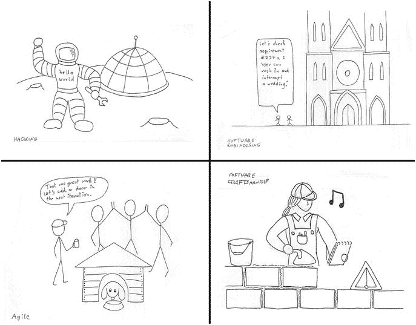

# 一、简介

## 谦逊的一课

我 16 岁时开始写我的第一个电脑游戏。这是一个益智游戏，你必须移动砖块并让它们消失。几个朋友加入了这个项目，很快游戏就有了详细的概念、图形、关卡，甚至还有一个企鹅吉祥物(Linux 吉祥物还没有被发明出来)。只有程序需要被编写。那时，我正在 C64 计算机上用汇编语言编写代码。起初，编程很容易。在《少年无畏》中，我相信编程意味着在编写代码时投入足够多的精力，直到成功为止。我已经写了许多这样的小程序，一切都运行良好。但是很快，图形和游戏机制的编程变得比我想象的更困难。我花了几天时间试图对工作进行小的改进，但几乎没有进展。我的编程工作流程是

1.  打开电脑
2.  加载编译器
3.  加载程序
4.  写几行代码
5.  运行程序
6.  通常，程序会崩溃并关闭操作系统
7.  关闭计算机并返回到步骤 1

实际上，我花在代码上的时间不超过 10%。发展速度减慢并很快完全停止是不足为奇的。目前，该项目已经晚了 23 年。我花了很长时间才弄明白发生了什么事。任何导师(一个有经验的程序员或我自己的老版本)都会坚持寻找从第 5 步到第 4 步的捷径。这种快捷方式在当时以一个插在电脑背面的盒子的形式存在。找到这些捷径不是一件小事。然而，他们让一切变得不同。我们将这些捷径称为最佳实践。

## Python 中的最佳实践案例

23 年后的今天，我们有了 Python，一种让很多事情变得更简单的语言。当程序出错时，我们不必重启计算机。我们有像 Pygame 这样的库，可以帮助我们用很少的代码创建更好更快的图形。我们还需要编写 Python 代码的最佳实践吗？虽然你会从这本书的标题中预料到我的观点，但我想从一个简单的例子开始，解释为什么仍然值得考虑 Python 中的最佳实践。假设我们想使用 Python 和 Pygame 为自己的小游戏创建图形。作为概念验证，我们将加载两个图像，一个带有关卡，一个带有玩家人物，并将它们组合成一个图像(图 [1-1](#Fig1) )。Pygame 库中的函数完成了大部分工作。要合并这些图像并保存到一个新文件中，只需要五行代码:


图 1-1。

Two images to be combined with Pygame

```py
from pygame import image, Rect

maze = image.load(’maze.png’)
player = image.load(’player.png’)

maze.blit(player, Rect((32, 32, 64, 64)), Rect((0, 0, 32, 32)))
image.save(maze, ’merged.png’)

```

乍一看，这个程序非常简单。更重要的是，它工作正常，并产生一个合并的图像。程序太短了，不能失败…是吗？我花时间列举了这个五行程序可能失败的方式:

*   程序中的一个错别字用`SyntaxError`终止了 Python
*   Pygame 没有安装，所以 Python 退出时出现一个 ImportError
*   安装了不兼容的 Pygame 版本，因此 Python 因异常而终止
*   其中一个图像文件不存在，所以 Python 用一个`IOError`退出
*   输出图像没有写权限，所以 Python 以`IOError`结束
*   其中一个图像文件已经损坏，因此 Python 终止并出现异常
*   其中一个图像文件失真，因此输出图像也会失真
*   该程序与 Python 3 不兼容，因此用户依赖于 Python 2
*   生成图像太慢，所以游戏无法玩了
*   图像透明度处理不正确，因此输出图像中会出现伪像
*   给出了一个错误的输出文件名，因此一个重要的文件被覆盖
*   Pygame 包含恶意代码，因此系统安全受到威胁
*   该程序是以未经许可的图片发布的，所以作者有知识产权律师在他们的脖子上
*   这个程序不能在手机上运行，所以没人想用它
*   没有文档，因此潜在用户无法安装或使用该程序

我相信你可以发现更多的潜在问题。即使在一个五行程序中，也可能有不止五个地方出错。我们可以肯定，在一个长的程序中，甚至会有更多的事情出错。当我们更仔细地查看问题列表时，我们会发现一些问题显然与代码本身有关(例如，错误的导入)。其他问题，如缺少文档或法律问题)与代码本身无关，但它们会产生严重的后果。

Conclusion

编程中的一些问题可以通过编程来解决。编程中的其他问题是编程解决不了的。作为程序员，两者我们都有责任。

无论问题是什么，我们，程序员和我们的用户都必须承担后果。我经常使用自己的五行 Python 程序来完成小任务(例如，合并 pdf 或缩小数码相机图像)。作为唯一的用户，我可以很容易地改变代码或完全重写程序。但是，如果我们想编写更大的程序，有更多用户的程序，并与其他程序员合作，我们需要防止我们的项目陷入停顿。我们需要防止同时遇到太多的问题。我们需要技术来保持我们的程序健康并且易于使用。本书的前提是向您介绍编写更好的 Python 程序的既定技术或最佳实践。

## 最佳实践的起源

我们如何创建编写良好的程序来解决或避免前面描述的问题？有几个思想流派在这个问题上投入了大量精力。在这里，我们将探究它们是否对我们有所帮助(见图 [1-2](#Fig2) )。



图 1-2。

Building a house as a metaphor for building software. Upper left: Hacking, love for the challenge of overcoming technical limitations. Upper right: Software engineering, a systematic approach found in large projects. Lower left: Agile, fast, iterative development. Note that the product is inhabited by the end user while development goes on. Lower right: Software craftsmanship, focusing on doing things right using a set of established tools.

### 砍

根据理查德·斯托尔曼的说法，黑客对卓越和编程有着共同的爱好(黑客:电子时代的奇才，1985 年，电视纪录片)。他们喜欢创造性的挑战，以克服技术限制，实现以前认为不可能的事情。在当今技术驱动的社会，擅长黑客的人是不可或缺的。黑客是一项关键技能，我们需要擅长这项技能的人。毫无疑问，编程是一项有用的技能。Python 是一种很好的编程语言。

然而，我不认为黑客是一个伟大的编程方法。对此，我给出了三个理由。首先，黑客专注于新的、困难的或具有挑战性的问题。就其本质而言，相应的解决方案有一点天才和一点即兴创作的味道。这是一个很好的组合，如果你正在解决以前已经做过的前沿问题。但是如果只是想写普通的程序呢？对我们许多人来说，找到一个可行的解决方案就足够了，即使这个解决方案会很无聊。

第二，黑客有很强的优秀内涵。黑客通常被认为是一个精英，一个需要不言而喻的技能水平才能加入的群体。但是在编程中，有很多问题并不需要专家来解决。通常，一个普通的程序员就足够了，黑客可能会感到厌烦。从商业角度来说，成千上万的程序员走过的路比只有少数人选择或未知的路风险要小得多。

第三，不是每个人都想投身于黑客事业。除了详细了解计算机如何工作，我们许多人还有其他事情要做；我们有数据要理解，有网站要创建，有生意要经营，有家庭要照顾。在我看来，编程太重要了，不能把它留给一小群专注的专家。我写这本书的一个原因是，我想打破界限，让更多的人可以使用编程。在我看来，每个人都能编程，而且每个人都能做好。除了黑客还有其他编程方式。不过，我们可以从黑客文化中学到很多东西:它产生了非常有用的技术和工具，以及对卓越和编程的热爱。

### 软件工程

反对黑客，我们发现软件工程。软件工程关注的是构建软件的系统方法，通常是在公司环境中。软件工程不是关注个人，而是控制构建程序的整个过程:它的技术包括精确地找出要构建什么，设计一个具有明确定义的组件的程序，验证程序实际上是否正确工作，以及最后，一旦程序被使用就对其进行维护。我们也可以从软件工程中学到很多东西。例如，背景研究已经对类似前面列表中的问题所引起的工作进行了研究。根据你引用的哪项研究，我们发现软件总成本中只有三分之一是初始开发；剩下的就是保养了。在最初的三分之一中，只有 25%-50%用于编写代码；剩下的就是计划、调试、测试和维护。

软件工程方法的缺点是它对于大多数 Python 项目来说太大了。软件工程方法变得有用的典型项目的时间范围从半年到几年，有时甚至几十年。通常，我们选择 Python 是因为它有可能在几天、几小时、有时几分钟内取得结果。此外，软件工程项目通常涉及数十或数百人，数千到数百万行代码，以及覆盖数千页的文档。如果你的目标更适中，我们需要寻找一种更轻松的方法。如果您想了解更多的背景信息，那么伊恩·萨默维尔(Addison-Wesley，2000)的《软件工程》一书是一个很好的起点。

### 敏捷

软件工程是一种相当繁重的方法论的概念并不新鲜。当问及替代方案时，2017 年你经常会听到的答案是敏捷。敏捷是一种致力于改进软件开发过程的哲学。它的核心价值观是个人和互动、工作软件、客户协作和应对变化(另见 [`www.agilemanifesto.org/`](http://www.agilemanifesto.org/) )。敏捷(及其最普遍的表现形式，Scrum 和 XP)促进了程序的快速、渐进的开发和短迭代的工作(见图 [1-2](#Fig2) )。以小的工作增量构建程序对全世界的程序员产生了巨大的积极影响。

了解敏捷是有用的，因为它为高效编程提供了哲学基础。它将编程中的人的因素放在第一排。本书中描述的许多工具都是根据敏捷原则和实践开发的。这给我们带来了敏捷方法的局限性:敏捷是一种哲学，而不是一套工具。敏捷告诉我们为什么我们可能希望以某种方式编程(快速创建工作软件并让客户满意)，但它没有告诉我们在键盘前应该做什么。此外，敏捷框架在实践中通常很难实现。例如，Scrum 框架被限制在五到九个人，它需要组织的大量投入。此外，敏捷过程有时被采用主要是因为它们时髦的名字。在实践中，遵循明确定义的流程和盲目遵循规则手册之间只有一线之隔，需要经验和常识来找到正确的平衡。

### 软件工艺

成为天才黑客很有帮助。拥有一个设计良好的软件蓝图会有所帮助。拥有一个动态的面向客户的过程也会有所帮助。但事情的根本是我们在电脑前做的工作。承认这项工作是一门叫做软件工艺的学科的基础。软件工艺承认编程的很大一部分是由需要完成的简单任务组成的。要做好它，我们需要有合适的工具，我们需要有合适的技能，我们需要在实践中应用这两者。编程是一门手艺，就像石工、木工或糖果业一样，这意味着

*   目标很重要。我们创造程序是为了达到目的。编程不是一门艺术；我们想写一些有用的程序。
*   规划很重要。这是工作中有用且必要的部分(测量两次，切割一次)。
*   工具很重要。我们需要保管好我们的工具，保持工作场所整洁。这门手艺帮助我们选择合适的工具。
*   技能很重要。我们一直在努力改进我们的工艺。我们努力尽可能地编程，同时承认我们的技能并不完美。
*   社区事务。有一个由志同道合的人组成的大社区，他们以这门手艺为荣。这个社区是学徒和师傅的天堂。
*   大小并不重要。我们不把自己局限于某一类型的项目。无论我们写一个五行程序还是为一个大项目做贡献，这种技巧都是需要的。
*   练习很重要。我们无法单独在白板或电子表格上解决编程问题。为了成功编程，我们需要亲自动手。

对于 Python 程序员来说，软件工艺是一个有用的比喻。因此，这本书是建立在软件工艺的理念之上的。我们将在本书中看到的最佳实践已经被我们之前的许多软件工匠尝试过、测试过，并且发现是有用的。

## 这本书是给谁的

你已经掌握了 Python 的基础，自己编写 Python 程序也有一段时间了。您可以安全地应用列表、字典和集合等数据结构，并且能够编写自己的函数。也许你已经开始使用 Python 类和由多个模块组成的程序编写面向对象的程序了。随着编程技能的提高，你的程序变得越来越大。你会发现越大的程序越难调试和测试，并且有崩溃的趋势。为了编写 100 到 10，000 行代码的可靠 Python 程序，解决这些问题的技术可能是有用的。你可能已经意识到编程不仅仅是写代码。知道所有的命令并不足以让程序工作。你可能也已经意识到 Python 的世界是巨大的。有太多的工具和库可以帮助你。然而，要找出哪一个值得一试却很难。写这本书是为了帮助你找到下一步该做什么。

这本书是给经常编程，但不是全职软件开发人员的人看的。你可能是一个生物学家，有几百万个 DNA 序列的数据要分析。你可以成为一名记者，使用 Python 从网络上自动获取信息。作为管理大型网络的系统管理员，您可以使用 Python 来提高工作效率。你可以开办编程课程，在那里你可以建立一个交互式网站。无论你做什么，你都是自己领域的专家，都有相关的问题需要解决。这本书旨在提高您的 Python 项目，而无需先学习计算机科学。您希望编写的 Python 代码不仅能以某种方式工作，而且写得很好。在这种情况下，这本关于调试、自动化测试和维护的最佳实践的书将帮助您进一步发展 Python 技能。

## 这本书是关于什么的

Python 不是一门新语言。它已经存在超过 25 年了。在此期间，出现了大量有助于编写更好的 Python 程序的技术和工具，新的工具也在不断开发。对于相对不熟悉 Python 的人来说，这些巨大的数字很容易让人不知所措。为了提供一些指导，本书将集中讨论三个问题:

*   我们如何让我们的代码工作？
*   我们如何检查我们的代码是否有效？
*   我们如何确保我们的代码在未来能够工作？

我发现这三个问题对我自己的 Python 编程实践至关重要，我也看到许多新的 Python 程序员在这些领域苦苦挣扎。本书接下来的 16 章分为三个部分，每个部分都介绍了回答这三个问题之一的最佳实践。

### 第 1 部分:调试

作为程序员，我们的首要任务是让程序运行起来。第一个碍事的是虫子。在本书的第一部分，我们将研究 Python 中出现了哪些类型的错误，或者更准确地说，异常和语义错误，以及如何消除它们。我们将使用科学的方法，一个系统的思维过程，而不是胡乱猜测。调试的最佳实践包括像`print`这样的工具、产生诊断信息的自省以及用于逐行跟踪代码执行的交互式调试器。不管您编写的程序的类型和大小如何，这些调试的最佳实践都是有用的。

### 第 2 部分:自动化测试

一旦我们写了一个程序，我们怎么知道它能工作？当然，我们可以自己手动运行它，但是随着频繁的变化，手动测试变得容易出错和乏味。幸运的是，Python 中的测试很容易自动化。从简单的测试函数开始，我们将添加测试数据，在各种条件下测试我们的程序。我们将把程序的测试组装成一个测试套件。我们将着眼于测试的最佳实践:存在什么样的测试？它们在什么情况下有用？最后，我们将检查自动化测试的优点和缺点。自动化测试将帮助您检查程序中是否存在 bug，从而防止它们在您修复后再次出现。

### 第 3 部分:维护

写程序是一回事。让它继续工作是另一回事。维护软件是一个广泛的领域，Python 提供了大量优秀的支持工具。我们从版本控制的维护最佳实践开始，这被认为是任何专业程序员都必须具备的。我们将看到在一个保存良好的 Python 项目中，文件和文件夹是如何构造的。两章处理清理代码和将编程问题分解成更小的部分以使其更容易管理。接下来，我们仔细看看 Python 中的类型，以及我们有哪些选项可以使我们的数据类型更加可靠。在最后一章，我们将使用 Sphinx 工具编写文档。所有这些结合在一起创造了一个健康的生态系统，你的程序可以在其中茁壮成长。

### 更多好处

阅读这三个领域的最佳实践的好处是双重的:首先，您将学习工具和技术本身，以便您可以在日常编程实践中应用它们。第二，您将获得许多有经验的 Python 程序员认为重要的最佳实践的概述。了解他们有助于你理解其他开发人员的工作。它还将帮助你自己评估，哪些实际问题可以通过本书中没有涉及的其他技术来解决，以及它们是否对你有用。

## 马泽伦游戏

在我第一个游戏编程项目的痛苦经历多年后，编程变得容易多了。在一个多任务操作系统中，一个崩溃的程序并不需要我们重启所有的程序。我们有舒适的编程语言和强大的处理图形、输入设备和声音效果的库。在网络上，我们有一个无处不在、几乎无限的信息流。在过去的几年里，我利用这种情况，成功地用 Python 编写了许多小游戏(主要是为了我自己的乐趣)。在这本书里，我们要用 Python 写游戏 MazeRun。这个游戏的特色是一个人在迷宫中吃出一条路来。玩家在一个由方形瓷砖建成的景观中移动一个类似奶酪轮子的人物，吞食圆点并试图避开在迷宫中游荡的鬼魂。游戏的想法可以很快在一张餐巾纸上勾画出来(见图 [1-3](#Fig3) )。


图 1-3。

Sketch of the MazeRun game—the Python example we will use throughout this book

我之所以确信 MazeRun 是一本关于最佳实践的书的绝佳范例，有许多原因:

1.  这个游戏很容易理解。你们大多数人可能都玩过吃点游戏。
2.  我们可以将游戏实现为一个简短的 Python 程序，不需要数千行代码。
3.  编写游戏很快变得复杂。我们需要组织数据、图形、用户界面、性能、并发事件等等。
4.  细节很重要。小故障会妨碍游戏的可玩性，甚至使游戏无法玩。
5.  编写电脑游戏是软件开发人员的共同特点。即使你还没有写过任何游戏，你也很可能玩过一些。当然，你对这个主题有足够的了解来评估一个游戏是否有效。对于我喜欢的其他主题(例如，“模拟 RNA 三维结构的算法”)，情况可能不是这样。
6.  您可以使用代码示例来创建自己的游戏。
7.  二维水平易于创建插图，可以放在一本书里(我也想创建一个关于在时空连续体中旅行的游戏，但四维图像太难打印)。

我们将逐步编写 MazeRun，一次几行 Python 代码。因此，游戏将逐章改进。不过，在我们准备开始之前，我们需要在下一部分准备一些技术上的东西。

## 这本书怎么用？

为了充分利用本书中的解释和代码示例，我强烈建议您自己下载并执行代码。为此，您需要注意四件事:

1.  安装 Python 3
2.  安装 Pygame 库
3.  安装文本编辑器
4.  下载源代码示例

所有章节都假设你正在一个 Ubuntu Linux 系统上工作。除了少数例外，本书中的工具应该也能在 MacOS 和 Windows 上运行。但是，我没有测试过这些操作系统，也不会有任何针对这些操作系统的具体安装说明。在下文中，你会发现四个要点的详细提示。

### 安装 Python 3

要执行程序，需要 Python 3.5 或更高版本。在 Ubuntu 上，默认安装 Python 2。一些例子在早期的 Python 版本上会失败，我不会告诉你是哪一个。为了避免以后的挫折，我建议您安装一个最新的 Python 版本

```py
sudo apt-get install python3

```

如果该方法由于任何原因失败，请从 [`www.python.org`](http://www.python.org) 下载并安装一个最新的 Python 解释器。我鼓励您安装 IPython shell 以及

```py
sudo pip install ipython

```

IPython 将在许多方面让您的生活更加轻松。在许多章节中，我们将安装额外的 Python 库和一些额外的工具。使用 pip 和 apt-get 可以轻松地安装它们中的大多数。在相应的章节中给出了精确的说明。

### 安装 Pygame 库

因为马泽润游戏将建立在 Pygame 库( [`www.pygame.org`](http://www.pygame.org) )之上，所以你也需要安装它。安装 Pygame 没有其他 Python 库方便。您需要从 [`https://bitbucket.org/pygame/pygame/overview`](https://bitbucket.org/pygame/pygame/overview) 下载适合您系统的文件，解压该文件，并从解压后的目录安装

```py
python setup.py install

```

### 安装文本编辑器

要查看或编辑 Python 源代码，您需要一个带有 Python 语法高亮显示的文本编辑器。你可以使用你最喜欢的文本编辑器。例如，Sublime，PyCharm，Anaconda Spyder，Emacs，甚至 vim 都是完美的。如果你在 Windows 上工作，空闲编辑器或 Notepad++是 Python 的好编辑器。请不要使用 gedit 甚至记事本来查看 Python 代码，因为在两者中编辑源代码的能力都非常有限。

### 下载源代码示例

本书中使用的源代码在 Github 上完全可用。通常，每一章都有单独的文件，每一部分都有完整的版本。您可以从 GitHub 仓库下载源代码:

[T2`https://github.com/krother/maze_run`](https://github.com/krother/maze_run)

右侧有一个按钮，可以下载整个源代码作为`.zip`文件。使用`git`程序的更优雅的方法将在第 [12 章](12.html)中介绍。这些文件包含一个主文件夹，`maze_run,`，其中包含整个游戏，以及几个章节文件夹中的个人`chapters`的例子。代码是在 MIT 许可的条件下发布的，这给了你很大的重用代码的自由。因此，它与大多数其他许可证兼容，对代码的私人或教育用途没有任何限制，包括再分发。请注意，无论是本书的作者还是出版商，都不会对您使用代码所做的任何事情承担任何责任。请看执照。TXT 文件，以获得准确的法律术语。

完成这些步骤后，我们就可以开始了。让我们深入了解 Python 的最佳实践！