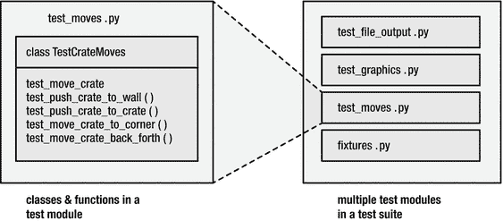
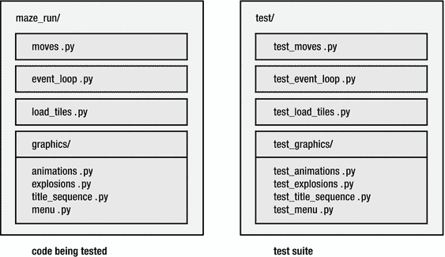
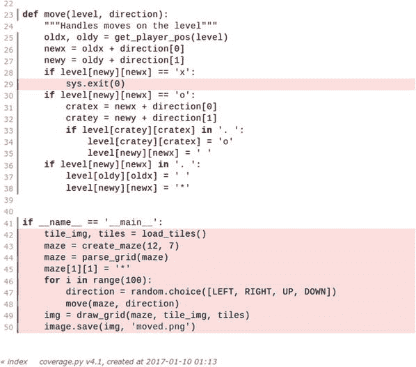

# 十、编写测试套件

如果你不关心质量，你就无法满足任何其他要求。—杰拉尔德·m·温伯格

到目前为止，我们已经为我们的游戏创建了一套测试函数。我们可以从 Linux 命令行运行所有测试，只需输入'`py.test`'或'`py.test filename.py`'。如果我们正在测试一个更大的程序，测试的数量将很容易增长到数百个。对于参数化测试，甚至成千上万的测试都是常见的。我们如何组织如此大量的测试，并且仍然有效地使用它们呢？

为了更好地组织我们的测试，我们将在本章中创建一个测试套件。测试套件是伴随给定程序的一组完整的结构化测试。要为 MazeRun 编写一个测试套件，我们将使用我们已经编写的测试。我们将把我们的测试组织成模块、类和包。我们将重构测试代码，使其更加简洁。我们还将以不同的方式执行测试，这样我们就不需要每次都运行整个测试套件。最后，我们将计算测试覆盖率，以衡量我们的代码有多少已经被测试。一个好的测试套件是一个强大的诊断工具，可以识别程序中的各种问题。测试套件可以测试基本功能是否工作(单元测试)，软件系统的组件是否一起工作(集成测试)，或者用户要求的功能是否存在(验收测试)——下一章将详细介绍这三个方面。我们通过将每个测试放在一个单独的函数中来编写我们的第一个测试。我们有意将测试函数存储在单独的模块中。在最后两章之后，py.test 的输出如下所示:

```py
=============================== test session starts ===============================
platform linux -- Python 3.4.0, pytest-2.9.2, py-1.4.31, pluggy-0.3.1
rootdir: /home/krother/projects/maze_run/tests, inifile:
plugins: cov-2.3.0
collected 33 items

test_crate.py ........
test_data.py .......x...x......
test_files.py ....
test_mock.py ...
====================== 31 passed, 2 xfailed in 0.30 seconds =======================

```

随着测试函数数量的增长，我们需要更加关注整体结构。为了改进结构，我们将清理或重构我们的测试套件。与普通代码类似，我们将把函数分组到合理的高阶结构中。我们要做的第一件事是改进测试模块的结构。然后我们将把我们的测试分组。

## 测试模块

通过许多测试，测试模块提供了一种构造测试套件的简单方法。我们可以将测试分成多个模块。从技术上讲，这很容易做到:我们只需将相应的测试复制到一个新的 Python 文件中。如果这些模块的名称像前面一样带有`test`，py.test 中的自动发现将相应地收集所有测试模块。通常，我们不需要显式地导入我们的测试模块。然而，在组织测试模块时，需要记住一些最佳实践:

*   首先，测试模块的名字应该和被测试的模块一样。按照惯例，如果我们正在测试`maze_run/moves.py`模块，相应的测试模块应该是`test_moves.py`。这使得为一段给定的代码寻找测试代码变得更加容易，反之亦然。
*   第二，助手函数和测试数据应该保存在不同的模块中。在我们的测试目录中有一个额外的非测试模块(例如`util.py or fixtures.py`)，测试模块可以在那里导入它们，这有助于避免测试套件中的冗余。
*   第三，所有的测试模块应该在同一个地方。

我们可以对模块的结构进行一些改进。重组我们的测试模块主要包括将相似的测试组合在一起，并给每个模块起一个描述性的名字。首先，我们将我们的 fixtures 移动到一个单独的模块中，`fixtures.py,`其他测试可以从这个模块中导入它们。夹具模块包含我们的参数化夹具`level`:

```py
import pytest
from maze_run.draw_maze import parse_grid

LEVEL = """#######
#.....#
#..o..#
#.o*o.#
#..o..#
#.....#
#######"""

LEVEL_NO_DOTS = LEVEL.replace('.', ' ')

@pytest.fixture

(params=[LEVEL, LEVEL_NO_DOTS])
def level(request):
    """A level with four single crates"""
    return parse_grid(request.param)

```

接下来，我们从第[章第 8 章](08.html)和第[章第 9 章](09.html)中发现移动玩家形象和箱子的测试覆盖了非常相似的功能。我们把它们合并成一个模块，`test_moves.py`。我们将图形(带有嘲讽)和文件输出的测试留在原处，只将文件分别重命名为`test_graphics.py`和`test_file_output.py`。因此，我们有三个模块和一个助手模块。

Best Practice

在我们重新组织代码之后继续之前，有必要检查一下是否所有的测试都通过了。

## 测试等级 es

使用 py.test，创建一个测试类并不需要做很多事情。创建测试类的简单方法如下:

1.  收集几个属于一起的测试函数。
2.  将函数缩进一级。
3.  在上面写一个`class`语句。
4.  给类起一个以`Test`开头的名字，这样 py.test 就知道里面有测试。
5.  添加一个 docstring 来描述测试类的好处。
6.  给每个函数添加`self`参数。

让我们在模块`test_moves.py`中清理移动玩家和箱子的测试。当合并我们以前的代码时，该模块包含以下函数:

```py
move_crate(direction, plr_pos, crate_pos)
test_move_crate_left()
test_move_crate_right()
test_move_crate_up()
test_move_crate_down()
test_assert_examples()
test_push_crate_to_wall()
test_push_crate_to_crate()
test_move_to_none()
test_move_crate_to_corner(level)
test_move_crate_back_forth(level)
test_paths(path, level)
test_move_player(level, path, expected_x, expected_y)

```

虽然您可能注意到代码本身可以改进，但是我们将首先把测试分组到类中。查看代码，可能会发现两个潜在的类。第一个，`TestCrateMoves,`用于与板条箱相关的一切，第二个，`TestPlayerMoves,`用于剩余的测试。功能`test_assert_examples`与模块中的任何功能无关。我们决定删除它，因为它在 MazeRun 没有任何用途。将`self`添加到每个方法后，模块的结果结构如下:

```py
def move_crate(direction, plr_pos, crate_pos):

class TestCrateMoves:
    def test_move_crate_left(self)
    def test_move_crate_right(self)
    def test_move_crate_up(self)
    def test_move_crate_down(self)
    def test_push_crate_to_wall(self)
    def test_push_crate_to_crate(self)
    def test_move_crate_to_corner(self, level) def test_move_crate_back_forth(self, level)

class TestCrateMoves:
    def test_move_to_none(self)
    def test_paths(self, path, level)
    def test_move_player(self, level, path, expected_x, expected_y)

```

测试类的行为类似于普通的 Python 类。我们不需要写一个构造函数(`_init_`)或者实例化这个类:py.test 会为我们处理这些。用`[NEWLINE]from fixtures import level, LEVEL[NEWLINE]`使测试通过。

Hint

如果你熟悉标准 Python 库的测试框架`unittest`，你可能会期望我们创建一个`unittest.TestCase`的子类。当使用 py.test 时，您仍然可以做到这一点，并且来自`unittest`的所有断言方法都以同样的方式工作。这里我们将使用 py.test 断言实现所有测试(这与`unittest`风格的类不兼容)。生成的代码更短，更容易阅读。

### 重构测试函数

现在我们转向改进代码本身。我们将借此机会执行一些小的重构。我们要关注的第一个施工现场是四个测试`test_move_crate_left`、`test_move_crate_right, and so on`。他们都使用`LEVEL`数据，而不是水平夹具。事实上，我们可以应用第 9 章[中描述的测试参数化。作为奖励，我们也去掉了助手函数`move_crate`。我们不会改变其他四个测试的实现。代码与第](09.html) [8](08.html) 章中的相同。重构后的测试类如下所示:

```py
from maze_run.draw_maze import parse_grid
from maze_run.moves import move
from maze_run.moves import LEFT, RIGHT, UP, DOWN
from fixtures import level
import pytest

CRATE_MOVES = [
    (LEFT,  (3, 2), (3, 1)),
    (RIGHT, (3, 4), (3, 5)),
    (UP,    (2, 3), (1, 3)),
    (DOWN,  (4, 3), (5, 3)),
]

class TestCrateMoves:

    @pytest.mark.parametrize

(’direction, plr_pos, crate_pos’, CRATE_MOVES)
    def test_move_crate(self, level, direction, plr_pos, crate_pos):
        """After move player and crate moved by one square"""
        print(direction, plr_pos, crate_pos)
        move(level, direction)
        assert level[plr_pos[0]][plr_pos[1]] == ’*’
        assert level[crate_pos[0]][crate_pos[1]] == ’o’

    def test_push_crate_to_wall(self):
        ...

    def test_push_crate_to_crate(self):
        ...

    def test_move_crate_to_corner(self, level):
        ...

    def test_move_crate_back_forth(self, level):
        ...

```

在`TestPlayerMoves`类中，我们将合并测试函数 s `test_paths`和`test_move_player`。两者都使用测试参数化，代码大部分是冗余的。重构后的函数使用单个参数列表，这使得我们的测试类大大缩短了:

```py
PATHS = [
    ((UP, LEFT), 2, 2),
    ((LEFT, UP), 2, 2),
    ((RIGHT, UP, LEFT, LEFT), 2, 2),
    pytest.mark.xfail(((DOWN, DOWN), 0, 0)),
    ((LEFT,), 2, 3),
    ((LEFT, RIGHT), 3, 3),

    ((RIGHT, RIGHT), 4, 3),
]

class TestPlayerMoves:

    def test_move_to_none(self, level):
        """direction=None generates an Exception"""

        with pytest.raises

(TypeError):
            move(level, None)

    @pytest.mark.parametrize

(’path, expected_x, expected_y’, PATHS)
    def test_move_player(self, level, path, expected_x, expected_y):
        """Player position changes correctly"""

        for direction in path:
            move(level, direction)
        assert level[expected_y][expected_x] == ’*’

```

在这个重构之后，我们再次验证所有的测试都通过了。他们有:

```py
test_file_output.py ....
test_graphics.py ...
test_moves.py ...................x.......x...

====================== 35 passed, 2 xfailed in 0.44 seconds =======================

```

除了四次额外的测试，我们得到了什么？现在，模块`test_moves`只包含 7 个方法，而不是 13 个。夹具和参数化的使用导致了一个更短更简单的测试套件，如果其中一个测试失败，这将有利于将来的维护或修复缺陷。只要稍微注意一下将测试分组到类和模块中，通过查看文件名就可以很容易地找到相应的测试。在图 [10-1](#Fig1) 中，你可以看到我们已经创建的测试模块和类的概述。



图 10-1。

Example test suite. Test function s (left) are nested in a test class, which in turn is nested in a test module. A test suite usually contains many test modules.

### 测试类中的夹具

你可能会问自己为什么我们把`level`夹具移到一个单独的模块中(`fixtures`模块只包含一个夹具，我们只在`test_moves)`中使用它)。另一方面，这种结构为增长留下了空间:如果我们发明更多的固定装置或在其他地方使用它们，一个适当的结构已经到位。但是让我们简单地检查一个可能的选择:将 fixture 放在一个类中。

```py
class TestCrateMoves:

    @pytest.fixture

(params=[LEVEL, LEVEL_NO_DOTS])
    def level(self, request):
        """A level with four single crates"""

        return parse_grid(request.param)

    ...

```

除了额外的`self`，与我们之前定义的 fixture 几乎没有语法上的区别。参数化也以同样的方式工作。当然，一个类中的 fixture 只在那个类中可用。这就是我们坚持使用`fixtures`模块的原因(两个类都使用`level`)。作为最后一个细节，您需要知道我们可以将`scope`参数设置为`@pytest.fixture`装饰器:

```py
@pytest.fixture(scope="class", params=[LEVEL, LEVEL_NO_DOTS])

```

在这种情况下，将分别为该类创建一次夹具。将范围设置为`class`(或`module`)的动机是，一次构建夹具将节省时间，从而加快我们的测试。缺点是我们的测试可能会干扰。我们已经在第 [9](09.html) 章中看到了通过灯具干扰的例子。总之，这个选项需要小心使用。

## 测试如何找到被测试的代码？

当我们在第 8 章[中编写我们的第一个测试时，我们简单地将`test_crate.py`模块放在与我们测试的模块相同的目录中。对于一个或两个测试模块来说，将测试和我们的代码放在一个文件夹中是没有坏处的。随着我们程序的增长，这变得很麻烦。因此，我们将把我们的测试模块和类放在主项目目录中一个单独的`tests/`文件夹中(也参见第](08.html) [13 章](13.html))。这将有助于我们清楚地将程序代码和测试分开。现在我们需要确保我们测试过的代码可以被正确导入。由于 Python 中的包导入机制，有一些最佳实践可以使测试和程序都是可执行的。我推荐以下步骤:

1.  在主项目目录中创建一个`test/`文件夹，与包含我们想要测试的 Python 模块的`maze_run`文件夹平行。
2.  确保`maze_run`文件夹中有一个`__init__.py`文件(可能是空的)。
3.  将程序模块中的导入改为绝对导入(例如，`from draw_maze import parse_grid`变成了`from maze_run.draw_maze import parse_grid)`)。在程序的所有模块中都这样做。
4.  确保`maze_run`文件夹中没有文件`maze_run.py`。改名为`__main__.py`。
5.  将`PYTHONPATH`变量设置到主项目文件夹中。

如果游戏的 Python 模块在`/home/krother/projects/maze_run/maze_run`目录中，我们将在主目录的`.bashrc`文件中添加下面一行:

```py
export PYHTONPATH=$PYTHONPATH:/home/krother/projects/maze_run

```

只要我们打开一个新的终端，`PYTHONPATH`就会更新。之后，我们可以在我们的测试模块中(或任何其他地方)编写:

```py
from maze_run.moves import move

```

或者，我们可以告诉`pip`在可编辑模式下安装软件包。如果我们有一个`setup.py`文件，我们可以转到`/home/krother/projects/maze_run`目录并键入

```py
pip install -e .

```

这将把到`maze_run`的路径添加到导入路径(`sys.path`)。第二种方法要求项目有一个`setup.py`文件。这两种导入测试代码的方法都是公认的最佳实践，尽管第二种方法与第 [13 章](13.html)中详细讨论的 virtualenv 集成得更加无缝。

因此，程序内部和测试中的导入以同样的方式工作。现在我们可以从主项目文件夹中执行游戏

```py
python maze_run/

```

我们的测试

```py
cd tests/
py.test

```

请注意，`test/`文件夹或其子包中不需要`__init__.py`文件。同样，测试自动发现会处理一切。没有`__init__.py`文件也避免了在运行`python setup.py install`时安装测试(这在大多数时候是没有意义的)。

Hint

如果您以前没有处理过如此大规模的包导入，那么让路径和目录起作用可能会令人沮丧。让测试在前面章节的代码上运行的一个不太好的方法是给`PYTHONPATH`变量添加一个更深的文件夹级别:例如，`/home/krother/projects/maze_run/maze_run`。

## 多重测试包

当测试数量进一步增长时，我们可以将我们的测试模块分组到多个测试包中。您应该使用哪些软件包？像模块一样，有一个简单的最佳实践，类似于测试模块的最佳实践:使用与被测试项目的包相同的结构来创建您的测试包。唯一的区别是名称需要有`test`作为前缀或后缀，这样 py.test 就可以自动找到其中的测试。结果，我们得到了两个平行的目录树:一个包含我们程序的包和模块，另一个，通常在一个名为`tests/,`的目录中，包含了整个测试套件，可能还有进一步的测试包和测试模块。假设我们想测试两个 Python 包:`maze_run`包含游戏，`maze_run.graphics`包含在屏幕上画图的所有代码。在我们的项目中，我们将有一个用于`maze_run`的`test/`目录和一个用于子包的`test/test_graphics`(见图 [10-2](#Fig2) )。通过遵循这个命名约定，找到程序特定部分的测试变得很容易。



图 10-2。

Structure of test modules and packages. The code units under test (left) correspond with the names of the according tests (right).

## 测试自动发现

在这一点上，有必要花点时间思考一下 py.test 到底是如何识别测试的。py.test 中内置的测试自动发现首先检查当前目录的所有子目录，并将它们的名称与模式进行比较。每个目录

*   以`test_`或开始
*   以`_test`结尾

被进一步检查，包括子目录。在每个目录中，所有

*   以`test_`开始，以`.py`结束，或者
*   以`_test.py`结尾

被收集并作为测试模块导入。将模块作为测试模块导入与普通的导入有细微的不同，因为 py.test 会在这些模块中更改`assert`语句以导致测试通过或失败。在所有其他模块(特别是所有导入的非测试模块)中，`assert`语句正常工作。

测试自动发现不会在模块级别停止。在每个模块中，测试类和测试函数是使用非常相似的模式发现的:

*   测试类从`Test`开始
*   类内部的测试函数以`test`开始
*   类外测试函数从`test`开始

测试自动发现将忽略其他一切，允许我们定义任何我们喜欢的帮助函数/类/模块，只要它们看起来不像测试。

## 执行测试套件

现在我们已经准备好运行我们的测试套件了。到目前为止，我们只是简单地键入`py.test`，让测试框架完成所有的工作。在这里，我们将探索几种替代方案。常规的`py.test`命令列出了测试模块，用“`.`”标记通过的测试，用“`F`”标记失败，用“`x`”标记预期失败，用“`E`”标记错误:

```py
test_file_output.py ....
test_graphics.py ...
test_moves.py ...................x........x...

```

当运行一个更长的测试套件时，我们可以用`py.test -q`甚至`py.test -q --tb=no.`得到一个更简洁的输出，更容易得到正在发生的事情的概况。通常，结果是三种情况之一:

```py
..........................x.......x...

```

所有测试都通过了。如果我们只看到点，这是最无聊的情况，我们的测试套件没有给我们任何额外的信息。看到这一点，我们可以马上继续编写更多的代码(或者更好，更多的测试)。

```py
.......EEEE..EEEEEExEEE

```

大多数测试都因出错而失败。这些错误通常很容易发现。当我们看到这种输出时，原因要么是我们破坏了代码中的一些基本内容(在这种情况下,`level` fixture 被破坏)。另一个原因可能是配置问题(例如，配置文件放错了位置)。请注意，在执行任何测试之前，py.test 会捕获一个`ImportError`。

```py
...............FFFF.......x..F...x..F

```

一些测试通过，一些测试失败。这是最有趣的情况。一些失败的测试可能意味着有一个我们忘记修复或者我们甚至不知道的边界情况。无论如何，我们已经获得了新的信息来评估。现在值得详细研究 py.test 产生的输出，并找出导致测试失败的原因。在这种情况下，改变`maze_run.moves.move`函数中的单个字符导致了缺陷。我鼓励你自己添加微小的缺陷，看看结果如何变化。

```py
py.test -q --tb=no

```

### 部分执行

如果我们的一些测试失败了，我们该怎么办？因为我们的测试是独立工作的，所以我们可以采取分而治之的方法:我们一个接一个地检查失败的测试，并逐个修复它们。幸运的是，在 py.test 中，有许多选项来执行我们的测试套件的各个部分。

#### 执行测试模块和包

要运行单个模块，我们将其名称作为参数提供给 py.test:

```py
py.test test_moves.py

```

通过提供测试包的名称，我们可以在一个目录中运行所有的测试模块:

```py
py.test tests/

```

#### 执行测试类

要从一个模块中选择一个单独的测试类，使用模式`module::class`添加它的名称，如下所示:

```py
py.test test_moves.py::TestCrateMoves

```

#### 执行单一测试

我们可以通过使用模式`module::class::test`指定已执行测试的名称来进一步缩小已执行测试的范围

```py
py.test test_moves.py::TestCrateMoves::test_move_crate

```

##### 通过关键字选择测试

选择相似名称的一个更简单的方法是用`-k`选项指定测试名称中出现的关键字。例如，要运行所有包含“推送”的测试，我们可以编写

```py
py.test -k push

```

为了查看我们到底选择了哪些测试，我们添加了`-v`和`--tb=no`选项:

```py
py.test -k push -v --tb=no

```

这给了我们

```py
test_moves.py::TestCrateMoves::test_push_crate_to_wall PASSED

```

```py
test_moves.py::TestCrateMoves::test_push_crate_to_crate PASSED

```

#### 检查故障

为了检查失败或错误的测试，我们可以使用所有的调试技术。一个方便的快捷方式是`--pdb`选项，一旦断言失败，它就将我们直接弹出到调试器中。然而，默认情况下使用这个选项是不可取的，因为对于每个失败的测试，我们将在调试器中结束一次。一个更好的实践是首先获得整个测试套件的概述，然后使用`--pdb`选项运行一个更小的子集。例如:

```py
py.test -k push --pdb

```

#### 重新运行测试

修复代码后，我们需要知道修复是否使失败的测试通过。我们还需要知道先前通过的测试是否仍然通过(或者我们是否把一切都搞砸了)。一旦我们修复了代码中的任何缺陷，我们将不得不再次运行测试类/模块/套件的剩余部分。py.test 的几个选项可以帮助我们进行这样的测试:

*   `-x`选项在第一次测试失败时停止测试执行。如果我们已经知道许多测试会以类似的方式失败，并且想要开始对其中一个进行更详细的诊断，这是很有帮助的。
*   当我们已经修复了一些东西，并且希望看到对整个测试套件的影响时，`--lf`选项只重新运行在先前运行中失败的测试。
*   `--ff`(失败优先)选项首先执行失败的测试。如果我们发现没有改进，我们可以通过按下`Ctrl+C`来中止测试运行。

py.test 知道还有很多其他的选择。表 [10-1](#Tab1) 总结了一些常用选项。

表 10-1。

Frequently Used Options in py.test

<colgroup><col> <col></colgroup> 
| [计]选项 | 描述 |
| --- | --- |
| `-q` | 简明输出 |
| `-s` | 禁用输出捕获 |
| `-x` | 第一次失败时停止 |
| `-k [keyword]` | 关键字作为子字符串出现在测试或类名中 |
| `-v` | 明确列出所有测试 |
| `-pdb` | 对失败的测试启动调试器 |
| `-x` | 在第一次测试失败时停止测试执行 |
| `-lf` | 从上一次运行重新运行失败的测试 |
| `-ff` | 首先执行失败的测试，然后执行所有其他测试 |
| `-tb=line` | 将回溯缩短到一行 |
| `-tb=no` | 关闭追踪 |

## 计算测试覆盖率

当运行一个测试套件时，我们已经看到了执行了多少测试，以及有多少测试通过或失败。我们还不知道我们的测试执行了多少代码。这就是测试覆盖率的用武之地。在 Python 中，`pytest-cov`包允许我们检查测试了代码的哪些部分。我们首先使用`pip`安装`pytest-cov`用于覆盖率分析的 py.test 插件:

```py
pip install pytest-cov

```

现在我们可以使用`--cov`选项运行我们的测试:

```py
py.test --cov

```

我们可以通过给 pytest-cov 一个参数来显式地计算特定模块或包的覆盖率:

```py
py.test --cov=../maze_run/

```

注意，前面的命令将运行整个测试套件，而不仅仅是`test_crate.py`。当然 py.test 的常规选项可以和 coverage 模块结合使用。在后台，覆盖率分析的结果存储在一个隐藏的文件`.coverage,`中，它的内容不打算被人们阅读。为了方便起见，我们获得了一个包含所有已经执行的 Python 文件的报告。`maze_run`目录的简要报告如下(完整路径略):

```py
 -----------  coverage: platform linux, python 3.4.0-final-0  -----------
Name                            Stmts   Miss  Cover
--------------------------------------------------
../maze_run/__init__.py            3      0    100%
../maze_run/draw_maze.py          23      5     78%
../maze_run/event_loop.py         13      9     31%
../maze_run/generate_maze.py      37      8     78%
../maze_run/load_tiles.py         18      6     67%
../maze_run/maze_run.py           27      1     96%
../maze_run/moves.py              40     10     75%
../maze_run/util.py                8      2     75%
--------------------------------------------------
TOTAL                             169     41     76%

```

在这个表中，`Stmts`是 Python 语句的数量(不包括空行)，`Miss`是没有被任何测试执行的行数，`Cover`是执行的行数的百分比。76%的总覆盖率已经给了我们一些有用的信息:我们现在有确凿的证据表明我们的测试套件执行了超过一半的代码。这意味着可能会有很多地方，甚至像`a = 1/0`这样的无意义代码也会不被注意地通过我们的测试套件。显然还有工作要做！

我们可以通过创建 HTML 报告来确定有问题的区域:

```py
coverage html
firefox htmlcov/index.html

```

新创建的`htmlcov/`目录包含每个模块的 HTML 页面。在 HTML 页面上，突出显示已执行和未执行的部分(参见图 [10-3](#Fig3) )。事实证明，我们的测试套件没有覆盖的大部分代码段是事件循环和每个模块的`__main__`块。虽然我们的测试主要针对移动板条箱，但事实证明他们几乎执行了整个程序！



图 10-3。

HTML output of the `coverage` tool. The executed code parts are marked by the green bar to the left. The sections shaded in red were not executed. In this case, the module `moves.py` has been covered mostly by the tests, but we did test whether the exit (`’x’`) works and the `__main__` block was never called.

如何解读一个程序的测试覆盖率？100%的测试覆盖率是什么意思？首先，它仅仅意味着每条指令至少被执行一次。100%的测试覆盖率并不意味着程序中的所有指令都能工作，更不意味着程序整体上是正确的。为什么会这样？有一个简单的解释:可能的执行路径太多了。假设我们的程序包含一个决策(例如一个`if`语句)。然后，程序中有两条独立的路径。每条路径都可能包含缺陷，因此需要单独测试。如果我们的程序包含一系列八个决策，那么已经有 256 个可能的路径。随着程序复杂性的增长，执行路径的数量也在无限增长。除非程序非常简单，否则我们的测试很可能无法覆盖程序中的所有路径。让我们考虑一个小小的、稍微有点做作的例子。假设我们有(错！)用于计算逻辑异或的代码:

```py
def xor(a, b):
    if a is False and :
        if b is True:
            return True
    if b is False:
        return True

```

和一个测试函数:

```py
def test_xor():
    assert xor(True, False)
    assert xor(False, True)

```

这个测试将会覆盖`xor`函数中 100%的代码。然而，即使是肤浅的解释也会发现，一半的可能输入产生了错误的结果(我们的测试未能覆盖相关的边界情况(`True, True`)和(`False, False`))。并且测试覆盖率没有给我们任何功能被破坏的暗示。这个限制是为什么测量测试覆盖率有点危险的原因之一。拥有 100%的测试覆盖率是非常令人迷惑的。这表明我们已经测试了所有的东西，而事实上我们只是确保了每一行都被至少一条路径覆盖。顺便说一下，在 Python 中计算逻辑异或的正确方法是

```py
def xor(a, b):
    return bool(a) != bool(b)

```

在实践中，测量测试覆盖率仍然是有用的。当然，我们的测试覆盖率越高越好。然而，我们不需要直接瞄准 100%的覆盖率。如果一个程序经常改变，甚至会阻碍开发。通常，我们可以用相对较少的测试和一个小但有用的测试套件达到 50%的测试覆盖率。75%的测试覆盖率开始感觉稳定，90%是严格的，100%是针对那些发展不是很快但需要高度完整性的项目(例如，像 Python 本身这样的语言处理器)。分析测试覆盖的主要好处是，它允许我们识别有问题的区域，并更好地评估风险。

### 测试套件需要维护

测试套件是软件的一部分，就像完成工作的代码一样。因此，保持测试代码的整洁和保持程序代码本身的整洁一样重要。这意味着将大的函数或文件分割成小的，避免代码重复，并关注编码风格。记录为什么要编写某些测试是一个重要的最佳实践，它使得清理测试更加容易。测试套件像任何程序一样进化:它增长，它变化，并且它也需要不时地重构(重构)。

幸运的是，测试代码通常比常规代码更容易维护。测试函数往往已经很短了。根据经验，尽量保持测试代码非常简单。避免在同一个测试中出现多个断言:许多小测试比几个大测试要好。还要避免多重循环或`if`条件；在大多数情况下，这些可以移动到一个助手功能或参数化测试。请记住，如果在调试期间测试失败，错误可能出现在测试或代码中。我们不想同时调试两个程序(程序和测试)；因此，维护一个非常容易理解的测试套件使得开发更加可靠。

## 最佳实践

*   测试套件是给定程序的测试的结构化集合。
*   测试功能可以分为测试模块、测试类和测试包。
*   测试模块和包应该与它们测试的代码单元具有相同的名称。
*   一个测试套件应该位于一个单独的文件夹`tests/.`
*   py.test 中的测试自动发现通过匹配名称来查找测试。
*   最有趣的测试结果是只有一小部分测试失败。
*   py.test 提供了许多部分执行测试套件的选项。
*   测试覆盖率是测试期间执行的代码行的百分比。
*   测试覆盖率可以用`pytest-cov`包来计算。
*   100%的测试覆盖率并不意味着我们已经测试了每一种可能性。
*   自动化测试是需要清理和重构的程序代码。