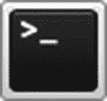
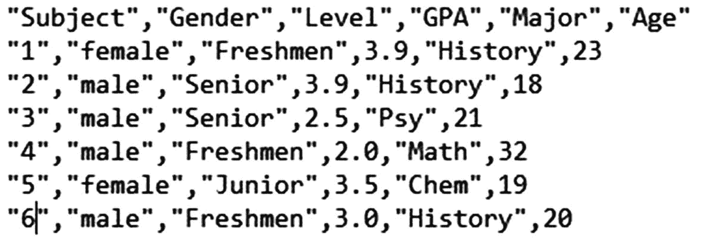
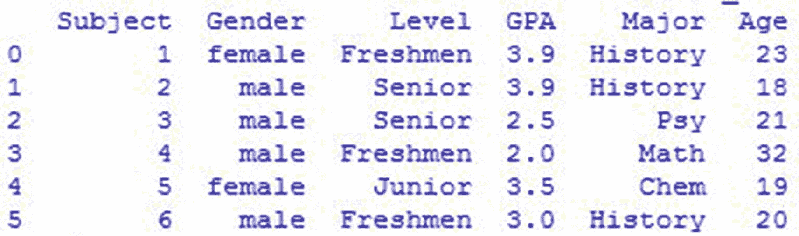
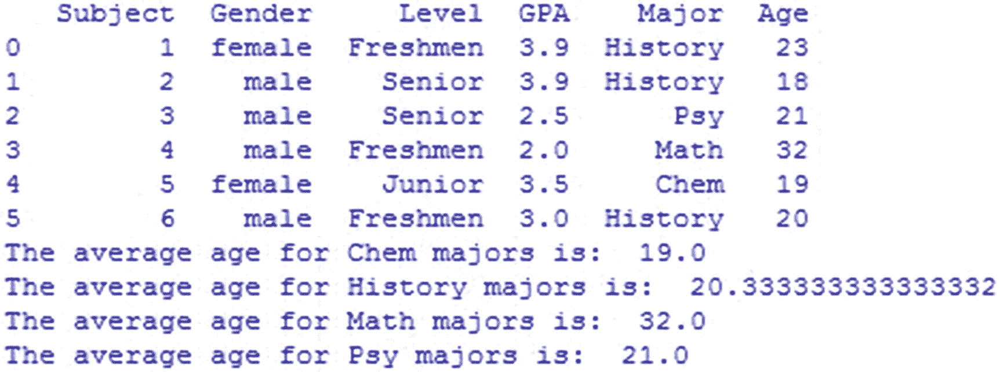

# 三、函数

任何编程语言的核心都是函数的概念，但我们往往认为它们是理所当然的。当然，有一个显而易见的事实，函数允许将代码封装到单独的单元中，这些单元可以重用，而不是到处复制。但是 Python 超越了某些语言所允许的概念，函数是成熟的对象，可以在数据结构中传递，包装在其他函数中，或者完全被新的实现所取代。

事实上，Python 为函数提供了足够的灵活性，实际上有几种不同类型的函数，反映了各种形式的声明和目的。理解每一种类型的函数将有助于您在使用自己的代码时决定哪种函数适合您遇到的每种情况。本章依次解释了它们，以及各种各样的特性，您可以利用这些特性来扩展您创建的每个函数的值，而不管它是什么类型。

从本质上讲，所有的函数都是平等的，不管它们属于以下哪一部分。内置的`function`类型构成了它们的基础，包含了 Python 理解如何使用它们所需的所有属性:


```py
>>> def example():
...     pass
...
>>> type(example)
<type 'function'>
>>> example
<function example at 0x...>

```

当然，仍然有许多不同类型的函数和许多不同的声明它们的方法。首先，让我们检查一下函数最普遍的一个方面。

## 争论

大多数函数都需要一些参数来做一些有用的事情。通常，这意味着在函数(声明的)签名中按顺序定义它们，然后在以后调用该函数时按相同的顺序提供它们。Python 支持这种模型，但也支持传递关键字参数，甚至是在调用函数之前不知道的参数。

Python 的关键字参数的一个最常见的优点是，可以以不同于函数中定义的顺序传递参数。您甚至可以完全跳过参数，只要它们定义了默认值。这种灵活性有助于鼓励使用支持大量带有默认值的参数的函数。

### 显性比隐性好

Python 的关键字参数鼓励显式的一种方式是，如果参数是通过关键字传递的，则只允许参数乱序传递。如果没有关键字，Python 需要使用实参的位置来知道函数运行时要绑定哪个参数名。因为关键字和位置一样显式，所以可以取消排序要求，而不会引入歧义。

事实上，在处理参数时，关键字甚至比位置更明确，因为函数调用记录了每个参数的用途。否则，您必须查找函数定义才能理解它的参数。有些参数在上下文中可能是可以理解的，但大多数可选参数看起来并不明显，所以用关键字传递它们有助于提高代码的可读性。

### 规划灵活性

规划参数名称、顺序和默认值对于那些不是由编写它们的人调用的函数来说尤其重要，比如那些分布式应用中的函数。如果您不知道最终将使用您的代码的用户的确切需求，最好将您可能有的任何假设转移到以后可以被覆盖的参数中。

举一个极其简单的例子，考虑一个向字符串追加前缀的函数:


```py
def add_prefix(my_string):
    """Adds a 'pro_' prefix before the new string is returned."""
    return 'pro_' + my_string
final_string=input('Enter a string so we can put pro_ in front of it!:  ')
print(add_prefix(final_string))

```

这里的`'pro_'`前缀对于应用来说可能是有意义的，但是当其他东西想要使用它时会发生什么呢？现在，前缀被硬编码到函数体中，所以没有其他选择。将这一假设转移到参数中有助于以后定制函数:


```py
def add_prefix(my_string, prefix="pro_"):
    """Adds a 'pro_' prefix before the string provided, a default value."""
    return prefix + my_string
final_string=input("Enter a string so we can put pro_ in front of it!:  ")
print(add_prefix(final_string))

```

没有`prefix`参数的函数调用不需要改变，所以现有代码工作得很好。本章后面关于预加载参数的部分展示了前缀是如何被改变的，并且仍然被不知道它的代码使用。

当然，这个例子太简单了，不能提供太多的实际价值，但是本书其余部分中举例说明的函数将利用大量可选参数，显示它们在每种情况下的价值。

### 可变位置参数

大多数函数被设计为处理一组特定的参数，但是有些函数可以处理任意数量的参数，依次处理每个参数。这些可以作为元组、列表或其他可迭代对象传递到单个参数中。

以一个典型的购物车为例。向购物车添加商品可以一次添加一个，也可以分批添加。使用一个类的定义，里面有一个函数，下面是如何使用一个标准参数完成*和*的:


```py
class ShoppingCart:
    def add_to_cart(items):
        self.items.extend(items)

```

这当然会成功，但是现在考虑一下这对所有必须调用它的代码意味着什么。常见的情况是只添加一个条目，但是由于该函数总是接受一个列表，所以它最终看起来会像这样:


```py
cart.add_to_cart([item])

```

所以我们基本上是为了支持少数派而破坏多数派的案子。更糟糕的是，如果`add_to_cart()`最初只支持一个项目，后来被修改为支持多个项目，那么这个语法会破坏任何现有的调用，需要您重写它们来避免一个`TypeError`。

理想情况下，该方法应该支持单个参数的标准语法，同时仍然支持多个参数。通过在参数名称前添加一个星号，可以指定将所有剩余的位置参数收集到一个元组中，该元组绑定到以星号为前缀的参数，该参数之前没有赋值。在这种情况下，没有其他参数，因此可变位置参数可以构成整个参数列表:


```py
    def add_to_cart(*items):
        self.items.extend(items)

```

现在，可以用任意数量的位置参数调用该方法，而不必先将这些参数分组到一个元组或列表中。在函数开始执行之前，额外的参数被自动捆绑在一个元组中。这清理了常见的情况，同时仍然可以根据需要启用更多的参数。以下是如何调用该方法的几个示例:


```py
cart.add_to_cart(item)
cart.add_to_cart(item1, item2)
cart.add_to_cart(item1, item2, item3, item4, item5)

```

还有一种方法可以调用这个函数，它允许调用代码支持任意数量的项，但是它并不特定于设计为接受变量参数的函数。有关所有细节，请参见使用变量参数调用函数一节。

### 可变关键字参数

函数可能需要额外的配置选项，特别是如果将这些选项传递给其他库的话。显而易见的方法是接受一个字典，它可以将配置名称映射到它们的值:


```py
class ShoppingCart:
    def __init__(self, options):
        self.options = options

```

不幸的是，这最终会导致一个类似于我们在上一节中描述的位置参数所遇到的问题。仅覆盖一两个值的简单情况变得相当复杂。根据偏好，函数调用可能有两种方式:


```py
options = {'currency': 'USD'}
cart = ShoppingCart(options)

cart = ShoppingCart({'currency': 'USD'})

```

当然，这种方法比不上上一节的位置参数问题中提供的列表。此外，像前一个问题一样，这可能是有问题的。如果您正在使用的函数先前被设置为接受一些显式关键字参数，那么新的字典参数将破坏兼容性。

相反，Python 提供了传递可变数量的关键字参数的能力，方法是在接受它们的参数名称前添加两个星号。这允许更友好的关键字参数语法，同时还允许完全动态的函数调用。检查以下存根:

```py
    def __init__(self, **options):
        self.options = options

```

现在考虑前面的相同存根函数看起来会是什么样子，假设该函数现在接受任意的关键字参数:

```py
cart = ShoppingCart(currency='USD')

```

### 警告

当使用变量参数时，位置参数和关键字参数之间有一个区别会引起问题。位置参数被分组到一个不可变的元组中，而关键字参数被放入一个可变的字典中。

### 漂亮总比丑陋好

这里的第二个函数调用示例是一个经典的代码示例，许多 Python 程序员通常认为它很难看。大量的标点符号——键和值周围的引号，它们之间的冒号，以及整个内容周围的花括号——在已经必要的括号内，使得它非常混乱，很难一眼处理。

```py
E.g. cart = ShoppingCart({'currency': 'USD'})

```

通过切换到关键字参数，如本节所示，代码的外观与 Python 的核心价值观和哲学相当一致。美本质上可能是主观的，但是某些主观的决定受到绝大多数程序员的称赞。

### 结合不同的论点

可变参数的这些选项与标准选项(如必需参数和可选参数)相结合。为了确保一切都很好，Python 有一些非常具体的规则来定义函数签名中的参数。只有四种类型的参数，这里按照它们在函数中出现的顺序列出:

*   必需的参数

*   可选参数

*   可变数量的位置参数

*   可变关键字参数

将必需的参数放在列表的第一位可以确保位置参数在进入可选参数之前满足必需的参数。可变参数只能选取不适合任何其他东西的值，所以它们自然会在最后被定义。下面是这个存根在典型函数定义中的样子:

```py
def create_element(name, editable=True, *children, **attributes):

```

调用函数时也可以使用这种顺序，但是它有一个缺点。在本例中，您必须提供 editable 的值作为位置参数，才能传入任何子元素。最好能够在名称后面提供它们，避免大部分时间使用可选的可编辑参数。

为了支持这一点，Python 还允许将可变位置参数放在标准参数中。必需参数和可选参数都可以放在变量参数之后，但是现在它们必须通过关键字传递。所有的参数仍然可用，但是不常用的参数在不需要的时候变得更加可选，在有意义的时候变得更加明确。

### 面对模棱两可，拒绝猜测的诱惑

通过在显式参数列表的中间允许位置参数，Python 可能引入了相当大的模糊性。考虑一个定义为将命令传递给任意参数的函数:perform_action(action，*args，log_output=False)。通常，您可以提供足够的位置参数，甚至可以到达可选参数，但是在这种情况下，如果您提供三个或更多的值，会发生什么情况呢？

一种可能的解释是将第一个值赋给第一个参数，将最后一个值赋给最后一个参数，将所有其他值赋给变量参数。这可能行得通，但接下来就要猜测程序员发出调用的意图了。一旦你考虑一个在变量参数后面有更多参数的函数，可能的解释会变得非常多。

相反，Python 严格要求变量参数之后的所有内容只能通过关键字访问。函数中明确定义的位置参数值之外的值会直接进入变量参数，不管提供的是一个还是几十个。实现变得很容易解释，因为只有一种方法可以做到这一点，而且通过强制使用关键字，实现变得更加清晰。

这种行为的另一个特点是，仍然需要将显式参数放在变量位置参数之后。这两种类型的放置之间唯一真正的区别是使用关键字参数的要求；参数是否需要值仍然取决于您是否定义了默认参数:


```py
>>> def join_with_prefix(prefix, *segments, delimiter):
...     return delimiter.join(prefix + segment for segment in segments)
...
>>> join_with_prefix('P', 'ro', 'ython')
Traceback (most recent call last):
  ...
TypeError: join_with_prefix() needs keyword-only argument delimiter
>>> join_with_prefix('P', 'ro', 'ython', ' ')
Traceback (most recent call last):
  ...
TypeError: join_with_prefix() needs keyword-only argument delimiter
>>> join_with_prefix('P', 'ro', 'ython', delimiter=' ')
'Pro Python'

```

### 注意

如果您想接受只包含关键字的参数，但又不擅长使用变量位置参数，只需指定一个不带参数名的星号。这告诉 Python 星号后面的所有内容都是关键字，不接受可能很长的位置参数集。一个警告是，如果您还接受变量关键字参数，您必须提供至少一个显式关键字参数。否则，使用简单的星号符号真的没有意义，Python 会抛出一个`SyntaxError`。

事实上，请记住，必需参数和可选参数的排序要求仅适用于位置参数的情况。有了将参数定义为仅关键字的能力，您现在可以自由地以任何顺序将它们定义为必需的和可选的，而不会受到 Python 的任何抱怨。调用函数时顺序并不重要，因此定义函数时顺序也不重要。考虑重写前面的示例，要求前缀作为关键字参数，同时使分隔符可选:


```py
>>> def join_with_prefix(*segments, delimiter=' ', prefix):
...     return delimiter.join(prefix + segment for segment in segments)

>>> join_with_prefix('ro', 'ython', prefix="P")
'Pro Python'

```

### 警告

利用这种级别的灵活性时要小心，因为与 Python 代码通常的编写方式相比，这不是很简单。这当然是可能的，但是它的运行与大多数 Python 程序员的期望相反，这使得它很难长期维护。

但是，在所有情况下，变量关键字参数必须位于列表的末尾，在所有其他类型的参数之后。

### 使用可变参数调用函数

除了能够定义可以接受任意数量的值的参数之外，相同的语法还可以用于将值传递给函数调用。这样做的最大好处是，它不局限于被定义为本质可变的参数。相反，您可以将变量参数传递给任何函数，不管它是如何定义的。*将 iterable 解包，并将其内容作为单独的参数传递。

相同的星号(*)符号用于指定变量参数，然后将变量参数扩展为函数调用，就好像所有参数都是直接指定的一样。一个星号指定位置参数，而两个星号指定关键字参数。这在将函数调用的返回值直接作为参数传递，而不先将其分配给单个变量时特别有用:


```py
>>> value = 'ro ython'
>>> join_with_prefix(*value.split(' '), prefix="P")

```

这个例子看起来很明显，因为它是一个传递给变量参数的变量参数，但是同样的过程也适用于其他类型的函数。因为参数在传递给函数之前会被扩展，所以它可以用于任何函数，而不管它的参数是如何指定的。它甚至可以与内置函数和用 c 编写的扩展定义的函数一起使用。

### 注意

在函数调用中，只能传入一组可变位置参数和一组可变关键字参数。例如，如果您有两个位置参数列表，您需要自己将它们连接在一起，并将组合后的列表传递给函数，而不是试图分别使用这两个列表。

### 传递参数

当您开始向函数调用添加一些参数(其中许多是可选的)时，知道一些需要传递的参数值就变得很常见了，即使离函数真正被调用还有很长时间。与其在调用时传递所有参数，不如提前应用一些参数，这样以后应用的参数就更少了。

这个概念被官方称为函数的部分应用，但是这个函数还没有被调用，所以它实际上更多的是预先加载一些参数。当稍后调用预加载的函数时，传递的任何参数都会添加到先前提供的参数中。

### Currying 呢？

如果你熟悉其他形式的函数式编程，你可能听说过*curry*，这可能看起来非常类似于预加载参数。一些框架甚至提供了名为`curry()`的函数，可以预加载函数的参数，这导致了更多的混乱。这两者之间的区别是微妙但重要的。

对于一个真正的 curried 函数，你必须根据需要多次调用它来填充所有的参数。如果一个函数接受三个参数，而你只用一个参数调用它，你会得到一个接受两个以上参数的函数。如果您调用这个新函数，它仍然不会执行您的代码，而是会加载下一个参数并返回另一个采用最后一个剩余参数的函数。调用该函数将最终满足所有参数，因此实际的代码将被执行并返回一个有用的值。

部分应用返回一个函数，该函数在稍后被调用时，无论还有多少个参数，都至少会尝试执行代码。如果需要的参数还没有得到值，Python 会抛出一个`TypeError`,就像你在其他时候用缺少的参数调用它一样。因此，尽管这两种技术之间肯定有相似之处，但理解它们的区别还是很重要的。

这个行为是作为内置的`functools`模块的一部分，通过它的`partial() function`来提供的。通过传入一个 callable 和任意数量的位置和关键字参数，它将返回一个新的 callable，稍后可以使用它来应用这些参数:


```py
>>> import os
>>> def load_file(file, base_path='/', mode="rb"):
...     return open(os.path.join(base_path, file), mode)
...
>>> f = load_file('example.txt')
>>> f.mode
'rb'
>>> f.close()

>>> import functools
>>> load_writable = functools.partial(load_file, mode="w")
>>> f = load_writable('example.txt')
>>> f.mode
'w'
>>> f.close()

```

### 注意

预加载参数的技术对于`partial()`函数来说是正确的，但是将一个函数传递给另一个函数以获得新函数的技术通常被称为*装饰器或高阶函数*。正如你将在本章后面看到的，Decorators 在被调用时可以执行任意数量的任务；预加载参数只是一个例子。

这通常用于将一个更灵活的函数定制成更简单的函数，因此它可以被传递给一个不知道如何访问这种灵活性的 API。通过预先加载自定义参数，API 背后的代码可以使用它知道如何使用的参数来调用您的函数，但所有参数仍将发挥作用。

### 警告

当使用`functools.partial()`时，您将无法为那些先前加载的参数提供任何新值。当然，当您试图为单个参数提供多个值时，这是标准行为，但是当您没有在同一个函数调用中提供所有值时，这种情况会更常见。有关解决这个问题的另一种方法，请参阅本章的“装饰者”一节。

### 反省

Python 非常透明，允许代码在运行时检查对象的许多方面。因为函数和其他任何对象一样都是对象，所以您的代码可以从中收集到一些信息，包括指定参数的函数签名。直接获得一个函数的参数需要经历一组相当复杂的属性，这些属性描述了 Python 的字节码结构，但幸运的是 Python 还提供了一些函数来简化这一过程。

Python 的许多自省特性作为标准`inspect`模块的一部分是可用的，其`getfullargspec()`函数用于函数参数。它接受要检查的函数，并返回有关该函数参数的命名信息元组。返回的元组包含参数规范的每个方面的值:

*   `args`:显式参数名称列表

*   `varargs`:变量位置参数的名称

*   `varkw`:变量关键字参数的名称

*   `defaults`:显式参数的一组默认值

*   `kwonlyargs`:仅包含关键字的参数名称列表

*   `kwonlydefaults`:仅关键字参数的缺省值字典

*   参数注释的字典，这将在本章后面解释

为了更好地说明元组的每个部分中存在什么值，下面是它如何映射到一个基本的函数声明:


```py
>>> def example(a=1, b=1, *c, d, e=2, **f) -> str:
...     pass
...
>>> import inspect
>>> inspect.getfullargspec(example)
FullArgSpec(args=['a', 'b'], varargs="c", varkw="f", defaults=(1,), kwonlyargs=[
'd', 'e'], kwonlydefaults={'e': 2}, annotations={'a': <class 'int'>, 'return': <
class 'str'>})

```

### 示例:识别参数值

有时，记录一个函数将接收哪些参数是有用的，不管它是哪个函数，也不管它的参数是什么样子。这种行为经常出现在基于 Python 函数调用之外的东西生成参数列表的系统中。一些例子包括来自模板语言的指令和解析文本输入的正则表达式。

不幸的是，位置参数带来了一点问题，因为它们的值不包括它们将被发送到的参数的名称。默认值也是一个问题，因为函数调用根本不需要包含任何值。因为日志应该包括将提供给函数的所有值，所以这两个问题都需要解决。

首先，简单的部分。由关键字传递的任何参数值都不需要手动匹配，因为参数名称是与值一起提供的。与其一开始就考虑日志记录，不如让我们从一个函数开始，获取字典中可以记录的所有参数。该函数接受一个函数、一组位置参数和一个关键字参数字典:


```py
def example(a=1, b=1, *c, d, e=2, **f) -> str:
      pass

def get_arguments(func, args, kwargs):
    """
    Given a function and a set of arguments, return a dictionary
    of argument values that will be sent to the function.
    We are modifying get_arguments by adding new parts to it.
    """

    arguments = kwargs.copy()
    return arguments

print(get_arguments(example, (1,), {'f': 4}))  #will yield a result of:  {'f': 4}

```

这真的很简单。该函数会复制关键字参数，而不是直接返回，因为我们很快就会向字典中添加条目。接下来，我们要处理位置论点。诀窍是识别哪些参数名称映射到位置参数值，以便可以用适当的名称将这些值添加到字典中。这就是`inspect.getfullargspec()`发挥作用的地方，使用`zip()`来完成繁重的工作:


```py
def example(a=1, b=1, *c, d, e=2, **f) -> str:
      pass

import inspect

def get_arguments(func, args, kwargs):
    """
    Given a function and a set of arguments, return a dictionary
    of argument values that will be sent to the function.
    """

    arguments = kwargs.copy()
    spec = inspect.getfullargspec(func)
    arguments.update(zip(spec.args, args))

    return arguments

print(get_arguments(example, (1,), {'f': 4}))  # will output {'a': 1, 'f': 4}

```

既然已经处理了位置参数，让我们继续计算缺省值。如果有任何默认值没有被所提供的参数覆盖，这些默认值应该被添加到参数字典中，因为它们将被发送到函数:


```py
import inspect
def example(a=1, b=1, *c, d, e=2, **f) -> str:
      pass
def get_arguments(func, args, kwargs):
    """
    Given a function and a set of arguments, return a dictionary
    of argument values that will be sent to the function.
    """

    arguments = kwargs.copy()
    spec = inspect.getfullargspec(func)
    arguments.update(zip(spec.args, args))

    if spec.defaults:
        for i, name in enumerate(spec.args[-len(spec.defaults):]):
            if name not in arguments:
                arguments[name] = spec.defaults[i]

    return arguments

print(get_arguments(example, (1,), {'f': 4})) # will output  {'a': 1, 'b': 1, 'f': 4}

```

因为可选参数必须跟在必需参数之后，所以这个加法使用`defaults`元组的大小来确定可选参数的名称。循环遍历它们，然后只分配那些还没有提供的值。不幸的是，这只是缺省值情况的一半。因为只有关键字的参数也可以接受默认值，`getfullargspec()`为这些值返回一个单独的字典:


```py
import inspect
def example(a=1, b=1, *c, d, e=2, **f) -> str:
      pass
def get_arguments(func, args, kwargs):
    """
    Given a function and a set of arguments, return a dictionary
    of argument values that will be sent to the function.
    """
    arguments = kwargs.copy()
    spec = inspect.getfullargspec(func)
    arguments.update(zip(spec.args, args))

    for i, name in enumerate(spec.args[-len(spec.defaults)]):
        if name not in arguments:
            arguments[name] = spec.defaults[i]

    if spec.kwonlydefaults:
        for name, value in spec.kwonlydefaults.items():
            if name not in arguments:
                arguments[name] = value

    return arguments

print(get_arguments(example, (1,), {'f': 4})) # will yield {'a': 1, 'b': 1, 'e': 2, 'f': 4}

```

因为只有关键字的参数的默认值也是以字典形式出现的，所以应用这些值要容易得多，因为参数名是预先知道的。有了这些内容，`get_arguments()`可以生成一个更完整的参数字典，并将它传递给函数。不幸的是，因为这返回了一个字典，而变量位置参数没有名字，所以没有办法将它们添加到字典中。这限制了它的有用性，但它对许多函数定义仍然有效。

### 示例:更简洁的版本

前面的例子当然是函数性的，但是它比实际需要的代码要多一点。特别是，当没有提供显式值时，提供默认值需要相当多的工作。然而，这不是很直观，因为我们通常反过来考虑默认值:它们首先被提供，然后被显式参数覆盖。

考虑到这一点，可以重写`get_arguments()`函数，首先从函数声明中取出默认值，然后用作为实际参数传入的任何值替换它们。这避免了许多必须进行的检查，以确保不会被意外覆盖。

第一步是获取默认值。因为如果没有指定默认值，参数规范的`defaults`和`kwonlydefaults`属性将被设置为`None`，所以我们实际上必须从设置一个空字典来更新开始。然后可以添加位置参数的默认值。

因为这一次只需要更新一个字典，而不考虑字典中可能已经有什么，所以使用不同的技术来获得位置默认值会更容易一些。我们可以使用一个类似的`zip()`来获得显式参数值，而不是使用一个很难阅读的复杂切片。通过首先颠倒参数列表和默认值，它们仍然从末尾开始匹配:


```py
def example(a=1, b=1, *c, d, e=2, **f) -> str:
      pass
def get_arguments(func, args, kwargs):
    """
    Given a function and a set of arguments, return a dictionary
    of argument values that will be sent to the function.
    """

    arguments = {}
    spec = inspect.getfullargspec(func)

    if spec.defaults:
        arguments.update(zip(reversed(spec.args), reversed(spec.defaults)))

    return arguments

print(get_arguments(example, (1,), {'f': 4}))  # will output  {'b': 1}

```

为关键字参数添加默认值要容易得多，因为参数规范已经将它们作为字典提供了。我们可以直接把它传递给论点字典的一个`update()`,然后继续:


```py
def example(a=1, b=1, *c, d, e=2, **f) -> str:
      pass
def get_arguments(func, args, kwargs):
    """
    Given a function and a set of arguments, return a dictionary
    of argument values that will be sent to the function.
    """

    arguments = {}
    spec = inspect.getfullargspec(func)

    if spec.defaults:
        arguments.update(zip(reversed(spec.args), reversed(spec.defaults)))
    if spec.kwonlydefaults:
        arguments.update(spec.kwonlydefaults)

    return arguments

print(get_arguments(example, (1,), {'f': 4})) # will output {'b': 1, 'e': 2}

```

现在剩下的就是添加传入的显式参数值。在这个函数的早期版本中使用的相同技术在这里也可以工作，唯一的例外是关键字参数是在一个`update()`函数中传递的，而不是首先被复制来形成参数字典:


```py
def example(a=1, b=1, *c, d, e=2, **f) -> str:
      pass
def get_arguments(func, args, kwargs):
    """
    Given a function and a set of arguments, return a dictionary
    of argument values that will be sent to the function.
    """

    arguments = {}
    spec = inspect.getfullargspec(func)

    if spec.defaults:
        arguments.update(zip(reversed(spec.args), reversed(spec.defaults)))
    if spec.kwonlydefaults:
        arguments.update(spec.kwonlydefaults)
    arguments.update(zip(spec.args, args))
    arguments.update(kwargs)

    return arguments

print(get_arguments(example, (1,), {'f': 4}))  # will output {'a': 1, 'b': 1, 'e': 2, 'f': 4}

```

这样，我们就有了一个更简洁的函数，它以我们通常认为的默认参数值的方式工作。在您更加熟悉可用的高级技术之后，这种类型的重构相当常见。查看旧代码，看看是否有更简单、更直接的方法来完成手头的任务，这总是有用的。这通常会使你的代码更快，更易读，更易维护。现在我们将扩展我们的解决方案来验证参数。

### 示例:验证参数

不幸的是，这并不意味着由`get_arguments()`返回的参数能够无误地传递给函数。目前，`get_arguments()`假设提供的任何关键字参数实际上都是函数的有效参数，但情况并非总是如此。此外，任何未获得值的必需参数都会在调用函数时导致错误。理想情况下，我们也应该能够验证这些论点。

我们可以从`get_arguments()`开始，这样我们就有了一个将传递给函数的所有值的字典，然后我们有两个验证任务:确保所有参数都有值，并确保没有提供函数不知道的参数。函数本身可能会对参数值提出额外的要求，但是作为一个通用的工具，我们不能对所提供的任何值的内容做任何假设。

让我们首先确保提供了所有必需的值。这一次我们不必太担心必需或可选参数，因为`get_arguments()`已经确保可选参数有它们的默认值。因此，任何没有值的参数都是必需的:


```py
import itertools

def validate_arguments(func, args, kwargs):
    """
    Given a function and its arguments, return a dictionary
    with any errors that are posed by the given arguments.
    """

    arguments = get_arguments(func, args, kwargs)
    spec = inspect.getfullargspec(func)
    declared_args = spec.args[:]
    declared_args.extend(spec.kwonlyargs)
    errors = {}

    for name in declared_args:
        if name not in arguments:
            errors[name] = "Required argument not provided."

    return errors

```

有了验证所有必需参数都有值的基础，下一步是确保函数知道如何处理所有提供的参数。任何没有在函数中定义的参数都应被视为错误:


```py
import itertools

def validate_arguments(func, args, kwargs):
    """
    Given a function and its arguments, return a dictionary
    with any errors that are posed by the given arguments.
    """

    arguments = get_arguments(func, args, kwargs)
    spec = inspect.getfullargspec(func)
    declared_args = spec.args[:]
    declared_args.extend(spec.kwonlyargs)
    errors = {}

    for name in declared_args:
        if name not in arguments:
            errors[name] = "Required argument not provided."

    for name in arguments:
        if name not in declared_args:
            errors[name] = "Unknown argument provided."

    return errors

```

当然，因为这依赖于`get_arguments()`，所以它继承了变量位置参数的相同限制。这意味着`validate_arguments()`有时可能会返回一个不完整的错误字典。可变位置参数带来了这个函数无法解决的额外挑战。在函数注释一节中提供了更全面的解决方案。

## 装饰者

当处理一个大的代码库时，有一组需要由许多不同的函数执行的任务是很常见的，通常是在做一些更具体的函数之前或之后。这些任务的性质和使用它们的项目一样多种多样，但是这里有一些使用装饰器的更常见的例子:

*   访问控制

*   临时对象的清理

*   错误处理

*   贮藏

*   记录

在所有这些情况下，都有一些样板代码需要在函数真正要做的事情之前或之后执行。与其将代码复制到每个函数中，不如编写一次，然后简单地应用到每个需要它的函数中。这就是装修工的用武之地。

从技术上来说，decorators 只是简单的函数，设计的目的只有一个:接受一个函数，返回一个函数。返回的函数可以与传入的函数相同，也可以完全被其他函数替代。应用装饰器最常见的方式是使用专门为此目的设计的特殊语法。下面是如何应用一个装饰器来抑制函数执行过程中的任何错误:


```py
import datetime
from myapp import suppress_errors

@suppress_errors
def log_error(message, log_file='errors.log'):
    """Log an error message to a file."""

    log = open(log_file, 'w')
    log.write('%s\t%s\n' % (datetime.datetime.now(), message))

```

这个语法告诉 Python 将`log_error()`函数作为参数传递给`suppress_errors()`函数，然后返回一个替代函数来使用。在 Python 2.4 中引入`@`语法之前，通过检查旧版本 Python 中使用的过程，更容易理解幕后发生的事情:


```py
 #Python 2.x example
import datetime
from myapp import suppress_errors

def log_error(message, log_file='errors.log'):
    """Log an error message to a file."""

    log = open(log_file, 'w')
    log.write('%s\t%s\n' % (datetime.datetime.now(), message))

log_error = suppress_errors(log_error)

```

### 不要重复/可读性很重要

当使用旧的修饰方法时，注意函数的名字写了三次。这不仅是一些看起来不必要的额外输入；如果你需要改变函数名，事情会变得复杂，而且你添加的装饰器越多，事情只会变得越糟。新的语法可以在不重复函数名的情况下应用 decorator，不管使用多少 decorator。

当然，`@`语法还有一个好处，这对它的引入有很大的帮助:它让 decorators 就在函数的签名附近。这使得一眼就能看出应用了哪些装饰器，从而更直接地传达了函数的总体行为。将它们放在函数的底部需要更多的努力来理解完整的行为，所以通过将 decorators 移到顶部，可读性得到了极大的增强。

旧的选项仍然可用，其行为与`@`语法相同。唯一真正的区别是`@`语法仅在源文件中定义函数时可用。如果你想装饰一个从别处导入的函数，你必须手动将它传递给装饰器，所以记住它的两种工作方式是很重要的:


```py
from myapp import log_error, suppress_errors

log_error = suppress_errors(log_error)

```

为了理解像`log_error()`这样的装饰器内部通常会发生什么，有必要首先研究一下 Python 和许多其他语言中最容易被误解和利用不足的特性之一:闭包。

### 关闭

尽管闭包很有用，但它似乎是一个令人生畏的话题。大多数解释都假设事先知道诸如词法范围、自由变量、上取值和变量范围之类的东西。此外，因为无需学习闭包就可以做很多事情，所以这个主题通常看起来神秘而不可思议，好像它是专家的领域，不适合我们其他人。幸运的是，闭包并不像术语所暗示的那样难以理解。

简而言之，*闭包是一个在另一个函数内部定义的函数，但是它被传递到该函数之外，在那里它可以被其他代码使用*。还有一些其他的细节需要学习，但是在这一点上它仍然是相当抽象的，所以这里有一个闭包的简单例子:


```py
def multiply_by(factor):
    """Return a function that multiplies values by the given factor"""
    def multiply(value):
        """Multiply the given value by the factor already provided"""
        return value * factor
    return multiply
times2=multiply_by(2)
print(times2(2))

```

正如您所看到的，当您用一个值作为乘法因子调用`multiply_by()`时，内部的`multiply()`将被返回以供以后使用。下面是它的实际使用方法，这可能有助于解释它为什么有用。如果您在 Python 提示符下一行一行地输入前面的代码，下面的代码会让您知道这是如何工作的:


```py
>>> times2 = multiply_by(2)
>>> times2(5)
10
>>> times2(10)
20
>>> times3 = multiply_by(3)
>>> times3(5)
15
>>> times2(times3(5))
30

```

这种行为看起来有点像`functools.partial()`的参数预加载特性，但是你不需要一个函数同时接受两个参数。然而，关于这是如何工作的有趣部分是，内部函数不需要接受自己的`factor`参数；它本质上继承了外部函数的参数。

当查看代码时，内部函数可以引用外部函数的值这一事实通常看起来非常正常，但是有一些关于它如何工作的规则可能不太明显。首先，内部函数必须定义在外部函数中；简单地将函数作为参数传入是行不通的:


```py
def multiply(value):
    return value * factor

def custom_operator(func, factor):
    return func

multiply_by = functools.partial(custom_operator, multiply)

```

从表面上看，这几乎等同于前面展示的工作示例，但是增加了能够在运行时提供可调用的好处。毕竟，内部函数被放在外部函数中，并被返回供其他代码使用。问题是闭包只在内部函数实际定义在外部函数内部时才起作用，而不仅仅是传入的任何东西:


```py
>>> times2 = multiply_by(2)
>>> times2(5)
Traceback (most recent call last):
  ...
NameError: global name 'factor' is not defined

```

这几乎与`functools.partial()`的函数相矛盾，它的工作方式很像这里描述的`custom_operator()`函数，但是请记住，`partial()`在接受所有参数的同时，也接受将它们绑定在一起的可调用函数。它不会试图从任何地方引入任何论点。

### 封装器

闭包在包装器的构造中发挥了重要作用，包装器是装饰器最常见的用途。包装器是设计用来包含另一个函数的函数，在被包装的函数执行之前或之后添加一些额外的行为。在闭包讨论的上下文中，包装器是内部函数，而被包装的函数作为参数传递给外部函数。以下是上一节中显示的`suppress_errors()`装饰器背后的代码:


```py
def suppress_errors(func):
    """Automatically silence any errors that occur within a function"""

    def wrapper(*args, **kwargs):
        try:
            return func(*args, **kwargs)
        except Exception:
            pass

    return wrapper

```

这里有几件事情正在进行，但是大部分已经讨论过了。装饰器将一个函数作为其唯一的参数，直到内部包装函数执行时才执行。通过返回包装器而不是原始函数，我们形成了一个闭包，即使在完成了`suppress_errors()`之后，也允许使用相同的函数名。

因为包装器必须像原始函数一样被调用，不管该函数是如何定义的，它必须接受所有可能的参数组合。这是通过一起使用变量位置和关键字参数，并在内部将它们直接传递给原始函数来实现的。对于包装器来说，这是一种非常常见的做法，因为它允许最大的灵活性，而不关心它应用于什么类型的函数。

包装器中的实际工作非常简单:只需执行一个`try` / `except`块中的原始函数来捕捉任何引发的异常。如果出现任何错误，它只是愉快地继续，隐式返回`None`，而不是做任何有趣的事情。它还确保返回由原始函数返回的任何值，以便保留包装函数的所有有意义的内容。

在这种情况下，包装函数相当简单，但基本思想也适用于许多更复杂的情况。在调用原始函数之前和之后，可能都有几行代码，也许是关于是否调用它的一些决定。例如，如果授权由于任何原因失败，授权包装器通常会返回或引发异常，而不会调用包装的函数。

不幸的是，包装函数意味着一些潜在有用的信息会丢失。第 5 章[展示了 Python 如何访问一个函数的某些属性，比如它的名字、文档字符串和参数列表。通过用包装器替换原始函数，我们实际上也替换了所有其他信息。为了找回一些，我们求助于名为`wraps`的`functools`模块中的装饰器。](05.html)

在装饰器中使用装饰器可能看起来很奇怪，但它确实解决了和其他任何事情一样的问题:有一个共同的需求，不应该在它出现的任何地方都需要重复的代码。`functools.wraps()` decorator 将名称、docstring 和其他一些信息复制到包装的函数中，因此至少有一部分得到保留。它不会复制参数列表，但总比什么都没有好:


```py
import functools

def suppress_errors(func):
    """Automatically silence any errors that occur within a function"""

    @functools.wraps(func)
    def wrapper(*args, **kwargs):
        try:
            return func(*args, **kwargs)
        except Exception:
            pass

    return wrapper

```

这个结构最奇怪的地方在于`functools.wraps()`除了它所应用的函数之外还接受一个参数。在这种情况下，该参数是要从中复制属性的函数，它是在装饰器本身所在的行中指定的。这对于为特定任务定制装饰器非常有用，所以接下来我们将研究如何在您自己的装饰器中利用定制参数。

### 有争论的装饰者

通常装饰者只接受一个参数，即要装饰的函数。然而在幕后，Python 在将`@`行作为装饰器应用之前，先将其作为表达式进行评估。表达式的结果就是实际用作装饰器的内容。在简单的情况下，装饰表达式只是一个函数，所以很容易计算。在`functools.wraps()`使用的形式中添加参数使得整个语句的计算如下:

```py
wrapper = functools.wraps(func)(wrapper)

```

这样看，解决方案就变得清晰了:一个函数返回另一个函数。第一个函数接受额外的参数并返回另一个函数，该函数用作装饰器。这使得在装饰器上实现参数变得更加复杂，因为它给整个过程增加了另一层，但是一旦在上下文中看到它，就很容易处理了。下面是你可能会看到的最长链条中所有东西是如何协同工作的:

*   接受和验证参数的函数，同时返回修饰原始参数的函数

*   接受用户定义函数的装饰器

*   添加额外行为的包装器

*   被修饰的原始函数

不是所有的事情都会发生在每个装饰者身上，但是这是最复杂场景的一般方法。任何更复杂的事情都只是这四个步骤之一的扩展。正如您所注意到的，四个中的三个已经被讨论过了，所以修饰参数所强加的额外的层实际上是剩下来唯一要讨论的。

这个新的最外层函数接受装饰器的所有参数，可选地验证它们，并返回一个新函数作为参数变量的闭包。这个新函数必须有一个参数，作为修饰函数。下面是`suppress_errors()` decorator 如果接受一个 logger 函数来报告错误，而不是完全消除错误时的样子:


```py
import functools

def suppress_errors(log_func=None):

    """Automatically silence any errors that occur within a function"""

    def decorator(func):
        @functools.wraps(func)
        def wrapper(*args, **kwargs):
            try:
                return func(*args, **kwargs)
            except Exception as e:
                if log_func is not None:
                    log_func(str(e))

        return wrapper

    return decorator

```

这种分层允许`suppress_errors()`在被用作装饰器之前接受参数，但是它不能在没有任何参数的情况下调用它。因为这是以前的行为，我们现在引入了向后不兼容。我们能得到的最接近原始语法的方法是首先实际调用`suppress_errors()`，但是不带任何参数。

下面是一个示例函数，它处理给定目录中的更新文件。这是一项经常自动执行的任务，因此如果出现问题，它可以停止运行，并在下一个指定的时间再次尝试:


```py
import datetime
import os
import time
from myapp import suppress_errors

@suppress_errors()

def process_updated_files(directory, process, since=None):
    """
    Processes any new files in a `directory` using the `process` function.
    If provided, `since` is a date after which files are considered updated.

    The process function passed in must accept a single argument: the absolute
    path to the file that needs to be processed.
    """

    if since is not None:
        # Get a threshold that we can compare to the modification time later
        threshold = time.mktime(since.timetuple()) + since.microsecond / 1000000
    else:
        threshold = 0

    for filename in os.listdir(directory):
        path = os.path.abspath(os.path.join(directory, filename))
        if os.stat(path).st_mtime > threshold:
            process(path)

```

不幸的是，这仍然是一个奇怪的情况，它看起来真的不像 Python 程序员习惯的任何事情。显然，我们需要一个更好的解决方案。

### 有或没有参数的装饰者

理想情况下，如果没有提供参数，带有可选参数的装饰器将能够在没有括号的情况下被调用，同时仍然能够在必要时提供参数。这意味着在一个装饰器中支持两个不同的流，如果不小心的话，这可能会变得很棘手。主要问题是，最外层的函数必须能够接受任意参数*或*单个函数，并且它必须能够辨别这两者之间的差异并相应地进行操作。

这将我们带到第一个任务:确定调用外部函数时使用哪个流。一种选择是检查第一个位置参数，看它是否是一个函数，因为 decorators 总是将函数作为位置参数接收。

有趣的是，根据上一段简单提到的东西，可以做出一个很好的区分。装饰者总是接收被装饰的函数作为位置参数，所以我们可以用它作为区别因素。对于所有其他的参数，我们可以依赖于关键字参数，它们通常更明确，因此也更具可读性。

我们可以通过使用`*args`和`**kwargs`来做到这一点，但是因为我们知道位置参数列表只是一个固定的单个参数，所以将它作为第一个参数并使其可选更容易。然后，任何附加的关键字参数都可以放在它的后面。当然，它们都需要默认值，但是这里的要点是所有的参数都是可选的，所以这不是问题。

参数的区别已经消除，剩下的就是如果提供了参数，就分支到不同的代码块，而不是要修饰的函数。通过使用可选的第一个位置参数，我们可以简单地测试它的存在，以确定通过哪个分支:


```py
import functools

def suppress_errors(func=None, log_func=None):
    """Automatically silence any errors that occur within a function"""

    def decorator(func):
        @functools.wraps(func)
        def wrapper(*args, **kwargs):
            try:
                return func(*args, **kwargs)
            except Exception as e:
                if log_func is not None:
                    log_func(str(e))

        return wrapper

    if func is None:
        return decorator
    else:
        return decorator(func)

```

这现在允许带或不带参数调用`suppress_errors()`，但是记住参数*必须带关键字传递*仍然很重要。这是一个参数看起来与被修饰的函数相同的例子。即使我们尝试了，也没有办法通过检查来区分它们。

如果 logger 函数是作为位置参数提供的，那么 decorator 会假设它是要被修饰的函数，所以它会立即执行 logger，把要被修饰的函数作为它的参数。本质上，您将最终记录您想要修饰的函数。更糟糕的是，在修饰函数之后，剩下的值实际上是来自记录器的返回值，而不是修饰器的。因为大多数记录器不返回任何东西，所以很可能是`None`——没错，你的函数已经消失了。假设您键入了上述函数，您可以在提示符下尝试以下操作:


```py
>>> def print_logger(message):
...     print(message)
...
>>> @suppress_errors(print_logger)
... def example():
...     return variable_which_does_not_exist
...
<function example at 0x...>
>>> example
>>>

```

这是装饰器工作方式的一个副作用，除了记录它并确保在应用参数时总是指定关键字之外，几乎没什么可做的。

### 示例:记忆化

为了演示 decorators 如何将公共行为复制到您喜欢的任何函数中，请考虑如何提高确定性函数的效率。给定相同的参数集，确定性函数总是返回相同的结果，不管它们被调用多少次。给定这样一个函数，应该可以缓存给定函数调用的结果，这样，如果用相同的参数再次调用它，就可以查找结果，而不必再次调用该函数。

使用缓存，装饰器可以使用参数列表作为键来存储函数的结果。字典不能用作字典中的键，因此在填充缓存时只能考虑位置参数。幸运的是，大多数利用记忆化的函数都是简单的数学运算，无论如何通常都是用位置参数调用的:


```py
def memoize(func):
    """
    Cache the results of the function so it doesn't need to be called
    again, if the same arguments are provided a second time.
    """
    cache = {}

    @functools.wraps(func)
    def wrapper(*args):
        if args in cache:
            return cache[args]

        # This line is for demonstration only.
        # Remove it before using it for real.
        print('Calling %s()' % func.__name__)

        result = func(*args)
        cache[args] = result
        return result

    return wrapper

```

现在，无论何时定义一个确定性函数，都可以使用`memoize()`装饰器自动缓存其结果以备将来使用。下面是一些简单数学运算的工作原理。同样，假设您键入了上述存根，请尝试以下操作:


```py
>>> @memoize
... def multiply(x, y):
...     return x * y
...
>>> multiply(6, 7)
Calling multiply()
42
>>> multiply(6, 7)
42
>>> multiply(4, 3)
Calling multiply()
12
>>> @memoize
... def factorial(x):
...    result = 1
...    for i in range(x):
...        result *= i + 1
...    return result
...
>>> factorial(5)
Calling factorial()
120
>>> factorial(5)
120
>>> factorial(7)
Calling factorial()
5040

```

### 警告

记忆化最适合于具有几个参数的函数，这些函数调用时参数值的变化相对较小。使用大量参数调用的函数或者使用的参数值多种多样的函数会很快用缓存填满大量内存。这可能会降低整个系统的速度，唯一的好处是在少数情况下可以重用参数。此外，不真正确定的函数实际上会导致问题，因为函数不会每次都被调用。

### 示例:一个装饰者创建装饰者

敏锐的读者会注意到在对更复杂的装饰构造的描述中有一些矛盾。decorator 的目的是避免大量样板代码并简化函数，但是 decorator 本身最终变得相当复杂，仅仅是为了支持可选参数之类的特性。理想情况下，我们也可以将样板文件放入装饰器中，为新的装饰器简化流程。

因为装饰者是 Python 函数，就像他们装饰的那些一样，这是很有可能的。然而，和其他情况一样，有些事情需要考虑。在这种情况下，您定义为装饰器的函数需要区分用于装饰器的参数和用于它所装饰的函数的参数:


```py
def decorator(declared_decorator):
    """Create a decorator out of a function, which will be used as a wrapper."""

    @functools.wraps(declared_decorator)
    def final_decorator(func=None, **kwargs):
        # This will be exposed to the rest
        # of your application as a decorator

        def decorated(func):
            # This will be exposed to the rest
            # of your application as a decorated
            # function, regardless how it was called
            @functools.wraps(func)
            def wrapper(*a, **kw):
                # This is used when actually executing
                # the function that was decorated
                return declared_decorator(func, a, kw, **kwargs)

            return wrapper

        if func is None:
            # The decorator was called with arguments,
            # rather than a function to decorate
            return decorated
        else:
            # The decorator was called without arguments,
            # so the function should be decorated immediately
            return decorated(func)

    return final_decorator

```

有了这个，你就可以直接用包装函数来定义你的装饰器了；然后，只需应用这个装饰器来管理幕后的开销。现在，您声明的函数必须始终接受三个参数，除此之外还可以添加任何其他参数。下面的列表中显示了三个必需的参数:

*   将被修饰的函数，如果合适，应该调用该函数

*   提供给修饰函数的位置参数元组

*   提供给修饰函数的关键字参数的字典

记住这些参数，下面是你如何定义本章前面描述的`suppress_errors()`装饰器:


```py
>>> @decorator
... def suppress_errors(func, args, kwargs, log_func=None):
...     try:
...        return func(*args, **kwargs)
...    except Exception as e:
...        if log_func is not None:
...           log_func(str(e))
...
>>> @suppress_errors
... def example():
...     return variable_which_does_not_exist
...
>>> example() # Doesn't raise any errors
>>> def print_logger(message):
...     print(message)
...
>>> @suppress_errors(log_func=print_logger)
... def example():
...     return variable_which_does_not_exist
...
>>> example()
global name 'variable_which_does_not_exist' is not defined

```

## 函数注释

一个函数通常有三个方面不涉及其中的代码:一个名称、一组参数和一个可选的 docstring。然而，有时这并不足以完全描述该函数是如何工作的或者应该如何使用它。静态类型语言——比如 Java——也包括关于每个参数允许什么类型的值，以及返回值可以是什么类型的详细信息。

Python 对这种需求的回应是函数注释的概念。每个参数以及返回值都可以附加一个表达式，描述一个无法用其他方式表达的细节。这可以是简单的类型，例如`int`或`str`，类似于静态类型语言，如下面的示例存根所示:

```py
def prepend_rows(rows:list, prefix:str) -> list:
    return [prefix + row for row in rows]

```

这个例子和传统静态类型语言的最大区别不是语法问题；在 Python 中，注释可以是任何表达式，而不仅仅是类型或类。你可以用描述性的字符串、计算值，甚至内联函数来注释你的参数——详见本章关于 lambdas 的部分。如果用字符串作为附加文档进行注释，前面的示例可能是这样的:


```py
def prepend_rows(rows:"a list of strings to add to the prefix",
                 prefix:"a string to prepend to each row provided",
                 ) -> "a new list of strings prepended with the prefix":
    return [prefix + row for row in rows]

```

当然，这种灵活性可能会让您怀疑函数注释的预期用途，但是没有，这是故意的。官方说法是，注释背后的意图是鼓励在框架和其他第三方库中进行实验。这里展示的两个例子分别适用于类型检查和文档库。

### 示例:类型安全

为了说明库如何使用批注，请考虑一个类型安全库的基本实现，它可以理解和利用前面描述的函数。它期望参数注释为任何传入的参数指定有效的类型，而返回注释将能够验证函数返回的值。

因为类型安全包括在函数执行前后验证值，所以装饰器是实现的最合适的选择。此外，因为所有的类型提示信息都在函数声明中提供，所以我们不需要担心任何额外的参数，所以一个简单的装饰器就足够了。然而，第一个任务是验证注释本身，因为它们必须是有效的 Python 类型，以便装饰器的其余部分正常工作:


```py
import inspect

def typesafe(func):
    """
    Verify that the function is called with the right argument types and
    that it returns a value of the right type, according to its annotations
    """

    spec = inspect.getfullargspec(func)

    for name, annotation in spec.annotations.items():
        if not isinstance(annotation, type):
            raise TypeError("The annotation for '%s' is not a type." % name)

    return func

```

到目前为止，这并没有对函数做任何事情，但是它确实检查了所提供的每个注释是否是有效的类型，然后可以用它来验证注释所引用的参数的类型。这使用了`isinstance()`，它将一个对象与其预期的类型进行比较。关于`isinstance()`和一般类型和等级的更多信息可以在第 [4](04.html) 章中找到。

现在我们可以确定所有的注释都是有效的，是时候开始验证一些参数了。给定有多少种类型的论点，让我们一次一个。关键字参数是最容易开始的，因为它们已经将它们的名称和值捆绑在一起，所以少了一件需要担心的事情。有了名称，我们就可以获得相关的注释，并根据它来验证值。这也是开始分解一些东西的好时机，因为我们最终将不得不一遍又一遍地使用一些相同的东西。下面是包装器开始时的样子:


```py
import functools

import inspect

def typesafe(func):
    """
    Verify that the function is called with the right argument types and
    that it returns a value of the right type, according to its annotations
    """

    spec = inspect.getfullargspec(func)
    annotations = spec.annotations

    for name, annotation in annotations.items():
        if not isinstance(annotation, type):
            raise TypeError("The annotation for '%s' is not a type." % name)

    error = "Wrong type for %s: expected %s, got %s."

    @functools.wraps(func)
    def wrapper(*args, **kwargs):
        # Deal with keyword arguments
        for name, arg in kwargs.items():
            if name in annotations and not isinstance(arg, annotations[name]):
                raise TypeError(error % (name,
                                         annotations[name].__name__,
                                         type(arg).__name__))

        return func(*args, **kwargs)
    return wrapper

```

到目前为止，这应该是不言自明的。将检查提供的任何关键字参数，看是否有关联的注释。如果有，检查提供的值以确保它是在注释中找到的类型的实例。错误消息被剔除，因为在我们完成之前，它还会被重用几次。

接下来是处理位置参数。同样，我们可以依靠`zip()`将位置参数名称与所提供的值对齐。因为`zip()`的结果与字典的`items()`方法兼容，我们实际上可以使用来自`itertools`模块的`chain()`将它们链接到同一个循环中:


第一部分:在此基础上添加第二部分，以脚本的形式查看它的运行情况:

```py
import functools
import inspect

from itertools import chain

def typesafe(func):
    """
    Verify that the function is called with the right argument types and
    that it returns a value of the right type, according to its annotations
    """
    spec = inspect.getfullargspec(func)
    annotations = spec.annotations

    for name, annotation in annotations.items():
        if not isinstance(annotation, type):
            raise TypeError("The annotation for '%s' is not a type." % name)

    error = "Wrong type for %s: expected %s, got %s."

    @functools.wraps(func)
    def wrapper(*args, **kwargs):
        # Deal with keyword arguments
        for name, arg in chain(zip(spec.args, args), kwargs.items()):
            if name in annotations and not isinstance(arg, annotations[name]):
                raise TypeError(error % (name,
                                         annotations[name].__name__,
                                         type(arg).__name__))

        return func(*args, **kwargs)
    return wrapper

```

尽管这考虑了位置和关键字参数，但并不是全部。因为变量参数也可以接受注释，所以我们必须考虑那些与定义的参数名不匹配的参数值。不幸的是，在我们能够在这方面有所作为之前，还有一些事情必须处理。

如果你真的非常关注，你可能会注意到代码中一个非常微妙的错误。为了使代码更容易理解，并考虑到由关键字传递的任何参数，包装器遍历整个的`kwargs`字典，检查相关的注释。不幸的是，这给我们留下了无意的名称冲突的可能性。

为了说明 bug 是如何触发的，首先考虑在处理变量参数时会出现什么情况。因为我们只能将单个注释应用于变量参数名称本身，所以必须假设该注释应用于该变量参数下的所有参数，无论是按位置传递还是按关键字传递。如果没有对这种行为的明确支持，变量参数应该被忽略，但是下面是代码的实际情况:


第二部分:把这个放在你刚刚输入的脚本的末尾:

```py
@typesafe
def example(*args:int, **kwargs:str):
    pass

print(example(spam='eggs'))  #fine
print(example(kwargs='spam'))  #fine
print(example(args='spam'))  # not fine!
# output will be:
#Traceback (most recent call last):
#TypeError: Wrong type for args: expected int, got str.

```

有趣的是，除非函数调用包含与变量位置参数同名的关键字参数，否则一切正常。尽管乍一看似乎不明显，但问题实际上出在包装器的唯一循环中要迭代的值集合上。它假设所有关键字参数的名称都与注释很好地对齐。

基本上，问题是用于变量参数的关键字参数最终与来自其他参数的注释相匹配。在大多数情况下，这是可以接受的，因为这三种类型的参数中的两种永远不会引起问题。用显式参数名匹配它只是重复 Python 已经做的事情，所以使用关联的注释是没问题的，并且匹配变量关键字参数名最终会使用我们计划使用的同一注释。

因此，只有当关键字参数与变量位置参数名称匹配时，问题才会出现，因为这种关联永远没有意义。有时，如果注释与变量关键字参数的注释相同，问题可能永远不会出现，但不管怎样，问题仍然存在。因为包装函数的代码仍然很少，所以不难看出问题出在哪里。

在主循环中，迭代链的第二部分是`kwargs`字典中的条目列表。这意味着通过关键字传递的所有内容都要对照命名注释进行检查，这显然并不总是我们想要的。相反，我们现在只想遍历显式参数，同时仍然支持位置和关键字。这意味着我们将不得不基于函数定义构建一个新的字典，而不是像我们现在这样走捷径，依赖于`kwargs`。这里的清单中已经删除了外层的`typesafe()`函数，以使代码在打印时更容易理解:


```py
    def wrapper(*args, **kwargs):
        # Populate a dictionary of explicit arguments passed positionally
        explicit_args = dict(zip(spec.args, args))

        # Add all explicit arguments passed by keyword
        for name in chain(spec.args, spec.kwonlyargs):
            if name in kwargs:
                explicit_args[name] = kwargs[name]

        # Deal with explicit arguments
        for name, arg in explicit_args.items():
            if name in annotations and not isinstance(arg, annotations[name]):
                raise TypeError(error % (name,
                                         annotations[name].__name__,
                                         type(arg).__name__))

        return func(*args, **kwargs)

```

有了这个 bug，我们就可以专注于正确地支持变量参数了。因为关键字参数有名字，而位置参数没有，所以我们不能像处理显式参数那样一次处理两种类型。这个过程与显式参数非常相似，但是在每种情况下迭代的值是不同的。然而，最大的区别是注释不是由参数的名称引用的。

为了只遍历真正可变的位置参数，我们可以简单地使用显式参数的数量作为位置参数元组中一个片的开始。如果只提供了显式参数，这将得到在显式参数之后提供的所有位置参数或一个空列表。

对于关键字参数，我们必须更有创造性。因为该函数已经在开头循环了所有显式声明的参数，所以我们可以使用相同的循环从`kwargs`字典的副本中排除任何匹配项。然后，我们可以迭代剩余的内容，以考虑所有的变量关键字参数:


```py
    def wrapper(*args, **kwargs):
        # Populate a dictionary of explicit arguments passed positionally
        explicit_args = dict(zip(spec.args, args))
        keyword_args = kwargs.copy()

        # Add all explicit arguments passed by keyword
        for name in chain(spec.args, spec.kwonlyargs):
            if name in kwargs:
                explicit_args[name] = keyword_args.pop(name)

        # Deal with explicit arguments
        for name, arg in explicit_args.items():
            if name in annotations and not isinstance(arg, annotations[name]):
                raise TypeError(error % (name,
                                         annotations[name].__name__,
                                         type(arg).__name__))

        # Deal with variable positional arguments
        if spec.varargs and spec.varargs in annotations:
            annotation = annotations[spec.varargs]
            for i, arg in enumerate(args[len(spec.args):]):
                if not isinstance(arg, annotation):
                    raise TypeError(error % ('variable argument %s' % (i + 1),
                                             annotation.__name__,
                                             type(arg).__name__))

        # Deal with variable keyword arguments
        if spec.varkw and spec.varkw in annotations:
            annotation = annotations[spec.varkw]
            for name, arg in keyword_args.items():
                if not isinstance(arg, annotation):
                    raise TypeError(error % (name,
                                             annotation.__name__,
                                             type(arg).__name__))

        return func(*args, **kwargs)

```

这包括所有显式参数以及通过位置和关键字传入的变量参数。剩下的唯一事情就是验证目标函数返回的值。到目前为止，包装器只是直接调用原始函数，而不考虑它返回什么，但是到目前为止，应该很容易看出需要做什么:


```py
    def wrapper(*args, **kwargs):
        # Populate a dictionary of explicit arguments passed positionally
        explicit_args = dict(zip(spec.args, args))
        keyword_args = kwargs.copy()

        # Add all explicit arguments passed by keyword
        for name in chain(spec.args, spec.kwonlyargs):
            if name in kwargs:
                explicit_args[name] = keyword_args(name)

        # Deal with explicit arguments
        for name, arg in explicit_args.items():
            if name in annotations and not isinstance(arg, annotations[name]):
                raise TypeError(error % (name,
                                         annotations[name].__name__,
                                         type(arg).__name__))

        # Deal with variable positional arguments
        if spec.varargs and spec.varargs in annotations:
            annotation = annotations[spec.varargs]
            for i, arg in enumerate(args[len(spec.args):]):
                if not isinstance(arg, annotation):
                    raise TypeError(error % ('variable argument %s' % (i + 1),
                                             annotation.__name__,
                                             type(arg).__name__))

        # Deal with variable keyword arguments
        if spec.varkw and spec.varkw in annotations:
            annotation = annotations[spec.varkw]
            for name, arg in keyword_args.items():
                if not isinstance(arg, annotation):
                    raise TypeError(error % (name,
                                             annotation.__name__,
                                             type(arg).__name__))

        r = func(*args, **kwargs)
        if 'return' in annotations and not isinstance(r, annotations['return']):
            raise TypeError(error % ('the return value',
                                     annotations['return'].__name__,
                                     type(r).__name__))
        return r

```

这样，我们就有了一个全函数的类型安全修饰器，它可以验证函数的所有参数及其返回值。然而，我们可以包括一个额外的安全措施来更快地发现错误。与外部的`typesafe()`函数已经验证了注释是类型一样，函数的这一部分也能够验证所有提供的参数的默认值。因为变量参数不能有默认值，这比处理函数调用本身要简单得多:


```py
import functools
import inspect

from itertools import chain

def typesafe(func):
    """
    Verify that the function is called with the right argument types and
    that it returns a value of the right type, according to its annotations
    """
    spec = inspect.getfullargspec(func)
    annotations = spec.annotations

    for name, annotation in annotations.items():
        if not isinstance(annotation, type):
            raise TypeError("The annotation for '%s' is not a type." % name)

    error = "Wrong type for %s: expected %s, got %s."
    defaults = spec.defaults or ()
    defaults_zip = zip(spec.args[-len(defaults):], defaults)
    kwonlydefaults = spec.kwonlydefaults or {}

    for name, value in chain(defaults_zip, kwonlydefaults.items()):
        if name in annotations and not isinstance(value, annotations[name]):
            raise TypeError(error % ('default value of %s' % name,
                                     annotations[name].__name__,
                                     type(value).__name__))

    @functools.wraps(func)
    def wrapper(*args, **kwargs):
        # Populate a dictionary of explicit arguments passed positionally
        explicit_args = dict(zip(spec.args, args))
        keyword_args = kwargs.copy()

        # Add all explicit arguments passed by keyword
        for name in chain(spec.args, spec.kwonlyargs):
            if name in kwargs:
                explicit_args[name] = keyword_args.pop(name)

        # Deal with explicit arguments
        for name, arg in explicit_args.items():
            if name in annotations and not isinstance(arg, annotations[name]):
                raise TypeError(error % (name,
                                         annotations[name].__name__,
                                         type(arg).__name__))

        # Deal with variable positional arguments
        if spec.varargs and spec.varargs in annotations:
            annotation = annotations[spec.varargs]
            for i, arg in enumerate(args[len(spec.args):]):
                if not isinstance(arg, annotation):
                    raise TypeError(error % ('variable argument %s' % (i + 1),
                                             annotation.__name__,
                                             type(arg).__name__))
        # Deal with variable keyword arguments
        if spec.varkw and spec.varkw in annotations:
            annotation = annotations[spec.varkw]
            for name, arg in keyword_args.items():
                if not isinstance(arg, annotation):
                    raise TypeError(error % (name,
                                             annotation.__name__,
                                             type(arg).__name__))

        r = func(*args, **kwargs)
        if 'return' in annotations and not isinstance(r, annotations['return']):
            raise TypeError(error % ('the return value',
                                     annotations['return'].__name__,
                                     type(r).__name__))
        return r
    return wrapper

```

### 剔除样板文件

仔细查看代码，您会发现有很多重复。每种形式的注释都做同样的事情:检查值是否合适，如果不合适就抛出异常。理想情况下，我们可以将它分解到一个单独的函数中，该函数可以专注于实际的验证任务。剩下的代码实际上只是样板文件，管理寻找不同类型注释的细节。

因为公共代码将进入一个新函数，所以将它与代码的其余部分联系起来的显而易见的方法是创建一个新的装饰器。这个新的装饰器将被放在一个函数上，这个函数将处理每个值的注释，所以我们称它为`annotation_processor`。传递到`annotation_processor`中的函数将用于现有代码中的每种注释类型:


```py
import functools
import inspect
from itertools import chain

def annotation_decorator(process):

    """
    Creates a decorator that processes annotations for each argument passed
    into its target function, raising an exception if there's a problem.
    """

    @functools.wraps(process)
    def decorator(func):
        spec = inspect.getfullargspec(func)
        annotations = spec.annotations

        defaults = spec.defaults or ()
        defaults_zip = zip(spec.args[-len(defaults):], defaults)
        kwonlydefaults = spec.kwonlydefaults or {}

        for name, value in chain(defaults_zip, kwonlydefaults.items()):
            if name in annotations:
                process(value, annotations[name])
        @functools.wraps(func)
        def wrapper(*args, **kwargs):
            # Populate a dictionary of explicit arguments passed positionally
            explicit_args = dict(zip(spec.args, args))
            keyword_args = kwargs.copy()

            # Add all explicit arguments passed by keyword
            for name in chain(spec.args, spec.kwonlyargs):
                if name in kwargs:
                    explicit_args[name] = keyword_args.pop(name)

            # Deal with explicit arguments
            for name, arg in explicit_args.items():
                if name in annotations:
                    process(arg, annotations[name])

            # Deal with variable positional arguments
            if spec.varargs and spec.varargs in annotations:
                annotation = annotations[spec.varargs]
                for arg in args[len(spec.args):]:
                    process(arg, annotation)

            # Deal with variable keyword arguments
            if spec.varkw and spec.varkw in annotations:
                annotation = annotations[spec.varkw]
                for name, arg in keyword_args.items():
                    process(arg, annotation)

            r = func(*args, **kwargs)
            if 'return' in annotations:
                process(r, annotations['return'])
            return r

        return wrapper

    return decorator

```

### 注意

因为我们把它变得更加通用，你会注意到装饰器的初始部分不再检查注释是否是有效类型。装饰器本身不再关心您对参数值应用什么逻辑，因为这些都是在被装饰的函数中完成的。

现在我们可以将这个新的装饰器应用到一个更简单的函数中，以提供一个新的`typesafe()`装饰器，它的函数就像上一节中的那个一样:


```py
@annotation_decorator
def typesafe(value, annotation):
    """
    Verify that the function is called with the right argument types and
    that it returns a value of the right type, according to its annotations
    """
    if not isinstance(value, annotation):
        raise TypeError("Expected %s, got %s." % (annotation.__name__,
                                                  type(value).__name__))

```

这样做的好处是，将来修改装饰者的行为要容易得多。此外，您现在可以使用`annotation_processor()`来创建新类型的装饰器，这些装饰器将注释用于不同的目的，比如类型强制。

### 示例:类型强制

另一种方法是将参数强制转换为函数内部所需的类型，而不是严格要求参数都是传递给函数时指定的类型。许多用于验证值的相同类型也可以用于将值直接强制转换为类型本身。此外，如果一个值不能被强制，它被传递到的类型会引发一个异常，通常是一个`TypeError`，就像我们的验证函数一样。

### 鲁棒性原则

这是稳健性原则更明显的应用之一。你的函数需要一个特定类型的参数，但是接受一些变量会更好，因为你知道在你的函数需要处理它们之前，它们可以被转换成正确的类型。同样，强制还有助于确保返回值始终是外部代码知道如何处理的一致类型。

前一节中介绍的装饰器为向新的装饰器添加这种行为提供了一个很好的起点，我们可以使用它来根据随它一起提供的注释修改传入的值。因为我们依靠类型构造函数来进行所有必要的类型检查并适当地引发异常，所以这个新的装饰器可以简单得多。事实上，它可以用一条实际指令来表达:


```py
@annotation_decorator
def coerce_arguments(value, annotation):
    return annotation(value)

```

这非常简单，甚至根本不需要注释是一种类型。任何返回对象的函数或类都可以正常工作，返回值将被传递给由`coerce_arguments()`修饰的函数。还是会？如果您回头看看目前的`annotation_decorator()`函数，会发现有一个小问题，它无法按照新装饰者需要的方式工作。

问题是在调用传入外部装饰器的`process()`函数的行中，返回值被丢弃了。如果您尝试将`coerce_arguments()`与现有的装饰器一起使用，您将得到的只是代码的异常引发方面，而不是值强制方面。所以，为了正常工作，我们需要回过头来给`annotation_processor()`添加这个特性。

然而，总的来说，还有一些事情需要做。因为注释处理器将修改最终发送到修饰函数的参数，所以我们需要为位置参数建立一个新的列表，为关键字参数建立一个新的字典。然后我们必须拆分显式参数处理，这样我们就可以区分位置参数和关键字参数。否则，该函数将无法正确应用可变位置参数:


```py
        def wrapper(*args, **kwargs):
            new_args = []
            new_kwargs = {}
            keyword_args = kwargs.copy()

            # Deal with explicit arguments passed positionally
            for name, arg in zip(spec.args, args):
                if name in annotations:
                    new_args.append(process(arg, annotations[name]))

            # Deal with explicit arguments passed by keyword
            for name in chain(spec.args, spec.kwonlyargs):
                if name in kwargs and name in annotations:
                    new_kwargs[name] = process(keyword_args.pop(name),
                                               annotations[name])

            # Deal with variable positional arguments
            if spec.varargs and spec.varargs in annotations:
                annotation = annotations[spec.varargs]
                for arg in args[len(spec.args):]:
                    new_args.append(process(arg, annotation))

            # Deal with variable keyword arguments
            if spec.varkw and spec.varkw in annotations:
                annotation = annotations[spec.varkw]
                for name, arg in keyword_args.items():
                    new_kwargs[name] = process(arg, annotation)

            r = func(*new_args, **new_kwargs)
            if 'return' in annotations:
                r = process(r, annotations['return'])
            return r

```

有了这些变化，新的`coerce_arguments()`修饰器将能够动态地替换参数，将替换的参数传递给原始函数。不幸的是，如果您仍然使用以前的`typesafe()`，这种新的行为会导致问题，因为`typesafe()`没有返回值。如果类型检查令人满意，修复这个问题很简单，只需返回原始值，保持不变:


```py
@annotation_decorator
def typesafe(value, annotation):
    """
    Verify that the function is called with the right argument types and
    that it returns a value of the right type, according to its annotations
    """
    if not isinstance(value, annotation):
        raise TypeError("Expected %s, got %s." % (annotation.__name__,
                                                  type(value).__name__))
    return value

```

### 用装饰者注释

自然要问的问题是:如果你想一起使用两个库会发生什么？一个人可能希望您提供有效的类型，而另一个人则希望您提供一个用于文档的字符串。它们彼此完全不兼容，这迫使你使用其中一个，而不是两个都用。此外，任何使用字典或其他组合数据类型来合并两者的尝试都必须得到两个库的同意，因为每个库都需要知道如何获得它所关心的信息。

一旦您考虑到有多少其他框架和库可能会利用这些注释，您就会看到官方函数注释崩溃的速度有多快。现在看哪些应用将真正使用它或者它们将如何协同工作还为时过早，但是考虑可以完全绕过这些问题的其他选项肯定是值得的。

因为装饰者可以接受他们自己的参数，所以可以使用它们为他们装饰的函数的参数提供注释。这样，注释与函数本身是分离的，并直接提供给理解它们的代码。因为多个 decorators 可以堆叠在一个函数上，所以它已经有了管理多个框架的内置方式。

### 示例:将类型安全作为装饰器

为了说明基于装饰器的函数注释方法，让我们考虑前面的类型安全例子。它已经依赖于一个装饰器，所以我们可以扩展它来接受参数，使用之前注释提供的相同类型。本质上，它看起来像这样:


```py
>>> @typesafe(str, str)
... def combine(a, b):
...     return a + b
...
>>> combine('spam', 'alot')
'spamalot'
>>> combine('fail', 1)
Traceback (most recent call last):
  ...
TypeError: Wrong type for b: expected str, got int.

```

它的工作方式几乎与真正的带注释版本完全一样，只是注释是直接提供给装饰者的。为了接受参数，我们将稍微修改一下代码的第一部分，这样我们就可以从参数中获取注释，而不是检查函数本身。

因为注释是通过修饰器的参数传入的，所以我们有一个新的外部包装器来接收它们。当下一层接收到要修饰的函数时，它可以将注释与函数的签名进行匹配，为任何按位置传递的注释提供名称。一旦所有可用的注释都被赋予了正确的名称，它们就可以被内部装饰器的其余部分使用，而无需任何进一步的修改:


```py
import functools
import inspect
from itertools import chain
def annotation_decorator(process):
    """
    Creates a decorator that processes annotations for each argument passed
    into its target function, raising an exception if there's a problem.
    """

    def annotator(*args, **kwargs):
        annotations = kwargs.copy()

        @functools.wraps(process)
        def decorator(func):
            spec = inspect.getfullargspec(func)
            annotations.update(zip(spec.args, args))

            defaults = spec.defaults or ()
            defaults_zip = zip(spec.args[-len(defaults):], defaults)
            kwonlydefaults = spec.kwonlydefaults or {}

            for name, value in chain(defaults_zip, kwonlydefaults.items()):
                if name in annotations:
                    process(value, annotations[name])

            @functools.wraps(func)
            def wrapper(*args, **kwargs):

                new_args = []
                new_kwargs = {}
                keyword_args = kwargs.copy()

                # Deal with explicit arguments passed positionally
                for name, arg in zip(spec.args, args):
                    if name in annotations:
                        new_args.append(process(arg, annotations[name]))

                # Deal with explicit arguments passed by keyword
                for name in chain(spec.args, spec.kwonlyargs):
                    if name in kwargs and name in annotations:
                        new_kwargs[name] = process(keyword_args.pop(name),
                                                   annotations[name])

                # Deal with variable positional arguments
                if spec.varargs and spec.varargs in annotations:
                    annotation = annotations[spec.varargs]
                    for arg in args[len(spec.args):]:
                        new_args.append(process(arg, annotation))

                # Deal with variable keyword arguments
                if spec.varkw and spec.varkw in annotations:
                    annotation = annotations[spec.varkw]
                    for name, arg in keyword_args.items():
                        new_kwargs[name] = process(arg, annotation)

                r = func(*new_args, **new_kwargs)
                if 'return' in annotations:
                    r = process(r, annotations['return'])
                return r

            return wrapper

        return decorator

    return annotator

```

这处理了大部分情况，但是还不能处理返回值。如果您试图使用正确的名称`return`提供返回值，您将会得到一个语法错误，因为它是一个保留的 Python 关键字。试图将它与其他注释一起提供将需要每个调用使用一个实际的字典来传递注释，在这里您可以提供返回注释而不会扰乱 Python 的语法。

相反，您需要在一个单独的函数调用中提供返回值注释，它可以是唯一的参数，没有任何保留名称问题。当使用大多数类型的 decorator 时，这很容易做到:只需创建一个新的 decorator 来检查返回值并完成它。不幸的是，由于您正在使用的最终装饰器是在我们代码的控制之外创建的，所以这并不容易。

如果将返回值处理与参数处理完全分离，实际编写类似于`typesafe()` decorator 的东西的程序员将不得不编写两次；一次创建参数处理装饰器，另一次创建返回值处理装饰器。因为这明显违反了 DRY，所以让我们尽可能多地重用他们的工作。

这就是一些设计发挥作用的地方。我们正在考虑超越一个简单的装饰，所以让我们弄清楚如何最好地接近它，以便它对那些必须使用它的人有意义。思考可用的选项，一个解决方案很快跃入脑海。如果我们可以添加额外的注释函数作为最终装饰器的一个属性，那么您就能够在与另一个装饰器相同的行上编写返回值注释器，但是就在后面，在它自己的函数调用中。如果你走这条路，它看起来可能是这样的:

```py
@typesafe(int, int).returns(int)
def add(a, b):
    return a + b

```

不幸的是，这不是一个选项，原因是甚至不需要添加必要的代码来支持它就可以演示。问题是，这种格式不允许作为 Python 语法。如果没有任何参数，它会工作，但是不支持在一个装饰器中调用两个独立的函数。不要在装饰器本身中提供返回值注释，让我们看看别的地方。

另一种选择是使用生成的`typesafe()`装饰器将一个函数作为属性添加到`add()`函数周围的包装器中。这将返回值注释放在函数定义的末尾，更靠近指定返回值的位置。此外，它有助于澄清这样一个事实，即如果您愿意，您可以使用`typesafe()`来提供参数装饰器，而不必费心检查返回值。下面是它的样子:


```py
@typesafe(int, int)
def add(a, b):
    return a + b
add.returns(int)

```

它仍然非常清晰，甚至可能比不管怎样都不起作用的语法更加明确。额外的好处是，支持它的代码非常简单，只需要在内部`decorator()`函数的末尾添加几行代码:


```py
        def decorator(func):
            from itertools import chain

            spec = inspect.getfullargspec(func)
            annotations.update(zip(spec.args, args))

            defaults = spec.defaults or ()
            defaults_zip = zip(spec.args[-len(defaults):], defaults)
            kwonlydefaults = spec.kwonlydefaults or {}

            for name, value in chain(defaults_zip, kwonlydefaults.items()):
                if name in annotations:
                    process(value, annotations[name])

            @functools.wraps(func)
            def wrapper(*args, **kwargs):
                new_args = []
                new_kwargs = {}
                keyword_args = kwargs.copy()

                # Deal with explicit arguments passed positionally
                for name, arg in zip(spec.args, args):
                    if name in annotations:
                        new_args.append(process(arg, annotations[name]))

                # Deal with explicit arguments passed by keyword
                for name in chain(spec.args, spec.kwonlyargs):
                    if name in kwargs and name in annotations:
                        new_kwargs[name] = process(keyword_args.pop(name),
                                                   annotations[name])

                # Deal with variable positional arguments
                if spec.varargs and spec.varargs in annotations:
                    annotation = annotations[spec.varargs]
                    for arg in args[len(spec.args):]:
                        new_args.append(process(arg, annotation))

                # Deal with variable keyword arguments
                if spec.varkw and spec.varkw in annotations:
                    annotation = annotations[spec.varkw]
                    for name, arg in keyword_args.items():
                        new_kwargs[name] = process(arg, annotation)

                r = func(*new_args, **new_kwargs)
                if 'return' in annotations:
                    r = process(r, annotations['return'])
                return r

            def return_annotator(annotation):
                annotations['return'] = annotation
            wrapper.returns = return_annotator

            return wrapper

```

因为这个新的`returns()`函数将在最后一个`typesafe()`函数之前被调用，所以它可以简单地向现有的字典添加一个新的注释。然后，当`typesafe()`稍后被调用时，内部包装器可以像往常一样继续工作。这只是改变了返回值注释的提供方式，这是所需要的。

因为所有这些行为都被重构到一个单独的装饰器中，所以您可以将这个装饰器应用到`coerce_arguments()`或任何其他类似目的的函数中。最终的函数将与`typesafe()`的工作方式相同，只是用新装饰器需要做的事情替换掉了参数处理。

## 发电机

第 [2](02.html) 章介绍了生成器表达式的概念，并强调了迭代的重要性。尽管生成器表达式对于简单的情况很有用，但是您通常需要更复杂的逻辑来确定迭代应该如何工作。您可能需要对循环的持续时间、返回的项目、过程中可能触发的副作用或您可能关心的任何其他问题进行更细粒度的控制。

本质上，您需要一个真正的函数，但是要有适当迭代器的好处，并且没有自己创建迭代器的认知开销。这就是发电机的用武之地。通过*允许您定义一个可以一次产生一个单独值的函数，而不仅仅是一个单独的返回值*，您拥有了函数的额外的*灵活性和迭代器的性能*。

生成器通过使用`yield`语句与其他函数分开。这有点类似于典型的`return`语句，除了`yield`不会导致函数完全停止执行。它从函数中推出一个值，由调用生成器的循环使用；然后，当这个循环重新开始时，发电机再次启动。它从停止的地方继续运行，直到找到另一个 yield 语句或函数执行完毕。

这个例子很好地说明了基本原理，所以考虑一个简单的生成器，它返回经典的斐波那契数列中的值。序列从 0 和 1 开始；后面的每个数字都是由序列中它前面的两个数字相加产生的。因此，无论序列有多高，该函数每次只需要在内存中保存两个数。然而，为了防止它永远继续下去，最好要求它应该返回的值的最大数量，总共要跟踪三个值。

很容易将前两个值设置为特例，甚至在开始返回序列其余部分的主循环之前，一次产生一个值。然而，这增加了一些额外的复杂性，使得意外引入无限循环变得非常容易。相反，我们将使用两个其他种子值–1 和 1，它们可以直接输入到主循环中。当应用循环逻辑时，它们将正确地生成 0 和 1。

接下来，我们可以为序列中所有剩余的值添加一个循环，直到达到计数。当然，到循环开始时，已经产生了两个值，所以我们必须在进入循环之前将`count`减 2。否则，我们最终会比要求的多产生两个值:


第一部分:添加第二部分以查看实际操作:

```py
def fibonacci(count):
    # These seed values generate 0 and 1 when fed into the loop
    a, b = -1, 1

    while count > 0:
        # Yield the value for this iteration
        c = a + b
        yield c

        # Update values for the next iteration
        a, b = b, c
        count -= 1

```

有了生成器，您可以迭代它生成的值，只需像对待任何其他序列一样对待它。生成器是可自动迭代的，所以一个标准的`for`循环已经知道如何激活它并获取它的值。在你添加第二部分之前，通过你的结构做一个-1 和 1 的手迹，你可以确切地看到它是如何操作的。


第二部分:添加到前面代码的末尾并运行:

```py
for x in fibonacci(3):
      print(x)
# output is
#0
#1
#1
for x in fibonacci(7):
      print(x)
#output is
#0
#1
#1
#2
#3
#5
#8

```

不幸的是，发电机的主要好处有时也是一种负担。因为在任何给定的时间内存中没有完整的序列，生成器总是必须从它们停止的地方重新开始。然而，大多数情况下，当你第一次迭代时，你会完全耗尽生成器，所以当你试图把它放入另一个循环时，你根本得不到任何回报。


将此添加到第二部分的末尾，然后运行:

```py
fib = fibonacci(7)
print(list(fib)) # output [0, 1, 1, 2, 3, 5, 8]
print(list(fib)) # output []

```

这种行为起初看起来有点误导，但大多数时候，这是唯一有意义的行为。生成器通常用在整个序列事先都不知道或者迭代后可能会改变的地方。例如，您可以使用一个生成器来迭代当前访问系统的用户。一旦您确定了所有用户，生成器就会自动失效，您需要创建一个新的生成器，这会刷新用户列表。

### 注意

如果您经常使用内置的`range()`函数(或者 Python 3.0 之前的`xrange()`),您可能会注意到，如果被多次访问，它会自动重启。这种行为是通过在迭代过程中向下移动一个级别，通过显式实现迭代器协议来提供的。这不能用简单的生成器来实现，但是第 5 章[表明你可以对你创建的对象的迭代有更大的控制。](05.html)

## 希腊字母的第 11 个

除了自己提供特性之外，函数经常被调用来为其他特性提供一些额外的小函数。例如，在对列表进行排序时，可以通过提供一个函数来配置 Python 的行为，该函数接受列表项并返回一个用于比较的值。这样，例如，给定一列`House`对象，您可以按价格排序:


```py
>>> def get_price(house):
...     return house.price
...
>>> houses.sort(key=get_price)

```

不幸的是，这似乎有点浪费函数的能力，而且它需要几行额外的代码和一个在`sort()`方法调用之外从来不会用到的名字。一个更好的方法是，如果您可以在方法调用中直接指定`key`函数。这不仅使它更简洁，还将函数体放在了它将被使用的地方，因此对于这些类型的简单行为来说可读性更好。

在这些情况下，Python 的 lambda 形式非常有价值。Python 提供了一个单独的语法，由关键字`lambda`标识。这允许您将一个没有名称的函数定义为一个表达式，具有更简单的特性集。在深入研究语法细节之前，先看一下房屋排序示例中的语法。把它想象成一行小函数。尝试以下方法:


```py
>>> g=lambda x: x*x
>>> g(8)  # which returns 8 * 8

```

如你所见，这是一个相当压缩的函数定义。关键字`lambda`后面是一个参数列表，用逗号分隔。在排序示例中，只需要一个参数，可以随意命名，比如其他任何函数。如果需要，它们甚至可以使用与常规函数相同的语法来设置默认值。参数后面跟一个冒号，表示 lambda 主体的开始。如果不涉及参数，冒号可以直接放在关键字`lambda`之后:


```py
>>> a = lambda: 'example'
>>> a
<function <lambda> at 0x. .>
>>> a()
'example'
>>> b = lambda x, y=3: x + y
>>> b()
Traceback (most recent call last):

TypeError: <lambda>() takes at least 1 positional argument (0 given)
>>> b(5)
8
>>> b(5, 1)
6

```

现在你可能已经发现，lambda 的主体实际上只是它的返回值。没有显式的 return 语句，所以整个函数体实际上只是一个用来返回值的表达式。这是 lambda 格式如此简洁、易读的一个重要原因，但这是有代价的:只允许一个表达式。不能使用任何控制结构，比如 try、with、while 块；不能在函数体内部赋值变量；如果不将它们绑定到同一个整体表达式，就无法执行多个操作。

这看起来非常有限，但是为了保持可读性，函数体必须尽可能简单。在需要额外的控制流特性的情况下，无论如何，您会发现在标准函数中指定它更具可读性。然后你可以把这个函数传入你可能会用到 lambda 的地方。或者，如果你的行为有一部分是由其他函数提供的，但不是全部，你可以随意调用其他函数作为表达式的一部分。

## 反省

Python 的主要优势之一是几乎所有东西都可以在运行时检查，从对象属性和模块内容到文档，甚至是生成的字节码。窥视这些信息被称为内省，它几乎渗透到 Python 的每个方面。以下部分定义了一些更通用的可用自省特性，而更具体的细节将在剩余的章节中给出。

可以检查的函数的最明显的属性是它的名字。这也是最简单的一个，在`__name__`属性中可用。返回的是用于定义函数的字符串。在没有名字的 lambdas 的情况下，`__name__`属性由标准字符串`'<lambda>'`填充:


```py
>>> def example():
...     pass
...
>>> example.__name__
'example'
>>> (lambda: None).__name__
'<lambda>'

```

### 识别对象类型

Python 的动态特性有时会让人觉得很难确保获得正确类型的值，甚至很难知道它是什么类型的值。Python 确实提供了一些访问这些信息的选项，但是有必要认识到这是两个独立的任务，所以 Python 使用了两种不同的方法。

最显而易见的需求是识别您的代码被赋予了什么类型的对象。为此，Python 提供了其内置的`type()`函数，该函数接受一个要识别的对象。返回值是用于创建给定对象的 Python 类，即使该创建是通过文字值隐式完成的:



```py
>>> type('example')
<type 'str'>
>>> class Test:
...     pass
...
>>> type(Test)
<type 'classobj'>
>>> type(Test())
<type 'instance'>

```

第 4 章详细解释了一旦你有了这个类对象，你可以做什么，但是更常见的情况是将一个对象与你期望得到的特定类型进行比较。这是一种不同的情况，因为对象的确切类型并不重要。只要值是正确类型的实例，您就可以对它的行为做出正确的假设。

有许多不同的实用函数可用于此目的，其中大部分在第 [4](04.html) 章中有所介绍。本节和下一章将会相当频繁地使用其中的一个，所以它值得在这里做一些解释。`isinstance() function`接受两个参数:要检查的对象和您期望的类型。结果是一个简单的`True`或`False`，使其适用于 if 模块:


```py
>>> def test(value):
...     if isinstance(value, int):
...         print('Found an integer!')
...
>>> test('0')
>>> test(0)
Found an integer!

```

### 模块和包

Python 中定义的函数和类放在模块中，而模块通常是包结构的一部分。在导入代码时访问这个结构非常容易，只需使用文档，甚至只需浏览一下磁盘上的源文件。然而，给定一段代码，识别它在源代码中的定义位置通常是有用的。

因此，所有的函数和类都有一个`__module__`属性，它包含定义代码的模块的导入位置。除了提供模块的名称，`math.sin._module__`还包括模块所在位置的完整路径。本质上，这些信息足以让你直接将它传递给第 [2](02.html) 章中显示的任何动态导入特性。

使用交互式解释器是一种特殊的情况，因为没有指定的源文件。在那里定义的任何函数或类都将具有从`__module__`属性返回的特殊名称`'__main__'`:


```py
>>> def example():
...     pass
...
>>> example
<function example at 0x...>
>>> example.__module__
'__main__'

```

### 文档字符串

因为可以在代码旁边包含文档字符串来记录函数，所以 Python 也将这些字符串存储为 function 对象的一部分。通过访问函数的`__doc__`属性，您可以将文档字符串读入代码，这对于动态生成库的文档非常有用。考虑下面的例子，显示了对一个简单函数的简单 docstring 访问:


```py
def example():
    """This is just an example to illustrate docstring access."""
    pass
print(example.__doc__)  # which outputs This is just an example to illustrate docstring access.
Next, try the following from a prompt:

```


```py
>>> def divide(x, y):
...     """
...     divide(integer, integer) -> floating point
...
...     This is a more complex example, with more comprehensive documentation.
...     """
...     return float(x) / y # Use float()for compatibility prior to 3.0
...
>>> divide.__doc__
'\n    divide(integer, integer) -> floating point\n\n    This is a more complex example, with more comprehensive documentation.\n    '
>>> print(divide.__doc__)

    divide(integer, integer) -> floating point

```

这是一个更复杂的例子，有更全面的文档。

如您所见，简单的文档字符串很容易处理，只需读入`__doc__`并根据需要使用它。不幸的是，更复杂的文档字符串将保留所有空格，包括换行符，这使得它们更难处理。更糟糕的是，如果不对某些字符进行扫描，您的代码就无法知道您正在查看哪种类型的 docstring。即使您只是将它打印到交互提示符下，在实际文档的前后还有一行额外的内容，以及与文件中相同的缩进。

为了更好地处理复杂的文档字符串，如示例中所示，前面提到的 inspect 模块还有一个`getdoc()`函数，用于检索和格式化文档字符串。它去掉了文档前后的空白，以及用于将文档字符串与其周围的代码对齐的任何缩进。这又是同一个 docstring，但是用`inspect.getdoc()`格式化:


```py
>>> import inspect
>>> print(inspect.getdoc(divide))

divide(integer, integer) -> floating point
This is a more complex example, with more comprehensive documentation.

```

我们仍然必须在交互提示符下使用`print()`,因为换行符仍然保留在结果字符串中。所有的`inspect.getdoc()`去掉的是用于使 docstring 看起来就在函数代码旁边的空白。除了修剪 docstring 开头和结尾的空格，`getdoc()`还使用一种简单的技术来识别和删除用于缩进的空格。

本质上，`getdoc()`计算每行代码开头的空格数，即使答案是 0。然后，它会确定这些计数的最小值，并从每一行中删除前导和尾随空格后剩余的字符。这允许您保持 docstring 中的其他缩进不变，只要它大于您将文本与周围代码对齐所需的缩进量。这里有一个更复杂的 docstring 的例子，因此您可以看到`inspect.getdoc()`是如何处理它的:


```py
>>> def clone(obj, count=1):
...     """
...    clone(obj, count=1) -> list of cloned objects
...
...    Clone an object a specified number of times, returning the cloned
...    objects as a list. This is just a shallow copy only.
...
...    obj
...        Any Python object
...    count
...        Number of times the object will be cloned
...
...      >>> clone(object(), 2)
...      [<object object at 0x12345678>, <object object at 0x87654321>]
...    """
...    import copy
...    return [copy.copy(obj) for x in count]
...
>>> print(inspect.getdoc(clone))
clone(obj, count=1) -> list of cloned objects

Clone an object a specified number of times, returning the cloned
objects as a list. This is just a shallow copy only.

obj
    Any Python object
count
    Number of times the object will be cloned

  >>> clone(object(), 2)
  [<object object at 0x12345678>, <object object at 0x87654321>]

```

注意每个参数的描述仍然缩进了四个空格，就像它们出现在函数定义中一样。最短的行在开始时总共只有四个空格，而那些行有八个，所以 Python 去掉了前四个，剩下的保持不变。同样，示例解释器会话缩进了两个额外的空格，因此结果字符串保持两个空格的缩进。

哦，现在还不要太担心。第 6 章详细描述了如何在必要时制作和管理对象的副本。

## 令人兴奋的 Python 扩展:统计

大多数从事统计分析的人可能不会将 Python 作为首选。由于 Python 是一种通用语言，而 R、SAS 或 SPSS 等其他语言是直接针对统计的，所以这是有意义的。然而，Python 通过其丰富的库集可能是一个不错的选择，特别是因为它是如此用户友好，并且可以轻松地处理数据获取。它与其他语言集成得很好。然而，让我们看看使用 Python 进行统计分析是多么容易。可以使用的一个库是 Pandas (Python 数据分析库)。

### 安装熊猫和 Matplotlib

使用 *PIP* 安装熊猫。

1.  在升级后的命令提示符下，键入: **pip install pandas** (enter)

    这还将安装 NumPy 和 datautils，这是必需的。假设你没有错误，做一个文件，试着读一读，以确保它的工作。

2.  类型:pip install matplotlib (enter)

### 制作数据的文本文件

首先，我们将创建一个包含一些假设数据的 CSV(逗号分隔值)文本文件。这可能是来自互联网或数据库等的数据。您可能有一个想要处理的数据的电子表格(例如 Excel 或 OpenOffice)。这些软件包可以很容易地“另存为”CSV 格式。现在，使用您最喜欢的文本编辑器。

1.  启动记事本(Windows)并输入以下内容，以文本文件的形式保存到保存 Python 文件的同一文件夹中以供阅读。确保文本文件和 Python 文件在同一个文件夹中！



1.  将文件另存为“students.csv ”,并确保文件名没有附加 txt 扩展名；完整的文件名只能是“students.csv”。

### 用熊猫来显示数据

现在，让我们测试一下，看看我们能否读取 CSV 数据并将其显示到屏幕上。一旦成功，我们就可以对数据进行一些处理。创建一个 Python 脚本并运行以下命令，为 Python 文件指定一个您自己选择的有效名称:

```py
import pandas
data = pandas.read_csv('students.csv', sep=',', na_values=".")
print (data)

```

您的输出应该类似于以下内容:



**使用 Pandas 读取 students.csv 数据文件的输出。**

### 运行一些数据分析

在下一个例子中，我们来看看不同专业的学生的平均年龄。统计库使这变得简单，在这种情况下，函数是 *mean()* 和 *groupby()* :

```py
import pandas
data = pandas.read_csv('students.csv', sep=',', na_values=".")
print (data)
groupby_major = data.groupby('Major')
for major, student_age in groupby_major['Age']:
        print( 'The average age for', major, 'majors is: ', student_age.mean())

```



**各专业平均学生年龄输出。**

函数将只显示给定数据列的唯一值。例如，使用我们的 students.csv 文件，我们可以只列出数据集中的专业。请注意，列字段是区分大小写的，因此您可能希望显示或查看原始 CSV 文件，以确保大小写正确。在这种情况下，大调需要大写字母 M，否则它将不能正常工作:

```py
import pandas
data = pandas.read_csv('students.csv', sep=',', na_values=".")
dif_majors = data.Major.unique()
print(dif_majors)

```

接下来，您可能只想访问特定的数据列。考虑以下情况，其中将只提取和显示主数据列和 GPA 数据列:

```py
import pandas
data = pandas.read_csv('students.csv', sep=',', na_values=".")
major_gpa = data[['Major','GPA']].head(10)
print (major_gpa)

```

### 使用 Matplotlib 绘图

Matplotlib 库将允许您可视化您的数字数据，这对于尝试向大众传达信息非常重要。事实上，可视化数据甚至可以帮助数据专家从信息中找到隐藏的含义。尝试以下示例，了解以图形方式可视化一系列数据值是多么容易:

```py
import matplotlib.pyplot as plt
plt.plot([1,8,2,9,6]) # x values
plt.ylabel('Data readings for five hours') #y values
plt.show()

```

### 图表的类型

有许多类型的图表可用。快速访问 Matplotlib。org 将展示 pyplot 库的新增内容和特性，它们正在快速发展。请考虑以下内容，以查看该库中可供您使用的多种图表类型中的几种:

```py
#Pie chart example
import matplotlib.pyplot as plt
#Data sets 1 - 5
sets = 'D 1', 'D 2', 'D 3', 'D 4', 'D 5'
data = [5, 10, 15, 20, 50]
plt.pie(data, labels=sets)
plt.show()

```

还有许多其他的图表，如条形图、直方图、方框图、密度图、面积图、散点图和 XKCD 风格的图表(带有 Pythonish 式幽默的漫画网站)。格式类似于 pie。

### 将 Matplotlib 与熊猫结合

现在我们已经有了可视化数据的基础知识，让我们来可视化一个更大的数据集，这可能会更实际一些:您通常不会将每个值都键入到代码中，而是从 CSV 文件或类似的文件中读取，这些文件可能是从互联网网站上获得的。我们将把数据可视化和熊猫结合起来。在下面的示例中，我们添加了几个函数，如 *tick* 和 *title* ，并从 students.csv 数据集中制作了学生年龄范围的直方图。Pandas 和带有 pyplot 的 Matplotlib 是结合使用的好工具:

```py
import pandas
import matplotlib.pyplot as plt
data = pandas.read_csv('students.csv', sep=',', na_values=".")

age = data[['Age']]
print(age)
plt.hist(age)
plt.xticks(range(18,33))
plt.title('Ages of students')
plt.show()

```

当然，Pandas 和 Matplotlib 文档和主网站将描述其他可用的函数，但这将引导您使用 Pandas 函数，以便您可以根据需要轻松地将您可能需要的其他函数集成到您的应用中。

## 带着它

尽管 Python 函数表面上看起来很简单，但您现在知道如何以真正适合您需求的方式定义和管理它们。当然，您可能希望将函数合并到更全面的面向对象程序中，为此，我们需要了解 Python 的类是如何工作的。