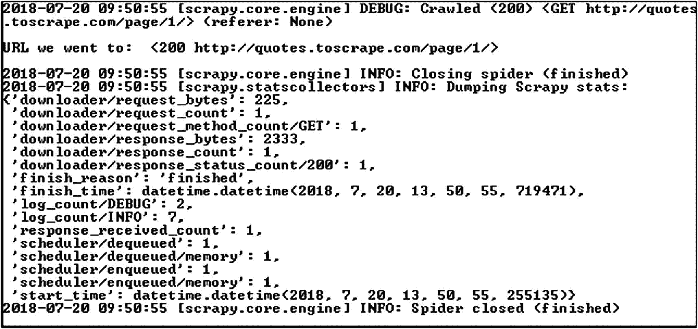
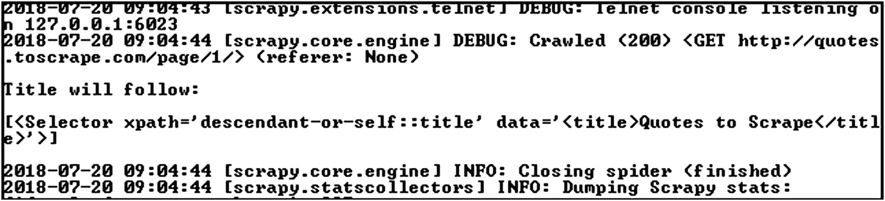

# 5.通用协议

大多数情况下，您会希望根据应用的需求来定义高度定制的对象。这通常意味着提出自己的接口和 API，这些接口和 API 是您自己的代码所独有的。做到这一点的灵活性对于任何系统的扩展能力都是必不可少的，但这是有代价的。你发明的任何新东西都必须被记录下来，并被需要使用它的人所理解。

理解如何使用一个框架提供的各种类对于该框架的用户来说可能是一件相当麻烦的事情，即使有适当的文档。减轻用户负担的一个好方法是模仿他们已经熟悉的界面。有许多现有的类型是 Python 编程中的标准问题，其中大多数都有可以在自定义类中实现的接口。

方法是实现现有接口的最显而易见的方式，但是对于许多内置类型，大多数操作都是使用本机 Python 语法而不是显式方法调用来执行的。自然，这些语法特性是由幕后的实际方法支持的，所以它们可以被覆盖以提供定制的行为。

以下部分展示了如何在定制代码中模拟 Python 中使用的一些最常见类型的接口。这绝不是 Python 附带的所有类型的详尽列表，也不是每个方法都被表示出来。相反，这一章是对那些不太明显的方法的参考，因为它们被语法糖掩盖了。

## 基本操作

尽管 Python 中有各种各样的对象类型，但大多数都有一组共同的操作。这些被认为是某种核心特性集，代表了对象操作的一些最常见的高级方面，其中许多都适用于简单的数字，就像它们适用于许多其他对象一样。

包括 Python 在内的所有编程中最简单也是最常见的需求之一是将一个表达式计算为布尔值，这样就可以用它来做出简单的决策。通常这用于`if`模块，但这些决定也在使用`while`和布尔运算如`and`和`or`时发挥作用。当 Python 遇到其中一种情况时，它依赖于`__bool__()`方法的行为来确定对象的布尔等价物。

如果实现了`__bool__()`方法，它只接受通常的`self`，并且必须返回`True`或`False`。这允许任何对象使用任何适当的方法或属性来确定它在给定的表达式中应该被认为是真还是假:


```py
>>> bool(0)
False
>>> bool(1)
True
>>> bool(5)
True

```

作为另一个例子，考虑表示矩形的类可能使用它的面积来确定该矩形被认为是真还是假。因此，`__bool__()`只需检查是否存在非零宽度和非零高度，因为`bool 0`为假，而任何其他正值，通常为`1`，为真。这里我们使用内置的`bool()`，它使用`__bool__()`将值转换为布尔值:


```py
>>> class Rectangle:
...     def __init__(self, width, height):
...         self.width = width
...         self.height = height
...     def __bool__(self):
...         if self.width and self.height:
...             return True
...         return False
...
>>> bool(Rectangle(10, 15))
True
>>> bool(Rectangle(0, 0))
False
>>> bool(Rectangle(0, 15))
False

```

### 小费

`__bool__()`方法并不是定制 Python 布尔行为的唯一方法。相反，如果一个对象提供了一个`__len__()`方法，这将在本章后面的序列一节中描述，Python 将退回到这个方法，并认为任何非零长度为真，而零长度为假。

考虑到对象的真实性，你会自动控制`and`、`or`、`not`等操作者的行为。因此，为了自定义这些运算符，不需要重写单独的方法。

除了能够确定对象的真实性，Python 还在其他操作中提供了很大的灵活性。特别是，标准的数学运算可以被覆盖，因为它们中的许多可以应用于除数字之外的各种对象。

### 数学运算

一些最早的数学形式源于对我们周围世界的观察。因此，我们在小学学到的大部分数学知识很容易应用到其他类型的物体上，就像应用到数字上一样。例如，加法可以被看作是简单地将两个东西放在一起(连接)，例如将两个字符串连接在一起形成一个更长的字符串。

如果你只从数学上来看，你可以说你实际上只是把两个长度加在一起，得到一个更长的长度。但是当你看看刚刚发生了什么，你现在有了一个全新的弦，它不同于最初进入它的两根弦。

这种类比也很容易扩展到 Python 字符串，可以使用标准加法连接，而不需要单独的命名方法。类似地，如果你需要多次写出同一个字符串，你可以简单地把它乘以一个普通的数。这些类型的操作在 Python 中非常常见，因为它们是实现常见任务的简单方法:


```py
>>> 2 + 2
4
>>> 'two' + 'two'
'twotwo'
>>> 2 * 2
4
>>> 'two' * 2
'twotwo'

```

和`__bool__()`一样，这些行为都是由自己特殊的方法控制的。他们中的大多数都相当直接，接受通常的`self`以及`other`论点。这些方法被绑定到操作符左侧的对象，附加的`other`是右侧的对象。

Python 中使用标准运算符`+`、`-`、`*`和`/`来表示四种基本算术运算——加、减、乘、除。在幕后，前三个由`__add__()`、`__sub__()`和`__mul__()`方法的实现驱动。除法有点复杂，我们稍后会讲到，但是现在，让我们看看这个操作符重载是如何工作的。

考虑一个作为值的简单代理的类。这种东西在现实世界中没有多大用处，但它是解释一些事情的好起点:


```py
>>> class Example:
...     def __init__(self, value):
...         self.value = value
...     def __add__(self, other):
...         return self.value + other
...
>>> Example(10) + 20
30

```

这只是您的代码可以自定义的一些基本算术运算的一个例子。在本章的剩余部分，你会发现更高级的操作细节；表 [5-1](#Tab1) 列出了这些基本算术运算符。

表 5-1

基本算术运算符

<colgroup><col class="tcol1 align-left"> <col class="tcol2 align-left"> <col class="tcol3 align-left"></colgroup> 
| 

**操作**

 | 

**操作员**

 | 

**自定义方法**

 |
| --- | --- | --- |
| 添加 | + | `__add__()` |
| 减法 | - | `__sub__()` |
| 增加 | * | `__mul__()` |
| 分开 | / | `__truediv__()` |

这就是事情变得有趣的地方，因为你会注意到除法的方法并不像你想象的那样是`__div__()`。这是因为分裂有两种不同的味道。当你使用计算器时得到的那种除法在 Python 中被称为*真除法*，它使用`__truediv__()`方法，正如你所期望的那样工作。

然而，*真除法*是唯一可以接受两个整数并返回一个非整数的算术运算。在某些应用中，总是返回一个整数是有用的。例如，如果你用百分比显示一个应用的进度，你不需要显示完整的浮点数。

取而代之的是另一种操作，叫做*楼层分区*；你可能也听说过它被称为*整数除法*。如果真除法的结果落在两个整数之间，则底数除法将只返回两个整数中较小的一个，因此它总是返回一个整数。如您所料，Floor division 是通过一个单独的`__floordiv__()`实现的，并使用`//`操作符进行访问:


```py
>>> 5 / 4
1.25
>>> 5 // 4
1

```

还有一个模运算，和除法有关。在除法运算会产生余数的情况下，使用模运算会返回余数，所以*模运算只返回除法运算的余数*。这使用了使用`__mod__()`实现的`%`操作符。字符串使用它来执行标准变量解释，即使这与除法无关:


```py
>>> 20 // 6
3
>>> 20 % 6
2
>>> 'test%s' % 'ing'
'testing'

```

实际上，您可以使用取整除法和模运算来获得除法运算的整数结果及其余数，余数保留了关于结果的所有信息。这有时比真除法更可取，真除法只会产生一个浮点数。例如，考虑一个需要几分钟的函数，它必须返回包含小时数和分钟数的字符串:


```py
>>> def hours_and_minutes(minutes):
...     return minutes // 60, minutes % 60
...
>>> hours_and_minutes(60)
(1, 0)
>>> hours_and_minutes(137)
(2, 17)
>>> hours_and_minutes(42)
(0, 42)

```

事实上，这个基本任务非常常见，Python 为它提供了自己的函数:`divmod()`。通过传入一个基值和一个被它除的值，可以同时得到地板除法和模运算的结果。然而，Python 将尝试调用一个`__divmod__()`方法，而不是简单地分别委托给这两个方法，这使得定制实现更加高效。

作为更有效实现的替代，可以使用与`hours_and_minutes()`函数相同的技术来说明`__divmod__()`方法。我们所要做的就是接受第二个参数，以便将硬编码的 60 从方法中去掉:


```py
>>> class Example:
...     def __init__(self, value):
...         self.value = value
...     def __divmod__(self, divisor):
...         return self.value // divisor, self.value % divisor
...
>>> divmod(Example(20), 6)
(3, 2)

```

乘法还有一个扩展，叫做指数运算，一个值要乘以它自身的次数。鉴于它与乘法的关系，Python 使用双星号`**`符号来执行运算。它是使用`__pow__()`方法实现的，因为现实世界的数学通常称之为将一个值提升到某个其他值的幂:


```py
>>> class Example:
...     def __init__(self, value):
...         self.value = value
...     def __pow__(self, power):
...         val = 1
...         for x in range(power):
...             val *= self.value
...         return val
...
>>> Example(5) ** 3
125

```

与其他操作不同，取幂也可以通过另一种方式执行，即通过内置的`pow()`函数。之所以有不同的操作符，是因为它允许传递额外的参数。这个额外的参数是一个值，应该用于在执行取幂运算之后执行模运算。这种额外的行为允许以更有效的方式来执行诸如查找素数之类的任务，这在密码学中很常用:


```py
>>> 5 ** 3
125
>>> 125 % 50
25
>>> 5 ** 3 % 50
25
>>> pow(5, 3, 50)
25

```

为了用`__pow__()`方法支持这种行为，您可以选择接受一个额外的参数，它将用于执行模运算。为了支持普通的`**`操作符，这个新参数必须是可选的。没有合理的缺省值可以盲目使用而不会导致标准幂运算的问题，所以它应该缺省为`None`来决定是否应该执行模运算:


```py
>>> class Example:
...     def __init__(self, value):
...         self.value = value
...     def __pow__(self, power, modulo=None):
...         val = 1
...         for x in range(power):
...             val *= self.value
...         if modulo is not None:
...             val %= modulo
...         return val
...
>>> Example(5) ** 3
125
>>> Example(5) ** 3 % 50
25
>>> pow(Example(5), 3, 50)
25

```

### 警告

和前面显示的`__divmod__()`实现一样，这个例子并不是解决问题的非常有效的方法。它确实会产生正确的值，但它仅用于说明。

### 位运算

位运算用于处理二进制文件、加密、编码、硬件驱动程序和网络协议的情况。因此，它们通常与低级编程相关联；然而，它们肯定不是专门为该领域保留的。通过*位操作*，一组独立的操作不直接作用于数值，而是作用于一系列单独的位。在这个层次上，有几种不同的操作值的方法，它们不仅适用于数字，也适用于其他类型的序列。最简单的按位操作是移位，将一个值中的位向右或向左移动，产生一个新值。

在二进制算术中，将位左移一位会使值乘以二。这就像在十进制数学中一样:如果你将一个数字中的所有数字都向左移动，并用一个零填充右边的空白，你实际上是将这个值乘以 10。这种行为存在于任何基数上，但是计算机是以二进制工作的，所以移位操作也是如此。

分别使用`<<`和`>>`运算符向左和向右移动。运算符的右边表示这些位应该移位多少位。在内部，这些操作由`__lshift__()`和`__rshift__()`方法支持，每个方法都接受要移动的位置数作为其唯一的附加参数:


```py
>>> 10 << 1
20
>>> 10 >> 1
5

```

除了打乱位的顺序之外，还有一些操作将每个值中的位相互比较，从而产生一个新值，该值表示两个单独值的某种组合。这四种按位比较操作是`&`、`|`、`^`和`~`，分别指与、或、异或(异或)和求反。

只有当被比较的两个位都为 1 时，AND 比较才返回 1。如果是其他任何组合，结果都是 0。此行为通常用于创建位掩码，您可以通过应用 AND 将所有不相关的值重置为 0，其中每个有用的位为 1，其余位为 0。这将清除掉您不感兴趣的任何位，便于与二进制标志集进行比较。在代码中支持这种行为需要有一个`__and__()`方法。

如果被比较的任一位为 1，OR 比较返回 1。如果两个都是 1 也没关系；只要其中至少有一个是 1，结果就会是 1。这通常用于将多组二进制标志连接在一起，以便运算符两边的所有标志都设置在结果中。支持此功能所需的方法是`__or__()`。

标准 or 运算符有时被称为包含 OR，与其表亲异或形成对比，后者通常缩写为 XOR。在 XOR 运算中，只有当其中一位为 1 而另一位不为 1 时，结果才为 1。如果两位都是 1 或都是 0，结果将是 0。`__xor__()`方法支持异或运算。

最后，Python 还提供了逐位反转，每一位都翻转为与当前值相反的值；1 变成 0，反之亦然。从数字上看，这在负值和正值之间交换，但它不仅仅改变符号。下面是一个使用`~`运算符反转数字时的反应示例:


```py
>>> ~42
-43
>>> ~-256
255

```

这种行为基于计算机处理有符号值的方式。最高有效位用于确定值是正还是负，因此翻转该位会改变符号。反转后绝对值的变化是由于缺少–0。当 0 反转时，它变成–1 而不是–0，因此所有其他值在此之后也跟着反转。

在自定义代码中，当您拥有一组已知的所有可能值以及这些值的各个子集时，反转通常是最有用的。反转这些子集将删除任何现有的值，并用主集中不在子集中的任何值替换它们。

这种行为可以通过在对象上提供一个`__invert__()`方法来实现。然而，与其他按位方法不同，`__invert__()`是一元的，所以它不接受标准`self`之外的任何额外参数。

### 注意

此处描述的反转行为对使用二进制补码方法编码的数字有效，该方法用于处理有符号数字。如果自定义数字类提供了`__invert__()`方法，还有其他选项 <sup>[1](#Fn1)</sup> 可用，它们的行为可能与这里显示的不同。默认情况下，Python 只使用二进制补码编码方法。

### 变化

除了正常的操作行为之外，还有几种不同的方法可以访问它们。最明显的问题是，这些方法通常绑定到运算符左侧的值。如果你的自定义对象被放在右边，那么左边的值很有可能不知道如何使用它，所以你会得到一个`TypeError`而不是一个可用的值。

这种行为是可以理解的，但是很不幸，因为如果自定义对象知道如何与另一个值交互，那么不管它们的位置如何，它都应该能够这样做。考虑到这一点，Python 给运算符右侧的值一个返回有效值的机会。

当表达式的左边没有产生值时，Python 会检查右边的值是否属于同一类型。如果是的话，就没有理由期望它能比第一次做得更好，所以 Python 简单地抛出了`TypeError`。但是，如果是不同的类型，Python 将调用右边值的方法，将左边的值作为参数传入。

这个过程交换参数，将方法绑定到右边的值。对于一些运算，比如减法和除法，值的顺序很重要，所以 Python 使用不同的方法来表示顺序的变化。这些独立方法的名称大多与左边的方法相同，但在前两个下划线后添加了一个`r`:


```py
>>> class Example:
...     def __init__(self, value):
...         self.value = value
...     def __add__(self, other):
...         return self.value + other
...
>>> Example(20) + 10
30
>>> 10 + Example(20)
Traceback (most recent call last):
  ...
TypeError: unsupported operand type(s) for +: 'int' and 'Example'
>>> class Example:
...     def __init__(self, value):
...         self.value = value
...     def __add__(self, other):
...         return self.value + other

...     def __radd__(self, other):

...         return self.value + other

...
>>> Example(20) + 10
30
>>> 10 + Example(20)

30

```

### 小费

在这种情况下，值的顺序不影响结果，实际上你可以把左边的方法赋给右边的方法。只是要记住，并不是所有的操作都是这样的，所以你不能在没有确保它有意义的情况下，盲目地将方法复制到两边。

使用这些运算符的另一种常见方式是修改现有值，并将结果赋回初始值。正如在本章前面没有解释的情况下已经证明的那样，一种替代的转让形式适合于这些修改。只需将`=`附加到所需的运算符上，就可以将运算结果赋给左边的值:


```py
>>> value = 5
>>> value *= 3
>>> value
15

```

默认情况下，这种形式的扩充赋值使用标准运算符方法，其方式与本章前面所述的方式相同。但是，这需要在操作后创建一个新值，然后用它来重新绑定一个现有的值。相反，只要您能够识别这种赋值何时发生，就地修改值有时会更有利。

像右边的方法一样，就地操作符使用与标准操作符基本相同的方法名，但是这次在下划线后面加上了一个`i`。然而，这个操作没有右边的等价操作，因为赋值总是在左边的变量上完成。考虑到一切，表 [5-2](#Tab2) 列出了可用的操作符，以及定制它们的行为所需的方法。

表 5-2

可用运算符

<colgroup><col class="tcol1 align-left"> <col class="tcol2 align-left"> <col class="tcol3 align-left"> <col class="tcol4 align-left"> <col class="tcol5 align-left"></colgroup> 
| 

**操作**

 | 

**操作员**

 | 

**左侧**

 | 

**右侧**

 | 

**直列式**

 |
| --- | --- | --- | --- | --- |
| 添加 | `+` | `__add__()` | `__radd__()` | `__iadd__()` |
| 减法 | `-` | `__sub__()` | `__rsub__()` | `__isub__()` |
| 增加 | `*` | `__mul__()` | `__rmul__()` | `__imul__()` |
| 真正的分裂 | `/` | `__truediv__()` | `__rtruediv__()` | `__itruediv__()` |
| 楼层划分 | `//` | `__floordiv__()` | `__rfloordiv__()` | `__ifloordiv__()` |
| 以…为模 | `%` | `__mod__()` | `__rmod__()` | `__imod__()` |
| 除法和模数 | `divmod()` | `__divmod__()` | `__rdivmod__()` | 不适用的 |
| 指数运算 | `**` | `__pow__()` | `__rpow__()` | `__ipow__()` |
| 左二进制移位 | `<<` | `__lshift__()` | `__rlshift__()` | `__ilshift__()` |
| 右二进制移位 | `>>` | `__rshift__()` | `__rrshift__()` | `__irshift__()` |
| 按位 AND | `&` | `__and__()` | `__rand__()` | `__iand__()` |
| 按位或 | `&#124;` | `__or__()` | `__ror__()` | `__ior__()` |
| 按位异或 | `^` | `__xor__()` | `__rxor__()` | `__ixor__()` |
| 逐位反转 | ~ | __invert__() | 不适用的 | 不适用的 |

### 注意

没有除法和模运算的内嵌方法，因为它不能作为支持赋值的运算符。它只被称为`divmod()`方法，没有内联功能。此外，按位反转是一元运算，因此没有右侧或内嵌方法可用。

尽管这些操作主要集中在数字上，但它们中的许多也适用于其他类型的对象。然而，还有另一组行为，它们只对数字和可以像数字一样运行的对象有意义。

## 民数记

从本质上讲，所有的计算机都与数字有关，所以它们在大多数应用中扮演重要角色是很自然的。除了上一节概述的操作之外，数字还表现出许多不太明显的行为。

自定义数字最基本的行为是让 Python 相信它实际上是一个数字。当试图使用一个对象作为序列中的索引时，这是必要的。Python 要求所有索引都是整数，因此需要一种方法将对象强制转换为整数，以便用作索引。对于这个 Python 使用了一个`__index__()`方法，如果它不存在或者它返回一个非整数的值，就抛出一个`TypeError`:


```py
>>> sequence = [1, 2, 3, 4, 5]
>>> sequence[3.14]
Traceback (most recent call last):
  ...
TypeError: list indices must be integers, not float
>>> class FloatIndex(float):
...     def __index__(self):
...         # For the sake of example, return just the integer portion
...         return int(self)
...
>>> sequence[FloatIndex(3.14)]
4
>>> sequence[3]
4

```

除了简单的索引访问之外，`__index__()`还用于为了切片而强制输入一个整数，并使用内置的`bin()`、`hex()`和`oct()`函数为转换生成一个起始值。当希望在其他情况下显式强制一个整数时，可以使用内置的`int()`函数使用的`__int__()`方法。使用`__float__()`支持`float()`和`__complex__()`进行`complex()`的其他类型转换。

将一个数字转换为另一个数字时，最常见的操作之一是舍入。不像`int()`那样盲目地截断非整数的值的任何部分，舍入对最终得到的值的类型和保留的精度提供了更多的控制。

当您将一个十进制数或浮点数传递给`int()`时，效果本质上只是一个地板运算。与前面提到的除法一样，floor 运算接受两个整数之间的一个数，并返回两个数中较小的一个。`math`模块包含一个执行该操作的`floor()`函数。

如您所料，这依赖于定制对象上的`__floor__()`方法来执行 floor 操作。除了通常的`self`之外，它不需要任何参数，应该总是返回一个整数。然而，Python 实际上并没有对返回值强制任何要求，所以如果你正在处理整数的某个子类，你可以返回其中的一个。

相比之下，你可能需要两者中较高的一个，这将是一个上限操作。这是使用`math.ceil()`完成的，并通过`__ceil__()`方法实现。像`__floor__()`一样，它不需要任何额外的参数，返回一个整数。

更有可能的是，您需要将一个值四舍五入到特定的位数。这是使用`round()`函数实现的，它是一个内置函数，而不是位于`math`模块中。它最多接受两个参数，并使用定制对象上的`__round__()`方法来实现。

`round()`的第一个参数是`__round__()`将要绑定的对象，所以它作为标准的`self`出现。然而，第二个论点有点微妙。小数点右边的位数应该被认为是有效的，因此保留在结果中。如果没有提供，`round()`应该假设这些数字都不重要，并返回一个整数:


```py
>>> round(3.14, 1)
3.1
>>> round(3.14)
3
>>> round(3.14, 0)
3.0
>>> import decimal
>>> round(decimal.Decimal('3.14'), 1)
Decimal('3.1')
>>> round(decimal.Decimal('3.14'))
3

```

如你所见，传递第二个参数 0 和根本不传递参数是有区别的。返回值本质上是一样的，但是当不传入时，应该总是得到一个整数。当传入一个 0 时，您将得到您传入的任何类型，但是只包括有效数字。

除了将小数点右边的数字四舍五入，`round()`还可以作用于另一边。通过传入一个负数，您可以指定小数点左边应该四舍五入的位数，而保留其他位数:


```py
>>> round(256, -1)
260
>>> round(512, -2)
500

```

### 签名操作

还有一个一元运算选项，可用于调整值的符号。第一个是`-`，对符号求反，在正值和负值之间交换。通过提供一个`__neg__()`方法可以定制这种行为，该方法不接受超过`self`的额外参数。

为了补充负号，Python 还支持正号，使用`+`。因为数字通常被假定为正数，所以这个操作符实际上并不自己做任何事情；它只是返回不变的数字。然而，如果一个定制对象需要一个附加的实际行为，一个`__pos__()`方法可以提供它。

最后，一个数也可以有绝对值，一般定义为它离零的距离。符号无关紧要，所有值都变成正值。因此，将`abs()`应用于数字会移除负号(如果存在的话),但保持正值不变。这个行为由一个`__abs__()`方法修改。

### 比较操作

至此所示的操作涉及至少部分基于一个或多个现有值返回修改后的值。相比之下，比较运算符根据两个值之间的关系返回`True`或`False`。

最基本的比较操作符`is`和`is not`，直接作用于每个对象的内部标识。因为标识通常是作为对象在内存中的地址实现的，Python 代码不能更改它，所以没有办法覆盖这种行为。它的用途通常保留给与已知常数的比较，如`None`。

可用的运算符代表标准的数值比较，它检测一个值是高于、低于还是完全等于另一个值。最通用的是使用`==`测试相等性。它的通用性来自于这样一个事实，即它不局限于数值，因为许多其他类型可以有被认为彼此相等的对象。这个行为由一个`__eq__()`方法控制。

不平等在 Python 中由`!=`操作符表示，其行为正如您所料。然而，您可能没有想到的是，这个功能与`==`没有任何联系。Python 不是简单地调用`__eq__()`并反转其结果，而是依靠一个单独的`__ne__()`方法来处理不等式测试。因此，如果你实现了`__eq__()`，也要记得提供`__ne__()`，以确保一切按预期运行。

此外，您可以使用`<`和`>`比较一个值是小于还是大于另一个值，这两个值分别使用`__lt__()`和`__gt__()`实现。等式也可以与这些相结合，例如，一个值可以大于或等于另一个值。这些操作使用`<=`和`>=`，并由`__lte__()`和`__gte__()`支持。

这些比较通常用于主要由数字表示的对象，即使对象本身远不止这些。日期和时间是容易比较的对象的显著例子，因为它们本质上都是一系列数字，如果需要，可以单独进行比较:


```py
>>> import datetime
>>> a = datetime.date(2019, 10, 31)
>>> b = datetime.date(2017, 1, 1)
>>> a == b
False
>>> a < b
True

```

关于比较，字符串是一个有趣的例子。尽管从明显的意义上来说，字符串不是数字，但字符串中的每个字符都是数字的另一种表示，所以字符串比较也是有效的。这些比较驱动了字符串的排序特性。

## 可重复的

序列似乎是显而易见的下一个选择，但是首先要考虑更通用的形式。如果一个对象可以一次产生一个对象，那么它被认为是可迭代的，通常是在一个`for`循环中。这个定义是有意简单的，因为在高层次上，iterables 并没有超出这个范围。然而，Python 对 iterables 有更具体的定义。

特别是，如果将一个对象传递给内置的`iter()`函数返回一个迭代器，那么这个对象就是可迭代的。在内部，`iter()`检查传入的对象，首先寻找一个`__iter__()`方法。如果找到了这样的方法，它将被不带任何参数地调用，并返回一个迭代器。如果`__iter__()`不可用，还会发生另一个步骤，但是现在，让我们关注迭代器。

尽管这个对象被认为是可迭代的，但是迭代器做了所有真正的工作，但是实际上没有那么多。对于`__init__()`方法应该是什么样子没有要求，因为它在它的主对象的`__iter__()`方法中被实例化。所需的接口只包含两个方法。

第一种方法，也许令人惊讶，是`__iter__()`。迭代器本身也应该总是可迭代的，所以它们必须提供一个`__iter__()`方法。不过，通常没有理由在这个方法中做任何特殊的事情，所以它通常被实现为只返回`self`。如果不在迭代器上提供`__iter__()`，主对象在大多数情况下仍然是可迭代的，但是一些代码希望迭代器也可以独立使用。

更重要的是，迭代器必须始终提供一个`__next__()`方法，所有真正的工作都在这里进行。Python 将调用`__next__()`从迭代器中检索下一个值，该值将在任何称为迭代器的代码体中使用。当代码需要一个新值时，通常是为了循环中的下一遍，它会再次调用`__next__()`来获得一个新值。这一过程一直持续到几件事情之一发生。

如果 Python 遇到了导致循环完成的任何事情，而迭代器仍然有它可以产生的项，那么迭代器只是等待其他代码请求另一项。如果这种情况永远不会发生，最终将不会有更多的代码知道迭代器，所以 Python 将从内存中删除它。第 [6](06.html) 章更详细地介绍了这个垃圾收集过程。

在一些不同的情况下，迭代器可能没有机会完成。最明显的是一个`break`语句，它将停止循环，然后继续。此外，`return`或`raise`语句将隐式地跳出它所属的任何循环，因此迭代器保持与`break`发生时相同的状态。

然而，更常见的情况是，循环会让迭代器一直运行，直到它不再产生任何项。使用生成器时，当函数返回而没有产生新值时，会自动处理这种情况。对于迭代器，这种行为必须显式提供。

因为`None`是一个完全有效的对象，可以合理地从迭代器中产生，Python 不能只对`__next__()`没有返回值做出反应。相反，`StopIteration`异常为`__next__()`提供了一种方式来表明不再有条目。当引发此问题时，循环被视为完成，并且在循环结束后的下一行继续执行。

为了说明所有这些是如何结合在一起的，让我们看一下内置的`range()`函数的行为。它不是一个生成器，因为你可以多次迭代它。为了提供类似的功能，我们需要返回一个 iterable 对象，然后可以根据需要迭代多次:


```py
class Range:
    def __init__(self, count):
        self.count = count

    def __iter__(self):
        return RangeIter(self.count)

class RangeIter:
    def __init__(self, count):
        self.count = count
        self.current = 0

    def __iter__(self):
        return self

    def __next__(self):
        value = self.current
        self.current += 1
        if self.current > self.count:
            raise StopIteration
        return value

>>> def range_gen(count):
...     for x in range(count):
...         yield x
...
>>> r = range_gen(5)
>>> list(r)
[0, 1, 2, 3, 4]
>>> list(r)
[]
>>> r = Range(5)
>>> list(r)
[0, 1, 2, 3, 4]
>>> list(r)
[0, 1, 2, 3, 4]

```

迭代器是实现 iterable 的最强大、最灵活的方式，所以它们通常是首选，但是还有另一种方法可以达到类似的效果。对象可迭代的原因是`iter()`返回一个迭代器，所以值得注意的是`iter()`支持某种特殊情况。

如果一个对象没有一个`__iter__()`方法，但是包含一个`__getitem__()`方法，Python 可以在一个特殊的迭代器中使用这个方法来处理这种情况。我们将在下一节讨论序列的更多细节，但基本思想是`__getitem__()`接受一个索引，并被期望在那个位置返回项目。

如果 Python 找到的是`__getitem__()`而不是`__iter__()`，它会自动创建一个迭代器来使用它。这个新的迭代器多次调用`__getitem__()`，每次调用一系列数字中的一个值，从零开始，直到`__getitem__()`产生一个`IndexError`。因此，我们的自定义`Range` iterable 可以非常简单地重写:


```py
class Range:
    def __init__(self, count):
        self.count = count

    def __getitem__(self, index):
        if index < self.count:
            return index
        raise IndexError

>>> r = Range(5)
>>> list(r)
[0, 1, 2, 3, 4]
>>> list(r)
[0, 1, 2, 3, 4]

```

### 注意

只有当`__iter__()`不存在时，Python 才会使用这个`__getitem__()`行为。如果两者都在一个类中提供，那么`__iter__()`方法将被用来控制迭代行为。

### 示例:可重复生成器

在显式可迭代的对象类型中，多次迭代一个对象的能力非常普遍，但是使用生成器通常更方便。如果您需要一个生成器，它可以在每次迭代器被访问时自动重启，看起来您要么错过了这个功能，要么添加了一堆不必要的代码，这些代码的存在只是为了允许正确的迭代。

相反，像许多其他行为一样，我们可以依靠 Python 的标准方法来扩充函数，并将其分解到装饰器中。当应用于生成器函数时，这个新的装饰器可以处理创建 iterable 所需的一切，每次请求新的迭代器时，iterable 从头触发生成器:


```py
def repeatable(generator):
    """
    A decorator to turn a generator into an object that can be
    iterated multiple times, restarting the generator each time.
    """
    class RepeatableGenerator:
        def __init__(self, *args, **kwargs):
            self.args = args
            self.kwargs = kwargs

        def __iter__(self):
            return iter(generator(*self.args, **self.kwargs))

    return RepeatableGenerator

>>> @repeatable
... def generator(max):
...     for x in range(max):
...         yield x
...
>>> g = generator(5)
>>> list(g)
[0, 1, 2, 3, 4]
>>> list(g)
[0, 1, 2, 3, 4]

```

通过创建一个可以在调用生成器函数时实例化的新类，它的`__iter__()`方法将代替生成器的方法被调用。这样，每次新的循环开始时，都可以从头开始调用生成器，产生新的序列，而不是试图从它停止的地方开始，这通常意味着返回一个空序列。

### 警告

尽管大多数生成器每次都返回相似的序列，并且可以放心地重新启动，但并不是所有的生成器都这样。如果一个生成器根据它被调用的时间改变它的输出，在随后的调用中从它停止的地方继续，或者产生副作用，这个装饰器是不推荐的。通过改变行为，每次都显式地重新启动装饰器，新的生成器可能会产生不可预知的结果。

然而，目前的代码有一个问题。`@repeatable` decorator 接收一个函数，但返回一个类，这在提供的例子中工作得很好，但有一些非常麻烦的含义。首先，记住第 3 章[中的包装函数有新的属性，这个问题可以用`@functools.wraps`装饰器来解决。](03.html)

然而，在我们考虑使用另一个装饰器之前，我们必须解决一个更大的问题:我们正在返回一个与原始函数完全不同的类型。通过返回一个类而不是一个函数，我们会给任何期望它是一个函数的代码带来问题，包括其他装饰器。更糟糕的是，返回的类不能作为方法使用，因为它没有一个`__get__()`方法将它绑定到它的所有者类或它的一个实例。

为了解决这些问题，我们必须在类周围引入一个包装函数，它将实例化对象并返回它。这样，我们可以使用`@functools.wraps`尽可能多地保留原始装饰器。更好的是，我们还可以返回一个函数，它可以毫无困难地绑定到类和实例:


```py
import functools

def repeatable(generator):
    """
    A decorator to turn a generator into an object that can be
    iterated multiple times, restarting the generator each time.
    """
    class RepeatableGenerator:
        def __init__(self, *args, **kwargs):
            self.args = args
            self.kwargs = kwargs

        def __iter__(self):
            return iter(generator(*self.args, **self.kwargs))

    @functools.wraps(generator)
    def wrapper(*args, **kwargs):
        return RepeatableGenerator(*args, **kwargs)
    return wrapper

```

## 顺序

除了数字，序列可能是所有编程中最常用的数据结构，包括 Python。列表、元组甚至字符串都是共享一组公共特性的序列，它们实际上是迭代器的一种特殊类型。除了能够单独产生一系列项目之外，序列还具有额外的属性和行为，支持它们一次性了解整个项目集的事实。

这些额外的行为并不一定要求所有的条目同时被加载到内存中。通过迭代获得的效率收益对于序列和其他任何可迭代对象一样有效，所以行为不会改变。相反，添加的选项只是将集合作为一个整体，包括其长度和获取子集的能力，以及在不获取整个序列的情况下访问单个项目。

序列最明显的特征是能够确定它的长度。对于可以包含任意项目的对象，这需要知道——或者计数——所有这些项目。对于其他人来说，对象可以使用一些其他信息来达到相同的结果。这个行为的定制是通过提供一个`__len__()`方法来实现的，当对象被传递到内置的`len()`函数中时，这个方法在内部被调用。

继续前面的例子，下面是一个简单的替换`Range`类如何使用它的配置信息来返回长度，而不必产生一个值:


```py
class Range:
    def __init__(self, max):
        self.max = max

    def __iter__(self):
        for x in range(self.max):
            yield x

    def __len__(self):
        return self.max

```

因为序列包含固定的项目集合，所以它们不仅可以从头到尾迭代，还可以反向迭代。Python 提供了`reversed()`函数，该函数将一个序列作为其唯一的参数，并返回一个 iterable，该 iterable 从序列中反向生成项目。可能会有特别的效率提升，所以一个定制的序列对象可以提供一个`__reversed__()`方法来定制`reversed()`的内部行为。

将这个概念再次带到`Range`类，可以使用内置`range()`的替代形式来提供一个反向范围:


```py
class Range:
    def __init__(self, max):
        self.max = max

    def __iter__(self):
        for x in range(self.max):
            yield x

    def __reversed__(self):
        for x in range(self.max - 1, -1, -1):
            yield x

```

既然我们已经能够向前和向后遍历序列并报告其长度，下一步就是提供对单个项目的访问。在普通 iterable 中，只能通过在循环中一次检索一项来访问项。通过预先知道序列中的所有值，自定义类可以随时提供对任何项目的访问。

最明显的任务是在给定一个预先已知的索引的情况下检索一个项目。例如，如果自定义对象包含在命令行中传递的参数，应用将知道每个参数的具体含义，并且通常通过索引来访问它们，而不是简单地遍历整个序列。这使用标准的`sequence[index]`语法，其行为由`__getitem__()`方法控制。

使用`__getitem__()`，如果需要，可以从序列中挑选出单个项目，或者从其他数据结构中检索。继续讨论`Range`主题，`__getitem__()`可以计算出合适的值，而不需要在序列中循环。事实上，它甚至可以支持内置`range()`可用的所有参数:


```py
class Range:
    def __init__(self, a, b=None, step=1):
        """
        Define a range according to a starting value, an end value and a step.

        If only one argument is provided, it's taken to be the end value. If
        two arguments are passed in, the first becomes a start value, while the
        second is the end value. An optional step can be provided to control
        how far apart each value is from the next.
        """
        if b is not None:
            self.start = a
            self.end = b
        else:
            self.start = 0
            self.end = a
        self.step = step

    def __getitem__(self, key):
        value = self.step * key + self.start
        if value < self.end:
            return value
        else:
            raise IndexError("key outside of the given range")

>>> r = Range(5)
>>> list(r)
[0, 1, 2, 3, 4]
>>> r[3]
3
>>> r = Range(3, 17, step=4)
>>> list(r)
[3, 7, 11, 15]
>>> r[2]
11
>>> r[4]
Traceback (most recent call last):
  ...
IndexError: indexed value outside of the given range

```

如果传入的索引超出了可用项目的范围，`__getitem__()`应该引发一个`IndexError`。高度专业化的应用可以定义一个更具体的子类并提升它，但是大多数用例会简单地自己捕捉`IndexError`。

除了符合大多数 Python 程序员的期望之外，适当提高`IndexError`对于允许一个序列在不实现`__iter__()`的情况下被用作 iterable 是至关重要的。Python 将简单地传入整数索引，直到`__getitem__()`方法引发一个`IndexError`，此时它将停止对序列的迭代。

除了一次只能访问一个项目，序列还可以通过切片的方式提供对其内容子集的访问。当使用切片语法时，`__getitem__()`接收一个特殊的`slice`对象，而不是一个整数索引。一个`slice`对象具有切片的开始、停止和步进部分的专用属性，这些属性可用于确定返回哪些项目。这是如何影响我们一直在检查的`Range`对象的:


```py
class Range:
    def __init__(self, a, b=None, step=1):
        """
        Define a range according to a starting value, an end value and a step.

        If only one argument is provided, it's taken to be the end value. If
        two arguments are passed in, the first becomes a start value, while the
        second is the end value. An optional step can be provided to control
        how far apart each value is from the next.
        """
        if b is not None:
            self.start = a
            self.end = b
        else:
            self.start = 0
            self.end = a
        self.step = step

    def __getitem__(self, key):
        if isinstance(key, slice):
            r = range(key.start or 0, key.stop, key.step or 1)
            return [self.step * val + self.start for val in r]
        value = self.step * key + self.start
        if value < self.end:
            return value
        else:
            raise IndexError("key outside of the given range")

```

下一个逻辑步骤是允许序列中的单个项目根据其索引进行设置。这种就地赋值使用基本相同的`sequence[index]`语法，但作为赋值操作的目标。它由一个自定义对象在其`__setitem__()`方法中支持，该方法接受要访问的索引和要存储在该索引中的值。

然而，和`__getitem__()`一样，`__setitem__()`也可以接受一个`slice`对象作为它的索引，而不是一个整数。但是，因为切片定义了序列的子集，所以传递的值应该是另一个序列。然后，这个新序列中的值将取代切片引用的子集中的值。

然而，事情并不完全像它们看起来那样，因为分配给切片的序列实际上不需要与切片本身具有相同的项目数。事实上，它可以是任何大小，无论是大于还是小于它被分配到的片。`__setitem__()`的预期行为只是删除切片引用的项目，然后将新项目放入该间隙，根据需要扩展或收缩总列表的大小以容纳新值。

### 注意

`__setitem__()`方法仅用于替换序列中的现有值，而非严格意义上的添加新项目。为此，你还需要实现`append()`和`insert()`，使用与标准列表相同的接口。

从列表中删除一个条目可以通过两种不同的方式来实现。对此的显式方法是`remove()`(例如 my_list(range(10，20))。remove(5))，它获取应该移除的项的索引。然后，位于已移除项目之后的剩余项目会向左移动，以填充间隙。使用`del sequence[index]`语句也可以实现同样的行为。

考虑到它是一个显式的方法调用，实现`remove()`非常简单。`del`的简单情况就像`remove()`一样，但是使用了一个`__delitem__()`方法。事实上，如果删除一个条目是最重要的，你可以简单地将一个现有的`remove()`方法分配给`__delitem__`属性，它会像预期的那样工作。不幸的是，切片使事情稍微复杂了一些。

从切片中删除项目就像`__setitem__()`的切片行为的第一部分一样。然而，不是用一个新的序列替换切片中的项目，而是该序列应该简单地移动它的项目以缩小差距。

在对序列内容进行更改的所有不同方法中，最后一个(但不是最不重要的)重要特性是测试一个项目是否是给定序列的一部分。默认情况下，Python 将简单地遍历序列——使用前面关于 iterables 一节中列出的技术——直到它找到被测试的项或者遍历完迭代器提供的所有值。这允许在任何类型的可迭代对象上执行成员测试，而不局限于全序列。

为了提高效率，序列也可以通过提供一个`__contains__()`方法来覆盖这种行为。它的签名看起来像`__getitem__()`，但是它不是接受一个索引，而是接受一个对象，如果给定的对象出现在序列中，则返回`True`，否则返回`False`。在之前检查的`Range`示例中，`__contains__()`的结果可以根据对象的配置动态计算:


```py
class Range:
    def __init__(self, a, b=None, step=1):
        """
        Define a range according to a starting value, an end value and a step.

        If only one argument is provided, it's taken to be the end value. If
        two arguments are passed in, the first becomes a start value, while the
        second is the end value. An optional step can be provided to control
        how far apart each value is from the next.
        """
        if b is not None:
            self.start = a
            self.end = b
        else:
            self.start = 0
            self.end = a
        self.step = step

    def __contains__(self, num):
        return self.start <= num < self.end and \
               not (num – self.start) % self.step

>>> list(range(5, 30, 7))
[5, 12, 19, 26]
>>> 5 in Range(5, 30, 7)
True
>>> 10 in Range(5, 30, 7)
False
>>> 33 in Range(5, 30, 7)
False

```

这里为序列介绍的许多方法也适用于下一个容器类型，它将一组键映射到相关的值。

## 绘图

序列是对象的连续集合，而映射的工作方式略有不同。在映射中，单个项目实际上是一对，由一个键和一个值组成。键不必排序，因为迭代它们通常不是重点。相反，目标是提供对给定键引用的值的快速访问。密钥通常是预先知道的，最常见的用法是期望它。

通过键访问值与在序列中使用索引使用相同的语法。事实上，Python 不知道也不关心你实现的是序列、映射还是完全不同的东西。不管使用哪种类型的对象，相同的方法`__getitem__()`、`__setitem__()`和`__delitem__()`都被重用来支持`obj[key]`语法。然而，这并不意味着这些方法的实现可以完全相同。

对于映射，键被用作索引。尽管两者在语法上没有区别，但键支持更广泛的允许对象。除了普通整数，关键字可以是任何可哈希的 Python 对象，比如日期、时间或字符串；其中，字符串是最常见的。然而，由您的应用来决定是否应该对接受什么键有任何限制。

Python 支持如此多的灵活性，事实上，您甚至可以使用标准切片语法，而不用考虑切片中涉及哪些值。Python 只是传递切片中引用的任何对象，因此由映射决定如何处理它们。默认情况下，列表通过显式查找整数来处理切片，如果有必要，使用`__index__()`将对象强制转换为整数。相比之下，对于字典来说，`slice`对象是不可散列的，所以字典不允许它们被用作键。

### 小费

在大多数情况下，您可以接受自定义词典中的任何内容，即使您打算只使用特定的类型，如字符串，作为您的键。只要它只在您自己的代码中使用，它就不会有任何不同，因为您控制着它的所有使用。如果您所做的修改被证明在您的应用之外是有用的，其他开发人员将利用它来满足他们自己的需求。因此，只有在真正需要时，才应该限制可用的键和值；否则，最好留有选择余地，即使是为你自己。

尽管这一章并没有涵盖任何作为公共接口的一部分被直接调用的方法，但是映射有三个方法提供了对内部组件的特别有用的访问，这三个方法应该总是被实现。这些方法是必要的，因为映射本质上包含两个独立的集合——键和值——然后通过关联连接在一起，而序列只包含一个集合。

这些额外方法中的第一个`keys()`，迭代映射中的所有键，而不考虑它们的值。默认情况下，键可以以任何顺序返回，但一些更专业的类可以选择为这些键提供显式顺序。这个相同的行为是由映射对象本身的迭代提供的，所以一定要提供一个与`keys()`做同样事情的`__iter__()`方法。

下一个方法`values()`是补充性的，它迭代映射的值端。像键一样，这些值通常不被假定为任何顺序。实际上，Python 的 C 实现使用了与键相同的顺序，但是顺序从来没有保证过，即使是在同一个对象的键和值之间。

为了可靠地获得所有相关对中的键和值，映射提供了一个`items()`方法。这将遍历整个集合，将每一对作为一个元组以`(key, value)`的形式产生。因为这通常比遍历键并使用`mapping[key]`来获取相关值更有效，所以所有映射都应该提供一个`items()`方法，并使其尽可能高效。

## 可召回商品

在 Python 中，函数和类都可以在任何时候被调用来执行代码，但是这些并不是唯一可以这样做的对象。事实上，任何 Python 类都可以通过简单地将一个额外的方法附加到类定义上而变得可调用。这个方法被恰当地命名为`__call__()`，它接受通常的`self`以及应该在方法调用中传递的任何参数。

对于什么参数`__call__()`可以接受没有特殊的要求，因为它在被调用时像任何其他方法一样工作。唯一的区别是，它还接收它所附加的对象作为第一个参数:


```py
>>> class CallCounter:
...     def __init__(self):
...         self.count = 0
...     def __call__(self, *args, **kwargs):
...         self.count += 1
...         return 'Number of calls so far: %s' % self.count
...     def reset(self):
...         self.count = 0
...
>>> counter = CallCounter()
>>> counter()
'Number of calls so far: 1'
>>> counter()
'Number of calls so far: 2'
>>> counter()
'Number of calls so far: 3'
>>> counter.reset()
>>> counter()
'Number of calls so far: 1'

```

### 警告

作为一个方法本身，`__call__()`也可以被修饰任意次，但是记住它仍然是一个方法，即使它是通过直接调用对象来调用的。作为一个方法，任何应用于它的 decorators 必须能够处理作为对象实例的第一个参数。

至于`__call__()`能做什么，天空才是极限。它的目的仅仅是允许一个对象是可调用的；通话过程中会发生什么完全取决于手头的需求。这个例子表明，它也可以像任何其他方法或函数一样，接受您可能需要的任何附加参数。然而，它最大的优点是，它允许您本质上提供一个可以自己定制的功能，而不需要任何装饰者。

## 上下文管理器

正如在第 [2](02.html) 章中简要提到的，对象也可以在`with`语句中用作上下文管理器。这允许一个对象定义在该对象的上下文中工作意味着什么，在执行包含的代码之前进行设置，在执行完成之后进行清理。

一个常见的例子是文件处理，因为在使用文件之前，必须为特定类型的访问打开文件。然后，当它不再被使用时也需要被关闭，以将任何挂起的更改刷新到磁盘。这确保了其他代码稍后可以打开同一文件，而不会与任何打开的引用发生冲突。这两个操作之间发生的事情被认为是在打开文件的上下文中执行的。

如上所述，上下文管理器要执行两个不同的步骤。首先，需要初始化上下文，以便在`with`块中执行的代码可以利用上下文提供的特性。就在执行内部代码块之前，Python 将调用对象上的`__enter__()`方法。这个方法不接收任何额外的参数，只接收实例对象本身。然后，它的职责是为代码块提供必要的初始化，无论这意味着修改对象本身还是进行全局更改。

如果`with`语句包含一个`as`子句，那么`__enter__()`方法的返回值将用于填充该子句中引用的变量。重要的是要认识到对象本身不一定是那个值，即使看起来是那样的`with`语句的语法。使用`__enter__()`的返回值允许上下文对象更加灵活，尽管该行为可以通过简单地返回`self`来实现。

一旦`with`块中的代码执行完毕，Python 将调用对象上的`__exit__()`方法。然后，这个方法负责清除在`__enter__()`期间所做的任何更改，将上下文返回到处理`with`语句之前的状态。在文件的情况下，这意味着关闭文件，但它实际上可以是任何东西。

当然，`with`块中的执行有几种方式可以完成。最明显的是如果代码简单地自己完成，没有任何问题或其他流控制。像`return`、`yield`、`continue`和`break`这样的语句也可以停止代码块的执行，在这种情况下`__exit__()`仍然会被调用，因为清理仍然是必要的。事实上，即使出现异常，`__exit__()`仍然有机会撤销在`__enter__()`期间应用的任何更改。

为了识别代码是正常完成还是通过异常提前停止，`__exit__()`方法将被赋予三个额外的参数。第一个是引发的异常的类对象，接下来是该类的实例，这是代码中实际引发的。最后，`__exit__()`还将接收一个 traceback 对象，表示异常发生时的执行状态。

这三个参数总是被传入，所以任何`__exit__()`的实现都必须接受它们。如果执行完成而没有引发任何异常，参数仍然会被提供，但是它们的值只是`None`。访问异常和回溯允许您的`__exit__()`实现智能地对任何出错和导致问题的原因做出反应。

### 小费

`__exit__()`方法本身并不抑制任何异常。如果`__exit__()`在没有返回值的情况下完成，最初的异常(如果有的话)将被自动重新引发。如果您需要显式地捕捉发生在`with`块中的任何错误，只需从`__exit__()`返回`True`，而不是让它从末尾脱落，这将返回一个隐式的`None`。

为了展示一个简单的例子，考虑一个使用上下文管理协议来抑制任何在`with`块中引发的异常的类。在这种情况下，`__enter__()`不需要做任何事情，因为异常处理将在`__exit__()`中完成:


```py
>>> class SuppressErrors:
...     def __init__(self, *exceptions):
...         if not exceptions:
...             exceptions = (Exception,)
...         self.exceptions = exceptions
...     def __enter__(self):
...         pass
...     def __exit__(self, exc_class, exc_instance, traceback):
...         if isinstance(exc_instance, self.exceptions):
...          return True
...         return False
...
>>> with SuppressErrors():
...     1 / 0  # Raises a ZeroDivisionError
...
>>> with SuppressErrors(IndexError):
...     a = [1, 2, 3]
...     print(a[4])
...
>>> with SuppressErrors(KeyError):
...     a = [1, 2, 3]
...     print(a[4])
...
Traceback (most recent call last):
  ...
IndexError: list index out of range

```

## 令人兴奋的 Python 扩展:Scrapy

如果你需要从互联网上提取数据，特别是理解网站上的数据，那么网络抓取工具将大有裨益。Scrapy 是一款开源的全功能网络抓取工具。如果你听说过“蜘蛛”或“网络爬行”，那么你已经熟悉网络抓取的其他术语，但它们都是一样的。从大的方面来说，网络抓取工具是处理大数据的一部分。Web scraping 允许您从互联网上挖掘信息，而其他工具允许您清理信息，其他工具允许您对获得的原始数据和清理后的数据进行分类。Python 使得构建 scaper 变得很容易。请继续阅读，了解如何使用 Scrapy 获取原始数据。

### 装置

首先你需要安装网页抓取工具 Scrapy 的库。为此，进入升级的命令提示符(Windows)并键入:

```py
pip install scrapy (Enter)

```

MacOS 和 Linux 也会差不多；只是检查一下[刺儿头。org](https://www.scrapy.org) 网站了解详情。

### 奔跑的斗志

您可以通过 run spider 命令直接运行 spider，也可以创建一个包含一个或多个 spider 的项目目录。对于快速工作，比如只运行一个蜘蛛，这只是一个简单的命令:*scrapy run spider my _ spider . py*。但是，有时您可能需要一个项目目录，以便有序地存储配置信息和多个蜘蛛。对于我们的目的，一只蜘蛛就足够了。

### 项目设置

最初的过程是查找和下载网页，然后根据给定的标准从网页中提取信息。要做到这一点，你会希望你的蜘蛛在你选择的文件夹中把所有的东西组织到一个区域。对于本例，在系统上创建一个可以从命令提示符轻松导航到的文件夹。例如，如果您的 C:驱动器的根目录位于 MS Windows 上:

```py
md firstspider (Enter)

```

你把文件夹放在哪里并不重要，但是一定要确保你能够找到它。接下来，使用您的 Python IDLE IDE，编写以下非常基本的 spider 代码，并将该文件作为 *scraper.py* 保存到您刚刚创建的文件夹中:

```py
import scrapy
# filename scraper.py
class QuotesSpider(scrapy.Spider):
        name = "quotes"

        def start_requests(self):
            urls = [ 'http://quotes.toscrape.com/page/1/' ]
            for url in urls:
                     yield scrapy.Request(url=url, callback=self.parse)

        def parse(self, response):
            print('\nURL we went to: ', response, '\n')

```

现在，运行前面提到的代码并不令人兴奋。出于我们的目的，Scrapy 将通过命令行使用 Scrapy 命令界面运行得更好。这与从命令行运行 Python 脚本的方式非常相似。对于 Python，它将是**Python*****name _ of _ file . py***而对于 Scrapy，它将是类似的，从您刚刚创建的文件夹以及您保存文件的位置:**Scrapy run spider*****scraper . py***(Enter)。如果一切运行正常，您应该会看到类似下面的内容:



图 5-1

通过终端运行样品刮刀的屏幕截图

如果你收到任何错误，这可能是你的路径或搜索驱动器找到 Scrapy 没有设置。如果在 Windows 上，您收到 win32api 错误，您很可能需要安装 pypiwin32。如果需要，通过在升级的命令提示符下键入以下命令来完成此操作:

```py
pip install pypiwin32api (Enter)

```

就其本身而言，这是令人兴奋的，因为(希望)没有错误，我们显示了我们访问的 URL。也就是说，现在让我们做一些更有成效的工作。

### 用 Scrapy 检索 Web 数据

Scrapy 有一个非常方便的命令行界面。当然你会用 Python 来写你的蜘蛛，但是 Scrapy shell 可以帮助你在你的蜘蛛代码中写些什么。考虑如何用 Scrapy 查看网页。

### 通过 Scrapy 查看网页

在升级后的命令提示符下， ***scrapy 视图*** [*`http://quotes.toscrape.com/page/1/`*](http://www.quotes.toscrape.com/page/1/) 将使 scrapy 在浏览器中加载您指定的 URL。这很方便，因为你可能想在 Scrapy 从一个站点提取数据之前检查它。记下页面的标题；我们将只提取下一个。

### 外壳选项

当然，你会知道什么 Scrapy 外壳选项可用。要查看它们，使用交互式 shell 并从命令行进入**[*`http://quotes.toscrape.com/page/1/`*](http://www.quotes.toscrape.com/page/1/)。您现在可以看到选项。试着从命令行提示:***response . CSS(' title ')***。请注意，您仍然在 Scrapy 交互式 shell 中，并注意标题(来自 HTML 标记)被返回。使用 CTRL+Z 退出 shell。**

 **要使用 Python 以编程方式执行相同的操作，请考虑以下情况:

```py
import scrapy
class QuotesSpider(scrapy.Spider):
    name = "quotes"
    def start_requests(self):
        urls = [
            'http://quotes.toscrape.com/page/1/'  ]
        for url in urls:
            yield scrapy.Request(url=url, callback=self.parse)

    def parse(self, response):
        print()
        print("Title will follow: \n")
        print(response.css("title"))
        print()

```

这将使用从页面中提取的带有标记标签的标题。



图 5-2

标题的 CLI 输出

现在，为了稍微清理一下，请更改该行:

```py
print(response.css("title"))

```

致:

```py
print(response.css("title").extract_first(),)

```

然后保存并重新运行蜘蛛程序，您会注意到 HTML 标签和标题的输出更加干净和有用。extract_first()方法返回第一个出现的字符串。

当然，这只是让你开始使用 Scrapy 的一点点。你可以用它做更多的事情；使用你所学的知识来扩展你的网络抓取技能。找到更多信息的最佳途径是查看[文档。scrapy。更多关于 Scrapy 的方法和特性的信息。事实上，这个例子中使用的*引用* URL 与 Scrapy 站点教程中使用的相同。](https://www.docs.scrapy.org)

## 带着它

对于本章列出的所有协议，有一点也许是理解起来最重要的:它们并不相互排斥。在单个对象上实现多个协议是可能的，有时也非常有利。例如，一个序列也可以作为一个可调用的和一个上下文管理器，如果这两个行为对一个给定的类有意义的话。

本章主要讨论了对象的行为，由它们的类提供；下一章将介绍如何在工作代码中实例化这些对象及其数据。

<aside class="FootnoteSection" epub:type="footnotes">Footnotes [1](#Fn1_source)

[`http://en.wikipedia.org/wiki/Signed_number_representations`](http://en.wikipedia.org/wiki/Signed_number_representations) 。

 </aside>**