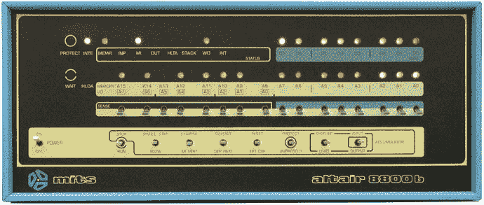
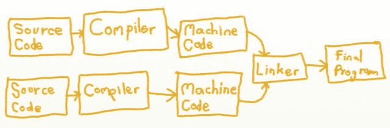
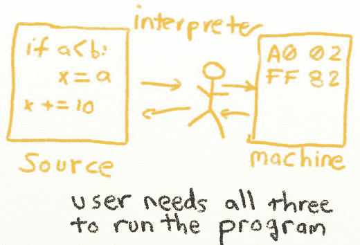

# 三、什么是计算机语言？

什么造就了计算机语言？为什么电脑会有？为什么有这么多不同的计算机语言？

做基本编程不需要理解这些问题的答案，就像开车不需要理解引擎如何工作一样。然而，要进步到一个更高的水平，它是。本章提供了一个简短的解释来帮助您开始。

## 编程简史

计算机是电子的，而且是数字化的。对计算机来说，一切都是用导线上没有电压或有电压来表示的。没有电压对电脑来说就是零，有电压就是一。如果没有多个 1 和 0 的组合，计算机实际上无法计算出比这更高的数。

在早期，开关被用来将 1 或 0 载入计算机内存。下图，[由维基共享资源](http://en.wikipedia.org/wiki/File:Altair_Computer_Front_Panel.jpg) ( [`http://en.wikipedia.org/wiki/File:Altair_Computer_Front_Panel.jpg`](http://en.wikipedia.org/wiki/File:Altair_Computer_Front_Panel.jpg) )提供，展示了一台牛郎星 8800。前面板开关用于加载程序。灯光显示了产量。没有监视器。

牛郎星 8800

每组开关代表一个数字。每一个数字都代表计算机要执行的数据或指令。这种只用 1 和 0 来表示数字的系统叫做二进制数字系统。这种类型的计算机语言被称为 1GL(第一代语言)。注意:没有一种语言叫做 1GL，它只是第一代语言的缩写。1GL 与机器的本地语言(机器语言)是一回事，其中数字代表程序的命令和数据。

二进制数通常以四个一组来表示。例如:

`1010 0010 0011`

数据和计算机指令都是以二进制存储的。机器语言是代表计算机解释的指令的二进制数。然而，并不是所有的二进制数据都是机器语言。文档、数据库和财务数字等数据也以二进制形式存储在计算机中。当然，这些数据不是由计算机运行的。

对通过开关输入程序的一个改进是十六进制代码的使用。大多数人使用的十进制数字是数字 0-9。十六进制使用数字 0–9 和 A–F 来表示一组四个交换机，或数字 0–15。请参见下表，了解二进制、十进制和十六进制之间的关系。

<colgroup><col> <col> <col></colgroup> 
| 二进制的 | 小数 | 十六进制的 |
| --- | --- | --- |
| Zero | Zero | Zero |
| one | one | one |
| Ten | Two | Two |
| Eleven | three | three |
| One hundred | four | four |
| One hundred and one | five | five |
| One hundred and ten | six | six |
| One hundred and eleven | seven | seven |
| One thousand | eight | eight |
| One thousand and one | nine | nine |
| One thousand and ten | Ten | A |
| One thousand and eleven | Eleven | B |
| One thousand one hundred | Twelve | C |
| One thousand one hundred and one | Thirteen | D |
| One thousand one hundred and ten | Fourteen | E |
| One thousand one hundred and eleven | Fifteen | F |
| 1 0000 | Sixteen | Ten |
| 1 0001 | Seventeen | Eleven |

为了使输入程序更容易，后来的计算机允许用户用汇编语言输入程序。每个命令都使用一个助记符，一个叫做编译器的程序会把助记符转换成代表命令的数字。汇编语言也被称为 2GL 语言，或第二代语言。

下图显示了一个示例汇编语言程序的一部分，也是由维基共享资源 ( [`http://en.wikipedia.org/wiki/File:Altair_Computer_Front_Panel.jpg`](http://en.wikipedia.org/wiki/File:Altair_Computer_Front_Panel.jpg) )提供的[。](http://en.wikipedia.org/wiki/File:Motorola_6800_Assembly_Language.png)

示例汇编语言

虽然这是一个进步，但它仍然不太容易编程。下一代语言允许更高层次的抽象。第一批第三代语言(COBOL、FORTRAN 和 LISP)更容易理解和编程。

第二代和第三代语言使用一种叫做编译器的程序。编译器把用户输入的程序(称为源代码)转换成机器代码。然后程序员运行机器代码。原始源代码没有运行。

如果一个程序中有几段源代码，可以用一个叫做链接器的程序把它们链接成一个程序。链接器在编译器生成的机器码上运行，生成最终程序。这个最终的程序就是用户运行的，不需要原始的源代码。

编译器和连接器

编译成机器语言的一个缺点是程序只适用于特定类型的机器。为 Windows 电脑编译的程序不能在苹果 Macintosh 电脑或 Linux 电脑上运行。

因为整个编译和链接步骤对新程序员来说可能很复杂，所以一些语言使用解释器来运行。这些程序查看源代码，并即时将其解释为机器语言指令。它还允许相同的程序在 Windows、Mac 和 Unix 计算机上运行，前提是每个平台都有可用的解释程序。

使用解释器的缺点是通过解释器操作比用机器的母语操作要慢。

解释者

Python 是解释型语言的一个例子。用 Python 开发比 C 容易，但 Python 运行速度较慢，必须有 Python 解释器才能工作。

像 Java 这样的语言使用一个系统，在这个系统中，程序被编译成运行在 Java 虚拟机(JVM)上的机器代码，而不是实际的机器。另一种流行的语言是 C#，这是一种运行在虚拟执行系统(VES)虚拟机上的公共语言基础设施(CLI)语言。对这些的全面讨论超出了本书的范围，但是请随意阅读。

今天有许多不同的计算机语言。因为计算机执行如此多类型的任务，所以已经开发了专门用于这些任务的不同语言。像 C 这样的语言适合于操作系统和小型嵌入式计算机。像 PHP 这样的其他语言专门用于创建网页。Python 是一种通用语言，其特点是易于使用。

Tiobe 公司在其每月更新的索引中记录了各种编程语言的流行程度。这是一个好主意，看看这里，以及像[骰子](http://www.dice.com/) ( [`http://www.dice.com/`](http://www.dice.com/) `)`)这样的就业安置板，以了解什么语言是流行的。

令人欣慰的是，几乎所有的语言都有相同的共同点，一旦一种语言被学会，同样的理论将适用于其他语言。

对于有趣的计算历史，我推荐看罗伯特·X·克林格利的《书呆子的胜利》,这是一个关于计算起源的三集系列。这些电影非常有趣，你的整个家庭都会喜欢。如果你对阅读比对视频更感兴趣，我也推荐《偶然的帝国》这本书。

那些视频之后会发生什么？他们甚至没有报道互联网的诞生！要了解更多，请查看罗伯特·克瑞格利的视频系列《书呆子 2.0.1》。

## 回顾

### 多项选择测验

Which of these is the best example of a binary number `101101`   `82`   `3FA`   `GAF`     Which of these is the best example of a decimal number? `101101`   `82`   `3FA`   `GAF`     Which of these is the best example of a hexadecimal number? `101101`   `82`   `3FA`   `GAF`     What is the decimal number equivalent to the binary number “100”? `1`   `2`   `3`   `4`   `8`   `None of the above`     What is source code? Runs source code directly, without compiling   The machine code the computer runs   Converts source code to machine code   The program the developer types into the computer   Links machine code together into one big program     What is machine code? Runs source code directly, without compiling   Converts source code to machine code   The native code the computer runs   The program the developer types into the computer   Links machine code together into one big program     What is a compiler? The machine code the computer runs   Converts source code to machine code   The program the developer types into the computer   Links machine code together into one big program   Runs source code directly, without compiling     What is an interpreter? Converts source code to machine code   Runs source code directly, without compiling   The program the developer types into the computer   The machine code the computer runs   Links machine code together into one big program     What is a linker? Links machine code together into one big program   Converts source code to machine code   The program the developer types into the computer   The machine code the computer runs   Runs source code directly, without compiling     What is a first generation language (1GL)? Assembly language   Language like Python or C that has logical structures   Machine language   A language built for a specific purpose     What is a second generation language (2GL)? Language like Python or C that has logical structures   Assembly language   Machine language   A language built for a specific purpose     What is a third generation language (3GL)? A language built for a specific purpose   Assembly language   Machine language   Language like Python or C that has logical structures    

### 简答工作表

Give an example of a binary number. (While a number such as 1 can be a binary, decimal, and hexadecimal number, try coming up with an example that better illustrates the differences between the different bases of numbers.)   Give an example of a decimal number.   Give an example of a hexadecimal number.   Convert the numbers 1, 10, 100, 1000, and 10000 from binary to decimal.   What is a compiler?   What is source code?   What is machine language? (Don’t just say binary. That’s not correct.)   What is a first generation language? (Don’t just say binary. That’s not correct.)   What is a second generation language?   What is a third generation language? (Explain, don’t just give one example.)   What is an interpreter and how does it differ from a compiler?   Search the Web and find some of the most popular programming languages. List the web site(s) you got the information from and what the languages are.   Look at the job boards and see what languages people are looking for. List the languages and the job board you looked at.   What is the difference between the syntax and semantics of a language?   Pick a piece of technology, other than a computer you use regularly. Briefly describe the hardware and software that run on it.  

### 锻炼

查看附录中本章附带的练习。