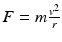

# 十、函数

使用函数有两个原因。首先，它们使代码更容易阅读和理解。其次，它们允许代码被多次使用。

想象一组绘制如下所示的树的代码。为此，程序员执行以下命令:

`pygame.draw.rect(screen, BROWN, [60, 400, 30, 45])`

`pygame.draw.polygon(screen, GREEN, [[150, 400], [75, 250], [0, 400]])`

`pygame.draw.polygon(screen, GREEN, [[140, 350], [75, 230], [10, 350]])`

简单树

这三行代码看起来并不像是在画一棵树！如果我们有多棵树或者复杂的物体，就很难理解正在画的是什么。

通过定义一个函数，我们可以使程序更容易阅读。要定义一个函数，首先使用`def`命令。在`def`命令之后是函数名。在这种情况下，我们称之为`draw_tree`。我们对函数名使用与变量名相同的规则。

函数名后面是一组括号和一个冒号。该函数的所有命令都将在内部缩进。请参见下面的示例:

`def draw_tree():`

`pygame.draw.rect(screen, BROWN, [60, 400, 30, 45])`

`pygame.draw.polygon(screen, GREEN, [[150, 400], [75, 250], [0, 400]])`

`pygame.draw.polygon(screen, GREEN, [[140, 350], [75, 230], [10, 350]])`

就其本身而言，这段代码不会导致树的绘制。它会告诉计算机如何做`draw_tree`。您必须调用函数来实际运行函数中的代码，并绘制树:

`draw_tree()`

有了定义要绘制的不同事物的整个函数库，最终的程序可能看起来像这样:

`draw_tree()`

`draw_house()`

`draw_car()`

`draw_killer_bunny()`

记住`draw_tree`有三行代码。这些命令中的每一个，像`draw_house`，都有多行代码。通过使用函数，我们可以重复命令，而不必重复其中包含的所有代码，从而使程序变得更小。

函数名非常重要。如果函数名是描述性的，那么即使非程序员也应该能够阅读一组代码并了解发生了什么。函数名遵循与变量名相同的规则，应该以小写字母开头。

## 函数参数

函数可以带参数。很有可能，你已经在数学课上用过参数了。在下面的球体体积公式中，函数 v 有一个参数:r，它代表半径。这个函数可以用来确定任何球体的体积，不管它的半径是多少。这些参数用于根据传递给函数的参数改变结果，从而增加函数的灵活性。

例如，我们名为`draw_tree()`的函数在一个特定的地方绘制树。但是该函数可以更改为接受一个指定在何处绘制树的参数。例如`draw_tree(screen, 0, 230)`将在(0，230)的(x，y)位置绘制树。

调整树的函数可能如下所示:

`def draw_tree(screen, x, y):`

`pygame.draw.rect(screen, BROWN, [60+x, 170+y, 30, 45])`

`pygame.draw.polygon(screen, GREEN, [[150+x,170+y],[75+x,20+y], [x,170+y]])`

`pygame.draw.polygon(screen, GREEN, [[140+x,120+y], [75+x,y], [10+x,120+y]])`

这将允许我们在任何我们喜欢的地方画多棵树:

`draw_tree(screen, 0, 230)`

`draw_tree(screen, 200, 230)`

`draw_tree(screen, 400, 230)`

这里有一个不同的函数，可以不使用图形运行。这个函数将计算并打印出一个球体的体积:

`def volume_sphere(radius):`

`pi = 3.141592653589`

`volume = (4 / 3) * pi * radius ** 3`

`print("The volume is", volume)`

参数是在调用函数时赋值的，而不是在定义函数时。

函数的名字是`volume_sphere`。进入函数的数据将存储在一个名为`radius`的新变量中。生成的体积被打印到屏幕上。`radius`变量在这里没有得到一个值。新程序员经常会感到困惑，因为在定义函数时，参数变量没有赋值，所以看起来不合法。当函数被调用时，参数被赋予一个值。

要调用此函数，请使用:

`volume_sphere(22)`

函数中的`radius`变量被创建并用值 22 初始化。一旦执行到达对该函数的调用，就运行该函数的代码。

如果我们需要传入多个值呢？可以向函数传递多个参数，每个参数用逗号分隔:

`def volume_cylinder(radius, height):`

`pi = 3.141592653589`

`volume = pi * radius ** 2 * height`

`print("The volume is", volume)`

该函数可以通过以下方式调用:

`volume_cylinder(12, 3)`

参数是按顺序做的，所以`radius`会得到 12，`height`会得到 3 的值。

## 返回和捕获值

不幸的是，这些示例函数是有限的。为什么？如果一个人想用`volume_cylinder`函数来计算六瓶装啤酒的体积，那是行不通的。它只打印出一个圆柱体的体积。不可能将一个气缸体积的函数结果用在一个等式中，然后乘以 6 来得到六个气缸的体积。

### 返回值

这可以通过使用一个`return`语句来解决。例如:

`# Add two numbers and return the results`

`def sum_two_numbers(a, b):`

`result = a + b`

`return result`

Return 不是函数，不使用括号。不要做`return(result)`。

这只让我们走了一半。因为如果我们现在调用这个函数，不会发生什么。数字相加。他们会回到我们身边。但我们对结果无动于衷。

`# This doesn’t do much, because we don’t capture the result`

`sum_two_numbers(22, 15)`

### 捕获返回值

我们需要捕捉结果。我们通过设置一个变量等于函数返回值来实现:

`# Store the function’s result into a variable`

`my_result = sum_two_numbers(22, 15)`

`print(my_result)`

现在结果没有丢失。它存储在`my_result`中，我们可以打印或使用其他方式。

### 改进 volume_cylinder 示例

`def volume_cylinder(radius, height):`

`pi = 3.141592653589`

`volume = pi * radius ** 2 * height`

`return volume`

因为有了`return`，这个函数可以在以后作为方程式的一部分来计算六个装的体积，如下所示:

`six_pack_volume = volume_cylinder(2.5, 5) * 6`

从`volume_cylinder`返回的值进入等式并乘以 6。

打印值的函数和返回值的函数有很大的区别。看看下面的代码，并尝试一下。

`# Function that prints the result`

`def sum_print(a, b):`

`result = a + b`

`print(result)`

`# Function that returns the results`

`def sum_return(a, b):`

`result = a + b`

`return result`

`# This prints the sum of 4+4`

`sum_print(4, 4)`

`# This does not`

`sum_return(4, 4)`

`# This will not set x1 to the sum`

`# It actually gets a value of ’None’`

`x1 = sum_print(4, 4)`

`# This will`

`x2 = sum_return(4, 4)`

第一次使用函数时，看到这样的代码并不罕见:

`def calculate_average(a, b):`

`""" Calculate an average of two numbers """`

`result = (a * b) / 2`

`return result`

`# Pretend you have some code here`

`x = 45`

`y = 56`

`# Wait, how do I print the result of this?`

`calculate_average(x, y)`

我们如何打印`calculate_average`的结果？程序不能打印出`result`,因为这个变量只存在于函数内部。相反，使用变量来获取结果:

`def calculate_average(a, b):`

`""" Calculate an average of two numbers """`

`result = (a * b) / 2`

`return result`

`# Pretend you have some code here`

`x = 45`

`y =` `56`

`average = calculate_average(x, y)`

`print(average)`

## 记录函数

Python 中的函数通常有一个注释作为函数的第一条语句。这个注释用三个双引号分隔，称为 docstring。一个函数可能看起来像:

`def volume_cylinder(radius, height):`

`"""Returns volume of a cylinder given radius, height."""`

`pi = 3.141592653589`

`volume = pi * radius ** 2 * height`

`return volume`

在函数中使用文档字符串的好处在于，可以使用 [`http://sphinx-doc.org/`](http://sphinx-doc.org/) 这样的工具将注释提取出来并放到记录代码的网站上。大多数语言都有类似的工具，可以帮助您轻松编写代码。当您开始处理更大的程序时，这可以节省大量时间。

## 变量作用域

函数的使用引入了作用域的概念。作用域是指代码中变量处于活动状态并且可以被访问的地方。例如，看看下面的代码:

`# Define a simple function that sets`

`# x equal to 22`

`def f():`

`x = 22`

`# Call the function`

`f()`

`# This fails, x only exists in f()`

`print(x)`

最后一行会产生一个错误，因为 x 只存在于`f()`函数内部。这个变量是在调用`f()`时创建的，一旦`f()`结束，它所使用的内存就会被释放。

这就是事情变得复杂的地方。

一个更令人困惑的规则是访问在`f()`函数之外创建的变量。在下面的代码中，`x`是在`f()`函数之前创建的，因此可以从`f()`函数内部读取。

`# Create the x variable and set to 44`

`x = 44`

`# Define a simple function that prints x`

`def f():`

`print(x)`

`# Call the function`

`f()`

只有在函数不改变值的情况下，才可以在函数内部读取在函数之前创建的变量。这段代码与上面的代码非常相似，将会失败。计算机会声称它不知道`x`是什么。

`# Create the x variable and set to 44`

`x = 44`

`# Define a simple function that prints x`

`def f():`

`x += 1`

`print(x)`

`# Call the function`

`f()`

与 Python 相比，其他语言在变量和范围的创建方面有更复杂的规则。因为 Python 简单明了，所以它是一种很好的入门语言。

## 传递副本

函数通过创建原始函数的副本来传递它们的值。例如:

`# Define a simple function that prints x`

`def f(x):`

`x += 1`

`print(x)`

`# Set y`

`y = 10`

`# Call the function`

`f(y)`

`# Print y to see if it changed`

`print(y)`

即使`f()`函数增加了传递给它的值，`y`的值也不会改变。函数中作为参数列出的每个变量都是一个全新的变量。该变量的值是从调用它的地方复制的。

这在前面的例子中相当简单。令人困惑的是，调用函数的代码和函数本身是否有同名的变量。下面的代码与前面的清单相同，但是它没有使用`y`，而是使用了`x`。

`# Define a simple function that prints x`

`def f(x):`

`x += 1`

`print(x)`

`# Set x`

`x = 10`

`# Call the function`

`f(x)`

`# Print x to see if it changed`

`print(x)`

输出与使用`y`的程序相同。尽管函数和周围的代码都使用`x`作为变量名，但实际上有两个不同的变量。一个变量`x`存在于函数内部，另一个变量`x`存在于函数外部。

## 函数调用函数

一个函数调用另一个函数是完全可能的。例如，假设定义了如下函数:

`def arm_out(which_arm, palm_up_or_down):`

`# code would go here`

`def hand_grab(hand, arm):`

`# code goes here`

然后可以创建另一个函数来调用其他函数:

`def macarena():`

`arm_out("right", "down")`

`arm_out("left", "down")`

`arm_out("right", "up")`

`arm_out("left", "up")`

`hand_grab("right", "left arm")`

`hand_grab("left", "right arm")`

`# etc`

## 主要函数和全局

全局变量纯粹是邪恶的。

随着程序变得越来越大，保持代码的组织性和函数性是很重要的。Python 允许我们在“缩进级别 0”编写代码这描述了我们到目前为止编写的大部分代码。我们的代码排在左边，不包含在函数中。

这种哲学就像把你的衣服堆在地板中间，或者把你所有的工具堆在工作台上。只有当你没有太多东西的时候，它才起作用。即使你没有太多的东西，它仍然是凌乱的。

你所有的代码和变量都应该放在函数中。这将使你的代码有条理。当你需要追踪程序中的错误时，它也会有所帮助。在“缩进级别 0”创建的变量称为全局变量。全局变量是一件非常糟糕的事情。为什么呢？因为任何地方的任何一段代码都可以改变它们的值。如果你有一个 50，000 行的程序，每一行代码都可以改变全局变量。相反，如果您将变量保存在函数中，那么只有函数中的代码可以更改变量。因此，如果变量中有一个意外值，您只需要查看函数中大约 50 行代码。否则你必须检查整个程序中的每一行代码！

用 Python 编写程序的一个更好的方法是遵循以下模式:

`def main():`

`print("Hello world.")`

`main()`

在这种情况下，我通常在缩进级别 0 运行的所有代码都放在了`main`函数中。文件的最后一行调用`main`。

但是等等！我们还需要解决另一个问题。在第 15 章中，我们将讨论如何把我们的程序分成多个文件。我们可以使用`import`命令从我们创建的其他模块中引入函数。如果我们在这个模块上使用`import`命令，它会自动开始运行`main`函数。我们不想那样。我们希望导入它的程序控制函数何时被调用。

为了解决这个问题，我们可以让我们的程序检查一个由 Python 自动定义的全局变量。(我知道，我刚才说全局变量不好，对吧？)那个变量叫做`__name__`，前后有两个下划线。我们可以检查它，看看这段代码是否正在被导入或运行。如果代码正在运行，Python 会自动将该变量的值设置为`__main__`。通过使用`if`语句，我们将只在代码运行时调用`main`函数。否则代码将只定义`main`函数。导入它的代码可以在需要时调用该函数。

所有 Python 代码都应该这样运行:

`def main():`

`print("Hello world.")`

`if __name__ == "__main__":`

`main()`

我喜欢将 Python 作为第一语言的原因之一是，除非你需要，否则不需要使用这种复杂性。其他语言，比如 Java，不管你的程序有多小，都需要它。

为了使本书更简单，我们没有使用这种模式展示我们的例子。但是在这本书之后，你的程序可能会变得足够复杂，如果你不“把你所有的衣服都扔进一堆”，生活会变得更容易。

如果你对编程非常感兴趣，试着从现在开始用这种方式编写你的程序。虽然开始时可能会有一点挑战，但它会使以后编写程序变得更容易。这也是了解如何正确管理数据及其范围的好方法。

这里有一个例子，展示了如何使用这个模式来做基本的 pygame 模板:`programarcadegames.com/python_examples/f.php?file=pygame_base_template_proper.py`

不需要使用这个模板。如果你把衣服堆在地板中间，我一会儿没问题。我很高兴你穿着衣服。(对于爱整洁的人来说，当我们读到 Python 类这一章时，我们可以更清楚地理解这个程序。)

## 简短的例子

对于下面的每一个例子，想想会打印出什么。检查一下你是否正确。如果你没有猜对，花时间去理解为什么。

`# Example 1`

`def a():`

`print("A")`

`def b():`

`print("B")`

`def c():`

`print("C")`

`a()`

`# Example 2`

`def a():`

`b()`

`print("A")`

`def b():`

`c()`

`print("B")`

`def c():`

`print("C")`

`a()`

`# Example 3`

`def a():`

`print("A")`

`b()`

`def b():`

`print("B")`

`c()`

`def c():`

`print("C")`

`a()`

`# Example 4`

`def a():`

`print("A start")`

`b()`

`print("A end")`

`def b():`

`print("B start")`

`c()`

`print("B end")`

`def c():`

`print("C start and end")`

`a()`

`# Example 5`

`def a(x):`

`print("A start, x =",x)`

`b(x + 1)`

`print("A end, x =",x)`

`def b(x):`

`print("B start, x =",x)`

`c(x + 1)`

`print("B end, x =",x)`

`def c(x):`

`print("C start and end, x =",x)`

`a(5)`

`# Example 6`

`def a(x):`

`x = x + 1`

`x = 3`

`a(x)`

`print(x)`

`# Example 7`

`def a(x):`

`x = x + 1`

`return x`

`x = 3`

`a(x)`

`print(x)`

`# Example 8`

`def a(x):`

`x = x + 1`

`return x`

`x = 3`

`x = a(x)`

`print(x)`

`# Example 9`

`def a(x, y):`

`x = x + 1`

`y = y + 1`

`print(x, y)`

`x = 10`

`y = 20`

`a(y, x)`

`# Example 10`

`def a(x, y):`

`x = x + 1`

`y = y + 1`

`return x`

`return y`

`x = 10`

`y = 20`

`z = a(x, y)`

`print(z)`

`# Example 11`

`def a(x, y):`

`x = x + 1`

`y = y + 1`

`return x, y`

`x = 10`

`y = 20`

`z = a(x, y)`

`print(z)`

`# Example 12`

`def a(x, y):`

`x = x + 1`

`y = y + 1`

`return x, y`

`x = 10`

`y = 20`

`x2, y2 = a(x, y) # Most computer languages don’t support this`

`print(x2)`

`print(y2)`

`# Example 13`

`def a(my_data):`

`print("function a, my_data =  ", my_data)`

`my_data = 20`

`print("function a, my_data =  ", my_data)`

`my_data = 10`

`print("global scope, my_data =", my_data)`

`a(my_data)`

`print("global scope, my_data =", my_data)`

`# Example 14`

`def a(my_list):`

`print("function a, list =  ", my_list)`

`my_list = [10, 20, 30]`

`print("function a, list =  ", my_list)`

`my_list = [5, 2, 4]`

`print("global scope, list =", my_list)`

`a(my_list)`

`print("global scope, list =", my_list)`

`# Example 15`

`# New concept!`

`# Covered in more detail in Chapter`[`13`T3】](13.html)

`def a(my_list):`

`print("function a, list =  ", my_list)`

`my_list[0] = 1000`

`print("function a, list =  ", my_list)`

`my_list = [5, 2, 4]`

`print("global scope, list =", my_list)`

`a(my_list)`

`print("global scope, list =", my_list)`

## 泥球游戏示例

`"""`

`This is a sample text-only game that demonstrates the use of functions.`

`The game is called "Mudball" and the players take turns lobbing mudballs`

`at each other until someone gets hit.`

`"""`

`import math`

`import random`

`def print_instructions():`

`""" This function prints the instructions. """`

`# You can use the triple-quote string in a print statement to`

`# print multiple lines.`

`print("""`

`Welcome to Mudball! The idea is to hit the other player with a mudball.`

`Enter your angle (in degrees) and the amount of PSI to charge your gun`

`with.`

`""")`

`def calculate_distance(psi, angle_in_degrees):`

`""" Calculate the distance the mudball flies. """`

`angle_in_radians = math.radians(angle_in_degrees)`

`distance = .5 * psi ** 2 * math.sin(angle_in_radians) * math.cos(angle_in_radians)`

`return distance`

`def get_user_input(name):`

`""" Get the user input for psi and angle. Return as a list of two`

`numbers. """`

`# Later on in the ’exceptions’ chapter, we will learn how to modify`

`# this code to not crash the game if the user types in something that`

`# isn’t a valid number.`

`psi = float(input(name + " charge the gun with how many psi? "))`

`angle = float(input(name + " move the gun at what angle? "))`

`return psi, angle`

`def get_player_names():`

`""" Get a list of names from the players. """`

`print("Enter player names. Enter as many players as you like.")`

`done = False`

`players = []`

`while not done:`

`player = input("Enter player (hit enter to quit): ")`

`if len(player) > 0:`

`players.append(player)`

`else:`

`done = True`

`print()`

`return players`

`def process_player_turn(player_name, distance_apart):`

`""" The code runs the turn for each player.`

`If it returns False, keep going with the game.`

`If it returns True, someone has won, so stop. """`

`psi, angle = get_user_input(player_name)`

`distance_mudball = calculate_distance(psi, angle)`

`difference = distance_mudball - distance_apart`

`# By looking ahead to the chapter on print formatting, these`

`# lines could be made to print the numbers is a nice formatted`

`# manner.`

`if difference > 1:`

`print("You went", difference, "yards too far!")`

`elif difference < -1:`

`print("You were", difference * -1, "yards too short!")`

`else:`

`print("Hit!", player_name, "wins!")`

`return True`

`print()`

`return False`

`def main():`

`""" Main program. """`

`# Get the game started.`

`print_instructions()`

`player_names = get_player_names()`

`distance_apart = random.randrange(50, 150)`

`# Keep looking until someone wins`

`done = False`

`while not done:`

`# Loop for each player`

`for player_name in player_names:`

`# Process their turn`

`done = process_player_turn(player_name, distance_apart)`

`# If someone won, ’break’ out of this loop and end the game.`

`if done:`

`break`

`if __name__ == "__main__":`

`main()`

## 回顾

### 多项选择测验

What does this code print? `def f():`     `print("f")` `def g():`     `print("g")` `print("a")` `f`   `a`   `g`   `f` `g` `a`   `a` `f` `g`     What does this code print? `def f():`     `print("f")` `def g():`     `print("g")` `g()` `print("a")` `f()` `f`   `a`   `g`   `g` `a` `f`   `f` `g` `a`   `a` `f` `g`     What does this code print? `def f(a):`     `print(a)` `a = 5` `f(a + 1)` `0`   `5`   Nothing   `6`   `a+1`   `a`     What does this code print? `def f(a, b):`     `print(a)`     `print(b)` `a = 1` `b = 2` `f(b, a)` `1` `2`   `2` `1`   `a` `b`   `b` `a`     What does this code print? `def f(a):`     `return a + 1` `b = f(5)` `print(b)` `5`   `6`   `a+1`   `b`   `a`     What is wrong with this code? `def sum_list(list):`     `sum = 0`     `for item in list:`         `sum + = item`         `return sum` `list=[45, 2, 10, -5, 100]` `print(sum_list(list))` The return statement should print the sum instead.   The return statement should be unindented one tab stop.   The return statement should be unindented two tab stops.   The variable `i` should be used instead of `item`.   The `sum_list` function may not be placed inside the `print` statement.     What will this print? `a = 3` `def f():`     `print(a)` `f()` `f`   `3`   Nothing   An error, `a` is undefined.     What will this print? `a = 3` `def f():`         `a = a + 1`     `print(a)` `f()` `f`   `4`   Nothing   An error, `a` is undefined.     What will this print? `def f(a):`     `return a + 1` `print( f( f(5) ) )` `5`   `6`   `7`   An error.     What will this print? `def foo():`     `x = 3`     `print("foo has been called")` `x = 10` `print("x=", x)` `foo()` `print("x=", x)` `x= 10` `foo has been called` `x= 10`   `x= 3` `foo has been called` `x= 10`   `x= 10` `foo has been called` `x= 3`   An error.    

### 简答工作表

对于下面的代码，写一个关于它将输出什么的预测。然后运行代码并声明您的预测是否准确。如果你的预测不正确，确保你明白为什么。

Block 1 (Remember, guess AND actual.) `for i in range(5):`     `print(i + 1)`   Block 2 `for i in range(5):`     `print(i)`     `i = i + 1`   Block 3 `x = 0` `for i in range(5):`     `x += 1` `print(x)`   Block 4 `x = 0` `for i in range(5):`     `for j in range(5):`         `x += 1` `print(x)`   Block 5 `for i in range(5):`     `for j in range(5):`         `print(i, j)`   Block 6 `for i in range(5):`     `for j in range(5):`         `print("*", end="")`         `print()`   Block 7 `for i in range(5):`     `for j in range(5):`         `print("*", end="")`     `print()`   Block 8 `for i in range(5):`     `for j in range(5):`         `print("*", end="")` `print()`   Block 9 `# This is supposed to sum a list of numbers` `# What is the mistake here?` `my_list = [5, 8, 10, 4, 5]` `i = 0` `for i in my_list:`     `i = i + my_list[i]` `print(i)`   Block 10 `for i in range(5):`     `x = 0`     `for j in range(5):`         `x += 1` `print(x)`   Block 11 `import random` `play_again = "y"` `while play_again == "y":`     `for i in range(5):`         `print(random.randrange(2), end="")`     `print()`     `play_again = input("Play again? ")` `print("Bye!")`   Block 12 `def f1(x):`     `print(x)` `y = 3` `f1(y)`   Block 13 `def f2(x):`     `x = x + 1`     `print(x)` `y = 3` `f2(y)` `print(y)`   Block 14 `def f3(x):`     `x = x + 1`     `print(x)` `x = 3` `f3(x)` `print(x)`   Block 15 `def f4(x):`     `z = x + 1`     `print(z)` `x = 3` `f4(x)` `print(z)`   Block 16 `def foo(x):`     `x = x + 1`     `print("x=", x)` `x = 10` `print("x=", x)` `foo(x)` `print("x=", x)`   Block 17 `def f():`     `print("f start")`     `g()`     `h()`     `print("f end")` `def g():`     `print("g start")`     `h()`     `print("g end")` `def h():`     `print("h")` `f()`   Block 18 `def foo():`     `x = 3`     `print("foo has been called")` `x = 10` `print("x=", x)` `foo()` `print("x=", x)`   Block 19 (This demonstrates a new concept that won’t be fully explained until [Chapter 13](13.html).) `def a(x):`     `print("a", x)`     `x = x + 1`     `print("a", x)` `x = 1` `print("main", x)` `a(x)` `print("main", x)` `def b(y):`     `print("b", y[1])`     `y[1] = y[1] + 1`     `print("b", y[1])` `y=[123, 5]` `print("main", y[1])` `b(y)` `print("main", y[1])` `def c(y):`     `print("c", y[1])`     `y = [101, 102]`     `print("c", y[1])` `y = [123, 5]` `print("main", y[1])` `c(y)` `print("main", y[1])`  

### 校正码

下一节涉及到查找代码中的错误。如果你找不到错误，可以查看在线视频，寻找答案和错误的解释。

Correct the following code: (Don’t let it print out the word “None.”) `def sum(a, b, c):`     `print(a + b + c)` `print(sum(10, 11, 12))`   Correct the following code: (`x` should increase by one, but it doesn’t.) `def increase(x):`     `return x + 1` `x = 10` `print("X is", x, " I will now increase x." )` `increase(x)` `print("X is now", x)`   Correct the following code: `def print_hello:`     `print("Hello")` `print_hello()`   Correct the following code: `def count_to_ten():`     `for i in range[10]:`         `print(i)` `count_to_ten()`   Correct the following code: `def sum_list(list):`     `for i in list:`         `sum = i`         `return sum` `list = [45, 2, 10, -5, 100]` `print(sum_list(list))`   Correct the following code: (This almost reverses the string. What is wrong?) `def reverse(text):`     `result = ""`     `text_length = len(text)`     `for i in range(text_length):`         `result = result + text[i * -1]`     `return result` `text = "Programming is the coolest thing ever."` `print(reverse(text))`   Correct the following code: `def get_user_choice():`     `while True:`         `command = input("Command: ")`         `if command = f or command = m or command = s or command = d or command = q:`             `return command`         `print("Hey, that’s not a command. Here are your options:" )`         `print("f - Full speed ahead")`         `print("m - Moderate speed")`         `print("s - Status")`         `print("d - Drink")`         `print("q - Quit")` `user_command = get_user_choice()` `print("You entered:", user_command)`  

对于此部分，编写满足以下各项的代码:

Write a function that prints out “Hello World.”   Write code that will call the function in the prior problem.   Write a function that prints out “Hello Bob” and will take a parameter to let the caller specify the name. Do not put an `input` statement inside the function! Use a parameter.   Write code that will call the function in the prior problem.   Write a function that will take two numbers as parameters (not as input from the user) and print their product (i.e., multiply them).   Write code that will call the prior function.   Write a function that takes in two parameters. The first parameter will be a string named `phrase`. The second parameter will be a number named `count`. Print `phrase` to the screen `count` times. (e.g., the function takes in "Hello" and 5 then prints "Hello" five times.)   Write code to call the previous function.   Write code for a function that takes in a number and returns the square of that number. (I’m not asking for the square root but the number squared.) Note, this function should RETURN the answer, not print it out.   Write code to call the function above and print the output.   Write a function that takes three numbers as parameters and returns the centrifugal force. The formula for centrifugal force is:  F is force, m is mass, r is radius, and v is angular velocity.   Write code to call the function above and display the result.   Write a function that takes a list of numbers as a parameter and prints out each number individually using a `for` loop.  

### 锻炼

查看附录，了解本章附带的练习“函数”。