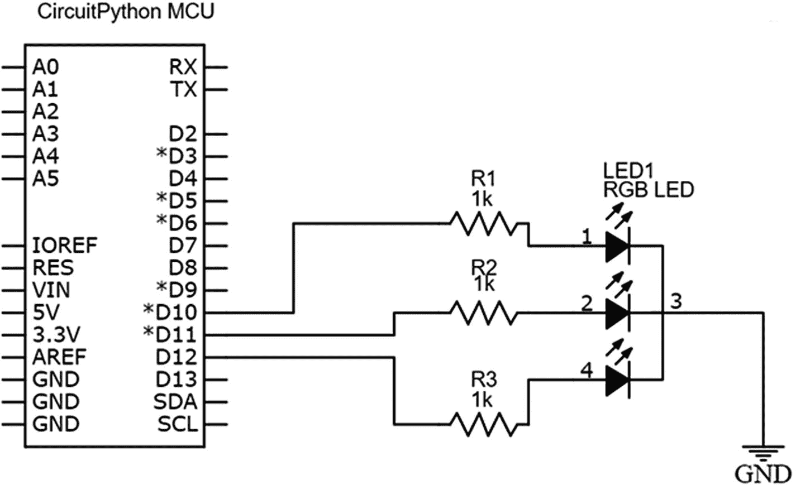
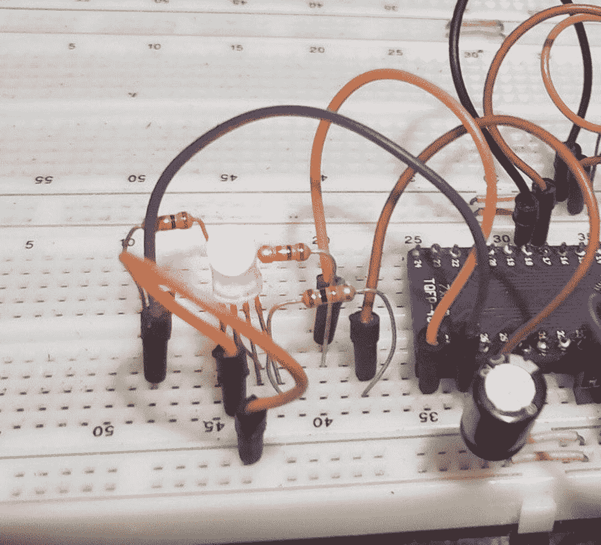
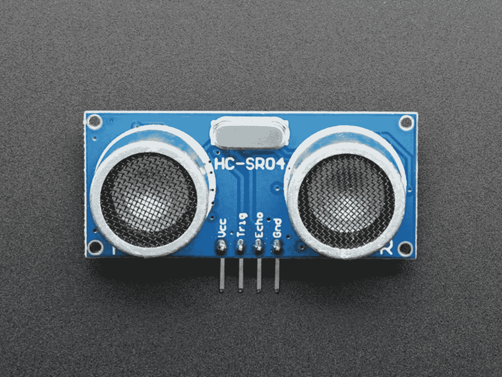
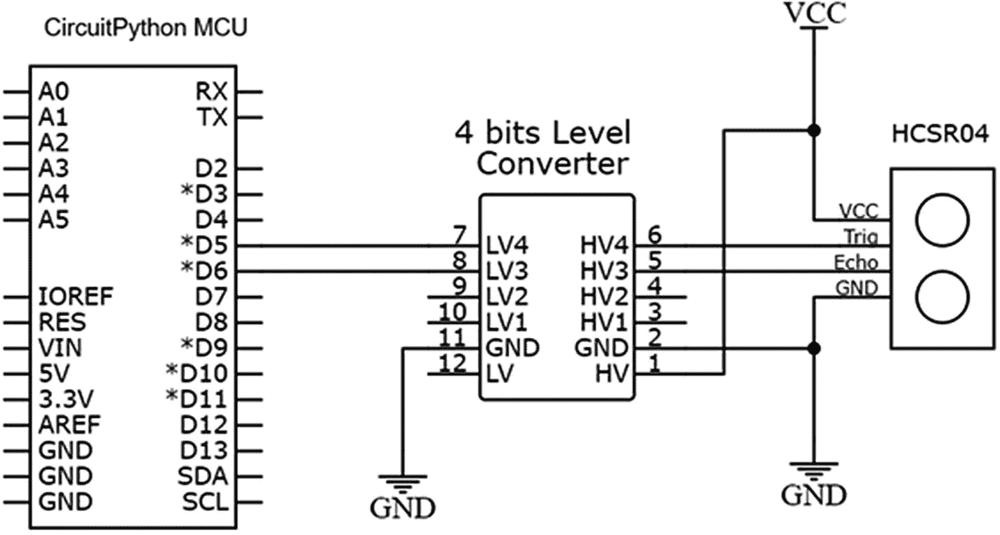
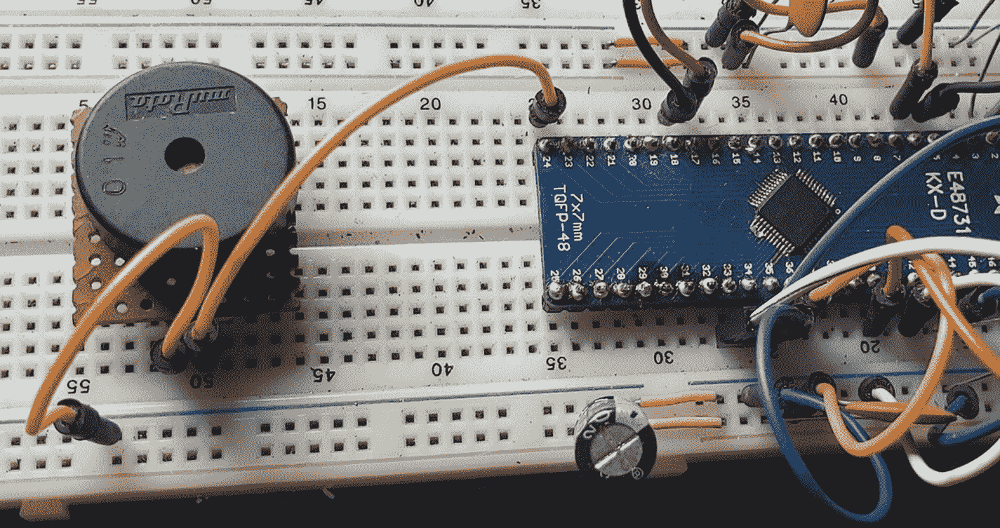
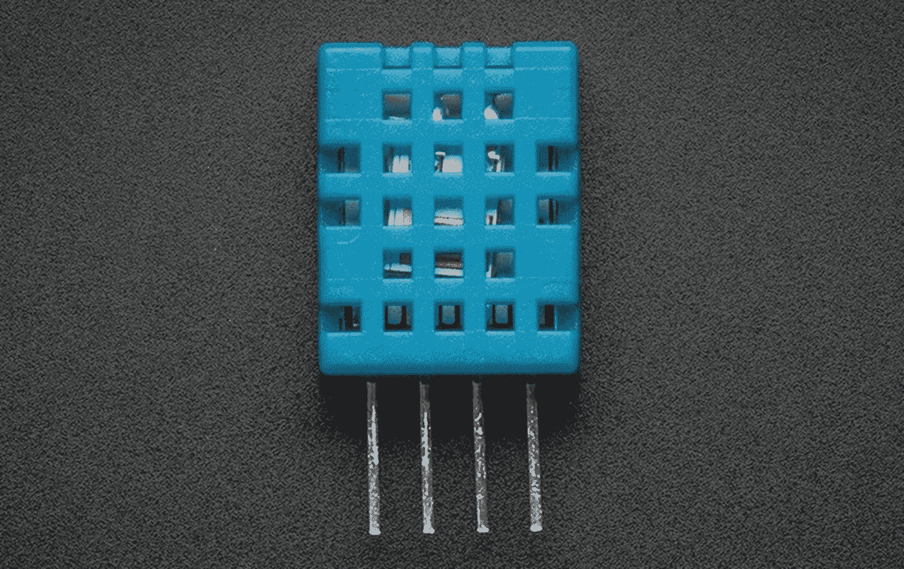
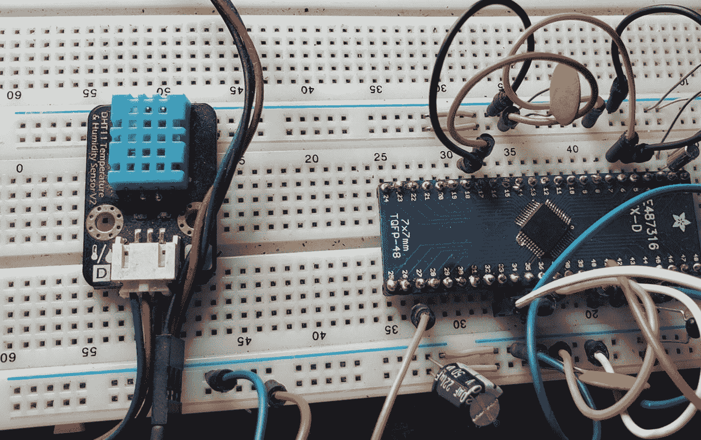

# 十、Python MCU 接口

恭喜你！如果到目前为止，您已经掌握了使用微控制器和 Python 所需的基础知识。我们已经走了很长的路，但我们还没有完成。在本章中，我们将了解如何使用运行 CircuitPython 的微控制器与一些常见传感器接口。传感器接口的主题可以涵盖整个体积。然而，当您继续构建自己的项目时，可能会用到一些传感器；在这一章中，我们将介绍您可能希望在项目中使用的传感器。

## RGB LED 指示灯

如果你认为发光二极管很棒，那么我有一个传感器会让你大吃一惊。有时，你不能决定在你的项目中使用的 LED 灯的颜色。在这种情况下，我们需要使用一个封装中包含三个 LED 的 LED。这是红色、绿色和蓝色或 RGB LED。RGB LED 如图 [10-1](#Fig1) 所示。


图 10-1

RGB LED 认证:Adafruit.com ada fruit

正如我们在显示器一章中所学的，使用红色、绿色和蓝色，我们将能够产生任何颜色的光。RGB LEDs 在同一个封装中有一个红色、一个绿色和一个蓝色 LED。使用 RGB LEDs，我们将能够生产出我们能想到的几乎任何颜色的 LED。这使得它们非常适用于指示器之类的东西。我们可以用一个 LED 来改变它的颜色，而不是用多个 LED 来传递信息。

RGB LED 具有四个引脚，并且 LED 可以是公共阳极或公共阴极。如果我们观察 RGB LED，我们会发现一个引脚比其他引脚长。这个长针可以连接到我们电源的阳极或阴极。

## RGB LED 和 MCU 原理图

我们如图 [10-2](#Fig2) 所示连接电路。我们的 RGB LED 连接到引脚 D10、D11 和 D12。该原理图假设使用公共阴极 RGB LED。如果你使用一个普通的阳极 LED，最长的管脚将连接到 VCC 而不是地。



图 10-2

RGB LED 和 MCU 原理图

请注意我们是如何使用三个电阻的，因为封装中的每个 LED 仍必须被视为一个单独的器件。

## RGB LED 电路连接提示

以下是连接电路的推荐步骤:

1.  根据您的版本，将 RGB LED 的长公共引脚连接到 VCC 或地。

2.  使用 1k 电阻将其余三个短引脚分别连接到引脚 D10、D11 和 D12。

当你完成连接你的电路时，它看起来应该如图 [10-3](#Fig3) 所示。



图 10-3

试验板上带 MCU 的 RGB LED

## 我们需要的图书馆

这些是我们需要添加到 lib 文件夹中的库:

*   adafruit_rgbled 函数

*   简单的

## RGB LED 与 CircuitPython 程序

然后我们可以在 Mu 编辑器中打开我们的 code.py 文件，这样它就类似于清单 [10-1](#PC1) 。

```py
# import board library
import board

# import time library
import time

# import library for RGB led
(1) import adafruit_rgbled

# setup pin constants
(2) RED_LED = board.D10
GREEN_LED = board.D11
BLUE_LED = board.D12

# create a RGB LED object

# invert pwm = false if common cathode
#              true common anode
(3) rgbLed = adafruit_rgbled.RGBLED(RED_LED, GREEN_LED, BLUE_LED, invert_pwm=False)

(4) while True:
    # turn on red
    rgbLed.color = (128, 0, 0)
    time.sleep(1)

    # turn on green
    rgbLed.color = (0, 128, 0)
    time.sleep(1)

    # turn on blue
    rgbLed.color = (0, 0, 128)
    time.sleep(1)

    # mix 1
    rgbLed.color = (100, 0, 204)
    time.sleep(1)

    # mix 2
    rgbLed.color = (90, 20, 0)
    time.sleep(1)

Listing 10-1MCU with RGB LED Program

```

我们导入模块来设置我们的开发板以供使用。在(1)中，我们导入了 adafruit_rgbled 库，这将允许我们控制 led。完成这些后，在(2)中，我们为代表每个 LED 的引脚设置常数。完成后，我们在(3)处创建一个 RGB LED 对象。在我们的主循环(4)中，这个对象用于我们一次打开一个单独的 LED，红色，然后绿色，然后蓝色各一秒钟。然后我们练习混合颜色值。

## HC-SR04 战斗机

有时候，无论什么原因，你都需要测量距离。例如，如果你正在建造一个基于微控制器的移动机器人，你将需要能够控制机器人行驶的方向。使用一个传感器，测量机器人与我们使用的物体之间的距离，我们可以创造一个半智能机器人。我们有两种方法可以测量距离，那就是利用光和声音。使用光是困难的，因为它会受到环境中环境光的干扰。有弹性光传感器，如基于激光雷达的传感器；然而，将它们集成到项目中是很昂贵的。一个不错的低成本解决方案是使用声音。最常用的声音传感器是 HC-SR04 传感器，它使用超声波来测量距离。该传感器如图 [10-4](#Fig4) 所示。



图 10-4

HC-SR04 超声波传感器:adafruit.com ada fruit

该传感器有四个引脚，分别是 VCC、GND、触发引脚和回波引脚。该装置有两个超声波传感器。其中一个传感器发射超声波脉冲，另一个设备监听发射的脉冲。该传感器可以测量从 2 厘米到 400 厘米的距离。

传感器的工作原理是，触发针(Trig)用于从其中一个传感器传输脉冲。当接收到反射信号时，echo 引脚变为高电平。根据设备在接收(回波)引脚上检测到信号所需的时间长度，我们可以确定被测物体的距离。

## HC-SR04，带 MCU 原理图

电路连接如图 [10-5](#Fig5) 所示。由于 HC-SR04 是一个 5 伏器件，我们需要使用一个逻辑电平转换器将其与我们的 CircuitPython MCU 接口。trigger 引脚通过逻辑电平转换器连接到 MCU 的 D5 引脚，echo 引脚通过逻辑电平转换器连接到 MCU 的 D6 引脚。



图 10-5

带 MCU 原理图的温度传感器

## HC-SR04 电路连接提示

以下是连接电路的推荐步骤:

1.  将 HC-SR04 传感器的 VCC 引脚连接到正极供电轨。

2.  将传感器的接地引脚接地。

3.  将 HC-SR04 的 Trig 引脚连接到 HV4，将 echo 引脚连接到 HV3。

4.  将逻辑电平转换器的 LV4 引脚连接到微控制器的 D5 引脚，LV3 引脚连接到微控制器的 D6 引脚。

5.  将逻辑电平转换器的 GND 引脚连接到试验板的负供电轨。

当你完成电路连接时，它应该看起来如图 [10-6](#Fig6) 所示。


图 10-6

试验板上带 MCU 的 HC-SR04

## 我们需要的图书馆

这些是我们需要添加到 lib 文件夹中的库:

*   开源软件国际化之简体中文组

## HC-SR04 带 CircuitPython 程序

在管理单元编辑器中编辑您的 code.py，使其类似于清单 [10-2](#PC2) 。这个例子由 Adafruit Industries 提供的用于读取传感器的例子修改而来。

```py
# import time library
import time

# import board library
import board

# import HCSR04 sensor
(1) import adafruit_hcsr04

# create instance of our HCSR04 object
(2) sonar = adafruit_hcsr04.HCSR04(trigger_pin=board.D5, echo_pin=board.D6)

# super loop
(3) while True:
    # try to get the distance
    try:
        print((sonar.distance,))

    # else tell us it failed
    except RuntimeError:
        print("Fail!")

    # wait 0.1s
    time.sleep(0.1)

Listing 10-2MCU with Temperature Sensor Program

```

在程序中，我们执行通常的导入，在(1)中，我们导入了允许我们使用 HC-SR04 传感器的库。在(2)中，我们创建了一个可以操作的 HCSR04 对象的实例，位于 D5 和 D6 引脚上。在主超级循环中的(3)处，我们有一个 try catch 语句，用于尝试读取传感器，如果失败，我们会告诉用户发生了错误。我们在图 [10-7](#Fig7) 中看到串行控制台的输出。


图 10-7

HC-SR04 传感器输出

当我们把手靠近传感器时，距离读数变小，当我们把手拿开时，我们观察到距离读数变大。

## 压电扬声器

如果你曾经使用过微波炉或自动取款机，你一定会听到这些设备发出的电子哔哔声。有时，当我们需要提醒用户一些事情时，我们不仅可以使用 led 发出的光，还可以使用声音。产生声音的经典方法是使用压电扬声器，也称为压电蜂鸣器或压电扬声器。一个这样的扬声器如图 [10-8](#Fig8) 所示。


图 10-8

压电扬声器鸣谢:adafruit.com Adafruit

压电扬声器由一个微小的金属板组成，我们称之为压电元件。当我们向压电元件施加方波时，它就会振动，并产生可听见的声音。我们可以利用这种效应创建一个程序，允许我们向设备发送不同频率的波，以创建不同的声音。

## 带 MCU 的压电原理图

我们如图 [10-9](#Fig9) 所示连接电路。压电扬声器有两个引脚。我们将压电片上的正极引脚连接到 D5 引脚，另一引脚接地。压电的正极引脚通常在蜂鸣器上写有一个小的“+”号。


图 10-9

带 MCU 原理图的温度传感器

## 压电电路连接提示

以下是连接电路的推荐步骤:

1.  将压电扬声器的接地引脚接地。

2.  将压电的正极引脚连接到引脚 D5。

当你完成电路连接时，它应该看起来如图 [10-10](#Fig10) 所示。



图 10-10

试验板上集成 MCU 的压电传感器

## 我们需要的图书馆

这些是我们需要添加到 lib 文件夹中的库:

*   简单的

## Piezo 和 CircuitPython 程序

在管理单元编辑器中编辑您的 code.py，使其类似于清单 [10-3](#PC3) 。这个例子是由 Adafruit Industries 提供的用于创建声音的例子修改而来的。

```py
# import board
import board

# import simple io library
import simpleio

# Define pin connected to piezo buzzer.
(1) PIEZO_PIN = board.D5

# Define a list of tones/music notes to play.
(2) TONE_FREQ = [ 262,  # C4
              294,  # D4
              330,  # E4
              349,  # F4
              392,  # G4
              440,  # A4
              494 ] # B4

# super loop

(3) while True:
    # Play tones going from start to end of list.
    for i in range(len(TONE_FREQ)):
        simpleio.tone(PIEZO_PIN, TONE_FREQ[i], duration=0.5)

    # Then play tones going from end to start of list.
    for i in range(len(TONE_FREQ)-1, -1, -1):
        simpleio.tone(PIEZO_PIN, TONE_FREQ[i], duration=0.5)

Listing 10-3MCU with Piezo Program

```

在程序中，我们做我们通常的导入；然后在(1)我们设置压电钉 D5。在(2)中，我们定义了要演奏的音符列表。使用程序中的注释列表，在(3)处的超级循环中，我们对它们进行迭代。一旦程序正常工作，你会听到从你的扬声器传来的音符。

## DHT11

在模拟接口部分，我们讨论了温度传感器的使用。但是，有一种流行的二合一传感器可以测量温度和湿度，这就是 DHT11 传感器。DHT11 如图 [10-11](#Fig11) 所示。



图 10-11

DHT11 温度和湿度传感器:adafruit.com 阿达弗洛

该器件有四个引脚。一个引脚是 VCC，另一个引脚是接地引脚。还有一个输出引脚，用于从传感器读取数据。

## 带 MCU 原理图的 DHT11

我们如图 [10-12](#Fig12) 所示连接电路。我们将 DHT11 的输出连接到输入引脚 D10。为了正常工作，我们需要一个连接到 DHT11 输出引脚的上拉电阻。


图 10-12

带 MCU 原理图的 DHT11 传感器

## DHT11 传感器电路连接提示

以下是连接电路的推荐步骤:

1.  将 DHT11 的 VCC 引脚连接到正电源轨。

2.  将传感器的接地引脚接地。

3.  将 1k 电阻从输出引脚连接到 VCC 引脚。

4.  在 DHT11 传感器的输出引脚和运行 CircuitPython 的 MCU 上的 D10 引脚之间连接一根跳线。

当你完成电路连接时，它应该看起来如图 [10-13](#Fig13) 所示。



图 10-13

试验板上集成 MCU 的温度传感器

## 我们需要的图书馆

这些是我们需要添加到 lib 文件夹中的库:

*   adafruit_dht 函数

## 带 CircuitPython 程序的 DHT11 传感器

在管理单元编辑器中编辑您的 code.py，使其类似于清单 [10-4](#PC4) 。这个例子由 Adafruit Industries 提供的用于读取传感器的例子修改而来。

```py
# import board
import board

# import time
import time

# import busio
import busio

# import library for working with sensor
(1) import adafruit_dht

# connect the DHT11 to pin10
(2) dht = adafruit_dht.DHT11(board.D10)

(3) while True:
    try:
        # read the temperature and humidity
        temperature = dht.temperature
        humidity = dht.humidity

        # print the read temepratue and humidity
        print("Temp: {:.1f} *C \t Humidity: {}%".format(temperature, humidity))

    except RuntimeError as e:
        # if dosent work print error
        print("Reading from DHT failure: ", e.args)

    # print every second

    time.sleep(1)

Listing 10-4MCU with DHT11 Sensor Program

```

在程序中，我们做我们通常的导入；然后，在(1)中，我们导入库以使用 DHT11 传感器。在(2)中，我们在引脚 10 上创建了 DHT11 传感器的实例。在(3)的主循环中，我们读取传感器的温度和湿度，并将其打印到控制台。输出如图 [10-14](#Fig14) 所示。


图 10-14

DHT11 传感器输出

传感器将以稳定的速率输出数据，并且由于我们的 try catch，如果程序失败，它将继续运行并将数据输出到控制台。

请注意，尽管本例使用了 DHT11 传感器，但也可以使用 DHT22 而不会有任何问题，因为“adafruit_dht”库支持这两种器件。要在创建传感器实例时使用该传感器，只需将 DHT11 改为 DHT22。

## 结论

在本章中，我们讨论了使用基于 MicroPython 的微控制器与一些常见传感器进行接口。我们考虑使用 RGB LEDs、超声波传感器、声音、温度和湿度传感器。本章学到的知识将允许你构建一些非常有趣的嵌入式系统。

恭喜你！你已经读完了整本书。如果您已经做到了这一步，那么您就已经为在微控制器上使用 CircuitPython 打下了坚实的基础。不要停在那里！你仍然可以做很多事情来增加你的知识。检查 Adafruit 库包，并从那里运行代码示例。继续修修补补！