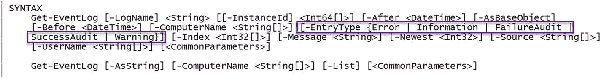
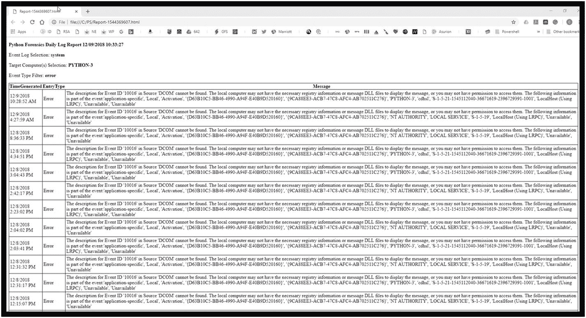
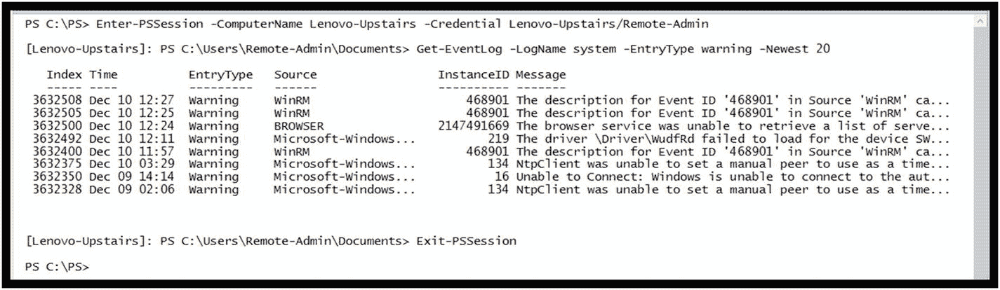
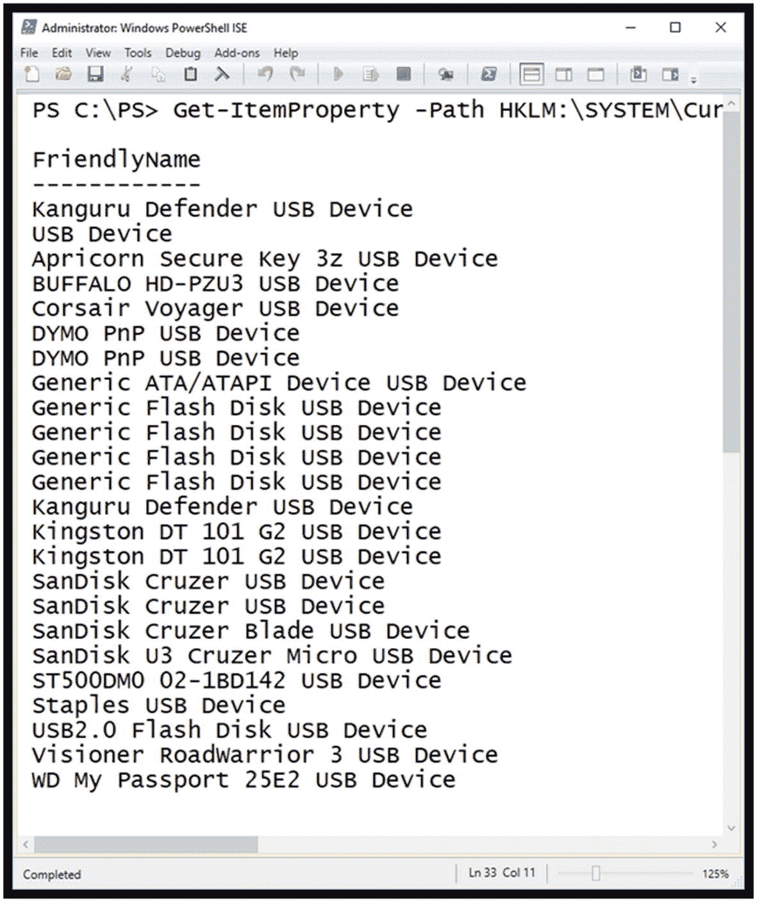
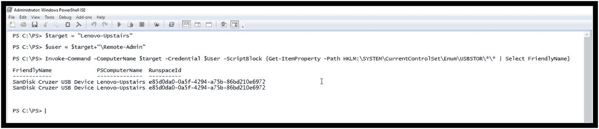
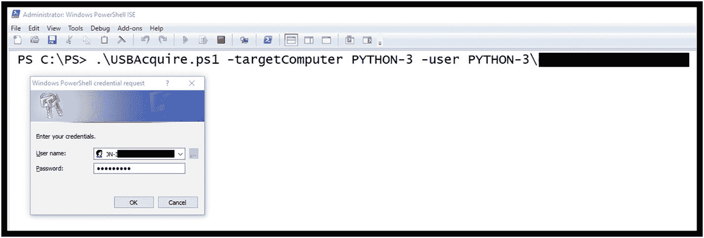

# 三、PowerShell 脚本目标调查

本章将超越单行命令和管道，以创建实际的 PowerShell 脚本。PowerShell 脚本提供了自动化需要特定 CmdLets、管道、变量、结构等的重复性任务的能力。描述 PowerShell 脚本的另一种简单方式是，它们允许您创建新的、更强大、更有针对性的 CmdLets 来解决特定的挑战。一旦您开发了一个完全符合您需求的命令，那么创建一个封装或抽象命令复杂性的脚本是非常有益的。

在这一章，我们将通过两个例子。一个是创建一个特定的、最终有用的调查脚本，该脚本将获取并处理系统事件日志。第二个例子是我们检查 USB 设备使用情况的场景。

## 关于 PowerShell 脚本的基本事实

在我们开始之前，这里有一些关于 PowerShell 脚本的基本事实:

1.  脚本是包含一系列 PowerShell 命令的简单文本文件。

2.  为了防止恶意脚本的执行，PowerShell 实施了一个执行策略，该策略默认设置为“受限”，这样 PowerShell 脚本在默认情况下将不会执行。因此，您必须设置执行策略以允许脚本执行。

3.  要执行 PowerShell 脚本，您必须在 PowerShell ISE 中执行脚本并提供脚本的完整路径，或者包含脚本的目录必须在您的 Windows 路径中。

## 示例 EventProcessor PowerShell 脚本

从事件日志中获取数据是法医调查和事件响应活动中的常见做法。这也是系统管理员每天都要执行的一项有用的活动。

从可能分布在整个调查环境中的日志文件中收集有意义的数据可能非常耗时，如果没有一致和完整地完成，将会导致问题。因此，开发一个有针对性的 PowerShell 脚本来执行这个操作将会给调查人员带来巨大的价值。

### 事件日志 CmdLets

当然，PowerShell 已经包含了通用的 CmdLets，用于从事件日志中收集基本的数据；因此，识别和选择一个可用的 CmdLets 是第一步。为此，我们再次求助于内置的 PowerShell 帮助系统。使用关键字 EventLog 请求帮助会返回 CmdLet 列表，如图 [3-1](#Fig1) 所示。


图 3-1

引用关键字 EventLog 的 CmdLets

在查看了概要之后，Get-EventLog 似乎是从事件日志中获取事件的一个可能的目标 CmdLet。

图 [3-2](#Fig2) 显示了与 Get-EventLog CmdLet 相关的基本帮助信息和用法。


图 3-2

Get-Help 获取事件日志结果

图 [3-3](#Fig3) 描述了几个使用示例。每个标识一个不同的日志文件，并请求最新的 20 个事件。请注意，如果请求 ***安全*** 事件日志，您必须拥有管理权限才能访问该日志。


图 3-3

Get-EventLog 请求示例

### 检索更具体的事件日志信息

图 [3-4](#Fig4) 显示了执行 Get-EventLog 后的结果。


图 3-4

Get-EventLog 示例结果

```py
Get-EventLog -logName system -Newest 20

```

基于我们在第 [2](2.html) 章中学到的关于 PowerShell 管道的知识，我们可以执行更具体或更有针对性的事件日志数据采集。例如，如果我们只想查看类型为*错误*或*警告*的事件，并过滤掉一般的信息性消息，该怎么办？

考虑到图 [3-5](#Fig5) 中所示的 Get-Help Get-EventLog 结果摘录，列出的可能条目类型如下:



图 3-5

Get-EventLog 的获取帮助摘录

*   错误

*   信息

*   失败审计

*   成功编辑

*   警告

基于此，可以创建一个更精确的命令，只提取目标事件*警告*或*错误*，并指定与要显示的事件日志相关的特定属性。

```py
Get-Eventlog -LogName system -Newest 20 | Select-Object -Property TimeGenerated, Source, EntryType, Message | where {$_.EntryType -eq "warning" -or $_.EntryType -eq "error"}

```

该命令产生如图 [3-6](#Fig6) 所示的结果。


图 3-6

get-带有特定字段和条目类型警告或错误的事件日志

### 创建脚本

基于对 Get-EventLog 的基本理解，让我们定义一个挑战问题。

#### 第一步:定义挑战

在编写脚本之前，请考虑调查人员在检索事件日志时面临的基本挑战，以及如何开发 PowerShell 脚本来应对这些挑战。问问自己:

1.  需要收集什么事件日志？根据调查，是否需要获取特定的事件日志？

2.  应该从哪台或哪些计算机上收集日志文件？

3.  应该收集多少条最新记录？

4.  基于 *EventType* 的可选过滤器有用吗？

5.  事件日志中应该生成哪些特定字段？
    *   通过使用 Get-Member，我们可以看到感兴趣的公共属性包括:类别、条目类型、事件 ID、机器名、消息、源、时间生成、时间写入和用户名。

6.  在哪里生成输出，即文件的标准输出？

7.  其他人将如何使用该脚本？
    1.  我们需要提供帮助吗？

    2.  他们将如何输入参数？

一旦您确定了挑战并能够回答它们，您现在就有了脚本的工作定义，可以继续第二步了。

#### 第二步:分阶段创建脚本

根据第一步中创建的定义，需要为我们的脚本定义特定的参数:

*   目标日志

*   目标计算机

*   目标计数

*   TargetEntryType

*   报告标题

清单 3-1 显示了完整的 EventProcessor 脚本。稍后，我还将展示 Get-Help 结果、样本执行和结果报告。

```py
<#
.synopsis
EventProcessor EventLog Capture Automation Version 1.0

- User Specified Target EventLog
- User Specifies the number of newest Log Entries to Report
- User Specifies the Entry Type to target, for example warning, error, information etc.
- User Specifies the target computer or computers to extract the logs
- User Specifies the HTML Report Title

The script will produce an HTML output file containing details of the EventLog acquisition.

.Description
This script automates the extraction of information from the specified log file

.parameter targetLogName
Specifies the name of the log file to process
.parameter eventCount
Specifies the maximum number of newest events to consider in the search
.parameter eventType
Specifies the eventType of interest
.parameter targetComputer
Specifies the computer or computers to obtain the logs from

.parameter reportTitle
Specifies the HTML Report Title

.example
EventProcessor
Execution of EventProcessor without parameters uses the default settings of
eventLog system
eventType warning
eventCount 20
targetComputer the computer running the script

.example
EventProcessor -targetLogName security
This example specifies the target eventLog security
and uses the default parameters
eventType warning
eventCount 20
targetComputer the computer running the script

.example
EventProcessor -reporTitle "ACME Computer Daily Event Log Report"
This example provides a custom Report Title

.example

EventProcessor -targetLogName security -eventCount 20 -entryType warning -targetComputer Python-3
This example specifies all the parameters, targetLogName, eventCount, entryType and targetComputer
#>

# Parameter Definition Section
param(
    [string]$targetLogName = "system",
    [int]$eventCount = 20,
    [string]$eventType="Error",
    [string]$reportTitle="Event Log Daily Report",
    [string[]]$targetComputer=$env:COMPUTERNAME
)

# Get the current date and tme

$rptDate=Get-Date
$epoch=([DateTimeOffset]$rptDate).ToUnixTimeSeconds()

# Create HTML Header Section
$Header = @"
<style>
TABLE {border-width: 1px; border-style: solid; border-color: black; border-collapse: collapse;}
TD {border-width: 1px; padding: 3px; border-style: solid; border-color: black;}
</style>
<p>
<b> $reportTitle $rptDate </b>
<p>
Event Log Selection: <b>$targetLogName </b>
<p>
Target Computer(s) Selection: <b> $targetComputer </b>
<p>
Event Type Filter: <b> $eventType </b>
<p>
"@

# Report Filename Creation
$ReportFile = ".\Report-"+$epoch+".HTML"

# CmdLet Pipeline execution
Get-Eventlog -ComputerName $targetComputer -LogName $targetLogName -Newest $eventCount -EntryType $eventType |
 ConvertTo-HTML -Head $Header -Property TimeGenerated, EntryType, Message |
 Out-File $ReportFile

Listing 3-1
EventProcessor Script

```

EventProcessor 脚本分为四个主要部分。为了完整起见，PowerShell 脚本的开发应该包括这些部分。

1.  脚本标题(包括帮助和示例)

2.  参数定义

3.  局部变量定义

4.  使用参数和局部变量执行 CmdLet

让我们更深入地了解一下脚本构造。

### 注意

您可以使用这个示例作为基线，因为它为 PowerShell 脚本提供了一个很好的样板。

##### 脚本标题

脚本头包含用于定义脚本的关键信息，并且符合严格的格式，以便在由 Get-Help CmdLet 处理时提供帮助详细信息。

##### 。概要部分

的。概要部分提供了脚本目的和用户期望的快速概述(列表 [3-2](#PC4) )。

```py
<#
.synopsis
EventProcessor EventLog Capture Automation Version 1.0

- User Specified Target EventLog
- User Specifies the number of newest Log Entries to Report
- User Specifies the Entry Type to target, for example warning, error, information etc.
- User Specifies the target computer or computers to extract the logs
- User Specifies the HTML Report Title

The script will produce an HTML output file containing details of the EventLog acquisition

.

Listing 3-2.Synopsis Section

```

##### 。描述部分

那个。描述部分提供了脚本的简洁定义(清单 [3-3](#PC5) )。

```py
.Description
This script automates the extraction of information from the specified log file

Listing 3-3.Description Section

```

##### 。参数部分

本节详细定义了脚本使用的每个命令行参数(清单 [3-4](#PC6) )。

```py
.parameter targetLogName
Specifies the name of the log file to process
.parameter eventCount
Specifies the maximum number of newest events to consider in the search
.parameter eventType
Specifies the eventType of interest
.parameter targetComputer
Specifies the computer or computers to obtain the logs from
.parameter reportTitle
Specifies the HTML Report Title

Listing 3-4.Parameters Section

```

注意，在这个脚本中，所有参数都是可选的，因为在定义过程中，正如您将在后面看到的，每个参数的默认值都是提供的。这允许用户通过键入以下命令来执行脚本:

```py
 .\EventProcessor

```

##### 。示例部分

在本节中，提供了几个脚本命令行执行示例，以及每个变体所提供内容的定义(清单 [3-5](#PC8) )。

```py
.example
EventProcessor
Execution of EventProcessor without parameters uses the default settings of
eventLog system
eventType warning
eventCount 20
targetComputer the computer running the script

.example
EventProcessor -targetLogName security
This example specifies the target eventLog security
and uses the default parameters
eventType warning
eventCount 20
targetComputer the computer running the script

.example

EventProcessor -reporTitle "ACME Computer Daily Event Log Report"
This example provides a custom Report Title

.example
EventProcessor -targetLogName security -eventCount 20 -entryType warning -targetComputer Python-3
This example specifies all the parameters, targetLogName, eventCount, entryType and targetComputer
#>

Listing 3-5.Examples Section

```

#### 参数定义

脚本的参数定义部分定义了脚本的每个可用参数的详细信息(清单 [3-6](#PC9) )。

```py
# Parameter Definition Section
param(
    [string]$targetLogName = "system",
    [int]$eventCount = 20,
    [string]$eventType="Error",
    [string]$reportTitle="Event Log Daily Report",
    [string[]]$targetComputer=$env:COMPUTERNAME
)

Listing 3-6
Parameter Definition Section

```

每个参数定义一个类型、名称和分配的默认值。例如:

*   $reportTitle 参数的类型为 string，默认值为“事件日志每日报告”。

*   $targetComputer 参数也是 string 类型，但是一组值是可能的。换句话说，用户可以输入多个计算机名称，每个名称用逗号分隔。这也包含一个默认值。这是一个 PowerShell 自动变量，它定义了正在执行脚本的计算机的名称。

*   $targetLogName 参数定义作为目标的事件日志。请注意，这可能已经用$targetComputer 定义为接受日志名称列表。但是，标准 CmdLet Get-EventLog 仅支持单个目标日志。为了支持列表，Get-EventLog CmdLet 需要针对每个已识别的日志执行多次。这肯定会使脚本更复杂，但也可能更有用。

*   $EventType 参数允许指定报告应该包含的事件类型。换句话说，只过滤所需的事件类型。

*   最后，$eventCount 参数被定义为一个整数值。它指定要显示的符合指定标准的日志条目的最大数量。

#### 局部变量定义

局部变量部分用于创建该脚本所需的几个局部变量(清单 [3-7](#PC10) )。

```py
# Get the current date and tme
$rptDate=Get-Date
$epoch=([DateTimeOffset]$rptDate).ToUnixTimeSeconds()

# Create HTML Header Section
$Header = @"
<style>
TABLE {border-width: 1px; border-style: solid; border-color: black; border-collapse: collapse;}
TD {border-width: 1px; padding: 3px; border-style: solid; border-color: black;}
</style>

<p>
<b> $reportTitle $rptDate </b>
<p>
Event Log Selection: <b>$targetLogName </b>
<p>
Target Computer(s) Selection: <b> $targetComputer </b>
<p>
Event Type Filter: <b> $eventType </b>
<p>
"@

# Report Filename Creation
$ReportFile = ".\Report-"+$epoch+".HTML"

Listing 3-7Local Variable Definition Section

```

局部变量如下:

*   $ReportDate:获取要在报告中使用的当前系统日期。

*   $epoch:获取自当前 epoch 以来经过的秒数。请注意，这对于每个操作系统都是不同的。这个变量将被用来创建一个唯一的 HTML 文件名。

*   $Header:定义一个标准的 HTML 头部分，在生成结果 HTML 文件时使用。请注意，该变量使用参数 ReportTitle 来自定义报告标题。

*   $ReportFile:该变量将字符串“Report-”与纪元值和扩展名. html 结合起来。

#### CmdLet 管道执行

该脚本的核心是使用管道执行 Get-EventLog CmdLet，以包含指定的参数(清单 [3-8](#PC11) )。

```py
# CmdLet Pipeline execution
Get-Eventlog -ComputerName $targetComputer -LogName $targetLogName -Newest $eventCount -EntryType $eventType |
 ConvertTo-html -Head $Header -Property TimeGenerated, EntryType, Message |
 Out-File $ReportFile

Listing 3-8CmdLet Pipeline Execution

```

管道有几个关键组件和过渡:

1.  Get-EventLog CmdLet 使用参数$targetComputer、$targetLogName、$eventCount 和$eventType 指定-ComputerName、-LogName、-Newest 和 EntryType。

2.  Get-EventLog CmdLet 的输出通过管道传输到 ConvertTo-html CmdLet，该 CmdLet 利用本地变量$Header 和从 Get-EventLog CmdLet 传递的属性 TimeGenerated、EntryType 和 Message 来形成 html 报告的列。

3.  最后，ConvertTo-html 的输出通过管道传输到 Out-File CmdLet，该 CmdLet 利用本地变量$ReportFile 作为文件名来写入结果。

### EventProcessor 获取帮助结果

由于该脚本包含一个详细的标题部分，因此可以使用 Get-Help CmdLet 为那些将使用新创建的脚本的人提供帮助。以下示例使用-Full 选项提供了 Get-Help CmdLet 的输出，该选项提供了所有详细信息和示例(清单 [3-9](#PC12) )。

```py
PS C:\PS> Get-Help .\EventProcessor.ps1 -Full

NAME
    C:\PS\EventProcessor.ps1

SYNOPSIS
    EventLog Automation Version 1.0
    Step One
    - User Specified Target EventLog
    - User Specifies the number of newest Log Entries to Report
    - User Specifies the Entry Type to target, for example warning, error, information etc.
    - User Specifies the target computer or computers to extract the logs

    - User Specifies the HTML Report Title

SYNTAX
    C:\PS\EventProcessor.ps1 [[-targetLogName] <String>] [[-eventCount] <Int32>] [[-eventType] <String>] [[-reportTitle]
    <String>] [[-targetComputer] <String[]>] [<CommonParameters>]

DESCRIPTION
    This script automates the extraction of information from the specified log file

PARAMETERS
    -targetLogName <String>
        Specifies the name of the log file to process

        Required?                    false
        Position?                    1
        Default value                system
        Accept pipeline input?       false
        Accept wildcard characters?  false

    -eventCount <Int32>
        Specifies the maximum number of newest events to consider in the search

        Required?                    false
        Position?                    2
        Default value                20
        Accept pipeline input?       false
        Accept wildcard characters?  false

    -eventType <String>

        Specifies the eventType of interest

        Required?                    false
        Position?                    3
        Default value                Error
        Accept pipeline input?       false
        Accept wildcard characters?  false

    -reportTitle <String>
        Specifies the HTML Report Title

        Required?                    false
        Position?                    4
        Default value                Event Log Daily Report
        Accept pipeline input?       false
        Accept wildcard characters?  false

    -targetComputer <String[]>
        Specifies the computer or computers to obtain the logs from

        Required?                    false
        Position?                    5
        Default value                $env:COMPUTERNAME
        Accept pipeline input?       false
        Accept wildcard characters?  false

    <CommonParameters>

        This cmdlet supports the common parameters: Verbose, Debug, ErrorAction, ErrorVariable, WarningAction, 
        WarningVariable, OutBuffer, PipelineVariable, and OutVariable. For more information, see about_Common
        Parameters (https:/go.microsoft.com/fwlink/?LinkID=113216).

INPUTS

OUTPUTS

    ------------------------ EXAMPLE 1 ------------------------

    PS C:\>EventProcessor

    Execution of EventProcessor without parameters uses the default settings of
    eventLog system
    eventType warning

    eventCount 20
    targetComputer the computer running the script

    ------------------------ EXAMPLE 2 ------------------------

    PS C:\>EventProcessor -targetLogName security

    This example specifies the target eventLog security
    and uses the default parameters
    eventType warning

    eventCount 20
    targetComputer the computer running the script

    ------------------------ EXAMPLE 3 ------------------------

    PS C:\>EventProcessor -reporTitle "ACME Computer Daily Event Log Report"

    This example provides a custom Report Title

    ------------------------ EXAMPLE 4 ------------------------

    PS C:\>EventProcessor -targetLogName security -eventCount 20 -entryType warning -targetComputer Python-3

    This example specifies all the parameters, targetLogName, eventCount, entryType and targetComputer

Listing 3-9EventProcessor Get-Help

```

### EventProcessor 脚本执行

为了说明脚本的执行，这里提供了一个示例命令和结果:

```py
PS C:\PS> .\EventProcessor.ps1 -reportTitle "Python Forensics Daily Log Report" -eventCount 100 -eventType error

```

### 结果目录

按照设计，该脚本生成一个 HTML 报告文件，其中附加了表示脚本执行时间的 Epoch 值(参见图 [3-7](#Fig7) )。自从。html 扩展名，文件系统会正确地将结果文件识别为 Google Chrome HTML 文档。



图 3-8

生成的 HTML 报告


图 3-7

结果报告 HTML 文件

### HTML 输出报告

使用浏览器检查报告文件`Report-1544369607`提供了 PowerShell 脚本执行的示例结果。输出包括定义的报告标题、选择的事件日志、目标计算机、选择的事件类型以及产生的最后 100 个事件类型为错误的事件。注意，为了简洁起见，这里的结果被截断了。

## 远程存取

### 注意

使用-ComputerName 选项(可用于许多 CmdLets)设置对远程系统的访问可能很难在工作组内设置。如果有域控制器，或者您的环境使用了 active directory，这就容易多了。因此，在尝试使用-ComputerName CmdLet 参数时，请咨询您的系统管理员。

有一种更简单的方法可以提供更大的灵活性，并且更加安全。方法是创建一个与目标机器的远程 PowerShell 会话。建立会话后，您在 PowerShell 或 PowerShell ISE 中输入的命令将在远程连接的计算机上执行。优点不仅是简单，而且它还允许您执行任何 CmdLet，甚至是那些不支持-ComputerName 作为参数的 CmdLet。

下面是一个简单的示例，它创建了一个 PowerShell 会话，该会话与我的本地网络上的一台计算机进行连接，计算机名为 levo VO-upside。为了创建会话，您必须为远程计算机上具有管理员权限的用户提供凭据。该命令会弹出一个对话框，要求输入指定账户的密码，如图 [3-9](#Fig9) 所示。


图 3-9

Enter-PSSession 凭据请求

建立连接后，您可以看到 PowerShell 提示符变成了:

```py
[Lenovo-Upstairs]: PS C:\Users\Remote-Admin\Documents>

```

此时，输入的 PowerShell 命令正在楼上的远程计算机 Lenovo 上执行，而不是在本地计算机上执行。在图 [3-10](#Fig10) 所示的例子中，获取了联想楼上机器的系统事件日志中包含的最新的 20 条警告消息。



图 3-10

远程访问系统事件日志

为了退出远程会话，发出 CmdLet Exit-PSSession，PowerShell 现在再次在本地计算机上运行。如图 [3-10](#Fig10) 所示。

## 示例 2: USB 设备使用情况发现

在执行取证调查或事件响应行动时，获取最近使用的 USB 设备当然很重要。这可以帮助确定信息是否从系统中泄漏，或者 USB 插入是否可能是恶意软件感染的原因。

该过程的第一部分是确定检测到了哪些 USB 设备。在 Microsoft Windows 系统上，注册表通过检查保存在 HKEY 本地机器下的详细信息来提供所连接设备的历史记录。图 [3-11](#Fig11) 显示了在我的本地机器上找到的特定 USBSTOR 键。


图 3-11

USB 访问的注册表历史记录

### 注意

在不同版本的 Windows 上，感兴趣的注册表项可能不同。如果是这样，您将需要更改本示例中使用的注册表项定义。

### 创建脚本

现在我们已经理解了这个场景，让我们再次执行这两个步骤来创建我们需要的脚本。

#### 第一步:最近访问 USB 活动

问题是如何使用 PowerShell 收集 USB 活动的证据？此外，是否可以开发一个脚本来汇总整个网络的 USB 使用情况？

让我们从访问本地机器上的注册表和 USBSTOR 开始。

PowerShell 提供了一个通用的 CmdLet，可以应用于包括注册表在内的许多项目:CmdLet 是 Get-ItemProperty。

Get-ItemProperty 的 Get-Help 如清单 [3-10](#PC15) 所示。

```py
PS C:\PS> Get-Help Get-ItemProperty

NAME
    Get-ItemProperty

SYNOPSIS
    Gets the properties of a specified item.

SYNTAX
    Get-ItemProperty [[-Name] <String[]>] [-Credential <PSCredential>] [-Exclude <String[]>] [-Filter <String>] [-Include
    <String[]>] -LiteralPath <String[]> [-UseTransaction] [<CommonParameters>]

    Get-ItemProperty [-Path] <String[]> [[-Name] <String[]>] [-Credential <PSCredential>] [-Exclude <String[]>] [-Filter
    <String>] [-Include <String[]>] [-UseTransaction] [<CommonParameters>]

DESCRIPTION
    The Get-ItemProperty cmdlet gets the properties of the specified items. For example, you can use this cmdlet to get the value
    of the LastAccessTime property of a file object. You can also use this cmdlet to view registry entries and their values.

RELATED LINKS
    Online Version: http://go.microsoft.com/fwlink/?LinkId=821588
    Clear-ItemProperty
    Copy-ItemProperty
    Move-ItemProperty
    New-ItemProperty
    Remove-ItemProperty
    Rename-ItemProperty
    Set-ItemProperty

REMARKS
    To see the examples, type: "get-help Get-ItemProperty -examples".
    For more information, type: "get-help Get-ItemProperty -detailed".
    For technical information, type: "get-help Get-ItemProperty -full".
    For online help, type: "get-help Get-ItemProperty -online"

Listing 3-10Get-Help Get-ItemProperty

```

使用这个 CmdLet 获取最近的 USB 活动可以像这样完成。为了更容易理解，在本例中，将获取 USB 设备的“友好名称”属性。请参见图 [3-12](#Fig12) 。


图 3-13

访问远程计算机上的 USB 活动



图 3-12

使用 Get-ItemProperty CmdLet 获取 USB 活动

```py
PS C:\PS> Get-ItemProperty -Path HKLM:\SYSTEM\CurrentControlSet\Enum\USBSTOR\*\* | Select FriendlyName

```

使用远程访问方法，我们现在获得了远程计算机 Lenovo-楼上的 USB 活动。为此，使用 Enter 和 Exit PSSession 方法，并在远程计算机上执行命令。如您所见，SanDisk Cruzer USB 设备在本地和远程计算机上都被识别。

##### 调用命令 PowerShell CmdLet

在只需要执行单个远程命令的情况下，可以通过使用 Invoke-Command PowerShell CmdLet 来完成，而不是设置远程 PowerShell 会话。这在开发将从多台计算机获取证据的脚本时非常有用。像往常一样，使用 Get-Help 将提供关于如何利用 Invoke-Command CmdLet 的细节(清单 [3-11](#PC17) )。

```py
PS C:\PS> Get-Help Invoke-Command

NAME
    Invoke-Command

SYNOPSIS
    Runs commands on local and remote computers.

SYNTAX
    Invoke-Command [[-ConnectionUri] <Uri[]>] [-ScriptBlock] <ScriptBlock> [-AllowRedirection] [-ArgumentList <Object[]>] [-AsJob]
    [-Authentication {Default | Basic | Negotiate | NegotiateWithImplicitCredential | Credssp | Digest | Kerberos}] [-CertificateThumbprint
    <String>] [-ConfigurationName <String>] [-Credential <PSCredential>] [-EnableNetworkAccess] [-HideComputerName] [-InDisconnectedSession]
    [-InputObject <PSObject>] [-JobName <String>] [-SessionOption <PSSessionOption>] [-ThrottleLimit <Int32>] [<CommonParameters>]

    Invoke-Command [[-ConnectionUri] <Uri[]>] [-FilePath] <String> [-AllowRedirection] [-ArgumentList <Object[]>] [-AsJob] [-Authentication
    {Default | Basic | Negotiate | NegotiateWithImplicitCredential | Credssp | Digest | Kerberos}] [-ConfigurationName <String>] [-Credential
    <PSCredential>] [-EnableNetworkAccess] [-HideComputerName] [-InDisconnectedSession] [-InputObject <PSObject>] [-JobName <String>]
    [-SessionOption <PSSessionOption>] [-ThrottleLimit <Int32>] [<CommonParameters>]

    Invoke-Command [[-ComputerName] <String[]>] [-ScriptBlock] <ScriptBlock> [-ApplicationName <String>] [-ArgumentList <Object[]>] [-AsJob]
    [-Authentication {Default | Basic | Negotiate | NegotiateWithImplicitCredential | Credssp | Digest | Kerberos}] [-CertificateThumbprint
    <String>] [-ConfigurationName <String>] [-Credential <PSCredential>] [-EnableNetworkAccess] [-HideComputerName] [-InDisconnectedSession]
    [-InputObject <PSObject>] [-JobName <String>] [-Port <Int32>] [-SessionName <String[]>] [-SessionOption <PSSessionOption>] [-ThrottleLimit
    <Int32>] [-UseSSL] [<CommonParameters>]

    Invoke-Command [[-ComputerName] <String[]>] [-FilePath] <String> [-ApplicationName <String>] [-ArgumentList <Object[]>] [-AsJob]
    [-Authentication {Default | Basic | Negotiate | NegotiateWithImplicitCredential | Credssp | Digest | Kerberos}] [-ConfigurationName
    <String>] [-Credential <PSCredential>] [-EnableNetworkAccess] [-HideComputerName] [-InDisconnectedSession] [-InputObject <PSObject>]
    [-JobName <String>] [-Port <Int32>] [-SessionName <String[]>] [-SessionOption <PSSessionOption>] [-ThrottleLimit <Int32>] [-UseSSL]
    [<CommonParameters>]

    Invoke-Command [[-Session] <PSSession[]>] [-ScriptBlock] <ScriptBlock> [-ArgumentList <Object[]>] [-AsJob] [-HideComputerName]
    [-InputObject <PSObject>] [-JobName <String>] [-ThrottleLimit <Int32>] [<CommonParameters>]

    Invoke-Command [[-Session] <PSSession[]>] [-FilePath] <String> [-ArgumentList <Object[]>] [-AsJob] [-HideComputerName] [-InputObject
    <PSObject>] [-JobName <String>] [-ThrottleLimit <Int32>] [<CommonParameters>]

    Invoke-Command [-VMId] <Guid[]> [-ScriptBlock] <ScriptBlock> [-ArgumentList <Object[]>] [-AsJob] [-ConfigurationName <String>] -Credential
    <PSCredential> [-HideComputerName] [-InputObject <PSObject>] [-ThrottleLimit <Int32>] [<CommonParameters>]

    Invoke-Command [-ScriptBlock] <ScriptBlock> [-ArgumentList <Object[]>] [-AsJob] [-ConfigurationName <String>] -Credential <PSCredential>
    [-HideComputerName] [-InputObject <PSObject>] [-ThrottleLimit <Int32>] -VMName <String[]> [<CommonParameters>]

    Invoke-Command [-VMId] <Guid[]> [-FilePath] <String> [-ArgumentList <Object[]>] [-AsJob] [-ConfigurationName <String>] -Credential
    <PSCredential> [-HideComputerName] [-InputObject <PSObject>] [-ThrottleLimit <Int32>] [<CommonParameters>]

    Invoke-Command [-FilePath] <String> [-ArgumentList <Object[]>] [-AsJob] [-ConfigurationName <String>] -Credential <PSCredential>
    [-HideComputerName] [-InputObject <PSObject>] [-ThrottleLimit <Int32>] -VMName <String[]> [<CommonParameters>]

    Invoke-Command [-ScriptBlock] <ScriptBlock> [-ArgumentList <Object[]>] [-AsJob] [-ConfigurationName <String>] -ContainerId <String[]>
    [-HideComputerName] [-InputObject <PSObject>] [-JobName <String>] [-RunAsAdministrator] [-ThrottleLimit <Int32>] [<CommonParameters>]

    Invoke-Command [-FilePath] <String> [-ArgumentList <Object[]>] [-AsJob] [-ConfigurationName <String>] -ContainerId <String[]>
    [-HideComputerName] [-InputObject <PSObject>] [-JobName <String>] [-RunAsAdministrator] [-ThrottleLimit <Int32>] [<CommonParameters>]

    Invoke-Command [-ScriptBlock] <ScriptBlock> [-ArgumentList <Object[]>] [-InputObject <PSObject>] [-NoNewScope] [<CommonParameters>]

DESCRIPTION
    The Invoke-Command cmdlet runs commands on a local or remote computer and returns all output from the commands, including errors. By using a single Invoke-Command command,
    you can run commands on multiple computers.

    To run a single command on a remote computer, use the ComputerName parameter. To run a series of related commands that share data, use the New-PSSession cmdlet to create a
    PSSession (a persistent connection) on the remote computer, and then use the Session parameter of Invoke-Command to run
    the command in the PSSession. To run a command in a disconnected session, use the InDisconnectedSession parameter. To run a command in a background job, use the
    AsJob parameter

.

    You can also use Invoke-Command on a local computer to evaluate or run a string in a script block as a command. Windows PowerShell converts the script block to a command
    and runs the command immediately in the current scope, instead of just echoing the string at the command line.

    To start an interactive session with a remote computer, use the Enter-PSSession cmdlet. To establish a persistent connection to a remote computer, use the New-PSSession
    cmdlet.

    Before using Invoke-Command to run commands on a remote computer, read about_Remote (http://go.microsoft.com/fwlink/?LinkID=135182).

RELATED LINKS
    Online Version: http://go.microsoft.com/fwlink/?LinkId=821493
    Enter-PSSession
    Exit-PSSession
    Get-PSSession
    New-PSSession
    Remove-PSSession

Listing 3-11
Invoke-Command

```

使用 USB 活动获取方法作为起点，Invoke-Command 方法可用于远程执行该命令。在本例中，目标和用户首先被创建为变量。该命令嵌入在-ScriptBlock 中。如前所述，用户必须输入远程计算机的管理员凭证(图 [3-14](#Fig14) )。


图 3-14

调用命令方法 USBAcquire

调用命令的结果如图 [3-15](#Fig15) 所示。



图 3-15

调用命令方法 USBAcquire 结果

#### 第二步:创建 USBAcquire PowerShell 脚本

现在我们已经完善了这个方法，可以创建一个简单的 PowerShell 脚本来为我们执行这个操作，用户提供目标计算机名，管理员用户提供目标计算机名。完整的脚本在这里被列为清单 [3-12](#PC18) 。稍后我将展示 Get-Help 结果和一个执行示例。

```py
<#
.synopsis
Collect USB Activity from target computer

- User Specifies the target computer

The script will produce details of USB Activity
on the specified target computer

.Description
This script collects USB Activity and target computers

.parameter targetComputer
Specifies the computer to collect the USB Activity

.parameter UserName
Specifies the Administrator UserName on the Target Computer

.example

USBAcquire ComputerName
Collects the USB Activity on the target Computer
#>

# Parameter Definition Section
param(
    [string]$User,
    [string]$targetComputer
)

Invoke-Command -ComputerName $targetComputer -Credential $User -ScriptBlock {Get-ItemProperty -Path HKLM:\SYSTEM\CurrentControlSet\Enum\USBSTOR\*\* | Select FriendlyName}

Listing 3-12
USBAcquire Script

```

如您所见，USBAcquire 有与示例一中的 EventProcessor 脚本相同的四个主要部分:脚本头参数定义、局部变量定义以及使用参数和局部变量的 cmdlet 执行。如果你需要复习的话，请回到那一节。

### USBAcquire 脚本执行

脚本的执行和结果如图 [3-16](#Fig16) 和 [3-17](#Fig17) 所示。


图 3-17

结果 USBAcquire PowerShell 脚本



图 3-16

USBAcquire 脚本执行请求凭据

```py
PS C:\PS> .\USBAcquire.ps1 -targetComputer PYTHON-3 -user PYTHON-3\USER-NAME-HIDDEN

```

### USBAcquire 获取帮助结果

该脚本包含一个适当的标题部分；因此，可以使用 Get-Help CmdLet 获得用户帮助，如清单 [3-13](#PC20) 所示。

```py
PS C:\PS> Get-Help .\USBAcquire.ps1

NAME
    C:\PS\USBAcquire.ps1

SYNOPSIS
    Collect USB Activity from target computer

    - User Specifies the target computer

    The script will produce details of USB Activity
    on the specified target computer

SYNTAX
    C:\PS\USBAcquire.ps1 [[-User] <String>] [[-targetComputer] <String>] [<CommonParameters>]

DESCRIPTION
    This script collects USB Activity and target computers

RELATED LINKS

REMARKS
    To see the examples, type: "get-help C:\PS\USBAcquire.ps1 -examples".
    For more information, type: "get-help C:\PS\USBAcquire.ps1 -detailed".
    For technical information, type: "get-help C:\PS\USBAcquire.ps1 -full".

Listing 3-13USBAcquire Get-Help

```

## 挑战问题:使用哈希创建文件清单列表

根据您对 PowerShell 脚本和远程访问方法的了解，您的挑战是利用这些知识来解决以下问题。

开发一个 PowerShell 脚本，该脚本将创建一个计算机清单，详细列出找到的所有目录和文件。该脚本将允许用户指定:

*   目标计算机

*   开始目录

*   输出文件

您的脚本应该生成一个包含以下信息的 HTML 文件:

*   目录

*   文件名

*   文件大小

*   修改时间

*   物主

*   文件属性(即只读、隐藏、系统、归档)

该脚本将递归从起始目录开始的所有文件夹。

### 暗示

您将关注 CmdLet Get-ChildItem。

最后，您的脚本将包含完整的帮助信息。

在附录 A 和 [`www.apress.com/9781484245033`](http://www.apress.com/9781484245033) 中可以找到一个示例脚本解决方案。

## 摘要

本章重点介绍了调查人员可以用来从事件日志和最近的 USB 活动中获取信息的 PowerShell 脚本的构造。Get-EventLog CmdLet 和 Get-ItemProperty 是我们收购的重点。

此外，当使用 Enter-PSSession CmdLet 获得正确凭据时，创建 PowerShell 会话是从远程计算机获取证据的另一种方法。此外，还介绍了 Invoke-Command PowerShell CmdLet，它允许在不创建持久会话的情况下执行单个命令或脚本。

第 4 章将介绍、比较和对比 PowerShell 和 Python，并开始结合这两种强大的脚本语言的过程。