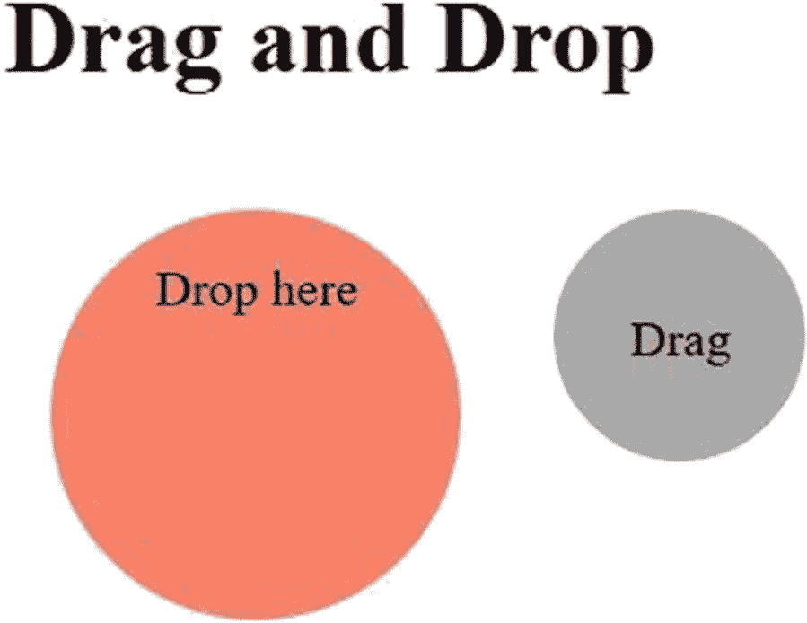

# 三、鼠标和键盘操作

前一章介绍了用 Selenium 安装和配置 Python 来自动化测试用例。还回顾了在 WebDriver 中运行测试用例所必需的基本 web 浏览器命令。本章将指导您完成用户使用鼠标和键盘在 web 应用中进行的所有操作。

在 web 应用中，web 元素被绑定到某些需要执行的动作或事件，以执行一个完整的测试用例。当用 Selenium 操作命令测试这些操作或事件时，会发现与用户界面相关的错误。

在 web 应用中，用户/客户端使用各种鼠标和键盘操作。Selenium 提供了 ActionChain，这是一个强大的库函数，用于测试页面上任何 UI 元素的用户行为。在 UI 元素上执行动作功能之前，您需要定位它(参见第 [4](04.html) 章)。

## 动作链

ActionChains 在一个测试用例中自动化了低级别的鼠标和键盘交互。交互通过设备(即鼠标或键盘)进行分类，并根据与之相关的类似事件进一步分类。

`perform()`是一个重要的功能，使鼠标和键盘的所有动作得以执行。只有在使用`perform()`功能时，与鼠标和键盘相关的所有 ActionChains 功能才起作用；如果没有使用，ActionChain 函数将不会在网页上执行任何操作。

当用于 web 元素时，多个操作在队列中对齐。这些动作在调用`perform()`函数后执行。在使用`perform()`功能之前需要进行操作(稍后将演示鼠标和键盘操作的示例)。现在让我们检查一些与鼠标相关的动作。

## 老鼠

鼠标可以执行点击、拖动、移动等操作和动作。这些操作是通过 web 应用中的 web 元素执行的。例如，按钮的选择，如默认提交按钮，是通过点击鼠标完成的(参见第 [6](06.html) 章)，或者在执行此操作后显示或定位一个 web 元素。

可以通过单击或多次单击鼠标左键或右键来完成单击。Python 中的 Selenium 提供了测试与鼠标相关的动作的方法，这将在下面描述。

### 点击

`click(web_element)`是通过点击鼠标左键选择网页元素的功能。传递的参数用于一个需要选择或单击的 web 元素。

当没有参数(即 web 元素)被传递时，鼠标左键被点击到它在 web 应用中的当前位置。

```py
from selenium import webdriver
from selenium.webdriver.common.action_chains import ActionChains

driver = webdriver.Firefox()

driver.get("http://www.apress.com")

# Go to button
web_element=driver.find_element_by_link_text("Apress Access")

#Clicking on the button to be selected
web_element.click()

```

### 点击并按住

`click_and_hold(web_element)`是一种方法，首先将鼠标指针移动到特定的 web 元素，然后使用鼠标左键单击相同的元素。单击后，元素不会被释放，因此会保持不动。

在下面的示例中，单击并按住元素的中间。

```py
from selenium import webdriver
driver=webdriver.Firefox()

# Direct to url
driver.get("http://www.apress.com")

# Locate 'Apress Access' web element button
button=driver.find_element_by_link_text("Apress Access")

# Execute click-and-hold action on the element
webdriver.ActionChains(driver).click_and_hold(button).perform()

```

### 上下文点击

`context_click(web_element)`是一个将鼠标指针移动到特定 web 元素的函数，然后在该元素上启动上下文点击。鼠标右键点击在 ActionChains 中被称为*上下文点击*。

这里有一个例子。

```py
driver.get("http://www.apress.com")

# Go to button
button=driver.find_element_by_link_text("Apress Access")

# Perform context-click
webdriver.ActionChains(driver).context_click(button).perform()

```

如果在上下文函数中没有定义 web 元素，那么在当前位置单击鼠标按钮。

### 双击

`double_click(web_element)`是一种方法，鼠标指针指向定位的 web 元素，然后双击鼠标左键(双击)。

这里有一个例子。

```py
driver.get("http://www.apress.com")

# Go to button
button=driver.find_element_by_link_text("Apress Access")

# Double click on button
webdriver.ActionChains(driver).double_click(on_element=button).perform()

```

当没有指定元素时，它单击当前位置。

### 移动到一个元素

`move_to_element(web_element)`函数将鼠标移动到 web 元素上。它主要集中在下拉菜单上，在那里你可以滚动或点击鼠标。

这里有一个例子。

```py
from selenium import webdriver
from selenium.webdriver.common.action_chains import ActionChains
from selenium.webdriver.support import expected_conditions as EC
from selenium.webdriver.support.ui import WebDriverWait
from selenium.webdriver.common.by import By

driver= webdriver.Firefox(executable_path=r'C:\Users\ADMIN\Desktop\geckodriver.exe')

driver.get("http://www.apress.com")

main_menu=driver.find_element_by_link_text("CATEGORIES")
ActionChains(driver)\
        .move_to_element(main_menu)\
        .perform()

# Wait for sub menu to be displayed
WebDriverWait(driver, 3).until(EC.visibility_of_element_located((By.LINK_TEXT, "Python")))

sub_menu=driver.find_element_by_link_text("Python")
sub_menu.click()

```

(除了 ActionChains(将在后续章节中讨论)之外，还有其他一些与异常和等待相关的库导入。)程序将鼠标指针移动到主菜单中的 Categories 链接，并等待三秒钟跳转到 Python 子菜单。

### 移动偏移量

鼠标从当前位置移动到指定的 x 和 y 偏移量。函数中的 x 和 y 偏移值是一个整数，可以是正数也可以是负数。下面是语法。

```py
move_by_offset(xoffset, yoffset)
driver.get("http://www.apress.com")

#Offset positions of x and y
x =268
y =66

#Move element with offset position defined
webdriver.ActionChains(driver).move_by_offset(x,y).perform()

```

当指定的坐标超出网页窗口时，则鼠标移出窗口。偏移的默认坐标是(0，0)。

下面的语法反映了用指定的坐标移动鼠标。这里，鼠标相对于元素位置移动。早期的方法是将鼠标的移动作为一帧覆盖整个屏幕。

```py
move_to_element_with_offset(to_element, xoffset, yoffset)

```

偏移值从任何指定 web 元素的左上角开始。该值是一个整数，可以是正数，也可以是负数。负的`xoffset`值表示指定 web 元素的左侧。类似地，`yoffset`中的负值表示 web 元素向上的一侧。下面是这个函数的一个例子。

```py
driver.get("https://www.apress.com/")
# get  element
element = driver.find_element_by_link_text("CATEGORIES")
# create action chain object
action = ActionChains(driver)
 # perform the operation
action.move_to_element_with_offset(element, 200, 50).click().perform()

```

当 web 元素静态放置在网页上时，可以使用偏移位置，但不能用于相对位置。

### 拖放

`drag_and_drop()`拖动源元素到指定或目标位置。源元素是需要被拖到目标位置的 web 元素。

以下是拖放元素的 HTML 代码。

```py
<html>
<head>
<style type="text/css">
#drag,#drop {
float:left;padding:15px;margin:15px;-moz-user-select:none;
         }
#drag{ background-color:#A9A9A9; height:50px; width:50px; border-radius:50%;    }
#drop{ background-color:#fd8166; height:100px; width:100px; border-radius:50%;  }
</style>
<script type="text/javascript">
function dragStart(ev) {

ev.dataTransfer.setData("Text", ev.target.getAttribute('id'));

ev.dataTransfer.effectAllowed='move';
ev.dataTransfer.setDragImage(ev.target,0,0);
return true;
         }
function dragEnter(ev) {
event.preventDefault();
return true;
         }
function dragOver(ev) {
return false;
         }
function dragDrop(ev) {
var src=ev.dataTransfer.getData("Text");
ev.target.appendChild(document.getElementById(src));
ev.stopPropagation();
return false;
         }
</script>
</head>
<body>

<h1>Drag and Drop</h1>
<center>
<div id="drop" ondragenter="return dragEnter(event)" ondrop="return dragDrop(event)" ondragover="return dragOver(event)">Drop here</div>

<div id="drag" draggable="true" ondragstart="return dragStart(event)">
<p>Drag</p>
</div>
</center>
</body>
</html>

```

为这两个元素定义了两个圆，其中一个元素可以拖动较小的圆放到较大的圆上。这是一个拖放元素的简单例子。在网页上，拖放功能通常用于将图像滑块或文件移动到上传的特定区域。

下面是 Selenium 代码来拖拽图 [3-1](#Fig1) 所示的圆。



图 3-1

拖放

```py
from selenium import webdriver
driver=webdriver.Chrome()

# Navigate to page stored as local file
driver.get("drag_and_drop.html")

# Locate 'drag' element as source
element1 =driver.find_element_by_id("drag")
# Locate 'drop' element as target
element2  =driver.find_element_by_id("drop")
# Perform drag and drop action from
webdriver.ActionChains(driver).drag_and_drop(element1,element2).perform()

```

### 拖放通过

使用`drag_and_drop_by` `(source, x_offset, y_offset)`，按住鼠标左键，直到它将 web 元素分别移动到定义的 x 和 y 偏移值，然后松开按钮。web 元素是给定语法中的源元素。

这里有一个例子。

```py
driver.get("drag_and_drop.html")

#Locate circle1 element
circle1 =driver.find_element_by_id("drag")
#Locate circle2 element
circle2  =driver.find_element_by_id("drop")

#Getting offset values
x_off=circle2.location.get("x")
y_off=circle2.location.get("y")

#PerformdragAndDropBy to circle2 element
webdriver.ActionChains(driver).drag_and_drop_by_offset(circle1, x_off, y_off).perform()

```

Note

由于 Firefox 和 Selenium 之间的兼容性问题，普通 JavaScript 使用的拖放功能可能不起作用。

### 释放；排放；发布

`release()`功能释放被点击的鼠标左键。它对于与拖放相关的 web 元素最为有效。如果没有 web 元素被传递，那么鼠标按钮在网页上的当前位置被释放。

这里有一个例子。

```py
driver.get("drag_and_drop.html")

#Locate circle1 element
circle1 =driver.find_element_by_id("drag")
#Locate circle2 element
circle2  =driver.find_element_by_id("drop")

#Release action after performing necessary actions
ActionChains(driver)
        .click_and_hold(circle1)
        .move_to_element(circle2)
        .perform()
        .release()
        .perform()

```

既然我们已经回顾了 Selenium 中 ActionChains 的所有鼠标操作，现在让我们来看看键盘操作。

## 键盘操作

键盘操作也是与 web 应用交互所必需的。四个主要动作与键盘相关联。接下来将讨论这些操作。

### 向下按键

`key_down(value, web_element)`功能通过按键来工作。它主要与修饰键一起使用，如 Shift、Control、Alt 等。

### 键起

`key_up(value, web_element)`功能释放按下的修改键。它通常在 key down 方法之后使用。

### 发送密钥

`send_keys_to_element( send_keys)`方法将键盘上的按键发送到当前选中的 web 元素。它可用于单键或多键。

大多数时候，键盘动作是一起使用的。下面是从网页中选择和复制文本的键盘操作的简单示例。

```py
#Import necessary libraries
from selenium import webdriver
from selenium.webdriver.common.keys import Keys
from selenium.webdriver.common.action_chains import ActionChains

driver=webdriver.Chrome()

driver.get('https://en.wikipedia.org/wiki/Apress')

ActionChains(driver)\
        .key_down(Keys.CONTROL)\
        .send_keys("a")\
        .key_up(Keys.CONTROL)\
        .key_down(Keys.CONTROL)\
        .send_keys("c")\
        .key_up(Keys.CONTROL)\
        .perform()

```

在代码中，您会看到使用 Selenium 中可用的键盘操作选择并复制了 web 页面的所有内容。

### 向元素发送密钥

在`send_keys_to_element` `(web_element, send_keys)`中，键被发送到给定函数中的 web 元素，这与只发送键的 send keys 函数不同，因为它没有提到任何元素。

鼠标和键盘动作可以组合起来用于网页上的一个或多个 web 元素。

### 中止

在`pause(secs)`中，动作被延迟(暂停)一段指定的时间(秒)。它在执行操作之前显示一个 web 元素。

### 重置

`reset_actions()`函数清除或删除所有存储的与 web 元素相关的动作。动作可以存储在本地或远程端。

## 摘要

这一章主要讲述了用户在与网页交互时使用的鼠标和键盘操作。本章从 Selenium 支持的所有鼠标操作开始。然后，演示各种动作及其对应的示例。稍后，您学习了用户可以使用的四个主要键盘功能。

在应用这些操作之前，您需要找到该元素。定位 web 元素的任务由 Selenium 中的 web 定位器完成，这将在下一章讨论。