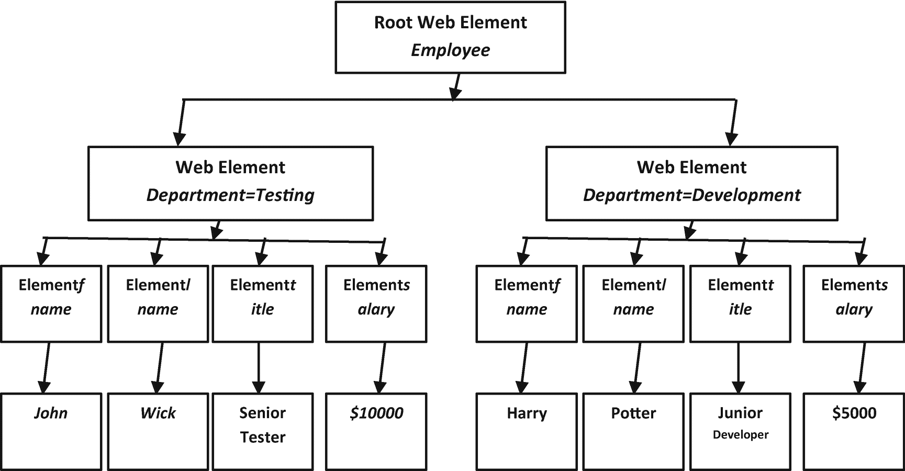
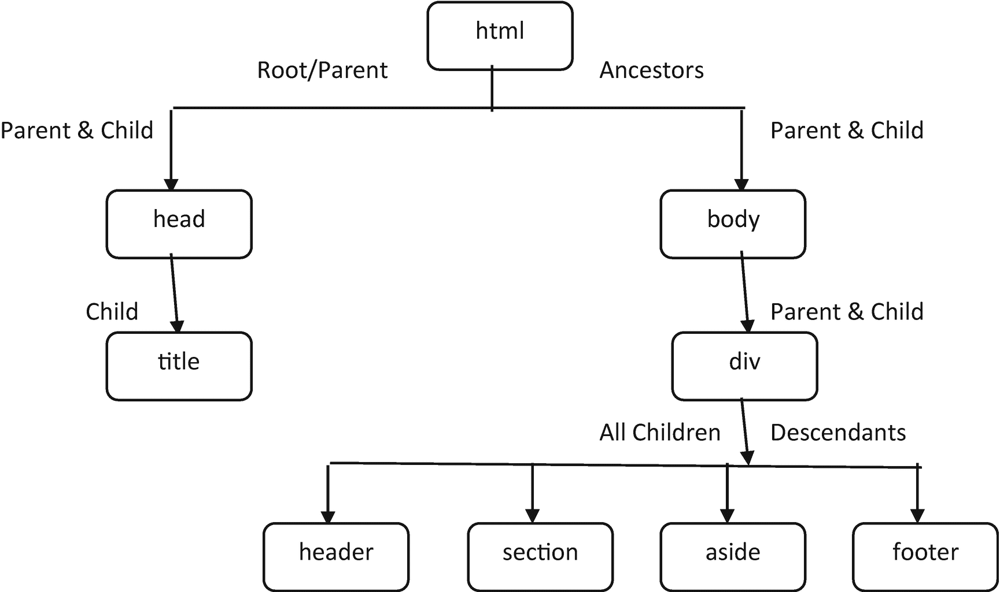

# 4.网页元素

在前一章中，您已经了解了鼠标和键盘的基本操作。现在您需要找到一个 web 元素来执行这些操作。本章解释了如何定位 web 元素。有几种类型的 web 元素可用于构建 web 应用程序。要测试 web 应用程序，首先需要跟踪其中的 web 元素。元素可以在网页上的任何地方。这些 web 元素可以通过 Selenium WebDriver 提供的定位器来定位或跟踪。

定位器在 web 应用程序中查找 web 元素；因此，整个章节都致力于 web 元素和定位器。测试用例中还演示了具有内置函数的定位器。在深入研究 web 定位器及其类型之前，让我们从了解什么是 web 元素开始。

## 元素/Web 元素

元素通常被定义为开始和结束 HTML 标记之间的任何东西。网页或应用程序由许多不同的元素组成。这些在 web 应用程序中多次使用的元素被称为 *web 元素*。

Note

术语*元素*和 *web 元素*可以互换使用。

为了避免服务于相同目的的多个 web 元素之间的混淆，使用唯一的属性来区分它们。定义的属性有一个相应的名称，该名称应该是唯一的，作为 web 元素的唯一属性。该属性有助于定位器。

Note

Web 元素可以位于页面上的任何位置。

现在您对 web 元素有了基本的了解。要识别网页上可用的 web 元素，您需要了解定位器。由于每个 web 元素都是不同的，因此有不同的 web 定位器，这将在下面讨论。

## 网络定位器

网页上至少需要有一个 web 元素，这是使用 web 定位器的一个基本条件。在自动化任何测试之前，您需要在 web 应用程序或网页中的许多其他元素中识别或找出特定的 web 元素。定位器标识特定的 web 元素。

locator 是 Selenium WebDriver 的一个简单函数或方法。定位器使用 Selenium 支持的不同属性来识别 web 元素。有八个唯一的定位器(函数)来标识 web 元素，下面将对此进行描述。

这些函数提供了跟踪或识别 web 元素以保护脚本的灵活性。让我们看看定位 web 元素的不同方式。

## 定位元件

网页是使用链接、字段、文本、图像等元素构建的。这些元素在 HTML 中是标签的形式，有时在 HTML 中不是。为了定位这些元素，Selenium 使用定位器。

本章介绍的八种定位器。解释了语法，如何、何时以及在哪里使用这些定位器，使您能够在以后的测试用例中使用它们。

让我们分别看一下这些 web 定位器。

### ID 定位器

这种方法或函数是使用最广泛的定位器之一。id 是 HTML 网页中唯一的属性，不太可能受变化的影响。这是在 HTML 页面上定位元素的最简单也是最受欢迎的方法之一。

根据 W3C，每个元素必须有唯一的 ID；然而，浏览器允许这个规则的一个例外。这个异常允许不同的元素具有相同的 ID 名称或者没有 ID，这就是为什么 Selenium 有八个定位器。下面是语法。

```py
var_name = find_element_by_id ('id_attribute')

```

考虑下面的 HTML 页面源代码。

```py
<html>
<body>
<form id="EmployeeForm">
<input name="employee_name"type="text"/>
<input name="email"type="email"/>
<input name="next"type="submit" value="Login"/>
</form>
</body>
</html>

```

在 HTML 源代码中，form 标记是唯一具有 ID 属性的元素。表单标签的 ID 属性被命名为`EmployeeForm`。使用语法，下面的代码有助于跟踪/查找具有 ID 属性的元素。

```py
Employee_form = driver.find_element_by_id ('EmployeeForm')

```

通过使用这种方法，如果 ID 属性已知，就可以很容易地定位元素。如果多个元素具有相同的 ID 属性名，则返回第一个匹配的 ID。如果不匹配，则调用异常。这种异常称为 NoSuchElementException。

### 名称定位器

一个元素可能有多个关联的属性。name 属性是一个广泛使用的属性，但它可能是也可能不是唯一定义的。name 属性通常是表单上的输入元素(但也用于文本字段和按钮中)。在表单上执行提交操作时，name 属性将所有相应的值传递给服务器。

```py
var_name = find_element_by_name ('name_attribute')

```

下面的 HTML 源代码显示了如何定位具有 name 属性的元素。

```py
<html>
<body>
<form id="EmployeeForm">
<input name="employee_name" type="text" /><!--1st element-->
<input name="email" type="email" /><!--2nd element-->
<input name="next" type="submit" value="Login" /><!--3rd element-->
<input name="next" type="button" value="Clear" /><!--4th element-->
</form>
</body>
</html>

```

有两个带有名称属性的输入标签。第一个和第二个输入标签(元素)以`employee_name`作为名称属性，电子邮件元素很容易定位，如下所示。

```py
#Locating first element
employee = driver.find_element_by_name('employee_name')

#Locating second element
email = driver.find_element_by_name('email')

```

在每种情况下，名称定位器都与 HTML 源页面上的第一个元素匹配。如果页面上没有匹配的元素，则调用 NoSuchElementException。

在多个元素具有相同名称作为属性的情况下，定位器选择 HTML 页面上具有确切指定名称的第一个元素。

```py
next = driver.find_element_by_name('next')

```

在前面的方法中，返回登录按钮，因为它出现在清除按钮之前。要从一个页面返回多个元素，请参考“定位元素”一节。

### XPath 定位器

XML 语言中使用 XPath 来定位通过元素和属性导航的节点。路径由与特定节点相关联的表达式组成。HTML 也支持使用 XHTML 实现 XML。在没有 ID 和名称的情况下，很难定位元素。在这些情况下，XPaths 定位器通过链接来识别元素。它是仅次于 ID 和名称的第三大常用定位器。有几种方法可以定位链接，因为它们是树状结构。

XPath 的一般语法是

*   `//`:定义当前目录/标签(单斜线表示绝对路径)

*   `tag_name`:定义指定路径的标签名称

*   `@`:指定要选择的属性

*   `attribute_name`:指定属性的名称；节点属性的名称

*   **值**:定义指定属性的值

```py
xpath =//tag_name[@attribute_name= 'value']

```

为了更好地理解 Xpath，您需要了解 XML 文档。XML 文档是树形结构，具有各种相关的属性和标签。下面以 XML 文档的形式显示了雇员的树形结构。

```py
<employee>
<department = "Testing">
<fname>John </fname>
<lname>Wick</lname>
<title>Senior Tester</title>
<salary>$10000</salary>
</department>

<department = "Development">
<fname>Harry</fname>
<lname>Potter</lname>
<title>Junior Developer</title>
<salary>$5000</salary>
</department>
</employee>

```

节点形成树状结构。这些节点有一个根节点，DOM 结构就是从这个根节点开始的。其他节点被视为叶节点或子节点。

Note

根节点也称为*父节点*、*起始节点*或*初始节点*。

XML 文档结构如图 [4-1](#Fig1) 所示。



图 4-1

XML 文档结构的文档对象模型

XML 文档只包含一个根 web 元素，它是一个*雇员*。employee web 元素有两个节点作为部门:*测试*和*开发*。这些部门也被称为根元素的属性。

每个部门包含另外四个属性:fname、lname、title 和 salary。这四个属性与它们各自的值相关联。测试部门雇员的值如下:fname 是 John，lname 是 Wick，title 是 Senior Tester，salary 是$10000。同样，对于开发部门，值为哈利、波特、初级开发人员和 5000 美元。

以下 XML 页面源由各种标记和属性组成。您还需要了解一些术语，这将在接下来的章节中介绍。

#### 节点

在网页中，树状结构表示 DOM。节点从结构的起点到终点相互连接。初始节点被称为根节点。它有时被称为*初始节点*。

在 HTML 中，`<html>`标签是根节点或节点开始的初始节点。

#### 双亲

嵌入在开始和结束标记之间的 web 元素有一个关联的父元素。除了根节点之外，任何元素都至少有一个父元素。head 和 body 标签有一个 HTML 标签作为父标签，这是一个根元素。

#### 孩子们

父元素可以有一个或多个子元素。head、body 和 div 标签有与其相关联的子标签。有时，父标签没有子标签，例如 title 标签。

#### 同科

属于同一父元素的 web 元素被称为*兄弟元素*。例如，div 标签中的所有标签都是兄弟标签。

#### 原子值

没有父元素或子元素的 web 元素被称为*原子值*。最好的例子是没有子节点的根节点。

#### XPath 方法

XPath 轴通过使用与 XML 中相同的结构树机制来帮助导航或定位 web 元素。web 元素的动态特性使得定位 XPath 变得困难，因此 axes 方法解决了这个问题。

XPath 轴有 13 种不同的方法来定位复杂或动态的 web 元素。

##### 儿童

它定位与网页/应用程序上的当前或所选 web 元素相关联的所有可用子元素。

##### 父母

它定位当前 web 元素的父元素。如果当前元素没有任何父元素，则根节点被视为其父元素。根元素是所有可用元素的父元素。

##### 自轴

它只检测一个 web 元素(即自身)。

##### 祖先

它定位从当前元素的父元素开始到其所有可用祖先(即，父元素、祖父元素、曾祖父元素等)的所有 web 元素。).它包含根元素，除非它是根元素。

##### 祖先或自我

在这种情况下，将定位所选 web 元素的所有可用祖先，包括当前元素。

##### 后裔

它定位所有子 web 元素。后代包括当前元素的子元素和孙元素。

##### 后代还是自己

它包括当前元素及其所有子元素。如果没有子元素，那么只返回当前元素。

##### 跟随

它定位当前元素之后的所有 web 元素。它不包括当前元素。

##### 跟随兄弟姐妹

它将所有 web 元素定位在当前元素之后的同一级别。例如，任何选择框或单选按钮元素。

##### 在前的

它定位出现在页面上当前元素之前的所有 web 元素。

##### 前面的兄弟姐妹

它定位出现在同一级别的选定元素之前的所有同级元素。

##### 属性

使用属性定位 web 元素后，将检查指定元素的该属性。如果匹配，则返回该元素；否则，它返回一个空值。

##### 命名空间

它定位与名称空间相关联的所有 web 元素。这是最少使用的 XPath 轴之一。

Note

没有子元素(即`()`)的 web 元素被称为*叶节点*。

#### 节点示例

下面的 HTML 定义了一个结构及其关系。这种关系如图 [4-2](#Fig2) 所示。



图 4-2

HTML 标签之间的关系

```py
<html><!-- Root node-->

<head><!-- Parent -->

<!--Child of head tag-->
<title></title>

</head>

<body><!-- Parent -->

<!--<div>Child of body
And Parent of header, section, aside, footer -->
<div>
                <!—Child one-->
<header>

</header>

<!—Child two-->
<section>

</section>

<!—Child three-->
<aside>

</aside>

                <!—Child four-->
<footer>

</footer>

<!-- The four tags header, section,
aside and footer are siblings to each other -->
</div>

</body>

</html><!-- End Node -->

```

根节点或开始节点是初始的 HTML 标签。HTML 标签有两个子元素:head 和 body。头只有一个子元素标题。head 分别是 HTML 标签的子标签和标题的父标签。head 和 body 标签是兄弟。

类似地，body 有一个子元素:div。div 标签有四个子标签。div 是 body 标记的子元素，是四个子元素的父元素:header、section、side 和 footer。这四个元素是兄弟元素，没有任何自己的子元素。div 标记没有同级。

HTML 是所有元素的祖先。同样，头部和身体只是它们的子元素的祖先。title 和 div 元素是 HTML 元素的子元素。这个头没有孙子。身体有四个孙辈。子代(ren)和孙代(ren)分别是父代和祖父代的后代。同样，父元素是子元素(ren)和孙元素(ren)的祖先。

标头是其他三个兄弟的前一个兄弟。页脚是前三个同级的下一个同级。同样，头部和身体分别是前面和后面的兄弟。

Note

XPath 依赖于浏览器，因为每个浏览器的行为都不同。

#### XPath 定位器类型

XPath 中有两种定位器可以用来在 Selenium 中定位 web 元素。接下来将讨论它们。

##### 绝对路径

绝对路径是一种直接定位 web 元素的方法。它是最简单的 XPath，存在于 DOM 结构中。如果在此路径中进行了任何更改，web 元素将无法定位元素。绝对路径是 web 元素可用的路径。

绝对路径从根节点(即初始节点)开始。节点之间的连接由单个正斜杠(`/`)表示。该路径按照从顶层节点开始的分层顺序排列。

考虑下面的 HTML 代码，它显示了绝对路径是如何导出的。

```py
<html>
<title></title>
<head></head>
<body>

<form id="EmployeeLogin">
<input name="fname" type="text" value="First Name"/><!--Input1-->
<input name="lname" type="text" value="Last Name"/><!--Input2-->
<input name="email" type="text" value="Email"/><!--Input3-->
<input type="text" name="location" value="Location"><!--Input4-->
<input name="password" type="password"/><!--Input5-->
<input name="continue" type="submit"
            value="Employee Login"/> <!--Input6-->
</form>

</body>
</html>

```

绝对路径定位 HTML 代码中位置字段的输入。输入字段位于数字 4 的位置，所以它的绝对路径是

```py
form_element= driver.find_element_by_xpath
                                ("/html/body/form/input[4]")

```

Note

在 Selenium 中，索引从 1 而不是 0 开始。

在前面的绝对路径中，路径从根节点(即 HTML 节点)开始，到 input[4]节点结束，input[4]节点是要定位的 web 元素。这里所需的 web 元素是 location 字段，它位于所描述路径的结束节点。

Note

绝对路径从根节点开始，到需要定位的节点结束。

##### 相对路径

在相对路径中，web 元素位于 DOM 结构中，这使得它不太容易被更改。相对路径比绝对路径更有助于定位 web 元素。

XPath 可以从 web 页面中的任何地方开始(即 DOM 结构),在 web 元素需要定位的节点处结束。节点之间用双斜线(`//`)分隔，而不是单斜线。

Note

在相对路径中，当前目录作为参考。

相对路径使用比绝对路径更短的路径来定位 web 元素。如前面的 HTML 代码所述，要定位位置字段，其相对路径如下。

```py
form_element= driver.find_element_by_xpath
                                        ("//form//input[4]")

```

这里，节点从表单元素开始，到第四个输入字段结束。末端是要定位的元素。

Note

斜线很容易区分绝对路径和相对路径。在 Xpath 中，单斜线表示绝对路径，双斜线表示相对路径。

#### 带有逻辑运算符的 XPath

带有逻辑运算符的 XPath 表达式允许您在网页上检查或定位多个 web 元素。逻辑运算符也称为布尔运算符，因为它可能会也可能不会返回指定的元素。web 元素使用逻辑运算符至少需要两个 XPath 表达式，因此一个逻辑运算符可以定位一个或多个 web 元素。web 元素的返回取决于指定的条件。

指定条件的结果为真或假。当结果为真时，它返回一个 web 元素，否则不返回任何元素。下面描述两个主要的逻辑运算符。

##### 和

当两个 XPath 指定的属性匹配或在给定网页上可用(存在)时，AND 逻辑运算符返回或定位 web 元素；否则，它不返回任何 web 元素。如果 web 元素或其属性不可用，则会发生 NoElementFoundException。`and`是该运算符使用的关键字。

```py
form_element=driver.find_element_by_xpath("//input[@name='fname'
                                                and @type='text']")

```

在该示例中，当输入 web 元素匹配与其关联的名称和类型属性时，将返回该元素。表 [4-1](#Tab1) 显示了元素的位置。

表 4-1

Web 元素结果的条件

<colgroup><col class="tcol1 align-left"> <col class="tcol2 align-left"> <col class="tcol3 align-left"></colgroup> 
| 

A

 | 

B

 | 

结果

 |
| --- | --- | --- |
| 错误的 | 错误的 | 未找到元素 |
| 真实的 | 错误的 | 未找到元素 |
| 错误的 | 真实的 | 未找到元素 |
| 真实的 | 真实的 | 定位两个元素(A&B) |

类似地，当使用 AND 逻辑运算符通过指定两个相关属性来返回多个 web 元素时，它将返回一个 False 值。当属性属于不同的元素时，这可以被验证并实现。下面是另一个展示 XPath 返回多个 web 元素的例子。

```py
form_elements=driver.find_elements_by_xpath("//input[@name='fname'and @name='lname']")

```

两个 web 元素通过它们的名称属性来定位。

##### 运筹学

在这种逻辑运算符类型中，当两个指定属性或 web 元素中的任何一个在网页上可用时，它仅返回真布尔值的 web 元素。当两个条件都为假时，它不返回任何元素。关键词是`or`。下面是一个简单的例子，其中使用 or 逻辑运算符检查输入表单的属性。

```py
form_elements=driver.find_elements_by_xpath("//input[@name='fname'] or
                        [@name='newpassword']")

```

此示例检查与输入表单相关联的两个属性——名称和类型。如果任何属性属于所述的任何输入表单，那么它返回相应的 web 元素。在这种情况下，将返回第一个输入框(Input1 ),但是没有类型为`newpassword` name 属性的输入表单。

表 [4-2](#Tab2) 显示了网络元素的逻辑值。

表 4-2

或带有 Web 元素结果的条件

<colgroup><col class="tcol1 align-left"> <col class="tcol2 align-left"> <col class="tcol3 align-left"></colgroup> 
| 

A

 | 

B

 | 

结果

 |
| --- | --- | --- |
| 错误的 | 错误的 | 未找到元素 |
| 真实的 | 错误的 | 定位元素 a |
| 错误的 | 真实的 | 定位元素 b |
| 真实的 | 真实的 | 定位两个元素(A&B) |

类似地，输入表单的三个不同属性也提到了`or`逻辑操作符。比较的 web 元素的属性是名称和类型。所有属性都属于给定输入表单中的每个不同的 web 元素；因此，它返回所有相关的输入表单。

```py
form_elements=driver.find_elements_by_xpath("//input[@name='fname'] or
                        [@name='lname'] or [@type='email']")

```

在`or`逻辑代码片段中，从一到三的前三个输入表单作为结果被检索。逻辑操作符的使用在 Selenium 中不受限制，因此可以用于多个 web 元素。

Note

两个逻辑运算符都区分大小写(即`and`、`or`)。

#### XPath 函数的类型

在一个 web 应用程序/页面中有许多 web 元素，这会使定位具有相同属性的元素成为问题；例如，具有相同属性的几个按钮，如名称或 id。为了定位这些 web 元素，Selenium 提供了 Xpath 函数。优选地，这些功能与动态变化的 web 元素一起使用。接下来讨论一些常用的 XPath 函数。

##### 包含( )

`contains()`是一种用于动态改变与 HTML 页面中的 web 元素相关联的属性中的值的方法。当您知道 XPath 中实现的部分属性值或部分链接文本时，可以使用它。`contains()`函数在网页上搜索给定的文本，如果匹配就返回 web 元素。它通常用于登录页面，其中登录 ID 会动态变化。

`contains()`函数的语法是

```py
//xpath[contains(@attribute, 'attribute value')]

```

下面是`contains()`在完整和部分文本中的例子。

```py
//with complete text
element1 =driver.find_elements_by_xpath("//input[contains(@id, 'fname']")

//with Partial Link
element2 =driver.find_elements_by_xpath("//input[contains(@name, 'pass']")

```

使用我们之前的表单 HTML 示例，这个代码片段中的 web 元素搜索文本并为`element1`返回 input1，为`element2`返回 input5。你需要明白，`element2`被提供了部分文本(`pass`’)，它匹配表单输入的 name 属性(`password`’)。因此，部分文本允许您定位动态 web 元素。

##### 文本( )

在 web 元素缺少属性的情况下，`text()`函数允许您通过识别某些文本来定位元素。具有该文本的 web 元素被定位。

```py
//xpath[text() = 'login-in']

```

下面的 html 代码片段使用`text()`函数来跟踪 web 元素。

```py
<button type="button"> Submit <button/>

element3 =driver.find_elements_by_xpath("//button[text() = 'Submit']")

```

按钮标记没有属性；它只有相关的文本。`text()`函数用于定位该元素。`element3`检索带有与其相关的`'submit'`文本的按钮。

##### 以( )开头

该函数非常类似于 contains 函数；唯一的区别是，它从检查 XPath 之后提供的初始字符串开始。这个函数非常适合那些在页面重新加载后值会发生变化的 web 元素。匹配初始字符串或文本以定位 web 元素。

下面是一个通用语法示例。

```py
//xpath[starts-with(@attribute, 'attribute value')]

element4 =driver.find_elements_by_xpath("//form[starts-with(@id, 'Employee']")

```

`element4`的字符串`id`是初始值，与页面上可用的表单 ID 相匹配。

### CSS 选择器

CSS 选择器和 XPath 是相似的，因为它们都可以检测网页上复杂的 web 元素。CSS 选择器比 XPath 更容易实现，因为 CSS 与 DOM 无关，并且在定位 web 元素时更加灵活。当一个网页集成了很多 CSS 时，使用 CSS 选择器来定位网页元素是很容易的。它也很健壮。

Note

CSS 是级联样式表的首字母缩写。这是使 HTML 页面具有吸引力的主要因素。

CSS 选择器是由一个元素选择器和它对应的值组合而成的。这个对应的值定位或标识页面中的 web 元素。该值可以是 ID、标签、属性值等形式。

当 CSS 选择器用于定位 web 元素时，当与指定的属性匹配时，将返回网页中的第一个元素。如果没有元素符合指定的条件，则会引发异常。CSS 选择器的一般语法是

```py
find_element_by_css_selector()

```

以下方法展示了一些与用于定位 web 元素的 CSS 选择器相关的格式。

#### 身份

当 CSS 选择器与 ID 属性一起使用时，在 HTML 标签和 ID 属性之间放置一个散列(`#`)符号。该符号仅用于 ID 属性。带有 ID 属性的 CSS 的一般语法是

```py
<HTML_tag>#<ID_value>

```

这是 HTML 的例子。

```py
<pid="press">Apress Publication </p>

```

您可以使用 CSS ID 定位器来定位 web 元素。

```py
press=driver.find_element_by_css_selector('p#press')

```

有几种不同的方法可以用来代替前面的脚本，同样也可以定位 web 元素。

```py
press=driver.find_element_by_css_selector("p[id = 'press']")

press=driver.find_element_by_css_selector("p#id='press'")

```

#### 班级

CSS 选择器可以和 class 属性一起使用来定位 web 元素。HTML 标签和 class 属性之间使用了一个点(`.`)。带有类的 CSS 的语法是

```py
<HTML_tag>.<class_name>

```

在下面的 html 代码片段中，CSS 选择器定位段落元素。

```py
<html>
<body>

<p class="press ">Apress Publication </p>

//HTML tag with multiple CSS classes
<p class="my-class text-justify">New York</p>

</body>
</html>

press=driver.find_element_by_css_selector('p.press')

```

`'press'`变量使用 CSS 定位器定位 web 元素。一个点符号(`.`)将多个类组合成一个 CSS 选择器。它还区分了属性和值。

类似地，您可以找到具有多个 CSS 类的 web 元素。以下是写这个的各种方法。

```py
press1 =driver.find_element_by_css_selector('p.container')

press1 =driver.find_element_by_css_selector('p.my_class')

press1 =driver.find_element_by_css_selector('.my_class')

press1 =driver.find_element_by_css_selector('my_class.container')

press1 =driver.find_element_by_css_selector('container.p')

```

所有 CSS 定位器脚本返回相同的 web 元素。

#### 子字符串匹配大小写

Web 元素可以具有动态属性，并且对于不时出现的某些实例，往往会发生变化。要定位这些元素，默认 CSS 不是一个选项，因为它使用静态值作为 ID、类和名称。

CSS 选择器接受的符号在表 [4-3](#Tab3) 中描述。

表 4-4

带语法的元素定位器

<colgroup><col class="tcol1 align-left"> <col class="tcol2 align-left"></colgroup> 
| 

元素定位器

 | 

句法

 |
| --- | --- |
| 身份 | 按标识查找元素( ) |
| 名字 | 按名称查找元素( ) |
| 路径语言 | find_element_by_xpath() |
| 环 | find_element_by_link_text() |
| 部分链接 | find _ element _ by _ partial _ link _ text() |
| 标签名称 | 按标签名查找元素( ) |
| 类别名 | find_element_by_class_name() |
| CSS 选择器 | find_element_by_css_selector() |

表 4-3

带描述的子串字符

<colgroup><col class="tcol1 align-center"> <col class="tcol2 align-center"> <col class="tcol3 align-left"></colgroup> 
| 

标志

 | 

字符名称

 | 

描述

 |
| --- | --- | --- |
| ^ | 停止 | 匹配字符串的前缀 |
| $ | 美元 | 匹配字符串的后缀 |
| * | 星号 | 使用子字符串匹配字符串 |
| ： | 结肠 | 使用 contain()方法匹配字符串 |

所有的 substring 方法都应用在下面的 html 脚本片段中。这些子字符串与表 [4-3](#Tab3) 中描述的 id 相匹配。

```py
<p id="apress_press"></p>
<p id="apress_123"></p>
<p id="123_apress_press"></p>

```

下面显示了使用子字符串定位的 CSS 选择器。

```py
#Using Halt '^' for suffix
press3 =driver.find_element_by_css_selector("p[id^='123']")

#Using Dollar '$' for prefix
press3 =driver.find_element_by_css_selector("p[id$='press']")

#Using Asterisk '*' for all
press3 =driver.find_element_by_css_selector("p[id* ='_apress_']")

#Using Colon ':' for contain method
press3 =driver.find_element_by_css_selector("p:contains('_apress_')")

```

当测试人员不知道完整的字符串模式时，这四个 substring 方法非常重要。

#### 内部文本

带有`contains()`功能的冒号字符可以通过匹配 HTML 标签之间的文本来检索 web 元素。这段文字叫做*内文*。

这个方法匹配开始和结束 HTML 标记之间的纯文本。使用页面上任何地方的文本来定位元素，这与所讨论的子字符串中的`contain()`函数相同。

```py
<p>Apress</p>

press5 =driver.find_element_by_css_selector("p:contains('Apress')")

```

函数是用返回包含它的 web 元素的文本编写的。文本可以是完整的，也可以是部分的。

#### 多个属性的 CSS 选择器

有时很难找到具有单一属性的 web 元素，因为不同的 web 元素具有相同的属性值。这可以通过使用 CSS Locator 和与特定 web 元素相关联的多个属性来解决。

以下是 HTML 代码示例。

```py
<p class ="container" id="apress" style="align-self: center;"></p>

```

下面是选择器的运行情况。

```py
press4 =driver.find_element_by_css_selector("p[class= 'container'][id='apress'][style='align-self:center']")

```

在这个代码片段中，声明了多个属性及其关联的 tag 值来定位它。

#### 子元素的 CSS 选择器

与 XPath 中讨论的子元素一样，CSS 选择器也可以在网页上定位子元素。为了识别或定位子元素，Selenium 提供了与 CSS 选择器一起使用的特殊符号。

如果 web 元素有一个子元素，那么使用大于号(`>`)，其中 XPath 使用斜杠。

```py
<div class="cars">
<button id=Aston>
</div>

```

前面是带有一个子元素的 web 元素的示例。HTML 是`div.cars>a`，其中`div`是父节点，`button`是它唯一的子节点。

这是 HTML 示例。

```py
<div id="cars">
<a href="#aston_martin">Aston</a>
</div>

```

XPath 使用`//div//a`来定位 web 元素，而 CSS 选择器使用空格而不是斜线。

```py
cars = driver.find_element_by_css_selector("div#cars a")

```

当存在多个没有 ID 或名称的子元素时，通过索引定位元素，也称为第*个元素类型*。它允许定位索引元素。索引从 1 开始。

```py
<ol id="cars">
<li>Aston Martin</li>
<li>BMW</li>
<li>Chevy</li>
<li>Dodge</li>
</ol>

```

这个有序列表有四个没有相应属性的子元素。为了定位这些元素，需要建立索引(从一个元素开始)。要定位的元素是第二、第三和第四个元素。

以下代码显示了使用 CSS 选择器定位的子元素。

```py
#Locating second child element
car_no2 =driver.find_element_by_css_selector("ul#carsli:nth-of-type(2)")

#Locating third child element
car_no3 =driver.find_element_by_css_selector("ul#carsli:nth-of-type(3)")

#Locating last child element
last_cars=driver.find_element_by_css_selector("ul#carsli:last-child")

```

假设一个元素有 *n* 个子元素，而你不知道与之关联的子元素的数量。在这种情况下，后跟`'last-child'`关键字的 HTML 属性用于定位父元素的最后一个子元素。

### 链接定位器

链接文本定位器用于定位锚标签(`<a>` ) `.`中可用的 web 元素，锚标签总是定义一个从一个页面切换到另一个页面的链接，也称为*超链接*。anchor 标签中的`href`属性指定了页面迁移到的目的地。

链接文本定位器试图匹配与锚定标签相关联的网页上可用的精确文本。链接文本定位器的语法是

```py
find_element_by_link_text()

```

Note

通常，click()函数访问网页/应用程序中的链接。

HTML 代码中有链接定位器定位的锚标记。HTML 是

```py
<div class="container">Categories
        <a href="python.html">Python</a>
        <a href="web.html">Web Development</a>
        <a href="machine.html">Machine Learning</a>
        <a href="databases.html">Database</a>
</div>

```

网络驱动链接文本定位器定位分别与 python.html 和 database.html 的目的地地址相关联的文本 *Python* 或*数据库*。

```py
# Locate elements using link text
link1 =driver.find_element_by_link_text("Python")
link2 =driver.find_element_by_link_text("Database")

```

当锚标记中有多个具有相同文本的元素时，链接定位器检索第一个匹配的元素。

Note

链接文本和部分链接定位器都区分大小写。

### 部分链接定位器

这种部分链接定位器非常类似于链接定位器。唯一的区别是部分链接定位器试图匹配网页上锚标签中文本的子字符串。语法是

```py
find_element_by_partial_link_text()

```

Note

使用两个链接定位器中的任何一个都可以访问任何链接，不管锚标记是在块 web 元素之内还是之外。

以下是相同 HTML 锚标记的部分文本 Python 代码。

```py
# Locate elements using partial link text
link3 =driver.find_element_by_partial_link_text("Pyt")
link4 =driver.find_element_by_patial_link_text("Data")

```

*Pyt* 和 *Data* 是 Selenium WebDriver 的部分文本，用于定位锚标签内的元素。部分文本与网页上显示的文本相匹配；匹配时，它返回相关元素。类似地，当文本与多个 web 元素匹配时，第一个元素作为结果返回。

Note

当多个 web 元素出现在链接文本/部分链接文本定位器中定义了相同文本的网页上时，XPath 或 CSS 选择器用于定位其他 web 元素。

### 标签名称

一个网页/应用程序由许多 HTML 标签组成。这些标签因元素而异，但是允许在不同的 web 元素上使用相同的标签。在某些情况下，标签使您能够定位所选择的 web 元素。标记名的语法是

```py
find_element_by_tag_name()

```

以下是相关 HTML 标记的标记名。

```py
<html>
<head>
<title>Apress</title>
</head>
<body>
<h1>Python with Selenium</h1>
</body>
</html>

```

Selenium 标签名称定位器是

```py
#Locating web element having <Title> tag
tag1 =driver.find_element_by_tag_name('Title')

#Locating web element having <h1> tag
tag2 =driver.find_element_by_tag_name('h1')

```

当一个页面上有多个具有相同标签的 web 元素时，Selenium WebDriver 会定位第一个匹配指定标签的 web 元素。如果没有名为 title 或 h1 的元素，则会引发 no element 异常。

### 类别名

类名用于定位 web 元素，方法是在 Selenium 提供的类函数中声明类名。在 HTML 标记中很容易提供类名。类名定位器不是定位 web 元素的首选方式。语法是

```py
find_element_by_class_name()

```

下面是一个简单的带有 Python 类名定位器的 HTML 示例。

```py
<html>
<body>
<div class="my-class">Apress
<p class="text-justify">Python with Selenium</p>
</div>
</body>
<html>

```

下面是 Python 代码。

```py
#For div element
class1 =driver.find_element_by_class_name('my_class')

#For paragraph Element
class2 =driver.find_element_by_class_name('text-justify')

```

与多个元素的其他 web 定位器行为一样，类定位器返回同一类中许多其他元素中第一个匹配的 web 元素。当没有匹配的元素时，将引发异常。表 [4-4](#Tab4) 中给出了所有讨论过的定位器的语法。

Note

当 web 定位器无法定位 web 元素时，会引发 NoSuchElementException。

### 定位多个 Web 元素

当多个 web 元素具有相同的名称/ID/text/tag/class/link 时，Selenium WebDriver 将返回第一个匹配的元素。为了定位页面上所有可用的元素，Selenium 为每个定位器提供了一个函数/方法。每个定位器的语法在表 [4-5](#Tab5) 中列出。

表 4-5

定位所有 Web 元素的语法

<colgroup><col class="tcol1 align-left"> <col class="tcol2 align-left"></colgroup> 
| 

元素定位器

 | 

句法

 |
| --- | --- |
| 身份 | find_elements_by_id() |
| 名字 | 按名称查找元素( ) |
| 路径语言 | find_elements_by_xpath() |
| 环 | find_elements_by_link_text() |
| 部分链接 | find _ elements _ by _ partial _ link _ text() |
| 标签名称 | find_elements_by_tag_name() |
| 类别名 | find_elements_by_class_name() |
| CSS 选择器 | find _ elements _ by _ css _ selector() |

定位器返回的数据类型是列表。下面的例子列出了使用 CSS 选择器找到的所有元素。

```py
import requests
from selenium import webdriver

driver = webdriver.Firefox(executable_path=r'C:\Users\ADMIN\Desktop\geckodriver.exe')

driver.get('https://apress.com')
images = driver.find_elements_by_css_selector("img")

for image in images:

        if (requests.head(image.get_attribute('src')).status_code == 200):
                print("Element Found.")

```

列表中返回的所有元素都在循环中打印。定位器列出了 press 网页上所有可用的 web 元素。

## 定位器问题

存在 web 定位器无法定位元素的情况。接下来讨论定位器的常见问题。

### 属性变化

当对 web 元素执行某些操作时，它的行为总是会发生变化。这些动作可能是重复的，也可能每次都是新的。动态 web 元素开发了一种复杂的体验。一个例子是，像鼠标点击或页面重新加载这样的用户事件每次都可能导致不同的属性值。属性值的这些更改可能会阻止定位所需的 web 元素。要定位这些 web 元素，您必须确保定位器返回与其相关的 web 元素，不管发生了什么变化。

默认属性也由在网页/应用程序的内部框架中实现它们的开发者来改变。这使得能够分解页面上与该属性相关联的默认 XPath。要修正此类更改，您需要选择不同的定位器或再次检查路径。

### 没有 Web 元素

在许多情况下，web 元素是在某个事件发生或动作完成时创建的。只有在单击注销按钮后，注销元素才可用。类似地，在用户执行翻转或点击动作之后，菜单中的元素是可用的。

在这些情况下，事件会触发 web 元素的创建，因此必须在使用定位器之前执行操作。

### Web 元素不可见

Web 元素在页面重新加载或用户执行操作后变得可用或可见，这就像没有 web 元素一样，但 web 元素存在于页面上。当应用定位器并且定位器不可见时，Selenium WebDriver 返回一个 NoElementFound 错误。

为了避免这些错误，web 元素通过等待变得可见，然后可以定位它们。有时 AJAX 脚本被用来隐藏元素，这些元素是使用等待来定位的。等待在第 [10 章](10.html)中解释。

### 测试用例不匹配

在某些时候，测试用例与定位器条件不匹配，或者测试用例的执行速度比 web 应用程序快，从而导致没有找到 Web 元素的错误。这是因为测试用例与 web 应用程序没有同步创建或显示 web 元素。

为了解决测试用例与网页/应用程序之间的同步丢失，测试用例暂停，直到满足所需的条件，这使得网页上的 web 元素可用。

### iframe Web 元素

当一个 web 元素是一个 iframe，或者 iframe 中有一个元素时，定位这些元素就变得很困难，因为框架不容易访问。当有多个帧可用时，识别特定帧并不容易。即使它们可用，定位器也无法定位这些帧并返回错误。

要定位 iframe 或其中的元素，您需要识别页面上所有可用的框架，然后使用`switchTo.frame()`函数切换到要定位的框架。切换到指定的帧后，您可以使用任何定位器来定位 web 元素。

## 摘要

本章讨论了几种 web 定位器。ID 和名称定位器是最常用的，因为它们不容易被更改。下一个重要的定位器是 XPath。您看到了 XML 文档中 XPath 的结构。CSS 定位器是本章介绍的另一个重要的定位器。

下一章研究使用本章中讨论的定位器来定位超链接 web 元素。