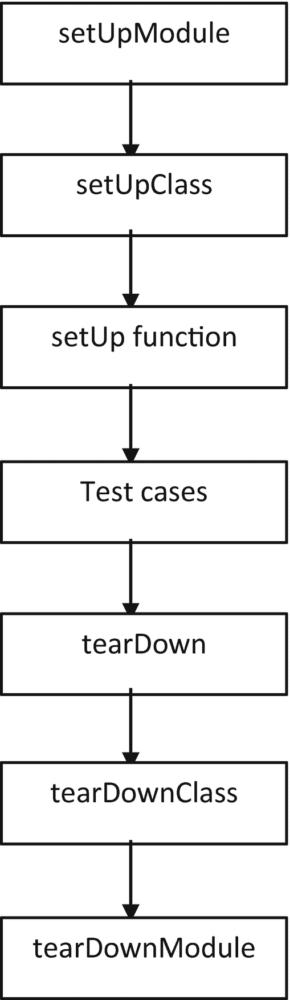

# 十二、使用测试用例和截图

Selenium 上的 Python 程序测试 web 应用或 web 页面上的指定元素，称为*测试用例*。Selenium with Python 是测试 web 应用或网页的流行选择，因为实现它的学习曲线较低。Python 是一种易于理解的语言。测试要求您为 web 应用生成简单、可理解的测试报告，这可以通过 Python 和 Selenium 的结合来完成。

本章讨论了用于截图的各种测试用例。在前一章中，您学习了 POM 如何创建测试用例。

现在让我们研究一下 Selenium 中 Python 支持的最广泛使用的框架。还讨论了作为网页测试用例的框架实现。首先，让我们快速回顾一下测试结果。

## 测试结果

测试代码有三种结果:通过、失败或错误。这些结果定义了需要在测试用例中提供的变更。下面提供了一个快速描述。

### 通过/合格

通过/通过是开发人员通常期望的结果。这意味着应用在功能和客户满意度方面是理想的，没有错误。这是通过严格测试网页或应用来实现的。当测试通过时，应用不需要任何更改或错误修复。

### 失败

当相应的 web 元素或其行为不满足测试条件时，测试失败。当测试用例失败时，系统会引发 AssertionError 异常。向开发人员说明此错误，以便进行必要的更改，这些更改也是经过测试的。

### 错误

引发异常时会发生错误。该错误可能是由逻辑、语法或语义引起的，可以通过引发的异常进行跟踪。此异常不是 AssertionError。

现在让我们看几个测试案例，在这些案例中，使用多种方法实现了相同的目标。

## 测试用例 1:截图

这个测试用例获取网页的图片(即屏幕截图)。通过指定高度和宽度来确定屏幕截图的大小。这对于 bug 分析报告、查看测试用例流程以及恢复失败的测试用例非常有用。

有三种方法可以用来在 Selenium 中捕获屏幕图像。每一个都在下面描述。

### save_screenshot('文件名称')

在这种方法中，屏幕截图是在测试用例的执行过程中拍摄的。该屏幕截图的扩展名为. png。下面是它的 Python 代码。

```py
from selenium import webdriver

new_driver=webdriver.Firefox()
new_driver.get('https://apress.com')

new_driver.save_screenshot('screenshot1.png')

```

### get _ snapshot _ as _ file('文件名称')

这种方法直接将截图保存为图像。png 格式。除了以外的任何其他图像扩展。png 抛出一个错误。下面是它的 Python 代码。

```py
#get_screenshot_as_file()
from selenium import webdriver

driver=webdriver.Firefox()
driver.get('https://apress.com')

driver.get_screenshot_as_file('screenshot2.png')

#Error Occurs when image extension is changed
#driver.get_screenshot_as_file('screenshot2.jpg')

```

### get_screenshot_as_png()

在此方法类型中，屏幕截图以二进制形式捕获，然后转换为图像。保存的图像存储在中。png 格式。下面是它的 Python 代码。

```py
#Get method
from selenium import webdriver
from PIL import Image
from io import BytesIO

driver= webdriver.Firefox(executable_path=r'C:\Users\ADMIN\Desktop\geckodriver.exe')
driver.get('http://apress.com/')

#Logo Image extraction
element=driver.find_element_by_class_name('brand')
location=element.location

#saves logo image as screenshot
size=element.size
png=driver.get_screenshot_as_png()
driver.quit()

#PIL library is used to open image in memory
image=Image.open(BytesIO(png))

#Logo size extraction
left= location['x']
top= location['y']
right= location['x'] + size['width']
bottom= location['y'] + size['height']

#Saving Logo for extracted dimension size
image=image.crop((left, top, right, bottom))
image.save('C:\\Users\\ADMIN\Desktop\\python books\\#Go Lang\\Done\\final\Apress\python testing\\codes\\screenshot3.png')

```

Python 图像库(PIL)用于转换二进制图像。它有 Python 版本。在实现这个函数之前，指定图像的大小。

Note

在 Selenium 上的 Python 中，save_screenshot()和 get_screenshot_as_file()方法只能将图像存储在。png 格式，而 get_screenshot_as_png()方法可以存储多种格式的图像。

现在我们来看看测试框架和 Selenium 实现中使用的最流行的测试框架。

## 测试框架

一个测试用例由一套规则和规章管理，这是由一个框架来完成的。该框架用于测试，因此被称为*测试框架*。测试框架使得测试用例更加有效和健壮。该框架包括处理测试数据、测试标准、测试存储库、页面对象等特性。

几个 Python 框架可以和 Selenium 一起使用。最常用的框架之一是 unittest。接下来描述 unittest 框架，包括它的模块和功能。

### 单元测试框架

unittest 框架是一个 Python 测试框架，它基于 Kent Beck 和 Erich Gamma 开发的 XUnit 框架设计模式。它也被称为 PyUnit。unittest 框架通常用于基于自动化测试用例生成报告。

在这个框架中，测试用例是在小的独立单元中测试的(比如函数、方法、类等等)。)来确定 web 元素或网页测试的正确性。通过将类定义为方法并使用断言函数，这些测试以小块或小单元的形式进行。

在开始编写代码之前，您需要了解 unittest 框架支持的以下组件。

*   一个**测试夹具**执行一个或多个测试用例以及相关的清理动作。创建代理或临时数据库，在服务器上启动一个进程，或者创建新的目录都是文本设备的例子。

*   在**测试用例**模块中，测试小的单个单元。这些单元与要测试的 web 元素相关。unittest 框架包含一个基类和用于创建新测试用例的测试用例。

*   一个**测试套件**集合了多个测试用例。它也可以是测试套件的组合。测试套件的执行与测试用例相同。

*   一个**测试运行器**帮助运行所有的测试用例及其相关的结果。runner 可以与接口集成，比如一个图形、文本或者一个指示测试用例返回值的特殊值。

*   一个**测试报告**是一个测试用例的生成结果或输出(即是否通过或失败)。测试用例的执行时间以一种系统的方式被安排来生成报告。这些细节在给客户的报告中总结。

## 测试用例 2:单元测试

首先，需要使用 Python 中的 pip 下载 unittest 库。unittest 框架代码有几个实例可以合并到一个测试用例中。

### 设置( )

`setUp()`方法初始化运行测试用例所需的设置。它在测试用例的开始运行。测试用例的数量决定了要执行的`setUp()`方法。例如，如果有十个测试用例，那么`setUp()`方法在任何测试用例之前被执行十次。此方法配置测试用例的初始阶段，例如设置 web 驱动程序及其相关组件。

```py
import unittest
from selenium import webdriver

class Test(unittest.TestCase):

        #setUp Class method
        def setUp(self):
                self.driver=webdriver.Firefox(executable_path=r'C:\Users\ADMIN\Desktop\geckodriver.exe')

                print("Firefox Browser Opened")

        def test_apress(self):
                self.driver.get("https://apress.com")
                print("Apress")

        def test_google(self):
                self.driver.get("https://google.com")
                print("Google")

        def test_facebook(self):
                self.driver.get("https://facebook.com")
                print("Facebook")

        def test_twitter(self):
                self.driver.get("https://twitter.com")
                print("Twitter")

if __name__ =="__main__":
        unittest.main()

```

当同一个 web 应用或 web 页面有多个测试用例时,`setUp()`方法是有益的。这减少了测试前所需的初始配置或设置。

### 拆卸( )

在每个测试用例执行之后，执行`tearDown()`方法。它是 unittest 中只陈述一次的类方法。它为 unittest 程序中可用的每个测试用例执行。

```py
import unittest
from selenium import webdriver

class Test(unittest.TestCase):

        def setUp(self):
                self.driver=webdriver.Firefox(executable_path=r'C:\Users\ADMIN\Desktop\geckodriver.exe')
                print("Opened Firefox Browser")

        def test_apress(self):
                self.driver.get("https://apress.com")
                print("Apress")

        def tearDown(self):
                self.driver.quit()
                print("Quit Browser")

if __name__ =="__main__":
        unittest.main()

```

这个方法包含了一些动作，比如关闭 web 驱动或者浏览器，注销或者任何与测试用例相关的关闭动作。无论测试用例结果如何(即通过/失败)，一旦执行了`setUp()`方法，就执行`tearDown()`方法。

Note

在 unittest 的同一个测试类中，一个测试用例可以同时包含 setUp()和 tearDown()方法。

### setUpClass

`setUpClass`是 unittest 中的一个类，它在任何`setUp`或`tearDown`函数或同一测试类中出现的任何测试用例之前执行。包含此方法的类只执行它一次，并且它作为单个参数传递。`setUpClass`有一个名为`@classmethod`的类，在`setUp()`函数之前已经声明。

```py
import unittest
from selenium import webdriver

#Class Setup
class Test(unittest.TestCase):

        @classmethod
        def setUpClass(suc):
                suc.driver=webdriver.Firefox(executable_path=r'C:\Users\ADMIN\Desktop\geckodriver.exe')
                print("Open Browser using setUpClass method")

        def test_apress(self):
                self.driver.get("https://apress.com")
                print("Open Apress Site")

if __name__ =="__main__":
        unittest.main()

```

在`setUpClass`中`setUp()`功能不是强制的。如果这个类执行失败，它会抛出一个异常，并且其中的测试用例`or tearDown()`函数不会执行。

### tearDownClass

在`setUpClass`之后执行`tearDownClass`类，所有相关的测试用例出现在同一个测试类中。这个类在退出程序之前执行一次。

```py
import unittest
from selenium import webdriver

#Class Setup
class Test(unittest.TestCase):

        @classmethod
        def setUpClass(suc):
                suc.driver=webdriver.Firefox(executable_path=r'C:\Users\ADMIN\Desktop\geckodriver.exe')
        print("Open Browser using setUpClass method")

        def test_apress(self):
                self.driver.get("https://apress.com")
                print("Open Apress Site")

        @classmethod
        def tearDownClass(suc):
                suc.driver.quit()
                print("Close Browser using tearDownClass method")

if __name__ =="__main__":
        unittest.main()

```

不管`setUpClass`方法如何，都可以用这个方法。

下面的简单测试案例展示了所有类和函数的一个例子。

### setUpModuleandtearDownModule

在 Selenium 上有两个可用的 Python 模块。`setUpModule`的执行发生在开始，`teardownModule`的执行发生在结束。这两个模块是最近添加到 unittest 框架中的。

```py
import unittest
from selenium import webdriver

class Test(unittest.TestCase):
        #Class setup
        @classmethod
        def setUpClass(suc):
                suc.driver=webdriver.Firefox(executable_path=r'C:\Users\ADMIN\Desktop\geckodriver.exe')
                print("Open Browser using setUpClass method")

        def setUp(self):
                print("Execute setUp")

        #test case
        def test_apress(self):
                self.driver.get("https://apress.com")
                print("Executing Test Case: Open Apress Site")

        def tearDown(self):
                print("Execute tearDown")

        @classmethod
        def tearDownClass(suc):
                suc.driver.quit()
                print("Close Browser using tearDownClass method")

        #Two Modules
        def setUpModule():
                print("Executes setUpModule")

        def tearDownModule():
                print("Executes tearDownModule")

if __name__ =="__main__":
        unittest.main()

```

在程序中，首先打印`setUpModule()`中的打印语句，然后打印`setUpClass()`、`setUp()`、`test_apress()`、`tearDown()`、`tearDownClass()`，最后打印`tearDownModule()`。

## 测试执行顺序

由于定义了不同的模块、类、函数和测试用例，所以了解 unittest 框架中的执行顺序非常重要。执行顺序是由模块、类和函数的优先级决定的，它们的定义与程序中的位置无关。一个测试用例的整个执行流程如图 [12-1](#Fig1) 所示。



图 12-1

单元测试框架中的执行顺序

在 unittest 中，测试用例的执行顺序默认为字母顺序。为了区分优先级，您可以为所有的测试用例定义相同的名称，然后为每个用例定义一个顺序号；例如，test1、test2、test3、test4 等等。

Note

如果有多个测试用例，那么它们将按字母顺序执行。

## 测试工具比较

许多测试工具可以与 Selenium 上的 Python 一起使用，以生成报告和测试 web 应用。其中一些在表 [12-1](#Tab1) 中有所介绍。

表 12-1

Python 中的测试工具

<colgroup><col class="tcol1 align-left"> <col class="tcol2 align-left"> <col class="tcol3 align-left"> <col class="tcol4 align-left"></colgroup> 
| 

测试工具

 | 

种类

 | 

许可证类型

 | 

描述

 |
| --- | --- | --- | --- |
| **DocTest** | 单元测试 | 免费软件 | 基于 Python 解释器的输出生成测试用例 |
| **Nose2** | 单元测试 | 免费软件 | nose 测试框架的继承者扩展了鼻子框架以外的功能；非常容易理解 |
| **Pytest** | 单元测试 | 免费软件 | 一个初学者友好的工具，支持与 unittest 和 nose 的集成易于构建的小型测试可以扩展到复杂的功能测试 |
| **机器人** | 验收测试 | 免费软件 | 验收测试驱动开发(ATDD)和机器人过程自动化(RPA)的通用框架提供简单的语法；易于与其他框架一起实现 |
| **作证** | 单元测试 | 免费软件 | 基于 Python 的测试插件，提供更多与报告相关的功能和模块提供了 unittest 和 nose 之外的功能 |

## 摘要

这最后一章解释了使用不同方法得到相同结果的测试用例。unitttest 框架也被 Google 用来自动化测试用例。该框架详细阐述了基本术语和模块。每个模块都有一个与之相关的测试示例。当所有的模块被组合在一个测试用例中时，每个模块执行的顺序形成了一个流动的模式。我们用 Python Selenium 支持的不同测试工具的比较结束了这一章。